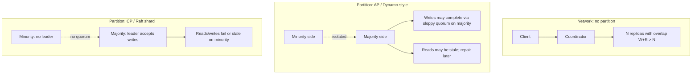
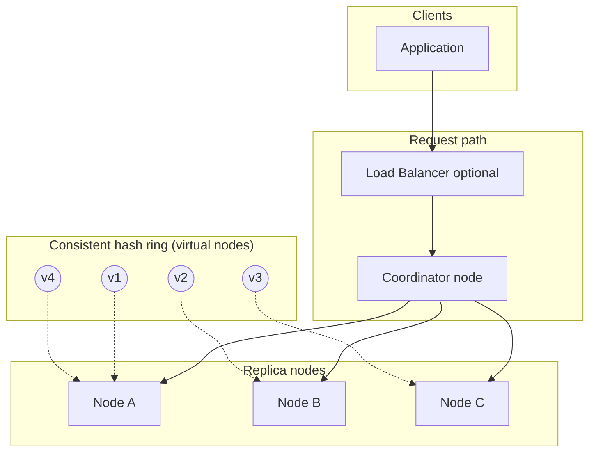
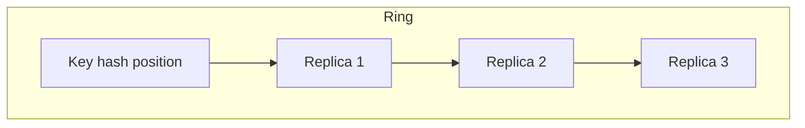
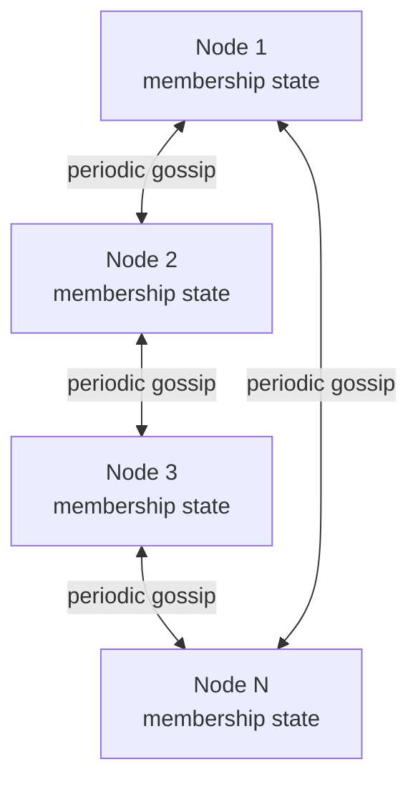
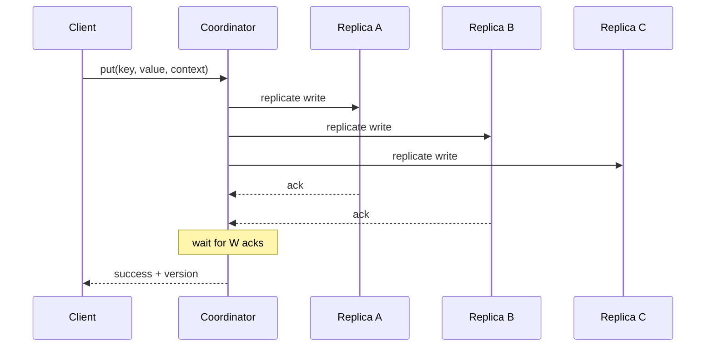
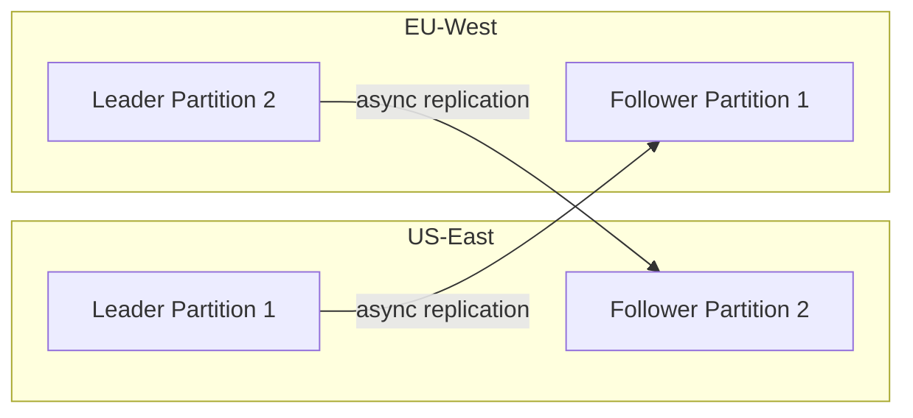

# Distributed Key-Value Store

---

## What We're Building

A **distributed key-value store** shards data across many nodes, replicates for durability, and favors **high availability** and **partition tolerance** over strong global consistency (the **Dynamo** design point on the CAP spectrum). Interview answers often align with **Amazon Dynamo**, **Apache Cassandra**, **Riak**, or **Voldemort**: consistent hashing for placement, quorum reads/writes, eventual convergence, and repair paths.

| Capability | Why it matters |
|------------|----------------|
| **Horizontal scale** | Add nodes for capacity and throughput without a central bottleneck |
| **Fault tolerance** | Survive node, rack, or AZ failures via replication and rerouting |
| **Predictable latency** | Bounded fan-out per operation; avoid global locks |
| **Operational simplicity** | Symmetric nodes; membership via gossip; no single master for all data |

!!! note
    Clarify in the interview whether the interviewer wants **strong consistency** (harder: consensus per key, smaller partitions) or **Dynamo-style eventual consistency** (this guide’s default). Many “design a KV store” prompts expect the latter plus explicit trade-offs.

**Real-world:** Dynamo powers high-scale internal Amazon services; Cassandra and compatible systems power **Netflix**, **Apple**, **Discord**, and many analytics and metadata workloads. The patterns below are standard vocabulary for senior system design interviews.

---

## Step 1: Requirements

### Functional Requirements

| Requirement | Priority | Notes |
|-------------|----------|-------|
| **get(key)** | Must have | Return value and metadata (version); tolerate stale reads if NFR allows |
| **put(key, value)** | Must have | Persist across failures per replication policy |
| **delete(key)** | Should have | Tombstones for eventual deletion in replicated systems |
| **list_keys (optional)** | Nice to have | Often omitted at scale; use secondary indexes or separate catalog |
| **Administrative** | Must have | Add/remove nodes; health; backup/restore hooks |

### Non-Functional Requirements

| Requirement | Target (illustrative) | Rationale |
|-------------|------------------------|-----------|
| **Availability** | 99.95%+ | No single point of failure; tolerate f failures with replication factor |
| **Latency (p99)** | Single-digit ms for local quorum | Avoid cross-region round trips on hot path unless required |
| **Durability** | Configurable R/W | Disk + replication; fsync policy affects latency |
| **Consistency** | Eventual (per-key) | Tunable via R, W, N; optional linearizable reads are expensive |
| **Scale** | Billions of keys, PB-scale | Sharding + LSM-friendly storage engines |
| **Partition tolerance** | Required | Network splits must not halt the whole system |

!!! warning
    **Linearizable** reads/writes across arbitrary keys usually require **consensus** (Raft/Paxos) per shard or a centralized transaction layer. Say so explicitly if the interviewer asks for “strong consistency for all operations.”

### API Design

REST-style (illustrative); production systems often use **binary protocols** (Thrift, Protobuf, custom TCP).

| Operation | Method | Path | Request body | Response |
|-----------|--------|------|----------------|----------|
| Read | GET | `/v1/keys/{key}` | — | `200` + JSON `{ "value": "...", "version": {...} }` |
| Write | PUT | `/v1/keys/{key}` | `{ "value": "...", "context": {...} }` | `204` or `200` + version |
| Delete | DELETE | `/v1/keys/{key}` | Optional context | `204` |

**Conditional writes (optional):** `If-Match: version` for compare-and-swap semantics on top of vector clocks or monotonic counters.

!!! tip
    Mention **idempotency keys** on writes for retries: the coordinator can detect duplicate client attempts and avoid double application when combined with versioning.

### Technology Selection & Tradeoffs

Interviewers expect you to name **alternatives**, compare them in a table, and close with a **defensible default** for a Dynamo-style KV store.

#### Storage engine

| Engine | Structure | Write path | Read path | Best for | Main downside |
|--------|-----------|------------|-----------|----------|---------------|
| **LSM-tree** (log-structured merge) | Levels of immutable SSTables + memtable | Sequential writes, batched compaction | May touch several SSTables; Bloom filters help | **High ingest**, skewed updates, disk-bound workloads | Compaction spikes; **write amplification** |
| **B-tree / B+tree** (page-oriented) | Mutable pages on disk | In-place updates; random I/O on hot keys | Predictable single-tree lookups | **Read-heavy**, transactional point lookups | **Write amplification** on updates; harder to scale sequential write throughput |
| **Hash index** | Hash table → offset (often + log/WAL) | Very fast O(1) if in memory or fixed buckets | Excellent for key equality | **Embedded caches**, simple durability with append log | **No range scans**; resizing/rehashing pain at scale |

**Why it matters:** A distributed KV store is usually **write-optimized** and **range-scanned for repair/compaction** — LSM + SSTable is the industry default (Cassandra, RocksDB, many Dynamo-like systems).

#### Replication

| Model | Coordination | Writes during partition | Conflicts | Typical CAP lean |
|-------|--------------|-------------------------|-----------|------------------|
| **Single-leader** | One leader per shard; followers apply log | Minority partition: writes fail or stall | Serialized by leader | **CP** along shard (linearizable per shard if sync replication) |
| **Multi-leader** | Multiple primaries (e.g., per region) | Regions stay available; async merge | **Concurrent writes** need CRDT/LWW/vector clocks | **AP** across regions; complexity in merge |
| **Leaderless / quorum** | No single leader; client/coordinator talks to **N** replicas | **Sloppy quorum** + hinted handoff keeps availability | Version vectors / read repair | **AP** (Dynamo model); tunable **R, W, N** |

#### Partitioning

| Strategy | Placement rule | Add/remove node | Hot spots | Interview note |
|----------|----------------|------------------|-----------|----------------|
| **Consistent hashing** (+ vnodes) | Key → ring position → walk ring for replicas | **Minimal** key movement between neighbors | Mitigated by many virtual nodes | Default answer for **Dynamo-style** |
| **Range-based** | Key ranges assigned to shards (often by sorted key) | **Splits/merges** of ranges; may need rebalancing | Hot **key ranges** possible | Good for **range queries** and ordered scans |
| **Hash-mod** `hash(k) % N` | Simple bucket | **Full resharding** when **N** changes | Uneven if hash poor | Fine for **fixed** cluster sizes; weak for elastic clusters |

#### Consistency model

| Model | What the client sees | Mechanism | Cost / caveat |
|-------|------------------------|------------|---------------|
| **Strong / linearizable** | Every read sees latest completed write (global order per object) | Consensus (Raft/Paxos), single leader, or careful fencing | **Latency**, availability hit on partition (minority cannot write) |
| **Eventual** | Replicas converge if quiescent; reads may be stale | Async replication, anti-entropy, repair | **Low latency**; apps must tolerate staleness |
| **Causal** | If B causally follows A, no replica shows B without A | Causal chains, vector clocks, sometimes explicit dep tracking | Stronger than eventual; **more metadata** |
| **Session / read-your-writes** | Same client sees its own writes | Sticky routing, coordinator cache, or R>W tuning | Middle ground; not full linearizability across clients |

#### Compaction strategy (LSM)

| Strategy | Idea | Write amp | Read amp | Space / disk | When to prefer |
|----------|------|-----------|----------|--------------|----------------|
| **Leveled** | SSTables in levels; L0 → L1 → …; merge into next level | **Higher** (more merging) | **Lower** (fewer overlapping files per level) | More predictable disk use | **Latency-sensitive reads**, mixed OLTP-like KV |
| **Size-tiered** | Similar-sized SSTables merged into larger tiers | **Lower** | **Higher** (more files to check) | Spikes during big merges | **Write-heavy**, analytics, log-like ingestion |
| **FIFO** | Drop oldest files first (often with TTL) | Lowest | Varies | Bounded retention | **Time-series / TTL-heavy**; not general-purpose KV |

**Our choice (default for this guide):** **LSM-tree** storage with **SSTables**, **leaderless quorum replication** with **consistent hashing** and **virtual nodes**, **eventual** consistency with **vector clocks** (and optional **session** guarantees where the product needs read-your-writes), and **leveled** or **hybrid** compaction when **p99 read latency** is the primary SLO — switching evidence toward **size-tiered** only after metrics show write/compaction pressure dominating. This stack optimizes for **elastic scale**, **high availability on partitions**, and **predictable horizontal add/remove**, which is what most “design a KV store” interviews target.

### CAP Theorem Analysis

**CAP** (Brewer): in the face of **network partition**, you cannot simultaneously provide **linearizable consistency (C)** and **full availability (A)** for **every** operation; systems **pick trade-offs** and often offer **tunable** behavior (e.g., **W, R, N**).

!!! note
    Pedantic interview nuance: **CAP is not a 3-way “pick two forever”** menu for all operations. It describes **behavior during a partition**. Many production systems are **AP** with **best-effort C** when the network is healthy, and **degrade** gracefully when partitioned.

#### What happens during a partition?

| Operation | Dynamo-style (AP, quorum) | Raft-based shard (CP) |
|-----------|---------------------------|-------------------------|
| **Read** | Coordinator reads **R** replicas; may return **stale** value if minority has newer data; **read repair** heals later | Leader (or lease holder) serves **consistent** reads; **split-brain** avoided by majority |
| **Write** | If **W** live replicas ack (possibly **sloppy quorum**), write succeeds; concurrent writes → **siblings** | **Only majority partition** elects leader and accepts writes; **minority rejects** writes |

**Dynamo-style (AP):** Favors **always answering** when enough replicas are reachable — possibly with **conflicting versions** and **eventual** convergence via repair and merge.

**Raft-based (CP):** Favors **single-copy serializability** per shard — **partitions** cause **unavailability** for writes (and sometimes reads) on the **minority** side.

#### Tunable consistency: **W + R > N** as a spectrum

For replication factor **N**, quorum sizes **W** (write) and **R** (read) trade latency vs overlap:

| Region | Typical settings | Effect |
|--------|------------------|--------|
| **Stronger overlap** | High **W**, high **R** (e.g., W=R=3, N=3) | More replicas must agree; **higher latency**, lower staleness risk (still not full linearizability with concurrent writers) |
| **Balanced** | W=2, R=2, N=3 | Classic “quorum” compromise |
| **Fast writes** | W=1, R=N | Durability risk unless repair is excellent; reads see more replicas |
| **Fast reads** | W=N, R=1 | Writes durable everywhere before ack; reads can still be **stale** on that one replica until repair |

**W + R > N** ensures **overlapping** replica sets so a **completed** write is likely visible to a **subsequent** quorum read in the **absence of concurrent writes** — but it does **not** replace **consensus** for arbitrary **linearizability**.



**Interview sound bite:** *“We’re **AP** at the cluster level: we keep serving with quorum and sloppy quorum, accept **version conflicts**, and use **anti-entropy**. If the product needed **CP**, I’d put **Raft per shard** or **strong leader** and accept **write unavailability** on minority partitions.”*

### SLA and SLO Definitions

**SLA** = contract with users (often **monthly** availability); **SLO** = internal target (stricter than marketing SLA); **SLI** = what we measure. Below are **illustrative** targets for a **single-region, multi-AZ** Dynamo-style KV — tune in the interview.

| Category | SLI | SLO (example) | Measurement window | Rationale |
|----------|-----|---------------|--------------------|-----------|
| **Read latency** | p99 `get` latency (coordinator → response) | **< 5 ms** p99 local quorum | Rolling 30 days | Matches SSD + LAN-ish replica fan-out; stricter than p50 |
| **Write latency** | p99 `put` latency | **< 10 ms** p99 for W=2, N=3 | Rolling 30 days | Extra round trips for quorum acks |
| **Availability** | Successful reads & writes / attempted (excluding client errors) | **99.95%** monthly | Per month | Common enterprise bar; multi-AZ covers many failures |
| **Durability** | Data loss events / objects | **≤ 1 × 10⁻⁹** annual object risk (design + replication + backup) | Yearly review | Justify via **N**, cross-AZ, backups, **repair** SLIs |
| **Consistency (staleness)** | Time or version lag between **latest write** and **read** seen by a different client | **< 250 ms** **staleness p99** under steady state; **eventual** bound under partition | Rolling 7 days | Exposes **async path**; tie to **repair** and **R,W** |

!!! tip
    Separate **latency SLO** (user-facing) from **internal** SLIs: compaction backlog, gossip convergence, disk utilization — those **burn** error budget indirectly via latency spikes.

#### Error budget policy

| Element | Policy |
|---------|--------|
| **Budget** | If monthly availability target is **99.95%**, allowed **unavailability ≈ 21.6 min/month**. Burn rate alerts: **2% of budget in 1 hour** → page; **5% in 6 hours** → ticket. |
| **Latency budget** | Treat **p99 read > 10 ms** for **5 min** as **budget burn** for the latency objective; freeze **non-critical releases** if burn sustained **> 1 day**. |
| **Durability** | **Zero tolerance** for acknowledged write loss: any incident → **postmortem** + replication/repair rule review; durability is not “error budget” in the same way as latency — use **SLO + hard gates**. |
| **Partitions** | During **confirmed partition**, **availability** SLO may be met while **staleness** SLO is waived — document **user-visible behavior** (e.g., “reads may be stale”) in the SLA. |

**Interview sound bite:** *“SLOs drive **R, W, N**, **replica placement**, and **repair** priority — if staleness SLO is tight, we invest in **read repair** and higher **R**; if write p99 matters most, we cap **W** and monitor compaction.”*

### Data Model

A production KV store is not only `map<string, bytes>` — it carries **metadata for replication, ordering, and deletion**.

#### Key

| Aspect | Convention |
|--------|------------|
| **Format** | Opaque **byte string** (UTF-8 string in APIs); max length enforced (e.g., **1 KB**) to bound hashing and storage overhead |
| **Partition key** | Entire key (or a **hashed prefix**) feeds **consistent hashing**; optional **composite** keys `tenant#id` for **range** colocation in range-partitioned systems |
| **Sorting** | In pure Dynamo-style hashing, **no global order**; range scans require **range partitioning** or a **secondary index** |

#### Value

| Aspect | Convention |
|--------|------------|
| **Blob** | Opaque bytes; max size cap (e.g., **1 MB** small-object store); larger objects → **chunking** or **blob store** + pointer in KV |
| **Serialization** | Application-defined; store may offer **compression** (per-column family / table) |

#### Metadata (per version)

| Field | Role |
|-------|------|
| **Vector clock** (or **version vector**) | Captures **causal** order across replicas; detects **concurrent** updates → **siblings** |
| **Timestamps** | **Hybrid logical clock** or wall time for **LWW** policies and **GC** of old versions (with caution on skew) |
| **Tombstone** | Deletion marker with **clock/version** so deletes **win** over older puts in repair; must be **compacted** with retention rules or **ghost reads** persist |
| **TTL** (optional) | Expiry time for ephemeral keys; implemented via **compaction** or **background** purge |

#### Internal on-disk format (SSTable-oriented)

| Piece | Content |
|-------|---------|
| **Data blocks** | Sorted **key-value** entries (often with prefix compression); each block **compressed** |
| **Index blocks** | Sparse **index** (first key per block → offset) for binary search without full scan |
| **Bloom filter** (per SSTable or per block) | Quick **“key absent”** checks to skip I/O |
| **Statistics** | Min/max key, entry count, for **partition** pruning |
| **Footer / metadata** | Checksums, codec ids, pointers to index/filter |

!!! note
    **WAL + memtable** hold the newest writes; **flush** produces a new **immutable SSTable**. **Compaction** merges SSTables and drops superseded values and **tombstones** when safe — tuning **compaction** balances **read amplification**, **write amplification**, and **space**.

**Interview sound bite:** *“The **value** is opaque; **versioning** lives in metadata so replicas can **merge** and **repair** without a global lock. **Tombstones** are first-class so deletes replicate correctly under eventual consistency.”*

---

## Step 2: Back-of-the-Envelope Estimation

**Assumptions (adjust live in interview):**

```
- Peak: 500K writes/sec, 2M reads/sec (combined 2.5M ops/sec)
- Average key: 64 B, average value: 1 KB
- Replication factor N = 3
- Disk usable per node: 8 TB after OS/reserved (16 TB raw SSD class)
- Write amplification (LSM): ~3x average (compaction, WAL — highly workload-dependent)
```

**Payload bandwidth (order of magnitude):**

```
Average record (key + value + small metadata): ~1.1 KB
Read path: 2e6 * 1.1 KB ≈ 2.2 GB/s aggregate
Write path: 5e5 * 1.1 KB ≈ 550 MB/s aggregate
```

**Storage (logical user bytes, single copy):**

```
If growth is 50 TB/day logical:
  With N=3 replicas on disk: 150 TB/day physical if three full copies
  Per month: ~4.5 PB raw (before compression — many systems use compression in SSTables)
```

**Node count (capacity-only rough cut):**

```
8 TB usable per node → 50 TB/day needs steady-state planning across compaction;
purely for static 500 TB logical with N=3: 500 * 3 / 8 ≈ 188 nodes minimum (plus overhead for temporary compaction space)
```

**Interview sound bite:** *“I’d validate with ops: LSM compaction spikes need headroom; I’d size disks for peak compaction, not just steady-state live data.”*

---

## Step 3: High-Level Design

### Dynamo-Style Architecture

- **Symmetric nodes:** Every node runs storage, gossip, request routing (or a thin coordinator role).
- **Partitioning:** Keys mapped to **virtual nodes** on a **consistent hash ring**; each physical node owns many virtual nodes to balance load.
- **Replication:** Each key’s coordinator picks **N** successors on the ring as replica hosts (preference list).
- **Quorum:** Reads and writes contact **R** and **W** replicas respectively, with **W + R > N** for strong-ish overlap (still not linearizable without additional rules).
- **Failure handling:** **Sloppy quorum** + **hinted handoff** + **read repair** + **anti-entropy (Merkle trees)**.



### Replication on the Ring



The **preference list** is the first **N** distinct physical nodes encountered walking the ring from the key’s position (with virtual node indirection to avoid hotspots).

### Gossip and Membership (Overview)



!!! note
    **Seed nodes** bootstrap the first connections; afterward gossip propagates join/leave and failure suspicion. Use **Phi accrual** or similar to avoid flapping on slow networks.

---

## Step 4: Deep Dive

### 4.1 Data Partitioning (Consistent Hashing)

**Problem:** Modulo `hash(key) % num_nodes` reshuffles most keys when **N** changes.

**Consistent hashing:** Map keys and nodes to a ring (often 0..2^128-1). Each key is assigned to the first node **clockwise** from its hash. Adding a node only moves keys between **neighbors** on the ring.

**Virtual nodes:** Each physical machine hosts **many** virtual positions on the ring so that if one machine is “heavy,” it still receives a fair share of intervals; recovery after failure redistributes smaller slices.

| Approach | Pros | Cons |
|----------|------|------|
| Modulo partitioning | Simple | Massive resharding on node count change |
| Consistent hashing | Minimal movement on add/remove | Requires ring metadata; hot spots if few vnodes |
| Virtual nodes on ring | Load balance + smoother recovery | More metadata per physical node |

---

### 4.2 Replication Strategy

- **N** replicas per key (commonly 3).
- Replicas placed on **distinct** physical nodes (and ideally racks/AZs).
- **Coordinator:** Usually the first healthy node in the preference list for that key (or any node that receives the client request can forward as coordinator).

!!! warning
    Storing **all** replicas in one AZ gives false comfort: correlated failure domains. Interviewers reward mentioning **rack/AZ awareness** in the preference list.

---

### 4.3 Consistency and Quorum (W + R > N)

Parameters:

- **N:** Replication factor (number of replica hosts in the durable set).
- **W:** Write quorum — coordinator waits for **W** successful acks before responding (configurable).
- **R:** Read quorum — coordinator reads from **R** replicas and reconciles versions.

**Rule of thumb:** **W + R > N** guarantees read/write sets overlap so at least one node has seen the latest completed write in many failure-free scenarios. This does **not** imply linearizability in the presence of concurrent writes or network partitions without extra coordination.

| Config | Behavior sketch |
|--------|-----------------|
| W=N, R=1 | Durable writes; reads may be stale (need repair/version merge) |
| W=1, R=N | Fast writes; slow reads; last writer visible if single writer path |
| W=R=2, N=3 | Balanced; overlap for many staleness scenarios |

!!! tip
    State **SLA vs cost**: higher **W** increases write latency; higher **R** increases read latency.

---

### 4.4 Conflict Resolution (Vector Clocks, LWW)

**Concurrent writes** to the same key can produce sibling versions. Strategies:

| Strategy | Idea | Trade-off |
|----------|------|-----------|
| **Vector clocks** | Per-replica counters; partial order of causality | Detect true concurrency; may expose **siblings** to app |
| **Last-write-wins (LWW)** | Timestamp + clock trust | Simple; **bad** if clocks skew |
| **Application merge** | Return siblings to client; CRDT or domain merge | Correct semantics; more client complexity |

**Vector clock (concept):** Map `replica_id -> counter`. On send/receive, nodes increment and merge by taking component-wise max. If neither vector dominates the other, events are **concurrent**.

---

### 4.5 Failure Detection (Gossip Protocol)

- Each node maintains a **membership table** (heartbeats, incarnation numbers, address, status).
- On a timer, pick random peers and exchange digests; request full state on mismatch.
- **Failure detector:** Mark node suspect, then confirm via quorum or lease if using hybrid models.

Properties: **Eventual** convergence; **O(log N)** rounds typical for epidemic spread; tunable load via fanout and interval.

---

### 4.6 Storage Engine (LSM Tree + SSTable)

**Log-Structured Merge (LSM)** trees batch writes:

1. **Write** goes to a **WAL** (durability), then a **memtable** (in-memory sorted structure).
2. When memtable fills, flush to immutable **SSTable** files on disk.
3. **Compaction** merges SSTables to remove duplicates/tombstones and bound read amplification.

| Component | Role |
|-----------|------|
| WAL | Recover memtable after crash |
| Memtable | Fast writes, sorted order |
| SSTable | Immutable sorted string tables; block indexes, bloom filters |
| Compaction | Size-tiered or leveled; trades write vs read amplification |

!!! note
    Interview bonus: **Bloom filters** in SSTables reduce disk I/O for negative lookups.

---

### 4.7 Merkle Trees for Anti-Entropy

- Build a **hash tree** over key ranges (leaf = hash of sorted keys/values in range).
- Two nodes exchange root hashes; on mismatch, descend to children until divergent ranges are found.
- Efficient for finding **what** to sync without full table scans.

Used for background **repair** when gossip or timeouts suggest divergence.

---

### 4.8 Read/Write Path

**Write path:**



**Read path:**

```mermaid
sequenceDiagram
  participant Client
  participant Coord as Coordinator
  participant R1 as Replica A
  participant R2 as Replica B
  participant R3 as Replica C
  Client->>Coord: get(key)
  Coord->>R1: read
  Coord->>R2: read
  Note over Coord: wait for R responses
  R1-->>Coord: value v1
  R2-->>Coord: value v2
  Note over Coord: merge versions; optional read repair
  Coord-->>Client: merged value
```

**Read repair:** If replicas return different versions, the coordinator **writes back** the merged winner to out-of-date replicas (policy-dependent).

**Sloppy quorum:** If the top **N** nodes in the preference list are not all reachable, use **next available** nodes temporarily to meet W/R; **hinted handoff** stores writes meant for a failed node until it returns.

---

## Step 5: Scaling & Production

| Topic | Practice |
|-------|----------|
| **Bootstrap** | Seed nodes; join protocol; validate tokens in production |
| **Decommission** | Drain leadership/coordinator roles; move vnodes; verify replication |
| **Monitoring** | p99 latency, compaction backlog, disk stalls, gossip convergence time |
| **Security** | TLS in transit, encryption at rest, ACLs per keyspace |
| **Multi-region** | Async replication with higher staleness; conflict handling; optional CRR |

!!! warning
    **Clock skew** breaks naive LWW. Use **synchronized time** with bounds, or prefer vector clocks/siblings for correctness-sensitive data.

---

## Interview Tips

- Start with **functional vs consistency** expectations and **CAP** positioning.
- Draw the **ring** and **N, W, R** on the board before deep-diving storage.
- Always mention **failure modes**: permanent loss, network partition, GC pauses on storage nodes.
- Connect **sloppy quorum** to **availability** and **hinted handoff** to **durability** story.

---

## Summary

| Idea | One-liner |
|------|-----------|
| Consistent hashing + vnodes | Scale out with minimal key movement; balance load |
| Quorum | Tunable overlap via W, R, N; not full linearizability alone |
| Vector clocks / LWW | Resolve conflicts; understand clock risk for LWW |
| Gossip | Membership and failure detection without central registry |
| LSM + SSTable | Write-optimized durable storage with compaction |
| Merkle trees | Efficient divergence detection and repair |
| Read repair + hinted handoff | Heal staleness and survive transient failures |

---

## Code: Consistent Hashing (Virtual Nodes)

=== "Python"

    ```python
    import bisect
    import hashlib
    from typing import List, Tuple
    
    class ConsistentHash:
        def __init__(self, nodes: List[str], vnodes: int = 128):
            self.vnodes = vnodes
            self.ring: List[Tuple[int, str]] = []
            for node in nodes:
                for i in range(vnodes):
                    h = self._hash(f"{node}:{i}")
                    self.ring.append((h, node))
            self.ring.sort(key=lambda x: x[0])
    
        def _hash(self, key: str) -> int:
            return int(hashlib.md5(key.encode()).hexdigest(), 16)
    
        def _ring_positions(self) -> List[int]:
            return [p for p, _ in self.ring]
    
        def node_for_key(self, key: str) -> str:
            if not self.ring:
                raise RuntimeError("empty ring")
            h = self._hash(key)
            positions = self._ring_positions()
            idx = bisect.bisect_right(positions, h) % len(positions)
            return self.ring[idx][1]
    ```

=== "Java"

    ```java
    import java.nio.charset.StandardCharsets;
    import java.security.MessageDigest;
    import java.util.ArrayList;
    import java.util.Collections;
    import java.util.List;
    import java.util.TreeMap;
    
    public final class ConsistentHashRing {
        private final TreeMap<Long, String> ring = new TreeMap<>();
    
        public ConsistentHashRing(List<String> nodes, int vnodes) throws Exception {
            for (String n : nodes) {
                for (int i = 0; i < vnodes; i++) {
                    long h = hash(n + ":" + i);
                    ring.put(h, n);
                }
            }
        }
    
        public String nodeForKey(String key) throws Exception {
            if (ring.isEmpty()) throw new IllegalStateException("empty ring");
            long h = hash(key);
            Long ceil = ring.ceilingKey(h);
            if (ceil == null) ceil = ring.firstKey();
            return ring.get(ceil);
        }
    
        private static long hash(String s) throws Exception {
            MessageDigest md = MessageDigest.getInstance("MD5");
            byte[] d = md.digest(s.getBytes(StandardCharsets.UTF_8));
            long v = 0;
            for (int i = 0; i < 8; i++) v = (v << 8) | (d[i] & 0xff);
            return v;
        }
    }
    ```

=== "Go"

    ```go
    package kvhash
    
    import (
    	"crypto/md5"
    	"encoding/binary"
    	"sort"
    )
    
    type Ring struct {
    	nodes []nodeEntry
    }
    
    type nodeEntry struct {
    	pos  uint64
    	host string
    }
    
    func NewRing(physical []string, vnodes int) *Ring {
    	var entries []nodeEntry
    	for _, p := range physical {
    		for i := 0; i < vnodes; i++ {
    			h := hashUint64(p + string(rune('0'+i)))
    			entries = append(entries, nodeEntry{pos: h, host: p})
    		}
    	}
    	sort.Slice(entries, func(i, j int) bool { return entries[i].pos < entries[j].pos })
    	return &Ring{nodes: entries}
    }
    
    func hashUint64(s string) uint64 {
    	sum := md5.Sum([]byte(s))
    	return binary.BigEndian.Uint64(sum[:8])
    }
    
    func (r *Ring) Pick(key string) string {
    	if len(r.nodes) == 0 {
    		return ""
    	}
    	h := hashUint64(key)
    	// binary search first >= h
    	i := sort.Search(len(r.nodes), func(i int) bool { return r.nodes[i].pos >= h })
    	if i == len(r.nodes) {
    		i = 0
    	}
    	return r.nodes[i].host
    }
    ```

---

## Code: Vector Clock

=== "Python"

    ```python
    from typing import Dict, Optional, Tuple
    
    def merge_vc(a: Dict[str, int], b: Dict[str, int]) -> Dict[str, int]:
        keys = set(a) | set(b)
        return {k: max(a.get(k, 0), b.get(k, 0)) for k in keys}
    
    def compare_vc(x: Dict[str, int], y: Dict[str, int]) -> Optional[str]:
        # returns 'before', 'after', 'concurrent', or 'equal'
        x_le = all(x.get(k, 0) <= y.get(k, 0) for k in set(x) | set(y))
        y_le = all(y.get(k, 0) <= x.get(k, 0) for k in set(x) | set(y))
        if x == y:
            return "equal"
        if x_le and not y_le:
            return "before"
        if y_le and not x_le:
            return "after"
        return "concurrent"
    ```

=== "Java"

    ```java
    import java.util.HashMap;
    import java.util.Map;
    
    public final class VectorClocks {
        public static Map<String, Integer> merge(Map<String, Integer> a, Map<String, Integer> b) {
            Map<String, Integer> out = new HashMap<>(a);
            for (Map.Entry<String, Integer> e : b.entrySet()) {
                out.merge(e.getKey(), e.getValue(), Math::max);
            }
            return out;
        }
    
        public static String compare(Map<String, Integer> x, Map<String, Integer> y) {
            boolean xLeY = true, yLeX = true;
            var keys = new java.util.HashSet<String>();
            keys.addAll(x.keySet());
            keys.addAll(y.keySet());
            for (String k : keys) {
                int xv = x.getOrDefault(k, 0);
                int yv = y.getOrDefault(k, 0);
                if (xv > yv) yLeX = false;
                if (yv > xv) xLeY = false;
            }
            if (xLeY && yLeX) return "equal";
            if (xLeY) return "before";
            if (yLeX) return "after";
            return "concurrent";
        }
    }
    ```

=== "Go"

    ```go
    package vc
    
    func Merge(a, b map[string]uint64) map[string]uint64 {
    	out := map[string]uint64{}
    	for k, v := range a {
    		out[k] = v
    	}
    	for k, v := range b {
    		if v > out[k] {
    			out[k] = v
    		}
    	}
    	return out
    }
    
    func Compare(a, b map[string]uint64) string {
    	xLeY, yLeX := true, true
    	keys := map[string]struct{}{}
    	for k := range a {
    		keys[k] = struct{}{}
    	}
    	for k := range b {
    		keys[k] = struct{}{}
    	}
    	for k := range keys {
    		if a[k] > b[k] {
    			yLeX = false
    		}
    		if b[k] > a[k] {
    			xLeY = false
    		}
    	}
    	switch {
    	case xLeY && yLeX:
    		return "equal"
    	case xLeY && !yLeX:
    		return "before"
    	case yLeX && !xLeY:
    		return "after"
    	default:
    		return "concurrent"
    	}
    }
    ```

---

## Code: Put / Get (Coordinator Sketch)

=== "Python"

    ```python
    class Replica:
        def __init__(self):
            self.data = {}
    
        def put(self, key, value, vc):
            self.data[key] = (value, vc)
    
        def get(self, key):
            return self.data.get(key)
    
    class Coordinator:
        def __init__(self, replicas, n, w, r):
            self.replicas = replicas
            self.n, self.w, self.r = n, w, r
    
        def put(self, key, value, merge_vc_fn):
            # pick N replicas from ring (omitted); wait for W acks
            new_vc = {}  # increment self id in real impl
            acks = 0
            for rep in self.replicas[: self.n]:
                rep.put(key, value, new_vc)
                acks += 1
                if acks >= self.w:
                    break
            return True
    
        def get(self, key, merge_vc_fn):
            versions = []
            for rep in self.replicas[: self.r]:
                versions.append(rep.get(key))
            # return max by vector clock or expose siblings
            return versions
    ```

=== "Java"

    ```java
    import java.util.List;
    import java.util.Map;
    
    public class Coordinator {
      public record Val(String data, Map<String, Integer> vc) {}
    
        private final List<Replica> replicas;
        private final int n, w, r;
    
        public Coordinator(List<Replica> replicas, int n, int w, int r) {
            this.replicas = replicas;
            this.n = n;
            this.w = w;
            this.r = r;
        }
    
        public void put(String key, Val value) {
            int acks = 0;
            for (int i = 0; i < Math.min(n, replicas.size()); i++) {
                replicas.get(i).put(key, value);
                if (++acks >= w) break;
            }
        }
    }
    ```

=== "Go"

    ```go
    type Value struct {
    	Val string
    	VC  map[string]uint64
    }
    
    type Store interface {
    	Put(key string, v Value)
    	Get(key string) (Value, bool)
    }
    
    type Coordinator struct {
    	Replicas []Store
    	N, W, R  int
    }
    
    func (c *Coordinator) Put(key string, v Value) {
    	w := 0
    	for i := 0; i < c.N && i < len(c.Replicas); i++ {
    		c.Replicas[i].Put(key, v)
    		w++
    		if w >= c.W {
    			return
    		}
    	}
    }
    ```

---

## Interview Checklist

| Step | Checkpoint |
|------|------------|
| Requirements | Confirm read/write ratio, consistency, durability, multi-region |
| API | Simple get/put; versions; idempotency for retries |
| Capacity | QPS, record size, replication factor, disk headroom for compaction |
| Partitioning | Consistent hashing; virtual nodes; minimal remapping |
| Replication | N, placement across failure domains |
| Quorum | W, R, N; overlap; latency implications |
| Failures | Gossip; sloppy quorum; hinted handoff; permanent loss |
| Storage | WAL, memtable, SSTable, compaction, bloom filters |
| Repair | Read repair; Merkle anti-entropy |
| Ops | Bootstrap, decommission, monitoring |

---

## Sample Interview Dialogue

**Interviewer:** Walk me through how you’d shard data in a large KV store.

**Candidate:** I’d use **consistent hashing** so when we add nodes we only move keys between neighbors, not rehash everything. I’d give each physical machine many **virtual nodes** on the ring so load stays balanced and recovery is smoother. Each key’s hash picks a position; we walk clockwise to find **N** replicas for durability.

**Interviewer:** How do reads and writes stay consistent?

**Candidate:** We configure **quorum**: **W** acks for writes and **R** reads, with **W + R > N** so the sets overlap. That’s not full linearizability if clients do concurrent writes; we’d use **vector clocks** to detect concurrency and either merge in the application or pick a policy like **LWW** if clock skew is acceptable. During reads, we can do **read repair** to push the latest version to lagging replicas.

**Interviewer:** What happens when a replica is down?

**Candidate:** With **sloppy quorum**, we can acknowledge writes using the next healthy nodes outside the strict preference list, and use **hinted handoff** to store writes for the failed node until it returns. Membership and failure suspicion propagate via **gossip** so clients and coordinators eventually agree who is alive.

**Interviewer:** And on disk?

**Candidate:** I’d use an **LSM tree**: append a WAL, buffer in a **memtable**, flush immutable **SSTables**, and run **compaction** to bound read amplification. For replica comparison and repair, **Merkle trees** over key ranges let us find divergences without full scans.

---

## Further Reading (Patterns)

- **Dynamo (2007)** — Amazon's Dynamo paper solved the "always writable" problem for the shopping cart service during peak traffic. It introduced the complete architecture for a leaderless, eventually-consistent key-value store: consistent hashing with virtual nodes for data distribution, vector clocks for conflict detection, sloppy quorums with hinted handoff for availability during partitions, and Merkle trees for anti-entropy repair. This paper directly inspired Cassandra, Riak, and Voldemort, and is the reference architecture for any AP key-value store design.
- **Cassandra storage architecture** — Cassandra combined Dynamo's distributed architecture with Bigtable's storage engine (LSM trees). Understanding its write path (commit log → memtable → SSTable flush) and read path (memtable + Bloom filter → SSTable merge) explains the fundamental read/write amplification trade-off in LSM-based stores. Compaction strategies (size-tiered vs. leveled vs. time-window) directly affect latency predictability and space overhead.
- **Bigtable paper** — Google's Bigtable (2006) introduced the SSTable (Sorted String Table) as an immutable, sorted, compressed on-disk data structure. SSTables enable efficient range scans and are the storage foundation of LevelDB, RocksDB, HBase, and Cassandra. The paper also introduced the tablet server architecture for horizontal scaling, where key ranges are split across servers with automatic rebalancing — the ancestor of modern shard-based key-value stores.

!!! tip
    Practice drawing **one ring**, **one write sequence**, and **one read with repair** under time pressure; that trio covers most follow-up questions.

---

## Staff Engineer (L6) Deep Dive

The sections above cover the standard Dynamo-style KV store design. The sections below elevate the answer to **Staff-level depth**. See the [Staff Engineer Interview Guide](staff_engineer_expectations.md) for the full L6 expectations framework.

### Strong Consistency vs. Eventual Consistency: The Full Trade-off

At L5, candidates say "we use quorum." At L6, you must articulate the gap between quorum and linearizability:

| Property | Quorum (W+R>N) | Linearizable (Raft/Paxos per shard) |
|----------|-----------------|--------------------------------------|
| **Concurrent writes** | Siblings possible; application resolves | Single leader serializes; no conflicts |
| **Partition behavior** | Sloppy quorum allows writes to "wrong" nodes | Leader on minority side rejects writes |
| **Read-after-write** | Not guaranteed if R hits stale replicas | Guaranteed via leader read or read index |
| **Cross-key transactions** | Not supported | Requires 2PC or Spanner-style TrueTime |
| **Latency** | Lower (any N nodes) | Higher (leader round-trip + consensus) |

!!! warning
    **Staff-level nuance:** Google Spanner achieves externally consistent reads using **TrueTime** (GPS + atomic clocks) to bound clock uncertainty. If the interviewer asks "how would you make this strongly consistent?", discuss Spanner's approach: commit-wait ensures that any read at time T sees all commits before T.

### Clock Skew and Ordering

| Approach | Mechanism | Risk |
|----------|-----------|------|
| **Wall clock (NTP)** | System clock with NTP sync | Drift causes LWW anomalies; two writes 50ms apart may be misordered |
| **Hybrid Logical Clock (HLC)** | `max(physical, logical)` with causality tracking | Better than pure physical; still not perfect across partitions |
| **Google TrueTime** | GPS + atomic clocks; returns `[earliest, latest]` interval | Requires specialized hardware; commit-wait adds latency = uncertainty interval |
| **Vector clocks** | Per-replica counters | Detects concurrency but grows with replica count; needs pruning |
| **Lamport timestamps** | Single monotonic counter | Total order but no concurrency detection |

### Multi-Region Replication Strategies

| Strategy | Description | Use Case |
|----------|-------------|----------|
| **Single-leader per partition** | One region owns writes; async replication to followers | Low write contention; acceptable RPO > 0 |
| **Multi-leader (conflict-free)** | Each region has a leader; CRDTs or LWW for merges | Global writes with eventual convergence |
| **Consensus group per partition** | Raft group spans regions; leader elected from any region | Strong consistency globally; high write latency |
| **Geo-partitioning** | Data pinned to a region by policy (e.g., EU data stays in EU) | Compliance (GDPR); reduced cross-region traffic |



### Compaction Strategy Deep Dive

| Strategy | Write Amplification | Read Amplification | Space Amplification |
|----------|--------------------|--------------------|---------------------|
| **Size-tiered (STCS)** | Low (fewer merges) | High (many SSTables to check) | High (temporary during compaction) |
| **Leveled (LCS)** | High (more frequent merges) | Low (bounded SSTables per level) | Low (less temporary space) |
| **Time-window (TWCS)** | Low for time-series | Varies | Best for TTL-heavy workloads |
| **Hybrid** | Tuned per workload | Tuned per workload | Moderate |

!!! tip
    **Staff-level answer:** *"For a mixed read/write workload, I'd start with leveled compaction for predictable read latency. For a write-heavy analytics pipeline, I'd switch to size-tiered to reduce write amplification. I'd monitor compaction backlog as a key SLI and alert if pending bytes exceed 2x the steady-state."*

### Operational Excellence

| SLI | Target | Alert Condition |
|-----|--------|-----------------|
| Read latency (p99, local quorum) | < 5ms | > 10ms sustained for 5 min |
| Write latency (p99, W=2) | < 10ms | > 25ms sustained for 5 min |
| Gossip convergence time | < 30s for membership change | > 60s (possible network partition) |
| Compaction pending bytes | < 2x steady-state | Growing trend over 1 hour |
| Disk utilization | < 70% (headroom for compaction) | > 80% on any node |
| Repair lag (Merkle tree check) | < 24 hours | > 48 hours indicates divergence |

### System Evolution

| Phase | Architecture | Key Migration |
|-------|-------------|---------------|
| **Year 0** | Single-region, 3-node Cassandra cluster | Validate data model under production traffic |
| **Year 1** | Multi-AZ within one region; rack-aware replication | Zero-downtime addition of AZ3 |
| **Year 2** | Multi-region async replication; read-local, write-remote | Dual-write migration with reconciliation job |
| **Year 3** | Geo-partitioned keyspaces; per-tenant isolation | Schema evolution via online migration (ghost tables) |

### Cost Optimization

| Cost Driver | Optimization |
|-------------|-------------|
| **Storage** | Compression in SSTables (LZ4/Zstd); tiered storage (hot SSD, warm HDD, cold object store) |
| **Replication** | N=3 for hot data; N=2 with erasure coding for archival |
| **Compaction CPU** | Off-peak scheduling; dedicated compaction threads; throttling during peak |
| **Cross-region egress** | Batch replication; compress replication streams; avoid replicating cold data |
