# Design a News Feed / Timeline System

---

## What We're Building

A **news feed** (or **timeline**) is the continuously updated stream of posts users see when they open a social app. It aggregates content from accounts they follow (and sometimes recommended content), ranks it for relevance, and delivers it with low latency on web and mobile clients.

**Examples in the wild:**
- **Facebook** — Home feed blends friend posts, Groups, Pages, and ads; ranked by ML with billions of daily active users.
- **Twitter / X** — Reverse-chronological or algorithmic “For You” timeline; very high write and read rates on hot accounts.
- **Instagram** — Photo/video feed with Stories and Reels interleaved; heavy media and CDN usage.
- **LinkedIn** — Professional feed mixing network updates, articles, and job-related content.

### Core Problems This Design Solves

| Problem | Why it matters |
|---------|----------------|
| **Feed generation** | Combine posts from many followees into one ordered list per user |
| **Ranking** | Not everything fits on screen—pick the “best” subset |
| **Scale** | Celebrities have millions of followers; naive fan-out breaks |
| **Consistency vs latency** | Fresh enough posts without blocking reads on global writes |
| **Media** | Images/video need upload, processing, and CDN delivery |

### Real-World Scale (Order-of-Magnitude References)

| Platform | Scale hint | Notes |
|----------|------------|--------|
| **Facebook** | 2B+ monthly active people; feed is one of the largest distributed systems | Heavy ML ranking, hybrid storage |
| **Twitter / X** | Order of **hundreds of millions** of tweets per day (public figures vary by year) | Fan-out and timeline read paths are classic interview topics |
| **Instagram** | Billions of accounts; feed is media-centric | CDN + transcoding critical |

!!! note
    Interview numbers are **approximate**. Cite ranges and explain *how* you’d validate (metrics, load tests) rather than memorizing exact press stats.

### Feed Generation and Ranking Pipeline (Conceptual)

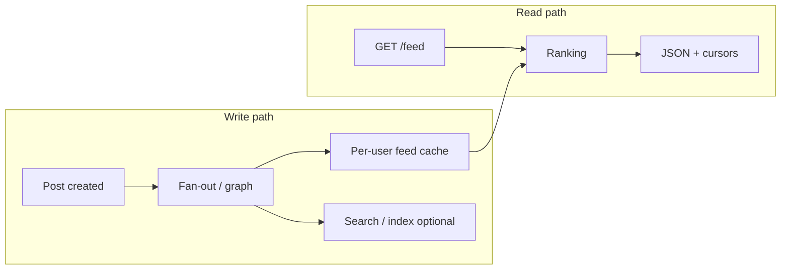

---

## Step 1: Requirements Clarification

### Questions to Ask

| Question | Why it matters |
|----------|----------------|
| **Who sees what?** | Follow graph only vs recommendations/ads |
| **Ordering** | Strict reverse-chronological vs ranked feed |
| **Content types** | Text, images, video, links—different storage and latency |
| **Consistency** | Is slightly stale feed OK? (usually yes) |
| **Celebrity / viral behavior** | Drives fan-out vs read trade-offs |
| **Private accounts / blocking** | Extra filters on read and write paths |
| **Real-time updates** | Polling vs push; WebSocket for live counts? |
| **Regions** | Multi-region users and compliance (data residency) |

### Functional Requirements

| Requirement | Priority | Description |
|-------------|----------|-------------|
| Post creation (text, images, video) | Must have | Users create posts with optional media |
| News feed generation | Must have | Paginated feed for a logged-in user |
| Follow / unfollow | Must have | Maintain social graph |
| Like, comment, share | Must have | Engagement signals + social proof |
| Feed ranking (non-trivial order) | Must have | Beyond pure time if product requires relevance |
| Search / profile timelines | Nice to have | Often separate services |
| Mute / block | Nice to have | Filters feed inputs |
| Notifications for new activity | Nice to have | Often separate notification system |

### Non-Functional Requirements

| Requirement | Target | Rationale |
|-------------|--------|-----------|
| **Feed read latency (p99)** | &lt; 500 ms | Mobile UX; excludes client rendering |
| **Availability** | 99.99% for read path | Degrade gracefully vs hard outage |
| **Consistency** | Eventual consistency OK | Cross-user ordering can be approximate |
| **Durability** | Posts must not be lost | Persist before acknowledging publish |
| **Scale** | Horizontal | Sharding by user_id / tenant |

### API Design

| Method | Path | Purpose |
|--------|------|---------|
| `POST` | `/v1/posts` | Create post (metadata + media descriptors) |
| `GET` | `/v1/feed` | Get ranked feed (`?limit=&cursor=`) |
| `POST` | `/v1/follow` | Follow user `{ "target_user_id": "..." }` |
| `DELETE` | `/v1/follow/{userId}` | Unfollow |
| `GET` | `/v1/users/{id}/posts` | Profile timeline (may share backend) |
| `POST` | `/v1/posts/{id}/like` | Like |
| `POST` | `/v1/media/upload-url` | Pre-signed URL for direct client → object storage |
| `GET` | `/v1/ws` or SSE | Optional real-time updates |

!!! tip
    Use **cursor-based pagination** for feeds (opaque token), not offset, for stable pages under concurrent writes.

### Technology Selection & Tradeoffs

#### Post storage

| Option | Strengths | Weaknesses | When to choose |
|--------|-----------|------------|----------------|
| **PostgreSQL** | ACID transactions; rich indexing (B-tree, GIN for JSONB); mature ecosystem; strong consistency for writes | Vertical scaling limits; sharding requires pgCat/Citus; JOIN-heavy queries can become bottlenecks at extreme scale | Primary post storage at moderate scale (< 1B posts); strong consistency for post creation; metadata queries |
| **MySQL (Vitess-sharded)** | Battle-tested at Twitter/YouTube scale via Vitess; well-understood sharding by `user_id`; strong consistency within shard | Cross-shard queries are expensive; schema migrations across shards are complex | Very large scale with experienced MySQL ops team; Vitess provides horizontal scaling |
| **Cassandra / ScyllaDB** | Linear write scaling; tunable consistency; great for write-heavy workloads (fan-out writes) | No transactions; no JOINs; data modeling is query-driven (denormalization required); eventual consistency by default | Write-heavy fan-out storage; timeline materialization; > 1B posts with high write throughput |
| **DynamoDB** | Managed; single-digit ms latency; auto-scaling; pay-per-request | Expensive at high throughput; 400 KB item limit; limited query flexibility; vendor lock-in | AWS-native stack; predictable access patterns; team prefers managed services |

**Our choice:** **PostgreSQL (Citus-sharded by `user_id`)** for post metadata + **Cassandra** for materialized feed timelines. Rationale:
- Post creation is **transactional** (text + media refs in one operation) — PostgreSQL provides ACID guarantees.
- Feed timelines are **write-heavy** (fan-out) and **read-heavy** (feed loads) — Cassandra's wide-row model (`partition_key=user_id, clustering_key=created_at DESC`) is ideal.
- Separating concerns: **source of truth** (PostgreSQL) vs **materialized view** (Cassandra/Redis).

#### Feed cache

| Option | Strengths | Weaknesses | When to choose |
|--------|-----------|------------|----------------|
| **Redis Sorted Sets** | O(log N) insert; O(log N + M) range query; sub-ms latency; cluster mode for sharding | Memory-bound (~100 bytes per entry × 2K entries × 500M users = ~100 TB RAM at full scale); eviction under pressure | Hot feed cache for active users; cap list length aggressively; rely on DB fallback for cold users |
| **Cassandra wide rows** | Disk-backed; handles full user base without memory pressure; natural TTL support | Higher latency than Redis (~5–20 ms); more complex read path | Persistent feed materialization; all users (not just active); longer retention |
| **Redis + Cassandra hybrid** | Redis for hot users (recent DAU); Cassandra for cold users; best of both | Operational complexity; cache coherence between layers | Production systems at scale; two-tier architecture |

**Our choice:** **Redis Sorted Sets** for active users' feed caches (last 30 days DAU) + **Cassandra** fallback for cold users. Redis entries are `(post_id, score=created_at_ms)` capped at 2K per user.

#### Message queue

| Option | Strengths | Weaknesses | When to choose |
|--------|-----------|------------|----------------|
| **Kafka** | High throughput; durable; replay; exactly-once semantics; partition-based parallelism | Operational overhead; latency floor per batch; overkill for simple fan-out | Fan-out event processing; need replay capability; multiple downstream consumers |
| **SQS** | Managed; no ops; dead-letter queues built-in; scales automatically | No ordering guarantee (standard); limited throughput per FIFO queue; vendor lock-in | AWS-native; simple fan-out; team prefers managed |
| **RabbitMQ** | Low latency; flexible routing; mature; priority queues | Less throughput than Kafka; clustering can be fragile | Low-latency event routing; complex routing patterns |

**Our choice:** **Kafka** partitioned by `author_id` (preserves per-author ordering for fan-out consumers; scales horizontally by adding partitions and consumer instances).

#### CDN and media storage

| Option | Strengths | Weaknesses | When to choose |
|--------|-----------|------------|----------------|
| **S3 + CloudFront** | Durable; lifecycle policies; integrated CDN; pre-signed URLs | Regional latency without multi-region replication; CloudFront cold-start | AWS stack; most common choice |
| **GCS + Cloud CDN** | Similar to S3/CloudFront; strong consistency on reads after write | GCP lock-in | GCP stack |
| **Multi-CDN (Fastly + CloudFront)** | Resilience; failover; geographic optimization | Complexity; cache invalidation across CDNs | Large-scale media-heavy platforms |

**Our choice:** **S3** for durable blob storage + **CloudFront** CDN with content-hash-based cache keys for immutable media.

---

### CAP Theorem Analysis

A news feed system spans multiple data stores, each with different consistency needs:

| Data path | CAP choice | Rationale |
|-----------|------------|-----------|
| **Post creation (PostgreSQL)** | **CP** — Strong consistency | A post must be durably committed before we acknowledge to the user and trigger fan-out. Losing a post is unacceptable. |
| **Social graph (follows)** | **CP** — Strong consistency | Follow/unfollow must be immediately consistent — a race condition could cause a post to fan out to an unfollowed user or miss a new follower. Eventual consistency leads to confusing UX. |
| **Feed cache (Redis)** | **AP** — Availability over consistency | A slightly stale feed is acceptable; an unavailable feed is not. Redis replication is async; during partition, serve from the available replica. |
| **Feed materialization (Cassandra)** | **AP** — Availability over consistency | Cassandra with `LOCAL_QUORUM` reads provides strong-enough consistency within a datacenter while maintaining availability across regions. |
| **Engagement counts (likes, comments)** | **AP** — Eventual consistency | Exact real-time counts are not critical for UX. CRDTs or periodic aggregation provide good-enough accuracy with high availability. |

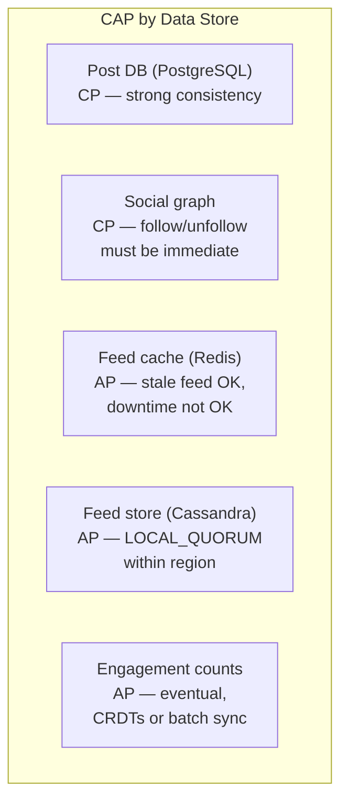

!!! warning
    A common interview mistake: saying "the whole system is AP." A news feed is **mixed-mode** — the source-of-truth stores (posts, graph) need consistency; the derived stores (feed cache, engagement counts) prioritize availability. Articulate this per-store.

---

### SLA and SLO Definitions

| Capability | SLI | SLO | Error budget |
|------------|-----|-----|-------------|
| **Feed read availability** | % of `GET /feed` returning non-5xx | 99.99% (52.6 min/year downtime) | Degrade to reverse-chronological if ranking service is down |
| **Feed read latency** | p99 latency of `GET /feed` | < 500 ms | Excludes CDN time for media; JSON response only |
| **Post creation availability** | % of `POST /posts` returning 2xx for valid requests | 99.95% | Posts are the write path; brief unavailability during deploys is acceptable |
| **Post creation latency** | p99 latency of `POST /posts` (metadata only, excludes media upload) | < 300 ms | Synchronous DB write + Kafka publish |
| **Fan-out latency** | p99 time from post creation to appearance in followers' feed cache | < 30 s for regular users; < 5 min for celebrities (read-path merge) | Best-effort; not guaranteed for all followers simultaneously |
| **Feed freshness** | Median age of newest post in a user's feed at load time | < 60 s | Stale feed is acceptable; missing posts are not |
| **Data durability** | % of created posts that are retrievable after 1 hour | 99.999% | PostgreSQL with synchronous replication |

### Error budget policy

| Budget state | Action |
|-------------|--------|
| **> 50% remaining** | Ship new features (ranking model updates, UI changes) |
| **25–50%** | Canary all ranking model changes; limit blast radius |
| **< 25%** | Freeze non-critical changes; focus on reliability |
| **Exhausted** | Incident review; no deploys until budget replenishes |

!!! tip
    In interviews, tie SLOs to **user-visible impact**: "Our feed read SLO is 99.99% because feed is the primary screen — every second of downtime affects millions of sessions." This shows product-aware engineering.

---

### Database Schema (Extended)

The illustrative schema in Step 4 is expanded here with indexes, constraints, and rationale:

```sql
-- ==========================================
-- Source of truth: PostgreSQL (Citus, sharded by user_id / author_id)
-- ==========================================

CREATE TABLE users (
    id              UUID PRIMARY KEY DEFAULT gen_random_uuid(),
    username        TEXT NOT NULL UNIQUE,
    display_name    TEXT,
    avatar_url      TEXT,
    follower_count  BIGINT NOT NULL DEFAULT 0,  -- denormalized, updated async
    is_celebrity    BOOLEAN NOT NULL DEFAULT FALSE,  -- follower_count > threshold
    created_at      TIMESTAMPTZ NOT NULL DEFAULT now(),
    updated_at      TIMESTAMPTZ NOT NULL DEFAULT now()
);

CREATE TABLE posts (
    id              UUID PRIMARY KEY DEFAULT gen_random_uuid(),
    author_id       UUID NOT NULL REFERENCES users(id),
    text            TEXT,
    visibility      TEXT NOT NULL DEFAULT 'public',  -- public | followers_only | private
    media_count     SMALLINT NOT NULL DEFAULT 0,
    is_deleted      BOOLEAN NOT NULL DEFAULT FALSE,  -- soft delete
    created_at      TIMESTAMPTZ NOT NULL DEFAULT now(),
    updated_at      TIMESTAMPTZ NOT NULL DEFAULT now()
);
-- Shard key: author_id (co-locate author's posts)
-- Index for profile timeline (reverse chronological)
CREATE INDEX idx_posts_author_time ON posts(author_id, created_at DESC) WHERE NOT is_deleted;

CREATE TABLE post_media (
    id              UUID PRIMARY KEY DEFAULT gen_random_uuid(),
    post_id         UUID NOT NULL REFERENCES posts(id),
    storage_key     TEXT NOT NULL,           -- S3 object key
    media_type      TEXT NOT NULL,           -- image | video | gif
    width           INT,
    height          INT,
    duration_sec    REAL,                    -- video only
    mime_type       TEXT NOT NULL,
    processing_status TEXT NOT NULL DEFAULT 'pending',  -- pending | ready | failed
    created_at      TIMESTAMPTZ NOT NULL DEFAULT now()
);
CREATE INDEX idx_post_media_post ON post_media(post_id);

CREATE TABLE follows (
    follower_id     UUID NOT NULL REFERENCES users(id),
    followee_id     UUID NOT NULL REFERENCES users(id),
    created_at      TIMESTAMPTZ NOT NULL DEFAULT now(),
    PRIMARY KEY (follower_id, followee_id)
);
-- "Who do I follow?" — for feed generation
CREATE INDEX idx_follows_follower ON follows(follower_id);
-- "Who follows me?" — for fan-out
CREATE INDEX idx_follows_followee ON follows(followee_id);

CREATE TABLE engagement (
    id              UUID PRIMARY KEY DEFAULT gen_random_uuid(),
    post_id         UUID NOT NULL REFERENCES posts(id),
    user_id         UUID NOT NULL REFERENCES users(id),
    type            TEXT NOT NULL,           -- like | comment | share | bookmark
    comment_text    TEXT,                    -- only for type=comment
    created_at      TIMESTAMPTZ NOT NULL DEFAULT now(),
    UNIQUE(post_id, user_id, type)           -- one like per user per post
);
CREATE INDEX idx_engagement_post ON engagement(post_id, type);

-- ==========================================
-- Materialized feed: Cassandra
-- ==========================================
-- CQL (Cassandra Query Language)
-- Partition key: user_id (all feed entries for one user in one partition)
-- Clustering key: created_at DESC (most recent first)
--
-- CREATE TABLE user_feed (
--     user_id     UUID,
--     created_at  TIMESTAMP,
--     post_id     UUID,
--     author_id   UUID,
--     PRIMARY KEY (user_id, created_at)
-- ) WITH CLUSTERING ORDER BY (created_at DESC)
--   AND default_time_to_live = 2592000;  -- 30-day TTL
```

### Storage sizing by table (at scale)

| Store | Row size | Rows (year 1) | Raw size | With indexes/replication | Notes |
|-------|----------|---------------|----------|--------------------------|-------|
| **posts** (PG) | ~500 B | 912B (2.5B/day × 365) | ~456 TB | ~1.4 PB (3x replication + indexes) | Shard by author_id; archive old posts |
| **follows** (PG) | ~48 B | 150B (500M users × 300 avg) | ~7.2 TB | ~22 TB | Rarely changes; compact |
| **engagement** (PG) | ~100 B | 9.1T (10 engagements/post avg) | ~910 TB | ~2.7 PB | Heaviest table; consider separate cluster |
| **user_feed** (Cassandra) | ~64 B per entry | 500M users × 2K cap = 1T entries max | ~64 TB | ~192 TB (RF=3) | TTL auto-prunes; actual active much smaller |
| **feed cache** (Redis) | ~100 B per entry | 100M DAU × 2K cap = 200B entries | ~20 TB RAM (worst case) | — | Only cache active users; cold users fall back to Cassandra |
| **media** (S3) | ~2 MB avg | 456B media objects (50% of posts) | ~912 PB | Erasure coded by S3 | Lifecycle to Glacier after 1 year |

!!! warning
    These numbers are **order-of-magnitude** for interview purposes. In practice, not all 500M users are active, media is highly skewed (most users post rarely), and compression helps significantly. Always state assumptions when presenting estimates.

**Example request/response sketches:**

```json
// POST /v1/posts
{
  "text": "Hello world",
  "media": [{ "object_key": "u/1/a.jpg", "type": "image" }]
}

// GET /v1/feed?limit=20&cursor=eyJjIjoifQ
{
  "items": [
    {
      "post_id": "p_123",
      "author_id": "u_9",
      "text": "...",
      "created_at_ms": 1712000000000,
      "engagement": { "likes": 42, "comments": 3 }
    }
  ],
  "next_cursor": "eyJjIjoifQ"
}
```

---

## Step 2: Back-of-Envelope Estimation

### Assumptions

```
- DAU: 500 million
- Avg following (friends / follows): 300 per user
- Posts per active user per day: 5
- Read: each DAU loads feed 10 times/day, 20 posts per load (not all unique writes)
```

### Feed Generation QPS

```
Writes (new posts):
  500M DAU × 5 posts/day = 2.5B posts/day
  Average QPS = 2.5e9 / 86,400 ≈ 28,900 posts/sec
  Peak (e.g., 3× average) ≈ 87,000 posts/sec

Reads (feed requests):
  500M × 10 loads/day = 5B feed requests/day
  Average ≈ 57,900 feed API calls/sec
  Peak ≈ 170,000 feed QPS
```

!!! warning
    Peak factors depend on time zones and events; in interviews, state assumptions explicitly (e.g., 2–5× average).

### Storage (Posts + Metadata)

```
Assume average post metadata record = 500 bytes (text, ids, timestamps)
2.5B posts/day × 500 B ≈ 1.25 TB/day raw post rows
Add indexes, replication, media pointers → multi-PB at year scale in aggregate (media in object store dominates)

Media: average 2 MB per post with media (mixed images/video)
If 50% of posts have media: 1.25B media objects/day × 2 MB ≈ 2.5 PB/day — 
in practice not every DAU posts media-heavy; tune fractions in interview.
```

### Bandwidth (Illustrative)

```
One feed response ~ 20 KB (compressed JSON with URLs, not full images)
57,900 RPS × 20 KB ≈ 1.1 GB/s average egress from API layer
Images/video served from CDN, not API JSON — API returns links only.
```

---

## Step 3: High-Level Design

### Architecture Overview

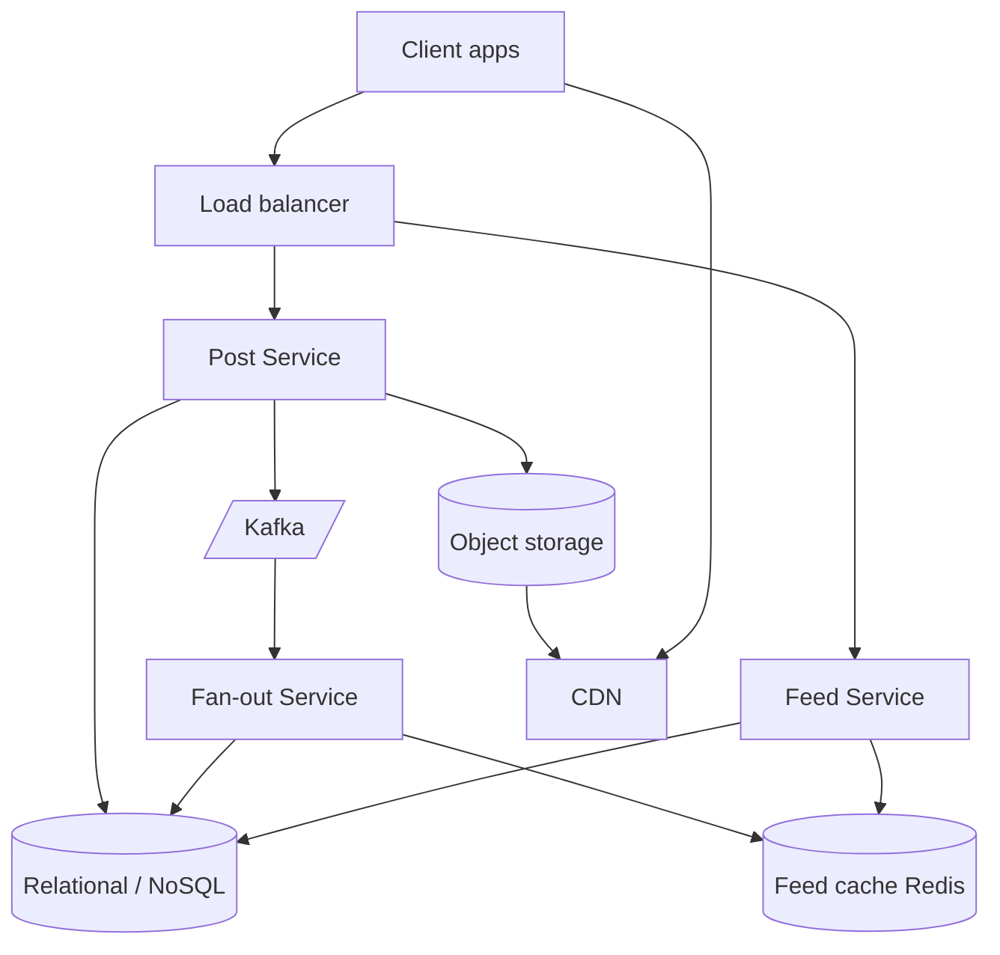

**Flow:**
1. **Post Service** — Validates post, stores metadata, enqueues fan-out work, returns post id.
2. **Fan-out Service** — Consumes events; pushes post ids into followers’ feed caches (or schedules read-time aggregation for celebrities).
3. **Feed Cache (Redis)** — Fast per-user candidate lists (often sorted sets).
4. **Feed Service** — Merges cache + ranking, applies pagination, returns response.

### Fan-out on Write vs Fan-out on Read

| Approach | Mechanism | Pros | Cons |
|----------|-----------|------|------|
| **Fan-out on write (push)** | On post, write into each follower’s feed bucket | Read is cheap and fast | Hot users cause huge write amplification |
| **Fan-out on read (pull)** | On read, gather posts from followees | No per-follower writes on post | Read is heavier; harder to hit latency at scale |
| **Hybrid** | Push for normal users; pull (or partial push) for celebrities | Balances cost and latency | More complex; needs “celebrity” detection |

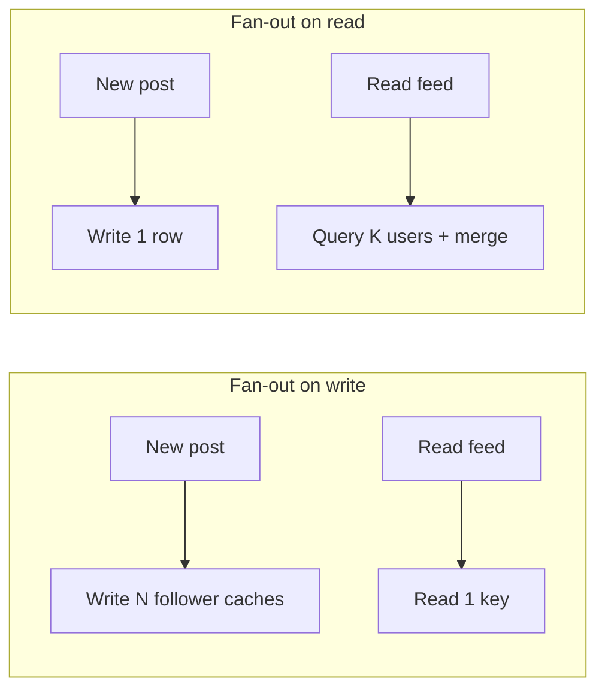

### Hybrid Approach (Production Pattern)

- **Regular users** (followers &lt; threshold): **push** fan-out into Redis sorted sets (cap list length).
- **Celebrities** (followers &gt; threshold): **skip** full push or push only to a “recent subset”; at read time **merge** in-memory from celebrity shards / recent posts cache.

!!! note
    Twitter and similar systems have described hybrid models publicly at a high level; exact thresholds are tunable and dynamic.

---

## Step 4: Deep Dive

### 4.1 Post Storage & Publishing

#### Database Schema (Illustrative)

**Relational style (PostgreSQL):**

| Table | Key columns |
|-------|-------------|
| `users` | `id`, `username`, `created_at`, `follower_count` (denormalized, updated async) |
| `posts` | `id`, `author_id`, `text`, `created_at`, `visibility`, `media_count` |
| `post_media` | `id`, `post_id`, `storage_key`, `width`, `height`, `duration_sec`, `mime` |
| `follows` | `follower_id`, `followee_id`, `created_at` (PK: pair) |

**Graph / wide-column alternatives:** `follows` can live in a graph DB or as adjacency in Dynamo/Cassandra with `followee_id` as partition for “who follows me” queries.

#### Post Creation Flow

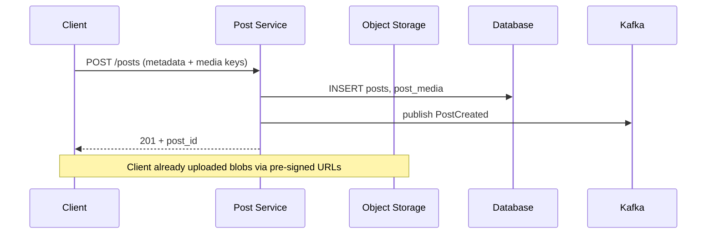

#### Media Upload Pipeline

1. Client calls `POST /media/upload-url` → receives **pre-signed URL** + `object_key`.
2. Client **PUT**s bytes directly to **S3-compatible** storage.
3. Optional **async pipeline**: virus scan, image resize, video transcoding → updates `post_media` status.

!!! tip
    Never stream large uploads through your stateless API tier; use **direct-to-storage** uploads with short-lived credentials.

#### Code Examples: Post Service

=== "Python"

    ```python
    from __future__ import annotations

    import uuid
    from datetime import datetime, timezone
    from typing import List, Optional

    from pydantic import BaseModel, Field, field_validator


    class MediaRef(BaseModel):
        object_key: str
        mime_type: str


    class CreatePostRequest(BaseModel):
        text: Optional[str] = None
        media: List[MediaRef] = Field(default_factory=list)

        @field_validator("text")
        @classmethod
        def strip_text(cls, v: Optional[str]) -> Optional[str]:
            return v.strip() if isinstance(v, str) else v

        def validate_nonempty(self) -> None:
            if (not self.text) and not self.media:
                raise ValueError("empty post")
            if self.text and len(self.text) > 10_000:
                raise ValueError("text too long")


    class PostRecord(BaseModel):
        id: str
        author_id: str
        text: Optional[str]
        created_at: datetime


    class PostRepository:
        def insert(
            self, author_id: str, req: CreatePostRequest
        ) -> PostRecord:  # pragma: no cover - interface
            raise NotImplementedError


    class EventPublisher:
        def publish_post_created(self, post: PostRecord, media: List[MediaRef]) -> None:
            raise NotImplementedError


    class PostService:
        def __init__(self, posts: PostRepository, events: EventPublisher) -> None:
            self._posts = posts
            self._events = events

        def create_post(self, author_id: str, req: CreatePostRequest) -> PostRecord:
            req.validate_nonempty()
            saved = self._posts.insert(author_id, req)
            self._events.publish_post_created(saved, req.media)
            return saved

        @staticmethod
        def new_id() -> str:
            return f"p_{uuid.uuid4().hex}"


    def utcnow() -> datetime:
        return datetime.now(timezone.utc)
    ```

=== "Java"

    ```java
    package com.example.feed.post;

    import java.time.Instant;
    import java.util.List;
    import java.util.UUID;

    public final class CreatePostRequest {
        public String text;
        public List<MediaRef> media;

        public static final class MediaRef {
            public String objectKey;
            public String mimeType;
        }
    }

    public final class PostRecord {
        public final String id;
        public final String authorId;
        public final String text;
        public final Instant createdAt;

        public PostRecord(String id, String authorId, String text, Instant createdAt) {
            this.id = id;
            this.authorId = authorId;
            this.text = text;
            this.createdAt = createdAt;
        }
    }

    public interface PostRepository {
        PostRecord insert(String authorId, String text, List<CreatePostRequest.MediaRef> media);
    }

    public interface EventPublisher {
        void publishPostCreated(PostRecord post, List<CreatePostRequest.MediaRef> media);
    }

    public final class PostService {
        private final PostRepository posts;
        private final EventPublisher events;

        public PostService(PostRepository posts, EventPublisher events) {
            this.posts = posts;
            this.events = events;
        }

        public PostRecord createPost(String authorId, CreatePostRequest req) {
            validate(req);
            PostRecord saved = posts.insert(authorId, req.text, req.media);
            events.publishPostCreated(saved, req.media);
            return saved;
        }

        private static void validate(CreatePostRequest req) {
            if (req.text == null || req.text.isBlank()) {
                if (req.media == null || req.media.isEmpty()) {
                    throw new IllegalArgumentException("empty post");
                }
            }
            if (req.text != null && req.text.length() > 10_000) {
                throw new IllegalArgumentException("text too long");
            }
        }

        public static String newId() {
            return "p_" + UUID.randomUUID().toString().replace("-", "");
        }
    }
    ```

=== "Go"

    ```go
    package post

    import (
    	"errors"
    	"fmt"
    	"strings"
    	"time"

    	"github.com/google/uuid"
    )

    type MediaRef struct {
    	ObjectKey string
    	MimeType  string
    }

    type CreatePostRequest struct {
    	Text  string
    	Media []MediaRef
    }

    type PostRecord struct {
    	ID        string
    	AuthorID  string
    	Text      string
    	CreatedAt time.Time
    }

    type PostRepository interface {
    	Insert(authorID string, req CreatePostRequest) (PostRecord, error)
    }

    type EventPublisher interface {
    	PublishPostCreated(PostRecord, []MediaRef) error
    }

    type Service struct {
    	Posts  PostRepository
    	Events EventPublisher
    }

    func (s *Service) CreatePost(authorID string, req CreatePostRequest) (PostRecord, error) {
    	if err := validateCreate(req); err != nil {
    		return PostRecord{}, err
    	}
    	saved, err := s.Posts.Insert(authorID, req)
    	if err != nil {
    		return PostRecord{}, err
    	}
    	if err := s.Events.PublishPostCreated(saved, req.Media); err != nil {
    		return PostRecord{}, fmt.Errorf("publish: %w", err)
    	}
    	return saved, nil
    }

    func validateCreate(req CreatePostRequest) error {
    	text := strings.TrimSpace(req.Text)
    	if text == "" && len(req.Media) == 0 {
    		return errors.New("empty post")
    	}
    	if len(text) > 10_000 {
    		return errors.New("text too long")
    	}
    	return nil
    }

    func NewID() string {
    	return "p_" + strings.ReplaceAll(uuid.New().String(), "-", "")
    }
    ```

---

### 4.2 Fan-out Service

#### Fan-out on Write (Push Model)

- When user **U** posts, enqueue work: for each follower **V**, insert `post_id` into **V**’s feed structure.
- **Pros:** `GET /feed` reads a precomputed structure — fast.
- **Cons:** User with 50M followers triggers 50M writes (mitigated by hybrid).

#### Fan-out on Read (Pull Model)

- Store posts by author; on feed read, **query recent posts** from each followee (or batched), **merge** by time, truncate.
- **Pros:** Posting stays O(1) in follower count.
- **Cons:** Read cost grows with follow count; caching and indexing are critical.

#### Hybrid

- **Threshold** `T` (e.g., 10k–100k followers): above `T`, do not push to all followers; use pull + partial materialization.

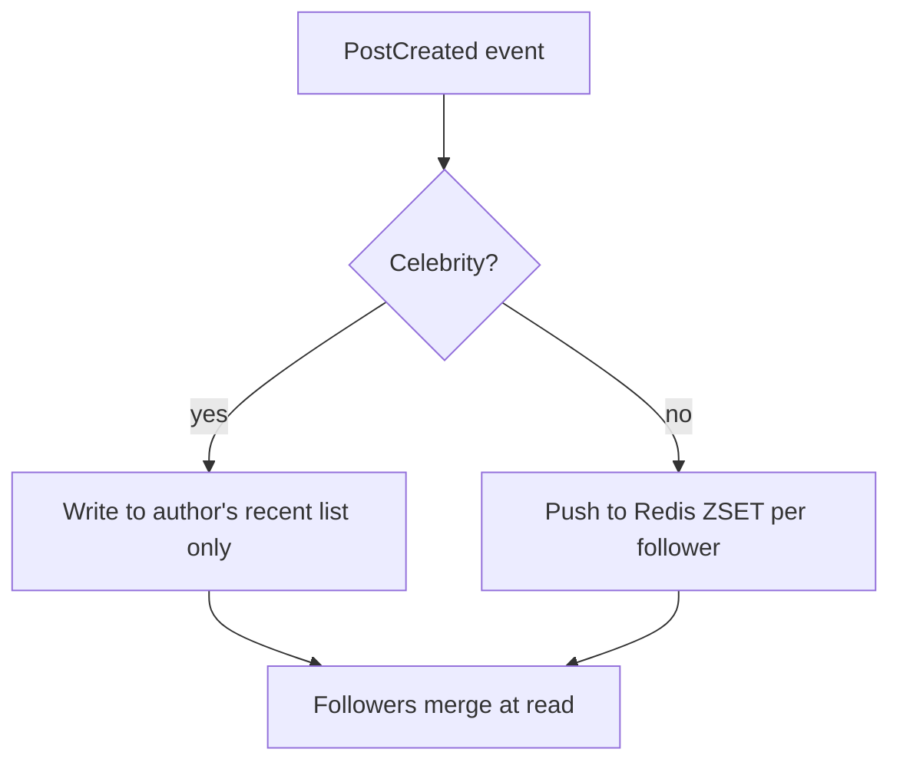

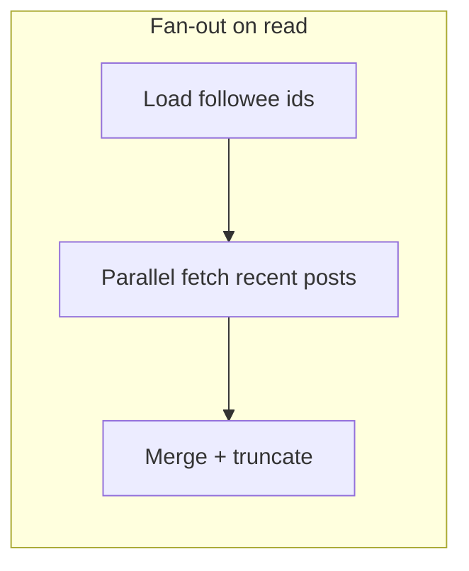

#### Fan-out Worker with Kafka

=== "Python"

    ```python
    from __future__ import annotations

    from dataclasses import dataclass
    from typing import Iterable, List, Protocol


    @dataclass(frozen=True)
    class PostCreatedEvent:
        post_id: str
        author_id: str
        created_at_epoch_ms: int
        media_keys: List[str]


    class FollowGraphClient(Protocol):
        def followers_paged(self, author_id: str, page_size: int) -> Iterable[List[str]]:
            ...


    class FeedCacheClient(Protocol):
        def add_to_feed(self, follower_user_id: str, post_id: str, score: float) -> None:
            ...


    class CelebrityPolicy(Protocol):
        def should_push_to_all_followers(self, author_id: str, follower_count: int) -> bool:
            ...


    class FanOutWorker:
        def __init__(
            self,
            graph: FollowGraphClient,
            cache: FeedCacheClient,
            policy: CelebrityPolicy,
        ) -> None:
            self._graph = graph
            self._cache = cache
            self._policy = policy

        def on_post_created(self, e: PostCreatedEvent, follower_count: int) -> None:
            if not self._policy.should_push_to_all_followers(e.author_id, follower_count):
                return
            score = float(e.created_at_epoch_ms)
            for page in self._graph.followers_paged(e.author_id, 5000):
                for follower_id in page:
                    self._cache.add_to_feed(follower_id, e.post_id, score)
    ```

=== "Java"

    ```java
    package com.example.feed.fanout;

    import java.util.List;

    public record PostCreatedEvent(
            String postId,
            String authorId,
            long createdAtEpochMs,
            List<String> mediaKeys
    ) {}

    public interface FollowGraphClient {
        /** Returns follower ids in pages; fan-out worker iterates. */
        Iterable<List<String>> followersPaged(String authorId, int pageSize);
    }

    public interface FeedCacheClient {
        void addToFeed(String followerUserId, String postId, long score);
    }

    public interface CelebrityPolicy {
        boolean shouldPushToAllFollowers(String authorId, long followerCount);
    }

    public final class FanOutWorker {
        private final FollowGraphClient graph;
        private final FeedCacheClient cache;
        private final CelebrityPolicy policy;

        public FanOutWorker(FollowGraphClient graph, FeedCacheClient cache, CelebrityPolicy policy) {
            this.graph = graph;
            this.cache = cache;
            this.policy = policy;
        }

        public void onPostCreated(PostCreatedEvent e, long followerCount) {
            if (!policy.shouldPushToAllFollowers(e.authorId(), followerCount)) {
                return;
            }
            long score = e.createdAtEpochMs();
            for (List<String> page : graph.followersPaged(e.authorId(), 5_000)) {
                for (String followerId : page) {
                    cache.addToFeed(followerId, e.postId(), score);
                }
            }
        }
    }
    ```

=== "Go"

    ```go
    package fanout

    type PostCreatedEvent struct {
    	PostID            string
    	AuthorID          string
    	CreatedAtEpochMs  int64
    	MediaKeys         []string
    }

    type FollowGraphClient interface {
    	FollowersPaged(authorID string, pageSize int) (pages [][]string)
    }

    type FeedCacheClient interface {
    	AddToFeed(followerUserID, postID string, score float64) error
    }

    type CelebrityPolicy interface {
    	ShouldPushToAllFollowers(authorID string, followerCount int64) bool
    }

    type Worker struct {
    	Graph   FollowGraphClient
    	Cache   FeedCacheClient
    	Policy  CelebrityPolicy
    }

    func (w *Worker) OnPostCreated(e PostCreatedEvent, followerCount int64) error {
    	if !w.Policy.ShouldPushToAllFollowers(e.AuthorID, followerCount) {
    		return nil
    	}
    	score := float64(e.CreatedAtEpochMs)
    	for _, page := range w.Graph.FollowersPaged(e.AuthorID, 5000) {
    		for _, fid := range page {
    			if err := w.Cache.AddToFeed(fid, e.PostID, score); err != nil {
    				return err
    			}
    		}
    	}
    	return nil
    }
    ```

!!! note
    In production, **fan-out is batched**, **idempotent**, and **back-pressure aware**; Kafka partitions might be keyed by `author_id` to preserve ordering per author while scaling consumers.

---

### 4.3 Feed Generation & Ranking

#### Ranking Signals

| Signal | Example | Notes |
|--------|---------|--------|
| **Recency** | `created_at` | Baseline; decay over time |
| **Engagement** | likes, comments, shares, dwell | Requires logging; cold-start for new posts |
| **Relationship strength** | DMs, frequent interaction | Privacy-sensitive; opt-in in some products |
| **Content type** | video vs text | Product goals (e.g., promote Reels) |
| **Quality / safety** | policy scores | Demote harmful or spam |

#### Scoring Function (Illustrative)

\[
\text{score}(p) = w_1 \cdot f_{\text{recency}}(t_p) + w_2 \cdot g(\text{engagement}_p) + w_3 \cdot h(\text{affinity}_{u,a}) - w_4 \cdot \text{penalty}(p)
\]

Where \(f_{\text{recency}}\) might be exponential decay; \(g\) could be log-scaled counts to dampen virality.

#### ML-Based Ranking Pipeline

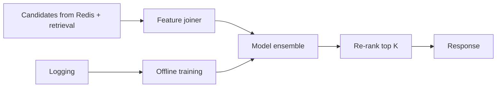

- **Retrieval:** cheap candidate generation (time + social + light ML).
- **Ranking:** heavier models on smaller sets (hundreds to thousands).
- **Exploration:** inject some random eligible posts to gather engagement labels.

#### Feed Assembly

- Merge **in-network** posts with **out-of-network** recommendations if required.
- **Dedupe** by `post_id` and by **story clusters** (same URL / same media).

#### Python: Ranking Service (Sketch)

```python
from __future__ import annotations

import math
from dataclasses import dataclass
from typing import Dict, List, Sequence


@dataclass(frozen=True)
class PostFeatures:
    post_id: str
    author_id: str
    created_at_ms: int
    likes: int
    comments: int
    affinity: float  # 0..1


def recency_score(now_ms: int, created_ms: int, half_life_ms: int = 86_400_000) -> float:
    age = max(0, now_ms - created_ms)
    return math.exp(-age / half_life_ms)


def engagement_score(likes: int, comments: int) -> float:
    raw = 1.0 + math.log1p(likes) + 0.5 * math.log1p(comments)
    return min(raw, 50.0)


def linear_score(f: PostFeatures, now_ms: int, weights: Dict[str, float]) -> float:
    r = recency_score(now_ms, f.created_at_ms)
    e = engagement_score(f.likes, f.comments)
    return (
        weights.get("recency", 1.0) * r
        + weights.get("engagement", 0.5) * e
        + weights.get("affinity", 0.8) * f.affinity
    )


class RankingService:
    def __init__(self, weights: Dict[str, float]) -> None:
        self._w = weights

    def rank(self, user_id: str, posts: Sequence[PostFeatures], now_ms: int) -> List[PostFeatures]:
        scored = [(linear_score(p, now_ms, self._w), p) for p in posts]
        scored.sort(key=lambda x: x[0], reverse=True)
        return [p for _, p in scored]


# Example: later swap linear_score with a model server call returning P(engage)
```

---

### 4.4 Feed Cache Architecture

- **Redis sorted sets:** key `feed:{user_id}` → members `post_id`, score = `created_at_ms` or blended pre-score.
- **Cap** list length (e.g., keep latest 2k ids); trim after each push.
- **Invalidation:** on unfollow / delete / privacy change — remove entries or rebuild slice; often **lazy repair** + **TTL** on keys.

| Strategy | When to use |
|----------|-------------|
| **Pre-computed feed** | Push fan-out + Redis; best for read latency |
| **On-demand merge** | Pull path for celebrities or cold users |
| **Write-through** | Update cache when post deleted (best effort + compensating job) |

#### Feed Cache Manager

=== "Java"

    ```java
    package com.example.feed.cache;

    import redis.clients.jedis.Jedis;
    import redis.clients.jedis.params.ZAddParams;

    public final class FeedCacheManager {
        private final Jedis jedis;
        private final int maxEntries;

        public FeedCacheManager(Jedis jedis, int maxEntries) {
            this.jedis = jedis;
            this.maxEntries = maxEntries;
        }

        public void addPost(String userId, String postId, double score) {
            String key = "feed:" + userId;
            jedis.zadd(key, score, postId, ZAddParams.zAddParams().nx());
            jedis.zremrangeByRank(key, 0, -maxEntries - 1);
        }

        public java.util.List<String> getPage(String userId, int limit, double maxScoreExclusive) {
            String key = "feed:" + userId;
            return jedis.zrevrangeByScore(key, "(" + maxScoreExclusive, "-inf", 0, limit);
        }
    }
    ```

=== "Go"

    ```go
    package cache

    import (
    	"context"
    	"fmt"

    	"github.com/redis/go-redis/v9"
    )

    type FeedCacheManager struct {
    	Rdb        *redis.Client
    	MaxEntries int64
    }

    func (m *FeedCacheManager) AddPost(ctx context.Context, userID, postID string, score float64) error {
    	key := fmt.Sprintf("feed:%s", userID)
    	pipe := m.Rdb.TxPipeline()
    	pipe.ZAdd(ctx, key, redis.Z{Score: score, Member: postID})
    	pipe.ZRemRangeByRank(ctx, key, 0, -(m.MaxEntries + 1))
    	_, err := pipe.Exec(ctx)
    	return err
    }

    func (m *FeedCacheManager) GetPage(ctx context.Context, userID string, limit int, maxExclusive float64) ([]string, error) {
    	key := fmt.Sprintf("feed:%s", userID)
    	opt := &redis.ZRangeBy{
    		Min:   "-inf",
    		Max:   fmt.Sprintf("(%f", maxExclusive),
    		Count: int64(limit),
    	}
    	return m.Rdb.ZRevRangeByScore(ctx, key, opt).Result()
    }
    ```

---

### 4.5 Social Graph Storage

| Approach | Pros | Cons |
|----------|------|------|
| **Adjacency in RDBMS** | Simple, transactional follow/unfollow | Heavy fan-out queries need careful indexing |
| **Graph DB** | Rich traversals | Ops + cost; not always needed for follow-only |
| **Sharded key-value** | Massive scale | Application-level consistency patterns |

**Follow / unfollow:** transactional insert/delete on `(follower_id, followee_id)`; async job updates **follower counts** and **celebrity flags**.

**Celebrity detection:** e.g., `followee.follower_count > 100_000` → mark as **high fan-out**; store in profile cache.

#### Go: Graph Service

```go
package graph

import (
	"context"
	"database/sql"
	"errors"
)

type Store struct {
	DB *sql.DB
}

func (s *Store) Follow(ctx context.Context, followerID, followeeID string) error {
	if followerID == followeeID {
		return errors.New("cannot follow self")
	}
	_, err := s.DB.ExecContext(ctx,
		`INSERT INTO follows (follower_id, followee_id) VALUES ($1, $2)
		 ON CONFLICT DO NOTHING`,
		followerID, followeeID,
	)
	return err
}

func (s *Store) Unfollow(ctx context.Context, followerID, followeeID string) error {
	_, err := s.DB.ExecContext(ctx,
		`DELETE FROM follows WHERE follower_id = $1 AND followee_id = $2`,
		followerID, followeeID,
	)
	return err
}

func (s *Store) FollowerCount(ctx context.Context, userID string) (int64, error) {
	var c int64
	err := s.DB.QueryRowContext(ctx,
		`SELECT COUNT(*) FROM follows WHERE followee_id = $1`, userID,
	).Scan(&c)
	return c, err
}

func (s *Store) IsCelebrity(ctx context.Context, userID string, threshold int64) (bool, error) {
	c, err := s.FollowerCount(ctx, userID)
	if err != nil {
		return false, err
	}
	return c >= threshold, nil
}
```

---

### 4.6 Media Handling

| Piece | Role |
|-------|------|
| **Object storage (S3)** | Durable blobs; lifecycle policies |
| **CDN** | Edge caching of images/video segments |
| **Image pipeline** | Thumbnails, responsive sizes |
| **Video** | Transcoding ladders (1080p, 720p, …), captions |

**Pre-signed upload URL:** short TTL, `Content-Type` constraint, max size in policy.

**Image resizing pipeline (typical):** object created → **S3 event** / queue message → **worker** generates variants (`thumb`, `medium`, `large`, WebP) → writes keys back to `post_media` → clients get **srcset** URLs.

**Video transcoding:** ingest high-res upload → **transcoder** produces HLS/DASH renditions + poster frame → store manifests in object storage; **player** fetches adaptive bitrate from CDN.

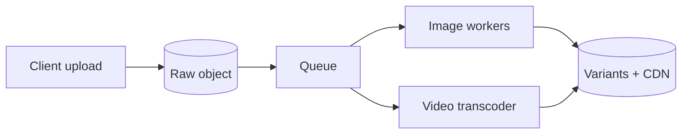

!!! tip
    **Cache keys** at CDN should include **content hash** or version in the path so updates propagate predictably (`/media/{id}/v2/thumb.jpg`).

---

### 4.7 Real-time Updates

| Mechanism | Pros | Cons |
|-----------|------|------|
| **Long polling** | Simple through HTTP | Many connections; higher latency than push |
| **WebSockets** | Bidirectional, low latency | Stateful gateways; reconnect logic |
| **SSE** | One-way server → client over HTTP | Not for binary-heavy protocols alone |

**New post to active viewers:** optional **presence** service + **pub/sub** channel per user session; push lightweight “refresh” or incremental post payload.

**Live engagement counts:** **CRDT / periodic aggregation** or **Redis INCR** with batched writes to DB; clients may see slightly stale counts.

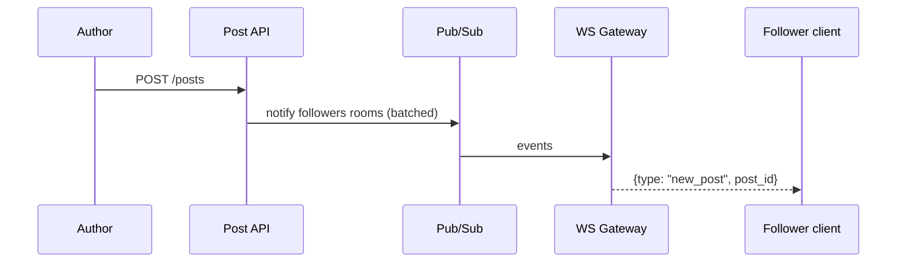

### 4.8 Pagination, Cursors, and Idempotency

**Why cursors:** Offset pagination (`?offset=40`) performs poorly when new rows arrive while the user pages—items **shift** and users see skips or duplicates. **Cursor** pagination ties each page to a stable position in the ordering key (time or rank).

| Approach | Encode | Pros | Cons |
|----------|--------|------|------|
| **Opaque cursor** | Base64(JSON) with `score`, `post_id` tie-breaker | Simple to evolve | Tamperable unless signed |
| **Signed cursor** | HMAC(cursor_payload, secret) | Client cannot forge | Key rotation story |
| **Seek method** | `WHERE (score, id) < (?, ?)` | DB-friendly | Needs composite index |

**Idempotency for writes:** `POST /posts` should accept **`Idempotency-Key`** header; store `(user_id, key) → post_id` in Redis with TTL to dedupe retries.

**Fan-out idempotency:** Kafka messages carry **`event_id`**; workers record processed ids in Redis `SET` or DB to avoid duplicate ZSET inserts.

#### Java: Cursor encoding and feed page

```java
package com.example.feed.api;

import java.nio.charset.StandardCharsets;
import java.util.Base64;
import java.util.List;
import java.util.Optional;

import com.fasterxml.jackson.annotation.JsonCreator;
import com.fasterxml.jackson.annotation.JsonProperty;
import com.fasterxml.jackson.databind.ObjectMapper;

public final class FeedCursor {
    public final double maxScoreExclusive;
    public final String tiePostId;

    @JsonCreator
    public FeedCursor(
            @JsonProperty("s") double maxScoreExclusive,
            @JsonProperty("t") String tiePostId) {
        this.maxScoreExclusive = maxScoreExclusive;
        this.tiePostId = tiePostId;
    }

    public static Optional<FeedCursor> decode(String token, ObjectMapper mapper) {
        if (token == null || token.isBlank()) {
            return Optional.empty();
        }
        try {
            byte[] raw = Base64.getUrlDecoder().decode(token);
            return Optional.of(mapper.readValue(raw, FeedCursor.class));
        } catch (Exception e) {
            return Optional.empty();
        }
    }

    public String encode(ObjectMapper mapper) throws Exception {
        byte[] raw = mapper.writeValueAsBytes(this);
        return Base64.getUrlEncoder().withoutPadding().encodeToString(raw);
    }
}

public record FeedItemDto(
        String postId,
        String authorId,
        String text,
        long createdAtMs,
        EngagementDto engagement) {}

public record EngagementDto(long likes, long comments) {}

public record FeedPageResponse(List<FeedItemDto> items, String nextCursor) {}

public final class FeedReadService {
    private final FeedCacheManager cache;
    private final ObjectMapper mapper;

    public FeedReadService(FeedCacheManager cache, ObjectMapper mapper) {
        this.cache = cache;
        this.mapper = mapper;
    }

    public FeedPageResponse getFeed(String userId, int limit, String cursorToken) throws Exception {
        double maxScore = Double.POSITIVE_INFINITY;
        if (cursorToken != null) {
            var c = FeedCursor.decode(cursorToken, mapper);
            if (c.isPresent()) {
                maxScore = c.get().maxScoreExclusive;
            }
        }
        List<String> ids = cache.getPage(userId, limit + 1, maxScore);
        boolean hasMore = ids.size() > limit;
        if (hasMore) {
            ids = ids.subList(0, limit);
        }
        String next = null;
        if (hasMore && !ids.isEmpty()) {
            // In production hydrate scores from Redis or DB for accurate cursor
            FeedCursor nc = new FeedCursor(Double.NEGATIVE_INFINITY, ids.get(ids.size() - 1));
            next = nc.encode(mapper);
        }
        return new FeedPageResponse(List.of(), next);
    }
}
```

#### Python: Idempotent post handler (sketch)

```python
from __future__ import annotations

import base64
import hashlib
import json
from dataclasses import dataclass
from typing import Any, Optional

import redis


def _b64url_decode(s: str) -> bytes:
    pad = "=" * (-len(s) % 4)
    return base64.urlsafe_b64decode(s + pad)


def _b64url_encode(raw: bytes) -> str:
    return base64.urlsafe_b64encode(raw).decode("ascii").rstrip("=")


@dataclass
class FeedCursor:
    max_score_exclusive: float
    tie_post_id: Optional[str] = None

    @staticmethod
    def decode(token: Optional[str]) -> Optional["FeedCursor"]:
        if not token:
            return None
        try:
            obj = json.loads(_b64url_decode(token))
            return FeedCursor(float(obj["s"]), obj.get("t"))
        except Exception:
            return None

    def encode(self) -> str:
        payload = {"s": self.max_score_exclusive, "t": self.tie_post_id}
        return _b64url_encode(json.dumps(payload, separators=(",", ":")).encode("utf-8"))


class IdempotencyStore:
    def __init__(self, r: redis.Redis, ttl_sec: int = 86400) -> None:
        self._r = r
        self._ttl = ttl_sec

    def key(self, user_id: str, idempotency_key: str) -> str:
        h = hashlib.sha256(f"{user_id}:{idempotency_key}".encode()).hexdigest()
        return f"idemp:post:{h}"

    def get_or_set(self, user_id: str, idempotency_key: str, post_id: str) -> str:
        k = self.key(user_id, idempotency_key)
        prev = self._r.get(k)
        if prev:
            return prev.decode("utf-8")
        self._r.set(k, post_id, ex=self._ttl, nx=True)
        return post_id
```

#### Go: Kafka fan-out consumer loop

```go
package fanout

import (
	"context"
	"encoding/json"
	"log"
	"time"

	"github.com/segmentio/kafka-go"
)

type Consumer struct {
	Reader *kafka.Reader
	Worker *Worker
	Graph  FollowGraphClient
}

func (c *Consumer) Run(ctx context.Context) {
	for {
		m, err := c.Reader.FetchMessage(ctx)
		if err != nil {
			log.Printf("fetch: %v", err)
			time.Sleep(time.Second)
			continue
		}
		var e PostCreatedEvent
		if err := json.Unmarshal(m.Value, &e); err != nil {
			_ = c.Reader.CommitMessages(ctx, m)
			continue
		}
		fc, err := followerCount(ctx, c.Graph, e.AuthorID)
		if err != nil {
			log.Printf("followers: %v", err)
			continue
		}
		if err := c.Worker.OnPostCreated(e, fc); err != nil {
			log.Printf("fanout: %v", err)
			continue
		}
		if err := c.Reader.CommitMessages(ctx, m); err != nil {
			log.Printf("commit: %v", err)
		}
	}
}

func followerCount(ctx context.Context, g FollowGraphClient, author string) (int64, error) {
	// Delegate to cached count service in production
	var total int64
	for _, page := range g.FollowersPaged(author, 5000) {
		total += int64(len(page))
	}
	return total, nil
}
```

!!! note
    The Go snippet’s `followerCount` is illustrative — production reads **denormalized** `follower_count` from the profile store to avoid scanning followers.

---

### 4.9 Media Pipeline — Pre-signed URLs

=== "Python"

    ```python
    import uuid
    from dataclasses import dataclass

    import boto3


    @dataclass(frozen=True)
    class UploadUrlResponse:
        upload_url: str
        object_key: str


    class PresignedUploadService:
        def __init__(self, bucket: str, region: str) -> None:
            self._bucket = bucket
            self._client = boto3.client("s3", region_name=region)

        def create_upload_url(self, user_id: str, content_type: str, max_bytes: int) -> UploadUrlResponse:
            key = f"u/{user_id}/{uuid.uuid4().hex}"
            url = self._client.generate_presigned_url(
                ClientMethod="put_object",
                Params={
                    "Bucket": self._bucket,
                    "Key": key,
                    "ContentType": content_type,
                    "ContentLength": max_bytes,
                },
                ExpiresIn=600,
            )
            return UploadUrlResponse(upload_url=url, object_key=key)
    ```

=== "Java"

    ```java
    package com.example.feed.media;

    import java.net.URL;
    import java.time.Duration;
    import java.util.UUID;

    import software.amazon.awssdk.services.s3.model.PutObjectRequest;
    import software.amazon.awssdk.services.s3.presigner.S3Presigner;
    import software.amazon.awssdk.services.s3.presigner.model.PutObjectPresignRequest;

    public final class PresignedUploadService {
        private final S3Presigner presigner;
        private final String bucket;

        public PresignedUploadService(S3Presigner presigner, String bucket) {
            this.presigner = presigner;
            this.bucket = bucket;
        }

        public UploadUrlResponse createUploadUrl(String userId, String contentType, long maxBytes) {
            String key = "u/" + userId + "/" + UUID.randomUUID();
            PutObjectRequest put = PutObjectRequest.builder()
                    .bucket(bucket)
                    .key(key)
                    .contentType(contentType)
                    .contentLength(maxBytes)
                    .build();
            PutObjectPresignRequest pre = PutObjectPresignRequest.builder()
                    .signatureDuration(Duration.ofMinutes(10))
                    .putObjectRequest(put)
                    .build();
            URL url = presigner.presignPutObject(pre).url();
            return new UploadUrlResponse(url.toString(), key);
        }

        public record UploadUrlResponse(String uploadUrl, String objectKey) {}
    }
    ```

=== "Go"

    ```go
    package media

    import (
    	"context"
    	"fmt"
    	"time"

    	v4 "github.com/aws/aws-sdk-go-v2/aws/signer/v4"
    	"github.com/aws/aws-sdk-go-v2/service/s3"
    	"github.com/google/uuid"
    )

    type Presigner struct {
    	Client    *s3.Client
    	Presigner *s3.PresignClient
    	Bucket    string
    }

    type UploadURLResponse struct {
    	UploadURL string
    	ObjectKey string
    }

    func (p *Presigner) CreateUploadURL(ctx context.Context, userID, contentType string, maxBytes int64) (UploadURLResponse, error) {
    	key := fmt.Sprintf("u/%s/%s", userID, uuid.NewString())
    	in := &s3.PutObjectInput{
    		Bucket:        &p.Bucket,
    		Key:           &key,
    		ContentType:   &contentType,
    		ContentLength: &maxBytes,
    	}
    	out, err := p.Presigner.PresignPutObject(ctx, in, s3.WithPresignExpires(10*time.Minute))
    	if err != nil {
    		return UploadURLResponse{}, err
    	}
    	return UploadURLResponse{UploadURL: out.URL, ObjectKey: key}, nil
    }

    // v4.Signer used implicitly by PresignClient — keep import if custom signing needed
    var _ = v4.Signer{}
    ```

!!! warning
    Tune **CORS** on the bucket for browser direct uploads; validate **MIME** server-side before attaching media to a post.

---

### 4.10 Pull-Path Feed Merge (Read-Time Aggregation)

When a user follows celebrities not fully pushed, the **Feed Service** merges:
1. Redis ZSET candidates (normal follows).
2. Recent posts from **celebrity shards** / **author timelines** (bounded K authors × M posts).

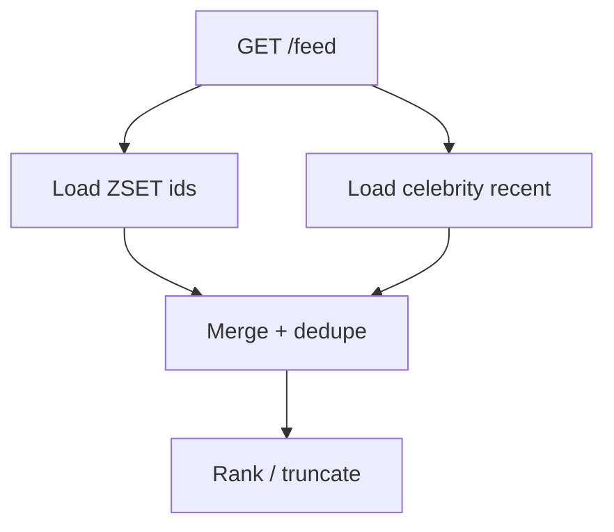

#### Merge helper

=== "Python"

    ```python
    from __future__ import annotations

    import heapq
    from dataclasses import dataclass
    from typing import Iterable, List, Set


    @dataclass(order=True)
    class ScoredId:
        neg_score: float
        post_id: str

        @staticmethod
        def from_pair(post_id: str, score: float) -> "ScoredId":
            return ScoredId(neg_score=-score, post_id=post_id)


    def merge_by_score(streams: Iterable[List[tuple[str, float]]], limit: int) -> List[str]:
        heap: List[tuple[float, int, str, int]] = []
        arrays = [list(s) for s in streams]
        for i, arr in enumerate(arrays):
            if arr:
                pid, sc = arr.pop()
                heapq.heappush(heap, (-sc, i, pid, 0))
        out: List[str] = []
        seen: Set[str] = set()
        while heap and len(out) < limit:
            neg_sc, idx, pid, _ = heapq.heappop(heap)
            if pid not in seen:
                seen.add(pid)
                out.append(pid)
            if arrays[idx]:
                nxt, sc = arrays[idx].pop()
                heapq.heappush(heap, (-sc, idx, nxt, 0))
        return out
    ```

=== "Java"

    ```java
    package com.example.feed.merge;

    import java.util.*;
    import java.util.stream.Collectors;
    import java.util.stream.Stream;

    public final class FeedMerger {
        public static List<String> mergeByScore(
                List<ScoredId> a,
                List<ScoredId> b,
                int limit) {
            PriorityQueue<ScoredId> pq = new PriorityQueue<>(Comparator.comparingDouble(ScoredId::score).reversed());
            pq.addAll(a);
            pq.addAll(b);
            LinkedHashSet<String> seen = new LinkedHashSet<>();
            List<String> out = new ArrayList<>();
            while (!pq.isEmpty() && out.size() < limit) {
                ScoredId x = pq.poll();
                if (seen.add(x.id())) {
                    out.add(x.id());
                }
            }
            return out;
        }

        public record ScoredId(String id, double score) {}
    }
    ```

=== "Go"

    ```go
    package merge

    import "sort"

    type ScoredID struct {
    	ID    string
    	Score float64
    }

    func MergeByScore(a, b []ScoredID, limit int) []string {
    	all := append(append([]ScoredID{}, a...), b...)
    	sort.Slice(all, func(i, j int) bool {
    		if all[i].Score == all[j].Score {
    			return all[i].ID < all[j].ID
    		}
    		return all[i].Score > all[j].Score
    	})
    	seen := map[string]struct{}{}
    	var out []string
    	for _, x := range all {
    		if len(out) >= limit {
    			break
    		}
    		if _, ok := seen[x.ID]; ok {
    			continue
    		}
    		seen[x.ID] = struct{}{}
    		out = append(out, x.ID)
    	}
    	return out
    }
    ```

---

## Step 5: Scaling & Production

### Scaling Strategy

| Layer | Technique |
|-------|-----------|
| **Database** | Shard by `user_id` or `post_id`; separate read replicas for timelines |
| **Feed cache** | Redis Cluster; hash tags per `user_id` |
| **Fan-out workers** | Horizontal Kafka consumers; partition by author |
| **CDN + multi-region** | Static media at edge; API in regional stacks with replication |

### Celebrity Problem

- **Do not** fan-out millions of writes synchronously.
- **Combine:** materialized recent posts for star authors + merge at read; **cache** hot author timelines separately.

### Failure Handling

| Failure | Degradation |
|---------|-------------|
| **Redis miss** | Rebuild slice from origin DB / pull path (slower) |
| **Ranking timeout** | Fall back to reverse-chronological candidates |
| **Partial fan-out lag** | Serve stale feed + background catch-up |

!!! warning
    Always define **SLIs**: p99 feed latency, fan-out lag, cache hit ratio — and **error budgets** for releases.

### Monitoring

| Metric | Why |
|--------|-----|
| **Feed p50/p99 latency** | User-visible |
| **Cache hit ratio** | Capacity and correctness |
| **Fan-out lag** | Kafka consumer health |
| **Posts / sec** | Traffic spikes |
| **Per-author fan-out time** | Celebrity incidents |

---

## Interview Tips

| Topic | Common follow-up |
|-------|------------------|
| **Fan-out** | Draw push vs pull; when hybrid wins |
| **Ordering** | Global vs per-user ordering; clock skew |
| **Ranking** | Exploration vs exploitation; bias |
| **Consistency** | What if follower list changes mid-fan-out? |
| **Storage** | Hot keys, partitioning, MySQL vs Cassandra |
| **Media** | CDN cache keys, signed URLs, abuse |

!!! tip
    End with **trade-offs**: e.g., “We chose Redis sorted sets for O(log N) inserts with caps; alternative is Cassandra wide rows with TTL — higher ops complexity.”

---

### Security, Data Privacy, and Compliance

| Concern | Design decision | Implementation |
|---------|----------------|----------------|
| **Authentication** | OAuth 2.0 / JWT tokens on all API endpoints | API gateway validates JWT; short-lived access tokens (15 min) + refresh tokens |
| **Authorization** | Post visibility (`public`, `followers_only`, `private`) enforced at read time | Feed service filters posts based on follow relationship and visibility field |
| **Block/mute** | Blocked users' posts never appear in feed; muted users' posts are suppressed | Block list cached in Redis; checked during feed assembly |
| **Data residency** | EU users' data stays in EU region (GDPR) | Shard by region; regional PostgreSQL clusters; CDN serves from nearest edge |
| **Right to erasure (GDPR)** | User deletion removes all posts, engagements, and fan-out entries | Async deletion job: soft-delete immediately, hard-delete within 30 days; cascade to Cassandra feed entries |
| **Media content moderation** | Detect NSFW, violence, copyright in uploaded media | Async pipeline: upload → ML classifier → flag for review or auto-reject |
| **Rate limiting** | Prevent spam posts and follow abuse | Per-user rate limits: 50 posts/day, 1000 follows/day; sliding window in Redis |
| **Pre-signed URL security** | Prevent unauthorized uploads and hotlinking | Short TTL (10 min); content-type restriction; max file size; signed with rotating keys |

---

## Quick Reference Tables

### Comparison: Fan-out Models

| Dimension | Push | Pull | Hybrid |
|-----------|------|------|--------|
| Post cost | High for many followers | Low | Medium |
| Read cost | Low | High | Medium |
| Complexity | Medium | Medium | High |

### Technology Choices Summary

| Component | Technology | Why this choice | Alternative considered |
|-----------|-----------|-----------------|----------------------|
| **Post storage** | PostgreSQL (Citus) | ACID for post creation; rich queries; sharding via Citus | Cassandra (no transactions), DynamoDB (vendor lock-in) |
| **Feed materialization** | Cassandra | Write-optimized; wide-row model fits timeline pattern; TTL support | Redis only (memory-bound at full scale) |
| **Feed cache** | Redis Sorted Sets | Sub-ms reads; O(log N) operations; cluster sharding | Memcached (no sorted sets), DynamoDB (higher latency) |
| **Message queue** | Kafka | High throughput; durable; replay; partition by author_id | SQS (no ordering), RabbitMQ (lower throughput) |
| **Media storage** | S3 + CloudFront | Durable; lifecycle policies; integrated CDN | GCS (GCP lock-in), MinIO (self-managed) |
| **Search (optional)** | Elasticsearch | Full-text search on posts; hashtag discovery | Solr (less ecosystem), PostgreSQL FTS (limited at scale) |

### CAP Summary

| Store | CAP | Notes |
|-------|-----|-------|
| PostgreSQL (posts, graph) | CP | Source of truth; strong consistency |
| Redis (feed cache) | AP | Stale feed OK; downtime not OK |
| Cassandra (feed store) | AP | LOCAL_QUORUM for regional consistency |
| Engagement counts | AP | Eventual; CRDTs or batch sync |

### API Summary

| Endpoint | Purpose |
|----------|---------|
| `POST /v1/posts` | Create |
| `GET /v1/feed` | Paginated feed |
| `POST /v1/follow` | Follow |
| `DELETE /v1/follow/{userId}` | Unfollow |
| `POST /v1/posts/{id}/like` | Like |
| `POST /v1/media/upload-url` | Pre-signed upload URL |

---

_Last updated: system design interview prep — News Feed / Timeline._
