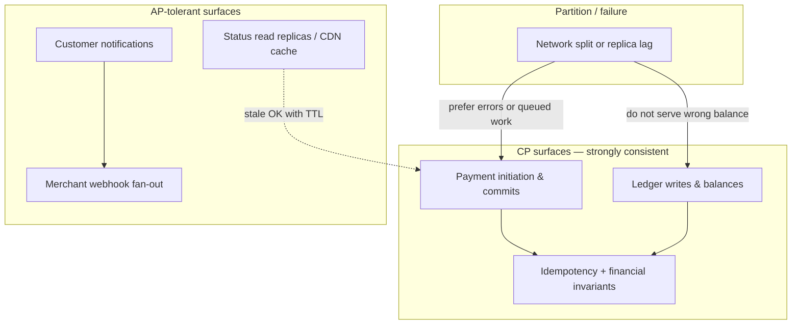
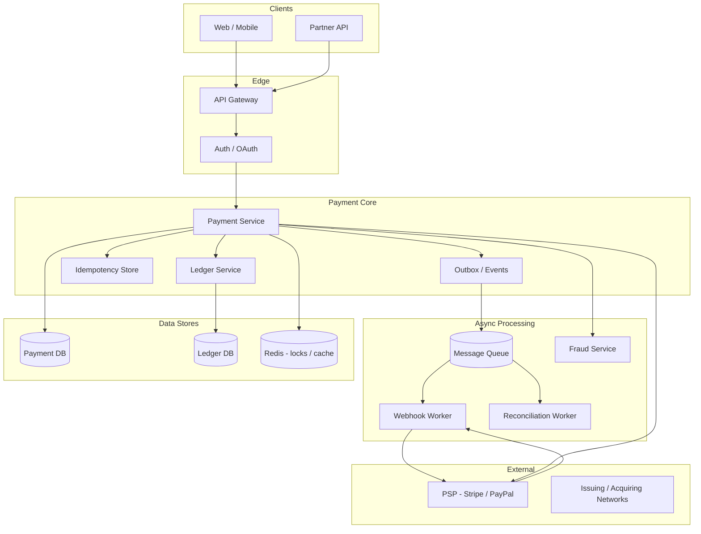
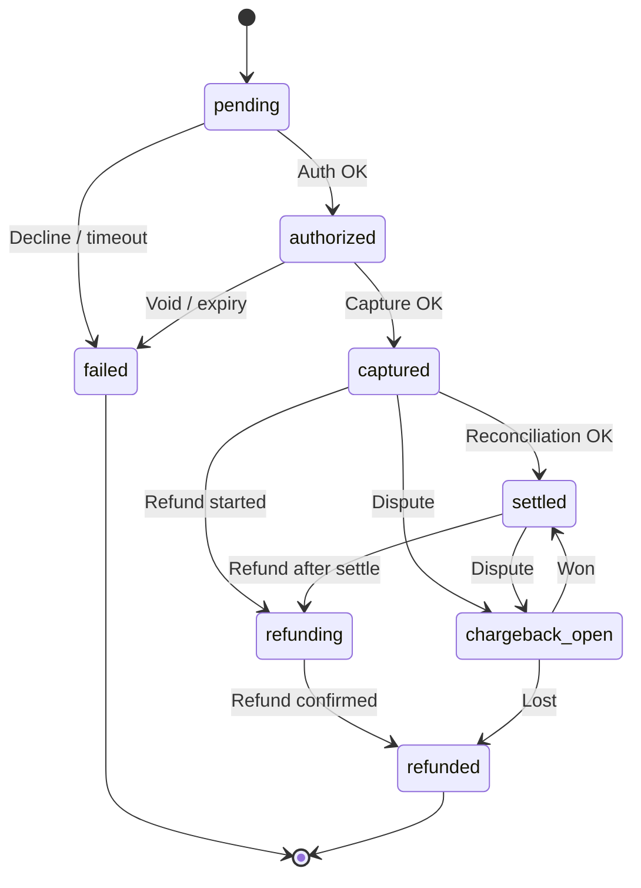
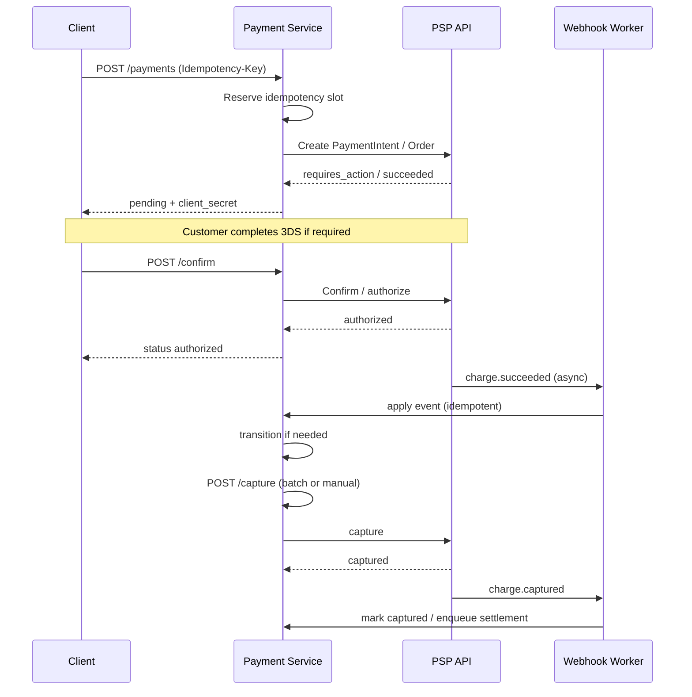
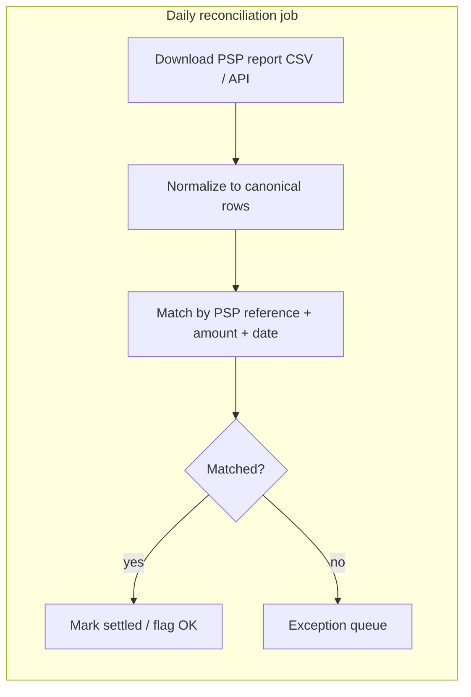

# Payment System

---

## What We're Building

A **payment system** lets customers pay merchants for goods or services using cards, bank transfers, or digital wallets. At a high level, it must:

- Accept payment instructions from clients (web, mobile, partner APIs).
- Move money safely between buyers, your platform, and sellers.
- Stay consistent with external networks (card schemes, banks, PSPs such as Stripe or PayPal).
- Support refunds, disputes (chargebacks), reconciliation, and fraud controls.
- Meet regulatory and industry rules, especially **PCI-DSS** for card data.

Real-world examples include Stripe Connect, Adyen for Platforms, PayPal Commerce, and in-house systems at marketplaces and SaaS billing engines.

!!! note
    In interviews, scope matters: clarify one-time checkout vs subscriptions, domestic vs cross-border, and whether you are the merchant of record or a marketplace splitting funds.

### Why This Problem Shows Up in Interviews

Payment systems combine **distributed systems**, **correctness under retries**, **external integrations**, and **security/compliance**. Interviewers often probe: idempotency, exactly-once-ish semantics, ledger design, webhook handling, and operational reconciliation.

---

## Step 1: Requirements

Clarify assumptions before drawing boxes. Payments are correctness-critical; wrong assumptions about settlement timing or dispute ownership are expensive.

### Functional Requirements

| Requirement | Priority | Notes |
|-------------|----------|-------|
| Create and confirm a payment for an order | Must have | Card or wallet; user-visible status |
| Authorize funds (hold) before capture | Must have | Two-phase card flow |
| Capture settled amount after fulfillment | Must have | May be partial capture |
| Idempotent API and webhook processing | Must have | Retries are guaranteed in production |
| Refund (full or partial) | Must have | Tied to original payment |
| Handle PSP asynchronous events (success, failure, dispute) | Must have | Webhooks from Stripe/PayPal-style APIs |
| Merchant reporting and customer receipts | Should have | Often async |
| Subscription billing with retries | Nice to have | Adds dunning, proration |

### Non-Functional Requirements

| Requirement | Target | Rationale |
|-------------|--------|-----------|
| **Consistency** | Strong for money movement | No double charges; ledger must balance |
| **Availability** | 99.95%+ for API; PSP may have own SLA | Degrade gracefully; queue webhooks |
| **Latency (API)** | p99 under a few hundred ms for create | User waits at checkout |
| **Durability** | No lost payments or events | Audit trail for disputes |
| **Auditability** | Immutable append-only financial records | Regulators and accountants |
| **Security** | PCI scope minimization | Tokenization, no PAN storage if possible |

### API Design

Represent payments as first-class resources with explicit states and idempotency.

**Create payment (client or server):**

```http
POST /api/v1/payments
Idempotency-Key: 7b2c9e1a-4f3d-4c2b-9e8a-1d2c3b4a5e6f
Content-Type: application/json
Authorization: Bearer <token>

{
  "order_id": "ord_9x7k2m",
  "amount": { "value": 4999, "currency": "USD" },
  "payment_method": "pm_card_visa_****4242",
  "capture_strategy": "manual",
  "metadata": { "cart_id": "cart_abc" }
}
```

**Response (202 or 200 depending on sync/async PSP):**

```json
{
  "payment_id": "pay_1a2b3c4d",
  "status": "pending",
  "psp_reference": "pi_3QxYz...",
  "client_secret": "pi_..._secret_...",
  "created_at": "2026-04-03T12:00:00Z"
}
```

**Capture:**

```http
POST /api/v1/payments/pay_1a2b3c4d/capture
Idempotency-Key: cap-ord_9x7k2m-001
Content-Type: application/json

{ "amount": { "value": 4999, "currency": "USD" } }
```

**Refund:**

```http
POST /api/v1/payments/pay_1a2b3c4d/refunds
Idempotency-Key: ref-req-88aa
Content-Type: application/json

{ "amount": { "value": 1999, "currency": "USD" }, "reason": "customer_request" }
```

**PSP webhook endpoint (server-to-server):**

```http
POST /internal/webhooks/psp/stripe
Stripe-Signature: t=...,v1=...
Content-Type: application/json

{ "id": "evt_...", "type": "charge.captured", "data": { "object": { ... } } }
```

!!! tip
    Put `Idempotency-Key` on every mutating call. Store keys with the resulting payment id and status so retries replay the same outcome without duplicate side effects.

### Technology Selection & Tradeoffs

Payment platforms sit at the intersection of **correctness**, **auditability**, and **operational complexity**. Technology choices should optimize for **serializable money semantics** in the core path and **predictable async processing** at the edges—not for maximum raw throughput on a single node.

#### Database: PostgreSQL vs MySQL (ACID for payments)

Both can run ACID transactions, but defaults and ecosystem differ in ways that matter for ledgers and long-running reconciliation jobs.

| Dimension | PostgreSQL | MySQL (InnoDB) |
|-----------|------------|----------------|
| **Default isolation** | Read Committed; **SERIALIZABLE** and **REPEATABLE READ** are first-class | REPEATABLE READ (InnoDB); SERIALIZABLE available |
| **Constraints & checks** | Rich CHECK, exclusion constraints, partial indexes—useful for ledger invariants | Strong InnoDB row locking; CHECK supported (modern versions) |
| **Numeric precision** | `NUMERIC` / `DECIMAL` for money—**avoid float** | `DECIMAL` for money—avoid float |
| **Extensions** | pglogical, partitioning patterns, mature JSONB for metadata | Wide hosting availability; simpler ops on many clouds |
| **Why it matters** | Double-entry constraints (e.g., journal must balance) map cleanly to DB-enforced rules | Fine when schema discipline is strict; team familiarity often drives choice |

**Why strong consistency is non-negotiable here:** a payment row and its ledger lines must commit **together** (or neither). You are not “eventually” charging a card—you either record a committed financial fact or you do not. That pushes you toward **short, well-bounded transactions** on a relational engine with **durable WAL** and **constraints** that catch programmer mistakes before money leaves the building.

#### Message queue: Kafka vs RabbitMQ (async payments & event sourcing)

| Dimension | Apache Kafka | RabbitMQ |
|-----------|--------------|----------|
| **Model** | Durable **log**: topics, partitions, consumer groups | **Broker** with queues, exchanges, routing |
| **Ordering** | Per-partition strict order | Queues can preserve order for single consumer; complex with competing consumers |
| **Replay** | Native: consumers can rewind to offsets for **reprocessing** | Not the primary model; dead-letter queues for failures |
| **Throughput & retention** | Very high; long retention as an **event backbone** | High; typical retention shorter unless plugins |
| **Event sourcing fit** | Natural: append-only log ≈ domain event stream | Possible with discipline; often paired with outbox + separate event store |
| **Ops complexity** | Higher (ZooKeeper/KRaft, sizing partitions) | Lower for classic task queues |

**Interview framing:** Use a **queue** (RabbitMQ, SQS, etc.) for **work distribution**—webhook fan-out, notification dispatch, reconciliation jobs. Use a **log** (Kafka) when you need an **immutable audit trail** consumed by many services, **replay** for new projections, or **event-carried state** at scale. Event sourcing *can* sit on Kafka; the **ledger of record** for balances often remains relational for constraints and reporting.

#### Idempotency store: Redis vs database

| Dimension | Redis | Database (same as payments) |
|-----------|-------|-----------------------------|
| **Speed** | Sub-ms reads/writes for hot keys | Milliseconds; sufficient for API path if indexed |
| **Durability** | AOF/RDB—**tune carefully**; not the same proof as relational WAL for all deployments | **Durable by default** with replication; matches payment row lifecycle |
| **Atomicity with payment** | Requires **distributed transaction** or careful ordering—easy to get wrong | Single local transaction: idempotency row + payment insert **together** |
| **TTL / eviction** | Natural for short-lived reservation keys | Use status + cleanup jobs for old keys |
| **Best use** | Fast **in-flight** dedupe, rate limits, locks with expiry | **Source of truth** for “this idempotency key already returned pay_xxx” |

**Why candidates pick DB for idempotency keys:** the idempotency record is part of the **same consistency boundary** as creating the payment. Redis is excellent for **auxiliary** dedupe (e.g., webhook burst coalescing) when loss of the key is acceptable **only if** the relational event store still prevents double posting.

#### Payment gateway: Stripe vs Adyen vs PayPal vs direct bank

| Option | Strengths | Tradeoffs |
|--------|-----------|-----------|
| **Stripe** | Developer experience, global cards, Connect/marketplaces, Radar, documentation | Pricing; some advanced acquiring features via partners |
| **Adyen** | Unified omnichannel, large-enterprise acquiring, rich routing | Integration complexity; often enterprise-led |
| **PayPal / Braintree** | Huge wallet user base, buyer trust | UX and settlement model differ; integration quirks |
| **Direct bank / ACH / RTP** | Lower fees at scale, full control | **Heavy compliance** (returns, NACHA, SEPA), slower iteration, more operational burden |

**Direct bank integration** is rarely “drop in a REST call”—it implies **sponsor banks**, **KYC/KYB**, exception handling for returns, and often longer settlement cycles. Interviews reward saying you’d **start with a PSP** to shrink PCI and network scope, then add rails as volume justifies.

#### Ledger design: double-entry vs single-entry vs event sourcing

| Approach | Idea | Pros | Cons |
|----------|------|------|------|
| **Double-entry** | Every movement: debit = credit; **chart of accounts** | Accountants and auditors understand it; **invariants** (balanced journals) catch bugs | More tables and rules; training for engineers |
| **Single-entry** | One line per “transaction” | Simpler to sketch | Easy to **lose** or **double-count**; weak for platforms and fees |
| **Event sourcing** | Store events; derive balances | Great audit trail, replay | You still need **projections**; **correct monetary invariants** often enforced via **double-entry projections** |

**Our choice (example for this guide):** **PostgreSQL** for OLTP payments and **double-entry ledger** tables with strict constraints; **Kafka or RabbitMQ** depending on whether we need **log replay** and multi-subscriber analytics (Kafka) or **simpler job queuing** first (RabbitMQ); **idempotency keys in PostgreSQL** in the same transaction as payment creation; **Stripe or Adyen** as PSP for cards until volume and geography justify **Adyen**-style acquiring depth or **direct bank** for ACH/SEPA with a dedicated banking partner. Rationale: **minimize split-brain** between “charged” and “recorded,” **pass audits**, and **defer** bank-direct complexity until compliance and ops can absorb it.

!!! note
    In interviews, “we use Redis for idempotency” is acceptable **if** you explain failover, persistence, and why the **authoritative** outcome still lives in the relational store.

### CAP Theorem Analysis

CAP is often oversimplified as “pick two letters.” For payments, the useful framing is: **which operations require linearizable truth about money, and which can tolerate stale reads or asynchronous delivery?**

- **Consistency (C):** every read sees a result consistent with the latest successful write (in the formal CAP sense, linearizability for that data).
- **Availability (A):** every request receives a non-error response (not the same as “PSP always approves”).
- **Partition (P):** network splits between your services, DB replicas, or between you and the PSP **will** happen.

**Canonical stance:** the **money path** is effectively **CP**: during a partition you prefer **failing closed** (reject or queue) over showing inconsistent balances or double-spending. You **cannot** sacrifice correctness for availability on ledger writes.

| Surface | CAP-style behavior | Why |
|---------|-------------------|-----|
| **Payment initiation** (create, capture, refund) | **CP** on internal state | Must agree with PSP semantics + ledger; use strong consistency + idempotency |
| **Payment status queries** | Can be **AP** at the edge | **Cached** “processing” or last-known status OK if **stale reads** are labeled or eventually refreshed; **not** for authoritative balance |
| **Ledger** | **CP** | Balances and journals must never diverge across replicas in a way that breaks invariants |
| **Notifications** (email, push, webhooks to merchants) | **AP** | At-least-once delivery; duplicate-safe consumers |



!!! important
    PSPs are **external CP-ish systems** with their own failure modes: your design must **reconcile** and **never assume** your DB and Stripe agree without verification.

### SLA and SLO Definitions

**SLA** = contract with users or merchants (often with credits). **SLO** = internal target you measure against; **SLI** = the measured metric.

| Area | SLI (what we measure) | Example SLO | Notes |
|------|------------------------|-------------|-------|
| **Payment processing latency** | p50 / p95 / p99 latency from API accept to terminal `succeeded` or `failed` | p99 &lt; 3s for hosted-field flows; stricter for in-app token reuse | Excludes customer think time; includes your stack + PSP |
| **Payment success rate** | `successful_charges / eligible_attempts` (exclude fraud declines if policy-defined) | 99%+ for returning cards in home region | Segment by new card, cross-border, 3DS |
| **Reconciliation accuracy** | Matched PSP rows / total PSP rows in window | 99.99%+ daily match; 100% investigated within N days | Residual exceptions tracked |
| **System availability** | Successful API fraction (2xx/4xx as “up”; 5xx budgeted) | 99.95% monthly for payment API | Planned maintenance excluded or announced |
| **Refund processing time** | Time from accepted refund request to PSP-confirmed refund | p95 &lt; 24h for standard; faster if instant refund rail | Depends on PSP settlement rules |

**Error budget policy (example):**

- **Monthly error budget** for payment API availability: \(100\% - 99.95\% = 0.05\%\) ≈ **21.6 minutes** downtime/month (if 24/7).
- If budget is **exhausted**: freeze non-critical deploys, prioritize incident fixes, defer risky changes; consider **stricter review** for ledger migrations.
- **Latency SLOs** consume budget when p99 exceeds threshold for a rolling window—triggers **alerting** and **capacity** review, not necessarily customer credits unless SLA says so.

!!! tip
    Tie SLOs to **user stories**: “buyer sees confirmation within X” beats raw millisecond vanity for behavioral acceptance.

### Database Schema

Use **integer minor units** (e.g., cents) or **`NUMERIC`**—never floating point. Enforce **lifecycle** and **referential integrity** with foreign keys; enforce **business rules** with checks and unique constraints.

**`merchants`** — who gets paid.

```sql
CREATE TABLE merchants (
  id              UUID PRIMARY KEY DEFAULT gen_random_uuid(),
  external_ref    VARCHAR(64) NOT NULL UNIQUE,
  name            VARCHAR(255) NOT NULL,
  status          VARCHAR(32) NOT NULL DEFAULT 'active'
    CHECK (status IN ('active', 'suspended', 'closed')),
  default_currency CHAR(3) NOT NULL,
  created_at      TIMESTAMPTZ NOT NULL DEFAULT now(),
  updated_at      TIMESTAMPTZ NOT NULL DEFAULT now()
);

CREATE INDEX idx_merchants_status ON merchants (status);
```

**`payments`** — one row per payment attempt; ties to merchant, PSP, and idempotency.

```sql
CREATE TABLE payments (
  id                UUID PRIMARY KEY DEFAULT gen_random_uuid(),
  merchant_id       UUID NOT NULL REFERENCES merchants (id),
  amount_minor      BIGINT NOT NULL CHECK (amount_minor > 0),
  currency          CHAR(3) NOT NULL,
  status            VARCHAR(32) NOT NULL
    CHECK (status IN (
      'pending', 'authorized', 'captured', 'settled',
      'failed', 'refunding', 'refunded', 'chargeback_open'
    )),
  payment_method    VARCHAR(64) NOT NULL,
  gateway_ref       VARCHAR(255),
  idempotency_key   VARCHAR(128) NOT NULL,
  idempotency_scope VARCHAR(64) NOT NULL DEFAULT 'create_payment',
  metadata          JSONB,
  created_at        TIMESTAMPTZ NOT NULL DEFAULT now(),
  updated_at        TIMESTAMPTZ NOT NULL DEFAULT now(),
  UNIQUE (idempotency_key, idempotency_scope)
);

CREATE INDEX idx_payments_merchant_created ON payments (merchant_id, created_at DESC);
CREATE INDEX idx_payments_gateway_ref ON payments (gateway_ref) WHERE gateway_ref IS NOT NULL;
```

**`ledger_entries`** — double-entry: every journal has ≥2 lines that sum to zero per currency (here: signed `amount_minor` with account side encoded in sign convention or separate debit/credit columns).

```sql
CREATE TABLE ledger_journals (
  id            UUID PRIMARY KEY DEFAULT gen_random_uuid(),
  merchant_id   UUID NOT NULL REFERENCES merchants (id),
  payment_id    UUID REFERENCES payments (id),
  description   VARCHAR(512),
  currency      CHAR(3) NOT NULL,
  created_at    TIMESTAMPTZ NOT NULL DEFAULT now()
);

CREATE TABLE ledger_entries (
  id            UUID PRIMARY KEY DEFAULT gen_random_uuid(),
  journal_id    UUID NOT NULL REFERENCES ledger_journals (id) ON DELETE CASCADE,
  account_code  VARCHAR(64) NOT NULL,
  debit_minor   BIGINT NOT NULL DEFAULT 0 CHECK (debit_minor >= 0),
  credit_minor  BIGINT NOT NULL DEFAULT 0 CHECK (credit_minor >= 0),
  CHECK (NOT (debit_minor > 0 AND credit_minor > 0))
);

-- Balanced journal: sum(debits) == sum(credits) per journal — enforce in transaction or via constraint trigger
CREATE UNIQUE INDEX uq_ledger_natural_move
  ON ledger_entries (journal_id, account_code);
```

Application code (or a `DEFERRABLE` constraint trigger) should assert **`SUM(debit_minor) = SUM(credit_minor)`** per `journal_id` on commit. Interview answer: **constraint triggers** or **serializable transactions** that validate balance before commit.

**`refunds`** — idempotent refunds linked to parent payment.

```sql
CREATE TABLE refunds (
  id                UUID PRIMARY KEY DEFAULT gen_random_uuid(),
  payment_id        UUID NOT NULL REFERENCES payments (id),
  amount_minor      BIGINT NOT NULL CHECK (amount_minor > 0),
  currency          CHAR(3) NOT NULL,
  status            VARCHAR(32) NOT NULL
    CHECK (status IN ('pending', 'succeeded', 'failed')),
  gateway_ref       VARCHAR(255),
  idempotency_key   VARCHAR(128) NOT NULL,
  idempotency_scope VARCHAR(64) NOT NULL DEFAULT 'refund',
  reason            VARCHAR(64),
  created_at        TIMESTAMPTZ NOT NULL DEFAULT now(),
  updated_at        TIMESTAMPTZ NOT NULL DEFAULT now(),
  UNIQUE (idempotency_key, idempotency_scope)
);
-- Enforce: sum(refunds per payment) <= captured amount — use a trigger or serializable transaction
-- (PostgreSQL CHECK cannot reference other rows reliably for this invariant.)
```

!!! warning
    PostgreSQL **CHECK** referencing other rows is limited; production schemas often use a **trigger** or **application-level validation** to ensure refund totals never exceed captured amount. The interview point is: **enforce invariants somewhere**—prefer DB if your team can maintain it.

---

## Step 2: Back-of-the-Envelope Estimation

Assume a mid-size e-commerce platform (tune numbers in the interview).

### Traffic

```
Orders: 2M/day
Payment attempts: ~2.2M/day (10% retries / abandoned re-attempts)
Peak factor: 5x average

Average QPS: 2.2M / 86,400 ≈ 25.5
Peak QPS: ~130 payment API calls/sec (your edge)

Webhook deliveries from PSP: similar order of magnitude, burstier (batch settlements)
```

### Storage (operational DB)

```
Per payment row: ~500 bytes (ids, amounts, state, idempotency key refs)
2.2M/day × 400 days ≈ 880M rows/year → ~440 GB/year raw
With indexes and ledger entries (3–10x): plan for low single-digit TB/year in OLTP

Immutable ledger append: higher volume; often separate store or partitioned table
```

### External dependencies

```
Card authorization latency: 200ms–2s (PSP + network)
Webhook processing: must be fast (ack) but heavy work async (queue)
```

!!! warning
    Estimation proves you think about **data growth** and **PSP rate limits**. Mention webhook signing verification and backoff if the interviewer cares about operations.

---

## Step 3: High-Level Design

### Architecture Overview



**Responsibilities:**

| Component | Role |
|-----------|------|
| **Payment Service** | State machine, orchestration, maps internal payment to PSP objects |
| **Ledger Service** | Double-entry balances; source of truth for “who owes whom” |
| **Idempotency Store** | Dedupes API requests and webhook deliveries |
| **Outbox** | Reliable domain events to downstream systems (inventory, shipping) |
| **Webhook Worker** | Verifies signatures, updates state, posts ledger entries idempotently |
| **Reconciliation Worker** | Matches PSP settlements to internal ledger |
| **Fraud Service** | Rules + ML; may decline before PSP call |

---

## Step 4: Deep Dive

### 4.1 Payment Flow and State Machine

Typical card flow separates **authorization** (hold) from **capture** (take money), then **settlement** (funds movement across networks), which is often asynchronous.

**States (simplified production model):**

| State | Meaning |
|-------|---------|
| `pending` | Created locally; may await client confirmation or 3DS |
| `authorized` | Funds held; not yet captured |
| `captured` | Capture succeeded at PSP; merchant-side fulfillment can proceed |
| `settled` | PSP reporting matches; internal ledger aligned with cash movement |
| `failed` | Terminal failure (decline, expired auth, invalid request) |
| `refunding` / `refunded` | Refund in flight or complete |
| `chargeback_open` | Dispute filed; funds may be reversed |



**Sequence: authorize and capture via PSP**



!!! important
    **Settlement** timing is PSP-specific. Your `captured` state usually means “we got a successful capture from PSP,” while **bank settlement** may lag; use `settled` when your reconciliation matches PSP reports and bank deposits.

### 4.2 Idempotency and Exactly-Once Processing

Networks retry; users double-click; workers crash mid-flight. **Exactly-once side effects** do not exist across heterogeneous systems—you aim for **idempotent effects**:

1. **Client idempotency keys** on `POST` mutations (create payment, capture, refund).
2. **Server-side deduplication** table: `(idempotency_key, scope) -> response snapshot or resource id`.
3. **Webhook event ids** from PSP: store processed event ids forever (or long retention) to skip duplicates.
4. **Natural keys** on ledger postings: `(payment_id, entry_type, correlation_id)` unique.

**Java (Spring-style): idempotent payment creation**

```java
@Service
public class PaymentCommandService {

    private final IdempotencyRepository idempotencyRepo;
    private final PaymentRepository paymentRepo;
    private final PspClient pspClient;

    @Transactional
    public PaymentResponse createPayment(String idempotencyKey, CreatePaymentRequest req) {
        Optional<IdempotencyRecord> existing =
            idempotencyRepo.findByKeyAndScope(idempotencyKey, "create_payment");
        if (existing.isPresent()) {
            return existing.get().getCachedResponse();
        }

        Payment p = paymentRepo.save(Payment.pending(req.getOrderId(), req.getAmount()));
        PspPaymentIntent intent = pspClient.createIntent(p.getId(), req.getAmount());

        idempotencyRepo.save(IdempotencyRecord.lock(
            idempotencyKey, "create_payment", p.getId(), toSnapshot(p, intent)));

        return PaymentResponse.from(p, intent);
    }
}
```

**Retry rule of thumb:** safe retries use the **same** idempotency key; after a timeout, either query payment status by `order_id` or use a **new** key only if the operation is provably not created (careful: prefer lookup-first).

### 4.3 Double-Entry Ledger

A **ledger** records economic reality with **balanced journals**: every movement debits one account and credits another by the same amount.

Example accounts: `customer_funds_in_transit`, `merchant_payable`, `platform_fee_revenue`, `psp_clearing`, `cash`.

**Invariant:** sum of all posted amounts per currency is zero across paired lines.

**Python: append balanced ledger entries**

```python
from dataclasses import dataclass
from decimal import Decimal
from enum import Enum


class Account(str, Enum):
    CUSTOMER_IN_TRANSIT = "customer_in_transit"
    MERCHANT_PAYABLE = "merchant_payable"
    PLATFORM_FEE = "platform_fee"
    PSP_CLEARING = "psp_clearing"


@dataclass(frozen=True)
class LedgerLine:
    account: Account
    amount_cents: int  # signed: debit positive for assets convention — pick one standard


def post_capture(
    payment_id: str,
    gross_cents: int,
    fee_cents: int,
    merchant_cents: int,
) -> list[LedgerLine]:
    if gross_cents != fee_cents + merchant_cents:
        raise ValueError("lines must balance to gross")
    # Example: move from in-transit to merchant + fee; net to PSP clearing
    return [
        LedgerLine(Account.CUSTOMER_IN_TRANSIT, -gross_cents),
        LedgerLine(Account.MERCHANT_PAYABLE, merchant_cents),
        LedgerLine(Account.PLATFORM_FEE, fee_cents),
        LedgerLine(Account.PSP_CLEARING, gross_cents - merchant_cents - fee_cents),
    ]
```

!!! note
    Pick **one** debit/credit convention and stick to it. Many systems store signed amounts with account types (asset/liability/revenue) to enforce balancing rules in code or DB constraints.

### 4.4 Payment Service Provider (PSP) Integration

PSPs (Stripe, PayPal, Adyen, etc.) expose:

- **APIs** to create payments, capture, refund.
- **Webhooks** for asynchronous lifecycle (succeeded, failed, dispute, transfer paid).

**Go: verify Stripe webhook and hand off to idempotent processor**

```go
package webhook

import (
	"io"
	"net/http"

	"github.com/stripe/stripe-go/v76/webhook"
)

type EventHandler struct {
	Secret      []byte
	Processor   PaymentEventProcessor
	EventStore  ProcessedEventStore
}

func (h *EventHandler) ServeStripe(w http.ResponseWriter, r *http.Request) {
	body, err := io.ReadAll(r.Body)
	if err != nil {
		http.Error(w, "read body", http.StatusBadRequest)
		return
	}
	event, err := webhook.ConstructEvent(body, r.Header.Get("Stripe-Signature"), string(h.Secret))
	if err != nil {
		http.Error(w, "invalid signature", http.StatusBadRequest)
		return
	}

	if applied, _ := h.EventStore.AlreadyApplied(event.ID); applied {
		w.WriteHeader(http.StatusOK)
		return
	}

	if err := h.Processor.ApplyStripeEvent(event); err != nil {
		http.Error(w, "processing failed", http.StatusInternalServerError)
		return
	}
	_ = h.EventStore.MarkApplied(event.ID)

	w.WriteHeader(http.StatusOK)
}
```

**PayPal** patterns are similar: verify signatures or certificates, treat `event id` as dedupe key, respond quickly and offload work to a queue if processing is heavy.

!!! warning
    Always verify webhook authenticity **before** parsing business payloads. Return non-2xx only when you want the PSP to retry; avoid tight coupling between verification and long DB transactions.

### 4.5 Reconciliation

**Reconciliation** aligns three views:

1. **Internal ledger** (what you think happened).
2. **PSP reports** (charges, fees, refunds, disputes).
3. **Bank deposits** (cash in your account).



| Exception type | Typical action |
|----------------|----------------|
| Amount mismatch | Investigate partial capture, FX, or rounding |
| Missing PSP row | Check webhook backlog; query PSP API by id |
| Duplicate PSP row | Idempotent apply; confirm event store |
| Timing skew | Retry next day; use tolerance windows |

### 4.6 Refund and Chargeback Handling

**Refunds** must be idempotent, tied to the original `payment_id`, and reflected in the ledger as reversing entries (or separate contra accounts).

**Chargebacks** arrive asynchronously:

1. PSP notifies via webhook (`charge.dispute.created`).
2. Freeze or debit merchant balance per policy.
3. Evidence window for contesting; terminal outcomes update `chargeback_open` to won/lost.

!!! tip
    Separate **customer refund** (merchant-initiated) from **chargeback** (issuer-initiated reversal). They follow different timelines and accounting treatment.

### 4.7 Fraud Prevention

| Layer | Examples |
|-------|----------|
| **Rules** | Velocity limits, blocklists, high-risk BINs |
| **Device / behavior** | IP reputation, impossible travel, session fingerprint |
| **PSP tools** | Stripe Radar, PayPal risk scores, 3-D Secure |
| **Manual review** | Queue for edge cases |

Fraud checks ideally run **before** expensive operations and integrate with **step-up authentication** (3DS) rather than only post-hoc blocking.

### 4.8 PCI-DSS Compliance

You **reduce scope** by never storing raw card numbers (PAN) or CVV.

| Approach | PCI impact |
|----------|------------|
| **Hosted fields / PSP tokenization** | Card data touches PSP directly; you store tokens only |
| **Vault + tokenization** | Small footprint if you must store references |
| **Full PAN storage** | Heavy PCI controls—avoid in most designs |

Practices:

- TLS everywhere; HSTS at edge.
- No card data in logs, URLs, or error messages.
- Access control and audit for anyone touching payment configuration.
- Regular vulnerability scanning and key rotation.

!!! important
    In interviews, saying **“we use Stripe.js / Elements and only handle tokens”** is often the expected answer for minimizing PCI scope.

---

## Step 5: Scaling & Production

| Concern | Approach |
|---------|----------|
| **Hot partitions** | Shard by `merchant_id` or `tenant_id`; avoid single hot merchant monopolizing one shard |
| **Webhook bursts** | Queue + autoscaling consumers; rate-limit per PSP signing secret rotation |
| **Ledger contention** | Serialize per account if needed; partition journals by account |
| **Read scaling** | CQRS-style read models for dashboards; OLAP for finance |
| **Outbox pattern** | Reliable cross-service notifications without dual-write bugs |
| **Disaster recovery** | Backups, replay from PSP; event log for financial reconstruction |

**Retry with idempotency (operations checklist):**

1. Client retries `POST` with same `Idempotency-Key`.
2. Worker retries PSP calls with same client request id where supported.
3. Webhook handler retries on `5xx` from your endpoint; your handler must tolerate duplicate deliveries.

---

## Interview Tips

### Interview Checklist

- [ ] Clarify marketplace vs merchant-of-record, currencies, and refund policy.
- [ ] State machine covers `pending` → `authorized` → `captured` → `settled`.
- [ ] Explain idempotency keys for APIs and event ids for webhooks.
- [ ] Sketch double-entry ledger and why single-table “balance updates” are risky.
- [ ] Discuss PSP integration: API + signed webhooks + reconciliation.
- [ ] Mention PCI scope reduction via tokenization; no PAN in logs.
- [ ] Cover refunds vs chargebacks and async dispute lifecycle.
- [ ] Call out reconciliation between internal state, PSP reports, and bank deposits.

### Sample Interview Dialogue

**Interviewer:** Walk me through what happens when a user checks out.

**You:** I’d start by confirming payment method and amount with our `Payment` aggregate in `pending`. We call the PSP to create and confirm a payment intent; on success we transition to `authorized` if we’re doing auth/capture split, otherwise we might capture immediately. We persist the PSP reference and return the client anything needed for 3DS. As asynchronous events arrive—webhooks—we update state idempotently using PSP event ids. After fulfillment, capture moves us to `captured`, and our reconciliation job later marks `settled` when PSP payouts match the ledger.

**Interviewer:** How do you prevent double charges?

**You:** All mutating endpoints require an idempotency key scoped to the operation. The server stores the first successful result and replays it on retries. Webhooks are deduped by event id. The ledger uses unique constraints on natural keys for postings so we can’t apply the same financial movement twice.

**Interviewer:** Where does PCI fit?

**You:** We avoid handling raw PANs by using PSP-hosted card entry and storing only tokens. Our servers stay out of PCI scope as much as possible, and we keep card data out of logs and traces.

---

## Summary

Designing a **payment system** is about **correct orchestration** with external PSPs, a clear **state machine** from authorization through settlement, **idempotent** APIs and webhooks, and a **double-entry ledger** that mirrors economic reality. **Reconciliation** closes the loop between internal records and PSP/bank truth; **refunds and chargebacks** extend that lifecycle with dispute handling. **PCI-DSS** is managed primarily by **not** storing sensitive card data and by strong operational hygiene. In interviews, emphasize **retries with idempotency**, **webhook verification**, and **financial auditability**—that signals you can ship payments without losing money or trust.
