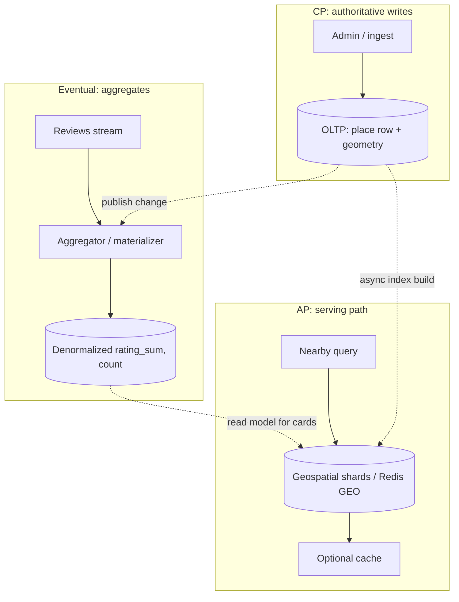
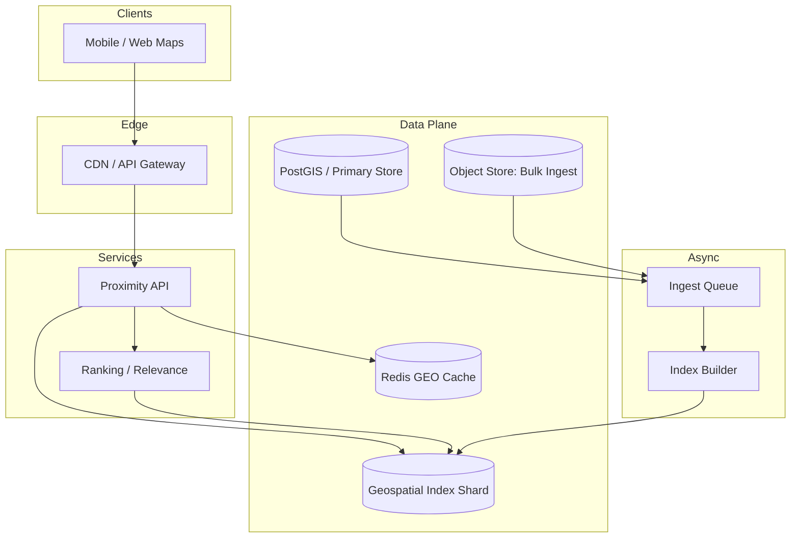
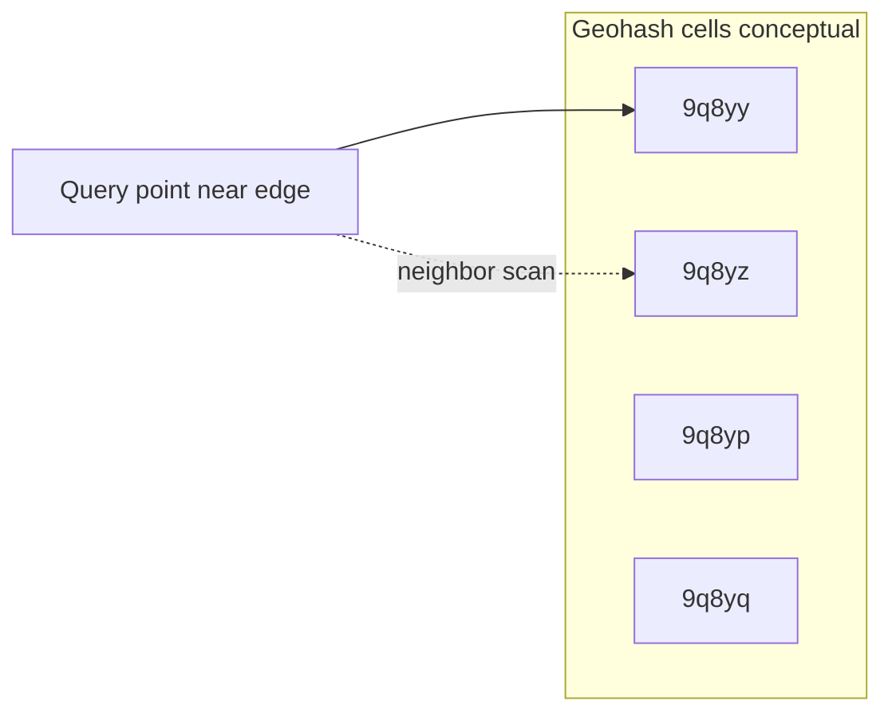
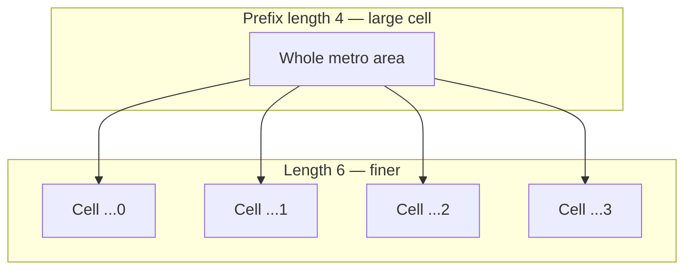
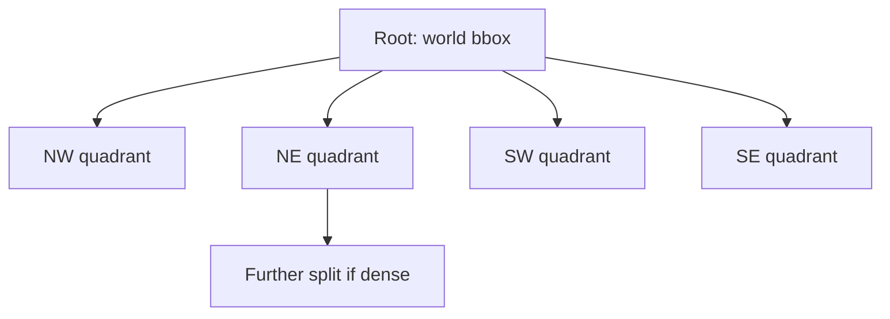
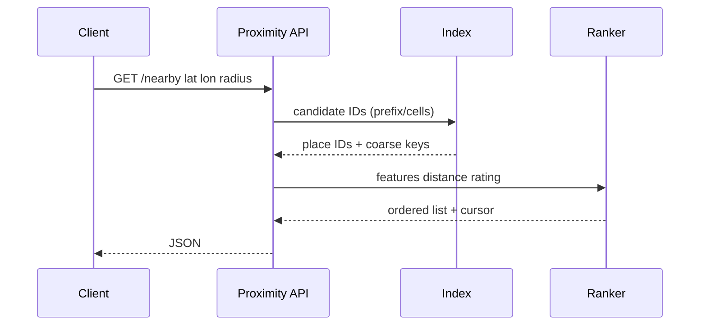

# Proximity Service (Nearby Places)

---

## What We're Building

We are designing a **proximity service** (also called **nearby search** or **location-based discovery**): given a user’s current latitude and longitude, return **points of interest** (POIs) such as restaurants, stores, fuel stations, or EV chargers within a **radius** (or bounding box), optionally **ranked** by distance, rating, or business rules.

Typical products include **Google Maps nearby**, **Yelp** local search, **Uber Eats** restaurant lists, and **retail store locators**. The core challenge is **efficient geospatial indexing** at scale: a naïve scan of all places with a **Haversine** distance check for every query does not survive billions of rows and high QPS.

### Scope

- **Read-heavy:** millions of **nearby** queries per day; catalog updates are comparatively rare.
- **Latency:** interactive maps expect **tens to low hundreds of milliseconds** for the first page of results (often **< 200 ms** P99 to the app, excluding client rendering).
- **Correctness vs approximation:** exact distance ranking may use precise Haversine on a **candidate set** after index pruning; the index itself may be approximate (grid cells, geohash prefixes).

!!! note
    In interviews, separate **indexing** (which cells to inspect) from **ranking** (distance, stars, sponsored slots). Mentioning **bounding-box prefilter + Haversine refine** shows production awareness.

---

## Step 1: Requirements

### Functional Requirements

| Requirement | Priority | Notes |
|-------------|----------|-------|
| **Nearby search** by lat/lon + **radius** (e.g., 2 km) | Must have | Define earth model (WGS84) and units |
| **Pagination** (`limit`, `cursor` or `offset` for small pages) | Must have | Stable ordering if using cursors |
| **Filter** by category (food, fuel), tags, hours | Should have | Often secondary indexes or denormalized fields |
| **Sort** by distance, rating, or **relevance** blend | Must have | Clarify tie-breaking |
| **Place details** by ID (separate API) | Must have | Decouple heavy payloads from list views |
| **Admin / batch ingest** of POIs (CSV, partner feeds) | Should have | Idempotent upserts, validation |

### Non-Functional Requirements

| Requirement | Target | Rationale |
|-------------|--------|-----------|
| **Latency** | P99 **< 200 ms** for nearby list (first page) | Map interactions feel sluggish above this |
| **Availability** | **99.9%–99.95%** | Degraded mode: cached tiles or stale index |
| **Scale** | **10K–100K+ QPS** peak (global product) | Event and lunch-hour spikes |
| **Consistency** | **Eventually consistent** catalog | New POIs may appear within seconds–minutes |
| **Durability** | POI data **durable**; ephemeral location optional | Separate hot path for live drivers if needed |
| **Cost** | Bounded **RAM** for hot geospatial structures | Sharding by region reduces per-host memory |

### API Design

**Nearby search (read):**

```http
GET /v1/places/nearby?lat=37.7749&lon=-122.4194&radius_m=2000&limit=20&sort=distance&category=restaurant
```

Example response (truncated):

```json
{
  "center": { "lat": 37.7749, "lon": -122.4194 },
  "radius_m": 2000,
  "places": [
    {
      "id": "pl_8f3a2",
      "name": "Example Cafe",
      "lat": 37.7751,
      "lon": -122.4180,
      "distance_m": 142.7,
      "score": 0.94
    }
  ],
  "next_cursor": "eyJjIjoicGxfOGYzYTIifQ==",
  "took_ms": 38
}
```

**Place detail:**

```http
GET /v1/places/{place_id}
```

**Batch ingest (internal):**

```http
POST /v1/internal/places/bulk
Content-Type: application/json
```

!!! tip
    Use **cursor-based** pagination for stable results under concurrent catalog updates; avoid large `offset` on deep pages at scale.

### CAP Theorem Analysis

**CAP** (Consistency, Availability, Partition tolerance) states that under a **network partition**, a distributed system cannot simultaneously guarantee both **strong consistency** and **full availability** for reads and writes. Real products rarely pick a single letter globally—they **partition the problem** by data domain and user expectation.

**Why it matters for proximity:** Nearby search is **latency-sensitive** and **read-dominated**. Clients expect an answer even if a replica is stale; missing results during an outage hurts UX more than seeing a POI that opened **30 seconds** ago on another shard. That pushes the **geospatial query path** toward **AP**: stay **available**, accept **eventually consistent** index views, and rely on **partition-tolerant** regional shards (geohash/S2) so failures isolate to a slice of the world.

| Subsystem | CAP lean | Rationale |
|-----------|----------|-----------|
| **Geospatial index & nearby reads** | **AP** | Serve candidates from **sharded** index stores and caches; **stale** cells or replica lag is acceptable if bounded (see SLOs). Prefer **degraded** (cached tile, wider cell) over hard failure. |
| **Authoritative business metadata** (hours, address, category, **is_open**) | **CP** (within region) | **Single source of truth** (e.g., Postgres row) with **strong** read-your-writes for **operators** and ingest pipelines. Cross-region may still be **async**, but **one primary** per entity avoids conflicting “official” hours. |
| **Ratings / review counts on list cards** | **AP** (eventual) | **Aggregates** updated by **async jobs** or **CRDT-friendly** counters; search results can show **slightly stale** averages. **Strong consistency** on every star click would bottleneck writes and hurt availability. |

**Interview narrative:** “We don’t choose C or A once—we **separate the hot read path** (AP, fast) from **transactional truth** for edits (CP where it matters) and **fan-out aggregates** (eventual).”



**Takeaway:** Geospatial **reads** optimize for **availability** and **low latency**; **canonical** place records optimize for **consistency** where the business requires a single truth; **social proof** numbers are **eventually** consistent to protect throughput.

### SLA and SLO Definitions

**Terminology (for interviews):**

- **SLI** (Service Level Indicator): a measurable metric (e.g., “share of successful nearby requests under 200 ms”).
- **SLO** (Service Level Objective): a **target** for an SLI over a window (e.g., “99% of requests < 200 ms per month”).
- **SLA** (Service Agreement): a **contract** with users/partners; often includes **credits** if SLOs are missed—many internal tiers use **SLOs only** until revenue depends on them.

**Example SLOs** (tune to product; numbers are illustrative for a consumer maps app):

| Area | SLI | SLO (monthly) | Why candidates care |
|------|-----|----------------|----------------------|
| **Search latency** | Nearby `GET` **server-side** latency | **P99 < 200 ms**, **P50 < 50 ms** | Matches interactive map expectations; separates **client** paint from **backend** work. |
| **Search availability** | Ratio of **2xx** vs all attempts (excluding client cancel) | **≥ 99.9%** monthly (tier **99.95%** if premium) | Maps feel “broken” when search fails; **degraded** (stale cache) still counts as success if defined in SLI. |
| **Geospatial accuracy** | Share of returned POIs with **Haversine distance ≤ radius × (1 + ε)** after refine | **≥ 99.99%** of results within **ε = 1%** radius slack | Catches index bugs, wrong **WGS84** handling, or missing **neighbor** cells. |
| **Data freshness** (new/updated businesses **visible** in nearby) | Time from **commit** in OLTP to **searchable** in index | **P95 < 60 s**, **P99 < 5 min** | Balances **ingest** cost vs “I just added my store” expectations. |
| **Index update latency** | Lag between **change event** and **materialized** row in geo shard / Redis | **P99 < 2 min** | Distinct from user-visible freshness if you batch; matters for **ops** dashboards and **replay** alerts. |

**Error budget policy:**

- **Budget** = allowed **unhealthy** time per window (e.g., if availability SLO is 99.9%, budget ≈ **43 minutes** downtime/month).
- **If budget is healthy:** ship **riskier** index changes, experiments, or **cache** TTL reductions carefully.
- **If budget burns fast:** freeze **non-critical** releases, **roll back** bad deploys, widen **degradation** (serve cache-only in hot regions), and **throttle** expensive queries (max radius, stricter rate limits).
- **Separate budgets** for **latency** vs **availability** so one does not mask the other.

!!! note
    In interviews, tie **freshness** SLO to the **async** path (queue + index builder) and **latency** SLO to **sync** read path—shows you understand **different failure surfaces**.

### Database Schema

**Design goals:** one **OLTP** source of truth for **editable** fields; **derived** geospatial structures for **serving**; **normalized** reviews with **denormalized** aggregates on `places` for fast list views.

**1. `places` (businesses / POIs)** — core entity:

| Column | Type | Notes |
|--------|------|--------|
| `id` | `UUID` or `BIGSERIAL` | Stable public id; opaque string in APIs (`pl_*`). |
| `name` | `TEXT` | Display name; optional **fts** vector if name search combined. |
| `category` | `TEXT` or `FK → categories(id)` | Filter/sort; normalized if taxonomy grows. |
| `lat`, `lng` | `DOUBLE PRECISION` | **WGS84**; validate ranges. |
| `geohash` | `CHAR(12)` (or generated) | **Denormalized** from lat/lng for prefix scans; **recomputed** on move. |
| `address` | `JSONB` or structured columns | Street, city, country; locale for display. |
| `hours` | `JSONB` or child table `place_hours` | Weekly schedule; **CP** updates here. |
| `rating` | `NUMERIC(3,2)` | **Denormalized** average; maintained by job from `reviews`. |
| `review_count` | `BIGINT` | Denormalized count. |
| `loc` | `GEOGRAPHY(POINT, 4326)` (PostGIS) | **Canonical** geometry; **not** duplicated in every index—**GiST** index on `loc`. |
| `created_at`, `updated_at` | `TIMESTAMPTZ` | Ingest auditing, freshness SLOs. |

**Why denormalize `geohash` on the row:** speeds **batch** reindex and **debug** (“which prefix is this place in?”); the **serving** tier may still use a **separate** KV keyed by prefix.

**2. Geospatial index structure (serving layer, conceptual)**

This is often **not** one giant SQL table for global QPS, but the **logical** model is:

- **Shard key:** coarse **`geohash_prefix`** (length 4–6) or **S2 cell** at fixed level → routes to a **regional** index service.
- **Per-shard store:** sorted sets / B-trees keyed by **`geohash` full string** or **`place_id` → {lat, lng, rank features}`** for **radius** queries (e.g., Redis **GEO** uses **geohash-like** encoding internally).
- **Optional auxiliary:** **R-tree** or **GiST** per region in PostGIS for **admin** analytics, not necessarily on the **hot** user path.

**Interview line:** “OLTP holds **`loc` + GiST** for truth and complex predicates; **read-optimized** shards hold **pre-partitioned** cells for **horizontal** scale.”

**3. `reviews`**

| Column | Type | Notes |
|--------|------|--------|
| `id` | `BIGSERIAL` / `UUID` | Primary key. |
| `business_id` | `FK → places(id)` | **Indexed** for listing by place. |
| `user_id` | `UUID` | **Unique** `(business_id, user_id)` if one review per user. |
| `rating` | `SMALLINT` | 1–5; **CHECK** constraint. |
| `text` | `TEXT` | Moderation, **PII** policy off logs. |
| `created_at`, `updated_at` | `TIMESTAMPTZ` | **Immutable** reviews common; edits bump `updated_at`. |

**Aggregate maintenance:** on insert/update/delete, publish to a **queue**; **aggregator** updates `places.rating` / `review_count` with **idempotent** sums or **periodic** reconciliation for **AP** consistency.

**Minimal DDL sketch (PostGIS-oriented):**

```sql
CREATE TABLE places (
  id              BIGSERIAL PRIMARY KEY,
  external_ref    TEXT UNIQUE,
  name            TEXT NOT NULL,
  category        TEXT NOT NULL,
  lat             DOUBLE PRECISION NOT NULL CHECK (lat BETWEEN -90 AND 90),
  lng             DOUBLE PRECISION NOT NULL CHECK (lng BETWEEN -180 AND 180),
  geohash         CHAR(12) NOT NULL,
  address         JSONB,
  hours           JSONB,
  rating          NUMERIC(3,2),
  review_count    BIGINT NOT NULL DEFAULT 0,
  loc             GEOGRAPHY(POINT, 4326) GENERATED ALWAYS AS (
                    ST_SetSRID(ST_MakePoint(lng, lat), 4326)::geography
                  ) STORED,
  created_at      TIMESTAMPTZ NOT NULL DEFAULT now(),
  updated_at      TIMESTAMPTZ NOT NULL DEFAULT now()
);

CREATE INDEX idx_places_loc_gist ON places USING GIST (loc);
CREATE INDEX idx_places_geohash ON places (geohash);

CREATE TABLE reviews (
  id              BIGSERIAL PRIMARY KEY,
  business_id     BIGINT NOT NULL REFERENCES places(id) ON DELETE CASCADE,
  user_id         UUID NOT NULL,
  rating          SMALLINT NOT NULL CHECK (rating BETWEEN 1 AND 5),
  body            TEXT,
  created_at      TIMESTAMPTZ NOT NULL DEFAULT now(),
  updated_at      TIMESTAMPTZ NOT NULL DEFAULT now(),
  UNIQUE (business_id, user_id)
);

CREATE INDEX idx_reviews_business ON reviews (business_id, created_at DESC);
```

!!! tip
    **Generated** `loc` avoids drift between raw lat/lng and geometry; in interviews, mention **migration** path if `geohash` is **application-computed** vs DB trigger.

---

## Step 2: Back-of-the-Envelope Estimation

Assume a **global** consumer app:

- **500M MAU**, **50M DAU** active near maps or local discovery.
- Each active session issues **~5 nearby** requests per day (panning, zooming, filter changes).

**Reads per day:** `50×10^6 × 5 = 2.5×10^8` ≈ **250M** nearby queries/day.

Average QPS: `2.5×10^8 / 86,400 ≈ 2,900` QPS.

Peak-to-average **10×** (evening, urban cores): **~30K QPS** globally for the search tier (order-of-magnitude; regional peaks differ).

### Data volume

- **50M** POIs worldwide (illustrative).
- Per POI metadata in index: id, lat, lon, category, small ranking features ≈ **200–500 B** in a compact form → **10–25 GB** raw payload before replication and auxiliary structures.

### Network

- Response **~2 KB** average × **30K QPS** → **~60 MB/s** egress from API layer (excluding internal replication).

!!! warning
    Treat every constant as **negotiable** in the interview. The goal is **sound magnitudes** and showing how **sharding** (by region/geohash) caps per-node work.

---

## Step 3: High-Level Design

At a high level: **clients** call a **stateless API**; **geospatial index** partitions the world so each query touches only **nearby buckets**; **ranking** merges distance with business scores; **caches** absorb hot tiles.



### Request path

1. **Validate** lat/lon, radius, limits (reject absurd radii).
2. **Cache key** from rounded center + radius bucket + filters (see deep dive).
3. **Index query:** candidate place IDs from **geohash prefixes**, **Redis GEO**, **S2 cells**, or **quadtree** traversal.
4. **Refine:** compute **Haversine** (or cheaper approximations) on candidates; apply **hard filters**.
5. **Rank:** `score = w1 * distance_score + w2 * rating + w3 * sponsored` (example).
6. **Paginate** and return.

!!! note
    **Write path** (new POI): persist to **OLTP** (Postgres + PostGIS), then **asynchronously** update shards / Redis / embedded search indexes to avoid blocking user writes on global index rebuilds.

---

## Step 4: Deep Dive

### 4.1 Geospatial Indexing Approaches

| Approach | Idea | Pros | Cons |
|----------|------|------|------|
| **Linear scan + Haversine** | Filter in app | Simple | O(N); only tiny datasets |
| **Bounding box + refine** | Prefilter by lat/lon range | Easy in SQL | Polar edge cases; still wide scans without indexes |
| **Geohash / grid** | Encode lat/lon as string; nearby points often share **prefix** | Fast prefix scans; cacheable | Edge artifacts at cell boundaries |
| **Quadtree** | Recursive plane subdivision | Adaptive density | Updates can split nodes; harder to shard |
| **R-tree / PostGIS GiST** | Balanced tree over rectangles | Mature in databases | Heavier writes; DB-bound |
| **S2 / H3** | Hierarchical spherical cells | Low distortion; uniform | Learning curve |

**Interview narrative:** Start with **bbox + index**, then explain why **geohash** or **S2** wins at scale; mention **Redis GEO** for pure proximity and **PostGIS** when SQL predicates matter.

---

### 4.2 Geohash

A **geohash** maps a 2D point to a **base-32 string** by interleaving bits of longitude and latitude in a **Z-order curve** (Morton code). Longer strings mean **smaller** cells.

**Encoding (conceptual):**

- Longitude and latitude are each bisected repeatedly; each bisect emits one bit; bits are **interleaved** (lon, lat, lon, lat, …).
- Groups of 5 bits map to **base32** characters (`0-9`, `b-z` excluding `a` in common alphabets—libraries handle the exact alphabet).

**Precision:** Each extra character refines the cell. Rule-of-thumb **approximate** cell sizes (equator):

| Length | Cell width (approx.) |
|--------|------------------------|
| 4 | ~20 km |
| 5 | ~2.4 km |
| 6 | ~600 m |
| 7 | ~76 m |
| 8 | ~19 m |

!!! warning
    Geohash cells are **rectangles** in lat/lon space, not equal-area on the sphere; distortion grows toward poles. Production systems often pair geohash with **Haversine** filtering or use **S2/H3** when uniformity matters.

**Neighbor cells:** A point near a cell edge may need **neighboring** geohashes in queries. Libraries expose **neighbor** APIs (8 neighbors in 2D) to avoid missing POIs just across a boundary.



**Grid visualization (prefix nesting):**



---

### 4.3 QuadTree

A **quadtree** recursively subdivides 2D space into four quadrants until each leaf satisfies a **capacity** (e.g., max 50 POIs) or **minimum cell size** is reached.

- **Dynamic splitting:** inserting a 51st point into a leaf triggers **split** into four children and redistribution.
- **Search:** traverse nodes overlapping the **query circle** (or bbox); descend only into intersecting children.



**Trade-offs:** Excellent for **memory** resident, **skewed** densities; harder to **partition cleanly** across thousands of machines than **fixed geohash/S2** shards. Hybrid: **in-memory quadtree per city shard**.

---

### 4.4 Google S2 Geometry

**S2** maps the sphere to hierarchical **cells** (a curve similar in spirit to geohash but built for **spherical** geometry). Each cell has an **ID**; children refine coverage.

- **Uniform-ish** cells reduce worst-case query stretch vs latitude-longitude rectangles.
- Used in large-scale systems needing **spatial joins**, **covering** regions with cells, and **consistent** sharding.

!!! tip
    In interviews, saying **“S2 for spherical cells + covering queries”** is often enough; deep diving into **S2RegionCover** is bonus points.

---

### 4.5 Database Choices for Geospatial Data

| Store | Mechanism | When to use |
|-------|-----------|-------------|
| **PostGIS** | `GEOGRAPHY`/`GEOMETRY`, **GiST/SP-GiST** indexes, `ST_DWithin` | Source of truth; complex predicates; joins |
| **Redis GEO** | Sorted sets keyed by **geohash-like** encoding internally | Sub-ms radius in RAM; ephemeral or cache |
| **Elasticsearch** | `geo_point`, `geo_shape` | Full-text + geo combined |
| **Cassandra + geohash** | Partition by geohash prefix | Wide-eventual; custom indexing |

**PostGIS pattern (illustrative SQL):**

```sql
-- Index: GiST on geography
CREATE INDEX idx_places_loc ON places USING GIST (loc);

SELECT id, name, ST_Distance(loc, ST_SetSRID(ST_MakePoint(:lon, :lat), 4326)::geography) AS d
FROM places
WHERE ST_DWithin(
  loc,
  ST_SetSRID(ST_MakePoint(:lon, :lat), 4326)::geography,
  :radius_m
)
ORDER BY d
LIMIT 20;
```

**Redis GEO commands:**

```text
GEOADD cities:sf -122.4194 37.7749 pl_1
GEORADIUS cities:sf -122.4194 37.7749 2 km WITHDIST COUNT 20 ASC
```

---

### 4.6 Search and Ranking

**Stage 1 — Index pruning:** Use **geohash prefixes**, **S2 cover**, or **quadtree** to collect **candidate IDs** (often 2–10× final `limit`).

**Stage 2 — Distance:** For each candidate, compute **Haversine** great-circle distance (or `ST_Distance` in PostGIS).

**Haversine** (core idea):

\[
a = \sin^2\frac{\Delta\phi}{2} + \cos\phi_1 \cos\phi_2 \sin^2\frac{\Delta\lambda}{2},\quad
c = 2 \atan2(\sqrt{a}, \sqrt{1-a}),\quad
d = R \cdot c
\]

where \(\phi\) is latitude, \(\lambda\) longitude, \(R\) earth radius.

**Stage 3 — Ranking:** Combine **distance** with **quality** (rating, click-through predictions), **business rules** (sponsored), and **diversity** (avoid duplicate chains). Logistic blends and **learning-to-rank** are common at scale; interviews often stop at **weighted sum**.

| Signal | Role |
|--------|------|
| **Inverse distance** | Primary for “near me” |
| **Star rating / reviews** | Quality prior |
| **CTR / conversion model** | Personalization |
| **Sponsored weight** | Monetization (disclose in product policy) |



---

### 4.7 Real-Time Location Updates

Not every proximity product tracks **moving** users against static POIs. If requirements include **live** dots (delivery couriers, friends):

- **Separate** high-churn **location stream** (Kafka, WebSocket) from **POI catalog**.
- **Consumers** maintain **in-memory** spatial structures per city or **Redis GEO** with short TTL.
- **Query:** “nearby drivers” uses the **same** geospatial primitives but **much faster** eviction and coarser precision.

!!! note
    Static POI search vs **live fleet** search often split into **two services** to isolate SLA and cost.

---

### 4.8 Caching for Location Queries

| Strategy | Key | TTL | Caveat |
|----------|-----|-----|--------|
| **Geohash prefix** | `gh:{prefix}:{radius_bucket}:{filters}` | 1–24 h | Boundary effects; include **neighbors** or widen prefix |
| **CDN / edge** | Rare for personalized; OK for **public** tile lists | — | Stale acceptable |
| **Application cache** | Full response for **quantized** center | Short | Quantization hides micro-movements |
| **Redis GEO** | Server-side **materialized** nearby for popular hubs | Minutes | Hotspot cities |

**Quantization:** Round lat/lon to **5–6 decimal places** (~1 m) or snap to **geohash prefix** before cache lookup to improve hit rate as users pan slightly.

**Prefix cache key example:**

| Component | Example |
|-----------|---------|
| Geohash (6 chars) | `9q8yyk` |
| Radius bucket | `r2000` |
| Category | `restaurant` |
| Full key | `nearby:9q8yyk:r2000:restaurant:v1` |

---

## Code References

Illustrative implementations: **geohash encode/decode**, **radius filter**, **quadtree insert/search**. Production code should use **battle-tested libraries**; below is interview-sized clarity.

**Geohash decode, Haversine distance, and bounding-box prefilter**

=== "Python"

    ```python
    import math
    
    BASE32 = "0123456789bcdefghjkmnpqrstuvwxyz"
    
    def decode_bbox(hash_str: str):
        even = True
        lat_min, lat_max = -90.0, 90.0
        lon_min, lon_max = -180.0, 180.0
        for c in hash_str:
            cd = BASE32.index(c)
            for mask in (16, 8, 4, 2, 1):
                bit = 1 if (cd & mask) else 0
                if even:
                    mid = (lon_min + lon_max) / 2
                    if bit == 1:
                        lon_min = mid
                    else:
                        lon_max = mid
                else:
                    mid = (lat_min + lat_max) / 2
                    if bit == 1:
                        lat_min = mid
                    else:
                        lat_max = mid
                even = not even
        return lat_min, lat_max, lon_min, lon_max
    
    def haversine_m(lat1, lon1, lat2, lon2, R=6371000.0):
        p1, p2 = math.radians(lat1), math.radians(lat2)
        dphi = math.radians(lat2 - lat1)
        dl = math.radians(lon2 - lon1)
        a = math.sin(dphi/2)**2 + math.cos(p1)*math.cos(p2)*math.sin(dl/2)**2
        return 2 * R * math.asin(min(1.0, math.sqrt(a)))
    
    def in_radius(candidates, lat, lon, radius_m):
        return [p for p in candidates if haversine_m(lat, lon, p["lat"], p["lon"]) <= radius_m]
    ```

=== "Java"

    ```java
    public final class GeoQuery {
        private static final double R_EARTH_M = 6_371_000.0;
    
        public static double haversineM(double lat1, double lon1, double lat2, double lon2) {
            double p1 = Math.toRadians(lat1);
            double p2 = Math.toRadians(lat2);
            double dLat = Math.toRadians(lat2 - lat1);
            double dLon = Math.toRadians(lon2 - lon1);
            double a = Math.sin(dLat / 2) * Math.sin(dLat / 2)
                    + Math.cos(p1) * Math.cos(p2) * Math.sin(dLon / 2) * Math.sin(dLon / 2);
            return 2 * R_EARTH_M * Math.asin(Math.min(1.0, Math.sqrt(a)));
        }
    
        /** Rough meters per degree latitude (for small bbox). */
        public static Bounds bboxAround(double lat, double lon, double radiusM) {
            double dLat = radiusM / 111_320.0;
            double dLon = radiusM / (111_320.0 * Math.cos(Math.toRadians(lat)));
            return new Bounds(lat - dLat, lat + dLat, lon - dLon, lon + dLon);
        }
    
        public record Bounds(double latMin, double latMax, double lonMin, double lonMax) {}
    }
    ```

### Geohash encode (interleave bits)

```java
public final class GeohashBits {
    private static final char[] BASE32 = "0123456789bcdefghjkmnpqrstuvwxyz".toCharArray();

    public static String encode(double lat, double lon, int bits) {
        double latMin = -90, latMax = 90, lonMin = -180, lonMax = 180;
        boolean even = true;
        StringBuilder bitsStr = new StringBuilder();
        while (bitsStr.length() < bits) {
            if (even) {
                double mid = (lonMin + lonMax) / 2;
                if (lon >= mid) {
                    bitsStr.append('1');
                    lonMin = mid;
                } else {
                    bitsStr.append('0');
                    lonMax = mid;
                }
            } else {
                double mid = (latMin + latMax) / 2;
                if (lat >= mid) {
                    bitsStr.append('1');
                    latMin = mid;
                } else {
                    bitsStr.append('0');
                    latMax = mid;
                }
            }
            even = !even;
        }
        StringBuilder out = new StringBuilder();
        String b = bitsStr.toString();
        while (b.length() % 5 != 0) {
            b = b + "0";
        }
        for (int i = 0; i < b.length(); i += 5) {
            int v = Integer.parseInt(b.substring(i, i + 5), 2);
            out.append(BASE32[v]);
        }
        return out.toString();
    }
}
```

### Quadtree insert and circular search

```go
package geo

type Point struct {
	ID string
	X  float64 // lon
	Y  float64 // lat
}

type Rect struct {
	MinX, MinY, MaxX, MaxY float64
}

func (r Rect) Contains(p Point) bool {
	return p.X >= r.MinX && p.X <= r.MaxX && p.Y >= r.MinY && p.Y <= r.MaxY
}

func (r Rect) IntersectsCircle(cx, cy, rad float64) bool {
	dx := clamp(cx, r.MinX, r.MaxX)
	dy := clamp(cy, r.MinY, r.MaxY)
	distSq := (cx-dx)*(cx-dx) + (cy-dy)*(cy-dy)
	return distSq <= rad*rad
}

func clamp(v, lo, hi float64) float64 {
	if v < lo {
		return lo
	}
	if v > hi {
		return hi
	}
	return v
}

type Node struct {
	Bounds   Rect
	Points   []Point
	Children [4]*Node
	Capacity int
}

func (n *Node) Insert(p Point) {
	if !n.Bounds.Contains(p) {
		return
	}
	if n.Children[0] == nil && len(n.Points) < n.Capacity {
		n.Points = append(n.Points, p)
		return
	}
	if n.Children[0] == nil {
		n.split()
	}
	for _, c := range n.Children {
		if c != nil {
			c.Insert(p)
		}
	}
}

func (n *Node) split() {
	mx := (n.Bounds.MinX + n.Bounds.MaxX) / 2
	my := (n.Bounds.MinY + n.Bounds.MaxY) / 2
	b := n.Bounds
	n.Children[0] = &Node{Bounds: Rect{b.MinX, my, mx, b.MaxY}, Capacity: n.Capacity}
	n.Children[1] = &Node{Bounds: Rect{mx, my, b.MaxX, b.MaxY}, Capacity: n.Capacity}
	n.Children[2] = &Node{Bounds: Rect{b.MinX, b.MinY, mx, my}, Capacity: n.Capacity}
	n.Children[3] = &Node{Bounds: Rect{mx, b.MinY, b.MaxX, my}, Capacity: n.Capacity}
	for _, pt := range n.Points {
		for _, c := range n.Children {
			c.Insert(pt)
		}
	}
	n.Points = nil
}

func (n *Node) Search(cx, cy, rad float64, out *[]Point) {
	if !n.Bounds.IntersectsCircle(cx, cy, rad) {
		return
	}
	if n.Children[0] == nil {
		for _, p := range n.Points {
			dx, dy := p.X-cx, p.Y-cy
			if dx*dx+dy*dy <= rad*rad {
				*out = append(*out, p)
			}
		}
		return
	}
	for _, c := range n.Children {
		if c != nil {
			c.Search(cx, cy, rad, out)
		}
	}
}
```

!!! warning
    The Go **circle test** uses **degree-space** for illustration; **production** code should run **Haversine** on candidates after the quadtree returns them, or use projected meters.

---

## Step 5: Scaling & Production

### Sharding

- **Shard key:** **geohash prefix** or **S2 cell** at a coarse level (e.g., length 4–5) maps to a **region cluster**.
- **Rebalance** when shards grow; use **consistent hashing** within regional pools.

### Replication & failover

- **Read replicas** for PostGIS; **Redis Cluster** for GEO caches.
- **Multi-AZ**; degrade to **stale cache** with short TTL rather than hard failure.

### Observability

- Metrics: **P99 latency**, **candidate set size**, **cache hit rate**, **empty results rate** by city.
- Traces: span from **API** → **index** → **ranker**.

### Safety

- **Rate limit** by API key / IP; **validate** lat/lon ranges; reject **absurd** radii that imply full table scans.

---

## Interview Tips

1. **Clarify** static POIs vs live moving targets before drawing boxes.
2. Name **two** index families (**prefix/geohash** vs **tree/R-tree/S2**) and when each shines.
3. Always mention **bbox or cell pruning** then **Haversine** refinement.
4. Discuss **cache keys** with **neighbor cells** or **widened** radius to avoid border misses.
5. Separate **online serving** from **batch ingest** and **async index build**.

---

## Interview Checklist

| Topic | Covered? |
|-------|----------|
| Functional + non-functional requirements | Yes |
| CAP split: geo reads (AP), metadata (CP), aggregates (eventual) | Yes |
| SLI/SLO/SLA + error budgets (latency, availability, freshness, index lag) | Yes |
| DB schema: places, reviews, geo index role | Yes |
| REST API + pagination | Yes |
| Traffic + storage estimates | Yes |
| High-level components (API, index, cache, async ingest) | Yes |
| Geohash: encoding, precision, neighbors | Yes |
| Quadtree: splitting, search | Yes |
| S2 / hierarchical spherical cells | Yes |
| PostGIS vs Redis GEO | Yes |
| Bbox + Haversine | Yes |
| Ranking: distance + relevance | Yes |
| Caching by geohash prefix / quantization | Yes |
| Scaling: sharding, observability | Yes |

---

## Sample Interview Dialogue

**Interviewer:** How would you find nearby restaurants efficiently?

**Candidate:** I’d start by confirming we’re indexing mostly static POIs with lat/lon. I’d expose a GET nearby API with lat, lon, radius, and limit. On the backend I wouldn’t scan all rows—I’d use a spatial index. Common options are geohash prefixes in a KV store or Redis GEO, PostGIS with a geography index, or S2 cells if we need uniform spherical buckets.

**Interviewer:** What about geohash edge cases?

**Candidate:** Nearby points can sit on opposite sides of a cell boundary, so I’d query the **central geohash** plus **neighbor** cells, or slightly **inflate** the prefix length / radius bucket. I’d still **re-check** distance with Haversine on the candidate set.

**Interviewer:** How do you rank results?

**Candidate:** After pruning, compute exact distance for candidates, filter by radius, then rank by a blend of distance and quality—rating or a learned score—with pagination via cursors.

**Interviewer:** How does this scale globally?

**Candidate:** Shard by coarse geohash or region, cache hot areas with quantized keys, async updates from the primary store to index shards, and monitor P99 and candidate counts per query.

**Interviewer:** When would you pick PostGIS over Redis?

**Candidate:** PostGIS when the **source of truth** lives in Postgres and we need complex predicates—polygons, joins with orders—or strong transactional updates. Redis GEO when we need **sub-millisecond** radius reads for hot keys and can tolerate separate sync from the primary DB.

---

## Summary

A **proximity service** needs **fast spatial pruning** (geohash prefixes, **quadtree** regions, **S2** cells, **PostGIS**, or **Redis GEO**) followed by accurate **Haversine** filtering and **blended ranking**. **Cache** responses by **geohash prefix** and **quantized** centers, remembering **neighbor cells** at boundaries. **Scale** with **regional sharding**, **async catalog ingestion**, and clear separation between **static POI search** and **real-time** location workloads when both exist.
