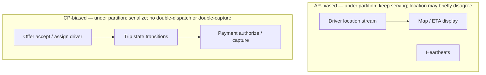
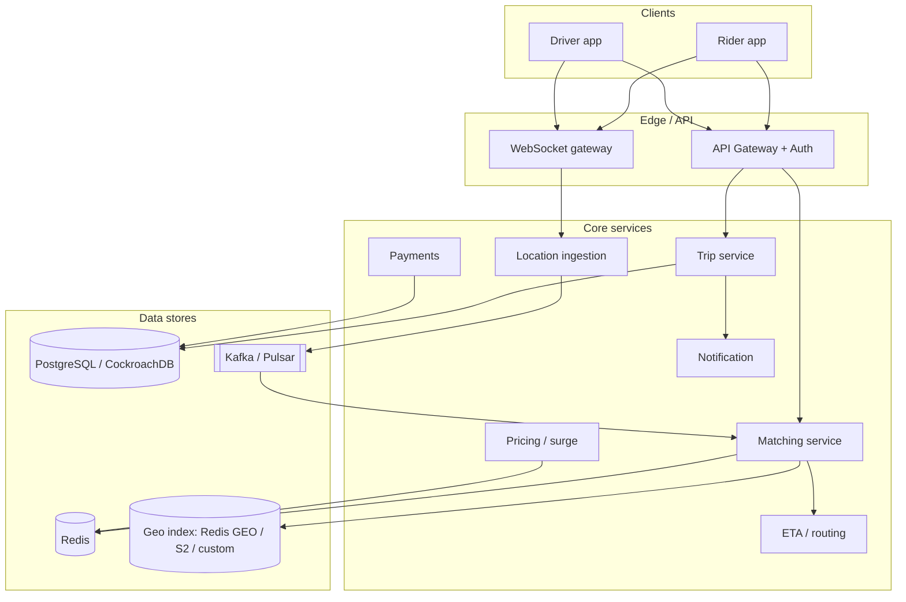
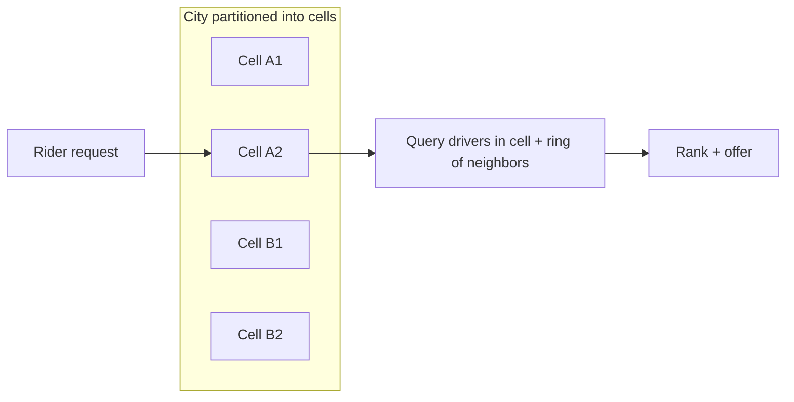
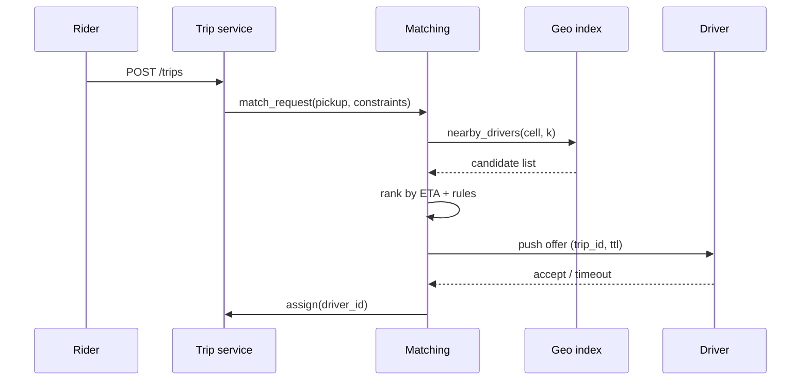
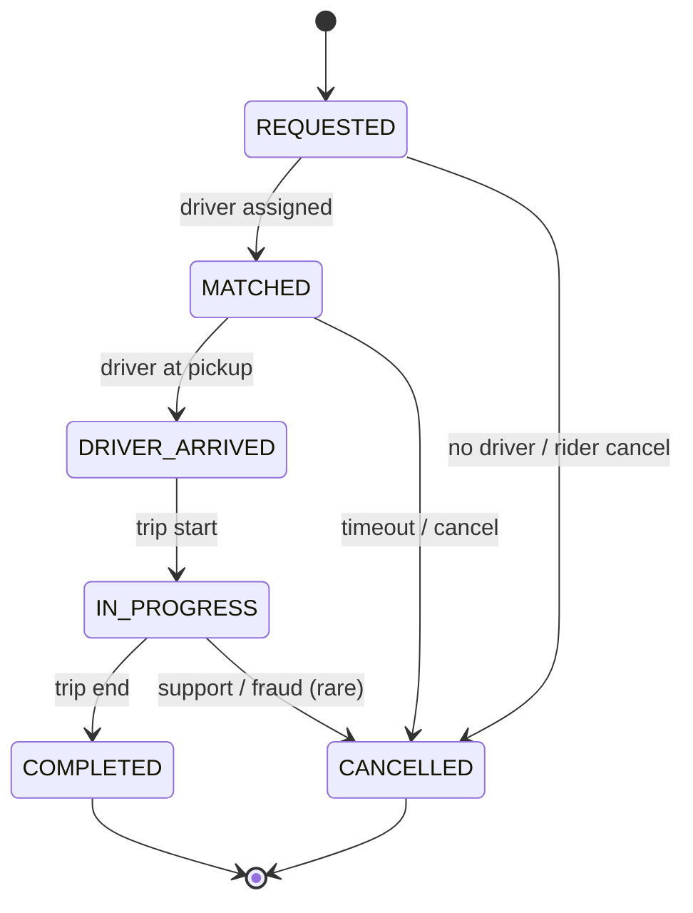
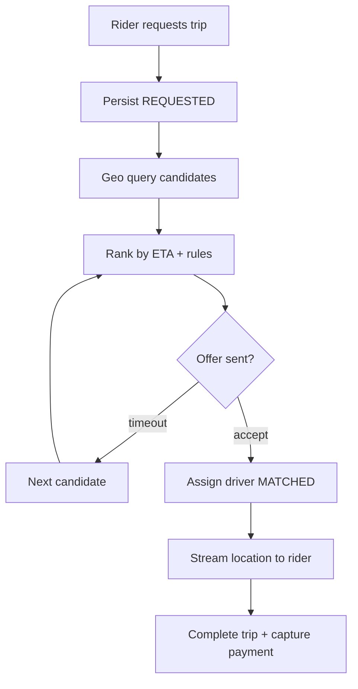

# Ride Sharing (Uber/Lyft)

---

## What We're Building

A **ride-hailing marketplace** that connects passengers who need trips with drivers who supply capacity, in real time, over a geographic area—conceptually similar to Uber, Lyft, or regional equivalents.

**Core capabilities in scope:**
- Riders request rides with pickup and (optional) drop-off locations
- The system finds suitable nearby drivers under business rules (vehicle type, capacity, bans)
- Live location updates for drivers and active trips (map UX, ETAs, safety)
- Trip lifecycle from request through completion, cancellation, and payment settlement
- Dynamic pricing (surge) when supply is scarce relative to demand
- Payments: authorize, capture, split (platform fee), and payout to drivers

### Why Ride Sharing Is Hard

| Challenge | Description |
|-----------|-------------|
| **Real-time geospatial load** | Millions of moving points; queries must be fast and geographically local |
| **Matching under constraints** | Nearest is not always best (heading, ETA, fairness, surge regions) |
| **Stateful trips** | Idempotent transitions; split-brain during network partitions hurts UX and money |
| **ETA accuracy** | Road network routing, traffic, and stale GPS all affect trust |
| **Payments** | Card networks, disputes, regional regulations, driver payouts |
| **Safety and abuse** | Fake GPS, collusion, account takeover; audit trails matter |

### Comparison to Adjacent Systems

| System | Similarity | Difference |
|--------|------------|------------|
| **Food delivery** | Dispatch + ETA + payments | Batchability, restaurant prep, less strict passenger-driver lock |
| **Chat / realtime** | WebSockets, presence | Ride sharing adds **geo indexes** and **trip state machines** |
| **Notification system** | Async fan-out | Here, **location streams** dominate hot paths |

!!! note
    In interviews, anchor numbers as **orders of magnitude**. Precise public metrics change by year and market; the goal is to show you understand **QPS**, **index cardinality**, and **operational trade-offs**.

---

## Step 1: Requirements

### Functional Requirements

| Requirement | Priority | Description |
|-------------|----------|-------------|
| Rider requests a ride | Must have | Pickup pin, optional drop-off, vehicle class |
| Driver availability | Must have | Online/offline; accepts trip offers |
| Driver-rider matching | Must have | Offer trip to suitable driver(s); fallback if declined or timeout |
| Live location | Must have | Stream driver position during dispatch and trip |
| Trip lifecycle | Must have | States from requested to completed/cancelled with rules per state |
| ETA / price estimate | Must have | Pre-trip ETA and fare band; update during trip |
| Payments | Must have | Charge rider; platform fee; pay driver per policy |
| Ratings | Should have | Post-trip feedback |
| Scheduled rides | Nice to have | Different matching window and reminder notifications |
| Pool / shared rides | Nice to have | Multi-stop routing and constraint satisfaction |

**Clarifying questions (typical)**

| Question | Why it matters |
|----------|----------------|
| One city or global? | Data residency, map providers, currency |
| Regulatory category? | Taxi vs TNC rules affect pricing display and data retention |
| Vehicle classes? | Matching filters and supply pools |
| Cancellation fees? | State machine transitions and payment intents |
| Fraud tolerance? | GPS spoofing detection depth |

### Non-Functional Requirements

| Requirement | Target | Rationale |
|-------------|--------|-----------|
| **Match latency** | **Low seconds** for offer round-trip | Riders abandon quickly |
| **Location update freshness** | **1–5 s** typical for map UX; adaptive | Battery vs accuracy trade-off |
| **Availability** | **99.9%+** for core APIs | Outages strand riders/drivers mid-trip |
| **Consistency** | **Strong** for trip state and payments | Money and safety; use OLTP stores and idempotent APIs |
| **Scalability** | Horizontal for stateless APIs; shard geo indexes | Hot cities create hot cells |
| **Durability** | Trip and payment events auditable for years | Disputes and regulation |

!!! warning
    Never claim **exactly-once side effects** at planetary scale without qualifiers. Use **idempotency keys** for payments and trip transitions; make reconciliation jobs first-class.

### API Design

**Transports**
- **HTTPS/JSON (or gRPC)** for request/response: create trip, cancel, history
- **WebSocket (or MQTT)** for high-frequency location and trip events to mobile apps

**Representative REST-style endpoints**

| Operation | Method | Purpose |
|-----------|--------|---------|
| `POST /v1/trips` | HTTP | Rider creates trip request (pickup, drop-off, product) |
| `POST /v1/trips/{id}/cancel` | HTTP | Cancel with reason; idempotency key |
| `GET /v1/trips/{id}` | HTTP | Trip detail and timeline |
| `POST /v1/drivers/heartbeat` | HTTP | Periodic availability + coarse location |
| `POST /v1/payments/intents` | HTTP | Create payment authorization |
| `WS /v1/stream` | WebSocket | Multiplexed: `location`, `trip.updated`, `offer`, `eta` |

**WebSocket message envelope (conceptual)**

```json
{
  "type": "location.update",
  "trip_id": "trip_01h2",
  "seq": 10442,
  "lat": 37.7749,
  "lng": -122.4194,
  "heading_deg": 90,
  "ts_ms": 1712000000000
}
```

!!! tip
    Sequence numbers or monotonic timestamps help clients **discard stale updates** after reconnects.

### Technology Selection & Tradeoffs

Ride sharing stacks several independent “knobs”: how you index space, how you move bits to clients, where you persist truth, how you assign work, and how you buffer high-volume streams. Interviewers care that you **name alternatives**, **compare on real constraints** (latency, ops cost, correctness), and **commit to a coherent story**.

#### Location indexing

| Approach | Idea | Strengths | Weaknesses | Typical use |
|----------|------|-----------|------------|-------------|
| **Geohash** | Hierarchical string/bit encoding of lat/lng into rectangular cells | Simple prefix scans in KV/Redis; easy bucketing and cache keys | Cell shapes stretch at poles; **edge neighbors** need explicit neighbor expansion, not prefix alone | Redis GEO, quick prototypes, cell-based surge |
| **R-tree / R\*-tree** | Balanced tree of bounding rectangles for points and polygons | Strong for **variable-density** data and polygon containment (zones, airports) | Higher write amplification; harder to shard horizontally than fixed cells | GIS databases (PostGIS), offline analytics, geofencing |
| **S2 (Google)** | Hilbert curve on a sphere; hierarchical cells with stable IDs | **Spherical** model; fast neighbor/cover ops; level-based refinement | Learning curve; you still tune cell level per city density | Global fleets, consistent cross-region logic |
| **H3 (Uber)** | Hexagonal hierarchical grid on the sphere | **Uniform neighbors** (6 at fine levels); good for **aggregates** (heatmap, surge hexes) | Not a drop-in for arbitrary “distance to point” APIs; tooling ecosystem smaller than S2 in some stacks | Demand/supply aggregation, surge maps, ML features |

**Why it matters in interviews:** Matching starts with **coarse spatial filtering**; the index should support **ring expansion**, **TTL eviction** for offline drivers, and **hot-cell** isolation in dense cores.

#### Real-time communication (client ↔ edge)

| Option | Model | Strengths | Weaknesses | Fit |
|--------|--------|-----------|------------|-----|
| **WebSocket** | Full-duplex TCP, often via HTTPS upgrade | Ubiquitous in mobile; simple multiplexed **trip + location** channels; CDN/WAF friendly | Stateful connections; reconnect storms; regional stickiness | **Default** for rider/driver live UX |
| **gRPC streaming** | HTTP/2 multiplexed RPC streams | Strong typing, flow control, binary payloads | Mobile/browser support and ops tooling vary; often paired with gateways | Service-to-service **high-QPS** streams (e.g., internal fan-out) |
| **MQTT** | Pub/sub over lightweight broker | Great for **many small devices** and topic fan-out | Less common as primary app API for consumer ride apps; extra hop (broker) | Telematics, IoT, some embedded fleets |

#### Database (trip truth vs hot geo vs write-heavy telemetry)

| Store | Strengths | Weaknesses | Role in ride sharing |
|-------|-----------|------------|----------------------|
| **PostgreSQL + PostGIS** | ACID transactions; **trip** and **payment** integrity; rich constraints; spatial predicates | Vertical scaling limits; cross-region latency if monolithic | **System of record** for trips, users, payments, disputes |
| **Redis GEO** | Sub-ms **nearby** queries; simple ops; pairs with geohash | Memory-bound; **not** your financial ledger; durability is a product choice (AOF/cluster) | **Live driver positions** and offer locks with TTL |
| **Cassandra** | Wide partitions; high ingest; multi-DC | Tunable consistency; **no** rich joins; operational complexity | **High-volume trip events**, location archives, idempotent write paths at huge scale |
| **DynamoDB** | Managed, predictable key-path access; global tables option | Hot partitions need design; limited ad-hoc query vs SQL | **Regional** trip metadata, ride history, feature stores with known access patterns |

**Interview pattern:** OLTP for **money and state machine**; Redis (or equivalent) for **geo hot path**; column/wide-column or KV for **append-only** telemetry at extreme scale.

#### Matching algorithm

| Approach | What it does | Pros | Cons |
|----------|----------------|------|------|
| **Greedy nearest (with ETA)** | Iteratively pick best-scoring driver by heuristic after spatial filter | Simple; fast; easy to add business rules | Can be globally suboptimal; order of offers matters |
| **Hungarian / min-cost assignment** | Optimal **one-to-one** assignment on a cost matrix | Strong when batching many simultaneous requests | **O(n³)**; expensive at city scale; needs batch windows |
| **ML-based ranking** | Learn weights or pairwise preferences from data | Handles **nonlinear** effects (acceptance, churn) | Cold start; explainability; still needs **guardrails** and fallbacks |

Production systems almost always combine **greedy + ETA + rules**, with **batch optimization** only in constrained windows (e.g., pool rides, small zones).

#### Message queue: location updates

| System | Strengths | Weaknesses | When to pick |
|--------|-----------|------------|--------------|
| **Kafka** | Durable log; high throughput; replay; consumer groups; cross-service contracts | Ops/heavy JVM ecosystem in some orgs; **ordering per key** is a discipline | **Default** for `driver.locations`: partition by `driver_id`, multiple consumers |
| **Redis Streams** | Low latency; simple if you already run Redis at core | Not the same multi-team replay story as Kafka at petabyte scale; persistence model must be explicit | Edge aggregation, smaller deployments, or **extra** fast path beside Kafka |

**Our choice (illustrative architecture)**  
- **S2 or geohash-backed Redis GEO** (or H3 for surge/heatmap) for **live** nearby queries—operational simplicity and proven mobile patterns.  
- **WebSockets** (or MQTT only if product is IoT-heavy) for **rider/driver** streams; **Kafka** for **location ingestion** and downstream consumers (matching freshness, ETA, analytics).  
- **PostgreSQL + PostGIS** as **source of truth** for trips and payments; **Redis** for geo + short-lived coordination; **Cassandra or DynamoDB** only when you justify **massive** append-only or multi-region access patterns with clear key design.  
- **Greedy matching with road-network ETA** and sequential offers; reserve **Hungarian/ILP** for bounded batch problems; layer **ML** on ranking weights, not as the only safety-critical assigner.  

This stack optimizes for **interview clarity**: separate **AP-friendly** location paths from **CP** trip/payment paths, and show you know **when** to pay for optimality vs latency.

### CAP Theorem Analysis

CAP is a **thought model**, not a literal database toggle: in partitions, you choose between **linearizable consistency** and **always answering** with possibly stale data. Ride sharing **mixes subsystems** with different tolerances.

| Subsystem | Dominant need | CAP lens (under partition) | Rationale |
|-----------|---------------|----------------------------|-----------|
| **Location tracking** | Freshness + availability | **AP**: accept that two clients might briefly disagree on exact coordinates; **eventual** convergence is OK | Maps can tolerate seconds of skew; **do not** block the world on GPS |
| **Ride matching** | No double-dispatch | **CP** for **assignment decision**: one writer “wins” (trip offer acceptance) | Two drivers must not be **MATCHED** to the same trip; use **compare-and-swap**, fencing tokens, or DB constraints |
| **Trip state** | Correct lifecycle | **CP** for transitions (`REQUESTED` → `MATCHED` → …) | Stale trip state breaks UX and billing; prefer **strong consistency** per `trip_id` |
| **Payment** | Monetary integrity | **CP**: authoritative ledger; **no** duplicated capture without idempotency | Card networks are **eventually consistent** externally; **your** ledger must reconcile |

**Why “driver location is AP but assignment is CP” is a strong interview answer:**  
- **Location** is **high volume** and **softly consistent**—show last-known-good with timestamps.  
- **Assignment** is **low volume** and **hard invariant**—serialize decisions on the trip row or dedicated lock service.



!!! note
    Mention **idempotency keys** and **single-writer** patterns for the CP side; mention **timestamps + sequence numbers** on the AP side so clients reject garbage after reconnect.

### SLA and SLO Definitions

SLAs are **contracts** (often external); **SLOs** are internal targets composed from **SLIs** (indicators). For interviews, define **what you measure**, **target**, and **how you burn error budget**.

#### Service level indicators and example objectives

| Area | SLI (what we measure) | Example SLO target | Why candidates care |
|------|------------------------|----------------------|---------------------|
| **Matching latency** | Time from `POST /trips` to **first driver offer sent** (p95/p99) | **p95 < 3 s**, **p99 < 8 s** in dense cities | Drives geo index + matching service budgets |
| **ETA accuracy** | Absolute error between **predicted** and **actual** trip time (p50/p90) | **p90 error < 25%** of trip duration (tune per market) | Wrong ETAs erode trust; tie to map/traffic pipeline |
| **Location freshness** | Age of last accepted driver position shown to rider (p95) | **p95 < 5 s** on trip; adaptive when idle | Battery vs UX; backpressure must not silently stall |
| **Trip completion rate** | **Completed / (requested − fraudulent)** over rolling window | **> 98%** “happy path” completion excluding rider cancel | Separates product health from **supply** gaps |
| **Payment processing** | Successful **capture** on first attempt / reconciliation latency | **99.95%** capture success within **60 s** of completion; **100%** eventual consistency via ledger | Money path gets the **tightest** objectives |

#### Error budget policy

| Principle | Practice |
|-----------|----------|
| **Budget = 1 − SLO** over window (e.g., 30 days) | Example: 99.9% monthly availability ⇒ **43.2 min** downtime budget |
| **Fast vs slow burn** | Alert on **burn rate**: consuming budget **too fast** blocks risky releases |
| **Feature flags** | Disable **non-critical** experiments (e.g., new ranker) when matching SLO burns |
| **Tiered response** | **Green**: normal deploys. **Yellow**: freeze features; scale matching. **Red**: degrade **AP** paths (coarser map) before **CP** paths (never “best effort” payments) |

!!! warning
    Never promise **100%** for distributed systems except where **business definition** allows (e.g., “100% of trips eventually reach terminal state **or** explicit reconciliation case”).

### Database Schema

Schemas below are **illustrative** for interviews: normalize **users**, keep **trips** as the core aggregate, isolate **high-churn** driver locations, and treat **payments** as append-only events with idempotency.

#### `users` (riders and drivers)

| Column | Type | Notes |
|--------|------|------|
| `user_id` | `UUID` (PK) | Stable identity |
| `role` | `ENUM('rider','driver','both')` | App may use separate profiles |
| `email` / `phone` | `TEXT`, hashed or tokenized | PII minimization |
| `status` | `ENUM('active','suspended',…)` | Fraud / compliance |
| `created_at` | `TIMESTAMPTZ` | Audit |

**`driver_profiles` (1:1 when role includes driver)**

| Column | Type | Notes |
|--------|------|------|
| `driver_id` | `UUID` (PK, FK → `users`) | |
| `vehicle_class` | `TEXT` | e.g., `ECONOMY`, `XL` |
| `license_region` | `TEXT` | Regulatory |
| `rating_avg` | `NUMERIC(3,2)` | Denormalized cache; source of truth can be aggregates |

#### `rides` / `trips`

| Column | Type | Notes |
|--------|------|------|
| `trip_id` | `UUID` (PK) | Public id in APIs |
| `rider_id` | `UUID` (FK → `users`) | |
| `driver_id` | `UUID` (FK → `users`, nullable until matched) | |
| `pickup_lat`, `pickup_lng` | `DOUBLE PRECISION` | Or `GEOGRAPHY(POINT)` in PostGIS |
| `dropoff_lat`, `dropoff_lng` | `DOUBLE PRECISION` | Nullable if unknown at request |
| `status` | `ENUM('REQUESTED','MATCHED',…)` | Align with state machine |
| `fare_estimate_cents` / `fare_final_cents` | `BIGINT` | Integer money |
| `currency` | `CHAR(3)` | ISO 4217 |
| `idempotency_key` | `TEXT` UNIQUE | Rider retries |
| `requested_at`, `matched_at`, `started_at`, `completed_at` | `TIMESTAMPTZ` | Timeline + SLO measurement |
| `version` | `BIGINT` | Optimistic locking for transitions |

Indexes: `(rider_id, requested_at DESC)`, `(driver_id, status)`, `(status, requested_at)` for ops dashboards.

#### `driver_locations` (hot path)

| Column | Type | Notes |
|--------|------|------|
| `driver_id` | `UUID` (PK) | One row per online driver, or partition by time if historified |
| `lat`, `lng` | `DOUBLE PRECISION` | |
| `geohash` / `s2_cell_id` | `TEXT` / `BIGINT` | Accelerate cell queries if not only in Redis |
| `heading_deg` | `SMALLINT` | Optional |
| `updated_at` | `TIMESTAMPTZ` | Freshness SLI |
| `trip_id` | `UUID` NULL | When on active trip |

At scale, **Redis GEO** holds the same fields with TTL; **OLTP** may store only **snapshots** or **nothing** if stream-only.

#### `payments`

| Column | Type | Notes |
|--------|------|------|
| `payment_id` | `UUID` (PK) | |
| `trip_id` | `UUID` (FK → `rides`) | |
| `payer_user_id` | `UUID` | Rider |
| `amount_cents` | `BIGINT` | |
| `currency` | `CHAR(3)` | |
| `status` | `ENUM('AUTHORIZED','CAPTURED','FAILED','REFUNDED')` | |
| `psp_reference` | `TEXT` | Opaque token from PSP |
| `idempotency_key` | `TEXT` UNIQUE | **Mandatory** for captures |
| `created_at`, `settled_at` | `TIMESTAMPTZ` | Reconciliation |

!!! tip
    In a deep dive, add **`trip_events`** (append-only) for audit and **`outbox`** rows for reliable downstream notifications—interviewers reward **event + transaction** pairing.

---

## Step 2: Back-of-the-Envelope Estimation

### Assumptions (illustrative metro)

```
- Metro DAU (riders + drivers): 2 million
- Completed trips per day: 8 million
- Average trip duration: 20 minutes active driving
- Peak factor: 2× average QPS during rush hour
- Location updates while on trip: 1 per 3 seconds per active driver
```

### Trip Creations per Second

```
8,000,000 trips / 86,400 s ≈ 93 trips/s average
Peak ≈ 186 trips/s (2×)
```

### Location Update Rate

```
Suppose 80,000 concurrent active trips city-wide at peak (illustrative).
Updates per second ≈ 80,000 / 3 ≈ 27,000 loc/s (plus idle driver heartbeats).
```

!!! note
    **Writes** to location pipelines often exceed **trip creation** QPS by an order of magnitude. Design the hot path for ingestion and aggregation, not just CRUD.

### Storage (orders of magnitude)

| Data | Illustrative daily volume | Notes |
|------|---------------------------|-------|
| Trip records | 8M rows/day | Indexed by rider, driver, time |
| Location samples | Billions of points/day | Often **short TTL** in hot store; archive to object storage |
| Payment ledger | 8M+ events | Immutable append log + OLTP |

### Bandwidth

If each location update is ~100 bytes on the wire after compression:

```
27,000 × 100 B ≈ 2.7 MB/s (location alone, one region)
```

Fan-out to maps, ETA services, and regional aggregators adds **egress** cost; **edge aggregation** helps.

---

## Step 3: High-Level Design

### Architecture Overview



**Responsibilities**
- **Trip service**: source of truth for trip state; emits domain events
- **Matching service**: candidate search, ranking, offer timeouts, reassignment
- **Location ingestion**: validate, throttle, publish to streams; update geo indexes
- **ETA service**: road-network routing + traffic overlays; caches frequent polylines
- **Pricing**: base fare, distance/time, surge multipliers with caps
- **Payments**: PSP integration; idempotent captures; payout scheduler

!!! tip
    Keep **trip state transitions** in a small number of services with clear ownership. Avoid “matching updates trip directly” and “trip calls matching in a circle” without a defined orchestration pattern (saga, outbox).

### Geospatial Grid (conceptual)



Cells may be **geohash prefixes**, **S2 cells**, or **quadtree** buckets backed by the same matching API.

---

## Step 4: Deep Dive

### 4.1 Location Tracking and Updates

**Goals**
- Fresh enough for map UX and ETA refinement
- Battery-friendly on mobile (adaptive sampling)
- Abuse-resistant (rate limits, plausibility checks)

**Pipeline**
1. Mobile batches points or sends on a timer (e.g., every 2–5 s on trip)
2. API validates JWT, trip/driver binding, and basic sanity (speed caps)
3. Ingestion writes to **Kafka** topic `driver.locations` partitioned by `driver_id`
4. **Consumers** update **Redis GEO** (or equivalent) for live queries
5. **Downsampler** writes **trip trace** to object storage for disputes (PII policy)

**WebSocket vs polling**
- **WebSocket** (or HTTP/2 streams) is standard for streaming updates to the rider during dispatch and trip
- Polling is simpler but wastes battery and increases tail latency

!!! note
    Treat **high-frequency location** as a **stream processing** problem: backpressure, poison messages, and consumer lag dashboards are production requirements.

### 4.2 Geospatial Indexing (Geohash / S2 / QuadTree)

| Approach | Idea | Pros | Cons |
|----------|------|------|------|
| **Geohash** | Hierarchical string encoding of lat/lng into base-32 cells | Simple prefix queries in KV stores; easy bucketing | Edge distortion; pole/corner neighbors need **neighbor list** not just prefix |
| **Quadtree** | Recursive subdivision of space | Adaptive density; good for variable driver density | More complex updates; hot leaves under stadium events |
| **S2 (Google)** | Hilbert curve on a sphere; hierarchical cells | Consistent sphere geometry; stable neighbor ops | Learning curve; need library support |

**When interviewers push “which one?”**
- At large scale, teams often use **S2** or **geohash + neighbor expansion** with **Redis GEO** (geohash under the hood) or a dedicated spatial service.
- **Quadtree** shines when you want **adaptive refinement** and can pay for more complex rebalancing.

**Comparison summary**

| Criterion | Geohash | Quadtree | S2 |
|-----------|---------|----------|-----|
| Spherical correctness | Approximate | Planar projection issues unless projected | Strong |
| Neighbor queries | Prefix + neighbor hashes | Tree traversal | Fixed-level cell union |
| Implementation effort | Low | Medium–high | Medium (library) |

### 4.3 Driver-Rider Matching Algorithm

**Problem shape**
- Find **K nearest** available drivers subject to:
  - **ETA to pickup** (not Euclidean distance)
  - **Heading / road access** heuristics
  - **Fairness** (avoid starving distant drivers entirely)
  - **Compliance** (licensed vehicle class)

**Typical stages**
1. **Coarse filter**: drivers in **cells overlapping** pickup plus **ring expansion** until minimum count or max radius
2. **Rank**: score `w1 * eta_pickup + w2 * idle_time + w3 * acceptance_rate + penalties`
3. **Offer**: send push/WebSocket offer; **timeout** (e.g., 10–20 s)
4. **Fallback**: next candidate; escalate surge or broaden radius



!!! warning
    **Nearest in straight-line distance** is a common trap. Interviewers reward mentioning **road-network ETA** and **one-way systems**.

### 4.4 ETA Computation

**Inputs**
- Map graph (nodes/edges), speed profiles by hour-of-week, live traffic feeds (probe speeds, closures)
- Live driver position for **remaining route** refresh

**Architecture sketch**
- **Precomputed** distances between region hubs for coarse estimates
- **Routing engine** (e.g., OSRM-like contraction hierarchies) for accurate paths on demand
- **Cache** ETAs by `(origin_cell, dest_cell, time_bucket)` with short TTL

**Failure modes**
- Stale traffic after incidents
- GPS drift in urban canyons
- Detours; communicate **confidence** (“7–11 min”) not false precision

### 4.5 Trip Lifecycle Management

**States (illustrative)**

| State | Meaning |
|-------|---------|
| `REQUESTED` | Rider created trip; matching not finished |
| `MATCHED` | Driver assigned; not yet arrived |
| `DRIVER_ARRIVED` | Driver at pickup zone |
| `IN_PROGRESS` | Trip started (meter on) |
| `COMPLETED` | Trip ended normally |
| `CANCELLED` | Cancelled by rider/driver/system with reason code |



**Implementation notes**
- Persist transitions with **monotonic version** or **state + epoch**
- All mutating endpoints accept **Idempotency-Key**
- Emit **outbox** events for notifications, analytics, and payment triggers

### 4.6 Surge Pricing

**Intent**
- Balance supply and demand when **requests exceed available drivers** in a micro-region

**Common model**

```
price = (base + per_minute * T + per_mile * D) * surge_multiplier
```

- **Surge multiplier** derived from **request rate**, **available driver count**, **ETA inflation**, sometimes **ML forecast**
- Apply **caps** and **transparency** (map shading); store **multiplier history** for support

| Concern | Mitigation |
|---------|------------|
| User backlash | Cap multiplier; show upfront estimate |
| Driver gaming | Detect coordinated cancels; anomaly on GPS |
| Split-brain pricing | Freeze multiplier at trip **request** time (versioned quote) |

### 4.7 Payment Integration

**Flows**
- **Authorize** at request or match (hold)
- **Capture** on completion (or incremental for long trips if product requires)
- **Platform fee** and **driver payout** via scheduled transfers or instant pay products

**Requirements**
- PCI scope minimization (use PSP tokens; never store PAN)
- **Idempotent** captures and refunds
- **Ledger + OLTP**: double-entry style for reconciliation

---

## Step 5: Scaling & Production

| Area | Technique |
|------|-----------|
| Geo hot spots | Partition indexes by **city/region**; avoid global locks |
| Location writes | **Partition Kafka** by driver; **batch** updates to Redis |
| Matching | **Precompute** coarse candidates; **cache** map tiles and ETA |
| Trips DB | **Shard** by `trip_id` or `city_id`; **avoid** cross-shard transactions for happy path |
| Observability | **Metrics**: match latency, offer acceptance, cancel reasons, ETA error |
| Resilience | **Timeouts** everywhere; **dead-letter** queues; **chaos** on regional failover |

**Disaster scenarios to mention**
- Data center failure: multi-AZ; Kafka mirroring; read-only degradation modes
- Payment provider outage: queue captures; manual reconciliation playbooks

---

## Interview Tips

- Start with **requirements** and **non-goals**; define **trip state** early
- Draw **geo index + matching pipeline** before micro-optimizing storage
- Separate **location streaming** from **transactional trip data**
- Always mention **idempotency** for payments and **event ordering** for analytics
- Close with **trade-offs**: strong consistency vs availability for **non-payment** paths

---

## Interview Checklist

| Phase | You should be able to |
|-------|------------------------|
| Requirements | List functional and non-functional requirements; ask about vehicle classes and regions |
| Estimation | Estimate trip QPS vs location QPS; storage for trips vs traces |
| High-level | APIs, WebSockets, trip service, matching, geo index, ETA, pricing, payments |
| Deep dive | Geohash vs S2 vs quadtree; matching stages; ETA inputs; surge fairness |
| Production | Sharding, Kafka lag, Redis hot keys, payment idempotency, monitoring |
| Closing | Trade-offs, failure modes, and how you would validate in shadow traffic |

---

## Sample Interview Dialogue

**Interviewer:** “Design Uber.”

**You:** “I will assume ride-hailing in large cities: riders request pickup/drop-off, we match an available driver, stream locations, complete the trip, and charge through a PSP. Out of scope: freight and micromobility unless you want them.”

**Interviewer:** “Focus on matching and real-time location.”

**You:** “Matching is not pure nearest-neighbor in Euclidean space. I would bucket drivers in a **spatial index**—geohash prefixes, **S2 cells**, or a **quadtree**—query an expanding set of cells around the pickup, then rank by **ETA from the road network**, idle time, and constraints. I would offer to one driver at a time with a **timeout**, then move to the next candidate.”

**Interviewer:** “How do drivers update location?”

**You:** “Mobile sends periodic points over HTTPS or streams via **WebSocket** during active trips. Ingestion validates and publishes to **Kafka** partitioned by `driver_id`. Consumers update **Redis GEO** for fast `GEORADIUS` queries and downsample traces to cheaper storage for disputes.”

**Interviewer:** “How do you handle surge?”

**You:** “Compute a **multiplier per micro-region** from demand/supply imbalance, with **caps** and a **frozen quote** at request time so riders are not surprised. Audit multiplier history for support.”

---

## Summary

Ride sharing combines **high-write location streams**, **geospatial indexing** (geohash, quadtree, or S2), **constrained matching** with **road-network ETA**, a clear **trip state machine**, **surge pricing** with transparency, and **payment correctness** via idempotent APIs and ledgers. In interviews, emphasize **separation of concerns** between real-time movement data and transactional trip state, and show how you would **scale the hot path** in dense cities without collapsing shared infrastructure.

---

## Appendix: Reference Code Snippets

### Geohash — encode and neighbor ring

=== "Python"

    ```python
    BASE32 = "0123456789bcdefghjkmnpqrstuvwxyz"
    
    def encode_geohash(lat: float, lon: float, precision: int = 9) -> str:
        """Simple geohash encoder (interleaved bit string), for interview illustration."""
        lat_interval = (-90.0, 90.0)
        lon_interval = (-180.0, 180.0)
        bits = []
        even = True
        while len(bits) < precision * 5:
            if even:
                mid = sum(lon_interval) / 2
                if lon >= mid:
                    bits.append(1)
                    lon_interval = (mid, lon_interval[1])
                else:
                    bits.append(0)
                    lon_interval = (lon_interval[0], mid)
            else:
                mid = sum(lat_interval) / 2
                if lat >= mid:
                    bits.append(1)
                    lat_interval = (mid, lat_interval[1])
                else:
                    bits.append(0)
                    lat_interval = (lat_interval[0], mid)
            even = not even
        out = []
        for i in range(0, len(bits), 5):
            val = 0
            for b in bits[i : i + 5]:
                val = (val << 1) | b
            out.append(BASE32[val])
        return "".join(out[:precision])
    ```

=== "Java"

    ```java
    import java.util.LinkedHashSet;
    import java.util.Set;
    
    /** Interview-style stub: use a library in production (e.g., ch.hsr geohash). */
    public final class GeoSearchRing {
        private GeoSearchRing() {}
    
        public static Set<String> ring(String centerGeohash, int neighborDepth) {
            Set<String> cells = new LinkedHashSet<>();
            cells.add(centerGeohash);
            // Pseudocode: for each prefix level, add 8 neighbors from library
            // Real impl: geohash.getAdjacent() for N, S, E, W, NE, NW, SE, SW
            for (int i = 0; i < neighborDepth; i++) {
                // expand set with neighbors of all current cells
            }
            return cells;
        }
    }
    ```

### Location update handler (Go)

```go
package location

import (
	"context"
	"encoding/json"
	"errors"
	"time"
)

var ErrInvalidCoords = errors.New("invalid coordinates")

type Update struct {
	DriverID string
	TripID   string
	Lat      float64
	Lng      float64
	Seq      int64
	TS       time.Time
}

type Publisher interface {
	Publish(ctx context.Context, topic string, key []byte, value []byte) error
}

func HandleLocation(ctx context.Context, p Publisher, u Update) error {
	if u.Lat < -90 || u.Lat > 90 || u.Lng < -180 || u.Lng > 180 {
		return ErrInvalidCoords
	}
	payload, err := json.Marshal(u)
	if err != nil {
		return err
	}
	return p.Publish(ctx, "driver.locations", []byte(u.DriverID), payload)
}
```

### Matching score (Python) — rank candidates

```python
def rank_score(eta_sec: float, idle_sec: float, accept: float, weights: tuple[float, float, float]) -> float:
    w_eta, w_idle, w_accept = weights
    # Lower is better; invert acceptance which is "higher is better"
    return w_eta * eta_sec + w_idle * idle_sec + w_accept * (1.0 - accept)
```

### Redis GEO query (illustrative)

```text
GEOADD drivers:online <lng> <lat> <driver_id>
GEORADIUS drivers:online <lng> <lat> 3 km WITHDIST ASC COUNT 20
```

---

## Appendix: Mermaid — Matching Flow (end-to-end)



!!! note
    Production systems add **experiments**, **shadow traffic**, and **safety checks** between every step; the diagram is a conceptual backbone for discussion.
