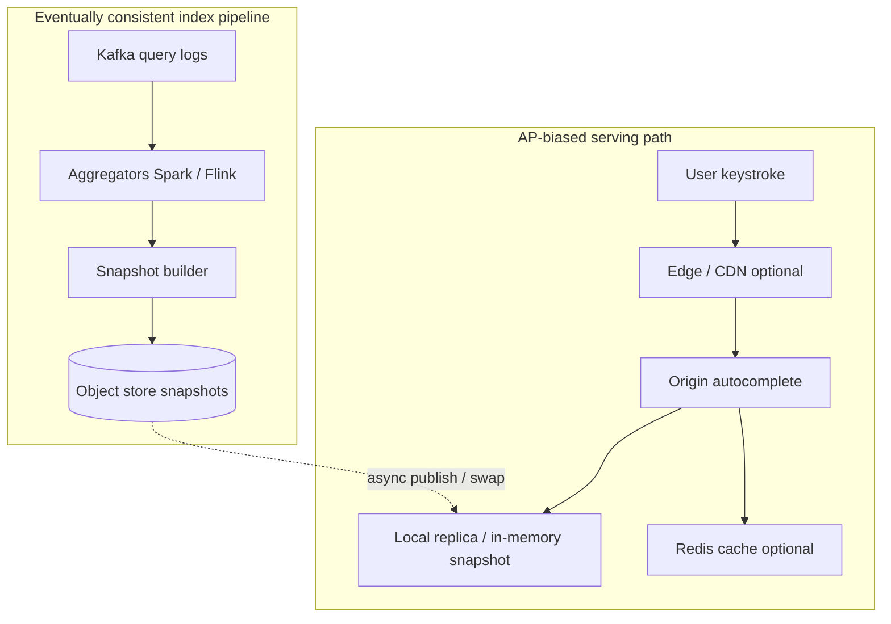
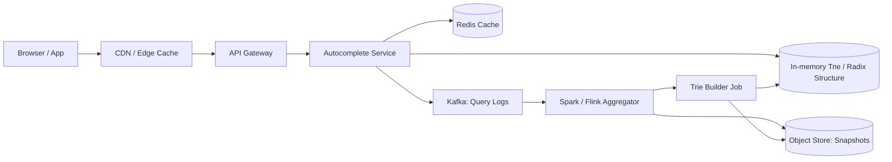
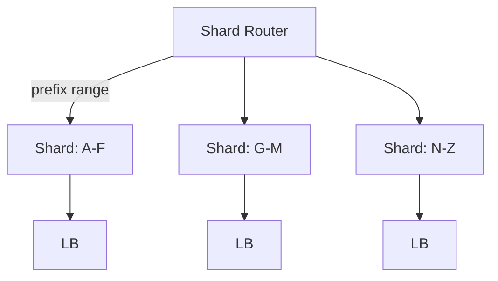
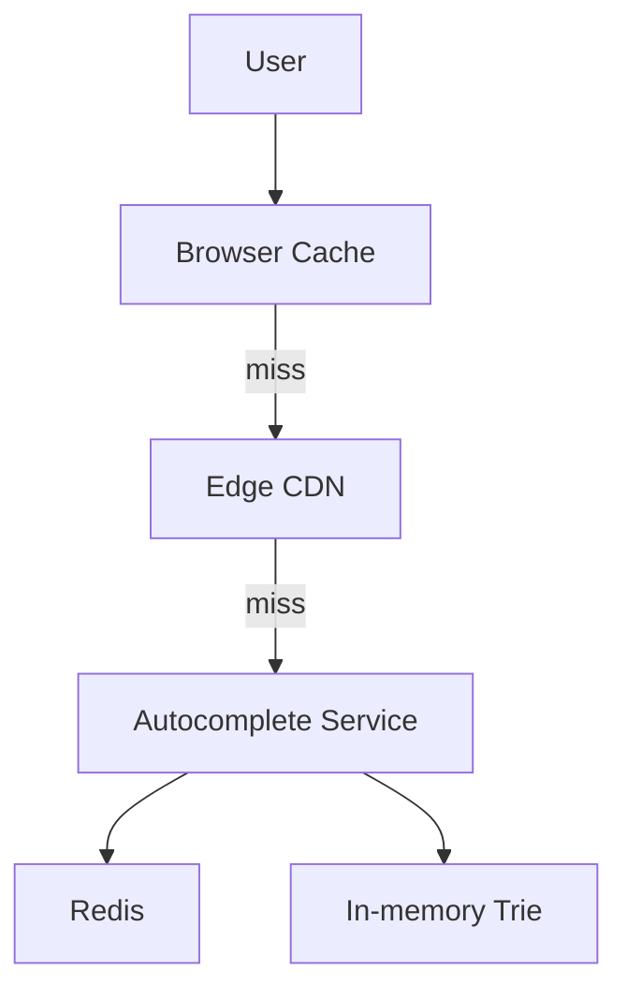
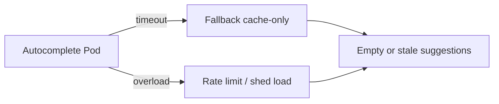
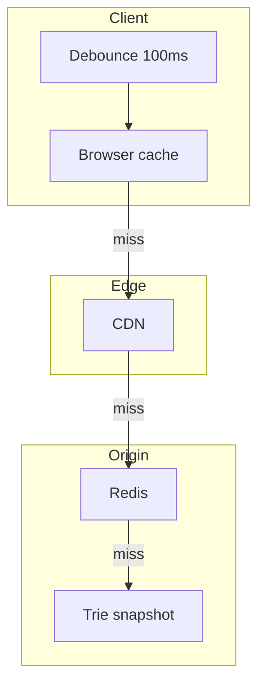

# Design a Search Autocomplete / Typeahead System

---

## What We're Building

We are designing a **search autocomplete** (also called **typeahead** or **query suggestions**) system: as a user types into a search box, the client shows a ranked list of **top-K** suggested queries—similar in spirit to Google’s search suggestions, Amazon’s product search, or YouTube’s search box.

### Scope

- **Google-like behavior:** suggestions appear **in real time** as the user types partial queries.
- **Latency target:** return **top-K** suggestions in **under ~100 ms** at the tail (P99), often tighter at P50.
- **Scale intuition:** Google processes on the order of **billions of queries per day**; each keystroke can trigger a suggestion request (often **debounced** on the client). Industry talks and public data often cite **~8.5B+ searches/day** globally for Google-scale search—your interview numbers will vary; always **align constants with the interviewer**.

!!! note
    In interviews, explicitly mention **debouncing**, **caching**, and **prefix-only** APIs—interviewers reward awareness that “every keystroke” is a product behavior, not necessarily one network call per key.

---

## Step 1: Requirements Clarification

### Questions to Ask

| Question | Why it matters | Typical follow-up |
|----------|----------------|-------------------|
| What is **K** (e.g., top 5 vs 10)? | Drives payload size, ranking cost, UI | Often 8–10 on desktop, fewer on mobile |
| Multi-language / locale? | Separate tries, normalization, collation | Per-locale shards or overlays |
| **Personalization** required? | User history, privacy, infra | Often phased: global first, personalize later |
| **Safe search** / policy filters? | Blocklists, legal, brand risk | Non-negotiable at big tech |
| **Freshness** of trends? | Pipeline latency vs accuracy | Hourly vs daily rebuilds |
| Traffic shape (**QPS**, peaks)? | Autoscaling, cache sizing | Peaks >> daily average |
| **Write path** for suggestions? | Usually none from users; admin/blocklist APIs | Mostly read-heavy |
| **Offline** vs **online** learning? | Batch aggregates vs streaming | Hybrid is common |

### Functional Requirements

| Requirement | Priority | Notes |
|---------------|----------|-------|
| Return **top 10** suggestions for a **prefix** | Must have | Define tie-breaking (stable sort) |
| Rank by **popularity / relevance** | Must have | Often blended with recency / trending |
| **Multi-language** support | Should have | Normalization + locale-specific ranking |
| **Personalization** (history, region) | Nice to have | Overlay or rerank in separate service |
| **Trending** queries surfaced | Nice to have | Sliding windows, decay |
| Admin APIs for **blocklist** / takedowns | Should have | Compliance |

### Non-Functional Requirements

| Requirement | Target | Rationale |
|-------------|--------|-----------|
| **Latency** | P99 **< 100 ms** (end-to-end) | Perceived instant typing |
| **Availability** | **99.99%** | Search box is high-impact |
| **Throughput** | **100K+ QPS** at peak (example) | Event days, news spikes |
| **Correctness** | Best-effort ranked lists | Not strongly consistent globally |
| **Cost** | Bounded memory per region | Trie + caches dominate |

### API Design

A minimal, cache-friendly read API:

```http
GET /suggestions?prefix=machine%20l&limit=10&locale=en-US&session_id=<opaque>
```

**Example response:**

```json
{
  "prefix": "machine l",
  "locale": "en-US",
  "suggestions": [
    { "text": "machine learning", "score": 0.98, "source": "global" },
    { "text": "machine learning course", "score": 0.91, "source": "global" }
  ],
  "took_ms": 12,
  "cache": "HIT"
}
```

!!! tip
    Use **GET** with a stable query string so **CDNs** and **browser caches** can reuse responses for popular prefixes. Avoid putting PII in URLs; `session_id` should be opaque and optional.

### Technology Selection & Tradeoffs

Autocomplete is a **read-optimized, prefix-constrained** problem: you need **sub-millisecond local lookups** at scale, **cheap invalidation** when models change, and a **clear separation** between “what the world searches” (global) and “what this user likely wants” (personalization). The choices below are the ones interviewers expect you to compare explicitly—not because one option always wins, but because **tradeoffs change with scale, team skills, and product requirements**.

#### Data structure

| Approach | How it works | Pros | Cons | Best when |
|----------|----------------|------|------|-----------|
| **Trie / radix / DAWG** | Walk edges for each character of the prefix; nodes hold top-K completions | True **O(prefix length)** navigation; natural prefix API; easy to cap depth | Memory for sparse branches; dynamic updates are awkward (prefer snapshots) | **High QPS**, strict latency, you control the binary layout |
| **Inverted index (term → postings)** | Map prefix to candidate terms via token dictionaries + postings | Great for **full-text** and fuzzy matching extensions | Prefix completion is not the native operation; more moving parts for pure typeahead | Hybrid search (suggestions + document retrieval) |
| **Prefix hash table** | Hash of prefix string → precomputed list of completions | **Simple**; fast O(1) map lookup if lists are small | Explodes key space for long prefixes; merging/ranking across shards is harder; hot-prefix memory | Small catalogs, **non-search** typeahead (SKU codes, usernames) |
| **Elasticsearch (completion / prefix query)** | `completion` suggester, `match_phrase_prefix`, or edge n-grams on analyzed text | **Mature** ecosystem, relevance tuning, ops tooling | Higher **tail latency** and cost at extreme QPS; tuning analyzers for multilingual prefixes is non-trivial | Teams already on ES; **moderate** QPS; need fuzzy + analyzers |

**Why it matters:** For interview “Google-scale typeahead,” a **custom in-memory trie snapshot** (often radix-compressed) is the usual winning story because it minimizes work on the hot path. Elasticsearch shines when **search relevance** and **text analysis** dominate; a plain hash map shines when the **key space is tiny** and you do not need linguistic structure.

#### Storage / serving substrate

| Approach | Pros | Cons | Best when |
|----------|------|------|-----------|
| **Redis (ZSET / HASH + TTL)** | Fast, familiar, great for **hot overlays**, A/B flags, cache | Not a trie; you model prefix keys explicitly or store blobs—**memory cost** can grow | Trending overlay, **cache**, session-scoped boosts, rate limits |
| **Custom in-memory trie (per process)** | Lowest latency; **immutable snapshots** + atomic swap | You own serialization, rollout, crash recovery | **Primary read path** for global suggestions at scale |
| **Elasticsearch cluster** | Query flexibility, horizontal scaling for text features | Ops overhead; harder to hit aggressive **P99** at huge QPS without heavy caching | Secondary index or **smaller** autocomplete tier |
| **Dedicated autocomplete microservice + object store** | Clear ownership; snapshots in **S3/GCS**; replayable builds | More services to deploy | Mature orgs separating **ML/ranking** from generic search |

**Why it matters:** Global popularity is usually served from **replicated in-memory artifacts** (mmap or heap) built offline. Redis is rarely “the whole trie” at web-scale; it is almost always **adjacent** (cache, trending, personalization features).

#### Ranking

| Signal type | Pros | Cons | Best when |
|-------------|------|------|-----------|
| **Popularity / global frequency** | Stable, cheap to compute, strong baseline | Misses spikes and user intent diversity | **V1** and backbone ranking |
| **Personalized (history, clicks)** | Higher CTR for signed-in users | Privacy, cold start, infra for per-user stores | Product requires **“your recent searches”** |
| **Recency / trending (time-decayed)** | Surfaces news and viral queries | Noisy; abuse-sensitive | Homepage/news/product search |
| **ML (learning-to-rank, embeddings)** | Can blend many features | Training/serving complexity; observability needs | Mature teams with logged **impressions/clicks** |

**Why it matters:** Interviewers want to hear **layering**: global trie provides **candidates + coarse order**; small overlays rerank with **trending** and **user boosts** under strict latency budgets.

#### Where to serve from

| Approach | Pros | Cons | Best when |
|----------|------|------|-----------|
| **Edge / CDN-cached** | Massive offload for **hot prefixes**; lower origin QPS | Stale suggestions until TTL or surrogate-key purge; harder personalization | Anonymous traffic, **popular** prefixes |
| **Centralized origin cluster** | Easier **consistent** routing, richer ranking context | Must scale for peaks | Default origin design |
| **Client-side trie / bloom of hot queries** | Zero network for cached prefixes | Bundle size; privacy; freshness control | Mobile **offline-ish** or very small static lists |

**Our choice:** **Immutable in-memory trie (radix/compressed) snapshots** for the global index, **atomic swap** on publish, **Redis** for generation-scoped caches and short-lived trending overlays, **CDN** for anonymous hot-prefix caching with **versioned keys**, and **centralized ranking** for personalization that needs stable session/context. **Rationale:** it minimizes work on the P99 path (trie walk + small merges), isolates **slow analytics** from **fast serving**, and uses managed caches only where they **reduce origin load** without becoming the source of truth for the full dictionary.

---

### CAP Theorem Analysis

The CAP framing for autocomplete is **not** “pick one of C, A, or P forever”—it is **which guarantees matter on which path**. Autocomplete is **read-heavy** and **latency-sensitive**; users prefer **fast, slightly stale** suggestions over **empty results** or **long waits**.

| Dimension | Serving path (user-facing) | Index / analytics path |
|-----------|----------------------------|-------------------------|
| **Consistency** | **Eventual** is acceptable: suggestions may lag real-world queries by minutes | **Eventual** is typical: aggregates, dedupe, and rebuilds complete asynchronously |
| **Availability** | **Favor availability + low latency**: degrade to cache/stale trie rather than hard-fail the box | Brief inconsistency across regions is OK if **serving** stays up |
| **Partition tolerance** | Under network splits, **do not** block the UI: serve **best-effort** from local replica/cache | Log pipelines may buffer (Kafka); builders **catch up** later |

**Interview takeaway:** treat the **serving tier as AP-oriented**: prefer **stale suggestions** over **no suggestions** when dependencies are unhealthy (Redis down → trie-only; partial shard → return what you have with lower K). Strong consistency across regions for “everyone sees the same top-10 instantly” is **not** worth the latency cost; **bounded staleness** (snapshot age, overlay TTL) is the right language.



**Why:** the **index** can sacrifice immediate cross-replica consistency because **search logs** are noisy and **rebuilds** are batch-oriented. The **user** cannot sacrifice **prompt feedback**—so the system **prioritizes partition tolerance + availability** on the read path, with **monotonic snapshot versions** to make staleness **explainable** (not random).

---

### SLA and SLO Definitions

SLAs are **contracts** (often external); SLOs are **internal targets** that should be **stricter** than the SLA so you keep **error budget** for dependencies and releases.

#### Core SLOs (example targets—tune with product)

| SLO | Target | Measurement window | Rationale |
|-----|--------|--------------------|-----------|
| **Suggestion latency** | **P99 < 100 ms** end-to-end (client to origin); **P50 < 20–40 ms** origin-only | 30-day rolling | Typing feels instant; tail drives perceived “jank” |
| **Availability** | **99.99%** successful suggestion responses (non-5xx, within timeout) | 30-day rolling | Search box is high-impact; budget for rare outages |
| **Relevance** | **CTR@K** or “success within top-K” ≥ baseline − small regression budget | 30-day rolling | Protects ranking changes; use **shadow** or **canary** traffic |
| **Index freshness** | **≤ 1 h** median age of global snapshot; trending overlay **≤ 5–15 min** | 7-day rolling | News/social need fresher tails without full rebuild every minute |

#### Error budget policy

- **Latency burn:** if **P99 latency** consumes error budget for **7 consecutive days**, freeze **non-critical** launches (new ranking experiments), increase **cache TTL** for safe prefixes, and **scale out** before new features.
- **Availability burn:** if **availability** drops below SLO, **disable** optional paths first (personalization overlay, experimental rerankers), **shed** load via stricter rate limits, and **fail open** to trie-only responses.
- **Relevance burn:** if **CTR@K** regresses beyond agreed threshold, **rollback** ranking weights via feature flag; do **not** compensate by increasing latency (avoid “fix relevance by searching harder” without a budget).

!!! note
    In interviews, pair each SLO with **how you measure it**: distributed tracing for latency, synthetic probes for availability, and **impression/click logs** for relevance—otherwise SLOs are wishful thinking.

---

### Database Schema

Autocomplete storage is **not** one relational table—it is a **logical model** split across **online serving structures**, **analytical warehouses**, and **streaming state**. Below is an interview-ready breakdown.

#### 1. Suggestion index (logical)

**Entities**

| Entity | Purpose | Key fields |
|--------|---------|------------|
| **Prefix node** | Navigation unit in trie (or segment in FSA) | `node_id`, `locale`, `depth`, optional `label` fragment |
| **Completion** | A candidate query string shown under a prefix | `query_text`, `global_score`, `sources[]`, `safety_flags` |
| **Snapshot** | Immutable generation of the whole structure | `snapshot_id`, `created_at`, `checksum`, `locale` |

**Logical relationships:** each **prefix node** references up to **K completions** (or IDs into a string table for deduplication). **Scores** are **pre-aggregated** offline so the read path avoids heavy joins.

#### 2. Query logs (raw, for aggregation)

Append-only events (Kafka → warehouse):

| Field | Type (logical) | Notes |
|-------|----------------|-------|
| `event_id` | UUID | Idempotency / dedupe |
| `ts` | timestamp | Event time |
| `normalized_query` | string | Lowercased, Unicode-normalized |
| `locale` | string | `en-US`, etc. |
| `session_id` | opaque id | **Not** PII if possible; rotate/hash |
| `impression` / `click` | boolean | For CTR and ranking |
| `client_version` | string | Debug |

**Why:** powers **global frequency**, **trending**, and **relevance** experiments; kept out of the **hot serving** path.

#### 3. Trending queries (short window)

| Field | Type (logical) | Notes |
|-------|----------------|-------|
| `query` | string | Canonical key |
| `window_start` | timestamp | Sliding or hopping window |
| `trend_score` | float | z-score, EWMA spike, etc. |
| `locale` | string | Partition key |

Often maintained in **streaming state** (RocksDB in Flink) or **Redis** with TTL for **fast overlay**.

#### Physical storage formats (how it actually sits in systems)

| Store | What you store | Format / access pattern |
|-------|----------------|-------------------------|
| **In-process trie** | Nodes + per-node **min-heap / sorted top-K** | Pointer graph or **packed arrays** for snapshots; **read-only** after swap |
| **Redis** | (a) `ZSET trending:{locale}` member=`query`, score=`trend`; (b) `STRING ac:v{gen}:{locale}:{prefix}` → JSON of top-K; (c) **rate counters** | **O(log N)** for ZSET updates; keys **versioned** by snapshot generation |
| **Object store** | Serialized **snapshot blobs** + manifest | **Immutability**; blue-green workers **mmap** or load at boot |
| **Warehouse (e.g., Iceberg/BigQuery)** | **query_logs** partitions by `date`, `locale` | Batch aggregates; **not** queried by online API |

**Interview tip:** say **why**—the trie is **CPU-cache-friendly** and **prefix-local**; Redis **ZSET** gives **bounded-size** trending without rebuilding the whole trie; the warehouse gives **correct aggregates** offline without touching P99 serving.

---

## Step 2: Back-of-the-Envelope Estimation

Assume:

- **1B DAU**
- **6 searches / user / day** → **6×10⁹ searches/day**
- Average **4 characters** typed per search (for sessions that use the box)
- **20%** of searches **trigger autocomplete** (feature usage—not every search)

### Autocomplete request volume

Not every character sends a request if the client **debounces** (e.g., 50–150 ms). A common interview simplification:

- Autocomplete sessions per day ≈ `0.20 × 6×10⁹ = 1.2×10⁹`.
- If each session sends **~2–4** suggestion requests after debouncing (not one per key), take **3** as a round number:

`3 × 1.2×10⁹ = 3.6×10⁹` autocomplete **requests/day**.

Average QPS:

`3.6×10⁹ / 86,400 ≈ 41,700 QPS` (average).

Peak-to-average ratios of **3×–10×** are common for global search (news, retail events). At **5×**:

`≈ 200,000 QPS` peak (order-of-magnitude sanity check against “100K+ QPS”).

!!! warning
    These numbers are **scenario knobs**. In an interview, state assumptions clearly and round to one significant figure unless asked for precision.

### Trie storage (order of magnitude)

Suppose the serving structure stores **tens of millions** of distinct prefixes / completions with metadata (scores, pointers). A compressed trie might use **tens to low hundreds of bytes** per active node **on average** (highly data-dependent).

- **100M nodes × 100 B ≈ 10 GB** per logical dictionary (illustrative).
- With **sharding** by prefix range, each shard holds a fraction; **replicas** multiply RAM footprint.

### Bandwidth

If each response averages **1 KB** (JSON with 10 suggestions + metadata):

`4×10⁴ QPS × 1 KB ≈ 40 MB/s` average egress from the suggestion tier (excluding replication/internal chatter)—again, peaks higher.

---

## Step 3: High-Level Design

At a high level, separate **online serving** (milliseconds) from **offline / nearline analytics** (minutes to hours) that rebuilds suggestion models.



### Two major subsystems

1. **Online serving (fast path):** resolve prefix → candidates → rank → filter → respond. Dominated by **in-memory structures** and **caches**.
2. **Offline trie building:** aggregate billions of events into **counts / scores**, build a new snapshot, **atomically swap** into serving.

!!! note
    Many production systems also maintain a **small “delta” layer** (recent trending) merged at read time, even if the bulk trie is rebuilt periodically.

---

## Step 4: Deep Dive

### 4.1 Trie Data Structure

#### Basics

A **trie** (prefix tree) stores strings so that prefixes share path prefixes. Each edge is labeled with a character (or token). Searching for a prefix walks from the root following edges.

```
        (root)
       /  |  \
      c   d   m
      |   |    \
      a   o     a
      |   |      \
      t   g       c
                ...
```

#### Frequency-augmented trie

For autocomplete, nodes often store:

- **Aggregate frequency** for the substring ending at that node (or for completions beneath it—define one convention and stick to it).
- Optional **top-K heap** at hot nodes (trade memory for speed).

**Retrieval:** from the node matching the prefix, collect candidates via:

- Traversal with pruning, or
- Precomputed top-K per node, or
- Hybrid: bounded DFS + heap merge.

=== "Python"

    ```python
    # Trie with heap for top-K; heapq min-heap tracks largest K via tuples
    from __future__ import annotations
    
    import heapq
    from dataclasses import dataclass
    from typing import Dict, List, Tuple
    
    
    @dataclass(frozen=True)
    class Suggestion:
        text: str
        score: float
    
    
    class TrieNode:
        __slots__ = ("children", "freq", "heap", "k")
    
        def __init__(self, k: int) -> None:
            self.children: Dict[str, TrieNode] = {}
            self.freq: float = 0.0
            self.k = k
            # min-heap of (score, text) — pop smallest when full
            self.heap: List[Tuple[float, str]] = []
    
        def offer(self, text: str, score: float) -> None:
            if self.k <= 0:
                return
            item = (score, text)
            if len(self.heap) < self.k:
                heapq.heappush(self.heap, item)
                return
            if score > self.heap[0][0]:
                heapq.heapreplace(self.heap, item)
    
    
    class TopKTrie:
        def __init__(self, k: int = 10) -> None:
            self.k = k
            self.root = TrieNode(k)
    
        def insert(self, query: str, score: float) -> None:
            if not query:
                return
            cur = self.root
            for ch in query:
                cur.freq += score
                cur = cur.children.setdefault(ch, TrieNode(self.k))
            cur.freq += score
    
            cur = self.root
            for ch in query:
                cur = cur.children[ch]
                cur.offer(query, score)
    
        def top_k(self, prefix: str) -> List[Suggestion]:
            cur = self.root
            for ch in prefix:
                nxt = cur.children.get(ch)
                if nxt is None:
                    return []
                cur = nxt
            # extract max-K from min-heap
            ranked = sorted(((s, t) for s, t in cur.heap), reverse=True)
            return [Suggestion(text=t, score=s) for s, t in ranked]
    ```

=== "Java"

    ```java
    // Mutable trie with per-node frequency and min-heap (K) for top completions
    import java.util.*;
    
    /**
     * Illustrative prefix trie for interview discussion.
     * Not production-hardened: Unicode, concurrency, and memory are simplified.
     */
    public class SuggestionTrie {
        static final class Node {
            final Map<Character, Node> children = new HashMap<>();
            long frequency; // aggregated weight for this path
            final PriorityQueue<Candidate> topK;
            final int k;
    
            Node(int k) {
                this.k = k;
                this.topK = new PriorityQueue<>(Comparator.comparingLong(c -> c.score));
            }
    
            void offerCompletion(String text, long score) {
                if (topK.size() < k) {
                    topK.add(new Candidate(text, score));
                } else if (score > topK.peek().score) {
                    topK.poll();
                    topK.add(new Candidate(text, score));
                }
            }
    
            List<Candidate> snapshotTop() {
                ArrayList<Candidate> list = new ArrayList<>(topK);
                list.sort((a, b) -> Long.compare(b.score, a.score));
                return list;
            }
        }
    
        public static final class Candidate {
            public final String text;
            public final long score;
    
            public Candidate(String text, long score) {
                this.text = text;
                this.score = score;
            }
        }
    
        private final Node root;
        private final int k;
    
        public SuggestionTrie(int k) {
            this.k = k;
            this.root = new Node(k);
        }
    
        public void insert(String query, long score) {
            if (query == null || query.isEmpty()) return;
            Node cur = root;
            for (int i = 0; i < query.length(); i++) {
                char ch = query.charAt(i);
                cur = cur.children.computeIfAbsent(ch, c -> new Node(k));
                cur.frequency += score; // simple propagation example
            }
            // Register full string at the terminal walk (here: repeat traversal)
            Node n = root;
            for (int i = 0; i < query.length(); i++) {
                char ch = query.charAt(i);
                n = n.children.get(ch);
                n.offerCompletion(query, score);
            }
        }
    
        public List<Candidate> topKForPrefix(String prefix) {
            Node n = root;
            for (int i = 0; i < prefix.length(); i++) {
                char ch = prefix.charAt(i);
                n = n.children.get(ch);
                if (n == null) return Collections.emptyList();
            }
            return n.snapshotTop();
        }
    }
    ```

=== "Go"

    ```go
    // Concurrent-safe trie: RWMutex, rune-wise children (Unicode)
    package trie
    
    import (
    	"container/heap"
    	"sort"
    	"sync"
    )
    
    type Candidate struct {
    	Text  string
    	Score int64
    }
    
    type minHeap []Candidate
    
    func (h minHeap) Len() int           { return len(h) }
    func (h minHeap) Less(i, j int) bool { return h[i].Score < h[j].Score }
    func (h minHeap) Swap(i, j int)      { h[i], h[j] = h[j], h[i] }
    
    func (h *minHeap) Push(x any) { *h = append(*h, x.(Candidate)) }
    func (h *minHeap) Pop() any {
    	old := *h
    	n := len(old)
    	x := old[n-1]
    	*h = old[0 : n-1]
    	return x
    }
    
    type node struct {
    	mu        sync.Mutex
    	children  map[rune]*node
    	freq      int64
    	topK      int
    	heap      minHeap
    }
    
    func newNode(k int) *node {
    	return &node{children: make(map[rune]*node), topK: k}
    }
    
    func (n *node) offer(c Candidate) {
    	if n.topK == 0 {
    		return
    	}
    	if len(n.heap) < n.topK {
    		heap.Push(&n.heap, c)
    		return
    	}
    	if c.Score > n.heap[0].Score {
    		heap.Pop(&n.heap)
    		heap.Push(&n.heap, c)
    	}
    }
    
    // ConcurrentTrie is safe for concurrent reads; inserts should be managed by a builder thread in production.
    type ConcurrentTrie struct {
    	mu   sync.RWMutex
    	root *node
    	k    int
    }
    
    func NewConcurrentTrie(k int) *ConcurrentTrie {
    	return &ConcurrentTrie{root: newNode(k), k: k}
    }
    
    func (t *ConcurrentTrie) Insert(s string, score int64) {
    	runes := []rune(s)
    	t.mu.Lock()
    	defer t.mu.Unlock()
    
    	cur := t.root
    	for _, r := range runes {
    		if cur.children[r] == nil {
    			cur.children[r] = newNode(t.k)
    		}
    		cur = cur.children[r]
    		cur.freq += score
    	}
    	// register completions along the path (simplified pattern)
    	cur = t.root
    	for _, r := range runes {
    		cur = cur.children[r]
    		cur.offer(Candidate{Text: s, Score: score})
    	}
    }
    
    func (t *ConcurrentTrie) TopK(prefix string) []Candidate {
    	runes := []rune(prefix)
    	t.mu.RLock()
    	defer t.mu.RUnlock()
    
    	cur := t.root
    	for _, r := range runes {
    		cur = cur.children[r]
    		if cur == nil {
    			return nil
    		}
    	}
    	out := make([]Candidate, len(cur.heap))
    	copy(out, cur.heap)
    	sort.Slice(out, func(i, j int) bool { return out[i].Score > out[j].Score })
    	return out
    }
    ```

!!! warning
    For hot paths, prefer **pre-sorted immutable snapshots** built offline; sorting on every read adds CPU cost when QPS is high.


---

### 4.2 Trie Optimization

#### Compressed trie (radix tree)

Merge chains of nodes with **single children** into one edge labeled with a **substring**. This reduces pointer overhead and improves cache locality—critical at billion-query scale **when the tree is sparse**.

#### Node pruning

Remove ultra-low-frequency branches to cap memory:

- **Minimum support threshold** (e.g., count ≥ N in the aggregation window).
- **Per-depth budgets** (deeper nodes must justify storage).

#### Limit trie depth

Cap **max prefix length** (e.g., **50** Unicode scalars) to bound worst-case traversal and abuse (megabyte “prefixes”).

#### Memory per node (rough)

| Component | Typical cost |
|-----------|--------------|
| Child map overhead | Pointers + hash/map structure |
| Edge label | Strings or packed byte slices |
| Scores / metadata | 8–32 bytes |
| Top-K heap | O(K) entries at hot nodes |

!!! tip
    Prefer **immutable snapshots** built offline with **dense arrays** + **FSA**-like layouts for production serving—maps of children are easy to explain in interviews but not always the most RAM-efficient representation.

#### Comparison table

| Approach | Pros | Cons |
|----------|------|------|
| **Basic trie** | Simple to explain | High pointer overhead |
| **Radix tree** | Less memory, fewer hops | More complex splits/merges |
| **DAWG / FSA** | Very compact | Harder dynamic updates |
| **Precomputed top-K per node** | O(prefix) lookup | Stale until rebuild; memory |
| **On-the-fly DFS + heap** | Lower memory | Higher CPU on hot paths |

---

### 4.3 Data Collection & Analytics Pipeline

**Instrumentation:** clients and API gateways emit structured events:

- `session_id`, `prefix`, `chosen_suggestion` (if any), timestamps, locale.

**Ingest:** append-only logs → **Kafka**.

**Aggregate:** **Flink/Spark** jobs compute:

- **Global** frequency per query string
- **Time-decayed** counts (exponential decay)
- **Trending** spikes vs baseline (e.g., z-score on deltas)

Use **sliding windows** (1h, 24h, 7d) with **watermarks** for event time.

```mermaid
flowchart LR
  LB[Load Balancer]
  API[Autocomplete API]
  K[Kafka Topics]
  F[Flink / Spark Streaming]
  DW[(Data Warehouse)]
  OFF[Offline Batch: Daily/hourly)]
  FS[(Feature Store / Object Store)]
  JOB[Aggregator Outputs: CSV/Parquet)]

  LB --> API
  API --> K
  K --> F
  F --> DW
  K --> OFF
  OFF --> JOB
  JOB --> FS
```

#### Python: batch aggregation sketch (pandas-style)

```python
from dataclasses import dataclass
from typing import Iterable, Tuple
import hashlib


@dataclass
class QueryEvent:
    query: str
    weight: float
    locale: str


def stable_shard_key(query: str, shards: int) -> int:
    h = hashlib.sha256(query.encode("utf-8")).digest()
    return int.from_bytes(h[:8], "big") % shards


def aggregate_counts(events: Iterable[QueryEvent]) -> dict[Tuple[str, str], float]:
    counts: dict[Tuple[str, str], float] = {}
    for e in events:
        key = (e.locale, e.query.strip().lower())
        counts[key] = counts.get(key, 0.0) + e.weight
    return counts


def decay_merge(
    previous: dict[Tuple[str, str], float],
    fresh: dict[Tuple[str, str], float],
    alpha: float,
) -> dict[Tuple[str, str], float]:
    """Exponential decay merge: alpha in (0,1], higher alpha favors fresh."""
    keys = set(previous.keys()) | set(fresh.keys())
    out: dict[Tuple[str, str], float] = {}
    for k in keys:
        out[k] = alpha * fresh.get(k, 0.0) + (1 - alpha) * previous.get(k, 0.0)
    return out
```

!!! note
    Real pipelines add **bot filtering**, **deduplication**, and **privacy** constraints (e.g., differential privacy or minimum thresholds before storing rare queries).

---

### 4.4 Trie Building (Offline)

**Batch rebuild** from aggregated counts:

1. Load `(query, score)` pairs.
2. Build a new trie snapshot in memory (or memory-map a serialized artifact).
3. **Atomic swap** pointer / file descriptor in serving processes (**blue-green**).

**Incremental updates** help between rebuilds but complicate correctness; many systems use **small overlays** (e.g., Redis ZSET for hot queries) merged at read time.

=== "Java"

    ```java
    // Trie builder service (sketch)
    import java.io.*;
    import java.util.*;
    
    public class TrieBuilderService {
        public static SuggestionTrie buildFromCounts(Map<String, Long> queryToCount, int k) {
            SuggestionTrie trie = new SuggestionTrie(k);
            for (Map.Entry<String, Long> e : queryToCount.entrySet()) {
                trie.insert(e.getKey(), e.getValue());
            }
            return trie;
        }
    
        public static void writeSnapshot(SuggestionTrie trie, File out) throws IOException {
            try (ObjectOutputStream oos = new ObjectOutputStream(new FileOutputStream(out))) {
                oos.writeObject(trie); // illustrative only—prefer custom binary format
            }
        }
    }
    ```

=== "Go"

    ```go
    // Atomic trie swap
    package serving
    
    import "sync/atomic"
    
    type Snapshot struct {
    	trie *ConcurrentTrie
    }
    
    type AtomicTrieHolder struct {
    	ptr atomic.Pointer[Snapshot]
    }
    
    func (h *AtomicTrieHolder) Current() *ConcurrentTrie {
    	s := h.ptr.Load()
    	if s == nil {
    		return nil
    	}
    	return s.trie
    }
    
    func (h *AtomicTrieHolder) Publish(t *ConcurrentTrie) {
    	h.ptr.Store(&Snapshot{trie: t})
    }
    ```

!!! warning
    Java serialization is shown for **interview simplicity**. Production systems use **versioned binary formats**, **checksums**, and **mmap**-friendly layouts.


---

### 4.5 Ranking & Personalization

**Signals**

- **Global popularity** (long-term counts)
- **Recency** / **trending** (short-term spikes)
- **User history** (recent searches, clicks)
- **Geo** / locale affinity
- **Safety** penalties (blocked terms)

A simple **interview-friendly** scoring formula:

\[
\text{score}(q) = w_1 \log(1 + f_{\text{global}}) + w_2 \cdot f_{\text{trend}} + w_3 \cdot f_{\text{user}} - w_4 \cdot \text{penalty}_{\text{safety}}
\]

**User overlay:** maintain a small per-user **LRU** of recent successful queries; boost if prefix matches.

**A/B testing:** route cohorts to different weight vectors; log impressions/clicks; optimize for CTR or success metrics.

#### Python: ranking service sketch

```python
from __future__ import annotations

from dataclasses import dataclass
from typing import Dict, List, Sequence


@dataclass(frozen=True)
class RankedQuery:
    text: str
    score: float


class RankingService:
    def __init__(self, weights: Dict[str, float]) -> None:
        self.w = weights

    def rank(
        self,
        candidates: Sequence[RankedQuery],
        user_boost: Dict[str, float],
        safety_penalty: Dict[str, float],
    ) -> List[RankedQuery]:
        out: List[RankedQuery] = []
        for c in candidates:
            ub = user_boost.get(c.text, 0.0)
            pen = safety_penalty.get(c.text, 0.0)
            s = (
                self.w.get("w1", 1.0) * c.score
                + self.w.get("w2", 0.5) * ub
                - self.w.get("w3", 1.0) * pen
            )
            out.append(RankedQuery(text=c.text, score=s))
        out.sort(key=lambda x: x.score, reverse=True)
        return out
```

---

### 4.6 Distributed Trie

**Sharding strategies**

- **Prefix range:** e.g., `a–m` shard 1, `n–z` shard 2 (simple but can skew for English).
- **Hash of full query / prefix:** better balance; requires **routing** that preserves prefix locality—often **consistent hashing** on a canonicalized prefix key.

**Replication:** each shard has **N replicas** behind a load balancer for availability.



#### Go: shard router

```go
package shard

import "unicode"

type Router struct {
	shards int
}

func NewRouter(shards int) *Router {
	return &Router{shards: shards}
}

func (r *Router) PickShard(prefix string) int {
	if prefix == "" {
		return 0
	}
	rs := []rune(prefix)
	first := unicode.ToLower(rs[0])
	bucket := int((first-'a')%26) // simplified Latin assumption
	return bucket % r.shards
}
```

!!! note
    Latin-only sharding is an **interview shortcut**. Real systems normalize Unicode, handle digits/emoji, and avoid skew with **hash-based** shard keys.

---

### 4.7 Caching Strategy

**Tiers**

1. **Browser:** cache responses keyed by `(prefix, locale)` with short TTL; respect `Cache-Control`.
2. **CDN / edge:** cache **hot prefixes**; use surrogate keys for invalidation.
3. **Application:** **Redis** for prefix → serialized top-K JSON **or** candidate IDs.

**Invalidation:** on trie snapshot swap, bump a **generation token** included in cache keys:

`ac:v{generation}:{locale}:{prefix}`



---

### 4.8 Filtering & Safety

- **Offensive content:** union of ML classifiers + lexicon blocklists.
- **Spam:** rate limits per IP/session; discard bot-like patterns.
- **Legal:** DMCA / regional takedowns; **right to be forgotten** removes entries from dictionaries and caches (generation bump + key purge).

**Blocklist implementation:** Bloom filter for cheap negatives + exact hash set for confirmations.

---

## Step 5: Scaling & Production

### Multi-region

- **Trie per region** captures local trends and reduces cross-region latency.
- **Global trie + regional overlay:** merge global backbone with locale-specific boosts at serve time.

### Performance optimization

| Technique | Benefit |
|-----------|---------|
| **Debouncing** (~100 ms) | Cuts QPS dramatically |
| **Prefetch on focus** | Warms cache for likely first character |
| **Cancel in-flight** requests | Avoids stale UI updates |
| **Client result cache** | Reuse prior suggestions on backspace |

!!! tip
    Mention **keyboard latency budgets**: rendering suggestions must be **smooth**—profile end-to-end, not only server time.

### Monitoring

| Metric | Why |
|--------|-----|
| **P50/P95/P99 latency** | User experience & SLO tracking |
| **Cache hit rate** (CDN / Redis) | Cost & tail latency |
| **Impression / click-through** | Ranking quality |
| **Empty-result rate** | Data coverage issues |
| **Trie age** | Staleness visibility |

---

## Interview Tips

### Common follow-ups

1. **How do you handle Unicode normalization** (NFC vs NFD) and casing?
2. **What if two shards hot-spot** on a viral prefix?
3. **How do you evaluate ranking** offline (replay logs) vs online (A/B)?
4. **How would you add personalization** without leaking sensitive data?
5. **Exactly-once** logging isn’t possible—how do you tolerate duplicates in aggregates?

### Strong answers mention

- **Read path vs write path** separation
- **Snapshot immutability** + atomic swap
- **Debounce + caching** as first-class citizens
- **Safety** and **compliance** as non-negotiables

---

### Appendix A — Additional Java: Streaming trie build iterator

```java
import java.util.*;

public class TrieBuildChunks {
    public static void ingestChunk(SuggestionTrie trie, Iterable<Map.Entry<String, Long>> chunk) {
        for (Map.Entry<String, Long> e : chunk) {
            trie.insert(e.getKey(), e.getValue());
        }
    }
}
```

### Appendix B — Additional Go: Prefix canonicalization

```go
package textutil

import "strings"

func CanonicalPrefix(s string) string {
	return strings.ToLower(strings.TrimSpace(s))
}
```

### Appendix C — Additional Python: Safe response shaping

```python
def sanitize_suggestions(items: list[str], blocklist: set[str]) -> list[str]:
    out: list[str] = []
    for t in items:
        if t in blocklist:
            continue
        out.append(t)
    return out
```

### Appendix D — Trade-off summary table

| Topic | Choose A | Choose B |
|-------|----------|----------|
| Freshness | Hourly rebuilds | Daily rebuilds + overlays |
| Memory | Precomputed per-node top-K | Compute on read |
| Sharding | Prefix ranges | Hash-based |
| Personalization | Strong (per user store) | Weak (session only) |

---

### Real-world references (high level)

- Large-scale search stacks combine **inverted indexes** for full-text retrieval with **separate suggestion systems** optimized for prefixes.
- **Typeahead** products often rely on **aggregated query logs** and **strict filtering** pipelines—public engineering blogs from major search providers discuss streaming aggregation and caching, though exact internals vary.

!!! note
    Use “**real-world references**” in interviews cautiously: cite **patterns** (Kafka, Flink, Redis, CDNs) rather than unverifiable internal numbers.

---

=== "Python"

    ```python
    # FastAPI-style service sketch
    from __future__ import annotations
    
    import time
    from dataclasses import dataclass
    from functools import lru_cache
    from typing import List, Optional
    
    from pydantic import BaseModel, Field
    
    
    @dataclass
    class Settings:
        max_prefix_len: int = 50
        default_limit: int = 10
    
    
    class SuggestionItem(BaseModel):
        text: str
        score: float = Field(ge=0.0)
    
    
    class SuggestResponse(BaseModel):
        prefix: str
        suggestions: List[SuggestionItem]
        took_ms: int
        cache: str
    
    
    class AutocompleteApp:
        def __init__(self, settings: Settings) -> None:
            self.settings = settings
    
        def normalize(self, prefix: str) -> str:
            return prefix.strip().lower()[: self.settings.max_prefix_len]
    
        def get_suggestions(
            self, prefix: str, limit: Optional[int] = None
        ) -> SuggestResponse:
            start = time.perf_counter()
            lim = limit or self.settings.default_limit
            norm = self.normalize(prefix)
            items = [SuggestionItem(text=norm + " example", score=1.0)]
            took = int((time.perf_counter() - start) * 1000)
            return SuggestResponse(
                prefix=norm,
                suggestions=items[:lim],
                took_ms=took,
                cache="MISS",
            )
    
    
    @lru_cache(maxsize=1)
    def get_app() -> AutocompleteApp:
        return AutocompleteApp(Settings())
    ```

=== "Java"

    ```java
    // Immutable snapshot reader
    import java.util.*;
    
    public final class ImmutableTrieSnapshot {
        public static final class SnapNode {
            public final Map<Character, SnapNode> children;
            public final List<SuggestionTrie.Candidate> top;
    
            public SnapNode(Map<Character, SnapNode> children, List<SuggestionTrie.Candidate> top) {
                this.children = children;
                this.top = top;
            }
        }
    
        private final SnapNode root;
    
        public ImmutableTrieSnapshot(SnapNode root) {
            this.root = root;
        }
    
        public List<SuggestionTrie.Candidate> lookup(String prefix) {
            SnapNode n = root;
            for (int i = 0; i < prefix.length(); i++) {
                n = n.children.get(prefix.charAt(i));
                if (n == null) return List.of();
            }
            return n.top;
        }
    }
    ```

=== "Go"

    ```go
    // HTTP handler with timeouts
    package httpapi
    
    import (
    	"context"
    	"encoding/json"
    	"net/http"
    	"time"
    )
    
    type SuggestResponse struct {
    	Prefix        string   `json:"prefix"`
    	Suggestions   []string `json:"suggestions"`
    	TookMs        int64    `json:"took_ms"`
    	CacheStatus   string   `json:"cache"`
    }
    
    func AutocompleteHandler(w http.ResponseWriter, r *http.Request) {
    	ctx, cancel := context.WithTimeout(r.Context(), 75*time.Millisecond)
    	defer cancel()
    
    	prefix := r.URL.Query().Get("prefix")
    	_ = ctx // in real code, pass ctx into dependencies
    
    	resp := SuggestResponse{Prefix: prefix, Suggestions: []string{}, TookMs: 0, CacheStatus: "MISS"}
    	w.Header().Set("Content-Type", "application/json")
    	_ = json.NewEncoder(w).Encode(resp)
    }
    ```

---

## Failure Modes & Resilience



| Failure | Mitigation |
|---------|------------|
| Trie snapshot corrupt | Checksum before swap; keep last good snapshot |
| Redis down | Serve from in-process trie; graceful degradation |
| Hot shard | Autoscale; traffic shift; prefix hot-cache |
| Bad deploy | Canary + rollback; feature flags for ranking |

=== "Python"

    ```python
    # Client debounce
    import threading
    from typing import Callable, Optional
    
    
    class Debouncer:
        def __init__(self, delay_s: float, fn: Callable[[str], None]) -> None:
            self.delay_s = delay_s
            self.fn = fn
            self._timer: Optional[threading.Timer] = None
            self._lock = threading.Lock()
    
        def push(self, text: str) -> None:
            with self._lock:
                if self._timer is not None:
                    self._timer.cancel()
                self._timer = threading.Timer(self.delay_s, lambda: self.fn(text))
                self._timer.daemon = True
                self._timer.start()
    ```

=== "Java"

    ```java
    // Redis cache facade (sketch)
    import java.time.Duration;
    import java.util.Optional;
    
    public class RedisSuggestionCache {
        public Optional<String> get(String key) {
            return Optional.empty();
        }
    
        public void setex(String key, Duration ttl, String json) {
            // jedis.setex(key, ttl.getSeconds(), json);
        }
    }
    ```

=== "Go"

    ```go
    // Circuit breaker (conceptual)
    package resilience
    
    import "time"
    
    type Breaker struct {
    	failures  int
    	threshold int
    	openUntil time.Time
    }
    
    func (b *Breaker) Allow(now time.Time) bool {
    	return !now.Before(b.openUntil)
    }
    
    func (b *Breaker) OnFailure(now time.Time) {
    	b.failures++
    	if b.failures >= b.threshold {
    		b.openUntil = now.Add(5 * time.Second)
    	}
    }
    
    func (b *Breaker) OnSuccess() {
    	b.failures = 0
    }
    ```

---

## Privacy & Abuse (Interview Depth)

| Concern | Mitigation |
|---------|------------|
| PII in queries | Minimize logging; hash session IDs; TTL |
| Right to be forgotten | Purge + blocklist; generation bump caches |
| Skewed sharding | Hash-based routing + monitor shard load |

!!! warning
    Autocomplete logs are sensitive—**data minimization** is a strong senior-level talking point.

=== "Python"

    ```python
    # Sliding-window trending counter
    from __future__ import annotations
    
    from collections import deque
    from dataclasses import dataclass
    from time import time
    from typing import Deque, Dict
    
    
    @dataclass
    class TimedEvent:
        ts: float
        weight: float
    
    
    class SlidingWindowCounter:
        def __init__(self, window_s: float) -> None:
            self.window_s = window_s
            self.events: Dict[str, Deque[TimedEvent]] = {}
    
        def add(self, key: str, weight: float, now: float | None = None) -> None:
            t = time() if now is None else now
            q = self.events.setdefault(key, deque())
            q.append(TimedEvent(ts=t, weight=weight))
            self._prune(key, t)
    
        def _prune(self, key: str, now: float) -> None:
            q = self.events.get(key)
            if not q:
                return
            cutoff = now - self.window_s
            while q and q[0].ts < cutoff:
                q.popleft()
    
        def sum(self, key: str, now: float | None = None) -> float:
            t = time() if now is None else now
            self._prune(key, t)
            q = self.events.get(key)
            if not q:
                return 0.0
            return sum(e.weight for e in q)
    ```

=== "Java"

    ```java
    // Blocklist filter
    import java.util.*;
    
    public class BlocklistFilter {
        private final Set<String> exact = new HashSet<>();
        private final List<String> contains = new ArrayList<>();
    
        public BlocklistFilter(Collection<String> exact, Collection<String> contains) {
            this.exact.addAll(exact);
            this.contains.addAll(contains);
        }
    
        public boolean isBlocked(String suggestion) {
            String s = suggestion.toLowerCase(Locale.ROOT);
            if (exact.contains(s)) return true;
            for (String frag : contains) {
                if (s.contains(frag)) return true;
            }
            return false;
        }
    }
    ```

=== "Go"

    ```go
    // Hash-based shard router
    package shard
    
    import (
    	"crypto/sha256"
    	"encoding/binary"
    )
    
    type HashRouter struct {
    	shards int
    }
    
    func NewHashRouter(shards int) *HashRouter {
    	return &HashRouter{shards: shards}
    }
    
    func (h *HashRouter) ShardForPrefix(prefix string) int {
    	sum := sha256.Sum256([]byte(prefix))
    	x := binary.BigEndian.Uint64(sum[:8])
    	if h.shards <= 0 {
    		return 0
    	}
    	return int(x % uint64(h.shards))
    }
    ```

---

## Load Testing & Capacity Notes

| Knob | Example |
|------|---------|
| RPS / instance | Highly variable by trie layout and runtime |
| Payload | ~0.5–2 KB JSON typical |

**Little’s Law (intuition):** \(L = \lambda W\). Enough concurrency must exist so that short spikes in \(\lambda\) do not create unbounded queue delay.

=== "Python"

    ```python
    # Merge top-K from shard lists
    from __future__ import annotations
    
    import heapq
    from dataclasses import dataclass
    from typing import Iterable, List, Tuple
    
    
    @dataclass(order=True)
    class Scored:
        score: float
        text: str
    
    
    def merge_top_k(parts: Iterable[List[Tuple[str, float]]], k: int) -> List[Scored]:
        heap: List[Scored] = []
        for group in parts:
            for text, score in group:
                item = Scored(score=score, text=text)
                if len(heap) < k:
                    heapq.heappush(heap, item)
                elif item.score > heap[0].score:
                    heapq.heapreplace(heap, item)
        return sorted(heap, key=lambda x: x.score, reverse=True)
    ```

=== "Java"

    ```java
    // Blue-green trie holder
    import java.util.concurrent.atomic.AtomicReference;
    
    public class BlueGreenTrie {
        private final AtomicReference<SuggestionTrie> active = new AtomicReference<>();
    
        public SuggestionTrie active() {
            return active.get();
        }
    
        public void publish(SuggestionTrie next) {
            active.set(next);
        }
    }
    ```

=== "Go"

    ```go
    // Versioned cache key
    package cachekey
    
    import "fmt"
    
    func Key(gen int64, locale, prefix string) string {
    	return fmt.Sprintf("ac:v%d:%s:%s", gen, locale, prefix)
    }
    ```

---

## Incremental vs Full Rebuild

| Strategy | Wins | Risks |
|----------|------|-------|
| Hourly full rebuild | Simple | Staleness window |
| Daily + overlay | Balance | Merge bugs |
| Streaming | Freshest | Complexity |

=== "Python"

    ```python
    # Cohort-based ranking weights
    from __future__ import annotations
    
    from dataclasses import dataclass
    from typing import Dict
    
    
    @dataclass(frozen=True)
    class RankingWeights:
        w_global: float = 1.0
        w_trend: float = 0.5
        w_user: float = 0.3
    
    
    def weights_for_cohort(cohort: str) -> RankingWeights:
        presets: Dict[str, RankingWeights] = {
            "control": RankingWeights(),
            "trend_heavy": RankingWeights(w_global=0.8, w_trend=0.9, w_user=0.3),
        }
        return presets.get(cohort, presets["control"])
    ```

=== "Java"

    ```java
    // Hybrid suggest (trie + head map)
    import java.util.*;
    
    public class HybridSuggest {
        private final SuggestionTrie trie;
        private final Map<String, Long> head;
    
        public HybridSuggest(SuggestionTrie trie, Map<String, Long> head) {
            this.trie = trie;
            this.head = head;
        }
    
        public List<SuggestionTrie.Candidate> suggest(String prefix) {
            List<SuggestionTrie.Candidate> out = new ArrayList<>(trie.topKForPrefix(prefix));
            Long bump = head.get(prefix);
            if (bump != null) {
                out.add(new SuggestionTrie.Candidate(prefix, bump));
            }
            out.sort((a, b) -> Long.compare(b.score, a.score));
            return out;
        }
    }
    ```

=== "Go"

    ```go
    // Parallel shard fan-out
    package fanout
    
    import (
    	"context"
    	"sync"
    )
    
    type ShardClient interface {
    	Suggest(ctx context.Context, prefix string) ([]string, error)
    }
    
    func ParallelSuggest(ctx context.Context, clients []ShardClient, prefix string) ([]string, error) {
    	var wg sync.WaitGroup
    	var mu sync.Mutex
    	var combined []string
    	var firstErr error
    	for _, c := range clients {
    		wg.Add(1)
    		go func(cc ShardClient) {
    			defer wg.Done()
    			part, err := cc.Suggest(ctx, prefix)
    			if err != nil {
    				mu.Lock()
    				if firstErr == nil {
    					firstErr = err
    				}
    				mu.Unlock()
    				return
    			}
    			mu.Lock()
    			combined = append(combined, part...)
    			mu.Unlock()
    		}(c)
    	}
    	wg.Wait()
    	return combined, firstErr
    }
    ```

=== "Python"

    ```python
    # Metrics stub
    from __future__ import annotations
    
    from dataclasses import dataclass
    
    
    @dataclass
    class Metrics:
        suggest_latency_ms: float = 0.0
        cache_hits: int = 0
        cache_misses: int = 0
    
        def hit_ratio(self) -> float:
            total = self.cache_hits + self.cache_misses
            if total == 0:
                return 0.0
            return self.cache_hits / total
    ```

=== "Java"

    ```java
    // Prefix walk with budget
    import java.util.*;
    
    public class PrefixWalk {
        public static List<SuggestionTrie.Candidate> collect(
                SuggestionTrie trie, String prefix, int budget) {
            List<SuggestionTrie.Candidate> base = trie.topKForPrefix(prefix);
            if (base.size() >= budget) {
                return base.subList(0, Math.min(budget, base.size()));
            }
            return base;
        }
    }
    ```

=== "Go"

    ```go
    // Read-through cache
    package cache
    
    import "context"
    
    type Provider interface {
    	Load(ctx context.Context, key string) (string, error)
    }
    
    type ReadThrough struct {
    	p Provider
    }
    
    func (r *ReadThrough) Get(ctx context.Context, key string, local map[string]string) (string, error) {
    	if v, ok := local[key]; ok {
    		return v, nil
    	}
    	v, err := r.p.Load(ctx, key)
    	if err != nil {
    		return "", err
    	}
    	local[key] = v
    	return v, nil
    }
    ```

---

## Optional: Multi-Tier Caching (Expanded)



!!! note
    **Surrogate keys** at the CDN allow invalidating all keys tied to trie generation `vN` without enumerating prefixes.

---

## Closing Checklist (Interview)

- Clarify **K**, **locale**, **personalization**, and **safety**.
- Quantify **QPS**, **memory**, and **cache** impact.
- Draw **online vs offline** and **snapshot swap**.
- Deep dive **trie + ranking + caches + sharding**.
- Close with **monitoring**, **failure modes**, and **ethical** considerations.

---
