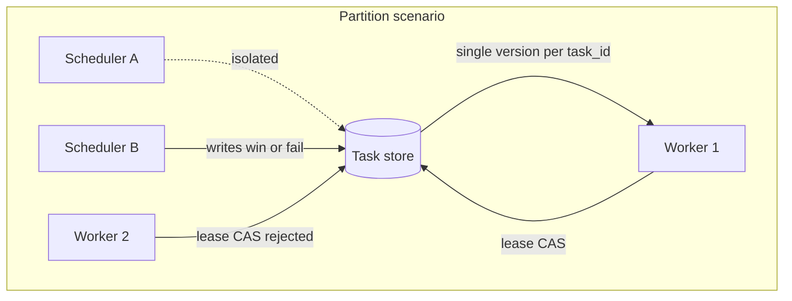
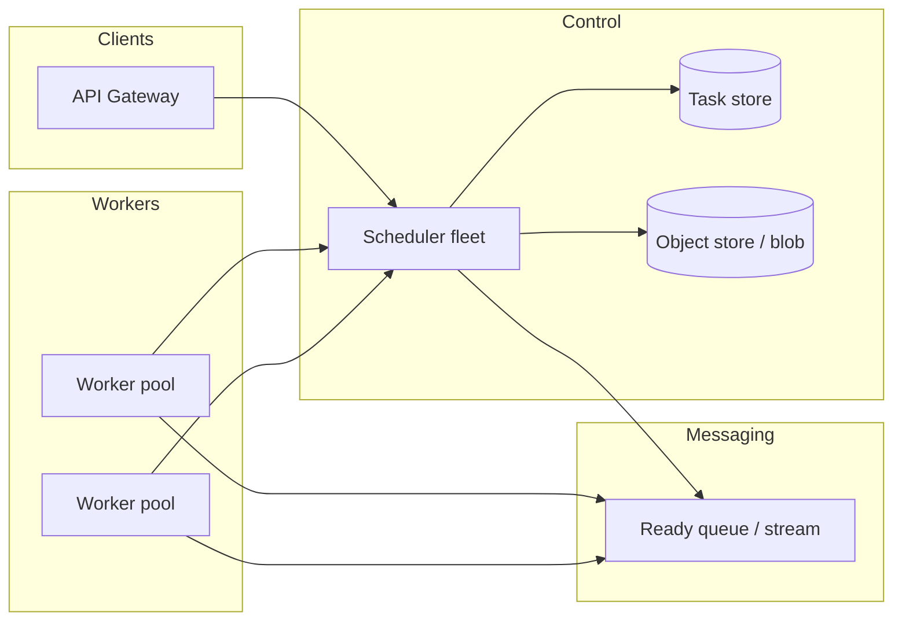
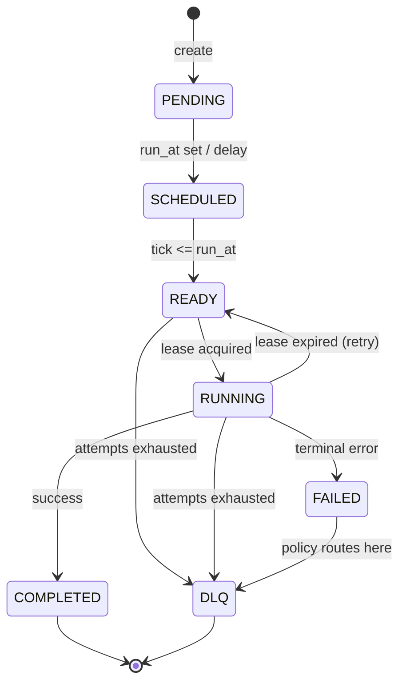
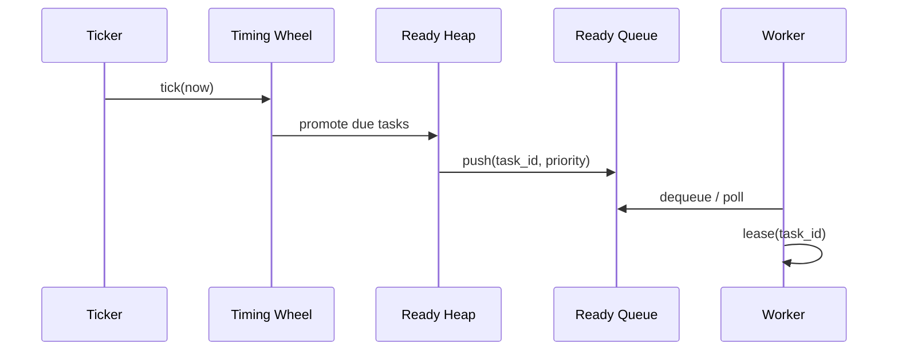
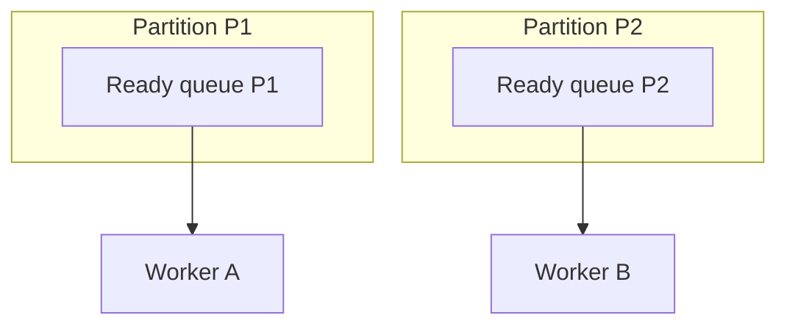

# Distributed Task Scheduler

---

## What We're Building

A **distributed task scheduler** accepts work from clients, persists it durably, and dispatches it to workers at the right time. It supports **one-off delayed jobs**, **recurring schedules (cron)**, **priorities**, **retries**, and **at-least-once** execution with optional **idempotent exactly-once** behavior at the application layer.

| Concern | What the system must do |
|---------|-------------------------|
| **Durability** | Survive process crashes; tasks are not lost after acknowledgment |
| **Timeliness** | Run tasks near their scheduled time (bounded skew) |
| **Fairness / priority** | Higher-priority work can preempt ordering in the ready queue |
| **Scale** | Horizontally scale schedulers and workers |
| **Safety** | Avoid double execution under failure, or detect and tolerate it |

**Real-world analogs:** AWS EventBridge Scheduler, Google Cloud Tasks, Celery with Redis/RabbitMQ, Sidekiq, Quartz in cluster mode, Kubernetes CronJob, and internal job platforms at large companies.

!!! note
    In interviews, confirm scope: **HTTP APIs only** vs **SDKs**, **multi-tenant** quotas, **strict ordering** per user, **workflow** (DAG) vs **single task**, and **geographic** placement. This page assumes a **general-purpose job queue with scheduling**, not a full workflow engine.

---

## Step 1: Requirements

### Functional Requirements

| Requirement | Priority | Description |
|-------------|----------|-------------|
| **Submit task** | Must have | Client enqueues a payload with optional delay, priority, and retry policy |
| **Schedule for future** | Must have | Run at `run_at` or after `delay_seconds` |
| **Recurring tasks** | Must have | Cron or fixed-rate schedules materialize new task instances |
| **Cancel / delete** | Should have | Cancel pending tasks by id |
| **Priority** | Should have | Numeric priority affects ordering among ready tasks |
| **Lease-based execution** | Must have | Worker holds a time-bounded lease while running; release or extend |
| **Retries** | Must have | Configurable backoff; exhausted retries go to **DLQ** |
| **Observability** | Should have | Task state, metrics, tracing hooks |

### Non-Functional Requirements

| Requirement | Target | Rationale |
|-------------|--------|-----------|
| **Availability** | 99.9%–99.99% | Control plane and API; workers can be elastic |
| **Durability** | No acknowledged task loss | Persist before ACK to client |
| **Schedule skew** | Seconds to low minutes | Depends on tick granularity and load |
| **Throughput** | Horizontal scale | Partition work across scheduler shards |
| **Latency (enqueue)** | p99 &lt; 50–200 ms | Dominated by storage replication |
| **Operational safety** | Auditable | DLQ, idempotency keys, dead-letter inspection |

### API Design

Illustrative **REST** surface (gRPC is common internally with the same semantics):

| Method | Path | Body / params | Behavior |
|--------|------|---------------|----------|
| `POST` | `/v1/tasks` | `payload`, `run_at` or `delay_sec`, `priority`, `idempotency_key`, `max_attempts` | Create task; returns `task_id` |
| `POST` | `/v1/tasks/{id}/cancel` | | Cancel if not yet leased |
| `GET` | `/v1/tasks/{id}` | | Return state and attempts |
| `POST` | `/v1/schedules` | `cron`, `timezone`, `payload_template`, `task_defaults` | Create recurring schedule |
| `DELETE` | `/v1/schedules/{id}` | | Stop future instances |

**Worker-facing (internal) API:**

| Operation | Semantics |
|-----------|-----------|
| `Dequeue(batch)` | Returns tasks whose `run_at <= now` and that pass assignment rules |
| `Lease(task_id, lease_ttl)` | Transition to `RUNNING`; returns false if already leased |
| `Heartbeat(task_id, extend_by)` | Extend lease while work proceeds |
| `Complete(task_id)` | Terminal success |
| `Fail(task_id, requeue_delay)` | Retry or move to DLQ per policy |

!!! tip
    Always accept an **idempotency key** on create to dedupe retried client requests. Store a mapping `(idempotency_key, tenant_id) -> task_id` with a TTL.

### Technology Selection & Tradeoffs

Pick storage, scheduling, workers, and coordination **together**: the scheduler’s correctness story (leases, fencing, materialization) must match what your store and locks can guarantee under load and failure.

#### Task storage

| Store | Strengths | Weaknesses | Best when |
|-------|-----------|------------|-----------|
| **PostgreSQL** | Strong ACID; row-level locks & `SELECT … FOR UPDATE SKIP LOCKED`; advisory locks; familiar ops | Vertical scaling limits; hot rows if partitioning is wrong | Control-plane metadata, moderate QPS, need transactional invariants |
| **Redis** | Very fast; sorted sets for delay queues; Lua for atomic claim | Durability depends on AOF/cluster config; not a system of record for all audit needs | Ready/delay **queues**, leases, rate limits—often **beside** a durable DB |
| **Cassandra** | Wide-column; high write throughput; TTL; multi-DC | Tunable consistency; compare-and-set patterns need careful modeling | Massive scheduled index; time-bucketed partitions; willing to invest in LWT/correctness patterns |
| **DynamoDB** | Managed; predictable at scale; conditional writes | Hot partitions if key design is poor; GSI cost/latency | Cloud-native task index; conditional updates for lease/version fields |

**Why it matters in interview:** schedulers are **write-heavy** (create, state transitions, heartbeats). You want **conditional updates** (version or `lease_until`) so only one worker wins the lease. Relational DBs express that cleanly; Cassandra/Dynamo need explicit partition keys and idempotent patterns.

#### Scheduling engine

| Approach | How it works | Strengths | Weaknesses |
|----------|--------------|-----------|------------|
| **Polling-based** | Periodic DB/query scan: “what is due now?” | Simple to reason about; works with any store | Load grows with table size; coarse skew unless scan is frequent |
| **Event-driven** | Push when clock fires (per-shard timer, gRPC stream, or queue wake-up) | Low idle CPU; tight skew for near-term tasks | Complexity; still need reconciliation ticks for crash recovery |
| **Hybrid timing wheel** | O(1) amortized bucketing + promote to ready queue | Industry standard for delay; bounded work per tick | Implementation complexity; per-partition wheels to avoid global contention |

**Interview framing:** use **polling** to bootstrap or for low volume; move to **timing wheel + per-partition ownership** when delay volume dominates. **Event-driven** complements the wheel (wake shard when bucket fires).

#### Worker orchestration

| Option | Strengths | Weaknesses | Best when |
|--------|-------------|------------|-----------|
| **Kubernetes Jobs** | Built-in retries; isolation per job; clear lifecycle | Per-job overhead; not ideal for millions of tiny tasks/sec | Batch-style workloads; long-running jobs; strong isolation |
| **Dedicated worker pool** | Long-lived processes; high reuse; pull + lease is natural | You own autoscaling, deploys, and noisy-neighbor fairness | **Default** for high-throughput task execution platforms |
| **Serverless (Lambda, etc.)** | Elastic scale; no idle fleet cost | Cold start; concurrency/account limits; harder long heartbeats | Spiky, short tasks; event-driven glue; combine with queue triggers |

**Why:** schedulers usually **decouple** “when to run” (control plane) from “how to run” (workers). A **pool of workers** dequeuing from a ready queue matches at-least-once + lease. **Jobs** fit discrete units of work; **Lambda** fits if tasks are short and idempotent and limits are acceptable.

#### Coordination

| Mechanism | Idea | Strengths | Weaknesses |
|-----------|------|-----------|------------|
| **Distributed locks (Redis / ZooKeeper / etcd)** | Single holder for shard or schedule row | Fast; clear ownership | Fencing and session expiry; Redis Redlock is controversial for **correctness** without tokens |
| **Leader election** | One active scheduler per partition (Raft via etcd/K8s lease) | Avoids split-brain for **tick** and cron materialization | Failover delay; must fence stale leaders |
| **Database advisory / row locks** | `FOR UPDATE` or lease columns in PostgreSQL | Transaction boundaries align with state changes | DB becomes bottleneck; design keys to avoid hot rows |

**Our choice (illustrative):** **PostgreSQL** (or cloud SQL) as the **system of record** for tasks and schedules with **versioned lease** columns and conditional updates; **Redis** (or Kafka) for **ready work** and fast delay ordering per shard; **hybrid timing wheel** inside each scheduler partition process; **dedicated worker pools** with autoscaling on queue depth; **leader election per partition** (or hash-based shard ownership with epoch fencing) for cron materialization and shard ticks; **distributed locks** only where a short-lived critical section is unavoidable—and pair with **fencing tokens** if workers touch downstream state.

**Rationale:** optimize for **clear transactional semantics** on metadata, **bounded** scheduling work per tick, and **operational** patterns teams already run (SQL + Redis/Kafka + K8s).

### CAP Theorem Analysis

CAP is often misquoted as “pick two of three.” For schedulers, the useful framing is: under **network partition**, you cannot have both **strong linearizable agreement** on “who owns this task right now” and **always available** reads/writes everywhere without compromise. Real systems choose **per-partition** consistency with **leases + versions**, and accept **at-least-once** execution with **idempotent** handlers.

| Concern | Consistency angle | Availability angle |
|---------|-------------------|----------------------|
| **No double execution** | Need a single authoritative decision: lease owner, monotonic version, or fence | If the primary partition is isolated, some clients may not enqueue or query until routing heals |
| **No missed tasks** | Reconciliation: expired leases return tasks to READY; ticks recover after crash | Scheduler shards should be **owned** so another node can take over partition |
| **Client visibility** | Strong read of task state may require leader or quorum read | Eventual consistency on replicas can show stale “PENDING” briefly |

**Task claim / lock mechanism:** implement **compare-and-set** on `(task_id, version)` or `(lease_until, worker_id)`: only one worker’s update succeeds. **Heartbeats** extend `lease_until` only if `worker_id` and **version** still match. On partition, **two writers** cannot both succeed if the store is **linearizable** for that row; if not, you need **fencing tokens** so stale workers cannot commit side effects.

**During a partition:**

- **Scheduler ↔ store:** if the scheduler cannot reach the DB, it cannot safely tick or lease—**that shard’s scheduling pauses** or fails over to a new leader (brief unavailability for that shard is preferable to double materialization of cron).
- **Worker ↔ scheduler:** a worker may think it holds a lease while the authority has expired it—**at-least-once** retry is why **idempotency** is mandatory.
- **Split schedulers:** two nodes must not both “promote” the same task; **epoch/leader per partition** prevents duplicate promotion.

**At-least-once vs exactly-once:**

| Guarantee | Meaning | Typical mechanism |
|-----------|---------|-------------------|
| **At-least-once** | Task may run more than once | Lease timeout, redelivery, retries |
| **Exactly-once execution** (true distributed) | One successful execution end-to-end | Very hard; often **exactly-once semantics** are achieved as **effectively-once** via idempotent writes + dedupe store |

**Interview line:** *“We guarantee **at-least-once delivery** to the worker boundary; **exactly-once side effects** are the application’s job via idempotency keys and transactional outbox.”*



**Reading the diagram:** only **one** path succeeds for **lease acquisition** on a linearizable row; the other worker retries or pulls different work—so you trade **perfect availability of every operation** for **no concurrent double execution** of the same task.

### SLA and SLO Definitions

SLAs are **contracts** with users; **SLOs** are internal targets; **SLIs** are what you measure. For a task platform, separate **scheduling** (when work becomes eligible) from **execution** (when a worker finishes).

#### SLIs and candidate SLOs

| Area | SLI (what we measure) | Example SLO | Notes |
|------|------------------------|-------------|--------|
| **Scheduling accuracy** | `actual_start_time - scheduled_time` for tasks that became READY | **p99 absolute skew ≤ 30s**; **p99.9 ≤ 2 min** during incidents | Excludes queue wait if you split “fired” vs “started” |
| **Task execution success rate** | `successful_completions / (successful + terminal_failures)` | **≥ 99.9%** monthly per tenant (exclude user code bugs if policy says so) | Define what counts as “system” vs “user” failure |
| **Task pickup latency** | `lease_acquired_at - ready_since` (or dequeue lag) | **p95 ≤ 5s**, **p99 ≤ 30s** for default priority | Tighter for premium tiers |
| **System availability** | Successful `POST /v1/tasks` and `GET /v1/tasks/{id}` vs all attempts | **99.9%–99.95%** monthly API availability | Exclude dependency if you publish **degraded** mode clearly |

Define **priority classes** with different SLOs (e.g., interactive vs batch) to avoid one backlog violating everything.

#### Error budget policy

An **error budget** is `(1 - SLO)` × **window**—how much “bad” you can spend before process changes.

| Signal | Example policy |
|--------|----------------|
| **Budget burn** | If **pickup latency p99** exceeds SLO for **1 hour**, page on-call; **24-hour** burn triggers freeze on risky deploys |
| **Cron skew** | If **scheduling accuracy** misses SLO for a week, prioritize shard rebalancing or clock/leader fixes before new features |
| **Success rate** | Drop below **99.5%** for **30 min** → incident; below **99%** → block non-critical releases |
| **Budget remaining** | High remaining budget → allow **faster iteration** (new dispatch policies); exhausted budget → **only** reliability work |

Publish **what counts as downtime** (read-only OK? DLQ-only?) so teams do not debate incidents during interviews—**clarity** is senior signal.

### Database Schema

The **tasks** table is the **authoritative** lifecycle for a unit of work. **Task executions** append-only history supports debugging, billing, and SLA proofs. **Dead letter** tasks are either a **status** on `tasks` plus a **DLQ table** for queries, or a dedicated table—below uses **`tasks.state = 'DLQ'`** plus **`dead_letter_tasks`** for operator workflows.

**Design choices (why):**

- **`lease_version`** enables **conditional** lease and heartbeat updates (same idea as optimistic locking).
- **`partition_id`** colocates rows with scheduler shards and avoids global hot keys.
- **`payload_ref`** keeps large blobs out of the hot row (aligns with Step 2 sizing).
- **Partial indexes** on `scheduled_time` / `state` keep “due work” scans cheap.

```sql
-- PostgreSQL 13+: gen_random_uuid() is built-in. Optional: citext for case-insensitive keys.
CREATE TYPE task_state AS ENUM (
  'PENDING', 'SCHEDULED', 'READY', 'RUNNING', 'COMPLETED', 'FAILED', 'CANCELLED', 'DLQ'
);

CREATE TABLE tasks (
  task_id            UUID PRIMARY KEY DEFAULT gen_random_uuid(),
  tenant_id          TEXT NOT NULL,
  partition_id       INT NOT NULL,
  task_type          TEXT NOT NULL,
  payload_ref        TEXT,
  payload_inline     JSONB,
  scheduled_time     TIMESTAMPTZ NOT NULL,
  priority           INT NOT NULL DEFAULT 100,
  state              task_state NOT NULL DEFAULT 'SCHEDULED',
  max_attempts       INT NOT NULL DEFAULT 3,
  attempt_count      INT NOT NULL DEFAULT 0,
  worker_id          TEXT,
  claimed_at         TIMESTAMPTZ,
  lease_until        TIMESTAMPTZ,
  lease_version      BIGINT NOT NULL DEFAULT 0,
  idempotency_key    TEXT,
  last_error_code    TEXT,
  last_error_detail  TEXT,
  created_at         TIMESTAMPTZ NOT NULL DEFAULT now(),
  updated_at         TIMESTAMPTZ NOT NULL DEFAULT now(),
  CONSTRAINT uq_tenant_idempotency UNIQUE (tenant_id, idempotency_key)
);

CREATE INDEX idx_tasks_partition_due
  ON tasks (partition_id, scheduled_time)
  WHERE state IN ('SCHEDULED', 'READY');

CREATE INDEX idx_tasks_running_lease
  ON tasks (lease_until)
  WHERE state = 'RUNNING';

-- Append-only execution history (audit, SLA, replay analysis)
CREATE TYPE execution_outcome AS ENUM ('SUCCESS', 'FAILURE', 'LEASE_LOST', 'CANCELLED');

CREATE TABLE task_executions (
  execution_id    BIGSERIAL PRIMARY KEY,
  task_id         UUID NOT NULL REFERENCES tasks (task_id) ON DELETE CASCADE,
  attempt         INT NOT NULL,
  worker_id       TEXT,
  started_at      TIMESTAMPTZ NOT NULL,
  ended_at        TIMESTAMPTZ,
  outcome         execution_outcome,
  error_summary   TEXT,
  duration_ms     INT
);

CREATE INDEX idx_task_executions_task ON task_executions (task_id, started_at DESC);

-- Dead-letter: optional dedicated table for operator queues, retention, and replay
CREATE TABLE dead_letter_tasks (
  dlq_id          BIGSERIAL PRIMARY KEY,
  task_id         UUID NOT NULL UNIQUE REFERENCES tasks (task_id) ON DELETE CASCADE,
  tenant_id       TEXT NOT NULL,
  reason          TEXT NOT NULL,
  failed_at       TIMESTAMPTZ NOT NULL DEFAULT now(),
  last_attempt    INT,
  payload_snapshot JSONB,
  replayed_at     TIMESTAMPTZ,
  replayed_by     TEXT
);

CREATE INDEX idx_dlq_tenant_failed ON dead_letter_tasks (tenant_id, failed_at DESC);
```

**Typical flow:** on terminal failure or exhausted retries, set `tasks.state = 'DLQ'`, insert **`dead_letter_tasks`**, and stop ready-queue visibility. **Replay** creates a **new** task or resets state under a new transaction—never silently delete audit rows.

!!! note
    Adjust column types (`TEXT` vs `VARCHAR`) and ENUM vs lookup tables to match org standards. For multi-region, add `region` and replicate with your chosen strategy; **global uniqueness** of `task_id` still matters for idempotency.

---

## Step 2: Back-of-the-Envelope Estimation

### Assumptions

```
- 50,000 task submissions per second at peak (aggregate)
- Average task payload: 2 KB (stored in object store; DB holds reference)
- 20% of tasks are delayed &gt; 1 minute (timing wheel / delayed queue pressure)
- Average task execution time: 30 seconds; lease TTL: 60 seconds
- Scheduler shards: 64 partitions (hash of task_id)
```

### Writes and Reads

```
Task creates/sec:     50,000
State updates/sec:    ~150,000 (leases, heartbeats, completions — rough 3× creates)
Storage:              durable log + index (Cassandra, DynamoDB, PostgreSQL, etc.)
```

### Worker Concurrency

```
If each worker runs 10 concurrent tasks and average duration is 30s:
  capacity per worker ≈ 10 / 30 ≈ 0.33 tasks/sec sustained

To drain 50,000 tasks/sec (steady-state) you need:
  50,000 / 0.33 ≈ 150,000 concurrent execution slots (order-of-magnitude)

Interview point: execution throughput is worker-bound; the scheduler’s job is fair dispatch, not CPU.
```

### Metadata Size

```
Per task row (illustrative):
  task_id (16) + partition_key (8) + run_at (8) + priority (4) + state (1) + pointers (32) ≈ 70 bytes + payload ref

50,000 new rows/sec × 200 bytes ≈ 10 MB/s ingest to index-heavy storage — plan partitioning and compaction.
```

!!! warning
    **Hot partitions** appear if partitioning is weak (e.g., all tasks for one tenant share a key). Use **hash(task_id)** or **hash(tenant_id, bucket)** to spread load.

---

## Step 3: High-Level Design

### Architecture Overview



**Components:**

| Component | Role |
|-----------|------|
| **API layer** | Authenticate, validate, assign `task_id`, persist metadata |
| **Task store** | Authoritative state: pending, scheduled time, attempts, lease owner |
| **Ready queue** | Fast path for tasks ready to run (per partition or global with care) |
| **Scheduler fleet** | Ticks delayed tasks into ready state; balances partitions |
| **Workers** | Pull or receive pushes, acquire lease, execute user code |
| **DLQ** | Terminal failure store for inspection and replay tooling |

!!! note
    **Separation:** durable metadata in **DB**; **large payloads** in blob storage; **ready work** in a queue optimized for concurrent consumers (Kafka partition, Redis Streams, SQS, etc.).

---

## Step 4: Deep Dive

### 4.1 Task Storage and State Machine

Tasks move through explicit states. The scheduler enforces valid transitions and persists each step.



| State | Meaning |
|-------|---------|
| **PENDING** | Accepted, not yet placed on a time structure |
| **SCHEDULED** | Has `run_at` in the future |
| **READY** | Eligible for dequeue (visible in ready queue) |
| **RUNNING** | Lease held by a worker |
| **COMPLETED** | Success |
| **FAILED** | Non-retryable or policy stop |
| **DLQ** | Dead letter for human or replay pipeline |

**Storage schema (relational sketch):**

| Column | Type | Notes |
|--------|------|-------|
| `task_id` | UUID | Primary key |
| `partition_id` | INT | Shard for scheduler scaling |
| `run_at` | TIMESTAMP | Index for scanning |
| `priority` | INT | Lower number = higher priority (convention) |
| `state` | ENUM | As above |
| `lease_owner` | VARCHAR | Worker id |
| `lease_until` | TIMESTAMP | Lease expiry |
| `attempt` | INT | Current attempt count |
| `payload_ref` | VARCHAR | Pointer to blob |
| `idempotency_key` | VARCHAR | Unique per tenant |

---

### 4.2 Scheduling Strategies (Priority Queue, Timing Wheel)

#### Priority queue (min-heap)

For **ready** tasks, use a **min-heap** ordered by `(next_run_at, priority, task_id)` so the earliest deadline is popped first; ties break by priority then id for determinism.

| Operation | Typical complexity | Notes |
|-----------|-------------------|--------|
| Insert | O(log N) | Per enqueue to ready set |
| Pop min | O(log N) | Dispatch next |
| Peek | O(1) | Metrics |

When **memory-bound**, externalize to **Redis sorted set** (score = timestamp) or **database order-by** with limited batch fetch.

#### Timing wheel for delayed tasks

A **hierarchical timing wheel** (seconds, minutes, hours, days) buckets tasks by coarse time slots. On each tick, the wheel rotates and promotes buckets into the next finer wheel or into the **ready heap**.

| Approach | Strength | Weakness |
|----------|----------|----------|
| **Single delay queue (heap)** | Simple | Huge heaps are slow; GC pressure |
| **Timing wheel** | O(1) amortized insert per slot | Complexity; multi-level cascades |
| **Redis ZSET + periodic scan** | Operational simplicity | ZRANGEBYSCORE under load needs sharding |

!!! tip
    **Cascading:** when a slot elapses, move tasks to the inner wheel or push to **ready queue**. Use **one dedicated scheduler process per partition** to avoid cross-thread heap contention.

#### Scheduling flow



---

### 4.3 Worker Pool and Task Assignment

**Pull model:** workers long-poll the ready queue (or partition-specific queues). **Push model:** scheduler assigns tasks to registered workers (requires presence and load signals). Most large systems prefer **pull** with **lease** for simplicity.



**Partitioning tasks across scheduler nodes:**

| Strategy | How it works |
|----------|----------------|
| **Hash(task_id)** | Stable shard; easy routing |
| **Hash(tenant_id)** | Per-tenant ordering possible; hot tenant risk |
| **Consistent hashing** | Add/remove scheduler nodes with minimal remap |
| **Leader per partition** | Raft/Paxos group owns partition for strong consistency |

!!! note
    For **exactly-once handoff to exactly one worker**, you need a single decision maker per task or distributed consensus on lease grant. Pragmatic systems use **at-least-once** + **idempotency**.

---

### 4.4 Lease-Based Execution

A **lease** is a time-bounded right to execute. If the worker dies, the lease expires and the task becomes **visible again** for retry.

| Mechanism | Purpose |
|-----------|---------|
| `lease_ttl` | Upper bound on silent failure detection |
| **Heartbeat** | Extend lease for long work |
| **Max lease extensions** | Prevent stuck infinite extension |

**Heartbeat rule of thumb:** heartbeat every `lease_ttl / 3`, cap extensions below a **max runtime** policy.

---

### 4.5 Cron and Recurring Tasks

**Cron** expressions (five or six fields) define recurring schedules in a timezone. The scheduler **materializes** instances: each firing inserts a new **task instance** (or enqueues a template expansion).

| Concern | Approach |
|---------|----------|
| **Missed windows** | Policy: **catch-up one**, **skip**, or **coalesce** |
| **DST** | Store **timezone** (IANA); evaluate next fire in zoned time |
| **Backlog** | Limit concurrent instances per schedule |

**Parsing:** embed a trusted library (e.g., `cron-utils` in Java, `croniter` in Python, `robfig/cron` in Go) instead of hand-rolling.

| Field | Example | Meaning |
|-------|---------|---------|
| Minute hour DoM Month DoW | `0 9 * * MON-FRI` | 09:00 weekdays |

!!! warning
    **Double fire on leader failover:** two schedulers might both evaluate “due” once. Mitigate with **lease on schedule row**, **fencing token**, or **external token service** so only one materialization wins.

---

### 4.6 Dead Letter Queue and Retry Logic

| Retry policy | Behavior |
|--------------|----------|
| **Fixed delay** | 5m, 5m, 5m |
| **Exponential backoff** | 1s, 2s, 4s, … + **jitter** |
| **Max attempts** | After N failures, move to **DLQ** |

**DLQ** stores the task payload, error summary, stack trace reference, and last attempt metadata. Operators **replay** to the main queue after fixing code or dependencies.

| DLQ operation | Use |
|---------------|-----|
| Inspect | Debug |
| Requeue | Manual or automated replay |
| Purge | GDPR / retention |

---

### 4.7 Idempotency and Exactly-Once Semantics

| Guarantee | Meaning | Typical implementation |
|-----------|---------|------------------------|
| **At-most-once** | May drop | Rare; needs ack before persist |
| **At-least-once** | May duplicate | **Lease timeout + retry** |
| **Exactly-once** | End-to-end | **Idempotent handlers** + dedupe store, or **transactional outbox** + single consumer (hard distributed) |

**Interview answer:** *“True exactly-once across services is expensive; we guarantee **at-least-once delivery** and require tasks to be **idempotent** using a business key stored in the application database with unique constraint.”*

| Pattern | Description |
|---------|-------------|
| **Idempotency key** | Client supplies key; server dedupes creates |
| **Effect journal** | Store `(task_id, step)` applied operations |
| **Transactional outbox** | DB commit and message in one transaction |

---

## Code Sketches

Below are minimal illustrations of **task submission**, a **scheduler tick**, and **worker lease** (content tabs: Python, Java, Go). They omit production concerns (metrics, tracing, batching).

### Task submission

=== "Python"

    ```python
    import requests
    from datetime import datetime, timezone
    
    def submit_task(base_url: str, payload: dict, run_at: datetime, idempotency_key: str) -> str:
        body = {"payload": payload, "run_at": run_at.astimezone(timezone.utc).isoformat()}
        r = requests.post(
            f"{base_url}/v1/tasks",
            json=body,
            headers={"Idempotency-Key": idempotency_key},
            timeout=10,
        )
        r.raise_for_status()
        return r.json()["task_id"]
    ```

=== "Java"

    ```java
    import java.io.IOException;
    import java.net.URI;
    import java.net.http.HttpClient;
    import java.net.http.HttpRequest;
    import java.net.http.HttpResponse;
    import java.time.Instant;
    
    public final class TaskClient {
      private final HttpClient http = HttpClient.newHttpClient();
      private final String baseUrl;
    
      public TaskClient(String baseUrl) { this.baseUrl = baseUrl; }
    
      public String submitTask(String jsonPayload, Instant runAt, String idempotencyKey)
          throws IOException, InterruptedException {
        String body = String.format(
            "{\"payload\":%s,\"run_at\":\"%s\"}", jsonPayload, runAt.toString());
        HttpRequest req = HttpRequest.newBuilder(URI.create(baseUrl + "/v1/tasks"))
            .header("Content-Type", "application/json")
            .header("Idempotency-Key", idempotencyKey)
            .POST(HttpRequest.BodyPublishers.ofString(body))
            .build();
        HttpResponse<String> res = http.send(req, HttpResponse.BodyHandlers.ofString());
        if (res.statusCode() / 100 != 2) {
          throw new IllegalStateException("submit failed: " + res.body());
        }
        // parse task_id from JSON
        return res.body();
      }
    }
    ```

=== "Go"

    ```go
    type SubmitBody struct {
    	Payload map[string]any `json:"payload"`
    	RunAt   string         `json:"run_at"`
    }
    
    func SubmitTask(ctx context.Context, base string, payload map[string]any, runAt time.Time, idem string) (string, error) {
    	b := SubmitBody{Payload: payload, RunAt: runAt.UTC().Format(time.RFC3339)}
    	raw, _ := json.Marshal(b)
    	req, err := http.NewRequestWithContext(ctx, http.MethodPost, base+"/v1/tasks", bytes.NewReader(raw))
    	if err != nil {
    		return "", err
    	}
    	req.Header.Set("Content-Type", "application/json")
    	req.Header.Set("Idempotency-Key", idem)
    	res, err := http.DefaultClient.Do(req)
    	if err != nil {
    		return "", err
    	}
    	defer res.Body.Close()
    	if res.StatusCode/100 != 2 {
    		return "", fmt.Errorf("submit: %s", res.Status)
    	}
    	var out struct {
    		TaskID string `json:"task_id"`
    	}
    	if err := json.NewDecoder(res.Body).Decode(&out); err != nil {
    		return "", err
    	}
    	return out.TaskID, nil
    }
    ```

---

### Scheduler loop (timing wheel tick + promote)

=== "Python"

    ```python
    def scheduler_tick(now: float, wheel, ready_queue) -> None:
        for task in wheel.advance(now):
            if task.state == "SCHEDULED" and task.run_at <= now:
                task.state = "READY"
                ready_queue.enqueue(task.task_id, task.priority)
    ```

=== "Java"

    ```java
    import java.time.Instant;
    
    void schedulerTick(Instant now, TimingWheel wheel, ReadyQueue ready) {
      var due = wheel.advance(now);
      for (ScheduledTask t : due) {
        if (t.getState() == TaskState.SCHEDULED && !t.getRunAt().isAfter(now)) {
          t.setState(TaskState.READY);
          ready.enqueue(t.getId(), t.getPriority());
        }
      }
    }
    ```

=== "Go"

    ```go
    func SchedulerTick(now time.Time, wheel *TimingWheel, ready ReadyQueue) {
    	for _, t := range wheel.Advance(now) {
    		if t.State == Scheduled && !t.RunAt.After(now) {
    			t.State = Ready
    			ready.Enqueue(t.ID, t.Priority)
    		}
    	}
    }
    ```

---

### Worker lease with heartbeat

=== "Python"

    ```python
    import threading
    import time
    
    def run_with_lease(svc, task_id: str, worker_id: str, lease_sec: float) -> bool:
        if not svc.try_lease(task_id, worker_id, lease_sec):
            return False
        stop = threading.Event()
    
        def heartbeat():
            while not stop.wait(timeout=lease_sec / 3):
                svc.heartbeat(task_id, worker_id, lease_sec)
    
        t = threading.Thread(target=heartbeat, daemon=True)
        t.start()
        try:
            do_work(task_id)
            svc.complete(task_id, worker_id)
            return True
        except Exception:
            svc.fail(task_id, worker_id)
            return False
        finally:
            stop.set()
    ```

=== "Java"

    ```java
    import java.time.Duration;
    import java.util.concurrent.Executors;
    import java.util.concurrent.ScheduledExecutorService;
    import java.util.concurrent.TimeUnit;
    
    public boolean runWithLease(TaskService svc, String taskId, String workerId, Duration lease) {
      if (!svc.tryLease(taskId, workerId, lease)) {
        return false;
      }
      ScheduledExecutorService hb = Executors.newSingleThreadScheduledExecutor();
      hb.scheduleAtFixedRate(
          () -> svc.heartbeat(taskId, workerId, lease),
          lease.dividedBy(3).toMillis(),
          lease.dividedBy(3).toMillis(),
          TimeUnit.MILLISECONDS);
      try {
        doWork(taskId);
        svc.complete(taskId, workerId);
        return true;
      } catch (Exception e) {
        svc.fail(taskId, workerId, e);
        return false;
      } finally {
        hb.shutdownNow();
      }
    }
    ```

=== "Go"

    ```go
    func RunWithLease(ctx context.Context, svc TaskService, taskID, workerID string, lease time.Duration) error {
    	if !svc.TryLease(ctx, taskID, workerID, lease) {
    		return errors.New("lease not acquired")
    	}
    	hctx, cancel := context.WithCancel(ctx)
    	defer cancel()
    	go func() {
    		tick := time.NewTicker(lease / 3)
    		defer tick.Stop()
    		for {
    			select {
    			case <-hctx.Done():
    				return
    			case <-tick.C:
    				_ = svc.Heartbeat(hctx, taskID, workerID, lease)
    			}
    		}
    	}()
    	err := DoWork(ctx, taskID)
    	if err != nil {
    		svc.Fail(ctx, taskID, workerID, err)
    		return err
    	}
    	return svc.Complete(ctx, taskID, workerID)
    }
    ```

---

## Step 5: Scaling & Production

| Dimension | Technique |
|-----------|-----------|
| **Scheduler** | Partition by hash; leader or consistent hashing; avoid global heap |
| **Storage** | Sharded DB; write-heavy paths batched; cold archive for completed tasks |
| **Ready queue** | Kafka/SQS with **visibility timeout** analogous to lease |
| **Workers** | Autoscale on queue depth and p95 runtime |
| **Multi-region** | Active-passive or regional queues; **cron** in single primary or with strong fencing |

!!! warning
    **Clock skew:** use **logical clocks** or **DB time** for `run_at` authority if cross-node ordering matters. NTP drift can cause early/late firing.

**Observability checklist:**

| Signal | What to track |
|--------|----------------|
| **Enqueue rate** | Load test capacity |
| **Time in READY** | Scheduler or worker starvation |
| **Lease expiry rate** | Too-short lease or slow work |
| **DLQ rate** | Bad deploys or downstream outages |
| **Per-tenant lag** | Noisy neighbor |

---

## Interview Tips

| Do | Avoid |
|----|--------|
| Clarify **delivery guarantee** (at-least-once vs exactly-once) | Promising true exactly-once without caveats |
| Draw **state machine** and **lease** | Ignoring double execution on retry |
| Mention **partitioning** + **hot keys** | Single global queue as infinite scale |
| Separate **metadata** vs **payload blob** | Storing megabytes in the hot row |
| Discuss **cron pitfalls** (DST, misfire) | Treating cron as “just a timer” |

---

## Interview Checklist

- [ ] Requirements: delay, recurring, priority, cancel, multi-tenant?
- [ ] API: create, get, cancel; idempotency key on create
- [ ] Durability: persist before ACK; replication
- [ ] Ready path: heap vs queue; **partitioning** strategy
- [ ] Delayed path: **timing wheel** or zset; tick cadence
- [ ] Execution: **lease**, heartbeat, expiry = retry
- [ ] Failure: backoff, **DLQ**, replay
- [ ] Semantics: **at-least-once** + **idempotency**
- [ ] Ops: metrics, alarms, rate per tenant

---

## Sample Interview Dialogue

**Interviewer:** How do you schedule a million delayed tasks efficiently?

**Candidate:** I would avoid one giant in-memory heap. I would **partition** tasks by hash into N shards, each with its own **timing wheel** or delay structure. Each shard is owned by one scheduler instance or a small Raft group. That keeps insert and tick cost bounded.

**Interviewer:** What happens when a worker crashes mid-task?

**Candidate:** The worker holds a **lease** with a TTL. If it does not **heartbeat**, the lease expires and the task returns to **READY** for **at-least-once** retry. The user handler should be **idempotent** or use a dedupe store so a second run does not corrupt state.

**Interviewer:** How do you handle recurring jobs?

**Candidate:** Store schedule definitions with a **timezone**. A materialization loop computes the next fire using a **cron library**, inserts a new **task instance** row, and relies on the same dispatch path. On failover, I need a **singleton lease** or **fencing** around materialization to prevent duplicate instances.

**Interviewer:** Where does exactly-once come from?

**Candidate:** The wire and queue are usually **at-least-once**. **Exactly-once effects** are achieved by **idempotent application logic**—for example storing processed `task_id` in the business database with a unique constraint—rather than by the scheduler alone.

---

## Summary

A **distributed task scheduler** combines **durable metadata**, **partitioned scheduling** (often **timing wheels** and per-shard **priority queues**), and **lease-based execution** for safe retry. **Cron** expands into task instances with careful **time zone** and **failover** handling. **DLQ** and **backoff** manage poison messages. In practice, advertise **at-least-once** delivery and enforce **exactly-once side effects** in application code through **idempotency** and transactional patterns.

| Topic | Takeaway |
|-------|----------|
| **Priority** | Min-heap or ordered structure on `(time, priority)` |
| **Delayed work** | Timing wheel or shard-level delay structures |
| **Workers** | Pull + lease + heartbeat |
| **Scale** | Partition task space; avoid single hot queue |
| **Failures** | DLQ, retries with jitter |
| **Semantics** | At-least-once transport; exactly-once via idempotent handlers |

---

## Staff Engineer (L6) Deep Dive

The sections above cover the standard task scheduler design. The sections below cover **Staff-level depth** that separates an L6 answer from an L5. See the [Staff Engineer Interview Guide](staff_engineer_expectations.md) for the full L6 expectations framework.

### Distributed Locking and Fencing Tokens

The core correctness problem in a distributed scheduler: **preventing two workers from executing the same task concurrently**. Leases alone are insufficient due to GC pauses and clock skew.

| Problem | Description | Mitigation |
|---------|-------------|------------|
| **GC pause exceeds lease** | Worker A's lease expires during a long GC pause; Worker B acquires the lease; A wakes up and continues executing | **Fencing tokens**: each lease issuance increments a monotonic token; downstream operations reject writes from stale tokens |
| **Clock skew** | Worker thinks its lease is valid but the scheduler's clock has already expired it | Use **server-side time** for all lease decisions; never trust client clocks |
| **Split brain** | Two scheduler shards both think they own a partition after a network partition heals | Use **epoch-based fencing**: each scheduler leadership term has a monotonic epoch; stale-epoch writes are rejected |


!!! warning
    **Staff-level insight:** Redis  leases (Redlock) are insufficient for correctness when downstream state is involved. You need fencing tokens propagated to every stateful operation. Reference: Martin Kleppmann's critique of Redlock.

### Zombie Worker Detection

A "zombie" worker is one that continues executing after its lease has expired. At L6, discuss systematic detection:

| Detection Method | Mechanism |
|------------------|-----------|
| **Heartbeat timeout** | If no heartbeat for , mark worker suspect; if no heartbeat for , kill task |
| **Lease version check** | Worker includes lease version in every heartbeat; reject heartbeats with stale versions |
| **Process-level watchdog** | Sidecar monitors worker process health; kills and restarts on hang detection |
| **Network partition detection** | Worker pings scheduler; if unreachable for > threshold, worker self-terminates (fail-fast) |

### Multi-Tenant Isolation and Fairness

| Strategy | Description |
|----------|-------------|
| **Per-tenant queue** | Each tenant has its own ready queue; scheduler round-robins across tenants |
| **Weighted fair scheduling** | Tenants have weights proportional to their SLA tier; scheduler dispatches proportionally |
| **Quota enforcement** | Hard limit on concurrent running tasks per tenant; excess tasks wait in READY |
| **Blast radius isolation** | High-value tenants get dedicated scheduler partitions; noisy neighbors cannot starve them |

### Multi-Region Task Scheduling

| Topology | Description | Trade-off |
|----------|-------------|-----------|
| **Regional schedulers, regional tasks** | Tasks execute in the region where they were created | Simple; no cross-region coordination |
| **Global scheduler, regional workers** | Central scheduler assigns tasks to workers in specific regions | Cross-region latency for scheduling; best for tasks near specific data |
| **Follow-the-data** | Task routes to the region where its input data resides | Minimizes data transfer; requires data locality metadata |
| **Active-active with fencing** | Each region has a scheduler; dedup via global idempotency store | Highest availability; most complex; needs distributed fencing |

### Cron Correctness at Scale

| Problem | Description | Solution |
|---------|-------------|----------|
| **Double-fire on failover** | Old and new scheduler both evaluate "time to fire" | Use a **lease on the schedule row** with fencing token; only the lease holder can materialize |
| **DST transitions** | 2:30 AM fires twice (fall back) or never (spring forward) | Always store schedules in **UTC** with IANA timezone; compute next fire using a timezone-aware cron library |
| **Backlog after outage** | Scheduler was down for 2 hours; 120 missed firings | **Catch-up policy** per schedule:  (single catch-up),  (replay each), or  (resume from now) |
| **High-frequency cron** | Every 5 minutes across 100K schedules = 20K firings/min | Batch materialization; partition schedules across scheduler shards by hash of schedule_id |

### Operational Excellence

| SLI | Target | Alert |
|-----|--------|-------|
| Schedule skew (actual fire - intended fire) | < 5s p95 | > 30s for 3 consecutive firings |
| Task enqueue-to-start latency | < 1s p95 for high priority | > 10s indicates worker starvation |
| Lease expiry rate | < 1% of running tasks | > 5% indicates tasks are too slow or lease_ttl is too short |
| DLQ ingestion rate | < 0.01% of tasks | Any sustained increase indicates bad deploy or downstream outage |
| Scheduler partition lag | 0 (all partitions assigned) | Any unowned partition means tasks are not being ticked |

### System Evolution

| Phase | Architecture | Key Change |
|-------|-------------|------------|
| **Year 0** | Single PostgreSQL + Redis ZSET for ready queue; single scheduler process | Validate semantics; manual monitoring |
| **Year 1** | Shard by hash(task_id) across 16 partitions; Kafka for ready queue; multiple scheduler instances | Add observability dashboard; SLO alerting |
| **Year 2** | Multi-region with regional schedulers; cron schedules pinned to primary region | Zero-downtime partition rebalancing on node add/remove |
| **Year 3** | Platform extraction: self-service API; per-tenant quotas and billing; workflow (DAG) support as opt-in layer | API versioning; backward-compatible schema migrations |

---

*Document version: interview study guide. Align numbers with the interviewer's scenario.*
