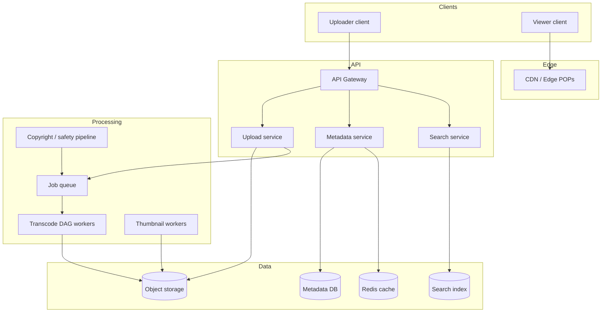
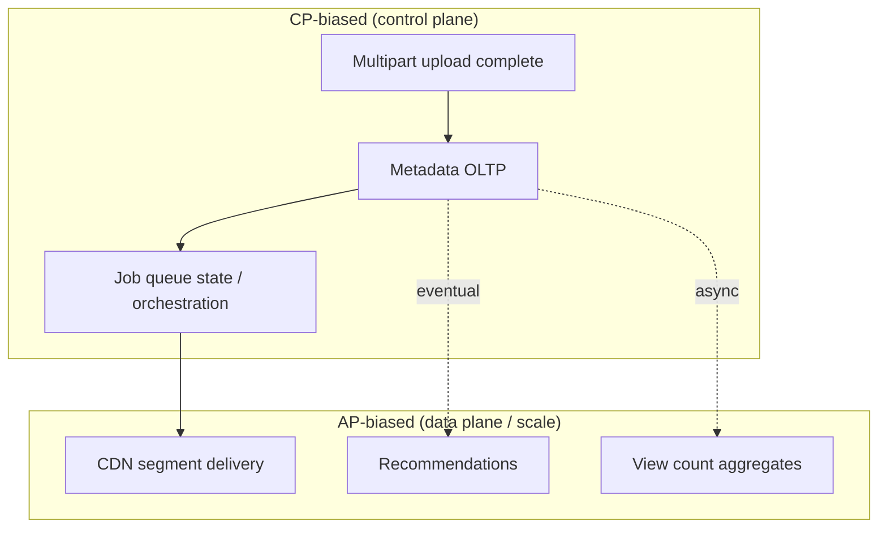
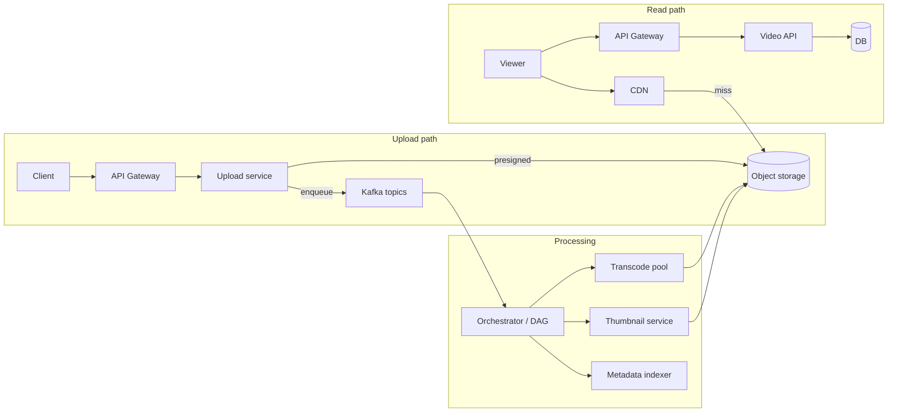
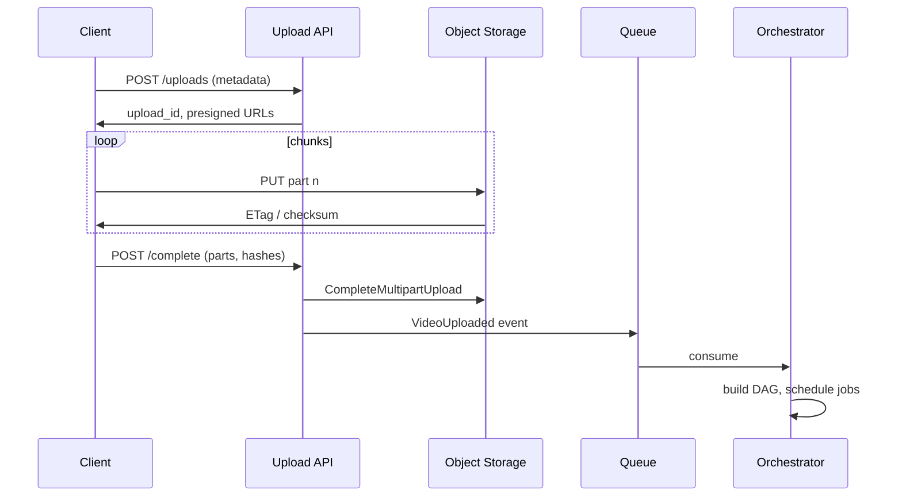
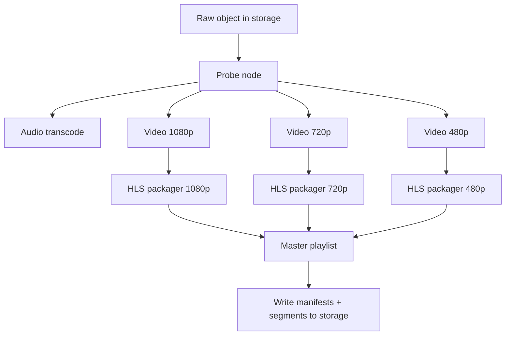

# Video Streaming (YouTube)

## What We're Building

A **video streaming platform** lets creators upload long-form and short-form video, processes those files into multiple formats and bitrates, stores and indexes metadata, and delivers playback to viewers worldwide with adaptive quality, low startup latency, and high availability. The canonical reference product is **YouTube**; similar patterns appear in **Vimeo**, **Twitch** (live differs but shares CDN and transcoding ideas), and enterprise **VOD** stacks.

**Core capabilities we will cover:**

| Capability | Brief description |
|------------|-------------------|
| **Resumable upload** | Chunked uploads with checksums so large files survive flaky networks |
| **Transcoding** | FFmpeg (or cloud encoder APIs) to produce H.264/VP9/AV1 ladders |
| **Adaptive streaming** | HLS or DASH segments + manifests for ABR clients |
| **CDN delivery** | Edge caching of segments and manifests close to viewers |
| **Metadata and search** | Titles, tags, channels, inverted indexes, sometimes ASR captions |
| **Thumbnails** | Sprites or keyframe extractions for previews and seek bars |
| **View analytics** | Approximate counts, aggregation pipelines, fraud resistance |
| **Recommendations** | Candidate generation + ranking (often separate ML stack) |

### Why This Problem Is Hard

| Challenge | Consequence |
|-----------|-------------|
| **Egress cost** | Video bytes dwarf API JSON; CDN and encoding are the main bills |
| **CPU-heavy transcoding** | Long videos need distributed workers and queue backpressure |
| **Global latency** | Playback must start quickly; manifests and first segments must be hot at edge |
| **Consistency vs cost** | Strong consistency everywhere is expensive; many paths are eventual |
| **Abuse and compliance** | Copyright, CSAM, and spam require detection pipelines and policy |

!!! note
    In interviews, **clarify live vs VOD** early. Live streaming uses RTMP/WebRTC ingest and LL-HLS/WebRTC egress; this page focuses on **VOD** (upload then watch), which matches “Design YouTube” unless the interviewer specifies live.

### High-Level System Context (Preview)



---

## Step 1: Requirements

### Functional Requirements

| ID | Requirement | Notes |
|----|-------------|--------|
| FR-1 | Users can **upload** video files (large, resumable) | Chunked multipart or gRPC streams |
| FR-2 | System **transcodes** uploads into multiple renditions | Resolution + bitrate ladder |
| FR-3 | Viewers **play** video in browser/app with **adaptive bitrate** | HLS and/or DASH |
| FR-4 | **Metadata**: title, description, tags, channel, visibility | CRUD + validation |
| FR-5 | **Search** videos by keyword (and optionally filters) | Inverted index; ranking later |
| FR-6 | **Thumbnails** for grid and seek preview | Generated post-upload |
| FR-7 | **View counts** and basic analytics for creators | Often approximate at scale |
| FR-8 | **Home / feed** surfaces recommended videos | ML ranking; can be scoped “out of band” |

!!! tip
    Mark **recommendations** as a separate sub-system if time is short: ingest signals (views, watches, subs) and serve ranked lists from an offline + online stack.

### Non-Functional Requirements

| Category | Target | Rationale |
|----------|--------|-----------|
| **Playback start (p95)** | 2–5 s on good networks | Industry expectation; CDN + small first segments help |
| **Upload reliability** | Resume after disconnect | Mobile networks drop often |
| **Availability** | 99.9%+ for read path | Writes and processing can degrade gracefully with status UI |
| **Durability** | No loss of committed uploads | Replicated object storage + job idempotency |
| **Scale** | Horizontal workers, sharded metadata | Avoid single-node transcode |
| **Compliance** | Takedowns, copyright, regional restrictions | Legal and policy hooks |

### API Design

Typical REST (or gRPC internal) surface:

| Method | Endpoint | Purpose |
|--------|----------|---------|
| `POST` | `/v1/uploads` | Start upload session: returns `upload_id`, chunk size, object key prefix |
| `PUT` | `/v1/uploads/{upload_id}/parts/{part_number}` | Upload one chunk (with Content-Range or fixed part size) |
| `POST` | `/v1/uploads/{upload_id}/complete` | Finalize multipart upload, trigger processing |
| `GET` | `/v1/videos/{video_id}` | Metadata + processing status + playback URLs |
| `GET` | `/v1/videos/{video_id}/manifest.m3u8` | HLS master or redirect to CDN URL |
| `GET` | `/v1/search?q=` | Keyword search |
| `POST` | `/v1/videos/{video_id}/views` | Client beacons for views (often batched) |

**Example: start upload response**

```json
{
  "upload_id": "up_7f91c2",
  "chunk_bytes": 8388608,
  "max_parts": 10000,
  "storage": { "backend": "s3", "bucket": "uploads-prod", "key_prefix": "raw/up_7f91c2/" }
}
```

!!! warning
    Never expose **raw storage credentials** to clients. Use **pre-signed URLs** or short-lived upload tokens so the browser talks directly to object storage where appropriate.

### Technology Selection & Tradeoffs

At interview depth, **name 2–3 realistic options per layer**, compare on **ops burden, cost model, and time-to-market**, then commit to a **default “big company” stack** (managed object store + queue + CDN + relational metadata) unless the prompt forces self-hosted or bare-metal.

#### Video storage: S3 vs custom blob store vs HDFS

| Dimension | **S3 (or compatible: GCS, Azure Blob)** | **Custom blob store** (MinIO cluster, Ceph, internal key-value blobs) | **HDFS** |
|-----------|------------------------------------------|----------------------------------------------------------------------|----------|
| **Best for** | Default production path; global durability SLAs; multipart + lifecycle APIs | Full control of hardware, tenancy isolation, or air-gapped deploys | Batch analytics on huge files; **not** a great fit for small random reads at CDN scale |
| **Durability / HA** | Vendor-managed replication across AZs/ regions | You own erasure coding, repair, and upgrades | NameNode SPOF patterns unless heavily engineered; tuned for **sequential** big reads |
| **API ergonomics** | Pre-signed uploads, versioning, tiering, inventory | Must build auth, metering, lifecycle yourself | POSIX/HDFS client assumptions; poor match for **HTTP range** + CDN origin patterns |
| **Cost** | Pay egress + API + storage; predictable at scale | CapEx + small team to run it | Cheap TB for warehouse-style jobs; **egress to internet** is awkward |
| **Interview risk** | “Everyone uses it” — explain **multi-part**, **checksums**, **lifecycle to Glacier** | Show you know **when** (regulated, repatriation, margin) | Only if interviewer asks data-lake adjacency; say **not primary for user-facing VOD** |

#### Transcoding: FFmpeg workers vs cloud transcoding vs GPU-accelerated

| Dimension | **Self-managed FFmpeg on CPU workers** | **Cloud transcoding (e.g. MediaConvert, Transcoder API)** | **GPU-accelerated (NVENC / cloud GPU pools)** |
|-----------|----------------------------------------|-----------------------------------------------------------|-----------------------------------------------|
| **Control** | Full codec knobs, custom DAGs, per-title tuning | Opinionated pipelines; faster integration | Highest throughput per watt for certain codecs; complex capacity planning |
| **Cost model** | You pay compute + ops; **spot** instances for batch | Per-minute or per-output pricing; less ops | GPU $/hour can beat CPU for **throughput** if utilization is high |
| **Latency to first rendition** | Depends on queue + worker pool | Often good regional pools; less tuning | Great for **live** or huge parallel ladders |
| **Why choose** | Maximum flexibility; industry default in diagrams | Startup or when ops headcount is limited | Peak transcode, **live**, or AV1/HEVC at scale with hardware assist |

#### Streaming protocol: HLS vs DASH vs CMAF vs WebRTC (live)

| Dimension | **HLS** | **DASH** | **CMAF (fMP4)** | **WebRTC** |
|-----------|---------|----------|-----------------|------------|
| **Container** | Traditionally MPEG-TS; modern: **fMP4** | fMP4 segments + MPD | **Common segment format** for HLS and DASH | RTP; not segment-cache like VOD |
| **Client support** | Excellent on Apple/Safari; industry default for ABR VOD | Strong on Android/TV; needs polyfill on some browsers | **One encode** packaged to both HLS and DASH manifests | **Ultra-low latency**; signaling + peer/server infra |
| **Caching** | Segment URLs cache well on CDN | Same | Same; aligns segment boundaries across renditions | Harder to cache “like HLS”; different architecture |
| **Typical use** | **VOD + live (LL-HLS)** | VOD + smart TV ecosystems | **Reduce duplicate storage** when serving both HLS and DASH | **Live** interactive (sub-second), not primary for long VOD |

#### CDN: CloudFront vs Akamai vs custom edge vs multi-CDN

| Dimension | **CloudFront (example: AWS-native)** | **Akamai / Fastly-class global CDNs** | **Custom edge** (your POPs) | **Multi-CDN** |
|-----------|--------------------------------------|----------------------------------------|-------------------------------|---------------|
| **Integration** | Tight with S3/API Gateway; fast to sketch | Mature WAF, media features, global footprint | Rare unless Netflix-scale; huge CapEx + peering | **Avoid lock-in**, failover, price arbitrage |
| **Features** | Signed URLs, origin shield, geo headers | Deep edge logic, large peer ecosystem | Full control | Routing layer chooses provider per region/cost |
| **When to mention** | Default AWS answer | “We need maximum edge POP density or compliance” | “We’re hyperscaler-scale” | “Egress is 40% of COGS; we **steer** traffic” |

#### Metadata database: PostgreSQL vs DynamoDB vs Cassandra (view counts)

| Dimension | **PostgreSQL** | **DynamoDB** | **Cassandra** |
|-----------|----------------|--------------|---------------|
| **Strength** | **ACID** transactions, joins, constraints; great for **video + channel** rows | Predictable **partition-key** scale; **DynamoDB Streams** for pipelines | Massive **write** throughput for **wide** partitions when modeled carefully |
| **Hot keys** | Viral `video_id` row can bottleneck **counters** | Hot partition unless sharded/split patterns | Still need careful **partition** design |
| **View counts** | Fine behind **async aggregation**, not raw per-click row updates | Good for **sharded counters** + atomic adds | Good for **time-bucket** counters and high ingest |
| **Interview story** | “Source of truth for metadata; cache reads” | “Fully managed, regional, key-value at huge QPS” | “Write-heavy, multi-region if we already operate C*” |

**Our choice (typical VOD platform):**

| Layer | Choice | Rationale |
|-------|--------|-----------|
| **Blob storage** | **S3-compatible object storage** | Multipart uploads, pre-signed URLs, **11 nines** durability narrative, lifecycle tiers — minimizes undifferentiated heavy lifting. |
| **Transcoding** | **FFmpeg-based workers on autoscaled CPU** (optional GPU pool for peak) | Flexibility for **DAG** stages; cloud transcoder as alternative for teams optimizing for speed over control. |
| **Packaging** | **HLS + fMP4 (CMAF)** where possible | One segment format, **CDN-friendly**, broad player support; add DASH if Android/TV needs dominate. |
| **CDN** | **Major managed CDN** + path to **multi-CDN** at scale | Correct default; multi-CDN when **egress cost** and **availability** dominate. |
| **Metadata** | **PostgreSQL** for relational truth; **Redis** for hot reads; **stream processing** + KV/OLAP for **views** | Keeps **strong consistency** for “what exists” while isolating **write-heavy analytics** from OLTP. |

!!! note
    Tie each choice to **constraints**: “We optimize for **time-to-market** and **managed durability** on blobs; we **don’t** optimize for running our own HDFS for user-facing bytes.”

### CAP Theorem Analysis

**CAP** (in the practical sense used in interviews): partition tolerance **P** is non-negotiable at global scale, so you choose **C vs A** **per subsystem**, not once for the whole company.

| Subsystem | Typical CAP stance | Why |
|-----------|-------------------|-----|
| **Video upload (multipart)** | **CP** toward **durability**: completion must be **consistent** (no “lost” acknowledged parts) | Use storage **strong read-after-write** semantics on complete; **idempotent** APIs so retries don’t double-commit |
| **Metadata (video row, channel)** | **CP** within a region (Postgres **ACID**); **AP** across regions if async multi-master | Users expect **correct title/status**; cross-region can be **eventual** with CRDTs or last-writer-wins for rare conflicts |
| **Streaming / playback (CDN + segments)** | **AP**: **availability** and **low latency** beat **strong** consistency of “view count” on the manifest | Segments are **immutable** once published → **easy eventual consistency**; CDN serves **stale** rarely matters if URLs are versioned |
| **Recommendations** | **AP**: personalized lists can be **stale minutes** | Ranking features updated **offline**; **fresh enough** beats **globally consistent** |
| **View counts** | **AP** with **eventual** aggregation | Exact global total in real time **sacrifices A or P** under viral load; **accept delay** + **reconcile** |



**Why this split wins interviews:** **Immutability** of packaged segments makes playback **highly available** without coordination; **upload and processing** use **queues + durable storage** so you **don’t lose work**; **counters and ML** move to **async** paths so spikes don’t **brick** the OLTP database.

### SLA and SLO Definitions

Define **SLI → SLO → error budget** so you can talk about **on-call**, **prioritization**, and **throttling** coherently.

| Area | **SLI (what we measure)** | **Example SLO** | **Notes** |
|------|----------------------------|-----------------|-----------|
| **Video start time** | Time from **play intent** to **first decoded video frame** (or **TTFB** on first segment) | **p95 ≤ 3 s**, **p99 ≤ 5 s** on “good” residential networks | Separate **API** (metadata) from **CDN** (segments); track **per region** |
| **Rebuffering ratio** | **Rebuffer events / playback minutes** (or stall seconds / watched seconds) | **≤ 0.5%** rebuffer minutes monthly (global blend) | Correlate with **CDN errors**, **origin 5xx**, **player bugs** |
| **Upload processing time** | Wall clock from **`COMPLETE` upload** to **`READY` playable** | **p95 ≤ 15 min** for typical 1080p; **p99 ≤ 60 min** | Depends on **queue depth**; publish internal **ETA** from orchestrator |
| **Content availability** | Time from **upload complete** to **first manifest+segments visible on CDN** | **p95 ≤ 20 min** end-to-end for standard ladder | Distinct from “processing done” if **regional** rollout |
| **CDN cache hit ratio** | **Edge bytes served / origin bytes** (or request hit ratio) | **≥ 90–95%** for segment URLs on popular content | Low hits → **origin** cost and **latency** spike |

**Error budget policy (how teams use SLOs):**

| Policy element | Practice |
|----------------|----------|
| **Budget** | Monthly **allowed bad events** = \((1 - \text{SLO}) \times \text{total eligible events}\) |
| **Burn alerts** | **Fast burn** (budget gone in hours) vs **slow burn** (gradual drift) — page **playback** hotter than **view count delay** |
| **Release gates** | If **playback SLO** budget is low, **freeze** risky CDN config / encoder rollouts; **processing** SLO can use **separate** budget |
| **Customer comms** | **SLO** is internal; external **SLA** may promise **money back** on stricter or narrower terms |

!!! tip
    In interviews, say **why** two numbers differ: **TTFB** is user-perceived; **cache hit ratio** is a **leading indicator** of both **cost** and **TTFB** at scale.

### Database Schema

Schemas below are **illustrative** (PostgreSQL-style). At scale, **partition** `view_history` and **never** store raw view increments on the `videos` row — use **aggregation pipelines**.

**`users` (abbreviated — auth identity lives elsewhere)**

```sql
CREATE TABLE users (
  id BIGSERIAL PRIMARY KEY,
  email VARCHAR(255) NOT NULL UNIQUE,
  created_at TIMESTAMPTZ NOT NULL DEFAULT now()
);
```

**`channels` (creators)**

```sql
CREATE TABLE channels (
  id              BIGSERIAL PRIMARY KEY,
  owner_user_id   BIGINT NOT NULL REFERENCES users(id),
  slug            VARCHAR(100) NOT NULL UNIQUE,
  display_name    VARCHAR(255) NOT NULL,
  description     TEXT,
  subscriber_count BIGINT NOT NULL DEFAULT 0,  -- denormalized; fed by async pipeline
  created_at      TIMESTAMPTZ NOT NULL DEFAULT now(),
  updated_at      TIMESTAMPTZ NOT NULL DEFAULT now()
);
CREATE INDEX idx_channels_owner ON channels(owner_user_id);
```

**`videos`**

```sql
CREATE TABLE videos (
  id                BIGSERIAL PRIMARY KEY,
  uploader_id       BIGINT NOT NULL REFERENCES users(id),
  channel_id        BIGINT NOT NULL REFERENCES channels(id),
  title             VARCHAR(500) NOT NULL,
  description       TEXT,
  status            VARCHAR(32) NOT NULL
                    CHECK (status IN ('UPLOADING','PROCESSING','READY','FAILED','BLOCKED')),
  storage_key       VARCHAR(1024) NOT NULL,    -- raw or mezzanine object key prefix
  duration_ms       BIGINT,
  resolution_ladder JSONB NOT NULL DEFAULT '[]',
  -- e.g. [{"h":1080,"codecs":["av1","h264"],"max_br_kbps":8000}, ...]
  visibility        VARCHAR(32) NOT NULL DEFAULT 'PUBLIC',
  created_at        TIMESTAMPTZ NOT NULL DEFAULT now(),
  updated_at        TIMESTAMPTZ NOT NULL DEFAULT now(),
  published_at      TIMESTAMPTZ
);
CREATE INDEX idx_videos_channel_created ON videos(channel_id, created_at DESC);
CREATE INDEX idx_videos_status ON videos(status) WHERE status <> 'READY';
```

**`video_segments` (packaged segments per quality rung)**

```sql
CREATE TABLE video_segments (
  id              BIGSERIAL PRIMARY KEY,
  video_id        BIGINT NOT NULL REFERENCES videos(id) ON DELETE CASCADE,
  quality         VARCHAR(32) NOT NULL,       -- e.g. '1080p', '720p', 'audio_only'
  segment_number  INT NOT NULL CHECK (segment_number >= 0),
  storage_key     VARCHAR(1024) NOT NULL,     -- object key for .m4s or .ts
  duration_ms     INT,
  byte_length     BIGINT,
  UNIQUE (video_id, quality, segment_number)
);
CREATE INDEX idx_segments_video_quality ON video_segments(video_id, quality);
```

**`view_history` (per-user progress; high read/write — shard at scale)**

```sql
CREATE TABLE view_history (
  user_id     BIGINT NOT NULL REFERENCES users(id),
  video_id    BIGINT NOT NULL REFERENCES videos(id),
  progress_ms BIGINT NOT NULL DEFAULT 0 CHECK (progress_ms >= 0),
  last_watched_at TIMESTAMPTZ NOT NULL DEFAULT now(),
  created_at  TIMESTAMPTZ NOT NULL DEFAULT now(),
  PRIMARY KEY (user_id, video_id)
);
CREATE INDEX idx_history_user_last ON view_history(user_id, last_watched_at DESC);
```

**Why these shapes:**

| Table | **Interview talking point** |
|-------|-----------------------------|
| **`videos.resolution_ladder`** | **JSONB** for evolving ladder **without** schema churn; or normalize to **`video_renditions`** if you want strict FKs. |
| **`video_segments`** | Optional if you only store **prefix** + naming convention; **explicit rows** help **partial re-transcode** and **CDN debugging**. |
| **`view_history`** | **Resume playback**; **not** global view count — that lives in **analytics** stores. |

---

## Step 2: Back-of-the-Envelope Estimation

Assume a simplified global VOD service (not YouTube’s exact numbers):

| Assumption | Value |
|------------|--------|
| Daily video uploads | 10 million |
| Average raw size per upload | 500 MB |
| Average views per uploaded video (first month) | 200 |
| Average watch: 40% of duration, 1080p equivalent egress | blended bitrate ~ 5 Mbps |

**Ingest storage per day (raw):**

```
10^7 uploads × 500 MB = 5 × 10^15 bytes ≈ 5 PB/day raw
```

In practice, not all stay forever; lifecycle policies and deduplication reduce **net** growth. Transcoded ladder might add **2–4×** raw for all renditions and segments.

**Transcoding compute (order of magnitude):**

```
Assume 1 CPU-hour encodes 20 minutes of 1080p (varies by codec and preset)
10^7 uploads/day × 20 min avg length = 2×10^8 minutes/day
CPU-hours ≈ (2×10^8 / 20) = 10^7 CPU-hours/day
→ hundreds of thousands of parallel cores at peak if not spread evenly
```

**Read path egress (very rough):**

```
10^7 uploads × 200 views × 20 min × 40% watched × 5 Mbps
= 10^7 × 200 × 1200 s × 0.4 × 625 KB/s
≈ huge PB-scale/month; CDN caches reduce origin hits
```

!!! note
    Estimation **validates architecture**: you need **queues**, **worker autoscaling**, **CDN**, and **tiered storage**. Exact digits matter less than magnitude.

| Resource | Bottleneck signal | Mitigation |
|----------|-------------------|------------|
| Object storage | PB/month growth | Lifecycle to cold tier; dedupe |
| Transcode workers | Queue lag | Horizontal scale; spot instances for batch |
| CDN | Egress bill | Cache hit ratio, regional POPs |
| Metadata DB | Hot rows on viral video | Cache + read replicas; avoid contended counters |

---

## Step 3: High-Level Design

### Components

| Component | Responsibility |
|-----------|----------------|
| **Upload service** | Sessions, chunk validation, multipart completion, dedupe hints |
| **Object storage** | Raw uploads, transcoded segments, thumbnails (S3-compatible) |
| **Job queue / orchestrator** | Kafka, SQS, or Temporal for durable work items |
| **Transcode DAG engine** | Dependency graph: demux → decode → multiple encodes → package |
| **CDN** | Cache manifests and `.ts` / `.m4s` segments at edge |
| **Metadata service** | Postgres / Dynamo-style store for video and channel rows |
| **Search** | Elasticsearch/OpenSearch or managed search |
| **View pipeline** | Ingest beacons → stream processing → aggregated counts |
| **Recommendation** | Offline features + online serving (two-tower, etc.) |

### High-Level Architecture (Mermaid)



### Data Flow Summary

1. **Upload**: Client obtains `upload_id`, sends chunks to storage, completes session; upload service emits **VideoReceived** event.
2. **Process**: Orchestrator builds a **DAG** (see deep dive); workers write renditions and segments to object storage; metadata updated to `READY`.
3. **Play**: Client fetches metadata API for **CDN URLs** of HLS/DASH; player downloads manifest then segments **from CDN**.

!!! tip
    Keep **control plane** (APIs, auth) separate from **data plane** (bytes to CDN). Mixing them complicates scaling and security reviews.

---

## Step 4: Deep Dive

### 4.1 Video Upload and Processing Pipeline

**Chunked / resumable upload** reduces failure rates. Common pattern:

1. `POST /uploads` → receive `upload_id` and per-part size.
2. For each part: `PUT` with part number and **MD5 or SHA-256** (for multipart ETags in S3).
3. `POST /complete` with ordered **part list**; storage merges multipart object.
4. Upload service publishes message `{ upload_id, object_key, user_id, content_hash }`.

**Deduplication:** compute **perceptual hash** or cryptographic hash of source (after normalize) to skip re-transcoding identical uploads, or to map to a single canonical asset (policy-dependent).



!!! warning
    **Copyright and policy** checks often run in parallel or after ingest: fingerprinting (e.g. Content ID–style), hash lists, and ML classifiers. Mention **latency vs safety** trade-off: block publish until cleared vs publish then remove.

### 4.2 Video Transcoding (Adaptive Bitrate)

**Transcoding** converts mezzanine (uploaded) video into:

- Multiple **resolutions** (e.g. 2160p, 1440p, 1080p, 720p, 480p, 360p)
- Multiple **bitrates** per resolution (ladder)
- Packaged as **HLS** (`.m3u8` + `.ts` or fMP4) or **DASH** (`.mpd` + `.m4s`)

**FFmpeg** is the de facto tool in examples; in production you may wrap **ffmpeg** CLI or use **libav** APIs, cloud encoders, or GPU farms.

**DAG-based pipeline** example nodes:

| Stage | Output | Depends on |
|-------|--------|------------|
| **Probe** | codecs, duration, audio tracks | raw object |
| **Audio normalize** | AAC 128k stereo | probe |
| **Video ladder** | H.264/H.265/VP9 per rung | probe |
| **Package HLS** | segments + playlist | ladder |
| **Thumbnail strip** | sprite or keyframes | ladder or raw |



!!! note
    **Adaptive bitrate (ABR)** players switch between renditions based on bandwidth and buffer. **Per-title encoding** optimizes ladders per asset; **chunked CMAF** helps align segment boundaries across renditions.

### 4.3 CDN and Video Delivery (HLS/DASH)

- **Manifest** (master `.m3u8`) lists variant streams; each variant playlist lists **segment URLs**.
- **CDN** caches by URL; use **cache-friendly paths** with version or content hash in path to bust stale entries after re-transcode.
- **TLS** everywhere; **signed URLs** for private or premium content.
- **Origin shield** (optional) collapses requests from many POPs to fewer origin hits.

**Playback URL shape (illustrative):**

```
https://cdn.example.com/v/{video_id}/v3/hls/master.m3u8
```

Low-latency variants (LL-HLS) use partial segments; mostly relevant for live, but worth mentioning if interviewer asks.

### 4.4 Video Metadata and Search

- **Relational store** for channel, video row, status (`PROCESSING`, `READY`, `FAILED`), timestamps.
- **Search index** built from title, description, tags; **async** updates from change data capture or message bus.
- **Ranking** for search blends text relevance, engagement, freshness.

Denormalize **channel name** and **view counts** for display with care (eventual consistency).

### 4.5 Thumbnail Generation

- Extract **keyframes** at intervals or use **scene detection**.
- Store multiple sizes for grid vs hero image.
- **Sprite sheets** for hover preview on seek bar (mapping time range to sprite coordinates).

### 4.6 View Counting and Analytics

At scale, **exact** per-request increments on a single DB row **do not scale** for viral videos.

| Approach | Pros | Cons |
|--------|------|------|
| **Shard counters** | Higher write throughput | Reconciliation, complexity |
| **Buffered increments** (Redis flush) | Fast | Loss window on crash unless careful |
| **Stream processing** (Flink/Kafka) | Scalable aggregation | Delayed visibility |
| **HyperLogLog / sampling** | Cheap | Approximate |

Mitigate **fraud** with bot detection, rate limits per IP/account, and anomaly detection on spikes.

### 4.7 Recommendation Feed

Typically:

- **Candidate generation**: subs, related channels, embeddings nearest neighbors.
- **Ranking**: shallow models online; heavy training offline.
- **Exploration**: multi-armed bandit for new creators.

Log **impressions and clicks** for training; separate **data warehouse** from serving path.

### Deduplication and Content-Addressed Storage

For **ingest deduplication**:

| Step | Mechanism |
|------|-----------|
| Client or server computes **SHA-256** of each uploaded part | Detect identical byte streams |
| After complete, **finalize** hash of full object | Lookup in **content-addressed** table |
| If match exists | Point new `video_id` at existing `storage_key` for transcoded outputs (policy allowing) |

Benefits: lower **storage** and **CPU** for duplicate viral re-uploads. Risks: **legal** nuance (same file, different uploader); product may still require **separate metadata rows** and **per-uploader takedowns**.

### Copyright Detection (High Level)

Production systems combine **multiple signals**:

| Signal | Role |
|--------|------|
| **Perceptual audio/video fingerprints** | Match against rights-holder database (Content ID–class systems) |
| **Allowlist/blocklist hashes** | Known infringing or disallowed files |
| **ML classifiers** | Policy violations (non-copyright) |
| **Dispute workflow** | Counter-notification and appeals outside core infra |

Mention in interviews: detection runs on **processing pipeline** or **separate workers**; **blocking publish** vs **monetization rules** vs **geo-blocking** are product decisions. Never claim you can solve copyright completely in code alone.

---

## Step 5: Scaling & Production

| Area | Technique |
|------|-----------|
| **Upload** | Direct-to-S3 multipart; client-side retry; resume state in local storage |
| **Transcode** | Autoscale worker pools; priority queues for premium creators; spot for batch |
| **Storage** | Tiering; delete aborted multipart uploads; **dedupe** canonical blobs |
| **CDN** | High TTL for immutable segments; short TTL for manifests if needed |
| **DB** | Shard by `channel_id` or `video_id`; read replicas; cache hot metadata |
| **Observability** | Per-stage pipeline latency, queue depth, CDN hit ratio, SLO burn rates |

**Trade-offs (summary):**

| Decision | Option A | Option B |
|----------|----------|----------|
| Transcode location | On-prem GPU | Managed cloud encoder |
| Segment format | TS | fMP4 (CMAF) |
| View count | Approximate fast | Stronger consistency, costlier |
| Search | Managed OpenSearch | Self-operated (ops burden) |

!!! warning
    **Single hot video** can overload recommendation and metadata caches; use **cache partitioning**, **request coalescing**, and **overload protection** (drop non-critical work first).

### Operational Concerns

| Concern | Practice |
|---------|----------|
| **Stuck transcode** | Visibility timeout on queue consumers; **DLQ** after N attempts; alert on job age p99 |
| **Poison message** | Schema validation at enqueue; **dead-letter** with payload inspection |
| **Codec rollout** | Canary new encoder version on subset of workers; compare **VMAF/PSNR** and bitrate |
| **Cost controls** | Cap concurrent encodes per tenant; defer non-urgent **4K** to off-peak |
| **Regional compliance** | Geo-restrict manifest URLs; metadata residency in specific regions |

### Failure Modes (Short)

1. **Origin overload**: CDN shield, rate limit origin, increase segment immutability so TTL can be long.
2. **Bad upload**: Client retries with same `upload_id`; server rejects incomplete multipart after TTL **AbortMultipartUpload** lifecycle.
3. **Partial transcode**: DAG marks failed stage; **partial outputs** may be deleted or kept for debug; user sees `FAILED` with retry action.

---

## Interview Tips

### Interview Checklist

| Phase | Checklist item |
|-------|----------------|
| **Clarify** | VOD vs live; user scale; regions; monetization (ads) in scope? |
| **Draw** | Upload path, queue, workers, storage, CDN, playback |
| **Numbers** | Rough ingest PB, transcode CPU, CDN egress magnitude |
| **Deep dive** | Pick **one**: transcoding ladder, CDN caching, or view counting |
| **Trade-offs** | Consistency vs cost; processing latency vs upload UX |
| **Wrap** | Monitoring, failure modes (stuck jobs, poison messages), compliance mention |

### Sample Interview Dialogue

**Interviewer:** “Design a video streaming service like YouTube.”

**Candidate:** “I’ll assume **VOD**: upload, process, then playback. Out of scope unless you want it: **live streaming**. Key flows: **resumable upload** to object storage, **async transcoding** to an ABR ladder, **HLS/DASH** delivery via **CDN**, plus **metadata, search, thumbnails**, and **approximate view counts**. I’ll walk through APIs, a rough size estimate, then a diagram.”

**Interviewer:** “How do you handle huge files?”

**Candidate:** “**Multipart upload** with fixed chunk size, checksum per part, and **resume** using uploaded part list. Server returns **pre-signed URLs** so data goes **directly to object storage**. On complete, we emit an event to a **queue** and a **DAG orchestrator** schedules probe, encode, package, and thumbnail jobs. Failed stages **retry** with idempotent job ids.”

**Interviewer:** “What about duplicate videos?”

**Candidate:** “We can hash the **source file** or a normalized intermediate. If it matches an existing **canonical asset**, we **skip transcode** and attach new metadata rows pointing at the same storage prefix, subject to **policy** (copyright still applies per upload).”

**Interviewer:** “How do view counts work at scale?”

**Candidate:** “A per-row counter in one DB row **doesn’t scale** for viral spikes. I’d use **sharded counters**, **Redis buffers** with periodic flush, or a **stream processor** aggregating view events—often **eventually consistent** with fraud controls. **Exact** totals can be reconciled offline.”

!!! tip
    End with **two failures**: stuck transcoding (dead-letter queue, alert on age), and **CDN miss storm** (origin protection, request coalescing).

### Code Sketches (Multi-Language)

**Java — upload session handler (Spring-style)**

```java
@PostMapping("/v1/uploads")
public ResponseEntity<UploadSessionResponse> startUpload(
    @RequestBody StartUploadRequest req,
    @AuthenticationPrincipal UserPrincipal user) {
  String uploadId = idGenerator.nextId();
  String keyPrefix = "raw/" + user.getId() + "/" + uploadId + "/";
  List<PresignedPart> parts = storageService.presignMultipartUpload(
      BUCKET, keyPrefix, req.getContentType(), req.getTotalBytes());
  UploadSessionResponse body = new UploadSessionResponse(
      uploadId, PART_SIZE_BYTES, parts);
  return ResponseEntity.status(HttpStatus.CREATED).body(body);
}
```

**Python — transcoding worker job (FFmpeg invoke)**

```python
import subprocess
import os

def transcode_rendition(src_path: str, dst_dir: str, height: int, bitrate_k: int) -> str:
    os.makedirs(dst_dir, exist_ok=True)
    out = os.path.join(dst_dir, f"video_{height}p.mp4")
    cmd = [
        "ffmpeg", "-y", "-i", src_path,
        "-vf", f"scale=-2:{height}",
        "-c:v", "libx264", "-b:v", f"{bitrate_k}k",
        "-c:a", "aac", "-b:a", "128k",
        out,
    ]
    subprocess.run(cmd, check=True, stdout=subprocess.PIPE, stderr=subprocess.PIPE)
    return out

def package_hls(renditions: list[str], out_dir: str) -> None:
    os.makedirs(out_dir, exist_ok=True)
    # Simplified: real pipeline uses separate package step or ffmpeg HLS flags
    concat = "|".join(renditions)
    subprocess.run(
        ["ffmpeg", "-y", "-i", f"concat:{concat}", "-c", "copy",
         "-f", "hls", "-hls_time", "6", os.path.join(out_dir, "index.m3u8")],
        check=True,
    )
```

!!! note
    Production code adds **logging**, **timeouts**, **resource limits**, and often **hardware encoders**; the above illustrates the **FFmpeg boundary**.

**Go — streaming HTTP handler (redirect to CDN manifest)**

```go
package main

import (
	"net/http"
	"path"
)

func (s *Server) ServeHLS(w http.ResponseWriter, r *http.Request) {
	videoID := path.Base(path.Dir(r.URL.Path))
	meta, err := s.Meta.Get(r.Context(), videoID)
	if err != nil {
		http.Error(w, "not found", http.StatusNotFound)
		return
	}
	if meta.Status != "READY" {
		http.Error(w, "processing", http.StatusAccepted)
		return
	}
	// Immutable CDN URL; long cache TTL on segments
	cdnURL := s.CDN.BaseURL + "/v/" + videoID + "/hls/master.m3u8"
	http.Redirect(w, r, cdnURL, http.StatusFound)
}
```

---

## Summary

| Topic | Takeaway |
|-------|----------|
| **Upload** | Multipart, resumable, pre-signed direct-to-storage; complete triggers pipeline |
| **Processing** | **DAG** of probe, encode, package; **FFmpeg**-class workers; idempotent stages |
| **Playback** | **HLS/DASH** ABR; **CDN** caches segments and manifests |
| **Metadata / search** | OLTP + async search index |
| **Thumbnails** | Keyframes or sprites; multiple resolutions |
| **Views** | Sharded or streaming aggregates; fraud controls |
| **Recommendations** | Usually separate; log-rich training data |
| **Compliance** | **Copyright** fingerprinting and policy; safety classifiers |

!!! note
    You will not build all subsystems in 45 minutes. **Narrow** with the interviewer, draw **one** solid data flow, and **deep dive** on transcoding, CDN, or analytics—whichever they care about most.
