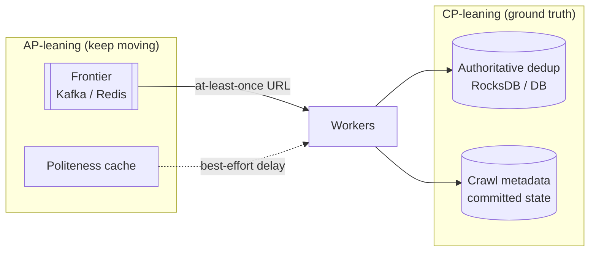
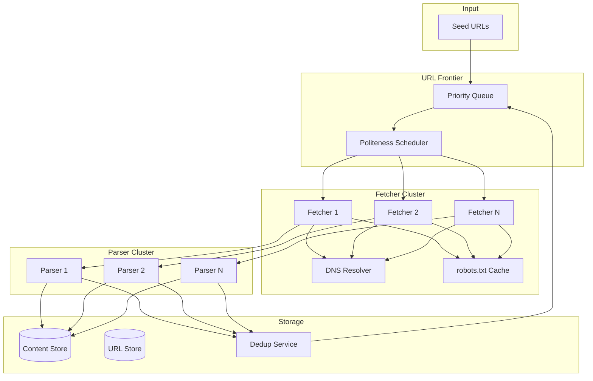
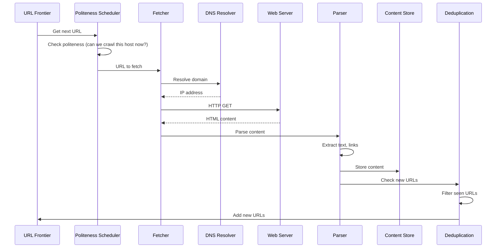
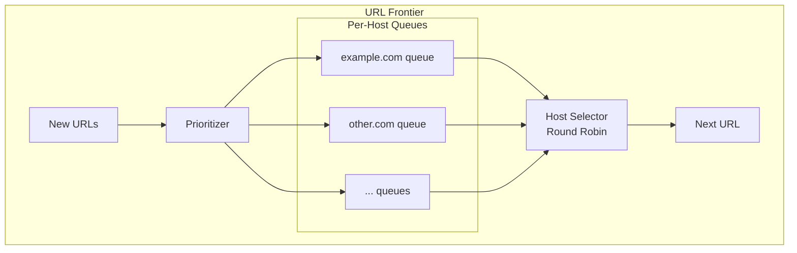
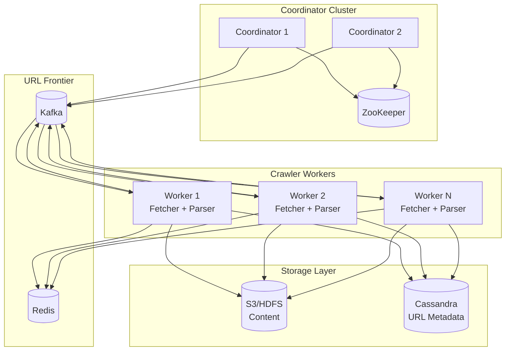

# Design a Web Crawler

---

## What We're Building

A web crawler (also called a spider or bot) systematically browses the internet to discover and download web pages. It starts with a set of seed URLs, downloads their content, extracts new URLs from those pages, and continues recursively.

**Simple example:**
```
Start with: https://example.com
  → Download page
  → Extract links: /about, /products, /blog
  → Add to queue: example.com/about, example.com/products, example.com/blog
  → Download each, extract more links
  → Continue...
```

### Why Web Crawlers Matter

| Use Case | Description |
|----------|-------------|
| **Search engines** | Google, Bing crawl billions of pages to index |
| **SEO tools** | Ahrefs, Moz crawl to analyze backlinks |
| **Price monitoring** | Track competitor prices across e-commerce |
| **Content aggregation** | News aggregators collect articles |
| **Archiving** | Wayback Machine preserves the web |
| **Security scanning** | Find vulnerabilities across websites |
| **Research** | Collect datasets for ML, analytics |

### The Scale Challenge

| Crawler | Pages Crawled | Notes |
|---------|---------------|-------|
| **Googlebot** | Billions/day | Most comprehensive |
| **Bingbot** | Hundreds of millions/day | #2 search engine |
| **Common Crawl** | ~3 billion pages/month | Open dataset |

At this scale, a crawler must handle:
- **Billions of URLs** to track
- **Millions of concurrent connections**
- **Petabytes of storage**
- **Politeness** (don't overload servers)
- **Freshness** (re-crawl changed pages)
- **Deduplication** (same content, different URLs)

---

## Step 1: Requirements Clarification

### Questions to Ask

| Question | Why It Matters |
|----------|----------------|
| What's the purpose? | Search engine vs. monitoring vs. archiving |
| Scale? | 1000 pages vs. billions |
| Domains to crawl? | Single site vs. entire internet |
| Freshness requirements? | Real-time vs. weekly vs. never |
| Content types? | HTML only vs. PDFs, images, etc. |
| Politeness rules? | Respect robots.txt? Rate limits? |

### Functional Requirements

| Requirement | Priority | Description |
|-------------|----------|-------------|
| Crawl web pages from seed URLs | Must have | Core functionality |
| Extract and follow links | Must have | Discover new pages |
| Handle robots.txt | Must have | Respect site preferences |
| Store crawled content | Must have | For indexing/processing |
| Avoid duplicate crawling | Must have | Don't waste resources |
| Prioritize important pages | Nice to have | PageRank, freshness |
| Handle dynamic content (JS) | Nice to have | Single Page Apps |

### Non-Functional Requirements

| Requirement | Target | Rationale |
|-------------|--------|-----------|
| **Throughput** | 1,000+ pages/second | Crawl internet in reasonable time |
| **Scalability** | Horizontal | Add machines to crawl faster |
| **Politeness** | Respect robots.txt, rate limits | Don't get blocked, be ethical |
| **Robustness** | Handle failures gracefully | Web is messy |
| **Freshness** | Re-crawl based on change frequency | Keep index current |

### Scope for This Design

Let's design a **general-purpose web crawler** that can:
- Crawl the entire web (billions of pages)
- Process 1,000 pages/second
- Run continuously with periodic re-crawling
- Respect robots.txt and politeness

---

## Technology Selection & Tradeoffs

Choosing components is not about picking the “best” technology in isolation—it is about matching **throughput, operational cost, failure modes, and team skills** to the crawler’s workload. Below are common options interviewers expect you to compare.

### URL frontier

| Option | Strengths | Weaknesses | Best when |
|--------|-----------|------------|-----------|
| **Redis** (sorted sets, streams, lists) | Low latency, familiar ops, good for per-host scoring and short queues | Memory-bound; cross-region consistency is hard; not a durable log by default | Medium scale, need fast dequeue + scoring; combine with persistence (AOF/RDB) or replay source |
| **Kafka** (partitioned log) | Durable, replayable, horizontal scale, natural backpressure | Higher latency than Redis; ordering is per-partition; consumer lag is an ops concern | Large-scale distributed crawl; need audit trail and reprocessing of URL batches |
| **Custom in-process priority queue** (per worker + coordination) | Maximum control over politeness heuristics | Does not distribute by itself; single-machine limits | Prototypes, single-DC vertical scale, or as a **local** buffer in front of a distributed queue |
| **Database-backed** (e.g., PostgreSQL/Cassandra with indexed `next_crawl_time`) | Strong durability; easy queries for “what to crawl next” | Can become a write/read hotspot; needs careful sharding and batch dequeue | Crawl freshness driven by schedules; smaller QPS or when queue logic maps cleanly to SQL |

**Why it matters:** The frontier is the **system’s throttle and fairness layer**. Kafka favors **durability and replay**; Redis favors **speed**; DB-backed favors **queryable schedules** at the cost of hot rows.

### Content storage

| Option | Strengths | Weaknesses | Best when |
|--------|-----------|------------|-----------|
| **S3-compatible object storage** | Infinite scale, cheap cold storage, lifecycle policies, multi-AZ durability | Not a low-latency random-update store; listing at huge prefix scale needs design | **Default choice** for raw HTML blobs and WARC-style archives |
| **HDFS** | Tight integration with Hadoop/Spark batch analytics | Heavier ops; cloud-native teams often prefer object storage | On-prem big-data stacks; batch pipelines already on Hadoop |
| **Cassandra** | High write throughput, wide-column model for metadata | Wrong tool for multi-MB blobs; operational complexity | **Metadata and crawl state**, not primary blob store |
| **MongoDB** | Flexible documents, good for moderate metadata | Large binary payloads are expensive; sharding ops for TB+ blobs | Smaller crawls or document-centric secondary indices—not typical for petabyte HTML |

**Why it matters:** **Blobs** (HTML) belong in **cheap, durable object storage**; **metadata** (URL hash, timestamps, status) belongs in a **row-oriented or wide-column** store optimized for lookups and writes.

### URL deduplication

| Option | Strengths | Weaknesses | Best when |
|--------|-----------|------------|-----------|
| **Bloom filter** | Tiny memory per URL for huge sets; extremely fast | False positives (may skip never-seen URLs); no delete without rebuild/rehashing | First-line **negative cache** in front of a definitive store |
| **Redis SET** (or HyperLogLog for counts only) | Exact membership for keys in RAM; simple API | Memory grows with unique URLs; cross-region sync is non-trivial | Medium corpora, or per-shard exact sets |
| **RocksDB** (or other LSM KV) | Disk-backed exact set at scale; good write throughput; range scans | Tunable compaction/ops; not a probabilistic filter | **Authoritative “seen URL”** store at billion+ scale |

**Why it matters:** Interviewers want the **two-tier pattern**: Bloom (or similar) for **cheap “probably seen”**, plus **RocksDB/DB for “definitely seen”** to eliminate false positives on enqueue.

### DNS resolution

| Option | Strengths | Weaknesses | Best when |
|--------|-----------|------------|-----------|
| **Local cache** (per worker or shared Redis) | Fast repeat lookups; reduces resolver load | Stale TTL handling; cold start on new hosts | Always—**every** fetch path should cache by `(host, ttl)` |
| **Dedicated DNS resolver pool** (recursive resolvers you operate) | Rate limiting, monitoring, retry policy centralized | More infra; must respect resolver policies and avoid becoming abusive | High QPS crawl; need observability and **fairness** across workers |

**Why it matters:** DNS is easy to underestimate. A **shared cache** avoids thundering herds; **dedicated resolvers** isolate failures and apply global rate limits to lookups.

### HTML parsing

| Option | Strengths | Weaknesses | Best when |
|--------|-----------|------------|-----------|
| **Lightweight parser** (jsoup, BeautifulSoup, lxml) | Fast, low CPU/memory; great for static HTML | No JS execution | **Default** for link extraction and main content on server-rendered pages |
| **Headless browser** (Playwright, Puppeteer) | Renders SPAs, executes JS | 10–100× cost per page; harder to scale | Known JS-heavy hosts or after HTTP fetch returns shell HTML |

**Why it matters:** Use the **cheapest** tool that satisfies coverage; reserve headless for a **fraction** of URLs to protect throughput and cost.

### Our choice

| Area | Choice | Rationale |
|------|--------|-----------|
| Frontier | **Kafka** (partitioned by host hash) + **Redis** (hot scoring / delays) | Durable backlog and replay for failures; Redis for low-latency politeness metadata if needed |
| Content | **S3** (gzip) | Cost and durability for petabyte-scale blobs; standard for this problem |
| Dedup | **Bloom** (cluster-wide) + **RocksDB** (per shard, exact) | Minimize RAM while bounding false positives with a ground-truth store |
| DNS | **Shared cache** + **dedicated resolver tier** at high QPS | Cache hits dominate; resolvers isolate abuse and ease monitoring |
| Parsing | **Lightweight parser** default + **headless** on allowlist | Maximizes pages/sec while still covering SPAs where required |

---

## CAP Theorem Analysis

CAP (Consistency, Availability, Partition tolerance) is a **useful mental model**, not a literal database knob—especially for a **batch-leaning** crawler where “consistency” means **no wasted work** and **correct politeness**, not linearizable reads everywhere.

### How to frame it in an interview

- **Partition tolerance (P)** is non-negotiable in a distributed crawler: networks split, brokers restart, regions fail.
- You then choose **per subsystem** whether you favor **stronger consistency** (dedup, crawl commitments) or **liveness** (keeping the frontier moving).

### Per-component view

| Component | CAP leaning | Consistency concern | Availability / liveness |
|-----------|-------------|---------------------|-------------------------|
| **URL deduplication (authoritative)** | **CP** | Must not permanently wrongfully skip URLs (mitigate Bloom FP with DB check) | Brief unavailability may stall enqueue; prefer **retry** over wrong skip |
| **Frontier queue** | **AP** | Duplicate deliveries are acceptable idempotently | **Must** keep dequeuing under failures (at-least-once is OK) |
| **Politeness / rate state** | **AP** with convergence | Per-host clocks can temporarily violate delay; should **self-correct** | Crawl should not stop globally if one shard’s delay cache is stale |
| **Content store (S3)** | **AP** (eventual listing/consistency models vary) | Uniqueness via **content hash + key** idempotency | Writes succeed independently per object |
| **Crawl metadata DB** | Tunable (often **CP** within quorum) | Same URL should not diverge into contradictory “never crawled” vs “stored” | Reads can be eventually consistent for dashboards |

**Why dedup “must be consistent” but frontier “can be AP”:** Duplicate frontier work wastes bandwidth but is **safe if dedup and storage are idempotent**. Wrong dedup **loses coverage**—harder to fix than wasting a fetch.

### Diagram



Under a partition, **prefer**: frontier may **duplicate**, workers may **re-fetch** occasionally, but **dedup + idempotent writes** prevent permanent inconsistency in “what the corpus contains.”

---

## SLA and SLO Definitions

SLAs are **contracts** (often with customers); **SLOs** are internal targets measured by **SLIs**. For a crawler, SLOs align **coverage, freshness, ethics, and cost**.

### Service level indicators (SLIs) and objectives (SLOs)

| Dimension | SLI (what we measure) | Example SLO | Notes |
|-----------|-------------------------|-------------|-------|
| **Crawl throughput** | Successful `200` HTML fetches / sec (or / min sustained) | **≥ 400 pages/sec** monthly 99th percentile of **5-min** windows | Exclude intentionally skipped (robots, non-HTML); align with capacity plan |
| **Crawl freshness** | Time between successful crawls of same URL (p50 / p95) | **p95 ≤ 14 days** for “news” class; **p95 ≤ 90 days** for static class | Requires URL **tiering**; single global number is a red flag in interviews |
| **Politeness** | Requests per host per second (max over 1-min window) | **≤ 1 rps/host** default unless `robots` allows more | Measure per crawler **User-Agent** aggregate if multiple shards hit same host |
| **Dedup accuracy** | Ratio of false “already seen” decisions that skip **new** URLs (sampled audit) | **≤ 0.01%** bad skips after Bloom + DB verification | Bloom alone cannot hit this—**audit** matters |
| **Content durability** | Objects in blob store with successful periodic **HEAD/verify** or replication checks | **≥ 99.999999999%** annual durability (provider SLA) for stored objects | Pair with **checksum** on write; lifecycle to detect corruption |

### Error budget policy

| Element | Policy |
|---------|--------|
| **Budget** | If monthly error budget is consumed (e.g., freshness SLO misses > 5% of URLs in a tier), **freeze** new features (e.g., new JS rendering modes) until recovery. |
| **Burn alerts** | **Fast burn**: budget will exhaust in days; page on-call, scale workers, shed low-priority tiers. **Slow burn**: investigate scheduler drift, bad seeds, or dedup regression. |
| **Tradeoffs** | Spending budget on **higher throughput** may **consume politeness budget**—explicitly cap QPS before raising concurrency. |

**Interview tip:** Tie each SLO to a **dashboard** and an **alert**; mention **tiered freshness** so you do not promise one number for the whole web.

---

## Database Schema

Schemas separate **what must be queryable** (scheduling, status, graph analytics) from **blobs** (stored in object storage). Types are illustrative—adjust for your SQL/NoSQL choice.

### `url_frontier` (work queue + scheduling)

| Column | Type | Description |
|--------|------|-------------|
| `url_id` | `UUID` or `BYTEA` (hash) | Stable id; hash of canonical URL if UUID not used |
| `url` | `TEXT` | Canonical URL |
| `priority` | `DOUBLE` or `BIGINT` | Crawl priority (PageRank, freshness score, tier) |
| `state` | `ENUM` | e.g. `pending`, `scheduled`, `leased`, `fetched`, `failed`, `skipped_robots` |
| `next_crawl_time` | `TIMESTAMPTZ` | When the URL is eligible again (freshness / retry backoff) |
| `lease_owner` | `TEXT` (nullable) | Worker or session id if using lease-based dequeue |
| `lease_expires_at` | `TIMESTAMPTZ` (nullable) | For stuck work reclaim |
| `discovered_from` | `TEXT` (nullable) | Provenance for debugging (optional) |

**Indexes:** `(state, next_crawl_time)`, `(priority DESC, next_crawl_time)` for batch selection; **shard key** often `hash(url)` or `host`.

### `crawled_pages` (fetch outcome + pointer to blob)

| Column | Type | Description |
|--------|------|-------------|
| `url_id` | same as frontier | FK or matching hash |
| `url` | `TEXT` | Final URL after redirects |
| `content_hash` | `BYTEA` (SHA-256) | Deduplication and integrity |
| `crawl_timestamp` | `TIMESTAMPTZ` | End of successful fetch |
| `http_status` | `SMALLINT` | e.g. 200, 404, 429 |
| `response_headers` | `JSONB` | Subset: `Content-Type`, `ETag`, `Last-Modified` |
| `storage_key` | `TEXT` | S3 key or equivalent |
| `content_length` | `BIGINT` | Bytes stored (compressed or raw, document clearly) |

**Indexes:** `content_hash` (for duplicate detection), `crawl_timestamp` (for incremental exports).

### `link_graph` (optional, for ranking / debugging)

| Column | Type | Description |
|--------|------|-------------|
| `source_url_id` | `UUID` / hash | Outlink source |
| `target_url_id` | `UUID` / hash | Outlink target |
| `anchor_text` | `TEXT` (nullable) | Useful for ranking; can be omitted at huge scale |
| `discovered_at` | `TIMESTAMPTZ` | When edge was seen |

**Primary key / index:** `(source_url_id, target_url_id)`; optional inverted index on `target_url_id` for backlink queries (expensive at scale—often sampled).

---

## API Design

External APIs **control** the crawl (seeds, politeness) and **observe** it (status, results). All writes should be **authenticated**; rate-limit public endpoints.

### Overview

| Endpoint | Method | Purpose |
|----------|--------|---------|
| `/v1/seeds` | `POST` | Submit seed URLs (and optional crawl tier / max depth) |
| `/v1/crawls/{crawl_job_id}` | `GET` | Job status: queued, running, completed, failed counts |
| `/v1/hosts/{host}/politeness` | `PUT` | Set rps, crawl-delay override, or pause for a host |
| `/v1/results` | `GET` | Query crawl results by URL or time range (paged) |

### `POST /v1/seeds`

**Body (JSON):**

```json
{
  "seeds": ["https://example.com/", "https://news.example.com/"],
  "job_name": "monthly-recrawl",
  "priority": "normal",
  "respect_robots": true
}
```

**Response `202 Accepted`:** `{ "crawl_job_id": "...", "queued_urls": 2 }` — enqueue is async.

**Why:** Seeds can be large; **accept quickly**, process in the frontier.

### `GET /v1/crawls/{crawl_job_id}`

**Response `200`:**

```json
{
  "crawl_job_id": "...",
  "state": "running",
  "submitted_at": "2026-04-05T12:00:00Z",
  "stats": {
    "fetched_ok": 1200000,
    "failed": 8900,
    "skipped_robots": 45000,
    "queue_depth_estimate": 50000000
  }
}
```

**Why:** Operators need **aggregate progress**, not per-URL polling.

### `PUT /v1/hosts/{host}/politeness`

**Body:**

```json
{
  "max_rps": 0.5,
  "crawl_delay_ms": 2000,
  "paused": false,
  "effective_until": "2026-04-12T00:00:00Z"
}
```

**Response `204 No Content`** on success.

**Why:** Incidents (429 storms, site owner contact) require **fast policy changes** without redeploying workers.

### `GET /v1/results`

**Query params:** `url` (exact), `since`, `until`, `page_size`, `page_token`.

**Response:** Paged list of `{ "url", "content_hash", "crawl_timestamp", "http_status", "storage_key" }`.

**Why:** Downstream indexers consume **metadata + pointer**; bulk export may use **separate** batch APIs or data lake.

### Error model (consistent)

| HTTP | When |
|------|------|
| `400` | Invalid URL, bad host, conflicting politeness |
| `401` / `403` | Auth failures |
| `404` | Unknown `crawl_job_id` or host rule |
| `429` | Client exceeded API rate limit (distinct from origin `429`) |
| `503` | Frontier overload; client should retry with backoff |

---

## Step 2: Back-of-Envelope Estimation

### Scale Assumptions

```
Target: Crawl 1 billion web pages per month
Average page size: 500 KB (HTML + headers)
Crawl window: 30 days continuous
Re-crawl frequency: 30% of pages re-crawled per month
```

### Traffic Estimation

```
Pages per day     = 1B / 30 = ~33 million pages/day
Pages per second  = 33M / 86,400 ≈ 380 pages/sec → round to 400 pages/sec
Peak (3x)         = 1,200 pages/sec
```

### Bandwidth Estimation

```
Average page size       = 500 KB
Bandwidth (avg)         = 400 pages/sec × 500 KB = 200 MB/sec ≈ 1.6 Gbps
Bandwidth (peak)        = 1,200 × 500 KB = 600 MB/sec ≈ 4.8 Gbps
```

### Storage Estimation

```
Raw HTML storage/month  = 1B × 500 KB = 500 TB/month
Compressed (5:1 ratio)  = 100 TB/month
Yearly storage          = 1.2 PB/year
Metadata per page       = ~1 KB (URL, timestamp, hash, status)
Metadata total          = 1B × 1 KB = 1 TB
URL frontier size       = 10B URLs × 200 bytes = 2 TB
```

### Infrastructure Sizing

| Component | Estimate | Implication |
|-----------|----------|-------------|
| Crawl workers | 400 pages/sec ÷ 10 pages/sec/worker = 40 workers | 40-50 VMs or containers |
| Bandwidth | 1.6 Gbps average | Dedicated network, multiple ISP egress |
| Storage | 100 TB/month compressed | Distributed storage (S3/HDFS) |
| URL frontier | 2 TB | Distributed queue (Kafka or Redis cluster) |
| DNS cache | 100M domains × 100 bytes = 10 GB | In-memory DNS resolver cache |

!!! note
    These estimates show why web crawling requires distributed architecture — no single machine can handle the bandwidth, storage, or compute requirements.

---

## Step 3: High-Level Architecture

### Core Components



### Crawl Workflow



---

## Step 4: Component Deep Dive

### 4.1 URL Frontier

The frontier manages the queue of URLs to crawl. It's not a simple FIFO queue—it must handle:
- **Prioritization:** Important pages first
- **Politeness:** Don't hammer same host
- **Freshness:** Re-crawl changed pages

**Architecture:**



**Implementation:**

=== "Python"

    ```python
    from dataclasses import dataclass
    from typing import Dict, List, Optional
    import heapq
    import time
    from urllib.parse import urlparse
    
    @dataclass
    class URLEntry:
        url: str
        priority: float
        depth: int
        discovered_at: float
    
        def __lt__(self, other):
            return self.priority > other.priority  # Higher priority first
    
    class URLFrontier:
        def __init__(self, politeness_delay: float = 1.0):
            self.host_queues: Dict[str, List[URLEntry]] = {}
            self.host_last_access: Dict[str, float] = {}
            self.politeness_delay = politeness_delay
            self.hosts_ready: List[tuple] = []  # (next_access_time, host)
    
        def add_url(self, url: str, priority: float = 1.0, depth: int = 0):
            """Add URL to appropriate host queue."""
            host = urlparse(url).netloc
    
            if host not in self.host_queues:
                self.host_queues[host] = []
                # New host is immediately ready
                heapq.heappush(self.hosts_ready, (0, host))
    
            entry = URLEntry(
                url=url,
                priority=priority,
                depth=depth,
                discovered_at=time.time()
            )
            heapq.heappush(self.host_queues[host], entry)
    
        def get_next_url(self) -> Optional[str]:
            """Get next URL respecting politeness."""
            now = time.time()
    
            while self.hosts_ready:
                next_time, host = heapq.heappop(self.hosts_ready)
    
                if next_time > now:
                    # No host is ready yet
                    heapq.heappush(self.hosts_ready, (next_time, host))
                    return None
    
                if host in self.host_queues and self.host_queues[host]:
                    entry = heapq.heappop(self.host_queues[host])
    
                    # Schedule next access for this host
                    next_access = now + self.politeness_delay
                    heapq.heappush(self.hosts_ready, (next_access, host))
    
                    self.host_last_access[host] = now
                    return entry.url
    
            return None
    ```

=== "Java"

    ```java
    import java.net.URI;
    import java.net.http.HttpClient;
    import java.net.http.HttpRequest;
    import java.net.http.HttpResponse;
    import java.time.Duration;
    import java.util.ArrayList;
    import java.util.List;
    import java.util.Set;
    import java.util.concurrent.ConcurrentHashMap;
    import java.util.concurrent.PriorityBlockingQueue;
    import java.util.regex.Matcher;
    import java.util.regex.Pattern;
    
    /**
     * URL Frontier backed by a priority queue with politeness enforcement.
     * In production, replace with Kafka-backed distributed frontier.
     */
    public class URLFrontier {
        private final PriorityBlockingQueue<CrawlTask> queue;
        private final ConcurrentHashMap<String, Long> domainLastAccess;
        private final long politeDelayMs;
    
        public record CrawlTask(String url, int priority, int depth)
                implements Comparable<CrawlTask> {
            @Override
            public int compareTo(CrawlTask other) {
                return Integer.compare(this.priority, other.priority);
            }
        }
    
        public URLFrontier(long politeDelayMs) {
            this.queue = new PriorityBlockingQueue<>();
            this.domainLastAccess = new ConcurrentHashMap<>();
            this.politeDelayMs = politeDelayMs;
        }
    
        public void add(String url, int priority, int depth) {
            queue.offer(new CrawlTask(url, priority, depth));
        }
    
        public CrawlTask next() throws InterruptedException {
            while (true) {
                CrawlTask task = queue.take();
                String domain = URI.create(task.url()).getHost();
                long lastAccess = domainLastAccess.getOrDefault(domain, 0L);
                long elapsed = System.currentTimeMillis() - lastAccess;
    
                if (elapsed < politeDelayMs) {
                    Thread.sleep(politeDelayMs - elapsed);
                }
                domainLastAccess.put(domain, System.currentTimeMillis());
                return task;
            }
        }
    
        public int size() { return queue.size(); }
    }
    
    /**
     * Crawler worker that fetches pages, extracts links, and publishes results.
     */
    public class CrawlerWorker implements Runnable {
        private static final Pattern LINK_PATTERN =
            Pattern.compile("href=[\"'](https?://[^\"'\\s>]+)[\"']", Pattern.CASE_INSENSITIVE);
    
        private final URLFrontier frontier;
        private final HttpClient httpClient;
        private final Set<String> visited;
        private final int maxDepth;
        private volatile boolean running = true;
    
        public CrawlerWorker(URLFrontier frontier, Set<String> visited, int maxDepth) {
            this.frontier = frontier;
            this.visited = visited;
            this.maxDepth = maxDepth;
            this.httpClient = HttpClient.newBuilder()
                .connectTimeout(Duration.ofSeconds(10))
                .followRedirects(HttpClient.Redirect.NORMAL)
                .build();
        }
    
        @Override
        public void run() {
            while (running) {
                try {
                    URLFrontier.CrawlTask task = frontier.next();
                    if (task.depth() > maxDepth) continue;
                    if (!visited.add(task.url())) continue;
    
                    HttpResponse<String> response = httpClient.send(
                        HttpRequest.newBuilder()
                            .uri(URI.create(task.url()))
                            .timeout(Duration.ofSeconds(15))
                            .header("User-Agent", "SystemDesignBot/1.0")
                            .GET()
                            .build(),
                        HttpResponse.BodyHandlers.ofString()
                    );
    
                    if (response.statusCode() == 200) {
                        String body = response.body();
                        processPage(task.url(), body);
                        extractLinks(body, task.depth()).forEach(link ->
                            frontier.add(link, task.priority() + 1, task.depth() + 1));
                    }
                } catch (Exception e) {
                    // log and continue — one page failure shouldn't stop the crawler
                }
            }
        }
    
        private List<String> extractLinks(String html, int currentDepth) {
            List<String> links = new ArrayList<>();
            Matcher matcher = LINK_PATTERN.matcher(html);
            while (matcher.find()) {
                links.add(matcher.group(1));
            }
            return links;
        }
    
        private void processPage(String url, String content) {
            // store content, update index, emit to pipeline
        }
    
        public void shutdown() { running = false; }
    }
    ```

=== "Go"

    ```go
    package crawler
    
    import (
    	"context"
    	"fmt"
    	"io"
    	"net/http"
    	"net/url"
    	"regexp"
    	"sync"
    	"time"
    )
    
    var linkPattern = regexp.MustCompile(`href=["'](https?://[^"'\s>]+)["']`)
    
    type CrawlResult struct {
    	URL        string
    	StatusCode int
    	Body       string
    	Links      []string
    	Duration   time.Duration
    	Error      error
    }
    
    type Crawler struct {
    	client         *http.Client
    	visited        sync.Map
    	frontier       chan string
    	results        chan CrawlResult
    	politeDelay    time.Duration
    	domainLastHit  sync.Map
    	maxDepth       int
    	workerCount    int
    }
    
    func NewCrawler(workerCount int, politeDelay time.Duration, maxDepth int) *Crawler {
    	return &Crawler{
    		client: &http.Client{
    			Timeout: 15 * time.Second,
    			CheckRedirect: func(req *http.Request, via []*http.Request) error {
    				if len(via) >= 5 {
    					return fmt.Errorf("too many redirects")
    				}
    				return nil
    			},
    		},
    		frontier:    make(chan string, 100000),
    		results:     make(chan CrawlResult, 10000),
    		politeDelay: politeDelay,
    		maxDepth:    maxDepth,
    		workerCount: workerCount,
    	}
    }
    
    func (c *Crawler) Start(ctx context.Context, seedURLs []string) <-chan CrawlResult {
    	for _, u := range seedURLs {
    		c.frontier <- u
    	}
    
    	var wg sync.WaitGroup
    	for i := 0; i < c.workerCount; i++ {
    		wg.Add(1)
    		go func() {
    			defer wg.Done()
    			c.worker(ctx)
    		}()
    	}
    
    	go func() {
    		wg.Wait()
    		close(c.results)
    	}()
    
    	return c.results
    }
    
    func (c *Crawler) worker(ctx context.Context) {
    	for {
    		select {
    		case <-ctx.Done():
    			return
    		case rawURL, ok := <-c.frontier:
    			if !ok {
    				return
    			}
    			if _, loaded := c.visited.LoadOrStore(rawURL, true); loaded {
    				continue
    			}
    			c.enforcePoliteness(rawURL)
    			result := c.fetch(rawURL)
    			c.results <- result
    
    			if result.Error == nil {
    				for _, link := range result.Links {
    					if _, seen := c.visited.Load(link); !seen {
    						select {
    						case c.frontier <- link:
    						default: // frontier full, drop URL
    						}
    					}
    				}
    			}
    		}
    	}
    }
    
    func (c *Crawler) fetch(rawURL string) CrawlResult {
    	start := time.Now()
    
    	req, err := http.NewRequest("GET", rawURL, nil)
    	if err != nil {
    		return CrawlResult{URL: rawURL, Error: err, Duration: time.Since(start)}
    	}
    	req.Header.Set("User-Agent", "SystemDesignBot/1.0")
    
    	resp, err := c.client.Do(req)
    	if err != nil {
    		return CrawlResult{URL: rawURL, Error: err, Duration: time.Since(start)}
    	}
    	defer resp.Body.Close()
    
    	body, _ := io.ReadAll(io.LimitReader(resp.Body, 5*1024*1024)) // 5MB max
    	links := extractLinks(string(body), rawURL)
    
    	return CrawlResult{
    		URL:        rawURL,
    		StatusCode: resp.StatusCode,
    		Body:       string(body),
    		Links:      links,
    		Duration:   time.Since(start),
    	}
    }
    
    func (c *Crawler) enforcePoliteness(rawURL string) {
    	parsed, err := url.Parse(rawURL)
    	if err != nil {
    		return
    	}
    	domain := parsed.Host
    
    	if lastHit, ok := c.domainLastHit.Load(domain); ok {
    		elapsed := time.Since(lastHit.(time.Time))
    		if elapsed < c.politeDelay {
    			time.Sleep(c.politeDelay - elapsed)
    		}
    	}
    	c.domainLastHit.Store(domain, time.Now())
    }
    
    func extractLinks(html, baseURL string) []string {
    	matches := linkPattern.FindAllStringSubmatch(html, -1)
    	var links []string
    	for _, match := range matches {
    		if len(match) > 1 {
    			links = append(links, match[1])
    		}
    	}
    	return links
    }
    ```

### 4.2 Politeness and robots.txt

**robots.txt** tells crawlers what they can/can't access:

```
# Example robots.txt
User-agent: *
Disallow: /private/
Disallow: /admin/
Crawl-delay: 10

User-agent: Googlebot
Allow: /
Crawl-delay: 1
```

**Implementation:**

```python
import urllib.robotparser
from functools import lru_cache
import asyncio
import aiohttp

class RobotsCache:
    def __init__(self, user_agent: str = "MyCrawler/1.0"):
        self.user_agent = user_agent
        self.cache: Dict[str, urllib.robotparser.RobotFileParser] = {}
        self.cache_ttl: Dict[str, float] = {}
        self.ttl = 3600  # Cache robots.txt for 1 hour
    
    async def fetch_robots(self, host: str) -> urllib.robotparser.RobotFileParser:
        """Fetch and parse robots.txt for a host."""
        robots_url = f"https://{host}/robots.txt"
        
        rp = urllib.robotparser.RobotFileParser()
        rp.set_url(robots_url)
        
        try:
            async with aiohttp.ClientSession() as session:
                async with session.get(robots_url, timeout=10) as response:
                    if response.status == 200:
                        content = await response.text()
                        rp.parse(content.splitlines())
                    else:
                        # No robots.txt = allow all
                        rp.parse([])
        except Exception:
            # Error fetching = allow all (fail open)
            rp.parse([])
        
        return rp
    
    async def can_fetch(self, url: str) -> bool:
        """Check if we're allowed to fetch this URL."""
        host = urlparse(url).netloc
        
        # Check cache
        now = time.time()
        if host in self.cache and self.cache_ttl.get(host, 0) > now:
            rp = self.cache[host]
        else:
            rp = await self.fetch_robots(host)
            self.cache[host] = rp
            self.cache_ttl[host] = now + self.ttl
        
        return rp.can_fetch(self.user_agent, url)
    
    def get_crawl_delay(self, host: str) -> float:
        """Get crawl delay for host."""
        if host in self.cache:
            delay = self.cache[host].crawl_delay(self.user_agent)
            return delay if delay else 1.0
        return 1.0  # Default 1 second
```

### 4.3 Fetcher

The fetcher downloads web pages. It must handle:
- **Concurrent connections:** Maximize throughput
- **Timeouts:** Don't wait forever
- **Retries:** Handle transient failures
- **HTTP headers:** Set User-Agent, handle redirects

**Implementation:**

```python
import aiohttp
import asyncio
from dataclasses import dataclass
from typing import Optional
import hashlib

@dataclass
class FetchResult:
    url: str
    final_url: str  # After redirects
    status_code: int
    content_type: str
    content: bytes
    content_hash: str
    headers: dict
    fetch_time: float

class AsyncFetcher:
    def __init__(self, 
                 user_agent: str = "MyCrawler/1.0",
                 timeout: int = 30,
                 max_size: int = 10 * 1024 * 1024):  # 10MB
        self.user_agent = user_agent
        self.timeout = aiohttp.ClientTimeout(total=timeout)
        self.max_size = max_size
        
        self.headers = {
            "User-Agent": user_agent,
            "Accept": "text/html,application/xhtml+xml",
            "Accept-Language": "en-US,en;q=0.9",
            "Accept-Encoding": "gzip, deflate",
        }
    
    async def fetch(self, url: str) -> Optional[FetchResult]:
        """Fetch a URL and return content."""
        start_time = time.time()
        
        try:
            async with aiohttp.ClientSession(
                timeout=self.timeout,
                headers=self.headers
            ) as session:
                async with session.get(
                    url, 
                    allow_redirects=True,
                    max_redirects=5
                ) as response:
                    # Check content type
                    content_type = response.headers.get("Content-Type", "")
                    if not self._should_process(content_type):
                        return None
                    
                    # Check content length
                    content_length = response.headers.get("Content-Length")
                    if content_length and int(content_length) > self.max_size:
                        return None
                    
                    # Read content with size limit
                    content = await response.content.read(self.max_size)
                    
                    return FetchResult(
                        url=url,
                        final_url=str(response.url),
                        status_code=response.status,
                        content_type=content_type,
                        content=content,
                        content_hash=hashlib.sha256(content).hexdigest(),
                        headers=dict(response.headers),
                        fetch_time=time.time() - start_time
                    )
        
        except asyncio.TimeoutError:
            logger.warning(f"Timeout fetching {url}")
            return None
        except aiohttp.ClientError as e:
            logger.warning(f"Error fetching {url}: {e}")
            return None
    
    def _should_process(self, content_type: str) -> bool:
        """Check if we should process this content type."""
        allowed = ["text/html", "application/xhtml+xml"]
        return any(ct in content_type for ct in allowed)
```

### 4.4 Parser

The parser extracts information from HTML:
- **Links:** For further crawling
- **Text content:** For indexing
- **Metadata:** Title, description, etc.

**Implementation:**

```python
from bs4 import BeautifulSoup
from urllib.parse import urljoin, urlparse
from dataclasses import dataclass
from typing import List, Set

@dataclass
class ParseResult:
    url: str
    title: str
    text: str
    links: List[str]
    metadata: dict

class HTMLParser:
    def __init__(self, allowed_domains: Set[str] = None):
        self.allowed_domains = allowed_domains
    
    def parse(self, url: str, html_content: bytes) -> ParseResult:
        """Parse HTML and extract content and links."""
        try:
            soup = BeautifulSoup(html_content, 'lxml')
        except Exception:
            soup = BeautifulSoup(html_content, 'html.parser')
        
        # Remove script and style elements
        for element in soup(['script', 'style', 'nav', 'footer', 'header']):
            element.decompose()
        
        # Extract title
        title = ""
        if soup.title:
            title = soup.title.string or ""
        
        # Extract text
        text = soup.get_text(separator=' ', strip=True)
        
        # Extract links
        links = self._extract_links(url, soup)
        
        # Extract metadata
        metadata = self._extract_metadata(soup)
        
        return ParseResult(
            url=url,
            title=title.strip(),
            text=text,
            links=links,
            metadata=metadata
        )
    
    def _extract_links(self, base_url: str, soup: BeautifulSoup) -> List[str]:
        """Extract and normalize links."""
        links = []
        
        for a_tag in soup.find_all('a', href=True):
            href = a_tag['href']
            
            # Skip certain links
            if href.startswith(('#', 'javascript:', 'mailto:', 'tel:')):
                continue
            
            # Convert to absolute URL
            absolute_url = urljoin(base_url, href)
            
            # Normalize
            normalized = self._normalize_url(absolute_url)
            if normalized:
                links.append(normalized)
        
        return list(set(links))  # Deduplicate
    
    def _normalize_url(self, url: str) -> Optional[str]:
        """Normalize URL for consistency."""
        try:
            parsed = urlparse(url)
            
            # Only HTTP(S)
            if parsed.scheme not in ('http', 'https'):
                return None
            
            # Check domain filter
            if self.allowed_domains:
                if parsed.netloc not in self.allowed_domains:
                    return None
            
            # Remove fragment
            normalized = f"{parsed.scheme}://{parsed.netloc}{parsed.path}"
            
            # Add query if present
            if parsed.query:
                normalized += f"?{parsed.query}"
            
            # Remove trailing slash for consistency
            normalized = normalized.rstrip('/')
            
            return normalized
        except Exception:
            return None
    
    def _extract_metadata(self, soup: BeautifulSoup) -> dict:
        """Extract meta tags."""
        metadata = {}
        
        for meta in soup.find_all('meta'):
            name = meta.get('name', meta.get('property', ''))
            content = meta.get('content', '')
            
            if name and content:
                metadata[name] = content
        
        return metadata
```

### 4.5 Deduplication

Avoid crawling the same content twice:
- **URL deduplication:** Same URL seen before
- **Content deduplication:** Same content, different URL

**URL Bloom Filter:**

```python
from bitarray import bitarray
import mmh3

class BloomFilter:
    """Memory-efficient probabilistic set membership."""
    
    def __init__(self, expected_items: int, false_positive_rate: float = 0.01):
        # Calculate optimal size and hash count
        self.size = self._optimal_size(expected_items, false_positive_rate)
        self.hash_count = self._optimal_hash_count(self.size, expected_items)
        self.bit_array = bitarray(self.size)
        self.bit_array.setall(0)
    
    def _optimal_size(self, n: int, p: float) -> int:
        """Calculate optimal bit array size."""
        import math
        return int(-n * math.log(p) / (math.log(2) ** 2))
    
    def _optimal_hash_count(self, m: int, n: int) -> int:
        """Calculate optimal number of hash functions."""
        import math
        return max(1, int(m / n * math.log(2)))
    
    def _get_hash_values(self, item: str) -> List[int]:
        """Generate hash values for item."""
        hashes = []
        for i in range(self.hash_count):
            hash_val = mmh3.hash(item, i) % self.size
            hashes.append(hash_val)
        return hashes
    
    def add(self, item: str):
        """Add item to bloom filter."""
        for hash_val in self._get_hash_values(item):
            self.bit_array[hash_val] = 1
    
    def might_contain(self, item: str) -> bool:
        """Check if item might be in set (can have false positives)."""
        return all(
            self.bit_array[hash_val] 
            for hash_val in self._get_hash_values(item)
        )

class URLDeduplicator:
    def __init__(self, expected_urls: int = 1_000_000_000):
        # For 1 billion URLs with 1% FP rate = ~1.2GB memory
        self.bloom = BloomFilter(expected_urls, 0.01)
        self.seen_count = 0
    
    def is_new(self, url: str) -> bool:
        """Check if URL is new (not seen before)."""
        normalized = self._normalize(url)
        
        if self.bloom.might_contain(normalized):
            return False
        
        self.bloom.add(normalized)
        self.seen_count += 1
        return True
    
    def _normalize(self, url: str) -> str:
        """Normalize URL for deduplication."""
        # Remove common tracking parameters
        parsed = urlparse(url)
        # ... normalization logic
        return url.lower()
```

**Content Fingerprinting (SimHash):**

For detecting near-duplicate content:

```python
import simhash

class ContentDeduplicator:
    def __init__(self, threshold: int = 3):
        self.threshold = threshold
        self.fingerprints: Dict[int, str] = {}
    
    def get_fingerprint(self, text: str) -> int:
        """Generate simhash fingerprint for text."""
        return simhash.Simhash(text).value
    
    def is_duplicate(self, text: str) -> Optional[str]:
        """Check if content is duplicate of existing page."""
        fp = self.get_fingerprint(text)
        
        for existing_fp, url in self.fingerprints.items():
            distance = self._hamming_distance(fp, existing_fp)
            if distance <= self.threshold:
                return url  # Return URL of duplicate
        
        return None
    
    def add(self, text: str, url: str):
        """Add content fingerprint."""
        fp = self.get_fingerprint(text)
        self.fingerprints[fp] = url
    
    def _hamming_distance(self, a: int, b: int) -> int:
        """Count differing bits between two integers."""
        return bin(a ^ b).count('1')
```

### 4.6 DNS Resolution

DNS resolution can be a bottleneck. Cache results:

```python
import socket
import time
from typing import Dict, Tuple
import asyncio

class DNSCache:
    def __init__(self, ttl: int = 3600):
        self.cache: Dict[str, Tuple[str, float]] = {}
        self.ttl = ttl
    
    async def resolve(self, hostname: str) -> Optional[str]:
        """Resolve hostname to IP, with caching."""
        now = time.time()
        
        # Check cache
        if hostname in self.cache:
            ip, expiry = self.cache[hostname]
            if expiry > now:
                return ip
        
        # Resolve
        try:
            loop = asyncio.get_event_loop()
            result = await loop.getaddrinfo(
                hostname, None, 
                family=socket.AF_INET,
                type=socket.SOCK_STREAM
            )
            ip = result[0][4][0]
            
            # Cache
            self.cache[hostname] = (ip, now + self.ttl)
            return ip
        except socket.gaierror:
            return None
```

---

## Step 5: Distributed Architecture

For crawling billions of pages, we need a distributed system.

### Architecture



### URL Distribution Strategy

Use consistent hashing to assign URLs to workers:

```python
import hashlib

class URLDistributor:
    def __init__(self, num_workers: int):
        self.num_workers = num_workers
    
    def get_worker(self, url: str) -> int:
        """Determine which worker should handle this URL."""
        # Hash by domain for politeness locality
        domain = urlparse(url).netloc
        hash_val = int(hashlib.md5(domain.encode()).hexdigest(), 16)
        return hash_val % self.num_workers
```

**Why hash by domain?**
- Same domain → same worker
- Easier to enforce politeness (one worker per domain)
- Better connection reuse

### Kafka for URL Queue

```python
from kafka import KafkaProducer, KafkaConsumer

class DistributedFrontier:
    def __init__(self, num_partitions: int):
        self.producer = KafkaProducer(
            bootstrap_servers=['kafka:9092'],
            value_serializer=lambda v: json.dumps(v).encode()
        )
        
        self.consumer = KafkaConsumer(
            'url-frontier',
            group_id='crawlers',
            bootstrap_servers=['kafka:9092'],
            value_deserializer=lambda m: json.loads(m.decode())
        )
        
        self.num_partitions = num_partitions
    
    def add_url(self, url: str, priority: float):
        """Add URL to frontier."""
        domain = urlparse(url).netloc
        partition = self._get_partition(domain)
        
        self.producer.send(
            'url-frontier',
            key=domain.encode(),
            value={'url': url, 'priority': priority},
            partition=partition
        )
    
    def _get_partition(self, domain: str) -> int:
        """Assign domain to partition."""
        return hash(domain) % self.num_partitions
```

### Handling Failures

```python
class CrawlWorker:
    def __init__(self):
        self.fetcher = AsyncFetcher()
        self.parser = HTMLParser()
        self.retry_queue = []
        self.max_retries = 3
    
    async def process_url(self, url: str, retry_count: int = 0):
        """Process URL with retry logic."""
        try:
            result = await self.fetcher.fetch(url)
            
            if result is None:
                return
            
            if result.status_code == 200:
                await self.handle_success(url, result)
            elif result.status_code in (301, 302):
                await self.handle_redirect(url, result)
            elif result.status_code == 429:
                await self.handle_rate_limit(url)
            elif result.status_code >= 500:
                await self.handle_server_error(url, retry_count)
        
        except Exception as e:
            logger.error(f"Error processing {url}: {e}")
            if retry_count < self.max_retries:
                await self.schedule_retry(url, retry_count + 1)
    
    async def handle_server_error(self, url: str, retry_count: int):
        """Retry with exponential backoff."""
        if retry_count < self.max_retries:
            delay = 2 ** retry_count  # 1, 2, 4 seconds
            await asyncio.sleep(delay)
            await self.schedule_retry(url, retry_count + 1)
```

---

## Step 6: Freshness and Re-crawling

Not all pages change at the same rate. Prioritize re-crawling accordingly.

### Change Detection

```python
from datetime import datetime, timedelta

class FreshnessManager:
    def __init__(self):
        self.change_history: Dict[str, List[datetime]] = {}
    
    def record_change(self, url: str, changed: bool):
        """Record whether page changed since last crawl."""
        if url not in self.change_history:
            self.change_history[url] = []
        
        if changed:
            self.change_history[url].append(datetime.now())
    
    def estimate_change_frequency(self, url: str) -> timedelta:
        """Estimate how often this page changes."""
        history = self.change_history.get(url, [])
        
        if len(history) < 2:
            return timedelta(days=7)  # Default: weekly
        
        # Calculate average time between changes
        intervals = [
            history[i] - history[i-1] 
            for i in range(1, len(history))
        ]
        avg_interval = sum(intervals, timedelta()) / len(intervals)
        
        return avg_interval
    
    def calculate_recrawl_priority(self, url: str, last_crawl: datetime) -> float:
        """Calculate priority for re-crawling."""
        expected_change = self.estimate_change_frequency(url)
        time_since_crawl = datetime.now() - last_crawl
        
        # Higher priority if we're overdue for a crawl
        return time_since_crawl / expected_change
```

### ETags and Conditional Requests

Use HTTP headers to detect changes without downloading:

```python
async def fetch_if_modified(self, url: str, etag: str = None, 
                            last_modified: str = None) -> Optional[FetchResult]:
    """Fetch only if content changed."""
    headers = dict(self.headers)
    
    if etag:
        headers["If-None-Match"] = etag
    if last_modified:
        headers["If-Modified-Since"] = last_modified
    
    async with aiohttp.ClientSession() as session:
        async with session.get(url, headers=headers) as response:
            if response.status == 304:
                # Not modified
                return None
            
            # Content changed, process as usual
            return await self._process_response(url, response)
```

---

## Step 7: Handling JavaScript-Rendered Content

Modern sites use JavaScript to render content. Options:

### Option 1: Headless Browser

```python
from playwright.async_api import async_playwright

class JavaScriptRenderer:
    def __init__(self):
        self.playwright = None
        self.browser = None
    
    async def start(self):
        """Initialize headless browser."""
        self.playwright = await async_playwright().start()
        self.browser = await self.playwright.chromium.launch(
            headless=True,
            args=['--no-sandbox', '--disable-dev-shm-usage']
        )
    
    async def render(self, url: str, wait_time: int = 5) -> str:
        """Render page with JavaScript."""
        page = await self.browser.new_page()
        
        try:
            await page.goto(url, wait_until='networkidle')
            await page.wait_for_timeout(wait_time * 1000)
            
            content = await page.content()
            return content
        finally:
            await page.close()
    
    async def stop(self):
        """Cleanup."""
        if self.browser:
            await self.browser.close()
        if self.playwright:
            await self.playwright.stop()
```

**Trade-offs:**

| Approach | Speed | Resource Usage | Coverage |
|----------|-------|----------------|----------|
| HTTP fetch | Fast | Low | Static content only |
| Headless browser | Slow (5-10s) | High | Full JS rendering |

**Recommendation:** Use HTTP fetch by default, headless browser for known JS-heavy sites.

### Option 2: Prerendering Services

- Use services like Prerender.io or Rendertron
- They cache rendered pages
- Reduces load on your infrastructure

---

## Step 8: Storage Design

### Content Storage

Store raw HTML in object storage:

```python
import boto3
import gzip

class ContentStore:
    def __init__(self, bucket: str):
        self.s3 = boto3.client('s3')
        self.bucket = bucket
    
    def store(self, url: str, content: bytes, metadata: dict) -> str:
        """Store crawled content."""
        # Generate key from URL hash
        url_hash = hashlib.sha256(url.encode()).hexdigest()
        key = f"crawl/{url_hash[:2]}/{url_hash[2:4]}/{url_hash}"
        
        # Compress content
        compressed = gzip.compress(content)
        
        self.s3.put_object(
            Bucket=self.bucket,
            Key=key,
            Body=compressed,
            Metadata={
                'url': url,
                'content-encoding': 'gzip',
                **metadata
            }
        )
        
        return key
    
    def retrieve(self, key: str) -> bytes:
        """Retrieve stored content."""
        response = self.s3.get_object(Bucket=self.bucket, Key=key)
        compressed = response['Body'].read()
        return gzip.decompress(compressed)
```

### URL Metadata Storage

Use Cassandra for URL metadata (billions of rows):

```python
from cassandra.cluster import Cluster

class URLMetadataStore:
    def __init__(self, keyspace: str):
        self.cluster = Cluster(['cassandra1', 'cassandra2', 'cassandra3'])
        self.session = self.cluster.connect(keyspace)
        
        # Prepared statements
        self.insert_stmt = self.session.prepare("""
            INSERT INTO urls (url_hash, url, last_crawl, content_hash, 
                              etag, status_code, crawl_count)
            VALUES (?, ?, ?, ?, ?, ?, ?)
        """)
        
        self.get_stmt = self.session.prepare("""
            SELECT * FROM urls WHERE url_hash = ?
        """)
    
    def save(self, url: str, crawl_result: dict):
        """Save URL metadata."""
        url_hash = hashlib.sha256(url.encode()).hexdigest()
        
        self.session.execute(self.insert_stmt, (
            url_hash,
            url,
            datetime.now(),
            crawl_result.get('content_hash'),
            crawl_result.get('etag'),
            crawl_result.get('status_code'),
            crawl_result.get('crawl_count', 1)
        ))
    
    def get(self, url: str) -> Optional[dict]:
        """Get URL metadata."""
        url_hash = hashlib.sha256(url.encode()).hexdigest()
        row = self.session.execute(self.get_stmt, (url_hash,)).one()
        return dict(row._asdict()) if row else None
```

---

## Step 9: Multi-Language Implementations

Python, Java, and Go reference implementations for the URL frontier and crawler worker (including a concurrent Go crawler) live under [§4.1 URL Frontier](#41-url-frontier) in **Implementation**.

---

## Step 10: Monitoring and Metrics

### Key Metrics

| Metric | Description | Alert Threshold |
|--------|-------------|-----------------|
| `pages_crawled_per_second` | Throughput | Drop > 20% |
| `crawl_error_rate` | Failed fetches | > 5% |
| `queue_depth` | URLs waiting | Growing consistently |
| `avg_fetch_latency` | Time to download | > 5s |
| `robots_blocked_rate` | Blocked by robots.txt | - |
| `duplicate_rate` | Already-seen URLs | - |

### Implementation

```python
import prometheus_client as prom

# Metrics
pages_crawled = prom.Counter(
    'crawler_pages_total',
    'Total pages crawled',
    ['status']
)

fetch_latency = prom.Histogram(
    'crawler_fetch_latency_seconds',
    'Time to fetch pages',
    buckets=[0.1, 0.5, 1, 2, 5, 10, 30]
)

queue_depth = prom.Gauge(
    'crawler_queue_depth',
    'URLs in queue'
)

# Usage
@fetch_latency.time()
async def fetch_page(url: str):
    result = await fetcher.fetch(url)
    pages_crawled.labels(status=result.status_code).inc()
    return result
```

---

## Interview Checklist

- [ ] **Clarified requirements** (purpose, scale, scope)
- [ ] **Compared technology tradeoffs** (frontier, storage, dedup, DNS, parsing)
- [ ] **CAP analysis** (CP dedup vs AP frontier; idempotency)
- [ ] **Defined SLOs** (throughput, freshness tiers, politeness, dedup accuracy, durability; error budget)
- [ ] **Outlined data model** (frontier, crawled pages, link graph)
- [ ] **Defined APIs** (seeds, job status, politeness, results)
- [ ] **Explained components** (frontier, fetcher, parser, dedup)
- [ ] **Discussed politeness** (robots.txt, rate limiting)
- [ ] **Covered deduplication** (URL bloom filter, content fingerprinting)
- [ ] **Addressed distribution** (partitioning, worker assignment)
- [ ] **Mentioned freshness** (re-crawling strategy)
- [ ] **Discussed storage** (content store, URL metadata)
- [ ] **Covered failure handling** (retries, timeouts)
- [ ] **Mentioned monitoring** (throughput, errors)

---

## Sample Interview Dialogue

**Interviewer:** "Design a web crawler."

**You:** "Interesting! Let me clarify a few things. What's the purpose—are we building a search engine crawler or something more focused? And what's the scale—thousands of pages or billions?"

**Interviewer:** "Let's say we're building a general web crawler for a search engine, targeting billions of pages."

**You:** "Got it. At that scale, we need a distributed system. Let me walk through the main components.

The core is the URL Frontier—it's not just a queue but a prioritized, politeness-aware system. We need to ensure we don't overwhelm any single website while maximizing overall throughput.

For politeness, we respect robots.txt and maintain per-host rate limits. I'd organize the frontier as per-host queues with a round-robin selector, so we spread requests across many hosts.

For scale, we'd partition the work by domain—hash each domain to a worker. This keeps politeness enforcement local to each worker and enables connection reuse.

Deduplication is critical at this scale. I'd use a Bloom filter for URL deduplication—for a billion URLs with 1% false positive rate, that's about 1.2GB of memory. For content deduplication, we'd use SimHash to detect near-duplicates.

Want me to dive deeper into any component?"

---

## Summary

| Component | Technology | Rationale |
|-----------|------------|-----------|
| **URL Frontier** | Kafka + Redis | Distributed queue with prioritization |
| **Politeness** | Per-host queues | Respect rate limits |
| **Fetching** | aiohttp | Async, high concurrency |
| **Deduplication** | Bloom filter + SimHash | Memory-efficient |
| **Content Storage** | S3/HDFS | Scalable object storage |
| **Metadata** | Cassandra | Billions of rows, fast writes |
| **Coordination** | ZooKeeper | Leader election, config |

A web crawler at scale is a fascinating distributed systems problem. The key challenges are politeness, deduplication, and freshness—and each requires careful design to handle billions of pages efficiently.
