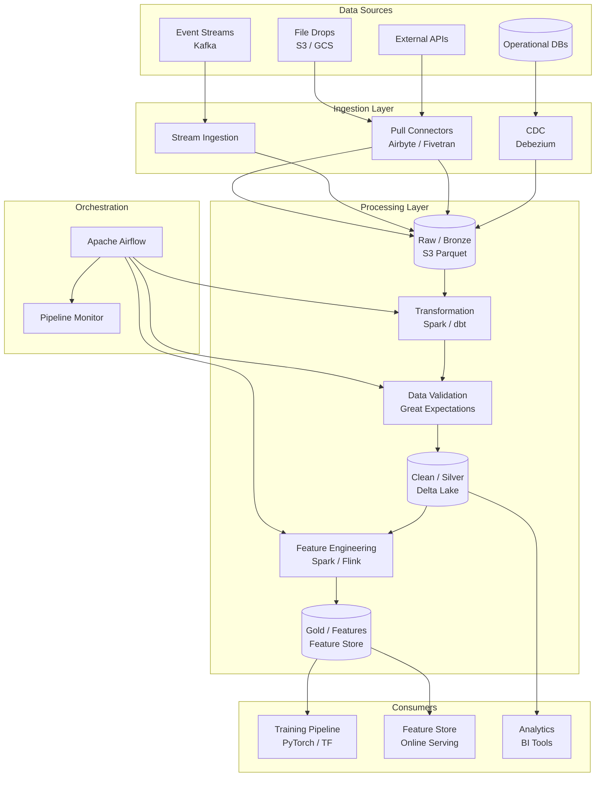
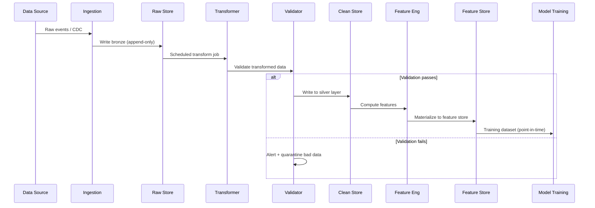
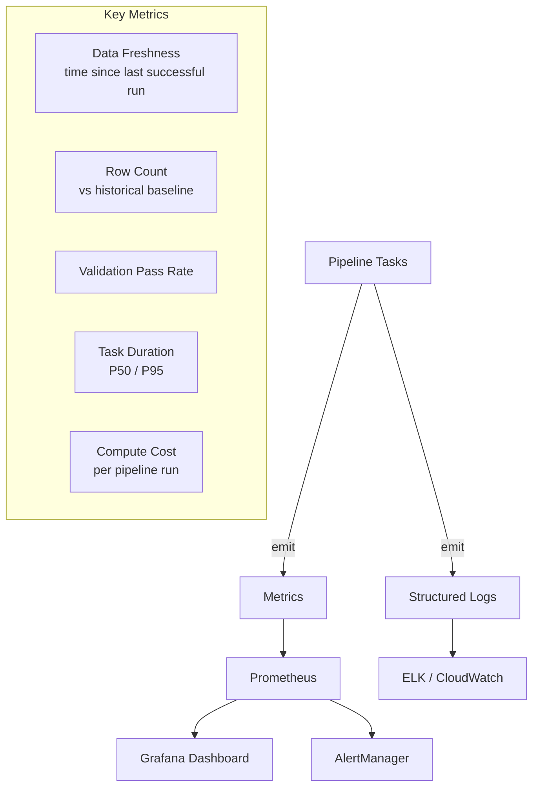

# Data Pipelines for ML
{: .fs-9 }

Design end-to-end data pipelines that ingest, transform, validate, and deliver high-quality data for machine learning training and serving.
{: .fs-6 .fw-300 }

---

## Step 1: Requirements Clarification

### Why ML Pipelines Are Different from Traditional ETL

| Dimension | Traditional ETL | ML Data Pipeline |
|-----------|----------------|-----------------|
| **Output** | Tables / reports | Training datasets, feature stores, model artifacts |
| **Correctness** | Schema + business rules | Schema + distribution checks + label leakage prevention |
| **Iteration speed** | Quarterly changes | Daily experiments, hourly retraining |
| **Lineage** | Regulatory compliance | Reproducibility — exact data + code → same model |
| **Freshness** | T+1 acceptable | Real-time features need sub-minute |

### Functional Requirements

| Requirement | Description |
|-------------|-------------|
| **Data ingestion** | Pull from databases, APIs, event streams, file drops |
| **Transformation** | Cleaning, feature engineering, normalization |
| **Validation** | Schema checks, distribution drift, anomaly detection |
| **Dataset generation** | Point-in-time correct training sets with versioning |
| **Orchestration** | DAG-based scheduling with retries, dependencies, alerts |
| **Experiment tracking** | Link datasets to experiments, models, and metrics |

### Non-Functional Requirements

| Requirement | Target |
|-------------|--------|
| **Throughput** | Process 10 TB/day of raw events |
| **Freshness** | Batch: < 1 hour; streaming: < 1 minute |
| **Reliability** | Exactly-once processing; automatic retries |
| **Reproducibility** | Any training run can be exactly reproduced |
| **Cost** | Optimize for spot instances; scale to zero when idle |

---

## Step 2: Back-of-Envelope Estimation

```
Raw event volume:         500M events/day
Avg event size:           1 KB
Daily raw data:           500 GB
After transformation:     ~200 GB (cleaned, deduplicated)

Training datasets:
  Generated per day:      10 datasets
  Avg dataset size:       50 GB (1B rows × 50 bytes/row)
  Total training storage: 500 GB/day → 15 TB/month (with retention)

Compute:
  Spark cluster:          20 workers × 8 cores = 160 cores
  Processing time:        500 GB / (160 cores × 50 MB/s) ≈ 1 hour
  GPU for feature embeddings: 4 × A10G for 2 hours

Orchestration:
  DAG runs per day:       200 (batch) + 50 (streaming)
  Avg task duration:      15 minutes
  Failure rate:           < 2%
  Retry budget:           3 attempts per task
```

---

## Step 3: High-Level Architecture





---

## Step 4: Data Ingestion

### Ingestion Patterns

| Pattern | Use Case | Tool | Guarantee |
|---------|----------|------|-----------|
| **CDC (Change Data Capture)** | Operational DB changes | Debezium | Exactly-once (with Kafka) |
| **Batch pull** | Periodic full/incremental export | Airbyte, Spark | At-least-once |
| **Stream ingestion** | Real-time events | Kafka Connect | At-least-once / exactly-once |
| **File drops** | Partner data, CSV uploads | S3 event → Lambda | At-least-once |

```python
from dataclasses import dataclass, field
from datetime import datetime
from enum import Enum
from typing import Any
import logging
import hashlib

logger = logging.getLogger(__name__)


class IngestionMode(Enum):
    FULL = "full"
    INCREMENTAL = "incremental"
    CDC = "cdc"
    STREAMING = "streaming"


@dataclass
class IngestionConfig:
    source_name: str
    source_type: str  # "postgres", "mysql", "kafka", "s3", "api"
    mode: IngestionMode
    destination: str  # S3 path or topic
    schedule: str = "0 * * * *"  # cron expression
    watermark_column: str = "updated_at"
    dedup_keys: list[str] = field(default_factory=list)


class DataIngestor:
    """Orchestrates data ingestion with deduplication and checkpointing."""

    def __init__(self, checkpoint_store, destination_writer):
        self.checkpoints = checkpoint_store
        self.writer = destination_writer

    async def ingest(self, config: IngestionConfig, source_reader) -> dict[str, Any]:
        start_time = datetime.utcnow()
        last_checkpoint = await self.checkpoints.get(config.source_name)

        if config.mode == IngestionMode.INCREMENTAL:
            raw_data = await source_reader.read_incremental(
                since=last_checkpoint
            )
        elif config.mode == IngestionMode.FULL:
            raw_data = await source_reader.read_full()
        else:
            raise ValueError(f"Unsupported mode for batch ingest: {config.mode}")

        if config.dedup_keys:
            raw_data = self._deduplicate(raw_data, config.dedup_keys)

        partition = start_time.strftime("%Y/%m/%d/%H")
        dest_path = f"{config.destination}/{partition}/"

        records_written = await self.writer.write(
            raw_data, dest_path, format="parquet"
        )

        new_watermark = self._extract_watermark(raw_data, config.watermark_column)
        await self.checkpoints.save(config.source_name, new_watermark)

        stats = {
            "source": config.source_name,
            "records": records_written,
            "partition": partition,
            "watermark": str(new_watermark),
            "duration_seconds": (datetime.utcnow() - start_time).total_seconds(),
        }
        logger.info("Ingestion complete: %s", stats)
        return stats

    @staticmethod
    def _deduplicate(data: list[dict], keys: list[str]) -> list[dict]:
        seen = set()
        deduplicated = []
        for record in data:
            key = tuple(record.get(k) for k in keys)
            key_hash = hashlib.md5(str(key).encode()).hexdigest()
            if key_hash not in seen:
                seen.add(key_hash)
                deduplicated.append(record)
        return deduplicated

    @staticmethod
    def _extract_watermark(data: list[dict], column: str) -> Any:
        if not data:
            return None
        return max(record.get(column) for record in data if record.get(column))
```

---

## Step 5: Data Transformation

The transformation layer converts raw data into clean, feature-ready datasets following the **medallion architecture** (Bronze → Silver → Gold).

```python
from dataclasses import dataclass
from typing import Any, Callable
import logging

logger = logging.getLogger(__name__)


@dataclass
class TransformStep:
    name: str
    transform_fn: Callable
    description: str = ""
    critical: bool = True  # pipeline halts if critical step fails


class SparkTransformPipeline:
    """Applies a sequence of transformations to a Spark DataFrame."""

    def __init__(self, spark_session):
        self.spark = spark_session
        self.steps: list[TransformStep] = []

    def add_step(self, step: TransformStep) -> "SparkTransformPipeline":
        self.steps.append(step)
        return self

    def execute(self, input_path: str, output_path: str) -> dict[str, Any]:
        df = self.spark.read.parquet(input_path)
        input_count = df.count()
        stats = {"input_rows": input_count, "steps": []}

        for step in self.steps:
            try:
                before = df.count()
                df = step.transform_fn(df)
                after = df.count()

                step_stats = {
                    "name": step.name,
                    "rows_before": before,
                    "rows_after": after,
                    "rows_dropped": before - after,
                    "status": "success",
                }
                stats["steps"].append(step_stats)
                logger.info("Step '%s': %d → %d rows", step.name, before, after)

            except Exception as e:
                stats["steps"].append({"name": step.name, "status": "failed", "error": str(e)})
                if step.critical:
                    raise RuntimeError(f"Critical step '{step.name}' failed: {e}") from e
                logger.warning("Non-critical step '%s' failed: %s", step.name, e)

        df.write.mode("overwrite").parquet(output_path)
        stats["output_rows"] = df.count()
        return stats


def bronze_to_silver_transforms(spark):
    """Standard cleaning transformations."""
    from pyspark.sql import functions as F

    pipeline = SparkTransformPipeline(spark)

    pipeline.add_step(TransformStep(
        name="drop_duplicates",
        transform_fn=lambda df: df.dropDuplicates(["event_id"]),
        description="Remove exact duplicate events",
    ))

    pipeline.add_step(TransformStep(
        name="filter_nulls",
        transform_fn=lambda df: df.filter(
            F.col("user_id").isNotNull() & F.col("event_timestamp").isNotNull()
        ),
        description="Remove records missing required fields",
    ))

    pipeline.add_step(TransformStep(
        name="normalize_timestamps",
        transform_fn=lambda df: df.withColumn(
            "event_timestamp",
            F.to_utc_timestamp(F.col("event_timestamp"), "UTC"),
        ),
        description="Normalize all timestamps to UTC",
    ))

    pipeline.add_step(TransformStep(
        name="filter_future_events",
        transform_fn=lambda df: df.filter(
            F.col("event_timestamp") <= F.current_timestamp()
        ),
        description="Remove events with future timestamps",
    ))

    pipeline.add_step(TransformStep(
        name="add_partition_columns",
        transform_fn=lambda df: df.withColumn(
            "ds", F.date_format(F.col("event_timestamp"), "yyyy-MM-dd")
        ).withColumn(
            "hour", F.hour(F.col("event_timestamp"))
        ),
        description="Add date partition columns",
    ))

    return pipeline
```

---

## Step 6: Data Validation

Data validation prevents bad data from poisoning models. A robust validation layer catches schema violations, distribution drift, and anomalies before they reach training.

```python
import numpy as np
from dataclasses import dataclass, field
from enum import Enum
from typing import Any
from scipy import stats
import logging

logger = logging.getLogger(__name__)


class ValidationSeverity(Enum):
    WARNING = "warning"   # log and continue
    ERROR = "error"       # halt pipeline
    INFO = "info"         # informational only


class CheckType(Enum):
    SCHEMA = "schema"
    COMPLETENESS = "completeness"
    DISTRIBUTION = "distribution"
    VOLUME = "volume"
    CUSTOM = "custom"


@dataclass
class ValidationResult:
    check_name: str
    check_type: CheckType
    passed: bool
    severity: ValidationSeverity
    details: dict[str, Any] = field(default_factory=dict)


@dataclass
class DataProfile:
    """Statistical profile of a dataset column."""
    column: str
    dtype: str
    count: int
    null_count: int
    null_pct: float
    unique_count: int
    mean: float | None = None
    std: float | None = None
    min_val: float | None = None
    max_val: float | None = None
    p25: float | None = None
    p50: float | None = None
    p75: float | None = None


class DataValidator:
    """Validates ML datasets for quality, completeness, and distribution stability."""

    def __init__(self):
        self.checks: list[tuple[str, Any]] = []

    def add_schema_check(
        self,
        expected_columns: list[str],
        expected_types: dict[str, str] | None = None,
    ) -> "DataValidator":
        self.checks.append(("schema", {
            "columns": expected_columns,
            "types": expected_types,
        }))
        return self

    def add_completeness_check(
        self,
        column: str,
        max_null_pct: float = 0.01,
        severity: ValidationSeverity = ValidationSeverity.ERROR,
    ) -> "DataValidator":
        self.checks.append(("completeness", {
            "column": column,
            "max_null_pct": max_null_pct,
            "severity": severity,
        }))
        return self

    def add_volume_check(
        self,
        min_rows: int,
        max_rows: int | None = None,
    ) -> "DataValidator":
        self.checks.append(("volume", {
            "min_rows": min_rows,
            "max_rows": max_rows,
        }))
        return self

    def add_distribution_check(
        self,
        column: str,
        reference_stats: DataProfile,
        max_psi: float = 0.2,
    ) -> "DataValidator":
        self.checks.append(("distribution", {
            "column": column,
            "reference": reference_stats,
            "max_psi": max_psi,
        }))
        return self

    def validate(self, df_stats: dict[str, Any]) -> list[ValidationResult]:
        """Run all registered checks against dataset statistics."""
        results = []

        for check_type, config in self.checks:
            if check_type == "schema":
                results.append(self._check_schema(df_stats, config))
            elif check_type == "completeness":
                results.append(self._check_completeness(df_stats, config))
            elif check_type == "volume":
                results.append(self._check_volume(df_stats, config))
            elif check_type == "distribution":
                results.append(self._check_distribution(df_stats, config))

        failed = [r for r in results if not r.passed and r.severity == ValidationSeverity.ERROR]
        if failed:
            logger.error(
                "Validation FAILED: %d critical checks failed: %s",
                len(failed),
                [f.check_name for f in failed],
            )
        else:
            logger.info("Validation PASSED: all %d checks OK", len(results))

        return results

    def _check_schema(self, df_stats, config) -> ValidationResult:
        actual_columns = set(df_stats.get("columns", []))
        expected = set(config["columns"])
        missing = expected - actual_columns
        extra = actual_columns - expected

        return ValidationResult(
            check_name="schema_check",
            check_type=CheckType.SCHEMA,
            passed=len(missing) == 0,
            severity=ValidationSeverity.ERROR,
            details={"missing": list(missing), "extra": list(extra)},
        )

    def _check_completeness(self, df_stats, config) -> ValidationResult:
        col = config["column"]
        col_stats = df_stats.get("column_stats", {}).get(col, {})
        null_pct = col_stats.get("null_pct", 1.0)

        return ValidationResult(
            check_name=f"completeness_{col}",
            check_type=CheckType.COMPLETENESS,
            passed=null_pct <= config["max_null_pct"],
            severity=config["severity"],
            details={"null_pct": null_pct, "threshold": config["max_null_pct"]},
        )

    def _check_volume(self, df_stats, config) -> ValidationResult:
        row_count = df_stats.get("row_count", 0)
        min_ok = row_count >= config["min_rows"]
        max_ok = config["max_rows"] is None or row_count <= config["max_rows"]

        return ValidationResult(
            check_name="volume_check",
            check_type=CheckType.VOLUME,
            passed=min_ok and max_ok,
            severity=ValidationSeverity.ERROR,
            details={
                "row_count": row_count,
                "min": config["min_rows"],
                "max": config["max_rows"],
            },
        )

    def _check_distribution(self, df_stats, config) -> ValidationResult:
        col = config["column"]
        ref = config["reference"]
        current_stats = df_stats.get("column_stats", {}).get(col, {})

        if ref.mean is not None and current_stats.get("mean") is not None:
            mean_shift = abs(current_stats["mean"] - ref.mean) / max(abs(ref.mean), 1e-9)
            psi = current_stats.get("psi", mean_shift)
        else:
            psi = 0.0

        return ValidationResult(
            check_name=f"distribution_{col}",
            check_type=CheckType.DISTRIBUTION,
            passed=psi < config["max_psi"],
            severity=ValidationSeverity.WARNING,
            details={"psi": psi, "threshold": config["max_psi"]},
        )
```

---

## Step 7: Workflow Orchestration with Airflow

Apache Airflow is the de facto standard for orchestrating ML data pipelines. Each pipeline is a DAG (Directed Acyclic Graph) of tasks with dependencies, retries, and monitoring.

```python
from datetime import datetime, timedelta

from airflow import DAG
from airflow.operators.python import PythonOperator
from airflow.providers.apache.spark.operators.spark_submit import SparkSubmitOperator
from airflow.operators.dummy import DummyOperator
from airflow.utils.trigger_rule import TriggerRule


default_args = {
    "owner": "ml-platform",
    "depends_on_past": False,
    "email_on_failure": True,
    "email": ["ml-alerts@company.com"],
    "retries": 3,
    "retry_delay": timedelta(minutes=5),
    "retry_exponential_backoff": True,
    "max_retry_delay": timedelta(minutes=30),
    "execution_timeout": timedelta(hours=2),
}


with DAG(
    dag_id="ml_feature_pipeline",
    default_args=default_args,
    description="Daily ML feature computation pipeline",
    schedule_interval="0 2 * * *",  # 2 AM daily
    start_date=datetime(2024, 1, 1),
    catchup=False,
    max_active_runs=1,
    tags=["ml", "features", "production"],
) as dag:

    start = DummyOperator(task_id="start")

    ingest_events = SparkSubmitOperator(
        task_id="ingest_raw_events",
        application="s3://ml-jobs/ingestion/ingest_events.py",
        conf={
            "spark.executor.memory": "8g",
            "spark.executor.cores": "4",
            "spark.dynamicAllocation.enabled": "true",
        },
        application_args=[
            "--source", "kafka://events-cluster/user_events",
            "--dest", "s3://data-lake/bronze/user_events/",
            "--date", "{{ ds }}",
        ],
    )

    ingest_transactions = SparkSubmitOperator(
        task_id="ingest_transactions",
        application="s3://ml-jobs/ingestion/ingest_transactions.py",
        conf={"spark.executor.memory": "4g"},
        application_args=[
            "--source", "jdbc:postgresql://prod-db/transactions",
            "--dest", "s3://data-lake/bronze/transactions/",
            "--date", "{{ ds }}",
        ],
    )

    validate_raw = PythonOperator(
        task_id="validate_raw_data",
        python_callable=lambda **ctx: _validate_bronze(ctx["ds"]),
    )

    transform_silver = SparkSubmitOperator(
        task_id="transform_to_silver",
        application="s3://ml-jobs/transform/bronze_to_silver.py",
        conf={
            "spark.executor.memory": "16g",
            "spark.sql.shuffle.partitions": "200",
        },
        application_args=[
            "--input", "s3://data-lake/bronze/",
            "--output", "s3://data-lake/silver/",
            "--date", "{{ ds }}",
        ],
    )

    compute_features = SparkSubmitOperator(
        task_id="compute_features",
        application="s3://ml-jobs/features/compute_features.py",
        conf={
            "spark.executor.memory": "16g",
            "spark.executor.instances": "20",
        },
        application_args=[
            "--input", "s3://data-lake/silver/",
            "--output", "s3://data-lake/gold/features/",
            "--feature-views", "user_purchase,user_session,item_popularity",
            "--date", "{{ ds }}",
        ],
    )

    validate_features = PythonOperator(
        task_id="validate_features",
        python_callable=lambda **ctx: _validate_gold(ctx["ds"]),
    )

    materialize_online = PythonOperator(
        task_id="materialize_to_online_store",
        python_callable=lambda **ctx: _materialize_feast(ctx["ds"]),
    )

    generate_training_set = SparkSubmitOperator(
        task_id="generate_training_dataset",
        application="s3://ml-jobs/training/generate_dataset.py",
        application_args=[
            "--features", "s3://data-lake/gold/features/",
            "--labels", "s3://data-lake/gold/labels/",
            "--output", "s3://ml-datasets/training/{{ ds }}/",
        ],
    )

    notify_complete = PythonOperator(
        task_id="notify_completion",
        python_callable=lambda **ctx: _send_notification(ctx["ds"], "success"),
        trigger_rule=TriggerRule.ALL_SUCCESS,
    )

    notify_failure = PythonOperator(
        task_id="notify_failure",
        python_callable=lambda **ctx: _send_notification(ctx["ds"], "failure"),
        trigger_rule=TriggerRule.ONE_FAILED,
    )

    # DAG dependencies
    start >> [ingest_events, ingest_transactions]
    [ingest_events, ingest_transactions] >> validate_raw
    validate_raw >> transform_silver >> compute_features >> validate_features
    validate_features >> [materialize_online, generate_training_set]
    [materialize_online, generate_training_set] >> notify_complete
    [materialize_online, generate_training_set] >> notify_failure


def _validate_bronze(ds: str):
    """Validate raw data volume and schema."""
    pass  # Implementation uses DataValidator from Step 6


def _validate_gold(ds: str):
    """Validate feature completeness and distribution."""
    pass


def _materialize_feast(ds: str):
    """Push features to online store via Feast."""
    pass


def _send_notification(ds: str, status: str):
    """Send Slack/email notification."""
    pass
```

### Kubeflow Pipelines (Alternative)

For teams running on Kubernetes, Kubeflow Pipelines offers containerized, GPU-aware pipeline steps:

```python
from kfp import dsl
from kfp.dsl import Input, Output, Dataset, Model, Metrics


@dsl.component(
    base_image="python:3.11-slim",
    packages_to_install=["pandas", "pyarrow", "great-expectations"],
)
def validate_data(
    input_data: Input[Dataset],
    validation_report: Output[Dataset],
    min_rows: int = 1000,
    max_null_pct: float = 0.05,
) -> bool:
    import pandas as pd

    df = pd.read_parquet(input_data.path)

    checks = {
        "row_count": len(df) >= min_rows,
        "null_check": all(
            df[col].isnull().mean() <= max_null_pct
            for col in df.columns
        ),
    }

    report = pd.DataFrame([
        {"check": k, "passed": v} for k, v in checks.items()
    ])
    report.to_parquet(validation_report.path)

    return all(checks.values())


@dsl.component(
    base_image="python:3.11-slim",
    packages_to_install=["pandas", "scikit-learn", "pyarrow"],
)
def compute_features(
    clean_data: Input[Dataset],
    feature_output: Output[Dataset],
):
    import pandas as pd
    from sklearn.preprocessing import StandardScaler

    df = pd.read_parquet(clean_data.path)

    df["purchase_count_7d"] = df.groupby("user_id")["purchase_id"].transform(
        lambda x: x.rolling("7D").count()
    )
    df["avg_order_value_30d"] = df.groupby("user_id")["order_value"].transform(
        lambda x: x.rolling("30D").mean()
    )

    scaler = StandardScaler()
    numeric_cols = df.select_dtypes(include=["float64", "int64"]).columns
    df[numeric_cols] = scaler.fit_transform(df[numeric_cols])

    df.to_parquet(feature_output.path)


@dsl.pipeline(name="ml-feature-pipeline", description="Daily feature computation")
def ml_feature_pipeline(
    raw_data_path: str,
    min_rows: int = 1000,
):
    validate_task = validate_data(
        input_data=dsl.Input(Dataset, uri=raw_data_path),
        min_rows=min_rows,
    )

    with dsl.Condition(validate_task.output == True):
        compute_features(clean_data=validate_task.outputs["validation_report"])
```

---

## Step 8: Data Versioning & Lineage

### Why Version Data?

- **Reproducibility**: Re-run a training job with the exact same data
- **Debugging**: When model quality drops, trace back to data changes
- **Compliance**: Prove what data a model was trained on (audit trail)

```python
import hashlib
import json
from dataclasses import dataclass, field
from datetime import datetime
from typing import Any


@dataclass
class DatasetVersion:
    dataset_id: str
    version: str
    path: str
    row_count: int
    schema: dict[str, str]
    statistics: dict[str, Any]
    content_hash: str
    created_at: datetime = field(default_factory=datetime.utcnow)
    source_dag: str = ""
    source_run_id: str = ""
    parent_versions: list[str] = field(default_factory=list)


@dataclass
class LineageEdge:
    source: str       # "table:bronze.events" or "dataset:v1.2"
    destination: str   # "dataset:v1.3" or "model:rec_v5"
    transform: str     # "spark_job:compute_features"
    timestamp: datetime = field(default_factory=datetime.utcnow)


class DataVersionManager:
    """Tracks dataset versions with content hashing and lineage."""

    def __init__(self, metadata_store):
        self.store = metadata_store

    async def register_version(
        self,
        dataset_id: str,
        path: str,
        row_count: int,
        schema: dict[str, str],
        statistics: dict[str, Any],
        source_dag: str = "",
        source_run_id: str = "",
        parent_versions: list[str] | None = None,
    ) -> DatasetVersion:
        content_hash = self._compute_hash(path, schema, statistics)

        existing = await self.store.find_by_hash(dataset_id, content_hash)
        if existing:
            return existing

        current_latest = await self.store.get_latest(dataset_id)
        new_version_num = 1 if current_latest is None else int(current_latest.version.split(".")[-1]) + 1

        version = DatasetVersion(
            dataset_id=dataset_id,
            version=f"v{new_version_num}",
            path=path,
            row_count=row_count,
            schema=schema,
            statistics=statistics,
            content_hash=content_hash,
            source_dag=source_dag,
            source_run_id=source_run_id,
            parent_versions=parent_versions or [],
        )

        await self.store.save(version)
        return version

    @staticmethod
    def _compute_hash(path: str, schema: dict, statistics: dict) -> str:
        payload = json.dumps(
            {"path": path, "schema": schema, "stats_summary": {
                k: v for k, v in statistics.items() if k in ("row_count", "column_count")
            }},
            sort_keys=True,
        )
        return hashlib.sha256(payload.encode()).hexdigest()

    async def get_lineage(self, dataset_id: str, version: str) -> list[LineageEdge]:
        return await self.store.get_lineage(dataset_id, version)

    async def trace_model_to_data(self, model_id: str) -> list[DatasetVersion]:
        """Given a model, find all datasets in its training lineage."""
        return await self.store.trace_upstream(model_id)
```

---

## Step 9: Pipeline Monitoring & Alerting



```python
import time
from dataclasses import dataclass, field
from typing import Any
import logging

logger = logging.getLogger(__name__)


@dataclass
class PipelineMetrics:
    dag_id: str
    run_id: str
    task_id: str
    start_time: float = field(default_factory=time.time)
    end_time: float = 0.0
    rows_processed: int = 0
    rows_dropped: int = 0
    validation_errors: int = 0
    status: str = "running"

    @property
    def duration_seconds(self) -> float:
        end = self.end_time if self.end_time > 0 else time.time()
        return end - self.start_time

    @property
    def drop_rate(self) -> float:
        total = self.rows_processed + self.rows_dropped
        return self.rows_dropped / max(total, 1)


class PipelineMonitor:
    """Monitors pipeline health and emits alerts."""

    def __init__(self, metrics_backend, alert_client):
        self.metrics = metrics_backend
        self.alerts = alert_client
        self._sla_thresholds = {
            "max_duration_seconds": 7200,
            "max_drop_rate": 0.05,
            "min_rows": 1000,
            "max_validation_errors": 0,
        }

    async def check_and_alert(self, pipeline_metrics: PipelineMetrics):
        violations = []

        if pipeline_metrics.duration_seconds > self._sla_thresholds["max_duration_seconds"]:
            violations.append(
                f"Duration {pipeline_metrics.duration_seconds:.0f}s exceeds "
                f"SLA {self._sla_thresholds['max_duration_seconds']}s"
            )

        if pipeline_metrics.drop_rate > self._sla_thresholds["max_drop_rate"]:
            violations.append(
                f"Drop rate {pipeline_metrics.drop_rate:.2%} exceeds "
                f"threshold {self._sla_thresholds['max_drop_rate']:.2%}"
            )

        if pipeline_metrics.rows_processed < self._sla_thresholds["min_rows"]:
            violations.append(
                f"Row count {pipeline_metrics.rows_processed} below "
                f"minimum {self._sla_thresholds['min_rows']}"
            )

        if violations:
            await self.alerts.send(
                severity="critical" if len(violations) > 1 else "warning",
                title=f"Pipeline SLA violation: {pipeline_metrics.dag_id}",
                details=violations,
                run_id=pipeline_metrics.run_id,
            )

        await self.metrics.emit({
            "dag_id": pipeline_metrics.dag_id,
            "task_id": pipeline_metrics.task_id,
            "duration_seconds": pipeline_metrics.duration_seconds,
            "rows_processed": pipeline_metrics.rows_processed,
            "drop_rate": pipeline_metrics.drop_rate,
            "status": pipeline_metrics.status,
        })
```

---

## Step 10: Orchestration Comparison

| Feature | Apache Airflow | Kubeflow Pipelines | Prefect | Dagster |
|---------|---------------|-------------------|---------|---------|
| **Deployment** | Anywhere | Kubernetes only | Anywhere | Anywhere |
| **GPU support** | Via K8s operator | Native | Via infra blocks | Via resources |
| **UI** | Mature, full-featured | Basic | Modern, polished | Modern, asset-aware |
| **Lineage** | Plugin-based | Metadata store | Built-in | First-class assets |
| **Testing** | Manual | Component-based | Native | Native (op tests) |
| **Best for** | General orchestration | K8s-native ML | Python-first teams | Data-asset-centric |

---

## Step 11: Interview Checklist

### What Interviewers Look For

| Area | Key Questions |
|------|--------------|
| **Ingestion** | How to handle schema evolution? Late-arriving data? |
| **Transformation** | Medallion architecture? Idempotent transforms? |
| **Validation** | What checks catch bad training data? |
| **Orchestration** | How to handle retries, backfills, dependencies? |
| **Versioning** | Can you reproduce a training run from 6 months ago? |
| **Monitoring** | How do you know the pipeline is healthy? |
| **Scale** | How to process 10 TB/day? Cost optimization? |

### Common Pitfalls

{: .warning }
> 1. **No data validation** — garbage in, garbage out; models trained on corrupt data fail silently
> 2. **Not idempotent** — re-running a pipeline should produce the same result, not duplicate data
> 3. **Ignoring late data** — events arriving after the processing window need a strategy
> 4. **No backfill support** — what happens when you fix a bug? You need to re-process historical data
> 5. **Tight coupling** — transformation code embedded in orchestrator makes testing impossible

### Sample Interview Dialogue

> **Interviewer:** Design a data pipeline for a recommendation system training on 500M daily events.
>
> **Candidate:** I'd use a three-layer architecture: Bronze (raw events from Kafka via Debezium) → Silver (cleaned, deduplicated, UTC-normalized) → Gold (feature tables materialized to both offline Parquet and online Redis).
>
> Orchestration via Airflow: the daily DAG runs at 2 AM, processes yesterday's events, validates with Great Expectations (schema + volume + distribution checks), and materializes features through Feast. Compute is Spark on EMR with dynamic allocation — scales from 5 to 50 executors based on partition size.
>
> For reproducibility, every training dataset is versioned with a content hash. The dataset registry stores the Airflow run ID, Spark job config, and input data versions. If we need to debug a model, we trace from model → dataset version → pipeline run → raw data partition.
>
> Monitoring: I'd track five metrics — data freshness, volume vs. 7-day rolling baseline, validation pass rate, task duration P95, and compute cost per run. Alert if freshness exceeds 2 hours or volume deviates more than 20% from baseline.
