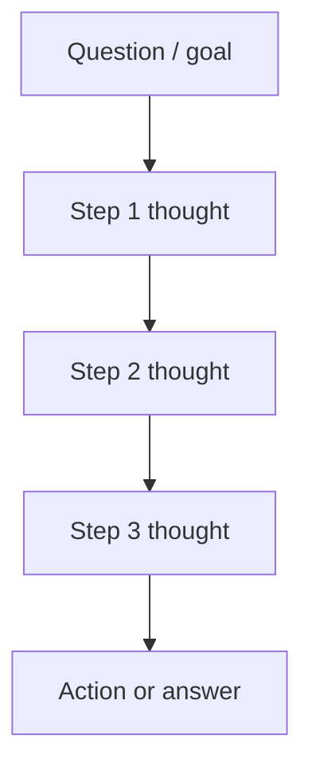
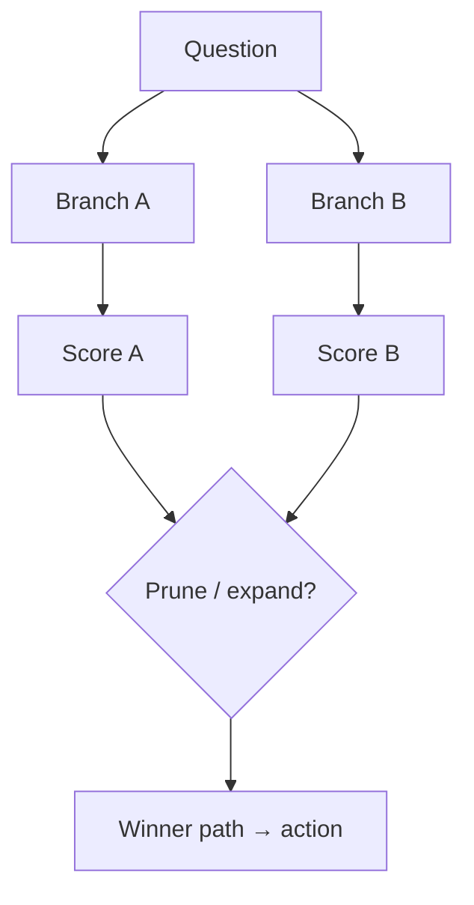
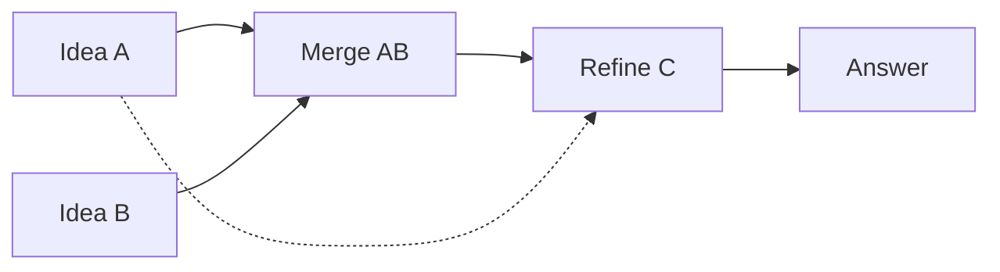
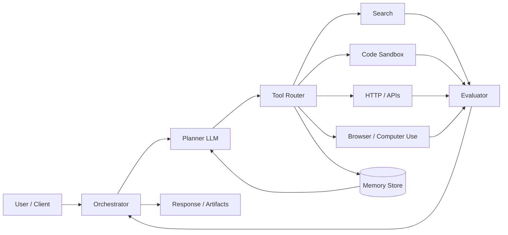
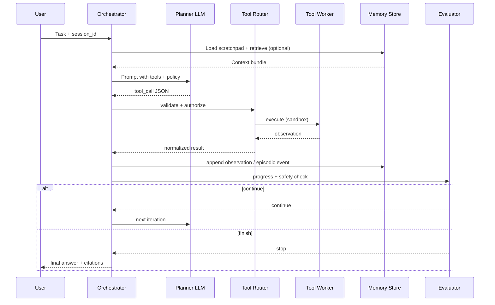
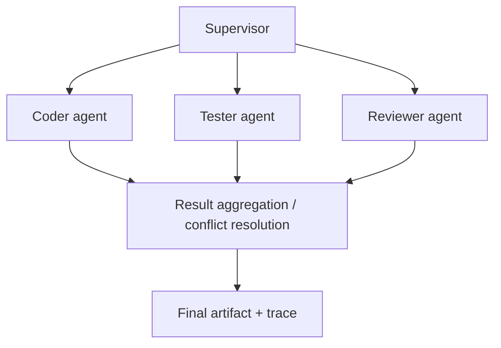
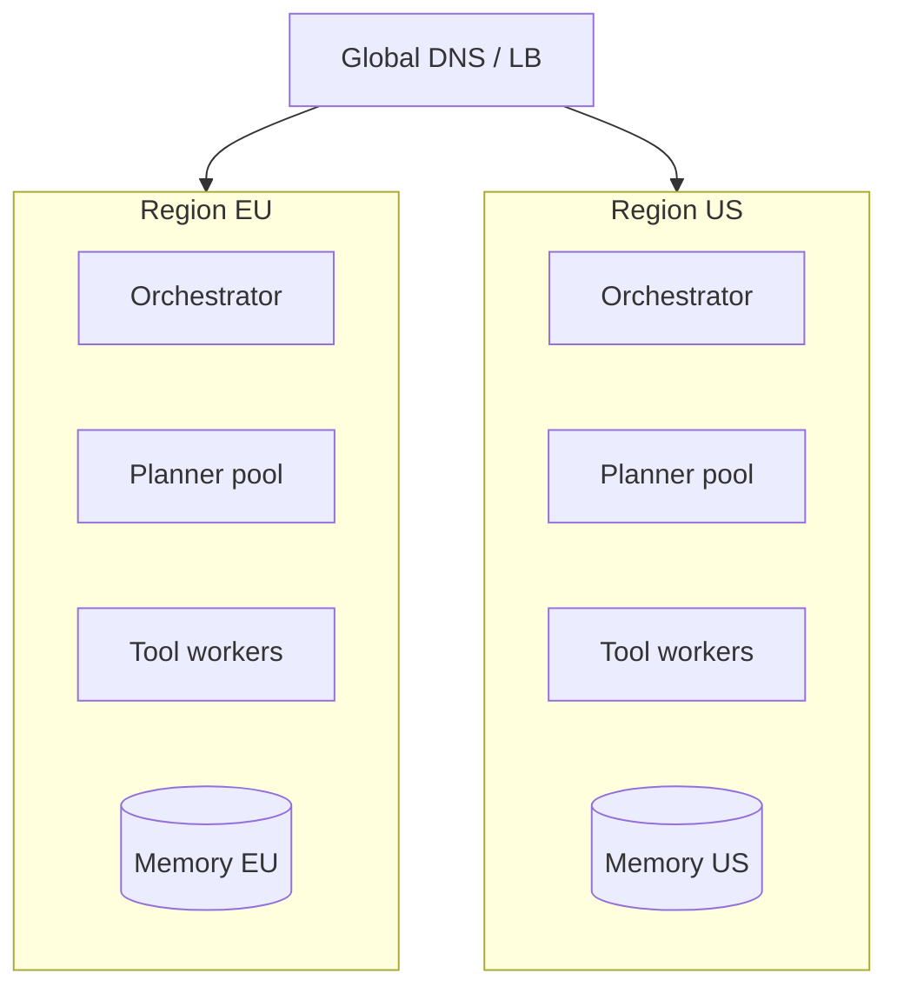
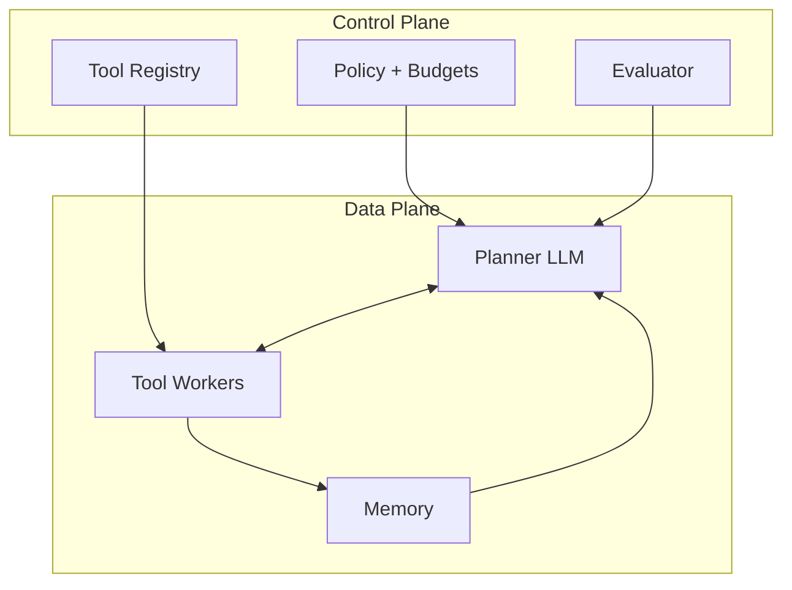

# Design an AI Agent System
{: .no_toc }

<details open markdown="block">
  <summary>Table of Contents</summary>
  {: .text-delta }
1. TOC
{:toc}
</details>

---

## What We're Building

We are designing an **autonomous AI agent system** that can **plan**, **invoke tools**, **maintain memory**, and **execute multi-step tasks** toward a user goal — not just emit the next token in a chat thread. Think **Google’s agentic assistants**, **Anthropic’s computer use**, **OpenAI’s deep research**, or internal “copilots” that browse, code, and call APIs until the task is done.

**This is not a single LLM endpoint.** It is a **control loop** (observe → think → act), a **tool surface** with strict contracts, **durable memory**, and **governance** (sandboxing, budgets, human checkpoints).

### Representative Scale (Hypothetical Production Service)

| Dimension | Order-of-magnitude |
|-----------|-------------------|
| **Concurrent agent runs** | 10K–100K (burst) |
| **Avg tool calls per completed task** | 8–40 (domain-dependent) |
| **LLM reasoning steps per task** | 8–15 “macro” steps (each may hide micro-turns) |
| **Working memory (scratchpad)** | 4K–32K tokens per run (compressed over time) |
| **Long-term memory vectors** | 10M–1B+ embeddings (namespace/partitioned) |
| **Sandboxed code executions / day** | 1M–50M (CPU-bound; heavily quotaed) |
| **Regions** | Multi-region; data residency per tenant |

{: .note }
> Interview tip: give **ranges** and say what drives the upper bound (web research vs. local file Q&A). Numbers are illustrative; **reasoning** matters more than precision.

### Agents vs. Chatbots — Why the Design Changes

| Aspect | **Chatbot (single-turn / multi-turn chat)** | **Agent system** |
|--------|---------------------------------------------|------------------|
| **Objective** | Helpful response per message | **Task completion** with measurable outcome |
| **Control flow** | Mostly user-driven turns | **Model-driven loop** + planner |
| **External world** | Optional tools | **Tools are first-class** (search, code, APIs, browser) |
| **State** | Conversation buffer | **Scratchpad + episodic + semantic memory** |
| **Failure mode** | Wrong answer | Wrong answer **plus** runaway loops, tool abuse, cost spikes |
| **Evaluation** | Helpfulness, safety | **Task success**, tool correctness, **latency to outcome**, cost |
| **Ops** | Model serving | Serving **plus** sandboxes, **secrets**, **queues**, **human review** |

---

## Key Concepts Primer

### ReAct (Reason + Act)

**ReAct** interleaves natural-language **reasoning** (“thought”) with **actions** (tool calls) and **observations** (tool results). It reduces blind tool spamming by forcing explicit intermediate steps.

```
Thought: I need current revenue; search SEC filings.
Action: search(query="ACME 10-K revenue 2023 site:sec.gov")
Observation: [snippet with FY2023 revenue $X]

Thought: Summarize and cite.
Action: finish(answer="FY2023 revenue was $X (10-K)...")
```

### Tool Calling / Function Calling

The model emits **structured** tool invocations (often JSON) against a **schema** (name, description, parameters). The runtime **validates**, **authorizes**, **executes**, and returns **observations**. This is the **contract** between “brain” and “hands.”

#### Structured output and constrained decoding

**Problem:** Free-form text is easy for models to “almost” satisfy — a missing comma breaks JSON, wrong keys slip through, and repair loops waste tokens.

**Approaches (often combined):**

| Mechanism | What it does | Trade-off |
|-----------|----------------|-----------|
| **JSON Schema validation** (post-hoc) | Reject/repair outputs that don’t match schema | Simple; may need retries |
| **Native tool / function calling** | API asks model to emit **tool_calls** in a fixed wire format | Best ergonomics when supported |
| **Grammar / FSM constrained decoding** | Logits mask so only valid tokens (JSON, regex, grammar) appear | Strongest guarantee; needs inference support |
| **Dedicated “formatter” model** | Small model turns draft → valid JSON | Extra latency; good fallback |

**Python sketch — schema enforcement before execution** (interview: “validate at the boundary”):

```python
from __future__ import annotations

import json
from typing import Any

from jsonschema import Draft202012Validator

TOOL_SCHEMA: dict[str, Any] = {
    "type": "object",
    "properties": {
        "name": {"type": "string", "enum": ["search", "calculator", "finish"]},
        "arguments": {"type": "object"},
    },
    "required": ["name", "arguments"],
    "additionalProperties": False,
}

_validator = Draft202012Validator(TOOL_SCHEMA)


def parse_tool_call(raw: str) -> dict[str, Any]:
    """Reject ambiguous or invalid tool JSON before any side effect."""
    try:
        payload = json.loads(raw)
    except json.JSONDecodeError as e:
        raise ValueError(f"invalid_json: {e}") from e
    errors = sorted(_validator.iter_errors(payload), key=lambda e: e.path)
    if errors:
        raise errors[0]
    return payload
```

**Grammar-constrained generation** (conceptual): at decode time, the runtime tracks a **finite automaton** or **context-free grammar** so the next token set is restricted — e.g. only tokens that continue valid JSON. Libraries such as **Outlines**, **lm-format-enforcer**, or server-side **guided decoding** in some providers implement this; you still **validate** against JSON Schema at the tool boundary for defense in depth.

#### Function-calling protocol: OpenAI-style vs Anthropic-style

Both converge on **name + arguments + id**, but wire formats differ — your **router** should normalize to one internal representation.

| Aspect | **OpenAI Chat Completions (tools)** | **Anthropic Messages (tool_use)** |
|--------|-------------------------------------|-----------------------------------|
| **Where tools live** | `tools` array on the request; each tool has `type`, `function.name`, `function.parameters` (JSON Schema) | `tools` array; `name`, `description`, `input_schema` |
| **Model output** | `message.tool_calls[]` with `id`, `function.name`, `function.arguments` (stringified JSON) | `content` blocks: `type: tool_use`, `id`, `name`, `input` (object) |
| **Tool result round-trip** | `role: tool`, `tool_call_id`, `content` | `role: user`, `content` blocks `tool_result` with matching `tool_use_id` |
| **Parallel calls** | Multiple `tool_calls` in one assistant message | Multiple `tool_use` blocks in one turn |

**Interview takeaway:** Store **`tool_call_id` / `tool_use_id`** for correlation, idempotency, and tracing; never execute by **position alone** when results can arrive async.

### Planning

| Technique | Idea | When it shows up |
|-----------|------|------------------|
| **Chain-of-thought (CoT)** | Step-by-step deliberation in one pass | Lightweight planning inside one LLM call |
| **Tree-of-thought (ToT)** | Explore multiple plans; score/prune | Hard tasks, higher cost |
| **Dependency graph / DAG** | Subtasks with edges | Multi-step workflows, parallelization |
| **Dynamic replanning** | Revise plan after failure or new observation | Production agents (essential) |

#### Chain-of-Thought vs Tree-of-Thought vs Graph-of-Thought

| Dimension | **CoT** | **ToT** | **Graph-of-Thought (GoT)** |
|-----------|---------|---------|----------------------------|
| **Structure** | Linear sequence of thoughts | Branching tree; prune by score | **Graph**: merge/split/revisit nodes |
| **Search** | Single trajectory | BFS/DFS/beam over thoughts | Arbitrary edges (dependencies, refinement) |
| **Cost** | Lowest | Higher (many partial rollouts) | Highest (flexible but heavy) |
| **Best for** | Routine decomposition | “Which approach?” exploration | Research, multi-hypothesis synthesis |







**Graph-of-thought** generalizes: thoughts are **nodes**, edges are **supports**, **contradicts**, **refines**, or **subtask-of** — useful when the task isn’t a straight line (e.g. compare alternatives, then synthesize).

### Memory

| Layer | Role | Typical implementation |
|-------|------|------------------------|
| **Short-term / working** | Current goal, recent observations, scratchpad | Prompt window + rolling summary |
| **Episodic** | Past runs, decisions, failures | Event log, structured traces |
| **Semantic** | Facts/skills reusable across sessions | **Vector store** + metadata filters |

### Agent Orchestration

| Pattern | Description |
|---------|-------------|
| **Single agent** | One loop with many tools — simplest |
| **Multi-agent** | Specialists (researcher, coder, critic) + coordination |
| **Hierarchical** | Manager delegates to workers; consolidates results |

### Agent evaluation frameworks (what “good” means)

| Metric family | Examples | How it’s measured |
|---------------|----------|-------------------|
| **Task completion** | Success on benchmark tasks; user goal met | Binary or rubric-scored outcomes |
| **Tool use accuracy** | Correct tool name + valid args + correct ordering | Offline labeled traces; automatic arg checks |
| **Reasoning trace quality** | Coherence, grounding, no contradictions | LLM-as-judge (careful), human rubric, step-level labels |
| **Efficiency** | Steps to success, tokens, wall-clock, $/task | Telemetry from orchestrator |
| **Safety** | Policy violations, injections, exfil attempts | Red-team suites + production monitors |

{: .note }
> Separate **outcome** metrics (did we ship the fix?) from **process** metrics (did we call the right API?) — agents can succeed for the wrong reasons or fail after good tool use.

### Guardrails and Sandboxing

**Guardrails** = policy checks on inputs/outputs/plans (PII, malware, jailbreaks, disallowed tools). **Sandboxing** = **isolate execution** (containers, no host FS, restricted egress) so the model never gets raw superpowers.

---

## Step 1: Requirements

### Questions to Ask the Interviewer

| Question | Why it matters |
|----------|----------------|
| What **task domains**? (research, coding, ops, customer support) | Tooling + safety + latency |
| **Untrusted code** from the model? | Full sandbox vs. read-only APIs |
| **Human approval** for which actions? (payments, deletes, external posts) | HITL gates + audit |
| **Multi-tenant**? Data isolation? | Memory partitioning, KMS, network policy |
| **SLO**: time-to-complete vs. cost? | Depth of search, model size, parallelism |
| **Evaluation**: who labels success? | Offline suites, human eval, user thumbs |

### Functional Requirements

| Requirement | Detail |
|-------------|--------|
| **Multi-step task execution** | Decompose goal → steps → execute until stop condition |
| **Tool use** | Web search, **code execution**, **HTTP/API** calls, optional **browser/computer use** |
| **Persistent memory** | Session + user/org knowledge across runs (with consent) |
| **Self-correction / retry** | Detect tool errors, parse failures, **replan** |
| **Human-in-the-loop** | Checkpoints for sensitive tools, escalation to reviewer |

### Non-Functional Requirements

| NFR | Target (example for interview) |
|-----|--------------------------------|
| **End-to-end completion** | **< 5 minutes** for “simple” tasks (P95) — define “simple” explicitly |
| **Tool call latency** | **< 2s** (P95) for typical tools excluding long-running jobs |
| **Safety** | **Sandboxed** execution; default-deny network; secrets injected by platform |
| **Cost** | **< $1 per task** average at moderate scale — combine small model for routing + large for reasoning |

{: .warning }
> Always tie NFRs to **measurement**: what is a “task,” what is included in “tool latency,” and are we counting queueing?

---

## Step 2: Estimation

### LLM Calls per Task

Assume **8–15 “reasoning steps”** per average task:

- Each step may be **1–3 LLM calls** (plan, optionally critique, format).
- **ReAct** often costs **1 call per tool round** + occasional summarization.
- **Self-correction** adds **20–40%** extra calls.

**Back-of-envelope for one task:**

```
LLM calls ≈ 10 steps × 1.5 calls/step ≈ 15 calls (median)
P90 might be 25–40 calls if searches fail or code doesn't run
```

### Tool Execution Costs

| Tool type | Dominant cost | Notes |
|-----------|---------------|-------|
| **Search** | Provider $ + your index | Cache aggressively; dedupe queries |
| **Code sandbox** | CPU seconds + image startup | Warm pools; cap runtime; binary allowlists |
| **Browser automation** | VMs + bandwidth | Slowest; queue separately |
| **Private APIs** | Latency + partner rate limits | Client-side retries with jitter |

### Memory Storage

```
Working memory: ephemeral (Redis / in-process) — MBs per active run
Episodic logs: TB-scale at large orgs — partitioned by tenant, TTL, legal hold
Vector store: embedding dim × vectors × replicas
  Example: 768-dim × 100M vectors × 4 bytes ≈ 300 GB raw (before compression)
```

{: .tip }
> Mention **compaction**: summarize old scratchpad into bullet memories → fewer tokens → lower cost and fewer errors.

---

## Step 3: High-Level Design

### System Diagram



**Flow (one iteration):**

1. **Orchestrator** accepts task, loads **policy** + **memory**, initializes trace.
2. **Planner** proposes next action(s) with explicit rationale (ReAct-style).
3. **Tool Router** picks implementation, validates args, enforces auth/budget.
4. **Tools** run in **sandboxes** or through controlled gateways.
5. **Memory Store** records observations; retrieves relevant long-term facts.
6. **Evaluator** checks progress, safety, stopping criteria; may **loop** or **escalate**.

### Sequence: One ReAct Iteration (Happy Path)



{: .note }
> **Async path:** long-running tools (deep crawl, batch tests) return a **job id**; orchestrator **suspends** the run and **resumes** on webhook or poll — state machine, not a single blocking thread.

---

## Step 4: Deep Dive

### 4.1 Agent Loop and ReAct Pattern

The **Observe → Thought → Action** cycle continues until a terminal action (`finish`, `ask_human`, `abort`) or a global budget is exceeded.

```python
from dataclasses import dataclass
from typing import Any, Callable
import json
import re

Action = dict[str, Any]  # {"tool": str, "args": dict}
Observation = dict[str, Any]

@dataclass
class Step:
    thought: str
    action: Action
    observation: Observation | None = None

class ReactAgent:
    def __init__(
        self,
        llm: Callable[[str], str],
        tools: dict[str, Callable[..., Observation]],
        max_steps: int = 32,
    ):
        self.llm = llm
        self.tools = tools
        self.max_steps = max_steps

    def _parse(self, text: str) -> tuple[str, Action]:
        """Very small illustrative parser — production uses JSON schema + constrained decoding."""
        m_thought = re.search(r"Thought:\s*(.+?)(?=Action:)", text, re.S | re.I)
        m_action = re.search(r"Action:\s*(\{.*\})", text, re.S | re.I)
        if not m_thought or not m_action:
            raise ValueError("Unparseable LLM output")
        thought = m_thought.group(1).strip()
        action = json.loads(m_action.group(1))
        return thought, action

    def run(self, task: str) -> list[Step]:
        history: list[Step] = []
        ctx = f"Task:\n{task}\n"
        for i in range(self.max_steps):
            prompt = (
                ctx
                + "Reply with Thought: ... and Action: {\"tool\": ..., \"args\": ...}.\n"
                + "If done, use tool \"finish\".\n"
            )
            raw = self.llm(prompt)
            thought, action = self._parse(raw)

            if action["tool"] == "finish":
                history.append(Step(thought, action, {"status": "done"}))
                return history

            tool_fn = self.tools.get(action["tool"])
            if tool_fn is None:
                obs: Observation = {"error": "unknown_tool", "tool": action["tool"]}
            else:
                try:
                    obs = tool_fn(**action.get("args", {}))
                except Exception as e:  # noqa: BLE001 — illustrative
                    obs = {"error": "tool_failure", "detail": str(e)}

            history.append(Step(thought, action, obs))
            ctx += f"\nObservation: {json.dumps(obs)}\n"

        history.append(
            Step("abort: step budget exceeded", {"tool": "abort", "args": {}}, {})
        )
        return history
```

**Structured output & retries:** Prefer **JSON schema**, **tool-calling API**, or **constrained decoding** over regex. Retry with **shorter prompt**, **error feedback**, or **fallback model** when parsing fails.

---

### 4.2 Planning and Task Decomposition

Represent the plan as a **DAG** of subtasks with **dependencies**; execute ready nodes in parallel when safe.

```python
from __future__ import annotations

from dataclasses import dataclass, field
from typing import Iterable, Literal

@dataclass
class Subtask:
    id: str
    title: str
    deps: set[str] = field(default_factory=set)
    status: Literal["pending", "running", "done", "failed"] = "pending"
    result: object | None = None

class PlanGraph:
    def __init__(self, nodes: Iterable[Subtask]):
        self.nodes = {n.id: n for n in nodes}

    def ready(self) -> list[Subtask]:
        out: list[Subtask] = []
        for n in self.nodes.values():
            if n.status != "pending":
                continue
            if all(self.nodes[d].status == "done" for d in n.deps):
                out.append(n)
        return out

    def replan_on_failure(self, failed_id: str, new_nodes: list[Subtask]) -> None:
        """Dynamic replanning: replace or extend subgraph after a failure."""
        self.nodes[failed_id].status = "failed"
        for nn in new_nodes:
            self.nodes[nn.id] = nn
```

**Dynamic replanning:** On **tool error** or **evaluator rejection**, patch the graph (add diagnostic subtask, switch strategy, or ask for missing credentials — via HITL).

---

### 4.3 Tool Registry and Execution

Central **registry** holds schemas, handlers, risk tiers, and timeouts. **Validate before execute** with **JSON Schema**; wrap execution with **timeout**, **retries** (only where safe), and **normalized error objects** for the planner.

```python
from __future__ import annotations

import time
from concurrent.futures import ThreadPoolExecutor, TimeoutError as FuturesTimeout
from typing import Any, Callable, Literal, TypedDict
from urllib.parse import urlparse

from jsonschema import Draft202012Validator

class ToolSpec(TypedDict):
    name: str
    description: str
    json_schema: dict[str, Any]
    risk_tier: Literal["low", "medium", "high"]

class ToolRegistry:
    """Register tools with JSON Schema for arguments; execute with guardrails."""

    def __init__(
        self,
        allowed_url_hosts: frozenset[str] | None = None,
        max_retries: int = 2,
    ) -> None:
        self._specs: dict[str, ToolSpec] = {}
        self._impl: dict[str, Callable[..., Any]] = {}
        self._validators: dict[str, Draft202012Validator] = {}
        self._allowed_hosts = allowed_url_hosts or frozenset()
        self._max_retries = max_retries

    def register(self, spec: ToolSpec, fn: Callable[..., Any]) -> None:
        name = spec["name"]
        self._specs[name] = spec
        self._impl[name] = fn
        self._validators[name] = Draft202012Validator(spec["json_schema"])

    def validate(self, name: str, args: dict[str, Any]) -> None:
        if name not in self._specs:
            raise KeyError(f"unknown_tool:{name}")
        validator = self._validators[name]
        errors = sorted(validator.iter_errors(args), key=lambda e: e.path)
        if errors:
            raise errors[0]

    def _inject_safe_args(self, name: str, args: dict[str, Any]) -> dict[str, Any]:
        """Block parameter injection via untrusted nested blobs — shallow copy + URL policy."""
        safe = dict(args)
        if "url" in safe and isinstance(safe["url"], str):
            host = urlparse(safe["url"]).hostname
            if host is None or host not in self._allowed_hosts:
                raise ValueError(f"url_not_allowed:{safe['url']}")
        return safe

    def execute(
        self,
        name: str,
        args: dict[str, Any],
        timeout_s: float = 30.0,
    ) -> dict[str, Any]:
        self.validate(name, args)
        args = self._inject_safe_args(name, args)
        fn = self._impl[name]
        last_err: str | None = None
        for attempt in range(self._max_retries + 1):
            with ThreadPoolExecutor(max_workers=1) as ex:
                fut = ex.submit(fn, **args)
                try:
                    raw = fut.result(timeout=timeout_s)
                    return self._normalize_result(name, raw)
                except FuturesTimeout:
                    last_err = "timeout"
                except Exception as e:  # noqa: BLE001 — boundary catch for tool errors
                    last_err = str(e)
            time.sleep(0.2 * (2**attempt))
        return {"ok": False, "tool": name, "error": last_err or "failed"}

    def _normalize_result(self, name: str, raw: Any) -> dict[str, Any]:
        """Single shape for planner: always dict with ok + payload or error."""
        if isinstance(raw, dict) and "ok" in raw:
            return raw
        return {"ok": True, "tool": name, "data": raw}

    def compose(
        self,
        pipeline: list[tuple[str, dict[str, Any] | Callable[[dict[str, Any]], dict[str, Any]]]],
        seed: dict[str, Any] | None = None,
    ) -> dict[str, Any]:
        """Chain tools: static args or callable(previous_output) -> next args."""
        ctx: dict[str, Any] = dict(seed or {})
        for step in pipeline:
            tool_name, arg_or_fn = step
            nxt_args = arg_or_fn(ctx) if callable(arg_or_fn) else arg_or_fn
            out = self.execute(tool_name, nxt_args)
            ctx = {"last": out, **ctx}
            if not out.get("ok", True):
                return out
        return ctx.get("last", {"ok": True, "composed": True})
```

**Result parsing:** Keep tool outputs **small and structured** (`{"ok", "data", "citations"}`); push large blobs to **object storage** and return **handles** so the prompt does not balloon.

**Tool composition:** The `compose` helper shows **chaining**: use the **previous** normalized dict to build the **next** args (e.g. `search` → `fetch_url` → `summarize`). In production, represent pipelines as a **DAG** with explicit dataflow edges, not only linear chains.

**Security:** Treat model-supplied strings as **untrusted** — **validate** types and enums; **allowlist** URLs/hostnames for HTTP/browser tools; never concatenate model text into **SQL** or **shell**. Prefer **parameterized** APIs and **fixed** endpoint templates.

**Sandboxed execution:** High-risk tools run in **workers** with **seccomp/AppArmor**, **no host mounts**, **egress proxy** with allowlists, and **per-tenant** credentials injected as **environment** (never passed through model text).

---

### 4.4 Memory Architecture

| Layer | Purpose | Implementation sketch |
|-------|---------|-------------------------|
| **Working / scratchpad** | Current plan + last N observations | Ring buffer in prompt; periodic summarization |
| **Episodic** | “What happened” in past runs | Append-only event store (Kafka/BigQuery) |
| **Semantic** | Reusable facts | Embeddings + vector DB; **metadata** filters (user, project) |

```python
from collections import deque
from typing import Any, Callable, Deque

class WorkingMemory:
    def __init__(self, max_chars: int = 24000):
        self.max_chars = max_chars
        self._chunks: Deque[str] = deque()

    def append(self, text: str) -> None:
        self._chunks.append(text)
        self._compress_if_needed()

    def _compress_if_needed(self) -> None:
        body = "\n".join(self._chunks)
        while len(body) > self.max_chars and len(self._chunks) > 1:
            merged = "[SUMMARY] " + self._chunks.popleft()[:2000]
            self._chunks.appendleft(merged)
            body = "\n".join(self._chunks)

class SemanticMemory:
    def __init__(self, embed: Callable[[str], list[float]], store: Any):
        self.embed = embed
        self.store = store  # e.g., vector DB client

    def remember(self, text: str, meta: dict) -> str:
        vec = self.embed(text)
        return self.store.upsert(text=text, vector=vec, metadata=meta)

    def recall(self, query: str, k: int = 8, filters: dict | None = None) -> list[dict]:
        qv = self.embed(query)
        return self.store.search(vector=qv, k=k, filters=filters or {})
```

**Retrieval hygiene:** Deduplicate, **time-decay**, and **ground** answers with citations from tool outputs — not from unchecked memory.

---

### 4.5 Multi-Agent Orchestration

**Supervisor pattern:** a **manager** model **delegates** subtasks to **specialists** with narrow tools, then **aggregates** — with explicit **conflict resolution** when specialists disagree.

#### Agent communication: message passing vs shared state

| Approach | Pros | Cons |
|----------|------|------|
| **Message passing** (queue/bus) | Loose coupling; natural audit trail; works cross-machine | Serialization, ordering, duplicate handling |
| **Shared state** (Redis, DB, blackboard) | Fast reads; easy “latest context” | Race conditions; needs locking / CRDTs / single writer |
| **Hybrid** | Bus for **commands**; store for **artifacts** | More moving parts — worth it at scale |

Use **correlation IDs** (`run_id`, `subtask_id`) on every message; **idempotent** handlers so retries do not double-apply side effects.

#### Parallel agents and synchronization

Run independent subtasks in **parallel** (thread/process pool); use a **barrier** or **join** before aggregation when the supervisor needs **all** partial results. **Do not** parallelize steps that mutate the same **resource** without a lock or single-owner rule.

#### Conflict resolution when agents disagree

| Strategy | When to use |
|----------|-------------|
| **Supervisor re-prompt** | Summarize A vs B; manager picks or asks one more round |
| **Critic / verifier model** | Third agent scores evidence and consistency |
| **Voting + tie-break** | Multiple homogeneous attempts; majority or score |
| **Deterministic rules** | e.g. “tests win over style opinion” for code |

```python
from __future__ import annotations

import queue
from concurrent.futures import ThreadPoolExecutor, as_completed
from dataclasses import dataclass, field
from typing import Any, Callable, Literal, TypedDict

class Message(TypedDict):
    msg_id: str
    from_agent: str
    to_agent: str
    kind: Literal["task", "result", "question"]
    payload: dict[str, Any]
    correlation_id: str

class Bus:
    """In-process bus — production: durable queue + dead-letter + replay."""

    def __init__(self) -> None:
        self._q: dict[str, queue.Queue[Message]] = {}

    def register(self, agent_id: str) -> None:
        self._q.setdefault(agent_id, queue.Queue())

    def send(self, m: Message) -> None:
        self._q[m["to_agent"]].put(m)

    def recv(self, agent_id: str, timeout: float | None = None) -> Message:
        return self._q[agent_id].get(timeout=timeout)

@dataclass
class Specialist:
    agent_id: str
    capabilities: set[str]
    run: Callable[[str, dict[str, Any]], dict[str, Any]]

@dataclass
class SupervisorState:
    run_id: str
    shared_scratch: dict[str, Any] = field(default_factory=dict)

class Supervisor:
    """Routes subtasks to specialists; aggregates; resolves conflicts."""

    def __init__(
        self,
        specialists: list[Specialist],
        resolve_conflict: Callable[[list[dict[str, Any]]], dict[str, Any]],
    ) -> None:
        self._by_cap = self._index(specialists)
        self._resolve = resolve_conflict

    def _index(self, specialists: list[Specialist]) -> dict[str, Specialist]:
        out: dict[str, Specialist] = {}
        for s in specialists:
            for c in s.capabilities:
                out[c] = s
        return out

    def delegate(
        self,
        user_task: str,
        plan: list[tuple[str, dict[str, Any]]],
        state: SupervisorState,
    ) -> dict[str, Any]:
        """plan: ordered list of (capability, context_patch) — supervisor runs matching specialist."""
        partials: list[dict[str, Any]] = []
        for cap, ctx_patch in plan:
            spec = self._by_cap.get(cap)
            if spec is None:
                partials.append({"agent": "supervisor", "error": f"no_specialist:{cap}"})
                continue
            ctx = {**state.shared_scratch, **ctx_patch}
            partials.append(spec.run(user_task, ctx))
            state.shared_scratch[f"last_{spec.agent_id}"] = partials[-1]
        return self._merge_partials(partials)

    def delegate_parallel(
        self,
        user_task: str,
        parallel_caps: list[str],
        ctx: dict[str, Any],
    ) -> list[dict[str, Any]]:
        """Run independent capabilities concurrently; join before merge."""
        results: list[dict[str, Any]] = []
        with ThreadPoolExecutor(max_workers=len(parallel_caps)) as pool:
            futs = {}
            for cap in parallel_caps:
                spec = self._by_cap.get(cap)
                if spec is None:
                    results.append({"error": f"no_specialist:{cap}"})
                    continue
                futs[pool.submit(spec.run, user_task, ctx)] = spec.agent_id
            for fut in as_completed(futs):
                results.append(fut.result())
        return results

    def _merge_partials(self, partials: list[dict[str, Any]]) -> dict[str, Any]:
        if len(partials) == 1:
            return partials[0]
        return self._resolve(partials)
```



**Real-world pipeline (coding + testing + review):**

1. **Coder** implements a patch against a repo sandbox (branch scoped, no direct merge).
2. **Tester** runs unit/integration tests in an isolated runner; returns **pass/fail + logs**.
3. **Reviewer** checks style/security checklist; may **request changes** routed back to supervisor.
4. **Supervisor** only **merges** or **opens PR** when tests pass **and** review tier is satisfied — or escalates to **human** on conflict.

**Agent communication protocol:** versioned **message schema**, **correlation IDs**, **capability advertisement** (`tools_i_support`), and **deny-by-default** for cross-agent actions.

---

### 4.6 Safety and Sandboxing

| Control | Mechanism |
|---------|-----------|
| **Code execution** | **gVisor/Firecracker** VMs or hardened containers; non-root; read-only FS except `/tmp` |
| **Filesystem** | **No host paths**; ephemeral volumes; size quotas |
| **Network** | **Egress proxy**; domain allowlists per tool; block metadata endpoints |
| **Cost limits** | Per-task **token budget**, **tool count**, **wall-clock** deadline |
| **Human gates** | Workflow for **high-risk** tool tier (e.g., send email, spend money) |

```python
from dataclasses import dataclass
from enum import Enum

class RiskTier(Enum):
    LOW = 1
    MEDIUM = 2
    HIGH = 3

@dataclass
class Policy:
    allow_tiers: set[RiskTier]
    require_human_for: set[str]

def gate(tool_name: str, tier: RiskTier, policy: Policy, human_approved: bool) -> bool:
    if tool_name in policy.require_human_for and not human_approved:
        return False
    return tier in policy.allow_tiers
```

{: .warning }
> **Never** let the model receive raw OAuth tokens. Use **platform-mediated** auth with **scoped**, **short-lived** credentials.

---

### 4.7 Browser and Computer Use

**Browser / computer use** exposes a **controlled GUI or DOM** to the agent so it can complete tasks that have no clean API (legacy admin UIs, filing forms, intranet pages). Production systems wrap **Playwright** or **Puppeteer** in **isolated browser pods**, with **strict** network and navigation policy.

#### Integration pattern

| Layer | Role |
|-------|------|
| **Planner** | Emits high-level actions (`navigate`, `click`, `type`) — often structured JSON |
| **Browser executor** | Maps actions to Playwright calls; enforces allowlists, quotas, timeouts |
| **Observation builder** | Returns **DOM subset**, **accessibility tree**, and/or **screenshot** metadata to the model |

#### Screenshot-based vs DOM-based interaction

| Mode | Idea | Pros | Cons |
|------|------|------|------|
| **DOM / accessibility tree** | Parse stable selectors and a11y roles | Faster, cheaper tokens; reproducible | Sites with heavy canvas/Shadow DOM hurt |
| **Screenshot + VLM** | Pixel input to a vision model | Works when DOM is opaque | Slow, expensive, flaky |
| **Hybrid** | DOM first; screenshot on ambiguity | Best of both | More plumbing |

#### Action space (typical)

Structured actions keep the model from inventing arbitrary JS. Common verbs: **`navigate(url)`**, **`click(ref)`**, **`type(ref, text)`**, **`scroll(dir)`**, **`wait_for(selector)`**, **`extract_text(ref)`**. **`ref`** should resolve via **accessibility snapshot** or **CSS** from a **precomputed** tree — not raw free-form selectors from the model without validation.

#### Observation encoding

- **Screenshot → description:** optional VLM step turns image into a short textual state summary (costly; cache per URL+viewport).
- **Accessibility tree:** serialize **role, name, bounds** into a **token-bounded** string (truncate deep subtrees).
- **HTML excerpt:** only **sanitized** snippets — never pipe full pages into the prompt.

#### Safety: sites, rate limits, and abuse

- **URL allowlists** per tenant/task class; block **`file:`**, **`chrome://`**, internal IPs unless explicitly allowed.
- **Rate limit** actions per minute and per run; **global** step budget.
- **Download** policy: scan or block arbitrary file execution.
- **Credential** entry: prefer **platform SSO** or **HITL** for password fields — never let the model type secrets from context.

```python
from __future__ import annotations

import time
from dataclasses import dataclass
from typing import Any, Callable, Literal
from urllib.parse import urlparse

ActionKind = Literal["navigate", "click", "type", "scroll", "wait_for"]

@dataclass(frozen=True)
class BrowserAction:
    kind: ActionKind
    url: str | None = None
    selector: str | None = None
    text: str | None = None

class BrowserActionExecutor:
    """Thin wrapper — real system runs Playwright in a separate process/VM."""

    def __init__(
        self,
        allowed_hosts: frozenset[str],
        max_actions_per_run: int = 80,
        playwright_factory: Callable[[], Any] | None = None,
    ) -> None:
        self._allowed = allowed_hosts
        self._max = max_actions_per_run
        self._used = 0
        self._pw = playwright_factory

    def _check_url(self, url: str) -> None:
        host = urlparse(url).hostname
        if host is None or host not in self._allowed:
            raise PermissionError(f"navigation_blocked:{url}")

    def run(self, action: BrowserAction) -> dict[str, Any]:
        if self._used >= self._max:
            return {"ok": False, "error": "action_budget_exceeded"}
        self._used += 1
        if action.kind == "navigate":
            if not action.url:
                return {"ok": False, "error": "navigate_requires_url"}
            self._check_url(action.url)
            # pw = self._pw(); page = browser.new_page(); page.goto(action.url, timeout=30_000)
            return {"ok": True, "observation": f"loaded:{action.url}"}
        if action.kind in ("click", "type", "wait_for"):
            if not action.selector:
                return {"ok": False, "error": "selector_required"}
            # page.click(action.selector); page.fill(...)
            time.sleep(0)  # placeholder for deterministic harness
            return {"ok": True, "observation": f"{action.kind}_ok"}
        if action.kind == "scroll":
            return {"ok": True, "observation": "scrolled"}
        return {"ok": False, "error": "unknown_action"}
```

{: .note }
> **Computer use** (OS-level mouse/keyboard) raises the stakes: prefer **browser-only** sandboxes first; full desktop automation needs **stronger** isolation and **audit** (screen recording, HITL for irreversible clicks).

---

### 4.8 Agent Evaluation and Benchmarking

Shipping agents without **evals** is flying blind: models drift, tools change, and **long-horizon** failures hide in averages.

#### Task-completion benchmarks (offline suites)

| Benchmark | What it stresses | Interview hook |
|-----------|------------------|----------------|
| **SWE-bench** | Real GitHub issues → patch that passes tests | Code agents + sandbox |
| **WebArena** | Web navigation + information seeking in a controlled site | Browser policy + memory |
| **GAIA** | Multi-step reasoning with tools (search, calc, etc.) | Orchestration + grounding |

Use them as **regression** gates, not as your **only** metric — distribution shift vs. your product is real.

#### Online evaluation (production)

| Signal | Definition |
|--------|------------|
| **Task success rate** | User goal met (binary or rubric), per task type |
| **Cost per task** | Tokens + tool $ + human time amortized |
| **User satisfaction** | Thumbs, CSAT, or “had to retry” flags |
| **Time to resolution** | Wall-clock vs. SLO |

Slice by **tenant**, **tool tier**, and **model version** — avoid one global percentage.

#### Offline evaluation (traces)

- **Tool call accuracy:** name + arguments match gold or pass automatic checks (URL host, SQL parameterized).
- **Reasoning trace quality:** step consistency, citation grounding (LLM-as-judge with human calibration).
- **Safety:** injection resistance, exfil patterns, policy denials — **frozen** adversarial sets.

#### Regression testing and A/B testing

- **Regression:** every planner/router change runs the **offline suite** + **shadow** traffic comparison on **success rate**, **tool error rate**, **safety** triggers.
- **A/B:** route **%** of tasks to **candidate** agent version; watch **guardrail** metrics and **cost**; automatic **rollback** on breach.

```python
from __future__ import annotations

from dataclasses import dataclass
from typing import Any, Callable

@dataclass
class EvalCase:
    task_id: str
    user_prompt: str
    gold: dict[str, Any]  # e.g. expected tool sequence or answer checks

@dataclass
class EvalResult:
    task_id: str
    success: bool
    tool_match: bool
    notes: str

class AgentEvalHarness:
    """Minimal harness — production logs traces to warehouse + parallel runners."""

    def __init__(self, run_agent: Callable[[str], dict[str, Any]]):
        self._run = run_agent

    def check_tools(self, trace: dict[str, Any], gold: dict[str, Any]) -> bool:
        expected = gold.get("tool_chain", [])
        actual = trace.get("tool_chain", [])
        return actual == expected

    def run_case(self, case: EvalCase) -> EvalResult:
        trace = self._run(case.user_prompt)
        tm = self.check_tools(trace, case.gold)
        ans_ok = trace.get("final_answer") == case.gold.get("final_answer")
        success = tm and ans_ok
        return EvalResult(case.task_id, success, tm, notes=trace.get("notes", ""))

    def run_suite(self, cases: list[EvalCase]) -> dict[str, Any]:
        results = [self.run_case(c) for c in cases]
        n = len(results)
        return {
            "n": n,
            "success_rate": sum(r.success for r in results) / max(n, 1),
            "tool_accuracy": sum(r.tool_match for r in results) / max(n, 1),
        }
```

{: .tip }
> Pair **automatic** checks with **periodic human** review on sampled traces — especially for **new** tools and **high-risk** tenants.

---

## Step 5: Scaling & Production

### Failure Handling

| Failure | Mitigation |
|---------|------------|
| **Tool timeout** | Retry with backoff; switch strategy; partial results |
| **Bad JSON / schema** | Repair prompt; constrained decoding; smaller “formatter” model |
| **Sandbox crash** | Fresh VM; deterministic replay from last safe checkpoint |
| **Upstream LLM outage** | Fallback model; degrade to retrieve-only mode |
| **User changes goal mid-flight** | **Interrupt** signal; snapshot memory; clarify |

### Monitoring

- **Trace IDs** per agent run (spans: plan, tool, memory, eval).
- Metrics: **steps/run**, **tool error rate**, **tokens/task**, **$ / task**, **human review rate**.
- **Safety** alerts: jailbreak patterns, exfiltration attempts, unusual egress.

### Trade-offs

| Choice | Upside | Downside |
|--------|--------|----------|
| **Single agent** | Simpler, fewer coordination bugs | Weaker specialization |
| **Multi-agent** | Parallelism, modularity | Higher cost, deadlock/conflict risk |
| **Big model everywhere** | Higher reasoning quality | Cost + latency |
| **Small router + big worker** | Cheaper routing | Router errors |
| **Long scratchpad** | More context | Drift, distraction, $$ |
| **Heavy sandbox** | Strong security | Cold start, throughput limits |

### Capacity, Queues, and Backpressure

Agent workloads are **spiky**: one task may enqueue **dozens** of tool calls while another stays “think-only.” Treat **orchestrator**, **tool pools**, and **LLM inference** as **separate** scaled services.

| Component | Scaling knob | Backpressure signal |
|-----------|--------------|---------------------|
| **Planner LLM** | GPU replicas, max concurrent generations | Queue depth, TTFT SLO breach |
| **Tool workers** | Horizontal pods + **warm pools** for sandboxes | P95 queue wait > threshold |
| **Search / browser** | Rate limits per tenant + **token bucket** | 429s, shed low-priority tasks |
| **Memory / vector DB** | Read replicas, partition by tenant | Retrieval latency SLO |

{: .warning }
> Without **per-tenant concurrency caps**, one customer can **starve** others — classic noisy-neighbor, worse than REST APIs because agent runs are **long** and **stateful**.

### Idempotency and Side Effects

Tools that **mutate** the world (tickets, payments, PR merges) must use **idempotency keys** generated by the **platform**, not the model:

```
Client request → Orchestrator assigns run_id
Each side-effecting tool call carries:
  Idempotency-Key: sha256(run_id + step_index + tool_name + canonical_args)
```

**Retries** after timeouts must not **double-charge** or **double-post**. Read-only tools can retry freely.

### State Storage Model (Sketch)

| Entity | Stored where | Retention |
|--------|--------------|-----------|
| **AgentRun** | OLTP DB (Postgres/Cockroach) | 30–90 days hot |
| **Step / ToolEvent** | Append log + object store for payloads | Compliance-driven |
| **Scratchpad blob** | Redis / in-memory with spill | TTL = session |
| **Semantic vectors** | Vector index per region | User-controlled delete |

### Evaluation in Production

| Layer | What you measure | How |
|-------|------------------|-----|
| **Task success** | Did the user get the outcome? | Rubric + binary checks on artifacts |
| **Tool accuracy** | Correct tool + args | Offline traces with labels |
| **Safety** | Policy violations | Red-team suites, canary prompts |
| **Efficiency** | Steps, tokens, $ | Automatic from telemetry |
| **Human burden** | % escalations | Queue depth + reviewer time |

**Regression gates:** ship planner/router changes only if **offline** suite and **shadow** traffic show **no** degradation on **success rate** and **safety** metrics.

### Deployment Topology (Multi-Region Sketch)



**Sticky routing** per tenant keeps **memory** and **compliance** coherent; **async** cross-region replication only where policy allows.

---

## Interview Tips

{: .tip }
> **Strong answers** separate **planning**, **tool execution**, **memory**, and **governance** — and show how they fail independently without taking down the whole platform.

**Do:**

- Draw the **loop** and where **state** lives.
- Name **concrete tools** and **sandbox** boundaries.
- Discuss **evaluation**: task success, tool accuracy, **human audit** sampling.
- Address **cost** (model tiers, caching search, summarization).

**Don’t:**

- Hide everything behind “the LLM will figure it out.”
- Ignore **timeouts**, **retries**, and **malicious prompts**.
- Conflate **RAG** with **agent memory** without retrieval strategy.

---

## Hypothetical Interview Transcript

**Setting:** 45-minute system design. **Candidate** = you. **Interviewer** = Staff Engineer, **DeepMind-adjacent agents** team (fictionalized). Focus: **architecture, planning, tools, memory, safety, evaluation, multi-agent**.

---

**[00:00] Interviewer:**  
Thanks for joining. The question is: **design a production AI agent system** that helps users complete multi-step tasks — research, code changes, API calls — not just chat. You have the whiteboard; start with requirements.

**[00:45] Candidate:**  
I’ll clarify scope first. **Domains** — general web research + code execution, or also **enterprise SSO** tools? **Tenancy** — single-user vs. B2B with isolation? **Risk posture** — can the agent **send email** or open PRs without a human? And **SLOs** — target time-to-complete and cost per task?

**[01:20] Interviewer:**  
Good. Assume **B2B**, strong isolation, **default-deny** for anything externally visible unless approved. Target **< 5 minutes** for simple tasks, **tool latency** in the **low seconds** excluding long jobs. **Cost** should stay roughly **under a dollar** for typical tasks at moderate scale.

**[02:00] Candidate:**  
Functional requirements: **multi-step execution**, **tools** for search, **sandboxed code**, **HTTP APIs** with platform-managed auth, **persistent memory** per user/org with consent, **self-correction** when tools fail, and **human-in-the-loop** for high-risk actions. Non-functional: **latency**, **safety**, **cost**, **availability** of orchestration — the LLM can degrade if we still return partial results.

**[02:40] Interviewer:**  
How is this different from a chatbot?

**[03:00] Candidate:**  
A chatbot optimizes **next response quality**. An agent optimizes **task outcome** — so we need an **explicit control loop**, **structured actions**, **environment feedback**, and **termination**. Failure modes include **infinite loops** and **runaway spend**, which we don’t treat as second-class.

**[03:30] Interviewer:**  
Walk me through the high-level architecture.

**[04:10] Candidate:**  
**Client** hits an **Orchestrator** that owns state machine + budgets. **Planner LLM** proposes the next step in a **ReAct** style — thought + action. **Tool Router** validates and dispatches to **Search**, **Code Sandbox**, **API Gateway**, maybe **Browser** workers. Observations go to **Memory Store** — scratchpad + episodic logs + semantic retrieval. An **Evaluator** checks progress and safety; loop until finish or escalation.

**[05:10] Interviewer:**  
Where would you put **caching**?

**[05:30] Candidate:**  
**Search** results and **page fetches** — cache normalized by URL with TTL. **Embeddings** for memory lookups — cache query vectors per session. **Not** caching raw LLM outputs for tool actions unless idempotent and policy-safe.

**[06:00] Interviewer:**  
Describe the **agent loop** more concretely.

**[06:40] Candidate:**  
Each iteration: append prior observations to context — sometimes **summarized** to save tokens. Planner emits a **tool call** with schema-validated JSON. Router enforces **auth**, **risk tier**, and **timeout**. Observation returns; **evaluator** decides continue vs. **replan** vs. **HITL**. We cap **steps** and **tokens** globally.

**[07:30] Interviewer:**  
How do you handle **malformed tool calls**?

**[08:00] Candidate:**  
Prefer **native tool-calling** with JSON schema. On failure: **one repair attempt** with the error, then **fallback** to a smaller model that only reformats. If still bad, **skip** and log; don’t silently execute.

**[08:40] Interviewer:**  
**Planning** — do you use a DAG, or free-form ReAct?

**[09:20] Candidate:**  
Both layers. **DAG** for tasks with clear decomposition — e.g., parallelizable research sub-questions. **ReAct** inside each node for flexibility. On failure, **replan** — maybe add a diagnostic subtask or switch from browsing to API if available.

**[10:10] Interviewer:**  
What if the planner **hallucinates** a dependency that doesn’t exist?

**[10:40] Candidate:**  
**Evaluator** checks against **tool registry** — unknown tools are rejected. For **data dependencies**, we only mark tasks **ready** when **deps** succeeded; failed nodes trigger **replan**. We can add a **critic** pass before execution for high-risk tiers.

**[11:30] Interviewer:**  
Deep dive on **sandboxing** for code execution.

**[12:20] Candidate:**  
Run in **minimal container** or **microVM**, **non-root**, **read-only** image, **writable /tmp** only with size cap. **Network** via **egress proxy** with per-tenant allowlists. **No secrets** in the prompt — **sidecar** injects short-lived tokens. **CPU/time** quotas; **kill** on violation.

**[13:20] Interviewer:**  
Model suggests `curl http://169.254.169.254` — what happens?

**[13:50] Candidate:**  
**Blocked** at proxy — metadata endpoints on the **deny** list. Alert + **trace flag**; possibly **user/org** policy review if repeated.

**[14:30] Interviewer:**  
How do you do **browser automation** safely?

**[15:10] Candidate:**  
Isolated **browser pods**, **no** clipboard to internal networks, **download** scanning, **URL allowlists** for sensitive flows. Prefer **APIs** over raw browsing when possible — faster and more stable.

**[16:00] Interviewer:**  
**Memory** — what do you store in vectors vs. logs?

**[16:40] Candidate:**  
**Episodic** — structured events for audit and debugging. **Semantic** — embeddings of **facts** the user/org opted into, with metadata for ACLs. **Scratchpad** — short-term; **compressed** summaries when long. **Ground** answers with fresh tool output when correctness matters.

**[17:30] Interviewer:**  
How do you avoid **stale** memory poisoning answers?

**[18:00] Candidate:**  
**TTL**, **source tags**, **confidence**, and **mandatory** tool refresh for **time-sensitive** queries. Show **citations** to user-facing artifacts.

**[18:40] Interviewer:**  
**Multi-agent** — when would you split agents?

**[19:20] Candidate:**  
When **skills** and **tooling** differ — researcher vs. coder vs. **verifier**. Use a **supervisor** with a **message bus**, **schema-versioned** messages, **idempotent** tasks, and **conflict resolution** — often a **critic** or **deterministic merge** for code.

**[20:10] Interviewer:**  
Deadlocks?

**[20:40] Candidate:**  
**Timeouts** on waits, **single-owner** per subtask, **escalate** to supervisor with partial results. Avoid **cyclic** asks between agents by design.

**[21:20] Interviewer:**  
**Evaluation** — how do you know the system works?

**[22:00] Candidate:**  
**Offline** task suites with golden checks; **tool** correctness metrics; **human** review on sampled traces; **online** user success signals. Separate **safety** evals for prompt injections and exfiltration.

**[22:50] Interviewer:**  
Say more about **injection** via tools.

**[23:30] Candidate:**  
Treat tool outputs as **untrusted**. **Sanitize** HTML, **block** script execution in preview panes, **separate** secrets from LLM context. **Monitor** for **data exfil** patterns in outbound calls.

**[24:10] Interviewer:**  
**Cost** control in one sentence?

**[24:40] Candidate:**  
**Cap** steps/tokens, **cache** search, **route** easy tasks to smaller models, and **summarize** aggressively — dollars are part of the SLA.

**[25:20] Interviewer:**  
How would you **roll out** safely?

**[26:00] Candidate:**  
**Shadow mode** — plan without executing. **Canary** tenants, **feature flags** per tool, **kill switch** for high-risk tools. **Progressive** memory retention defaults.

**[26:50] Interviewer:**  
**Observability** — what’s on your dashboard?

**[27:30] Candidate:**  
**p95 latency** per tool, **error taxonomy**, **tokens/task**, **$ / task**, **HITL rate**, **sandbox crash rate**, **policy denials**.

**[28:10] Interviewer:**  
**Failure** scenario: search API is slow — how does UX look?

**[28:50] Candidate:**  
**Streaming** status to user, **async** partial results, **deadline** with fallback strategies — narrower query, different provider, or ask user to **refine**. Never spin silently.

**[29:30] Interviewer:**  
**Fairness** question: cheaper tenants could starve if noisy neighbors burn GPUs — mitigation?

**[30:10] Candidate:**  
**Fair queuing**, **per-tenant** concurrency caps, **preemption** of long low-priority jobs, **autoscale** orchestrator workers separately from **GPU** inference pools.

**[30:50] Interviewer:**  
If you had **one** extra component budget, what would you add?

**[31:30] Candidate:**  
A **learned critic / reward model** for **stopping** and **choosing tools** — reduces wasted steps. Still keep **rules** for safety.

**[32:10] Interviewer:**  
Push: reward models drift — concern?

**[32:50] Candidate:**  
**Continuous** eval on **frozen** suites, **shadow** comparisons, **rollback** on regression — same as any ML service.

**[33:30] Interviewer:**  
How does **data residency** affect memory?

**[34:10] Candidate:**  
**Region-scoped** vector indices and **KMS** keys; **no** cross-region replication for regulated data unless allowed. Router pins **storage** to tenant region.

**[34:50] Interviewer:**  
**Open question:** would you expose **raw chain-of-thought** to end users?

**[35:30] Candidate:**  
**No** by default — **summaries** for UX; **full traces** for **enterprise audit** roles with scrubbing. Raw chains can leak **secrets** or **policy**.

**[36:10] Interviewer:**  
**Multi-modal** later — what changes?

**[36:50] Candidate:**  
**Tool** surface adds OCR/screenshot understanding; **bigger** contexts; **different** sandboxing for **media** processing — still **quota** and **virus** scanning.

**[37:30] Interviewer:**  
Wrap up — **three** key risks you’d report to leadership.

**[38:10] Candidate:**  
**Safety** of tool egress, **cost** runaway at scale, **eval** gaps on long-horizon tasks — propose **tiered** autonomy and **human** oversight where ROI is unclear.

**[38:50] Interviewer:**  
Solid. We have a few minutes — **your questions**.

**[39:15] Candidate:**  
How do you **trade off** research freedom vs **production** safety when adding a new tool surface — what is the **release gate**?

**[39:45] Interviewer:**  
**Offline** red-team + **shadow** execution, **tiered** rollout, and **hard** kill switches. **Irreversible** side effects default to **HITL** until we have **proven** low error rates on **frozen** eval suites.

**[40:15] Candidate:**  
Do you **centralize** scratchpad **compression** and **token accounting**, or is it every team for themselves?

**[40:45] Interviewer:**  
**Platform** owns **budgets**, **telemetry**, and **hooks** for summarization; teams own **prompt** details. Central enforcement prevents **silent** cost blowups — we’ve seen that movie.

**[41:15] Candidate:**  
Last one: **biggest** lesson from **real** incidents?

**[41:40] Interviewer:**  
**Untrusted** tool outputs are as dangerous as untrusted user inputs — **treat observations like MIME from the internet**. **Second:** **idempotency** everywhere; agents **retry** aggressively.

**[42:10] Interviewer:**  
We’re at time. Thanks — this was a strong **systems** discussion; next round will go deeper on **one** area you touched — often **sandboxing** or **eval**.

---

{: .note }
> This transcript is a **study aid**, not a verbatim Google interview. Use it to practice **structured** answers and **trade-offs**, not to memorize lines.

---

## Quick Reference Card

| You must mention | One-liner |
|------------------|-----------|
| **ReAct / loop** | Thought + action + observation until stop |
| **Tool schema** | Validate, authorize, timeout, parse |
| **Memory** | Scratchpad + episodic + semantic (with ACL + TTL) |
| **Sandbox** | VMs/containers + egress control + no secrets in prompts |
| **Multi-agent** | Supervisor + bus + conflict resolution |
| **Eval** | Offline tasks + live metrics + human audit |

---

## Further Reading (Conceptual)

- **ReAct** pattern: interleave reasoning traces with grounded tool use (paper-style framing for interviews).  
- **Function / tool calling** in modern LLM APIs: JSON schema, parallel calls, refusal handling.  
- **MicroVM** isolation (**Firecracker**, **gVisor**) for running **untrusted** code from model-generated programs.  
- **Distributed systems** primitives — **timeouts**, **idempotency**, **backpressure**, **bulkheads** — agent fleets stress each of these harder than stateless APIs.  
- **Multi-agent** coordination: message **schemas**, **supervisor** patterns, and **conflict resolution** (avoid “chatroom of models” without contracts).  
- **Evaluation**: task rubrics, **tool-use** accuracy, **long-horizon** success — expect interview follow-ups on **what you measure** and **how you regress**.

### Mental Model (One Diagram)



{: .tip }
> In interviews, **point** to **control plane vs data plane** — it signals you know how to **operate** the system, not only draw boxes.
