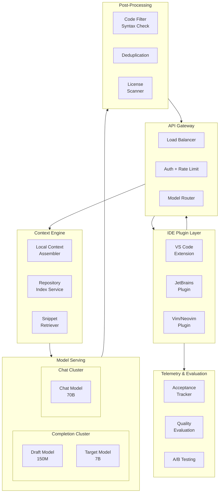
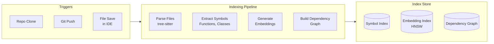
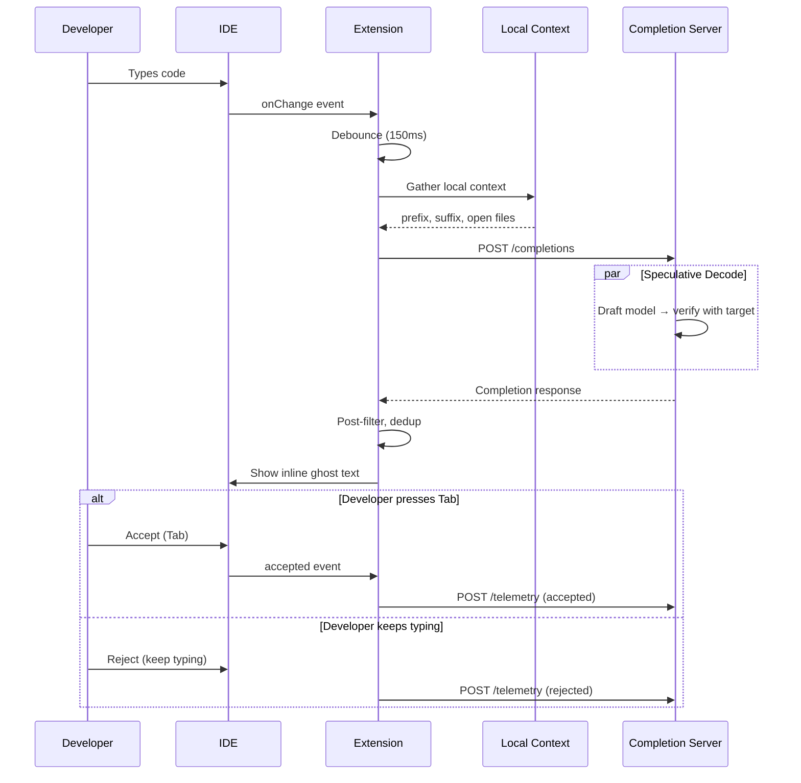

# Design an AI Code Assistant
{: .no_toc }

<details open markdown="block">
  <summary>Table of Contents</summary>
  {: .text-delta }
1. TOC
{:toc}
</details>

---

## What We're Building

An AI-powered code assistant — like Google's Gemini Code Assist, GitHub Copilot, or Cursor — that provides real-time code completions in the IDE, answers coding questions in chat, and understands the full repository context.

**Two primary surfaces:**

| Surface | Latency | Input | Output |
|---------|---------|-------|--------|
| **Inline completion** | < 200ms | Cursor position + surrounding code | 1-5 line suggestion |
| **Chat** | < 3s TTFT | Natural language question + code context | Multi-paragraph explanation + code |

### Why This Problem Is Uniquely Hard

| Challenge | Description |
|-----------|-------------|
| **Latency** | Completions must appear faster than the developer can type (~200ms) |
| **Context** | A single file is insufficient; need repository-level understanding |
| **Accuracy** | Suggesting wrong code is worse than no suggestion (breaks flow) |
| **Diversity** | 50+ programming languages, each with different syntax and idioms |
| **Privacy** | Enterprise code is proprietary; cannot be sent to third parties |
| **Evaluation** | "Good code suggestion" is highly subjective |

### Real-World Scale

| Metric | Scale |
|--------|-------|
| **Active developers** | 1M+ |
| **Completion requests/day** | 500M+ (every keystroke can trigger) |
| **Chat queries/day** | 10M+ |
| **Median file size** | 200 lines |
| **Median repo size** | 5,000 files |
| **Languages** | 50+ |

---

## Key Concepts Primer

### Fill-in-the-Middle (FIM)

Standard LLMs predict the **next** token. Code completions often need to fill in the **middle** — the cursor is between existing code.

```
# Standard left-to-right:
def calculate_area(    →  "radius"

# Fill-in-the-Middle (FIM):
PREFIX: def calculate_area(radius):
MIDDLE: <cursor>         →  "return math.pi * radius ** 2"  
SUFFIX:
    print(f"Area: {area}")
```

FIM training reformats data as: `<PREFIX>code_before<SUFFIX>code_after<MIDDLE>code_to_fill`

### Repository-Level Context

A single file is rarely enough. The model needs:

```
Current file context:
├── Lines above cursor (prefix)
├── Lines below cursor (suffix)
└── Imports and type signatures in current file

Cross-file context:
├── Recently opened/edited files
├── Files imported by current file
├── Type definitions referenced
├── Test files for current module
└── Similar code patterns in repo
```

### Speculative Decoding for Completions

For inline completions, latency is paramount. Speculative decoding uses a tiny draft model:

```
Draft model (150M params):  generates 8 candidate tokens in ~15ms
Target model (7B params):   verifies all 8 in ~40ms  
Total: ~55ms for 5-6 accepted tokens

Without speculative: 7B model generates 5 tokens = 5 × 30ms = 150ms
Speedup: ~2.7x
```

### Abstract Syntax Tree (AST) Awareness

Tree-sitter parses code into ASTs in real-time. This enables:

```python
# AST-guided context selection
def get_relevant_context(cursor_position, ast):
    current_function = ast.find_enclosing_function(cursor_position)
    current_class = ast.find_enclosing_class(cursor_position)
    imports = ast.get_imports()
    
    referenced_symbols = ast.get_referenced_symbols(current_function)
    definitions = [ast.find_definition(sym) for sym in referenced_symbols]
    
    return Context(
        enclosing_function=current_function,
        enclosing_class=current_class,
        imports=imports,
        referenced_definitions=definitions,
    )
```

---

## Step 1: Requirements Clarification

### Questions to Ask

| Question | Why It Matters |
|----------|----------------|
| Inline completions, chat, or both? | Very different latency/context requirements |
| Cloud-hosted or on-prem option? | Enterprise privacy constraints |
| Which IDEs? | VS Code, JetBrains, Vim, Emacs — different APIs |
| Repository indexing? | Pre-index repos or real-time context only? |
| Code execution? | Can the assistant run tests, check types? |

### Functional Requirements

| Requirement | Priority | Description |
|-------------|----------|-------------|
| Inline code completion | Must have | Real-time suggestions as developer types |
| Code chat | Must have | Natural language Q&A about code |
| Multi-language support | Must have | Python, Java, Go, TypeScript, C++ at minimum |
| Repository context | Should have | Understand cross-file references |
| Code actions | Nice to have | Refactor, generate tests, explain code |
| Code search | Nice to have | Semantic search over codebase |

### Non-Functional Requirements

| Requirement | Target | Rationale |
|-------------|--------|-----------|
| **Completion latency** | < 200ms P95 | Must not slow down typing flow |
| **Chat TTFT** | < 500ms P95 | Responsive conversational experience |
| **Completion acceptance rate** | > 30% | Below this, suggestions are noise |
| **Availability** | 99.9% | Developer productivity tool |
| **Privacy** | No code stored server-side | Enterprise requirement |
| **Throughput** | 10K completion req/s | Peak developer hours |

### API Design

```python
# POST /v1/completions (inline completion)
{
    "file_path": "src/main/java/com/example/UserService.java",
    "language": "java",
    "prefix": "public User findById(String id) {\n    ",
    "suffix": "\n    return user;\n}",
    "cursor_offset": 45,
    "max_tokens": 64,
    "context": {
        "open_files": [
            {"path": "src/.../User.java", "content": "public class User {...}"},
            {"path": "src/.../UserRepository.java", "content": "..."}
        ],
        "repo_snippets": [
            {"path": "src/.../ProductService.java", "snippet": "...findById pattern..."}
        ]
    }
}

# Response (< 200ms)
{
    "completions": [
        {
            "text": "User user = userRepository.findById(id)\n        .orElseThrow(() -> new UserNotFoundException(id));",
            "confidence": 0.87,
            "stop_reason": "natural_stop"
        }
    ],
    "telemetry_id": "tel-abc123"
}

# POST /v1/completions/feedback (async telemetry)
{
    "telemetry_id": "tel-abc123",
    "action": "accepted",        # accepted, rejected, partially_accepted
    "accepted_chars": 89,
    "total_chars": 95,
    "time_to_accept_ms": 1200
}
```

---

## Step 2: Back-of-Envelope Estimation

### Traffic

```
Active developers:            500K
Completion triggers/dev/day:  1,000 (not every keystroke; debounced)
Total completion req/day:     500M
Completion QPS (average):     500M / 86,400 ≈ 5,800
Completion QPS (peak, 3x):    ~17,000

Chat queries/dev/day:         20
Total chat req/day:           10M
Chat QPS (peak):              ~350
```

### Compute (Completion Model)

```
Model: 7B parameters (code-specialized, int8 quantized = 7 GB)
GPU: A100 40GB (fits model + KV-cache for batch)

Input tokens (context):      500 (prefix + suffix + cross-file)
Output tokens:               30 (typical completion)
Prefill: 500 tokens × 0.1ms  = 50ms
Decode: 30 tokens × 5ms      = 150ms
Total per request:            200ms

With continuous batching (batch=16):
  Effective throughput:       ~60 req/s per GPU
  
GPUs for 17K peak QPS:       17,000 / 60 ≈ 284 A100 GPUs

With speculative decoding (draft=150M, target=7B):
  Effective throughput:       ~120 req/s per GPU
  GPUs needed:                17,000 / 120 ≈ 142 A100 GPUs
```

### Compute (Chat Model)

```
Model: 70B parameters (general code reasoning)
Input tokens:                 2,000 (code context + conversation)
Output tokens:                500
Time per request:             ~12s

With continuous batching:     ~30 req/s per 2-GPU replica
Replicas for 350 peak QPS:   350 / 30 ≈ 12 replicas = 24 A100 GPUs
```

### Context Index Storage

```
Per-repository index:
  5,000 files × 200 lines × 50 chars = ~50 MB source
  Embeddings: 5,000 chunks × 768 × 4 bytes = ~15 MB
  AST metadata: ~5 MB
  Total: ~70 MB per repo

10K enterprise repos indexed: 700 GB total
```

---

## Step 3: High-Level Design



---

## Step 4: Deep Dive

### 4.1 Context Assembly Pipeline

The most differentiating component. Better context = better completions.

```python
class ContextAssembler:
    """Assemble optimal context for code completion within token budget."""
    
    MAX_CONTEXT_TOKENS = 2048
    
    def assemble(self, request: CompletionRequest) -> AssembledContext:
        budget = TokenBudget(total=self.MAX_CONTEXT_TOKENS)
        
        prefix_tokens = self._get_prefix(request, budget.allocate(ratio=0.4))
        suffix_tokens = self._get_suffix(request, budget.allocate(ratio=0.2))
        
        current_file_symbols = self._extract_symbols(request.file_content)
        
        cross_file_context = self._get_cross_file_context(
            request, current_file_symbols, budget.remaining()
        )
        
        return AssembledContext(
            prefix=prefix_tokens,
            suffix=suffix_tokens,
            cross_file=cross_file_context,
        )
    
    def _get_cross_file_context(self, request: CompletionRequest,
                                 symbols: list[str], budget: int) -> list[Snippet]:
        """Priority-ordered cross-file context retrieval."""
        snippets = []
        
        imported = self._resolve_imports(request.file_content, request.language)
        for imp in imported:
            definition = self._find_definition(imp, request.repo)
            if definition:
                snippets.append(Snippet(source="import", priority=1, **definition))
        
        type_refs = self._find_type_references(request.file_content, request.cursor)
        for ref in type_refs:
            typedef = self._find_type_definition(ref, request.repo)
            if typedef:
                snippets.append(Snippet(source="type_ref", priority=2, **typedef))
        
        similar = self.repo_index.find_similar_code(
            request.prefix[-200:], request.language, top_k=5
        )
        snippets.extend(
            Snippet(source="similar", priority=3, **s) for s in similar
        )
        
        for f in request.recently_edited_files[:3]:
            snippets.append(Snippet(source="recent", priority=4, path=f.path, 
                                     content=f.content[:500]))
        
        snippets.sort(key=lambda s: s.priority)
        return self._fit_to_budget(snippets, budget)
```

### 4.2 Completion Engine with Speculative Decoding

```python
class SpeculativeCompletionEngine:
    """Fast code completion using speculative decoding."""
    
    def __init__(self, draft_model, target_model, max_draft_tokens: int = 8):
        self.draft = draft_model        # 150M params, very fast
        self.target = target_model      # 7B params, high quality
        self.max_draft_tokens = max_draft_tokens
    
    def complete(self, context: AssembledContext, max_tokens: int = 64) -> Completion:
        prompt = self._format_fim_prompt(context)
        input_ids = self.tokenizer.encode(prompt)
        
        generated = []
        while len(generated) < max_tokens:
            draft_tokens = self.draft.generate(
                input_ids + generated, 
                max_new_tokens=self.max_draft_tokens,
                temperature=0.0,
            )
            
            target_logits = self.target.forward(
                input_ids + generated + draft_tokens
            )
            
            accepted = 0
            for i, draft_token in enumerate(draft_tokens):
                target_prob = target_logits[len(input_ids) + len(generated) + i]
                draft_prob = 1.0
                
                if self._should_accept(draft_token, target_prob, draft_prob):
                    accepted += 1
                else:
                    correction = self._sample_from(target_prob)
                    generated.append(correction)
                    break
            
            generated.extend(draft_tokens[:accepted])
            
            if self._is_natural_stop(generated, context):
                break
        
        return Completion(
            text=self.tokenizer.decode(generated),
            confidence=self._compute_confidence(generated, target_logits),
        )
    
    def _format_fim_prompt(self, context: AssembledContext) -> str:
        return (
            f"<|fim_prefix|>{context.cross_file_str}\n{context.prefix}"
            f"<|fim_suffix|>{context.suffix}"
            f"<|fim_middle|>"
        )
    
    def _is_natural_stop(self, tokens: list[int], context: AssembledContext) -> bool:
        text = self.tokenizer.decode(tokens)
        if "\n\n" in text:
            return True
        if text.rstrip().endswith(("}", ")", ";", ":")):
            return True
        return False
```

### 4.3 Repository Indexing Pipeline



```python
class RepositoryIndexer:
    """Index a repository for code-aware context retrieval."""
    
    SUPPORTED_LANGUAGES = {
        ".py": "python", ".java": "java", ".go": "go",
        ".ts": "typescript", ".js": "javascript", ".cpp": "cpp",
        ".rs": "rust", ".rb": "ruby",
    }
    
    def index_repository(self, repo_path: str) -> RepoIndex:
        files = self._discover_files(repo_path)
        
        symbols = []
        chunks = []
        dependencies = {}
        
        for file_path in files:
            lang = self.SUPPORTED_LANGUAGES.get(file_path.suffix)
            if not lang:
                continue
            
            content = file_path.read_text()
            
            ast = self.parser.parse(content, language=lang)
            file_symbols = self._extract_symbols(ast)
            symbols.extend(file_symbols)
            
            file_chunks = self._chunk_by_symbol(content, file_symbols)
            chunks.extend(file_chunks)
            
            deps = self._extract_dependencies(ast, lang)
            dependencies[str(file_path)] = deps
        
        embeddings = self.embedding_model.encode_batch(
            [c.text for c in chunks], batch_size=64
        )
        
        return RepoIndex(
            symbol_index=self._build_symbol_index(symbols),
            embedding_index=self._build_hnsw_index(chunks, embeddings),
            dependency_graph=self._build_dep_graph(dependencies),
        )
    
    def _chunk_by_symbol(self, content: str, symbols: list[Symbol]) -> list[CodeChunk]:
        """Chunk code by function/class boundaries rather than fixed size."""
        chunks = []
        for sym in symbols:
            chunk_text = content[sym.start_byte:sym.end_byte]
            chunks.append(CodeChunk(
                text=chunk_text,
                symbol_name=sym.name,
                symbol_type=sym.type,
                file_path=sym.file_path,
                start_line=sym.start_line,
                end_line=sym.end_line,
            ))
        return chunks
```

### 4.4 Post-Processing Pipeline

```python
class CompletionPostProcessor:
    """Filter and refine completions before showing to user."""
    
    def process(self, completion: Completion, context: AssembledContext) -> Completion | None:
        text = completion.text
        
        text = self._trim_to_natural_boundary(text, context.language)
        
        if not self._is_syntactically_valid(text, context):
            return None
        
        if self._is_duplicate_of_existing(text, context):
            return None
        
        if self.license_scanner.is_verbatim_copy(text, min_chars=150):
            return None
        
        if completion.confidence < self._get_threshold(context):
            return None
        
        return Completion(text=text, confidence=completion.confidence)
    
    def _trim_to_natural_boundary(self, text: str, language: str) -> str:
        """Trim completion at natural code boundary (end of statement/block)."""
        lines = text.split("\n")
        for i in range(len(lines) - 1, 0, -1):
            partial = "\n".join(lines[:i + 1])
            if self._ends_at_boundary(partial, language):
                return partial
        return lines[0]
    
    def _is_syntactically_valid(self, text: str, context: AssembledContext) -> bool:
        """Check that prefix + completion + suffix parses without errors."""
        full_code = context.prefix + text + context.suffix
        tree = self.parser.parse(full_code, language=context.language)
        return not tree.has_error
    
    def _get_threshold(self, context: AssembledContext) -> float:
        """Adaptive confidence threshold. Higher for visible code, lower for boilerplate."""
        if context.is_inside_string:
            return 0.5
        if context.is_inside_comment:
            return 0.4
        return 0.6
```

### 4.5 Telemetry and Evaluation

```python
class CompletionTelemetry:
    """Track completion quality metrics from IDE telemetry."""
    
    def compute_metrics(self, events: list[TelemetryEvent]) -> CompletionMetrics:
        shown = [e for e in events if e.type == "shown"]
        accepted = [e for e in events if e.type == "accepted"]
        partially_accepted = [e for e in events if e.type == "partially_accepted"]
        
        acceptance_rate = len(accepted) / len(shown) if shown else 0
        
        total_accepted_chars = sum(e.accepted_chars for e in accepted + partially_accepted)
        total_typed_chars = sum(e.total_chars_typed for e in events if e.type == "keystroke")
        keystroke_savings = total_accepted_chars / max(1, total_typed_chars + total_accepted_chars)
        
        persistence_3min = sum(
            1 for e in accepted
            if not self._was_undone_within(e, seconds=180)
        ) / max(1, len(accepted))
        
        return CompletionMetrics(
            acceptance_rate=acceptance_rate,
            keystroke_savings=keystroke_savings,
            persistence_rate_3min=persistence_3min,
            median_latency_ms=self._median([e.latency_ms for e in shown]),
            shown_per_hour=len(shown) / self._total_hours(events),
        )
```

**Key metrics:**

| Metric | What It Measures | Target |
|--------|-----------------|--------|
| **Acceptance rate** | % of shown completions accepted | > 30% |
| **Keystroke savings** | % of characters from AI vs typed | > 25% |
| **Persistence rate** | % of accepted not undone in 3 min | > 90% |
| **Latency P95** | Time from trigger to suggestion shown | < 200ms |
| **Shown rate** | How often we show (vs suppress low-confidence) | 40-60% |

### 4.6 IDE Integration Architecture



**Debouncing strategy:**

| Trigger | Debounce | Rationale |
|---------|----------|-----------|
| Character typed | 150ms | Wait for typing pause |
| New line | 0ms (immediate) | High-value moment |
| After `:`, `(`, `.` | 50ms | Developer expects completion |
| Cursor repositioned | 300ms | Exploratory; may keep moving |

---

## Step 5: Scaling & Production

### Failure Handling

| Failure | Detection | Recovery |
|---------|-----------|----------|
| **Completion server down** | Health check | Show nothing (graceful degradation) |
| **High latency** | P95 > 300ms | Reduce context window; skip cross-file |
| **Repo index stale** | File watcher gap | Fall back to open-file-only context |
| **Model OOM** | CUDA error | Reduce batch size; scale up |
| **License match** | Scanner flags | Suppress completion; log |

### Trade-offs

| Decision | Option A | Option B | Recommendation |
|----------|----------|----------|----------------|
| **Completion model** | 1.5B (fast) | 7B (smarter) | 7B with speculative decode (quality + speed) |
| **Context** | Current file only | Cross-file repo | Cross-file (measurable acceptance rate lift) |
| **Debounce** | 100ms | 300ms | 150ms (balance latency vs. wasted requests) |
| **Show threshold** | Low (show more) | High (show less, higher quality) | Tune per-language; start high |
| **Repo indexing** | On-demand | Pre-indexed | Pre-indexed for enterprise; on-demand for OSS |

---

## Interview Tips

{: .tip }
> **What differentiates a strong answer:**
> 1. Discussing FIM (fill-in-the-middle) rather than just left-to-right generation
> 2. Explaining why speculative decoding matters for latency
> 3. Cross-file context assembly — not just current file
> 4. Telemetry-driven evaluation (acceptance rate, persistence, keystroke savings)
> 5. License scanning and code attribution

---

## Hypothetical Interview Transcript

{: .note }
> This transcript simulates a 45-minute Google L5/L6 system design round. The interviewer is a Staff Engineer on the Gemini Code Assist team.

---

**Interviewer:** Design an AI code assistant that provides inline completions in the IDE and has a chat interface for code questions. Think Copilot or Gemini Code Assist.

**Candidate:** Great. Let me clarify: are we designing both the inline completion and chat surfaces, or focusing on one? And is this for individual developers or enterprise (where code privacy matters)?

**Interviewer:** Both surfaces. Enterprise context — code cannot leave the customer's environment unless they opt in.

**Candidate:** That's an important constraint. Let me separate the two surfaces because they have fundamentally different requirements.

**Inline completions** need to be under 200ms — the developer is typing and any delay breaks flow. The model sees the cursor position, code above (prefix), code below (suffix), and ideally cross-file context. It generates a short suggestion, typically 1-5 lines.

**Chat** is more like the chatbot problem — higher latency tolerance (seconds), longer context (full files, error messages), and longer output.

For completions, I'd use a specialized code model around 7B parameters. It's small enough for fast inference but large enough for quality. Critically, this model must be trained with **fill-in-the-middle** — standard left-to-right models are bad at code completion because they can't see what comes after the cursor.

For chat, I'd use a larger model — 70B — that excels at reasoning and explanation.

**Interviewer:** Walk me through what happens when a developer types a character in VS Code.

**Candidate:** Sure. Let me trace the full path:

1. **IDE event**: The developer types a character. The VS Code extension receives an `onDidChangeTextDocument` event.

2. **Debounce**: We don't fire on every keystroke. We wait 150ms after the last keystroke. If the developer is still typing rapidly, we wait. But for high-value triggers — typing after `(`, `.`, `:`, or pressing Enter for a new line — we use a shorter debounce or trigger immediately.

3. **Local context assembly**: The extension gathers the prefix (code above cursor), suffix (code below cursor), and a snapshot of currently open files. This happens client-side and takes ~5ms.

4. **Request to server**: The extension sends a POST request with the prefix, suffix, file path, language, and open file snippets.

5. **Server-side context enrichment**: The server looks up the repository index (if pre-indexed) and retrieves relevant cross-file context — imported type definitions, similar code patterns in the repo, recently edited files. This takes ~20ms.

6. **Inference with speculative decoding**: We format the context as a FIM prompt: `<prefix>cross_file_context + code_above<suffix>code_below<middle>`. A small 150M draft model generates 8 candidate tokens quickly (~15ms). The 7B target model verifies them in a single forward pass (~40ms). With ~75% acceptance rate, we get about 6 tokens verified. We repeat until we hit a natural stopping point — end of statement, empty line, or closing brace.

7. **Post-processing**: We check that the completion is syntactically valid (parse prefix + completion + suffix with tree-sitter), not a verbatim copy of licensed code, and above our confidence threshold. If it fails any check, we suppress it entirely.

8. **Response**: The completion appears as ghost text in the IDE, typically within 150-200ms of the keystroke.

9. **User action**: If the developer presses Tab, the completion is accepted. If they keep typing, it's implicitly rejected. Either way, telemetry is sent back asynchronously.

**Interviewer:** You mentioned cross-file context. How do you decide which code from other files to include?

**Candidate:** This is the highest-leverage area for quality improvement. I use a priority-ordered retrieval:

**Priority 1: Import definitions.** Parse the current file's imports using tree-sitter. For each imported symbol, find its definition in the repo index. If the developer is calling `userService.findById(...)`, including the `UserService` interface definition is extremely valuable.

**Priority 2: Type references.** If the current function signature references types like `User`, `OrderRequest`, find those class/struct definitions. This helps the model understand the shape of data.

**Priority 3: Similar code patterns.** Use embedding similarity to find functions in the repo that do similar things. If the developer is writing a new REST handler, finding existing handlers helps the model follow the project's conventions.

**Priority 4: Recently edited files.** The developer's recent edits are strong signals of relevance — they likely share context with the current task.

All of this is constrained by a token budget — typically 2048 tokens total, with ~40% for prefix, ~20% for suffix, and ~40% for cross-file context. We greedily fill by priority order.

**Interviewer:** How do you know if your completions are actually good? How do you measure quality?

**Candidate:** We can't rely on offline benchmarks alone — they don't capture real developer workflows. I'd build a multi-level evaluation:

**Level 1: Acceptance rate.** The most direct signal. Of all completions shown, what percentage did the developer accept (Tab/Enter)? Target: >30%. Below 25%, the suggestions are noise and should be suppressed more aggressively.

**Level 2: Persistence rate.** Of accepted completions, what percentage is still in the code 3 minutes later? If developers accept then immediately delete, the completion was wrong. Target: >90% persistence.

**Level 3: Keystroke savings.** What fraction of the developer's code was written by the AI? This measures actual productivity impact. Target: >25%.

**Level 4: Edit distance.** When a developer partially accepts and then modifies, how many edits were needed? Lower is better — it means the completion was close but not perfect.

All of these power our A/B testing. When we ship a new model or context strategy, we A/B test on 5% of users and compare these metrics. A new model must improve acceptance rate without degrading persistence rate.

**Interviewer:** What about the enterprise privacy requirement? How do you handle "code cannot leave the customer's environment"?

**Candidate:** Three deployment options, each with different tradeoffs:

**Option 1: Customer-hosted.** Deploy the model in the customer's VPC or on-prem Kubernetes cluster. They provide GPUs; we provide the container image. Full privacy, but higher operational burden for the customer and harder for us to update.

**Option 2: Dedicated cloud tenancy.** We run the model on dedicated GPU instances in a specific cloud region. Customer data is isolated — not shared with other tenants, not used for training. This is the most common enterprise model.

**Option 3: Ephemeral processing.** Code is sent to our shared infrastructure but never stored. We process the request, return the completion, and immediately discard all input data. We commit to never training on their code. This requires strong contractual guarantees and audit logging.

For the most security-conscious enterprises (finance, government), Option 1 or 2 is required. For most companies, Option 3 with data processing agreements is sufficient.

In all cases, the telemetry we collect is aggregated and anonymized — we track acceptance rate and latency, not the actual code content.

**Interviewer:** Great answer. One more — how would you handle the cold start problem when a developer opens a new repository for the first time?

**Candidate:** Good question. Without a pre-built repository index, we lose cross-file context, which hurts quality. Three approaches:

**Immediate**: Use only local context — the current file and any open tabs. This works surprisingly well for many completions, especially single-line suggestions.

**Background indexing**: On first open, trigger an async indexing job. For a 5,000-file repo, parsing with tree-sitter takes about 10 seconds. Embedding generation (5,000 chunks) takes about 30 seconds with batching. So within a minute, we have a usable index. We prioritize files near the cursor first — index the current directory, then fan out.

**Incremental enrichment**: As the developer opens and edits files, we learn which files are related. The first few minutes are lower quality, but it improves rapidly. By the second day, the index reflects the developer's actual working set, which is typically only 5-10% of the repo.

For enterprise, we'd pre-index repositories overnight using CI/CD hooks — every push triggers a re-index. This means when a developer opens a repo that's already indexed, the experience is instant.

**Interviewer:** Excellent depth. Let's wrap up.
