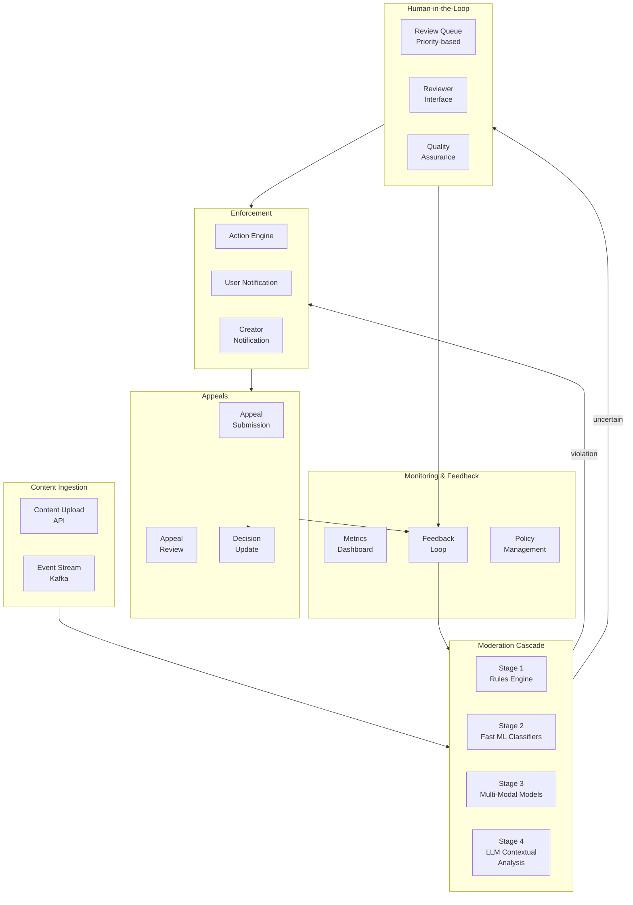

# Design an LLM Content Moderation System
{: .no_toc }

<details open markdown="block">
  <summary>Table of Contents</summary>
  {: .text-delta }
1. TOC
{:toc}
</details>

---

## What We're Building

A content moderation system that uses ML and LLMs to classify user-generated content (text, images, video) across multiple policy categories — detecting harassment, hate speech, misinformation, CSAM, spam, and more — at the scale of a platform like YouTube, Instagram, or Google Search.

**The stakes:** A missed harmful post can cause real-world harm. An over-aggressive filter silences legitimate speech. Getting this right requires balancing safety, fairness, speed, and cost.

### Scale and Impact

| Platform | Content Volume | Moderation Challenge |
|----------|---------------|---------------------|
| **YouTube** | 500 hours of video uploaded per minute | Multi-modal: speech, visual, text overlay |
| **Instagram** | 100M+ photos/day | Image + caption; context-dependent |
| **Google Search** | 8.5B searches/day | Query + result quality; misinformation |
| **Gmail** | 300B+ emails/day | Spam, phishing, malware |

### Why This Is Hard

| Challenge | Description |
|-----------|-------------|
| **Scale** | Billions of content items per day; can't human-review everything |
| **Nuance** | "Kill it!" — gaming context vs. threat |
| **Adversarial** | Bad actors actively evade detection (leetspeak, code words) |
| **Multi-modal** | Harmful meaning can emerge from image + text combination |
| **Cultural context** | Norms vary across languages, regions, demographics |
| **Fairness** | Over-enforcement on minority dialects is discrimination |
| **Speed** | Some content (livestreams) needs near-real-time moderation |

---

## Key Concepts Primer

### Cascade Architecture

No single model handles all moderation. Production systems use a **cascade** — fast cheap models filter most content; expensive accurate models handle the ambiguous middle.

```
Content Stream (1B items/day)
    │
    ▼
┌─────────────────┐
│  Stage 1: Rules  │  Regex, keyword, hash match
│  Latency: <1ms   │  Catches: 20% (obvious spam, known hashes)
│  Cost: ~$0       │
└────────┬────────┘
         │ 80% pass through
         ▼
┌─────────────────┐
│  Stage 2: Fast ML │  Lightweight classifier (BERT-tiny, FastText)
│  Latency: <10ms   │  Catches: 15% more
│  Cost: CPU only    │
└────────┬──────────┘
         │ 65% pass through
         ▼
┌─────────────────┐
│  Stage 3: Heavy ML │  Large multi-modal model
│  Latency: <100ms   │  Catches: 5% more
│  Cost: GPU          │
└────────┬──────────┘
         │ 60% pass through (clearly safe)
         ▼                    ▲
┌─────────────────┐    ┌────────────┐
│  Stage 4: LLM    │    │  Stage 5:   │
│  Latency: ~500ms │───▶│  Human      │
│  Cost: GPU $$    │    │  Review     │
│  Handles nuance  │    │  Queue      │
└─────────────────┘    └────────────┘
```

### Policy-as-Code

Content policies must be machine-readable, versioned, and auditable:

```python
POLICY_DEFINITIONS = {
    "harassment": {
        "description": "Content that targets individuals with abuse, threats, or intimidation",
        "severity_levels": {
            "severe": "Direct threats of violence, doxxing, sustained campaigns",
            "moderate": "Insults targeting protected attributes, dehumanization",
            "mild": "Rude language, mild insults without targeting",
        },
        "action_by_severity": {
            "severe": "remove_immediately",
            "moderate": "remove_and_warn",
            "mild": "reduce_distribution",
        },
        "context_factors": [
            "Is this directed at a specific person?",
            "Does it target protected attributes?",
            "Is this a pattern of behavior?",
        ],
        "exceptions": [
            "News reporting about harassment",
            "Educational content about bullying",
            "Self-referential humor (own group)",
        ],
    },
}
```

### Perceptual Hashing

For images/video, perceptual hashing identifies known harmful content without expensive ML:

```python
class PerceptualHashMatcher:
    """Match content against known harmful media using perceptual hashing."""
    
    def __init__(self, hash_db):
        self.hash_db = hash_db  # Database of known-bad content hashes
    
    def check(self, image: bytes) -> MatchResult:
        phash = self._compute_phash(image)  # 64-bit perceptual hash
        
        matches = self.hash_db.find_within_distance(phash, max_hamming=10)
        
        if matches:
            return MatchResult(
                matched=True,
                category=matches[0].category,
                confidence=1.0 - (matches[0].distance / 64),
            )
        return MatchResult(matched=False)
```

---

## Step 1: Requirements Clarification

### Questions to Ask

| Question | Why It Matters |
|----------|----------------|
| What content types? | Text, image, video, audio — each needs different models |
| Which policies? | Harassment, CSAM, spam, misinformation, copyright |
| Latency requirements? | Pre-publish blocking vs. post-publish detection |
| What actions? | Remove, reduce distribution, label, age-gate |
| Appeals process? | Users can contest; need human review pipeline |
| Regulatory requirements? | GDPR, DSA, local laws (Germany NetzDG) |

### Functional Requirements

| Requirement | Priority | Description |
|-------------|----------|-------------|
| Multi-category classification | Must have | Harassment, hate, violence, CSAM, spam, etc. |
| Multi-modal analysis | Must have | Text, image, video, audio |
| Automated enforcement | Must have | Remove, reduce, warn based on policy |
| Human review queue | Must have | Escalate ambiguous cases |
| Appeals process | Must have | Users contest decisions; re-review |
| Policy versioning | Should have | Track policy changes, audit decisions |
| Contextual analysis | Should have | Account history, conversation thread |
| Adversarial robustness | Should have | Resist evasion techniques |

### Non-Functional Requirements

| Requirement | Target | Rationale |
|-------------|--------|-----------|
| **Latency (pre-publish)** | < 500ms | Don't slow down posting |
| **Latency (post-publish scan)** | < 5 min | Limit harmful content exposure |
| **Precision (remove action)** | > 95% | False removals erode trust |
| **Recall (severe violations)** | > 99% | Missing CSAM/threats is unacceptable |
| **Throughput** | 100K items/sec | Platform scale |
| **Availability** | 99.99% | Moderation must never go down |

---

## Step 2: Back-of-Envelope Estimation

### Traffic

```
Content items/day:            1B (posts, comments, messages)
Text-only:                    70% = 700M
Image:                        25% = 250M
Video:                        5% = 50M

Items/second (average):       1B / 86,400 ≈ 11,600
Peak (3x):                    ~35,000 items/sec
```

### Compute per Stage

```
Stage 1 (Rules):              CPU only, ~0.1ms per item
  Handles 100% of traffic:    Negligible cost

Stage 2 (Fast ML):            CPU, ~5ms per item
  Handles 80% of traffic:     800M items × 5ms = ~46K CPU-hours/day

Stage 3 (Heavy ML):           GPU, ~50ms per item
  Handles 65% of traffic:     650M items × 50ms = ~9K GPU-hours/day
  A100 GPUs needed (peak):    650M / 86400 × 0.05 / (batch_eff=0.7) ≈ 540 GPUs

Stage 4 (LLM):                GPU, ~500ms per item
  Handles 5% of traffic:      50M items × 500ms = ~7K GPU-hours/day
  A100 GPUs needed:           50M / 86400 × 0.5 ≈ 290 GPUs

Stage 5 (Human review):
  0.1% of traffic:            1M items/day
  Reviewers (250 items/shift): 1M / 250 / 3 shifts ≈ 1,333 reviewers
```

### Storage

```
Decision logs:                1B × 0.5 KB = 500 GB/day
Content hashes (dedup):       1B × 64 bytes = 64 GB
Policy/model versions:        Negligible
Human review queue:           1M × 5 KB = 5 GB active
Appeal records:               100K/day × 2 KB = 200 MB/day
```

---

## Step 3: High-Level Design



---

## Step 4: Deep Dive

### 4.1 Multi-Stage Classification Pipeline

```python
class ModerationPipeline:
    """Multi-stage content moderation with early exit."""
    
    def __init__(self, rules_engine, fast_classifier, heavy_classifier, 
                 llm_classifier, action_engine):
        self.rules = rules_engine
        self.fast_ml = fast_classifier
        self.heavy_ml = heavy_classifier
        self.llm = llm_classifier
        self.action_engine = action_engine
    
    async def moderate(self, content: Content) -> ModerationDecision:
        result = self.rules.check(content)
        if result.is_definitive:
            return self._finalize(content, result, stage="rules")
        
        result = await self.fast_ml.classify(content)
        if result.confidence > 0.95:
            return self._finalize(content, result, stage="fast_ml")
        
        if result.confidence > 0.3:
            result = await self.heavy_ml.classify(content)
            if result.confidence > 0.90:
                return self._finalize(content, result, stage="heavy_ml")
        
        if result.needs_context:
            context = await self._gather_context(content)
            result = await self.llm.classify_with_context(content, context)
            if result.confidence > 0.85:
                return self._finalize(content, result, stage="llm")
        
        return self._escalate_to_human(content, result)
    
    async def _gather_context(self, content: Content) -> ModerationContext:
        """Gather contextual signals for LLM-based moderation."""
        return ModerationContext(
            thread_history=await self._get_thread(content.thread_id),
            author_history=await self._get_author_violations(content.author_id),
            community_norms=await self._get_community_rules(content.community_id),
            reporter_info=content.reports if content.was_reported else None,
        )
    
    def _finalize(self, content: Content, result: ClassificationResult, 
                  stage: str) -> ModerationDecision:
        action = self.action_engine.determine_action(
            category=result.category,
            severity=result.severity,
            author_history=result.author_context,
        )
        
        return ModerationDecision(
            content_id=content.id,
            category=result.category,
            severity=result.severity,
            confidence=result.confidence,
            action=action,
            stage=stage,
            explanation=result.explanation,
        )
```

### 4.2 LLM-Based Contextual Moderation

```python
class LLMContentModerator:
    """Use LLM for nuanced, context-aware content moderation."""
    
    SYSTEM_PROMPT = """You are a content moderation expert. Analyze the content 
below against the policy definitions provided. Consider context, intent, and 
nuance. Output a structured JSON decision.

Key principles:
- Satire and commentary about harmful topics is generally allowed
- News reporting is protected even if the topic is sensitive
- Context matters: "kill" in gaming vs. directed threat
- Consider the full conversation thread, not just the flagged message
- Account for cultural context and dialect variations"""

    async def classify_with_context(self, content: Content,
                                     context: ModerationContext) -> ClassificationResult:
        prompt = self._build_prompt(content, context)
        
        response = await self.llm.generate(
            messages=[
                {"role": "system", "content": self.SYSTEM_PROMPT},
                {"role": "user", "content": prompt},
            ],
            response_format={"type": "json_object"},
            temperature=0.0,
            max_tokens=500,
        )
        
        decision = json.loads(response)
        return ClassificationResult(
            category=decision["category"],
            severity=decision["severity"],
            confidence=decision["confidence"],
            explanation=decision["reasoning"],
            needs_human=decision.get("uncertain", False),
        )
    
    def _build_prompt(self, content: Content, context: ModerationContext) -> str:
        sections = [f"## Content to Evaluate\n{content.text}"]
        
        if content.media_descriptions:
            sections.append(f"## Media Description\n{content.media_descriptions}")
        
        if context.thread_history:
            sections.append(
                f"## Conversation Thread\n"
                + "\n".join(f"- {m.author}: {m.text}" for m in context.thread_history[-5:])
            )
        
        if context.author_history:
            sections.append(
                f"## Author History\n"
                f"Previous violations: {context.author_history.violation_count}\n"
                f"Account age: {context.author_history.account_age_days} days"
            )
        
        sections.append("""## Required Output (JSON)
{
    "category": "harassment|hate_speech|violence|spam|safe|...",
    "severity": "severe|moderate|mild|none",
    "confidence": 0.0-1.0,
    "reasoning": "brief explanation of decision",
    "uncertain": true/false
}""")
        
        return "\n\n".join(sections)
```

### 4.3 Adversarial Robustness

```python
class AdversarialDefense:
    """Techniques to handle evasion attempts."""
    
    def normalize(self, text: str) -> str:
        """Normalize adversarial text transformations."""
        text = self._decode_leetspeak(text)       # h4t3 → hate
        text = self._normalize_unicode(text)       # Cyrillic а → Latin a
        text = self._remove_invisible_chars(text)  # zero-width joiners, etc.
        text = self._normalize_whitespace(text)    # h a t e → hate
        text = self._expand_abbreviations(text)    # kys → kill yourself
        return text
    
    def _decode_leetspeak(self, text: str) -> str:
        leet_map = {"4": "a", "3": "e", "1": "i", "0": "o", "@": "a", "$": "s"}
        result = []
        for char in text:
            result.append(leet_map.get(char, char))
        return "".join(result)
    
    def _normalize_unicode(self, text: str) -> str:
        """Replace visually similar Unicode characters with ASCII equivalents."""
        import unicodedata
        normalized = unicodedata.normalize("NFKD", text)
        return normalized.encode("ascii", "ignore").decode("ascii")
    
    def detect_evasion_signals(self, text: str) -> EvasionSignals:
        """Detect signals that suggest intentional evasion."""
        return EvasionSignals(
            excessive_special_chars=self._count_special_ratio(text) > 0.3,
            mixed_scripts=self._has_mixed_scripts(text),
            invisible_characters=self._has_invisible_chars(text),
            deliberate_misspelling=self._detect_deliberate_misspelling(text),
            obfuscation_score=self._compute_obfuscation_score(text),
        )
```

### 4.4 Human Review System

```mermaid
flowchart LR
    subgraph Queue [Priority Queue]
        P1[P0: CSAM / Imminent Threat<br/>SLA: 15 min]
        P2[P1: Severe Harassment<br/>SLA: 1 hour]
        P3[P2: Hate Speech / Violence<br/>SLA: 4 hours]
        P4[P3: Spam / Misinformation<br/>SLA: 24 hours]
    end

    subgraph Review [Review Interface]
        ContentView[Content + Context<br/>Display]
        PolicyRef[Policy Reference<br/>Panel]
        MLDecision[ML Decision +<br/>Explanation]
        ActionButtons[Action Buttons<br/>+ Reason Codes]
    end

    subgraph QA [Quality Assurance]
        DoubleReview[Double-Blind<br/>Review Sample]
        Calibration[Weekly<br/>Calibration]
        InterRater[Inter-Rater<br/>Agreement]
    end

    Queue --> Review --> QA
```



```python
class HumanReviewQueue:
    """Priority-based human review queue with SLA tracking."""
    
    PRIORITY_SLA = {
        0: timedelta(minutes=15),    # CSAM, imminent threats
        1: timedelta(hours=1),       # Severe harassment
        2: timedelta(hours=4),       # Hate speech, violence
        3: timedelta(hours=24),      # Spam, mild violations
    }
    
    def enqueue(self, item: ReviewItem):
        priority = self._compute_priority(item)
        sla_deadline = datetime.utcnow() + self.PRIORITY_SLA[priority]
        
        item.priority = priority
        item.sla_deadline = sla_deadline
        item.assigned_reviewer = None
        
        self.queue.push(item, priority=priority, deadline=sla_deadline)
    
    def _compute_priority(self, item: ReviewItem) -> int:
        if item.ml_category in ("csam", "imminent_threat"):
            return 0
        if item.ml_category == "harassment" and item.ml_severity == "severe":
            return 1
        if item.ml_category in ("hate_speech", "violence"):
            return 2
        return 3
    
    def assign_to_reviewer(self, reviewer: Reviewer) -> ReviewItem | None:
        """Assign next item considering reviewer specialization and well-being."""
        available_items = self.queue.peek_by_priority()
        
        for item in available_items:
            if not self._reviewer_can_handle(reviewer, item):
                continue
            if self._reviewer_needs_break(reviewer, item.ml_category):
                continue
            
            self.queue.pop(item.id)
            item.assigned_reviewer = reviewer.id
            item.assigned_at = datetime.utcnow()
            return item
        
        return None
    
    def _reviewer_needs_break(self, reviewer: Reviewer, category: str) -> bool:
        """Protect reviewer well-being: limit consecutive exposure to disturbing content."""
        if category not in ("csam", "violence", "self_harm"):
            return False
        recent_disturbing = reviewer.recent_reviews(minutes=60, categories=["csam", "violence", "self_harm"])
        return len(recent_disturbing) >= 5  # Max 5 disturbing items per hour
```

### 4.5 Appeals Pipeline

```python
class AppealsSystem:
    """Handle user appeals of moderation decisions."""
    
    async def submit_appeal(self, content_id: str, user_id: str, 
                           reason: str) -> Appeal:
        original_decision = await self.get_decision(content_id)
        
        if not self._is_appealable(original_decision):
            raise AppealNotAllowed("This decision type cannot be appealed")
        
        if await self._has_pending_appeal(content_id):
            raise DuplicateAppeal("An appeal is already pending")
        
        appeal = Appeal(
            content_id=content_id,
            user_id=user_id,
            reason=reason,
            original_decision=original_decision,
            status="pending",
        )
        
        auto_result = await self._auto_review(appeal)
        if auto_result.confidence > 0.95:
            appeal.status = "auto_resolved"
            appeal.resolution = auto_result
            if auto_result.overturn:
                await self._reinstate_content(content_id)
            return appeal
        
        appeal.status = "pending_human_review"
        await self.review_queue.enqueue_appeal(appeal, priority=2)
        return appeal
    
    async def _auto_review(self, appeal: Appeal) -> AutoReviewResult:
        """Re-evaluate with fresh model + appeal context."""
        fresh_result = await self.moderation_pipeline.moderate(
            appeal.content, include_appeal_context=True
        )
        
        if fresh_result.action == "allow" and appeal.original_decision.action == "remove":
            return AutoReviewResult(overturn=True, confidence=fresh_result.confidence)
        
        return AutoReviewResult(overturn=False, confidence=fresh_result.confidence)
```

### 4.6 Fairness and Bias Monitoring

```python
class FairnessMonitor:
    """Monitor moderation system for demographic bias."""
    
    def compute_fairness_metrics(self, decisions: list[ModerationDecision],
                                  demographics: dict) -> FairnessReport:
        groups = self._segment_by_demographics(decisions, demographics)
        
        metrics = {}
        for group_name, group_decisions in groups.items():
            metrics[group_name] = {
                "false_positive_rate": self._fpr(group_decisions),
                "enforcement_rate": self._enforcement_rate(group_decisions),
                "appeal_overturn_rate": self._appeal_overturn_rate(group_decisions),
            }
        
        disparities = []
        group_names = list(metrics.keys())
        for i in range(len(group_names)):
            for j in range(i + 1, len(group_names)):
                fpr_ratio = (
                    metrics[group_names[i]]["false_positive_rate"]
                    / max(0.001, metrics[group_names[j]]["false_positive_rate"])
                )
                if fpr_ratio > 1.5 or fpr_ratio < 0.67:
                    disparities.append(FairnessDisparity(
                        group_a=group_names[i],
                        group_b=group_names[j],
                        metric="false_positive_rate",
                        ratio=fpr_ratio,
                    ))
        
        return FairnessReport(metrics=metrics, disparities=disparities)
```

---

## Step 5: Scaling & Production

### Failure Handling

| Failure | Detection | Recovery |
|---------|-----------|----------|
| **ML model down** | Health check failure | Fall back to rules-only (higher false negative rate) |
| **LLM stage overloaded** | Queue depth > 10K | Skip LLM stage; route directly to human review |
| **Human review backlog** | SLA breach > 5% | Auto-escalate; temporarily lower thresholds |
| **Hash DB unavailable** | Connection timeout | Log content IDs for retroactive scan |
| **False positive spike** | Appeal rate > 2x baseline | Emergency threshold adjustment; incident review |

### Monitoring

| Metric | Alert Threshold |
|--------|----------------|
| **P0 SLA compliance** | < 99% (15 min for CSAM) |
| **Overall precision** | < 90% |
| **Severe recall** | < 98% |
| **Appeal overturn rate** | > 15% (model quality degrading) |
| **Fairness ratio (FPR)** | > 1.5x between groups |
| **Cascade cost/item** | > $0.001 |

### Trade-offs

| Decision | Option A | Option B | Recommendation |
|----------|----------|----------|----------------|
| **Pre vs Post publish** | Pre-publish (block before visible) | Post-publish (scan after) | Pre for comments/messages; post for low-risk content |
| **Precision vs Recall** | High precision (fewer false positives) | High recall (catch more bad) | Vary by severity: recall for CSAM, precision for mild |
| **LLM usage** | Use LLM for all ambiguous | Rules + small ML only | LLM for top 5% ambiguous (cost constraint) |
| **Context depth** | Current item only | Full thread + history | Full context for harassment (pattern matters) |

---

## Hypothetical Interview Transcript

{: .note }
> This transcript simulates a 45-minute Google L5/L6 system design round. The interviewer is a Staff Engineer on the Trust & Safety team.

---

**Interviewer:** Design a content moderation system for a social media platform. Think YouTube-scale. How would you approach this?

**Candidate:** Let me start with clarifying questions. What content types — text only, or text plus images and video? What are the key policy categories — harassment, hate speech, spam, CSAM, misinformation? And what's our latency requirement — do we block before publishing, or scan post-publish?

**Interviewer:** Full multi-modal — text, image, video. All the categories you mentioned. Let's say a mix: comments should be checked pre-publish; posts and videos can be post-publish with a target of scanning within 5 minutes of upload.

**Candidate:** Good. At YouTube-scale, we're looking at roughly a billion content items per day. The fundamental architecture I'd propose is a **cascade** — multiple stages of increasing cost and accuracy, with early exit for clear cases.

**Stage 1: Rules engine.** Keyword blocklists, regex patterns, and perceptual hash matching against known-bad content databases (like NCMEC's hash list for CSAM). This catches about 20% of violations — the obvious, unambiguous ones. Near-zero latency, near-zero cost.

**Stage 2: Fast ML classifiers.** Lightweight models — think fine-tuned BERT-tiny or FastText — running on CPUs. One model per category: hate speech classifier, spam classifier, toxicity classifier. Each takes ~5ms. This catches another 15% with high confidence.

**Stage 3: Heavy ML models.** Multi-modal models that can jointly analyze text, images, and video frames. These run on GPUs, take ~50ms. For video, we sample key frames rather than processing every frame. This catches another 5% and refines the classification of edge cases.

**Stage 4: LLM-based analysis.** For the truly ambiguous cases — maybe 5% of all content — we use an LLM with the full context: the content, the conversation thread, the author's history, and the community's norms. The LLM can reason about nuance: "is this satire or genuine hate speech?" This takes ~500ms but produces high-quality decisions with explanations.

**Stage 5: Human review.** For the remaining 0.1% that even the LLM is uncertain about, plus a quality-assurance sample, we route to human reviewers.

The key insight is that each stage handles a specific confidence band. A content item exits the cascade as soon as any stage is confident enough — either to allow or to take action.

**Interviewer:** How do you handle context? The sentence "I'm going to kill you" means something very different in a gaming chat versus a DM.

**Candidate:** Context is absolutely critical. I'd build context at three levels:

**Immediate context — the conversation thread.** What was said before and after? Is this a heated argument or friendly banter? We fetch the last 5-10 messages in the thread and include them in the classification input. For the fast ML models, we encode a thread summary embedding. For the LLM stage, we include the full thread text.

**Author context — behavioral history.** Has this user been flagged before? Account age? Typical posting patterns? A first-time poster saying something edgy is different from an account with 10 prior violations. We maintain a real-time feature store with author signals: violation count, report frequency, account age, engagement patterns.

**Community context — where is this posted?** A gaming subreddit has different norms than a parenting forum. Community moderators often define additional rules. We encode community-specific policy overrides.

For the gaming example — "I'm going to kill you" in a game chat — the immediate context (gaming conversation), the community context (gaming channel), and the content itself (casual competitive language) would all signal "safe." But the same phrase in a DM to a stranger, from an account with prior harassment violations, would signal "threat."

The LLM stage is particularly good at this because we can literally describe the context in the prompt and ask it to reason about intent. The fast ML stages use feature engineering — binary features like `is_gaming_context`, `is_dm`, `author_prior_violations > 0`.

**Interviewer:** How do you handle adversarial evasion? Bad actors will try to get around your filters.

**Candidate:** Evasion is an arms race. I'd address it at multiple levels:

**Text normalization.** Before classification, we normalize the text: decode leetspeak (h4t3 → hate), normalize Unicode (replacing Cyrillic lookalikes with Latin), strip invisible characters (zero-width spaces), and collapse deliberate spacing (h a t e → hate). This catches the most common evasion techniques.

**Robustness in training.** We train our ML models on adversarially augmented data — adding character substitutions, misspellings, code words. This makes the model less sensitive to surface-level perturbations.

**Evasion detection as a signal.** If a user's text has high obfuscation scores — lots of special characters, mixed scripts, invisible characters — that itself is a signal. We can use it as a feature that lowers the confidence threshold for escalation. Essentially: "this looks like it's trying to evade, so route it to a more careful review."

**Emerging slang tracking.** Bad actors adopt new code words. We monitor for terms that appear frequently in reported content but not in normal content. A team of analysts tracks emerging slang and updates keyword lists weekly.

**Perceptual hashing for media.** Known harmful images and videos are fingerprinted. Even if slightly modified (cropped, filtered, mirrored), the perceptual hash still matches. This is especially critical for CSAM detection.

No single technique is sufficient — it's the layering that provides resilience.

**Interviewer:** You mentioned human reviewers. How do you manage reviewer quality and well-being?

**Candidate:** This is something that doesn't come up enough in system design but is critical for production systems.

**Quality:** Every reviewer decision is compared against a calibration set — items where the "correct" answer is known. We track inter-rater agreement (target: Cohen's kappa > 0.8). Weekly calibration sessions ensure reviewers apply policies consistently. We also do double-blind reviews on a sample — two reviewers see the same item independently. If they disagree, a senior reviewer adjudicates, and the result feeds back into calibration.

**Well-being:** Reviewers are exposed to genuinely disturbing content — CSAM, violence, self-harm. The system tracks exposure: no more than 5 highly disturbing items per hour per reviewer. After viewing CSAM, a mandatory 10-minute break is enforced by the queue system. Reviewers rotate between categories to avoid prolonged exposure to one type of harmful content. We also provide counseling services and regular check-ins.

**The queue system respects both:** it routes items based on reviewer specialization (some are trained for CSAM, others for hate speech), workload balance, SLA deadlines, and well-being limits. The P0 queue (CSAM, imminent threats) has a 15-minute SLA and gets routed to specialized, supported reviewers.

**Interviewer:** How do you ensure fairness? How do you know your system isn't biased?

**Candidate:** This is one of the hardest aspects. Three approaches:

**Metric monitoring by demographic group.** We segment our moderation decisions by inferred demographics of the content author — language, region, topic (as a proxy). We track false positive rates across groups. If Group A has a 2x higher false positive rate than Group B, that's a disparity we need to investigate. We set a threshold of 1.5x maximum ratio.

**Dialect-aware models.** A common failure mode is that African American Vernacular English (AAVE) gets flagged as toxic at higher rates because training data labeled casual AAVE as "offensive." We address this by including dialect-diverse training data, having linguists review false positive patterns, and explicitly including dialect as a feature that reduces toxicity scores.

**Red team testing.** Before launching a new model, we run a structured adversarial evaluation: does it flag equivalent statements differently based on dialect, language, or cultural context? This is a gate — a model with significant disparities does not ship.

**Appeal data as a ground truth signal.** If a particular demographic group has a higher appeal overturn rate, it means our system is over-enforcing on that group. We track this and use overturned appeals as training data to reduce bias.

**Interviewer:** Excellent depth across the technical and human elements. Let's wrap up.
