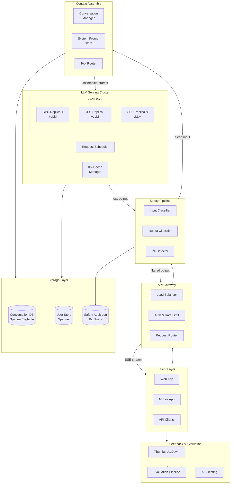
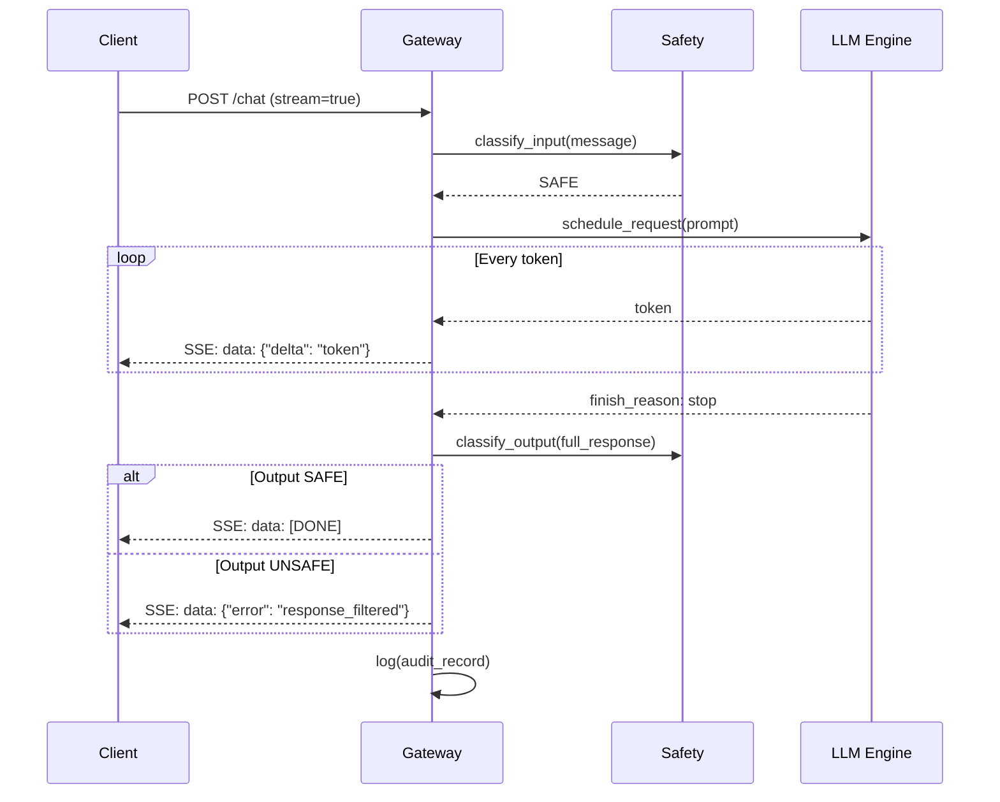
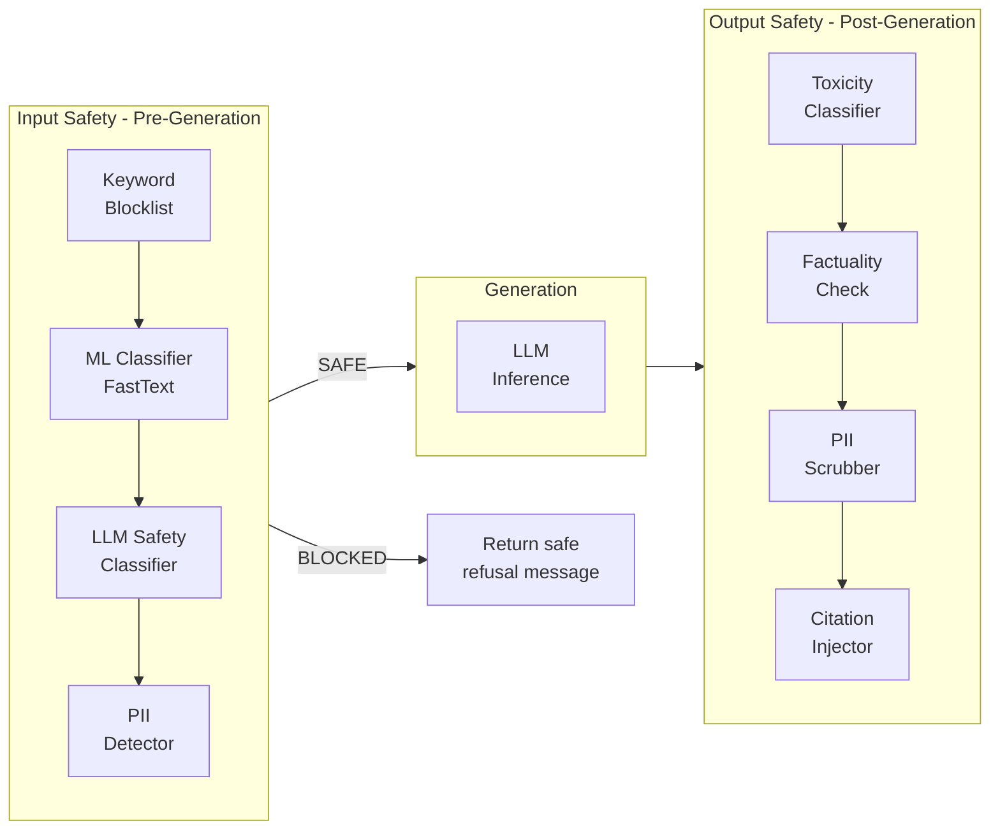
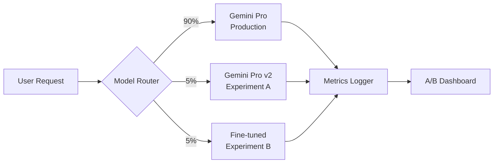
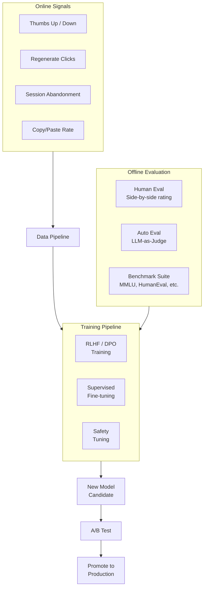

# Design an LLM-Powered Chatbot
{: .no_toc }

<details open markdown="block">
  <summary>Table of Contents</summary>
  {: .text-delta }
1. TOC
{:toc}
</details>

---

## What We're Building

A production-grade conversational AI chatbot — similar to Google Gemini, ChatGPT, or Claude — that serves millions of users with multi-turn dialogue, streaming responses, safety guardrails, and cost-efficient GPU serving.

**This is not "wrap an API."** We are designing the full system from scratch: model serving infrastructure, conversation management, safety pipeline, and the feedback loop that improves quality over time.

### Why This Problem Is Hard

| Challenge | Description |
|-----------|-------------|
| **GPU economics** | A single A100 costs ~$3/hr; a 70B model needs 4 GPUs per replica |
| **Latency** | Users expect first-token in < 500ms; full response in seconds |
| **Safety** | One toxic response = headline news. Zero-tolerance for harm |
| **Multi-turn context** | Must track conversation history efficiently (KV-cache grows linearly) |
| **Concurrency** | Batching autoregressive generation is fundamentally different from REST API batching |
| **Evaluation** | "Good response" is subjective — no single metric captures quality |

### Real-World Scale (Google Gemini-class)

| Metric | Scale |
|--------|-------|
| **Daily active users** | 100M+ |
| **Queries per day** | 500M+ |
| **Peak QPS** | ~20,000 |
| **Avg tokens per response** | 300–500 |
| **Model size** | 70B–540B parameters |
| **GPU fleet** | Thousands of TPUs/GPUs |
| **Regions** | 10+ global regions |

---

## Key Concepts Primer

### Autoregressive Generation

LLMs generate text **one token at a time**. Each token depends on all previous tokens.

```
Input:  "What is the capital of France?"
Step 1: "The"       (attend to input)
Step 2: "capital"   (attend to input + "The")
Step 3: "of"        (attend to input + "The capital")
Step 4: "France"    ...
Step 5: "is"        ...
Step 6: "Paris"     ...
Step 7: "."         ...
Step 8: <EOS>       (stop)
```

**Implication:** You cannot parallelize token generation for a single request. Throughput comes from **batching multiple requests**.

### KV-Cache

During generation, the model computes **Key** and **Value** tensors for every attention layer at every position. Re-computing these for each new token is wasteful.

```
Without KV-cache:  O(n²) compute per token (re-process entire sequence)
With KV-cache:     O(n) compute per token (only compute new token's attention)

Memory cost:
  KV-cache per token = 2 × num_layers × hidden_dim × 2 bytes (fp16)
  
  Llama-70B: 80 layers × 8192 hidden × 2 × 2 = ~2.5 MB per token
  At 4096 context: ~10 GB KV-cache per request
```

{: .warning }
> KV-cache memory is the primary bottleneck for LLM serving, not compute. This is why techniques like PagedAttention, KV-cache compression, and shorter contexts matter enormously.

### PagedAttention (vLLM)

Traditional KV-cache allocates a **contiguous block** for max sequence length, wasting memory for shorter sequences. PagedAttention borrows from OS virtual memory:

```
Traditional:  [████████████░░░░░░░░]  ← allocated for max_len, mostly wasted
PagedAttention: [██][██][██]           ← allocate pages on demand, non-contiguous

Benefits:
  - 2-4x more concurrent requests per GPU
  - Near-zero memory waste
  - Efficient memory sharing for beam search / parallel sampling
```

### Continuous Batching

Traditional batching waits for a batch to fill, then processes all requests together. But LLM requests have **variable lengths** — some finish in 10 tokens, others in 2000.

```
Static batching:
  Request A: [████████████████████████████████] 1000 tokens
  Request B: [██████████]░░░░░░░░░░░░░░░░░░░░░ 200 tokens (GPU idle after)
  Request C: [████████████████]░░░░░░░░░░░░░░░ 400 tokens (GPU idle after)
  
Continuous batching:
  Request A: [████████████████████████████████]
  Request B: [██████████]
  Request C: [████████████████]
  Request D:           [████████████████████████]  ← slots in when B finishes
  Request E:                   [████████████████]  ← slots in when C finishes
  
  GPU utilization: ~95% vs ~40%
```

### Speculative Decoding

Use a small "draft" model to generate candidate tokens, then verify them in parallel with the large model:

```
Draft model (1B):     generates 5 tokens fast  → [t1, t2, t3, t4, t5]
Target model (70B):   verifies all 5 in ONE forward pass
  Accept: [t1, t2, t3] ✓  (3 tokens verified in 1 step instead of 3)
  Reject: t4 ✗ → resample from target model distribution

Speedup: 2-3x with ~95% acceptance rate on typical text
```

---

## Step 1: Requirements Clarification

### Questions to Ask

| Question | Why It Matters |
|----------|----------------|
| What modalities? | Text-only vs multi-modal (images, code, files) |
| Max conversation length? | Determines KV-cache and context window needs |
| Latency budget? | Time-to-first-token vs tokens/second |
| Safety requirements? | Regulated industry? Children? General public? |
| Personalization? | Per-user memory? System prompts? |
| Cost target? | Per-query cost ceiling drives model size decisions |

### Functional Requirements

| Requirement | Priority | Description |
|-------------|----------|-------------|
| Multi-turn conversation | Must have | Maintain context across turns |
| Streaming responses | Must have | Token-by-token SSE delivery |
| Safety guardrails | Must have | Block harmful inputs/outputs |
| Conversation history | Must have | Persist and retrieve past sessions |
| System prompts | Should have | Configurable persona/instructions |
| Multi-modal input | Nice to have | Images, files, code |
| Tool/function calling | Nice to have | Web search, calculator, API calls |
| Response regeneration | Nice to have | User can request a different response |

### Non-Functional Requirements

| Requirement | Target | Rationale |
|-------------|--------|-----------|
| **Time-to-first-token** | < 500ms (P95) | User perceives responsiveness |
| **Streaming throughput** | > 30 tokens/sec | Faster than reading speed |
| **Availability** | 99.9% | Consumer product expectations |
| **Concurrent users** | 100K+ | Peak hours |
| **Cost per query** | < $0.01 (consumer) | Sustainability at scale |
| **Safety** | Zero harmful outputs | Regulatory and reputational |

### API Design

```python
# POST /v1/chat/completions (streaming)
{
    "model": "gemini-pro",
    "messages": [
        {"role": "system", "content": "You are a helpful assistant."},
        {"role": "user", "content": "Explain quantum computing"},
        {"role": "assistant", "content": "Quantum computing uses..."},
        {"role": "user", "content": "How does entanglement work?"}
    ],
    "stream": true,
    "temperature": 0.7,
    "max_tokens": 2048,
    "safety_settings": {
        "harassment": "BLOCK_MEDIUM_AND_ABOVE",
        "dangerous_content": "BLOCK_LOW_AND_ABOVE"
    }
}

# Response (SSE stream):
# data: {"id":"chatcmpl-abc","choices":[{"delta":{"content":"Quantum"},"index":0}]}
# data: {"id":"chatcmpl-abc","choices":[{"delta":{"content":" entanglement"},"index":0}]}
# ...
# data: {"id":"chatcmpl-abc","choices":[{"delta":{},"finish_reason":"stop"}]}
# data: [DONE]
```

---

## Step 2: Back-of-Envelope Estimation

### Traffic

```
Daily active users:           10M (mid-scale, not full Google)
Queries per user/day:          5
Total daily queries:          50M
QPS (average):                50M / 86,400 ≈ 580
QPS (peak, 5x):               ~3,000
```

### GPU Compute

```
Model: 70B parameters (fp16 = 140 GB, quantized int8 = 70 GB)
GPUs per replica:             2 × A100 (80GB) with int8 quantization

Avg input tokens:             200 (conversation context)
Avg output tokens:            400
Prefill time (200 tokens):    ~50ms on A100
Decode time (400 tokens):     400 / 40 tok/s = ~10s

With continuous batching (batch=32):
  Effective throughput:       ~40 requests/s per 2-GPU replica
  
Replicas for peak QPS:       3,000 / 40 = 75 replicas = 150 A100 GPUs

KV-cache per request:         ~2 GB (4096 context, 70B model)
KV-cache per GPU (batch=32):  ~64 GB → fits in 80 GB A100
```

### Storage

```
Conversation history:
  50M conversations/day × avg 2 KB = 100 GB/day
  30-day retention = 3 TB
  
User profiles:               10M × 1 KB = 10 GB
Safety audit logs:           50M × 0.5 KB = 25 GB/day
```

### Cost

```
GPU cost (150 A100s):         150 × $2.5/hr = $375/hr = $9,000/day
Cost per query:              $9,000 / 50M = $0.00018 per query ✓

With spot instances (60% discount):
  $3,600/day → $0.000072 per query
```

---

## Step 3: High-Level Design



### Component Responsibilities

| Component | Responsibility |
|-----------|---------------|
| **API Gateway** | Authentication, rate limiting, request routing, SSE management |
| **Safety Pipeline** | Input/output classification, PII detection, policy enforcement |
| **Conversation Manager** | Assemble conversation context, manage history, truncation |
| **LLM Serving Cluster** | GPU inference with continuous batching, KV-cache management |
| **Request Scheduler** | Queue management, priority, preemption, load balancing across GPUs |
| **Tool Router** | Dispatch function calls to external tools (search, calculator) |
| **Feedback System** | Collect thumbs up/down, route to RLHF training pipeline |

---

## Step 4: Deep Dive

### 4.1 Conversation Context Management

The most critical non-obvious component. With a 128K context window, naive approaches fail:

```python
class ConversationManager:
    """Assembles the prompt from conversation history, system prompt, and tools."""
    
    MAX_CONTEXT_TOKENS = 128_000
    RESERVED_FOR_OUTPUT = 4_096
    RESERVED_FOR_SYSTEM = 2_000
    
    def assemble_prompt(self, conversation_id: str, new_message: str) -> list[dict]:
        system_prompt = self.get_system_prompt(conversation_id)
        history = self.get_history(conversation_id)
        
        available_tokens = (
            self.MAX_CONTEXT_TOKENS 
            - self.RESERVED_FOR_OUTPUT 
            - self.RESERVED_FOR_SYSTEM 
            - self.count_tokens(new_message)
        )
        
        truncated_history = self._truncate_history(history, available_tokens)
        
        return [
            {"role": "system", "content": system_prompt},
            *truncated_history,
            {"role": "user", "content": new_message},
        ]
    
    def _truncate_history(self, history: list[dict], budget: int) -> list[dict]:
        """Keep most recent turns. Optionally summarize older turns."""
        result = []
        used = 0
        for msg in reversed(history):
            tokens = self.count_tokens(msg["content"])
            if used + tokens > budget:
                break
            result.insert(0, msg)
            used += tokens
        return result
    
    def _summarize_old_context(self, old_messages: list[dict]) -> str:
        """Use a smaller model to compress older conversation into a summary."""
        summary_prompt = f"Summarize this conversation concisely:\n{old_messages}"
        return self.summary_model.generate(summary_prompt, max_tokens=500)
```

**Strategies for long conversations:**

| Strategy | Pros | Cons |
|----------|------|------|
| **Sliding window** | Simple, predictable | Loses early context |
| **Summarize + window** | Retains key info | Summary may lose nuance |
| **Hierarchical compression** | Best retention | Complex, adds latency |
| **Retrieval from history** | Precise recall | Requires embedding + index |

### 4.2 Inference Engine (vLLM-style)

```python
import asyncio
from dataclasses import dataclass, field
from enum import Enum

class RequestState(Enum):
    WAITING = "waiting"
    RUNNING = "running"
    FINISHED = "finished"
    PREEMPTED = "preempted"


@dataclass
class InferenceRequest:
    request_id: str
    prompt_tokens: list[int]
    max_output_tokens: int
    temperature: float
    state: RequestState = RequestState.WAITING
    output_tokens: list[int] = field(default_factory=list)
    kv_cache_blocks: list[int] = field(default_factory=list)


class ContinuousBatchScheduler:
    """Scheduler implementing continuous batching with PagedAttention."""
    
    def __init__(self, max_batch_size: int, max_blocks: int, block_size: int = 16):
        self.max_batch_size = max_batch_size
        self.max_blocks = max_blocks
        self.block_size = block_size
        self.waiting_queue: list[InferenceRequest] = []
        self.running_batch: list[InferenceRequest] = []
        self.free_blocks: set[int] = set(range(max_blocks))
    
    def add_request(self, request: InferenceRequest):
        request.state = RequestState.WAITING
        self.waiting_queue.append(request)
    
    def schedule_step(self) -> list[InferenceRequest]:
        """Called every decode step to determine what runs next."""
        finished = [r for r in self.running_batch if self._is_finished(r)]
        for req in finished:
            self._free_kv_blocks(req)
            req.state = RequestState.FINISHED
        
        self.running_batch = [r for r in self.running_batch if r.state == RequestState.RUNNING]
        
        while (
            self.waiting_queue
            and len(self.running_batch) < self.max_batch_size
            and self._has_free_blocks(self.waiting_queue[0])
        ):
            req = self.waiting_queue.pop(0)
            self._allocate_kv_blocks(req)
            req.state = RequestState.RUNNING
            self.running_batch.append(req)
        
        if not self.running_batch and self.waiting_queue:
            victim = self._select_preemption_victim()
            if victim:
                self._preempt(victim)
        
        return self.running_batch
    
    def _is_finished(self, req: InferenceRequest) -> bool:
        return (
            len(req.output_tokens) >= req.max_output_tokens
            or (req.output_tokens and req.output_tokens[-1] == EOS_TOKEN)
        )
    
    def _has_free_blocks(self, req: InferenceRequest) -> bool:
        needed = (len(req.prompt_tokens) + self.block_size - 1) // self.block_size
        return needed <= len(self.free_blocks)
    
    def _allocate_kv_blocks(self, req: InferenceRequest):
        needed = (len(req.prompt_tokens) + self.block_size - 1) // self.block_size
        blocks = [self.free_blocks.pop() for _ in range(needed)]
        req.kv_cache_blocks = blocks
    
    def _free_kv_blocks(self, req: InferenceRequest):
        self.free_blocks.update(req.kv_cache_blocks)
        req.kv_cache_blocks = []
    
    def _select_preemption_victim(self) -> InferenceRequest | None:
        if not self.running_batch:
            return None
        return max(self.running_batch, key=lambda r: len(r.output_tokens))
    
    def _preempt(self, req: InferenceRequest):
        self._free_kv_blocks(req)
        req.state = RequestState.PREEMPTED
        self.running_batch.remove(req)
        self.waiting_queue.insert(0, req)


EOS_TOKEN = 2
```

### 4.3 Streaming Architecture



**Key design decisions for streaming:**

| Decision | Choice | Rationale |
|----------|--------|-----------|
| **Protocol** | Server-Sent Events (SSE) | Simpler than WebSocket; HTTP/2 compatible; sufficient for one-way streaming |
| **Buffering** | Token-level, no buffering | Users expect character-by-character; buffering adds perceived latency |
| **Output safety** | Post-hoc check after full response | Cannot classify safety mid-stream reliably; can revoke if unsafe |
| **Connection timeout** | 5 minutes | Long responses can take 30-60s; keep-alive for multi-turn |

### 4.4 Safety Pipeline



**Cascade design — fast filters first:**

```python
class SafetyPipeline:
    """Multi-stage safety pipeline. Fast checks first, expensive checks last."""
    
    def __init__(self):
        self.keyword_filter = KeywordBlocklist()       # ~0.1ms
        self.fast_classifier = FastTextClassifier()     # ~1ms
        self.llm_classifier = LLMSafetyClassifier()    # ~50ms
        self.pii_detector = PIIDetector()               # ~5ms
    
    async def classify_input(self, text: str) -> SafetyResult:
        if self.keyword_filter.contains_blocked(text):
            return SafetyResult(blocked=True, reason="keyword_match", stage="keyword")
        
        fast_score = await self.fast_classifier.predict(text)
        if fast_score > 0.95:
            return SafetyResult(blocked=True, reason="fast_classifier", stage="fast_ml")
        
        if fast_score > 0.5:
            llm_result = await self.llm_classifier.classify(text)
            if llm_result.is_unsafe:
                return SafetyResult(
                    blocked=True, reason=llm_result.category, stage="llm_classifier"
                )
        
        pii_result = self.pii_detector.scan(text)
        
        return SafetyResult(blocked=False, pii_entities=pii_result.entities)
    
    async def classify_output(self, text: str) -> SafetyResult:
        toxicity = await self.fast_classifier.predict(text)
        pii = self.pii_detector.scan(text)
        
        if toxicity > 0.8 or pii.has_critical:
            return SafetyResult(blocked=True, reason="output_safety")
        
        return SafetyResult(blocked=False)
```

**Safety categories (Google-style):**

| Category | Examples | Threshold |
|----------|----------|-----------|
| **Harassment** | Bullying, threats, hate speech | BLOCK_MEDIUM_AND_ABOVE |
| **Dangerous content** | Weapons instructions, self-harm | BLOCK_LOW_AND_ABOVE |
| **Sexually explicit** | Adult content | BLOCK_MEDIUM_AND_ABOVE |
| **Medical/Legal advice** | Specific diagnoses, legal counsel | Disclaimer injection |
| **PII exposure** | SSN, credit cards, addresses | Always scrub |

### 4.5 GPU Auto-Scaling

```python
class GPUAutoscaler:
    """Auto-scale GPU replicas based on queue depth and latency."""
    
    SCALE_UP_QUEUE_THRESHOLD = 100
    SCALE_DOWN_IDLE_SECONDS = 300
    MIN_REPLICAS = 10
    MAX_REPLICAS = 200
    COOLDOWN_SECONDS = 120
    
    def evaluate(self, metrics: ClusterMetrics) -> ScalingDecision:
        if metrics.avg_queue_depth > self.SCALE_UP_QUEUE_THRESHOLD:
            new_count = min(
                self.MAX_REPLICAS,
                metrics.current_replicas + max(1, metrics.current_replicas // 4),
            )
            return ScalingDecision(action="scale_up", target=new_count)
        
        if (
            metrics.avg_gpu_utilization < 0.3
            and metrics.idle_duration_seconds > self.SCALE_DOWN_IDLE_SECONDS
            and metrics.current_replicas > self.MIN_REPLICAS
        ):
            new_count = max(
                self.MIN_REPLICAS,
                int(metrics.current_replicas * 0.75),
            )
            return ScalingDecision(action="scale_down", target=new_count)
        
        return ScalingDecision(action="no_change", target=metrics.current_replicas)
```

**Key scaling signals:**

| Signal | Scale Up When | Scale Down When |
|--------|--------------|-----------------|
| **Queue depth** | > 100 pending requests | < 10 for 5 min |
| **TTFT P95** | > 1 second | Consistently < 200ms |
| **GPU memory utilization** | > 90% | < 30% for 5 min |
| **Time of day** | Pre-schedule for known peaks | Night hours in region |

### 4.6 Model Routing and A/B Testing



**Routing criteria:**

| Factor | Example |
|--------|---------|
| **User bucket** | Consistent hashing on user_id for sticky assignment |
| **Query complexity** | Route simple queries to smaller model; complex to larger |
| **Cost tier** | Free users → smaller model; paid users → flagship |
| **Region** | Route to nearest GPU cluster |
| **Capacity** | Overflow to secondary model during peak |

### 4.7 Conversation Storage Schema

```sql
-- Conversations table (Spanner)
CREATE TABLE conversations (
    conversation_id   STRING(36) NOT NULL,
    user_id           STRING(36) NOT NULL,
    title             STRING(256),
    model_id          STRING(64),
    system_prompt     STRING(MAX),
    created_at        TIMESTAMP NOT NULL,
    updated_at        TIMESTAMP NOT NULL,
    message_count     INT64,
    total_tokens      INT64,
) PRIMARY KEY (user_id, conversation_id);

-- Messages table (interleaved for locality)
CREATE TABLE messages (
    conversation_id   STRING(36) NOT NULL,
    user_id           STRING(36) NOT NULL,
    message_id        STRING(36) NOT NULL,
    role              STRING(16) NOT NULL,  -- "user", "assistant", "system"
    content           STRING(MAX),
    token_count       INT64,
    model_id          STRING(64),
    created_at        TIMESTAMP NOT NULL,
    safety_result     JSON,
    feedback          STRING(16),  -- "thumbs_up", "thumbs_down", null
    latency_ms        INT64,
) PRIMARY KEY (user_id, conversation_id, message_id),
  INTERLEAVE IN PARENT conversations ON DELETE CASCADE;
```

### 4.8 Evaluation and Feedback Loop



**Evaluation dimensions:**

| Dimension | How to Measure | Target |
|-----------|---------------|--------|
| **Helpfulness** | Human side-by-side, thumbs up rate | Win rate > 50% vs baseline |
| **Harmlessness** | Safety classifier, red-team attacks | 0 critical failures |
| **Honesty** | Factual accuracy, hallucination rate | > 90% factual |
| **Instruction following** | LLM-as-judge scoring | > 85% score |
| **Latency** | TTFT P50, P95, P99 | P95 < 500ms |
| **Cost** | $ per query | < $0.01 |

---

## Step 5: Scaling & Production

### Failure Handling

| Failure | Detection | Recovery |
|---------|-----------|----------|
| **GPU OOM** | KV-cache allocation fails | Preempt lowest-priority request, retry |
| **GPU hardware failure** | Health check timeout | Drain node, reschedule to healthy GPU |
| **Model loading failure** | Startup probe fails | Retry with exponential backoff; alert if 3 failures |
| **Safety pipeline down** | Circuit breaker trips | Fail closed (reject all requests); alert |
| **Conversation DB unavailable** | Connection timeout | Serve from cache; degrade to stateless mode |
| **Overload** | Queue depth > 1000 | Shed load: 429 with Retry-After; scale up |

### Monitoring Dashboard

| Metric | Alert Threshold |
|--------|----------------|
| **TTFT P95** | > 1s |
| **Token throughput** | < 20 tokens/s per replica |
| **GPU utilization** | > 95% for 5 min |
| **KV-cache utilization** | > 90% |
| **Safety block rate** | > 5% (indicates attack) |
| **Error rate** | > 1% |
| **Queue depth** | > 500 |

### Trade-offs

| Decision | Option A | Option B | Recommendation |
|----------|----------|----------|----------------|
| **Model size** | 7B (fast, cheap) | 70B (smarter) | 70B for flagship; 7B for cost-sensitive |
| **Quantization** | fp16 (accurate) | int8 (2x throughput) | int8 with quality validation |
| **Context strategy** | Truncate | Summarize old context | Summarize for conversations > 10 turns |
| **Safety timing** | Pre-generation only | Pre + post | Both (belt and suspenders) |
| **Streaming** | SSE | WebSocket | SSE (simpler; WebSocket only if bidirectional needed) |

---

## Interview Tips

{: .tip }
> **Google interviewers will probe these areas:**
> 1. "How do you handle a 100-turn conversation that exceeds context length?" — Summarization, retrieval from history
> 2. "What happens when GPU utilization hits 100%?" — Preemption, load shedding, queue management
> 3. "How do you evaluate if a response is good?" — Multi-dimensional eval, LLM-as-judge, human eval
> 4. "Walk me through the lifecycle of a single request" — Full path from client to GPU and back
> 5. "How do you keep cost under $0.01 per query?" — Quantization, speculative decoding, caching

**Common follow-up questions:**
- How would you add tool/function calling?
- How do you handle multi-modal inputs (images)?
- How would you implement a memory system across conversations?
- What changes for enterprise (on-prem, data residency)?
- How do you prevent prompt injection attacks?

---

## Hypothetical Interview Transcript

{: .note }
> This transcript simulates a 45-minute Google L5/L6 system design round. The interviewer is a Staff Engineer on the Gemini serving team.

---

**Interviewer:** Let's design a conversational AI chatbot — think Google Gemini or ChatGPT. Millions of users, real-time responses, the works. Where would you start?

**Candidate:** Before diving in, let me clarify requirements. Are we designing the full stack — model serving, conversation management, safety — or focusing on a specific part? Also, what scale are we targeting? And is this text-only or multi-modal?

**Interviewer:** Full stack. Let's say 10 million daily active users, 5 queries each. Text-only for now, but I'd like you to think about how multi-modal would change things later.

**Candidate:** Great. So 50 million queries per day, roughly 580 QPS average, peaking at maybe 3,000 QPS. Let me think about the model size — for Gemini-quality responses, we'd need at least a 70B parameter model. At fp16, that's 140 GB, so minimum 2 A100 80GB GPUs per replica. With int8 quantization, we could fit it on 2 GPUs comfortably.

Let me estimate GPU needs. With continuous batching, say we get about 40 requests per second per 2-GPU replica. For 3,000 peak QPS, we'd need about 75 replicas — 150 A100 GPUs. That's roughly $9,000 per day in GPU costs, which gives us about $0.00018 per query. Very feasible.

**Interviewer:** Good estimation. What about KV-cache? That's often the real bottleneck.

**Candidate:** Exactly right. For a 70B model with 80 layers, the KV-cache per token is about 2.5 MB. At a 4096-token context, that's roughly 10 GB per request. With a batch size of 32, we need about 320 GB of KV-cache memory. That's more than the model weights themselves.

This is where PagedAttention becomes critical. Instead of pre-allocating KV-cache for the maximum sequence length — which wastes 50-70% of memory — we allocate pages on demand, similar to virtual memory in operating systems. This can give us 2-4x more concurrent requests per GPU.

I'd use something like vLLM's architecture: pages of 16 tokens each, a block table mapping logical to physical blocks, and a free-list allocator. When a request finishes, its blocks are immediately recycled.

**Interviewer:** Walk me through what happens when a user sends a message in an ongoing conversation.

**Candidate:** Sure, let me trace the full request lifecycle:

1. **Client sends message** — POST to `/v1/chat/completions` with the conversation ID and `stream=true`.

2. **API Gateway** — authenticates the user, checks rate limits, opens an SSE connection back to the client.

3. **Conversation Manager** — fetches the conversation history from Spanner (or from a read-through cache). It assembles the full prompt: system prompt, conversation history, and the new message. If the history exceeds the context window, it truncates older messages, keeping the most recent turns. For very long conversations, I'd summarize older turns with a smaller, faster model.

4. **Input Safety** — before sending to the LLM, the message goes through a safety cascade: keyword blocklist (0.1ms), a FastText classifier (1ms), and for borderline cases, an LLM-based classifier (50ms). If blocked, we return a safe refusal message.

5. **Request Scheduler** — the assembled prompt enters the continuous batching scheduler. It tokenizes the prompt, checks if there's GPU capacity and free KV-cache blocks. If yes, it starts the prefill phase. If the cluster is at capacity, the request waits in a priority queue.

6. **Prefill** — the GPU processes all input tokens in parallel. For 200 input tokens on an A100, this takes about 50ms. This computes the KV-cache for all input positions.

7. **Decode** — the model generates tokens one at a time. Each token is immediately streamed back through the gateway as an SSE event. At ~40 tokens/second, a 400-token response takes about 10 seconds.

8. **Output Safety** — after generation completes, the full response is checked by the output safety classifier. If it fails, we send a filtered message to the client. This is a tradeoff — we can't check mid-stream reliably.

9. **Persist** — the assistant message is saved to Spanner asynchronously. Safety audit logs go to BigQuery.

**Interviewer:** You mentioned summarizing older turns. How would you handle a user who has a 100-turn conversation?

**Candidate:** This is one of the trickiest parts. Let me outline three approaches in increasing sophistication:

**Approach 1: Sliding window.** Keep the last N turns that fit in the context. Simple, but you lose earlier context. The user says "as I mentioned earlier" and the model has no idea.

**Approach 2: Summarize + window.** After every K turns (say 10), run a smaller model to compress older turns into a 200-token summary. The prompt becomes: [system prompt] [summary of turns 1-80] [full turns 81-100] [new message]. This preserves key facts while staying within the window.

**Approach 3: Retrieval from history.** Embed each message and store in a vector index. When assembling the prompt, retrieve the most relevant past messages based on semantic similarity to the current query. This handles "what did we discuss about databases?" even if it was 50 turns ago.

For production, I'd recommend Approach 2 as the default, with Approach 3 as an enhancement for power users. The summary model can be a fast 7B model — the latency hit is about 200ms, which we can absorb in the prefill phase.

**Interviewer:** Good. Let's talk about safety. How do you prevent the model from generating harmful content?

**Candidate:** I think of safety as defense-in-depth — multiple layers, each catching different things:

**Layer 1: Input filtering.** Before generation even starts. A cascade of increasingly expensive classifiers — keyword blocklist (microseconds), FastText (1ms), and for ambiguous cases, an LLM classifier (50ms). This catches obvious prompt injection, requests for harmful content, and adversarial attacks. About 99% of clearly harmful inputs are caught here.

**Layer 2: System prompt / constitutional instructions.** The model's system prompt includes safety guidelines. This is the model's "conscience" — it's been RLHF-trained to follow these.

**Layer 3: Output filtering.** After generation, classify the full response for toxicity, PII, and policy violations. If it fails, replace with a safe refusal. This catches cases where the input looked benign but the model produced something harmful.

**Layer 4: PII scrubbing.** Always scan outputs for SSNs, credit card numbers, phone numbers using regex + NER models. Never let PII through.

**Layer 5: Audit logging.** Log every input/output pair to BigQuery for offline analysis. A separate safety team reviews flagged interactions daily.

The tradeoff: more safety layers = more latency + more false positives (blocking legitimate queries). We'd A/B test safety thresholds to find the sweet spot. For a consumer product, I'd err on the side of blocking — a false positive is a minor inconvenience; a false negative can be a PR disaster.

**Interviewer:** How would you evaluate whether your chatbot is actually good?

**Candidate:** Evaluation is multi-dimensional. No single metric captures "good."

**Online metrics** — things we measure in production:
- Thumbs up/down rate (our primary online signal)
- Regeneration rate (user asked for a different answer — implies dissatisfaction)
- Session length and return rate
- Copy/paste rate (user found the response useful enough to copy)

**Offline evaluation:**
- Human side-by-side evaluation (Elo rating): show two responses from different models, human picks the better one. This is our gold standard.
- LLM-as-judge: use a strong model (GPT-4 or Gemini Ultra) to score responses on helpfulness, accuracy, and safety. Cheaper than humans, correlates ~85% with human judgment.
- Benchmark suites: MMLU for knowledge, HumanEval for coding, TruthfulQA for factuality. These track regression, not absolute quality.

**The feedback loop:** thumbs down responses are candidates for RLHF/DPO training data. We'd pair the rejected response with a preferred response (either human-written or from a better model run), then use DPO to update the model weekly.

**Interviewer:** Last question — if I told you the cost needs to drop by 5x, what would you do?

**Candidate:** Several levers, from least to most disruptive:

1. **Quantization** — move from fp16 to int4 (GPTQ/AWQ). This halves GPU memory, roughly doubling throughput. Quality loss is typically < 2% on benchmarks for a 70B model.

2. **Speculative decoding** — use a 1B draft model to generate 4-5 candidate tokens, verify them in one forward pass of the 70B model. This gives 2-3x speedup with identical output quality.

3. **Prompt caching** — for repeated system prompts and common conversation patterns, cache the KV-cache of the prefix. Saves prefill compute for every request with the same system prompt.

4. **Semantic caching** — for near-duplicate queries ("what is the capital of France" vs "capital of France?"), return cached responses. Maybe 10-15% cache hit rate.

5. **Model distillation** — train a smaller 7B model on the 70B model's outputs for common query types. Route simple queries (greetings, factual Q&A) to the 7B model, complex queries to 70B. If 60% of queries can use the small model, that's a 3-4x cost reduction.

6. **Spot/preemptible instances** — use cloud spot instances for non-critical traffic (free tier users). 60-70% cost savings with the risk of preemption — mitigated by having some on-demand capacity as a floor.

I'd start with quantization and speculative decoding (easy wins, no quality loss), then invest in model distillation for the biggest long-term savings.

**Interviewer:** Excellent. Great depth on the inference optimization and safety design. Let's wrap up.
