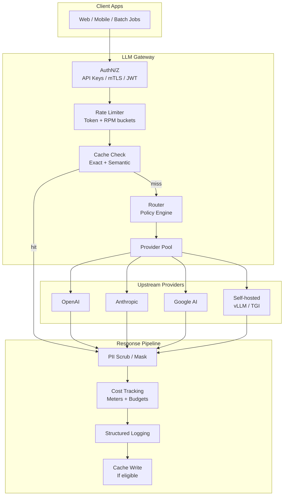

# Design an LLM Gateway / AI Proxy
{: .no_toc }

<details open markdown="block">
  <summary>Table of Contents</summary>
  {: .text-delta }
1. TOC
{:toc}
</details>

---

## What We're Building

Design an **LLM gateway** (also called an **AI proxy**): a control plane that sits between your applications and one or more **LLM providers**. It is not “just HTTP forwarding.” It is an **API gateway specialized for generative traffic** — the same way a payment gateway understands cards, fraud, and settlement, an LLM gateway understands **tokens, models, safety, cost, and compliance**.

**What the gateway owns end-to-end:**

| Concern | What “good” looks like |
|---------|------------------------|
| **Unified API** | One contract for apps; swap vendors without rewrites |
| **Routing** | Pick model/provider by policy: cost, latency, capability |
| **Semantic caching** | Reuse answers for *similar* prompts, not only identical strings |
| **Rate limiting** | Fairness and blast-radius control in **token** units, not just HTTP QPS |
| **Fallback** | Degrade gracefully when a vendor errors, rate-limits, or degrades |
| **Cost & chargeback** | Per-tenant spend, budgets, attribution to products/teams |
| **Observability** | Latency, errors, cache hits, $/1K tokens — with PII-safe logs |

### Why It Matters (Interview Framing)

| Stakeholder | Pain without a gateway | What the gateway fixes |
|-------------|------------------------|-------------------------|
| **Product engineering** | N provider SDKs, divergent schemas | One client, stable interface |
| **FinOps / leadership** | Surprise cloud bills | Budgets, alerts, chargeback |
| **Security / compliance** | Prompts leak PII to logs & vendors | Scrubbing, retention, audit trail |
| **SRE / platform** | Cascading vendor outages | Circuit breakers, failover, SLO dashboards |
| **ML / applied science** | No A/B routing between models | Policy engine + experimentation hooks |

### Real-World Examples

| Example | Role |
|---------|------|
| **[LiteLLM](https://github.com/BerriAI/litellm)** | Open-source proxy with unified interface and provider routing |
| **[Portkey](https://portkey.ai/)** | Gateway with observability, guardrails, and multi-provider routing |
| **Internal proxies (Google, Meta, large banks)** | Central governance: keys, policy, spend caps, logging — often *mandatory* for production |

{: .note }
> In interviews, treat the gateway as **policy + economics + reliability** for LLM traffic. The HTTP path is the easy part; **tokens, embeddings, streaming, and compliance** are the differentiators.

---

## Key Concepts Primer

### Semantic Caching

**Exact-match caching** keys on the full prompt string. **Semantic caching** keys on **meaning**: embed the request (or a canonical representation), search a vector index for **near-duplicates**, and return a cached completion when similarity exceeds a threshold.

| Aspect | Detail |
|--------|--------|
| **Why** | Paraphrases and template-filled prompts repeat “the same question” constantly |
| **Trade-off** | Risk of returning a wrong cached answer if similarity is too loose |
| **Mitigation** | Similarity threshold, TTL, tenant isolation, optional “soft hit” with disclaimer |

### Model Routing

**Model routing** selects *which* model and *which* provider serves a request under constraints:

- **Cost vs quality**: cheaper model for low-risk tasks; frontier model for high-stakes generation  
- **Latency SLA**: route to regionally close endpoints or smaller models when p99 matters  
- **Capability matching**: tool-use, JSON mode, long context, multilingual — route to models that actually support the feature  
- **Load balancing**: spread traffic across keys, accounts, or replicas to avoid hot partitions  

Often implemented as a **routing policy engine** (YAML/OPA rules + weights + experiments).

### Fallback Chains

A **fallback chain** defines order: **primary → secondary → tertiary** provider/model. Triggers include HTTP 5xx, 429, timeout, empty response, or policy violations. Combine with **per-provider circuit breakers** so you do not hammer a sick endpoint.

### Token-Level Rate Limiting

Providers rate-limit in **tokens per minute (TPM)** and **requests per minute (RPM)**. A gateway should enforce **tenant budgets in token units** (and optionally request counts), because two “one request” calls can differ by 100× in tokens.

### Prompt/Response Logging and PII Scrubbing

Production systems log for **debugging, audit, and cost attribution**. Raw prompts often contain **PII** (emails, phone numbers, names, IDs). The gateway applies **detection + masking** *before* persistence or export, with **retention policies** and **access controls** for security/compliance teams.

### Cost Attribution and Chargeback

Every request should carry **tenant** (and optionally **team, product, environment**). The gateway records **provider, model, input/output tokens**, applies **list or negotiated pricing**, and aggregates for **chargeback** dashboards and **budget alerts**.

---

## Step 1: Requirements

### Functional Requirements

| ID | Requirement | Notes |
|----|-------------|-------|
| **F1** | **Unified API** across providers (OpenAI, Anthropic, Google, self-hosted) | Normalize schemas, errors, streaming |
| **F2** | **Intelligent routing** by policy (cost, latency, capability, experiments) | Pluggable rules; safe defaults |
| **F3** | **Semantic caching** for eligible prompts | Opt-in per route; tenant-isolated keys |
| **F4** | **Rate limiting per tenant** in token (and request) dimensions | Burst + sustained; optional per-model limits |
| **F5** | **Fallback** on provider failure / saturation | Configurable chains; idempotency where possible |
| **F6** | **Cost tracking and budgets** | Real-time counters; soft/hard enforcement |
| **F7** | **Prompt/response logging** with **PII detection** | Redact before storage; configurable verbosity |

### Non-Functional Requirements

| NFR | Target | Rationale |
|-----|--------|-----------|
| **Added latency (gateway overhead)** | **&lt; 20 ms** p99 on cache miss, excluding upstream LLM time | Apps already pay TTFT + generation; gateway must stay “in the noise” |
| **Availability** | **99.99%** for the gateway control plane | Degraded mode: passthrough or cached responses where safe |
| **Throughput** | **10K req/s** aggregate | Horizontal scale; stateless request path where possible |

{: .warning }
> **Clarify in the interview:** “10K req/s” is **gateway requests**, not 10K concurrent GPU streams. Upstream provider limits still cap *effective* throughput; the gateway’s job is to **shape, route, and fail gracefully**.

---

## Step 2: Estimation

### Request Volume (Illustrative)

Assume **10K req/s** peak gateway traffic, **50%** of traffic eligible for semantic cache, **40%** semantic hit rate on eligible traffic (tuned conservatively).

| Quantity | Formula | Result |
|----------|---------|--------|
| Peak RPS | Given | 10,000/s |
| Cache-eligible RPS | 50% × 10K | 5,000/s |
| Semantic hits | 40% × 5K | 2,000/s |
| Upstream LLM calls (approx.) | 10K − 2K | **8,000/s** |

### Token Costs Across Providers (Order-of-Magnitude)

Pricing moves constantly; use **relative** reasoning in interviews. Example **blended** assumptions for rough monthly math:

| Assumption | Value |
|------------|-------|
| Avg input tokens / request | 1,500 |
| Avg output tokens / request | 500 |
| Mix | 70% “cheap” route @ $0.50 / 1M in + $1.50 / 1M out; 30% “premium” @ 3× |

Rough **effective $/request** stays in **fractions of a cent to a few cents** at this token mix — which is why **routing + caching** matter at scale.

### Cache Hit Rates

| Cache tier | Expected hit rate (indicative) | When it helps most |
|------------|-------------------------------|-------------------|
| Exact match (normalized prompt hash) | 5–20% | Templated ops, repeated system prompts |
| Semantic (ANN on embeddings) | 15–40% (if eligible) | Support bots, FAQs, internal assistants |

### Storage for Logs

| Input | Example |
|-------|---------|
| Metadata per request | ~1–4 KB (ids, model, tokens, latency, route decisions) |
| Redacted prompt/response snippets | 0–32 KB depending on policy |
| Daily requests (10K/s peak ≠ flat 24h) | Use **average RPS × day**; e.g. **~500M–1B** events/day at high sustained load |

At **2 KB average** per log event → **~1–2 TB/day** raw — requires **tiered storage** (hot Kafka/Clickhouse, cold object store), **sampling** for debug logs, and **PII minimization**.

---

## Step 3: High-Level Design

### Architecture (Mermaid)



### Request Path (Narrative)

1. **Authenticate** the caller → resolve **tenant**, quotas, and routing profile.  
2. **Rate limit** using token estimates (pre-count with cheap tokenizer) + request count.  
3. **Cache lookup**: exact key first, then semantic ANN if enabled.  
4. **Route** to a provider/model using policy (cost, SLA, capability).  
5. **Execute** with timeouts, retries, and fallback chain.  
6. **Response pipeline**: scrub PII, meter costs, emit logs, **write cache** for eligible responses.

---

## Step 4: Deep Dive

### 4.1 Unified API Layer

**Goal:** Expose **one** internal API (`POST /v1/chat/completions` style) and **adapt** to OpenAI, Anthropic Messages, Google Generative AI, and self-hosted OpenAI-compatible servers.

**Design points:**

- **Message normalization** — map `system/user/assistant/tool` roles to a canonical list; strip unsupported fields per provider.  
- **Streaming translation** — consume provider SSE/WebSocket deltas; re-emit a **single** gateway SSE format.  
- **Tool/function call normalization** — align JSON schemas; map `tool_calls` IDs across turns; handle parallel tool calls.  

```python
from __future__ import annotations

from dataclasses import dataclass, field
from enum import Enum
from typing import Any, AsyncIterator, Literal


class Role(str, Enum):
    SYSTEM = "system"
    USER = "user"
    ASSISTANT = "assistant"
    TOOL = "tool"


@dataclass
class ToolSpec:
    name: str
    description: str
    parameters: dict[str, Any]  # JSON Schema subset


@dataclass
class UnifiedMessage:
    role: Role
    content: str
    tool_call_id: str | None = None
    tool_calls: list[dict[str, Any]] | None = None


@dataclass
class UnifiedRequest:
    tenant_id: str
    model_hint: str | None
    messages: list[UnifiedMessage]
    tools: list[ToolSpec] = field(default_factory=list)
    stream: bool = False
    temperature: float | None = None
    max_tokens: int | None = None
    metadata: dict[str, str] = field(default_factory=dict)


class ProviderAdapter:
    """Translate UnifiedRequest / stream chunks for a concrete provider."""

    name: str

    def estimate_tokens(self, req: UnifiedRequest) -> int:
        """Cheap heuristic or tiktoken-like encoder for rate limiting."""
        joined = "\n".join(m.content for m in req.messages)
        return max(1, len(joined) // 4)

    def to_provider_payload(self, req: UnifiedRequest) -> dict[str, Any]:
        raise NotImplementedError

    async def stream(
        self, req: UnifiedRequest
    ) -> AsyncIterator[dict[str, Any]]:
        """Yield normalized delta events: {'type':'delta','text':...} or tool deltas."""
        raise NotImplementedError
        yield  # pragma: no cover - async generator


class OpenAICompatAdapter(ProviderAdapter):
    name = "openai_compat"

    def to_provider_payload(self, req: UnifiedRequest) -> dict[str, Any]:
        return {
            "model": req.model_hint,
            "messages": [
                {
                    "role": m.role.value,
                    "content": m.content,
                    **({"tool_calls": m.tool_calls} if m.tool_calls else {}),
                    **({"tool_call_id": m.tool_call_id} if m.tool_call_id else {}),
                }
                for m in req.messages
            ],
            "tools": [{"type": "function", "function": t.__dict__} for t in req.tools],
            "stream": req.stream,
            "temperature": req.temperature,
            "max_tokens": req.max_tokens,
        }


def merge_tool_streams(
    events: list[dict[str, Any]],
) -> list[dict[str, Any]]:
    """Example hook: normalize parallel tool_call deltas per provider quirks."""
    return events
```

{: .tip }
> Mention **idempotency keys** for mutating side-effects (rare in pure completion) and **request fingerprinting** for deduplication — interviewers like operational maturity.

---

### 4.2 Intelligent Model Routing

**Route dimensions:**

| Dimension | Example signal | Action |
|-----------|----------------|--------|
| **Cost optimization** | `tenant_tier=basic` | Prefer small / open-weight endpoints |
| **Latency SLA** | `deadline_ms=800` | Route to closest region + smaller model |
| **Capability** | `tools.nonempty` | Only models with verified tool support |
| **Load balancing** | per-key RPM pressure | Choose key with headroom |
| **Experiments** | A/B flag | 5% traffic to challenger model |

```python
from dataclasses import dataclass
from typing import Protocol


@dataclass(frozen=True)
class RouteTarget:
    provider: str
    model: str
    region: str
    credential_ref: str  # vault pointer, not raw secret


class RoutingContext:
    def __init__(self, tenant_id: str, sla_ms: int | None, features: set[str]):
        self.tenant_id = tenant_id
        self.sla_ms = sla_ms
        self.features = features


class RoutingPolicyEngine(Protocol):
    def select(self, req: UnifiedRequest, ctx: RoutingContext) -> RouteTarget: ...


class DefaultPolicyEngine:
    """Ordered rules: constraints first, then cost, then latency."""

    def __init__(self, rules: list[dict]):
        self.rules = rules

    def select(self, req: UnifiedRequest, ctx: RoutingContext) -> RouteTarget:
        if "tools" in ctx.features and req.tools:
            return RouteTarget(
                provider="anthropic",
                model="claude-3-5-sonnet-20241022",
                region="us-central1",
                credential_ref="vault://anthropic/prod",
            )
        if ctx.sla_ms is not None and ctx.sla_ms < 1000:
            return RouteTarget(
                provider="gcp_vertex",
                model="gemini-1.5-flash-001",
                region="us-east1",
                credential_ref="vault://gcp/vertex",
            )
        return RouteTarget(
            provider="openai",
            model="gpt-4o-mini",
            region="us-east-1",
            credential_ref="vault://openai/prod",
        )
```

---

### 4.3 Semantic Caching

**Pipeline:** canonicalize prompt → **embed query** (same or smaller embedding model) → **ANN search** (FAISS, ScaNN, pgvector) → if **score ≥ threshold**, return cached completion; else miss.

**Invalidation:** TTL (e.g. 24h), explicit version bumps for policy/model changes, **per-tenant** namespaces.

```python
import hashlib
import time
from dataclasses import dataclass


@dataclass
class CacheEntry:
    embedding: list[float]
    completion: str
    model: str
    created_ts: float
    ttl_sec: int


class SemanticCache:
    def __init__(self, embedder, index, similarity_threshold: float = 0.92):
        self.embedder = embedder
        self.index = index
        self.similarity_threshold = similarity_threshold

    def _canonical_key(self, tenant_id: str, messages: list[UnifiedMessage]) -> str:
        body = "\n".join(f"{m.role}:{m.content}" for m in messages)
        digest = hashlib.sha256(body.encode("utf-8")).hexdigest()
        return f"{tenant_id}:{digest}"

    async def lookup(self, tenant_id: str, req: UnifiedRequest) -> str | None:
        key = self._canonical_key(tenant_id, req.messages)
        if exact := await self.index.get_exact(key):
            return exact.completion

        q_emb = await self.embedder.encode(req.messages[-1].content)
        neighbors = await self.index.ann_search(q_emb, top_k=5, namespace=tenant_id)
        best = neighbors[0] if neighbors else None
        if best and best.score >= self.similarity_threshold:
            if self._fresh(best.entry):
                return best.entry.completion
        return None

    def _fresh(self, entry: CacheEntry) -> bool:
        return (time.time() - entry.created_ts) < entry.ttl_sec

    async def maybe_store(
        self,
        tenant_id: str,
        req: UnifiedRequest,
        completion: str,
        model: str,
    ) -> None:
        if req.stream:
            return  # often skip or buffer with care
        emb = await self.embedder.encode(req.messages[-1].content)
        entry = CacheEntry(
            embedding=emb,
            completion=completion,
            model=model,
            created_ts=time.time(),
            ttl_sec=86_400,
        )
        await self.index.upsert(
            namespace=tenant_id, key=self._canonical_key(tenant_id, req.messages), entry=entry
        )
```

**Partial match scoring:** combine **cosine similarity** with **metadata gates** (same `model family`, same `tool` presence) to avoid wrong answers.

---

### 4.4 Rate Limiting and Cost Control

Use **token bucket** or **leaky bucket** per tenant per window, separately for **input** and **output** if needed. **Budgets** live in a low-latency store (Redis) with periodic sync to billing warehouse.

```python
import time
from dataclasses import dataclass


@dataclass
class TenantBudget:
    tenant_id: str
    max_tokens_per_minute: int
    max_requests_per_minute: int
    monthly_usd_cap: float


class TokenRateLimiter:
    def __init__(self, redis):
        self.r = redis

    def _keys(self, tenant_id: str) -> tuple[str, str]:
        minute = int(time.time() // 60)
        return (
            f"rl:tokens:{tenant_id}:{minute}",
            f"rl:reqs:{tenant_id}:{minute}",
        )

    def allow(self, tenant: TenantBudget, estimated_tokens: int) -> bool:
        tk_key, rq_key = self._keys(tenant.tenant_id)
        pipe = self.r.pipeline()
        pipe.incrby(tk_key, estimated_tokens)
        pipe.expire(tk_key, 120)
        pipe.incr(rq_key)
        pipe.expire(rq_key, 120)
        token_count, _, req_count, _ = pipe.execute()

        if token_count > tenant.max_tokens_per_minute:
            return False
        if req_count > tenant.max_requests_per_minute:
            return False
        return True


class CostTracker:
    def __init__(self, pricebook: dict[tuple[str, str], tuple[float, float]]):
        """
        pricebook[(provider,model)] = (usd_per_1k_input, usd_per_1k_output)
        """
        self.pricebook = pricebook

    def usd(self, provider: str, model: str, in_tok: int, out_tok: int) -> float:
        pin, pout = self.pricebook.get((provider, model), (0.0, 0.0))
        return (in_tok / 1000.0) * pin + (out_tok / 1000.0) * pout
```

**Alerts:** asynchronous workers compare **rolling spend** vs **budget** → Slack/PagerDuty **soft warn** at 80%, **hard block** at 100% if policy requires.

---

### 4.5 Fallback and Resilience

**Patterns:**

- **Circuit breaker** per provider/region: open after error rate &gt; threshold.  
- **Automatic failover** to next hop in chain when breaker open or HTTP 429/5xx.  
- **Retries** with exponential backoff + jitter only for **idempotent** safe failures (not for partial streams without resume tokens).  
- **Health scoring** from rolling latency/error metrics to deprioritize unhealthy endpoints.

```python
import random
import time
from dataclasses import dataclass
from enum import Enum


class BreakerState(str, Enum):
    CLOSED = "closed"
    OPEN = "open"
    HALF_OPEN = "half_open"


@dataclass
class CircuitBreaker:
    failure_threshold: int = 5
    cool_down_sec: int = 30
    failure_count: int = 0
    opened_at: float | None = None
    state: BreakerState = BreakerState.CLOSED

    def record_success(self) -> None:
        self.failure_count = 0
        self.state = BreakerState.CLOSED
        self.opened_at = None

    def record_failure(self) -> None:
        self.failure_count += 1
        if self.failure_count >= self.failure_threshold:
            self.state = BreakerState.OPEN
            self.opened_at = time.time()

    def allow(self) -> bool:
        if self.state == BreakerState.CLOSED:
            return True
        assert self.opened_at is not None
        if time.time() - self.opened_at > self.cool_down_sec:
            self.state = BreakerState.HALF_OPEN
            return True
        return False


def exp_backoff_sleep(attempt: int, base_ms: int = 50, cap_ms: int = 2000) -> None:
    sleep_ms = min(cap_ms, base_ms * 2**attempt)
    time.sleep(sleep_ms / 1000.0 + random.random() * 0.05)
```

---

### 4.6 Observability and Compliance

**Telemetry:** structured logs with `trace_id`, `tenant_id`, `provider`, `model`, `route_policy_id`, `cache_status` (`hit_exact`, `hit_semantic`, `miss`), `latency_ms`, `in_tokens`, `out_tokens`, `usd_estimate`.

**PII:** run **NER/regex + LLM-assisted classifiers** in an async path for full payloads; **always** run fast regex for obvious patterns on the hot path.

```python
import re
from dataclasses import dataclass


@dataclass
class PIIMatch:
    label: str
    start: int
    end: int


class PIIDetector:
    EMAIL = re.compile(r"\b[\w.+-]+@[\w.-]+\.[A-Za-z]{2,}\b")

    def detect(self, text: str) -> list[PIIMatch]:
        matches: list[PIIMatch] = []
        for m in self.EMAIL.finditer(text):
            matches.append(PIIMatch("EMAIL", m.start(), m.end()))
        return matches

    def mask(self, text: str) -> str:
        def repl(m: re.Match[str]) -> str:
            return "[EMAIL]"

        return self.EMAIL.sub(repl, text)


@dataclass
class AuditRecord:
    trace_id: str
    tenant_id: str
    provider: str
    model: str
    tokens_in: int
    tokens_out: int
    usd: float
    cache: str
    prompt_redacted: str
    completion_redacted: str
```

**Dashboards:** p50/p95/p99 **gateway overhead**, **$/1K tokens** by tenant, **error budget** per provider, **cache hit ratio**, **breaker open time**.

---

## Step 5: Scaling & Production

### Failure Handling

| Failure | Mitigation |
|---------|------------|
| Gateway region down | Multi-region active-active; DNS / anycast; sticky sessions not required if stateless |
| Redis / limiter down | Fail-open vs fail-closed per tenant class; local in-memory soft limits |
| Embedding service slow | Async semantic cache off hot path; degrade to exact-only |
| Provider hard outage | Circuit breaker + fallback chain; queue batch jobs if async acceptable |

### Monitoring & SLOs

- **SLO:** p99 gateway overhead &lt; 20 ms (excluding LLM).  
- **Error budget** on 5xx from gateway itself vs provider errors (tag separately).  
- **Synthetic probes** per provider/model every minute.

### Trade-Offs (What Interviewers Expect)

| Choice | Upside | Downside |
|--------|--------|----------|
| **Strong semantic cache** | Huge $ savings | Stale or wrong answers if thresholds sloppy |
| **Aggressive PII scrubbing** | Compliance | Possible information loss for debugging |
| **Fail-closed on budget overage** | Cost control | Product friction — need soft limits |
| **Rich logs** | Great audits | Storage cost; needs sampling & retention tiers |

---

## Hypothetical Interview Transcript

**Setting:** 45-minute system design loop. **Candidate** (L5/L6). **Interviewer:** **Alex**, Staff Engineer on **Cloud AI Platform**.

---

**Alex:** Today I want you to design an **LLM gateway** — the thing teams hit instead of calling OpenAI or Vertex directly. Think multi-tenant, many apps, many models. Where do you start?

**Candidate:** I’d clarify **tenants**, **traffic**, **compliance**, and whether we need **unified billing**. At a high level I’d place a **stateless gateway** in front of providers with **auth**, **rate limiting**, **routing**, **caching**, and a **response pipeline** for **PII** and **cost**. I’d draw the data plane vs control plane: runtime path stays hot; policies and pricebooks update asynchronously.

**Alex:** How do you unify APIs without drowning in glue code?

**Candidate:** I’d define a **canonical request** — messages, tools, stream flag — and implement **adapters** per provider behind an interface. Streaming is the hard part: normalize **delta events**, buffer **tool call fragments**, and expose **one SSE format** to clients. I’d version the unified API so we can evolve without breaking apps.

**Alex:** Talk about **routing**. Why not always use the best model?

**Candidate:** “Best” is not just quality — it’s **cost**, **latency**, and **capabilities**. I’d use a **policy engine**: constraints first — e.g. if tools are requested, only models that support tools with acceptable reliability. Then optimize for **$/token** within an SLA window. For global services, **region** matters for latency. I’d also support **experiments** — route a slice of traffic to a challenger model with guardrails.

**Alex:** How does **semantic caching** work, and when is it dangerous?

**Candidate:** We embed a **canonical representation** of the user message or the full prompt, search **ANN** for neighbors above a **similarity threshold**, and return the cached completion on hit. Risks: **false positives** — similar wording but different required answer. Mitigations: **higher threshold**, **TTL**, **namespace per tenant**, and **disable** caching for regulated intents. Optionally return **soft hits** with a banner — usually product-specific.

**Alex:** Rate limiting: RPS isn’t enough, right?

**Candidate:** Correct — providers meter **TPM** and **RPM**. I’d do **token buckets per tenant**, using a **cheap tokenizer** for pre-counting. Burst traffic should consume **burst allowance** but still respect **sustained** TPM. For **cost**, I’d track **USD** from a **pricebook** and enforce **monthly budgets** with alerts.

**Alex:** Provider goes hard 500 — what happens?

**Candidate:** **Retries** with backoff for safe, idempotent failures. For streaming, retries are trickier — you may need **non-streaming fallback** or **replay from checkpoint** if the product allows. Longer term: **circuit breaker** per provider/region, **failover chain**, and **health scores** from synthetic checks. We should **tag errors** so SLOs distinguish gateway bugs from vendor outages.

**Alex:** Compliance — logs are full of secrets and PII.

**Candidate:** **Minimize retention** by default — structured metadata always; **payload logging** opt-in. On the hot path, run **fast detectors** for emails/tokens; heavier ML/LLM classifiers async. **Role-based access** to raw traces. For EU data, **region pinning** and **DPA** with each provider when payloads leave our boundary.

**Alex:** How do you hit **&lt;20 ms p99** overhead at 10K RPS?

**Candidate:** Keep the gateway **stateless** — limiter checks via **Redis** with pipeline batching, **connection pooling** to providers, **zero-copy** where possible, and **avoid heavy JSON** on hot path. Semantic cache: **ANN** on a separate service; optionally **exact-only** in-process LRU for hottest keys. Measure with **distributed tracing** — break out **auth**, **router**, **cache**, **serialization**.

**Alex:** Last trade-off question: would you ever **terminate TLS** inside the gateway vs pass-through?

**Candidate:** For a real gateway, **terminate at the edge** / gateway for **inspection, policy, and WAF**. Re-encrypt to providers. Pass-through TLS **blinds** you to content for policy — rarely acceptable for enterprise. If needed, use **mTLS** to providers and strict **cipher suites**.

**Alex:** Good. In production I’d want to see **runbooks** for provider brownouts, **load tests** on cache stampede, and **FinOps dashboards** per tenant. That’s time — any questions for me?

**Candidate:** How do you balance **central governance** vs **team autonomy** for routing policies?

**Alex:** We usually give **safe defaults** and let teams **override within guardrails** — cap max spend, approved model lists, and required **data residency**. The gateway enforces **non-negotiables**; everything else is **policy-as-code** with audit trails.

---

{: .tip }
> In your own mock interviews, practice drawing **one** end-to-end diagram in under two minutes, then spend time on **routing + economics + failure** — that is where Staff-level signal shows up.
