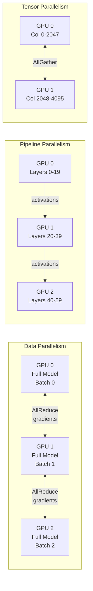
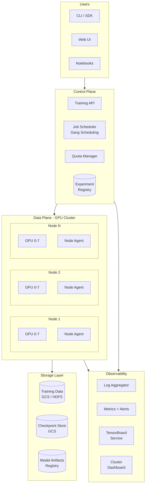

# Design an ML Training Platform
{: .no_toc }

<details open markdown="block">
  <summary>Table of Contents</summary>
  {: .text-delta }
1. TOC
{:toc}
</details>

---

## What We're Building

A managed ML training platform — like Google Vertex AI, AWS SageMaker, or an internal ML platform — that allows ML engineers to submit training jobs, manages GPU/TPU clusters, handles distributed training, tracks experiments, and provides fault tolerance for long-running training runs.

**This is the infrastructure that makes ML teams productive.** Without a good platform, engineers spend 60%+ of their time on infrastructure instead of research.

### Why This Problem Matters

| Without a Platform | With a Platform |
|-------------------|-----------------|
| Manual GPU allocation via Slack | Self-service job submission |
| SSH into machines to debug | Centralized logs and metrics |
| Scripts to resume from crashes | Automatic checkpointing + restart |
| Spreadsheet experiment tracking | Structured experiment registry |
| No visibility into GPU utilization | Cluster-wide dashboards |
| Weeks to onboard new ML engineers | Hours to first training run |

### Real-World Scale

| Metric | Scale |
|--------|-------|
| **GPU cluster** | 10,000+ GPUs (A100/H100) |
| **Concurrent training jobs** | 500+ |
| **ML engineers** | 1,000+ |
| **Training runs per day** | 5,000+ |
| **Largest single job** | 1,024 GPUs for 2 weeks |
| **Data read per day** | 500 TB+ |
| **Checkpoint storage** | PB-scale |

---

## Key Concepts Primer

### Distributed Training Paradigms

| Paradigm | What It Distributes | When to Use |
|----------|-------------------|-------------|
| **Data Parallel (DDP)** | Same model on each GPU; split data | Model fits in 1 GPU; need more throughput |
| **ZeRO (DeepSpeed)** | Shard optimizer states, gradients, params | Model nearly fits; need memory savings |
| **Tensor Parallel** | Split individual layers across GPUs | Very large models (70B+); within a node |
| **Pipeline Parallel** | Split layer groups across GPUs | Very large models; across nodes |
| **Expert Parallel** | Split MoE experts across GPUs | Mixture-of-Experts models |
| **FSDP** | Fully shard model + optimizer | PyTorch-native ZeRO equivalent |



### Gang Scheduling

ML training jobs need **all their GPUs simultaneously**. If a job requests 64 GPUs and only 60 are free, it must wait. This is called gang scheduling — all-or-nothing allocation.

```
Regular scheduling:          Gang scheduling:
  Job A needs 4 GPUs           Job A needs 64 GPUs
  3 available → start 3        60 available → WAIT
  4th joins later               64 available → start ALL at once

Why: Distributed training requires synchronized communication
     across all GPUs. Partial starts cause deadlocks.
```

### Checkpointing

Long training runs (days to weeks) must survive hardware failures.

```
Training timeline (7 days):
Day 1: [████████████] checkpoint
Day 2: [████████████] checkpoint  
Day 3: [████████████] checkpoint
Day 4: [████████] ← GPU failure!
        Resume from Day 3 checkpoint
Day 4': [████████████] checkpoint
Day 5: [████████████] checkpoint
...

Checkpoint contents:
├── model_state_dict        ~140 GB (70B model, fp16)
├── optimizer_state_dict    ~280 GB (Adam: 2× model size)
├── lr_scheduler_state      ~1 KB
├── rng_states              ~1 KB
├── training_step           int
└── data_loader_state       ~1 MB (dataset position)

Total per checkpoint:        ~420 GB for a 70B model
Checkpoint frequency:        Every 1-2 hours
Storage over 7 days:         ~35 TB (kept last N + best)
```

### Model FLOPs Utilization (MFU)

The key efficiency metric for training platforms:

```
MFU = Achieved FLOPs / Theoretical Peak FLOPs

A100 peak (bf16):       312 TFLOPS
Typical achieved:       ~150 TFLOPS
MFU:                    150 / 312 ≈ 48%

What reduces MFU:
├── Communication overhead    (AllReduce, pipeline bubbles)
├── Memory operations         (data loading, checkpointing)  
├── Compilation overhead      (graph optimization)
└── Idle time                 (waiting for stragglers)

Good MFU targets:
├── Single GPU:               55-65%
├── 8 GPUs (1 node):          50-60%
├── 64 GPUs:                  45-55%
└── 1024 GPUs:                35-45%
```

---

## Step 1: Requirements Clarification

### Questions to Ask

| Question | Why It Matters |
|----------|----------------|
| Multi-tenant or single-team? | Isolation, quotas, billing |
| GPU types available? | A100 vs H100 vs TPU — different capabilities |
| Largest job size? | 8 GPUs vs 1024 GPUs — scheduling complexity |
| Framework support? | PyTorch only? TensorFlow? JAX? |
| Data location? | Co-located storage? Remote? |
| On-prem or cloud? | Fixed cluster vs. elastic scaling |

### Functional Requirements

| Requirement | Priority | Description |
|-------------|----------|-------------|
| Job submission API | Must have | Submit training jobs with resource requests |
| GPU scheduling | Must have | Fair, efficient allocation with gang scheduling |
| Distributed training | Must have | DDP, FSDP, Pipeline/Tensor parallelism support |
| Checkpointing | Must have | Automatic periodic checkpointing + resume |
| Experiment tracking | Must have | Track metrics, hyperparameters, artifacts |
| Log aggregation | Must have | Centralized logs from all worker GPUs |
| Auto-restart on failure | Should have | Detect failure, resume from checkpoint |
| Hyperparameter tuning | Should have | Automated search (Bayesian, grid, random) |
| Multi-tenancy | Should have | Quotas, isolation, fair-share scheduling |
| Pre-emptible jobs | Nice to have | Low-priority jobs yield to high-priority |

### Non-Functional Requirements

| Requirement | Target | Rationale |
|-------------|--------|-----------|
| **Job start latency** | < 5 min (small), < 30 min (large) | Developer productivity |
| **GPU utilization** | > 70% cluster-wide | GPU cost is dominant |
| **Checkpoint reliability** | 99.99% recovery success | Long jobs can't afford losing progress |
| **Availability** | 99.9% for control plane | Scheduling, monitoring |
| **MFU** | > 40% for large distributed jobs | Efficient use of expensive hardware |

---

## Step 2: Back-of-Envelope Estimation

### Cluster Size

```
Total GPUs:                   4,096 A100 (80GB)
Nodes:                        512 (8 GPUs per node)
GPU cost:                     $2.5/hr per GPU
Daily GPU cost:               4,096 × $2.5 × 24 = $245,760/day

Target utilization:           70%
Effective GPU-hours/day:      4,096 × 24 × 0.7 = 68,813 GPU-hours
```

### Job Mix

```
Small jobs (1-8 GPUs):        80% of jobs, 20% of GPU-hours
Medium jobs (16-64 GPUs):     15% of jobs, 30% of GPU-hours  
Large jobs (128-1024 GPUs):   5% of jobs, 50% of GPU-hours

Avg job duration:
  Small: 2 hours
  Medium: 24 hours
  Large: 7 days
```

### Storage

```
Training data (shared):       2 PB (GCS/S3, read-only)
Checkpoints:
  Per-job avg: 500 GB
  Active jobs: 500 × 500 GB = 250 TB
  Retention (30 days): ~2 PB

Experiment metadata:          5K runs/day × 10 KB = 50 MB/day
Logs:                         500 jobs × 8 GPUs × 100 MB = 400 GB/day
Tensorboard events:           500 jobs × 50 MB = 25 GB/day
```

### Network

```
AllReduce bandwidth per job:
  Gradient size (70B model):  140 GB
  AllReduce per step:         2 × 140 GB = 280 GB (ring AllReduce)
  Steps per second:           ~1
  Bandwidth needed:           280 GB/s per job

InfiniBand:                   400 Gbps = 50 GB/s per link
  GPUs per node (NVLink):     8 GPUs, 600 GB/s aggregate
  Inter-node (IB):            4 × 400 Gbps = 200 GB/s

Checkpoint write:             420 GB in < 5 min → 1.4 GB/s to storage
```

---

## Step 3: High-Level Design



---

## Step 4: Deep Dive

### 4.1 Job Submission and Lifecycle

```python
from dataclasses import dataclass
from enum import Enum

class JobState(Enum):
    PENDING = "pending"
    SCHEDULED = "scheduled"
    INITIALIZING = "initializing"
    RUNNING = "running"
    CHECKPOINTING = "checkpointing"
    PREEMPTED = "preempted"
    SUCCEEDED = "succeeded"
    FAILED = "failed"
    CANCELLED = "cancelled"


@dataclass
class TrainingJob:
    job_id: str
    user_id: str
    team_id: str
    name: str
    
    container_image: str
    command: list[str]
    env_vars: dict[str, str]
    
    num_gpus: int
    gpu_type: str         # "a100-80gb", "h100"
    num_cpus_per_gpu: int
    memory_per_gpu_gb: int
    
    priority: int         # 0 (highest) to 100 (lowest)
    preemptible: bool
    max_runtime_hours: int
    
    checkpoint_interval_minutes: int
    checkpoint_path: str
    resume_from_checkpoint: str | None
    
    distributed_strategy: str  # "ddp", "fsdp", "deepspeed", "custom"
    
    state: JobState = JobState.PENDING


class TrainingAPI:
    """API for submitting and managing training jobs."""
    
    async def submit_job(self, spec: TrainingJob) -> TrainingJob:
        self._validate_spec(spec)
        
        quota = await self.quota_manager.check_quota(spec.team_id, spec.num_gpus)
        if not quota.has_capacity:
            raise QuotaExceeded(f"Team quota: {quota.used}/{quota.limit} GPUs")
        
        job = await self.job_store.create(spec)
        
        await self.scheduler.enqueue(job)
        
        return job
    
    async def get_job_status(self, job_id: str) -> JobStatus:
        job = await self.job_store.get(job_id)
        metrics = await self.metrics_store.get_latest(job_id)
        
        return JobStatus(
            state=job.state,
            gpus_allocated=job.allocated_nodes,
            current_step=metrics.get("global_step"),
            loss=metrics.get("loss"),
            learning_rate=metrics.get("lr"),
            gpu_utilization=metrics.get("gpu_util"),
            mfu=metrics.get("mfu"),
            elapsed_hours=job.elapsed_hours,
            estimated_remaining_hours=self._estimate_remaining(job, metrics),
            last_checkpoint=job.last_checkpoint_time,
        )
```

### 4.2 GPU Scheduler

```python
class GangScheduler:
    """Gang scheduler for distributed ML training jobs.
    
    Key constraints:
    - All GPUs for a job must be allocated simultaneously
    - Topology-aware: prefer GPUs on same/nearby nodes
    - Fair-share across teams
    - Support preemption for high-priority jobs
    """
    
    def schedule(self) -> list[SchedulingDecision]:
        decisions = []
        
        pending_jobs = self.get_pending_jobs_by_priority()
        cluster_state = self.get_cluster_state()
        
        for job in pending_jobs:
            allocation = self._try_allocate(job, cluster_state)
            
            if allocation:
                decisions.append(SchedulingDecision(
                    job_id=job.job_id,
                    action="start",
                    nodes=allocation.nodes,
                ))
                cluster_state.mark_allocated(allocation)
                continue
            
            if job.priority < 20:
                preemption = self._find_preemption_candidates(job, cluster_state)
                if preemption:
                    for victim in preemption.victims:
                        decisions.append(SchedulingDecision(
                            job_id=victim.job_id,
                            action="preempt",
                            checkpoint_first=True,
                        ))
                    decisions.append(SchedulingDecision(
                        job_id=job.job_id,
                        action="start_after_preemption",
                        nodes=preemption.freed_nodes,
                    ))
        
        return decisions
    
    def _try_allocate(self, job: TrainingJob, cluster: ClusterState) -> Allocation | None:
        """Topology-aware allocation: prefer GPUs that minimize communication."""
        needed_gpus = job.num_gpus
        needed_nodes = (needed_gpus + 7) // 8
        
        if needed_nodes == 1:
            node = cluster.find_node_with_free_gpus(needed_gpus, job.gpu_type)
            if node:
                return Allocation(nodes=[NodeAllocation(node, needed_gpus)])
        
        available_nodes = cluster.get_free_nodes(job.gpu_type)
        if len(available_nodes) >= needed_nodes:
            selected = self._select_topology_optimal(available_nodes, needed_nodes)
            return Allocation(nodes=[NodeAllocation(n, 8) for n in selected])
        
        return None
    
    def _select_topology_optimal(self, available: list[Node], 
                                  needed: int) -> list[Node]:
        """Select nodes that are closest in network topology.
        
        Prefer nodes on same switch/rack for lower AllReduce latency.
        """
        racks = {}
        for node in available:
            racks.setdefault(node.rack_id, []).append(node)
        
        for rack_id, rack_nodes in sorted(racks.items(), 
                                            key=lambda x: -len(x[1])):
            if len(rack_nodes) >= needed:
                return rack_nodes[:needed]
        
        return sorted(available, key=lambda n: n.rack_id)[:needed]


class FairSharePolicy:
    """Ensure fair GPU allocation across teams."""
    
    def compute_priority(self, job: TrainingJob, team_usage: TeamUsage) -> float:
        team_share = team_usage.allocated_gpus / max(1, team_usage.quota_gpus)
        
        base_priority = job.priority
        
        fairness_penalty = max(0, (team_share - 1.0) * 50)
        
        wait_bonus = min(20, job.wait_time_minutes / 10)
        
        return base_priority + fairness_penalty - wait_bonus
```

### 4.3 Fault Tolerance and Auto-Recovery

```python
class FaultManager:
    """Detect and recover from GPU/node failures during training."""
    
    HEARTBEAT_TIMEOUT_SECONDS = 60
    MAX_RESTARTS = 3
    
    async def monitor_job(self, job: TrainingJob):
        """Continuous monitoring loop for a running job."""
        while job.state == JobState.RUNNING:
            health = await self._check_all_workers(job)
            
            if health.all_healthy:
                await asyncio.sleep(10)
                continue
            
            failed_workers = health.failed_workers
            
            if job.restarts >= self.MAX_RESTARTS:
                await self._fail_job(job, f"Max restarts exceeded: {failed_workers}")
                return
            
            await self._handle_failure(job, failed_workers)
    
    async def _handle_failure(self, job: TrainingJob, failed_workers: list[str]):
        job.state = JobState.CHECKPOINTING
        
        healthy_workers = [w for w in job.workers if w not in failed_workers]
        if healthy_workers:
            await self._trigger_emergency_checkpoint(healthy_workers)
        
        await self._release_all_gpus(job)
        
        replacement = await self.scheduler.find_replacement_nodes(
            count=len(failed_workers),
            gpu_type=job.gpu_type,
            exclude=failed_workers,
        )
        
        if not replacement:
            job.state = JobState.PENDING
            await self.scheduler.enqueue(job)
            return
        
        latest_checkpoint = await self._find_latest_checkpoint(job)
        
        job.resume_from_checkpoint = latest_checkpoint
        job.restarts += 1
        job.state = JobState.INITIALIZING
        
        await self._launch_job(job, replacement)
    
    async def _check_all_workers(self, job: TrainingJob) -> HealthStatus:
        results = await asyncio.gather(
            *[self._check_worker(w) for w in job.workers],
            return_exceptions=True,
        )
        
        failed = []
        for worker, result in zip(job.workers, results):
            if isinstance(result, Exception) or not result.healthy:
                failed.append(worker)
        
        return HealthStatus(
            all_healthy=len(failed) == 0,
            failed_workers=failed,
        )


class CheckpointManager:
    """Manage distributed checkpoints with async I/O."""
    
    async def save_checkpoint(self, job: TrainingJob, step: int):
        """Save distributed checkpoint across all workers."""
        checkpoint_path = f"{job.checkpoint_path}/step_{step}"
        
        await asyncio.gather(*[
            self._save_worker_shard(worker, checkpoint_path, step)
            for worker in job.workers
        ])
        
        await self._write_metadata(checkpoint_path, step, job)
        
        await self._cleanup_old_checkpoints(job, keep_last=3)
    
    async def _save_worker_shard(self, worker: str, path: str, step: int):
        """Each worker saves its shard of model/optimizer state."""
        await self.rpc.call(worker, "save_checkpoint", {
            "path": f"{path}/rank_{worker.rank}",
            "step": step,
            "async_io": True,
        })
```

### 4.4 Experiment Tracking

```python
class ExperimentTracker:
    """Track experiments, metrics, and artifacts."""
    
    def create_experiment(self, name: str, config: dict) -> Experiment:
        experiment = Experiment(
            id=generate_id(),
            name=name,
            config=config,
            created_at=datetime.utcnow(),
            status="running",
        )
        self.db.insert(experiment)
        return experiment
    
    def log_metrics(self, experiment_id: str, step: int, metrics: dict):
        """Log training metrics (loss, accuracy, lr, etc.)."""
        self.timeseries_db.write(
            experiment_id=experiment_id,
            step=step,
            timestamp=datetime.utcnow(),
            metrics=metrics,
        )
    
    def compare_experiments(self, experiment_ids: list[str]) -> ComparisonReport:
        """Compare multiple experiments side-by-side."""
        experiments = [self.db.get(eid) for eid in experiment_ids]
        
        return ComparisonReport(
            configs=self._diff_configs([e.config for e in experiments]),
            metric_curves={
                eid: self.timeseries_db.read(eid, metrics=["loss", "eval_loss"])
                for eid in experiment_ids
            },
            final_metrics={
                eid: self.timeseries_db.read_latest(eid)
                for eid in experiment_ids
            },
            resource_usage={
                eid: self._compute_resource_usage(eid)
                for eid in experiment_ids
            },
        )
```

### 4.5 Data Loading Pipeline

```python
class DistributedDataLoader:
    """High-performance distributed data loading for training."""
    
    def __init__(self, dataset_path: str, world_size: int, rank: int,
                 batch_size: int, num_workers: int = 8):
        self.dataset_path = dataset_path
        self.world_size = world_size
        self.rank = rank
        self.batch_size = batch_size
        self.num_workers = num_workers
    
    def __iter__(self):
        """Yield batches with distributed sampling and prefetching."""
        shards = self._assign_shards()
        
        prefetch_queue = queue.Queue(maxsize=4)
        
        for shard in shards:
            data = self._read_shard(shard)
            
            for i in range(0, len(data), self.batch_size):
                batch = data[i:i + self.batch_size]
                batch_tensor = self._to_gpu_tensor(batch)
                yield batch_tensor
    
    def _assign_shards(self) -> list[str]:
        """Deterministic shard assignment across workers."""
        all_shards = self._list_shards(self.dataset_path)
        
        per_rank = len(all_shards) // self.world_size
        start = self.rank * per_rank
        end = start + per_rank
        
        return all_shards[start:end]
    
    def get_state(self) -> DataLoaderState:
        """Save state for checkpoint resume."""
        return DataLoaderState(
            current_shard_idx=self._current_shard_idx,
            current_position=self._current_position,
            epoch=self._epoch,
            rng_state=self._rng.get_state(),
        )
    
    def restore_state(self, state: DataLoaderState):
        """Resume from saved state after failure recovery."""
        self._current_shard_idx = state.current_shard_idx
        self._current_position = state.current_position
        self._epoch = state.epoch
        self._rng.set_state(state.rng_state)
```

### 4.6 Multi-Tenancy and Quotas

```python
class QuotaManager:
    """Manage GPU quotas across teams with fair-share guarantees."""
    
    def __init__(self):
        self.team_quotas: dict[str, TeamQuota] = {}
    
    def check_quota(self, team_id: str, requested_gpus: int) -> QuotaResult:
        quota = self.team_quotas.get(team_id)
        if not quota:
            return QuotaResult(has_capacity=False, reason="team not configured")
        
        current_usage = self._get_current_usage(team_id)
        
        if current_usage + requested_gpus > quota.max_gpus:
            return QuotaResult(
                has_capacity=False,
                reason=f"Would exceed quota: {current_usage + requested_gpus}/{quota.max_gpus}",
                used=current_usage,
                limit=quota.max_gpus,
            )
        
        return QuotaResult(has_capacity=True, used=current_usage, limit=quota.max_gpus)
    
    def get_cluster_utilization(self) -> ClusterUtilization:
        """Cluster-wide utilization report for capacity planning."""
        total_gpus = self.cluster.total_gpus
        allocated = self.cluster.allocated_gpus
        
        per_team = {}
        for team_id, quota in self.team_quotas.items():
            usage = self._get_current_usage(team_id)
            per_team[team_id] = {
                "allocated": usage,
                "quota": quota.max_gpus,
                "utilization": usage / max(1, quota.max_gpus),
                "gpu_mfu": self._get_team_mfu(team_id),
            }
        
        return ClusterUtilization(
            total_gpus=total_gpus,
            allocated_gpus=allocated,
            cluster_utilization=allocated / total_gpus,
            per_team=per_team,
            pending_gpu_hours=self._sum_pending_requests(),
        )
```

---

## Step 5: Scaling & Production

### Failure Handling

| Failure | Detection | Recovery |
|---------|-----------|----------|
| **Single GPU failure** | ECC error, CUDA OOM | Replace node; resume from checkpoint |
| **Node failure** | Heartbeat timeout | Reallocate to healthy node; resume |
| **Network partition** | NCCL timeout | Checkpoint + restart all workers |
| **Storage failure** | Write timeout | Retry with backoff; alert |
| **Scheduler crash** | Health check | Standby scheduler takes over; jobs continue |
| **Data pipeline stall** | Throughput drop > 50% | Alert; fall back to cached data shards |

### Monitoring Dashboard

| Metric | Alert Threshold |
|--------|----------------|
| **Cluster GPU utilization** | < 60% for 1 hour |
| **Job queue wait time** | > 2 hours for priority < 50 |
| **MFU (large jobs)** | < 30% |
| **Checkpoint failure rate** | > 1% |
| **Node failure rate** | > 2 nodes/day |
| **Job failure rate** | > 5% |
| **Data loading throughput** | < 80% of GPU compute throughput |

### Trade-offs

| Decision | Option A | Option B | Recommendation |
|----------|----------|----------|----------------|
| **Scheduling** | FIFO | Fair-share + priority | Fair-share (multi-tenant) |
| **Preemption** | No preemption | Checkpoint + preempt | Preempt low-priority (better utilization) |
| **Checkpointing** | Synchronous | Async (background) | Async (< 5% overhead vs 15% sync) |
| **Storage** | Local NVMe | Shared GCS/S3 | Shared for checkpoints; local for data cache |
| **Orchestrator** | Kubernetes | Custom scheduler | K8s for small scale; custom for 1000+ GPUs |

---

## Hypothetical Interview Transcript

{: .note }
> This transcript simulates a 45-minute Google L5/L6 system design round. The interviewer is a Staff Engineer on the Cloud AI Platform team.

---

**Interviewer:** Design an ML training platform. Think Vertex AI or an internal platform — ML engineers submit training jobs, the system manages GPU allocation, handles distributed training, and provides experiment tracking. Where would you start?

**Candidate:** Let me clarify the scale and constraints. How large is the GPU cluster? Are we multi-tenant — multiple teams sharing GPUs? What's the largest single training job — 8 GPUs or 1024 GPUs? And is this on-prem or cloud — meaning, is the cluster size fixed or elastic?

**Interviewer:** Let's say 4,000 A100 GPUs, multi-tenant with about 50 teams, largest job up to 512 GPUs, and it's on a fixed on-prem cluster — no elastic scaling.

**Candidate:** Got it. Fixed cluster means scheduling and utilization are paramount — every idle GPU is wasted money. At $2.50/hr per A100, this cluster costs $240K per day. Getting utilization from 60% to 80% saves $48K/day.

Let me outline the three main subsystems: a **control plane** for job submission and scheduling, a **data plane** for actually running training on GPUs, and an **observability layer** for monitoring and experiment tracking.

The control plane has a **Training API** that accepts job specifications — container image, GPU count, distributed strategy, checkpoint settings. Jobs go into a **scheduler** that does gang scheduling — all GPUs for a job must be available simultaneously, or the job waits. The scheduler also enforces team **quotas** and **fair-share** allocation.

The data plane is the GPU cluster itself. Each node has 8 GPUs connected via NVLink, and nodes connect via InfiniBand. A **node agent** on each machine manages container lifecycle, health monitoring, and GPU management.

The observability layer aggregates logs from all GPU workers, collects training metrics (loss, learning rate, GPU utilization), serves TensorBoard, and provides a cluster dashboard.

**Interviewer:** Let's dig into the scheduler. Gang scheduling sounds simple — "find N free GPUs" — but what makes it hard?

**Candidate:** Several things make it genuinely hard:

**Fragmentation.** Imagine 100 free GPUs scattered across 50 nodes (2 per node). A job requesting 64 GPUs (8 full nodes) can't run even though 100 GPUs are free. This is analogous to memory fragmentation. Strategies: defragmentation (migrate running jobs to consolidate free nodes), backfill scheduling (fill small gaps with small jobs), and topology-aware allocation.

**Topology matters.** Distributed training performance depends heavily on GPU topology. 8 GPUs on the same node communicate via NVLink at 600 GB/s. GPUs on different nodes communicate via InfiniBand at 50 GB/s per link — 12x slower. For a 64-GPU job, I want all 8 nodes on the same rack switch if possible, to minimize AllReduce latency. The scheduler must be topology-aware.

**Fair-share vs. priority.** Team A has a quota of 500 GPUs and is using 400. Team B has a quota of 200 and is using 50. Team B should get priority for new jobs. But what if Team A's CEO just submitted a "train GPT-5" job with priority 0? We need a fair-share algorithm that respects both quotas and explicit priorities.

**Preemption.** When a high-priority job arrives and no GPUs are free, we may need to preempt lower-priority jobs. But preemption in ML is expensive — we need to checkpoint the victim job first (which can take minutes for a large model), then the victim goes back to the queue. The scheduler must decide: is it worth preempting a job that's been running for 6 days and is 90% done?

My scheduling algorithm would work in rounds. Each round: sort pending jobs by a composite priority (job priority + fair-share penalty + wait-time bonus). For each job, try to allocate topology-optimal nodes. If allocation fails and the job is high-priority, consider preemption — but only preempt if the victim's preemption cost (checkpoint time + wasted work) is less than the value of starting the high-priority job sooner.

**Interviewer:** Good. Now, fault tolerance. A 512-GPU job runs for 2 weeks. GPUs fail. What's your strategy?

**Candidate:** At 4,000 GPUs, we should expect 1-3 GPU failures per day — that's normal at this scale. A 2-week 512-GPU job has a ~50% chance of hitting at least one GPU failure. So fault tolerance isn't optional — it's essential.

**Layer 1: Periodic checkpointing.** Save full training state every 1-2 hours. For a 70B model with Adam optimizer, the checkpoint is about 420 GB. We save to a high-performance shared filesystem (GCS or a parallel filesystem like Lustre). At 1.4 GB/s write throughput, a 420 GB checkpoint takes about 5 minutes. To minimize overhead, I'd use asynchronous checkpointing — save to local NVMe first (fast), then background-copy to shared storage while training continues. This reduces checkpoint overhead from 15% to under 3%.

**Layer 2: Health monitoring.** The node agent continuously monitors GPU health — ECC errors, temperature, memory utilization, NCCL communication timeouts. When a GPU shows signs of failure (increasing ECC error rate), we proactively initiate a checkpoint before the hard failure.

**Layer 3: Automatic recovery.** When a failure is detected: (1) kill the training job on all nodes (partial training is undefined behavior), (2) find a replacement node for the failed one, (3) restart all workers from the latest checkpoint. The restart path: load checkpoint, rebuild data loader state, resume from the exact training step. Total recovery time: checkpoint restore (~3 min) + job initialization (~2 min) ≈ 5 minutes of lost wall-clock time, plus the work done since the last checkpoint (up to 2 hours worst case, 1 hour average).

**Layer 4: Elastic training (advanced).** For some frameworks, you can add or remove workers without full restart. PyTorch's elastic training (torchrun with rdzv) supports this. If a node fails in a 64-node job, we can continue with 63 nodes with slightly lower throughput, then add a replacement when available. This reduces downtime but is more complex to implement correctly.

For the 2-week 512-GPU job, I'd set checkpoint interval to 30 minutes (the job is critical and high-value), use async checkpointing, and keep the last 5 checkpoints. Expected failure recovery events: 3-5 over the 2 weeks. Total lost time: about 5-10 hours out of 336 hours — ~98% efficiency.

**Interviewer:** How do you track experiments and compare training runs?

**Candidate:** The experiment tracker has three layers:

**Metadata store** — when a job starts, we record the full configuration: model architecture, hyperparameters, data version, code commit hash, GPU count, distributed strategy. This goes into a structured database (Spanner or Postgres). This is the "what did I run?" record.

**Time-series metrics** — during training, workers log metrics at every N steps: training loss, eval loss, learning rate, gradient norm, GPU utilization, MFU. These go into a time-series database (InfluxDB or Monarch at Google). This powers the TensorBoard-style dashboards and real-time monitoring.

**Artifact store** — model checkpoints, evaluation results, and final model binaries are stored in GCS with references in the metadata store. This is the "what did it produce?" record.

For comparison, the UI lets you select N experiments and see: (1) config diff — which hyperparameters changed, (2) metric curves overlaid — loss over training steps, (3) resource usage — GPU-hours, cost, (4) final evaluation metrics.

One important feature is **reproducibility.** Given an experiment ID, the system can recreate the exact training command: same container image, same data version, same random seeds, same GPU count. This is critical for debugging and for regulatory requirements in some industries.

**Interviewer:** Last question. How would you measure the platform's success?

**Candidate:** Three categories:

**Developer productivity** — time from "I want to train a model" to "training is running." Target: < 10 minutes for a standard job. This includes writing the config, submitting, and the job actually starting (scheduling latency). We'd also track: how many times does a user need to retry a job due to platform issues?

**Resource efficiency** — cluster-wide GPU utilization (target: > 70%), average MFU across jobs (target: > 40% for large jobs), and queue wait time distribution. If the P50 wait time is under 30 minutes and P95 is under 4 hours, the cluster is reasonably sized.

**Reliability** — job completion rate (what % of jobs succeed without platform-caused failures), checkpoint recovery success rate (target: 99.9%), and mean time to recovery after a GPU failure (target: < 10 minutes).

We'd publish a weekly cluster health report to leadership showing these metrics, highlighting teams that are under-utilizing their quota (so we can reallocate), and flagging jobs with low MFU (so we can help optimize them).

**Interviewer:** Great systems thinking. That covers the end-to-end design well. Let's wrap up.
