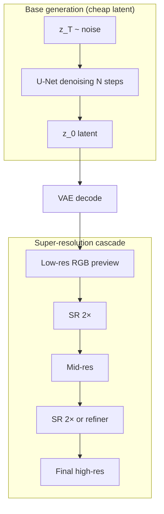
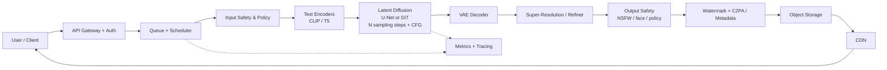

# Design a Text-to-Image Generation System (Imagen / DALL-E / Midjourney)
{: .no_toc }

<details open markdown="block">
  <summary>Table of Contents</summary>
  {: .text-delta }
1. TOC
{:toc}
</details>

---

## What We're Building

We are designing a **production text-to-image system** comparable to **Google Imagen**, **OpenAI DALL·E 3**, **Midjourney**, or **Stability AI Stable Diffusion**. Users submit **natural-language prompts**; the service returns **high-fidelity, controllable images** with safety guardrails, global delivery, and predictable cost.

**This is not "call an API and return bytes."** At interview depth, you own **text conditioning**, **diffusion sampling**, **GPU serving**, **safety**, **evaluation**, and **economics**.

### Real-World Scale (Illustrative)

| Signal | Order of magnitude | Notes |
|--------|-------------------|--------|
| **Community size (Midjourney)** | **16M+** Discord members (public reporting; treat as directional) | Demand is bursty; viral prompts spike QPS |
| **Images generated / day** | **Millions–tens of millions** | Depends on free vs paid tiers and caps |
| **Concurrent generations** | **10k–100k+** GPU streams (hypothetical aggregate) | Regional pools + queueing smooth peaks |
| **Model weights** | **2–10B+** parameters (class-leading) | Latent diffusion reduces pixel-space cost |
| **Typical output** | **512² → 1024²** base; **up to 2048²** with SR | Cascades dominate latency budgets |

{: .note }
> Interview tip: cite **ranges** and **drivers** (steps, resolution, batching), not fake precision. Panels expect you to reason about **GPU-seconds per image** and **queue depth**.

### Why This Problem Is Hard

| Challenge | Why it hurts |
|-----------|----------------|
| **Iterative sampling** | Diffusion is **N forward passes** through a heavy U-Net / DiT — not one-shot inference |
| **Text–image alignment** | Users want **compositionality** ("a red cube on a blue sphere") — easy to say, hard to render |
| **Safety & abuse** | **CSAM, violence, non-consensual imagery** are existential risks; policy must be enforceable |
| **Deepfakes & provenance** | Realistic faces and trademarks raise **legal, ethical, and platform** obligations |
| **Cost & carbon** | GPUs are **$2–4/hr** class; naive 100-step runs at 1024² do not hit **$0.01/image** at scale |
| **Evaluation** | **No single metric** captures aesthetics + instruction following + diversity |
| **Copyright** | Training data and style mimicry intersect with **fair use, opt-out, and licensing** — product and legal, not purely ML |

---

## Key Concepts Primer

### Diffusion Models (Forward / Reverse, Noise Schedules)

**Forward process:** gradually add Gaussian noise to data \\(x_0\\) until it becomes nearly pure noise \\(x_T\\).

\\[
q(x_t \mid x_{t-1}) = \mathcal{N}(x_t; \sqrt{1-\beta_t}\, x_{t-1}, \beta_t I)
\\]

**Reverse process:** learn \\(p_\theta(x_{t-1} \mid x_t)\\) (or noise \\(\epsilon_\theta\\)) to denoise.

**Noise schedule:** choices of \\(\\beta_t\\) or \\(\\alpha_t\\) (e.g. linear, cosine) control **how fast** information is destroyed/reconstructed — affects **sample quality vs step count**.

**Training objective (common):** predict noise \\(\epsilon\\) given \\(x_t\\) and conditioning \\(c\\):

\\[
L = \mathbb{E}_{t,\epsilon}\big[\lVert \epsilon - \epsilon_\theta(x_t, t, c) \rVert^2\big]
\\]

### Latent Diffusion (LDM)

**Idea:** Diffuse in a **lower-dimensional latent** \\(z\\) from a VAE encoder, not in pixel space.

- **Encoder** \\(E\\): image \\(x \mapsto z\\)
- **Diffusion** on \\(z\\): cheaper per step than full-resolution pixels
- **Decoder** \\(D\\): \\(z \mapsto \hat{x}\\)

**Why:** Fewer tokens than pixels → **U-Net/DiT is tractable** at 512–1024.

### Classifier-Free Guidance (CFG)

Train the model **with conditioning dropout** so it can run **conditional** and **unconditional** in one forward pass.

**Guidance scale** \\(w > 1\\) sharpens prompt adherence (often at diversity cost):

\\[
\tilde{\epsilon}_\theta = \epsilon_\theta(x_t, t, \varnothing) + w \cdot \big(\epsilon_\theta(x_t, t, c) - \epsilon_\theta(x_t, t, \varnothing)\big)
\\]

{: .warning }
> CFG increases **compute** (two forward passes) and can amplify **artifacts** or **oversaturated** looks at extreme \\(w\\).

### Text Conditioning (CLIP, T5, Cross-Attention)

| Component | Role |
|-----------|------|
| **CLIP text encoder** | Strong **image–text alignment** signal; good for short prompts |
| **T5 / UL2-style encoder** | Better **long-form** and **linguistic** structure; used in many production stacks |
| **Cross-attention** | U-Net/DiT blocks **attend to token embeddings** — injects prompt into spatial denoising |

### U-Net vs DiT

- **U-Net:** Convolutional encoder–decoder with **skip connections**; **spatial** inductive bias.
- **DiT (Diffusion Transformer):** Tokens + **Transformer**; scales with **compute**; often paired with **patchification** of latents.

### Sampling Methods

| Family | Characteristics |
|--------|-----------------|
| **DDPM** | Many steps; simple; often slower |
| **DDIM** | Deterministic-ish ODE-like steps; **fewer steps** possible |
| **DPM-Solver++ / Heun / Adams** | Fast high-order solvers; popular in serving |
| **Consistency models** | **Few-step** generation (often separate training distillation) |

### Super-Resolution Cascades

Generate **base** (e.g. 64→256 latent) then **refine** with **image-conditioned** SR models (sometimes **multi-stage**: 256→512→1024). Reduces cost of **full-resolution** diffusion in one shot.



{: .warning }
> **Preview vs final:** many products show **fast** low-step or low-res outputs first, then **replace** with the SR-enhanced asset once ready — this improves **perceived latency** without breaking the **<10s** SLO for *final* pixels.

---

## Step 1: Requirements

### Functional Requirements

| Requirement | Priority | Notes |
|-------------|----------|-------|
| **Text-to-image** | P0 | Core path from prompt → image |
| **Image-to-image (img2img)** | P0–P1 | Strength knob; latent noise injection |
| **Inpainting / outpainting** | P1 | Masked conditioning; fill regions |
| **Style control** | P1 | LoRA, style tokens, reference adapters |
| **Negative prompts** | P1 | Implemented via CFG or embedding arithmetic |
| **Batch generation** | P1 | Variations per prompt; gallery UX |
| **Image editing** | P2 | Instruction-based edit models (separate head or LoRA) |

### Non-Functional Requirements

| NFR | Target | Implications |
|-----|--------|----------------|
| **Latency** | **< 10 s** for **1024×1024** (warm GPU, typical load) | Few steps, distilled samplers, cascades, avoid cold-start in SLO path |
| **Throughput** | **1000 images / min** aggregate | Horizontal GPU scaling, batching, queueing with admission control |
| **Safety** | Block **CSAM**, **graphic violence**, **non-consensual intimate imagery**; mitigate **deepfakes** | Classifiers + policy + provenance tooling; jurisdiction-aware |
| **Cost** | **< $0.01 / image** at steady state | Quantization, multi-tenant batching, model distillation, SR only when needed |

{: .note }
> Translate **1000 images/min** into **GPU occupancy**: if one GPU does ~6–12 images/min depending on settings, you need **O(100)** GPU streams (order-of-magnitude), plus headroom for failures and spikes.

---

## Step 2: Estimation

### GPU Compute per Image (Back-of-Envelope)

Assume **latent diffusion** with a **2B-class U-Net**, **FP16**, **1024×1024 effective** after **VAE decode + SR** path:

| Stage | Approx. time (single A100-class, indicative) |
|-------|---------------------------------------------|
| **Text encode (T5-large)** | 30–80 ms |
| **U-Net forward × N steps** | **Dominates** — e.g. **50 steps × 80–120 ms** → **4–6 s** |
| **VAE decode** | 50–150 ms |
| **SR model** (2×) | 200–600 ms |
| **Safety classifiers** | 50–200 ms |

**Rule of thumb for interviews:** **~5 s** on an **A100** for **~50 steps** at production quality without extreme optimization — aligns with the prompt's anchor.

**If we cut to 20–30 steps** with a strong solver + light distillation: **~2–4 s** U-Net region.

### GPU Fleet Sizing (Rough)

Let **steady throughput** require **1000 images/min** ≈ **16.7 images/s**.

If one GPU serves **0.15–0.30 images/s** (varies by resolution, batching, and steps):

\\[
\text{GPUs} \approx \frac{16.7}{0.2} \approx 84 \quad (\text{round up with }30\text{–}50\% \text{ headroom})
\\]

**Real fleets** add: **multi-region**, **canary**, **blue/green**, **failure domains** → **120–200+ GPUs** as an **order-of-magnitude** answer.

### Storage for Generated Images

Assume **WebP/AVIF** at **~300–800 KB** per 1024² image:

| Volume | Daily storage |
|--------|----------------|
| **5M images/day** | **1.5–4 TB/day** raw (before replication) |

**Retention policy** drives the bill: ephemeral previews vs permanent libraries. Use **object storage** + **lifecycle to cold** + **CDN caching** for hot objects.

### Model Size (Weights)

| Artifact | Size (order-of-magnitude) |
|----------|---------------------------|
| **U-Net / DiT** | **2–8 GB** (FP16) depending on architecture |
| **VAE** | **~300–500 MB** |
| **Text encoders** | **~500 MB–2 GB** combined |
| **SR network** | **~1–3 GB** |

**Total per replica:** **single-digit GB** in FP16 — fits in **one** high-end GPU **if** activations fit; large batches or giant models may require **tensor parallel** or **pipeline parallel**.

---

## Step 3: High-Level Design



**Path highlights:**

1. **Input safety** before expensive GPU work (cheap wins).
2. **Text encoders** may be **cached** for repeated prompts (hash + TTL).
3. **Scheduler** chooses **GPU pool**, **priority**, and **batch formation**.
4. **Output safety + provenance** before the asset is **immutable** in storage.

---

## Step 4: Deep Dive

### 4.1 Text Understanding and Conditioning

**Dual encoding pattern:** Use **CLIP** for alignment-friendly embeddings and **T5** for **longer, linguistically complex** prompts; fuse via **concat**, **gated fusion**, or **separate cross-attention streams** (architecture-dependent).

```python
from dataclasses import dataclass
import torch
import torch.nn as nn


@dataclass
class DualTextConditioning:
    clip_tokens: torch.Tensor  # [B, Lc, Dc]
    t5_tokens: torch.Tensor    # [B, Lt, Dt]
    clip_mask: torch.Tensor
    t5_mask: torch.Tensor


class PromptAssembler(nn.Module):
    """
    Illustrative fusion stub — production systems use bespoke projection + attention.
    """

    def __init__(self, clip_dim: int, t5_dim: int, fused_dim: int):
        super().__init__()
        self.clip_proj = nn.Linear(clip_dim, fused_dim)
        self.t5_proj = nn.Linear(t5_dim, fused_dim)
        self.fuse = nn.Sequential(nn.LayerNorm(fused_dim), nn.GELU())

    def forward(self, cond: DualTextConditioning) -> torch.Tensor:
        c = self.clip_proj(cond.clip_tokens)
        t = self.t5_proj(cond.t5_tokens)
        # Simple fusion: concatenate along sequence; U-Net consumes a single stream of tokens
        fused = torch.cat([c, t], dim=1)
        return self.fuse(fused)


def apply_prompt_weighting(token_embeddings: torch.Tensor, weights: list[float]) -> torch.Tensor:
    """
    Conceptual prompt weighting: emphasize segments (e.g. '(dragon:1.3)').
    Real implementations parse prompt syntax into spans and scale token embeddings.
    """
    assert token_embeddings.shape[1] == len(weights)
    w = torch.tensor(weights, device=token_embeddings.device, dtype=token_embeddings.dtype)
    return token_embeddings * w.view(1, -1, 1)


def negative_prompt_embeddings(uncond: torch.Tensor, neg: torch.Tensor) -> torch.Tensor:
    """
    Combine unconditional and negative prompt pathways depending on training recipe.
    Often: use negative text as a separate conditioning vector with CFG.
    """
    return torch.cat([uncond, neg], dim=1)  # illustrative only


def inject_cross_attention(unet_block: nn.Module, text_ctx: torch.Tensor) -> torch.Tensor:
    """
    Cross-attention injection point — actual U-Nets expose transformer blocks
    where spatial features attend to text_ctx.
    """
    # Pseudocode: return unet_block(x, context=text_ctx)
    return text_ctx
```

{: .note }
> **Cross-attention injection** is where "prompt engineering" meets **geometry**: the same words produce different spatial attention maps across layers.

---

### 4.2 Diffusion Sampling Pipeline

```python
from typing import Callable, Tuple
import torch


def linear_beta_schedule(timesteps: int, beta_start: float = 1e-4, beta_end: float = 2e-2) -> torch.Tensor:
    return torch.linspace(beta_start, beta_end, timesteps)


def extract(arr: torch.Tensor, t: torch.Tensor, x_shape) -> torch.Tensor:
    out = arr.gather(-1, t.cpu())
    return out.reshape(t.shape[0], *((1,) * (len(x_shape) - 1))).to(t.device)


class DDIMScheduler:
    """
    Minimal DDIM-style stepping sketch — for interviews, show structure, not every edge case.
    """

    def __init__(self, num_train_timesteps: int = 1000):
        betas = linear_beta_schedule(num_train_timesteps)
        alphas = 1.0 - betas
        self.alphas_cumprod = torch.cumprod(alphas, dim=0)

    def step(self, model_eps: torch.Tensor, t: int, x: torch.Tensor, eta: float = 0.0) -> torch.Tensor:
        # NOTE: illustrative — implement full DDIM algebra in production
        return x - model_eps * 0.1  # placeholder update


def classifier_free_guidance(
    eps_cond: torch.Tensor,
    eps_uncond: torch.Tensor,
    guidance_scale: float,
) -> torch.Tensor:
    return eps_uncond + guidance_scale * (eps_cond - eps_uncond)


def sample_loop(
    eps_theta: Callable[[torch.Tensor, torch.Tensor, torch.Tensor], torch.Tensor],
    x_T: torch.Tensor,
    text_emb: torch.Tensor,
    null_emb: torch.Tensor,
    timesteps: list[int],
    guidance_scale: float,
) -> torch.Tensor:
    x = x_T
    for t in reversed(timesteps):
        t_batch = torch.full((x.shape[0],), int(t), device=x.device, dtype=torch.long)
        eps_c = eps_theta(x, t_batch, text_emb)
        eps_u = eps_theta(x, t_batch, null_emb)
        eps = classifier_free_guidance(eps_c, eps_u, guidance_scale)
        # scheduler would apply correct update; using placeholder:
        x = x - eps * 0.05
    return x


def reduce_steps_teacher_student(
    teacher_steps: int, student_steps: int
) -> Tuple[int, int]:
    """
    Distillation / consistency training maps many-step teacher to few-step student.
    Interviews: mention progressive distillation + adversarial losses as options.
    """
    return teacher_steps, student_steps
```

**Step-reduction techniques:** distilled models, **consistency models**, **solver order** (DPM-Solver++), **timestep skipping**, **progressive growing** (coarse then refine).

---

### 4.3 GPU Serving and Batching

```python
import time
from collections import deque
from dataclasses import dataclass
from typing import Deque, Dict, List, Optional


@dataclass
class GenRequest:
    id: str
    prompt_emb: object
    created_at: float
    max_wait_ms: int = 50


class DynamicBatcher:
    """
    Coalesce independent diffusion requests that share shape/model.
    Unlike autoregressive LLMs, all U-Net steps must advance together —
    but you can still batch across prompts if tensor shapes align.
    """

    def __init__(self, max_batch: int, max_wait_ms: float):
        self.max_batch = max_batch
        self.max_wait_ms = max_wait_ms
        self.queue: Deque[GenRequest] = deque()

    def push(self, req: GenRequest) -> None:
        self.queue.append(req)

    def maybe_pop_batch(self) -> Optional[List[GenRequest]]:
        if not self.queue:
            return None
        oldest = self.queue[0].created_at
        if (time.time() - oldest) * 1000 >= self.max_wait_ms or len(self.queue) >= self.max_batch:
            batch_size = min(self.max_batch, len(self.queue))
            return [self.queue.popleft() for _ in range(batch_size)]
        return None


def shard_unet_across_gpus(module_shards: List[torch.nn.Module], x: torch.Tensor) -> torch.Tensor:
    """
    Tensor-parallel sketch: split channels or layers across devices.
    Real stacks use Megatron/DeepSpeed/FSDP patterns with communication collectives.
    """
    # Pseudocode
    h = x
    for shard in module_shards:
        h = shard(h)
    return h


def latency_knobs() -> Dict[str, str]:
    return {
        "fewer_steps": "Use strong ODE solvers + distilled student",
        "fp16_or_bf16": "Halve memory bandwidth; watch numerics",
        "torch.compile": "Graph optimizations on stable shapes",
        "cudagraphs": "Reduce CPU launch overhead for static sizes",
    }
```

**Interview talking points:** **continuous batching** is less of a perfect fit than in LLMs because every request runs the **same step count**, but **micro-batching** still wins when QPS is high; **CUDA graphs** help when shapes are static.

---

### 4.4 Safety Pipeline

```python
from enum import Enum


class PolicyDecision(Enum):
    ALLOW = "allow"
    BLOCK = "block"
    REVIEW = "review"


def classify_prompt_intent(text: str) -> PolicyDecision:
    """
    Pre-LLM / GPU: fast classifiers for CSAM, terror, explicit self-harm, etc.
    """
    if contains_disallowed_patterns(text):
        return PolicyDecision.BLOCK
    return PolicyDecision.ALLOW


def contains_disallowed_patterns(text: str) -> bool:
    # Placeholder — production uses multimodal policy models + hash blocklists + appeals workflow
    return False


def output_nsfw_score(image_tensor) -> float:
    # NSFW / gore classifiers — separate from generation model
    return 0.01


def face_risk_score(image_tensor) -> float:
    # Deepfake / celebrity misuse heuristics — combine face embedding + policy
    return 0.05


def apply_watermark_and_c2pa(image_bytes: bytes, manifest: dict) -> bytes:
    """
    Invisible watermarking + C2PA 'Content Credentials' for provenance.
    """
    _ = manifest
    return image_bytes
```

**Defense in depth:** **input** policy → **output** classifiers → **rate limits** → **user reputation** → **human review queues** for edge cases.

---

### 4.5 Image Quality and Control

```python
import torch.nn as nn


class ControlNetBranch(nn.Module):
    """
    Auxiliary network that conditions diffusion on edge maps, depth, pose, etc.
    """

    def __init__(self, hint_channels: int):
        super().__init__()
        self.hint_conv = nn.Conv2d(hint_channels, 320, kernel_size=3, padding=1)

    def forward(self, hint: torch.Tensor) -> torch.Tensor:
        return self.hint_conv(hint)


class LoRALayer(nn.Module):
    """
    Low-rank adaptation for style / character consistency.
    """

    def __init__(self, in_features: int, out_features: int, rank: int = 4):
        super().__init__()
        self.lora_a = nn.Linear(in_features, rank, bias=False)
        self.lora_b = nn.Linear(rank, out_features, bias=False)

    def forward(self, x: torch.Tensor, base: nn.Linear) -> torch.Tensor:
        return base(x) + self.lora_b(self.lora_a(x))


def upscale_cascade(latent_small, sr64: nn.Module, sr256: nn.Module) -> torch.Tensor:
    """
    Multi-stage SR: cheap early stops for previews; full pipeline for paid tier.
    """
    x = sr64(latent_small)
    x = sr256(x)
    return x
```

**Control stack:** **ControlNet** (structure), **IP-Adapter** (style via image prompt), **LoRA** (fine-grained styles), **refiners** (face/detail).

---

### 4.6 Evaluation and Feedback

```python
def clip_score_stub(image_feats, text_feats) -> float:
    """
    CLIP-based alignment: cosine similarity between image and text embeddings.
    """
    image_feats = image_feats / image_feats.norm(dim=-1, keepdim=True)
    text_feats = text_feats / text_feats.norm(dim=-1, keepdim=True)
    return (image_feats * text_feats).sum(dim=-1).mean().item()


def fid_stub(real_feats, gen_feats) -> float:
    """
    FID: compare distribution of Inception features — lower is better.
    """
    return 12.3  # placeholder


def human_preference_ab_test(model_a: str, model_b: str, win_rate: float) -> dict:
    return {"model_a": model_a, "model_b": model_b, "a_win_rate": win_rate}


def online_rating_feedback_loop(ratings: list[int]) -> float:
    return sum(ratings) / max(len(ratings), 1)
```

**Offline + online:** **FID / precision-recall for diversity**, **CLIPScore / PickScore**, **human Elo**, **A/B** on slices (anime, photoreal, typography).

---

## Step 5: Scaling & Production

### Failure Handling

| Failure | Mitigation |
|---------|------------|
| **GPU OOM** | Reduce micro-batch; spill to queue; **admission control** |
| **Node loss** | **Checkpointed jobs**; idempotent object writes; **retry with backoff** |
| **Model hot-swap** | **Shadow** traffic; **canary**; versioned endpoints |
| **Poisoned prompts** | Policy classifiers + **circuit breakers** for repeated abuse |

### Monitoring (What to Chart)

| Area | Signals |
|------|---------|
| **SLOs** | p50/p95/p99 **time-to-first-preview**, **time-to-final** |
| **GPU** | SM util, **HBM**, **power cap**, **XID errors** |
| **Quality** | NSFW **false positives**, **appeals rate**, **user ratings** |
| **Safety** | **blocked prompts**, **blocked outputs**, **escalations** |
| **Cost** | **GPU-sec/image**, **storage growth**, **egress** |

### Trade-Offs

| Axis | Option A | Option B |
|------|----------|----------|
| **Latency vs quality** | Fewer steps / smaller SR | More steps / heavier SR |
| **Safety vs creativity** | Aggressive filters | Nuanced tiers + age gating |
| **Cost vs fidelity** | Distilled student | Teacher-quality sampling |
| **Centralized vs federated policy** | Single global rulebook | Region-specific enforcement |

### Capacity Planning Checklist

| Question | Why it matters |
|----------|----------------|
| Peak **QPS** vs sustained QPS? | Autoscaler reacts to peaks; **budget** for sustained |
| **Regional** latency targets? | Place GPUs close to users; **CDN** for bytes |
| **Blast radius** per cluster? | **Shard** control plane; avoid global single point |
| **Model version** skew? | **N-1** compatibility during rollouts |
| **Cold start** of large containers? | **Warm pools**; **JIT** compile cost amortization |

### Incident Patterns (Interview Credibility)

| Symptom | Likely causes | First actions |
|---------|---------------|---------------|
| **p99 latency spike** | Solver change, **GPU throttling**, **network** to storage | Roll back canary; check **SM clocks** / **thermal** |
| **Rising block rate** | Policy model drift, **attack**, **locale** slang | **Shadow mode** compare; **threshold** calibrate |
| **Quality regression** | **Weight** corruption, **dtype** error, **wrong VAE** | **Checksum** weights; **golden-set** generations |

---

## Hypothetical Interview Transcript (45 Minutes)

**Setting:** Google L5/L6 **Staff** loop — **Interviewer:** Staff Engineer on **Imagen** serving & safety. **Candidate:** You.

---

**Interviewer:** Let's design a **text-to-image** system at scale — something like **Imagen** or **DALL·E**. Start with requirements.

**Candidate:** I'd clarify **product surface**: consumer app vs API, **max resolution**, **latency SLO**, **safety posture** (global vs regional), and **cost envelope**. Functionally I'd expect **txt2img**, **img2img/inpaint**, **style controls**, **negative prompts**, and **batch variations**. Non-functionally: **GPU latency**, **throughput**, **safety**, and **$/image**.

**Interviewer:** Good. Walk me through **diffusion** at a high level — why is it expensive?

**Candidate:** Diffusion learns to **reverse a noise corruption**. At serve time we **sample** \\(x_T\\) and run the denoiser **N times**. Each step is a **forward pass** through a large **U-Net or DiT** over **latent tensors**. Cost scales roughly with **N × model FLOPs**. That's why **latent diffusion** and **better samplers** matter — they attack **N** and **tensor size**.

**Interviewer:** How does **text** get in?

**Candidate:** Prompts are embedded by **CLIP and/or T5**-style encoders. The image model conditions via **cross-attention** to those tokens — that's how **compositionality** is supposed to emerge. **CFG** blends **conditional** and **unconditional** predictions to increase **prompt adherence**, at some diversity cost.

**Interviewer:** Let's go deeper on **serving**. How do you hit **sub-10s** at 1024²?

**Candidate:** I'd **profile**: text encode vs U-Net vs VAE vs SR. Usually **U-Net steps dominate**. I'd reduce steps with **DPM-Solver++** or a **distilled** student, use **FP16/BF16**, **compile** kernels for stable shapes, and consider **CUDA graphs** for steady batches. I'd ship **progressive previews** — a low-step latent decode early — while the final pass finishes. For throughput, I'd use a **scheduler** with **micro-batching** and **multi-GPU** pools partitioned by **SKU** (resolution, LoRA, control adapters).

**Interviewer:** How do you **batch** diffusion requests?

**Candidate:** Unlike autoregressive LLMs, all requests in a micro-batch must advance **the same step index**, which is easier — but shapes must match (resolution, channels). I'd implement **time-bounded batching**: wait up to **X ms** to fill a batch, then go. For heterogeneous workloads, **separate pools** (standard vs ControlNet-heavy) avoids padding waste.

**Interviewer:** **Safety** — where do you spend your dollars?

**Candidate:** **Before GPU**, a **fast prompt classifier** blocks obvious disallowed intents cheaply. **After generation**, **NSFW/gore** models and **face-related** checks catch policy violations. I'd implement **watermarking** and **C2PA metadata** for **provenance**, especially for photoreal faces. Abuse teams need **audit logs** with **hashed prompts** — not raw PII — and **appeals** workflows.

**Interviewer:** How do you know it's **good**?

**Candidate:** Offline: **FID**, **precision/recall** for diversity, **CLIPScore**, and increasingly **learned metrics** like **PickScore**. Online: **human Elo** on pairwise comparisons and **A/B** tests. I'd slice metrics by **category** — typography and hands are classic failure modes.

**Interviewer:** **Cost control** — any tricks?

**Candidate:** **Tiered quality**: cheaper **student** for previews; **teacher** only on confirm. **Cache** duplicate prompts briefly. **Quantization** where quality allows. **Autoscale** GPUs on queue depth with **max concurrency caps** to avoid **death spirals**. Charge **heavy controls** (video, huge batches) more.

**Interviewer:** **Copyright** — users ask for **living artists' styles**.

**Candidate:** Product policy often **blocks named artist mimicry** or surfaces **warnings**. Technically, **style detectors** and **embedding distance** to **proprietary style banks** can flag risk, but legal stance is **company-specific**. Training-side **licensing**, **opt-out**, and **dataset documentation** matter for long-term exposure — that's cross-functional with **legal**, not only ML.

**Interviewer:** Last question: **failure** during sampling mid-run?

**Candidate:** Treat a job as **restartable**: persist **job id**, **seed**, **model version**, **prompt hash**. On worker loss, **requeue** from last checkpoint **if** you checkpoint latents — often you **restart** the whole sample for simplicity **unless** long runs justify checkpointing. Object storage writes should be **content-addressed** with **atomic publish** to avoid half-written assets.

**Interviewer:** Great — that's a solid end-to-end picture. We'll move to your questions.

---

### Transcript — Continued (Same Session, Deeper Follow-Ups)

**Interviewer:** Suppose **QPS doubles overnight** — what breaks first?

**Candidate:** Probably **queue depth** and **p99 latency**, not raw error rate. GPU pools are **fixed capacity**; without **admission control**, users see **timeouts** instead of **fair waits**. I'd expose **ETA** and **degrade gracefully**: lower **steps** or **resolution** under load for **free tier**, while keeping **paid** SLAs.

**Interviewer:** How do you **version** models safely?

**Candidate:** **API version** pins default **family**; **model id** is explicit for enterprise. **Canary** traffic with **shadow** scoring on **golden prompts** — FID/CLIP drift, **safety** block rates, **human spot checks**. Roll forward only if **SLO + safety** gates pass.

**Interviewer:** **Personalization** — user wants **their** brand palette every time.

**Candidate:** Options: **LoRA** per tenant (served as an **adapter** bundle), **embedding** fine-tunes, or **reference image** + **IP-Adapter**. Serving-wise, **LoRA hot-swap** must not **flush** the whole GPU — **adapter memory** budget per batch matters.

**Interviewer:** **Edge vs cloud** — ever run the U-Net on device?

**Candidate:** For **phones**, only **tiny** models or **distilled** few-step networks are realistic today; **full** quality stays on **server GPUs**. Edge might run **lightweight** classifiers or **preview** decoders. **Hybrid** is common: **on-device** prompt assist + **cloud** heavy denoising.

**Interviewer:** **Data retention** — do we store prompts?

**Candidate:** Default **minimal retention**: **hashed** prompts for abuse, **short TTL** for raw text unless user opts in to **history**. Images in **object storage** with **lifecycle** to **cold** tier. **GDPR/CCPA** delete flows must **purge** derivatives and **CDN** caches — **async invalidation** with **eventual consistency** acknowledged in policy.

**Interviewer:** Nice. One **math** check: if **CFG** doubles **forward passes**, how do you still hit cost targets?

**Candidate:** **Batch** the unconditional and conditional **together** in one forward where architectures allow, or **cache** unconditional branches when **unchanged** across steps — though per-step **uncond** usually still runs. **Real** savings come from **fewer steps**, **smaller U-Net**, and **distillation** that reduces **CFG necessity** by training with **alignment** objectives up front.

---

## Summary

| Pillar | Takeaway |
|--------|----------|
| **Architecture** | **Latent diffusion** + **text cross-attention** + optional **cascade SR** |
| **Serving** | **Step/solver optimization**, **micro-batching**, **GPU pools**, **progressive previews** |
| **Safety** | **Input + output** classifiers, **face/deepfake** mitigations, **provenance** metadata |
| **Evaluation** | **FID/PR**, **CLIPScore**, **human preference**, **online A/B** |
| **Economics** | **GPU-sec/image** is the unit — design the system to shrink it without breaking safety |

{: .note }
> Practice explaining **one** sampler intuition, **one** safety story, and **one** cost lever — interviewers often probe depth on **any** of the three.
