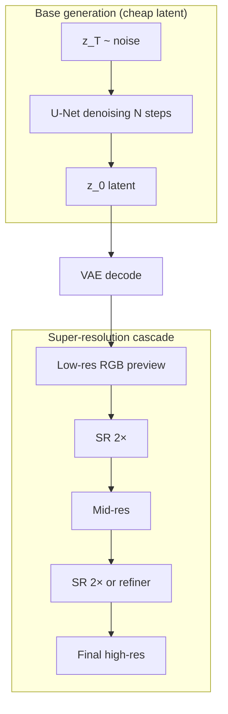
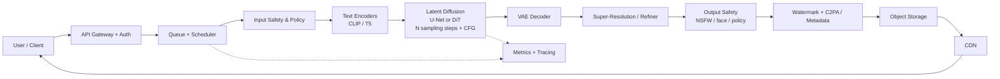
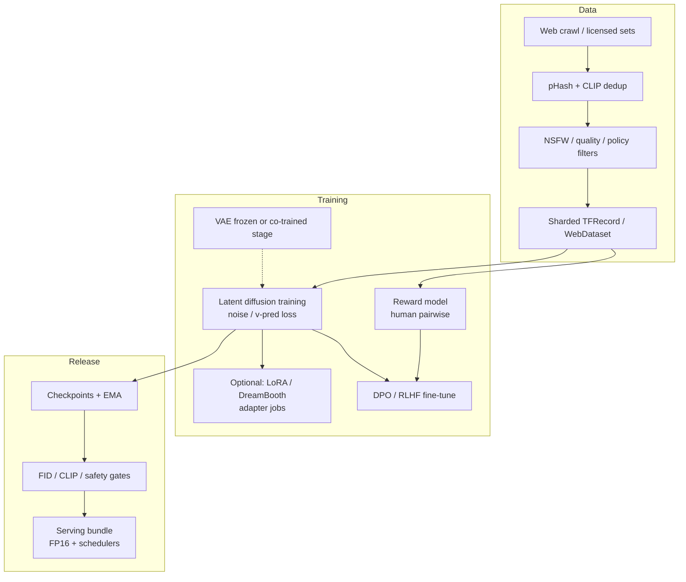

# Design a Text-to-Image Generation System (Imagen / DALL-E / Midjourney)
{: .no_toc }

<details open markdown="block">
  <summary>Table of Contents</summary>
  {: .text-delta }
1. TOC
{:toc}
</details>

---

## What We're Building

We are designing a **production text-to-image system** comparable to **Google Imagen**, **OpenAI DALL·E 3**, **Midjourney**, or **Stability AI Stable Diffusion**. Users submit **natural-language prompts**; the service returns **high-fidelity, controllable images** with safety guardrails, global delivery, and predictable cost.

**This is not "call an API and return bytes."** At interview depth, you own **text conditioning**, **diffusion sampling**, **GPU serving**, **safety**, **evaluation**, and **economics**.

### Real-World Scale (Illustrative)

| Signal | Order of magnitude | Notes |
|--------|-------------------|--------|
| **Community size (Midjourney)** | **16M+** Discord members (public reporting; treat as directional) | Demand is bursty; viral prompts spike QPS |
| **Images generated / day** | **Millions–tens of millions** | Depends on free vs paid tiers and caps |
| **Concurrent generations** | **10k–100k+** GPU streams (hypothetical aggregate) | Regional pools + queueing smooth peaks |
| **Model weights** | **2–10B+** parameters (class-leading) | Latent diffusion reduces pixel-space cost |
| **Typical output** | **512² → 1024²** base; **up to 2048²** with SR | Cascades dominate latency budgets |

{: .note }
> Interview tip: cite **ranges** and **drivers** (steps, resolution, batching), not fake precision. Panels expect you to reason about **GPU-seconds per image** and **queue depth**.

### Why This Problem Is Hard

| Challenge | Why it hurts |
|-----------|----------------|
| **Iterative sampling** | Diffusion is **N forward passes** through a heavy U-Net / DiT — not one-shot inference |
| **Text–image alignment** | Users want **compositionality** ("a red cube on a blue sphere") — easy to say, hard to render |
| **Safety & abuse** | **CSAM, violence, non-consensual imagery** are existential risks; policy must be enforceable |
| **Deepfakes & provenance** | Realistic faces and trademarks raise **legal, ethical, and platform** obligations |
| **Cost & carbon** | GPUs are **$2–4/hr** class; naive 100-step runs at 1024² do not hit **$0.01/image** at scale |
| **Evaluation** | **No single metric** captures aesthetics + instruction following + diversity |
| **Copyright** | Training data and style mimicry intersect with **fair use, opt-out, and licensing** — product and legal, not purely ML |

---

## Key Concepts Primer

### Diffusion Models (Forward / Reverse, Noise Schedules)

**Forward process:** gradually add Gaussian noise to data \\(x_0\\) until it becomes nearly pure noise \\(x_T\\).

\\[
q(x_t \mid x_{t-1}) = \mathcal{N}(x_t; \sqrt{1-\beta_t}\, x_{t-1}, \beta_t I)
\\]

**Reverse process:** learn \\(p_\theta(x_{t-1} \mid x_t)\\) (or noise \\(\epsilon_\theta\\)) to denoise.

**Noise schedule:** choices of \\(\\beta_t\\) or \\(\\alpha_t\\) (e.g. linear, cosine) control **how fast** information is destroyed/reconstructed — affects **sample quality vs step count**.

**Training objective (common):** predict noise \\(\epsilon\\) given \\(x_t\\) and conditioning \\(c\\):

\\[
L = \mathbb{E}_{t,\epsilon}\big[\lVert \epsilon - \epsilon_\theta(x_t, t, c) \rVert^2\big]
\\]

### Latent Diffusion (LDM)

**Idea:** Diffuse in a **lower-dimensional latent** \\(z\\) from a VAE encoder, not in pixel space.

- **Encoder** \\(E\\): image \\(x \mapsto z\\)
- **Diffusion** on \\(z\\): cheaper per step than full-resolution pixels
- **Decoder** \\(D\\): \\(z \mapsto \hat{x}\\)

**Why:** Fewer tokens than pixels → **U-Net/DiT is tractable** at 512–1024.

### Classifier-Free Guidance (CFG)

Train the model **with conditioning dropout** so it can run **conditional** and **unconditional** in one forward pass.

**Guidance scale** \\(w > 1\\) sharpens prompt adherence (often at diversity cost):

\\[
\tilde{\epsilon}_\theta = \epsilon_\theta(x_t, t, \varnothing) + w \cdot \big(\epsilon_\theta(x_t, t, c) - \epsilon_\theta(x_t, t, \varnothing)\big)
\\]

{: .warning }
> CFG increases **compute** (two forward passes) and can amplify **artifacts** or **oversaturated** looks at extreme \\(w\\).

### Text Conditioning (CLIP, T5, Cross-Attention)

| Component | Role |
|-----------|------|
| **CLIP text encoder** | Strong **image–text alignment** signal; good for short prompts |
| **T5 / UL2-style encoder** | Better **long-form** and **linguistic** structure; used in many production stacks |
| **Cross-attention** | U-Net/DiT blocks **attend to token embeddings** — injects prompt into spatial denoising |

### U-Net vs DiT

- **U-Net:** Convolutional encoder–decoder with **skip connections**; **spatial** inductive bias.
- **DiT (Diffusion Transformer):** Tokens + **Transformer**; scales with **compute**; often paired with **patchification** of latents.

### Sampling Methods

| Family | Characteristics |
|--------|-----------------|
| **DDPM** | Many steps; simple; often slower |
| **DDIM** | Deterministic-ish ODE-like steps; **fewer steps** possible |
| **DPM-Solver++ / Heun / Adams** | Fast high-order solvers; popular in serving |
| **Consistency models** | **Few-step** generation (often separate training distillation) |

### Super-Resolution Cascades

Generate **base** (e.g. 64→256 latent) then **refine** with **image-conditioned** SR models (sometimes **multi-stage**: 256→512→1024). Reduces cost of **full-resolution** diffusion in one shot.



{: .warning }
> **Preview vs final:** many products show **fast** low-step or low-res outputs first, then **replace** with the SR-enhanced asset once ready — this improves **perceived latency** without breaking the **<10s** SLO for *final* pixels.

---

## Step 1: Requirements

### Functional Requirements

| Requirement | Priority | Notes |
|-------------|----------|-------|
| **Text-to-image** | P0 | Core path from prompt → image |
| **Image-to-image (img2img)** | P0–P1 | Strength knob; latent noise injection |
| **Inpainting / outpainting** | P1 | Masked conditioning; fill regions |
| **Style control** | P1 | LoRA, style tokens, reference adapters |
| **Negative prompts** | P1 | Implemented via CFG or embedding arithmetic |
| **Batch generation** | P1 | Variations per prompt; gallery UX |
| **Image editing** | P2 | Instruction-based edit models (separate head or LoRA) |

### Non-Functional Requirements

| NFR | Target | Implications |
|-----|--------|----------------|
| **Latency** | **< 10 s** for **1024×1024** (warm GPU, typical load) | Few steps, distilled samplers, cascades, avoid cold-start in SLO path |
| **Throughput** | **1000 images / min** aggregate | Horizontal GPU scaling, batching, queueing with admission control |
| **Safety** | Block **CSAM**, **graphic violence**, **non-consensual intimate imagery**; mitigate **deepfakes** | Classifiers + policy + provenance tooling; jurisdiction-aware |
| **Cost** | **< $0.01 / image** at steady state | Quantization, multi-tenant batching, model distillation, SR only when needed |

{: .note }
> Translate **1000 images/min** into **GPU occupancy**: if one GPU does ~6–12 images/min depending on settings, you need **O(100)** GPU streams (order-of-magnitude), plus headroom for failures and spikes.

---

## Step 2: Estimation

### GPU Compute per Image (Back-of-Envelope)

Assume **latent diffusion** with a **2B-class U-Net**, **FP16**, **1024×1024 effective** after **VAE decode + SR** path:

| Stage | Approx. time (single A100-class, indicative) |
|-------|---------------------------------------------|
| **Text encode (T5-large)** | 30–80 ms |
| **U-Net forward × N steps** | **Dominates** — e.g. **50 steps × 80–120 ms** → **4–6 s** |
| **VAE decode** | 50–150 ms |
| **SR model** (2×) | 200–600 ms |
| **Safety classifiers** | 50–200 ms |

**Rule of thumb for interviews:** **~5 s** on an **A100** for **~50 steps** at production quality without extreme optimization — aligns with the prompt's anchor.

**If we cut to 20–30 steps** with a strong solver + light distillation: **~2–4 s** U-Net region.

### GPU Fleet Sizing (Rough)

Let **steady throughput** require **1000 images/min** ≈ **16.7 images/s**.

If one GPU serves **0.15–0.30 images/s** (varies by resolution, batching, and steps):

\\[
\text{GPUs} \approx \frac{16.7}{0.2} \approx 84 \quad (\text{round up with }30\text{–}50\% \text{ headroom})
\\]

**Real fleets** add: **multi-region**, **canary**, **blue/green**, **failure domains** → **120–200+ GPUs** as an **order-of-magnitude** answer.

### Storage for Generated Images

Assume **WebP/AVIF** at **~300–800 KB** per 1024² image:

| Volume | Daily storage |
|--------|----------------|
| **5M images/day** | **1.5–4 TB/day** raw (before replication) |

**Retention policy** drives the bill: ephemeral previews vs permanent libraries. Use **object storage** + **lifecycle to cold** + **CDN caching** for hot objects.

### Model Size (Weights)

| Artifact | Size (order-of-magnitude) |
|----------|---------------------------|
| **U-Net / DiT** | **2–8 GB** (FP16) depending on architecture |
| **VAE** | **~300–500 MB** |
| **Text encoders** | **~500 MB–2 GB** combined |
| **SR network** | **~1–3 GB** |

**Total per replica:** **single-digit GB** in FP16 — fits in **one** high-end GPU **if** activations fit; large batches or giant models may require **tensor parallel** or **pipeline parallel**.

---

## Step 3: High-Level Design



**Path highlights:**

1. **Input safety** before expensive GPU work (cheap wins).
2. **Text encoders** may be **cached** for repeated prompts (hash + TTL).
3. **Scheduler** chooses **GPU pool**, **priority**, and **batch formation**.
4. **Output safety + provenance** before the asset is **immutable** in storage.

---

## Step 4: Deep Dive

### 4.1 Text Understanding and Conditioning

**Dual encoding pattern:** Use **CLIP** for alignment-friendly embeddings and **T5** for **longer, linguistically complex** prompts; fuse via **concat**, **gated fusion**, or **separate cross-attention streams** (architecture-dependent).

```python
from dataclasses import dataclass
import torch
import torch.nn as nn


@dataclass
class DualTextConditioning:
    clip_tokens: torch.Tensor  # [B, Lc, Dc]
    t5_tokens: torch.Tensor    # [B, Lt, Dt]
    clip_mask: torch.Tensor
    t5_mask: torch.Tensor


class PromptAssembler(nn.Module):
    """
    Illustrative fusion stub — production systems use bespoke projection + attention.
    """

    def __init__(self, clip_dim: int, t5_dim: int, fused_dim: int):
        super().__init__()
        self.clip_proj = nn.Linear(clip_dim, fused_dim)
        self.t5_proj = nn.Linear(t5_dim, fused_dim)
        self.fuse = nn.Sequential(nn.LayerNorm(fused_dim), nn.GELU())

    def forward(self, cond: DualTextConditioning) -> torch.Tensor:
        c = self.clip_proj(cond.clip_tokens)
        t = self.t5_proj(cond.t5_tokens)
        # Simple fusion: concatenate along sequence; U-Net consumes a single stream of tokens
        fused = torch.cat([c, t], dim=1)
        return self.fuse(fused)


def apply_prompt_weighting(token_embeddings: torch.Tensor, weights: list[float]) -> torch.Tensor:
    """
    Conceptual prompt weighting: emphasize segments (e.g. '(dragon:1.3)').
    Real implementations parse prompt syntax into spans and scale token embeddings.
    """
    assert token_embeddings.shape[1] == len(weights)
    w = torch.tensor(weights, device=token_embeddings.device, dtype=token_embeddings.dtype)
    return token_embeddings * w.view(1, -1, 1)


def negative_prompt_embeddings(uncond: torch.Tensor, neg: torch.Tensor) -> torch.Tensor:
    """
    Combine unconditional and negative prompt pathways depending on training recipe.
    Often: use negative text as a separate conditioning vector with CFG.
    """
    return torch.cat([uncond, neg], dim=1)  # illustrative only


def inject_cross_attention(unet_block: nn.Module, text_ctx: torch.Tensor) -> torch.Tensor:
    """
    Cross-attention injection point — actual U-Nets expose transformer blocks
    where spatial features attend to text_ctx.
    """
    # Pseudocode: return unet_block(x, context=text_ctx)
    return text_ctx
```

{: .note }
> **Cross-attention injection** is where "prompt engineering" meets **geometry**: the same words produce different spatial attention maps across layers.

---

### 4.2 Diffusion Sampling Pipeline

**Noise prediction objective.** The model predicts **noise** \\(\epsilon_\theta(x_t, t, c)\\) such that the forward noising identity holds:

\\[
x_t = \sqrt{\bar{\alpha}_t}\, x_0 + \sqrt{1-\bar{\alpha}_t}\, \epsilon,\quad \epsilon \sim \mathcal{N}(0, I)
\\]

where \\(\bar{\alpha}_t = \prod_{s=1}^{t}(1-\beta_s)\\) is the **cumulative alpha** from the variance schedule \\(\beta_t\\).

**Predicted clean sample (\\(x_0\\)) from \\(\epsilon_\theta\\).** Rearranging the forward identity,

\\[
\hat{x}_{0,t} = \frac{x_t - \sqrt{1-\bar{\alpha}_t}\, \epsilon_\theta(x_t,t,c)}{\sqrt{\bar{\alpha}_t}}.
\\]

**DDIM deterministic update (\\(\eta=0\\)).** Let \\(\bar{\alpha}_t\\) and \\(\bar{\alpha}_{t-1}\\) denote cumulative alphas at the current and previous timestep indices. The DDIM paper shows an **ancestral** update that interpolates between **direct \\(x_0\\) prediction** and a **direction toward \\(x_t\\)**. With **\\(\eta=0\\)** (fully deterministic, no extra Gaussian noise), one common closed form is:

\\[
x_{t-1} = \sqrt{\bar{\alpha}_{t-1}}\, \hat{x}_{0,t} + \underbrace{\sqrt{1-\bar{\alpha}_{t-1}}\, \epsilon_\theta}_{\text{component parallel to noise direction}}.
\\]

Equivalently, implementations often compute an **epsilon direction** that points from the predicted \\(x_0\\) toward \\(x_t\\) (the "pointing to \\(x_t\\)" term in DDIM-style code paths) and combine with \\(\sqrt{\bar{\alpha}_{t-1}}\\hat{x}_0\\). The key interview facts: **(1)** \\(\bar{\alpha}\\) schedule is precomputed once from \\(\beta\\); **(2)** **CFG** is applied to \\(\epsilon\\) **before** the DDIM algebra; **(3)** fewer steps = **subsample** a decreasing sequence \\(t_K,\ldots,t_0\\) with the same formulas.

```python
from typing import Callable, List, Tuple

import torch


def linear_beta_schedule(timesteps: int, beta_start: float = 1e-4, beta_end: float = 2e-2) -> torch.Tensor:
    return torch.linspace(beta_start, beta_end, timesteps)


def extract_into_tensor(arr: torch.Tensor, t: torch.LongTensor, broadcast_shape: Tuple[int, ...]) -> torch.Tensor:
    """Pick per-batch schedule values at indices t and reshape for broadcasting over latent dims."""
    out = arr.gather(-1, t.cpu()).to(dtype=arr.dtype)
    return out.reshape(t.shape[0], *((1,) * (len(broadcast_shape) - 1))).to(t.device)


class DDIMScheduler:
    """
    DDIM-style update with epsilon (noise) prediction and optional stochastic eta.
    Alphas: alpha_bar_t = cumprod(1 - beta) ; used in x0 reconstruction and timestep transition.
    """

    def __init__(self, num_train_timesteps: int = 1000, beta_start: float = 1e-4, beta_end: float = 2e-2):
        betas = linear_beta_schedule(num_train_timesteps, beta_start, beta_end)
        alphas = 1.0 - betas
        alphas_cumprod = torch.cumprod(alphas, dim=0)
        alphas_cumprod_prev = torch.cat([torch.tensor([1.0]), alphas_cumprod[:-1]])

        self.num_train_timesteps = num_train_timesteps
        self.betas = betas
        self.alphas_cumprod = alphas_cumprod
        self.alphas_cumprod_prev = alphas_cumprod_prev
        self.sqrt_alphas_cumprod = torch.sqrt(alphas_cumprod)
        self.sqrt_one_minus_alphas_cumprod = torch.sqrt(1.0 - alphas_cumprod)

    def predict_x0_from_eps(self, x_t: torch.Tensor, eps: torch.Tensor, alpha_bar_t: torch.Tensor) -> torch.Tensor:
        """x_hat_0 = (x_t - sqrt(1-alpha_bar)*eps) / sqrt(alpha_bar)"""
        return (x_t - torch.sqrt(1.0 - alpha_bar_t) * eps) / torch.sqrt(alpha_bar_t)

    def step(
        self,
        model_eps: torch.Tensor,
        t: torch.LongTensor,
        x_t: torch.Tensor,
        eta: float = 0.0,
    ) -> torch.Tensor:
        """
        One DDIM step: noise prediction -> predicted x0 -> direction toward x_t -> x_{t-1}.
        model_eps: epsilon_theta for the *already guided* noise if you apply CFG outside.
        """
        b = x_t.shape[0]
        assert t.shape[0] == b
        alpha_bar_t = extract_into_tensor(self.alphas_cumprod, t, x_t.shape)
        alpha_bar_prev = extract_into_tensor(self.alphas_cumprod_prev, t, x_t.shape)

        # 1) Predict x0 from epsilon (denoising formula under epsilon parameterization)
        pred_x0 = self.predict_x0_from_eps(x_t, model_eps, alpha_bar_t)

        # 2) Noise direction for the bridge: use model_eps directly (CFG-combined epsilon)
        pred_noise = model_eps

        # 3) DDIM sigma (eta=0 -> deterministic; eta>0 injects noise like DDPM bridge)
        sigma_t = (
            eta
            * torch.sqrt((1.0 - alpha_bar_prev) / (1.0 - alpha_bar_t).clamp(min=1e-8))
            * torch.sqrt(1.0 - alpha_bar_t / alpha_bar_prev.clamp(min=1e-8))
        )

        # 4) Direction aligned with epsilon prediction (coefficient from DDIM variance bridge)
        pred_dir_xt = torch.sqrt((1.0 - alpha_bar_prev - sigma_t**2).clamp(min=0.0)) * pred_noise

        # 5) Optional stochastic term
        noise = torch.randn_like(x_t) if eta > 0 else torch.zeros_like(x_t)

        x_prev = torch.sqrt(alpha_bar_prev) * pred_x0 + pred_dir_xt + sigma_t * noise
        return x_prev


def classifier_free_guidance(
    eps_cond: torch.Tensor,
    eps_uncond: torch.Tensor,
    guidance_scale: float,
) -> torch.Tensor:
    """Combine conditional and unconditional noise predictions (two forward passes per step)."""
    return eps_uncond + guidance_scale * (eps_cond - eps_uncond)


def sample_loop(
    eps_theta: Callable[[torch.Tensor, torch.Tensor, torch.Tensor], torch.Tensor],
    x_T: torch.Tensor,
    text_emb: torch.Tensor,
    null_emb: torch.Tensor,
    timesteps: List[int],
    guidance_scale: float,
) -> torch.Tensor:
    """
    Full denoising loop with CFG: at each step, run conditional + unconditional U-Net,
    fuse epsilon, then apply DDIM scheduler (not a hand-waved x <- x - eps*const).
    """
    scheduler = DDIMScheduler()
    x = x_T
    for t in reversed(timesteps):
        t_batch = torch.full((x.shape[0],), int(t), device=x.device, dtype=torch.long)
        eps_c = eps_theta(x, t_batch, text_emb)
        eps_u = eps_theta(x, t_batch, null_emb)
        eps = classifier_free_guidance(eps_c, eps_u, guidance_scale)
        x = scheduler.step(eps, t_batch, x_t=x, eta=0.0)
    return x


def reduce_steps_teacher_student(
    teacher_steps: int, student_steps: int
) -> Tuple[int, int]:
    """
    Distillation / consistency training maps many-step teacher to few-step student.
    Interviews: mention progressive distillation + adversarial losses as options.
    """
    return teacher_steps, student_steps
```

{: .note }
> In **production**, you also **clip** \\(\hat{x}_0\\) to a sensible latent range before the DDIM update to avoid **exploding** latents when \\(\bar{\alpha}_t\\) is tiny — HuggingFace schedulers call this `pred_original_sample` clipping.

**Step-reduction techniques:** distilled models, **consistency models**, **solver order** (DPM-Solver++), **timestep skipping**, **progressive growing** (coarse then refine).

---

### 4.3 GPU Serving and Batching

```python
import time
from collections import deque
from dataclasses import dataclass
from typing import Deque, Dict, List, Optional


@dataclass
class GenRequest:
    id: str
    prompt_emb: object
    created_at: float
    max_wait_ms: int = 50


class DynamicBatcher:
    """
    Coalesce independent diffusion requests that share shape/model.
    Unlike autoregressive LLMs, all U-Net steps must advance together —
    but you can still batch across prompts if tensor shapes align.
    """

    def __init__(self, max_batch: int, max_wait_ms: float):
        self.max_batch = max_batch
        self.max_wait_ms = max_wait_ms
        self.queue: Deque[GenRequest] = deque()

    def push(self, req: GenRequest) -> None:
        self.queue.append(req)

    def maybe_pop_batch(self) -> Optional[List[GenRequest]]:
        if not self.queue:
            return None
        oldest = self.queue[0].created_at
        if (time.time() - oldest) * 1000 >= self.max_wait_ms or len(self.queue) >= self.max_batch:
            batch_size = min(self.max_batch, len(self.queue))
            return [self.queue.popleft() for _ in range(batch_size)]
        return None


def shard_unet_across_gpus(module_shards: List[torch.nn.Module], x: torch.Tensor) -> torch.Tensor:
    """
    Tensor-parallel sketch: split channels or layers across devices.
    Real stacks use Megatron/DeepSpeed/FSDP patterns with communication collectives.
    """
    # Pseudocode
    h = x
    for shard in module_shards:
        h = shard(h)
    return h


def latency_knobs() -> Dict[str, str]:
    return {
        "fewer_steps": "Use strong ODE solvers + distilled student",
        "fp16_or_bf16": "Halve memory bandwidth; watch numerics",
        "torch.compile": "Graph optimizations on stable shapes",
        "cudagraphs": "Reduce CPU launch overhead for static sizes",
    }
```

**Interview talking points:** **continuous batching** is less of a perfect fit than in LLMs because every request runs the **same step count**, but **micro-batching** still wins when QPS is high; **CUDA graphs** help when shapes are static.

---

### 4.4 Safety Pipeline

**Text safety (embedding + similarity to known-bad clusters).** Encode the prompt with a **frozen sentence encoder** (e.g. E5-style or a small transformer exported to ONNX). Compare **cosine similarity** to **centroids** of **prohibited intent clusters** (CSAM, sexual violence, terror, self-harm recipes) maintained offline. **Thresholds** are per-cluster and calibrated on **precision/recall** curves; borderline hits route to **human review** instead of silent allow.

**Image safety (NSFW / gore).** Run a **binary or multi-head** classifier (often **EfficientNet / ViT** backbone) trained on **policy-violating** vs **safe** images. Typical pattern: logits → **sigmoid** → **max probability** over {explicit, graphic violence, …}. **Dual thresholds**: **block** if \\(p > \tau_{\text{block}}\\), **review** if \\(\tau_{\text{review}} < p \le \tau_{\text{block}}\\).

**Faces / deepfakes.** **Face detection** (e.g. SCRFD / RetinaFace-style) yields **bounding boxes**. If **faces present**, run **face embedding** (ArcFace-class) and compare to **celebrity / policy** galleries; **high similarity + disallowed use** → block. **Deepfake heuristics:** frequency-domain artifacts are brittle; production stacks increasingly use **lightweight** deepfake detectors (binary or embedding distance to **synthetic** clusters) with **human escalation** on high-risk slices.

**Invisible watermark (frequency-domain).** **DWT → DCT → SVD** embedding: transform RGB to **YCbCr**, apply **2D DWT**, **DCT** on mid-frequency subbands, adjust **singular values** of small blocks to encode **bits** of a **payload** (user id, job id, timestamp). Decode side uses the same pipeline; robustness trades off against **visibility** and **JPEG** compression.

**C2PA provenance (structure).** A **C2PA manifest** binds **assertions** (e.g. `c2pa.actions`, `c2pa.hash.data`) to **content hashes** and is **signed** (X.509 / certificate chain). The **claim generator** records **software agent**, **model id**, **policy version**, and **optional** training data license refs — **not** raw prompts in public manifests if privacy policy forbids it.

```python
from __future__ import annotations

import hashlib
import math
from dataclasses import dataclass
from enum import Enum
from typing import Dict, List, Sequence, Tuple

import numpy as np
import torch


class PolicyDecision(Enum):
    ALLOW = "allow"
    BLOCK = "block"
    REVIEW = "review"


@dataclass
class ClusterGate:
    """Known-bad cluster centroid (L2-normalized) and per-cluster threshold."""
    name: str
    centroid: np.ndarray  # shape [D], unit norm
    block_threshold: float  # cosine >= this -> block
    review_threshold: float  # cosine in [review, block) -> review


def embed_text_stub(text: str, dim: int = 64) -> np.ndarray:
    """
    Stand-in for a real sentence encoder (E5/T5 pooled / ONNX).
    Deterministic hash embedding for demo only — replace with real model outputs.
    """
    h = hashlib.sha256(text.lower().encode("utf-8")).digest()
    vec = np.frombuffer(h * (dim // 32 + 1), dtype=np.uint8)[:dim].astype(np.float32)
    vec = vec - vec.mean()
    n = np.linalg.norm(vec) + 1e-8
    return vec / n


def cosine_similarity(a: np.ndarray, b: np.ndarray) -> float:
    return float(np.dot(a, b) / ((np.linalg.norm(a) + 1e-8) * (np.linalg.norm(b) + 1e-8)))


def contains_disallowed_patterns(text: str) -> bool:
    """Fast lexical/regex guardrails — always paired with embedding gates, not alone."""
    if not text:
        return False
    t = text.lower()
    # Illustrative high-risk phrases — real systems use curated lists + locale + obfuscation handling
    banned_substrings = ("csam-seed", "synthetic-exploit-phrase")
    return any(s in t for s in banned_substrings)


def text_cluster_policy(text: str, clusters: Sequence[ClusterGate]) -> PolicyDecision:
    """Embedding + cosine similarity to known-bad clusters (multi-threshold)."""
    if contains_disallowed_patterns(text):
        return PolicyDecision.BLOCK
    e = embed_text_stub(text, dim=clusters[0].centroid.shape[0])
    worst: Tuple[str, float] = ("", -1.0)
    for c in clusters:
        sim = cosine_similarity(e, c.centroid)
        worst = max(worst, (c.name, sim), key=lambda x: x[1])
        if sim >= c.block_threshold:
            return PolicyDecision.BLOCK
        if sim >= c.review_threshold:
            return PolicyDecision.REVIEW
    return PolicyDecision.ALLOW


def _sigmoid(x: float) -> float:
    return 1.0 / (1.0 + math.exp(-x))


def nsfw_head_logits_stub(image_chw: torch.Tensor) -> Dict[str, float]:
    """
    Placeholder logits from an image tensor — swap for a real ViT/EfficientNet head.
    Returns per-head risk scores in [0,1] after sigmoid.
    """
    # toy: variance + saturation proxy as pseudo-features
    x = image_chw.float()
    v = float(x.var().item())
    s = float(x.std().item())
    logits = {"explicit": 0.7 * v - 0.4, "gore": 0.5 * s - 0.2, "minors": -0.8}
    return {k: _sigmoid(vv) for k, vv in logits.items()}


def nsfw_pipeline(
    image_chw: torch.Tensor,
    block_threshold: float = 0.9,
    review_threshold: float = 0.75,
) -> PolicyDecision:
    scores = nsfw_head_logits_stub(image_chw)
    p_max = max(scores.values())
    if p_max >= block_threshold:
        return PolicyDecision.BLOCK
    if p_max >= review_threshold:
        return PolicyDecision.REVIEW
    return PolicyDecision.ALLOW


def face_boxes_stub(image_chw: torch.Tensor) -> List[Tuple[int, int, int, int]]:
    """Placeholder detector — returns zero or more XYXY boxes in pixel coords."""
    _ = image_chw
    return []


def face_embedding_stub(crop: torch.Tensor) -> np.ndarray:
    """ArcFace-style L2-normalized embedding — stub uses pooled pixels."""
    v = crop.flatten().detach().float().numpy()
    if v.size == 0:
        return np.zeros(8, dtype=np.float32)
    v = v - v.mean()
    n = np.linalg.norm(v) + 1e-8
    v = v / n
    # pad/truncate to fixed dim
    dim = 16
    out = np.zeros(dim, dtype=np.float32)
    out[: min(dim, v.size)] = v[:dim]
    return out / (np.linalg.norm(out) + 1e-8)


def deepfake_score_stub(face_crop: torch.Tensor) -> float:
    """Higher = more likely synthetic — real model is trained on real vs GAN/Deepfake."""
    # crude frequency-energy ratio as a stand-in feature
    g = torch.mean(face_crop.float(), dim=0)
    g = g - g.mean()
    fft = torch.fft.rfft2(g)
    mag = torch.abs(fft).mean().item()
    return float(_sigmoid(0.05 * mag - 1.0))


def face_risk_score(image_chw: torch.Tensor, celebrity_centroids: Sequence[np.ndarray]) -> float:
    """
    Combine face presence, celebrity similarity, and deepfake heuristics into [0,1].
    """
    boxes = face_boxes_stub(image_chw)
    if not boxes:
        return 0.0
    _, _, h, w = image_chw.shape
    risk = 0.0
    for (x0, y0, x1, y1) in boxes:
        crop = image_chw[:, y0:y1, x0:x1]
        if crop.numel() == 0:
            continue
        emb = face_embedding_stub(crop)
        sims = [cosine_similarity(emb, c) for c in celebrity_centroids]
        celeb_sim = max(sims) if sims else 0.0
        df = deepfake_score_stub(crop)
        risk = max(risk, 0.6 * celeb_sim + 0.4 * df)
    return float(min(1.0, risk))


def dwt_dct_svd_embed_stub(rgb_hwc: np.ndarray, bits: str) -> np.ndarray:
    """
    Conceptual DwtDctSvd invisible watermark — simplified single-channel linear blend.
    Real pipeline: YCbCr, Haar DWT, DCT on HH, perturb singular values per bit.
    """
    if len(bits) > 64:
        raise ValueError("payload too large for demo")
    y = 0.299 * rgb_hwc[..., 0] + 0.587 * rgb_hwc[..., 1] + 0.114 * rgb_hwc[..., 2]
    out = y.copy().astype(np.float32)
    h, w = out.shape
    for i, b in enumerate(bits):
        if b not in "01":
            continue
        xi, yi = (i * 7) % h, (i * 11) % w
        delta = 0.6 if b == "1" else -0.6
        out[xi, yi] = np.clip(out[xi, yi] + delta, 0.0, 255.0)
    # re-apply to RGB channels proportionally (illustrative)
    scale = out / (y.astype(np.float32) + 1e-3)
    rgb2 = np.clip(rgb_hwc.astype(np.float32) * scale[..., None], 0.0, 255.0)
    return rgb2.astype(np.uint8)


def build_c2pa_manifest_stub(*, job_id: str, model_id: str, policy_version: str) -> Dict:
    """Minimal JSON-shaped manifest — real C2PA uses JUMBF + COSE signing."""
    return {
        "claim_generator": "text-to-image-service/1.0",
        "assertions": [
            {"label": "c2pa.actions", "data": {"actions": [{"action": "c2pa.created", "digitalSourceType": "trainedAlgorithmicMedia"}]}},
            {
                "label": "c2pa.hash.data",
                "data": {"exclusions": [], "hash": f"sha256:{job_id}", "pad": ""},
            },
            {
                "label": "com.vendor.model",
                "data": {"model_id": model_id, "policy_version": policy_version},
            },
        ],
    }


def apply_watermark_and_c2pa(image_bytes: bytes, manifest: dict) -> Tuple[bytes, dict]:
    """Embed invisible watermark bits + attach C2PA manifest (signing omitted)."""
    arr = np.frombuffer(image_bytes, dtype=np.uint8)  # placeholder — real code decodes PNG/JPEG
    _ = arr
    payload = "01" * 8  # 16-bit demo payload
    _ = dwt_dct_svd_embed_stub(np.zeros((64, 64, 3), dtype=np.uint8), payload)
    return image_bytes, manifest


def classify_prompt_intent(text: str, clusters: Sequence[ClusterGate]) -> PolicyDecision:
    """Pre-GPU gate: regex + embedding cluster policy."""
    return text_cluster_policy(text, clusters)


def full_safety_pipeline(
    prompt: str,
    image_chw: torch.Tensor,
    clusters: Sequence[ClusterGate],
    celebrity_centroids: Sequence[np.ndarray],
) -> Dict[str, object]:
    """End-to-end: text + image policies + face + watermark + manifest."""
    pre = classify_prompt_intent(prompt, clusters)
    out = PolicyDecision.ALLOW
    if pre == PolicyDecision.BLOCK:
        return {"decision": PolicyDecision.BLOCK, "stage": "prompt", "details": {}}
    post = nsfw_pipeline(image_chw)
    if post == PolicyDecision.BLOCK:
        return {"decision": PolicyDecision.BLOCK, "stage": "image_nsfw", "details": {}}
    fr = face_risk_score(image_chw, celebrity_centroids)
    if fr > 0.92:
        out = PolicyDecision.REVIEW
    wm, manifest = apply_watermark_and_c2pa(b"", build_c2pa_manifest_stub(job_id="job", model_id="m", policy_version="v1"))
    return {
        "decision": out if post != PolicyDecision.REVIEW else PolicyDecision.REVIEW,
        "stage": "complete",
        "face_risk": fr,
        "watermark_len": len(wm),
        "c2pa": manifest,
    }
```

**Defense in depth:** **input** policy → **output** classifiers → **rate limits** → **user reputation** → **human review queues** for edge cases.

{: .warning }
> **CSAM** and **NCII** are **zero-tolerance** domains: embeddings + classifiers are **assistive**; **hash-matching** (e.g. **PhotoDNA**-class approaches where legally available), **vendor APIs**, and **mandatory reporting** workflows are **not** replaceable by a stub. Always defer to **legal** and **trust & safety** engineering.

---

### 4.5 Image Quality and Control

```python
import torch.nn as nn


class ControlNetBranch(nn.Module):
    """
    Auxiliary network that conditions diffusion on edge maps, depth, pose, etc.
    """

    def __init__(self, hint_channels: int):
        super().__init__()
        self.hint_conv = nn.Conv2d(hint_channels, 320, kernel_size=3, padding=1)

    def forward(self, hint: torch.Tensor) -> torch.Tensor:
        return self.hint_conv(hint)


class LoRALayer(nn.Module):
    """
    Low-rank adaptation for style / character consistency.
    """

    def __init__(self, in_features: int, out_features: int, rank: int = 4):
        super().__init__()
        self.lora_a = nn.Linear(in_features, rank, bias=False)
        self.lora_b = nn.Linear(rank, out_features, bias=False)

    def forward(self, x: torch.Tensor, base: nn.Linear) -> torch.Tensor:
        return base(x) + self.lora_b(self.lora_a(x))


def upscale_cascade(latent_small, sr64: nn.Module, sr256: nn.Module) -> torch.Tensor:
    """
    Multi-stage SR: cheap early stops for previews; full pipeline for paid tier.
    """
    x = sr64(latent_small)
    x = sr256(x)
    return x
```

**Control stack:** **ControlNet** (structure), **IP-Adapter** (style via image prompt), **LoRA** (fine-grained styles), **refiners** (face/detail).

---

### 4.6 Evaluation and Feedback

**FID (Fréchet Inception Distance).** Pool **real** images and **generated** images through a **frozen Inception-v3** (or similar) up to **2048-d** pooled features (often before softmax). Let **real** features be \\(X \in \mathbb{R}^{n \times d}\\) and **generated** be \\(Y \in \mathbb{R}^{m \times d}\\). Compute **sample mean** \\(\mu_X, \mu_Y\\) and **covariance** \\(\Sigma_X, \Sigma_Y\\):

\\[
\text{FID} = \lVert \mu_X - \mu_Y \rVert_2^2 + \operatorname{Tr}\!\left(\Sigma_X + \Sigma_Y - 2(\Sigma_X \Sigma_Y)^{1/2}\right).
\\]

Lower is better (distributions more similar). **Square root of matrix product** uses **matrix square root** via eigendecomposition in stable implementations.

**CLIP score (text–image alignment).** Encode **images** and **matching captions** with **CLIP** (same model, dual towers). With **L2-normalized** embeddings \\(v_i, t_i\\):

\\[
s_i = \langle v_i, t_i \rangle,\quad \text{CLIPScore} = \frac{1}{N}\sum_i s_i \quad \text{(often reported as average cosine similarity).}
\\]

Variants multiply by **100** or use **exp** scaling for reporting; the interview point is **alignment** vs **diversity** (FID) — use **both**.

**Human preference (Elo).** Present **pairwise** A/B images from two models (or same model, two samplers). When a judge picks **A** over **B**, update ratings \\(R_A, R_B\\) with the **Elo** rule (expected score \\(E_A = 1/(1+10^{(R_B-R_A)/400})\\), \\(K\\)-factor update on surprise). Aggregate **leaderboards** per **slice** (photoreal, illustration, text rendering).

**A/B testing (online).** Randomize **user/session** to **model version** or **sampler**; track **engagement** (downloads, edits), **safety blocks**, **latency**. Use **CUPED** or **stratification** on **country/tier** to reduce variance.

```python
import hashlib
import math
from typing import Dict, List, Tuple

import numpy as np
import torch


def inception_features_stub(images_nchw: torch.Tensor) -> torch.Tensor:
    """
    Placeholder feature extractor — swap for torchvision Inception v3 up to pool3 (2048-D).
    Returns [N, D] float features (not necessarily L2-normalized).
    """
    x = images_nchw.float()
    # toy spatial pooling as pseudo-features for runnable math
    g = torch.nn.functional.adaptive_avg_pool2d(x, (1, 1)).flatten(1)
    if g.shape[1] < 2048:
        g = torch.cat([g, torch.zeros(g.shape[0], 2048 - g.shape[1], device=g.device)], dim=1)
    return g[:, :2048]


def _matrix_sqrt_product(sigma1: np.ndarray, sigma2: np.ndarray) -> np.ndarray:
    """Stable sqrt of sigma1 @ sigma2 via symmetric eigendecomposition."""
    a = sigma1 @ sigma2
    a = (a + a.T) * 0.5
    eigvals, eigvecs = np.linalg.eigh(a)
    eigvals = np.clip(eigvals, a_min=0.0, a_max=None)
    return eigvecs @ np.diag(np.sqrt(eigvals)) @ eigvecs.T


def frechet_distance(mu1: np.ndarray, sigma1: np.ndarray, mu2: np.ndarray, sigma2: np.ndarray) -> float:
    """
    Full Fréchet distance between two Gaussians N(mu1, sigma1) and N(mu2, sigma2) in feature space.
    """
    diff = mu1 - mu2
    covmean = _matrix_sqrt_product(sigma1, sigma2)
    trace_term = np.trace(sigma1 + sigma2 - 2.0 * covmean)
    return float(diff @ diff + trace_term)


def compute_fid(real_feats: np.ndarray, gen_feats: np.ndarray) -> float:
    """
    FID from feature matrices [N, D] — lower is better.
    """
    mu_r = real_feats.mean(axis=0)
    mu_g = gen_feats.mean(axis=0)
    # unbiased covariance with ddof=1 matches common FID implementations at large N
    sigma_r = np.cov(real_feats, rowvar=False)
    sigma_g = np.cov(gen_feats, rowvar=False)
    return frechet_distance(mu_r, sigma_r, mu_g, sigma_g)


def clip_l2_normalize(x: torch.Tensor) -> torch.Tensor:
    return x / (x.norm(dim=-1, keepdim=True) + 1e-8)


def clip_score(image_feats: torch.Tensor, text_feats: torch.Tensor) -> float:
    """
    Mean cosine similarity between paired image/text embeddings (CLIP towers).
    image_feats, text_feats: [N, D]
    """
    vi = clip_l2_normalize(image_feats)
    ti = clip_l2_normalize(text_feats)
    return float((vi * ti).sum(dim=-1).mean().item())


def elo_update(r_a: float, r_b: float, score_a: float, k: float = 32.0) -> Tuple[float, float]:
    """
    score_a in {1.0 win, 0.5 draw, 0.0 loss} from A's perspective.
    Returns updated ratings (R_a, R_b).
    """
    exp_a = 1.0 / (1.0 + 10.0 ** ((r_b - r_a) / 400.0))
    exp_b = 1.0 - exp_a
    score_b = 1.0 - score_a
    r_a_new = r_a + k * (score_a - exp_a)
    r_b_new = r_b + k * (score_b - exp_b)
    return r_a_new, r_b_new


def ab_assign_variant(user_id: str, variants: List[str]) -> str:
    """Deterministic hash bucketing for online A/B (stable per user)."""
    h = int(hashlib.sha256(user_id.encode("utf-8")).hexdigest(), 16)
    return variants[h % len(variants)]


def human_preference_ab_test(
    model_a: str, model_b: str, pairwise_wins_a: int, pairwise_total: int
) -> Dict[str, float]:
    return {
        "model_a": model_a,
        "model_b": model_b,
        "a_win_rate": pairwise_wins_a / max(pairwise_total, 1),
        "suggested_elo_delta": 400.0 * math.log(max(pairwise_wins_a, 1) / max(pairwise_total - pairwise_wins_a, 1)),
    }


def online_rating_feedback_loop(ratings: List[int]) -> float:
    return sum(ratings) / max(len(ratings), 1)
```

{: .note }
> Pair **FID** with **precision/recall in feature space** (Improved Precision and Recall for GANs) when you care about **mode collapse** — FID alone can miss **diversity** issues.

**Offline + online:** **FID / precision-recall for diversity**, **CLIPScore / PickScore**, **human Elo**, **A/B** on slices (anime, photoreal, typography).

---

### 4.7 Training Pipeline

**Data collection (LAION-style).** Harvest **image–text pairs** from the web at **billions** of scale; store **URLs**, **metadata**, **alt text**, and **perceptual hashes** (pHash) for **deduplication**. Run **NSFW / watermark / text quality** filters; **CLIP-based** dedup against **training centroids** to drop **near-duplicates**. Maintain **opt-out** and **do-not-train** lists where **policy** requires.

**Training objective.** Standard **epsilon prediction** loss (Section “Key Concepts Primer”) on latents \\(z_t\\). **v-prediction** parameterization predicts \\(v = \sqrt{\bar{\alpha}_t}\,\epsilon - \sqrt{1-\bar{\alpha}_t}\, z_0\\), which can **stabilize** training at low noise levels. **Min-SNR weighting** reweights timesteps to balance **high- vs low-noise** difficulty.

**Fine-tuning.** **LoRA**: low-rank updates to attention/MLP weights for **cheap** style adapters. **DreamBooth**: few images of a subject + rare token for **identity** without full retrain. **Textual inversion**: learn **pseudo-tokens** in embedding space for **new concepts**.

**Preference alignment (image).** Train a **reward model** (often **CLIP + human ratings** or a **ViT head**) on pairwise **which image is better** data. Optimize with **RL** (policy gradient on denoising — expensive) or **DPO**-style **direct preference** losses on **completed samples** or **last-step** latents depending on setup — product stacks often use **offline** preference batches + **KL** to a **reference** model.

**Compute & distributed training.** **Multi-GPU** data parallel for throughput; **FSDP / ZeRO** for **large** U-Nets/DiTs; **gradient checkpointing** to fit **activation** memory. **BF16** mixed precision; **EMA** weights for evaluation. Typical **cluster**: hundreds–thousands of **A100/H100** GPU-hours per **large** run — **checkpoint** to object storage every **N** thousand steps.



{: .warning }
> **Copyright** on training data is a **legal and product** issue: **document** sources, honor **robots.txt** / **licenses**, support **creator opt-out**, and separate **technical** dedup from **licensing** compliance.

---

## Step 5: Scaling & Production

### Failure Handling

| Failure | Mitigation |
|---------|------------|
| **GPU OOM** | Reduce micro-batch; spill to queue; **admission control** |
| **Node loss** | **Checkpointed jobs**; idempotent object writes; **retry with backoff** |
| **Model hot-swap** | **Shadow** traffic; **canary**; versioned endpoints |
| **Poisoned prompts** | Policy classifiers + **circuit breakers** for repeated abuse |

### Monitoring (What to Chart)

| Area | Signals |
|------|---------|
| **SLOs** | p50/p95/p99 **time-to-first-preview**, **time-to-final** |
| **GPU** | SM util, **HBM**, **power cap**, **XID errors** |
| **Quality** | NSFW **false positives**, **appeals rate**, **user ratings** |
| **Safety** | **blocked prompts**, **blocked outputs**, **escalations** |
| **Cost** | **GPU-sec/image**, **storage growth**, **egress** |

### Trade-Offs

| Axis | Option A | Option B |
|------|----------|----------|
| **Latency vs quality** | Fewer steps / smaller SR | More steps / heavier SR |
| **Safety vs creativity** | Aggressive filters | Nuanced tiers + age gating |
| **Cost vs fidelity** | Distilled student | Teacher-quality sampling |
| **Centralized vs federated policy** | Single global rulebook | Region-specific enforcement |

### Capacity Planning Checklist

| Question | Why it matters |
|----------|----------------|
| Peak **QPS** vs sustained QPS? | Autoscaler reacts to peaks; **budget** for sustained |
| **Regional** latency targets? | Place GPUs close to users; **CDN** for bytes |
| **Blast radius** per cluster? | **Shard** control plane; avoid global single point |
| **Model version** skew? | **N-1** compatibility during rollouts |
| **Cold start** of large containers? | **Warm pools**; **JIT** compile cost amortization |

### Incident Patterns (Interview Credibility)

| Symptom | Likely causes | First actions |
|---------|---------------|---------------|
| **p99 latency spike** | Solver change, **GPU throttling**, **network** to storage | Roll back canary; check **SM clocks** / **thermal** |
| **Rising block rate** | Policy model drift, **attack**, **locale** slang | **Shadow mode** compare; **threshold** calibrate |
| **Quality regression** | **Weight** corruption, **dtype** error, **wrong VAE** | **Checksum** weights; **golden-set** generations |

---

## Hypothetical Interview Transcript (45 Minutes)

**Setting:** Google L5/L6 **Staff** loop — **Interviewer:** Staff Engineer on **Imagen** serving & safety. **Candidate:** You.

---

**Interviewer:** Let's design a **text-to-image** system at scale — something like **Imagen** or **DALL·E**. Start with requirements.

**Candidate:** I'd clarify **product surface**: consumer app vs API, **max resolution**, **latency SLO**, **safety posture** (global vs regional), and **cost envelope**. Functionally I'd expect **txt2img**, **img2img/inpaint**, **style controls**, **negative prompts**, and **batch variations**. Non-functionally: **GPU latency**, **throughput**, **safety**, and **$/image**.

**Interviewer:** Sketch the **architecture** end-to-end.

**Candidate:** **API gateway** → **auth** → **queue + scheduler** → **input safety** (cheap) → **text encoders** (CLIP/T5) → **latent diffusion** with **CFG** → **VAE decode** → optional **super-resolution cascade** → **output safety** → **watermark + C2PA** → **object storage** → **CDN**. **Metrics and tracing** span the path so we can attribute **p95** to **scheduler vs U-Net vs SR**.

**Interviewer:** Why **latent** diffusion instead of pixels?

**Candidate:** Full-resolution pixels explode **token count** and **memory**. A **VAE** maps images to a **smaller latent** where each **U-Net step** is cheaper; we only decode once at the end (plus SR). The trade-off is **VAE artifacts** — so production stacks monitor **face/detail** regressions when the VAE changes.

**Interviewer:** Walk through **one** denoising step at the math level.

**Candidate:** The model predicts **noise** \\(\epsilon_\theta(z_t, t, c)\\). From \\(\bar{\alpha}_t\\) and \\(\epsilon_\theta\\) I reconstruct **predicted** \\( \hat{z}_0 \\). A **DDIM-style** scheduler maps \\((z_t, \hat{z}_0, \epsilon_\theta)\\) to **\\(z_{t-1}\\)** using **precomputed** \\(\bar{\alpha}\\) schedules — deterministic with **\\(\eta=0\\)**. **CFG** runs **conditional** and **unconditional** forwards and **mixes** \\(\epsilon\\) **before** the scheduler algebra.

**Interviewer:** How does **CFG** change **cost**?

**Candidate:** Typically **two** forward passes per step — conditional and null text — so **~2×** U-Net cost unless the architecture **fuses** paths. That's why **distillation** and **preference tuning** that improve **base alignment** can **reduce reliance** on extreme guidance.

**Interviewer:** What **samplers** do you actually ship?

**Candidate:** Teams mix **DDIM**-style deterministic steps, **DPM-Solver++**, and **distilled** schedules. The interview answer is: pick a **solver** that hits **quality** at **20–40** steps instead of **100**, then **validate** on **golden prompts** and **safety** slices.

**Interviewer:** How do you **optimize GPU serving**?

**Candidate:** **Profile** first: **text encode**, **U-Net**, **VAE**, **SR**, **classifiers**. **U-Net** usually dominates. I'd use **FP16/BF16**, **torch.compile** or vendor **kernels** on **stable shapes**, **CUDA graphs** when batch sizes are fixed, and **micro-batching** at the scheduler. **Separate pools** for **ControlNet-heavy** vs **plain txt2img** avoids **padding tax**.

**Interviewer:** **Micro-batching** — what's the catch?

**Candidate:** Everyone in the batch advances the **same timestep** — easier than LLM continuous batching — but **tensor shapes** must align (**resolution**, **channels**, **LoRA bundle**). I'd cap **wait time** to bound **tail latency** and fall back to **smaller batches** under load.

**Interviewer:** **Multi-GPU** — when do you shard the **U-Net**?

**Candidate:** When **one** GPU can't hold **activations** at the target **batch × resolution**, or when **tensor parallel** improves **step time** enough to offset **comm**. Smaller models often stay **single-GPU** with **data parallel** across requests.

**Interviewer:** Tensor parallel vs pipeline parallel — trade-offs?

**Candidate:** Tensor parallel splits layers across devices with all-reduce/all-gather — good when layers are wide and batch is large. Pipeline parallel splits depth into stages — you can hide latency with micro-batching, but bubble overhead hurts at small batch. Most diffusion serving profiles I’ve seen optimize single-node first; NVLink helps TP a lot.

**Interviewer:** Memory — what dominates?

**Candidate:** Activations scale with resolution, channels, and attention maps. Gradient checkpointing in training; inference sometimes has KV for text, but spatial U-Net activations are the usual suspect at 1024²-class latents with big channels.

**Interviewer:** Let's go deep on **safety** — **CSAM** and **NCII**.

**Candidate:** This is **non-negotiable**: **hash-matching** and **vendor/legal** programs where applicable, **fast** input classifiers, and **output** image models — **never** a single line of defense. **Embeddings + cluster** thresholds catch **novel phrasing**; **escalation** paths go to **trained** reviewers with **strict** handling. I'd **never** log **raw** abusive content in cleartext — **hashes**, **ids**, **policy labels** only.

**Interviewer:** What about **deepfakes** and **celebrity** misuse?

**Candidate:** **Face detection** → **embedding** similarity to **high-risk** galleries, plus **deepfake** detectors where **calibrated**. Policy-wise: **block** or **review** **photoreal** impersonation depending on **tier** and **locale**. **Watermark + C2PA** helps **provenance**; it doesn't stop abuse alone.

**Interviewer:** **Copyright** — training data and **style mimicry**.

**Candidate:** **Training**: document **sources**, **licenses**, **opt-out** lists, and **dedup** — **technical** dedup is not **legal** clearance. **Product**: policies on **named artists**, **brands**, and **training similarity** — often **warnings** or **blocks**, **company-specific**. I'd partner **legal** on **fair use** posture and **regional** differences.

**Interviewer:** How do you **evaluate** quality **offline**?

**Candidate:** **FID** on **Inception** features — **distribution** match. **CLIP score** for **prompt alignment**. **Precision/recall** in feature space for **diversity**. **Human** pairwise evals for **aesthetics** and **instruction following** — **typography** and **hands** as **hard slices**.

**Interviewer:** Spell out **FID** briefly.

**Candidate:** Fit **Gaussians** to **real** and **generated** **feature** clouds; **Fréchet distance** between those Gaussians — **lower** is better. It's **not** a **per-image** metric; you need **enough** samples and **matched** preprocessing.

**Interviewer:** And **online**?

**Candidate:** **A/B** on **model id** or **sampler** with **hash-bucketed** assignment. Track **engagement**, **safety blocks**, **appeals**, **latency**. **Elo** on **human** side-by-side studies for **leaderboards** — slice by **style** and **locale**.

**Interviewer:** PickScore and other learned metrics?

**Candidate:** Human ratings train small models that predict which image wins — they correlate better with preference than raw CLIP alone in some domains. I’d still ship FID and CLIP as sanity checks — don’t optimize only the proxy.

**Interviewer:** How do you design an A/B without hurting trust?

**Candidate:** Stable assignment per user, transparent disclosure where required, monitor safety and latency by arm. Pre-registered rollback criteria — if block rate jumps, stop the test.

**Interviewer:** **Training data** — what would you **filter**?

**Candidate:** **pHash** / **embedding** dedup, **NSFW** and **quality** filters, **PII** risks, **watermark** heuristics, and **policy** lists. At **LAION** scale, **stats** on **language**, **resolution**, and **toxicity** drive **rebalancing** — otherwise the model **inherits** **skew**.

**Interviewer:** **Fine-tuning** in one sentence each: **LoRA**, **DreamBooth**, **textual inversion**.

**Candidate:** **LoRA**: **low-rank** adapters on weights — **cheap** **style** and **tenant** flavors. **DreamBooth**: **few** images + **rare token** for **subject** **identity**. **Textual inversion**: **new** **pseudo-tokens** in **embedding** space for **concepts**.

**Interviewer:** **RLHF/DPO** for images — realistic?

**Candidate:** Train a **reward model** from **human** preferences — **CLIP-like** features plus **heads**, or **fine-tuned** **critics**. **RL** on the full **sampler** is **expensive**; **offline** preference optimization (**DPO**-style) on **completed** samples or **late** latents is more **practical** in **product** timelines — always with **KL** to a **reference** to avoid **reward hacking**.

**Interviewer:** Distributed training basics?

**Candidate:** Data parallel replicates weights and shards the batch — simplest. FSDP/ZeRO shard optimizer states when weights don’t fit. Checkpoint to object storage often; keep EMA weights for eval. Watch data-loader stalls — at scale, I/O hurts as much as math.

**Interviewer:** VAE — freeze or train with diffusion?

**Candidate:** Common recipe: train or adapt the VAE so latents are well-behaved, then freeze for diffusion runs or co-train carefully with stability tricks. In serving, VAE decode must match training normalization — version skew shows up as color drift.

**Interviewer:** Cost — how do you cut dollars without wrecking quality?

**Candidate:** Fewer steps via better solvers and distilled students; consistency models where validated. Quantization when eval passes. Tiered serving: fast preview, high quality on confirm. Cache duplicate prompt embeddings briefly.

**Interviewer:** **Consistency models** — what do you tell the panel?

**Candidate:** They're trained to map **noise** to **data** in **one or few** steps — **different** **training** objective than standard diffusion. **Serve** only after **strict** **FID/CLIP/safety** gates — **fast** doesn't matter if **policy** fails.

**Interviewer:** Multi-resolution — how does the stack handle it?

**Candidate:** Fixed latent grids per SKU — 512, 768, 1024 — with separately calibrated schedules if needed. The SR cascade upscales base latents for final pixels. Avoid arbitrary sizes unless the architecture truly supports bucketed training.

**Interviewer:** Inpainting and outpainting?

**Candidate:** Concatenate a mask channel (and masked image) to the latent input; noise only unmasked regions or blend per recipe. Outpainting extends the canvas — watch seam artifacts and policy on inpainted faces.

**Interviewer:** Regional policy — one model worldwide?

**Candidate:** Often shared weights with different thresholds and allowlists per jurisdiction. Hard blocks may differ for political symbols, minors, or local law. Telemetry by region so you can see drift without blending unrelated populations.

**Interviewer:** Carbon / energy — do you mention it?

**Candidate:** Report GPU-hours per image internally; optimize steps and utilization — idle GPUs still draw power. Not a replacement for safety SLOs, but credible operators track it.

**Interviewer:** Failure mid-sampling?

**Candidate:** Persist job id, seed, model version, prompt hash. Most systems restart the whole chain for simplicity; checkpoint latents only if jobs are very long or expensive. Writes to object storage stay content-addressed with atomic publish.

**Interviewer:** QPS doubles overnight — what breaks?

**Candidate:** Queue depth and p99 latency before error rate. Admission control, ETA, graceful degradation (steps or resolution) for free tier; protect paid SLAs.

**Interviewer:** Model versioning?

**Candidate:** API version plus explicit model id. Canary plus shadow metrics — FID, CLIP, safety rates, golden-set generations. Rollback is one flag.

**Interviewer:** Personalization — brand palette every time.

**Candidate:** LoRA per tenant, IP-Adapter on reference images, or palette tokens in prompt templating. Serving: adapter memory budget per batch — hot-swap without invalidating base weights.

**Interviewer:** Edge vs cloud for the U-Net?

**Candidate:** Phones get tiny models or a first pass only; full quality stays on server GPU. Edge can run classifiers and client-side UX preflight.

**Interviewer:** Data retention?

**Candidate:** Minimal prompt retention — hashes for abuse; TTL unless the user opts in. Deletes propagate to CDN invalidation eventually — document that.

**Interviewer:** CFG doubles compute — recap mitigations.

**Candidate:** Fewer steps, smaller nets, distillation, alignment training to reduce extreme guidance. Micro-batch to amortize fixed overhead — CFG is still two forwards per step in the naive form.

**Interviewer:** Any closing risks you'd call out?

**Candidate:** Evaluator overfitting — reward models gaming metrics. Safety drift on new attack patterns — continuous calibration. Copyright claims rising with quality — policy and product transparency matter as much as FID.

**Interviewer:** Solid. We'll move to your questions.

---

## Summary

| Pillar | Takeaway |
|--------|----------|
| **Architecture** | **Latent diffusion** + **text cross-attention** + optional **cascade SR** |
| **Serving** | **Step/solver optimization**, **micro-batching**, **GPU pools**, **progressive previews** |
| **Safety** | **Input + output** classifiers, **face/deepfake** mitigations, **provenance** metadata |
| **Evaluation** | **FID/PR**, **CLIPScore**, **human preference**, **online A/B** |
| **Training** | **Data filtering**, **noise/v-pred** objectives, **LoRA/DreamBooth**, **preference alignment**, **distributed** + **EMA** checkpoints |
| **Economics** | **GPU-sec/image** is the unit — design the system to shrink it without breaking safety |

{: .note }
> Practice explaining **one** sampler intuition, **one** safety story, and **one** cost lever — interviewers often probe depth on **any** of the three.
