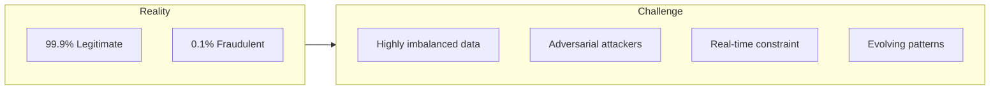
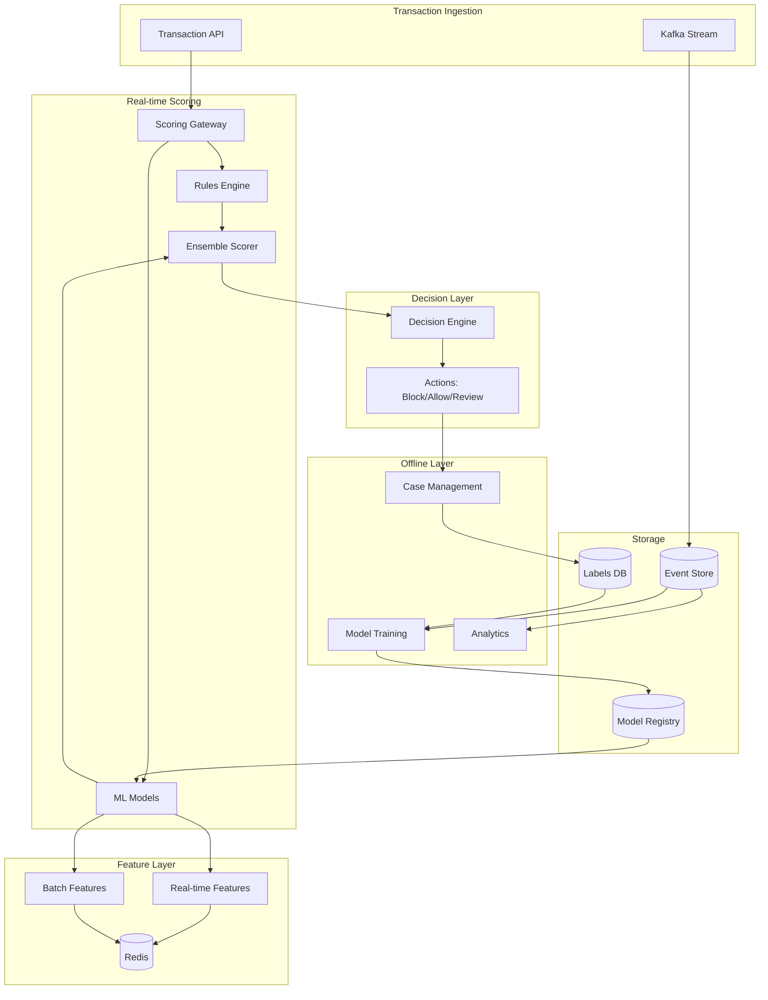
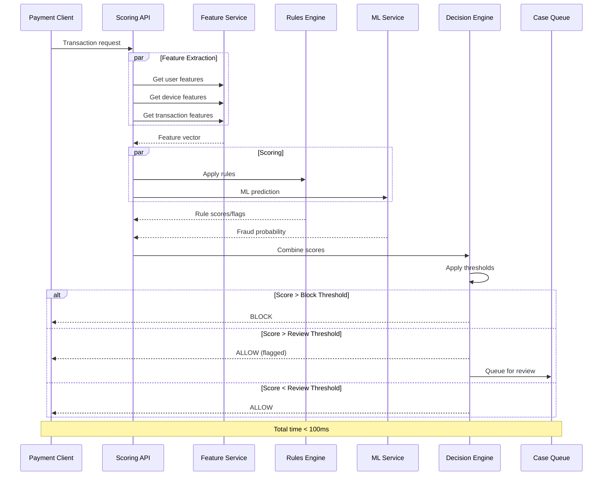

# Design a Real-time Fraud Detection System
{: .no_toc }

<details open markdown="block">
  <summary>Table of Contents</summary>
  {: .text-delta }
1. TOC
{:toc}
</details>

---

## What We're Building

A real-time fraud detection system analyzes transactions as they happen and decides whether to approve, decline, or flag them for review—all within milliseconds.

**The challenge:** A legitimate customer expects instant approval. A fraudster expects to be blocked. You have ~100ms to tell them apart.

### The Cost of Fraud

| Statistic | Impact |
|-----------|--------|
| Global card fraud losses | $32+ billion annually |
| Average fraud attack | Thousands of transactions in minutes |
| False positive cost | Lost customer, chargeback fees |
| False negative cost | Direct financial loss |

### Types of Fraud

| Type | Description | Example |
|------|-------------|---------|
| **Card-not-present** | Online transactions with stolen card data | E-commerce purchases |
| **Account takeover** | Legitimate account accessed by fraudster | Password breach |
| **Identity theft** | New accounts with stolen identity | Synthetic identity fraud |
| **Friendly fraud** | Legitimate user disputes valid transaction | Chargeback abuse |
| **Payment fraud** | Manipulation of payment systems | Double spending |

### The Detection Challenge



---

## ML Concepts for Fraud Detection

### Why It's Difficult

| Challenge | Description |
|-----------|-------------|
| **Class imbalance** | 99.9% legitimate, 0.1% fraud |
| **Adversarial** | Fraudsters adapt to detection |
| **Real-time** | Must decide in <100ms |
| **Concept drift** | Fraud patterns change constantly |
| **High stakes** | Both false positives and negatives are costly |

### Approaches

| Approach | How It Works | Pros | Cons |
|----------|--------------|------|------|
| **Rules-based** | If-then rules (velocity, amount) | Explainable, fast | Rigid, easily evaded |
| **Supervised ML** | Train on labeled fraud/non-fraud | Learns patterns | Needs labeled data |
| **Anomaly detection** | Detect unusual behavior | Catches new fraud | More false positives |
| **Graph analysis** | Network of related entities | Catches fraud rings | Complex to build |
| **Ensemble** | Combine multiple approaches | Best accuracy | More complex |

### Key Metrics

| Metric | Description | Target |
|--------|-------------|--------|
| **Precision** | % of flagged that are fraud | > 80% |
| **Recall** | % of fraud caught | > 95% |
| **False Positive Rate** | Legitimate flagged as fraud | < 1% |
| **Latency** | Decision time | < 100ms |
| **$ Saved** | Value of prevented fraud | Business metric |

### The Precision-Recall Trade-off

```
High Recall (catch more fraud):
  - Block more transactions
  - More legitimate customers affected
  - Customer complaints increase

High Precision (fewer false positives):
  - May miss some fraud
  - Better customer experience
  - Some fraud losses

Goal: Optimize the business trade-off ($ fraud prevented - $ customer loss)
```

---

## Step 1: Requirements Clarification

### Questions to Ask

| Question | Why It Matters |
|----------|----------------|
| What types of transactions? | Payment, login, transfer? |
| Current fraud rate? | Baseline for improvement |
| Latency budget? | Real-time constraints |
| Actions available? | Block, review, 3DS, etc. |
| Regulatory requirements? | Explainability, data retention |
| Historical data available? | Training data quality |

### Functional Requirements

| Feature | Priority | Description |
|---------|----------|-------------|
| Real-time scoring | Must have | Score each transaction |
| Block/allow decision | Must have | Binary or tiered |
| Case management | Must have | Review flagged transactions |
| Rules engine | Must have | Business rules layer |
| Model training | Must have | Continuous improvement |
| Reporting/analytics | Nice to have | Fraud trends, metrics |

### Non-Functional Requirements

| Requirement | Target | Rationale |
|-------------|--------|-----------|
| **Latency** | < 100ms P99 | Don't slow checkout |
| **Availability** | 99.99% | Can't block all transactions |
| **Throughput** | 10,000+ TPS | Handle peak load |
| **Accuracy** | >95% recall, <1% FPR | Balance fraud/customer |
| **Explainability** | Required | Regulatory, disputes |

---

## Step 2: High-Level Architecture

### System Overview



### Request Flow



---

## Step 3: Feature Engineering

Features are the heart of fraud detection. The model is only as good as its features.

### Feature Categories

| Category | Examples | Computation |
|----------|----------|-------------|
| **Transaction** | Amount, merchant, category, time | Direct from event |
| **User history** | Avg transaction, frequency, usual merchants | Aggregated |
| **Device** | Device ID, IP, browser fingerprint | From request |
| **Velocity** | Transactions in last hour/day | Real-time aggregation |
| **Network** | Related accounts, shared attributes | Graph features |
| **Behavioral** | Typing patterns, mouse movement | Biometric signals |

### Real-time Feature Computation

```python
class RealTimeFeatureService:
    """Compute features in real-time for fraud scoring."""
    
    def __init__(self, redis_client, feature_store):
        self.redis = redis_client
        self.feature_store = feature_store
    
    async def compute_features(self, transaction: dict) -> dict:
        """Compute all features for a transaction."""
        user_id = transaction["user_id"]
        device_id = transaction["device_id"]
        amount = transaction["amount"]
        
        # Parallel feature computation
        features = await asyncio.gather(
            self.get_transaction_features(transaction),
            self.get_user_features(user_id),
            self.get_velocity_features(user_id),
            self.get_device_features(device_id),
            self.get_merchant_features(transaction["merchant_id"]),
            self.get_network_features(user_id, device_id),
        )
        
        # Merge all features
        all_features = {}
        for feature_dict in features:
            all_features.update(feature_dict)
        
        return all_features
    
    async def get_velocity_features(self, user_id: str) -> dict:
        """Compute velocity features (transactions over time windows)."""
        now = time.time()
        
        # Keys for different time windows
        keys = {
            "1h": f"velocity:{user_id}:1h:{int(now // 3600)}",
            "24h": f"velocity:{user_id}:24h:{int(now // 86400)}",
            "7d": f"velocity:{user_id}:7d:{int(now // 604800)}",
        }
        
        # Get counts and amounts from Redis
        pipe = self.redis.pipeline()
        for key in keys.values():
            pipe.hgetall(key)
        results = await pipe.execute()
        
        features = {}
        for window, result in zip(keys.keys(), results):
            features[f"tx_count_{window}"] = int(result.get("count", 0))
            features[f"tx_amount_{window}"] = float(result.get("amount", 0))
        
        return features
    
    async def get_user_features(self, user_id: str) -> dict:
        """Get precomputed user features from feature store."""
        features = await self.feature_store.get_features(
            entity="user",
            entity_id=user_id,
            features=[
                "avg_transaction_amount",
                "transaction_frequency",
                "account_age_days",
                "usual_transaction_hour",
                "num_devices_used",
                "num_merchants_used",
                "fraud_history_count",
                "dispute_history_count",
            ]
        )
        return features
    
    async def get_device_features(self, device_id: str) -> dict:
        """Get device features."""
        return await self.feature_store.get_features(
            entity="device",
            entity_id=device_id,
            features=[
                "device_age_days",
                "num_users_on_device",
                "fraud_rate_on_device",
                "is_known_vpn",
                "is_datacenter_ip",
                "device_trust_score",
            ]
        )
```

### Velocity Update on Transaction

```python
class VelocityTracker:
    """Track transaction velocity for fraud detection."""
    
    def __init__(self, redis_client):
        self.redis = redis_client
    
    async def record_transaction(self, user_id: str, amount: float):
        """Update velocity counters after transaction."""
        now = time.time()
        
        # Update multiple time windows
        windows = [
            ("1h", 3600),
            ("24h", 86400),
            ("7d", 604800),
        ]
        
        pipe = self.redis.pipeline()
        
        for window_name, window_seconds in windows:
            key = f"velocity:{user_id}:{window_name}:{int(now // window_seconds)}"
            
            # Increment count and amount
            pipe.hincrby(key, "count", 1)
            pipe.hincrbyfloat(key, "amount", amount)
            pipe.expire(key, window_seconds * 2)  # Keep for 2 windows
        
        await pipe.execute()
    
    async def get_velocity(self, user_id: str) -> dict:
        """Get current velocity for user."""
        now = time.time()
        
        result = {}
        windows = [("1h", 3600), ("24h", 86400), ("7d", 604800)]
        
        pipe = self.redis.pipeline()
        for window_name, window_seconds in windows:
            # Current window
            key = f"velocity:{user_id}:{window_name}:{int(now // window_seconds)}"
            pipe.hgetall(key)
            
            # Previous window (for sliding window effect)
            prev_key = f"velocity:{user_id}:{window_name}:{int(now // window_seconds) - 1}"
            pipe.hgetall(prev_key)
        
        results = await pipe.execute()
        
        for i, (window_name, _) in enumerate(windows):
            current = results[i * 2]
            previous = results[i * 2 + 1]
            
            # Combine current and previous for approximate sliding window
            result[f"count_{window_name}"] = (
                int(current.get("count", 0)) + 
                int(previous.get("count", 0)) // 2
            )
            result[f"amount_{window_name}"] = (
                float(current.get("amount", 0)) + 
                float(previous.get("amount", 0)) / 2
            )
        
        return result
```

---

## Step 4: Rules Engine

Rules provide a fast, explainable first line of defense.

### Rule Types

```python
from dataclasses import dataclass
from typing import Callable, Optional
from enum import Enum

class RuleAction(Enum):
    BLOCK = "block"
    REVIEW = "review"
    ALLOW = "allow"
    SCORE_ADJUST = "score_adjust"

@dataclass
class Rule:
    name: str
    condition: Callable[[dict], bool]
    action: RuleAction
    score_delta: float = 0.0
    priority: int = 0
    enabled: bool = True

class RulesEngine:
    """Fast rule-based fraud detection layer."""
    
    def __init__(self):
        self.rules = []
        self.load_rules()
    
    def load_rules(self):
        """Load fraud detection rules."""
        self.rules = [
            # Blocklist rules
            Rule(
                name="blocked_country",
                condition=lambda t: t["country"] in BLOCKED_COUNTRIES,
                action=RuleAction.BLOCK,
                priority=100
            ),
            
            Rule(
                name="blocked_device",
                condition=lambda t: t["device_id"] in get_blocked_devices(),
                action=RuleAction.BLOCK,
                priority=100
            ),
            
            # Velocity rules
            Rule(
                name="high_velocity_amount",
                condition=lambda t: t["amount_24h"] > 10000,
                action=RuleAction.REVIEW,
                score_delta=0.3,
                priority=50
            ),
            
            Rule(
                name="high_velocity_count",
                condition=lambda t: t["tx_count_1h"] > 10,
                action=RuleAction.REVIEW,
                score_delta=0.2,
                priority=50
            ),
            
            # Amount rules
            Rule(
                name="large_first_transaction",
                condition=lambda t: (
                    t["account_age_days"] < 7 and 
                    t["amount"] > 500
                ),
                action=RuleAction.REVIEW,
                score_delta=0.25,
                priority=40
            ),
            
            # Behavioral rules
            Rule(
                name="unusual_hour",
                condition=lambda t: (
                    abs(t["transaction_hour"] - t["usual_transaction_hour"]) > 6
                ),
                action=RuleAction.SCORE_ADJUST,
                score_delta=0.1,
                priority=20
            ),
            
            # Device rules
            Rule(
                name="datacenter_ip",
                condition=lambda t: t.get("is_datacenter_ip", False),
                action=RuleAction.SCORE_ADJUST,
                score_delta=0.15,
                priority=30
            ),
            
            Rule(
                name="new_device_large_amount",
                condition=lambda t: (
                    t["device_age_days"] < 1 and 
                    t["amount"] > t["avg_transaction_amount"] * 3
                ),
                action=RuleAction.REVIEW,
                score_delta=0.3,
                priority=45
            ),
        ]
        
        # Sort by priority
        self.rules.sort(key=lambda r: r.priority, reverse=True)
    
    def evaluate(self, transaction: dict) -> dict:
        """Evaluate all rules against transaction."""
        result = {
            "triggered_rules": [],
            "action": RuleAction.ALLOW,
            "score_adjustment": 0.0,
        }
        
        for rule in self.rules:
            if not rule.enabled:
                continue
            
            try:
                if rule.condition(transaction):
                    result["triggered_rules"].append(rule.name)
                    result["score_adjustment"] += rule.score_delta
                    
                    # BLOCK takes precedence
                    if rule.action == RuleAction.BLOCK:
                        result["action"] = RuleAction.BLOCK
                        break
                    elif rule.action == RuleAction.REVIEW:
                        if result["action"] != RuleAction.BLOCK:
                            result["action"] = RuleAction.REVIEW
            except Exception as e:
                # Log but don't fail on rule errors
                logger.error(f"Rule {rule.name} failed: {e}")
        
        return result
```

### Dynamic Rule Management

```python
class DynamicRulesManager:
    """Manage rules without code deployment."""
    
    def __init__(self, db, redis):
        self.db = db
        self.redis = redis
        self.rules_cache = None
        self.cache_ttl = 60  # Refresh every minute
    
    async def get_rules(self) -> List[Rule]:
        """Get current rules from database with caching."""
        cached = await self.redis.get("fraud_rules")
        
        if cached:
            return self.deserialize_rules(cached)
        
        rules = await self.db.fetch("""
            SELECT * FROM fraud_rules 
            WHERE enabled = true 
            ORDER BY priority DESC
        """)
        
        await self.redis.setex("fraud_rules", self.cache_ttl, 
                               self.serialize_rules(rules))
        
        return rules
    
    async def add_rule(self, rule: Rule):
        """Add new rule (takes effect within cache TTL)."""
        await self.db.execute("""
            INSERT INTO fraud_rules (name, condition, action, score_delta, priority)
            VALUES ($1, $2, $3, $4, $5)
        """, rule.name, rule.condition_json, rule.action.value, 
            rule.score_delta, rule.priority)
        
        # Invalidate cache
        await self.redis.delete("fraud_rules")
```

---

## Step 5: ML Models

### Model Architecture

```python
import tensorflow as tf
from tensorflow import keras

class FraudDetectionModel:
    """Deep learning model for fraud detection."""
    
    def __init__(self, feature_config):
        self.feature_config = feature_config
        self.model = self.build_model()
    
    def build_model(self):
        """Build the neural network architecture."""
        
        # Input layers for different feature types
        inputs = {}
        
        # Numerical features
        numerical_input = keras.Input(
            shape=(len(self.feature_config['numerical']),),
            name='numerical'
        )
        inputs['numerical'] = numerical_input
        
        # Categorical features (embeddings)
        categorical_inputs = []
        categorical_embeddings = []
        
        for feat_name, vocab_size in self.feature_config['categorical'].items():
            inp = keras.Input(shape=(1,), name=feat_name)
            inputs[feat_name] = inp
            
            emb = keras.layers.Embedding(
                vocab_size, 
                min(50, vocab_size // 2)
            )(inp)
            emb = keras.layers.Flatten()(emb)
            categorical_embeddings.append(emb)
        
        # Concatenate all inputs
        if categorical_embeddings:
            x = keras.layers.Concatenate()(
                [numerical_input] + categorical_embeddings
            )
        else:
            x = numerical_input
        
        # Deep network
        x = keras.layers.BatchNormalization()(x)
        
        for units in [256, 128, 64]:
            x = keras.layers.Dense(units, activation='relu')(x)
            x = keras.layers.BatchNormalization()(x)
            x = keras.layers.Dropout(0.3)(x)
        
        # Output: fraud probability
        output = keras.layers.Dense(1, activation='sigmoid', name='fraud_prob')(x)
        
        model = keras.Model(inputs=inputs, outputs=output)
        
        # Use focal loss for class imbalance
        model.compile(
            optimizer=keras.optimizers.Adam(learning_rate=0.001),
            loss=self.focal_loss,
            metrics=[
                keras.metrics.AUC(name='auc'),
                keras.metrics.Precision(name='precision'),
                keras.metrics.Recall(name='recall'),
            ]
        )
        
        return model
    
    def focal_loss(self, y_true, y_pred, gamma=2.0, alpha=0.25):
        """Focal loss for handling class imbalance."""
        epsilon = keras.backend.epsilon()
        y_pred = keras.backend.clip(y_pred, epsilon, 1 - epsilon)
        
        p_t = y_true * y_pred + (1 - y_true) * (1 - y_pred)
        alpha_t = y_true * alpha + (1 - y_true) * (1 - alpha)
        
        focal_loss = -alpha_t * keras.backend.pow(1 - p_t, gamma) * keras.backend.log(p_t)
        
        return keras.backend.mean(focal_loss)
```

### Ensemble Scoring

Combine multiple models and approaches:

```python
class FraudEnsemble:
    """Ensemble of multiple fraud detection approaches."""
    
    def __init__(self):
        self.models = {
            "xgboost": self.load_xgboost_model(),
            "neural": self.load_neural_model(),
            "isolation_forest": self.load_anomaly_model(),
        }
        self.weights = {
            "xgboost": 0.4,
            "neural": 0.4,
            "isolation_forest": 0.2,
        }
    
    async def predict(self, features: dict) -> dict:
        """Get ensemble prediction."""
        
        # Get predictions from all models
        predictions = {}
        
        for name, model in self.models.items():
            pred = await self.predict_model(model, features)
            predictions[name] = pred
        
        # Weighted average
        ensemble_score = sum(
            predictions[name] * self.weights[name]
            for name in predictions
        )
        
        return {
            "ensemble_score": ensemble_score,
            "model_scores": predictions,
        }
    
    async def predict_with_explanation(self, features: dict) -> dict:
        """Get prediction with feature importance."""
        
        prediction = await self.predict(features)
        
        # SHAP values for explainability
        shap_values = self.explain_prediction(features)
        
        # Top contributing features
        top_features = sorted(
            shap_values.items(),
            key=lambda x: abs(x[1]),
            reverse=True
        )[:5]
        
        prediction["explanation"] = {
            "top_features": [
                {"feature": f, "contribution": v}
                for f, v in top_features
            ]
        }
        
        return prediction
```

### Anomaly Detection

Catch novel fraud patterns:

```python
from sklearn.ensemble import IsolationForest
import numpy as np

class AnomalyDetector:
    """Detect unusual transactions using unsupervised learning."""
    
    def __init__(self, contamination=0.01):
        self.model = IsolationForest(
            contamination=contamination,
            n_estimators=100,
            random_state=42
        )
        self.scaler = StandardScaler()
    
    def fit(self, normal_transactions: np.ndarray):
        """Train on normal transaction data."""
        scaled = self.scaler.fit_transform(normal_transactions)
        self.model.fit(scaled)
    
    def predict(self, features: np.ndarray) -> float:
        """Return anomaly score (higher = more anomalous)."""
        scaled = self.scaler.transform(features.reshape(1, -1))
        
        # Isolation Forest returns -1 for anomalies, 1 for normal
        raw_score = self.model.decision_function(scaled)[0]
        
        # Convert to probability-like score (0-1)
        # More negative = more anomalous
        anomaly_score = 1 / (1 + np.exp(raw_score))
        
        return float(anomaly_score)
```

---

## Step 6: Decision Engine

Combine all signals into a final decision.

```python
class DecisionEngine:
    """Make final fraud decision based on all signals."""
    
    def __init__(self, config):
        self.config = config
        self.thresholds = config["thresholds"]
    
    async def decide(self, 
                    transaction: dict,
                    rule_result: dict,
                    ml_result: dict) -> dict:
        """Make fraud decision."""
        
        # Start with ML score
        base_score = ml_result["ensemble_score"]
        
        # Apply rule adjustments
        adjusted_score = base_score + rule_result["score_adjustment"]
        adjusted_score = min(1.0, max(0.0, adjusted_score))
        
        # Determine action
        if rule_result["action"] == RuleAction.BLOCK:
            action = "BLOCK"
            reason = f"Blocked by rule: {rule_result['triggered_rules']}"
        elif adjusted_score >= self.thresholds["block"]:
            action = "BLOCK"
            reason = f"High fraud score: {adjusted_score:.3f}"
        elif adjusted_score >= self.thresholds["review"]:
            action = "REVIEW"
            reason = f"Medium fraud score: {adjusted_score:.3f}"
        else:
            action = "ALLOW"
            reason = "Low fraud score"
        
        # Additional checks for high-value transactions
        if transaction["amount"] > self.config["high_value_threshold"]:
            if action == "ALLOW" and adjusted_score > self.thresholds["review"] * 0.5:
                action = "REVIEW"
                reason = "High value transaction requires review"
        
        decision = {
            "action": action,
            "reason": reason,
            "score": adjusted_score,
            "model_scores": ml_result["model_scores"],
            "triggered_rules": rule_result["triggered_rules"],
            "transaction_id": transaction["transaction_id"],
            "timestamp": datetime.utcnow().isoformat(),
        }
        
        # Log decision
        await self.log_decision(decision)
        
        return decision
    
    async def log_decision(self, decision: dict):
        """Log decision for analysis and model training."""
        await kafka_producer.send("fraud_decisions", decision)
```

### Tiered Decision with 3D Secure

```python
class TieredDecisionEngine:
    """Multi-tier fraud response."""
    
    async def decide(self, transaction: dict, score: float) -> dict:
        """Determine appropriate action based on risk."""
        
        if score >= 0.9:
            return {
                "action": "BLOCK",
                "reason": "Very high fraud risk"
            }
        
        elif score >= 0.7:
            return {
                "action": "CHALLENGE",
                "challenge_type": "3DS",  # 3D Secure authentication
                "reason": "High fraud risk - step-up auth required"
            }
        
        elif score >= 0.5:
            return {
                "action": "CHALLENGE",
                "challenge_type": "OTP",  # One-time password
                "reason": "Medium fraud risk"
            }
        
        elif score >= 0.3:
            return {
                "action": "REVIEW",
                "allow_transaction": True,
                "queue_for_review": True,
                "reason": "Low-medium risk - post-transaction review"
            }
        
        else:
            return {
                "action": "ALLOW",
                "reason": "Low fraud risk"
            }
```

---

## Step 7: Model Training Pipeline

### Training Data Preparation

```python
class FraudTrainingDataGenerator:
    """Generate balanced training data for fraud models."""
    
    def __init__(self, data_warehouse):
        self.dw = data_warehouse
    
    async def generate_training_data(self, 
                                    start_date: str,
                                    end_date: str) -> pd.DataFrame:
        """Generate training dataset with labels."""
        
        # Get all transactions
        transactions = await self.dw.query(f"""
            SELECT t.*, 
                   COALESCE(c.is_fraud, 0) as is_fraud,
                   COALESCE(c.fraud_type, 'none') as fraud_type
            FROM transactions t
            LEFT JOIN chargebacks c ON t.transaction_id = c.transaction_id
            WHERE t.created_at BETWEEN '{start_date}' AND '{end_date}'
        """)
        
        # Add features
        transactions = await self.add_features(transactions)
        
        # Handle class imbalance
        fraud = transactions[transactions["is_fraud"] == 1]
        non_fraud = transactions[transactions["is_fraud"] == 0]
        
        # Undersample non-fraud or oversample fraud
        if len(fraud) < len(non_fraud) * 0.1:
            # Oversample fraud using SMOTE
            balanced = self.apply_smote(transactions)
        else:
            # Undersample non-fraud
            non_fraud_sample = non_fraud.sample(n=len(fraud) * 10)
            balanced = pd.concat([fraud, non_fraud_sample])
        
        return balanced.sample(frac=1).reset_index(drop=True)  # Shuffle
    
    def apply_smote(self, df: pd.DataFrame) -> pd.DataFrame:
        """Apply SMOTE for oversampling minority class."""
        from imblearn.over_sampling import SMOTE
        
        X = df.drop(columns=["is_fraud", "transaction_id"])
        y = df["is_fraud"]
        
        smote = SMOTE(sampling_strategy=0.3, random_state=42)
        X_balanced, y_balanced = smote.fit_resample(X, y)
        
        balanced = X_balanced.copy()
        balanced["is_fraud"] = y_balanced
        
        return balanced
```

### Model Training

```python
class FraudModelTrainer:
    """Train and evaluate fraud detection models."""
    
    def __init__(self, mlflow_tracking_uri):
        mlflow.set_tracking_uri(mlflow_tracking_uri)
    
    async def train(self, training_data: pd.DataFrame) -> dict:
        """Train model and log to MLflow."""
        
        with mlflow.start_run():
            # Prepare features
            X = training_data.drop(columns=["is_fraud", "transaction_id"])
            y = training_data["is_fraud"]
            
            # Time-based split (no data leakage)
            X_train, X_val, X_test = self.temporal_split(X, y)
            
            # Train XGBoost
            xgb_model = self.train_xgboost(X_train, y_train)
            
            # Train Neural Network
            nn_model = self.train_neural(X_train, y_train)
            
            # Evaluate
            metrics = self.evaluate(
                [xgb_model, nn_model],
                X_test, y_test
            )
            
            # Log metrics
            mlflow.log_metrics(metrics)
            
            # Log models
            mlflow.xgboost.log_model(xgb_model, "xgboost")
            mlflow.keras.log_model(nn_model, "neural")
            
            # Register if improved
            if self.should_promote(metrics):
                self.register_model(xgb_model, nn_model)
            
            return metrics
    
    def evaluate(self, models, X_test, y_test) -> dict:
        """Evaluate models on test set."""
        
        # Ensemble prediction
        predictions = np.mean([m.predict_proba(X_test)[:, 1] for m in models], axis=0)
        
        # Metrics at various thresholds
        metrics = {}
        
        for threshold in [0.3, 0.5, 0.7]:
            y_pred = (predictions >= threshold).astype(int)
            
            metrics[f"precision@{threshold}"] = precision_score(y_test, y_pred)
            metrics[f"recall@{threshold}"] = recall_score(y_test, y_pred)
            metrics[f"f1@{threshold}"] = f1_score(y_test, y_pred)
        
        metrics["auc_roc"] = roc_auc_score(y_test, predictions)
        metrics["auc_pr"] = average_precision_score(y_test, predictions)
        
        # Business metric: $ at risk
        # (simulated - would use actual amounts in production)
        
        return metrics
```

---

## Step 8: Case Management

Flagged transactions need human review.

```python
class CaseManagementService:
    """Manage fraud review cases."""
    
    def __init__(self, db, queue):
        self.db = db
        self.queue = queue
    
    async def create_case(self, transaction: dict, decision: dict):
        """Create a case for review."""
        
        case = {
            "case_id": generate_case_id(),
            "transaction_id": transaction["transaction_id"],
            "user_id": transaction["user_id"],
            "amount": transaction["amount"],
            "fraud_score": decision["score"],
            "triggered_rules": decision["triggered_rules"],
            "model_scores": decision["model_scores"],
            "status": "pending",
            "priority": self.calculate_priority(transaction, decision),
            "created_at": datetime.utcnow(),
            "sla_deadline": self.calculate_sla(decision),
        }
        
        await self.db.insert("fraud_cases", case)
        await self.queue.push(case, priority=case["priority"])
        
        return case
    
    def calculate_priority(self, transaction: dict, decision: dict) -> int:
        """Calculate case priority (lower = higher priority)."""
        priority = 50  # Default
        
        # Higher score = higher priority
        priority -= int(decision["score"] * 30)
        
        # Higher amount = higher priority
        if transaction["amount"] > 1000:
            priority -= 10
        if transaction["amount"] > 5000:
            priority -= 10
        
        return max(1, priority)
    
    async def assign_case(self, case_id: str, analyst_id: str):
        """Assign case to analyst."""
        await self.db.update("fraud_cases", 
            {"case_id": case_id},
            {"assigned_to": analyst_id, "status": "in_review"}
        )
    
    async def resolve_case(self, case_id: str, resolution: dict):
        """Resolve case with analyst decision."""
        
        case = await self.db.get("fraud_cases", case_id)
        
        await self.db.update("fraud_cases",
            {"case_id": case_id},
            {
                "status": "resolved",
                "resolution": resolution["decision"],  # "fraud" or "legitimate"
                "resolution_notes": resolution["notes"],
                "resolved_at": datetime.utcnow(),
                "resolved_by": resolution["analyst_id"],
            }
        )
        
        # Use for model training (feedback loop)
        await self.record_label(case, resolution)
    
    async def record_label(self, case: dict, resolution: dict):
        """Record label for model training."""
        label = {
            "transaction_id": case["transaction_id"],
            "is_fraud": resolution["decision"] == "fraud",
            "fraud_type": resolution.get("fraud_type"),
            "label_source": "analyst_review",
            "labeled_at": datetime.utcnow(),
        }
        
        await self.db.insert("fraud_labels", label)
        await kafka_producer.send("fraud_labels", label)
```

---

## Step 9: Monitoring and Drift Detection

### Key Metrics

```python
import prometheus_client as prom

# Latency
scoring_latency = prom.Histogram(
    'fraud_scoring_latency_seconds',
    'Time to score transaction',
    buckets=[0.01, 0.025, 0.05, 0.1, 0.25, 0.5]
)

# Decisions
fraud_decisions = prom.Counter(
    'fraud_decisions_total',
    'Fraud decisions made',
    ['decision', 'score_bucket']
)

# Model performance
model_scores = prom.Histogram(
    'fraud_model_scores',
    'Distribution of fraud scores',
    buckets=[0.1, 0.2, 0.3, 0.4, 0.5, 0.6, 0.7, 0.8, 0.9, 1.0]
)

# Feature drift
feature_distribution = prom.Gauge(
    'fraud_feature_mean',
    'Feature distribution for drift detection',
    ['feature_name']
)
```

### Drift Detection

```python
class DriftDetector:
    """Detect data and concept drift in fraud models."""
    
    def __init__(self, reference_data: pd.DataFrame):
        self.reference_stats = self.compute_stats(reference_data)
    
    def compute_stats(self, df: pd.DataFrame) -> dict:
        """Compute reference statistics."""
        stats = {}
        for col in df.select_dtypes(include=[np.number]).columns:
            stats[col] = {
                "mean": df[col].mean(),
                "std": df[col].std(),
                "quantiles": df[col].quantile([0.25, 0.5, 0.75]).to_dict()
            }
        return stats
    
    async def check_drift(self, recent_data: pd.DataFrame) -> dict:
        """Check for distribution drift."""
        current_stats = self.compute_stats(recent_data)
        
        drift_scores = {}
        
        for feature, ref_stats in self.reference_stats.items():
            if feature not in current_stats:
                continue
            
            curr_stats = current_stats[feature]
            
            # Population Stability Index (PSI)
            psi = self.calculate_psi(
                ref_stats["quantiles"],
                curr_stats["quantiles"]
            )
            
            drift_scores[feature] = {
                "psi": psi,
                "drifted": psi > 0.2,  # Common threshold
                "mean_shift": abs(curr_stats["mean"] - ref_stats["mean"]) / ref_stats["std"]
            }
        
        # Alert on significant drift
        drifted_features = [f for f, d in drift_scores.items() if d["drifted"]]
        
        if drifted_features:
            await self.alert_drift(drifted_features, drift_scores)
        
        return drift_scores
    
    def calculate_psi(self, expected: dict, actual: dict) -> float:
        """Calculate Population Stability Index."""
        psi = 0
        
        for q in expected:
            e = expected[q]
            a = actual.get(q, e)
            
            if e > 0 and a > 0:
                psi += (a - e) * np.log(a / e)
        
        return psi
```

### Performance Monitoring

```python
class FraudPerformanceMonitor:
    """Monitor fraud model performance over time."""
    
    async def calculate_metrics(self, 
                               start_date: str,
                               end_date: str) -> dict:
        """Calculate performance metrics for period."""
        
        # Get decisions and outcomes
        data = await self.db.query(f"""
            SELECT 
                d.decision,
                d.score,
                COALESCE(c.is_fraud, 0) as actual_fraud
            FROM fraud_decisions d
            LEFT JOIN chargebacks c ON d.transaction_id = c.transaction_id
            WHERE d.created_at BETWEEN '{start_date}' AND '{end_date}'
            AND d.created_at < NOW() - INTERVAL '30 days'  -- Allow for chargebacks
        """)
        
        # Calculate metrics
        blocked = data[data["decision"] == "BLOCK"]
        allowed = data[data["decision"] != "BLOCK"]
        
        metrics = {
            # Fraud caught
            "fraud_blocked": len(blocked[blocked["actual_fraud"] == 1]),
            "fraud_missed": len(allowed[allowed["actual_fraud"] == 1]),
            
            # False positives
            "legitimate_blocked": len(blocked[blocked["actual_fraud"] == 0]),
            
            # Rates
            "true_positive_rate": len(blocked[blocked["actual_fraud"] == 1]) / 
                                  max(1, len(data[data["actual_fraud"] == 1])),
            "false_positive_rate": len(blocked[blocked["actual_fraud"] == 0]) /
                                   max(1, len(data[data["actual_fraud"] == 0])),
            
            # Business impact
            "fraud_amount_blocked": blocked[blocked["actual_fraud"] == 1]["amount"].sum(),
            "fraud_amount_missed": allowed[allowed["actual_fraud"] == 1]["amount"].sum(),
        }
        
        return metrics
```

---

## Interview Checklist

- [ ] **Clarified requirements** (transaction types, latency, accuracy)
- [ ] **Explained architecture** (real-time scoring pipeline)
- [ ] **Covered feature engineering** (velocity, user, device features)
- [ ] **Discussed rules engine** (fast, explainable first layer)
- [ ] **Explained ML models** (class imbalance, ensemble)
- [ ] **Addressed decision logic** (thresholds, tiered responses)
- [ ] **Covered training pipeline** (data generation, evaluation)
- [ ] **Mentioned case management** (human review, feedback loop)
- [ ] **Discussed monitoring** (drift detection, performance)
- [ ] **Addressed explainability** (regulatory requirements)

---

## Sample Interview Dialogue

**Interviewer:** "Design a real-time fraud detection system for payment transactions."

**You:** "Interesting challenge! Let me clarify a few things. What's the latency budget—how long can we take to score a transaction? And what's the current fraud rate we're trying to improve?"

**Interviewer:** "We need decisions in under 100ms. Current fraud rate is about 0.1%, and we're missing about 20% of fraud."

**You:** "Got it. So we need to improve recall from 80% to higher, while keeping false positives low, all within 100ms.

I'd design a three-layer system:
1. **Rules engine** for fast, known patterns—blocked countries, velocity limits
2. **ML ensemble** combining XGBoost and neural network
3. **Decision engine** to combine scores and determine action

For features, I'd compute real-time velocity counters in Redis—transactions in last hour, day, week. These are critical fraud signals. We'd also use pre-computed user features from a feature store.

The ML model needs to handle severe class imbalance—0.1% fraud. I'd use focal loss and SMOTE for training, and optimize for precision-recall rather than accuracy.

For decisions, I'd use tiered responses: block high-risk, challenge medium-risk with 3D Secure, and allow low-risk with post-transaction review.

Want me to dive into any component?"

---

## Summary

| Component | Technology | Rationale |
|-----------|------------|-----------|
| **Feature Store** | Redis + Feast | Real-time + batch features |
| **Rules Engine** | Custom + config | Fast, explainable |
| **ML Models** | XGBoost + Neural | Ensemble accuracy |
| **Serving** | Low-latency API | <100ms requirement |
| **Case Queue** | Priority queue | Efficient review |
| **Training** | MLflow pipeline | Continuous improvement |
| **Monitoring** | Prometheus + custom | Drift detection |

Real-time fraud detection is one of the most challenging ML systems—combining strict latency requirements, severe class imbalance, adversarial actors, and high business stakes. The key is a layered approach with fast rules, accurate ML, and continuous monitoring.

