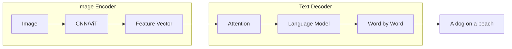
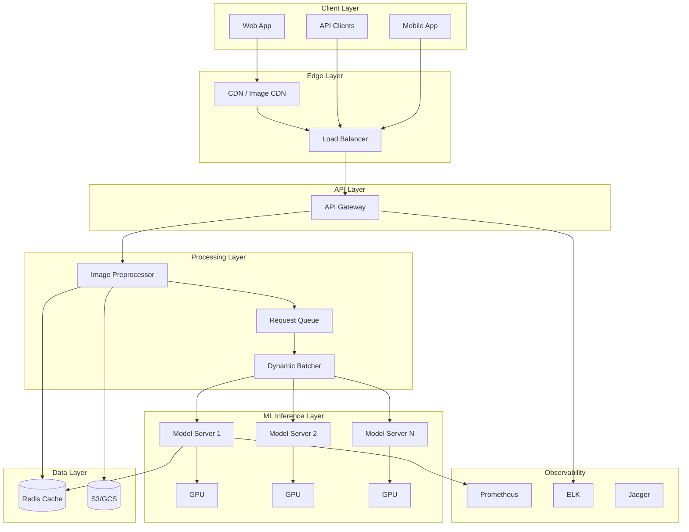
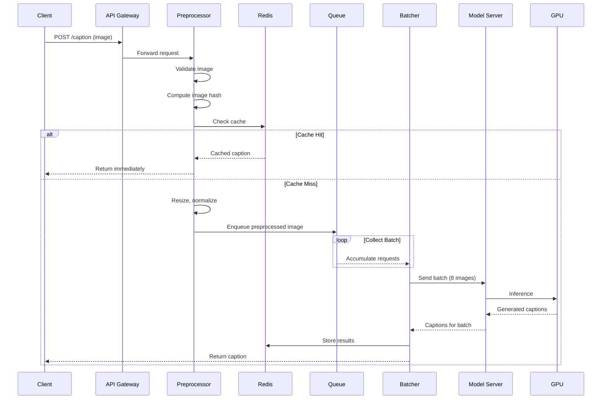
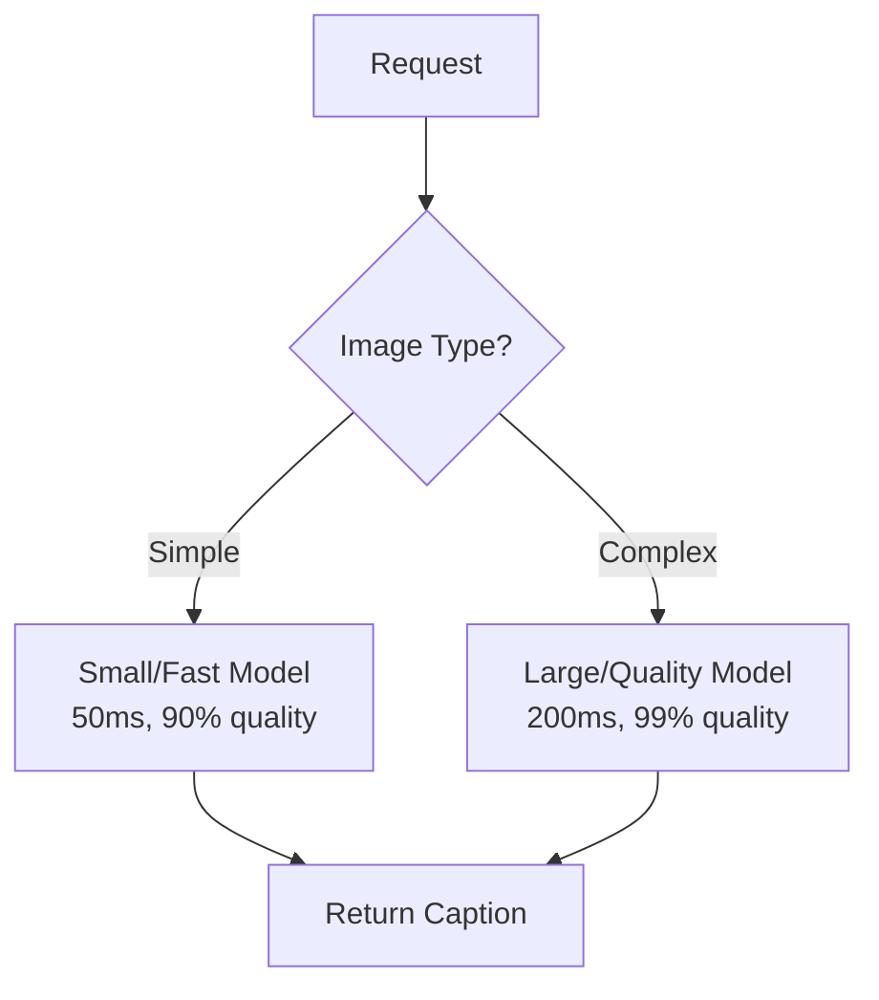
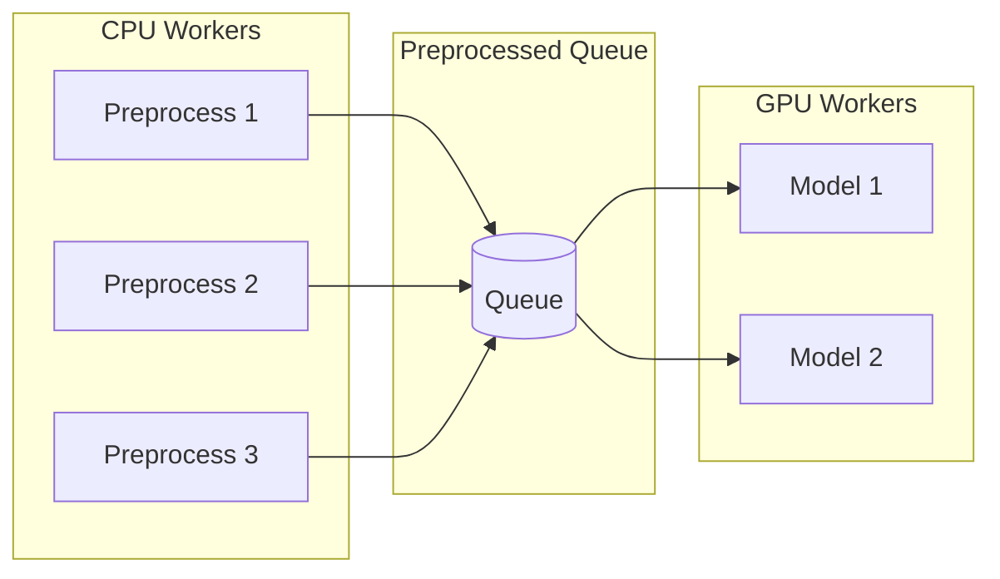

# Design an Image Caption Generator
{: .no_toc }

<details open markdown="block">
  <summary>Table of Contents</summary>
  {: .text-delta }
1. TOC
{:toc}
</details>

---

## What We're Building

An image caption generator automatically describes the content of an image in natural language.

**Input:** A photograph of a beach scene

**Output:** "A golden retriever running on a sandy beach with waves crashing in the background during sunset"

This is a fascinating intersection of computer vision (understanding images) and natural language processing (generating text). The system must "see" what's in the image and then "describe" it in coherent, natural language.

### Real-World Applications

| Application | How Captioning Helps |
|-------------|---------------------|
| **Accessibility** | Screen readers describe images to visually impaired users |
| **Social media** | Auto-suggest captions for posts (Instagram, Facebook) |
| **Search** | Index images by content for visual search |
| **Content moderation** | Understand image content for policy enforcement |
| **E-commerce** | Automatically describe product images |
| **Photo organization** | Categorize and tag personal photos |
| **Medical imaging** | Generate preliminary reports from X-rays, MRIs |

### System Design vs Model Design

This guide focuses on **system design**—how to build the infrastructure to serve an image captioning model at scale. We'll cover:
- Request handling and API design
- Image processing pipeline
- Model serving infrastructure
- Scaling and optimization
- Monitoring and reliability

We'll touch on model architecture but won't dive deep into training algorithms or neural network theory.

---

## ML Concepts Primer

If you're not from an ML background, here's what you need to know to understand this design.

### How Image Captioning Works

Image captioning uses a two-part architecture:



**Step 1: Encode the Image**

A Convolutional Neural Network (CNN) or Vision Transformer (ViT) processes the image and produces a "feature vector"—a numerical representation capturing what's in the image.

Think of it like this: the encoder looks at the image and creates a 2048-dimensional summary (just a list of 2048 numbers) that encodes "there's a dog, it's brown, there's sand, there's water, it's sunny."

**Step 2: Decode to Text**

A language model (often LSTM or Transformer) takes the feature vector and generates text word by word:
1. Given the image features, what's the most likely first word? → "A"
2. Given image features + "A", what's next? → "dog"
3. Given image features + "A dog", what's next? → "running"
4. Continue until reaching an end token

**Attention Mechanism**

Modern models use "attention" to focus on relevant image regions for each word:
- When generating "dog", attention focuses on the dog region
- When generating "beach", attention shifts to the sand/water

This is like how you'd describe a photo: look at the dog to describe it, then look at the background.

### Key ML Terms

| Term | Meaning | System Design Impact |
|------|---------|---------------------|
| **Inference** | Using trained model to make predictions | Main operation we're designing for |
| **Latency** | Time from input to output | Critical for real-time use |
| **Throughput** | Predictions per second | Determines hardware needs |
| **Batch processing** | Process multiple inputs together | Major optimization opportunity |
| **Model serving** | Infrastructure to run models | Core component of our system |
| **GPU** | Hardware that accelerates neural networks | 10-100x faster than CPU for inference |
| **Quantization** | Reduce model precision (32-bit → 8-bit) | Faster, smaller, slight quality loss |

### Popular Model Architectures

| Model | Architecture | Quality | Speed | Notes |
|-------|--------------|---------|-------|-------|
| **Show and Tell** | CNN + LSTM | Good | Fast | Classic baseline |
| **Show, Attend, Tell** | CNN + Attention + LSTM | Better | Medium | Added attention |
| **BLIP** | ViT + Transformer | Excellent | Medium | State-of-the-art |
| **BLIP-2** | ViT + Q-Former + LLM | Best | Slower | Uses frozen LLM |
| **GPT-4V** | Multimodal Transformer | Best | API | Closed source |
| **LLaVA** | ViT + Llama | Excellent | Medium | Open source |

For our system, we'll design around BLIP or similar—good balance of quality and efficiency.

---

## Step 1: Requirements Clarification

### Questions to Ask

| Question | Why It Matters | Typical Answer |
|----------|----------------|----------------|
| What's the primary use case? | Quality vs speed trade-off | Social media: fast. Accessibility: quality. |
| What types of images? | Model selection, preprocessing | General photos vs domain-specific |
| Real-time or batch? | Architecture completely different | Usually real-time for user-facing |
| Latency requirements? | GPU sizing, optimization depth | 100ms-2s depending on use case |
| Expected scale? | Infrastructure sizing | 10 img/sec to 10,000 img/sec |
| Multiple captions per image? | Beam search configuration | Often yes, with confidence scores |
| Multiple languages? | Model complexity | English only is simpler |

### Our Design: Social Media Caption Suggestions

Let's design a system for a social media platform that suggests captions when users upload photos.

**Functional Requirements:**

| Feature | Priority | Description |
|---------|----------|-------------|
| Accept image input | Must have | Upload or URL |
| Generate descriptive caption | Must have | Accurate, natural language |
| Return confidence score | Nice to have | How certain the model is |
| Multiple suggestions | Nice to have | Top 3 caption options |
| API access | Must have | RESTful API |

**Non-Functional Requirements:**

| Requirement | Target | Rationale |
|-------------|--------|-----------|
| **Latency** | < 1 second | User shouldn't wait long |
| **Throughput** | 1,000 img/sec | Handle peak social media traffic |
| **Availability** | 99.9% | Users expect it to work |
| **Quality** | High BLEU/CIDEr scores | Captions should be accurate |
| **Cost efficiency** | Minimize GPU usage | GPUs are expensive |

---

## Step 2: Back-of-Envelope Estimation

### Traffic Estimation

```
Assumptions:
- 10 million daily active users
- 5% upload photos = 500K photos/day
- 20% use caption suggestion = 100K requests/day

Average load:
- 100K / 86,400 seconds ≈ 1.2 requests/second

Peak load (evening surge, 10x average):
- 12 requests/second

Growth + buffer (10x peak):
- 120 requests/second target capacity
```

For a larger platform (Instagram-scale):
```
- 2 billion monthly active users
- 100 million photos uploaded daily
- 10 million caption requests daily
- Peak: 500 requests/second
```

### Compute Estimation

```
Model inference time:
- BLIP model: ~200ms per image on V100 GPU
- With batching (8 images): ~300ms for batch → ~37ms/image

GPU requirements for 120 req/sec:
- Single GPU (no batching): 120 × 0.2s = 24 GPU-seconds per second
  → Need 24 GPUs

- With batching (8x): 120 / 8 = 15 batches/sec × 0.3s = 4.5 GPU-seconds
  → Need ~5 GPUs

At 500 req/sec:
- With batching: ~20 GPUs
```

### Storage Estimation

```
Caching captions:
- 100K captions/day × 200 bytes = 20 MB/day
- 1 year: 7.3 GB (tiny)

Image storage (if we store temporarily):
- 100K images × 500 KB = 50 GB/day
- But we don't need to persist—process and discard
```

---

## Step 3: High-Level Architecture

### System Overview



### Request Flow

Let's trace a complete request:



---

## Step 4: Component Deep Dive

### 4.1 Image Preprocessing

Raw images need standardization before the model can process them:

```python
import cv2
import numpy as np
from PIL import Image
import io

class ImagePreprocessor:
    def __init__(self, target_size=(384, 384)):
        self.target_size = target_size
        # ImageNet normalization stats
        self.mean = np.array([0.485, 0.456, 0.406])
        self.std = np.array([0.229, 0.224, 0.225])
    
    def validate(self, image_bytes: bytes) -> bool:
        """Check if bytes represent a valid image."""
        try:
            img = Image.open(io.BytesIO(image_bytes))
            img.verify()  # Verify it's a valid image
            return True
        except Exception:
            return False
    
    def compute_hash(self, image_bytes: bytes) -> str:
        """Compute perceptual hash for caching."""
        import imagehash
        img = Image.open(io.BytesIO(image_bytes))
        # Perceptual hash - similar images get same hash
        return str(imagehash.phash(img))
    
    def preprocess(self, image_bytes: bytes) -> np.ndarray:
        """Convert raw bytes to model input tensor."""
        
        # Decode image
        img = Image.open(io.BytesIO(image_bytes)).convert('RGB')
        
        # Resize maintaining aspect ratio, then center crop
        img = self._resize_and_crop(img)
        
        # Convert to numpy array
        img_array = np.array(img).astype(np.float32) / 255.0
        
        # Normalize with ImageNet stats
        img_array = (img_array - self.mean) / self.std
        
        # Transpose to channel-first format (C, H, W)
        img_array = img_array.transpose(2, 0, 1)
        
        return img_array
    
    def _resize_and_crop(self, img: Image.Image) -> Image.Image:
        """Resize to target size, maintaining aspect ratio with center crop."""
        # Calculate resize dimensions
        width, height = img.size
        target_w, target_h = self.target_size
        
        # Resize so smaller dimension matches target
        scale = max(target_w / width, target_h / height)
        new_size = (int(width * scale), int(height * scale))
        img = img.resize(new_size, Image.LANCZOS)
        
        # Center crop to exact target size
        left = (img.width - target_w) // 2
        top = (img.height - target_h) // 2
        img = img.crop((left, top, left + target_w, top + target_h))
        
        return img
```

**Why preprocessing matters:**

1. **Consistency:** Models expect specific input dimensions and normalization
2. **Performance:** Resize large images before sending to GPU (faster)
3. **Validation:** Reject invalid/corrupt images early
4. **Caching:** Hash allows us to cache results for duplicate images

### 4.2 Caching Strategy

Caching is critical—if the same image was captioned before, don't waste GPU cycles.

```python
import redis
import json
import hashlib

class CaptionCache:
    def __init__(self, redis_client: redis.Redis, ttl: int = 86400):
        self.redis = redis_client
        self.ttl = ttl  # 24 hours
    
    def get(self, image_hash: str) -> dict | None:
        """Get cached caption by image hash."""
        key = f"caption:{image_hash}"
        cached = self.redis.get(key)
        
        if cached:
            return json.loads(cached)
        return None
    
    def set(self, image_hash: str, result: dict):
        """Cache caption result."""
        key = f"caption:{image_hash}"
        self.redis.setex(key, self.ttl, json.dumps(result))
    
    def get_or_compute(self, image_bytes: bytes, 
                       compute_fn: callable) -> dict:
        """Cache-aside pattern with perceptual hashing."""
        
        # Compute perceptual hash
        image_hash = self.compute_phash(image_bytes)
        
        # Check cache
        cached = self.get(image_hash)
        if cached:
            metrics.incr("caption_cache_hit")
            return cached
        
        metrics.incr("caption_cache_miss")
        
        # Compute caption
        result = compute_fn(image_bytes)
        
        # Cache for future
        self.set(image_hash, result)
        
        return result
```

**Perceptual Hashing vs Cryptographic Hashing:**

| Type | Same image, different format? | Similar images? | Use case |
|------|-------------------------------|-----------------|----------|
| MD5/SHA | Different hash | Different hash | Exact duplicate detection |
| Perceptual (pHash) | Same hash | Similar hash | Visual similarity |

We use **perceptual hashing** because:
- Same photo in JPEG vs PNG gets same hash
- Slightly resized versions get same hash
- Completely different images get different hashes

### 4.3 Dynamic Batching

GPUs are most efficient when processing multiple images simultaneously. Dynamic batching collects incoming requests and processes them together.

```python
import asyncio
import time
from dataclasses import dataclass
from typing import List
import uuid

@dataclass
class InferenceRequest:
    request_id: str
    image_tensor: np.ndarray
    future: asyncio.Future
    timestamp: float

class DynamicBatcher:
    def __init__(self, 
                 model_client,
                 max_batch_size: int = 8,
                 max_wait_ms: int = 50):
        self.model = model_client
        self.max_batch_size = max_batch_size
        self.max_wait_ms = max_wait_ms
        self.queue: List[InferenceRequest] = []
        self.lock = asyncio.Lock()
        self.processing = False
    
    async def add_request(self, image_tensor: np.ndarray) -> dict:
        """Add request and wait for result."""
        request = InferenceRequest(
            request_id=str(uuid.uuid4()),
            image_tensor=image_tensor,
            future=asyncio.Future(),
            timestamp=time.time()
        )
        
        async with self.lock:
            self.queue.append(request)
            
            # Trigger batch processing if needed
            if len(self.queue) >= self.max_batch_size:
                asyncio.create_task(self._process_batch())
            elif len(self.queue) == 1:
                # First request - start timer
                asyncio.create_task(self._wait_and_process())
        
        # Wait for result
        result = await request.future
        return result
    
    async def _wait_and_process(self):
        """Wait for max_wait_ms, then process whatever we have."""
        await asyncio.sleep(self.max_wait_ms / 1000)
        await self._process_batch()
    
    async def _process_batch(self):
        """Process current batch."""
        async with self.lock:
            if not self.queue or self.processing:
                return
            
            self.processing = True
            batch = self.queue[:self.max_batch_size]
            self.queue = self.queue[self.max_batch_size:]
        
        try:
            # Stack tensors into batch
            batch_tensor = np.stack([r.image_tensor for r in batch])
            
            # Run inference
            start = time.time()
            captions = await self.model.generate(batch_tensor)
            latency = (time.time() - start) * 1000
            
            metrics.observe("batch_inference_latency_ms", latency)
            metrics.observe("batch_size", len(batch))
            
            # Distribute results
            for request, caption in zip(batch, captions):
                request.future.set_result({
                    "caption": caption,
                    "latency_ms": latency / len(batch)
                })
        
        except Exception as e:
            # Propagate error to all waiting requests
            for request in batch:
                request.future.set_exception(e)
        
        finally:
            self.processing = False
            
            # Process remaining queue
            if self.queue:
                asyncio.create_task(self._process_batch())
```

**How batching improves efficiency:**

| Scenario | GPU Utilization | Throughput |
|----------|-----------------|------------|
| 1 image at a time | ~10% | 5 img/sec |
| Batch of 8 | ~80% | 27 img/sec |
| Batch of 16 | ~90% | 35 img/sec |
| Batch of 32 | ~95% | 40 img/sec |

**Trade-off:** Larger batches = higher throughput but higher latency (waiting for batch to fill).

Our configuration:
- `max_batch_size=8`: Good throughput without excessive latency
- `max_wait_ms=50`: Don't wait too long for batch to fill

### 4.4 Model Serving

We use a dedicated model serving framework instead of raw Python for production.

**Options:**

| Framework | Pros | Cons |
|-----------|------|------|
| **TensorFlow Serving** | Mature, TF optimized | TensorFlow only |
| **TorchServe** | PyTorch native | Less mature |
| **Triton Inference Server** | Multi-framework, optimized | Complex |
| **Ray Serve** | Easy scaling, Python native | Less optimized |
| **vLLM** | LLM-optimized | LLMs only |

**Recommendation:** Use **Triton Inference Server** for production:
- Handles batching automatically
- Supports TensorFlow, PyTorch, ONNX
- GPU memory management
- Model versioning
- Built-in metrics

**Triton Configuration:**

```
# model_repository/blip_caption/config.pbtxt
name: "blip_caption"
platform: "onnxruntime_onnx"  # or pytorch_libtorch
max_batch_size: 16

input [
  {
    name: "image"
    data_type: TYPE_FP32
    dims: [3, 384, 384]
  }
]

output [
  {
    name: "caption"
    data_type: TYPE_STRING
    dims: [1]
  },
  {
    name: "confidence"
    data_type: TYPE_FP32
    dims: [1]
  }
]

instance_group [
  {
    count: 2
    kind: KIND_GPU
  }
]

dynamic_batching {
  preferred_batch_size: [4, 8, 16]
  max_queue_delay_microseconds: 50000
}
```

**Triton Client:**

```python
import tritonclient.http as httpclient
import numpy as np

class TritonCaptionClient:
    def __init__(self, url: str = "localhost:8000"):
        self.client = httpclient.InferenceServerClient(url=url)
        self.model_name = "blip_caption"
    
    async def generate(self, image_batch: np.ndarray) -> List[str]:
        """Send batch to Triton and get captions."""
        
        # Prepare input
        inputs = [
            httpclient.InferInput("image", image_batch.shape, "FP32")
        ]
        inputs[0].set_data_from_numpy(image_batch)
        
        # Prepare output
        outputs = [
            httpclient.InferRequestedOutput("caption"),
            httpclient.InferRequestedOutput("confidence")
        ]
        
        # Inference
        response = await self.client.infer(
            model_name=self.model_name,
            inputs=inputs,
            outputs=outputs
        )
        
        captions = response.as_numpy("caption").tolist()
        confidences = response.as_numpy("confidence").tolist()
        
        return [
            {"text": cap.decode(), "confidence": float(conf)}
            for cap, conf in zip(captions, confidences)
        ]
```

---

## Step 5: Optimization Strategies

### 5.1 Model Optimization

| Technique | Speedup | Quality Impact | When to Use |
|-----------|---------|----------------|-------------|
| **FP16 (Half precision)** | 1.5-2x | Minimal | Always |
| **INT8 Quantization** | 2-4x | Minor | Latency critical |
| **Model Distillation** | 3-10x | Moderate | Extreme optimization |
| **TensorRT** | 2-5x | None | NVIDIA GPUs |
| **ONNX Runtime** | 1.5-3x | None | Cross-platform |

**Applying TensorRT optimization:**

```python
import torch
import torch_tensorrt

# Load PyTorch model
model = load_blip_model()
model.eval()

# Create example input
example_input = torch.randn(1, 3, 384, 384).cuda()

# Compile with TensorRT
optimized_model = torch_tensorrt.compile(
    model,
    inputs=[
        torch_tensorrt.Input(
            min_shape=[1, 3, 384, 384],
            opt_shape=[8, 3, 384, 384],  # Optimal batch size
            max_shape=[16, 3, 384, 384],
            dtype=torch.float16
        )
    ],
    enabled_precisions={torch.float16},  # Use FP16
)

# Save optimized model
torch.save(optimized_model, "blip_trt.pt")
```

### 5.2 Multi-Model Strategy

Use different models based on requirements:



```python
class AdaptiveModelRouter:
    def __init__(self):
        self.fast_model = load_small_model()   # MobileNet + small decoder
        self.quality_model = load_large_model() # ViT-L + large decoder
    
    async def caption(self, image: np.ndarray, 
                      priority: str = "balanced") -> dict:
        if priority == "speed":
            return await self.fast_model.generate(image)
        elif priority == "quality":
            return await self.quality_model.generate(image)
        else:
            # Balanced: try fast first, fall back if low confidence
            result = await self.fast_model.generate(image)
            if result["confidence"] < 0.7:
                result = await self.quality_model.generate(image)
            return result
```

### 5.3 Preprocessing Pipeline Optimization

Move preprocessing to CPU workers, keep GPUs for inference:



This keeps expensive GPU resources focused on inference, not waiting for I/O or preprocessing.

---

## Step 6: Caption Quality Improvements

### 6.1 Beam Search

Instead of greedily picking the most likely word at each step, explore multiple possibilities:

```python
class BeamSearchDecoder:
    def __init__(self, model, beam_width: int = 5):
        self.model = model
        self.beam_width = beam_width
    
    def generate(self, image_features, max_length: int = 30):
        """Generate caption using beam search."""
        
        # Start with <START> token
        beams = [{"tokens": [START_TOKEN], "score": 0.0}]
        
        for _ in range(max_length):
            all_candidates = []
            
            for beam in beams:
                if beam["tokens"][-1] == END_TOKEN:
                    all_candidates.append(beam)
                    continue
                
                # Get probabilities for next token
                probs = self.model.next_token_probs(
                    image_features, 
                    beam["tokens"]
                )
                
                # Consider top-k next tokens
                top_k = probs.topk(self.beam_width)
                
                for prob, token in zip(top_k.values, top_k.indices):
                    new_beam = {
                        "tokens": beam["tokens"] + [token],
                        "score": beam["score"] + log(prob)
                    }
                    all_candidates.append(new_beam)
            
            # Keep top beam_width beams
            beams = sorted(all_candidates, 
                          key=lambda x: x["score"], 
                          reverse=True)[:self.beam_width]
        
        # Return best caption
        best = beams[0]
        return self.tokens_to_text(best["tokens"]), best["score"]
```

**Trade-off:** Beam width 5 is good balance. Higher = better quality but slower.

### 6.2 Multiple Caption Suggestions

Return top N diverse captions:

```python
async def generate_suggestions(image: bytes, n: int = 3) -> List[dict]:
    """Generate multiple diverse caption suggestions."""
    
    preprocessed = preprocessor.preprocess(image)
    
    # Use higher beam width to get more options
    captions = beam_search(preprocessed, beam_width=n*2, n_best=n*2)
    
    # Filter for diversity (remove near-duplicates)
    diverse = []
    for caption in captions:
        is_duplicate = any(
            similarity(caption["text"], existing["text"]) > 0.8
            for existing in diverse
        )
        if not is_duplicate:
            diverse.append(caption)
            if len(diverse) >= n:
                break
    
    return diverse
```

### 6.3 Style/Tone Control

Allow users to request different caption styles:

```python
STYLE_PROMPTS = {
    "descriptive": "",  # Default
    "poetic": "Describe this image poetically: ",
    "humorous": "Write a funny caption for this image: ",
    "formal": "Provide a formal description of this image: ",
    "concise": "Describe in 5 words or less: "
}

async def caption_with_style(image: bytes, style: str = "descriptive") -> str:
    prompt = STYLE_PROMPTS.get(style, "")
    # For models that support conditional generation
    return await model.generate(image, prompt=prompt)
```

---

## Step 7: Scaling Strategies

### Horizontal Scaling

| Component | Scaling Strategy | Metric |
|-----------|------------------|--------|
| **API Gateway** | Add pods | Request rate |
| **Preprocessors** | Add pods | CPU utilization |
| **Model Servers** | Add GPU pods | Queue depth |
| **Cache** | Redis Cluster | Memory usage |

### Kubernetes Deployment

```yaml
# Model server deployment
apiVersion: apps/v1
kind: Deployment
metadata:
  name: caption-model-server
spec:
  replicas: 3
  selector:
    matchLabels:
      app: caption-model
  template:
    metadata:
      labels:
        app: caption-model
    spec:
      containers:
      - name: triton
        image: nvcr.io/nvidia/tritonserver:23.04-py3
        resources:
          limits:
            nvidia.com/gpu: 1
            memory: "16Gi"
          requests:
            nvidia.com/gpu: 1
            memory: "8Gi"
        ports:
        - containerPort: 8000  # HTTP
        - containerPort: 8001  # gRPC
        - containerPort: 8002  # Metrics
        volumeMounts:
        - name: model-repository
          mountPath: /models
      volumes:
      - name: model-repository
        persistentVolumeClaim:
          claimName: model-pvc
---
# Horizontal Pod Autoscaler
apiVersion: autoscaling/v2
kind: HorizontalPodAutoscaler
metadata:
  name: caption-model-hpa
spec:
  scaleTargetRef:
    apiVersion: apps/v1
    kind: Deployment
    name: caption-model-server
  minReplicas: 2
  maxReplicas: 10
  metrics:
  - type: Pods
    pods:
      metric:
        name: triton_queue_size
      target:
        type: AverageValue
        averageValue: "5"
```

### Cost Optimization

GPUs are expensive. Optimize costs:

**1. Spot/Preemptible Instances**
- 60-80% cheaper
- Use for batch processing
- Handle interruptions gracefully

**2. GPU Sharing**
```yaml
# NVIDIA MPS (Multi-Process Service)
# Share one GPU across multiple model instances
nvidia:
  mps:
    enabled: true
    maxConcurrentProcesses: 3
```

**3. Auto-scaling to Zero**
```yaml
# Scale down during low traffic
autoscaling:
  minReplicas: 0  # Can scale to zero
  cooldownPeriod: 300  # Wait 5 min before scaling down
```

**4. Tiered Processing**
- Real-time requests: Dedicated GPU instances
- Batch requests: Spot instances, queued processing

---

## Step 8: Training Pipeline and Model Updates

### Training Infrastructure

```mermaid
flowchart LR
    subgraph Data [Data Pipeline]
        Raw[Raw Images] --> Clean[Cleaning]
        Clean --> Label[Human Labeling]
        Label --> Augment[Augmentation]
        Augment --> Dataset[(Training Dataset)]
    end
    
    subgraph Training [Training]
        Dataset --> Train[Distributed Training]
        Train --> Eval[Evaluation]
        Eval --> Metrics[BLEU, CIDEr, METEOR]
    end
    
    subgraph Deployment [Deployment]
        Metrics --> |Good| Register[Model Registry]
        Register --> Shadow[Shadow Deployment]
        Shadow --> Canary[Canary Rollout]
        Canary --> Production[Production]
    end
```



### Evaluation Metrics

| Metric | What It Measures | Good Score |
|--------|------------------|------------|
| **BLEU** | N-gram overlap with reference | > 30 |
| **METEOR** | Synonym-aware matching | > 25 |
| **CIDEr** | Consensus with human captions | > 100 |
| **SPICE** | Semantic propositional content | > 20 |
| **Human Eval** | Actual human ratings | > 4.0/5.0 |

### A/B Testing New Models

```python
class ModelRouter:
    def __init__(self):
        self.models = {
            "v1.0": load_model("blip_v1.0"),  # Current production
            "v1.1": load_model("blip_v1.1"),  # New candidate
        }
        self.traffic_split = {"v1.0": 0.9, "v1.1": 0.1}
    
    def get_model(self, user_id: str) -> tuple:
        """Consistent routing for A/B testing."""
        # Hash user_id for consistent assignment
        bucket = hash(user_id) % 100
        
        cumulative = 0
        for model_name, fraction in self.traffic_split.items():
            cumulative += fraction * 100
            if bucket < cumulative:
                return model_name, self.models[model_name]
        
        return "v1.0", self.models["v1.0"]
    
    async def caption(self, image: bytes, user_id: str) -> dict:
        model_name, model = self.get_model(user_id)
        
        result = await model.generate(image)
        result["model_version"] = model_name
        
        # Log for analysis
        log_ab_test_result(user_id, model_name, result)
        
        return result
```

### Rollback Strategy

```python
class ModelVersionManager:
    def __init__(self):
        self.current_version = "v1.0"
        self.previous_version = "v0.9"
        self.error_threshold = 0.05  # 5% error rate triggers rollback
    
    async def health_check(self):
        """Monitor model health and auto-rollback if needed."""
        recent_errors = metrics.get_error_rate(
            model=self.current_version,
            window_minutes=5
        )
        
        if recent_errors > self.error_threshold:
            await self.rollback()
    
    async def rollback(self):
        """Switch back to previous stable version."""
        logger.warning(f"Rolling back from {self.current_version} to {self.previous_version}")
        
        # Swap versions
        self.current_version, self.previous_version = (
            self.previous_version, self.current_version
        )
        
        # Alert on-call
        await alert_oncall(f"Auto-rollback triggered: {self.previous_version} → {self.current_version}")
```

---

## Step 9: Monitoring and Observability

### Key Metrics

| Category | Metric | Alert Threshold |
|----------|--------|-----------------|
| **Latency** | P50, P95, P99 inference time | P99 > 1s |
| **Throughput** | Captions per second | Drop > 20% |
| **Error Rate** | Failed requests | > 1% |
| **Quality** | Average confidence score | Drop > 10% |
| **Cache** | Hit rate | < 80% |
| **GPU** | Utilization, memory | > 90% memory |
| **Queue** | Depth, wait time | Depth > 100 |

### Model Monitoring

Beyond infrastructure metrics, monitor model behavior:

```python
class ModelMonitor:
    def __init__(self):
        self.reference_distribution = load_reference_stats()
    
    def log_prediction(self, image_features: np.ndarray, 
                       caption: str, confidence: float):
        """Log prediction for monitoring."""
        
        # Track confidence distribution
        metrics.histogram("caption_confidence", confidence)
        
        # Track caption length
        metrics.histogram("caption_length", len(caption.split()))
        
        # Detect data drift
        current_features = self.summarize_features(image_features)
        drift_score = self.calculate_drift(current_features)
        metrics.gauge("feature_drift", drift_score)
        
        if drift_score > 0.3:
            logger.warning(f"Significant data drift detected: {drift_score}")
    
    def calculate_drift(self, current_features: np.ndarray) -> float:
        """Compare current distribution to reference."""
        from scipy.stats import wasserstein_distance
        return wasserstein_distance(
            self.reference_distribution, 
            current_features
        )
```

### Alerting

```yaml
# Prometheus alerting rules
groups:
- name: caption-service
  rules:
  - alert: HighLatency
    expr: histogram_quantile(0.99, caption_latency_seconds) > 1.0
    for: 5m
    labels:
      severity: warning
    annotations:
      summary: "Caption service P99 latency too high"
  
  - alert: ModelErrors
    expr: rate(caption_errors_total[5m]) > 0.01
    for: 2m
    labels:
      severity: critical
    annotations:
      summary: "High error rate in caption service"
  
  - alert: DataDrift
    expr: feature_drift > 0.3
    for: 1h
    labels:
      severity: warning
    annotations:
      summary: "Input data distribution drift detected"
```

---

## Step 10: Security and Privacy

### API Security

```python
from fastapi import FastAPI, Depends, HTTPException
from fastapi.security import APIKeyHeader
import hashlib

api_key_header = APIKeyHeader(name="X-API-Key")

async def verify_api_key(api_key: str = Depends(api_key_header)):
    # Hash the key to compare against stored hashes
    key_hash = hashlib.sha256(api_key.encode()).hexdigest()
    
    if key_hash not in valid_api_keys:
        raise HTTPException(status_code=401, detail="Invalid API key")
    
    # Rate limiting per key
    if is_rate_limited(api_key):
        raise HTTPException(status_code=429, detail="Rate limit exceeded")
    
    return api_key

@app.post("/v1/caption")
async def caption_image(
    image: UploadFile,
    api_key: str = Depends(verify_api_key)
):
    ...
```

### Image Privacy

```python
class PrivacyHandler:
    def __init__(self, storage_client, retention_hours: int = 1):
        self.storage = storage_client
        self.retention = retention_hours
    
    async def process_image(self, image_bytes: bytes) -> str:
        """Process image with privacy controls."""
        
        # Store temporarily for processing
        temp_key = f"temp/{uuid.uuid4()}"
        await self.storage.put(temp_key, image_bytes)
        
        # Schedule deletion
        await self.schedule_deletion(temp_key, hours=self.retention)
        
        # Process
        result = await caption_service.caption(image_bytes)
        
        # Option: Delete immediately after processing
        if not self.should_retain():
            await self.storage.delete(temp_key)
        
        return result
    
    def should_retain(self) -> bool:
        """Check if we should retain for training (with consent)."""
        return False  # Default: don't retain
```

### Content Filtering

Detect and handle inappropriate images:

```python
async def content_filter(image_bytes: bytes) -> dict:
    """Check image for inappropriate content."""
    
    # Use content moderation model
    scores = await moderation_model.analyze(image_bytes)
    
    if scores["nsfw"] > 0.9:
        return {"allowed": False, "reason": "NSFW content detected"}
    
    if scores["violence"] > 0.8:
        return {"allowed": False, "reason": "Violent content detected"}
    
    return {"allowed": True}

@app.post("/v1/caption")
async def caption_endpoint(image: UploadFile):
    content = await image.read()
    
    # Filter first
    filter_result = await content_filter(content)
    if not filter_result["allowed"]:
        raise HTTPException(400, filter_result["reason"])
    
    # Then caption
    return await caption_service.caption(content)
```

---

## Interview Checklist

- [ ] **Clarified requirements** (use case, latency, scale)
- [ ] **Explained ML pipeline** (encoder → decoder, attention)
- [ ] **Drew system architecture** (preprocessing, batching, serving)
- [ ] **Covered preprocessing** (resize, normalize, validate)
- [ ] **Explained model serving** (Triton, batching)
- [ ] **Discussed optimization** (caching, batching, quantization)
- [ ] **Addressed scaling** (horizontal, GPU sharing, auto-scaling)
- [ ] **Covered model updates** (A/B testing, rollback)
- [ ] **Mentioned monitoring** (latency, quality, drift)
- [ ] **Discussed reliability** (failure handling, graceful degradation)

---

## Sample Interview Dialogue

**Interviewer:** "Design an image captioning system."

**You:** "Great! Let me start with a few clarifying questions. What's the primary use case—accessibility, social media, or something else? And what's the latency requirement?"

**Interviewer:** "It's for a social media app. Users upload photos and we suggest captions. Should be fast—under 2 seconds."

**You:** "Got it. So we need near real-time inference at social media scale. Let me walk through the architecture.

The core is an encoder-decoder model—probably BLIP or similar. The encoder is a vision transformer that creates a representation of the image, and the decoder generates text word by word using attention over the image features.

For the infrastructure, I'd have three main layers:
1. **Preprocessing layer** on CPU—validate images, resize, normalize
2. **Batching layer**—collect requests into batches for GPU efficiency
3. **Model serving layer**—Triton Inference Server on GPUs

The key optimization is dynamic batching. GPUs are most efficient with batches of 8-16 images. Instead of processing one at a time, we collect requests for up to 50ms, then process them together.

For scaling, I'd use Kubernetes with GPU node pools. Auto-scale based on queue depth—if requests are backing up, add more GPU pods.

Caching is critical too—same images get same captions. I'd use perceptual hashing so even resized versions hit the cache.

Want me to dive deeper into any component?"

---

## Summary

| Component | Choice | Rationale |
|-----------|--------|-----------|
| **Model** | BLIP / BLIP-2 | Good quality-speed balance |
| **Serving** | Triton Inference Server | Multi-framework, optimized |
| **Preprocessing** | CPU workers | Keep GPU for inference |
| **Batching** | Dynamic, max 8-16 | Balance throughput and latency |
| **Cache** | Redis + perceptual hashing | Avoid duplicate inference |
| **Optimization** | FP16 + TensorRT | 2-4x speedup |
| **Scaling** | K8s HPA on queue depth | Auto-scale with demand |

ML system design is as much about infrastructure as the model. A well-architected serving system can handle 100x more traffic than a naive implementation—and that's what this design enables.
