# Design an Image Caption Generator
{: .no_toc }

<details open markdown="block">
  <summary>Table of Contents</summary>
  {: .text-delta }
1. TOC
{:toc}
</details>

---

## 🎯 What We're Building

An image caption generator automatically describes the content of an image in natural language.

**Input:** An image of a cat sitting on a couch

**Output:** "A fluffy orange cat resting on a gray sofa"

**Real-world applications:**
- **Accessibility** - Screen readers for visually impaired users
- **Social media** - Auto-suggest captions for posts
- **Search** - Index images by their content
- **Content moderation** - Understand what's in an image

---

## 🧠 ML Concepts Primer

{: .note }
> If you're not from an ML background, here's what you need to know for this design.

### How Image Captioning Works


| Component | What It Does | Analogy |
|-----------|--------------|---------|
| **CNN (Encoder)** | Extracts features from the image | "Sees" the image - identifies objects, colors, spatial relationships |
| **RNN/Transformer (Decoder)** | Generates text word by word | "Writes" the caption based on what the CNN saw |
| **Attention** | Focuses on relevant image parts per word | When writing "cat", focuses on the cat region |

### Key Terms

| Term | Meaning |
|------|---------|
| **Inference** | Using a trained model to make predictions |
| **Latency** | Time from request to response |
| **Batch processing** | Process multiple images at once |
| **Model serving** | Deploying models to handle requests |
| **Feature extraction** | Converting raw data into useful representations |

---

## 📝 Step 1: Clarify Requirements

### Questions to Ask

| Question | Why It Matters |
|----------|----------------|
| What's the use case? | Determines quality vs speed trade-off |
| What types of images? | General photos vs specific domain (medical, satellite) |
| Latency requirements? | Real-time vs batch processing |
| Expected scale? | Infrastructure sizing |
| Languages needed? | Model complexity |

### Our Assumptions

**Functional Requirements:**

| Feature | Priority |
|---------|----------|
| Accept image input (upload or URL) | Must have |
| Generate descriptive caption | Must have |
| Return confidence score | Nice to have |
| Multiple caption suggestions | Nice to have |
| API access | Must have |

**Non-Functional Requirements:**

| Requirement | Target |
|-------------|--------|
| **Latency** | < 1 second per image |
| **Throughput** | 100 images/sec, scalable to 10,000+ |
| **Availability** | 99.9% uptime |
| **Quality** | High BLEU/CIDEr scores |

---

## 📊 Step 2: Back-of-Envelope Estimation

```
Assumptions:
- 100 images per second (peak)
- Average image size: 500 KB
- Model inference time: 200ms
- GPU can process 10 images in parallel (batching)

Compute:
- 100 images/sec ÷ 10 batch = 10 batches/sec
- Each batch needs 200ms = 5 batches can run concurrently
- Need ~2 GPUs for 100 img/sec

At 10,000 images/sec:
- Need ~200 GPUs (or optimize with better batching)

Storage:
- If caching captions: 100 img/sec × 1 KB × 86,400 sec = 8.6 GB/day
```

---

## 🏗️ Step 3: High-Level Architecture

```mermaid
flowchart TB
    subgraph Clients [Clients]
        Web[🌐 Web App]
        Mobile[📱 Mobile]
        API[🔌 API Clients]
    end
    
    subgraph Gateway [API Layer]
        LB[Load Balancer]
        APIGw[API Gateway]
    end
    
    subgraph Processing [Processing Layer]
        ImgProc[Image Processor]
        Queue[Message Queue]
        ModelSvc[Model Service]
    end
    
    subgraph ML [ML Infrastructure]
        Triton[Model Server<br/>Triton/TorchServe]
        GPU[GPU Cluster]
    end
    
    subgraph Data [Data Layer]
        Cache[(Redis Cache)]
        Storage[(S3/GCS Storage)]
    end
    
    subgraph Monitor [Monitoring]
        Metrics[Prometheus/Grafana]
        Logs[ELK Stack]
    end
    
    Web --> LB
    Mobile --> LB
    API --> LB
    LB --> APIGw
    
    APIGw --> ImgProc
    ImgProc --> Queue
    ImgProc --> Storage
    
    Queue --> ModelSvc
    ModelSvc --> Triton
    Triton --> GPU
    
    APIGw --> Cache
    ModelSvc --> Cache
    
    Triton --> Metrics
    ModelSvc --> Logs
```



### Request Flow


---

## 🔧 Step 4: Component Design

### Image Preprocessing

Before the model can process an image, we need to standardize it:

```python
import cv2
import numpy as np

def preprocess_image(image_bytes, target_size=(224, 224)):
    """Prepare image for model inference."""
    
    # Decode image
    img_array = np.frombuffer(image_bytes, np.uint8)
    img = cv2.imdecode(img_array, cv2.IMREAD_COLOR)
    
    # Resize to model's expected input
        img = cv2.resize(img, target_size)

    # Convert BGR to RGB
    img = cv2.cvtColor(img, cv2.COLOR_BGR2RGB)
    
    # Normalize (ImageNet stats)
        img = img.astype(np.float32) / 255.0
    mean = [0.485, 0.456, 0.406]
    std = [0.229, 0.224, 0.225]
    img = (img - mean) / std

        return img
```

### Model Serving Options

| Option | Pros | Cons |
|--------|------|------|
| **TensorFlow Serving** | Google-backed, TF models | TensorFlow only |
| **TorchServe** | PyTorch native | Newer, less mature |
| **Triton Inference Server** | Multi-framework, optimized | More complex |
| **Custom Flask/FastAPI** | Full control | More work, less optimized |

**Recommendation:** Use **Triton** for production - it handles batching, model versioning, and GPU optimization.

### Model Architecture


**Modern approaches:**
- **BLIP** - Bootstrapping Language-Image Pre-training
- **CLIP + GPT** - Combine vision and language models
- **Flamingo** - Few-shot multimodal learning

---

## ⚡ Step 5: Optimization Strategies

### 1. Caching

Hash the image content and cache results:

```python
import hashlib

def get_image_hash(image_bytes):
    return hashlib.sha256(image_bytes).hexdigest()

def get_or_generate_caption(image_bytes):
    image_hash = get_image_hash(image_bytes)
    
    # Check cache first
    cached = redis.get(f"caption:{image_hash}")
    if cached:
        return cached
    
    # Generate caption
    caption = model.generate(image_bytes)
    
    # Cache for 24 hours
    redis.setex(f"caption:{image_hash}", 86400, caption)
    
        return caption
```

### 2. Batching

Process multiple images together for GPU efficiency:

```python
class BatchProcessor:
    def __init__(self, batch_size=16, max_wait_ms=100):
        self.batch_size = batch_size
        self.max_wait_ms = max_wait_ms
        self.queue = []
    
    def add_request(self, image):
        self.queue.append(image)
        
        if len(self.queue) >= self.batch_size:
            return self.process_batch()
        
        # Or if max wait time exceeded
        # return self.process_batch()
    
    def process_batch(self):
        batch = self.queue[:self.batch_size]
        self.queue = self.queue[self.batch_size:]
        
        # Process all at once on GPU
        captions = model.generate_batch(batch)
        return captions
```

### 3. Model Optimization

| Technique | Speedup | Quality Impact |
|-----------|---------|----------------|
| **Quantization** (INT8) | 2-4x | Minimal |
| **Distillation** | 3-10x | Some loss |
| **Pruning** | 2-3x | Minimal |
| **TensorRT** | 2-5x | None |

### 4. Async Processing

For non-real-time use cases, use a job queue:


---

## 📊 Step 6: Model Training & Updates

### Training Pipeline


### Evaluation Metrics

| Metric | What It Measures |
|--------|------------------|
| **BLEU** | N-gram overlap with reference |
| **METEOR** | Synonym-aware matching |
| **CIDEr** | Consensus with human captions |
| **Human Eval** | Actual human ratings |

### A/B Testing New Models


---

## 📈 Step 7: Scaling Strategy

### Horizontal Scaling

| Component | How to Scale |
|-----------|--------------|
| **API Gateway** | Add instances behind load balancer |
| **Message Queue** | Add partitions, brokers |
| **Workers** | Add more consumer instances |
| **Model Servers** | Add more GPU instances |

### GPU Scaling

```
100 images/sec:   2 GPUs
1,000 images/sec: 20 GPUs  
10,000 images/sec: 200 GPUs (or optimize!)
```

**Cost optimization:**
- Use spot/preemptible instances for batch jobs
- Auto-scale based on queue depth
- Use smaller models for simple images

### Multi-Region Deployment


---

## 🛡️ Step 8: Monitoring & Reliability

### Key Metrics to Track

| Category | Metrics |
|----------|---------|
| **Latency** | P50, P95, P99 response times |
| **Throughput** | Images processed per second |
| **Quality** | Average confidence score, user feedback |
| **Errors** | Failed requests, model errors |
| **Resources** | GPU utilization, memory, queue depth |

### Model Monitoring


**What to monitor:**
- **Data drift** - Input images look different than training data
- **Model degradation** - Quality scores declining
- **Latency spikes** - Model becoming slow

### Failure Handling

| Failure | Impact | Recovery |
|---------|--------|----------|
| **API crash** | Request failures | Load balancer routes elsewhere |
| **Model server crash** | Caption failures | Queue buffers, workers retry |
| **GPU failure** | Reduced capacity | Auto-scaling adds capacity |
| **Bad model update** | Poor quality | Rollback to previous version |

---

## 🔐 Step 9: Security & Privacy

| Concern | Solution |
|---------|----------|
| **API abuse** | Rate limiting, API keys |
| **Malicious images** | Content filtering, size limits |
| **Data privacy** | Don't store images longer than needed |
| **Model theft** | Don't expose model internals |

---

## 📋 Interview Checklist

- [ ] Clarified use case and requirements
- [ ] Explained ML pipeline (encoder → decoder)
- [ ] Drew system architecture
- [ ] Discussed preprocessing steps
- [ ] Covered model serving options
- [ ] Explained optimization strategies (caching, batching)
- [ ] Addressed scaling approach
- [ ] Mentioned monitoring and drift detection
- [ ] Discussed failure handling

---

## 🎤 Sample Interview Dialogue

> **Interviewer:** "Design an image captioning system."
>
> **You:** "Interesting! Let me clarify a few things. What's the primary use case - accessibility, search, or social media? And what latency is acceptable?"
>
> **Interviewer:** "It's for a social media app. Users upload photos and we suggest captions. Should be fast - under 2 seconds."
>
> **You:** "Got it, so we need near real-time inference. Let me walk through the architecture. We'll have an encoder-decoder model, probably based on a pre-trained vision transformer..."

---

## API Reference

### Generate Caption

```http
POST /api/v1/caption
Content-Type: multipart/form-data
Authorization: Bearer <token>

image: <binary image data>
```

**Response (Sync - if fast enough):**
```json
{
    "status": "success",
    "captions": [
        {
            "text": "A fluffy orange cat resting on a gray sofa",
            "confidence": 0.92
        },
        {
            "text": "An orange tabby cat sleeping on a couch",
            "confidence": 0.85
        }
    ]
}
```

**Response (Async):**
```json
{
    "status": "processing",
    "job_id": "abc123",
    "estimated_time_seconds": 2
}
```

### Get Caption Result

```http
GET /api/v1/caption/{job_id}
```

---

## Summary

| Component | Choice | Why |
|-----------|--------|-----|
| **Model** | BLIP or ViT + GPT | State-of-the-art quality |
| **Serving** | Triton | Multi-framework, optimized |
| **Queue** | Kafka/RabbitMQ | Decouple API from inference |
| **Cache** | Redis | Fast lookup by image hash |
| **Storage** | S3/GCS | Scalable image storage |

{: .tip }
> ML system design is as much about the infrastructure as the model. Practice drawing the full pipeline, not just the model architecture!
