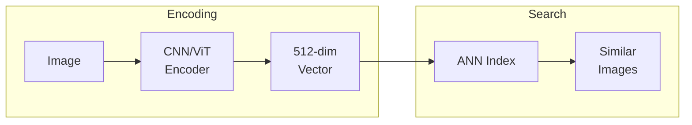
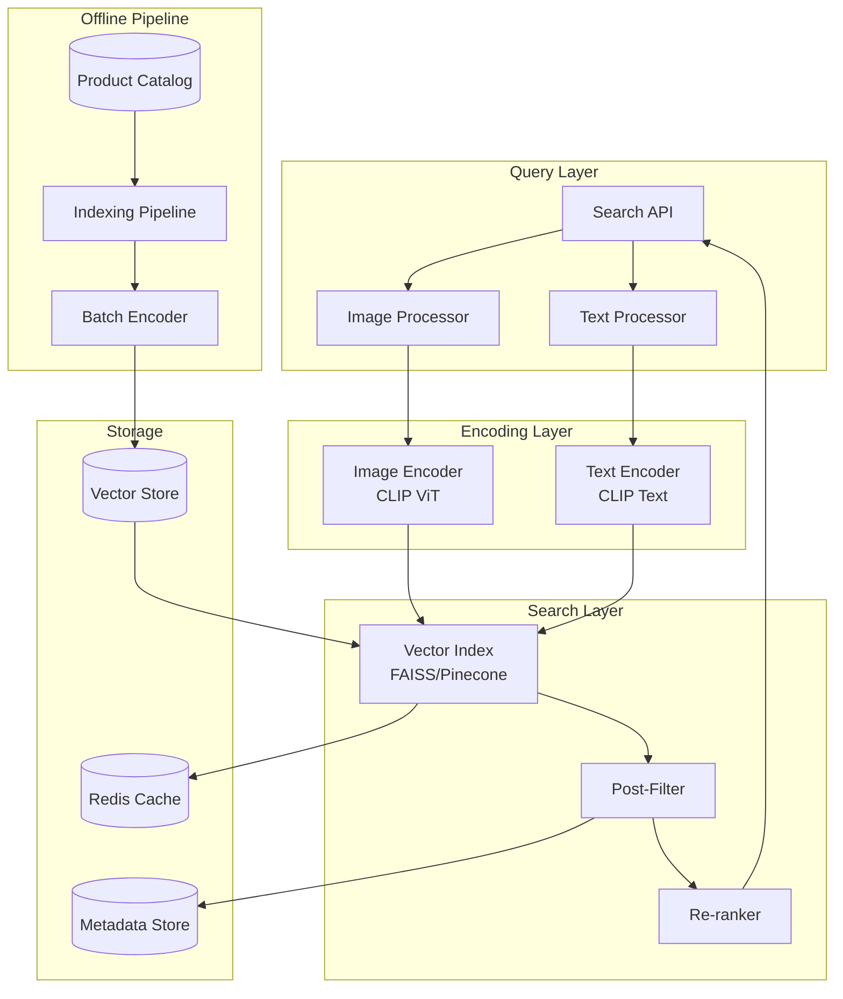
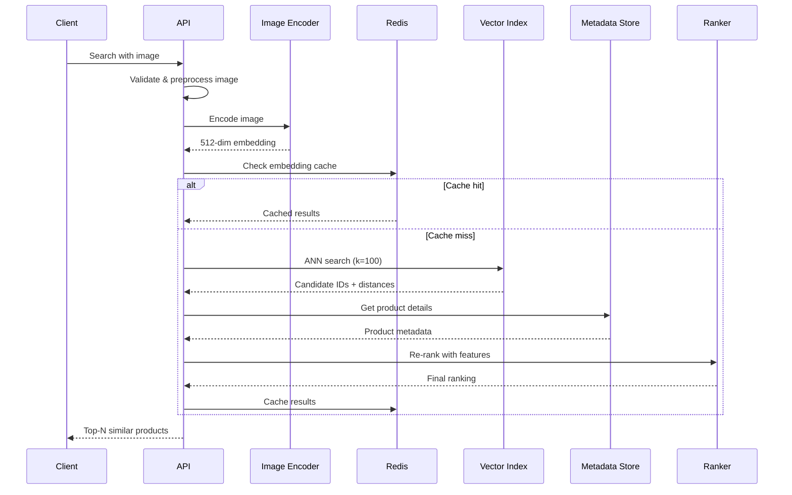
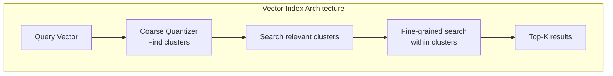

# Design an Image Search System
{: .no_toc }

<details open markdown="block">
  <summary>Table of Contents</summary>
  {: .text-delta }
1. TOC
{:toc}
</details>

---

## What We're Building

An image search system lets users find similar images using an image as the query (visual search) or using text to find images (text-to-image search).

**Visual search example:**
- User uploads a photo of a dress
- System returns visually similar dresses from the catalog
- "Find products that look like this"

**Text-to-image example:**
- User types "red vintage car on mountain road"
- System returns images matching the description
- "Find images that match this description"

### Real-World Applications

| Application | How It's Used |
|-------------|---------------|
| **E-commerce** | "Shop the look", find similar products |
| **Google Lens** | Identify objects, plants, landmarks |
| **Pinterest** | Visual discovery, similar pins |
| **Stock photos** | Find images by content, not keywords |
| **Fashion** | "Find me this outfit" |
| **Real estate** | Find homes with similar style |
| **Medical imaging** | Find similar diagnostic images |

### The Technical Challenge

Finding similar images is fundamentally different from text search:
- **No keywords:** Images don't have inherent searchable text
- **High dimensionality:** Raw images are millions of pixels
- **Semantic similarity:** "Similar" is subjective and context-dependent
- **Scale:** Billions of images, sub-second latency

---

## ML Concepts for Image Search

### How Image Similarity Works

The key insight: Convert images to **embeddings** (vectors), then find similar vectors.



**Embeddings:** A neural network compresses an image into a compact vector (e.g., 512 numbers) that captures its visual meaning. Similar images have similar vectors.

### Visual Similarity vs Semantic Similarity

| Type | What It Captures | Example |
|------|------------------|---------|
| **Visual** | Appearance, colors, patterns | Two red dresses look similar |
| **Semantic** | Meaning, concept | Dog photo & "dog" text match |

Modern models like CLIP capture both.

### Key Components

| Component | Purpose | Examples |
|-----------|---------|----------|
| **Image Encoder** | Convert images to vectors | ResNet, ViT, CLIP |
| **Text Encoder** | Convert text to vectors | CLIP, BERT |
| **Vector Index** | Fast similarity search | FAISS, Pinecone, Milvus |
| **Feature Store** | Store precomputed embeddings | Redis, Postgres + pgvector |

### Embedding Models

| Model | Type | Dimension | Best For |
|-------|------|-----------|----------|
| **ResNet-50** | Visual only | 2048 | Image-to-image search |
| **ViT** | Visual only | 768 | Higher quality visual |
| **CLIP** | Vision + Language | 512 | Text-to-image search |
| **OpenCLIP** | Open source CLIP | 512-1024 | Production use |
| **DINO v2** | Self-supervised | 384-1536 | Fine-grained similarity |

---

## Step 1: Requirements Clarification

### Questions to Ask

| Question | Why It Matters |
|----------|----------------|
| Image-to-image or text-to-image? | Model selection |
| Catalog size? | Index architecture |
| Latency requirements? | Serving infrastructure |
| Accuracy vs recall trade-off? | Index parameters |
| Freshness requirements? | Indexing pipeline |
| Multi-modal search? | Combined text + image |

### Our Design: E-commerce Visual Search

Design a visual search system for an e-commerce platform with:
- **Image-to-image:** Find similar products
- **Text-to-image:** Search catalog with descriptions
- **Catalog:** 100 million products with images

**Functional Requirements:**

| Feature | Priority | Description |
|---------|----------|-------------|
| Similar image search | Must have | Upload image, find similar |
| Text-to-image search | Must have | Search by description |
| Real-time indexing | Nice to have | New products searchable quickly |
| Filters | Nice to have | Combine visual + filters (price, brand) |
| Multi-image query | Nice to have | "Find items like these" |

**Non-Functional Requirements:**

| Requirement | Target | Rationale |
|-------------|--------|-----------|
| **Latency** | < 200ms | Fast search experience |
| **Throughput** | 10,000 QPS | Handle peak traffic |
| **Recall@100** | > 90% | Find most relevant items |
| **Index freshness** | < 1 hour | New products searchable |

---

## Step 2: High-Level Architecture

### System Overview



### Request Flow: Image Search



---

## Step 3: Image Encoding Pipeline

### Preprocessing

```python
from PIL import Image
import torch
from torchvision import transforms

class ImagePreprocessor:
    """Prepare images for encoding."""
    
    def __init__(self, target_size: int = 224):
        self.transform = transforms.Compose([
            transforms.Resize(target_size, interpolation=transforms.InterpolationMode.BICUBIC),
            transforms.CenterCrop(target_size),
            transforms.ToTensor(),
            transforms.Normalize(
                mean=[0.48145466, 0.4578275, 0.40821073],  # CLIP stats
                std=[0.26862954, 0.26130258, 0.27577711]
            )
        ])
    
    def preprocess(self, image_bytes: bytes) -> torch.Tensor:
        """Convert image bytes to model input tensor."""
        image = Image.open(io.BytesIO(image_bytes)).convert('RGB')
        
        # Validate
        if image.width < 50 or image.height < 50:
            raise ValueError("Image too small")
        
        return self.transform(image).unsqueeze(0)  # Add batch dim
    
    def preprocess_batch(self, images: List[bytes]) -> torch.Tensor:
        """Batch preprocess for efficiency."""
        tensors = [self.preprocess(img) for img in images]
        return torch.cat(tensors, dim=0)
```

### CLIP Encoder

```python
import clip
import torch

class CLIPEncoder:
    """Encode images and text using CLIP."""
    
    def __init__(self, model_name: str = "ViT-B/32", device: str = "cuda"):
        self.device = device
        self.model, self.preprocess = clip.load(model_name, device=device)
        self.model.eval()
    
    @torch.no_grad()
    def encode_image(self, image: torch.Tensor) -> np.ndarray:
        """Encode single image to embedding."""
        image = image.to(self.device)
        embedding = self.model.encode_image(image)
        
        # Normalize for cosine similarity
        embedding = embedding / embedding.norm(dim=-1, keepdim=True)
        
        return embedding.cpu().numpy().flatten()
    
    @torch.no_grad()
    def encode_text(self, text: str) -> np.ndarray:
        """Encode text to embedding."""
        tokens = clip.tokenize([text]).to(self.device)
        embedding = self.model.encode_text(tokens)
        
        # Normalize
        embedding = embedding / embedding.norm(dim=-1, keepdim=True)
        
        return embedding.cpu().numpy().flatten()
    
    @torch.no_grad()
    def encode_images_batch(self, images: torch.Tensor) -> np.ndarray:
        """Batch encode for efficiency."""
        images = images.to(self.device)
        embeddings = self.model.encode_image(images)
        embeddings = embeddings / embeddings.norm(dim=-1, keepdim=True)
        return embeddings.cpu().numpy()
```

### Embedding Service

```python
class EmbeddingService:
    """High-level embedding service with caching."""
    
    def __init__(self, encoder: CLIPEncoder, cache: Redis):
        self.encoder = encoder
        self.cache = cache
        self.preprocessor = ImagePreprocessor()
    
    async def get_image_embedding(self, image_bytes: bytes) -> np.ndarray:
        """Get embedding with caching."""
        
        # Hash image for cache key
        image_hash = hashlib.md5(image_bytes).hexdigest()
        cache_key = f"emb:img:{image_hash}"
        
        # Check cache
        cached = await self.cache.get(cache_key)
        if cached:
            return np.frombuffer(cached, dtype=np.float32)
        
        # Compute embedding
        tensor = self.preprocessor.preprocess(image_bytes)
        embedding = self.encoder.encode_image(tensor)
        
        # Cache (embeddings are small, ~2KB)
        await self.cache.setex(
            cache_key,
            3600,  # 1 hour
            embedding.astype(np.float32).tobytes()
        )
        
        return embedding
    
    async def get_text_embedding(self, text: str) -> np.ndarray:
        """Get text embedding."""
        cache_key = f"emb:txt:{hashlib.md5(text.encode()).hexdigest()}"
        
        cached = await self.cache.get(cache_key)
        if cached:
            return np.frombuffer(cached, dtype=np.float32)
        
        embedding = self.encoder.encode_text(text)
        
        await self.cache.setex(
            cache_key,
            3600,
            embedding.astype(np.float32).tobytes()
        )
        
        return embedding
```

---

## Step 4: Vector Index

### Index Architecture

For 100 million vectors, we need an approximate nearest neighbor (ANN) index.



### FAISS Implementation

```python
import faiss
import numpy as np

class VectorIndex:
    """FAISS-based vector index for similarity search."""
    
    def __init__(self, dimension: int = 512, nlist: int = 4096):
        self.dimension = dimension
        self.nlist = nlist
        
        # IVF + PQ index for large scale
        quantizer = faiss.IndexFlatIP(dimension)  # Inner product
        self.index = faiss.IndexIVFPQ(
            quantizer, dimension, nlist,
            64,  # Number of sub-quantizers
            8    # Bits per sub-quantizer
        )
        
        self.id_map = {}  # Internal ID -> Product ID
        self.trained = False
    
    def train(self, training_vectors: np.ndarray):
        """Train the index on sample vectors."""
        training_vectors = training_vectors.astype('float32')
        faiss.normalize_L2(training_vectors)  # For cosine similarity
        
        self.index.train(training_vectors)
        self.trained = True
    
    def add(self, vectors: np.ndarray, ids: List[str]):
        """Add vectors to index."""
        if not self.trained:
            raise RuntimeError("Index must be trained first")
        
        vectors = vectors.astype('float32')
        faiss.normalize_L2(vectors)
        
        # FAISS uses integer IDs internally
        internal_ids = np.arange(
            len(self.id_map), 
            len(self.id_map) + len(ids)
        )
        
        for internal_id, external_id in zip(internal_ids, ids):
            self.id_map[internal_id] = external_id
        
        self.index.add(vectors)
    
    def search(self, query: np.ndarray, k: int = 100, 
               nprobe: int = 64) -> List[tuple]:
        """Search for similar vectors."""
        query = query.astype('float32').reshape(1, -1)
        faiss.normalize_L2(query)
        
        # Number of clusters to search
        self.index.nprobe = nprobe
        
        distances, indices = self.index.search(query, k)
        
        results = []
        for dist, idx in zip(distances[0], indices[0]):
            if idx >= 0:  # -1 indicates no result
                product_id = self.id_map.get(idx)
                if product_id:
                    results.append((product_id, float(dist)))
        
        return results
    
    def save(self, path: str):
        """Save index to disk."""
        faiss.write_index(self.index, f"{path}/index.faiss")
        with open(f"{path}/id_map.pkl", 'wb') as f:
            pickle.dump(self.id_map, f)
    
    def load(self, path: str):
        """Load index from disk."""
        self.index = faiss.read_index(f"{path}/index.faiss")
        with open(f"{path}/id_map.pkl", 'rb') as f:
            self.id_map = pickle.load(f)
        self.trained = True
```

### Distributed Index with Pinecone

For production, consider managed vector databases:

```python
import pinecone

class PineconeIndex:
    """Managed vector index using Pinecone."""
    
    def __init__(self, api_key: str, environment: str, index_name: str):
        pinecone.init(api_key=api_key, environment=environment)
        
        # Create index if not exists
        if index_name not in pinecone.list_indexes():
            pinecone.create_index(
                name=index_name,
                dimension=512,
                metric="cosine",
                pods=4,
                pod_type="p2.x1"  # Performance tier
            )
        
        self.index = pinecone.Index(index_name)
    
    async def upsert(self, vectors: List[tuple]):
        """Upsert vectors: (id, embedding, metadata)."""
        # Batch upserts
        batch_size = 100
        for i in range(0, len(vectors), batch_size):
            batch = vectors[i:i + batch_size]
            self.index.upsert(vectors=[
                (id, emb.tolist(), meta) 
                for id, emb, meta in batch
            ])
    
    async def search(self, query: np.ndarray, k: int = 100,
                    filter: dict = None) -> List[dict]:
        """Search with optional metadata filter."""
        results = self.index.query(
            vector=query.tolist(),
            top_k=k,
            filter=filter,
            include_metadata=True
        )
        
        return [
            {
                "id": match.id,
                "score": match.score,
                "metadata": match.metadata
            }
            for match in results.matches
        ]
```

### Index Trade-offs

| Index Type | Build Time | Query Time | Recall | Memory |
|------------|------------|------------|--------|--------|
| **Flat (exact)** | O(n) | O(n) | 100% | 100% |
| **IVF** | O(n) | O(√n) | 95%+ | 100% |
| **IVF+PQ** | O(n) | O(√n) | 90%+ | 10% |
| **HNSW** | O(n log n) | O(log n) | 98%+ | 130% |

**Recommendation:** 
- < 1M vectors: HNSW (best accuracy)
- 1M-100M vectors: IVF+PQ (good balance)
- 100M+ vectors: Distributed (Pinecone, Milvus)

---

## Step 5: Indexing Pipeline

### Batch Indexing

```python
class ProductIndexer:
    """Index product images for search."""
    
    def __init__(self, encoder: CLIPEncoder, index: VectorIndex, 
                 db: Database, batch_size: int = 256):
        self.encoder = encoder
        self.index = index
        self.db = db
        self.batch_size = batch_size
    
    async def index_all_products(self):
        """Index entire product catalog."""
        
        # Get all products
        products = await self.db.fetch("""
            SELECT product_id, image_url, title, category
            FROM products
            WHERE is_active = true
        """)
        
        logger.info(f"Indexing {len(products)} products")
        
        # Process in batches
        for i in range(0, len(products), self.batch_size):
            batch = products[i:i + self.batch_size]
            await self.index_batch(batch)
            
            if i % 10000 == 0:
                logger.info(f"Indexed {i}/{len(products)}")
        
        # Save index
        self.index.save("./index_data")
    
    async def index_batch(self, products: List[dict]):
        """Index a batch of products."""
        
        # Download images
        images = await asyncio.gather(*[
            self.download_image(p["image_url"])
            for p in products
        ], return_exceptions=True)
        
        # Filter failed downloads
        valid = [
            (p, img) for p, img in zip(products, images)
            if not isinstance(img, Exception) and img is not None
        ]
        
        if not valid:
            return
        
        products_batch, images_batch = zip(*valid)
        
        # Batch encode
        tensors = torch.stack([
            self.encoder.preprocessor.preprocess(img)
            for img in images_batch
        ])
        embeddings = self.encoder.encode_images_batch(tensors)
        
        # Add to index
        self.index.add(
            embeddings,
            [p["product_id"] for p in products_batch]
        )
        
        # Store metadata
        await self.store_metadata(products_batch, embeddings)
    
    async def download_image(self, url: str) -> bytes:
        """Download image with retry."""
        for attempt in range(3):
            try:
                async with aiohttp.ClientSession() as session:
                    async with session.get(url, timeout=10) as response:
                        if response.status == 200:
                            return await response.read()
            except Exception as e:
                if attempt == 2:
                    raise
                await asyncio.sleep(1)
```

### Real-time Indexing

```python
class RealTimeIndexer:
    """Index new products in real-time."""
    
    def __init__(self, encoder, index, kafka_consumer):
        self.encoder = encoder
        self.index = index
        self.consumer = kafka_consumer
    
    async def run(self):
        """Consume product events and index."""
        async for message in self.consumer:
            event = json.loads(message.value)
            
            if event["type"] == "product_created":
                await self.index_product(event["product"])
            elif event["type"] == "product_updated":
                await self.update_product(event["product"])
            elif event["type"] == "product_deleted":
                await self.delete_product(event["product_id"])
    
    async def index_product(self, product: dict):
        """Index a single product."""
        try:
            # Download and encode image
            image = await self.download_image(product["image_url"])
            embedding = await self.encoder.encode_image(image)
            
            # Add to index
            await self.index.upsert([
                (product["product_id"], embedding, {
                    "title": product["title"],
                    "category": product["category"],
                    "price": product["price"]
                })
            ])
            
            logger.info(f"Indexed product {product['product_id']}")
            
        except Exception as e:
            logger.error(f"Failed to index product: {e}")
            # Queue for retry
            await self.retry_queue.push(product)
```

---

## Step 6: Search Service

### Multi-Modal Search

```python
class ImageSearchService:
    """Main search service supporting image and text queries."""
    
    def __init__(self, encoder, index, metadata_store, ranker):
        self.encoder = encoder
        self.index = index
        self.metadata = metadata_store
        self.ranker = ranker
    
    async def search_by_image(self, image_bytes: bytes,
                             filters: dict = None,
                             limit: int = 20) -> List[dict]:
        """Search using an image query."""
        
        # Encode query image
        embedding = await self.encoder.encode_image(image_bytes)
        
        # ANN search
        candidates = await self.index.search(embedding, k=limit * 5)
        
        # Apply filters
        if filters:
            candidates = await self.apply_filters(candidates, filters)
        
        # Get metadata
        results = await self.enrich_results(candidates)
        
        # Re-rank
        results = await self.ranker.rerank(embedding, results)
        
        return results[:limit]
    
    async def search_by_text(self, text: str,
                            filters: dict = None,
                            limit: int = 20) -> List[dict]:
        """Search using a text query."""
        
        # Encode text
        embedding = await self.encoder.encode_text(text)
        
        # Search (same index works for both modalities with CLIP)
        candidates = await self.index.search(embedding, k=limit * 5)
        
        if filters:
            candidates = await self.apply_filters(candidates, filters)
        
        results = await self.enrich_results(candidates)
        results = await self.ranker.rerank(embedding, results)
        
        return results[:limit]
    
    async def search_hybrid(self, image_bytes: bytes = None,
                           text: str = None,
                           filters: dict = None,
                           image_weight: float = 0.7) -> List[dict]:
        """Combined image + text search."""
        
        embeddings = []
        weights = []
        
        if image_bytes:
            img_emb = await self.encoder.encode_image(image_bytes)
            embeddings.append(img_emb)
            weights.append(image_weight)
        
        if text:
            txt_emb = await self.encoder.encode_text(text)
            embeddings.append(txt_emb)
            weights.append(1 - image_weight)
        
        # Weighted combination
        combined = sum(e * w for e, w in zip(embeddings, weights))
        combined = combined / np.linalg.norm(combined)
        
        candidates = await self.index.search(combined, k=100)
        
        if filters:
            candidates = await self.apply_filters(candidates, filters)
        
        return await self.enrich_results(candidates)
    
    async def apply_filters(self, candidates: List[tuple],
                           filters: dict) -> List[tuple]:
        """Apply metadata filters to candidates."""
        
        # Get metadata for candidates
        ids = [c[0] for c in candidates]
        metadata = await self.metadata.get_batch(ids)
        
        filtered = []
        for (id, score), meta in zip(candidates, metadata):
            if meta is None:
                continue
            
            # Apply filters
            if "category" in filters:
                if meta["category"] not in filters["category"]:
                    continue
            
            if "price_min" in filters:
                if meta["price"] < filters["price_min"]:
                    continue
            
            if "price_max" in filters:
                if meta["price"] > filters["price_max"]:
                    continue
            
            if "brand" in filters:
                if meta["brand"] not in filters["brand"]:
                    continue
            
            filtered.append((id, score))
        
        return filtered
```

### Re-ranking

```python
class SearchReranker:
    """Re-rank search results using additional signals."""
    
    def __init__(self, feature_store):
        self.features = feature_store
    
    async def rerank(self, query_embedding: np.ndarray,
                    candidates: List[dict]) -> List[dict]:
        """Re-rank candidates with additional features."""
        
        for candidate in candidates:
            # Get additional features
            product_features = await self.features.get(candidate["id"])
            
            # Compute re-ranking score
            rescore = self.compute_rescore(
                candidate["similarity_score"],
                product_features
            )
            
            candidate["final_score"] = rescore
        
        # Sort by final score
        candidates.sort(key=lambda x: x["final_score"], reverse=True)
        
        # Apply diversity (avoid too many similar items)
        candidates = self.diversify(candidates)
        
        return candidates
    
    def compute_rescore(self, similarity: float, 
                       features: dict) -> float:
        """Combine similarity with other signals."""
        score = similarity
        
        # Boost popular items
        popularity = features.get("popularity_score", 0)
        score += 0.1 * popularity
        
        # Boost highly rated
        rating = features.get("avg_rating", 0)
        if rating >= 4.5:
            score += 0.05
        
        # Boost items with good conversion
        conversion = features.get("conversion_rate", 0)
        score += 0.1 * conversion
        
        # Slight freshness boost
        days_old = features.get("days_since_added", 365)
        if days_old < 30:
            score += 0.02
        
        return score
    
    def diversify(self, candidates: List[dict], 
                 max_per_category: int = 5) -> List[dict]:
        """Ensure diversity in results."""
        result = []
        category_counts = {}
        
        for candidate in candidates:
            category = candidate.get("category")
            count = category_counts.get(category, 0)
            
            if count < max_per_category:
                result.append(candidate)
                category_counts[category] = count + 1
        
        return result
```

---

## Step 7: API Design

### Search Endpoints

```python
from fastapi import FastAPI, UploadFile, Query
from pydantic import BaseModel
from typing import List, Optional

app = FastAPI()

class SearchResult(BaseModel):
    product_id: str
    title: str
    image_url: str
    price: float
    category: str
    similarity_score: float

class SearchResponse(BaseModel):
    results: List[SearchResult]
    query_time_ms: float
    total_found: int

@app.post("/v1/search/image", response_model=SearchResponse)
async def search_by_image(
    image: UploadFile,
    category: Optional[List[str]] = Query(None),
    price_min: Optional[float] = Query(None),
    price_max: Optional[float] = Query(None),
    limit: int = Query(20, le=100)
):
    """Search for similar products using an image."""
    start = time.time()
    
    # Read and validate image
    image_bytes = await image.read()
    if len(image_bytes) > 10 * 1024 * 1024:  # 10MB limit
        raise HTTPException(400, "Image too large")
    
    # Build filters
    filters = {}
    if category:
        filters["category"] = category
    if price_min:
        filters["price_min"] = price_min
    if price_max:
        filters["price_max"] = price_max
    
    # Search
    results = await search_service.search_by_image(
        image_bytes, filters, limit
    )
    
    return SearchResponse(
        results=results,
        query_time_ms=(time.time() - start) * 1000,
        total_found=len(results)
    )

@app.get("/v1/search/text", response_model=SearchResponse)
async def search_by_text(
    q: str = Query(..., min_length=1),
    category: Optional[List[str]] = Query(None),
    limit: int = Query(20, le=100)
):
    """Search for products using text description."""
    start = time.time()
    
    filters = {"category": category} if category else {}
    
    results = await search_service.search_by_text(q, filters, limit)
    
    return SearchResponse(
        results=results,
        query_time_ms=(time.time() - start) * 1000,
        total_found=len(results)
    )

@app.get("/v1/products/{product_id}/similar", response_model=SearchResponse)
async def get_similar_products(
    product_id: str,
    limit: int = Query(10, le=50)
):
    """Get products similar to a specific product."""
    
    # Get product's embedding from cache
    embedding = await embedding_cache.get(product_id)
    
    if embedding is None:
        # Compute if not cached
        product = await product_store.get(product_id)
        image = await download_image(product["image_url"])
        embedding = await encoder.encode_image(image)
    
    # Search (exclude the query product)
    results = await search_service.index.search(embedding, k=limit + 1)
    results = [r for r in results if r["product_id"] != product_id][:limit]
    
    return SearchResponse(results=results, total_found=len(results))
```

---

## Step 8: Optimizations

### Query Optimization

```python
class OptimizedSearchService:
    """Search service with performance optimizations."""
    
    async def search(self, query_embedding: np.ndarray,
                    filters: dict = None,
                    limit: int = 20) -> List[dict]:
        
        # 1. Check query cache (same query = same results)
        cache_key = self.compute_cache_key(query_embedding, filters)
        cached = await self.cache.get(cache_key)
        if cached:
            return cached
        
        # 2. If filters are selective, use metadata-first approach
        if filters and self.is_selective(filters):
            # First filter by metadata, then vector search on subset
            candidate_ids = await self.metadata.filter(filters)
            if len(candidate_ids) < 10000:
                results = await self.search_subset(
                    query_embedding, candidate_ids, limit
                )
            else:
                results = await self.search_then_filter(
                    query_embedding, filters, limit
                )
        else:
            # Standard vector-first search
            results = await self.search_then_filter(
                query_embedding, filters, limit
            )
        
        # 3. Cache results
        await self.cache.setex(cache_key, 300, results)  # 5 min cache
        
        return results
    
    def is_selective(self, filters: dict) -> bool:
        """Check if filters are selective enough for metadata-first."""
        # If filtering to specific category with few items
        if "category" in filters and len(filters["category"]) == 1:
            return True
        return False
```

### Batch Processing

```python
class BatchSearchService:
    """Handle multiple search queries efficiently."""
    
    async def batch_search(self, queries: List[np.ndarray],
                          k: int = 20) -> List[List[dict]]:
        """Search multiple queries in one call."""
        
        # Stack queries for batch processing
        query_matrix = np.vstack(queries).astype('float32')
        
        # Batch ANN search
        distances, indices = self.index.search(query_matrix, k)
        
        # Process results
        all_results = []
        for dist_row, idx_row in zip(distances, indices):
            results = [
                {"id": self.id_map[idx], "score": float(dist)}
                for dist, idx in zip(dist_row, idx_row)
                if idx >= 0
            ]
            all_results.append(results)
        
        return all_results
```

### GPU Acceleration

```python
class GPUVectorIndex:
    """GPU-accelerated vector search using FAISS."""
    
    def __init__(self, dimension: int, num_gpus: int = 1):
        self.dimension = dimension
        
        # Create GPU resources
        self.gpu_resources = [
            faiss.StandardGpuResources() 
            for _ in range(num_gpus)
        ]
        
        # Create CPU index
        cpu_index = faiss.IndexFlatIP(dimension)
        
        # Move to GPU
        if num_gpus == 1:
            self.index = faiss.index_cpu_to_gpu(
                self.gpu_resources[0], 0, cpu_index
            )
        else:
            self.index = faiss.index_cpu_to_all_gpus(cpu_index)
    
    def search(self, query: np.ndarray, k: int) -> tuple:
        """GPU-accelerated search."""
        query = query.astype('float32').reshape(1, -1)
        faiss.normalize_L2(query)
        
        distances, indices = self.index.search(query, k)
        return distances, indices
```

---

## Step 9: Monitoring

### Key Metrics

```python
import prometheus_client as prom

# Latency
search_latency = prom.Histogram(
    'image_search_latency_seconds',
    'Search latency',
    ['search_type'],  # image, text, hybrid
    buckets=[0.05, 0.1, 0.2, 0.5, 1.0]
)

# Throughput
search_requests = prom.Counter(
    'image_search_requests_total',
    'Total search requests',
    ['search_type', 'status']
)

# Index stats
index_size = prom.Gauge(
    'image_search_index_size',
    'Number of vectors in index'
)

# Cache
cache_hits = prom.Counter(
    'image_search_cache_hits_total',
    'Cache hit count'
)

# Quality metrics
result_diversity = prom.Histogram(
    'image_search_result_diversity',
    'Number of unique categories in results'
)
```

### Quality Monitoring

```python
class SearchQualityMonitor:
    """Monitor search quality over time."""
    
    async def log_search(self, query_type: str, 
                        query_embedding: np.ndarray,
                        results: List[dict],
                        user_id: str = None):
        """Log search for quality analysis."""
        
        await self.db.insert("search_logs", {
            "query_type": query_type,
            "query_embedding": query_embedding.tobytes(),
            "result_ids": [r["id"] for r in results],
            "result_scores": [r["score"] for r in results],
            "user_id": user_id,
            "timestamp": datetime.utcnow()
        })
    
    async def log_click(self, search_id: str, clicked_id: str, 
                       position: int):
        """Log user click for relevance feedback."""
        await self.db.insert("search_clicks", {
            "search_id": search_id,
            "clicked_product_id": clicked_id,
            "position": position,
            "timestamp": datetime.utcnow()
        })
    
    async def calculate_metrics(self, date: str) -> dict:
        """Calculate daily quality metrics."""
        
        # Click-through rate
        searches = await self.db.count("search_logs", date=date)
        clicks = await self.db.count("search_clicks", date=date)
        ctr = clicks / searches if searches > 0 else 0
        
        # Mean Reciprocal Rank
        mrr = await self.calculate_mrr(date)
        
        # Result diversity
        diversity = await self.calculate_diversity(date)
        
        return {
            "ctr": ctr,
            "mrr": mrr,
            "diversity": diversity,
            "total_searches": searches
        }
```

---

## Interview Checklist

- [ ] **Clarified requirements** (image/text, scale, latency)
- [ ] **Explained embeddings** (how images become vectors)
- [ ] **Covered encoding** (CLIP, preprocessing)
- [ ] **Discussed vector index** (FAISS, ANN trade-offs)
- [ ] **Explained indexing pipeline** (batch + real-time)
- [ ] **Covered search flow** (encode → search → rerank)
- [ ] **Addressed filtering** (combine vector + metadata)
- [ ] **Discussed multi-modal** (image + text search)
- [ ] **Covered optimizations** (caching, GPU, batching)
- [ ] **Mentioned monitoring** (latency, quality metrics)

---

## Sample Interview Dialogue

**Interviewer:** "Design an image search system for e-commerce."

**You:** "Great! Let me clarify a few things. Are we doing image-to-image search (upload a photo, find similar products), text-to-image, or both? And what's the catalog size?"

**Interviewer:** "Both. Let's say 100 million products."

**You:** "Got it. The core idea is to use a model like CLIP that can encode both images and text into the same embedding space. This lets us search with either modality.

For 100 million products, I'd use a two-stage approach:
1. **Indexing:** Pre-compute embeddings for all product images, store in a vector index
2. **Search:** Encode query (image or text), find nearest neighbors in the index

For the vector index at this scale, I'd use FAISS with IVF+PQ—it gives good recall (~90%+) with much smaller memory footprint than exact search. We partition the vectors into clusters and use product quantization for compression.

The search flow is:
1. Receive query (image or text)
2. Encode to 512-dim vector using CLIP
3. ANN search to get top 100 candidates
4. Apply filters (category, price)
5. Re-rank with additional signals (popularity, ratings)
6. Return top 20

For real-time indexing of new products, I'd use a Kafka consumer that encodes new product images and adds them to the index.

Want me to dive into any component?"

---

## Summary

| Component | Technology | Rationale |
|-----------|------------|-----------|
| **Encoder** | CLIP ViT-B/32 | Multi-modal, high quality |
| **Vector Index** | FAISS IVF+PQ | Scales to 100M+ |
| **Managed Alternative** | Pinecone/Milvus | Easier operations |
| **Caching** | Redis | Query/embedding cache |
| **Batch Indexing** | Airflow + GPU | Initial index build |
| **Real-time Indexing** | Kafka consumers | New product updates |
| **Re-ranking** | Custom model | Combine similarity + business |

Image search combines deep learning with efficient data structures. The key insight is that neural networks transform the visual similarity problem into a vector distance problem, which we can solve at scale with approximate nearest neighbor algorithms.

