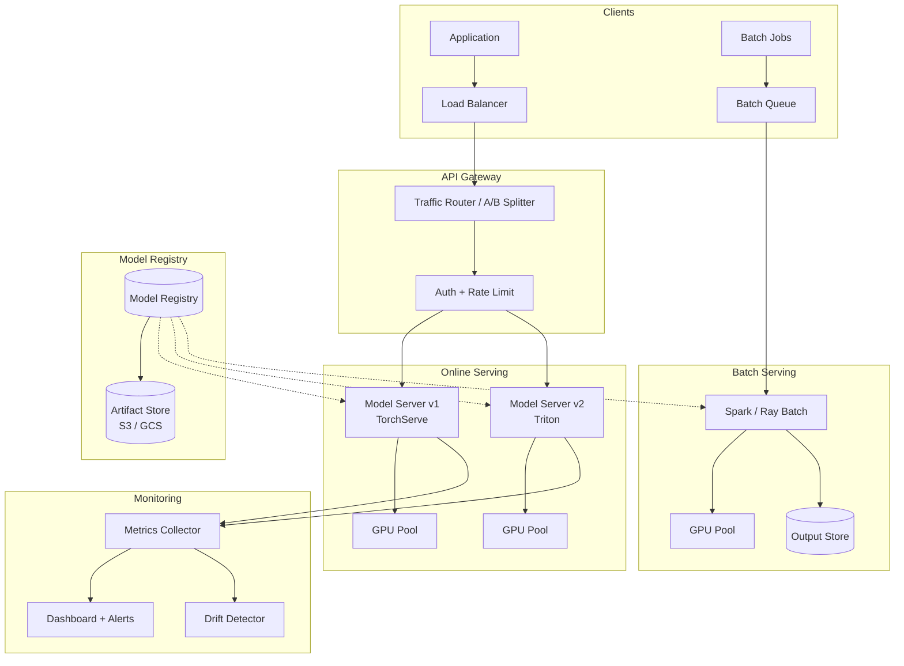
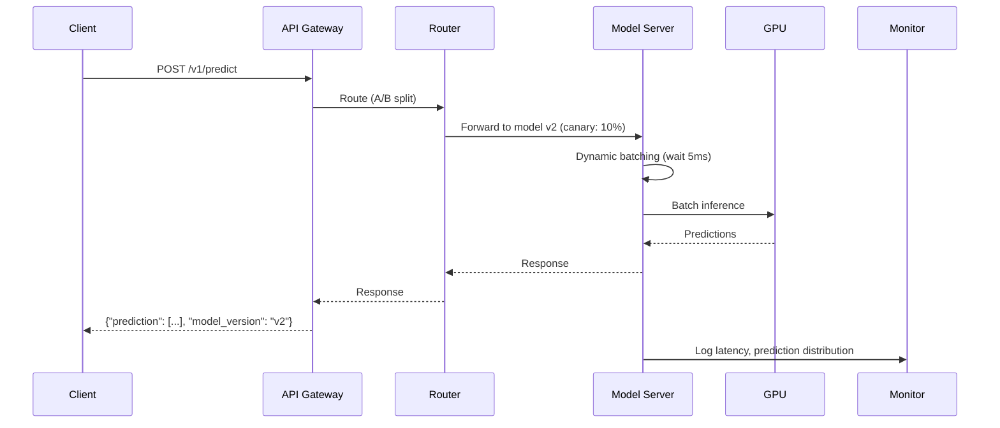
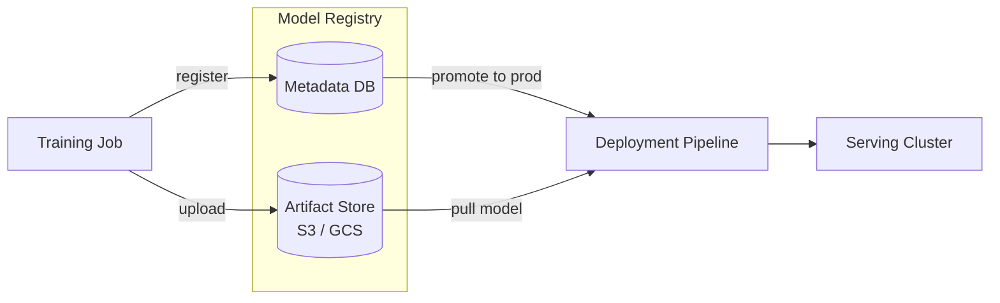
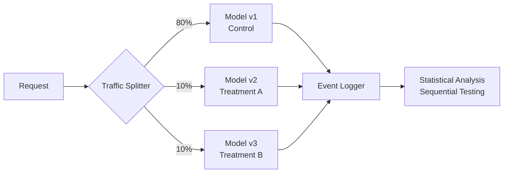
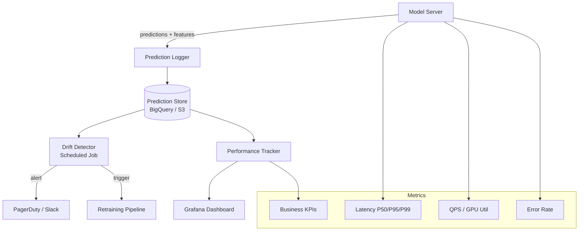
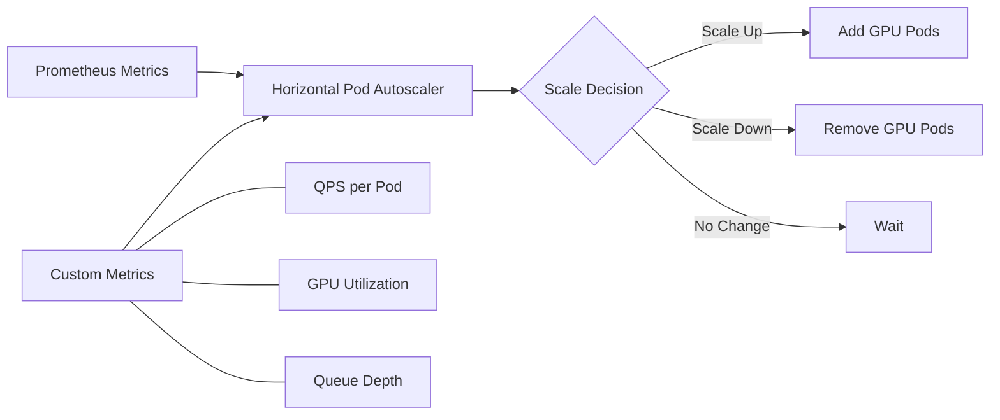

# Model Serving Infrastructure
{: .fs-9 }

Design production-grade model serving systems that balance latency, throughput, cost, and reliability.
{: .fs-6 .fw-300 }

---

## Step 1: Requirements Clarification

### Functional Requirements

| Requirement | Description |
|-------------|-------------|
| **Online inference** | Sub-100ms predictions via REST/gRPC APIs |
| **Batch inference** | Process millions of records offline |
| **Model versioning** | Deploy, rollback, and manage multiple model versions |
| **A/B testing** | Split traffic between model variants |
| **Multi-model serving** | Host multiple models on shared infrastructure |
| **Model monitoring** | Track drift, latency, error rates in production |

### Non-Functional Requirements

| Requirement | Target |
|-------------|--------|
| **Latency** | P99 < 100ms for online inference |
| **Throughput** | 10,000+ requests/second per model |
| **Availability** | 99.9% uptime |
| **Scalability** | Auto-scale with traffic; GPU-efficient batching |
| **Cost** | Minimize GPU idle time; support CPU fallback |

---

## Step 2: Back-of-Envelope Estimation

### Traffic Estimation

```
Daily active users:         10M
Predictions per user/day:   20
Total daily predictions:    200M
QPS (average):              200M / 86,400 ≈ 2,300
QPS (peak, 3x):             ~7,000
```

### Compute Estimation (GPU)

```
Single GPU throughput:      ~500 req/s (with dynamic batching)
GPUs needed (peak):         7,000 / 500 = 14 GPUs
With 30% headroom:          ~18 GPUs
GPU utilization target:     > 70%
```

### Batch Inference

```
Records to score:           50M daily
Model inference time:       5ms per record
Wall-clock (single GPU):    50M × 5ms = 250,000s ≈ 69 hours
With 8 GPUs:                ~8.6 hours
Target window:              < 4 hours → need 18+ GPUs
```

### Cost Estimation

```
GPU instance (A100):        ~$3/hour
Online serving (18 GPUs):   18 × $3 × 24 = $1,296/day
Batch serving (18 GPUs):    18 × $3 × 4  = $216/day
Monthly total:              ~$45K (online + batch)
```

---

## Step 3: High-Level Architecture





---

## Step 4: Online vs Batch Prediction

### When to Use Each

| Dimension | Online Prediction | Batch Prediction |
|-----------|------------------|------------------|
| **Latency** | Real-time (< 100ms) | Hours (scheduled) |
| **Use case** | User-facing features, fraud detection | Recommendations, reports, scoring |
| **Input** | Single request or micro-batch | Large dataset |
| **Cost model** | Pay for always-on GPUs | Pay for burst compute |
| **Freshness** | Instant | Stale (last batch run) |
| **Failure mode** | Request fails → retry / fallback | Job fails → re-run |

### Hybrid Pattern

Many production systems use both — batch pre-computes predictions for known entities (e.g., nightly product recommendations), while online serving handles ad-hoc or real-time queries.

```python
from dataclasses import dataclass, field
from enum import Enum
from typing import Any
import time
import logging

logger = logging.getLogger(__name__)


class ServingMode(Enum):
    ONLINE = "online"
    BATCH = "batch"
    HYBRID = "hybrid"


@dataclass
class PredictionRequest:
    model_name: str
    model_version: str
    inputs: dict[str, Any]
    request_id: str = ""
    metadata: dict[str, str] = field(default_factory=dict)


@dataclass
class PredictionResponse:
    predictions: list[Any]
    model_version: str
    latency_ms: float
    served_from: str  # "online" | "cache" | "precomputed"


class HybridServingRouter:
    """Routes requests to online or pre-computed predictions based on availability."""

    def __init__(self, online_client, cache_client, precomputed_store):
        self.online = online_client
        self.cache = cache_client
        self.precomputed = precomputed_store

    async def predict(self, request: PredictionRequest) -> PredictionResponse:
        entity_id = request.inputs.get("entity_id")

        # Layer 1: check in-memory / Redis cache
        cached = await self.cache.get(f"{request.model_name}:{entity_id}")
        if cached is not None:
            return PredictionResponse(
                predictions=cached,
                model_version=request.model_version,
                latency_ms=0.5,
                served_from="cache",
            )

        # Layer 2: check batch-precomputed store
        precomputed = await self.precomputed.get(request.model_name, entity_id)
        if precomputed is not None:
            await self.cache.set(
                f"{request.model_name}:{entity_id}", precomputed, ttl=3600
            )
            return PredictionResponse(
                predictions=precomputed,
                model_version=request.model_version,
                latency_ms=2.0,
                served_from="precomputed",
            )

        # Layer 3: fall back to online inference
        start = time.monotonic()
        result = await self.online.predict(request)
        elapsed = (time.monotonic() - start) * 1000

        await self.cache.set(
            f"{request.model_name}:{entity_id}", result, ttl=300
        )
        return PredictionResponse(
            predictions=result,
            model_version=request.model_version,
            latency_ms=elapsed,
            served_from="online",
        )
```

---

## Step 5: Model Registry & Versioning

A model registry is the source of truth for all trained models. It stores artifacts, metadata, lineage, and deployment status.

### Registry Design



### Version Lifecycle

| Stage | Description | Who Triggers |
|-------|-------------|--------------|
| **Registered** | Model saved with metrics | Training pipeline |
| **Staging** | Under validation / shadow testing | ML Engineer |
| **Production** | Serving live traffic | Automated / approved |
| **Archived** | Retired, kept for audit | Automated after N days |

```python
from dataclasses import dataclass, field
from datetime import datetime
from enum import Enum
from typing import Any
import hashlib
import json


class ModelStage(Enum):
    REGISTERED = "registered"
    STAGING = "staging"
    PRODUCTION = "production"
    ARCHIVED = "archived"


@dataclass
class ModelVersion:
    model_name: str
    version: str
    artifact_uri: str
    metrics: dict[str, float]
    parameters: dict[str, Any]
    stage: ModelStage = ModelStage.REGISTERED
    created_at: datetime = field(default_factory=datetime.utcnow)
    signature_hash: str = ""

    def compute_signature(self, input_schema: dict, output_schema: dict) -> str:
        payload = json.dumps(
            {"input": input_schema, "output": output_schema}, sort_keys=True
        )
        self.signature_hash = hashlib.sha256(payload.encode()).hexdigest()
        return self.signature_hash


class ModelRegistry:
    """Manages model versions with promotion gates."""

    def __init__(self, metadata_store, artifact_store):
        self.metadata = metadata_store
        self.artifacts = artifact_store

    async def register(
        self,
        model_name: str,
        version: str,
        artifact_path: str,
        metrics: dict[str, float],
        parameters: dict[str, Any],
    ) -> ModelVersion:
        artifact_uri = await self.artifacts.upload(artifact_path, model_name, version)

        model_version = ModelVersion(
            model_name=model_name,
            version=version,
            artifact_uri=artifact_uri,
            metrics=metrics,
            parameters=parameters,
        )
        await self.metadata.save(model_version)
        return model_version

    async def promote(
        self, model_name: str, version: str, target_stage: ModelStage
    ) -> ModelVersion:
        mv = await self.metadata.get(model_name, version)

        if target_stage == ModelStage.PRODUCTION:
            if not self._passes_promotion_gates(mv):
                raise ValueError(
                    f"Model {model_name}:{version} fails promotion gates"
                )
            current_prod = await self.metadata.get_by_stage(
                model_name, ModelStage.PRODUCTION
            )
            if current_prod:
                current_prod.stage = ModelStage.ARCHIVED
                await self.metadata.save(current_prod)

        mv.stage = target_stage
        await self.metadata.save(mv)
        return mv

    def _passes_promotion_gates(self, mv: ModelVersion) -> bool:
        required_metrics = {"accuracy", "latency_p99_ms"}
        if not required_metrics.issubset(mv.metrics.keys()):
            return False
        if mv.metrics.get("accuracy", 0) < 0.85:
            return False
        if mv.metrics.get("latency_p99_ms", float("inf")) > 100:
            return False
        return True

    async def get_production_model(self, model_name: str) -> ModelVersion | None:
        return await self.metadata.get_by_stage(model_name, ModelStage.PRODUCTION)
```

---

## Step 6: Serving Frameworks Deep Dive

### Framework Comparison

| Feature | TensorFlow Serving | TorchServe | Triton Inference Server |
|---------|-------------------|------------|------------------------|
| **Frameworks** | TensorFlow / SavedModel | PyTorch | TF, PyTorch, ONNX, TensorRT, custom |
| **Dynamic batching** | Yes | Yes | Yes (configurable) |
| **Model ensembles** | Limited | No | Yes (pipeline DAGs) |
| **GPU sharing** | Limited | Yes | MPS / MIG support |
| **Protocol** | gRPC, REST | REST, gRPC | REST, gRPC, C API |
| **Best for** | TF-only stacks | PyTorch shops | Multi-framework, high perf |

### TorchServe Implementation

```python
import torch
import torch.nn as nn
from ts.torch_handler.base_handler import BaseHandler
from ts.context import Context
import logging
import json
import time

logger = logging.getLogger(__name__)


class ProductRecommendationHandler(BaseHandler):
    """Custom TorchServe handler for a recommendation model."""

    def initialize(self, context: Context):
        self.manifest = context.manifest
        properties = context.system_properties
        model_dir = properties.get("model_dir")

        self.device = torch.device(
            "cuda" if torch.cuda.is_available() else "cpu"
        )
        serialized_file = self.manifest["model"]["serializedFile"]
        model_path = f"{model_dir}/{serialized_file}"

        self.model = torch.jit.load(model_path, map_location=self.device)
        self.model.eval()
        self.initialized = True
        logger.info("Model loaded on %s", self.device)

    def preprocess(self, data: list) -> torch.Tensor:
        """Parse JSON input and build feature tensor."""
        features = []
        for row in data:
            body = row.get("body") or row.get("data")
            if isinstance(body, (bytes, bytearray)):
                body = json.loads(body)

            user_embedding = body["user_embedding"]
            item_features = body["item_features"]
            context_features = body.get("context_features", [])

            feature_vector = user_embedding + item_features + context_features
            features.append(feature_vector)

        return torch.tensor(features, dtype=torch.float32, device=self.device)

    def inference(self, input_batch: torch.Tensor) -> torch.Tensor:
        with torch.no_grad():
            return self.model(input_batch)

    def postprocess(self, inference_output: torch.Tensor) -> list:
        scores = inference_output.cpu().numpy().tolist()
        return [{"scores": s} for s in scores]


class ModelEnsemble:
    """Runs multiple models and combines predictions."""

    def __init__(self, models: dict[str, nn.Module], weights: dict[str, float]):
        self.models = models
        self.weights = weights
        self.device = torch.device(
            "cuda" if torch.cuda.is_available() else "cpu"
        )

    @torch.no_grad()
    def predict(self, inputs: torch.Tensor) -> torch.Tensor:
        weighted_sum = torch.zeros(inputs.size(0), device=self.device)

        for name, model in self.models.items():
            model.eval()
            output = model(inputs.to(self.device))
            if output.dim() > 1:
                output = output.squeeze(-1)
            weighted_sum += self.weights[name] * output

        return weighted_sum
```

### Triton Inference Server Configuration

```python
# Model repository structure for Triton
# model_repository/
# └── recommendation_model/
#     ├── config.pbtxt
#     ├── 1/
#     │   └── model.onnx
#     └── 2/
#         └── model.onnx

TRITON_CONFIG = """
name: "recommendation_model"
platform: "onnxruntime_onnx"
max_batch_size: 64

input [
  {
    name: "user_features"
    data_type: TYPE_FP32
    dims: [128]
  },
  {
    name: "item_features"
    data_type: TYPE_FP32
    dims: [64]
  }
]

output [
  {
    name: "scores"
    data_type: TYPE_FP32
    dims: [1]
  }
]

dynamic_batching {
  preferred_batch_size: [8, 16, 32]
  max_queue_delay_microseconds: 5000
}

instance_group [
  {
    count: 2
    kind: KIND_GPU
    gpus: [0]
  }
]

version_policy: {
  latest: { num_versions: 2 }
}
"""


import tritonclient.grpc as grpc_client
import numpy as np
from dataclasses import dataclass


@dataclass
class TritonConfig:
    url: str = "localhost:8001"
    model_name: str = "recommendation_model"
    model_version: str = ""


class TritonServingClient:
    """Client for Triton Inference Server with health checks and retries."""

    def __init__(self, config: TritonConfig):
        self.config = config
        self.client = grpc_client.InferenceServerClient(url=config.url)

    def is_healthy(self) -> bool:
        try:
            return (
                self.client.is_server_live()
                and self.client.is_server_ready()
                and self.client.is_model_ready(self.config.model_name)
            )
        except Exception:
            return False

    def predict(
        self, user_features: np.ndarray, item_features: np.ndarray
    ) -> np.ndarray:
        inputs = [
            grpc_client.InferInput(
                "user_features", user_features.shape, "FP32"
            ),
            grpc_client.InferInput(
                "item_features", item_features.shape, "FP32"
            ),
        ]
        inputs[0].set_data_from_numpy(user_features.astype(np.float32))
        inputs[1].set_data_from_numpy(item_features.astype(np.float32))

        outputs = [grpc_client.InferRequestedOutput("scores")]

        result = self.client.infer(
            model_name=self.config.model_name,
            model_version=self.config.model_version,
            inputs=inputs,
            outputs=outputs,
        )
        return result.as_numpy("scores")

    def get_model_metadata(self) -> dict:
        meta = self.client.get_model_metadata(self.config.model_name)
        return {
            "name": meta.name,
            "versions": meta.versions,
            "inputs": [
                {"name": i.name, "shape": list(i.shape), "datatype": i.datatype}
                for i in meta.inputs
            ],
            "outputs": [
                {"name": o.name, "shape": list(o.shape), "datatype": o.datatype}
                for o in meta.outputs
            ],
        }
```

---

## Step 7: A/B Testing Models

### Traffic Splitting Architecture



### Implementation

```python
import hashlib
import time
import random
from dataclasses import dataclass, field
from typing import Any
from enum import Enum
import logging
import math

logger = logging.getLogger(__name__)


class ExperimentStatus(Enum):
    DRAFT = "draft"
    RUNNING = "running"
    COMPLETED = "completed"
    ROLLED_BACK = "rolled_back"


@dataclass
class ModelVariant:
    name: str
    model_version: str
    traffic_weight: float  # 0.0 - 1.0
    serving_endpoint: str


@dataclass
class Experiment:
    experiment_id: str
    variants: list[ModelVariant]
    status: ExperimentStatus = ExperimentStatus.DRAFT
    start_time: float = 0.0
    min_sample_size: int = 10_000
    confidence_level: float = 0.95


class ABTestRouter:
    """Deterministic traffic splitting for model A/B tests."""

    def __init__(self, experiment: Experiment):
        self.experiment = experiment
        self._validate_weights()

    def _validate_weights(self):
        total = sum(v.traffic_weight for v in self.experiment.variants)
        if abs(total - 1.0) > 1e-6:
            raise ValueError(f"Traffic weights must sum to 1.0, got {total}")

    def route(self, user_id: str) -> ModelVariant:
        """Deterministic routing: same user always gets same variant."""
        hash_key = f"{self.experiment.experiment_id}:{user_id}"
        hash_val = int(hashlib.sha256(hash_key.encode()).hexdigest(), 16)
        bucket = (hash_val % 10000) / 10000.0

        cumulative = 0.0
        for variant in self.experiment.variants:
            cumulative += variant.traffic_weight
            if bucket < cumulative:
                return variant

        return self.experiment.variants[-1]


@dataclass
class ExperimentMetrics:
    variant_name: str
    total_requests: int = 0
    total_conversions: int = 0
    total_latency_ms: float = 0.0

    @property
    def conversion_rate(self) -> float:
        return self.total_conversions / max(self.total_requests, 1)

    @property
    def avg_latency_ms(self) -> float:
        return self.total_latency_ms / max(self.total_requests, 1)


class ExperimentAnalyzer:
    """Statistical analysis for A/B test results."""

    def __init__(self, confidence_level: float = 0.95):
        self.confidence_level = confidence_level

    def is_significant(
        self, control: ExperimentMetrics, treatment: ExperimentMetrics
    ) -> dict[str, Any]:
        p_c = control.conversion_rate
        p_t = treatment.conversion_rate
        n_c = control.total_requests
        n_t = treatment.total_requests

        if n_c == 0 or n_t == 0:
            return {"significant": False, "reason": "insufficient data"}

        pooled_se = math.sqrt(
            p_c * (1 - p_c) / n_c + p_t * (1 - p_t) / n_t
        ) if (p_c * (1 - p_c) / n_c + p_t * (1 - p_t) / n_t) > 0 else 0.001

        z_score = (p_t - p_c) / pooled_se if pooled_se > 0 else 0
        z_critical = 1.96  # for 95% confidence

        return {
            "significant": abs(z_score) > z_critical,
            "z_score": round(z_score, 4),
            "control_rate": round(p_c, 6),
            "treatment_rate": round(p_t, 6),
            "relative_lift": round((p_t - p_c) / max(p_c, 1e-9) * 100, 2),
            "sample_sizes": {"control": n_c, "treatment": n_t},
        }
```

---

## Step 8: Dynamic Batching & Latency Optimization

Dynamic batching groups individual requests into GPU-efficient batches to maximize throughput without exceeding latency SLOs.

```python
import asyncio
import time
from dataclasses import dataclass, field
from typing import Any
import logging
import numpy as np

logger = logging.getLogger(__name__)


@dataclass
class BatchConfig:
    max_batch_size: int = 32
    max_wait_ms: float = 5.0
    preferred_sizes: list[int] = field(default_factory=lambda: [8, 16, 32])


@dataclass
class InferenceRequest:
    request_id: str
    input_data: np.ndarray
    arrived_at: float = field(default_factory=time.monotonic)
    future: asyncio.Future = field(default=None)


class DynamicBatcher:
    """Collects individual requests and dispatches GPU batches."""

    def __init__(self, model, config: BatchConfig):
        self.model = model
        self.config = config
        self._queue: asyncio.Queue[InferenceRequest] = asyncio.Queue()
        self._running = False

    async def start(self):
        self._running = True
        asyncio.create_task(self._batch_loop())

    async def submit(self, request: InferenceRequest) -> Any:
        loop = asyncio.get_event_loop()
        request.future = loop.create_future()
        await self._queue.put(request)
        return await request.future

    async def _batch_loop(self):
        while self._running:
            batch: list[InferenceRequest] = []

            first = await self._queue.get()
            batch.append(first)
            deadline = time.monotonic() + self.config.max_wait_ms / 1000.0

            while len(batch) < self.config.max_batch_size:
                remaining = deadline - time.monotonic()
                if remaining <= 0:
                    break
                try:
                    req = await asyncio.wait_for(
                        self._queue.get(), timeout=remaining
                    )
                    batch.append(req)
                except asyncio.TimeoutError:
                    break

            await self._process_batch(batch)

    async def _process_batch(self, batch: list[InferenceRequest]):
        batch_start = time.monotonic()
        try:
            stacked_inputs = np.stack([r.input_data for r in batch])
            outputs = await asyncio.get_event_loop().run_in_executor(
                None, self.model.predict, stacked_inputs
            )
            elapsed_ms = (time.monotonic() - batch_start) * 1000

            for i, req in enumerate(batch):
                wait_ms = (batch_start - req.arrived_at) * 1000
                if not req.future.done():
                    req.future.set_result(outputs[i])

            logger.info(
                "Batch processed: size=%d, inference=%.1fms",
                len(batch), elapsed_ms,
            )
        except Exception as e:
            for req in batch:
                if not req.future.done():
                    req.future.set_exception(e)
```

### Latency Optimization Techniques

| Technique | Latency Reduction | Trade-off |
|-----------|------------------|-----------|
| **Quantization (INT8)** | 2-4x speedup | ~1% accuracy loss |
| **ONNX Runtime** | 1.5-3x speedup | Conversion complexity |
| **TensorRT** | 2-6x speedup | NVIDIA-only, compile step |
| **Dynamic batching** | Higher throughput | Slight per-request wait |
| **Model distillation** | 3-10x speedup | Training cost, accuracy gap |
| **Caching** | Instant for repeats | Memory cost, staleness |

```python
import torch
import onnxruntime as ort
import numpy as np
from pathlib import Path


class ModelOptimizer:
    """Optimizes PyTorch models for production serving."""

    @staticmethod
    def quantize_dynamic(model: torch.nn.Module, save_path: str):
        quantized = torch.quantization.quantize_dynamic(
            model, {torch.nn.Linear}, dtype=torch.qint8
        )
        torch.save(quantized.state_dict(), save_path)
        return quantized

    @staticmethod
    def export_to_onnx(
        model: torch.nn.Module,
        sample_input: torch.Tensor,
        save_path: str,
        opset_version: int = 17,
    ):
        model.eval()
        torch.onnx.export(
            model,
            sample_input,
            save_path,
            input_names=["input"],
            output_names=["output"],
            dynamic_axes={
                "input": {0: "batch_size"},
                "output": {0: "batch_size"},
            },
            opset_version=opset_version,
        )

    @staticmethod
    def create_ort_session(onnx_path: str) -> ort.InferenceSession:
        providers = ["CUDAExecutionProvider", "CPUExecutionProvider"]
        sess_options = ort.SessionOptions()
        sess_options.graph_optimization_level = (
            ort.GraphOptimizationLevel.ORT_ENABLE_ALL
        )
        sess_options.intra_op_num_threads = 4
        return ort.InferenceSession(
            onnx_path, sess_options=sess_options, providers=providers
        )
```

---

## Step 9: Model Monitoring & Drift Detection

### Monitoring Architecture



### Drift Detection Implementation

```python
import numpy as np
from dataclasses import dataclass
from scipy import stats
from enum import Enum
import logging

logger = logging.getLogger(__name__)


class DriftType(Enum):
    DATA_DRIFT = "data_drift"           # input distribution changed
    CONCEPT_DRIFT = "concept_drift"     # input-output relationship changed
    PREDICTION_DRIFT = "prediction_drift"  # output distribution changed


@dataclass
class DriftReport:
    feature_name: str
    drift_type: DriftType
    statistic: float
    p_value: float
    is_drifted: bool
    severity: str  # "low" | "medium" | "high"


class DriftDetector:
    """Detects distribution drift between reference and production data."""

    def __init__(self, significance_level: float = 0.05):
        self.significance_level = significance_level

    def detect_data_drift(
        self,
        reference: np.ndarray,
        production: np.ndarray,
        feature_name: str,
    ) -> DriftReport:
        """Kolmogorov-Smirnov test for continuous features."""
        stat, p_value = stats.ks_2samp(reference, production)
        is_drifted = p_value < self.significance_level

        if not is_drifted:
            severity = "none"
        elif p_value < 0.001:
            severity = "high"
        elif p_value < 0.01:
            severity = "medium"
        else:
            severity = "low"

        report = DriftReport(
            feature_name=feature_name,
            drift_type=DriftType.DATA_DRIFT,
            statistic=float(stat),
            p_value=float(p_value),
            is_drifted=is_drifted,
            severity=severity,
        )

        if is_drifted:
            logger.warning(
                "Data drift detected for '%s': KS=%.4f, p=%.6f, severity=%s",
                feature_name, stat, p_value, severity,
            )

        return report

    def detect_prediction_drift(
        self,
        reference_preds: np.ndarray,
        production_preds: np.ndarray,
        feature_name: str = "predictions",
    ) -> DriftReport:
        """Population Stability Index for prediction distribution."""
        psi = self._compute_psi(reference_preds, production_preds)

        if psi < 0.1:
            severity = "none"
            is_drifted = False
        elif psi < 0.2:
            severity = "low"
            is_drifted = True
        elif psi < 0.3:
            severity = "medium"
            is_drifted = True
        else:
            severity = "high"
            is_drifted = True

        return DriftReport(
            feature_name=feature_name,
            drift_type=DriftType.PREDICTION_DRIFT,
            statistic=psi,
            p_value=0.0,  # PSI doesn't produce a p-value
            is_drifted=is_drifted,
            severity=severity,
        )

    @staticmethod
    def _compute_psi(
        reference: np.ndarray, production: np.ndarray, buckets: int = 10
    ) -> float:
        """Population Stability Index across equal-width buckets."""
        breakpoints = np.linspace(
            min(reference.min(), production.min()),
            max(reference.max(), production.max()),
            buckets + 1,
        )

        ref_counts = np.histogram(reference, bins=breakpoints)[0] + 1
        prod_counts = np.histogram(production, bins=breakpoints)[0] + 1

        ref_pct = ref_counts / ref_counts.sum()
        prod_pct = prod_counts / prod_counts.sum()

        psi = np.sum((prod_pct - ref_pct) * np.log(prod_pct / ref_pct))
        return float(psi)


class ModelPerformanceTracker:
    """Tracks model performance over time with sliding windows."""

    def __init__(self, window_size: int = 1000):
        self.window_size = window_size
        self._predictions: list[float] = []
        self._actuals: list[float] = []
        self._latencies: list[float] = []

    def record(self, prediction: float, actual: float, latency_ms: float):
        self._predictions.append(prediction)
        self._actuals.append(actual)
        self._latencies.append(latency_ms)

        if len(self._predictions) > self.window_size * 2:
            self._predictions = self._predictions[-self.window_size:]
            self._actuals = self._actuals[-self.window_size:]
            self._latencies = self._latencies[-self.window_size:]

    def get_metrics(self) -> dict[str, float]:
        preds = np.array(self._predictions[-self.window_size:])
        actuals = np.array(self._actuals[-self.window_size:])
        latencies = np.array(self._latencies[-self.window_size:])

        if len(preds) == 0:
            return {}

        binary_preds = (preds > 0.5).astype(int)
        binary_actuals = (actuals > 0.5).astype(int)
        accuracy = (binary_preds == binary_actuals).mean()

        return {
            "accuracy": float(accuracy),
            "mean_prediction": float(preds.mean()),
            "prediction_std": float(preds.std()),
            "latency_p50": float(np.percentile(latencies, 50)),
            "latency_p95": float(np.percentile(latencies, 95)),
            "latency_p99": float(np.percentile(latencies, 99)),
            "sample_count": len(preds),
        }
```

---

## Step 10: Scaling Strategies

### Auto-Scaling Architecture



### Scaling Dimensions

| Dimension | Strategy | When |
|-----------|----------|------|
| **Horizontal** | Add more model replicas | QPS exceeds single-pod capacity |
| **Vertical** | Larger GPU (A10 → A100) | Model too large for current GPU |
| **Model** | Distillation / quantization | Cost reduction needed |
| **Multi-region** | Deploy closer to users | Latency-sensitive, global traffic |
| **Batch offload** | Pre-compute common predictions | Known entity predictions |

```python
from dataclasses import dataclass
from enum import Enum
import logging

logger = logging.getLogger(__name__)


class ScaleAction(Enum):
    SCALE_UP = "scale_up"
    SCALE_DOWN = "scale_down"
    NO_CHANGE = "no_change"


@dataclass
class ScalingPolicy:
    min_replicas: int = 1
    max_replicas: int = 20
    target_gpu_utilization: float = 0.70
    target_qps_per_replica: int = 500
    scale_up_cooldown_seconds: int = 60
    scale_down_cooldown_seconds: int = 300
    scale_up_threshold: float = 0.80
    scale_down_threshold: float = 0.40


class ModelAutoscaler:
    """Custom autoscaler for GPU-based model serving."""

    def __init__(self, policy: ScalingPolicy):
        self.policy = policy
        self.current_replicas = policy.min_replicas
        self._last_scale_up = 0.0
        self._last_scale_down = 0.0

    def evaluate(
        self,
        current_qps: float,
        avg_gpu_utilization: float,
        queue_depth: int,
        current_time: float,
    ) -> tuple[ScaleAction, int]:
        qps_per_replica = current_qps / max(self.current_replicas, 1)

        needs_scale_up = (
            avg_gpu_utilization > self.policy.scale_up_threshold
            or qps_per_replica > self.policy.target_qps_per_replica
            or queue_depth > self.policy.target_qps_per_replica * 2
        )

        needs_scale_down = (
            avg_gpu_utilization < self.policy.scale_down_threshold
            and qps_per_replica < self.policy.target_qps_per_replica * 0.3
            and queue_depth == 0
        )

        if needs_scale_up:
            cooldown_ok = (
                current_time - self._last_scale_up
                > self.policy.scale_up_cooldown_seconds
            )
            if not cooldown_ok:
                return ScaleAction.NO_CHANGE, self.current_replicas

            desired = min(
                self.current_replicas + max(1, self.current_replicas // 4),
                self.policy.max_replicas,
            )
            if desired > self.current_replicas:
                self._last_scale_up = current_time
                self.current_replicas = desired
                logger.info("Scaling UP to %d replicas", desired)
                return ScaleAction.SCALE_UP, desired

        if needs_scale_down:
            cooldown_ok = (
                current_time - self._last_scale_down
                > self.policy.scale_down_cooldown_seconds
            )
            if not cooldown_ok:
                return ScaleAction.NO_CHANGE, self.current_replicas

            desired = max(
                self.current_replicas - 1,
                self.policy.min_replicas,
            )
            if desired < self.current_replicas:
                self._last_scale_down = current_time
                self.current_replicas = desired
                logger.info("Scaling DOWN to %d replicas", desired)
                return ScaleAction.SCALE_DOWN, desired

        return ScaleAction.NO_CHANGE, self.current_replicas
```

---

## Step 11: Canary & Shadow Deployments

### Deployment Strategies

| Strategy | Description | Risk | Rollback Speed |
|----------|-------------|------|---------------|
| **Big bang** | Replace all at once | High | Slow (redeploy) |
| **Rolling** | Gradually replace pods | Medium | Medium |
| **Canary** | Send small % to new version | Low | Fast (route change) |
| **Shadow** | Mirror traffic, discard results | None | N/A (not serving) |
| **Blue-green** | Two identical environments, swap | Low | Instant (DNS/LB) |

```python
import time
import asyncio
from dataclasses import dataclass, field
from typing import Any
import logging

logger = logging.getLogger(__name__)


@dataclass
class CanaryConfig:
    initial_weight: float = 0.05
    increment: float = 0.05
    max_weight: float = 1.0
    evaluation_interval_seconds: int = 300
    error_rate_threshold: float = 0.01
    latency_p99_threshold_ms: float = 100.0
    auto_rollback: bool = True


class CanaryDeployment:
    """Progressive canary rollout with automatic rollback."""

    def __init__(
        self,
        config: CanaryConfig,
        metrics_client,
        router,
    ):
        self.config = config
        self.metrics = metrics_client
        self.router = router
        self.current_weight = 0.0
        self._rollback_triggered = False

    async def start_rollout(self, new_version: str, baseline_version: str):
        self.current_weight = self.config.initial_weight
        await self.router.set_weights(
            {baseline_version: 1.0 - self.current_weight, new_version: self.current_weight}
        )
        logger.info(
            "Canary started: %s at %.0f%%", new_version, self.current_weight * 100
        )

        while self.current_weight < self.config.max_weight:
            await asyncio.sleep(self.config.evaluation_interval_seconds)

            health = await self._evaluate_health(new_version, baseline_version)
            if not health["healthy"]:
                if self.config.auto_rollback:
                    await self._rollback(new_version, baseline_version, health["reason"])
                    return
                logger.warning("Canary unhealthy but auto_rollback disabled")
                return

            self.current_weight = min(
                self.current_weight + self.config.increment,
                self.config.max_weight,
            )
            await self.router.set_weights(
                {baseline_version: 1.0 - self.current_weight, new_version: self.current_weight}
            )
            logger.info(
                "Canary promoted to %.0f%%", self.current_weight * 100
            )

        logger.info("Canary rollout complete: %s is now 100%%", new_version)

    async def _evaluate_health(
        self, canary: str, baseline: str
    ) -> dict[str, Any]:
        canary_metrics = await self.metrics.get(canary)
        baseline_metrics = await self.metrics.get(baseline)

        error_ok = (
            canary_metrics["error_rate"] <= self.config.error_rate_threshold
        )
        latency_ok = (
            canary_metrics["latency_p99"] <= self.config.latency_p99_threshold_ms
        )
        drift_ok = (
            abs(canary_metrics["mean_prediction"] - baseline_metrics["mean_prediction"])
            / max(baseline_metrics["mean_prediction"], 1e-9)
            < 0.1
        )

        healthy = error_ok and latency_ok and drift_ok
        reasons = []
        if not error_ok:
            reasons.append(f"error_rate={canary_metrics['error_rate']:.4f}")
        if not latency_ok:
            reasons.append(f"latency_p99={canary_metrics['latency_p99']:.1f}ms")
        if not drift_ok:
            reasons.append("prediction distribution drift")

        return {"healthy": healthy, "reason": "; ".join(reasons) if reasons else "ok"}

    async def _rollback(self, canary: str, baseline: str, reason: str):
        self._rollback_triggered = True
        await self.router.set_weights({baseline: 1.0, canary: 0.0})
        logger.error(
            "Canary ROLLED BACK: %s → %s (reason: %s)", canary, baseline, reason
        )
```

---

## Step 12: Interview Checklist

### What Interviewers Look For

| Area | Key Questions |
|------|--------------|
| **Serving mode** | Online, batch, or hybrid? Why? |
| **Latency budget** | Where does time go? Network, pre-process, inference, post-process |
| **Batching** | Dynamic batching size/timeout trade-offs |
| **Versioning** | How to safely roll out new models? |
| **A/B testing** | How to measure model quality in production? |
| **Monitoring** | How to detect degradation? What drift metrics? |
| **Scaling** | GPU auto-scaling signals and policies |
| **Cost** | GPU utilization, spot instances, quantization |
| **Failure modes** | What happens when the model server is down? Fallback? |

### Common Pitfalls

{: .warning }
> 1. **Forgetting the latency breakdown** — inference is often < 50% of total latency; pre/post-processing and network matter
> 2. **Ignoring cold start** — GPU model loading can take 30-60 seconds
> 3. **No fallback strategy** — what happens when the ML model fails? Use rules-based fallback
> 4. **Batch size too large** — increases latency per individual request
> 5. **No shadow testing** — deploying directly to production without validation

### Sample Interview Dialogue

> **Interviewer:** Design a model serving platform for a recommendation system handling 10K QPS.
>
> **Candidate:** Let me start by clarifying requirements. Are recommendations needed in real-time, or can we pre-compute them?
>
> For the 10K QPS real-time scenario, I'd use a two-tier architecture:
> - **Batch pre-computation** for known user-item pairs (covers ~80% of traffic via Redis cache)
> - **Online serving** with Triton Inference Server for real-time predictions on the remaining ~20%
>
> For online serving, I'd use dynamic batching with a max wait of 5ms and preferred batch sizes of 8/16/32. With A100 GPUs, we can handle ~500 req/s per GPU with batching, so we'd need about 4 GPUs for the 2K online QPS.
>
> For safety, I'd deploy using canary releases — start at 5%, monitor prediction distribution drift, error rate, and latency P99. If any metric breaches threshold, auto-rollback in under 60 seconds.
>
> For monitoring, I'd track three layers: infrastructure (GPU util, latency), model quality (prediction drift via PSI), and business metrics (CTR, conversion). A drift alert triggers the retraining pipeline.
