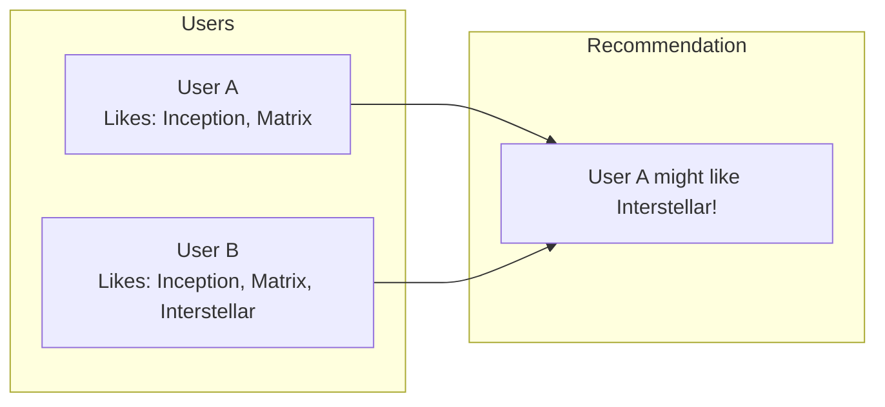
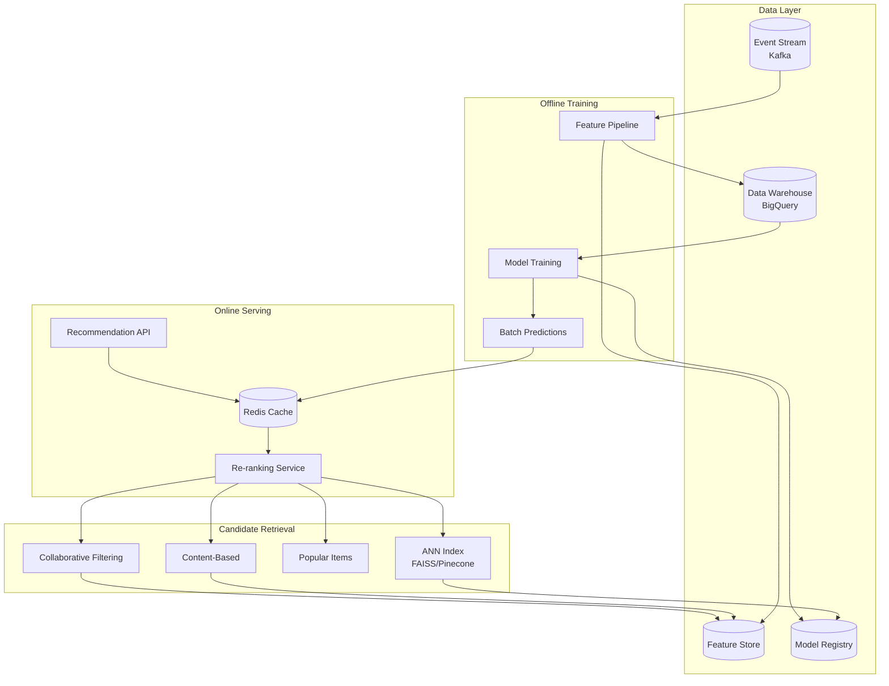
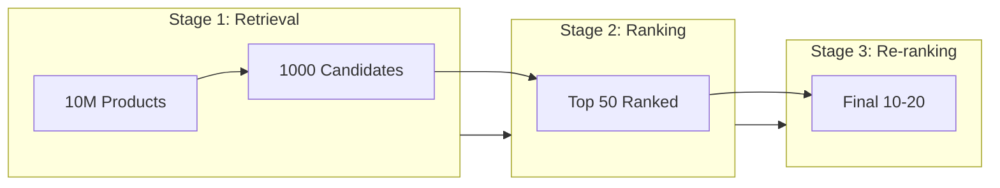
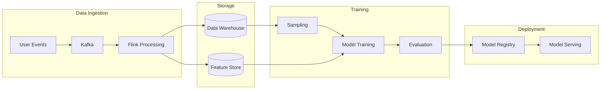

# Design a Recommendation System
{: .no_toc }

<details open markdown="block">
  <summary>Table of Contents</summary>
  {: .text-delta }
1. TOC
{:toc}
</details>

---

## What We're Building

A recommendation system suggests relevant items to users based on their behavior, preferences, and the behavior of similar users. These systems power some of the most valuable features in modern applications.

**Examples you interact with daily:**
- "Customers who bought this also bought..." (Amazon)
- "Because you watched..." (Netflix)
- "Discover Weekly" playlist (Spotify)
- "People you may know" (LinkedIn)
- "For You" feed (TikTok, Instagram)

### Why Recommendations Matter

| Platform | Impact |
|----------|--------|
| **Netflix** | 80% of watched content comes from recommendations |
| **Amazon** | 35% of revenue attributed to recommendations |
| **YouTube** | 70% of watch time from recommendations |
| **Spotify** | Discover Weekly has 40M+ users |

A 1% improvement in recommendation quality can translate to millions in revenue.

### Types of Recommendations

| Type | Description | Example |
|------|-------------|---------|
| **Collaborative Filtering** | Users who liked X also liked Y | "Customers also bought" |
| **Content-Based** | Items similar to what you liked | "Because you watched Sci-Fi" |
| **Hybrid** | Combine multiple approaches | Most production systems |
| **Knowledge-Based** | Expert rules + constraints | "Budget-friendly alternatives" |
| **Context-Aware** | Time, location, device context | "Weekend movies" |

---

## ML Concepts Primer

### Collaborative Filtering

The core idea: **Users with similar taste will like similar items.**



**Two approaches:**

| Type | How It Works | Pros | Cons |
|------|--------------|------|------|
| **User-based** | Find similar users, recommend their items | Intuitive | Doesn't scale |
| **Item-based** | Find similar items to what user liked | Scales better | Less serendipity |

### Matrix Factorization

Represent users and items as vectors in a latent space:

```
User-Item Matrix (ratings):
        Movie1  Movie2  Movie3  Movie4
User1     5       3       ?       1
User2     4       ?       ?       1
User3     1       1       ?       5
User4     ?       ?       5       4

Factorize into:
User Matrix (U) × Item Matrix (V) ≈ Original Matrix

Each user and item gets a vector in k-dimensional space.
Prediction: dot(user_vector, item_vector)
```

### Content-Based Filtering

Use item features to find similar items:

```python
# Example: Movie features
movie_features = {
    "Inception": ["sci-fi", "thriller", "Nolan", "DiCaprio"],
    "Interstellar": ["sci-fi", "drama", "Nolan", "McConaughey"],
    "The Dark Knight": ["action", "thriller", "Nolan", "Bale"]
}

# User profile = weighted sum of liked item features
# Recommend items with similar feature vectors
```

### Deep Learning for Recommendations

Modern systems use neural networks:

| Model | Description | Use Case |
|-------|-------------|----------|
| **Neural Collaborative Filtering** | MLP on user-item embeddings | General recommendations |
| **Two-Tower** | Separate user/item encoders | Scalable retrieval |
| **Transformers** | Sequence modeling | Session-based recs |
| **Graph Neural Networks** | Model user-item interactions | Social recommendations |

### Key Metrics

| Metric | What It Measures |
|--------|------------------|
| **Precision@K** | % of top K recommendations that are relevant |
| **Recall@K** | % of relevant items in top K |
| **NDCG** | Ranking quality (position matters) |
| **Hit Rate** | Did user interact with any recommendation? |
| **Coverage** | % of items ever recommended |
| **Diversity** | Variety in recommendations |

---

## Step 1: Requirements Clarification

### Questions to Ask

| Question | Why It Matters |
|----------|----------------|
| What are we recommending? | Products, videos, music, people? |
| Scale? | Users, items, interactions |
| Real-time or batch? | Architecture differs significantly |
| Cold start handling? | New users, new items |
| Diversity requirements? | Avoid filter bubbles |
| Business constraints? | Inventory, margins, freshness |

### Our Design: E-Commerce Product Recommendations

Let's design a recommendation system for an e-commerce platform like Amazon.

**Functional Requirements:**

| Feature | Priority | Description |
|---------|----------|-------------|
| Homepage recommendations | Must have | Personalized for each user |
| "Similar items" | Must have | On product detail pages |
| "Frequently bought together" | Must have | Cart/checkout page |
| "Because you viewed..." | Nice to have | Based on browsing history |
| Real-time updates | Nice to have | React to current session |

**Non-Functional Requirements:**

| Requirement | Target | Rationale |
|-------------|--------|-----------|
| **Latency** | < 100ms | Don't slow page load |
| **Throughput** | 100K requests/sec | Handle peak traffic |
| **Freshness** | < 1 hour for batch, real-time for session | Balance accuracy/freshness |
| **Coverage** | > 80% of catalog | Avoid cold items |

### Scale Assumptions

```
Users: 100 million
Products: 10 million
Daily interactions: 1 billion (views, clicks, purchases)
Recommendations served: 500 million/day
```

---

## Step 2: High-Level Architecture

### System Overview



### The Two-Stage Architecture

Recommendations typically use a **retrieval + ranking** pipeline:



| Stage | Goal | Latency Budget | Model Complexity |
|-------|------|----------------|------------------|
| **Retrieval** | Find 1000 candidates from millions | < 10ms | Simple (ANN) |
| **Ranking** | Score and order candidates | < 50ms | Complex (neural) |
| **Re-ranking** | Apply business rules, diversity | < 20ms | Rules + light ML |

---

## Step 3: Candidate Retrieval

### Multiple Retrieval Sources

```python
class CandidateRetriever:
    def __init__(self):
        self.retrievers = [
            CollaborativeFilteringRetriever(),
            ContentBasedRetriever(),
            PopularItemsRetriever(),
            TrendingItemsRetriever(),
            PersonalizedEmbeddingRetriever(),
        ]
    
    async def get_candidates(self, user_id: str, 
                            context: dict,
                            limit: int = 1000) -> List[str]:
        """Retrieve candidates from multiple sources."""
        all_candidates = []
        
        # Retrieve from each source in parallel
        tasks = [
            r.retrieve(user_id, context, limit=200)
            for r in self.retrievers
        ]
        results = await asyncio.gather(*tasks)
        
        # Merge and deduplicate
        seen = set()
        for source_candidates in results:
            for item_id, score in source_candidates:
                if item_id not in seen:
                    seen.add(item_id)
                    all_candidates.append((item_id, score))
        
        # Return top candidates
        all_candidates.sort(key=lambda x: x[1], reverse=True)
        return [item_id for item_id, _ in all_candidates[:limit]]
```

### Collaborative Filtering Retrieval

**Item-based CF:** Precompute item similarities, retrieve similar items to user's history.

```python
class CollaborativeFilteringRetriever:
    def __init__(self, similarity_index):
        self.similarity = similarity_index  # Precomputed item-item similarities
    
    async def retrieve(self, user_id: str, context: dict, 
                      limit: int) -> List[tuple]:
        """Get items similar to user's history."""
        # Get user's recent interactions
        user_history = await self.get_user_history(user_id, limit=50)
        
        candidates = {}
        
        for item_id, interaction_weight in user_history:
            # Get similar items
            similar_items = self.similarity.get_neighbors(item_id, k=20)
            
            for similar_id, similarity in similar_items:
                if similar_id not in candidates:
                    candidates[similar_id] = 0
                # Weighted by recency and interaction strength
                candidates[similar_id] += similarity * interaction_weight
        
        # Remove items already in history
        for item_id, _ in user_history:
            candidates.pop(item_id, None)
        
        # Sort by score
        sorted_candidates = sorted(
            candidates.items(), 
            key=lambda x: x[1], 
            reverse=True
        )
        return sorted_candidates[:limit]
```

### Two-Tower Model for Retrieval

Train separate encoders for users and items, then use approximate nearest neighbor search:

```python
import tensorflow as tf

class TwoTowerModel(tf.keras.Model):
    def __init__(self, user_features, item_features, embedding_dim=64):
        super().__init__()
        
        # User tower
        self.user_embedding = tf.keras.Sequential([
            tf.keras.layers.Dense(256, activation='relu'),
            tf.keras.layers.Dense(128, activation='relu'),
            tf.keras.layers.Dense(embedding_dim),
            tf.keras.layers.Lambda(lambda x: tf.nn.l2_normalize(x, axis=1))
        ])
        
        # Item tower
        self.item_embedding = tf.keras.Sequential([
            tf.keras.layers.Dense(256, activation='relu'),
            tf.keras.layers.Dense(128, activation='relu'),
            tf.keras.layers.Dense(embedding_dim),
            tf.keras.layers.Lambda(lambda x: tf.nn.l2_normalize(x, axis=1))
        ])
    
    def call(self, inputs):
        user_features, item_features = inputs
        user_emb = self.user_embedding(user_features)
        item_emb = self.item_embedding(item_features)
        return user_emb, item_emb
    
    def compute_similarity(self, user_emb, item_emb):
        return tf.reduce_sum(user_emb * item_emb, axis=1)

# After training, index all item embeddings for ANN search
import faiss

class ANNRetriever:
    def __init__(self, model, item_catalog):
        self.model = model
        
        # Compute item embeddings
        item_embeddings = []
        self.item_ids = []
        
        for item_id, features in item_catalog.items():
            emb = model.item_embedding(features)
            item_embeddings.append(emb)
            self.item_ids.append(item_id)
        
        # Build FAISS index
        embeddings = np.vstack(item_embeddings).astype('float32')
        self.index = faiss.IndexFlatIP(embeddings.shape[1])  # Inner product
        self.index.add(embeddings)
    
    async def retrieve(self, user_id: str, context: dict, 
                      limit: int) -> List[tuple]:
        """Retrieve using approximate nearest neighbors."""
        # Get user embedding
        user_features = await self.get_user_features(user_id)
        user_emb = self.model.user_embedding(user_features)
        
        # ANN search
        scores, indices = self.index.search(
            user_emb.numpy().astype('float32'), 
            limit
        )
        
        results = [
            (self.item_ids[idx], float(score))
            for idx, score in zip(indices[0], scores[0])
        ]
        return results
```

---

## Step 4: Ranking Model

The ranking model scores each candidate based on user, item, and context features.

### Feature Engineering

```python
class FeatureExtractor:
    """Extract features for ranking model."""
    
    def __init__(self, feature_store):
        self.feature_store = feature_store
    
    async def extract(self, user_id: str, item_id: str, 
                     context: dict) -> dict:
        """Extract all features for user-item pair."""
        
        # User features
        user_features = await self.feature_store.get_user_features(user_id)
        # - Demographics: age, gender, location
        # - Behavioral: avg_session_duration, purchase_frequency
        # - Historical: category_preferences, brand_preferences
        
        # Item features
        item_features = await self.feature_store.get_item_features(item_id)
        # - Attributes: category, brand, price, rating
        # - Popularity: views_last_7d, purchases_last_7d
        # - Freshness: days_since_added
        
        # User-Item interaction features
        interaction_features = await self.get_interaction_features(
            user_id, item_id
        )
        # - Has user viewed this item before?
        # - Has user purchased from this brand?
        # - Price vs user's typical purchase price
        
        # Context features
        context_features = self.extract_context(context)
        # - Time of day, day of week
        # - Device type
        # - Current page/session context
        
        return {
            **user_features,
            **item_features,
            **interaction_features,
            **context_features
        }
    
    def extract_context(self, context: dict) -> dict:
        """Extract context features."""
        return {
            "hour_of_day": context.get("timestamp").hour,
            "day_of_week": context.get("timestamp").weekday(),
            "is_mobile": context.get("device") == "mobile",
            "session_depth": context.get("pages_viewed", 0),
        }
```

### Deep Ranking Model

```python
class RankingModel(tf.keras.Model):
    """Deep learning model for candidate ranking."""
    
    def __init__(self, feature_config):
        super().__init__()
        
        # Embedding layers for categorical features
        self.embeddings = {}
        for feat, vocab_size in feature_config['categorical'].items():
            self.embeddings[feat] = tf.keras.layers.Embedding(
                vocab_size, 16
            )
        
        # Dense layers
        self.dense = tf.keras.Sequential([
            tf.keras.layers.Dense(512, activation='relu'),
            tf.keras.layers.BatchNormalization(),
            tf.keras.layers.Dropout(0.3),
            tf.keras.layers.Dense(256, activation='relu'),
            tf.keras.layers.BatchNormalization(),
            tf.keras.layers.Dropout(0.3),
            tf.keras.layers.Dense(128, activation='relu'),
            tf.keras.layers.Dense(1, activation='sigmoid')
        ])
    
    def call(self, features):
        # Embed categorical features
        embedded = []
        for feat_name, embedding_layer in self.embeddings.items():
            emb = embedding_layer(features[feat_name])
            embedded.append(tf.reshape(emb, [-1, emb.shape[-1]]))
        
        # Concatenate with numerical features
        numerical = features['numerical']
        all_features = tf.concat(embedded + [numerical], axis=1)
        
        # Predict click/purchase probability
        return self.dense(all_features)
```

### Ranking Service

```python
class RankingService:
    def __init__(self, model, feature_extractor):
        self.model = model
        self.features = feature_extractor
    
    async def rank(self, user_id: str, candidates: List[str],
                   context: dict) -> List[dict]:
        """Rank candidates for a user."""
        
        # Extract features for all candidates (batch)
        features_batch = await asyncio.gather(*[
            self.features.extract(user_id, item_id, context)
            for item_id in candidates
        ])
        
        # Batch predict
        scores = self.model.predict(features_batch)
        
        # Sort by score
        ranked = [
            {"item_id": item_id, "score": float(score)}
            for item_id, score in zip(candidates, scores)
        ]
        ranked.sort(key=lambda x: x["score"], reverse=True)
        
        return ranked
```

---

## Step 5: Re-ranking and Business Rules

After ML ranking, apply business logic:

```python
class ReRanker:
    def __init__(self, config):
        self.config = config
    
    async def rerank(self, user_id: str, ranked_items: List[dict],
                    context: dict) -> List[dict]:
        """Apply business rules and diversity."""
        
        items = ranked_items.copy()
        
        # Filter out-of-stock items
        items = await self.filter_out_of_stock(items)
        
        # Filter items user already purchased
        items = await self.filter_purchased(user_id, items)
        
        # Apply diversity (category, brand, price)
        items = self.diversify(items)
        
        # Boost promoted/sponsored items
        items = await self.apply_boosts(items, context)
        
        # Apply position bias correction
        items = self.position_debias(items)
        
        return items[:self.config.get("num_results", 20)]
    
    def diversify(self, items: List[dict]) -> List[dict]:
        """Ensure diversity in recommendations."""
        result = []
        seen_categories = {}
        seen_brands = {}
        
        for item in items:
            category = item.get("category")
            brand = item.get("brand")
            
            # Limit items per category/brand
            cat_count = seen_categories.get(category, 0)
            brand_count = seen_brands.get(brand, 0)
            
            if cat_count < 3 and brand_count < 2:
                result.append(item)
                seen_categories[category] = cat_count + 1
                seen_brands[brand] = brand_count + 1
        
        return result
    
    async def apply_boosts(self, items: List[dict], 
                          context: dict) -> List[dict]:
        """Boost certain items based on business rules."""
        
        # Get active promotions
        promotions = await self.get_active_promotions()
        
        for item in items:
            boost = 1.0
            
            # Boost high-margin items slightly
            if item.get("margin_tier") == "high":
                boost *= 1.1
            
            # Boost promoted items
            if item["item_id"] in promotions:
                boost *= 1.2
            
            # Boost new arrivals (freshness)
            days_old = item.get("days_since_added", 0)
            if days_old < 7:
                boost *= 1.1
            
            item["score"] *= boost
        
        # Re-sort after boosting
        items.sort(key=lambda x: x["score"], reverse=True)
        return items
```

---

## Step 6: Handling Cold Start

New users and new items don't have interaction history.

### New User Cold Start

```python
class ColdStartHandler:
    """Handle users/items with no history."""
    
    async def get_new_user_recommendations(self, user_id: str, 
                                           context: dict) -> List[str]:
        """Recommendations for new users."""
        
        # 1. Use available signals
        signals = {}
        
        # Registration data
        user_profile = await self.get_user_profile(user_id)
        if user_profile:
            signals["demographics"] = user_profile
        
        # Current session behavior
        session = context.get("session_history", [])
        if session:
            signals["session"] = session
        
        # 2. Strategy based on available signals
        if signals.get("session"):
            # Use session-based recommendations
            return await self.session_based_recs(signals["session"])
        
        elif signals.get("demographics"):
            # Use demographic-based clusters
            cluster = self.get_user_cluster(signals["demographics"])
            return await self.cluster_based_recs(cluster)
        
        else:
            # Fall back to popularity
            return await self.get_popular_items(context)
    
    async def session_based_recs(self, session: List[dict]) -> List[str]:
        """Recommend based on current session."""
        # Get items similar to recently viewed
        recent_items = [s["item_id"] for s in session[-5:]]
        
        candidates = []
        for item_id in recent_items:
            similar = await self.get_similar_items(item_id)
            candidates.extend(similar)
        
        return list(set(candidates))[:100]
```

### New Item Cold Start

```python
class NewItemHandler:
    """Handle new items with no interaction data."""
    
    async def get_item_embedding_cold_start(self, item_id: str) -> np.ndarray:
        """Generate embedding for new item using content features."""
        
        # Get item attributes
        item = await self.get_item(item_id)
        
        # Use content-based embedding
        text_features = f"{item['title']} {item['description']}"
        text_embedding = self.text_encoder.encode(text_features)
        
        # Combine with categorical features
        category_embedding = self.category_encoder(item['category'])
        brand_embedding = self.brand_encoder(item['brand'])
        
        # Final embedding
        combined = np.concatenate([
            text_embedding,
            category_embedding,
            brand_embedding
        ])
        
        return combined
    
    async def bootstrap_new_item(self, item_id: str):
        """Bootstrap new item into recommendation system."""
        
        # Generate content-based embedding
        embedding = await self.get_item_embedding_cold_start(item_id)
        
        # Add to ANN index for retrieval
        await self.ann_index.add_item(item_id, embedding)
        
        # Find similar existing items
        similar_items = await self.ann_index.search(embedding, k=50)
        
        # Inherit some collaborative signals
        for similar_id, similarity in similar_items:
            await self.transfer_signals(similar_id, item_id, weight=similarity)
```

---

## Step 7: Real-Time Personalization

Update recommendations based on current session:

```python
class RealTimePersonalizer:
    """Adjust recommendations based on real-time behavior."""
    
    def __init__(self, redis_client):
        self.redis = redis_client
    
    async def on_user_event(self, user_id: str, event: dict):
        """Process real-time user event."""
        event_type = event["type"]
        item_id = event["item_id"]
        
        # Update session history
        session_key = f"session:{user_id}"
        await self.redis.lpush(session_key, json.dumps(event))
        await self.redis.ltrim(session_key, 0, 49)  # Keep last 50
        await self.redis.expire(session_key, 3600)  # 1 hour TTL
        
        # Update real-time features
        if event_type == "view":
            await self.update_category_interest(user_id, item_id)
        elif event_type == "add_to_cart":
            await self.update_purchase_intent(user_id, item_id)
    
    async def get_session_context(self, user_id: str) -> dict:
        """Get current session context for recommendations."""
        session_key = f"session:{user_id}"
        events = await self.redis.lrange(session_key, 0, -1)
        
        if not events:
            return {"has_session": False}
        
        parsed = [json.loads(e) for e in events]
        
        return {
            "has_session": True,
            "viewed_items": [e["item_id"] for e in parsed if e["type"] == "view"],
            "cart_items": [e["item_id"] for e in parsed if e["type"] == "add_to_cart"],
            "viewed_categories": list(set(e.get("category") for e in parsed)),
            "session_duration": (parsed[0]["timestamp"] - parsed[-1]["timestamp"]),
        }
    
    async def adjust_recommendations(self, user_id: str, 
                                    base_recs: List[str]) -> List[str]:
        """Adjust recommendations based on session."""
        context = await self.get_session_context(user_id)
        
        if not context["has_session"]:
            return base_recs
        
        adjusted = []
        
        for item_id in base_recs:
            item = await self.get_item(item_id)
            
            # Boost items in categories user is browsing
            if item["category"] in context["viewed_categories"]:
                adjusted.append((item_id, 1.2))
            else:
                adjusted.append((item_id, 1.0))
        
        # Sort by adjusted score
        adjusted.sort(key=lambda x: x[1], reverse=True)
        
        # Add "similar to viewed" items
        for viewed_id in context["viewed_items"][-3:]:
            similar = await self.get_similar_items(viewed_id, k=5)
            for sim_id in similar:
                if sim_id not in [a[0] for a in adjusted]:
                    adjusted.insert(0, (sim_id, 1.5))
        
        return [item_id for item_id, _ in adjusted]
```

---

## Step 8: Training Pipeline

### Data Pipeline



### Training Data Generation

```python
class TrainingDataGenerator:
    """Generate training data from user interactions."""
    
    def __init__(self, data_warehouse):
        self.dw = data_warehouse
    
    async def generate_training_data(self, 
                                    start_date: str, 
                                    end_date: str) -> pd.DataFrame:
        """Generate positive and negative samples."""
        
        # Positive samples: user-item interactions
        positives = await self.dw.query(f"""
            SELECT 
                user_id,
                item_id,
                event_type,
                timestamp,
                1 as label
            FROM events
            WHERE date BETWEEN '{start_date}' AND '{end_date}'
            AND event_type IN ('click', 'purchase', 'add_to_cart')
        """)
        
        # Negative sampling
        negatives = await self.generate_negatives(positives)
        
        # Combine
        training_data = pd.concat([positives, negatives])
        
        # Add features
        training_data = await self.add_features(training_data)
        
        return training_data
    
    async def generate_negatives(self, positives: pd.DataFrame, 
                                ratio: int = 4) -> pd.DataFrame:
        """Generate negative samples."""
        negatives = []
        
        # Get all items
        all_items = await self.get_all_items()
        
        for _, row in positives.iterrows():
            user_id = row["user_id"]
            positive_item = row["item_id"]
            
            # Get user's positive items
            user_positives = set(
                positives[positives["user_id"] == user_id]["item_id"]
            )
            
            # Sample negatives
            neg_candidates = [i for i in all_items if i not in user_positives]
            sampled = random.sample(neg_candidates, min(ratio, len(neg_candidates)))
            
            for neg_item in sampled:
                negatives.append({
                    "user_id": user_id,
                    "item_id": neg_item,
                    "timestamp": row["timestamp"],
                    "label": 0
                })
        
        return pd.DataFrame(negatives)
```

### Model Training

```python
class RecommendationTrainer:
    """Train recommendation models."""
    
    def __init__(self, config):
        self.config = config
        self.mlflow = mlflow
    
    async def train(self, training_data: pd.DataFrame):
        """Train and evaluate model."""
        
        with self.mlflow.start_run():
            # Split data
            train, val, test = self.temporal_split(training_data)
            
            # Create model
            model = self.create_model()
            
            # Train
            history = model.fit(
                train,
                validation_data=val,
                epochs=self.config["epochs"],
                batch_size=self.config["batch_size"],
                callbacks=[
                    tf.keras.callbacks.EarlyStopping(patience=3),
                    tf.keras.callbacks.ModelCheckpoint("best_model.h5")
                ]
            )
            
            # Evaluate
            metrics = self.evaluate(model, test)
            
            # Log to MLflow
            self.mlflow.log_metrics(metrics)
            self.mlflow.log_params(self.config)
            self.mlflow.log_model(model, "model")
            
            # Register if improved
            if metrics["ndcg@10"] > self.get_production_metric("ndcg@10"):
                self.register_model(model, metrics)
            
            return model, metrics
    
    def evaluate(self, model, test_data: pd.DataFrame) -> dict:
        """Evaluate model on test data."""
        predictions = model.predict(test_data)
        
        return {
            "auc": roc_auc_score(test_data["label"], predictions),
            "ndcg@10": self.compute_ndcg(test_data, predictions, k=10),
            "hit_rate@10": self.compute_hit_rate(test_data, predictions, k=10),
            "precision@10": self.compute_precision(test_data, predictions, k=10),
        }
```

---

## Step 9: A/B Testing

### Experiment Framework

```python
class RecommendationExperiment:
    """A/B testing for recommendation models."""
    
    def __init__(self, experiment_config):
        self.config = experiment_config
        self.variants = experiment_config["variants"]
    
    def get_variant(self, user_id: str) -> str:
        """Deterministic assignment to variant."""
        hash_val = hash(f"{self.config['experiment_id']}:{user_id}")
        bucket = hash_val % 100
        
        cumulative = 0
        for variant_name, allocation in self.variants.items():
            cumulative += allocation
            if bucket < cumulative:
                return variant_name
        
        return "control"
    
    async def get_recommendations(self, user_id: str, 
                                 context: dict) -> List[str]:
        """Get recommendations for user's variant."""
        variant = self.get_variant(user_id)
        
        if variant == "control":
            model = self.models["production"]
        else:
            model = self.models[variant]
        
        recs = await model.recommend(user_id, context)
        
        # Log for analysis
        await self.log_impression(user_id, variant, recs)
        
        return recs
    
    async def analyze(self) -> dict:
        """Analyze experiment results."""
        results = {}
        
        for variant in self.variants:
            metrics = await self.compute_metrics(variant)
            results[variant] = {
                "ctr": metrics["clicks"] / metrics["impressions"],
                "conversion_rate": metrics["purchases"] / metrics["impressions"],
                "revenue_per_user": metrics["revenue"] / metrics["users"],
            }
        
        # Statistical significance
        for variant in self.variants:
            if variant != "control":
                results[variant]["lift"] = (
                    (results[variant]["revenue_per_user"] - 
                     results["control"]["revenue_per_user"]) /
                    results["control"]["revenue_per_user"]
                )
                results[variant]["p_value"] = self.compute_p_value(
                    "control", variant, "revenue_per_user"
                )
        
        return results
```

---

## Step 10: Monitoring

### Key Metrics

| Metric | Description | Alert |
|--------|-------------|-------|
| **CTR** | Click-through rate | Drop > 10% |
| **Conversion** | Purchase rate | Drop > 5% |
| **Coverage** | % of catalog recommended | < 70% |
| **Diversity** | Variety in recommendations | Decrease |
| **Latency** | Response time | P99 > 100ms |
| **Cache Hit** | Cache efficiency | < 80% |

### Monitoring Dashboard

```python
import prometheus_client as prom

# Metrics
recommendation_requests = prom.Counter(
    'recommendation_requests_total',
    'Total recommendation requests',
    ['endpoint', 'variant']
)

recommendation_latency = prom.Histogram(
    'recommendation_latency_seconds',
    'Recommendation latency',
    buckets=[0.01, 0.025, 0.05, 0.1, 0.25, 0.5]
)

recommendation_coverage = prom.Gauge(
    'recommendation_coverage',
    'Unique items recommended in last hour'
)

# Track recommendations
async def track_recommendations(user_id: str, items: List[str], 
                               variant: str, latency: float):
    recommendation_requests.labels(
        endpoint='homepage',
        variant=variant
    ).inc()
    
    recommendation_latency.observe(latency)
    
    # Update coverage tracking
    for item in items:
        await redis.sadd("recommended_items:hourly", item)
```

---

## Interview Checklist

- [ ] **Clarified requirements** (items, scale, real-time needs)
- [ ] **Explained retrieval vs ranking** (two-stage architecture)
- [ ] **Covered retrieval methods** (CF, content-based, ANN)
- [ ] **Discussed ranking model** (features, deep learning)
- [ ] **Addressed cold start** (new users, new items)
- [ ] **Explained real-time personalization** (session-based)
- [ ] **Covered training pipeline** (data, features, evaluation)
- [ ] **Discussed A/B testing** (experiment framework)
- [ ] **Mentioned business rules** (diversity, boosts)
- [ ] **Addressed monitoring** (metrics, alerts)

---

## Sample Interview Dialogue

**Interviewer:** "Design a recommendation system for an e-commerce platform."

**You:** "Great question! Let me clarify a few things. What are we recommending—products, categories? And what's the scale in terms of users and items?"

**Interviewer:** "Products. Let's say 100 million users and 10 million products."

**You:** "Got it. At that scale, we need a two-stage architecture: retrieval and ranking.

In the retrieval stage, we need to narrow down from 10 million items to about 1000 candidates in under 10ms. I'd use multiple retrieval sources in parallel:
- Collaborative filtering for 'users who bought X also bought Y'
- Content-based for 'similar to items you've liked'
- A Two-Tower model with ANN search for personalized embeddings
- Popular/trending items as fallback

In the ranking stage, we score those 1000 candidates with a deep learning model that considers user features, item features, and context. This gives us the final top 20-50 items.

Then re-ranking applies business rules: diversity across categories, inventory filtering, and promotional boosts.

For cold start—new users get popular items with session-based personalization once they start browsing. New items use content-based embeddings until they get interaction data.

Want me to dive deeper into any component?"

---

## Summary

| Component | Choice | Rationale |
|-----------|--------|-----------|
| **Retrieval** | Multi-source + ANN | Speed + coverage |
| **Ranking** | Deep neural network | Captures complex patterns |
| **Embeddings** | Two-Tower model | Scalable similarity |
| **ANN Index** | FAISS/Pinecone | Sub-10ms retrieval |
| **Feature Store** | Feast/Tecton | Consistent features |
| **Real-time** | Redis + streaming | Session personalization |
| **A/B Testing** | Custom framework | Measure business impact |

Recommendation systems combine information retrieval, machine learning, and software engineering. The key is balancing accuracy, latency, and business objectives while handling scale.

