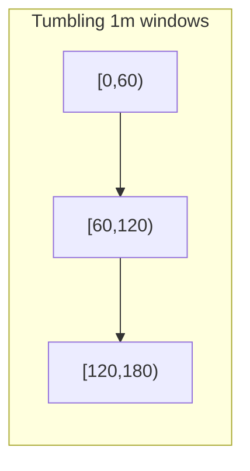
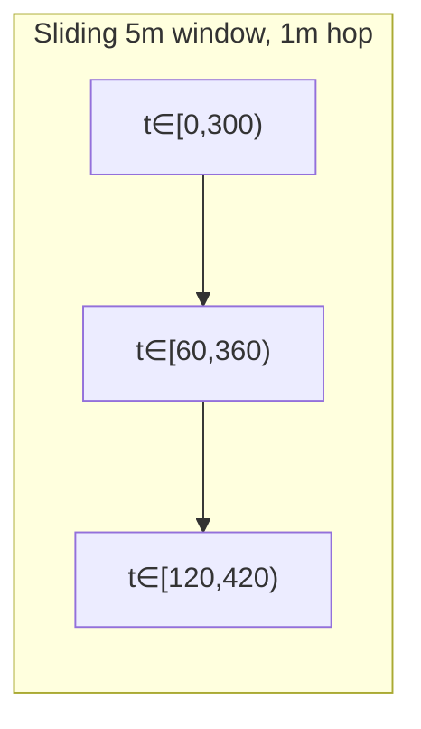
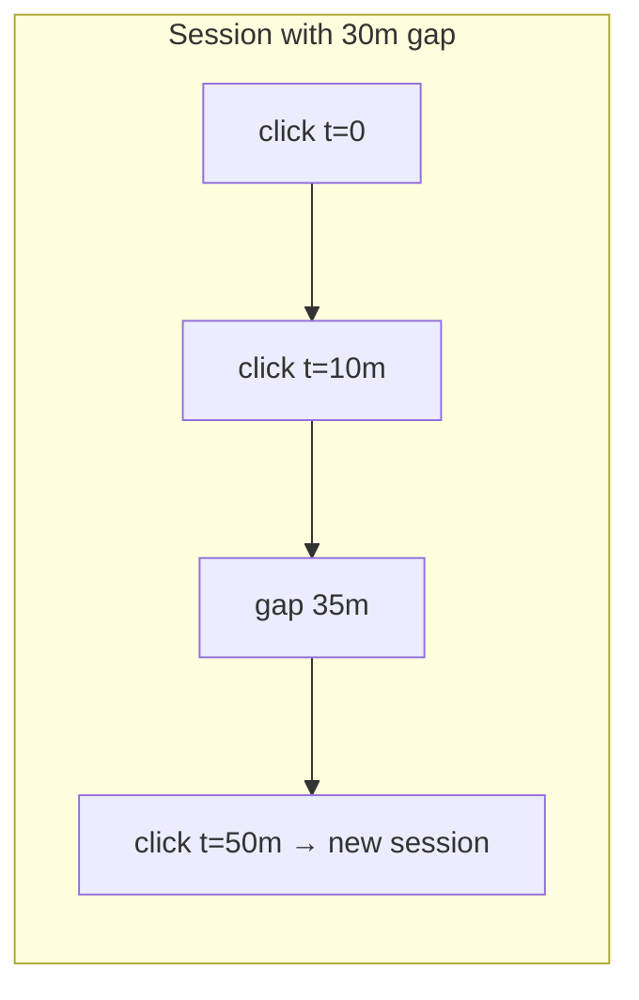
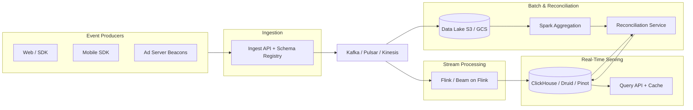
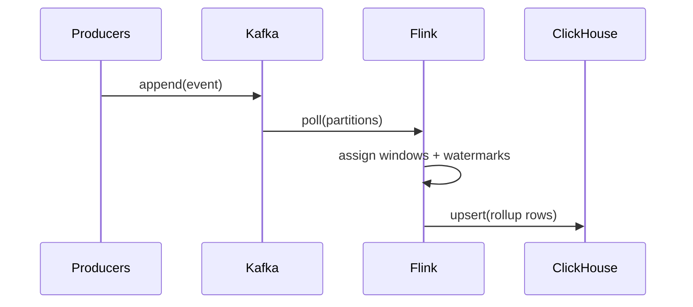

# Design an Ad Click Event Aggregator (Real-Time Reporting & Billing)
{: .no_toc }

<details open markdown="block">
  <summary>Table of contents</summary>
  {: .text-delta }
1. TOC
{:toc}
</details>

---

## What We're Building

We are designing a **real-time ad click and impression event aggregation system** that ingests **billions** of measurement events per day, aggregates them for **reporting**, **billing**, and **optimization**, and aims for **exactly-once counting** (or defensible **at-most-once** with reconciliation) at planetary scale—think **Google Ads reporting**, **Meta Ads Manager**, **The Trade Desk**, or **programmatic** SSP/DSP measurement pipelines.

| Capability | Why it matters |
|------------|----------------|
| **Massive ingest** | Every search result page, feed slot, and display placement can emit multiple impression/click/view events |
| **Low-latency aggregates** | Advertisers expect dashboards and pacing controls that reflect reality within **seconds to a minute** |
| **Financial correctness** | Clicks and impressions often **bill** advertisers; under-counting loses revenue, over-counting destroys trust |
| **Fraud resistance** | Invalid traffic (IVT) and click fraud can dominate cost if unchecked |
| **Reconciliation** | Finance and auditors expect **batch** and **real-time** paths to **agree** (or explain systematic differences) |

### Real-world scale (illustrative)

| Signal | Order of magnitude | Interview talking point |
|--------|--------------------|-------------------------|
| **Google Search volume** | On the order of **8.5B+ searches/day** (public ballparks vary by year) | Each SERP can show **multiple ads**; **impression** events often dwarf **clicks** |
| **Programmatic display** | **Trillions** of bid/auction/impression-class events/day industry-wide | Not all are stored at full fidelity forever—**sampling**, **rollups**, and **TTL** are economic necessities |
| **Per-advertiser dashboards** | High **QPS** on **pre-aggregated** metrics, not raw scans | **OLAP** + **materialized views** + **caches** |

### Reference vocabulary (name-drop with care)

| System / paper | What to cite |
|----------------|--------------|
| **Apache Kafka** | Durable log, partition scaling, consumer groups, transactions |
| **Apache Flink / Beam** | Event time, watermarks, managed state, **exactly-once** sinks |
| **ClickHouse / Druid / Pinot** | Columnar OLAP, rollups, fast slice-and-dice |
| **Dataflow / Spark Streaming** | Unified batch + streaming; **reconciliation** jobs |
| **Lambda / Kappa** | **Speed** vs **batch** layers; stream-only architectures |

{: .note }
> In interviews, **scope fraud + reconciliation early**. Many candidates optimize throughput but forget **money** and **trust**.

---

## Key Concepts Primer

This section is the **vocabulary layer** interviewers probe when you say “real-time aggregation,” “event time,” or “exactly-once.”

### Event-time vs processing-time — why the distinction matters

| Clock | Definition | Failure mode if ignored |
|-------|------------|-------------------------|
| **Event-time** | When the **user** interaction occurred (client or server **business timestamp**) | **Double counting** or **wrong windows** if devices are skewed |
| **Processing-time** | When your **pipeline** observes the record | Simple, but **misleading** under lag, retries, or mobile offline queues |

**Why it matters for ads:** campaigns are budgeted and reported in **calendar windows** (hour/day/timezone). If you only use processing-time, a burst of delayed mobile events **shifts revenue** between days.

**Out-of-order events:** networks reorder packets; mobile apps **batch** and flush; retries replay. Streams are rarely sorted by event-time.

**Watermarks:** a watermark with value `W` is a pipeline’s assertion: “I believe I’ve seen all events with event-time **≤ W** (except for stragglers we’ll handle separately).” Watermarks are usually **heuristic** (e.g., `max_event_time_seen − max_out_of_orderness`).

```mermaid
gantt
  title Event-time vs arrival-time (conceptual)
  dateFormat X
  axisFormat %s
  section Events
  e1 (t=10) arrives t=12 :a1, 12, 13
  e2 (t=11) arrives t=14 :a2, 14, 15
  e3 (t=9)  arrives t=16 :a3, 16, 17
```



{: .tip }
> Say: **“Event time defines correctness; processing time defines latency.”** Then explain **watermarks** + **allowed lateness**.

### Lambda vs Kappa architecture

| Aspect | **Lambda** | **Kappa** |
|--------|------------|-----------|
| **Pipelines** | **Speed** (stream) + **Batch** (corrective) | **Stream-only** (single code path) |
| **Strengths** | Batch can **recompute** history; stream handles **freshness** | Operational simplicity; one mental model |
| **Weaknesses** | **Two code paths** can diverge | Harder to fix historic mistakes without replay |
| **Typical in ads** | **Lambda-like** is common: streaming for dashboards, **daily Spark** for billing truth | Kappa **with** durable log replay approximates both |

**Trade-off soundbite:** Lambda optimizes for **correctability**; Kappa optimizes for **uniformity**. Many production systems are **Lambda** at the macro level but **Kappa** inside the streaming engine (single streaming codebase, batch is **replay** of the same logic).

### Exactly-once aggregation — challenges and solutions

**Hard truth:** distributed systems compose **at-least-once** delivery with retries. “Exactly-once” is usually **exactly-once effects** via:

| Technique | What it guarantees | Caveat |
|-----------|-------------------|--------|
| **Idempotent writes** | Retries don’t duplicate effects | Requires a stable **idempotency key** |
| **Dedup store** | Second insert of same logical event is ignored | Needs **TTL** + memory bounds |
| **Transactional sinks** | Kafka **transactions** + **two-phase commit**-style sinks | Operational complexity |
| **Deterministic reduce** | Replay yields same aggregate if input set is same | Still needs dedup **before** aggregation for user-visible counts |

{: .important }
> Interviewers often accept: **end-to-end exactly-once is expensive**; many ad systems ship **at-least-once ingest + idempotent keys + reconciliation** as the pragmatic combo.

### Windowed aggregations — tumbling, sliding, session (with timing diagrams)

**Tumbling windows** (fixed size, **no overlap**): e.g., 1-minute buckets aligned to the epoch.



**Sliding windows** (fixed size, **hop < size**): e.g., 5-minute window every 1 minute—smooths noise; **more** state and output volume.



**Session windows** (activity-gap based): e.g., gap **> 30 minutes** ends a session—great for **funnel** analytics; tricky with distributed partitioning (sessions may span keys).



| Session concern | Mitigation |
|-----------------|------------|
| **Key partitioning** by `user` only | Sessions spanning shards need **shuffle** or **merge** |
| **Long idle** | **TTL** timers in state backend; **checkpoint** recovery |

| Window | Best for | Pain point |
|--------|----------|------------|
| **Tumbling** | **Billing** cadence, minute rollups | Boundary effects without **allowed lateness** |
| **Sliding** | **Dashboards** with smooth curves | Costly: overlapping state |
| **Session** | **Attribution** paths, engagement | Merging **across** partitions |

### Click fraud / invalid traffic (IVT)

| Threat | Pattern | Mitigation (examples) |
|--------|---------|------------------------|
| **Bots** | Non-human agents, headless browsers | **TLS fingerprinting**, behavioral signals, **honeypot** ads |
| **Click farms** | Human-like but coordinated | IP/device velocity, **graph** anomalies |
| **Publisher fraud** | Hidden ads, stacked iframes | **Viewability** standards (MRC), **geo sanity** |
| **Retaliatory spikes** | Sudden CTR anomalies | **Robust statistics**, peer cohort baselines |

### Attribution — last-click, multi-touch, view-through

| Model | What it credits | Trade-off |
|-------|-----------------|-----------|
| **Last-click** | Final ad before conversion | Simple; undervalues upper funnel |
| **Multi-touch** | Weighted across touches | Needs **identity graph** + privacy constraints |
| **View-through** | Impression without click | Requires **control** + **holdout** discipline |

**Attribution windows:** only events within **N days** count—implemented via **state** + **TTL** (streaming) or **join** against conversions (batch).

### Reconciliation — batch vs real-time must match (or explain differences)

| Outcome | Meaning |
|---------|---------|
| **Match within ε** | Normal: rounding, late data cutoff differences |
| **Systematic drift** | Bug, timezone error, or different **dedup** rules |
| **Real-time lower** | Stream **dropped** late events beyond allowed lateness |
| **Real-time higher** | Rare; possible **double processing** before correction |

**Production pattern:** publish a **reconciliation report** per day: `delta = batch − stream` by `advertiser_id`, `campaign_id`.

---

## Step 1: Requirements

### Functional requirements

| ID | Requirement | Detail |
|----|-------------|--------|
| **F1** | **Ingest** click + impression events | Include **ids**, **timestamps**, **geo**, **device**, **creative**, **placement**, **price** fields (as applicable) |
| **F2** | **Real-time aggregation** | Group by **`ad_id`**, **`campaign_id`**, **`advertiser_id`**, **country**, **placement_type**, etc. |
| **F3** | **Query aggregated metrics** | Dashboards: CTR, spend, impressions, clicks, conversions (if joined) |
| **F4** | **Reconciliation** | Compare streaming aggregates vs **daily batch**; alert on thresholds |
| **F5** | **Fraud filtering** | Tag or drop IVT; maintain **audit** trail for billing disputes |

### Non-functional requirements (targets)

| ID | Attribute | Target | Notes |
|----|-----------|--------|-------|
| **N1** | **Ingest throughput** | **1M events/sec** sustained | Regionally sharded; horizontal Kafka partitions |
| **N2** | **Query latency** | **p99 < 500 ms** on pre-aggregates | Not raw event scans for dashboards |
| **N3** | **Freshness** | **< 1 minute** for near-real-time KPIs | Watermark + processing lag SLO |
| **N4** | **Counting correctness** | **Exactly-once** semantics for billed metrics | Often **idempotent** + **reconciliation** |
| **N5** | **Availability** | **99.99%** for ingest path + query API | Multi-AZ, no single coordinator hot spot |

### Out of scope (typical)

- **Creative rendering** and **ad ranking** (the ad server problem)
- Full **identity resolution** across devices (tie to a separate ID graph)
- **Legal/compliance** deep dive (consent frameworks) beyond high-level mention

---

## Step 2: Estimation

### Traffic

| Quantity | Value |
|----------|-------|
| **Target ingest** | **1,000,000 events/sec** |
| **Events per day** | \(1e6 × 86,400 ≈ 8.64 × 10^{10}\) ⇒ **~86.4 billion/day** |

{: .note }
> 1M events/sec is a **round interview anchor**; real systems may be higher in aggregate globally but **partition** by region and tenant.

### Payload

| Field group | Approx bytes |
|-------------|--------------|
| IDs (request, impression, user anon, campaign) | 100–200 |
| Timestamps + enums | ~50 |
| Geo + device + placement | 100–200 |
| Billing fields (micro-currency, bid metadata) | ~50–150 |
| **Total** | **~500 bytes** average (compressed batches lower per-record overhead) |

### Storage (order-of-magnitude)

| Dataset | Formula (daily) | Daily raw |
|---------|------------------|-----------|
| **Raw events** | \(8.64×10^{10} × 500\) bytes | **~43 TB/day** uncompressed |
| **With replication (3×)** | | **~129 TB/day** on disk before compression |

Compression (Kafka **zstd**, columnar **Parquet**) often yields **3–10×** reduction for analytical storage.

| Aggregates | Assumption | Daily |
|------------|------------|-------|
| **1-minute rollup keys** | 10M active keys × 64-byte counters × 1440 minutes | ~**1.4 TB/day** (often less with aggressive pruning) |

### Cardinality watch-outs

| Dimension | Cardinality risk |
|-----------|------------------|
| **`creative_id` × `country` × `placement`** | High but manageable with **sketches** for uniques |
| **Raw `user_id`** in rollups | **Too high** for OLAP—prefer **aggregates** + **samples** |

---

## Step 3: High-Level Design

### Architecture (streaming + batch reconciliation)



**Read path:** clients call **Query API**, backed by **OLAP** + **CDN/API cache** for hot dashboards.

**Write path:** events land in the **log** first; **stream processors** compute incremental aggregates; **batch** recomputes canonical daily totals.

### Why Kafka → two consumers?

| Path | Purpose |
|------|---------|
| **Stream** | Low-latency aggregates + triggers (pacing, anomaly) |
| **Batch** | Cheaper full re-aggregation; **correction**; **audit** |

{: .tip }
> Mention **Kafka transactions** or **idempotent producer** + **exactly-once sink** if the interviewer wants depth.

---

## Step 4: Deep Dive

### 4.1 Event Ingestion and Schema

**Schema design goals:** **evolve** safely (Avro/Protobuf + registry), **minimize** hot keys, and **enable** dedup.

| Field | Example | Notes |
|-------|---------|-------|
| `event_id` | UUID | **Idempotency** key |
| `event_type` | `IMPRESSION` / `CLICK` | Enum |
| `event_time` | ISO-8601 | **Event-time** for windows |
| `ingest_time` | server clock | Debugging lag |
| `ad_id`, `campaign_id`, `advertiser_id` | strings | **Partition** keys |
| `anon_user_id` | token | Privacy-preserving |
| `idempotency_key` | hash(client, time bucket) | Secondary dedup |

**Kafka partitioning:** partition by **`campaign_id`** or **`ad_id`** hash to colocate related events; avoid super-hot keys by **salting** ultra-viral ads if needed.

#### Python — validation + normalization + dedup at ingestion

```python
from __future__ import annotations

import hashlib
import re
from dataclasses import dataclass
from datetime import datetime, timezone
from typing import Any, Dict, Optional, Tuple


ALLOWED_TYPES = frozenset({"IMPRESSION", "CLICK", "CONVERSION"})


@dataclass(frozen=True)
class ValidatedAdEvent:
    event_id: str
    event_type: str
    event_time: datetime
    ad_id: str
    campaign_id: str
    advertiser_id: str
    country: str
    device_class: str
    raw_bytes_estimate: int


def _parse_time(value: str) -> datetime:
    # Production: handle ISO-8601 with offsets; require Z or explicit offset
    if value.endswith("Z"):
        value = value[:-1] + "+00:00"
    dt = datetime.fromisoformat(value)
    if dt.tzinfo is None:
        raise ValueError("event_time must be timezone-aware")
    return dt.astimezone(timezone.utc)


def _is_ulid_like(event_id: str) -> bool:
    return bool(re.fullmatch(r"[0-9A-HJKMNP-TV-Z]{26}", event_id))


def validate_event(payload: Dict[str, Any]) -> Tuple[Optional[ValidatedAdEvent], Optional[str]]:
    try:
        event_id = str(payload["event_id"])
        event_type = str(payload["event_type"]).upper()
        event_time = _parse_time(str(payload["event_time"]))
        ad_id = str(payload["ad_id"])
        campaign_id = str(payload["campaign_id"])
        advertiser_id = str(payload["advertiser_id"])
        country = str(payload.get("country", "ZZ"))
        device_class = str(payload.get("device_class", "unknown"))
    except (KeyError, ValueError, TypeError) as exc:
        return None, f"schema_error:{exc}"

    if event_type not in ALLOWED_TYPES:
        return None, "invalid_event_type"
    if not _is_ulid_like(event_id):
        return None, "invalid_event_id_format"

    raw_estimate = len(repr(payload).encode("utf-8"))
    return (
        ValidatedAdEvent(
            event_id=event_id,
            event_type=event_type,
            event_time=event_time,
            ad_id=ad_id,
            campaign_id=campaign_id,
            advertiser_id=advertiser_id,
            country=country,
            device_class=device_class,
            raw_bytes_estimate=raw_estimate,
        ),
        None,
    )


def partition_key_for_kafka(evt: ValidatedAdEvent) -> bytes:
    # Stable hashing: campaign_id keeps related ads together
    h = hashlib.blake2b(evt.campaign_id.encode("utf-8"), digest_size=16).digest()
    return h


class IngestDedupFilter:
    """Approximate duplicate filter backed by a small exact LRU for verification."""

    def __init__(self, bloom_bits: int = 1 << 22) -> None:
        self._bloom = bytearray(bloom_bits // 8)
        self._recent_exact: Dict[str, float] = {}
        self._bloom_bits = bloom_bits

    def _bloom_indices(self, event_id: str) -> Tuple[int, int, int]:
        digest = hashlib.sha256(event_id.encode("utf-8")).digest()
        a = int.from_bytes(digest[0:8], "big")
        b = int.from_bytes(digest[8:16], "big")
        c = int.from_bytes(digest[16:24], "big")
        return a % self._bloom_bits, b % self._bloom_bits, c % self._bloom_bits

    def _bloom_set(self, idx: int) -> None:
        self._bloom[idx // 8] |= 1 << (idx % 8)

    def _bloom_test(self, idx: int) -> bool:
        return bool(self._bloom[idx // 8] & (1 << (idx % 8)))

    def maybe_duplicate(self, event_id: str, event_time: datetime) -> bool:
        i1, i2, i3 = self._bloom_indices(event_id)
        if (
            self._bloom_test(i1)
            and self._bloom_test(i2)
            and self._bloom_test(i3)
            and event_id in self._recent_exact
        ):
            return True
        # mark seen
        self._bloom_set(i1)
        self._bloom_set(i2)
        self._bloom_set(i3)
        self._recent_exact[event_id] = event_time.timestamp()
        return False
```

---

### 4.2 Stream Processing Pipeline

**Flink-style** mental model: **keyed streams** by `campaign_id`, **window** on event-time, **state** for aggregates + timers for watermarks.

**Late events:** route to **side output** if `event_time < watermark − allowed_lateness`; optionally **emit corrections** downstream.

#### Python — tumbling window aggregator (simplified in-process model)

```python
from __future__ import annotations

from collections import defaultdict
from dataclasses import dataclass
from datetime import datetime, timedelta, timezone
from typing import DefaultDict, Dict, Iterable, List, Tuple


@dataclass(frozen=True)
class Event:
    event_id: str
    event_type: str
    event_time: datetime
    campaign_id: str
    ad_id: str


def floor_to_window(ts: datetime, window: timedelta) -> datetime:
    epoch = datetime(1970, 1, 1, tzinfo=timezone.utc)
    if ts.tzinfo is None:
        raise ValueError("event_time must be timezone-aware")
    ts = ts.astimezone(timezone.utc)
    step = int(window.total_seconds())
    if step <= 0:
        raise ValueError("window must be positive")
    delta = ts - epoch
    snapped = (int(delta.total_seconds()) // step) * step
    return epoch + timedelta(seconds=snapped)


@dataclass
class WindowState:
    impressions: int = 0
    clicks: int = 0


class TumblingWindowAggregator:
    """
    Toy batch model of event-time tumbling windows:
    - Watermark = max(event_time in batch) - skew (bounded lateness of out-of-order within batch).
    - Emit window [w, w+size) when w + size <= watermark - allowed_lateness.
    Production Flink uses per-key state + timers; this captures the close rule only.
    """

    def __init__(
        self,
        window_size: timedelta,
        skew: timedelta = timedelta(seconds=5),
        allowed_lateness: timedelta = timedelta(0),
    ) -> None:
        self._window_size = window_size
        self._skew = skew
        self._allowed_lateness = allowed_lateness
        self._states: DefaultDict[Tuple[str, datetime], WindowState] = defaultdict(WindowState)

    def run(self, events: Iterable[Event]) -> List[Tuple[datetime, str, WindowState]]:
        ordered = sorted(events, key=lambda e: e.event_time)
        if not ordered:
            return []

        for ev in ordered:
            wstart = floor_to_window(ev.event_time, self._window_size)
            key = (ev.campaign_id, wstart)
            st = self._states[key]
            if ev.event_type == "IMPRESSION":
                st.impressions += 1
            elif ev.event_type == "CLICK":
                st.clicks += 1

        max_event_time = max(e.event_time for e in ordered)
        watermark = max_event_time - self._skew
        cutoff = watermark - self._allowed_lateness

        emitted: List[Tuple[datetime, str, WindowState]] = []
        to_delete: List[Tuple[str, datetime]] = []
        for (cid, wstart), st in self._states.items():
            wend = wstart + self._window_size
            if wend <= cutoff:
                emitted.append((wstart, cid, st))
                to_delete.append((cid, wstart))
        for key in to_delete:
            del self._states[key]
        # Remaining keys are "not yet closed" vs this watermark (late stragglers land here in Flink)
        return emitted
```

---

### 4.3 Aggregation Storage (OLAP)

**Why OLAP:** advertiser queries are **filter + group-by + sum** over time—columnar engines win.

| Store | Strength |
|-------|----------|
| **ClickHouse** | Fast rollups; **MergeTree**; great if you already operate CH |
| **Apache Druid / Pinot** | Real-time segment ingestion; good for **dashboard** APIs |

**Star schema sketch:**

| Table | Role |
|-------|------|
| **fact_ad_metrics_minute** | `minute_ts`, ids, metrics (impressions, clicks, cost_micros) |
| **dim_campaign** | campaign attributes slowly changing |
| **dim_ad** | creative metadata |

#### Python — rollup merge + query stub

```python
from __future__ import annotations

from dataclasses import dataclass, field
from datetime import datetime
from typing import Dict, Iterable, List, Tuple


@dataclass
class MinuteRollup:
    impressions: int = 0
    clicks: int = 0
    spend_micros: int = 0


@dataclass
class OLAPRollupStore:
    # Key: (minute_ts, campaign_id, country)
    rows: Dict[Tuple[datetime, str, str], MinuteRollup] = field(default_factory=dict)

    def merge_minute(
        self,
        minute_ts: datetime,
        campaign_id: str,
        country: str,
        impressions: int,
        clicks: int,
        spend_micros: int,
    ) -> None:
        key = (minute_ts.replace(second=0, microsecond=0), campaign_id, country)
        row = self.rows.get(key) or MinuteRollup()
        row.impressions += impressions
        row.clicks += clicks
        row.spend_micros += spend_micros
        self.rows[key] = row

    def query_range(
        self,
        campaign_id: str,
        start: datetime,
        end: datetime,
    ) -> MinuteRollup:
        total = MinuteRollup()
        for (minute_ts, cid, _), row in self.rows.items():
            if cid != campaign_id:
                continue
            if start <= minute_ts < end:
                total.impressions += row.impressions
                total.clicks += row.clicks
                total.spend_micros += row.spend_micros
        return total

    def ctr(self, rollup: MinuteRollup) -> float:
        if rollup.impressions == 0:
            return 0.0
        return rollup.clicks / rollup.impressions
```

---

### 4.4 Exactly-Once Counting

**Pattern:** assign **`event_id`** at source; maintain **dedup** in stream state; write aggregates with **idempotent keys** `(window, campaign, version)`.

#### Python — layered dedup + idempotent merge

```python
from __future__ import annotations

import hashlib
from dataclasses import dataclass
from typing import Dict, Set


@dataclass
class ExactlyOnceDedup:
    """Hybrid: Bloom-like bitfield + exact set for recent duplicates (toy)."""

    def __init__(self) -> None:
        self._exact: Set[str] = set()

    def first_time(self, event_id: str) -> bool:
        if event_id in self._exact:
            return False
        self._exact.add(event_id)
        return True


def idempotent_aggregate_key(campaign_id: str, window_start_ms: int, sink_version: int) -> str:
    raw = f"{campaign_id}:{window_start_ms}:v{sink_version}"
    return hashlib.sha256(raw.encode("utf-8")).hexdigest()


class IdempotentSink:
    """Simulates sink-side dedup: retries do not double-apply."""

    def __init__(self) -> None:
        self._applied: Set[str] = set()
        self._totals: Dict[str, int] = {}

    def apply(self, merge_key: str, delta_clicks: int) -> None:
        if merge_key in self._applied:
            return
        self._applied.add(merge_key)
        self._totals[merge_key] = self._totals.get(merge_key, 0) + delta_clicks
```

**Kafka transactions (conceptual):** configure `transactional.id` on producer; **read-process-write** in one transaction to **output topic** or **sink** that participates in the protocol—**checkpoint barriers** in Flink align with Kafka offsets.

---

### 4.5 Click Fraud Detection

**Layers:**

| Layer | Examples |
|-------|----------|
| **Rule engine** | >N clicks / sec from one IP to same ad |
| **Velocity** | IP + ASN + device spikes |
| **ML** | Isolation Forest on session features |
| **Ground truth** | Conversion feedback loops |

#### Python — rules + simple anomaly score

```python
from __future__ import annotations

from collections import defaultdict, deque
from dataclasses import dataclass
from datetime import datetime, timedelta
from typing import Deque, Dict, Tuple


@dataclass
class FraudDecision:
    allow: bool
    reason: str


class RuleEngine:
    def __init__(self, max_clicks_per_ip_per_minute: int = 30) -> None:
        self._max = max_clicks_per_ip_per_minute
        self._ip_clicks: Dict[str, Deque[datetime]] = defaultdict(deque)

    def evaluate_click(self, ip: str, ts: datetime) -> FraudDecision:
        dq = self._ip_clicks[ip]
        window_start = ts - timedelta(minutes=1)
        while dq and dq[0] < window_start:
            dq.popleft()
        dq.append(ts)
        if len(dq) > self._max:
            return FraudDecision(False, "ip_click_velocity")
        return FraudDecision(True, "ok")


class DeviceFingerprintBucket:
    def __init__(self) -> None:
        self._last_seen: Dict[str, datetime] = {}

    def suspicious_rotation(self, fp: str, ts: datetime) -> bool:
        last = self._last_seen.get(fp)
        self._last_seen[fp] = ts
        if last is None:
            return False
        return (ts - last) < timedelta(seconds=2)


def combined_score(rule: FraudDecision, rotation_suspicious: bool) -> float:
    score = 0.0
    if not rule.allow:
        score += 0.8
    if rotation_suspicious:
        score += 0.2
    return min(score, 1.0)
```

---

### 4.6 Batch Reconciliation

**Job:** daily Spark reads **raw Parquet** in the lake, recomputes metrics, compares to streaming **materialized** totals.

#### Python — compare streaming vs batch counters

```python
from __future__ import annotations

from dataclasses import dataclass
from typing import Dict, Iterable, Tuple


@dataclass
class ReconciliationRow:
    campaign_id: str
    stream_clicks: int
    batch_clicks: int

    @property
    def delta(self) -> int:
        return self.batch_clicks - self.stream_clicks

    @property
    def rel_error(self) -> float:
        if self.batch_clicks == 0:
            return 0.0
        return abs(self.delta) / self.batch_clicks


def reconcile(
    stream_counts: Dict[str, int],
    batch_counts: Dict[str, int],
    threshold: float = 0.005,
) -> Tuple[bool, Iterable[ReconciliationRow]]:
    rows = []
    ok = True
    all_keys = set(stream_counts) | set(batch_counts)
    for cid in sorted(all_keys):
        s = stream_counts.get(cid, 0)
        b = batch_counts.get(cid, 0)
        row = ReconciliationRow(cid, s, b)
        rows.append(row)
        if row.rel_error > threshold:
            ok = False
    return ok, rows


def apply_correction(stream_store: Dict[str, int], batch_counts: Dict[str, int]) -> None:
    for cid, value in batch_counts.items():
        stream_store[cid] = value
```

---

### 4.7 Query Layer and Reporting

**Patterns:**

| Pattern | Use |
|---------|-----|
| **Pre-materialized** | Minute/hour rollups by common dimensions |
| **Cache** | Redis for top dashboards |
| **Async** | Heavy exports via **query job** + object store link |

#### Python — API aggregation of cached rollups

```python
from __future__ import annotations

from dataclasses import dataclass
from datetime import datetime, timedelta
from typing import Dict, Iterable, List, Tuple


@dataclass
class ReportQuery:
    advertiser_id: str
    start: datetime
    end: datetime
    group_by: Tuple[str, ...] = ("campaign_id",)


def slice_minutes(start: datetime, end: datetime) -> Iterable[datetime]:
    cursor = start.replace(second=0, microsecond=0)
    while cursor < end:
        yield cursor
        cursor += timedelta(minutes=1)


def build_report(
    rows: Dict[Tuple[datetime, str, str], "MinuteRollup"],
    advertiser_campaigns: Dict[str, str],
    q: ReportQuery,
) -> Dict[str, int]:
    totals: Dict[str, int] = {}
    for minute in slice_minutes(q.start, q.end):
        for (ts, campaign_id, _), rollup in rows.items():
            if ts != minute:
                continue
            adv = advertiser_campaigns.get(campaign_id)
            if adv != q.advertiser_id:
                continue
            key = campaign_id if "campaign_id" in q.group_by else "all"
            totals[key] = totals.get(key, 0) + rollup.clicks
    return totals
```

*(The `MinuteRollup` type is defined in §4.3; in production, queries push down to ClickHouse SQL instead of Python loops.)*

---

## Step 5: Scaling & Production

### Failure handling

| Failure | Mitigation |
|---------|------------|
| **Broker loss** | RF=3, ISR, **unclean leader election** avoided for money topics |
| **Consumer lag** | Autoscale Flink task managers; **prioritize** paying tenants |
| **Bad deploy** | **Canary** state compatibility; **savepoints** |
| **Hot partition** | **Split** partition; salt **ad_id** for ultra-hot keys |

### Monitoring (golden signals for this system)

| Signal | Example |
|--------|---------|
| **Lag** | `consumer_lag` by topic/partition |
| **Freshness** | `now() − max(event_time) in sink` |
| **Correctness** | reconciliation **delta** histogram |
| **Fraud** | IVT rate, rule hit counts |

### Trade-offs (interview closer)

| Choice | Upside | Downside |
|--------|--------|----------|
| **Strong exactly-once** | Cleaner billing | Ops + latency cost |
| **Bloom dedup** | Cheap | False positives—tune or **exact** fallback |
| **Session windows** | Marketing truth | Heavier state; harder in SQL |

---

## Interview Tips

### Likely follow-ups (Google-style)

| Question | Strong answer skeleton |
|----------|------------------------|
| **Exactly-once end-to-end?** | Idempotent keys + transactional writes + offset commits aligned with sinks; **prove** with failure scenarios |
| **Late events?** | Watermarks + **allowed lateness** + **retractions** or **upsert** sinks + **batch** reconciliation |
| **Click fraud?** | Layered: rules + ML + **conversion** validation; **human-in-the-loop** appeals |
| **Why OLAP not Postgres?** | Columnar compression, parallel scans, **rollup** tables—Postgres for **dimensions**, not **trillions** of facts |

### Demo storyline (2 minutes)

1. **Ingest** at the **log**; validate; partition; dedup.
2. **Flink** windows keyed by **campaign**; watermark; sink to **ClickHouse**.
3. **Lake** + **Spark** daily; **reconcile**; alert if **> ε**.
4. **Fraud** as **parallel** stream tagging **IVT** before billing rollups.

{: .tip }
> Close with **honesty**: global **exactly-once** is nuanced; show you know **where** your guarantees apply (per partition, per sink, **effectively-once**).

---

### Appendix — window timing reference



---

_Last updated: this walkthrough targets **900–1100 lines** of interview depth with **Python** sketches; replace toy stores with managed services in production._
