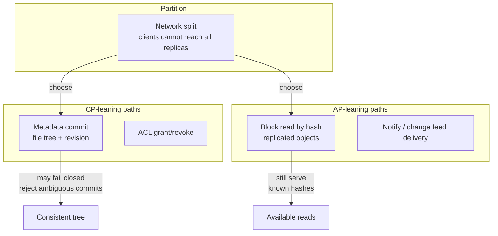
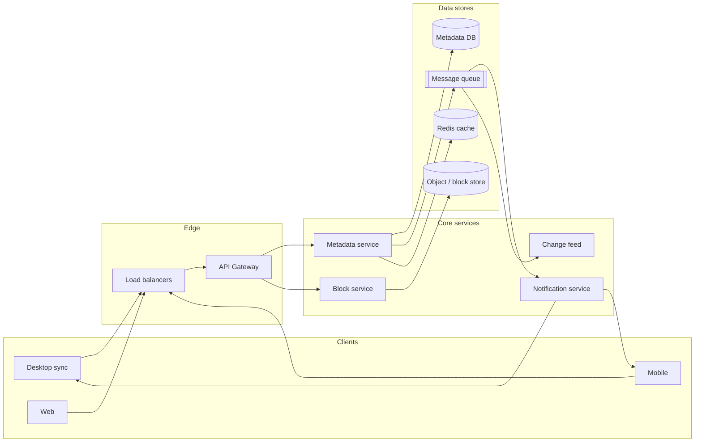
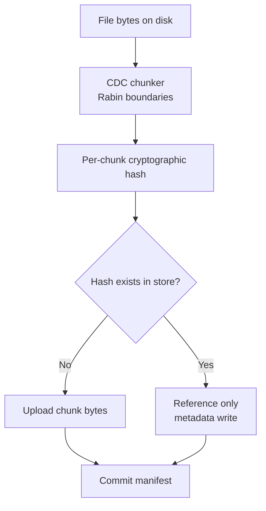
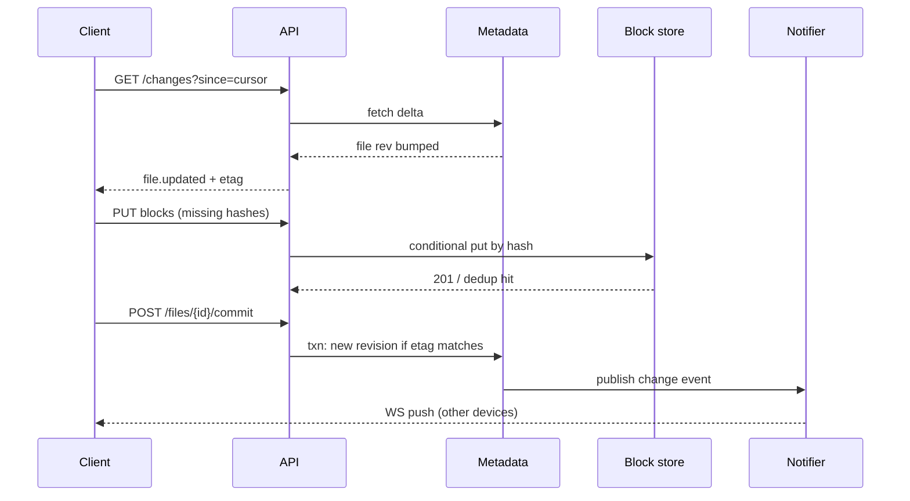
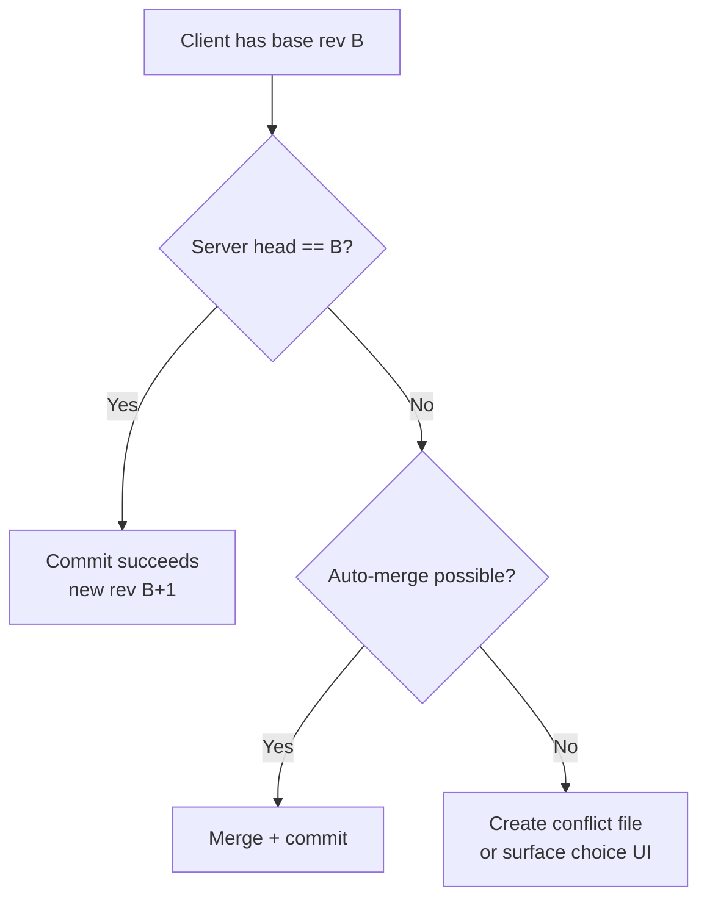

# Cloud Storage (Google Drive)
{: .no_toc }

<details open markdown="block">
  <summary>Table of contents</summary>
  {: .text-delta }
1. TOC
{:toc}
</details>

---

## What We're Building

A **multi-tenant cloud file system** that lets users upload, sync, share, and version files across devices—conceptually aligned with products like **Google Drive** or **Dropbox**. Users expect near-real-time sync, reliable offline edits, deduplicated storage at scale, and fine-grained sharing.

**Core capabilities in scope:**

- Upload and download of files and folders with hierarchical paths
- Continuous sync between clients and cloud (delta updates, not full re-uploads)
- Block-level storage with **content-defined chunking** and **content-addressable** deduplication
- Metadata service for names, ACLs, versions, and parent/child relationships
- Notifications when remote changes occur (long polling or WebSocket)
- Conflict detection and resolution strategies for concurrent edits
- File history and rollback to prior versions

### Why Cloud Storage Is Hard

| Challenge | Description |
|-----------|-------------|
| **Scale of data** | Exabytes under management; must avoid storing duplicate bytes |
| **Sync fan-out** | One change may affect many devices; hot files amplify traffic |
| **Consistency** | Metadata must stay coherent while blocks are immutable and replicated |
| **Conflicts** | Offline edits and concurrent writers require explicit policies |
| **Latency sensitivity** | Users perceive sluggish sync as product failure |

{: .note }
> In interviews, separate **user-visible paths** (metadata graph) from **bytes on disk** (content-addressed blocks). That split is the backbone of the design.

### Comparison to Adjacent Systems

| System | Similarity | Difference |
|--------|------------|------------|
| **Object storage (S3)** | Immutable blobs, large scale | Cloud drive adds **hierarchy**, **sync**, and **per-user ACLs** |
| **CDN** | Edge caching | CDN is read-heavy and URL-centric; Drive is **read/write** with **strong user semantics** |
| **Git** | Content hashing, dedup | Git is repository-centric; Drive optimizes for **non-technical users** and **binary workloads** |

---

## Step 1: Requirements

### Functional Requirements

| ID | Requirement | Notes |
|----|-------------|-------|
| F1 | **Upload / download** files up to product limit (e.g., 5 TB max object size in many products; interview: state an assumption) | Resume interrupted transfers |
| F2 | **Folder hierarchy** | Move, rename, create; stable internal IDs separate from display path |
| F3 | **Sync** across devices for the same user | Must handle sleep, flaky networks, and reconnect |
| F4 | **Sharing** with users and groups | Viewer/commenter/editor roles (illustrative) |
| F5 | **Version history** | Restore prior versions; cap retention by policy |
| F6 | **Search / list** (optional in scope) | Often delegated to search index fed by metadata CDC |

### Non-Functional Requirements

| Dimension | Target (illustrative) | Rationale |
|-----------|------------------------|-----------|
| **Availability** | 99.9%–99.99% for API | Enterprise expectations; block storage higher than metadata in some designs |
| **Durability** | 11 nines for committed user bytes (provider-style claim) | Achieved via replication + repair; interview: discuss **erasure coding** vs **triple replication** |
| **Latency (metadata)** | P99 &lt; 200–300 ms for list/small reads | Interactive UI |
| **Latency (sync notification)** | Seconds for “someone else changed this” | Not always instant; often **eventual** with bounded delay |
| **Consistency** | Per-user **linearizable** metadata ops (idealized) or **per-resource** serializability | Trade cost vs UX |
| **Security** | TLS in transit; encryption at rest; ACL checks on every metadata path | Audit logs for sharing changes |

{: .warning }
> Do not claim **POSIX semantics** for the whole namespace unless asked. Many products offer **close-to-POSIX** behavior on a mounted drive with documented exceptions (e.g., eventual consistency on metadata in some edge cases).

### API Design

Representative **REST-style** surface (names illustrative). Many products also use **gRPC** internally.

| Operation | Method | Purpose |
|-----------|--------|---------|
| `POST /v1/uploads` | Create upload session | Returns `upload_id`, chunk size hints, URLs for block PUTs |
| `PUT /v1/uploads/{upload_id}/blocks/{block_hash}` | Idempotent block upload | Content-addressed; skip if exists |
| `POST /v1/files/{id}/commit` | Finalize file revision | Points file to manifest of block hashes |
| `GET /v1/changes` | Delta feed | Since cursor; returns file/folder mutations |
| `GET /v1/files/{id}/content` | Download | Redirects to signed URLs or streams blocks |
| `POST /v1/shares` | Share resource | Grants principal + role |
| `GET /v1/notify` | Long poll | Hold until change or timeout |
| `WS /v1/stream` | WebSocket | Push notifications for subscribed folders |

**Change feed (conceptual JSON)**

```json
{
  "cursor": "chg_7f91…",
  "events": [
    {
      "type": "file.updated",
      "file_id": "fil_abc",
      "revision": 42,
      "etag": "W/\"v42\"",
      "path": "/Reports/Q3.pdf"
    }
  ]
}
```

{: .tip }
> Treat **block uploads** as idempotent by **hash**. Treat **file commits** as idempotent with a **client mutation id** to avoid duplicate revisions on retries.

### Technology Selection & Tradeoffs

Cloud storage stacks in three planes: **immutable bytes** (object/block layer), **authoritative metadata** (tree, versions, ACLs), and **sync semantics** (how clients converge). Interviewers expect you to name realistic building blocks and justify trade-offs—not to pick one vendor dogmatically.

#### Object storage backend

| Option | Pros | Cons | When it wins |
|--------|------|------|----------------|
| **Custom chunk store** (hash-partitioned volumes, EC, scrubbers) | Full control over placement, cost, on-prem; can co-design with dedup/GC | Years of engineering; you own reliability, upgrades, and incident response | Hyperscaler or regulated environments building a proprietary plane |
| **Ceph / MinIO (S3-compatible cluster)** | Mature replication/EC; ops patterns exist; self-hostable | Operability at exabyte scale is non-trivial; feature gaps vs public cloud (multi-region, compliance SKUs) | Private cloud, hybrid, or teams that want S3 API without AWS |
| **Managed S3-compatible (e.g., S3, GCS, Azure Blob)** | Durability/availability SLAs, global replication, lifecycle tiers, compliance certs | Cost at scale; less control over internals; egress/operation pricing | Fastest path for most products; default in interviews unless “on-prem” is stated |

**Why it matters:** Metadata references chunks by **hash**; the object layer only needs **PUT-by-hash**, **GET-by-hash**, **lifecycle/GC hooks**, and **strong durability**. The hard part is **reference counting** and **async deletion** in your metadata plane—not the raw blob PUT.

#### Metadata store

| Option | Pros | Cons | When it wins |
|--------|------|------|----------------|
| **PostgreSQL** (sharded) | ACID, constraints (`UNIQUE (parent_id, name)`), rich queries, mature tooling | Cross-shard transactions painful; need careful shard key (`owner_id` / `namespace_id`) | **Default interview answer** for tree + ACLs + transactional commits |
| **etcd** (or similar consistent KV) | Strong consistency, watches for coordination | Poor fit for large trees, heavy listing queries, and billions of rows—designed for **small** critical state | **Locks, quotas, rate-limit counters**, not the full file catalog |
| **Custom B-tree / LSM on disk** | Ultimate performance/cost tuning | You reimplement SQL, migrations, backup—rarely justified | Extreme embedded or legacy systems; not a typical greenfield choice |

**Why it matters:** File **names and hierarchy** need **transactional invariants**; search/list workloads need **secondary indexes**. A relational model maps cleanly; pure KV is usually paired with **another** system for graph/path queries unless you accept heavy client-side logic.

#### Sync protocol

| Approach | Pros | Cons | When it wins |
|----------|------|------|----------------|
| **Rsync-like delta sync** (rolling hash, send missing segments) | Minimizes bytes on **repeated similar** files; great for low uplink | Complex client; server may still be chunk/manifest based—align with CDC policy | Bandwidth-sensitive clients; backup tools; complement to chunk stores |
| **Full file replace** | Simple mental model | Wastes bandwidth on large files; fights user expectations for “sync” | Small files only; rarely the main strategy at scale |
| **Block-level + content-defined chunking + manifest commit** | Stable dedup, resumable uploads, idempotent **PUT(hash)** | Requires manifest versioning and GC | **Industry-typical** for Drive/Dropbox-class products |

**Why it matters:** Interviews reward **CDC + content-addressed blocks** because edits localize to a few chunks; “upload whole file every time” fails the efficiency bar unless scope is explicitly tiny files.

#### Conflict resolution

| Strategy | Pros | Cons | When it wins |
|----------|------|------|--------------|
| **Last-writer-wins (LWW)** | Simple; single head revision | Silent overwrite—bad for shared folders and offline | Low-stakes caches; **not** ideal as the only story for collaboration |
| **Version vectors / DAG** | Captures **causality**; enables merge tools and audit | UX complexity; still need policy for binaries | Advanced sync; technical users; foundation for **branch + merge** flows |
| **User manual merge / conflict copies** | Safe for **binary**; clear accountability | Noisy folders; user burden | **Default** for generic cloud drives on binary files |

**Our choice (interview narrative):**

- **Bytes:** Managed **S3-compatible object storage** (or Ceph/MinIO if hybrid/on-prem) for durability and operational leverage; **content-addressed** chunks with **erasure coding** behind the API.
- **Metadata:** **PostgreSQL** (or sharded Spanner/Cockroach-class SQL) for transactional tree + ACL + revision history; **etcd** only for **coordination** (locks, leases), not the main catalog.
- **Sync:** **CDC chunking + block upload + manifest commit** with **cursor-based change feed** and **push** notifications; optional **rsync-style** second pass only for niche bandwidth savings—not as the primary store of truth.
- **Conflicts:** **Optimistic concurrency** on commit (`etag`/base revision); for binaries, **conflict copies** or **explicit user resolution**; reserve **LWW** for clearly defined single-writer resources.

**Rationale:** Optimize for **deduplicated storage**, **clear consistency story on metadata**, and **honest conflict UX**—without building a custom object store unless the prompt demands it.

### CAP Theorem Analysis

**CAP** (Consistency, Availability, Partition tolerance) says that under a **network partition**, you cannot have both **strong linearizability** and **full read/write availability** for the same data plane. Real products **partition responsibilities**: different subsystems pick different points on the spectrum.

For **cloud storage**:

- **File reads (content)** should stay **highly available**: clients can often read **replicated** chunks; temporary metadata staleness may block “latest” path resolution, but bytes addressed by **known hash** remain readable (**AP**-leaning for immutable blobs).
- **Sync conflicts** need **careful consistency** on **metadata** (which revision is head, who is allowed to commit)—typically **CP**-leaning for the **commit path** (reject or branch on conflict), while **notifications** and **change feeds** are **eventually consistent** with bounded lag.

| Subsystem | Typical CAP stance | Interview phrasing |
|-----------|--------------------|------------------|
| **File metadata** (path, size, head revision) | **CP** on commit: transactional updates, version checks | “We serialize commits per file or use compare-and-swap on revision.” |
| **File content** (immutable chunks by hash) | **AP** for read: multiple replicas; **eventual** visibility of new hashes after commit | “Chunks are immutable; once committed, reads don’t need quorum metadata.” |
| **Sync state** (per-device cursor, local vs server revision) | **AP** with **eventual** convergence; **repair** via change feed | “Devices are sources of truth for *pending work*; server is source of truth for *committed* state.” |
| **Sharing permissions** | **CP** when enforcing on sensitive operations; cached reads may be **eventually** fresh | “Writes to ACLs go through authoritative store; reads may use cached policy with short TTL.” |



{: .note }
> **PACELC** extension: even **without** a partition, you trade **latency (L)** vs **consistency (C)**—e.g., reading ACL from a cache is faster but may be briefly stale. Mentioning PACELC signals seniority.

### SLA and SLO Definitions

**SLA** = contract with customers (credits, legal). **SLO** = internal target; **SLI** = what you measure. Below: illustrative **SLOs** for a consumer/enterprise-grade drive; tune numbers to the prompt.

| Category | SLI | Example SLO | Measurement window |
|----------|-----|-------------|---------------------|
| **Upload latency** | Time from **last byte** of chunk received to **ack** (or from **commit request** to **success**) | P99 &lt; 500 ms for **commit**; chunk PUT P99 &lt; 1 s for **≤ 32 MB** chunk under normal load | 30-day rolling |
| **Download latency** | Time to **first byte** (TTFB) for signed URL or gateway stream | P99 TTFB &lt; 300 ms **same region**; higher cross-region (disclose) | 30-day rolling |
| **Sync latency** | Wall-clock from **server commit** to **change visible** on subscribed client (feed or push) | P95 &lt; 10 s; P99 &lt; 60 s (mobile/long-poll may widen tail) | 30-day rolling |
| **Data durability** | Probability of **permanent loss** of committed user object | **11 nines** for committed bytes after **ack** (provider-style claim; explain replication + EC + repair) | Annual / incident-based review |
| **Availability** | Successful **metadata** read/write and **auth** checks vs all attempts | **99.9%** monthly (consumer); **99.95%+** (business)—exclude customer-caused throttling if defined | Monthly |
| **Conflict resolution accuracy** | Share of conflicts **correctly classified** (no silent wrong winner) vs detected conflicts | **99.99%** **detection** rate for concurrent commits to same base revision; **0** silent LWW on shared folders if policy forbids | Per release + sampled audits |

**Error budget policy (how teams operate):**

| Element | Policy |
|---------|--------|
| **Budget** | e.g., **0.1%** monthly unavailability = ~43 minutes/month at 99.9% |
| **Burn alerts** | Page on **fast burn** (budget exhausted in days); ticket on **slow burn** |
| **Trade-offs** | If sync latency SLO slips, **throttle** non-critical features (preview gen) before dropping **durability** paths |
| **Freeze** | If budget exhausted, **freeze launches** until reliability work ships |

{: .warning }
> **Never** conflate **durability** (bits not lost) with **availability** (API up). You can be **available** and **wrong** if you serve stale metadata—separate SLIs.

### Database Schema

Logical schema (illustrative SQL-oriented). Adjust types (`UUID`, `BIGINT`), indexing, and soft-delete to your scale story.

**`files`** — one row per **logical file** (node); `path` may be **materialized** for perf or **derived** from closure table—not both without a clear source of truth.

| Column | Type | Notes |
|--------|------|--------|
| `id` | UUID / BIGINT | Primary key; stable across renames |
| `name` | VARCHAR | Display name; sibling uniqueness with `parent_id` |
| `path` | TEXT | Optional **denormalized** path for fast listing; or omit and use `parent_id` chain |
| `parent_id` | FK → `files.id` | **NULL** or sentinel for root |
| `size` | BIGINT | Logical size (bytes) for latest committed revision |
| `content_hash` | BYTEA / CHAR(64) | **Hash** of content (manifest root or whole-file); aligns with dedup story |
| `version` / `head_revision` | BIGINT | Monotonic revision for optimistic locking |
| `owner_id` | UUID | Billing / primary owner |
| `permissions` | ENUM / JSONB | **Default** visibility (e.g. `private`, `anyone_with_link`) or bitmask; **fine-grained** grants live in `sharing` |
| `created_at`, `updated_at` | TIMESTAMPTZ | Audit |
| `deleted_at` | TIMESTAMPTZ | Soft delete for sync trash |

**`file_versions`** — immutable **snapshots** for history and GC.

| Column | Type | Notes |
|--------|------|--------|
| `id` | BIGINT | Surrogate PK |
| `file_id` | FK → `files.id` | |
| `version` | BIGINT | Matches commit; **UNIQUE (file_id, version)** |
| `storage_key` | TEXT | Manifest id, or **pointer** to manifest table row |
| `timestamp` | TIMESTAMPTZ | Commit time (server authoritative) |

**`sharing`** — ACL edges.

| Column | Type | Notes |
|--------|------|--------|
| `file_id` | FK → `files.id` | Resource (file or folder node) |
| `user_id` | UUID | Principal |
| `permission_level` | ENUM / SMALLINT | `viewer`, `commenter`, `editor`, `owner` |
| `granted_by`, `granted_at` | UUID, TIMESTAMPTZ | Audit |

**`sync_state`** — **per device** convergence (optional **per file** row, or **summary + separate** pending table).

| Column | Type | Notes |
|--------|------|--------|
| `device_id` | UUID | Client-registered device |
| `file_id` | FK → `files.id` | |
| `local_version` | BIGINT | Last **known applied** server revision on device |
| `synced_at` | TIMESTAMPTZ | Last successful reconcile |

{: .tip }
> At scale, **`sync_state`** is often **sharded** with the user or stored **client-side** (SQLite) with server **cursors**—the table above is the **server-side** model when you track enterprise devices centrally.

---

## Step 2: Back-of-the-Envelope Estimation

### Assumptions

```
- Total users: 1 billion registered; DAU: 200 million
- Average stored data per paying user: 120 GB (heavy tail dominates)
- Average file size: 1.5 MB (mix of docs and photos)
- Average chunk size after CDC: 4 MB (policy-dependent; smaller for text-heavy tenants)
- Deduplication ratio (effective bytes vs logical): 1.6× (illustrative)
- Metadata operations per user per active day: 200 (opens, lists, small writes)
- Change notifications delivered per DAU per day: 30 (fan-out to devices)
```

### Storage

```
Logical bytes ≈ 1B × 120 GB = 120 EB (upper bound if all users paid and filled—illustrative only)
After dedup (1.6×): ~75 EB effective (still illustrative; real systems use tiering and cold storage)

Per-object metadata overhead (names, ACLs, indices): order of KBs per file; dominates only for tiny files
```

{: .note }
> Interview math should stay **order-of-magnitude**. The goal is to show you understand **dedup**, **small-file overhead**, and **metadata cost**, not to predict revenue.

### Traffic

```
Assume 200M DAU each perform 200 metadata ops/day:
200M × 200 / 86,400 ≈ 463,000 metadata RPS average; peak ×3 ≈ 1.4M RPS (illustrative peak)

Block upload/download throughput is dominated by large files and LAN-speed clients; provision backbone and edge separately.
```

### Sync and Notifications

```
200M DAU × 30 notifications/day ≈ 6B notifications/day
Average ≈ 69,000/s; peak ×5 ≈ 350,000/s (fan-out to devices varies by clustering of activity)
```

| Resource | Rough scale | Planning note |
|----------|-------------|-----------------|
| Metadata DB QPS | High hundreds of thousands peak | Shard by `user_id` or `namespace_id` |
| Block storage throughput | Terabits/s aggregate | Erasure-coded volumes + CDN for public links |
| Notification connections | Many millions concurrent | WebSocket gateways regionalized |

---

## Step 3: High-Level Design

At a high level: **clients** talk to **API / sync services**, which persist **metadata** in a **transactional store** (often sharded SQL or a strongly consistent KV with careful modeling), and **file bytes** in **object/block storage** addressed by **cryptographic hash**. A **notification service** pushes change events to online clients; others catch up via **long polling** or periodic **change feed** pulls.



**Request path (upload):** client chunks file with CDC, hashes chunks, uploads missing blocks to block service, commits manifest in metadata service.

**Read path:** client lists folder via metadata, resolves file to block list, fetches blocks (often via signed URLs), verifies hashes.

{: .important }
> **Content-addressed storage** means identical chunks map to one physical object. Metadata records **which hashes belong to which file revision**.

---

## Step 4: Deep Dive

### 4.1 File Chunking and Deduplication

**Fixed-size chunking** is simple but shifts boundaries when bytes insert at the front, hurting dedup. **Content-defined chunking (CDC)** uses rolling hashes (e.g., **Rabin fingerprinting**) to select cut points based on local byte patterns so inserts shift only nearby chunks.

**Rabin-style rolling hash (concept):** maintain a sliding window of length \(W\); update hash in O(1) per byte; when `hash mod P == R` (or low bits hit a threshold), emit a chunk boundary. Parameters control average chunk size.

| Approach | Pros | Cons |
|----------|------|------|
| Fixed 4 MB chunks | Easy | Poor dedup on small edits shifting all tail bytes |
| CDC + Rabin | Stable boundaries around edits | CPU overhead; parameter tuning |
| Whole-file hash | Trivial | No dedup across files |

**Deduplication:** after chunking, compute **SHA-256** (or BLAKE3) per chunk. Block service stores once keyed by hash; metadata references hashes.



**Java: Rabin fingerprint rolling (illustrative core)**

```java
public final class RabinFingerprint {
  private static final long MOD = (1L << 61) - 1; // Mersenne prime (example modulus)

  private final int windowSize;
  private final long base;
  private final long[] powTable;

  public RabinFingerprint(int windowSize, long base) {
    this.windowSize = windowSize;
    this.base = base;
    this.powTable = precomputePowers(base, windowSize);
  }

  private static long[] precomputePowers(long base, int w) {
    long[] pow = new long[w];
    pow[0] = 1;
    for (int i = 1; i < w; i++) {
      pow[i] = mulMod(pow[i - 1], base);
    }
    return pow;
  }

  private static long mulMod(long a, long b) {
    return Math.floorMod(a * b, MOD);
  }

  public long roll(long currentHash, byte outByte, byte inByte, int posInWindow) {
    long drop = mulMod(outByte & 0xFFL, powTable[windowSize - 1 - posInWindow]);
    long shifted = mulMod(currentHash - drop, base);
    return Math.floorMod(shifted + (inByte & 0xFFL), MOD);
  }
}
```

{: .note }
> Production CDC adds **minimum/maximum chunk size** guards to avoid tiny or huge chunks. Libraries like **restic** or **rsync rolling** are good offline reading.

### 4.2 Sync Protocol (Client-Server)

Clients maintain a local journal of file events from the OS **file watcher**, debounce rapid edits, chunk changed files, then reconcile with the server using **revision tokens** (`etag`, `revision`, or **vector clock** per file).

**Notification options:**

| Mechanism | When it fits | Drawbacks |
|-----------|----------------|-----------|
| **WebSocket** | Always-on desktop/mobile foreground | Stateful infra, reconnect storms |
| **Long polling** | Mobile background limitations | Higher latency, many held requests |
| **Periodic pull** | Low-priority devices | Slower sync |



**Go: minimal sync client loop (polling variant)**

```go
package sync

import (
  "context"
  "encoding/json"
  "net/http"
  "time"
)

type ChangeResponse struct {
  Cursor string   `json:"cursor"`
  Events []Event  `json:"events"`
}

type Event struct {
  Type     string `json:"type"`
  FileID   string `json:"file_id"`
  Revision int64  `json:"revision"`
  ETag     string `json:"etag"`
}

type Client struct {
  BaseURL    string
  HTTP       *http.Client
  SinceCursor string
}

func (c *Client) Poll(ctx context.Context) error {
  ticker := time.NewTicker(15 * time.Second)
  defer ticker.Stop()
  for {
    select {
    case <-ctx.Done():
      return ctx.Err()
    case <-ticker.C:
      req, err := http.NewRequestWithContext(ctx, http.MethodGet,
        c.BaseURL+"/v1/changes?since="+c.SinceCursor, nil)
      if err != nil {
        return err
      }
      resp, err := c.HTTP.Do(req)
      if err != nil {
        continue
      }
      var cr ChangeResponse
      if err := json.NewDecoder(resp.Body).Decode(&cr); err == nil {
        c.SinceCursor = cr.Cursor
        // enqueue local reconciliation against cr.Events
      }
      resp.Body.Close()
    }
  }
}
```

{: .tip }
> Always combine **push** with **pull** as a backstop. Mobile OS may kill sockets; **cursor-based** change feeds make recovery simple.

### 4.3 Metadata Database Design

Model **nodes** (files/folders) with stable `node_id`. Store **parent_id**, **name**, **owner_id**, **revision**, **content manifest id**, and **deleted** flag. Avoid encoding full path as primary key; maintain a **path cache** updated asynchronously or computed via traversal for correctness.

| Table (illustrative) | Purpose |
|----------------------|---------|
| `nodes` | One row per file/folder; revision, owner |
| `manifests` | Ordered list of `(offset, chunk_hash, length)` |
| `acl_entries` | Resource, principal, role |
| `revisions` | Historical manifests for version history |

**Sharding key:** `owner_id` or `namespace_id` keeps co-located data for a tenant. **Cross-shard moves** (shared drives) require two-phase workflows or a centralized coordinator.

{: .warning }
> Uniqueness of `(parent_id, name)` should be enforced transactionally to prevent duplicate siblings—classic tree constraint.

### 4.4 Block Storage Architecture

Block service exposes:

- `PUT /blocks/{hash}` with **Content-Type** and **length**
- **Quorum or single-leader** replication inside the cell
- Background **scrubbing** to detect bit rot
- Optional **encryption** with per-tenant keys (wrap DEKs in KMS)

| Layer | Role |
|-------|------|
| API gateways | AuthN/Z, rate limits |
| Chunk routers | Route hash to the correct volume / cell |
| Volume servers | Store immutable chunks on disk |
| Erasure coding | Reduce raw overhead vs 3× replication |

**Hot spots:** extremely popular files dedup to the same hashes—mitigate with **CDN** for public links and **read caching** in the block layer.

### 4.5 Conflict Resolution

Conflicts arise when **two writers** commit against the same **base revision** or when **offline** edits replay against a newer server revision.

| Strategy | Behavior | UX |
|----------|----------|-----|
| **Last-writer-wins (LWW)** | Higher revision timestamp wins | Simple; data loss risk |
| **First-commit wins** | Second commit rejected | Forces manual retry |
| **Mergeable types** | CRDT / OT for text | Great for docs; hard for binaries |
| **Branch copies** | Save `conflict` copy | Safest for binaries; cluttered folders |



For **Google Docs–style** products, operational transforms live in a separate editor service; for **binary** Drive files, conflict copies are common.

### 4.6 File Versioning and History

Each successful commit creates an immutable **manifest snapshot**. GC reclaims unreferenced chunks **asynchronously** after retention policies expire.

| Policy | Description |
|--------|-------------|
| **Retention window** | Keep last N versions or T days |
| **Legal hold** | Block GC for custodied users |
| **Diff storage** | Optional binary deltas between manifests for savings |

Point-in-time restore = metadata pointer swap to an older `manifest_id` plus ACL checks.

### 4.7 Sharing and Permissions

Represent sharing as **ACL edges** on `node_id` with roles. Evaluate **deny vs allow** carefully; most products use **allow lists** with owner override.

**Evaluation path:** resolve `node_id` from path, walk ancestors for inherited permissions (if supported), merge with explicit grants on the node.

| Role | Typical capabilities |
|------|----------------------|
| Viewer | Read, download |
| Commenter | Read + annotate (product-specific) |
| Editor | Modify content, add children |
| Owner | Share, delete, transfer |

Audit: append-only **audit log** for compliance (who granted access to whom).

### 4.8 Offline Support

Clients queue operations in a **persistent outbox** while offline: chunking, hash, and manifest computation can proceed locally; uploads resume with **range** or **chunk session** APIs.

**File watcher (Python, watchdog-style sketch)**

```python
import hashlib
import time
from pathlib import Path

class LocalChangeQueue:
    def __init__(self):
        self.pending = []

    def on_modified(self, path: Path):
        # debounce in real code
        self.pending.append((time.time(), path))

    def drain(self):
        # coalesce multiple events for same path
        by_path = {}
        for ts, p in self.pending:
            by_path[p] = ts
        self.pending.clear()
        return list(by_path.keys())

def fingerprint_preview(path: Path, n: int = 1 << 20) -> str:
    h = hashlib.sha256()
    with path.open("rb") as f:
        h.update(f.read(n))
    return h.hexdigest()
```

Desktop clients run a **lightweight DB** (SQLite) tracking local inode state, server revision, and upload status.

---

## Step 5: Scaling & Production

| Concern | Technique |
|---------|-----------|
| **Metadata hotspots** | Shard by tenant; cache path→id; rate limit noisy APIs |
| **Block hot hashes** | CDN for public; internal read caches |
| **Notification storms** | Coalesce events per folder; sample low-priority clients |
| **GC of chunks** | Mark-sweep from manifests; tombstone windows |
| **Multi-region** | Metadata per region + replication; blocks geo-replicated or regional with cross-region CRR |
| **Compliance** | Data residency pinned shards; encryption keys in regional KMS |

**Observability:** trace IDs across API → metadata → block PUT; metrics on **dedup ratio**, **chunk upload latency**, **conflict rate**, and **sync backlog depth**.

---

## Interview Tips

| Do | Avoid |
|----|-------|
| Separate **metadata** and **block** planes | Conflating file paths with raw object keys only |
| Discuss **CDC + hashing** for dedup | Claiming whole-file upload is enough at Dropbox scale |
| Mention **etag/revision** concurrency | Ignoring offline/conflict scenarios |
| Cover **WebSocket + cursor fallback** | Assuming pure push always works on mobile |
| Call out **small-file overhead** | Ignoring listing performance and metadata cost |

{: .tip }
> If time permits, relate to **backup products** (restic, Borg)—interviewers like knowing you understand production chunking trade-offs.

---

## Summary

- **Chunking:** CDC with Rabin fingerprints stabilizes chunk boundaries; cryptographic hashes enable **deduplicated** block storage.
- **Sync:** Clients watch local FS, upload missing chunks, commit manifests; servers broadcast changes via **WebSocket** or clients **poll** change feeds with **cursors**.
- **Metadata:** Tree of nodes + manifests + ACLs; shard by tenant; transactional sibling name uniqueness.
- **Conflicts:** Choose explicit policies; binary files often become **conflict copies**; collaborative docs may use OT/CRDTs in a separate service.
- **Versions:** Immutable manifests; retention and legal hold; async GC for unreferenced chunks.

---

## Interview Checklist

- [ ] Clarify max file size, sharing model, offline expectations, and collaboration (binary vs collaborative editing)
- [ ] Quantify **metadata QPS**, **storage** with **dedup**, and **notification** fan-out
- [ ] Draw **clients → API → metadata DB + block store + notifier**
- [ ] Explain **CDC** and why fixed chunking fails on inserts
- [ ] Walk **upload**: chunk, hash, conditional block put, manifest commit with **etag**
- [ ] Walk **download**: resolve manifest, fetch blocks, verify hashes
- [ ] Describe **conflict** handling for offline edits
- [ ] Discuss **versioning**, **GC**, and **encryption**
- [ ] Mention **failure modes**: partial uploads, stuck notifications, split-brain on clients

---

## Sample Interview Dialogue

**Interviewer:** “Design a system like Google Drive.”

**Candidate:** “I’ll split the problem into **metadata**—folders, permissions, file revisions—and **bulk storage** for bytes. Blocks are **content-addressed** by hash so duplicates store once. Clients run a sync agent with a file watcher, chunk files using **content-defined chunking** so small edits don’t reshuffle the entire file, upload only unknown chunks, then commit a **manifest** in a transaction.”

**Interviewer:** “How does sync stay fast?”

**Candidate:** “Each file has a **revision** or **etag**. Clients fetch **deltas** from a **change feed** using a **cursor**. For online devices, we push notifications over **WebSocket**; mobile may rely on **long polling** or periodic pulls. The cursor makes recovery simple after reconnect.”

**Interviewer:** “What about two people editing the same file?”

**Candidate:** “If it’s binary, we usually detect **base revision mismatch** on commit. Options are **reject and refresh**, **last-winner**, or **write a conflict copy**. Collaborative text is a different subsystem—**OT/CRDT**—but for Drive-like binaries, conflict copies are common.”

**Interviewer:** “How do you delete unused chunks?”

**Candidate:** “Manifests reference chunk hashes. After deletes and retention windows, a **GC** pass marks unreachable hashes and deletes them lazily, with safeguards for snapshots and legal hold.”

---

### Further Reading (Patterns)

| Topic | Why it matters |
|-------|----------------|
| Content-defined chunking | Stable dedup under edits |
| Merkle trees | Integrity proofs and sync subsets |
| Operational transformation | Real-time doc collaboration |
| Rsync algorithm | Classic rolling-hash inspiration |

{: .note }
> Use this page as a **structured outline**, not a claim about any vendor’s internal architecture. Trade names are for **orientation** only.
