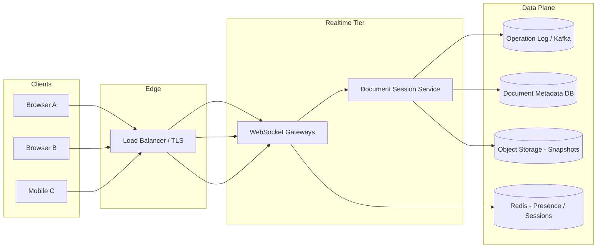
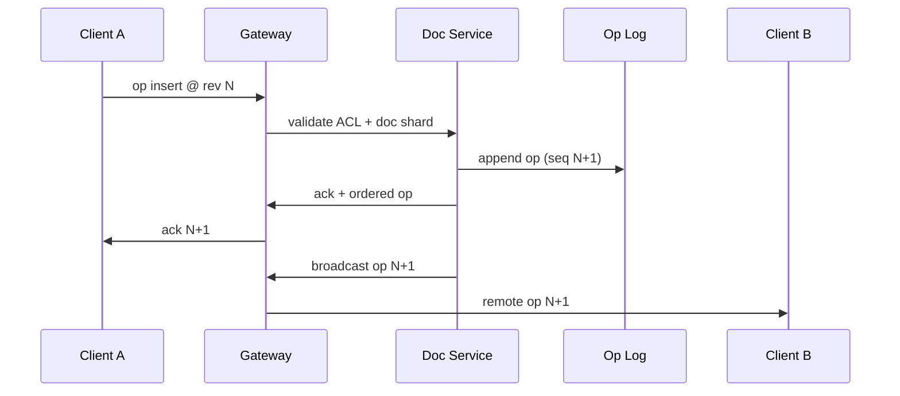
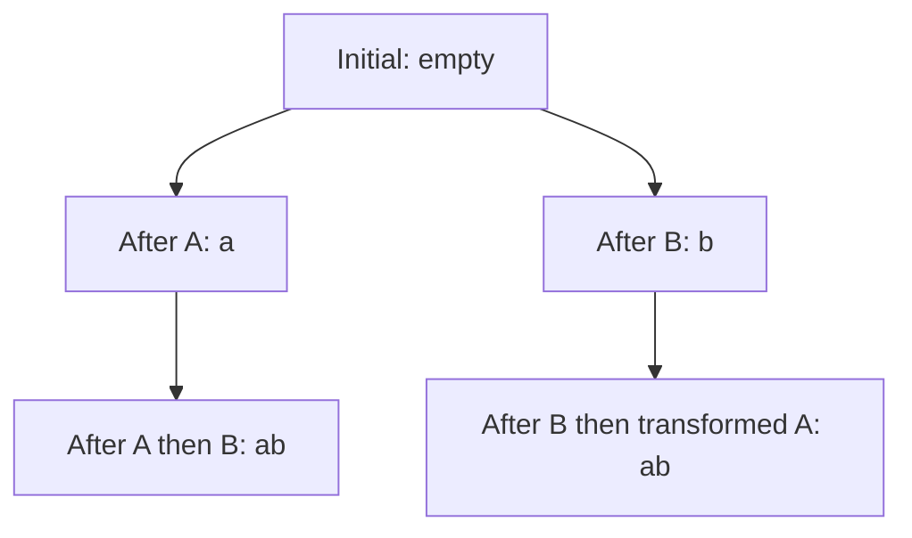
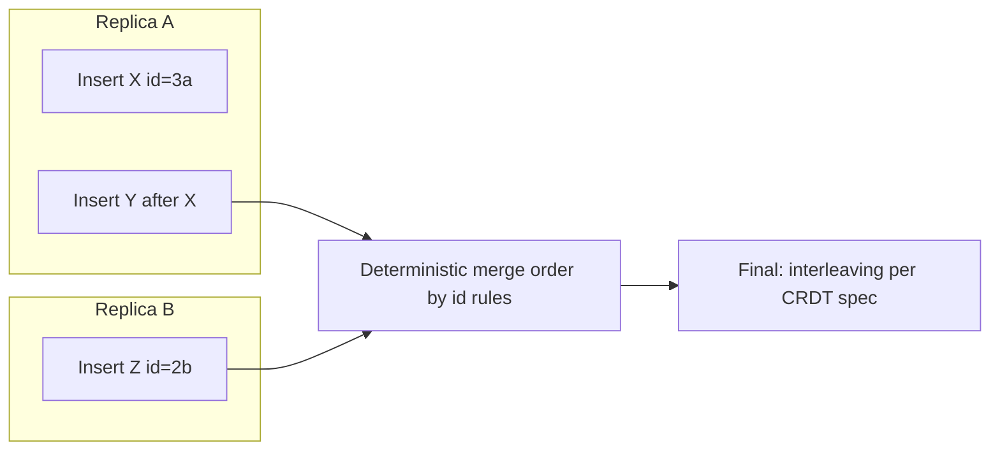
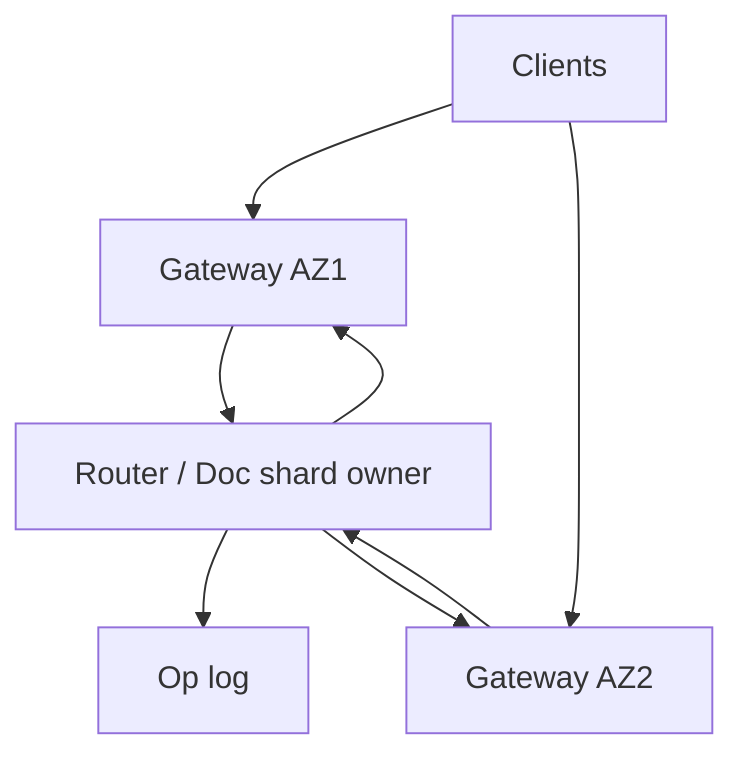

# Collaborative Editor (Google Docs)
{: .no_toc }

<details open markdown="block">
  <summary>Table of contents</summary>
  {: .text-delta }
1. TOC
{:toc}
</details>

---

## What We're Building

A **multi-user collaborative document editor** where many clients edit the same logical document concurrently, see each other's cursors and selections in near real time, and converge to a consistent shared state despite network latency, reordering, and intermittent connectivity—similar in spirit to Google Docs, Notion live blocks, or Figma multiplayer (documents vs canvas).

**Core capabilities in scope:**

- Real-time propagation of edits to all active collaborators with low perceived latency
- Conflict-free or safely resolved concurrent edits (the **OT vs CRDT** decision is central)
- Durable document storage, revision history, and restore/audit
- Presence: active users, cursor positions, and selection ranges (ephemeral, high churn)
- Permissions: owner, editor, commenter, viewer; link sharing; optional organization policies
- Offline editing with eventual sync and explicit conflict handling where the product requires it

### Why Collaborative Editors Are Hard

| Challenge | Description |
|-----------|-------------|
| **Correctness under concurrency** | Two users typing "at the same time" must not corrupt the document; naive last-write-wins breaks intent |
| **Latency sensitivity** | Humans notice typing lag; batching and server round-trips must be budgeted carefully |
| **Stateful sessions** | WebSockets and document routing; sticky affinity vs state migration on failures |
| **Operational complexity** | Transform functions (OT) or CRDT implementations are subtle; bugs are data corruption |
| **Storage model** | Plain text vs rich text (blocks, marks); binary attachments usually delegated to object storage |
| **Privacy and compliance** | Real-time presence leaks activity; document ACLs must be enforced on every operation path |

### Real-World Scale (Order-of-Magnitude Signals)

| Product | Scale signal | Takeaway |
|---------|--------------|----------|
| **Google Workspace** | Billions of users; documents are a core surface | Regional capacity, abuse prevention, and storage at planetary scale |
| **Notion / Confluence** | Block models + permissions + search | Rich schema + indexing is as important as typing latency |
| **Figma** | CRDT-style multiplayer on structured data | Domain-specific replicated data types beat generic text OT for many apps |

{: .note }
> In interviews, cite **orders of magnitude** and **dominant costs** (WebSocket fan-out, transform CPU, storage growth), not unverifiable exact product metrics.

### Comparison to Adjacent Systems

| System | Similarity | Difference |
|--------|------------|------------|
| **Chat** | WebSockets, presence, ordering concerns | Chat messages are usually append-only; documents need **inline concurrent edits** |
| **News feed** | Fan-out | Feed is read-optimized; editors are **write-heavy with fine-grained merges** |
| **CRUD API** | Persistence | REST alone cannot deliver **sub-100ms collaborative feel** without a sync channel |

---

## Step 1: Requirements

### Functional Requirements

| Requirement | Priority | Description |
|-------------|----------|-------------|
| Collaborative editing | Must have | Multiple users edit the same document; all see consistent text (or structured blocks) |
| Real-time sync | Must have | Edits propagate to active collaborators quickly via persistent bidirectional connections |
| Revision history | Must have | Snapshots or operation logs for undo, restore, audit |
| Cursor and selection presence | Must have | Show where others are working; ephemeral, high-frequency updates |
| Comments and suggestions | Should have | Anchored metadata; may be modeled as separate layers |
| Offline editing | Should have | Queue local ops; reconcile on reconnect (product-dependent) |
| Import/export | Nice to have | DOCX/PDF pipelines are often async workers + object storage |

### Non-Functional Requirements

| Requirement | Target | Rationale |
|-------------|--------|-----------|
| **Edit latency** | **&lt; 150 ms** perceived for active sessions (regional) | Above ~200–300 ms, typing feels "laggy" depending on UX |
| **Availability** | **99.9%–99.99%** for edit/sync path | Matches enterprise SaaS expectations; plan degraded modes |
| **Durability** | No acknowledged edit lost | Ack only after durable append (log/DB) or replicated write |
| **Consistency** | **Eventual convergence** for all clients; **strong per-document ordering** on server | Clients may temporarily diverge; must merge to identical state |
| **Scalability** | Horizontal connection tier; shard by document | Hot documents are a reality; isolate noisy neighbors |
| **Security** | TLS everywhere; ACL on connect and per-operation | Stolen session or WS token must not exfiltrate content |

{: .warning }
> Do not promise **linearizable typing** across the globe. Real systems use **regional serving**, **single-writer sequencing per document** (common), or **CRDTs** with bounded staleness—pick one story and stay consistent.

### API Design

**Transports**

- **WebSocket** (or WebRTC data channel for P2P experiments; most products use WebSockets via a gateway) for: join document, submit operations, receive transformed/ordered ops, presence
- **HTTPS** for: auth, metadata, sharing UI, exports, large uploads to object storage

**Representative endpoints (illustrative names)**

| Operation | Method | Purpose |
|-----------|--------|---------|
| `POST /v1/sessions` | HTTP | Exchange OAuth/session cookie for **short-lived WS token** scoped to `doc_id` |
| `WS /v1/docs/{docId}/stream` | WebSocket | Bi-directional sync + heartbeat + backpressure |
| `GET /v1/docs/{docId}/revisions` | HTTP | Paginated history for timeline UI |
| `POST /v1/docs/{docId}:export` | HTTP | Start async export job (PDF/DOCX) |
| `PATCH /v1/docs/{docId}/acl` | HTTP | Update sharing: users, groups, link policy |

**WebSocket message envelope (conceptual)**

```json
{
  "v": 1,
  "id": "msg_01h2k9",
  "type": "op.submit",
  "doc_id": "doc_abc",
  "client_op_id": "ccli_xyz",
  "seq": null,
  "payload": { }
}
```

{: .tip }
> Always carry a **client-generated op id** for idempotent application on retries. The server maps it to a monotonic **server sequence** for total order (if you use a log).

---

## Step 2: Back-of-the-Envelope Estimation

### Assumptions (for arithmetic)

```
- MAU: 200 million
- Fraction actively editing/day: 10% → 20M editing sessions/day
- Average session length: 20 minutes (active typing bursts lower)
- Average typing burst: 5 characters/second during bursts; duty cycle 20% → ~1 char/s average per active editor
- Average op size (metadata + payload): 200 bytes (rich text ops are larger)
- Peak factor: 3× average during business hours (illustrative)
- Concurrent editors (peak): 2% of MAU simultaneously → 4M concurrent (upper-bound illustration)
```

### Operations per Second (Illustrative)

```
Average effective insert rate per active editor ≈ 1 char/s
20M sessions/day × 20 min × 60 s × 1 op/s ≈ 24 billion ops/day (if sustained—use as stress upper bound)

More conservative:
Peak concurrent editors: 4M × 1 op/s × 0.2 duty cycle ≈ 800k ops/s (illustrative)

Interview takeaway: hot documents concentrate load; **per-document serialization** or **sharded actors** matter more than global QPS.
```

### Storage Growth (Operation Log)

```
24B ops/day × 200 bytes ≈ 4.8 TB/day raw op log (upper-bound illustration)

Real products compact snapshots + retain finite history; binary assets live in object storage.
```

### WebSocket Connections

```
Peak concurrent connections ≈ concurrent editors × devices/session factor

Illustrative: 4M × 1.2 ≈ 4.8M concurrent WebSockets (stress mental model)

Connection memory dominates gateway fleet sizing (buffers, TLS, kernel tuning).
```

| Resource | Order of magnitude | Planning implication |
|----------|---------------------|----------------------|
| Ops/sec | Hundreds of thousands to low millions peak (global) | Hot keys; per-doc ordering; backpressure |
| WebSockets | Millions concurrent (large products) | Gateway tier, sticky routing, graceful drain |
| Storage | PB-scale with history + media | Tiered storage, compaction, legal hold |
| Egress | Fan-out to collaborators per op | Coalesce broadcasts; binary framing |

{: .note }
> The **dominant interview discussion** is rarely raw QPS—it is **correctness (OT vs CRDT)**, **ordering**, and **failure modes** (reconnect, duplicate ops).

---

## Step 3: High-Level Design

At a high level, clients maintain a local model (text index or CRDT structure). They send **operations** to a **document service** that assigns a canonical order (or merges via CRDT), persists to an **operation log**, and **fans out** to other subscribers. **Presence** uses a separate high-churn channel or lightweight messages on the same socket. **Object storage** holds snapshots and large blobs.



**Request path (happy path)**

1. Client authenticates; receives scoped token; opens WebSocket to a gateway mapped to a **document shard**.
2. Client sends `op` with vector clock or revision basis (OT) or CRDT payload.
3. Session service validates ACL, assigns **server sequence number** (if using OT with central ordering), persists op, transforms if needed, broadcasts to subscribers.
4. Clients apply remote ops locally; UI updates.



{: .tip }
> Separate **transport** (gateway) from **document correctness** (service). Gateways should be restartable; session state is either sticky with recovery or fully reconstructable from the log.

---

## Step 4: Deep Dive

### 4.1 Conflict Resolution: OT vs CRDT

This is the **primary trade-off interviewers probe**.

| Dimension | Operational Transformation (OT) | CRDTs (e.g., RGA, Yjs, Automerge) |
|-----------|----------------------------------|-----------------------------------|
| **Core idea** | Transform ops against each other so order respects intent | Data structure + merge rules guarantee convergence without central ordering |
| **Server role** | Often **sequential per document** (canonical order) | Can be peer-to-peer; servers help with durability and fan-out |
| **Pros** | Mature for plain text; smaller ops for simple editors | Strong eventual consistency; offline-first; less central bottleneck |
| **Cons** | Correctness of transform functions is hard; edge cases multiply with rich text | Memory overhead; tombstones; more complex UX for undo/redo in some models |
| **Offline** | Typically harder; may need replay + transform storms | Natural fit; merge on reconnect |

{: .warning }
> Avoid absolutes. **Google Docs historically leaned on OT-class techniques with careful engineering**; many modern apps use **CRDT libraries** for faster feature velocity. Interview credit comes from **clear criteria**: team expertise, offline requirements, rich schema, audit needs.

**When interviewers push:** articulate **invariants**:

- **Causality**: if op B depends on op A, apply order respects dependency
- **Convergence**: all participants eventually reach identical state
- **Intention preservation** (OT terminology): transformed ops preserve user intent as much as possible

### 4.2 Operational Transformation (OT)

Classic OT keeps a **document state** and represents changes as operations relative to a revision. When concurrent ops arrive, the system computes transforms so both sides apply equivalent effects.

Consider two insertions at what locally looked like the same index before learning about the other:

- User A inserts `"a"` at index 0
- User B inserts `"b"` at index 0

A central ordering might process A then B. B's insert must shift to index 1 after A's insert is applied (and symmetrically for the other order).



**Java: simplified OT transform for insert/insert on plain text**

Two operations `Oa` and `Ob` are transformed against each other to produce `Oa'` and `Ob'` such that applying in either order yields the same final text (under the chosen framework's rules). The following illustrates the **index adjustment** pattern only; production OT includes delete/delete, retain spans, rich attributes, and extensive tests.

```java
public final class OtInsert {
  public final int pos;
  public final String text;

  public OtInsert(int pos, String text) {
    this.pos = pos;
    this.text = text;
  }

  /** Returns transformed remote op after local op is applied first. */
  public OtInsert transformAgainstInsert(OtInsert remote) {
    if (remote.pos < this.pos) {
      return new OtInsert(this.pos + remote.text.length(), this.text);
    }
    if (remote.pos > this.pos) {
      return this;
    }
    // Tie-break: stable rule (e.g., by client id) — required in real systems
    return new OtInsert(this.pos + remote.text.length(), this.text);
  }
}
```

{: .note }
> Real OT suites (e.g., for rich text) are **thousands of tests** and careful tie-breaking. Interview answer: "I'd start from a proven library or a minimal op model and add property-based tests."

### 4.3 CRDTs for Collaborative Editing

CRDTs attach **metadata** to inserts so concurrent inserts at the same position converge deterministically. Example family: **Replicated Growable Array (RGA)** uses unique identifiers and a tombstone for deletes.

**Python: conceptual RGA insert with unique id**

```python
from dataclasses import dataclass
from typing import List, Optional
import uuid

@dataclass(frozen=True)
class RgaId:
    ts: int          # logical/physical clock component
    node: str        # unique replica id

@dataclass
class Atom:
    id: RgaId
    ch: str
    deleted: bool = False

class RgaDoc:
    def __init__(self) -> None:
        self.atoms: List[Atom] = []

    def insert_after(self, after: Optional[RgaId], ch: str, me: str) -> RgaId:
        rid = RgaId(ts=self._next_ts(), node=me)
        atom = Atom(id=rid, ch=ch)
        if after is None:
            self.atoms.insert(0, atom)
        else:
            idx = next(i for i, a in enumerate(self.atoms) if a.id == after)
            self.atoms.insert(idx + 1, atom)
        return rid

    def delete(self, target: RgaId) -> None:
        for a in self.atoms:
            if a.id == target:
                a.deleted = True

    def _next_ts(self) -> int:
        return (self.atoms[-1].id.ts + 1) if self.atoms else 0

    def text(self) -> str:
        return "".join(a.ch for a in self.atoms if not a.deleted)
```

{: .warning }
> The snippet is **educational**, not production-complete. Real RGA uses careful **ordering keys**, **tombstone compaction** policies, and **clock** strategies.

**Merge intuition (mermaid)**



### 4.4 WebSocket Connection Management

Production WebSockets require:

| Concern | Technique |
|---------|-----------|
| **Authentication** | Short-lived JWT in query/header; rotate on reconnect |
| **Heartbeats** | App-level ping/pong; detect half-open connections |
| **Backpressure** | Per-connection queues; drop presence before dropping edits under stress |
| **Sticky routing** | Same doc session often pinned to a gateway or can be stateless if service is externalized |
| **Reconnect storm** | Jittered exponential backoff; snapshot + catch-up from last `seq` |

**Go: minimal hub fan-out (illustrative)**

```go
package realtime

import "sync"

type Hub struct {
	mu      sync.RWMutex
	chans   map[string]map[chan []byte]struct{} // docID -> subscribers
}

func (h *Hub) Subscribe(docID string) chan []byte {
	ch := make(chan []byte, 64)
	h.mu.Lock()
	if h.chans[docID] == nil {
		h.chans[docID] = map[chan []byte]struct{}{}
	}
	h.chans[docID][ch] = struct{}{}
	h.mu.Unlock()
	return ch
}

func (h *Hub) Broadcast(docID string, msg []byte) {
	h.mu.RLock()
	defer h.mu.RUnlock()
	for ch := range h.chans[docID] {
		select {
		case ch <- msg:
		default:
			// Drop or close slow consumers; policy is product-specific
		}
	}
}
```

{: .tip }
> For multi-region, consider **global doc routing** with regional primary, or **CRDT-first** clients that can tolerate partitioned merges with clear UX.

**WebSocket architecture (mermaid)**



### 4.5 Document Storage and Versioning

Common pattern: **operation log** (Kafka or replicated append-only) + **periodic snapshots** to object storage for fast restarts and reduced replay time.

| Approach | Pros | Cons |
|----------|------|------|
| **Log-only** | Simple; full audit | Replay cost grows; needs compaction |
| **Snapshot + log tail** | Fast cold start | Snapshot coordination; consistency points |
| **CRDT durable state** | Good for offline merges | Larger stored state; tombstones |

**Revision API**: clients request `from_seq` catch-up; server returns ops or a snapshot marker + diff.

### 4.6 Cursor and Presence Tracking

Presence is **ephemeral** and **high volume**. Typical strategies:

- Throttle to **5–10 Hz** per client; quantize cursor to glyph/cluster indices
- Separate **binary** or compact protobuf frames for cursor-only updates
- Store **nothing durable** for cursors; optional analytics in sampled form

**Permission coupling**: presence must not leak users who lack access; validate doc membership before subscription.

### 4.7 Offline Support and Sync

| Stage | Behavior |
|-------|----------|
| **Queue locally** | Store ops in IndexedDB/SQLite with client op ids |
| **Reconnect** | Send basis revision; server returns transformed ops or CRDT merge |
| **Conflict UX** | For OT systems, surface rare conflicts explicitly; CRDTs reduce hard conflicts but not semantic ones |

{: .note }
> True offline-first is a **product commitment**. If you only need "flaky network tolerance," batching + reconnect + idempotency may suffice without full offline editing.

### 4.8 Access Control and Sharing

**Model (illustrative)**

| Role | Capabilities |
|------|--------------|
| Owner | Delete doc, transfer ownership, share, edit ACL |
| Editor | Edit body, comment |
| Commenter | Comment only |
| Viewer | Read-only |

**Enforcement points**

- **HTTP** for sharing changes
- **WebSocket connect**: token must include `doc_id` + role
- **Every op**: re-check if tokens can be long-lived; prefer short WS tokens

**Link sharing**: generate unguessable link tokens; optional password; domain restriction for enterprise.

---

## Step 5: Scaling & Production

| Technique | Purpose |
|-----------|---------|
| **Shard by document id** | Isolate hot docs; cap blast radius |
| **Single sequencer per shard** (OT-style) | Simplifies total order; bottleneck is acceptable for single doc |
| **Kafka partitioning** | Partition key = `doc_id` preserves per-doc ordering |
| **Snapshot workers** | Compact logs; rebuild indexes |
| **Rate limits** | Abuse protection on op flood |
| **Observability** | Trace id per op; metrics: apply latency, transform errors, reconnect rate |

**Failure modes**

- Gateway crash: clients reconnect to any gateway; resume from last `seq`
- Sequencer stall: health checks; failover with epoch bump; clients rotate tokens
- Partial partitions: prefer **availability of editing** with clear divergence bounds (CRDT) or **hard stop** (strict OT with central order)

---

## Interview Tips

{: .tip }
> Start with **requirements** and **data model** (plain text vs blocks). Immediately signal you know **OT vs CRDT** is the core trade-off.

**Good signals**

- Separate **transport**, **ordering**, and **merge semantics**
- Discuss **idempotency** and **reconnect** before algorithms
- Name **hot document** problem and **per-doc shard**
- Acknowledge **rich text** complexity explicitly

**Bad signals**

- "WebSockets for everything" without **authz** and **ordering**
- "Last write wins" for concurrent edits
- Ignoring **presence** as a noisy-neighbor on the same channel

---

## Interview Checklist

| Topic | Talking points |
|-------|----------------|
| Requirements | Real-time sync, history, presence, sharing, offline depth |
| NFR | Latency targets, availability, durability, regional reality |
| API | WS token, HTTP ACL, export async jobs |
| Estimation | Concurrent editors, op rate, WS memory, storage growth |
| HLD | Gateways, doc service, op log, snapshots, object storage |
| OT vs CRDT | Convergence, offline, server role, complexity |
| Deep dives | Transform correctness OR CRDT merge rules; presence throttling |
| Scaling | Shard by doc, Kafka partitions, hot doc mitigation |
| Failure | Reconnect, duplicate ops, partition behavior |

---

## Sample Interview Dialogue

**Interviewer:** How would you synchronize edits in Google Docs?

**Candidate:** I'd clarify the data model—plain text vs rich text blocks—and whether offline editing is required. Real-time sync usually uses WebSockets. The core is concurrency control: I'd compare **Operational Transformation** with a central order versus **CRDTs** with deterministic merge. OT gives a long history in editors but needs careful transform functions; CRDTs fit offline-first and reduce reliance on a single ordering service but add memory and complexity for undo and schema.

**Interviewer:** Where does the server fit?

**Candidate:** Even with CRDTs, I'd still use a server for **authorization**, **durability**, and **fan-out**. The server may not need to assign total order for CRDT merges, but it must validate tokens and persist operations or periodic snapshots. For OT, a per-document sequencer or single writer for the doc shard is typical to keep transforms tractable.

**Interviewer:** How do you handle reconnects?

**Candidate:** Clients keep the last applied **server sequence** or CRDT state vector. On reconnect, they request ops after that sequence or exchange merged states. Ops carry **client ids** for idempotent replay. Presence streams reset independently.

**Interviewer:** How do you scale a celebrity document?

**Candidate:** Shard by `doc_id` so one hot document maps to a dedicated partition. Cap fan-out work per op: batch UI updates, throttle presence, and consider read-only mode for overload if product allows. Monitor gateway and sequencer health.

---

## Summary

- Collaborative editors combine **real-time networking** with **hard distributed systems semantics**; the flagship discussion is **OT vs CRDT** with explicit convergence and offline requirements.
- Use **WebSockets** for low-latency bidirectional sync; enforce **ACLs** at connection and operation submission.
- Persist with an **operation log** plus **snapshots**; catch-up via **sequence** or **state vectors**.
- Model **presence** as ephemeral, throttled traffic on the same or parallel channel.
- Scale by **document sharding**, **ordered partitions**, and **isolating hot documents**.

---

_Last updated: 2026-04-03_
