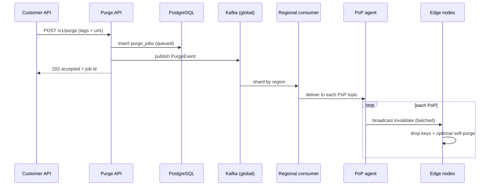
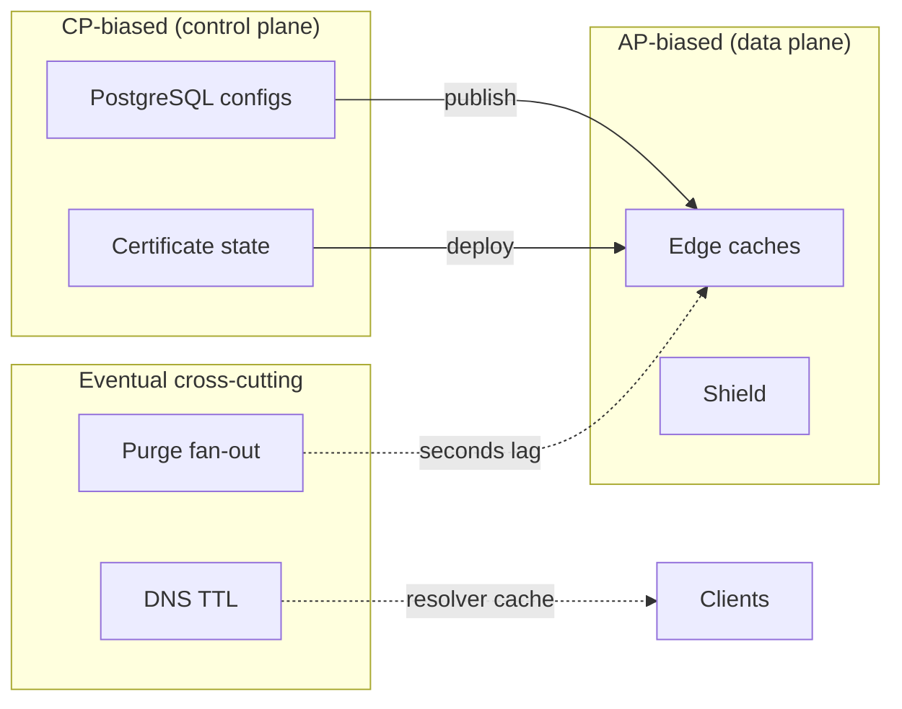
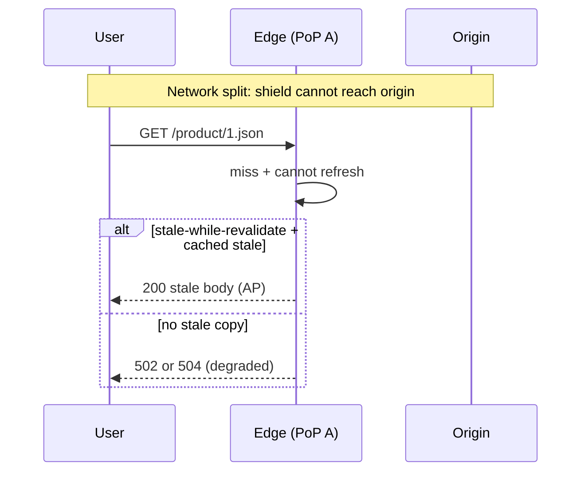

# Content Delivery Network (CDN)
{: .no_toc }

<details open markdown="block">
  <summary>Table of contents</summary>
  {: .text-delta }
1. TOC
{:toc}
</details>

---

## What We're Building

A **Content Delivery Network (CDN)** is a globally distributed **edge delivery plane** that terminates user connections close to viewers, caches responses from **origins** (object storage, APIs, media packagers), and serves **static assets**, **video segments**, and **cacheable API** payloads with low latency and high bandwidth efficiency. Unlike a single reverse proxy, a CDN spans **hundreds of Points of Presence (PoPs)** with **Anycast** or **DNS-based** steering, **tiered caches** (RAM + SSD), and **control-plane** services for configuration, certificate lifecycle, purge, analytics, and **multi-CDN** traffic management.

Operationally, the CDN sits on the **critical path** for most consumer internet traffic: **TLS** terminates at the edge, **HTTP/2** and **HTTP/3 (QUIC)** reduce head-of-line blocking, **DDoS** and **WAF** filters run before traffic hits the origin, and **signed URLs** / **token auth** enforce **geo-blocking** and entitlement. The **origin shield** (regional mid-tier cache) collapses **thundering herds** so viral objects do not stampede the application or storage tier.

| Capability | Why it matters |
|------------|----------------|
| **Edge PoPs + routing** | Minimize RTT; steer users to a healthy nearby cache |
| **L1 → L2 → origin hierarchy** | Absorb hot objects at edge; reduce origin QPS and egress |
| **Cache key + Vary discipline** | Correctness vs hit ratio; avoid serving wrong language or AB variant |
| **Invalidation (TTL, purge, surrogate keys)** | Balance freshness with offload; coordinated global purge |
| **TLS + QUIC + image optimization** | Security, performance, and byte reduction at scale |
| **Analytics + steering** | Hit ratio, bandwidth, latency per PoP; failover across providers |

{: .note }
> In interviews, separate **data plane** (serve bytes fast) from **control plane** (configs, certs, purge, analytics). Hyperscalers (**CloudFront**, **Akamai**, **Fastly**, **Cloudflare**) differ mainly in **programmability at the edge**, **WAF depth**, and **pricing** — the architecture below is **provider-agnostic** and maps to both **managed CDNs** and a **custom edge** design.

---

## 1. Requirements Clarification

### Functional Requirements

| ID | Requirement | Notes |
|----|-------------|--------|
| FR-1 | **Deliver** HTTP(S) objects (GET/HEAD; optional range requests) from edge with correct **caching semantics** | Support `Cache-Control`, `ETag`, conditional GET |
| FR-2 | **Route** clients to **nearest healthy PoP** via DNS (GeoDNS/weighted) and/or **Anycast** | Fallback when PoP degraded |
| FR-3 | **Tiered cache**: **L1** edge RAM/SSD → **L2 regional shield** → **origin** | Configurable parent hierarchy |
| FR-4 | **Cache key** derives from URL path, normalized query, **Vary** headers, **Accept-Encoding**, **client hints** | Pluggable normalization rules |
| FR-5 | **Invalidation**: **TTL**, **purge API** (URL/surrogate key/tag), **stale-while-revalidate (SWR)** | Async purge fan-out to PoPs |
| FR-6 | **Content types**: static (JS/CSS/images), **HLS/DASH** segments + manifests, **cacheable JSON** API responses | Separate policies per route class |
| FR-7 | **Origin shielding**: mid-tier fetches once, edges fill from shield | Collapse concurrent misses |
| FR-8 | **Consistent hashing** for object placement **within** a PoP cluster | Hotspot mitigation + minimal reshuffle on node add/remove |
| FR-9 | **Hot content detection + pre-warming** | Predictive fetch from origin or peer PoP |
| FR-10 | **TLS 1.2+** at edge; **certificate automation (ACME)**; **OCSP stapling** | Multi-tenant SNI, HSM optional |
| FR-11 | **HTTP/2** and **HTTP/3 (QUIC)** to clients | Feature negotiation; fall back to HTTP/1.1 |
| FR-12 | **DDoS mitigation** + optional **WAF** at edge | SYN flood, volumetric, L7 rules |
| FR-13 | **Real-time analytics**: cache hit ratio, bytes, status codes, **TTFB**, latency by PoP | Aggregated streams + dashboards |
| FR-14 | **Multi-CDN failover / traffic steering** | DNS or client-side SDK; health-based weights |
| FR-15 | **Geo-blocking**, **signed URLs**, **JWT / cookie tokens** | Policy engine at edge |
| FR-16 | **Edge image/video optimization** (resize, format conversion, compression) | On-the-fly transforms; cache derived variants |

### Non-Functional Requirements

| Category | Target | Rationale |
|----------|--------|-----------|
| **Global throughput** | **10M RPS** aggregate at peak (sustained design point) | Major consumer / media tenant mix |
| **Bandwidth** | **50 Tbps** egress-capacity planning (cluster + IX/peering) | Video-heavy; concurrent large objects |
| **Footprint** | **200+ PoPs** | Dense coverage for &lt;50 ms TTFB cached goal |
| **Latency (cached)** | **p99 TTFB &lt; 50 ms** in-region for hot static | Edge locality + QUIC + warm cache |
| **Availability** | **99.95%** data plane monthly (excluding origin hard failures) | Multi-PoP, automatic reroute |
| **Durability** | Cache is **ephemeral**; **origin** is source of truth | RPO for config = seconds; object durability = origin SLA |
| **Consistency** | **Eventual** cross-PoP (purge latency SLO); **strong** for control-plane config in-region | CAP split by subsystem |

### Out of Scope

- **Origin application design** beyond cache-friendly headers and **shield** contract (business logic stays at origin).
- **Live low-latency WebRTC** stack (this document treats **LL-HLS** as cacheable segments only).
- **Client-side DRM** key servers (only **delivery** path and **token** gates at edge).
- **Full edge compute** (V8 isolates, WASM workers) beyond **lightweight** image transforms — mentioned as optional extension.
- **Billing and multi-tenant invoicing** — assumed metering hooks exist.

---

## 2. Back-of-Envelope Estimation

### Traffic and request rate

| Assumption | Value | Result |
|------------|-------|--------|
| Peak **global** RPS | 10M | — |
| Average **origin-equivalent** object size (blended: HTML + JSON + small assets) | 20 KB | — |
| **Edge cache hit ratio** (blended) | 92% | Origin sees **800k RPS** equivalent misses + revalidation |
| **Miss** traffic to shield/origin | 8% of 10M | **800k RPS** at edge requesting fill (includes revalidation storm — shield absorbs) |

{: .tip }
> Separate **tiny object** (API JSON) from **large object** (video). Below we split **bandwidth** by class.

### Bandwidth (50 Tbps capacity planning)

| Class | Share of egress | Effective Gbps | Notes |
|-------|-----------------|----------------|-------|
| **Video (HLS/DASH)** | ~85% | ~42.5 Tbps | Long-lived TCP/QUIC flows; many parallel streams |
| **Images** | ~8% | ~4 Tbps | WebP/AVIF transforms reduce bytes |
| **JS/CSS/fonts** | ~4% | ~2 Tbps | Highly cacheable; brotli/gzip |
| **API JSON** | ~3% | ~1.5 Tbps | Lower cache hit; smaller objects |

**Sanity check:** 50 Tbps = **50 × 10^12 b/s**. At **10M RPS**, average **bytes per response** ≈ 50e12 / 8 / 10e6 ≈ **625 KB** average — plausible for a **video-heavy** mix (few huge responses dominate).

### Storage at edge (aggregate)

| Tier | Assumption | Capacity hint |
|------|------------|---------------|
| **L1 RAM** per edge node | 256–512 GB typical | Hot set per node |
| **L1 SSD** per edge node | 2–8 TB NVMe | Warm tier; segment storage |
| **Global edge storage** | 200 PoPs × N nodes × TB | **Petabyte-scale** aggregate (not authoritative) |
| **Working set** | Long-tail content | Most bytes are **cold** — served from origin on miss |

### Origin load with shield

| Step | Without shield | With shield |
|------|----------------|-------------|
| Concurrent **misses** for same object | O(edges) origin requests | **1** fetch to origin per wave; edges fill from shield |
| Effective origin QPS | High during viral spikes | **Capped** by shield batching + request coalescing |

**Rule of thumb:** shield reduces origin **GET** load by **10×–100×** for popular objects depending on PoP count and coordination.

### PoP and node sizing (illustrative)

| Parameter | Conservative | Aggressive (video-heavy PoP) |
|-----------|--------------|-------------------------------|
| **Edge nodes per PoP** | 40–80 | 100–200 |
| **NIC per node** | 2× 100 Gbps | 2× 200 Gbps (bonded / ECMP) |
| **Egress per PoP** | ~8–16 Tbps aggregate | Proportional to **peer** + **IX** capacity |
| **Concurrent QUIC streams** | Millions (kernel/OS tuning) | **SO_REUSEPORT**, **per-CPU** accept queues |

**10M RPS globally** ÷ **200 PoPs** ≈ **50k RPS average per PoP** before burst multipliers — well within a **fleet of commodity** edges with **connection offload** and **kernel bypass** on the heaviest sites.

### Cost drivers (interview talking points)

| Driver | Mitigation |
|--------|------------|
| **Egress** | Higher **CHR**, **image compression**, **peer** vs **transit** |
| **Origin** | **Shield**, **SWR**, **immutable URLs** |
| **TLS CPU** | **session tickets**, **session resumption**, **hardware AES** |
| **Purge storms** | **Surrogate keys**, **rate limit** API, **async** fan-out |

---

## 3. High-Level Design

### System Architecture

```
                         +------------------+
                         |   Authoritative  |
                         |   DNS / Traffic  |
                         |   Controller     |
                         +--------+---------+
                                  |
            +---------------------+---------------------+
            | GeoDNS / Anycast   | Multi-CDN steering |
            v                     v
    +-------+-------+     +-------+-------+
    |  PoP (Region A) |     |  PoP (Region B) |
    | +-------------+ |     | +-------------+ |
    | | L1 Edge nodes| |     | | L1 Edge nodes| |
    | | (RAM+SSD)    | |     | | (RAM+SSD)    | |
    | +------+------+ |     | +------+------+ |
    |        | coalesce miss                              
    |        v                                            
    | +-------------+       +-------------+             
    | | L2 Shield   |<----->| L2 Shield   | (optional inter-PoP peering)
    | | (regional)  |       |             |
    | +------+------+       +------+------+
    |        |                     |
    +--------|---------------------|------------------+
             |                     |
             v                     v
      +------+------+       +------+------+
      | API Origin  |       | Object Store|
      | (dynamic)   |       | (S3/GCS)    |
      +-------------+       +-------------+

 Control plane (parallel): Config API --+--> PostgreSQL (origins, routes)
                                        +--> Redis (pub/sub purge fan-out)
                                        +--> Cert Manager (ACME)
                                        +--> Analytics pipeline (Kafka -> OLAP)
```

### Component Overview

| Component | Responsibility | Notes |
|-----------|----------------|--------|
| **DNS / steering** | Map user → PoP VIP; health-based weights | EDNS Client Subnet hints; fallback records |
| **Edge node** | TLS, HTTP/2/3, cache GET/HEAD, WAF hooks | M:N per PoP; consistent hash ring |
| **L2 shield** | Origin offload, request coalescing, larger SSD | Fewer hops to origin |
| **Origin** | Authoritative bytes + dynamic responses | Must send correct `Cache-Control` / `Vary` |
| **Config service** | Routes, backends, TTL defaults, geo rules | Versioned; pushed to edges |
| **Purge bus** | Fan-out purge events | Kafka / NATS / Redis Streams |
| **Cert manager** | ACME, renew, deploy to edge | SNI certs per customer domain |
| **Analytics** | Access logs → aggregates | Real-time + batch; cardinality control |
| **Policy engine** | Geo, signed URL, JWT validation | Evaluated at edge before cache |

### Core Flow

**Cache hit (happy path)**

1. Client resolves **CDN hostname** → obtains **Anycast VIP** or **GeoDNS A/AAAA** for nearest PoP.
2. **TLS handshake** at edge (HTTP/3 preferred); connection pinned to a specific **edge node** (Anycast may land anycast-wide, then local LB picks node).
3. Edge computes **cache key** from method, URL, normalized query, **Vary** dimensions (e.g., `Accept-Encoding`).
4. **L1 RAM** lookup → **hit** → return response with `Age`, optional `X-Cache: HIT`, **OCSP-stapled** cert.
5. Async: emit **analytics** sample (hit, bytes, PoP id, ASN).

**Cache miss**

1. Steps 1–3 same; L1 **miss** → check **L1 SSD** (if tiered).
2. Still miss → forward to **L2 shield** in region (parent cache) with **collapsed forwarding** key.
3. Shield **miss** → **single flight** to origin (HTTP GET); stream response to first waiter; **background** fill to disk/RAM.
4. Response stored with **TTL** derived from `Cache-Control: max-age`, **implicit** defaults per route class, **min/max clamp**.
5. Downstream edges **pull** from shield; **stale** path may serve **stale** while **revalidate** if `stale-while-revalidate` allows.
6. Purge / version bump: **surrogate-key** or **URL purge** removes or **revalidates** affected keys at all tiers.

---

## 4. Detailed Component Design

### 4.1 Edge server and PoP internal topology

Each **PoP** hosts **N** edge nodes behind **L4/L7 load balancers**. Nodes run a **cache proxy** (custom **Go**/**Rust** or **Varnish**/**NGINX**-class) with:

- **Worker threads** or **async I/O** (epoll/io_uring) for connection handling.
- **Hot object heap** in **DRAM** (LRU / ARC / TinyLFU) for small objects and manifests.
- **SSD tier** for large segments and long-tail — **sequential read** friendly.
- **Inter-node** consistent hashing: object id = hash(host + path + vary-dimensions) → **primary + R replicas** on neighbor nodes for **redundancy** and **load spread**.

**Anycast vs DNS:** **Anycast BGP** advertises the same IP from many sites; **routing** picks closest hop. **DNS** can refine by **country/ASN** using **EDNS0** hints. Production CDNs often combine **both**: Anycast for simplicity + DNS for **steering** and **A/B** between providers.

### 4.2 DNS-based and Anycast routing

| Mechanism | Behavior | Failure modes |
|-----------|----------|----------------|
| **Anycast** | BGP path selection → nearest PoP | **Route leaks**, **black holes** if PoP withdraws prefixes slowly |
| **GeoDNS** | Resolver location → weighted A records | **Stale geo**; **resolver far from user** |
| **EDNS Client Subnet** | Pass /24 or /56 hint to authoritative DNS | Privacy / truncation policies |

**Health integration:** Traffic controllers **decrement weights** when PoP error rate ↑ or synthetic probes fail; **TTL** kept short (30–300 s) for failover.

### 4.3 Cache hierarchy: L1 → L2 shield → origin

| Tier | Role | Typical hit ratio contribution |
|------|------|--------------------------------|
| **L1 RAM** | Lowest latency; small objects | Highest QPS |
| **L1 SSD** | Video segments, large images | Bandwidth offload |
| **L2 shield** | Shared miss path; **request coalescing** | Origin protection |
| **Origin** | SoT for dynamic + uncacheable | Must scale with shield |

**Coalescing:** First miss **registers** an in-flight promise; concurrent requests **await** the same fill — critical for **thundering herd** mitigation.

### 4.4 Cache key design (URL + Vary + query)

**Canonical key components:**

```
cache_key = SHA256(
  normalize_scheme_host(scheme, host) ||
  decoded_path ||
  sorted_query(normalize_query(query)) ||
  vary_slice(
    vary_headers: Vary from origin,
    request: selected headers (Accept-Encoding, Accept-Language, ...)
  ) ||
  optional_client_profile(AB flags if in key)
)
```

| Pitfall | Mitigation |
|---------|------------|
| **Query order** | Sort parameters; strip tracking params (`utm_*`) per policy |
| **Case sensitivity** | Lowercase host; normalize path per RFC 3986 |
| **Compression variant** | Include `br` vs `gzip` in key when `Vary: Accept-Encoding` |
| **Auth leakage** | Never cache `Authorization` responses unless **edge-signed** token in key (prefer **signed URL** without secrets in URL path) |

**Video:** HLS `.m3u8` and `.ts`/`.m4s` segments are **immutable** once published — key = URL; **version** in path avoids purge storms.

### 4.5 Cache invalidation strategies

| Strategy | When | Mechanism |
|----------|------|-----------|
| **TTL** | Default | `max-age`, `s-maxage`, `Expires` |
| **Purge API** | Immediate consistency need | **URL list** or **prefix** fan-out |
| **Surrogate keys / tags** | Group invalidation (product catalog version) | Map tag → many keys; **Fastly-style** |
| **Stale-while-revalidate** | Serve stale, refresh async | Better UX than blocking miss |
| **Versioned asset URLs** | `/assets/app.v123.js` | **No purge** needed on deploy |

**Soft purge:** Mark **stale** without delete — next request **revalidates** with **If-None-Match**.

### 4.6 TLS termination, certificates, and protocol stack

- **Certificates:** Per-customer **SNI**; **ACME HTTP-01/DNS-01** automation; **short-lived** certs (e.g., 90 days) with **early renew**.
- **OCSP stapling:** Staple OCSP response in TLS handshake — avoids client **blocking** on CA OCSP responders.
- **HTTP/2:** Multiplexing; **server push** largely deprecated — prefer **preload** hints.
- **HTTP/3 / QUIC:** **UDP 443** must be permitted; **fallback** to H2; **0-RTT** careful with **replay** on non-idempotent paths (usually disabled for dynamic).

### 4.7 Hot content, pre-warming, and consistent hashing

- **Hot object detection:** **request rate** and **byte rate** counters per key shard; **top-K** in each PoP → **pre-warm** to peer PoPs or from origin during **off-peak**.
- **Pre-warming API:** Customers **POST** list of URLs before marketing event; edges **fetch** proactively.
- **Consistent hashing:** ** vnode ring** (e.g., 150–200 virtual nodes per physical); add/remove node moves **K/N** keys — minimizes reshuffle vs modulo.

### 4.8 DDoS, WAF, and multi-CDN steering

- **Network layer:** **SYN cookies**, **rate limit** new flows per /32; upstream **scrubbing** partners for **volumetric**.
- **Application layer:** **WAF** rules (OWASP CRS), **bot scoring**, **JA3** / **fingerprint** heuristics.
- **Multi-CDN:** **DNS** weighted records or **NS1/Constellix**-style filters; **client SDK** tries **primary CDN URL**, falls back on **timeout/5xx**.

| Attack class | Edge action | Origin impact |
|--------------|-------------|----------------|
| **Volumetric UDP/TCP** | **Sinkhole** / scrubbing center | None if traffic never reaches app |
| **L7 HTTP flood** | **Challenge**, **rate limit**, **bot score** | Minimal if cached |
| **Slowloris** | **Connection timeouts**, **max headers** | Bounded worker usage |

### 4.9 Image and video optimization at the edge

**Goals:** reduce **bytes**, improve **LCP** (Largest Contentful Paint), avoid **origin round trips** for every derivative.

| Technique | Behavior | Cache implication |
|-----------|----------|---------------------|
| **On-the-fly resize** | `w`, `h`, `fit` in URL path | **Each tuple** is a distinct cache key |
| **Format negotiation** | `Accept: image/avif,image/webp` → serve best | Either **`Vary: Accept`** or **explicit path** (`/fmt/avif/...`) — latter improves CHR |
| **Quality / DPR** | `q`, `dpr` parameters | Same as resize — key must include params |
| **Video transmux** | Rare at edge; usually **packager** at origin | Edge caches **segments** only |

**Processing placement:**

- **Lightweight** (resize + encode): **edge worker** or **dedicated image PoP** with **GPU** pools for AVIF.
- **Heavy** (per-title encoding): **offline** transcoding — never on **user request path** for long jobs.

**Example URL policy (high CHR):**

```
https://img.cdn.example.com/f_avif,q_75,w_640/cl9k2x/product/hero.jpg
```

Path encodes **all** transform dimensions → **immutable** for that URL; deploy new **asset id** when creative changes.

### 4.10 Purge fan-out and surrogate-key registry

**Problem:** a **single** `POST /purge` must reach **200+ PoPs** and **thousands** of nodes without **O(n²)** chatter.

**Pattern:**

1. API persists `purge_jobs` row and enqueues **event** to **regional Kafka** (or **Redis Streams**).
2. **Fan-out service** in each region consumes and publishes to **PoP-local** topics (`purge.iad-1`, `purge.fra-2`, …).
3. Each **edge agent** receives **batched** purges (URLs, prefixes, surrogate keys); applies **local** index eviction.
4. **Surrogate key → cache key hashes** stored in **Postgres** or **Redis Cluster** for **tag purge**: resolve tags to **hashes**, stream **delete** commands.



**Idempotency:** clients send **`Idempotency-Key`**; duplicate events **no-op** at edge using **`(tenant_id, pattern, version)`** tuple.

### 4.11 Real-time analytics: pipeline and cardinality

**Ingest:** every edge emits **structured** log line (binary protobuf or **OTLP**-like) with:

- `timestamp`, `property_id`, `pop_id`, `node_id`, `cache_status` (HIT/MISS/STALE), `bytes_out`, `ttfb_ms`, `status_code`, `asn`, `country`, `route_class` (static/api/video).

**Aggregation:** **Flink** tumbling windows **1 s / 10 s / 60 s** with **allowed dimensions** — **never** raw `url` in high-cardinality keys (sample or **bucket** path).

| Metric | Cardinality-safe approach |
|--------|---------------------------|
| **CHR** | Sum hits / (hits + misses) by `pop_id`, `property_id` |
| **p99 TTFB** | **HdrHistogram** or **t-digest** in Flink; export to **ClickHouse** `QuantileTDigest` |
| **Bandwidth** | Sum `bytes_out` by time window |

**Backpressure:** if Kafka lag **> threshold**, **sample** logs (e.g., 1%) and raise **alert** — **never** block the request path.

### 4.12 Multi-CDN failover mechanics

| Layer | Mechanism | Failover time |
|-------|-----------|----------------|
| **DNS** | Lower **TTL** (60–300 s); **health-checked** weights | **Minutes** (resolver cache) |
| **HTTP DNS** | Client calls **config API** for ordered CDN URLs | **Seconds** (app-controlled) |
| **Anycast** | Automatic if **provider** withdraws bad PoP | **Seconds** (BGP convergence) |

**Traffic steering objectives:** **cost** (egress $/GB differs), **performance** (CHR per provider), **compliance** (data stays in region). Controllers **rebalance** weights using **real-time** CHR and **$/GB** inputs.

### Varnish VCL sketch (cache key + shield parent)

```vcl
vcl 4.1;

backend shield {
  .host = "shield-us-east.internal";
  .port = "8080";
}

sub vcl_recv {
  if (req.method != "GET" && req.method != "HEAD") {
    return (pass);
  }
  set req.backend_hint = shield;
}

sub vcl_hash {
  hash_data(req.url);
  hash_data(req.http.host);
  if (req.http.Accept-Encoding) {
    hash_data(req.http.Accept-Encoding);
  }
}

sub vcl_backend_response {
  if (beresp.ttl <= 0s && !beresp.uncacheable) {
    set beresp.ttl = 3600s;
    set beresp.grace = 24h;
  }
}
```

{: .tip }
> Production VCL adds **`return (hash)`** routing, **`vcl_hit` / `vcl_miss`** instrumentation, and **`purge`** handling via **`ban`** or **`ykey`** (surrogate) plugins — **treat this as interview pseudocode**.

---

## 5. Technology Selection & Tradeoffs

### Edge data plane: custom (Go/Rust) vs Varnish vs NGINX

| Option | Pros | Cons | Our Pick + Rationale |
|--------|------|------|----------------------|
| **Custom Go/Rust proxy** | Full control over **keying**, **coalescing**, **observability**; single binary deploy | You own perf tuning, HTTP/3, TLS stack integration | **Go** for velocity + ecosystem, or **Rust** for extreme tail latency — **pick Go** for most teams unless p99 &lt;100µs per hop is mandated |
| **Varnish (VCL)** | Mature **caching**; flexible **VCL** for routing | **VCL** learning curve; **HTTP/3** via coupling; process model ops | **Strong** if team knows VCL and needs **programmable cache** without writing a proxy |
| **NGINX / OpenResty** | Ubiquitous; **Lua** for hooks; great **LB** story | **Cache** less specialized than Varnish; Lua safety | **Default** for **LB + simple cache**; pair with **plugin** for advanced keying |
| **Envoy + cache extension** | Unified mesh + observability | **Cache** not first-class; build extensions | Use when **already** on Envoy mesh — not a pure CDN from scratch |

**Our pick:** **Varnish or NGINX/OpenResty** for **time-to-market** on a **managed PoP** footprint; **custom Rust** edge for **hyperscale** proprietary CDN (Netflix/Open Connect–class) where **byte efficiency** and **custom protocols** justify engineering. Interview answer: start **NGINX + modules** or **Varnish**, migrate **hot paths** to **Rust** as metrics dictate.

### SSD + RAM tiering

| Option | Pros | Cons | Our Pick + Rationale |
|--------|------|------|----------------------|
| **RAM-only L1** | Lowest latency | Costly for video | **Small objects + manifests** |
| **NVMe SSD L2 within edge** | High bandwidth/$ | Higher latency than RAM | **Segments**, **large images** |
| **Shield-only SSD** | Centralized larger cache | Extra hop on miss | **Origin protection** |

**Our pick:** **RAM (hot) + NVMe (warm)** at edge; **regional shield** with **large NVMe** pools.

### Analytics pipeline

| Option | Pros | Cons | Our Pick + Rationale |
|--------|------|------|----------------------|
| **Kafka + Flink/Spark** | Durable; replay | Ops heavy | **At 10M RPS** — regional Kafka clusters |
| **ClickHouse** | Fast aggregates | Ops | **Real-time dashboards** |
| **Vendor SaaS** | Fast integration | Cost | **Hybrid**: raw logs to **S3** + **CH** rollups |

**Our pick:** **Kafka** ingest per region → **Flink** windowed **CHR, p50/p99 TTFB** → **ClickHouse** + **Grafana**.

### Multi-CDN controller

| Option | Pros | Cons | Our Pick + Rationale |
|--------|------|------|----------------------|
| **DNS-only steering** | Simple | Coarse | **Baseline** |
| **Active health checks + API** | Fine control | State | **Our pick** for **failover** |
| **Client-side** | Fast failover | App change | **Mobile / TV apps** with **SDK** |

---

## 6. CAP Theorem Analysis

CDN subsystems split **CAP** pragmatically: the **edge cache** favors **availability + partition tolerance** with **eventual** consistency; **control plane** favors **consistency** for config and purge **acknowledgment**.

| Subsystem | CAP stance | Notes |
|-----------|------------|--------|
| **Edge cache (L1/L2)** | **AP** | Serve **stale** on uncertainty; **TTL** bounds divergence |
| **Purge propagation** | **CP** toward **eventual** | **Strong** “accepted” at API; **visibility** lag across PoPs |
| **DNS steering** | **AP** | **Cached** resolvers delay updates |
| **Origin metadata (Postgres)** | **CP** (regional) | **Strong** consistency for config rows |
| **Analytics** | **AP** | **Approximate** real-time acceptable |



**Interview punchline:** **Immutability** (versioned asset URLs) avoids **coordination**; **mutable** APIs need **purge** or **short TTL** — there is **no global linearizable cache** at CDN scale for all keys.

### Read path under partition (conceptual)



**Design choice:** for **product catalog JSON**, ship **`stale-if-error`** semantics at edge so **partition** toward origin still returns **last good** representation (bounded by **max stale** policy).

---

## 7. SLA and SLO Definitions

### SLIs and SLOs

| SLI | Measurement | SLO (monthly) | Error budget |
|-----|-------------|---------------|--------------|
| **Availability** | `5xx` + timeout from edge / total requests | **99.95%** | **0.05%** bad minutes ≈ **21.6 min/month** |
| **TTFB (cached static)** | Edge timing **p99** | **&lt; 50 ms** in same metro | Breach → optimize PoP peering, QUIC rollout |
| **Cache hit ratio (CHR)** | `(hits / (hits+misses))` by property | **≥ 90%** blended | Low CHR → keying bugs or TTL too short |
| **Purge propagation** | Time from **accepted** purge to **99% PoPs** | **&lt; 60 s** | Slower → fan-out backlog alert |
| **Origin offload** | Origin RPS / would-be RPS without CDN | **≥ 95%** reduction for static | Review shield |

### Error budget policy

- **Burn rate alerts:** 2% budget in 1 h → **page** on-call.
- **Freeze** risky edge config changes when budget **&lt; 20%** remaining in period.
- **Postmortem** required if **multi-PoP** outage exceeds **5 min**.

---

## 8. Database Schema and Data Model

### PostgreSQL DDL — origins and properties

```sql
CREATE TABLE tenants (
  id              UUID PRIMARY KEY DEFAULT gen_random_uuid(),
  name            TEXT NOT NULL,
  status          TEXT NOT NULL CHECK (status IN ('active', 'suspended')),
  created_at      TIMESTAMPTZ NOT NULL DEFAULT now()
);

CREATE TABLE origins (
  id              UUID PRIMARY KEY DEFAULT gen_random_uuid(),
  tenant_id       UUID NOT NULL REFERENCES tenants(id),
  hostname        TEXT NOT NULL,
  scheme          TEXT NOT NULL DEFAULT 'https' CHECK (scheme IN ('http', 'https')),
  port            INT NOT NULL DEFAULT 443,
  shield_region   TEXT,  -- e.g. 'us-east-1'
  connect_timeout_ms INT NOT NULL DEFAULT 2000,
  read_timeout_ms    INT NOT NULL DEFAULT 30000,
  tls_verify      BOOLEAN NOT NULL DEFAULT TRUE,
  UNIQUE (tenant_id, hostname)
);

CREATE INDEX idx_origins_tenant ON origins(tenant_id);
```

### Purge rules and jobs

```sql
CREATE TYPE purge_kind AS ENUM ('url', 'prefix', 'surrogate_key');

CREATE TABLE purge_jobs (
  id              BIGSERIAL PRIMARY KEY,
  tenant_id       UUID NOT NULL REFERENCES tenants(id),
  kind            purge_kind NOT NULL,
  pattern         TEXT NOT NULL,
  requested_by    TEXT NOT NULL,
  requested_at    TIMESTAMPTZ NOT NULL DEFAULT now(),
  status          TEXT NOT NULL DEFAULT 'queued'
                    CHECK (status IN ('queued', 'fan_out', 'completed', 'failed')),
  completed_at    TIMESTAMPTZ
);

CREATE TABLE surrogate_map (
  surrogate_key   TEXT NOT NULL,
  cache_key_hash  BYTEA NOT NULL,
  tenant_id       UUID NOT NULL REFERENCES tenants(id),
  inserted_at     TIMESTAMPTZ NOT NULL DEFAULT now(),
  PRIMARY KEY (tenant_id, surrogate_key, cache_key_hash)
);

CREATE INDEX idx_surrogate_lookup ON surrogate_map(surrogate_key, tenant_id);
```

### Edge node registry

```sql
CREATE TABLE pops (
  id              TEXT PRIMARY KEY,  -- e.g. 'iad-1'
  region          TEXT NOT NULL,
  country_code    CHAR(2) NOT NULL,
  anycast_prefix  CIDR,
  status          TEXT NOT NULL DEFAULT 'active'
);

CREATE TABLE edge_nodes (
  id              UUID PRIMARY KEY DEFAULT gen_random_uuid(),
  pop_id          TEXT NOT NULL REFERENCES pops(id),
  hostname        TEXT NOT NULL,
  capacity_gbps   INT NOT NULL,
  status          TEXT NOT NULL DEFAULT 'active',
  last_heartbeat  TIMESTAMPTZ
);

CREATE INDEX idx_nodes_pop ON edge_nodes(pop_id);
```

### Route rules and properties (delivery configuration)

```sql
CREATE TABLE properties (
  id              UUID PRIMARY KEY DEFAULT gen_random_uuid(),
  tenant_id       UUID NOT NULL REFERENCES tenants(id),
  cname_hostname  TEXT NOT NULL,
  default_origin_id UUID REFERENCES origins(id),
  created_at      TIMESTAMPTZ NOT NULL DEFAULT now(),
  UNIQUE (tenant_id, cname_hostname)
);

CREATE TABLE route_rules (
  id              BIGSERIAL PRIMARY KEY,
  property_id     UUID NOT NULL REFERENCES properties(id),
  path_prefix     TEXT NOT NULL,
  priority        INT NOT NULL DEFAULT 100,
  origin_id       UUID REFERENCES origins(id),
  cache_policy    TEXT NOT NULL DEFAULT 'default'
                    CHECK (cache_policy IN ('default', 'bypass', 'immutable')),
  strip_query_params TEXT[]  -- e.g. '{utm_source,utm_medium}'
);

CREATE INDEX idx_route_rules_property ON route_rules(property_id, priority DESC);
```

### Signed URL secrets (reference only — keys live in KMS)

```sql
CREATE TABLE signing_keys (
  id              UUID PRIMARY KEY DEFAULT gen_random_uuid(),
  tenant_id       UUID NOT NULL REFERENCES tenants(id),
  key_id          TEXT NOT NULL,
  algorithm       TEXT NOT NULL DEFAULT 'HS256',
  rotated_at      TIMESTAMPTZ NOT NULL DEFAULT now(),
  expires_at      TIMESTAMPTZ,
  UNIQUE (tenant_id, key_id)
);
```

### Cache key patterns (logical)

| Pattern | Example | Use |
|---------|---------|-----|
| **Static immutable** | `/static/app-1.2.3/main.js` | `max-age=31536000, immutable` |
| **API JSON** | `/api/v1/config` | Short TTL + **ETag**; **Vary: Authorization** if needed |
| **HLS** | `/cdn/video/123/seg_0042.m4s` | Long TTL; **byte-range** friendly |
| **Image transform** | `/img/w_320,q_80/id/foo.jpg` | Transform params **in path** for stable key |

---

## 9. API Design

### Content / origin management API

`POST /v1/properties/{property_id}/origins`

```json
{
  "hostname": "api.example.com",
  "shield_region": "eu-west-1",
  "health_check": {
    "path": "/healthz",
    "interval_seconds": 10,
    "expected_status": 200
  },
  "cache_defaults": {
    "respect_origin_cache_control": true,
    "default_ttl_seconds": 3600,
    "stale_while_revalidate_seconds": 86400
  }
}
```

### Purge API

`POST /v1/purge`

```json
{
  "tenant_id": "tnt_8f3a",
  "items": [
    { "kind": "url", "value": "https://cdn.example.com/p/123/image.jpg" },
    { "kind": "surrogate_key", "value": "product-998877" }
  ],
  "idempotency_key": "purge-2026-04-05-marketing"
}
```

**Response:**

```json
{
  "purge_job_id": "pj_91ab2c",
  "status": "accepted",
  "estimated_propagation_seconds": 45
}
```

### Analytics query API

`GET /v1/analytics/summary?property_id=prop_1&from=2026-04-01T00:00:00Z&to=2026-04-05T00:00:00Z&granularity=1h`

```json
{
  "property_id": "prop_1",
  "series": [
    {
      "timestamp": "2026-04-05T10:00:00Z",
      "requests": 125000000,
      "bandwidth_bps": 3.2e12,
      "cache_hit_ratio": 0.931,
      "status_2xx": 0.992,
      "p50_ttfb_ms": 12,
      "p99_ttfb_ms": 48,
      "by_pop": [
        { "pop": "iad-1", "requests": 8200000, "chr": 0.94 },
        { "pop": "fra-2", "requests": 6100000, "chr": 0.92 }
      ]
    }
  ]
}
```

### Edge configuration snippet (illustrative NGINX)

```nginx
proxy_cache_path /var/cache/nginx levels=1:2 keys_zone=EDGE:512m
                 max_size=4t inactive=7d use_temp_path=off;

map $http_accept_encoding $cache_key_enc {
    default "";
    gzip    "gzip";
    br      "br";
}

proxy_cache_key "$scheme$proxy_host$request_uri$cache_key_enc";

upstream shield_us_east {
    least_conn;
    server shield-1.internal:8080 max_fails=2 fail_timeout=10s;
    server shield-2.internal:8080 max_fails=2 fail_timeout=10s;
}

server {
    listen 443 ssl http2;
    listen 443 quic reuseport;  # HTTP/3
    ssl_certificate     /etc/ssl/certs/$ssl_server_name.crt;
    ssl_certificate_key /etc/ssl/private/$ssl_server_name.key;
    ssl_stapling on;
    ssl_stapling_verify on;

    location / {
        proxy_cache EDGE;
        proxy_pass http://shield_us_east;
        proxy_cache_lock on;
        proxy_cache_use_stale error timeout updating http_500 http_502 http_503 http_504;
        proxy_cache_background_update on;
        add_header X-Cache-Status $upstream_cache_status;
    }
}
```

### Signed URL issuance API (time-limited access)

`POST /v1/signing/url`

```json
{
  "tenant_id": "tnt_8f3a",
  "resource_path": "/private/reports/2026/q1.pdf",
  "expires_at": "2026-04-05T12:00:00Z",
  "client_ip_bound": "203.0.113.0/24",
  "key_id": "k_2026_04"
}
```

**Response:**

```json
{
  "url": "https://cdn.example.com/private/reports/2026/q1.pdf?exp=1712318400&sig=abc...",
  "expires_at": "2026-04-05T12:00:00Z",
  "algorithm": "HMAC-SHA256"
}
```

**Edge verification:** compute **HMAC** over `path + exp + optional IP salt` with **KMS-held** secret for `key_id`; **reject** if clock skew beyond **60 s** or **signature** mismatch.

### Pre-warm API

`POST /v1/prewarm`

```json
{
  "property_id": "prop_1",
  "urls": [
    "https://cdn.example.com/campaign/hero-3200w.avif",
    "https://cdn.example.com/campaign/hero-640w.avif"
  ],
  "regions": ["us-east-1", "eu-west-1"],
  "priority": "high"
}
```

---

## 10. Scaling & Production Considerations

### Horizontal scale

| Layer | Knob |
|-------|------|
| **Edge** | Add nodes; **consistent hash** ring rebalances |
| **Shield** | Regional **autoscale** on CPU / bandwidth / miss rate |
| **Kafka** | Partition by **tenant_id** or **region** |
| **Postgres** | **Read replicas** for config reads; **Citus** if multi-tenant huge |

### Capacity guardrails

- **Per-tenant bandwidth** caps; **429** or **shape** when exceeded.
- **Max origin connections** per shield to prevent **origin overload**.
- **Circuit breaker** to origin — serve **stale** if **SWR** allows.

### Observability

| Signal | Use |
|--------|-----|
| **CHR by route class** | Mis-keying detector |
| **Miss latency** | Origin or shield slowness |
| **Purge queue depth** | Fan-out backlog |
| **TLS handshake time** | Cert or OCSP issues |

### Deployment

- **Canary** new edge config to **5%** PoPs; compare **5xx** and **TTFB**.
- **Feature flags** for **HTTP/3** percentage rollout.

### Peering and interconnect (50 Tbps scale)

| Layer | Practice |
|-------|----------|
| **IX + PNI** | **Private Network Interconnect** to major eyeballs and **cloud** regions reduces **transit** cost and latency |
| **TCP/QUIC tuning** | **BBR** or **Cubic** per network; **initial cwnd** experiments per ASN |
| **Kernel bypass** | **DPDK** / **XDP** on **heaviest** PoPs only — complexity tax |

### Chaos and resilience drills

| Drill | Success criterion |
|-------|-------------------|
| **Single PoP withdrawal** | Traffic shifts; **no** global **5xx** spike **> SLO** |
| **Origin slow** | **SWR** serves stale; **CHR** stays within **±5%** |
| **Kafka lag** | Purge **delays** but **no** data plane crash; **alert** fires |

### Runbook snippets (on-call)

| Symptom | First checks |
|---------|----------------|
| **CHR drop** | Recent **config** deploy? **Vary** header change? **Query** normalization bug? |
| **Origin spike** | **Shield** health; **coalescing** flag; **path** bypass rules |
| **p99 TTFB up** | **TLS** cert expiry; **OCSP** stapling failures; **upstream** RTT |

### Hot-spot mitigation

- **Surge** in single **object** (viral image): **consistent hash** spreads **disk** load; **pre-warm** from **origin** once at **shield**.
- **Hot PoP** (event in one city): **temporary** capacity from **neighboring** PoPs via **DNS** weight nudge or **anycast** shift (if topology allows).

---

## 11. Security, Compliance, and Data Privacy

| Area | Control |
|------|---------|
| **TLS** | **TLS 1.2+**, modern ciphers; **HSTS** for customer domains |
| **Private keys** | **HSM** or **cloud KMS** integration; **short-lived** certs |
| **Access** | **Signed URLs** (HMAC) or **JWT** with **short TTL** |
| **Geo** | **GeoIP** database; **block/allow** lists by country |
| **WAF** | **OWASP** ruleset; **rate limit** per IP / fingerprint |
| **Logging** | **PII minimization**; **sampled** logs; **retention** policy |
| **Compliance** | **DPA** with customers; **SOC2** controls on **config APIs** |

{: .warning }
> **0-RTT QUIC** can enable **replay** — disable for **non-idempotent** endpoints or require **tokens** bound to **first-flight** constraints.

---

## Interview Self-Check

| Topic | Can you explain in 60 seconds? |
|-------|-------------------------------|
| **Why L2 shield?** | Collapse misses; protect origin; higher hit rate than per-edge alone |
| **Cache key + Vary** | Correctness for **compressed** / **language** variants |
| **Surrogate keys** | Invalidate **groups** without listing every URL |
| **Anycast vs DNS** | BGP vs resolver-based steering; failure modes |
| **CAP at CDN** | AP at edge; **eventual** purge; **strong** config in DB |
| **50 Tbps** | Peering, **NIC** offload, **kernel bypass** (optional DPDK) at extreme scale |
| **Multi-CDN** | **DNS weights**, **health checks**, **cost vs availability** |

---

## Quick Reference Tables

### Cache hierarchy summary

| Tier | Latency | Role |
|------|---------|------|
| L1 RAM | Sub-ms–few ms | Hottest objects |
| L1 SSD | Single-digit ms | Segments, large assets |
| L2 shield | Tens of ms | Regional coalescing |
| Origin | Variable | Dynamic / cold |

### Invalidation cheat sheet

| Need | Mechanism |
|------|-----------|
| Fast global invalidation | **Surrogate keys** + purge |
| Immutable deploys | **Content-hashed filenames** |
| API freshness | **Short TTL** + **ETag** |

### Technology summary

| Component | Typical choice |
|-----------|----------------|
| Edge proxy | **Varnish**, **NGINX**, or **custom Rust** |
| Shield | Same stack with **larger** cache |
| Config + purge metadata | **PostgreSQL** |
| Purge fan-out | **Kafka** / **Redis Streams** |
| Analytics | **Kafka → Flink → ClickHouse** |
| TLS | **ACME** + **OCSP stapling** |

### Protocols

| Protocol | Notes |
|----------|--------|
| HTTP/1.1 | Ubiquitous; **keep-alive** |
| HTTP/2 | Multiplexing; HPACK |
| HTTP/3 | QUIC; **UDP**; better lossy networks |

---

_Last updated: system design interview prep — Content Delivery Network (CDN)._
