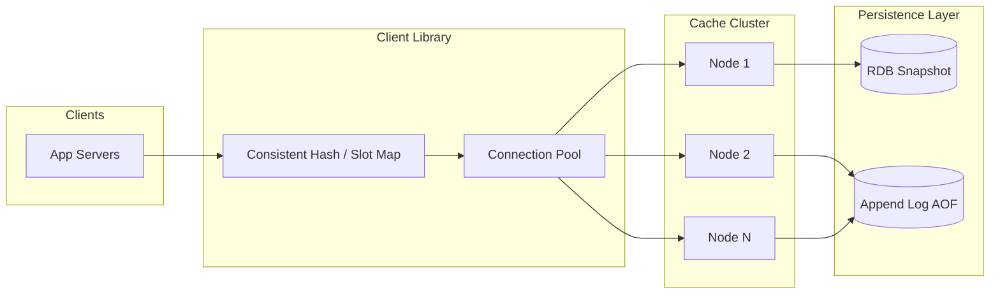
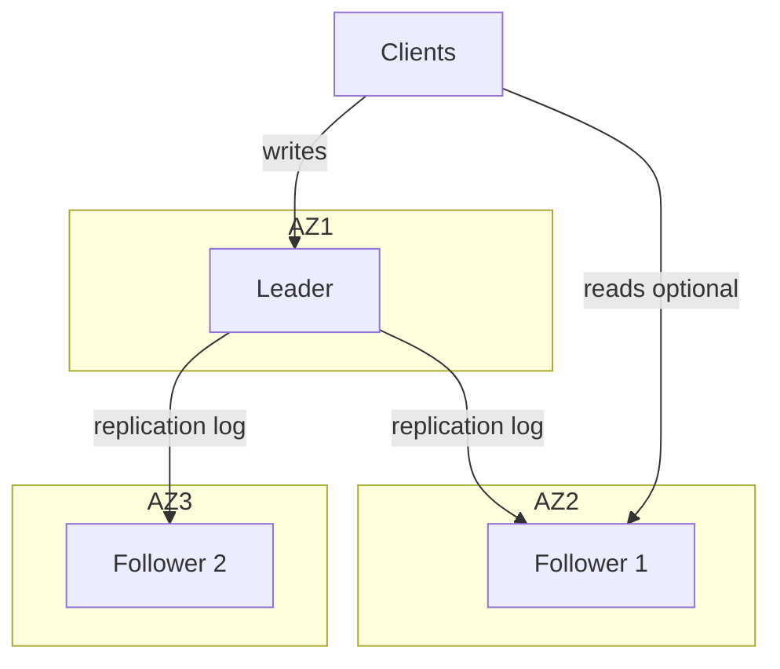
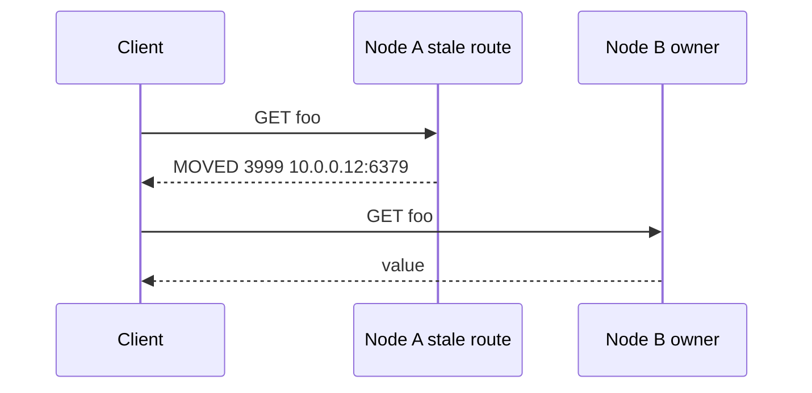
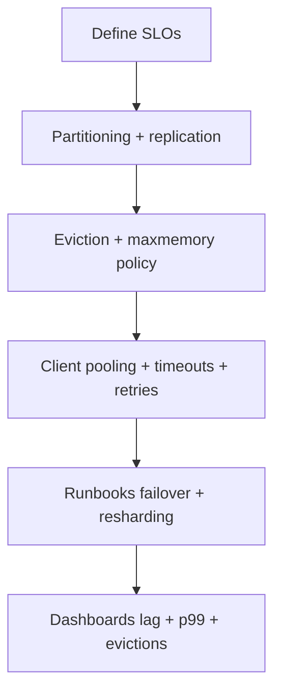

# Design a Distributed Cache (Redis / Memcached–style)
{: .no_toc }

<details open markdown="block">
  <summary>Table of Contents</summary>
  {: .text-delta }
1. TOC
{:toc}
</details>

---

## What We're Building

A **distributed in-memory cache** provides sub-millisecond reads and millions of operations per second by keeping hot data in RAM across many nodes. Architecturally it resembles **Redis** (rich data types, optional persistence, replication) or **Memcached** (simple key–value, multithreaded, slab allocator).

| Capability | Why it matters |
|------------|----------------|
| **In-memory storage** | RAM latency is orders of magnitude lower than disk |
| **Horizontal scale** | Add nodes to increase capacity and throughput |
| **Eviction & TTL** | Bounded memory; stale data expires |
| **Replication** | Durability of reads; failover |

**Real-world:** Redis commonly achieves **1M+ ops/sec per node** on modern hardware (workload-dependent). It is used at scale by **Twitter** (timelines/counters), **GitHub** (resque/sessions), **Snapchat** (story ranking, presence), and thousands of other services for caching, rate limiting, pub/sub, and lightweight data structures.

{: .note }
> In interviews, clarify whether the interviewer wants a **single-node** in-process cache, a **clustered** cache with sharding, or **full Redis feature parity**. This guide assumes a **clustered, production-style** design unless scoped down.

---

## Step 1: Requirements Clarification

### Questions to Ask

| Question | Why it matters |
|----------|----------------|
| Read vs write ratio? | Drives caching strategy and consistency model |
| Strong consistency required? | Usually eventual; linearizable cache is expensive |
| Max memory per key/value? | Affects allocator, eviction, and “big key” risk |
| Multi-tenancy / isolation? | Namespaces, quotas, noisy-neighbor limits |
| Durability requirements? | Pure cache vs snapshot/AOF-style persistence |
| Geo-distribution? | Active-active vs primary region + replicas |
| Exactly-once semantics? | Caches are typically at-most-once; idempotent writes |
| Expected peak QPS and data size? | Drives sharding, replication factor, NIC sizing |

### Functional Requirements

| Requirement | Priority | Notes |
|-------------|----------|-------|
| **GET** by key | Must have | Core read path |
| **PUT/SET** key–value | Must have | Optional TTL / EX |
| **DELETE** key | Must have | Invalidation |
| **TTL / expiration** | Must have | Lazy + optional active expiry |
| **Eviction policies** (LRU, LFU, TTL-first) | Must have | When memory is full |
| **Data types** (string, list, set, hash, sorted set) | Nice to have | Redis-like; Memcached is string-only |
| **Pub/Sub** | Nice to have | Invalidation, real-time features |
| **CAS / conditional writes** | Nice to have | Optimistic concurrency |
| **Clustering** (add/remove nodes) | Must have | For “distributed” scope |

### Non-Functional Requirements

| Requirement | Target | Rationale |
|-------------|--------|-----------|
| **Read latency (p99)** | &lt; 1 ms | In-memory + local network |
| **Availability** | 99.99% | Replication + failover; no single point of failure |
| **Throughput** | Millions of ops/sec cluster-wide | Horizontal scale |
| **Durability** | Configurable | RDB/AOF-style vs pure cache |
| **Consistency** | Eventual (typical) | Cross-partition linearizability is costly |
| **Horizontal scalability** | Add shards for capacity | Consistent hashing or slot-based routing |

### API Design (REST or binary protocol)

Illustrative commands aligned with Redis-style semantics:

| Operation | Syntax | Behavior |
|-----------|--------|----------|
| **GET** | `GET key` | Return value or miss |
| **SET** | `SET key value [EX seconds]` | Store; optional TTL |
| **DEL** | `DEL key` | Remove key |
| **EXPIRE** | `EXPIRE key seconds` | Set/update TTL |
| **Optional** | `SET key value NX` | Set only if not exists |
| **Optional** | `GETSET key value` | Atomic read–write |

{: .tip }
> Mention **idempotency** for DEL and for SET with same value; **not idempotent** in the strict sense for INCR-style ops unless designed carefully.

---

## Step 2: Back-of-Envelope Estimation

### Assumptions

```
- Cluster aggregate: 10M requests/second (read + write combined)
- Total cache capacity: 1 TB across all nodes
- Average key size: 50 bytes
- Average value size: 1 KB
- Replication factor: 3 (for HA; logical data size × 3 in RAM for full copies — clarify “1 TB user-visible” vs “1 TB raw RAM”)
```

Below we treat **1 TB** as **logical cached data** (one copy); with **3× replication**, raw RAM ≈ **3 TB** for full replicas. Adjust in interview if the interviewer says “1 TB total RAM.”

### Per-Entry Size

```
Per key-value (metadata overhead ~32 bytes illustrative):
  key:     50 B
  value:   1024 B
  overhead: 32 B
  ─────────────
  ~1.1 KB per entry average

Entries that fit in 1 TB logical:
  1 TB / 1.1 KB ≈ 953 million entries (order-of-magnitude: ~1B keys)
```

### Nodes and Memory

Assume **64 GB RAM per cache server** (common cloud shape); usable for data ~80% after OS, JVM/runtime, replication buffers → **~51 GB** net per node.

```
Logical 1 TB / 51 GB ≈ 20 nodes (single copy narrative)

With 3× replication of all data:
  3 TB / 51 GB ≈ 60 data-bearing processes (or 20 machines × 3 replicas spread across racks/AZs)
```

**Interview answer:** *“Roughly 20 shards for 1 TB logical at ~50 GB effective per node; triple that replica footprint if we store three full copies. Alternatively, use primary + async replicas with partial read scaling.”*

### Network Bandwidth

```
10M ops/sec × (50 + 1024) bytes ≈ 10.7 GB/s aggregate cluster egress+ingress for raw payloads
Per node (20 nodes): ~535 MB/s — requires 10 Gbps NICs and careful placement
```

Add **protocol overhead** (~10–30%), **replication traffic**, and **gossip**: plan **25–40% headroom**.

{: .warning }
> **Hot keys** can saturate a single node’s NIC or CPU long before the cluster average looks unhealthy. Always mention hot-key mitigation in estimation follow-up.

---

## Step 3: High-Level Design

### Architecture (Mermaid)



- **Client library** computes partition (hash ring or slot) and talks to the right node(s).
- **Replication** (leader/follower or chained) sits **inside** each partition’s story; diagram simplified.
- **Persistence** is optional per process; many deployments use **replicas as durability** and async disk for point-in-time recovery.

### Cache Population Patterns

| Pattern | Flow | Best when |
|---------|------|-----------|
| **Cache-aside** | App reads cache → on miss, read DB → populate cache | Default; app controls consistency |
| **Read-through** | Cache misses trigger loader callback | Centralized loading logic |
| **Write-through** | Write to cache + DB synchronously | Stronger consistency with DB |
| **Write-behind** | Write to cache first; async flush to DB | High write throughput; risk if cache dies |

Deep dive with code appears in [§4.5](#45-cache-patterns).

{: .note }
> Redis/Memcached are typically **cache-aside** or **read-through** from the application’s perspective; **write-through/write-behind** are application patterns *using* the cache, not properties of the server alone.

---

## Step 4: Deep Dive

### 4.1 Hash Table & Memory Management

**In-memory hash table:** Open addressing or chaining; production systems optimize for **cache-line locality**, **pointer overhead**, and **concurrency** (sharding, lock-free where proven).

**Memory allocation:**

| Approach | Pros | Cons |
|----------|------|------|
| **malloc/free per object** | Simple | Fragmentation, slow |
| **Slab allocation (Memcached)** | Fixed sizes, low fragmentation | Internal fragmentation |
| **jemalloc/tcmalloc** | Good general-purpose | Still tune slab classes for tiny objects |
| **Arena per thread / epoch** | Fast bump alloc | Complex lifecycle |

#### Java: `ConcurrentHashMap`-based cache

```java
import java.util.concurrent.ConcurrentHashMap;
import java.util.Optional;
import java.util.concurrent.atomic.AtomicLong;

/** Illustrative thread-safe string cache with TTL checked on read (lazy expiry). */
public final class ConcurrentStringCache {
    private static final class Entry {
        final byte[] value;
        final long expireAtNanos; // Long.MAX_VALUE if no expiry

        Entry(byte[] value, long expireAtNanos) {
            this.value = value;
            this.expireAtNanos = expireAtNanos;
        }

        boolean expired() {
            return expireAtNanos != Long.MAX_VALUE
                    && System.nanoTime() > expireAtNanos;
        }
    }

    private final ConcurrentHashMap<String, Entry> map = new ConcurrentHashMap<>();
    private final AtomicLong approximateBytes = new AtomicLong(0L);

    public Optional<byte[]> get(String key) {
        Entry e = map.get(key);
        if (e == null) return Optional.empty();
        if (e.expired()) {
            map.remove(key, e);
            return Optional.empty();
        }
        return Optional.of(e.value);
    }

    public void set(String key, byte[] value, Optional<Long> ttlMillis) {
        long exp = ttlMillis
                .map(ms -> System.nanoTime() + ms * 1_000_000L)
                .orElse(Long.MAX_VALUE);
        Entry neo = new Entry(value, exp);
        Entry old = map.put(key, neo);
        long delta = value.length - (old == null ? 0 : old.value.length);
        approximateBytes.addAndGet(delta);
    }

    public void delete(String key) {
        Entry old = map.remove(key);
        if (old != null) {
            approximateBytes.addAndGet(-old.value.length);
        }
    }
}
```

#### Go: sharded maps with `RWMutex`

```go
package cache

import (
	"hash/fnv"
	"sync"
	"time"
)

type entry struct {
	val     []byte
	deadline time.Time // zero means no TTL
}

type shard struct {
	mu sync.RWMutex
	m  map[string]entry
}

type ShardedCache struct {
	shards []*shard
}

func NewShardedCache(shardCount int) *ShardedCache {
	s := make([]*shard, shardCount)
	for i := range s {
		s[i] = &shard{m: make(map[string]entry)}
	}
	return &ShardedCache{shards: s}
}

func (c *ShardedCache) shardFor(key string) *shard {
	h := fnv.New32a()
	_, _ = h.Write([]byte(key))
	return c.shards[h.Sum32()%uint32(len(c.shards))]
}

func (c *ShardedCache) Get(key string) ([]byte, bool) {
	sh := c.shardFor(key)
	sh.mu.RLock()
	e, ok := sh.m[key]
	sh.mu.RUnlock()
	if !ok {
		return nil, false
	}
	if !e.deadline.IsZero() && time.Now().After(e.deadline) {
		sh.mu.Lock()
		delete(sh.m, key) // lazy expire
		sh.mu.Unlock()
		return nil, false
	}
	return e.val, true
}

func (c *ShardedCache) Set(key string, val []byte, ttl time.Duration) {
	sh := c.shardFor(key)
	sh.mu.Lock()
	defer sh.mu.Unlock()
	e := entry{val: val}
	if ttl > 0 {
		e.deadline = time.Now().Add(ttl)
	}
	sh.m[key] = e
}
```

#### Python: LRU with `OrderedDict`

```python
from __future__ import annotations

from collections import OrderedDict
from threading import RLock
from typing import Optional, Tuple
import time


class LRUCache:
    """O(1) LRU via OrderedDict (Python 3.7+ dict is ordered; we keep explicit LRU API)."""

    def __init__(self, capacity: int) -> None:
        self._cap = capacity
        self._data: OrderedDict[str, Tuple[float, bytes]] = OrderedDict()
        self._lock = RLock()

    def get(self, key: str) -> Optional[bytes]:
        with self._lock:
            if key not in self._data:
                return None
            exp, val = self._data[key]
            if exp and time.time() > exp:
                del self._data[key]
                return None
            self._data.move_to_end(key)
            return val

    def set(self, key: str, value: bytes, ttl_sec: Optional[float] = None) -> None:
        exp = time.time() + ttl_sec if ttl_sec else 0.0
        with self._lock:
            if key in self._data:
                del self._data[key]
            self._data[key] = (exp, value)
            self._data.move_to_end(key)
            while len(self._data) > self._cap:
                self._data.popitem(last=False)
```

{: .tip }
> For **Java**, `ConcurrentHashMap` reduces lock contention; for **Go**, **shard count** (e.g. 256–4096) is a common tuning knob. **Python** GIL makes CPU-bound eviction less parallel — for CPython, extension modules or multiprocessing may be needed at extreme scale.

---

### 4.2 Eviction Policies

| Policy | Idea | Typical structure | Cost |
|--------|------|-------------------|------|
| **LRU** | Evict least recently used | Hash map + doubly linked list | O(1) get/set |
| **LFU** | Evict least frequently used | Min-heap, or frequency buckets + LRU lists | O(1) amortized (bucket design) |
| **TTL-first** | Prefer expiring soon | Priority queue or lazy + periodic sweep | Mixed |
| **Random** | Evict random key | None | O(1), poor locality |

**TTL expiration:**

| Mode | Behavior | Trade-off |
|------|----------|-----------|
| **Lazy** | Check expiry on read; periodic sampling | CPU-efficient; stale keys occupy memory |
| **Active** | Background thread walks structure | More CPU; tighter memory |

#### Java: LRU cache O(1)

```java
import java.util.HashMap;
import java.util.Map;

public class LRUCache {
    static class Node {
        String key;
        String val;
        Node prev, next;
        Node(String k, String v) { key = k; val = v; }
    }

    private final Map<String, Node> index = new HashMap<>();
    private final Node head = new Node("", "");
    private final Node tail = new Node("", "");
    private final int capacity;

    public LRUCache(int capacity) {
        this.capacity = capacity;
        head.next = tail;
        tail.prev = head;
    }

    public String get(String key) {
        Node n = index.get(key);
        if (n == null) return null;
        moveToHead(n);
        return n.val;
    }

    public void put(String key, String val) {
        Node n = index.get(key);
        if (n != null) {
            n.val = val;
            moveToHead(n);
            return;
        }
        if (index.size() == capacity) {
            Node evict = removeTail();
            index.remove(evict.key);
        }
        Node neo = new Node(key, val);
        index.put(key, neo);
        addToHead(neo);
    }

    private void addToHead(Node n) {
        n.prev = head;
        n.next = head.next;
        head.next.prev = n;
        head.next = n;
    }

    private void remove(Node n) {
        n.prev.next = n.next;
        n.next.prev = n.prev;
    }

    private void moveToHead(Node n) {
        remove(n);
        addToHead(n);
    }

    private Node removeTail() {
        Node last = tail.prev;
        remove(last);
        return last;
    }
}
```

#### Go: LFU (simplified frequency buckets)

```go
package eviction

import "container/list"

type lfuItem struct {
	key   string
	freq  int
	elem  *list.Element // element in freqList[freq]
}

// LFUCache uses a map + per-frequency doubly linked lists for O(1) typical ops.
type LFUCache struct {
	cap   int
	size  int
	min   int
	nodes map[string]*lfuItem
	freqs map[int]*list.List
}

func NewLFU(capacity int) *LFUCache {
	return &LFUCache{
		cap:   capacity,
		nodes: make(map[string]*lfuItem),
		freqs: make(map[int]*list.List),
	}
}

func (c *LFUCache) Get(key string) (string, bool) {
	n, ok := c.nodes[key]
	if !ok {
		return "", false
	}
	c.increment(n)
	return n.key, true // value stored separately in real impl
}

func (c *LFUCache) increment(it *lfuItem) {
	// remove from old freq list
	oldList := c.freqs[it.freq]
	oldList.Remove(it.elem)
	if oldList.Len() == 0 {
		delete(c.freqs, it.freq)
		if c.min == it.freq {
			c.min++
		}
	}
	it.freq++
	newList, ok := c.freqs[it.freq]
	if !ok {
		newList = list.New()
		c.freqs[it.freq] = newList
	}
	it.elem = newList.PushFront(it.key)
}

func (c *LFUCache) evict() {
	list := c.freqs[c.min]
	back := list.Back()
	list.Remove(back)
	delete(c.nodes, back.Value.(string))
	c.size--
}
```

#### Python: TTL-based eviction helper

```python
import heapq
import time
from dataclasses import dataclass, field
from typing import Dict, List, Optional


@dataclass(order=True)
class Expiring:
    deadline: float
    key: str = field(compare=False)


class TTLIndex:
    """Min-heap of keys by deadline — illustrative active expiry scanner."""

    def __init__(self) -> None:
        self._heap: List[Expiring] = []
        self._entry: Dict[str, bytes] = {}

    def set(self, key: str, val: bytes, ttl_sec: float) -> None:
        deadline = time.time() + ttl_sec
        heapq.heappush(self._heap, Expiring(deadline, key))
        self._entry[key] = val

    def purge_expired(self) -> int:
        now = time.time()
        removed = 0
        while self._heap and self._heap[0].deadline <= now:
            item = heapq.heappop(self._heap)
            if item.key in self._entry:  # stale heap entries possible without decrease-key
                del self._entry[item.key]
                removed += 1
        return removed
```

{: .note }
> Production LFU often uses **W-TinyLFU** (Redis 4+ optional eviction) to handle **frequency burst** vs **LRU recency** — mention by name for bonus points.

---

### 4.3 Data Partitioning (Sharding)

- **Consistent hashing:** Keys map to a ring; nodes own arc ranges. Adding/removing a node moves only **neighboring** keys (not full rehash).
- **Virtual nodes:** Each physical node appears as many points on the ring to **balance load** when counts are uneven.
- **Hash slots (Redis Cluster):** Fixed **16384** slots; each node holds a slot range. Rebalancing moves **slots**, not individual keys.
- **Hash tags:** `{user123}:profile` forces same slot for related keys (Redis).

#### Mermaid: hash ring

```mermaid
flowchart LR
  subgraph Ring["Consistent Hash Ring 0..2^32-1"]
    direction clockwise
    V1((v1))
    V2((v2))
    V3((v3))
    V4((v4))
    V1 --> V2 --> V3 --> V4 --> V1
  end
  V1 -.-> N1[Node A]
  V2 -.-> N1
  V3 -.-> N2[Node B]
  V4 -.-> N2
```

#### Go: consistent hash ring (Ketama-style sketch)

```go
package shard

import (
	"crypto/sha1"
	"hash"
	"sort"
	"strconv"
)

type Ring struct {
	hash   hash.Hash
	replicas int
	keys     []int
	hashMap  map[int]string
}

func NewRing(replicas int) *Ring {
	return &Ring{
		hash:     sha1.New(),
		replicas: replicas,
		hashMap:  make(map[int]string),
	}
}

func (r *Ring) Add(nodes ...string) {
	for _, node := range nodes {
		for i := 0; i < r.replicas; i++ {
			h := r.hashKey(strconv.Itoa(i) + node)
			r.keys = append(r.keys, h)
			r.hashMap[h] = node
		}
	}
	sort.Ints(r.keys)
}

func (r *Ring) hashKey(key string) int {
	r.hash.Reset()
	r.hash.Write([]byte(key))
	bs := r.hash.Sum(nil)
	return int(bs[3]) | int(bs[2])<<8 | int(bs[1])<<16 | int(bs[0])<<24
}

func (r *Ring) Get(key string) string {
	if len(r.keys) == 0 {
		return ""
	}
	h := r.hashKey(key)
	idx := sort.Search(len(r.keys), func(i int) bool { return r.keys[i] >= h })
	if idx == len(r.keys) {
		idx = 0
	}
	return r.hashMap[r.keys[idx]]
}
```

#### Java: slot-based routing (Redis Cluster–style)

```java
public final class SlotRouter {
    public static final int SLOT_COUNT = 16_384;

    private final String[] slotToNode; // simplified: slot -> node id

    public SlotRouter(String[] slotToNode) {
        if (slotToNode.length != SLOT_COUNT) {
            throw new IllegalArgumentException("expected " + SLOT_COUNT + " slots");
        }
        this.slotToNode = slotToNode;
    }

    public static int crc16slot(byte[] key) {
        // Interview: cite Redis CRC16 + mod 16384; implementation omitted for brevity
        return Math.floorMod(crc16(key), SLOT_COUNT);
    }

    public String route(byte[] key) {
        int slot = crc16slot(key);
        return slotToNode[slot];
    }

    private static int crc16(byte[] bs) {
        int crc = 0;
        for (byte b : bs) {
            crc = ((crc << 8) ^ (b & 0xFF)) % 65536;
        }
        return crc;
    }
}
```

{: .warning }
> **Rebalancing:** Moving slots or ring ranges causes **migration windows**; clients must handle **MOVED/ASK** redirects (Redis) or **dual-read** strategies during transitions.

---

### 4.4 Replication & High Availability

| Aspect | Async replication | Sync replication |
|--------|-------------------|------------------|
| **Latency** | Lower write latency | Higher (wait for followers) |
| **Durability** | Risk of lost writes on failover | Stronger |
| **Availability** | Higher | Can block if follower slow |

**Leader–follower:** One primary per shard; followers apply a **replication log** (stream of commands or snapshot + delta).

**Failover / leader election:** Often implemented with **Raft** or **ZooKeeper/etcd** for coordination, or **sentinel**-style external watchers.

**Split-brain prevention:** **Quorum** + **fencing** (e.g., epoch numbers); old primary must not accept writes after losing leadership.

#### Mermaid: replication topology



#### Java: illustrative replication manager

```java
import java.util.concurrent.BlockingQueue;
import java.util.concurrent.LinkedBlockingQueue;

public class ReplicationManager {
    public record Command(String op, String key, byte[] value) {}

    private final BlockingQueue<Command> outbound = new LinkedBlockingQueue<>();

    public void replicate(Command cmd) throws InterruptedException {
        // Leader: append to local WAL, then async fan-out
        outbound.put(cmd);
    }

    public void followerLoop(Runnable applier) {
        new Thread(() -> {
            while (true) {
                try {
                    Command c = outbound.take();
                    applier.run(); // apply replicated op
                } catch (InterruptedException e) {
                    Thread.currentThread().interrupt();
                    return;
                }
            }
        }, "follower").start();
    }
}
```

{: .tip }
> Mention **partial resync** (PSYNC in Redis) vs **full sync** after long downtime — interviewers like operational realism.

---

### 4.5 Cache Patterns

| Pattern | Use case | Pros | Cons |
|---------|----------|------|------|
| **Cache-aside** | General purpose | Simple; app controls | Stale data; stampede risk |
| **Read-through** | Shared loader | Centralized invalidation | Loader becomes bottleneck |
| **Write-through** | Strong read-after-write | DB and cache aligned | Higher write latency |
| **Write-behind** | Write-heavy bursts | Fast writes | Data loss window; complexity |

#### Java: cache-aside (illustrative)

```java
public class CacheAsideUserRepo {
    private final ConcurrentStringCache cache;
    private final UserDb db;

    public CacheAsideUserRepo(ConcurrentStringCache cache, UserDb db) {
        this.cache = cache;
        this.db = db;
    }

    public byte[] getUser(String id) {
        return cache.get("user:" + id).orElseGet(() -> {
            byte[] row = db.loadUser(id);
            if (row != null) {
                cache.set("user:" + id, row, Optional.of(60_000L)); // 60s TTL
            }
            return row;
        });
    }

    public void updateUser(String id, byte[] row) {
        db.saveUser(id, row);
        cache.delete("user:" + id);
    }

    public interface UserDb {
        byte[] loadUser(String id);
        void saveUser(String id, byte[] row);
    }
}
```

#### Go: write-through sketch

```go
type WriteThrough struct {
	cache *ShardedCache
	db    interface {
		Save(key string, val []byte) error
	}
}

func (w *WriteThrough) Set(key string, val []byte, ttl time.Duration) error {
	if err := w.db.Save(key, val); err != nil {
		return err
	}
	w.cache.Set(key, val, ttl)
	return nil
}
```

#### Python: write-behind with queue (simplified)

```python
import queue
import threading
from typing import Callable


class WriteBehind:
    def __init__(self, flush: Callable[[str, bytes], None], workers: int = 2) -> None:
        self._q: "queue.Queue[tuple[str, bytes]]" = queue.Queue(maxsize=10_000)
        self._flush = flush
        for _ in range(workers):
            threading.Thread(target=self._loop, daemon=True).start()

    def _loop(self) -> None:
        while True:
            key, val = self._q.get()
            self._flush(key, val)
            self._q.task_done()

    def enqueue(self, key: str, val: bytes) -> None:
        self._q.put((key, val))
```

---

### 4.6 Consistency & Concurrency

- **Eventual consistency:** Replicas converge over time; reads may return **stale** values unless **read-your-writes** is engineered (sticky sessions, sync replication, or quorum reads).
- **CAS:** `SET key value if current == X` — **optimistic** concurrency; conflicts retry.
- **Distributed locks:** **Redlock** (multiple independent Redis instances) is **controversial**; many teams prefer **etcd/Consul** leases or DB advisory locks for **fencing**.
- **Locking:** Optimistic (version/CAS) vs pessimistic (locks) — trade latency vs conflict rate.

#### Go: lock with lease (single-node demo; not full Redlock)

```go
package distlock

import (
	"context"
	"time"
)

type Locker interface {
	TryLock(ctx context.Context, key string, ttl time.Duration) (unlock func(), ok bool)
}

// SingleRedisLocker is illustrative; production uses random token + Lua compare-and-del.
type SingleRedisLocker struct{}

func (SingleRedisLocker) TryLock(ctx context.Context, key string, ttl time.Duration) (func(), bool) {
	// SET key token NX PX ttl — omitted: connect to Redis
	return func() {}, true
}
```

#### Java: CAS-style update

```java
import java.util.concurrent.atomic.AtomicReference;

public class CasValue {
    private final AtomicReference<Versioned> ref;

    public CasValue(byte[] initial) {
        this.ref = new AtomicReference<>(new Versioned(1, initial));
    }

    public boolean compareAndSet(byte[] expect, byte[] update) {
        Versioned cur = ref.get();
        if (!java.util.Arrays.equals(cur.data, expect)) {
            return false;
        }
        Versioned next = new Versioned(cur.version + 1, update);
        return ref.compareAndSet(cur, next);
    }

    private record Versioned(int version, byte[] data) {}
}
```

#### Python: optimistic versioning

```python
from dataclasses import dataclass
from typing import Dict, Optional, Tuple


@dataclass
class VerVal:
    ver: int
    data: bytes


class VersionedStore:
    def __init__(self) -> None:
        self._m: Dict[str, VerVal] = {}

    def cas(self, key: str, expected_ver: int, new_data: bytes) -> bool:
        cur = self._m.get(key)
        if cur is None or cur.ver != expected_ver:
            return False
        self._m[key] = VerVal(cur.ver + 1, new_data)
        return True
```

---

### 4.7 Persistence

| Mode | Behavior | Pros | Cons |
|------|----------|------|------|
| **Snapshot (RDB)** | Fork + periodic dump | Compact; fast restart if snapshot fresh | Data loss since last snapshot |
| **Append-only (AOF)** | Log every write | Finer granularity | Larger files; replay time |
| **Hybrid** | AOF + periodic rewrite | Balance | Operational complexity |

**Recovery:** Start from latest **RDB**, then replay **AOF** after RDB timestamp if hybrid; or replay AOF from empty.

{: .note }
> Redis supports **RDB**, **AOF**, and **disabling persistence** entirely for pure cache tiers.

---

### 4.8 Client-Side Optimization

| Technique | Benefit | Caveat |
|-----------|---------|--------|
| **Connection pooling** | Amortize TCP/TLS setup | Pool sizing vs file descriptors |
| **Pipelining** | Batch commands, fewer round trips | Head-of-line blocking on single connection |
| **Client-side cache** | Fewer network hops | Stale data; invalidation story |
| **Compression** | Less bandwidth | CPU cost; only for large values |

#### Java: connection pool (Hikari-style naming only; illustrative DataSource)

```java
import java.sql.Connection;
import java.sql.DriverManager;
import java.sql.SQLException;
import java.util.ArrayDeque;
import java.util.Deque;

public class SimplePool implements AutoCloseable {
    private final Deque<Connection> pool = new ArrayDeque<>();
    private final String url;
    private final int max;

    public SimplePool(String url, int max) {
        this.url = url;
        this.max = max;
    }

    public synchronized Connection borrow() throws SQLException {
        if (!pool.isEmpty()) {
            return pool.pollFirst();
        }
        return DriverManager.getConnection(url);
    }

    public synchronized void release(Connection c) {
        if (pool.size() < max) {
            pool.addLast(c);
        } else {
            try { c.close(); } catch (SQLException ignored) { }
        }
    }

    public void close() {
        pool.forEach(c -> { try { c.close(); } catch (SQLException ignored) { } });
        pool.clear();
    }
}
```

{: .warning }
> For Redis, use **Lettuce**/**Jedis** pool or **redis-py** connection pools — the above shows **pooling pattern**, not Redis protocol.

#### Python: pipeline-style batching (conceptual)

```python
from typing import Iterable, List, Tuple, Protocol


class RedisLike(Protocol):
    def get(self, key: str) -> bytes | None: ...
    def set(self, key: str, val: bytes) -> None: ...


def pipeline_get(client: RedisLike, keys: Iterable[str]) -> List[bytes | None]:
    # Real: redis.pipeline(); here: sequential illustration
    return [client.get(k) for k in keys]


def pipeline_set(client: RedisLike, pairs: List[Tuple[str, bytes]]) -> None:
    for k, v in pairs:
        client.set(k, v)
```

---

### 4.9 Pub/Sub & Notifications

- **Pub/Sub:** Fire-and-forget broadcast; **no persistence** of messages (Redis Pub/Sub semantics).
- **Keyspace notifications:** Server publishes events on key changes; clients subscribe for **cache invalidation** or auditing.

#### Go: minimal in-memory pub/sub

```go
package pubsub

import "sync"

type Bus struct {
	mu   sync.RWMutex
	subs map[string][]chan string
}

func NewBus() *Bus {
	return &Bus{subs: make(map[string][]chan string)}
}

func (b *Bus) Subscribe(topic string) <-chan string {
	ch := make(chan string, 16)
	b.mu.Lock()
	b.subs[topic] = append(b.subs[topic], ch)
	b.mu.Unlock()
	return ch
}

func (b *Bus) Publish(topic, msg string) {
	b.mu.RLock()
	defer b.mu.RUnlock()
	for _, ch := range b.subs[topic] {
		select {
		case ch <- msg:
		default:
		}
	}
}
```

#### Java & Python (minimal subscriber sketches)

```java
import java.util.concurrent.*;
import java.util.concurrent.CopyOnWriteArrayList;

public class SimplePubSub {
    private final ConcurrentHashMap<String, CopyOnWriteArrayList<BlockingQueue<String>>> topics
            = new ConcurrentHashMap<>();

    public void subscribe(String topic, BlockingQueue<String> q) {
        topics.computeIfAbsent(topic, t -> new CopyOnWriteArrayList<>()).add(q);
    }

    public void publish(String topic, String msg) {
        var subs = topics.get(topic);
        if (subs == null) return;
        subs.forEach(q -> q.offer(msg));
    }
}
```

```python
from collections import defaultdict
from typing import DefaultDict, List
import threading


class SimplePubSub:
    def __init__(self) -> None:
        self._lock = threading.RLock()
        self._topics: DefaultDict[str, List["queue.Queue[str]"]] = defaultdict(list)

    def publish(self, topic: str, msg: str) -> None:
        import queue

        with self._lock:
            subs = list(self._topics[topic])
        for q in subs:
            try:
                q.put_nowait(msg)
            except queue.Full:
                pass
```

---

### 4.10 Cache Stampede, Thundering Herd & Hot Keys

**Cache stampede:** Many concurrent requests miss the same key (for example TTL-aligned expiry), and each hits the origin — **database overload**.

**Thundering herd:** Many clients retry or wake simultaneously after expiry, amplifying load.

**Mitigations (compare):**

| Technique | Mechanism | Pros | Cons |
|-----------|-----------|------|------|
| **Singleflight / request coalescing** | First miss holds work; others wait on same future | Simple; large win | Latency for waiters |
| **Probabilistic early expiration (jitter)** | Refresh before hard TTL with randomness | Spreads refresh | Slightly stale reads |
| **Mutex per key (local)** | Only one loader per process | Easy | Does not cross processes |
| **Distributed lock** | One loader cluster-wide | Strong dedup | Lock service failure modes |
| **Pre-warming** | Scheduled refresh for known keys | Predictable | Waste if unused |

#### Java: singleflight-style loader (per-key)

```java
import java.util.concurrent.*;

public class StampedeGuard<K, V> {
    private final ConcurrentHashMap<K, CompletableFuture<V>> inflight = new ConcurrentHashMap<>();

    public V get(K key, Loader<K, V> loader) throws Exception {
        CompletableFuture<V> fut = inflight.computeIfAbsent(
                key, k -> CompletableFuture.supplyAsync(() -> {
                    try {
                        return loader.load(k);
                    } catch (RuntimeException e) {
                        throw e;
                    } catch (Exception e) {
                        throw new CompletionException(e);
                    }
                }));
        try {
            return fut.get();
        } finally {
            inflight.remove(key, fut);
        }
    }

    @FunctionalInterface
    public interface Loader<K, V> {
        V load(K key) throws Exception;
    }
}
```

#### Go: `singleflight` pattern

```go
package stampede

import "golang.org/x/sync/singleflight"

type Guard struct {
	g singleflight.Group
}

func (g *Guard) Do(key string, fn func() (interface{}, error)) (interface{}, error) {
	return g.g.Do(key, fn)
}
```

{: .note }
> Prefer `golang.org/x/sync/singleflight` in production; the snippet encodes **one origin load per key** at a time.

#### Python: asyncio lock-per-key (illustrative)

```python
import asyncio
from typing import Awaitable, Callable, Dict, TypeVar

K = TypeVar("K")
V = TypeVar("V")


class AsyncSingleFlight:
    def __init__(self) -> None:
        self._locks: Dict[K, asyncio.Lock] = {}
        self._map_lock = asyncio.Lock()

    async def _lock_for(self, key: K) -> asyncio.Lock:
        async with self._map_lock:
            if key not in self._locks:
                self._locks[key] = asyncio.Lock()
            return self._locks[key]

    async def do(self, key: K, factory: Callable[[], Awaitable[V]]) -> V:
        lk = await self._lock_for(key)
        async with lk:
            return await factory()
```

#### Hot key: operational patterns

| Pattern | Description |
|---------|-------------|
| **Read from replica** | Spread read QPS across followers for the same logical key |
| **Application sharding** | `popular:item:{0..N}` round-robin; merge in client |
| **Local L1** | Process-local cache with short TTL |

---

### 4.11 Redis Cluster Client Routing (MOVED / ASK)

When the cluster **reshards**, clients may hit the wrong node. Redis responds with:

| Reply | Meaning |
|-------|---------|
| `MOVED slot ip:port` | Slot permanently owned elsewhere — **update slot map** |
| `ASK ip:port` | Temporary migration — send with `ASKING` for this query only |

**Client responsibilities:** maintain **slot → node** cache, refresh on `MOVED`, follow `ASKING` plus one-off redirect during migration.



{: .warning }
> Clients that ignore `MOVED` look flaky under cluster operations — mention **cluster-aware clients** for Redis Cluster.

---

### 4.12 Distributed Locks & Redlock (Interview Nuance)

**Goal:** Exclusive access to a resource across processes.

| Approach | Favor when |
|----------|------------|
| **Lease + fencing token** | Correctness under GC pauses and clock skew |
| **etcd / Consul lease** | Strong coordination guarantees |
| **Redis SET NX PX + Lua unlock** | Single Redis; understand failure modes |
| **Redlock (N independent Redis)** | Controversial; Kleppmann critique — know trade-offs |

**Talking points:** debates center on **clock drift**, **long GC**, and **fencing** so stale holders cannot commit side effects after failover.

---

## Step 5: Scaling & Production

### Cluster Management

| Concern | Mitigation |
|---------|------------|
| **Add/remove node** | Consistent hashing migration; Redis **reshard**; minimize moved keys |
| **Hot keys** | Client-side local cache; read replicas; **key splitting** (`user:123:partN`) |
| **OOM** | `maxmemory`, eviction policy, **reject** vs **evict** |
| **Uneven shard load** | Virtual nodes; dynamic rebalancing; monitor key distribution |

### Capacity & SLO Planning

| SLO | Example target | Measurement |
|-----|----------------|-------------|
| Read p99 | &lt; 1 ms intra-AZ | Client-side histogram |
| Write p99 | &lt; 2 ms with sync replication | Server-side |
| Availability | 99.99% | Multi-AZ plus failover |
| Durability | RPO &lt; 5 min | Snapshot interval plus AOF |

{: .note }
> **RPO/RTO** depend on persistence mode: pure in-memory cache may imply **large RPO** unless replicated with sync cross-region semantics (expensive).

### Failure Handling

| Failure | Detection | Recovery |
|---------|-----------|----------|
| **Process crash** | Health checks / sentinel | Promote replica; reroute clients |
| **Network partition** | Timeouts, partial quorum | Avoid split-brain with epochs |
| **Disk full (persistence)** | Metrics alerts | Rotate logs; expand volume |
| **Slow replica** | Replication lag metric | Throttle writes or replace node |

**Gossip** (e.g., cluster membership): scalable failure detection; trade-off: **eventual** view of cluster vs **strong** consistency of routing tables.

### Multi-AZ & Disaster Recovery

| Topology | Pros | Cons |
|----------|------|------|
| **Active/passive region** | Simpler writes | Failover time |
| **Active/active** | Lower RTO | Conflict resolution, cache coherence |

### Monitoring

| Metric | Why |
|--------|-----|
| **Hit rate / miss rate** | Cache effectiveness |
| **Eviction rate** | Working set vs memory pressure |
| **Memory usage** | Capacity planning |
| **Latency p50/p99** | SLA |
| **Connections** | Pool leaks, connection storms |
| **Replication lag** | Stale reads, failover risk |
| **CPU / NIC saturation** | Hot key or big key symptoms |
| **Commands/sec by command** | Detect `KEYS *`, `FLUSHALL`, accidental scans |

{: .tip }
> Dashboard **hit ratio** without **latency** is misleading — optimize for tail latency under load.

### Production Checklist (Mermaid)



---

## Interview Tips

| Topic | What to say |
|-------|-------------|
| **Cache stampede** | Many requests miss together → thundering DB load. Mitigation: **singleflight**, **probabilistic early expiration**, **locks**, **pre-warming**. |
| **Thundering herd** | Many clients wake at once; use **jitter**, **backoff**, **coalescing**. |
| **Hot key** | Single shard/network limit; **replication**, **application cache**, **split key**. |
| **Big key** | Slow serialization, eviction, replication; **split value**, **compression**, **design limits**. |
| **Consistency** | Eventual by default; **linearizable** cache is rare and expensive. |
| **Eviction policy** | LRU vs LFU vs TTL — tie to access pattern (bursty vs steady). |
| **Persistence** | RDB vs AOF vs none — RPO/RTO and replay time. |
| **Cluster ops** | Resharding, `MOVED`, replica promotion — client must be cluster-aware. |
| **Memory fragmentation** | Slab allocators, `MEMORY PURGE` (Redis), jemalloc tuning. |

### Follow-Up Questions You Can Ask the Interviewer

| Question | Why it helps |
|----------|--------------|
| Is cross-region consistency required? | Drives sync replication vs CRDT-style acceptance |
| Are values binary or structured? | Compression, serialization, `memcpy` cost |
| Is Pub/Sub durability required? | Redis Pub/Sub is fire-and-forget; use Kafka for durable streams |
| What is the acceptable stale read window? | Cache-aside TTL vs read-through with versioning |

{: .note }
> Tie answers to **observability** (metrics above) and **failure modes** (split-brain, replication lag). That signals production maturity beyond textbook APIs.

---

## Summary

Designing a **distributed cache** blends **data structures** (hash tables, LRU/LFU), **partitioning** (consistent hashing, slots), **replication** (leader/follower, Raft), **persistence** (RDB/AOF trade-offs), and **client patterns** (cache-aside, pipelining). Ground discussion in **latency**, **memory**, **hot spots**, and **operational failure** — that is what distinguishes a strong interview performance.

**Real-world anchors:** Redis (data structures, persistence, cluster), Memcached (multithreaded simplicity, slab allocator), and large-scale users (**Twitter**, **GitHub**, **Snapchat**) demonstrate that **tail latency**, **hot keys**, and **cluster operations** matter as much as API design.
