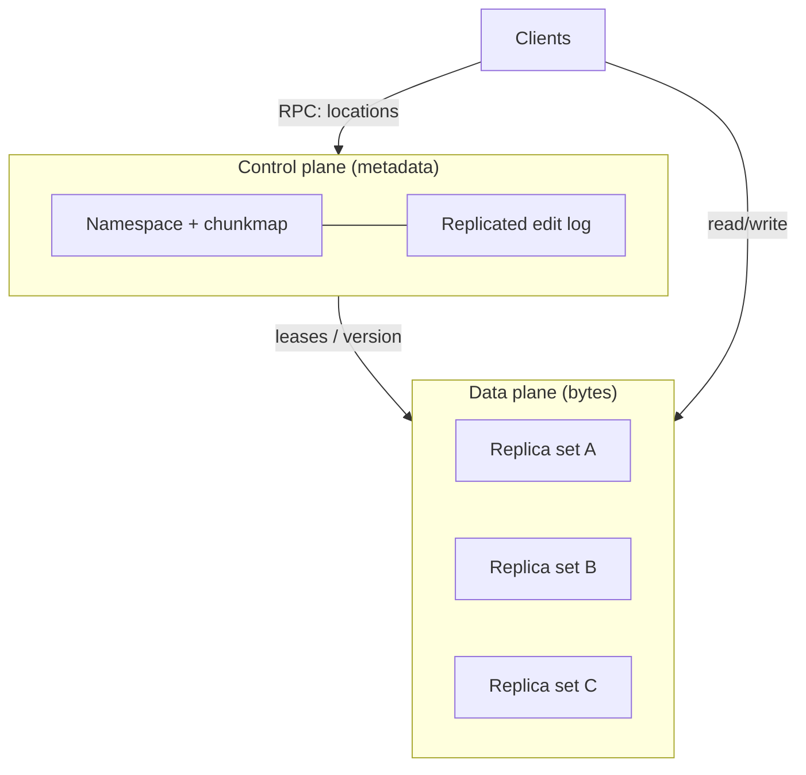
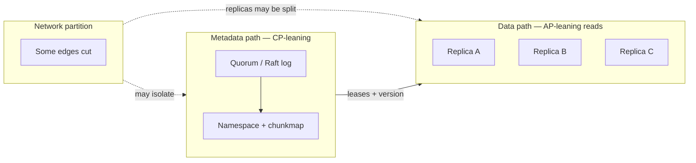
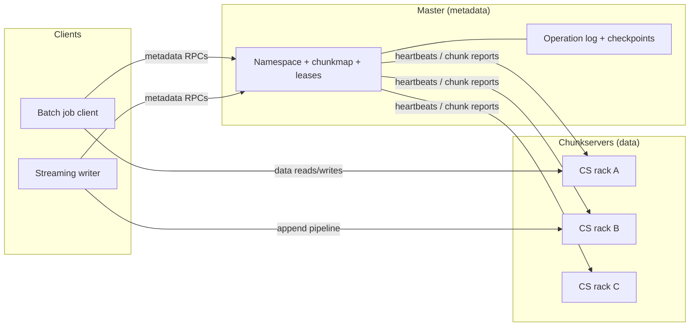
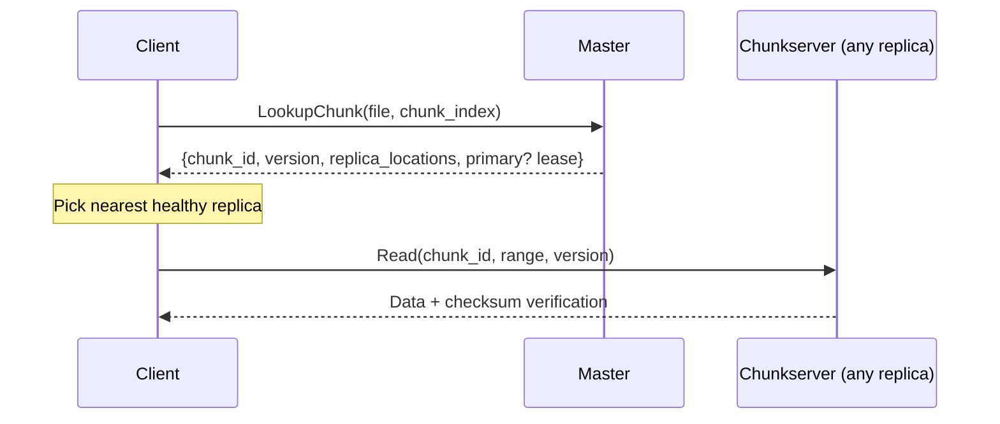
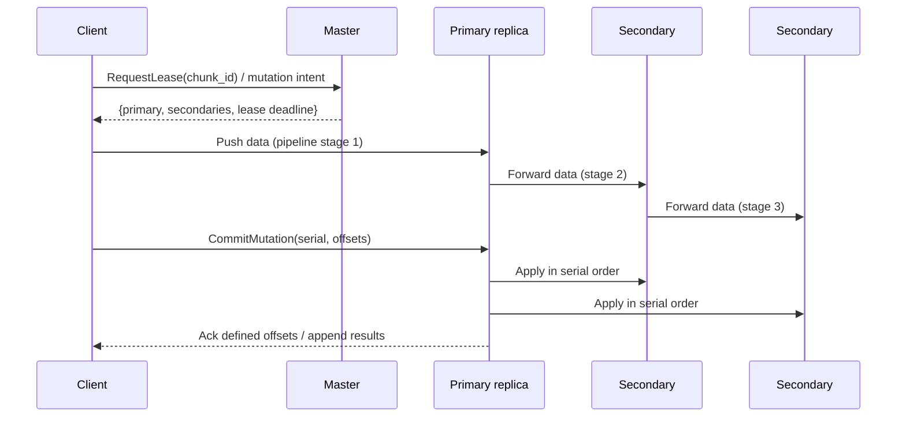
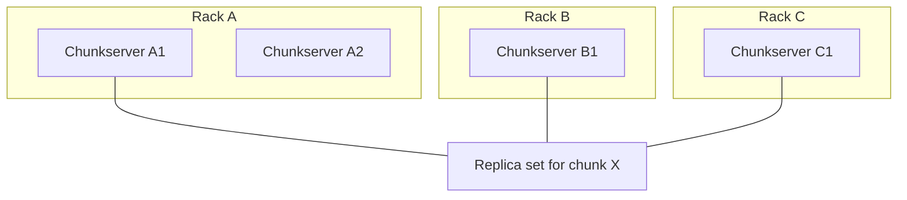
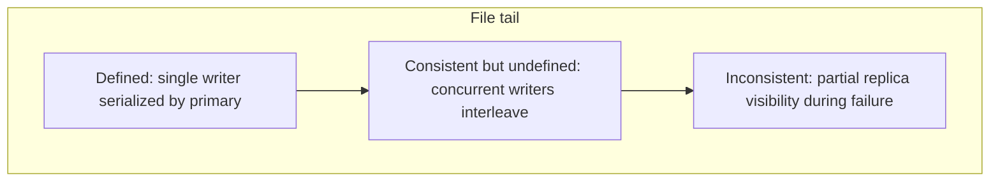

# Distributed File System (GFS / HDFS)
{: .no_toc }

<details open markdown="block">
  <summary>Table of contents</summary>
  {: .text-delta }
1. TOC
{:toc}
</details>

---

## What We're Building

We are designing a **distributed file system** in the spirit of **Google File System (GFS)**, **Hadoop Distributed File System (HDFS)**, or Google’s successor **Colossus**: a **cluster-scale** store that spreads **petabytes to exabytes** of data across **thousands of commodity machines**, exposes a **POSIX-like** (often relaxed) file abstraction to **batch analytics**, **search indexes**, **ML training pipelines**, and **data lakes**, and hides **disk failures**, **machine failures**, and **network partitions** behind **replication**, **checksums**, and **background repair**.

| Capability | Why it matters |
|------------|----------------|
| **Huge aggregate throughput** | MapReduce-like workloads read/write sequentially at disk bandwidth across the cluster |
| **Fault tolerance on cheap hardware** | Commodity disks and NICs fail daily at scale; the system must mask failures without operator heroics |
| **Simple consistency for append-heavy workloads** | Many big-data pipelines **append** logs and **read** in bulk; relaxing POSIX enables simpler, faster protocols |
| **Centralized metadata for fast lookups** | A **single logical master** (or small HA group) keeps **all namespace and chunk mappings in RAM** for microsecond-scale decisions |

### Real-World Scale (Illustrative)

| Ecosystem | Scale signal | Takeaway |
|-----------|--------------|----------|
| **Google (GFS era → Colossus)** | **Exabytes** under management; thousands of chunkservers per cell | Proves **single-master + chunkservers** at planetary scale with careful sharding of the *metadata layer* in later systems |
| **Facebook / Yahoo Hadoop clusters (historical)** | **100+ PB** HDFS deployments; tens of thousands of nodes | Validates **HDFS NameNode + DataNodes** for web-scale batch analytics |
| **Public cloud data lakes** | **EB-scale** object + file abstractions (often layered) | DFS ideas appear in **disaggregated storage** and **tiered** cold archives |

{: .note }
> Interview framing: you are not building **Dropbox for users** (sync, fine-grained ACL UX) but **infrastructure storage** for **sequential reads/writes**, **batch jobs**, and **append-heavy logs**—unless the interviewer explicitly expands scope.

### Why Distributed File Systems Matter for Big Data

1. **Disk bandwidth scales horizontally:** One machine might sustain **hundreds of MB/s** sequential read; **10,000** disks in parallel approach **TB/s** aggregate—**if** you avoid central bottlenecks and hot spots.
2. **Co-location of compute and storage (traditional Hadoop):** Map tasks read **local replicas** when possible, cutting cross-rack traffic (trade-off: elasticity vs locality in cloud-era designs).
3. **A shared namespace simplifies pipelines:** Producers write **partitioned files**; consumers run SQL/Spark/Beam jobs against stable paths and generation markers.
4. **Replication + checksums → durability:** Three copies plus **scrubbing** yields **practical** 11-nines-class stories for well-operated fleets (always tie claims to **replication, repair, and verification**).

{: .tip }
> If asked “**Why not just use object storage (S3)?**” — answer with **latency**, **mutation patterns** (append, hflush semantics), **directory listing**, **lease-based writes**, and **HDFS ecosystem integration**—not a false dichotomy; many systems **compose both**.

---

## Key Concepts Primer

### Master–Chunk Architecture: Separate Metadata from Data

**Pattern:** One **logical master** holds **namespace + file→chunk mappings + chunk replica locations**; **many chunkservers** hold **actual bytes** in large **chunks** (blocks).

| Split | Responsibility | Rationale |
|-------|----------------|-----------|
| **Master** | Directories, permissions (product-dependent), **which chunk IDs** compose a file, **where replicas live** | Keeps hot metadata in **memory**; avoids per-IO disk seeks on the control plane |
| **Chunkservers** | Store chunk bytes, serve reads/writes, **verify checksums** | Data plane scales **linearly** with machines and disks |

{: .warning }
> A **single active master** is a **design trade-off**, not a law of physics. **GFS assumed** careful client caching + batch workloads; **HDFS NameNode HA** uses **JournalNodes + ZKFC**; **Colossus** shards metadata. Name the evolution in depth interviews.

**Why separate metadata from data?**

- **Memory vs disk latency:** Walking a directory tree and mapping `file → [(chunk_handle, version)]` should be **RAM-fast**; reading **multi-MB chunks** should stream from **disk/network** without involving the master on every byte.
- **Failure isolation:** Chunkservers can churn without rewriting the namespace; the master **re-replicates** under-replicated chunks.
- **Different scaling curves:** Metadata grows with **file count** and **chunk count**; throughput grows with **disk count**.

### Chunks / Blocks: Fixed-Size Units

| System | Typical chunk / block size | Notes |
|--------|----------------------------|-------|
| **GFS (classic paper)** | **64 MB** | Large chunks reduce metadata volume |
| **HDFS** | **128 MB** default (configurable) | Tunable per deployment; small files still a challenge |

**Why large chunks?**

1. **Amortize metadata:** Fewer chunks per TB means **smaller** in-memory maps and **fewer** master mutations for a given dataset.
2. **Amortize client–master chatter:** Clients **cache** locations; large chunks mean **fewer** location lookups per GB transferred.
3. **Sequential IO patterns:** Big-data workloads favor **long scans**; large chunks align with **full-stripe** reads.

**Costs:** **Small files** waste space (internal fragmentation) and stress metadata; production systems add **packing**, **concatenation**, **HAR files**, or **federated namespaces** to mitigate.

### Write-Once-Read-Many (WORM) and Append-Heavy Workloads

GFS-style systems often assume **sequential writes**, **appends**, and **large reads**; **random writes** within a chunk may be limited, expensive, or disallowed depending on product.

**Why append-heavy workloads simplify consistency:**

- **Single-writer append** to a chunk reduces **fine-grained locking** across offsets.
- **Primary-based ordering** for mutations gives a **clear serialization point** among replicas.
- **Readers** typically see **immutable** past bytes; **in-flight** tail regions may have **relaxed** guarantees (see **record append**).

### Replication: 3-Way and Rack Awareness

**Default replication factor** \(N = 3\): tolerate **single** component failures with margin.

**Rack-aware placement (conceptual goals):**

| Goal | Placement sketch |
|------|------------------|
| **Durability** | Not all replicas on one rack |
| **Bandwidth** | Prefer **local** or **same-rack** reads |
| **Write pipeline** | Chain **forwarding** across racks without saturating uplinks |

{: .note }
> HDFS exposes **rack awareness** via **topology scripts**; interviews expect you to articulate **splitting replicas across failure domains**.

### Consistency Model: Relaxed but Intentional

GFS defines **file region state** after mutations—**consistent** vs **defined** regions matter for **concurrent writers** and **record append**.

| Term (GFS paper intuition) | Meaning (high level) |
|-----------------------------|----------------------|
| **Consistent** | All readers see the same data |
| **Defined** | Consistent **and** what a mutation writer wrote is visible **in full** |
| **Undefined / inconsistent** | Concurrent writers interleave unpredictably in a region |

**Record append** may introduce **duplicate records** at **at-least-once** delivery semantics; **consumers must tolerate duplicates** (e.g., **idempotent** processing, **dedup keys**).

### Leases and Mutation Ordering

**Primary lease:** The master grants **one chunkserver** the role of **primary** for a lease period; the **primary serializes** mutation order to **secondaries**.

**Serial numbers:** The primary assigns **consecutive serial numbers** to mutations so secondaries apply **the same order**.

**Why leases?** They reduce master load (vs per-mutation coordination) while enabling **timeouts** and **failover** if the primary stalls.

### Garbage Collection: Lazy vs Immediate

**Deletion** is often **lazy**:

1. **Client** deletes file → master records **metadata deletion** quickly.
2. **Chunks** become **unreferenced** asynchronously; a **GC** pass reclaims storage on chunkservers.

**Contrast with immediate deletion:** Pros: faster space recovery; Cons: **complex** with **partial failures** and **in-flight writes**.

**Snapshots** often leverage **copy-on-write (COW)** at the chunk level: mark **reference counts** / **derivation** so reads see a frozen generation without duplicating all bytes immediately.

### Systems at a Glance (GFS / HDFS / Colossus)

| Dimension | **GFS (2003 paper)** | **HDFS (Apache)** | **Colossus (successor spirit)** |
|-----------|----------------------|-------------------|----------------------------------|
| **Control plane** | Single **primary master** + **shadows** | **Active/Standby NameNode**, **QJM** edit log | **Sharded** control plane; **Borg**-scale operations |
| **Chunk / block size** | **64 MB** default | **128 MB** default (configurable) | **Smaller** objects + **EC** in many tiers |
| **Consistency** | **Relaxed**; **record append** semantics | **Single-writer** + **reader** visibility rules; **append** via APIs | Product-specific; still **infrastructure-grade**, not POSIX-for-all |
| **Replication** | **3×** typical | **3×** default; **EC** policies | Heavy **EC** + **tiering** |
| **Client model** | Thick library; **master** off hot path for bytes | **HDFS client** protocol | Internal + **disaggregated** consumers |



{: .note }
> **Colossus** is not “GFS with bigger disks”—interviewers reward acknowledging **metadata sharding**, **erasure coding**, and **multi-tenant** isolation as **second-generation** lessons.

### Small-File Tax (Interview Landmine)

If **average file size** is **KB** scale while chunks are **128 MB**, **most chunks are empty or nearly empty** from a utilization standpoint unless **packed**. Symptoms:

| Symptom | Root cause | Mitigations |
|---------|------------|-------------|
| **NameNode RAM** spikes | One inode/dir entry per tiny file | **Archive** formats, **bundle** small objects, **federation** |
| **Block reports** grow | Many block entries | **Compaction** policies; **object store** offload for tiny blobs |
| **List / scan** slow | Directory fan-out | **Partitioning** by key prefix; **catalog** services (Hive metastore, Glue) |

{: .warning }
> Always ask the interviewer about **file size distribution**—DFS math **changes completely** when the tail is **small files**.

---

## Step 1: Requirements

### Functional Requirements

| ID | Requirement | Notes |
|----|-------------|-------|
| F1 | **Create / delete** files and directories | Namespace operations are **master-owned** |
| F2 | **Open / read** byte ranges | Clients locate chunks, then read **from replicas** |
| F3 | **Write / append** | **Primary-based** ordering; **record append** for many producers |
| F4 | **Concat / snapshot** (system-dependent) | Illustrative: **snapshot** entire directory trees for checkpointing pipelines |
| F5 | **Namespace management** | Paths, permissions model (simplified in many internal systems) |
| F6 | **Administrative** | **Add** chunkservers; **drain** nodes; **rebalance** |

### Non-Functional Requirements

| Dimension | Target (illustrative) | Rationale |
|-----------|------------------------|-----------|
| **Scale** | **100+ PB** per large deployment; **billions** of files | Metadata must remain tractable via **chunk sizing** + **federation** |
| **Aggregate throughput** | **> 10 GB/s** cluster ingest/egress (often **much higher** at hyperscale) | Parallel pipelines; avoid single-link bottlenecks |
| **Availability** | **99.99%** for metadata service (with HA) | Many batch jobs tolerate **brief** pauses; **SLA** wording matters |
| **Durability** | **Replication + scrubbing** | Bitrot detection via **checksums** |
| **Fault tolerance** | Tolerate **disk**, **node**, **rack** failures | **Domain-aware** replica placement |
| **Commodity hardware** | No reliance on **specialized SAN** | Expect **failures daily** |

{: .warning }
> Be explicit: **POSIX** guarantees are **not** full; **fsync**, **atomic rename**, **O_EXCL** semantics may differ—tie answers to **HDFS/GFS** realities.

### API Sketch (Conceptual)

| Operation | Behavior |
|-----------|----------|
| `create(path)` | Allocate inode-like metadata; may **stripe** future chunks |
| `open(path)` | Return **file id** / **generation** |
| `read(file, offset, len)` | **Chunk index** selection + **replica** read |
| `write(file, offset, buf)` | **Primary/secondary** protocol for ranged writes (if supported) |
| `record_append(file, buf)` | **At-least-once** append records |
| `delete(path)` | **Metadata** delete; **lazy** chunk GC |
| `snapshot(path)` | **COW** metadata + chunk graph |

---

### Technology Selection & Tradeoffs

Metadata, data layout, consistency, and namespace shape are **not independent**—they determine **RAM ceilings**, **repair cost**, and **what apps must assume**. Interviewers expect you to **name alternatives** and **justify a coherent stack**.

#### Metadata storage

| Approach | How it works | Strengths | Weaknesses |
|----------|----------------|-----------|------------|
| **Single active master + shadows / standby (GFS-style)** | One process serves mutations; **warm** replicas replay **edit log** | Simple mental model; **microsecond** in-memory path lookups | **Vertical** scale limit; failover must **fence** old primary |
| **Distributed metadata service (Ceph monitors, sharded Colossus)** | **Quorum** or **sharded** partitions own **slices** of namespace | Horizontal scale; smaller **blast radius** per shard | **Cross-shard** ops (rename across shards) cost **latency** and **protocol** complexity |
| **Raft-replicated state machine (small HA cluster)** | **3f+1** nodes run **consensus** on metadata log | **Strong** durability + **linearizable** metadata updates (within shard) | **Leader** bottleneck per shard; **watch** quorum latency on every commit |

**Why it matters:** Metadata is **small per op** but **hot**; wrong choice shows up as **edit log stalls** or **RAM cliffs** at billion-file scale.

#### Data storage

| Approach | How it works | Strengths | Weaknesses |
|----------|----------------|-----------|------------|
| **Chunkservers + full replication (factor N)** | Each chunk stored **N** times on different failure domains | **Fast** recovery (read from peer); simple reads | **N×** disk cost; **N×** repair traffic |
| **Erasure coding (RS, LRC, …)** | Chunks split into **k+m** fragments; **m** failures tolerated | **~1.3–1.6×** overhead vs **3×** replication for cold data | **Rebuild** eats **CPU + cross-rack bandwidth**; not ideal for **latency-sensitive** hot paths |
| **Hybrid (hot replicated, cold EC)** | Policy moves **warm** data to **replica** tier and **cold** to **EC** | Balances cost and **SLA** per access class | **Tiering** jobs + **layout** complexity; apps see **variable** tail latency on cold |

**Replication factor** trades **durability vs cost**: \(P(\text{loss}) \approx P(\text{correlated failures})^{\text{effective copies}}\) only if placement is **uncorrelated**—interviews reward saying **rack/zone** diversity explicitly.

#### Consistency model

| Layer | Typical choice | Rationale |
|-------|----------------|-----------|
| **Metadata** | **Strong** (linearizable per path/inode within a shard) | **Lost updates** to namespace are unacceptable; **directory** races confuse every consumer |
| **Chunk locations / leases** | **Strong** at master + **versioned** invalidation | Clients must agree on **primary** and **epoch**; stale caches cause **silent divergence** |
| **Data bytes on replicas** | **Eventual** convergence **behind** primary ordering | Throughput wins; **primary serializes** mutations; **secondaries** catch up in **defined** order |
| **Cross-chunk / cross-file** | **No ACID** in classic DFS | **POSIX** transactions omitted for scale; **higher layers** add **exactly-once** if needed |

**Teaching point:** **Strong metadata + ordered replication** is how you get **predictable** failure stories without **distributed transactions** on every byte.

#### Namespace shape

| Model | Examples | Strengths | Weaknesses |
|-------|----------|-----------|------------|
| **Hierarchical (POSIX-like tree)** | GFS, HDFS paths | Familiar to apps; **prefix** listing | **Hot directories**; deep trees stress **metadata** |
| **Flat + application prefixes** | Some object-style layouts | Simple sharding by **hash** | Weak **directory** UX unless **layered** index |
| **Object-style (bucket/key)** | S3 mental model | Easy to **partition** by key | Not a drop-in for **Hadoop** path semantics |

{: .note }
> **Federation** (multiple roots) is often a **namespace** scaling tactic: split **tenants** or **datasets** across **independent** masters with a **router** (e.g., ViewFS-style).

#### Our choice

For this guide’s **analytics / data-lake** framing:

- **Metadata:** **Raft-backed** (or **QJM**) **highly available** logical master **per namespace shard**, starting from **single-shard** clarity in the interview, with a **clear migration** story to **sharding** when inode count grows.
- **Data:** **Chunkservers** with **3× replication** on **rack-aware** placement for **interactive** and **pipeline** hot paths; **erasure coding** for **cold** volumes to cut **TCO**, with **explicit** rebuild **budgets**.
- **Consistency:** **Linearizable metadata** + **primary-based** per-chunk **mutation order**; **record-append** semantics **documented** (duplicates possible).
- **Namespace:** **Hierarchical paths** for ecosystem compatibility, with **quota** and **federation** called out as **scale levers**.

**Rationale:** This bundle matches **how HDFS/GFS-class systems actually ship**—optimize for **throughput**, **operable** failure modes, and **honest** app contracts, then **evolve** toward **Colossus-style** sharding and **EC** as the org’s **metadata** and **cost** limits bite.

---

### CAP Theorem Analysis

**CAP** (choose **two** of **C**onsistency, **A**vailability, **P**artition tolerance) is best applied **per subsystem** in a DFS: **one global CAP label** misleads.

| Subsystem | Partition in the wild | Desired posture | Why |
|-----------|------------------------|-------------------|-----|
| **Metadata service (namespace, chunkmap)** | Loss of **ZooKeeper / quorum journal** connectivity | **CP**-leaning: **sacrifice availability** of writes rather than **split-brain** two active masters | **Two writers** to namespace → **unrecoverable** corruption; **brief** read-only is acceptable in many batch stacks |
| **Chunk data plane** | Rack **partition** isolates some replicas | **AP**-leaning: **serve reads** from **any** **up-to-date** replica; **writes** pause until **primary** is **knowable** | **Throughput** and **durability** beat **single-site** strong consistency across **all** bytes |
| **Client caches** | Stale **location** cache | **Eventual**: accept **stale** until **version mismatch** → **refresh** | Explicit **version/epoch** turns “**eventually**” into **detectable** staleness |

**Per-component breakdown:**

- **Master / metadata quorum:** Prioritize **consistent** view of **paths** and **chunk ownership**. During **split-brain risk**, **fencing** + **no dual active** → **availability** hit is **intentional**.
- **Primary + secondaries:** **Consistency** within a chunk is **linearizable** via **primary order**; **across** chunks there is **no** global order—**P** is tolerated at **cluster** level.
- **Cross-datacenter:** Often **async** replication → **C** weakens for **DR** copies; **interview** answer: **metadata sync** may be **strong inside cell**, **async** across cells for **bandwidth**.



{: .tip }
> **Interview sound bite:** “We’re **CP** on **metadata** so we never fork the namespace; we’re **AP-oriented on bulk data** because **replicas + primary ordering** give us **durability** without **global transactions**.”

---

### SLA and SLO Definitions

SLAs are **external promises** (often **contractual**); **SLOs** are **internal** targets with **error budgets**. For a **cluster DFS**, state **scope** (single cell vs global) and **workload** (batch vs interactive).

#### Service tiers (illustrative)

| Tier | Users | Emphasis |
|------|---------|----------|
| **Metadata API** | All clients | **Low** tail latency, **high** correctness |
| **Data read/write** | Tasks, pipelines | **Throughput**, **sequential** bandwidth |
| **Admin / recovery** | Operators | **Bounded** repair time, **predictable** blast radius |

#### SLO examples (adjust numbers in interview)

| SLO | Target | Measurement window | Notes |
|-----|--------|--------------------|-------|
| **Read latency (p50 / p99)** | **Under 5 ms / under 50 ms** same-rack sequential chunk read | **Rolling 30 days** | Excludes **cross-region**; **cold** EC tail may be **higher**—split SLO by **tier** |
| **Write / append ack (p99)** | **Under 100 ms** intra-cell | **Rolling 30 days** | Dominated by **pipeline** + **disk**; **record append** may **batch** |
| **Metadata RPC (p99)** | **Under 10 ms** for lookup / lease | **Rolling 30 days** | **Spikes** often mean **GC**, **HA** failover, or **hot** directory |
| **Data durability** | **99.999999999%** (11 nines) **annual** object survival | **Yearly** | **Justify** with **3× replication + scrubbing + MTTR**—not magic; **backups** for **metadata** |
| **Metadata durability** | **No silent loss** of committed namespace; **RPO** **near zero** for edit log | Per incident | **QJM/Raft** **fsync** policy matters |
| **Availability (data plane reads)** | **99.9%–99.99%** monthly | **Monthly** | **Planned** maintenance windows **excluded** or **budgeted** separately |
| **Availability (metadata writes)** | **99.95%+** with HA | **Monthly** | **Failover** seconds; **degraded** mode may be **read-only** |
| **Cluster aggregate throughput** | **≥ X GB/s** sustained **read** under **normal** load | **Weekly peak** | Capacity **planning** SLO, not a **single-RPC** metric |

{: .warning }
> **11 nines** for **bytes** is a **design story** (replication, **anti-correlation**, **scrubbing**, **repair**), not a **single formula**. Tie **durability** SLO to **measurable** inputs: **replica count**, **MTTR**, **bitrot** detection.

#### Error budget policy

| Element | Policy |
|---------|--------|
| **Budget** | **1 - SLO** per month (e.g., **99.99%** → **~4.32 min** bad metadata availability per month) |
| **Spend** | **Failover**, **GC pauses**, **slow disks** consume budget—track **burn rate** |
| **Gate releases** | If **burn** exceeds **2×** sustained, **freeze** risky changes; prioritize **reliability** work |
| **Degraded modes** | **Read-only metadata** may **preserve** **C** at **cost of A**—document as **acceptable** for **batch** |
| **Customer comms** | **SLA** credits only if **external** monitoring agrees; **internal** SLOs stricter |

{: .note }
> Separate **latency** SLOs for **interactive** SQL-on-HDFS vs **batch** MapReduce—same cluster, **different** expectations.

---

### Database Schema

The **master** is not always a **relational** DB, but **interview** answers are clearer with **normalized** tables. **Implementation** may be **custom in-memory** structures + **WAL**; the **schema** still guides **APIs** and **scaling**.

#### Entity relationships (conceptual)

- **One directory** has many **children** (files or subdirs).
- **One file** maps to an **ordered list of chunks** (by index).
- **One chunk** has **multiple replica rows** (locations + disk id + state).
- **Leases** attach to **chunk epoch** (optional separate table or columns on chunk).

#### 1) File metadata (`files` / inodes)

Structured to answer: **Who owns this path?** **How big?** **Which chunks?** **Which generation for cache invalidation?**

```sql
-- Illustrative DDL (PostgreSQL-style). Production masters often use custom stores + WAL.
CREATE TABLE files (
  file_id           BIGINT PRIMARY KEY,
  parent_inode_id   BIGINT NOT NULL,
  name              VARCHAR(4096) NOT NULL,
  is_directory      BOOLEAN NOT NULL DEFAULT FALSE,
  owner_uid         BIGINT NOT NULL,
  group_gid         BIGINT NOT NULL,
  permission_bits   INT NOT NULL,           -- unix-style rwx
  size_bytes        BIGINT NOT NULL DEFAULT 0,
  chunk_count       INT NOT NULL DEFAULT 0,
  replication_goal  SMALLINT NOT NULL DEFAULT 3,
  generation        BIGINT NOT NULL,        -- inode generation for open() validation
  created_at_ns     BIGINT NOT NULL,
  modified_at_ns    BIGINT NOT NULL,
  accessed_at_ns    BIGINT,
  UNIQUE (parent_inode_id, name)
);

CREATE INDEX idx_files_parent ON files (parent_inode_id);
```

| Column | Purpose |
|--------|---------|
| `generation` | Invalidates **stale** client handles after **delete/recreate** |
| `chunk_count` | **Denormalized** for fast stat; or **derive** from `file_chunks` |
| `replication_goal` | **Per-file** policy override (rare) vs **cluster default** |

#### 2) File → chunk mapping (`file_chunks`)

**Ordered** mapping **file → chunk index → chunk_id** (GFS/HDFS **logical block** list).

```sql
CREATE TABLE file_chunks (
  file_id     BIGINT NOT NULL REFERENCES files(file_id) ON DELETE CASCADE,
  chunk_index INT NOT NULL,      -- 0-based order in file
  chunk_id    BIGINT NOT NULL,
  PRIMARY KEY (file_id, chunk_index)
);

CREATE INDEX idx_file_chunks_chunk ON file_chunks (chunk_id);
```

#### 3) Chunk locations and version (`chunks`, `chunk_replicas`)

| Table | Answers |
|-------|---------|
| `chunks` | **Version**, **lease**, **primary**, **state** (under-replicated, etc.) |
| `chunk_replicas` | **Which disk** on **which server** holds a **replica** |

```sql
CREATE TABLE chunks (
  chunk_id           BIGINT PRIMARY KEY,
  version            BIGINT NOT NULL,       -- bumped on primary failover / repair
  lease_holder       VARCHAR(128),          -- chunkserver id of primary
  lease_epoch        BIGINT NOT NULL DEFAULT 0,
  lease_expiry_ns    BIGINT,
  expected_replicas  SMALLINT NOT NULL DEFAULT 3,
  state              VARCHAR(32) NOT NULL DEFAULT 'HEALTHY', -- HEALTHY, UNDER_REPLICATED, CORRUPT
  last_scrubbed_ns   BIGINT
);

CREATE TABLE chunk_replicas (
  chunk_id      BIGINT NOT NULL REFERENCES chunks(chunk_id) ON DELETE CASCADE,
  server_id     VARCHAR(128) NOT NULL,
  disk_id       VARCHAR(128) NOT NULL,
  replica_role  VARCHAR(16) NOT NULL,       -- PRIMARY, SECONDARY
  persistent_version BIGINT NOT NULL,       -- stored on disk; must match chunks.version for PRIMARY
  status        VARCHAR(16) NOT NULL DEFAULT 'LIVE', -- LIVE, STALE, DECOMMISSIONING
  PRIMARY KEY (chunk_id, server_id, disk_id)
);

CREATE INDEX idx_replicas_server ON chunk_replicas (server_id);
```

**Why separate replica rows:** **Placement**, **rack** diversity, and **decommission** are **per-replica** operations; **join** to `chunks` for **version** truth.

#### 4) Namespace tree (`directories` / path resolution)

Either **materialized path** (simple, bad for rename) or **inode tree** (used above with `parent_inode_id` + `name`).

```sql
-- Optional: fast path string index if product exposes full path as key (trade-off: rename cost)
CREATE TABLE path_index (
  path_hash     BYTEA PRIMARY KEY,
  file_id       BIGINT NOT NULL REFERENCES files(file_id)
);
```

**Interview trade-off:** **Inode tree** + `(parent, name)` **unique** → **O(depth)** rename in **directory** only; **path index** → faster **lookup** by **full path** but **rename** must **update subtree** (or **avoid** full path materialization).

#### Structured view (non-SQL)

```text
Inode {
  inode_id, parent_id, name, is_dir,
  attrs: { uid, gid, mode, size, mtime, ctime, generation }
}
FileChunks: ordered list { chunk_index -> chunk_id }
Chunk {
  chunk_id, version, lease { primary_id, epoch, expiry },
  replicas: [ { server_id, disk_id, role, on_disk_version, status } ]
}
```

{: .tip }
> Mention **checkpoint** + **edit log**: the **authoritative** order is **log append**; **tables** are **derived** state replayed for **fast startup**—same schema, **two** **persistence** paths.

---

## Step 2: Estimation

### Assumptions (Interview-Adjustable)

```
Cluster usable data (logical):     120 PB
Average chunk size:                128 MB  (HDFS default-class)
Replication factor N:              3
Average file size (analytics mix): 512 MB
Files are large; small-file problem acknowledged separately
Client read cache of chunk locations: minutes TTL
Network: 25 Gbps NICs common; core oversubscription varies
```

### Chunk Count

```
Bytes per chunk (unreplicated): 128 MB = 128 * 1024^2 B
Logical chunks: 120 PB / 128 MB ≈ 120 * 1024^5 / (128 * 1024^2)
              ≈ 1,005,829,000 chunks  (~1.0 trillion logical chunks)

With replication factor 3, physical chunk replicas ≈ 3 × logical chunks
(plus orphans before GC and transient over-replication during repair)
```

{: .note }
> **Trillions of chunks** push **single-master** designs; real systems use **sharded metadata** (Colossus) or **Federation** (multiple HDFS namespaces + **ViewFS**). Show you know **when** the model bends.

### Metadata Size on Master (Order of Magnitude)

Illustrative **per-chunk** metadata: chunk id, version, **3** replica locations (ids), lease epoch — **~hundreds of bytes** with pointers and indexes.

```
1e9 chunks × 256 B ≈ 256 GB  (purely illustrative; real structures differ)

1e12 chunks × 256 B ≈ 256 TB  (infeasible on one box — motivates sharding)
```

**Interview punchline:** Metadata **must** stay **RAM-resident** for hot paths; **compact structures**, **lazy loading** for cold paths, or **shard** the namespace.

### Network Bandwidth

```
Goal: > 10 GB/s aggregate read (illustrative lower bound)

10 GB/s ≈ 80 Gbps — requires parallel many-to-many flows across racks
Single TCP flow won't hit cluster totals; thousands of clients/chunkservers do

Repair traffic after node loss:
  If a node holds ~200 TB and replication factor 3, rebuild may involve
  reading ~2/3 of lost replicas from peers and writing to new thirds — rack-aware throttling matters
```

{: .tip }
> Tie bandwidth math to **backpressure**, **rebalance throttles**, and **QoS**: repair must not starve **foreground** jobs.

### Master RPC Rate (Illustrative)

Not every byte touches the master—only **metadata** and **lease** events. Order-of-magnitude sketch:

```
Assume 50,000 concurrent tasks each read 200 MB/s (hyperscale batch — illustrative)
Chunk size 128 MB → each task reads ~1,562 chunk reads / second (if perfectly sequential)

Per fresh chunk: one metadata lookup if cache cold
With 60s location TTL and sequential scans, cache hit rate can be very high

Writes: far fewer control RPCs than bytes/sec if writes are large and pipelined
Lease renewals: amortized per chunk per lease window (e.g., seconds–minutes)
```

| Metadata operation | Relative rate | Notes |
|--------------------|---------------|-------|
| **Chunk lookup** | High on **cold** scans | **Client cache** cuts dramatically |
| **Lease grant / renew** | Medium | **Primary** sticky when healthy |
| **Heartbeat** | Per chunkserver | **O(chunkservers)**, not **O(chunks)** |
| **Block report** | Periodic bulk | **Full** vs **incremental** reports |

{: .note }
> The **master is not a read-through cache for data**—prove you understand **which** events are **rare** vs **continuous**.

### Estimation Sanity Checks

| Check | Question to ask |
|-------|-----------------|
| **Metadata fits RAM?** | `chunks × bytes_per_mapping + inodes × cost` |
| **Cross-rack repair?** | `failed_capacity × (N-1)/N` read fan-out |
| **Uplink limits?** | **Pipeline** must not exceed **ToR** uplinks during **rebalance** |

---

## Step 3: High-Level Design

### Architecture (Mermaid)



**Roles:**

- **Master:** Namespace, **chunk → replica set**, **primary leases**, **replication**, **GC** coordination.
- **Chunkserver:** Stores **chunk replicas**, verifies **checksums**, participates in **write pipelines**.
- **Client:** Caches **immutable metadata** (with TTL), splits IO into **chunk operations**, **pushes data** along **pipelines** on writes.

### Read Path (Sequence)



### Write / Append Path (Sequence)



{: .note }
> **Data flow** is **pipeline**; **control** (ordering) is **primary-centered**. Separating **control** and **data** keeps the master off the hot path for bytes.

### Rack Topology and Replica Placement (Mermaid)



| Plane | Latency-sensitive? | Failure domain |
|-------|--------------------|----------------|
| **Control** | Yes for **metadata** | **Journal** quorum / **ZK** (HA stacks) |
| **Data** | Throughput-bound | **Disk**, **NIC**, **rack** |

### Control Plane vs Data Plane

| Path | Carries | Bottleneck symptom |
|------|---------|-------------------|
| **Control** | Namespace, mappings, leases | **Edit log** IOPS; **GC** of metadata |
| **Data** | Bulk bytes | **Disk** bandwidth; **network** bisection |
| **Mixed** | Rare mis-designs | Accidentally routing **reads** through master |

---

## Step 4: Deep Dive

### 4.1 Master Server Design

**Namespace:** An in-memory tree (often **path components → inode**, **inode → file metadata**) holding **permissions**, **generation**, **chunk list** or **chunk count** with **lazy** chunk handle allocation.

**Chunk mapping:** `chunk_id → {version, replicas[1..N], primary, lease_expiry, last_mutation_serial}`.

**Operation log + checkpoint:** Every **metadata mutation** appends to a **sequential log** (often replicated via **consensus** in HA systems). Periodic **checkpoints** snapshot the in-memory image to enable **truncation** of the log.

**Shadow masters (GFS-era):** **Warm standbys** replay the log to provide **read-mostly** access or fast **cutover**; exact modern HA differs (HDFS **QJM**).

```python
from __future__ import annotations

import json
import time
from dataclasses import dataclass, field
from pathlib import PurePosixPath
from typing import Dict, Iterable, List, Optional, Tuple


@dataclass
class INode:
    is_dir: bool
    children: Dict[str, int] = field(default_factory=dict)  # name -> inode id
    chunks: List[int] = field(default_factory=list)  # ordered chunk ids for files


@dataclass
class ChunkInfo:
    version: int
    replicas: List[str]  # chunkserver ids
    primary: Optional[str] = None
    lease_deadline_ms: float = 0.0


class OperationLog:
    """Append-only metadata log (illustrative; production needs fsync policy + replication)."""

    def __init__(self) -> None:
        self._entries: List[dict] = []

    def append(self, op: dict) -> int:
        self._entries.append(op)
        return len(self._entries) - 1

    def replay(self) -> Iterable[dict]:
        return list(self._entries)


class MasterState:
    """In-memory image + checkpoint hooks."""

    def __init__(self) -> None:
        self.inodes: Dict[int, INode] = {0: INode(is_dir=True)}  # "/" at inode 0
        self.next_inode = 1
        self.chunks: Dict[int, ChunkInfo] = {}
        self.next_chunk = 1
        self.log = OperationLog()

    def checkpoint(self) -> dict:
        return {
            "inodes": {k: v.__dict__ for k, v in self.inodes.items()},
            "chunks": {k: v.__dict__ for k, v in self.chunks.items()},
            "next_inode": self.next_inode,
            "next_chunk": self.next_chunk,
        }

    def restore_checkpoint(self, blob: dict) -> None:
        self.inodes = {int(k): INode(**v) for k, v in blob["inodes"].items()}
        self.chunks = {int(k): ChunkInfo(**v) for k, v in blob["chunks"].items()}
        self.next_inode = int(blob["next_inode"])
        self.next_chunk = int(blob["next_chunk"])

    def mkdir(self, path: str) -> None:
        parts = [p for p in PurePosixPath(path).parts if p != "/"]
        inode = 0
        for name in parts:
            node = self.inodes[inode]
            if name not in node.children:
                new_id = self.next_inode
                self.next_inode += 1
                self.inodes[new_id] = INode(is_dir=True)
                node.children[name] = new_id
                self.log.append({"op": "mkdir", "parent": inode, "name": name, "child": new_id})
            inode = node.children[name]

    def create_file(self, path: str, desired_chunks: int) -> None:
        parent_path, name = str(PurePosixPath(path).parent), PurePosixPath(path).name
        self.mkdir(parent_path)
        pinode = self._lookup(parent_path)
        if name in self.inodes[pinode].children:
            raise FileExistsError(path)
        fid = self.next_inode
        self.next_inode += 1
        self.inodes[fid] = INode(is_dir=False)
        self.inodes[pinode].children[name] = fid
        for _ in range(desired_chunks):
            cid = self.next_chunk
            self.next_chunk += 1
            self.inodes[fid].chunks.append(cid)
            self.chunks[cid] = ChunkInfo(version=1, replicas=[])
            self.log.append({"op": "add_chunk", "file": fid, "chunk": cid})
        self.log.append({"op": "create", "parent": pinode, "name": name, "inode": fid})

    def _lookup(self, path: str) -> int:
        inode = 0
        for part in [p for p in PurePosixPath(path).parts if p != "/"]:
            inode = self.inodes[inode].children[part]
        return inode
```

{: .tip }
> Interviews reward naming **checkpoint truncation**: after checkpoint, replay **only tail** log entries to rebuild state.

### 4.2 Chunk Management

**Creation:** When a file grows, the master **allocates** new chunk handles, picks **empty** chunkservers subject to **space** and **rack** constraints, installs **version=1**, and returns locations to clients.

**Re-replication:** On heartbeat loss or checksum failure, mark replica **stale**; schedule copy from a **good** replica to a **new** host; increment **version** on **lease/primary** changes as needed.

**Rebalancing:** Background scanner moves replicas **toward** utilization targets **without** breaking placement rules.

**Stale detection:** Chunkservers carry **persistent version**; if a replica reboots with an **old** disk, its version lags → master rejects or evicts.

```python
import heapq
import random
from typing import Dict, List, Set


class ChunkPlacementPolicy:
    """Simplified rack-aware replica picker."""

    def __init__(self, racks: Dict[str, List[str]]) -> None:
        self.racks = racks  # rack -> chunkservers

    def pick_replicas(self, n: int = 3) -> List[str]:
        racks = list(self.racks.keys())
        random.shuffle(racks)
        chosen: List[str] = []
        used_racks: Set[str] = set()
        for r in racks:
            if len(chosen) >= n:
                break
            if r in used_racks:
                continue
            server = random.choice(self.racks[r])
            chosen.append(server)
            used_racks.add(r)
        # fill remaining if racks < n by allowing additional from least loaded
        pool = [s for rs in self.racks.values() for s in rs]
        random.shuffle(pool)
        for s in pool:
            if len(chosen) >= n:
                break
            if s not in chosen:
                chosen.append(s)
        return chosen[:n]


class ReplicationTracker:
    def __init__(self) -> None:
        self.priority: List[Tuple[float, int]] = []  # (urgency desc, chunk_id) via min-heap trick
        self.chunk_min_replicas: Dict[int, int] = {}

    def under_replicated(self, chunk_id: int, current: int, target: int) -> None:
        if current < target:
            heapq.heappush(self.priority, (-(target - current), chunk_id))

    def schedule_work(self) -> Optional[int]:
        if not self.priority:
            return None
        _, cid = heapq.heappop(self.priority)
        return cid


def bump_version(info: ChunkInfo) -> None:
    info.version += 1
```

### 4.3 Write Path and Mutation Protocol

**Lease grant:** Master picks **primary** (often replica with **latest** version **and** healthy lease history) and sets **lease_deadline**.

**Data flow pipeline:** Client pushes **data** linearly **primary → secondary → tertiary** to **saturate** NICs without a star topology through one uplink.

**Primary ordering:** All mutations carry a **serial** assigned by the primary; secondaries **apply strictly** in that order.

**Record append:** Multiple clients append **records** (with padding/alignment); **defined** inter-record regions if **single writer** per region; **undefined** overlaps if **ranged writes** race—**consumers** must handle **duplicates** for append.

```python
from dataclasses import dataclass
from typing import Dict, List, Optional


@dataclass
class Mutation:
    serial: int
    kind: str  # "write" | "record_append"
    offset: Optional[int]
    length: int


class PrimaryChunk:
    def __init__(self, secondaries: List[str]) -> None:
        self.secondaries = secondaries
        self.next_serial = 1
        self.log: List[Mutation] = []

    def assign_serial(self, m: Mutation) -> int:
        m.serial = self.next_serial
        self.next_serial += 1
        self.log.append(m)
        return m.serial

    def commit_order(self) -> List[Mutation]:
        return sorted(self.log, key=lambda x: x.serial)


def pipeline_push(stages: List[str], payload: bytes) -> None:
    """Illustrative name-only pipeline; real stack uses backpressure + credit windows."""
    for i, stage in enumerate(stages):
        # send payload to stage (simulated)
        _ = (stage, len(payload), i)


def client_record_append(primary: PrimaryChunk, size: int) -> int:
    m = Mutation(serial=0, kind="record_append", offset=None, length=size)
    serial = primary.assign_serial(m)
    return serial
```

{: .warning }
> **Record append** can **duplicate** entire records on retries; **idempotent** processing is **application-level**.

### 4.4 Read Path

**Lookup:** Client asks master for `(chunk_id/version, replica set)` **if** cache miss.

**Nearest replica:** Choose **same machine** (if co-located), **same rack**, then **remote rack**—often via **topology distance** APIs.

**Client cache:** Cache **immutable** `(chunk_id, version) → locations` for **~minutes**; on **error** or **version mismatch**, refresh from master.

```python
from dataclasses import dataclass
from typing import Dict, List, Optional, Tuple


@dataclass
class ChunkLocationCache:
    ttl_s: float
    _entries: Dict[Tuple[int, int], Tuple[float, List[str]]] = None

    def __post_init__(self) -> None:
        self._entries = {}

    def get(self, chunk_id: int, version: int, now: float) -> Optional[List[str]]:
        loc = self._entries.get((chunk_id, version))
        if not loc:
            return None
        ts, servers = loc
        if now - ts > self.ttl_s:
            return None
        return servers

    def put(self, chunk_id: int, version: int, servers: List[str], now: float) -> None:
        self._entries[(chunk_id, version)] = (now, servers)


def pick_nearest_replica(replicas: List[str], topology_distance) -> str:
    return sorted(replicas, key=lambda r: topology_distance(r))[0]


def read_range(client_cache: ChunkLocationCache, master_fetch, chunk_id: int, version: int, now: float) -> bytes:
    locs = client_cache.get(chunk_id, version, now)
    if locs is None:
        locs = master_fetch(chunk_id)
        client_cache.put(chunk_id, version, locs, now)
    target = locs[0]
    # read bytes from target with checksum verification at 64KB boundaries
    return f"data-from-{target}".encode()
```

### 4.5 Fault Tolerance

**Chunkserver failure:** Detected via **missed heartbeats**; master **marks replicas unavailable**, **schedules re-replication** for **affected** chunks.

**Master failover:** **Highly available** deployments use **quorum journals** (e.g., HDFS **QJM**) or **consensus** for the edit log; **standby** applies log entries; **fencing** prevents **split-brain** primaries.

**Data integrity:** **Checksums** per **64 KB** (GFS paper) stored **separately** from data; **read** verifies; **scrubbers** periodically detect **bitrot**.

```python
import hashlib
import hmac
import time
from dataclasses import dataclass
from typing import Dict, Iterable, List, Tuple


BLOCK = 64 * 1024


def crc32_block(data: bytes) -> int:
    import zlib

    return zlib.crc32(data) & 0xFFFFFFFF


def chunk_checksum_table(data: bytes) -> List[Tuple[int, int]]:
    return [(i // BLOCK, crc32_block(data[i : i + BLOCK])) for i in range(0, len(data), BLOCK)]


@dataclass
class ChunkServer:
    chunks: Dict[int, bytes]
    last_heartbeat_ms: float

    def heartbeat(self, now_ms: float) -> None:
        self.last_heartbeat_ms = now_ms

    def verify_read(self, chunk_id: int, offset: int, length: int) -> bytes:
        blob = self.chunks[chunk_id]
        segment = blob[offset : offset + length]
        # verify only touched blocks
        for i in range(offset - offset % BLOCK, offset + length, BLOCK):
            blk = blob[i : i + BLOCK]
            _ = crc32_block(blk)
        return segment


class MasterMonitor:
    def __init__(self, timeout_ms: float) -> None:
        self.timeout_ms = timeout_ms
        self.servers: Dict[str, ChunkServer] = {}

    def register(self, cs_id: str, cs: ChunkServer) -> None:
        self.servers[cs_id] = cs

    def failed_servers(self, now_ms: float) -> List[str]:
        return [sid for sid, cs in self.servers.items() if now_ms - cs.last_heartbeat_ms > self.timeout_ms]


def replay_log_for_failover(entries: Iterable[dict]) -> List[dict]:
    """Standby applies deterministic ops; fencing token checks omitted for brevity."""
    state = []
    for e in entries:
        state.append(e)
    return state
```

### 4.6 Consistency Model

**Defined vs undefined regions** (GFS paper intuition):



**Concurrent mutations:** Two writers **without coordination** may produce **interleaved** bytes in overlapping ranges → **undefined** for those offsets.

**Record append guarantees:** **At-least-once** delivery of **whole records** often, but **duplicates** after timeouts; **pads** align chunk boundaries.

**Application implications:** Use **record-oriented** formats with **checksums**, **unique record ids**, **idempotent sinks**, or **two-phase commit** at **higher layers** if needed.

| Scenario | Typical outcome |
|----------|-----------------|
| **Single writer sequential writes** | **Defined** regions after successful commits |
| **Concurrent writers same region** | **Undefined** interleaving |
| **Record append from many clients** | Records **atomically** appended **per successful ack**, but **duplicates** on retry |

{: .note }
> Draw the distinction between **client-visible consistency** and **cross-service transactions** — DFS does **not** hide all races for arbitrary byte ranges.

### 4.7 Garbage Collection and Snapshots

**Lazy GC:** After `delete`, chunks may **linger** until **mark/sweep** identifies **no** live file references.

**COW snapshots:** Snapshot creation **freezes** namespace generation; new writes **fork** chunks on mutation **or** maintain **reference counts** sharing immutable tail.

**Orphan detection:** Chunkservers report **hosted** chunk ids; master **subtracts** known live set → **orphans** deleted.

```python
from dataclasses import dataclass, field
from typing import Dict, Set


@dataclass
class ReferenceGraph:
    chunk_refcount: Dict[int, int] = field(default_factory=dict)

    def link(self, chunk_id: int) -> None:
        self.chunk_refcount[chunk_id] = self.chunk_refcount.get(chunk_id, 0) + 1

    def unlink(self, chunk_id: int) -> None:
        self.chunk_refcount[chunk_id] -= 1
        if self.chunk_refcount[chunk_id] == 0:
            del self.chunk_refcount[chunk_id]

    def live_chunks(self) -> Set[int]:
        return set(self.chunk_refcount.keys())


class GarbageCollector:
    def __init__(self, graph: ReferenceGraph) -> None:
        self.graph = graph

    def sweep(self, hosted_on_servers: Set[int]) -> Set[int]:
        orphans = hosted_on_servers - self.graph.live_chunks()
        return orphans


@dataclass
class Snapshot:
    id: str
    root_inode: int


def cow_on_write(snapshot: Snapshot, inode: int, offset: int) -> str:
    """Illustrative hook: duplicate chunk on first write after snapshot."""
    return f"fork-{snapshot.id}-{inode}-{offset}"
```

### 4.8 Lease Renewal, Primary Failover, and Fencing Tokens

**Lease renewal:** Clients / primaries request **extensions** before expiry; master **extends** `lease_deadline` if the **primary** is still **authoritative** for `chunk_version`.

**Failover:** If the primary dies, the master **increments chunk version**, picks a **new** primary among survivors with **latest** persistent state, and **invalidates** old leases—**clients** must **refresh** mappings.

**Fencing:** Secondaries must **reject** stale primaries. A compact pattern is **monotonic epoch** per chunk carried on **every** mutation.

```python
from dataclasses import dataclass
from typing import Dict, Optional, Tuple


@dataclass
class LeaseRecord:
    chunk_id: int
    primary: str
    epoch: int  # bumped on primary change / failover
    deadline_ms: float


class MasterLeases:
    def __init__(self) -> None:
        self._leases: Dict[int, LeaseRecord] = {}

    def grant(self, chunk_id: int, primary: str, now_ms: float, ttl_ms: float) -> LeaseRecord:
        prev = self._leases.get(chunk_id)
        epoch = (prev.epoch + 1) if prev and prev.primary != primary else (prev.epoch if prev else 1)
        lr = LeaseRecord(chunk_id=chunk_id, primary=primary, epoch=epoch, deadline_ms=now_ms + ttl_ms)
        self._leases[chunk_id] = lr
        return lr

    def renew(self, chunk_id: int, primary: str, now_ms: float, ttl_ms: float) -> Optional[LeaseRecord]:
        cur = self._leases.get(chunk_id)
        if not cur or cur.primary != primary:
            return None
        cur.deadline_ms = now_ms + ttl_ms
        return cur


class ChunkReplica:
    def __init__(self, server_id: str) -> None:
        self.server_id = server_id
        self.accepted_epoch: Dict[int, int] = {}

    def apply_mutation(self, chunk_id: int, epoch: int, serial: int, payload: bytes) -> Tuple[bool, str]:
        last = self.accepted_epoch.get(chunk_id, -1)
        if epoch < last:
            return False, "stale-primary"
        self.accepted_epoch[chunk_id] = max(last, epoch)
        # apply serial ordering within epoch (omitted)
        return True, "ok"


def client_must_refresh_lease(exc: Exception) -> bool:
    """Translate lease loss / version mismatch into cache invalidation."""
    return "stale-primary" in str(exc) or "version" in str(exc).lower()
```

{: .tip }
> In **HDFS HA**, add **JournalNodes** / **QJM** details; in **GFS**, cite **shadow masters**—both aim for **durability of metadata** and **deterministic** recovery stories.

---

## Step 5: Scaling & Production

### From GFS to Colossus (Conceptual Evolution)

| Era | Emphasis | Notes |
|-----|----------|-------|
| **GFS** | Single master, 64 MB chunks, primary leases | Simple, **metadata** bottleneck appears at **very large** file counts |
| **Colossus** | **Sharded** metadata, **erasure coding**, **fine-grained** chunking | Better **storage efficiency** and **control plane** scale |
| **HDFS EC** | Reed–Solomon **erasure coding** | Reduces **storage overhead** vs **3x replication** for cold data |

### Failure Handling and Blast Radius

- **Limit** repair traffic; **rack-aware** placement reduces **correlated** loss.
- **Decommission** nodes gracefully: **drain** replicas first.
- **Rolling** upgrades: **version** compatibility in RPC protocols.

### Capacity Planning (What SREs Actually Model)

| Input | Drives |
|-------|--------|
| **Raw disk** per rack | **Maximum** chunkserver residency |
| **Reserved** space for **compaction / temp** | Avoid **false full** during **rebalance** |
| **Replication / EC** policy | **Effective** usable vs **logical** user bytes |
| **Repair bandwidth budget** | How fast **MTTR** after **rack** loss |
| **Growth curve** | When to **shard** metadata or **add** namespaces |

{: .note }
> **Effective replication** for **cold** data may be **EC (1.4×–1.6×)** while **hot** paths stay **3×**—interviewers like **tiered** thinking.

### Security and Multi-Tenancy (Brief)

| Concern | Typical approach |
|---------|-------------------|
| **Authentication** | **Kerberos** in Hadoop ecosystems; **service identities** internally |
| **Authorization** | **POSIX**-like per path; **Ranger/Sentry** in data platforms |
| **Encryption** | **TLS** on wire; **at-rest** via **OS/disk** layers |
| **Isolation** | **Namespaces**, **queues**, **fair scheduler** for compute |

{: .warning }
> DFS **rarely** provides **row-level** privacy by itself—that belongs to **warehouse** engines and **governance** layers.

### Monitoring / SRE Signals

| Signal | Why |
|--------|-----|
| **Under-replicated chunk count** | Backlog risk if chunkservers vanish |
| **Corrupt replica alerts** | Indicates disk/network **bitrot** |
| **Master edit log latency** | Metadata path health |
| **GC queue depth** | Orphans and **space** reclamation backlog |
| **Hot chunk QPS** | Drives **rebalancing** and **application sharding** |

### Trade-Offs (Speak Candidly)

| Trade | Benefit | Cost |
|-------|---------|------|
| **Single master** | Simple coordination | **CPU/RAM** ceiling; **HA** complexity |
| **Large chunks** | Less metadata | **Small-file** overhead |
| **Relaxed consistency** | Speed + simplicity | Apps must **tolerate** duplicates/undefined regions |
| **3x replication** | Durability + read bandwidth | **Storage overhead** vs **erasure coding** |

{: .warning }
> **Hot spots** are **real**: **celebrity files** and **imbalanced** writers need **application-level sharding**, **HDFS hedged reads**, **caching**, or **object-store offloads**.

---

## Interview Tips

### Strong Answers to Common Follow-Ups

**Why does a single master work?**

- **Metadata fits in RAM** for many deployments; **client caches** minimize calls; **batch workloads** amortize lookups; **shadow/standby** covers fault tolerance; **Colossus**-style **sharding** appears when limits bite.

**How do you handle hot chunks?**

- **Detect** via per-chunk metrics; **replicate more** copies opportunistically; **hedge reads**; **cache** at upper layers; **split** files or **partition** producers; **rate limit** abusive clients.

**HDFS vs GFS — high level:**

| Topic | HDFS (common interview framing) | GFS (paper framing) |
|-------|----------------------------------|----------------------|
| **Master** | **Active/Standby** NameNode + **QJM** | **Primary master + shadows** |
| **Default block** | **128 MB** | **64 MB** |
| **API ecosystem** | **Hadoop** clients, **YARN** | **MapReduce** historically |
| **Consistency** | Similar **relaxed** models; specifics **per release** | **Record append** semantics central |

**Erasure coding vs replication?**

- **Replication:** fast recovery, simple reads; **3×** cost.
- **Erasure coding:** lower **storage** overhead; **CPU** and **network** for **rebuild**; great for **cold** tiers.

{: .tip }
> Close with **operational** maturity: **checksum scrubbing**, **capacity planning**, **rack diversity**, **backups** for **metadata**, and **disaster** drills — senior interviewers listen for **SRE** instincts.

### Google-Style Follow-Up Questions (Hard Mode)

| Question | Strong skeleton answer |
|----------|------------------------|
| **Why not smaller chunks?** | **Metadata** explosion + **master** load; trade against **small-file** inefficiency |
| **Exactly-once append?** | Not cheap at **LAN** scale with failures; **dedup** at **consumer** |
| **How to test correctness?** | **Jepsen**-style fault injection; **checksum** cross-replica compares; **canary** workloads |
| **Cross-DC replication?** | **Async** with **lag**; **bandwidth** costs; **consistency** weaker; often **object** tier |
| **MapReduce locality—still true in cloud?** | Often **weaker** with **disaggregated** storage; **caching** and **shuffle** dominate |

### HDFS-Specific Talking Points (If Interview Goes There)

- **NameNode HA**: **Active/Standby**, **QJM** (quorum of **JournalNodes**), **ZKFC** for fencing.
- **Federation**: multiple **NameNodes** partition **namespace**; **ViewFS** unifies paths for apps.
- **Snapshots**: **inode** + **block** graph; **snapshottable** directories.
- **Transparent encryption**: **zone** keys + **EDEK** patterns (productized in modern distros).

### Closing Narrative (60 Seconds)

1. **Split** metadata and data; **large chunks** amortize control-plane costs.
2. **Primary + leases** serialize mutations; **pipelines** move bytes efficiently.
3. **Relaxed** consistency + **record append** duplicates → **idempotent** apps.
4. **Fault tolerance** via **replication**, **heartbeats**, **versioned** recovery.
5. **Production** needs **HA metadata**, **GC**, **rebalance**, **monitoring**, and **honest** small-file strategy.

---

## Quick Reference Card

| Concept | One-liner |
|---------|-----------|
| **Chunk** | Fixed-size unit of storage with **versioned** replicas |
| **Primary lease** | Serializes mutation order for a chunk epoch |
| **Pipeline** | Data flows **chain**-wise to utilize NICs |
| **Record append** | **At-least-once** record delivery; **dedup** at app |
| **GC** | **Lazy** reclamation of unreferenced chunks |
| **Checksums** | Detect **bitrot** per sub-block |

---

### Further Reading (Canonical)

- Ghemawat, Gobioff, Leung: **The Google File System** (2003).
- Shvachko et al.: **The Hadoop Distributed File System** (2010).
- Apache Hadoop docs: **HDFS Architecture** (for HA/QJM/ec).

{: .note }
> Treat numbers as **teaching aids**; real clusters vary by **workload**, **codec**, **EC policies**, and **cloud vs on-prem**.
