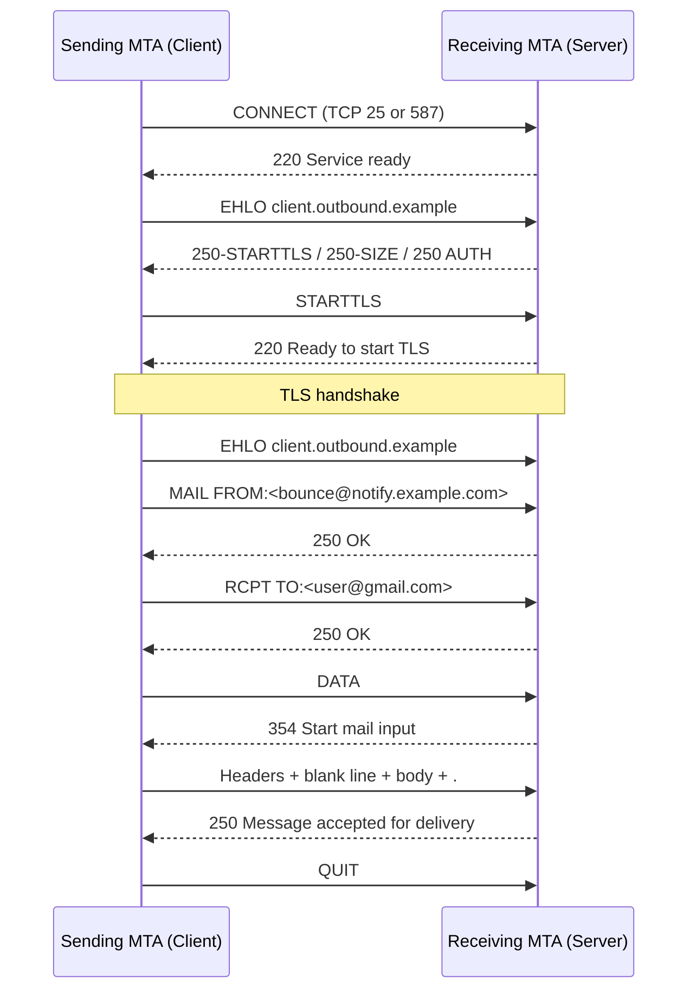
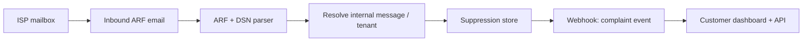
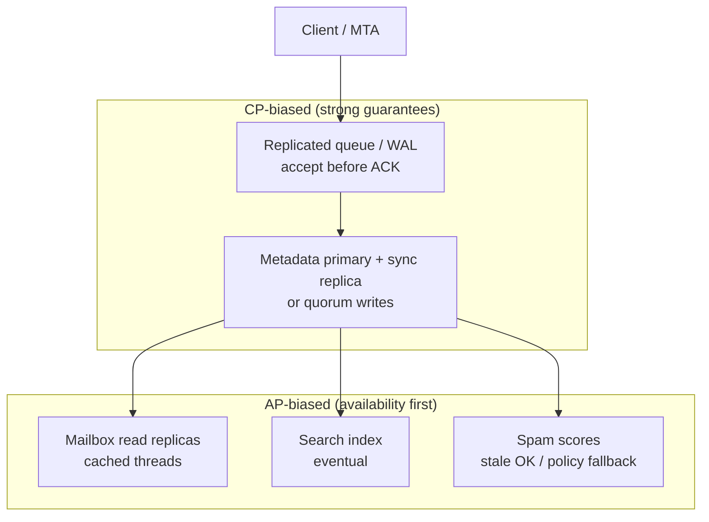
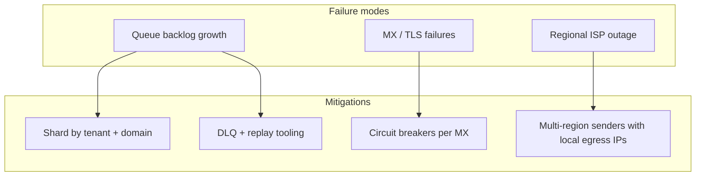

# Design an Email Delivery System (SendGrid / SES–like)
{: .no_toc }

<details open markdown="block">
  <summary>Table of Contents</summary>
  {: .text-delta }
1. TOC
{:toc}
</details>

---

## What We're Building

An **email delivery platform** accepts API requests from applications, renders templates, queues messages, and delivers them over **SMTP** to recipient mail servers—while managing **authentication (SPF/DKIM/DMARC)**, **reputation**, **bounces**, **complaints**, **unsubscribes**, and **analytics** (opens, clicks). Think **SendGrid**, **Amazon SES**, **Mailgun**, **Postmark**, or **SparkPost**: the infrastructure layer between your product and every inbox on the planet.

| Capability | Why it matters |
|------------|----------------|
| **Transactional mail** | Password resets, receipts, alerts — latency-sensitive, high engagement |
| **Marketing / bulk** | Newsletters, campaigns — throughput-heavy, list and compliance sensitive |
| **Deliverability** | “Sent” ≠ “inbox”; ISPs filter on reputation, content, and recipient engagement |
| **Compliance** | CAN-SPAM, GDPR, CASL — legal exposure if you ignore opt-out and data handling |

**Real-world scale (order-of-magnitude, public reporting and industry norms):**

| Provider / signal | Scale hint |
|-------------------|------------|
| **SendGrid (Twilio)** | On the order of **100B+ emails/month** at peak public disclosures — massive multi-tenant MTA fleets |
| **Amazon SES** | Regional, bursty senders; integrates with AWS identity and suppression stores |
| **Gmail / Yahoo / Outlook** | Billions of mailboxes; **each** applies independent filtering and rate limits |

{: .note }
> In interviews, **never** conflate “our SMTP accepted the message” with “the user saw it.” Final delivery is decided by **recipient MX + spam filters + mailbox policies**.

### Why email delivery is surprisingly hard

1. **Deliverability is adversarial** — Spammers abused open SMTP for decades. Every ISP runs **content filters**, **reputation systems**, **rate limits**, and **greylisting**. Your beautiful product email can land in spam because a **neighbor on a shared IP** misbehaved yesterday.

2. **Reputation is slow and sticky** — **IP and domain reputation** take **weeks** to build and **minutes** to burn. A sudden spike from a **cold IP** triggers blocks. You need **warming**, **segmentation**, and **feedback-driven throttling**.

3. **Protocols are old, semantics are fuzzy** — **SMTP** returns **250** for “accepted for delivery” to *your* next hop, not to the final mailbox. **Bounces** often arrive **asynchronously** as separate messages to your **Return-Path** address. **Opens** require **pixels** that privacy tools block.

4. **Compliance crosses borders** — Marketing mail needs **visible unsubscribe**, **honest headers**, and **suppression lists**. **GDPR** affects how you store **events** and **PII** (emails, IPs). **B2B vs B2C** rules differ by jurisdiction.

---

## Key Concepts Primer

Email interviews reward **protocol + DNS + reputation** depth. The sections below are the “signal” topics.

### SMTP: envelope vs headers vs body

**SMTP** (Simple Mail Transfer Protocol) moves mail between **MTAs** (Mail Transfer Agents). Three layers matter:

| Layer | What it is | Example |
|-------|----------------|--------|
| **Envelope** | Commands spoken on the wire (`MAIL FROM`, `RCPT TO`) — used for **routing** and **DSN/bounces** | `MAIL FROM:<bounce@notify.example.com>` |
| **Headers** | Metadata lines in the message (`From:`, `To:`, `Subject:`, `DKIM-Signature:`) — shown (mostly) to users and used by filters | `From: "Acme" <noreply@acme.com>` |
| **Body** | The MIME payload (plain text, HTML, attachments) | `Content-Type: multipart/alternative` |

{: .important }
> **Envelope sender** (Return-Path / bounce address) can differ from **From:** header. This mismatch is **normal** (mailing lists, ESPs) but must be **authorized** via SPF/DKIM/DMARC or mail may be rejected.

**Classic SMTP submission flow (simplified):**



**Command cheat sheet:**

| Phase | Command | Purpose |
|-------|---------|---------|
| Identify | `HELO` / `EHLO` | Client identity; `EHLO` enables extensions (SIZE, STARTTLS, AUTH) |
| Envelope | `MAIL FROM:<>` | Bounce address (empty for null reverse-path in some cases) |
| Envelope | `RCPT TO:<>` | One recipient per command (repeat for multiple RCPTs) |
| Content | `DATA` | Stream RFC 5322 message; ends with `\r\n.\r\n` |

### Email authentication: SPF, DKIM, DMARC

**SPF (Sender Policy Framework)** — Publishes in **DNS TXT** which **IPv4/IPv6 hosts** may send mail **for** a domain. Receiving MTAs compare **connecting IP** to SPF; fail/softfail affects spam score.

**Example SPF record** (illustrative):

```dns
example.com.  IN  TXT  "v=spf1 ip4:203.0.113.0/24 include:sendgrid.net ~all"
```

| Mechanism | Meaning |
|-----------|---------|
| `ip4:` / `ip6:` | Literal authorized addresses |
| `include:` | Delegate to another domain’s SPF |
| `~all` | Soft-fail everything else (common) |
| `-all` | Hard-fail everything else (strict) |

**DKIM (DomainKeys Identified Mail)** — The sending MTA **signs** a canonicalized subset of headers + body with **RSA** (or newer algorithms). Public key in DNS (`selector._domainkey.example.com` **TXT**). Receivers verify signature → proves **integrity** and **domain alignment** for the signing domain.

**Example DKIM DNS** (truncated):

```dns
sg._domainkey.example.com. IN TXT "v=DKIM1; k=rsa; p=MIGfMA0GCSqGSIb3DQEBAQUAA4GNADCBiQKBgQC..."
```

**DMARC (Domain-based Message Authentication, Reporting & Conformance)** — Publishes **policy** for what receivers should do if SPF/DKIM **fail** or **don’t align** with the **From:** domain. Also requests **aggregate (rua)** and **forensic (ruf)** reports.

**Example DMARC record:**

```dns
_dmarc.example.com. IN TXT "v=DMARC1; p=quarantine; pct=100; rua=mailto:dmarc@example.com; adkim=s; aspf=s"
```

| Tag | Meaning |
|-----|---------|
| `p=` | Policy: `none`, `quarantine`, `reject` |
| `pct=` | Percentage of messages subject to policy |
| `adkim` / `aspf` | Strict (`s`) vs relaxed (`r`) alignment |

{: .tip }
> Interview answer: **SPF** validates **envelope IP path**, **DKIM** validates **cryptographic signing domain**, **DMARC** ties them to **From:** domain policy and enables **reporting**.

### IP reputation and warming

**IP reputation** is a score ISPs assign to **sending IPs** based on **volume patterns**, **complaint rates**, **unknown-user bounces**, **spam trap hits**, and **engagement** (opens, replies, “not spam” clicks).

**Cold IP problem** — A never-seen IP blasting **millions** of messages looks like **botnet** behavior. ISPs **throttle**, **greylist**, or **block** until the IP earns trust.

**Warming** — Ramp **daily volume** per ISP/domain: start low (hundreds–thousands/day), increase gradually over **2–8+ weeks**, prioritizing **engaged recipients** first. Track **bounce/complaint** curves; **pause** if metrics degrade.

| Week (indicative) | Daily volume per major domain |
|-------------------|-------------------------------|
| 1 | Low thousands, highly engaged segments |
| 2–3 | 2–5× ramp if metrics healthy |
| 4+ | Approach target steady state; separate marketing vs transactional pools |

### Bounce handling: hard vs soft

| Type | Meaning | Action |
|------|---------|--------|
| **Hard bounce** | Persistent failure — **unknown user**, **bad domain**, **policy block** | **Suppress** address; stop retries (except rare operator fixes) |
| **Soft bounce** | Temporary — **mailbox full**, **greylisting**, **4xx** from MX | **Retry** with **backoff**; cap attempts; then classify as bad if persistent |

If you **keep mailing hard bounces**, you hurt **reputation** and violate **best practice** (and some ISP policies).

### Feedback loops and list hygiene

**Feedback loops (FBL)** — Major ISPs (where available) send **complaint notifications** when users click **“Report spam”**. Often **ARF** (Abuse Reporting Format) over email to a registered address.

**List hygiene** — Remove **complainers**, **hard bounces**, **unsubscribes**, and **inactive** addresses (after policy). **Re-engagement** campaigns before sunsetting; **double opt-in** for marketing.

### Content filtering (SpamAssassin-style)

Receivers stack **rules**:

- **Header tests** — Missing **Message-ID**, bad **Date**, **FROM** / **Reply-To** mismatch.
- **DNSBLs** — IP/domain blocklists.
- **URL reputation** — Phishing links, URL shorteners, mismatched href.
- **Bayesian / ML** — Learn from corpus of ham/spam.
- **Fingerprinting** — Attachments, image-heavy with little text.

**Sender-side hygiene** — Balanced **text/HTML**, consistent **branding**, authenticated mail, **no purchased lists**, honor **unsubscribe**.

### MX records and DNS resolution

To deliver to `user@gmail.com`, the sending MTA:

1. Extracts **domain** = `gmail.com`.
2. Queries DNS for **MX records** (preference + hostname).
3. Resolves MX hostnames to **A/AAAA** IPs.
4. Opens SMTP to **port 25** (or MSA paths for submission, which is different).
5. May fall back to **A** if no MX (legacy behavior).

{: .note }
> **Submission** (port **587**, STARTTLS, often authenticated) is how **your app** hands mail to **your** provider. **Delivery** to arbitrary domains is typically **25** from your **outbound MTAs**.

### Greylisting and transient deferrals

**Greylisting** is an anti-spam technique: the first time a **triplet** *(client IP, envelope sender, recipient)* is unseen, the receiving MTA returns **451 4.7.1 Try again later** (or similar). Legitimate MTAs **retry** after minutes; many spam bots do not. Your outbound stack must treat **4xx** as **retryable** with **respectful backoff**—not hammer the same MX.

| Signal | Typical MTA behavior | Sender behavior |
|--------|----------------------|-----------------|
| **451 / 4xx** | Temporary failure | Retry with exponential backoff + jitter |
| **421** | Service unavailable | Back off; may indicate overload |
| **Greylist first connect** | Defer | Second attempt after **5–15+ minutes** often succeeds |

{: .tip }
> Interview trap: saying “we retry every second” — ISPs will **block** you. Industry practice: **minutes-scale** spacing for deferrals, **caps** on attempts per message.

### ARF (Abuse Reporting Format) at a glance

Complaint feedback loops often deliver a **multipart/report** message where one part is **`message/feedback-report`** with fields like **`User-Agent`**, **`Original-Mail-From`**, **`Original-Rcpt-To`**, and **`Feedback-Type: abuse`**. Another part may include **redacted** copy of offending message. Your parser extracts **tenant** and **message id** (from **custom headers** you injected) to **suppress** the recipient and **notify** the customer.



---

## Step 1: Requirements

### Functional

| ID | Requirement | Notes |
|----|-------------|-------|
| F1 | **Send API** — single and bulk recipients | Idempotency keys for safe retries |
| F2 | **Template rendering** — HTML/text, substitution, partials | Precompile hot templates |
| F3 | **Scheduling** — send_at, drip campaigns | Separate **scheduler** topic from **hot transactional** path |
| F4 | **Tracking** — opens (pixel), clicks (redirect), optional unsubscribe link | Privacy regulations → disclose; some clients block pixels |
| F5 | **Bounce/complaint ingestion** — async webhooks + mailbox parsing | Normalize to **event stream** |
| F6 | **Suppression** — global and per-customer lists | Enforced **before** queue accept |
| F7 | **Unsubscribe** — one-click **List-Unsubscribe** + landing page | Marketing compliance |
| F8 | **Tenant isolation** — multi-customer SaaS | Keys, quotas, domains, reputation |

### Non-functional

| ID | Attribute | Target (interview-sized) |
|----|-----------|--------------------------|
| N1 | **Peak throughput** | **~100K emails/sec** aggregate (shard by tenant + recipient domain) |
| N2 | **Transactional latency** | **p99 < 30s** from accepted API → initial SMTP attempt completed |
| N3 | **Availability** | **99.99%** API + control plane; delivery is **best-effort** with retries |
| N4 | **Deliverability** | **>95%** inbox placement *for well-configured tenants* (not a pure infra KPI) |
| N5 | **Durability** | **Zero loss** of accepted sends (replicated queue / WAL) |
| N6 | **Audit** | Per-message trace + signed webhooks |

{: .warning }
> Promise **inbox placement %** carefully: you control **auth, hygiene, throttling** — not Google’s classifier.

---

### Technology Selection & Tradeoffs

A full **ESP / transactional platform** spans **outbound delivery** (this doc’s focus) and often **mailbox + webmail** for reading. The comparisons below separate **pipeline messaging**, **where bytes live**, **how users find mail**, and **how bits leave your network**.

#### Message queue — Kafka vs RabbitMQ vs SQS (email pipeline)

| Dimension | **Apache Kafka** | **RabbitMQ** | **Amazon SQS** |
|-----------|------------------|--------------|----------------|
| **Throughput & fan-out** | Very high sustained write/read; consumer groups scale horizontally | High for typical workloads; shovel/federation for cross-DC | Managed, scales with quotas; no ordering partition like Kafka unless FIFO |
| **Ordering & replay** | Partition-key ordering; **durable log** + offset replay for recovery | Per-queue ordering; replay is **not** a first-class log model | Standard queues best-effort; FIFO adds ordering + dedup window |
| **Semantics** | At-least-once (exactly-once with transactions/idempotency layers) | Ack/nack, DLX for dead-letter | Visibility timeout + DLQ; at-least-once |
| **Ops model** | Self-managed cluster or managed (MSK, Confluent) | Mature broker; many hosting options | Fully managed; regional limits and API semantics |
| **Fit for email** | **Ideal** for **event sourcing** delivery attempts, **cross-service analytics**, **large fan-out** webhooks | **Great** for **work queues** with **priority** and **per-domain** routing rules | **Simple** ingress/drain when you want **no broker ops** and already on AWS |

**Why it matters in interviews:** Email is **at-least-once** at every hop; your queue choice defines **durability**, **replay after incidents**, and **how you shard** (tenant, recipient domain, message class).

#### Email storage — object store vs database BLOBs vs Dovecot-style mail store

| Dimension | **Object store (S3, GCS, Azure Blob)** | **DB BLOBs (Postgres BYTEA, etc.)** | **Dedicated mail store (Dovecot/IMAP server + Maildir)** |
|-----------|------------------------------------------|--------------------------------------|-----------------------------------------------------------|
| **Cost at scale** | **Lowest $/GB**; lifecycle tiers | **Highest** — backups and replication amplify cost | Middle — tuned for **many small files** |
| **Access pattern** | **Write-once**, key by `message_id` / hash; range listing needs **metadata index** | Row + BLOB in one TX for **strong consistency** with metadata | **Mailbox-optimized** — flags, UID, IMAP semantics |
| **Max message size** | **Multi-GB** practical | DB and driver limits; painful for large attachments | Depends on FS; usually fine |
| **Operational fit** | **ESP / API sending** — bodies are **blobs** referenced from metadata DB | **Small** inboxes or **strict transactional** “one row = truth” | **Full mailbox product** — when you **run IMAP** for users |

**Interview angle:** ESPs almost always use **object storage + separate metadata DB** so **hot indexes** stay small and **MIME bodies** stay cheap. **Dovecot** is the answer when the product **is** a mailbox server, not only an API sender.

#### Search / indexing — Elasticsearch vs custom inverted index vs PostgreSQL FTS

| Dimension | **Elasticsearch / OpenSearch** | **Custom inverted index** (Lucene embedded, etc.) | **PostgreSQL FTS** (`tsvector`, GIN) |
|-----------|----------------------------------|---------------------------------------------------|--------------------------------------|
| **Relevance & facets** | Rich queries, aggregations, sharding | Full control; **you** own ranking and ops | Good for **moderate** scale; **single-DB** simplicity |
| **Operational cost** | **Clusters** to tune, upgrade, secure | **Highest** engineering cost | **Lowest** infra surface if DB already central |
| **Scale-out** | Horizontal by index/shard | You design sharding + recovery | Vertical + read replicas; **huge** mail corpus may strain |
| **Email-specific** | Common for **webmail search** at scale | Vendors / hyperscale **custom** stacks | Strong for **team-size** or **single-tenant** search |

**Interview angle:** **Postgres FTS** wins **simplicity**; **Elasticsearch** wins **scale + analytics**; **custom** only when you have **special constraints** (on-prem, strict latency, or custom security).

#### Delivery — SMTP direct vs relay (SES / SendGrid) vs hybrid

| Dimension | **Direct SMTP from your MTAs** | **Relay via SES / SendGrid / etc.** | **Hybrid** |
|-----------|----------------------------------|-------------------------------------|------------|
| **Control** | Full control of **IP pools**, **warming**, **queue discipline** | Provider manages **infra**, **some** IP reputation | **Transactional** via provider; **bulk** on dedicated IPs, or vice versa |
| **Compliance & certs** | You own **TLS**, **abuse**, **blocklist** remediation | Shared responsibility; **their** dashboards and limits | Split **risk** and **cost** |
| **Time to market** | **Slow** — build MTA fleet, deliverability team | **Fast** — API + DNS records | **Balanced** |
| **Interview story** | Hyperscale ESPs **own** the stack | Startups **start** with SES/SendGrid | Enterprises **segment** by brand, region, or data residency |

**Our choice (narrative for this guide):**

| Layer | Choice | Rationale |
|-------|--------|-----------|
| **Pipeline** | **Kafka** (or **Pulsar**) for **delivery events**, **webhooks**, **analytics**; **RabbitMQ** or **SQS** acceptable for **smaller** “work queue only” designs — say **why** you need **log replay** vs **simplicity** | Durability + replay after incidents; **shard** by tenant or domain |
| **Body storage** | **Object store** + **relational metadata** | Cost, size, and **decoupled** scaling from OLTP |
| **Search** (if webmail in scope) | **Elasticsearch** at scale; **Postgres FTS** for MVP | Match **query complexity** and **team ops** to pick |
| **Delivery** | **Hybrid** for most products: **managed relay** early; **dedicated IPs + own MTA tier** when volume and deliverability **justify** ops | Optimizes **speed to market** without blocking a later **direct** path |

{: .tip }
> In interviews, **state the tradeoff explicitly**: “We pick Kafka over SQS here because we need **ordered per-partition processing** and **infinite replay** for reprocessing bounces — SQS is fine if the problem scope is **smaller**.”

---

### CAP Theorem Analysis

**CAP** (Consistency, Availability, Partition tolerance) forces honesty: in a **network partition**, you cannot have both **strong linearizability** and **perfect availability**. Email systems mix **user-facing** paths (want **availability** for reads) with **money paths** (must **not lose** accepted mail).

| Path | CAP lens | Typical stance | Why |
|------|----------|----------------|-----|
| **Mailbox reads (IMAP/webmail)** | Users expect **responsive UI** | **AP** — serve **stale** folder counts or **cached** snippets under partition; **eventual** sync beats hard failure | Better **degraded** service than “503 everywhere” |
| **Message ingestion (send API → queue)** | **Durability** is non-negotiable for **accepted** sends | **CP** on the **commit boundary** — **replicated log / quorum write** before `202 Accepted` is “safe” | You **trade** a bit of latency for **no silent loss** |
| **Search index** | Secondary index | **AP** — search can **lag** seconds; **eventual consistency** | **Stale** search is acceptable; **wrong** ranking is less catastrophic than **lost** mail |
| **Spam / filtering** | Often **probabilistic** | **AP** with **safe defaults** — if classifier unavailable, **quarantine** or **defer** policy is a **business** choice (some choose **fail-open** with risk) | Interviewers want **explicit** failure mode |

**Durability vs CAP:** Strictly speaking **durability** is not the “C” in CAP (that’s **linearizability** of reads/writes). In interviews, connect **“no loss of accepted mail”** to **replicated queues + WAL**, and **“inbox must load”** to **replicas + caches** — and acknowledge **partition** scenarios (e.g., **split-brain** mitigated by **fencing tokens** and **single-writer** per mailbox where needed).



{: .note }
> **Message delivery** to **recipient MX** is **best-effort** in the real world — your SLO is about **your** attempts and **observable** outcomes, not **guaranteed** placement in the user’s inbox.

---

### SLA and SLO Definitions

**SLA** = contract with customers (credits, refunds). **SLO** = internal target; **SLI** = what you measure. Below are **candidate-facing** SLOs for a **serious** ESP; tune numbers to the prompt.

| Area | SLI (indicator) | Example SLO | Notes |
|------|-----------------|-------------|-------|
| **Delivery latency** | Time from **successful API accept** to **first SMTP attempt** completed | **p99 < 30s**, **p999 < 120s** | Aligns with **N2** in requirements; **separate** marketing **schedule** SLO |
| **Inbox / mail UI load** | Time to **first meaningful paint** of thread list | **p99 < 800ms** (if webmail in scope) | Depends on **CDN**, **API**, **DB** — give **ranges** in interviews |
| **Search latency** | Query → **first page** of results | **p99 < 400ms** (indexed); **p99 < 2s** cold | **Elasticsearch** vs **Postgres** changes tail |
| **Message durability** | Accepted send **never** dropped before **durable enqueue** | **99.999%** monthly **no loss** of acknowledged accepts | Implemented via **replication**, **fsync** policy, **replay** |
| **Spam false positive rate** (if you run classifier) | Legitimate mail marked spam / blocked | **< 0.1%** of evaluated ham (example) | Requires **human review** sampling — hard to measure perfectly |

**Error budget policy (interview-ready):**

| Principle | Application |
|-----------|-------------|
| **Budget = 1 − SLO** | Example: **99.9%** monthly availability → **43.2 minutes** **allowed** downtime/month |
| **Spend triggers** | If **burn rate** exceeds threshold: **freeze** non-critical deploys, **shift** capacity to **transactional** lane, **page** on-call |
| **Product tradeoffs** | When **search** burns budget, **disable** fancy features (highlighting) before **dropping** core **send** path |
| **Customer comms** | **SLA** may promise **credits** only when **SLA breach** is provable via **your** SLI definitions |

{: .warning }
> Never promise **inbox placement** as an **SLO** — you don’t control **recipient** systems. Promise **attempts**, **webhooks**, and **suppression** behavior you **own**.

---

### Database Schema

Schemas assume **relational** OLTP (Postgres-like). **IDs** are **UUID** or **snowflake**; **tenant_id** for SaaS. Adjust naming to your style.

**mailboxes** — one row per **user** (logical mailbox); **folders** hang off `mailbox_id`.

| Column | Type | Notes |
|--------|------|-------|
| `mailbox_id` | UUID, PK | |
| `user_id` | UUID, FK, indexed | Owner |
| `tenant_id` | UUID, indexed | Multi-tenant isolation |
| `quota_bytes` | BIGINT | Storage limit |
| `created_at`, `updated_at` | TIMESTAMPTZ | |

**folders** — hierarchy for **Inbox**, **Sent**, **Trash**, user labels.

| Column | Type | Notes |
|--------|------|-------|
| `folder_id` | UUID, PK | |
| `mailbox_id` | UUID, FK | |
| `name` | TEXT | e.g. `INBOX`, `Sent` |
| `parent_folder_id` | UUID, nullable | Self-FK for nesting |
| `uid_validity` | BIGINT | IMAP-style **UIDVALIDITY** if exposing IMAP |
| `next_uid` | BIGINT | Next **UID** to assign |

**messages** — **metadata** hot path; **body** in object store via `body_ref`.

| Column | Type | Notes |
|--------|------|-------|
| `message_id` | UUID, PK | Internal id |
| `tenant_id` | UUID | |
| `mailbox_id` | UUID, FK | Owner mailbox |
| `folder_id` | UUID, FK | Current folder |
| `message_id_header` | TEXT | RFC **Message-ID** header (unique per tenant optional) |
| `from_addr` | TEXT | Serialized **From** |
| `to_addrs` | TEXT[] or JSONB | **To** list |
| `cc_addrs`, `bcc_addrs` | TEXT[] or JSONB | Optional |
| `subject` | TEXT | Truncated for index; full line in **raw** if needed |
| `body_ref` | TEXT | **s3://** or key for **object storage** |
| `body_snippet` | TEXT | Preview for list views |
| `headers_json` | JSONB | Selected **raw** headers for DKIM/display |
| `flags` | BIT or TEXT[] | **\\Seen**, **\\Answered**, **\\Flagged** |
| `size_bytes` | BIGINT | |
| `received_at`, `sent_at` | TIMESTAMPTZ | |
| `created_at` | TIMESTAMPTZ | |

**attachments**

| Column | Type | Notes |
|--------|------|-------|
| `attachment_id` | UUID, PK | |
| `message_id` | UUID, FK → `messages` | ON DELETE CASCADE |
| `filename` | TEXT | |
| `content_type` | TEXT | |
| `size_bytes` | BIGINT | |
| `storage_key` | TEXT | Object store key |
| `content_id` | TEXT, nullable | For **CID** embedded images |

**contacts**

| Column | Type | Notes |
|--------|------|-------|
| `contact_id` | UUID, PK | |
| `user_id` | UUID, FK | Owner |
| `tenant_id` | UUID | |
| `email` | CITEXT or TEXT | Unique per `(user_id, email)` |
| `display_name` | TEXT | |
| `created_at`, `updated_at` | TIMESTAMPTZ | |

**Helpful indexes (say in interview):** `(mailbox_id, folder_id, received_at DESC)` for **inbox listing**; GIN on **FTS** column or **Elasticsearch** sidecar for **search**; **hash** on `storage_key` for dedupe if needed.

---

### API Design

REST-shaped **JSON** over **HTTPS**. All paths **tenant-scoped** via **API key** or **OAuth**. **Idempotency-Key** on **mutating** calls.

| Concern | Pattern |
|---------|---------|
| **Auth** | `Authorization: Bearer` / API key; **rate limits** per tenant |
| **Idempotency** | Header `Idempotency-Key` on **POST** send — **24–48h** replay window |
| **Pagination** | `cursor` on list/search; **limit** max **100** typical |
| **Errors** | JSON `{ "error": { "code", "message", "request_id" } }` |

#### Sending email

| Method | Path | Body (summary) |
|--------|------|----------------|
| `POST` | `/v1/messages:send` | `from`, `to[]`, optional `cc`, `bcc`, `subject`, `text`, `html`, `template_id` + `variables`, `attachments[]` with **refs** after upload |
| `POST` | `/v1/messages:sendBulk` | Batch of recipients + shared template — **async** **202** + `job_id` |

**Response:** `202` with `{ "message_id", "status": "queued" }` — or `200` with per-recipient ids if synchronous MVP.

#### Listing inbox / folders

| Method | Path | Notes |
|--------|------|-------|
| `GET` | `/v1/mailboxes/{mailbox_id}/folders` | List folders + counts |
| `POST` | `/v1/mailboxes/{mailbox_id}/folders` | Create label/folder `{ "name", "parent_id" }` |
| `PATCH` | `/v1/folders/{folder_id}` | Rename, move in hierarchy |
| `DELETE` | `/v1/folders/{folder_id}` | Delete or archive — define **move-to-trash** semantics |
| `GET` | `/v1/mailboxes/{mailbox_id}/messages` | Query: `folder_id`, `cursor`, `limit`, `unread_only` |

#### Reading a message

| Method | Path | Notes |
|--------|------|-------|
| `GET` | `/v1/messages/{message_id}` | Full metadata + **snippet**; optional `?include=raw_headers` |
| `GET` | `/v1/messages/{message_id}/body` | **HTML or text** — **CDN-signed URL** alternative for large bodies |
| `PATCH` | `/v1/messages/{message_id}` | Update **flags** — `{ "seen": true, "flagged": false }` |

#### Search

| Method | Path | Notes |
|--------|------|-------|
| `GET` | `/v1/mailboxes/{mailbox_id}/messages:search` | Query params: `q`, `folder_id`, `from`, `date_from`, `date_to`, `cursor` |

#### Attachments

| Method | Path | Notes |
|--------|------|-------|
| `POST` | `/v1/attachments:upload` | **Presigned URL** flow preferred: **return** `{ "upload_url", "attachment_ref" }` for client PUT to object store |
| `GET` | `/v1/messages/{message_id}/attachments/{attachment_id}` | Metadata + **presigned GET** or **stream** |

**Webhook (delivery events)** — not REST CRUD but expected in API design answers: `POST` to customer URL with **signed** payload for **delivered**, **deferred**, **bounced**, **complained**.

{: .tip }
> **Why presigned URLs for attachments?** Keeps **heavy** bytes off **app servers** and matches **object store** as source of truth — interviewers like **separation of control plane and data plane**.

---

## Step 2: Estimation

**Assumptions:** **100K msgs/sec** peak; average **80 KB** raw MIME (HTML + small assets inlined); **3 days** hot retention of bodies; **30 days** of events in OLAP; replication factor **3**.

| Dimension | Calculation | Order of magnitude |
|-----------|-------------|---------------------|
| **Outbound QPS** | 100K/sec | Per-region sharded queues |
| **SMTP sessions** | Pool **per destination MX** + circuit breakers | 10K–50K concurrent connections fleet-wide (depends on coalescing) |
| **Bandwidth** | 100K × 80 KB ≈ **8 GB/s** peak payload | NIC + kernel tuning; compress **internal** logs, not MIME |
| **Body storage (hot)** | 100K × 86400 × 80 KB ≈ **691 TB/day** if you retained everything at peak 24h — **in practice** tiered: hot hours on SSD, then object store | Real designs **dedupe** templates and store **blobs** once |
| **Events** | ~5 events/msg (queued, delivered, deferred, bounce, open) × 100K × 86400 | Billions of rows/day → **Kafka → warehouse** |

**MTA fleet (rough):** If one optimized sender sustains **~2–5K msgs/sec** sustained to mixed domains (TLS, retries, variability), **100K/sec** needs **20–50+** active sender instances minimum — reality is **horizontal scale** with **domain sharding** and **ISP-aware limits**.

### Storage & event model (sketch)

| Store | Contents | Access pattern | Notes |
|-------|----------|----------------|-------|
| **Message metadata DB** | `message_id`, tenant, recipient, template version, status | Point lookup, status updates | Sharded by **tenant_id** |
| **Object store (S3)** | Large HTML bodies, attachments | Write once, rare read | Dedupe by **content hash** for identical marketing blasts |
| **Kafka / Pulsar** | Delivery attempts, deferrals, webhook fan-out | High write, stream consumers | Partition by **tenant** or **domain** |
| **OLAP / warehouse** | Opens, clicks, bounces (aggregated) | Batch analytics | **Privacy** — minimize raw PII retention |
| **Suppression store** | Email hash → reason, expiry | **Sub-millisecond** check on ingress | Redis + durable backing store |
| **DKIM keys** | PEM in KMS/HSM; metadata in DB | Sign path hot read | **Rotate** selectors without downtime |

**Idempotency:** API `Idempotency-Key` + tenant → persisted **intent record** prevents duplicate sends on client retries. Workers carry **dedupe tokens** into the queue.

---

## Step 3: High-Level Design

```mermaid
flowchart LR
    subgraph ingress["Ingress"]
        API[Send / Templates API]
        AUTH[AuthZ + Quotas + Idempotency]
        VAL[Validation + Suppression check]
    end
    subgraph paths["Logical paths"]
        TX[Transactional priority queue]
        MKT[Marketing bulk queue]
    end
    subgraph render["Rendering"]
        TR[Template engine]
        SIG[DKIM signer]
    end
    subgraph delivery["Delivery tier"]
        MTA[MTA pool / SMTP workers]
        MX[MX resolver + cache]
        SMTP[SMTP to recipient MX]
    end
    subgraph feedback["Feedback"]
        BH[Bounce / complaint handler]
        SUP[Suppression store]
        WEB[Webhooks / analytics]
    end
    API --> AUTH --> VAL
    VAL -->|high priority| TX
    VAL -->|bulk| MKT
    TX --> TR
    MKT --> TR
    TR --> SIG --> MTA
    MTA --> MX --> SMTP
    SMTP -. NDR / FBL .-> BH
    BH --> SUP
    SUP -. filter before enqueue .-> VAL
    MTA --> WEB
```



**Transactional vs marketing separation:**

| Path | Isolation benefit |
|------|-------------------|
| **Transactional** | Dedicated **queue priority**, **IP pool**, **rate limits** — protect password resets from a bad marketing list |
| **Marketing** | Higher **latency tolerance**, **batching**, **domain warming** schedules |

**Feedback loop:** Inbound **bounce** addresses + **ARF** mailboxes → **parser** → **classification** → **suppression** + **tenant webhooks** → consumers fix lists → future sends **blocked at API** if suppressed.

---

## Step 4: Deep Dive

### 4.1 Email pipeline and queuing

Use **priority queues** (or **Kafka** with **priority topics**) so transactional traffic **preempts** bulk. Apply **per-recipient-domain rate limits** (Gmail/Yahoo caps differ). Retries: **exponential backoff** with **jitter**; cap **max attempts**; **dead-letter** for inspection.

```python
from __future__ import annotations

import heapq
import random
import time
from collections import defaultdict
from dataclasses import dataclass, field
from enum import IntEnum


class Priority(IntEnum):
    TRANSACTIONAL = 0
    MARKETING = 1


@dataclass(order=True)
class QueuedEmail:
    sort_index: float  # lower = sooner
    priority: Priority = field(compare=False)
    tenant_id: str = field(compare=False)
    domain: str = field(compare=False)  # recipient domain (e.g. gmail.com)
    message_id: str = field(compare=False)
    attempt: int = field(compare=False)


class DomainRateLimiter:
    """Token-bucket style limiter per recipient domain (emails per second)."""

    def __init__(self, default_eps: float = 50.0):
        self._eps: dict[str, float] = defaultdict(lambda: default_eps)
        self._allowance: dict[str, float] = defaultdict(float)
        self._last_ts: dict[str, float] = defaultdict(float)

    def configure(self, domain: str, emails_per_second: float) -> None:
        self._eps[domain] = emails_per_second

    def consume(self, domain: str, now: float | None = None) -> bool:
        now = now or time.monotonic()
        last = self._last_ts[domain]
        self._allowance[domain] = min(
            self._eps[domain],
            self._allowance[domain] + (now - last) * self._eps[domain],
        )
        self._last_ts[domain] = now
        if self._allowance[domain] >= 1.0:
            self._allowance[domain] -= 1.0
            return True
        return False


def backoff_seconds(attempt: int, base: float = 2.0, cap: float = 900.0) -> float:
    """Exponential backoff with jitter for soft bounces / deferrals."""
    exp = min(cap, base ** min(attempt, 10))
    jitter = random.uniform(0, exp * 0.2)
    return exp + jitter


class DomainAwareMailQueue:
    """
    Minimal in-memory priority queue sketch.
    Production: Redis/Zookeeper-sharded queues + Kafka for durability.
    """

    def __init__(self, limiter: DomainRateLimiter):
        self._heap: list[QueuedEmail] = []
        self._limiter = limiter

    def enqueue(self, item: QueuedEmail, now: float | None = None) -> None:
        now = now or time.monotonic()
        # transactional messages get earlier sort_index
        pri_weight = 0.0 if item.priority == Priority.TRANSACTIONAL else 1_000_000.0
        item.sort_index = pri_weight + now
        heapq.heappush(self._heap, item)

    def dequeue_ready(self, now: float | None = None) -> QueuedEmail | None:
        now = now or time.monotonic()
        while self._heap:
            item = self._heap[0]
            if item.sort_index > now:
                return None
            item = heapq.heappop(self._heap)
            if self._limiter.consume(item.domain, now):
                return item
            # re-heap with short defer — domain throttled
            defer = 0.05 + random.uniform(0, 0.05)
            item.sort_index = now + defer
            heapq.heappush(self._heap, item)
        return None
```

### 4.2 SMTP delivery engine

**Connection pooling** per **(source_ip, mx_host)** or **destination domain** reduces TLS handshakes. **Cache MX lookups** with TTL; respect **SMTP response codes** — `4xx` → retry, `5xx` → mostly hard fail (except some policy codes you may retry once).

```python
from __future__ import annotations

import smtplib
import socket
import time
from email import policy as email_policy
from email.message import EmailMessage
from typing import Iterable


class MXCache:
    def __init__(self, ttl_seconds: float = 300.0):
        self._ttl = ttl_seconds
        self._store: dict[str, tuple[float, list[tuple[int, str]]]] = {}

    def resolve_mx(self, domain: str) -> list[tuple[int, str]]:
        import dns.resolver  # type: ignore

        now = time.time()
        hit = self._store.get(domain)
        if hit and now - hit[0] < self._ttl:
            return hit[1]
        answers = dns.resolver.resolve(domain, "MX")
        mx_records = sorted(
            [(r.preference, str(r.exchange).rstrip(".")) for r in answers],
            key=lambda t: t[0],
        )
        self._store[domain] = (now, mx_records)
        return mx_records


class SmtpDeliveryResult:
    __slots__ = ("status", "smtp_code", "message", "retryable")

    def __init__(self, status: str, smtp_code: int | None, message: str, retryable: bool):
        self.status = status
        self.smtp_code = smtp_code
        self.message = message
        self.retryable = retryable


def deliver_smtp(
    mx_host: str,
    envelope_from: str,
    rcpt_to: Iterable[str],
    raw_message: bytes,
    timeout: float = 30.0,
    port: int = 25,
) -> SmtpDeliveryResult:
    """
    Low-level send. Production adds: TLS cert pinning options, SOCKS, binding source IP,
    LMTP, connection pool, and detailed reply parsing per line.
    """
    try:
        with smtplib.SMTP(timeout=timeout) as client:
            client.connect(mx_host, port)
            client.ehlo(socket.getfqdn())
            if client.has_extn("starttls"):
                client.starttls()
                client.ehlo(socket.getfqdn())
            code, reply = client.mail(envelope_from)
            if code >= 400:
                return SmtpDeliveryResult("defer", code, str(reply), retryable=True)
            for rcpt in rcpt_to:
                code, reply = client.rcpt(rcpt)
                if code >= 400:
                    return SmtpDeliveryResult("reject", code, str(reply), retryable=400 <= code < 500)
            code, reply = client.data(raw_message)
            if code >= 400:
                retryable = code >= 400 and code < 500
                return SmtpDeliveryResult("defer" if retryable else "fail", code, str(reply), retryable)
            return SmtpDeliveryResult("sent", code, str(reply), retryable=False)
    except (OSError, smtplib.SMTPException) as exc:
        return SmtpDeliveryResult("error", None, str(exc), retryable=True)


def build_raw_message(msg: EmailMessage) -> bytes:
    # CRLF line endings per RFC 5321 / 5322 on the wire
    return msg.as_bytes(policy=email_policy.SMTP.clone(linesep="\r\n"))
```

{: .note }
> Use **`smtplib`** for illustration; at scale, **custom async SMTP** (e.g., **aiosmtplib** patterns) or **MTAs** like **Postfix** / **Haraka** with queue integration are common.

### 4.3 Email authentication implementation

**SPF** is **DNS text** — generation is string assembly. **DKIM** signs **selected headers** + **body hash**. **DMARC** is DNS policy — generation is record strings.

```python
from __future__ import annotations

import base64
import hashlib
import time
from email.message import EmailMessage

from cryptography.hazmat.primitives import hashes, serialization
from cryptography.hazmat.primitives.asymmetric import padding


def spf_record_for_sending_ips(
    ipv4_ranges: list[str],
    includes: list[str],
    policy_all: str = "~all",
) -> str:
    """
    Build v=spf1 record. Keep DNS under 450 bytes for UDP compatibility.
    """
    parts = ["v=spf1"]
    parts.extend(f"ip4:{r}" for r in ipv4_ranges)
    parts.extend(f"include:{d}" for d in includes)
    parts.append(policy_all)
    return " ".join(parts)


def dkim_sign_message(
    msg: EmailMessage,
    selector: str,
    domain: str,
    private_key_pem: bytes,
    header_canon: str = "relaxed",
    body_canon: str = "relaxed",
    signing_algorithm: str = "rsa-sha256",
) -> None:
    """
    Insert DKIM-Signature header. Production: use dkimpy / OpenSSL bindings,
    handle body wrapping, z= folded headers, key rotation.
    """
    body = msg.as_bytes()
    body_hash = base64.b64encode(hashlib.sha256(body).digest()).decode("ascii")

    headers_to_sign = [
        "from",
        "to",
        "subject",
        "date",
        "mime-version",
        "content-type",
    ]
    # Minimal canonical relaxed header sketch (real impl follows RFC 6376 exactly)
    header_lines = []
    for h in headers_to_sign:
        if h in msg:
            header_lines.append(f"{h}:{msg[h]}")
    canon_headers = "\r\n".join(header_lines)
    signing_input = canon_headers.encode()

    key = serialization.load_pem_private_key(private_key_pem, password=None)
    if signing_algorithm != "rsa-sha256":
        raise ValueError("demo supports rsa-sha256 only")
    signature = key.sign(signing_input, padding.PKCS1v15(), hashes.SHA256())
    sig_b64 = base64.b64encode(signature).decode("ascii")

    sig_header = (
        f"v=1; a=rsa-sha256; c={header_canon}/{body_canon}; d={domain}; s={selector}; "
        f"t={int(time.time())}; "
        f"h=from:to:subject:date:mime-version:content-type; "
        f"bh={body_hash}; "
        f"b={sig_b64}"
    )
    msg["DKIM-Signature"] = sig_header


def dmarc_record(
    policy: str = "none",
    rua: str | None = "mailto:dmarc@example.com",
    pct: int = 100,
    alignment: str = "s",
) -> str:
    parts = [f"v=DMARC1", f"p={policy}", f"pct={pct}", f"adkim={alignment}", f"aspf={alignment}"]
    if rua:
        parts.append(f"rua={rua}")
    return "; ".join(parts)
```

### 4.4 Bounce and complaint processing

Parse **DSN** / **NDR** messages, **ARF** attachments for complaints. Map to **original message-id** / **X-ESP-Tracking-ID** embedded in headers. Auto-suppress on **hard** and **complaint**.

```python
from __future__ import annotations

import email
import re
from dataclasses import dataclass
from enum import Enum
from email.message import Message


class BounceClass(str, Enum):
    HARD = "hard"
    SOFT = "soft"
    UNKNOWN = "unknown"


@dataclass
class BounceEvent:
    recipient: str
    classification: BounceClass
    smtp_code: int | None
    reason: str


_SMTP_CODE_RE = re.compile(r"\b([45][0-9][0-9])\b")


def classify_bounce_text(body: str) -> BounceClass:
    lowered = body.lower()
    hard_markers = [
        "550 5.1.1",
        "user unknown",
        "mailbox unavailable",
        "no such user",
        "invalid recipient",
        "5.1.1",
    ]
    soft_markers = [
        "452 4.2.2",
        "mailbox full",
        "quota exceeded",
        "greylisted",
        "try again later",
        "4.2.2",
    ]
    if any(m in lowered for m in hard_markers):
        return BounceClass.HARD
    if any(m in lowered for m in soft_markers):
        return BounceClass.SOFT
    m = _SMTP_CODE_RE.search(body)
    if m:
        code = int(m.group(1))
        if code >= 500:
            return BounceClass.HARD
        if code >= 400:
            return BounceClass.SOFT
    return BounceClass.UNKNOWN


def parse_inbound_bounce(raw_bytes: bytes) -> BounceEvent | None:
    msg = email.message_from_bytes(raw_bytes)
    subject = msg.get("Subject", "")
    parts: list[str] = []
    if msg.is_multipart():
        for pl in msg.walk():
            ctype = pl.get_content_type()
            if ctype == "text/plain":
                payload = pl.get_payload(decode=True)
                if payload:
                    parts.append(payload.decode("utf-8", errors="replace"))
    else:
        payload = msg.get_payload(decode=True)
        if payload:
            parts.append(payload.decode("utf-8", errors="replace"))
    body = "\n".join(parts)
    recipient = None
    # Delivery Status Notification often includes Original-Recipient / Final-Recipient
    for line in body.splitlines():
        if "final-recipient" in line.lower() or "original-recipient" in line.lower():
            recipient = line.split(";", 1)[-1].strip()
            break
    if not recipient:
        return None
    cls = classify_bounce_text(body + " " + subject)
    return BounceEvent(recipient=recipient, classification=cls, smtp_code=None, reason=body[:512])
```

### 4.5 IP reputation management

**Dedicated vs shared pools** — High-volume reputable senders get **dedicated IPs**; long-tail shares **pooled** IPs with **strict** abuse controls. **Rotation** moves tenants only with **care** (can hurt if misused).

```python
from __future__ import annotations

from dataclasses import dataclass, field
from datetime import datetime, timedelta, timezone


@dataclass
class IpWarmState:
    ip: str
    day_index: int = 0
    sent_today: int = 0
    daily_cap: int = 500
    reputation_score: float = 0.8  # 0..1 synthetic


@dataclass
class WarmScheduler:
    states: dict[str, IpWarmState] = field(default_factory=dict)
    ramp_multiplier: float = 1.5
    max_cap: int = 500_000

    def register(self, ip: str) -> None:
        if ip not in self.states:
            self.states[ip] = IpWarmState(ip=ip)

    def rollover_day(self, ip: str, utcnow: datetime | None = None) -> None:
        utcnow = utcnow or datetime.now(timezone.utc)
        st = self.states[ip]
        # If complaints low and bounces within threshold, increase cap
        if st.sent_today <= st.daily_cap * 0.95 and st.reputation_score >= 0.75:
            st.daily_cap = min(self.max_cap, int(st.daily_cap * self.ramp_multiplier))
        st.day_index += 1
        st.sent_today = 0

    def can_send(self, ip: str) -> bool:
        st = self.states[ip]
        return st.sent_today < st.daily_cap

    def record_send(self, ip: str, count: int = 1) -> None:
        st = self.states[ip]
        st.sent_today += count

    def maybe_rotate(self, ip: str, pool: list[str], degrade_threshold: float = 0.45) -> str | None:
        st = self.states[ip]
        if st.reputation_score < degrade_threshold:
            # pick next IP with healthiest score — simplified
            healthier = sorted(pool, key=lambda x: self.states[x].reputation_score, reverse=True)
            return healthier[0] if healthier else None
        return None
```

### 4.6 Tracking and analytics

**Open tracking** — 1×1 transparent GIF on an HTTPS endpoint with **opaque token** → enqueue **open event**. **Click tracking** — rewrite links to pass-through URL that **302** to destination after logging.

```python
from __future__ import annotations

import base64
import hashlib
import hmac
import secrets
from urllib.parse import quote, urlparse, urlunparse


def mint_tracking_token(message_id: str, tenant_secret: bytes) -> str:
    msg = message_id.encode("utf-8")
    sig = hmac.new(tenant_secret, msg, hashlib.sha256).digest()
    token = base64.urlsafe_b64encode(msg + b"." + sig).decode("ascii").rstrip("=")
    return token


def tracking_pixel_url(base: str, token: str) -> str:
    return f"{base.rstrip('/')}/o/{token}.gif"


def rewrite_links_for_tracking(html: str, tenant_id: str, click_base: str, secret: bytes) -> str:
    import re

    def sub(match: re.Match[str]) -> str:
        url = match.group(1)
        tok = mint_tracking_token(f"{tenant_id}:{url}", secret)
        tracked = f"{click_base.rstrip('/')}/c/{quote(tok, safe='')}"
        return f'href="{tracked}"'

    return re.sub(r'href="(https?://[^"]+)"', sub, html)
```

{: .warning }
> Apple **Mail Privacy Protection** and other clients prefetch pixels — **open rates** are biased. Treat opens as **directional**, not ground truth.

### 4.7 Template engine and personalization

Use **precompiled** templates (Jinja2, Handlebars) with **sandboxing** and **strict missing-variable** policy for transactional mail.

```python
from __future__ import annotations

from dataclasses import dataclass
from jinja2 import Environment, BaseLoader, select_autoescape, StrictUndefined


@dataclass
class TemplateRef:
    name: str
    version: str


class PrecompiledTemplateStore:
    def __init__(self) -> None:
        self._env = Environment(
            loader=BaseLoader(),
            autoescape=select_autoescape(["html", "xml"]),
            undefined=StrictUndefined,
        )
        self._compiled: dict[tuple[str, str], object] = {}

    def register(self, ref: TemplateRef, source: str) -> None:
        self._compiled[(ref.name, ref.version)] = self._env.from_string(source)

    def render(self, ref: TemplateRef, context: dict) -> str:
        tmpl = self._compiled[(ref.name, ref.version)]
        return tmpl.render(**context)  # type: ignore[union-attr]


def ab_subject_line(variants: list[str], user_id: str) -> str:
    """Deterministic A/B assignment without storage hot path."""
    h = int(hashlib.sha256(user_id.encode()).hexdigest(), 16)
    return variants[h % len(variants)]
```

### 4.8 Deliverability optimization

Combine **engagement-based throttling**, **domain health signals**, and **list hygiene** automation.

```python
from __future__ import annotations

from dataclasses import dataclass


@dataclass
class DeliverabilitySignals:
    spf_ok: bool
    dkim_align: bool
    dmarc_policy: str
    list_age_days: int
    prior_complaint_rate: float
    hard_bounce_rate: float


def deliverability_score(s: DeliverabilitySignals) -> float:
    score = 0.6
    if s.spf_ok:
        score += 0.1
    if s.dkim_align:
        score += 0.1
    if s.dmarc_policy in ("quarantine", "reject"):
        score += 0.05
    score += max(0.0, 0.1 - s.prior_complaint_rate * 5.0)
    score += max(0.0, 0.1 - s.hard_bounce_rate * 5.0)
    if s.list_age_days < 7:
        score -= 0.05
    return max(0.0, min(1.0, score))
```

---

## Step 5: Scaling & Production



| Failure | Mitigation |
|---------|------------|
| **Hot tenant** | **Per-tenant quotas**, isolation to **noisy-neighbor** pools |
| **Bad recipient domain** | **Per-domain breaker**, pause + alert |
| **DKIM key compromise** | **Multi-selector rotation**, short DNS TTL during cutover |
| **Queue lag** | **Autoscale** workers; **priority** lanes; **drop** marketing before transactional (policy) |

**Monitoring (minimum viable observability):**

| Metric | Why |
|--------|-----|
| **Queue depth / age** | Backpressure signal |
| **SMTP code histogram** | Tail of 4xx/5xx by domain |
| **Deferral rate** | ISP throttling / reputation |
| **Time-to-first-attempt** | SLA for transactional |
| **Complaint / bounce rates** | Deliverability |

**Trade-offs:**

| Choice | Upside | Downdown |
|--------|--------|----------|
| **Shared IPs** | Cost-efficient | Neighbor risk |
| **Dedicated IPs** | Control | You own **all** warming |
| **Strong DMARC reject** | Anti-spoofing | Misconfig breaks mail |
| **Click/open tracking** | Analytics | Privacy, accuracy issues |

---

## Interview Tips

**Likely follow-ups:**

| Topic | Strong answer direction |
|-------|-------------------------|
| **Throttling / Gmail limits** | Per-domain **token buckets**, defer with jitter, **parallelism caps** per MX |
| **Cold start / new IP** | **Warmup schedules**, seed with engaged users, separate **transactional** IP |
| **Uniqueness / duplicates** | **Idempotency-Key** in API; exactly-once is hard — aim **at-least-once** + **dedupe** in consumer |
| **GDPR** | **Data minimization** on events, **DPA**, **right to erasure** on PII in logs |
| **CAN-SPAM / CASL** | **Physical address**, **honest From**, **one-click unsubscribe** for commercial email in scope |

{: .tip }
> Ask the interviewer **which mail types** (transactional vs marketing) and **which ISPs** matter most — it changes **queues, IPs, and policies**.

**Google-style deep questions:**

- How do you **prove** delivery vs acceptance? (**webhooks from recipient** don’t exist universally — infer via **bounces + engagement**.)
- Where do **SQS/Kafka** sit relative to **MTA**? (Durability before SMTP attempts; **commit offset** after permanent failure or success.)
- How does **greylisting** affect your retry strategy? (**First delivery** may be **4xx**; retries must be **patient** and **sparse**.)

---

## Summary

| Layer | Takeaway |
|-------|----------|
| **Protocol** | Separate **envelope** vs **From:**; SMTP **250** is hop-by-hop |
| **DNS** | **SPF/DKIM/DMARC** are non-optional for serious senders |
| **Scale** | **Shard** by tenant + recipient domain; **isolate** transactional from marketing |
| **Feedback** | **Bounces + complaints** close the loop to **suppression** |
| **Product** | **Deliverability** is a **joint** platform + customer responsibility |

---

_Last updated: 2026-04-05_
