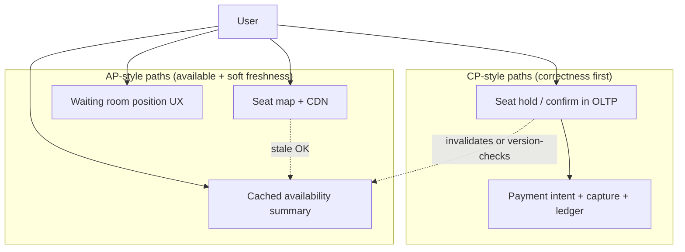
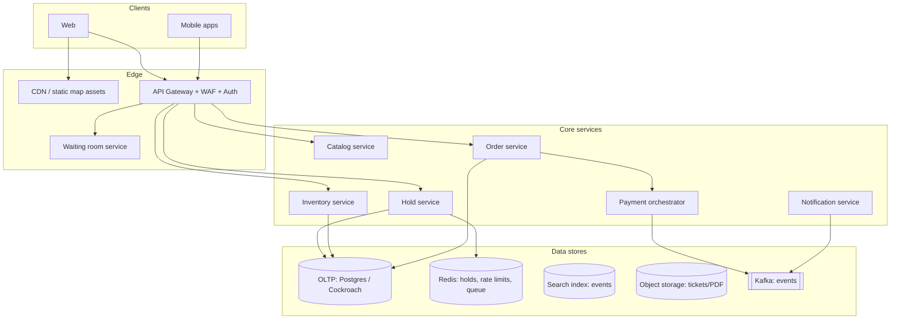
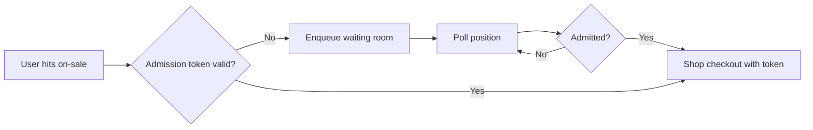
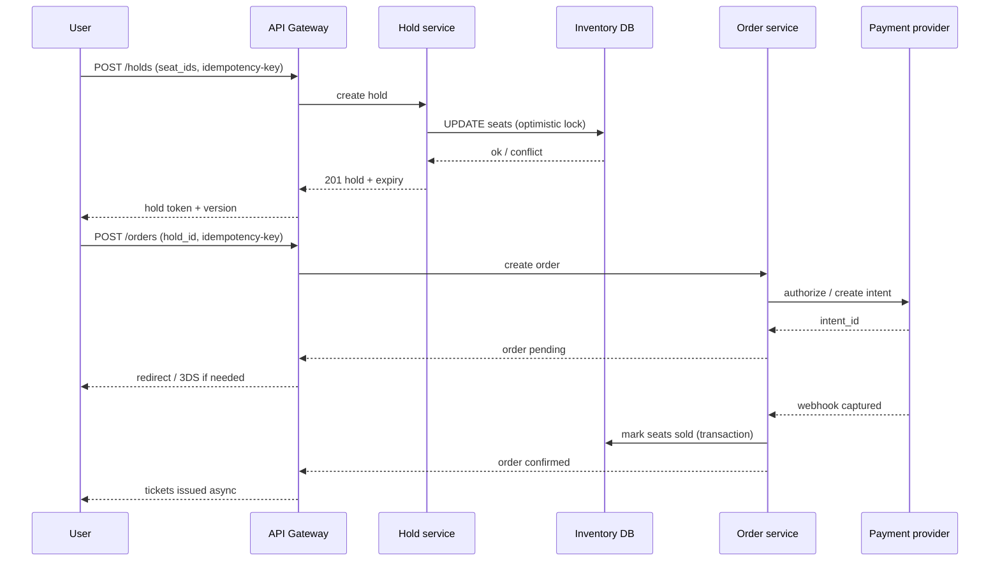
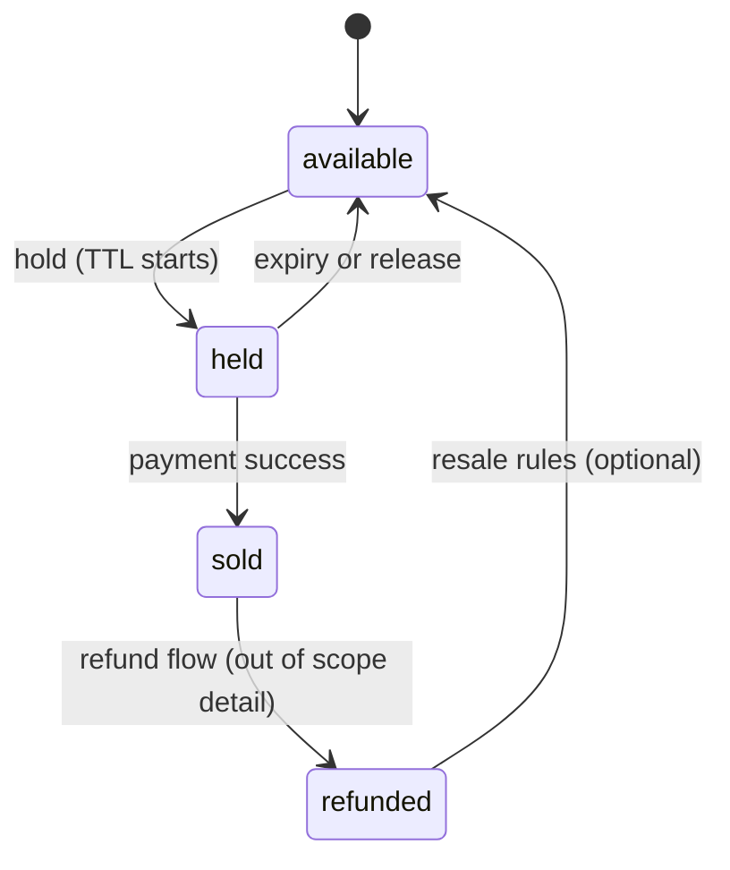
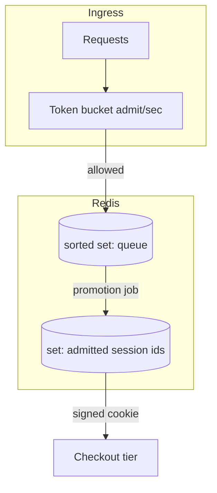

# Event Booking (Ticketmaster)
{: .no_toc }

<details open markdown="block">
  <summary>Table of contents</summary>
  {: .text-delta }
1. TOC
{:toc}
</details>

---

## What We're Building

An **event ticketing platform** where organizers list concerts, sports, and theater shows; fans browse seat maps; and the system sells **finite seats** under extreme concurrency—similar in spirit to Ticketmaster, AXS, or regional primary ticketers.

**Core capabilities in scope:**

- Catalog of events, venues, and show times with configurable seat maps
- Real-time (or near-real-time) seat availability and pricing tiers
- Hold seats temporarily while the user completes checkout, then confirm or release
- Payment capture with timeouts, retries, and reconciliation
- Virtual waiting room when demand exceeds safe admission rates to the purchase flow
- Notifications: order confirmation, payment failure, seat released, waitlist or resale (optional)

### Why Event Booking Is Hard

| Challenge | Description |
|-----------|-------------|
| **Finite inventory** | Every seat is a row in a hot data set; overselling destroys trust and legal compliance |
| **Flash crowds** | On-sales spike QPS by orders of magnitude; naive DB designs collapse |
| **Long transactions** | Users need minutes to pay; inventory must stay consistent without blocking the world |
| **Fairness vs bots** | Rate limits, proof-of-work, and queues are all imperfect; abuse is continuous |
| **Payments** | Card auth, 3DS, partial failures, idempotent retries, and chargebacks |

### Comparison to Adjacent Systems

| System | Similarity | Difference |
|--------|------------|------------|
| **E-commerce catalog** | SKUs, cart, checkout | Seats are **non-fungible** and **geo-addressed** (section, row, seat) |
| **Ride sharing** | Peak load, payments | No continuous GPS; **inventory is discrete** and **lockable** |
| **Airline booking** | Holds, fare classes, GDS complexity | Venues use **static seat maps**; fewer routing rules, more **UI-heavy selection** |

{: .note }
> In interviews, separate **search/browse** (read-heavy, cacheable) from **purchase** (write-heavy, consistency-sensitive). The deep dive usually lands on **inventory**, **locking**, **queues**, and **payments**.

---

## Step 1: Requirements

### Functional Requirements

| Requirement | Priority | Description |
|-------------|----------|-------------|
| List events and show times | Must have | Filters: city, date, artist/team, venue |
| Seat map display | Must have | Sections, rows, seats; accessible seating; obstructed view flags |
| Check availability | Must have | Per-seat or per-block availability depending on map model |
| Reserve / hold seats | Must have | Time-bounded hold while user pays |
| Purchase / confirm | Must have | Idempotent order creation; payment capture |
| Release holds on timeout or failure | Must have | Seats return to salable pool |
| Order history | Must have | Per-user list and ticket delivery (PDF, wallet pass, or mobile) |
| Virtual waiting room | Should have | Admission control when overloaded |
| Transfer / resale | Nice to have | Policy, fraud, and secondary market rules (often a separate product) |

**Clarifying questions (typical)**

| Question | Why it matters |
|----------|----------------|
| Primary-only or resale? | Inventory source, pricing rules, legal |
| Static seat map per venue? | Caching, CDN for map tiles vs dynamic overlays |
| Payment methods? | Wallets, 3DS, regional methods; timeout lengths |
| International? | Currency, tax, PCI scope, data residency |
| Accessibility compliance? | WCAG for UI; hold rules for assisted purchasing |

### Non-Functional Requirements

| Requirement | Target | Rationale |
|-------------|--------|-----------|
| **Availability** | 99.9%+ for browse; 99.99% for payment partners during on-sale | Revenue and partner SLAs |
| **Consistency** | **No overselling** for the same seat; **strong** per-seat inventory in OLTP | Legal and brand risk |
| **Latency (browse)** | P95 **low hundreds of ms** | SEO and conversion |
| **Latency (checkout)** | P95 **sub-second** for hold/confirm on hot path where possible | Abandonment |
| **Throughput** | Survive **10–100×** traffic spikes during popular on-sales | Queue + scale-out |
| **Durability** | Orders and payments **auditable** for years | Chargebacks, taxes |

{: .warning }
> At scale, **exactly-once** processing is a narrative convenience. Implement **idempotency keys**, **at-least-once** delivery with deduplication, and **reconciliation** jobs. Claim **strong** consistency only where your storage and transaction boundaries actually provide it.

### API Design

**Transports**

- **HTTPS/JSON** (or gRPC) for synchronous APIs: catalog, holds, orders
- **WebSocket or SSE** for optional live seat map updates (often throttled)
- **Message queue** for async: payment webhooks, email, analytics

**Representative REST-style endpoints**

| Operation | Method | Purpose |
|-----------|--------|---------|
| `GET /v1/events` | HTTP | Search and list events |
| `GET /v1/events/{id}/shows` | HTTP | Show times for an event |
| `GET /v1/shows/{id}/seat-map` | HTTP | Seat map metadata and availability snapshot |
| `POST /v1/shows/{id}/holds` | HTTP | Create time-bounded seat hold (idempotency key) |
| `DELETE /v1/holds/{id}` | HTTP | Explicit release |
| `POST /v1/orders` | HTTP | Create order from hold; attach payment method |
| `POST /v1/payments/{id}/confirm` | HTTP | Confirm or capture (idempotency key) |
| `POST /v1/waiting-room/sessions` | HTTP | Enter queue; get token and poll URL |

**Idempotency**

| Header | Use |
|--------|-----|
| `Idempotency-Key: <uuid>` | `POST` holds, orders, payment confirms |

**Hold response (illustrative)**

```json
{
  "hold_id": "hld_01hq",
  "show_id": "shw_99ab",
  "seat_ids": ["sec-A-12-4", "sec-A-12-5"],
  "expires_at_ms": 1712000000000,
  "price_cents": 17800,
  "currency": "USD",
  "version": 3
}
```

`version` supports optimistic concurrency on the hold or seat aggregate.

{: .tip }
> Return **`expires_at`** and a **`server_time`** so clients can show countdowns without drift arguments. Always enforce expiry **server-side**.

### Technology Selection & Tradeoffs

Interviewers want to hear **constraints first**: concurrent seat writes need **serializable semantics per seat** (or equivalent), order flows need **durability and replay**, and browse traffic needs **cheap reads**. Below is a concise comparison you can narrate, then collapse to “our choice.”

#### Database: PostgreSQL vs MySQL vs DynamoDB (concurrent seat booking)

| Dimension | PostgreSQL | MySQL (InnoDB) | DynamoDB |
|-----------|------------|----------------|----------|
| **Row-level locking** | Strong; `SELECT … FOR UPDATE`, MVCC | Strong; similar InnoDB model | No classic SQL row lock; use **conditional writes** (`ConditionExpression`) |
| **Transactions** | Rich SQL, **SERIALIZABLE** when needed | Good; isolation nuances differ by version | **TransactWriteItems** (limited items/second per partition); hot partitions need careful key design |
| **Constraints & uniqueness** | **UNIQUE**, `CHECK`, deferrable constraints | Similar | **Conditional** puts; uniqueness via GSIs with careful modeling |
| **Concurrent “claim seat”** | Single-row `UPDATE … WHERE status AND version` or `FOR UPDATE` in short txn | Same idea | **Optimistic** single-item updates; avoid multi-seat transactions across many partitions unless batched |
| **Ops & ecosystem** | Mature, JSON, extensions | Ubiquitous hosting | Serverless scale, **partition** design is make-or-break |

**Why it matters for seats:** Double-booking is prevented by **atomic transitions** on authoritative seat rows (or keys). SQL databases express **multi-seat holds in one transaction** naturally. DynamoDB can work at huge scale but you **design for partition limits** and often use **application-level sagas** or **item collections** with careful contention control.

#### Queue: Kafka vs RabbitMQ vs SQS (order processing)

| Dimension | Apache Kafka | RabbitMQ | Amazon SQS |
|-----------|--------------|----------|------------|
| **Ordering** | Per-partition order; replayable log | Queues + optional ordering plugins | **FIFO** queues for order; standard is best-effort |
| **Throughput & replay** | Excellent for **event sourcing**, replay consumers | Strong for task queues; replay is not the core model | Simple; DLQ + visibility timeout |
| **Use case fit** | **Outbox**, `OrderConfirmed`, analytics, search sync | **Job** workflows, payment retry workers | **Managed** webhooks, fan-out with SNS |
| **Ops** | Cluster expertise | Moderate | Low ops on AWS |

**Narrative:** Use a **log (Kafka)** when many services must **consume the same facts** idempotently (tickets issued, search index, fraud). Use **SQS** when you want **minimal ops** and at-least-once workers. Use **RabbitMQ** when you need **complex routing** and classic broker patterns.

#### Cache: Redis for seat maps and availability

| Pattern | What to cache | Risk |
|---------|----------------|------|
| **Static geometry** | Section polygons, SVG paths, venue metadata | Safe; long TTL + versioning |
| **Availability snapshot** | Section-level counts, “heat maps” | **Stale reads**; must label **approximate** and refresh on selection |
| **Per-seat availability in Redis** | Possible as **accelerator** | **Never** treat as source of truth for sale; DB/Dynamo is authoritative |

Redis also backs **rate limits**, **waiting-room tokens**, and **short-lived hold metadata** (with TTL), which is orthogonal to “cache” but shares the same infrastructure.

#### Payment integration: synchronous vs asynchronous; Stripe vs PayPal vs custom

| Approach | Pros | Cons |
|----------|------|------|
| **Synchronous API** (create intent, return client secret) | Simple mental model for interview | Long user steps (3DS); **don’t** hold DB locks |
| **Async (webhooks + polling)** | Matches PSP reality; resilient | Must handle duplicates, delays, **reconciliation** |

| Provider | Strengths | Interview angle |
|----------|-----------|-----------------|
| **Stripe** | APIs, idempotency, Connect for marketplaces | Default **north-star** example for intents + webhooks |
| **PayPal** | Buyer familiarity; different flows | Emphasize **two-phase** flows and region-specific behavior |
| **Custom / bank** | Control, cost | **PCI** scope, certification time, **you** own retries and audits |

**Why async wins in production:** Card networks and mobile clients are unreliable; **webhooks are at-least-once**. Your system must be **idempotent** and **reconcilable** regardless of sync/async surface.

#### Distributed locking: Redis `SETNX` vs database `FOR UPDATE` vs optimistic locking

| Mechanism | When it shines | Failure modes |
|-----------|----------------|---------------|
| **Optimistic locking** (`version` on seat row) | **Short** transactions; high contention on *different* seats | Retries; **user-visible** “someone took it” |
| **`SELECT … FOR UPDATE`** | **Low** contention per row; must keep txn **milliseconds** | Lock wait storms; **deadlocks** if ordering wrong |
| **Redis `SET` with NX + expiry** | **Coarse** locks, **rate limiting**, **waiting room** | Not your **authoritative** inventory unless you build **2PC**-level discipline; **clock/lease** bugs |

{: .warning }
> For **authoritative seat sale**, prefer **database-enforced** state transitions (constraints + versioning) on the OLTP store. Redis locks are great for **admission** and **coordination**, not as the **only** line of defense against oversell.

**Our choice (example stack):**

| Layer | Choice | Rationale |
|-------|--------|-----------|
| **OLTP** | **PostgreSQL** (or CockroachDB for global SQL) | Rich transactions, constraints, and familiar locking for **per-show** shards |
| **Queue / events** | **Kafka** (or **SQS** on AWS for simpler ops) for outbox and notifications | Durable ordering and replay for downstream systems |
| **Cache / coordination** | **Redis** | TTL holds metadata, rate limits, waiting room; **optional** cached availability with clear staleness rules |
| **Payments** | **Stripe**-style intents + **async** webhooks + **reconciliation** | Industry-default pattern; minimize PCI scope with hosted flows |
| **Locking model** | **Optimistic** seat rows + **short** pessimistic spans where needed; **no** long DB locks | Matches flash-sale contention and payment latency reality |

---

### CAP Theorem Analysis

CAP is a **coarse lens**: in practice you choose **per operation** and **per data product** (OLTP vs cache vs search), not one label for the whole company.

| Subsystem | CAP tendency | Why |
|-----------|--------------|-----|
| **Seat reservation / sale** | **CP** | **Duplicate sale of one seat** is worse than a slow response. Prefer **correctness** and **failure** (409, retry) over showing two users “success” for the same seat |
| **Seat map display (cached CDN + API)** | **AP** (with stale bounds) | Browsing can tolerate **seconds** of staleness if the **checkout path re-validates**. Availability and low latency beat perfect global freshness |
| **Payment processing** | **CP** with **external PSP** | Money movement must be **reconciled**; duplicates are handled by **idempotency** and **ledger** semantics, not by “eventual maybe” |
| **Waitlist / queue position** | **AP**-friendly | **Fair ordering** can be approximate; showing position is **best-effort**; **admission tokens** matter more than millisecond-accurate ranks |

{: .note }
> “CP vs AP” is shorthand. Interviewers often reward naming **linearizability** for a single seat record, **serializable** transactions for multi-seat holds, and **bounded staleness** for read replicas and caches.



**How to say it in one breath:** We are **CP on inventory and money**, **AP on browse and queue UX**, and we **never trust the cache** for the final seat claim.

---

### SLA and SLO Definitions

SLAs are **contracts** (often with money); **SLOs** are internal targets; **SLIs** are what you measure. Below are **candidate** SLOs for a primary ticketing platform—tune numbers to your “billion-dollar on-sale” story.

#### SLIs and SLOs (examples)

| Area | SLI | SLO target (example) | Notes |
|------|-----|----------------------|-------|
| **Booking confirmation** | `POST /orders` + `confirm` **success latency** (server-side) | **P95 < 800 ms**, **P99 < 2 s** excluding 3DS user time | Measure at orchestrator; separate **user think time** |
| **Seat availability accuracy** | Fraction of holds that fail **after** client saw seat “available” | **< 0.1%** false-positive **selection** per session | Drives UX copy: “availability not guaranteed until held” |
| **Payment success rate** | Captures / (captures + hard declines) for valid intents | **> 98%** for healthy traffic (excl. user error) | Track PSP outages separately |
| **On-sale availability** | **Successful** hold attempts / attempted holds | **> 95%** during declared incident-free windows | Distinct from **seat** sell-through |
| **System availability (browse)** | Successful `GET` requests for catalog and map divided by all attempts | **99.9%** monthly | Exclude client errors; define **dependency** SLOs for PSP |

#### Error budget policy

| Principle | Policy |
|-----------|--------|
| **Budget consumption** | If **booking confirmation** error budget burns fast in a release window, **freeze** feature work and prioritize reliability |
| **Dependency burn** | If PSP SLI drops, **page** payments on-call; **scale** webhook workers; **do not** “fix” by caching payments |
| **On-sale events** | **Stricter** monitoring; **pre-allocated** capacity; **feature flags** to shed non-critical work (recommendations, heavy analytics) |

{: .tip }
> Tie **SLOs** to product language: “held” means **server guarantee**; “green seat” on map is **indicative**. That alignment reduces false expectations and support load.

---

### Database Schema

Schemas below are **illustrative**—interviews care that you separate **catalog**, **inventory**, **reservation**, and **payment**, with clear **state** and **idempotency**.

#### `events`

| Column | Type | Notes |
|--------|------|-------|
| `id` | `UUID` / `BIGSERIAL` | Primary key |
| `name` | `TEXT` | Display name |
| `venue_id` | `UUID` | FK to `venues` (not shown) |
| `starts_at`, `ends_at` | `TIMESTAMPTZ` | Event window |
| `capacity` | `INT` | **Venue** or **sellable** cap—define one meaning and stick to it |
| `status` | `ENUM` | e.g. `draft`, `published`, `cancelled` |
| `created_at`, `updated_at` | `TIMESTAMPTZ` | Audit |

**Show times:** Often **`shows`** (or `event_occurrences`) with `event_id`, `starts_at`, `on_sale_at`—one event, many performances.

#### `seats` / inventory

| Column | Type | Notes |
|--------|------|-------|
| `id` | `BIGSERIAL` | Surrogate PK optional |
| `show_id` | `UUID` | **Shard key** candidate |
| `section` | `TEXT` | e.g. `A` |
| `row_id` | `TEXT` | e.g. `12` |
| `seat` | `TEXT` | e.g. `4` |
| `status` | `ENUM` | `available`, `held`, `sold`, `blocked` |
| `price_cents` | `BIGINT` | Or FK to `price_tiers` |
| `version` | `INT` | **Optimistic locking** |
| `hold_id` | `UUID` NULL | Optional FK to active hold |
| `updated_at` | `TIMESTAMPTZ` | |

**Constraints (examples):**

- `UNIQUE (show_id, section, row_id, seat)` — one logical seat per show.
- Check allowed **`status`** transitions in app or **FSM** + constraints.

#### `reservations` / `holds` and `bookings`

**`holds`**

| Column | Type | Notes |
|--------|------|-------|
| `id` | `UUID` | PK |
| `user_id` | `UUID` | Owner |
| `show_id` | `UUID` | |
| `seat_ids` | `UUID[]` or child table `hold_seats` | Normalizing to **`hold_seats(show_id, seat_id)`** is often clearer |
| `status` | `ENUM` | `active`, `released`, `converted` |
| `expires_at` | `TIMESTAMPTZ` | **Server authority** |
| `idempotency_key` | `TEXT` UNIQUE | Client retry safety |
| `created_at` | `TIMESTAMPTZ` | |

**`orders` / `bookings`**

| Column | Type | Notes |
|--------|------|-------|
| `id` | `UUID` | Order id |
| `user_id` | `UUID` | |
| `show_id` | `UUID` | |
| `hold_id` | `UUID` UNIQUE NULL | If created from hold |
| `status` | `ENUM` | `pending_payment`, `confirmed`, `cancelled`, `refunded` |
| `total_cents` | `BIGINT` | |
| `currency` | `CHAR(3)` | |
| `idempotency_key` | `TEXT` UNIQUE | **Order** creation idempotency |
| `payment_id` | `UUID` NULL | FK to `payments` |
| `created_at`, `updated_at` | `TIMESTAMPTZ` | |

Child table **`order_items`** (or `booking_lines`): `order_id`, `show_id`, `seat_id`, `price_cents`.

#### `payments`

| Column | Type | Notes |
|--------|------|-------|
| `id` | `UUID` | PK |
| `order_id` | `UUID` | FK |
| `provider` | `TEXT` | `stripe`, etc. |
| `provider_intent_id` | `TEXT` UNIQUE | PSP reference |
| `amount_cents` | `BIGINT` | |
| `currency` | `CHAR(3)` | |
| `status` | `ENUM` | `requires_action`, `processing`, `succeeded`, `failed` |
| `idempotency_key` | `TEXT` UNIQUE | Align with PSP |
| `raw_event_id` | `TEXT` NULL | Last processed webhook id for dedup |
| `created_at`, `updated_at` | `TIMESTAMPTZ` | |

{: .note }
> **Normalize** “one row per seat” vs “JSON array of seats” based on reporting needs; **query patterns** and **locking** are easier with **`hold_seats`** and **`order_items`** as first-class rows.

---

## Step 2: Back-of-the-Envelope Estimation

### Assumptions (illustrative national service)

```
- Monthly active users (browsing): 30 million
- Major on-sale for a stadium: 50,000 seats
- Purchase window: seats sell in 10–30 minutes (flash) or hours (slow)
- Average hold time before checkout success or abandon: 8 minutes
- Seat map reads during flash: 10 per active user per minute (polling + retries)
```

### Peak Read QPS (seat map + availability)

```
If 200,000 concurrent users hammer a single on-sale:
Seat map reads ≈ 200,000 × (10 / 60) ≈ 33,000 RPS (upper bound before caching)
```

CDN and edge caching of **static map geometry** plus **server-driven availability chunks** reduce origin load.

### Write QPS (holds and releases)

```
Not every user obtains a hold; assume 10% get a concurrent hold slot: 20,000 holds.
If each user retries holds 3 times over 5 minutes: extra writes.
Peak hold attempts might reach 2,000–10,000 TPS depending on product rules and queue depth.
```

{: .note }
> Order-of-magnitude numbers justify **sharding** by `show_id`, **queue-based admission**, and **avoiding a single global row** for inventory.

### Storage (orders of magnitude)

| Data | Illustrative volume | Notes |
|------|---------------------|-------|
| Events / shows | Millions of rows | Mostly cold |
| Seat inventory | Billions of seat-state rows over time | Partition by show |
| Orders | Millions per month | Immutable facts + refunds |
| Payment intents | Same order of magnitude as orders | Idempotent by key |

---

## Step 3: High-Level Design

### Architecture Overview



**Responsibilities**

| Component | Role |
|-----------|------|
| **Waiting room** | Token bucket admission; position updates; redirect to checkout |
| **Catalog** | Event metadata; read-heavy; cache and CDN |
| **Inventory** | Authoritative seat state per show; transactional updates |
| **Hold** | Short-lived reservation; ties to user/session; drives expiry workers |
| **Order + Payment** | Idempotent order creation; PSP integration; compensating releases |
| **Kafka** | Outbox pattern for email, analytics, search index updates |

{: .note }
> Sharding key is often **`show_id`** (or `event_id` + `show_time_id`). Cross-show transactions are rare in the hot path.

---

## Step 4: Deep Dive

### 4.1 Seat Inventory and Locking

**Models**

| Model | Pros | Cons |
|-------|------|------|
| **Per-seat row** | Fine-grained locking; clear semantics | Many rows; hot partitions |
| **Block aggregation** | Fewer rows for GA | Harder to express exact seats without expansion |
| **Hybrid** | GA as blocks; reserved seating as rows | More application logic |

**Pessimistic locking**

- `SELECT … FOR UPDATE` on seat rows inside a transaction while creating a hold.
- Good when contention per row is moderate and transactions are short.
- Risk: long transactions during PSP calls—**do not** hold DB locks across payment.

**Optimistic locking**

- Each seat row carries `version` (integer) or `etag`.
- `UPDATE seats SET status='held', version=version+1 WHERE id=? AND version=? AND status='available'`
- If count of updated rows `< requested`, abort or retry with backoff.

{: .warning }
> Mixing **long** user think time with **pessimistic** locks is a classic anti-pattern. Use **short** DB transactions to flip state; use **application-level hold records** with TTL for the user-facing timer.

### 4.2 Handling High-Concurrency Ticket Sales

| Technique | Purpose |
|-----------|---------|
| **Queue / waiting room** | Smooth admission; protect origin |
| **Shard by show** | Isolate hot shows |
| **Cache static map** | Reduce repeated geometry work |
| **Coalesce availability** | Precompute section-level counts; refine on selection |
| **Rate limiting** | Per IP, per account, per device fingerprint (defense in depth) |
| **Pre-auth capacity** | Pre-warm connections and pools for known on-sales |

### 4.3 Virtual Queue and Waiting Room

**Goals**

- Bound concurrent users in the checkout path
- Provide **fair-ish** ordering without exposing the system to full flash load
- Degrade gracefully: show **position** and **ETA**, not raw 500s



**Implementation sketch**

- Issue signed, short-lived **JWT** or opaque server ticket with `show_id`, `queue_id`, `exp`.
- Redis **sorted set** or **stream** for queue ordering; periodic promotion into `admitted` set.
- **Token bucket** at edge: N new entries per second into the active shopping pool.

### 4.4 Payment and Order Processing

**Happy path**

1. User admitted; creates **hold** with TTL.
2. Client calls `POST /orders` with `hold_id` and `Idempotency-Key`.
3. Payment orchestrator creates **PaymentIntent** with provider.
4. On provider webhook or client confirmation, **capture** funds.
5. Mark order **confirmed**; emit `OrderConfirmed` event; issue tickets.

**Failure and timeout**

- If hold expires before capture: **release seats** via state transition.
- If payment fails: same release path; user sees actionable error.
- If webhook delayed: reconciliation job queries PSP by `idempotency_key`.

{: .tip }
> Store **payment state** and **inventory state** transitions in **one OLTP** transaction only when your PSP supports synchronous steps or you use **saga** with compensations. Many designs **confirm order** only after async capture; compensate with **release** if capture never succeeds.

### 4.5 Preventing Double Booking

| Layer | Mechanism |
|-------|-----------|
| **Database** | Unique constraint on `(show_id, seat_id, state)` transitions; version checks |
| **Application** | Single active hold per seat; state machine rejects illegal transitions |
| **Idempotency** | Same `Idempotency-Key` returns same order for retries |
| **Reconciliation** | Nightly job compares sold seats vs payment ledger |

**Oversell invariant**

> For any seat `s` at show `sh`, at most one **confirmed** order owns `s` at any time.

### 4.6 Seat Map and Selection

- **Vector or tiled map** for static geometry; CDN cached.
- **Availability overlay** from API: coarse chunks (e.g., section-level) on first paint; fine-grained fetch on zoom or section click.
- **Optimistic UI** can show seats briefly; server must **authoritatively** confirm hold.

### 4.7 Notification and Confirmation

- On `OrderConfirmed`, enqueue email/SMS with ticket links.
- Mobile wallet passes generated asynchronously; link order to **immutable** ticket IDs.
- Retry with exponential backoff; DLQ for manual replay.

---

## Step 5: Scaling & Production

| Area | Practice |
|------|----------|
| **Database** | Partition by show; avoid cross-shard transactions on hot path |
| **Caching** | Cache catalog; **never** treat cache as authoritative for seat sale |
| **Queues** | Kafka for outbox; consumer idempotency |
| **Observability** | Traces from gateway through hold to payment; SLO on confirm latency |
| **Chaos / load tests** | Replay on-sale patterns; verify queue sheds load without dropping invariants |
| **Compliance** | PCI scope minimization (use hosted fields / tokenization) |

**Failure modes**

| Symptom | Likely cause | Mitigation |
|---------|--------------|------------|
| Spikes of 409 on hold | Contention / oversubscribed seats | Client backoff; optional queue |
| DB hot shard | Single mega-show | Shard movement; read replicas for non-authoritative paths |
| Duplicate charges | Retries without idempotency | Idempotency keys end-to-end |

---

## Interview Tips

### Interview Checklist

- [ ] Clarify **inventory model**: reserved seating vs GA vs mixed
- [ ] Separate **browse** vs **purchase** paths and consistency needs
- [ ] State **oversell prevention**: transactions, versioning, unique constraints
- [ ] Explain **hold TTL** and **release** on payment failure or timeout
- [ ] Cover **waiting room**: admission control, fairness, client polling
- [ ] Mention **idempotency** for holds, orders, and payments
- [ ] Discuss **sharding** by show and **async** notifications
- [ ] Acknowledge **bots** and abuse only at a high level unless prompted

### Sample Interview Dialogue

**Interviewer:** "Design Ticketmaster."

**You:** "I'll assume primary ticketing: users pick seats from a map, we hold seats briefly while they pay, and we must never oversell. I'll start with requirements, then API, estimate load for a stadium on-sale, then a high-level architecture with inventory, holds, payments, and a waiting room for flash traffic."

**Interviewer:** "How do you prevent double booking?"

**You:** "At the core, each seat row for a show has a state machine: available, held, sold. I use short DB transactions with optimistic locking—increment a version when I transition from available to held—so concurrent purchasers can't both succeed. I also enforce a unique constraint on active holds per seat if I model holds as rows. Holds expire quickly; payment happens outside the DB lock, and I release on timeout."

**Interviewer:** "What if a million users hit the site?"

**You:** "I can't let them all hit the inventory service. I add a virtual waiting room that admits tokens at a sustainable rate, backed by Redis or similar. Static seat map assets come from CDN. Inventory is sharded by show so one hot concert doesn't take down unrelated events."

**Interviewer:** "How do you handle payment retries?"

**You:** "Every mutating call carries an idempotency key. The order service stores the key and returns the same response on retries. Payment webhooks are deduplicated by provider event ID. If I'm unsure, a reconciliation job compares our orders with the PSP."

---

## Summary

| Topic | Takeaway |
|-------|----------|
| **Inventory** | Per-seat state with **short transactions**; optimistic or pessimistic locking inside tight scopes |
| **Flash crowds** | **Virtual waiting room**, shard by show, CDN for static map data |
| **Payments** | **Idempotency**, timeouts, **release holds** on failure, reconciliation |
| **Correctness** | **No oversell**: DB constraints + versioning + audits |
| **UX** | Honest queue position; clear hold expiry; resilient retries |

---

## Appendix: Diagrams and Code

### Booking sequence (hold, pay, confirm)



### Seat locking state machine



### Virtual queue (promotion)



### Java: optimistic seat reservation (JDBC-style)

```java
public final class SeatReservation {
  public record Result(boolean success, int newVersion) {}

  public Result tryHold(Connection c, long showId, String seatId, int expectedVersion)
      throws SQLException {
    final String sql =
        "UPDATE seats SET status = 'HELD', version = version + 1, updated_at = now() "
            + "WHERE show_id = ? AND seat_id = ? AND status = 'AVAILABLE' AND version = ?";
    try (PreparedStatement ps = c.prepareStatement(sql)) {
      ps.setLong(1, showId);
      ps.setString(2, seatId);
      ps.setInt(3, expectedVersion);
      int updated = ps.executeUpdate();
      if (updated == 0) {
        return new Result(false, expectedVersion);
      }
      try (PreparedStatement sel =
          c.prepareStatement(
              "SELECT version FROM seats WHERE show_id = ? AND seat_id = ?")) {
        sel.setLong(1, showId);
        sel.setString(2, seatId);
        try (ResultSet rs = sel.executeQuery()) {
          rs.next();
          return new Result(true, rs.getInt("version"));
        }
      }
    }
  }
}
```

### Python: queue position and admission (Redis)

```python
import time
import redis

r = redis.Redis(host="localhost", port=6379, decode_responses=True)

def enqueue(show_id: str, session_id: str) -> int:
    key = f"queue:{show_id}"
    now = time.time()
    r.zadd(key, {session_id: now})
    rank = r.zrank(key, session_id)
    return int(rank or 0)

def queue_position(show_id: str, session_id: str) -> int:
    key = f"queue:{show_id}"
    rank = r.zrank(key, session_id)
    return -1 if rank is None else int(rank)

def promote_and_admit(show_id: str, batch_size: int, ttl_sec: int) -> list[str]:
    key = f"queue:{show_id}"
    admit_key = f"admitted:{show_id}"
    ids = r.zrange(key, 0, batch_size - 1)
    pipe = r.pipeline()
    for sid in ids:
        pipe.zrem(key, sid)
        pipe.setex(f"{admit_key}:{sid}", ttl_sec, "1")
    pipe.execute()
    return list(ids)
```

{: .note }
> Production systems add **signed tokens**, **fairness** (slow bots), **reaping** expired sessions, and **multi-region** concerns. This snippet shows **ordering** and **batch promotion** only.

### Go: booking handler with idempotency and hold expiry

```go
package booking

import (
	"context"
	"database/sql"
	"errors"
	"time"
)

type Store interface {
	TryCreateOrder(ctx context.Context, idempotencyKey, holdID string) (string, error)
}

type Handler struct {
	DB    *sql.DB
	Store Store
}

func (h *Handler) CreateOrder(ctx context.Context, idempotencyKey, holdID string) (string, error) {
	if idempotencyKey == "" {
		return "", errors.New("missing idempotency key")
	}
	existing, err := h.Store.TryCreateOrder(ctx, idempotencyKey, holdID)
	if err == nil && existing != "" {
		return existing, nil
	}
	if err != nil {
		return "", err
	}

	tx, err := h.DB.BeginTx(ctx, &sql.TxOptions{Isolation: sql.LevelReadCommitted})
	if err != nil {
		return "", err
	}
	defer tx.Rollback()

	var exp time.Time
	var status string
	q := `SELECT status, expires_at FROM holds WHERE hold_id = $1 FOR UPDATE`
	if err := tx.QueryRowContext(ctx, q, holdID).Scan(&status, &exp); err != nil {
		return "", err
	}
	if status != "ACTIVE" || time.Now().After(exp) {
		return "", errors.New("hold inactive or expired")
	}

	orderID := newOrderID()
	_, err = tx.ExecContext(ctx,
		`INSERT INTO orders (order_id, hold_id, idempotency_key, state, created_at)
		 VALUES ($1, $2, $3, 'PENDING_PAYMENT', now())`,
		orderID, holdID, idempotencyKey,
	)
	if err != nil {
		return "", err
	}
	if err := tx.Commit(); err != nil {
		return "", err
	}
	return orderID, nil
}

func newOrderID() string {
	return time.Now().UTC().Format("20060102150405") + "-ord"
}
```

{: .warning }
> The Go example is illustrative: **production** code needs structured errors, context deadlines, metrics, and PSP integration. The **idempotent** path must be enforced with a **unique** constraint on `idempotency_key` in `orders`.

---

### Additional Table: Hold vs payment timeouts

| Timer | Typical value | Action |
|-------|----------------|--------|
| Hold TTL | 5–15 minutes | Release seats; clear hold |
| Payment authorization | PSP-dependent | Cancel intent if abandoned |
| Webhook slack | Minutes | Reconcile with PSP query-by-intent |

### Additional Table: Consistency wording for interviews

| Phrase | Safe usage |
|--------|------------|
| Strong consistency | Per shard / single transaction boundary |
| Linearizable | For a single seat row with proper DB guarantees |
| Eventual | Read models, search index, email delivery |

---

## Closing Notes

Event ticketing is a **inventory-first** problem: every design decision should trace back to **seat state**, **money state**, and **user-visible latency**. Show that you can combine **optimistic locking**, **TTL holds**, **idempotent APIs**, and **queue-based admission** without contradicting yourself. When interviewers push on **bots**, answer with **layered defenses** and **business trade-offs**, not a single magic filter.
