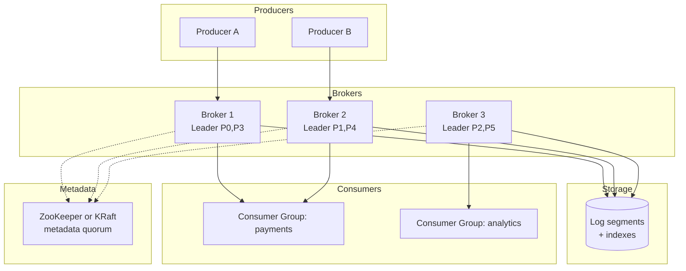
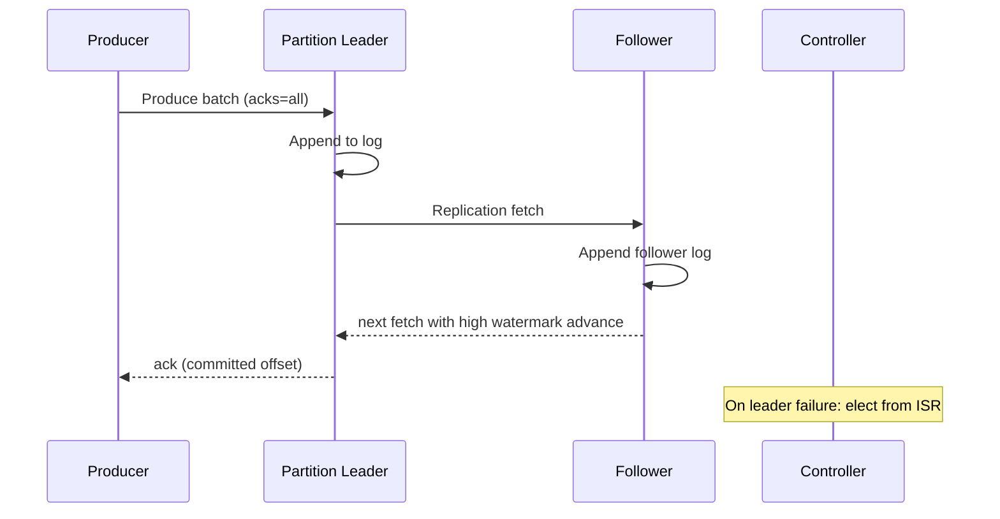
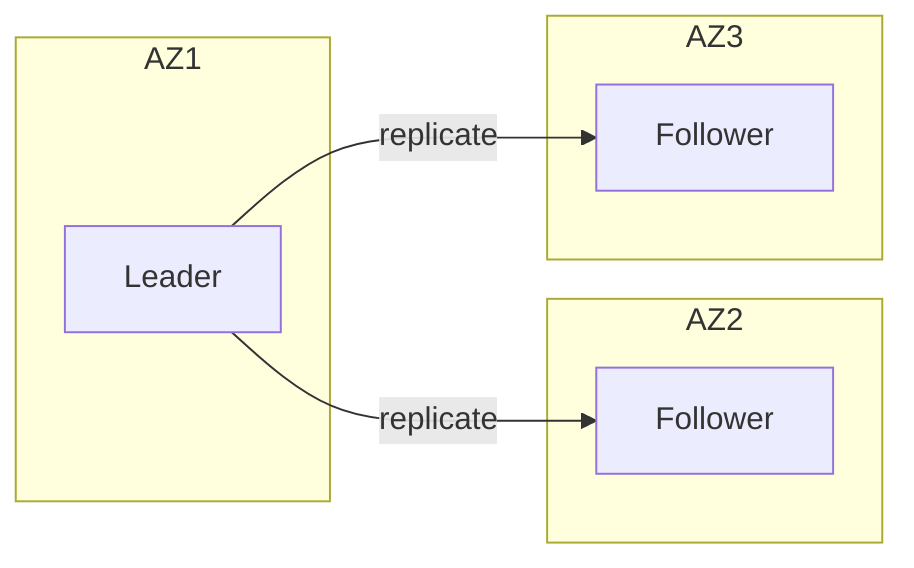
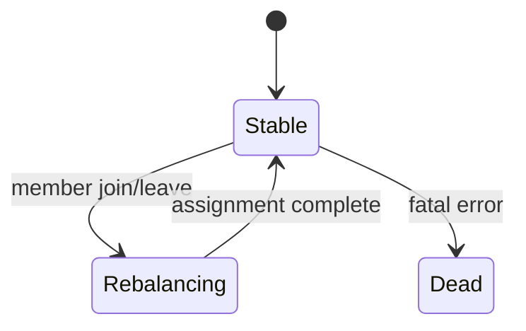

# Design a Distributed Message Queue (Kafka-like)
{: .no_toc }

<details open markdown="block">
  <summary>Table of Contents</summary>
  {: .text-delta }
1. TOC
{:toc}
</details>

---

## What We're Building

A **distributed message queue** (or **log-centric streaming platform**) decouples producers and consumers with a **durable, partitioned append-only log**. Unlike a classic work queue that deletes messages after consumption, systems like **Apache Kafka** retain records for a configurable time or size and allow **many independent consumer groups** to read the same data at their own pace—with **replay** for recovery and analytics.

| Capability | Why it matters |
|------------|----------------|
| **Durability & replay** | Reprocess history after bugs, schema changes, or new consumers |
| **Horizontal throughput** | Partition the log; scale brokers and consumers independently |
| **Backpressure-friendly** | Consumers pull; slow readers do not collapse producers if disk retention holds |
| **Ordering where it counts** | Per-partition order gives a practical compromise vs global order |

**Real-world systems:**

| System | Positioning |
|--------|-------------|
| **Apache Kafka** | Durable partitioned log, consumer groups, strong ecosystem (Connect, Streams) |
| **Apache Pulsar** | Tiered storage, multi-tenancy, broker–bookkeeper separation |
| **RabbitMQ** | General-purpose broker, exchanges/routing, classic queues + streams plugin |
| **Amazon Kinesis / GCP Pub/Sub** | Managed streaming with cloud operational model |

**Types of messaging:**

| Pattern | Behavior | Typical use |
|---------|----------|-------------|
| **Publish/subscribe** | Many subscribers receive copies (or partitioned subsets) of published data | Event buses, metrics pipelines |
| **Point-to-point** | Each message consumed by one worker from a queue | Task queues, job dispatch |
| **Streaming / log** | Ordered, replayable sequence of records; retention is first-class | ETL, CDC, event sourcing |

{: .note }
> In interviews, say explicitly whether you are designing a **classic queue** (delete on ack) or a **log** (retain + offsets). Kafka-style designs are usually **log + consumer offsets**; RabbitMQ classic queues are closer to **point-to-point** with optional pub/sub via exchanges.

---

## Step 1: Requirements Clarification

### Questions to Ask

| Question | Why it matters |
|----------|----------------|
| Delivery semantics: at-most-once, at-least-once, exactly-once? | Drives producer `acks`, idempotency, transactions, and consumer dedupe |
| Ordering: per-key, per-partition, or global? | Global order rarely scales; partition count and key routing |
| Retention: time-based, size-based, compaction? | Storage sizing, tiered storage, changelog topics |
| Multi-tenancy / quotas? | Isolation, fairness, noisy-neighbor limits |
| Geo: single region vs multi-region replication? | Latency, RPO/RTO, offset semantics, MirrorMaker-style tools |
| Payload size distribution? | Large messages need chunking or separate blob store |
| Who runs consumers: your team vs external teams? | API stability, schema evolution (Avro/Protobuf), SLAs |

### Functional Requirements

| Requirement | Priority | Notes |
|-------------|----------|-------|
| **Publish** records to named **topics** | Must have | Key, value, headers, timestamp |
| **Subscribe** via **consumer groups** | Must have | Each group gets a copy of the stream; partitions assigned to members |
| **At-least-once delivery** (default) | Must have | Retries + idempotent application or dedupe |
| **Per-partition ordering** | Must have | Total order only within a partition |
| **Persistence & replay** | Must have | Seek to offset; retention window |
| **Partitioning** by key | Must have | `hash(key) % num_partitions` for affinity |
| **Admin: create topic, alter replicas, ACLs** | Should have | Production operability |

### Non-Functional Requirements

| Requirement | Target (illustrative) | Rationale |
|-------------|------------------------|-----------|
| **Throughput** | **> 1M messages/sec** cluster-wide | Horizontal scale via partitions and brokers |
| **Latency (p99)** | **&lt; 10 ms** produce/fetch on healthy path | Page cache, batching, zero-copy; cross-AZ hurts |
| **Durability** | No acknowledged write lost on `acks=all` + min ISR | Replication + fsync policy |
| **Availability** | **99.99%** | RF=3, leader election, rack awareness |
| **Elastic scale** | Add brokers; expand partitions (key compatibility) | Operational story |

{: .warning }
> **Exactly-once** in distributed systems is usually **exactly-once semantics for side effects** composed from **idempotent writes + transactional reads/writes** or **transactions + idempotent producer**—not “the network delivered exactly once.” Say that clearly in Staff interviews.

### API Design

Illustrative **REST** for control plane; data plane is **binary TCP** (Kafka protocol) or gRPC in modern variants.

**Topic & produce (sketch):**

```http
POST /v1/clusters/{cluster}/topics/{topic}/records
Content-Type: application/json

{
  "records": [
    { "key": "user-42", "value": "eyJldmVudCI6InB1cmNoYXNlIn0=", "partition": null },
    { "key": "user-42", "value": "...", "partition": null }
  ],
  "acks": "all",
  "idempotence": true
}
```

**Consumer group — fetch:**

```http
GET /v1/clusters/{cluster}/topics/{topic}/partitions/{p}/records?offset=100&max_bytes=1048576
X-Consumer-Group: payments-workers
```

**Python client-style API (conceptual):**

```python
from dataclasses import dataclass
from typing import Iterator, Optional

@dataclass
class Record:
    offset: int
    key: bytes
    value: bytes
    timestamp_ms: int

class Producer:
    def send(
        self,
        topic: str,
        key: Optional[bytes],
        value: bytes,
        *,
        partition: Optional[int] = None,
        acks: str = "all",
    ) -> RecordMetadata: ...

class Consumer:
    def subscribe(self, topics: list[str]) -> None: ...
    def poll(self, timeout_ms: int) -> list[Record]: ...
    def commit(self, offsets: dict[tuple[str, int], int]) -> None: ...
```

{: .tip }
> Mention **metadata service** (topic → partition leaders), **authentication** (SASL), and **compression** (`gzip`, `lz4`, `zstd`) at the boundary—they matter for production.

---

## Step 2: Back-of-Envelope Estimation

### Assumptions

```
- Peak produce: 1M messages/sec (aggregate cluster)
- Average message size: 1 KB (key + value + headers overhead included)
- Replication factor: 3 (3× disk for committed data if all replicas hold full copy)
- Retention: 7 days time-based
```

### Messages per Second per Partition (Sanity)

```
If a topic uses 2,048 partitions at peak:
  1e6 / 2048 ≈ 488 msg/s per partition leader (average)

Skew: hot keys can drive 10–100× average on a single partition — always
provision headroom and monitor per-partition throughput in dashboards.
```

### Traffic & Bandwidth

```
Ingress (producers): 1e6 msg/s × 1 KB ≈ 1 GB/s

With replication factor 3, bytes written to follower replicas
(order-of-magnitude): ~2 GB/s additional inter-broker traffic
(leader → followers), depending on rack layout and ack policy.

Egress to consumers is workload-dependent; often similar order as
ingress for fan-out pipelines (multiple consumer groups multiply reads).
```

**Interview sound bite:** *“I’d separate **client-facing throughput** from **replication fan-out**—they’re different bottlenecks (NIC vs disk vs ISR).”*

### Storage (7-Day Retention)

```
Per second: 1e6 × 1 KB = 1 GB/s
Per day:     1 GB/s × 86,400 s ≈ 86.4 TB/day raw (single copy logical)

Seven days logical (single copy): 86.4 TB × 7 ≈ 605 TB ≈ 0.6 PB

With replication factor 3 on disk for durability: ~1.8 PB physical
(ignoring compression; compression often 2–5× for text-like payloads)
```

{: .note }
> Real clusters use **compression** and **tiered storage** (older segments to object store). Your number should move **order-of-magnitude**, not three decimals.

### Partitions & Brokers (Rough Cut)

```
Goal: each partition leader handles ~10–50 MB/s of produce (SSD and
page-cache friendly — tune in real benchmarks).

1 GB/s aggregate → order 20–100 partition leaders hot at peak
(if perfectly balanced — real workloads need headroom for skew).

If each broker hosts ~2 GB/s NIC sustained budget with replication,
~3–5 brokers minimum for network alone at 1 GB/s ingress — in practice
many more for failure domains, GC pauses, and burst.

Illustrative: 50 brokers × 12 partitions/broker → 600 partitions
(illustrative shard count; Kafka clusters often run thousands of partitions)
```

{: .warning }
> **Hot partitions** (popular keys) blow up this math. Always mention **skew** and **splitting topics** or **salt keys** when estimation is challenged.

### Broker Count (Order-of-Magnitude)

| Sizing input | Example |
|--------------|---------|
| Target ingress | 1 GB/s |
| Per-broker sustainable produce + replicate | ~200–400 MB/s (depends on SSD, NIC, replication) |
| Failure headroom | 2× for broker loss during peak |

Rough cluster size: **~10–30 brokers** for this hypothetical (not a law—validate with load tests). Add brokers for **rack/AZ spread** and **noisy neighbors** on multi-tenant clouds.

---

## Step 3: High-Level Design

### Architecture (Mermaid)

Modern Kafka uses an internal **metadata quorum** (KRaft — Kafka Raft) in place of ZooKeeper in new deployments; interviews still often mention **ZooKeeper** for historical reasons. Either way, the **control plane** stores topic/partition leadership and cluster membership; the **data plane** is brokers serving partitions.



### Produce → Fetch Flow (Sequence)



### Component Responsibilities

| Component | Responsibility |
|-----------|----------------|
| **Producer** | Partition key hashing, batching, retries, `acks`, idempotence sequence |
| **Broker / partition leader** | Append to local log; replicate to followers; serve fetch requests |
| **Follower** | Truncate to leader epoch; replicate in-sync; join ISR when caught up |
| **Consumer group coordinator** | Group membership, partition assignment, generation/epoch |
| **Offset storage** | `__consumer_offsets` topic or external store (rare) |
| **Metadata service (ZK/KRaft)** | Topic config, leader/ISR, controlled shutdown, ACL metadata |

{: .tip }
> Draw **one partition’s leader + two followers** on the whiteboard before talking about ISR—interviewers map mental models faster.

---

## Step 4: Deep Dive

### 4.1 Append-Only Log and Segment Storage

**Core idea:** Each partition is an ordered **append-only log** on disk. The log is split into **segments** (files) to bound recovery time and retention deletion.

| Piece | Role |
|-------|------|
| **Active segment** | Only the tail segment accepts appends; roll on size or time |
| **Immutable segments** | Older files are read-only; cheap to cache and replicate |
| **Index** | Maps logical offset → file position (sparse offset index) |
| **Timeindex** | Timestamp → offset for time-based retention |

**Write path:** producer → leader appends batch to **page cache**, eventually flushed/fsync per durability settings; followers pull in **fetch** requests from the leader (Kafka replication).

**Python: simplified segment layout**

```python
import os
from dataclasses import dataclass
from typing import BinaryIO

@dataclass
class Segment:
    base_offset: int
    log_path: str
    index_path: str

    def append(self, record_bytes: bytes) -> int:
        """Returns offset assigned (simplified — real Kafka has batching & CRC)."""
        with open(self.log_path, "ab") as log:
            pos = log.tell()
            log.write(record_bytes)
        # Sparse index: sample every N offsets
        self._maybe_index(pos)
        return self.base_offset + pos  # illustrative only

    def _maybe_index(self, physical_pos: int) -> None:
        ...
```

**Java (memory-mapped index sketch):**

```java
// Illustrative: sparse offset index — map relative offset -> physical position
public final class OffsetIndex {
    private final MappedByteBuffer mmap;

    public void append(int relativeOffset, int physicalPosition) {
        // each entry: 4 bytes relative offset + 4 bytes position
        mmap.putInt(relativeOffset);
        mmap.putInt(physicalPosition);
    }

    public int lookup(long targetOffset) {
        // binary search for floor of targetOffset
        return 0;
    }
}
```

**Go: segment file naming**

```go
// Segment files: <baseOffset>.log — rolling creates new baseOffset
func SegmentName(baseOffset uint64) string {
    return fmt.Sprintf("%020d.log", baseOffset)
}
```

{: .note }
> **Why segments?** Limit file size, bound recovery, allow **delete by whole file** on retention, and enable **compacted topics** (Kafka log compaction) to rewrite segments in the background.

**High watermark (HW) vs committed:** The **leader** maintains the **log end offset (LEO)** per replica; the **high watermark** is the smallest LEO across **ISR** (simplified mental model). Consumers only read up to HW for **committed** data under the usual replication story—interviewers may probe edge cases around leader election and **unclean** failover.

**Sparse offset index:** Not every offset maps to disk—typically every few KB you record `(relative_offset → physical_position)` so `seek` is O(log n) in index entries, then scan within the segment.

---

### 4.2 Partitioning and Replication

**Partition assignment:** each topic has **P** partitions; brokers host a subset of partition **leaders** and **replicas** subject to rack-awareness rules.

**ISR (In-Sync Replicas):** followers that are **caught up** within a bounded lag; only ISR members are eligible for leader election on failure.

| Term | Meaning |
|------|---------|
| **Leader** | Handles produce/fetch for the partition |
| **Follower** | Copies the leader’s log |
| **AR (Assigned Replicas)** | All replicas assigned to the partition |
| **ISR** | Subset that is sufficiently up-to-date |

**Replication protocol (simplified):**

1. Producer sends to **leader**.
2. Leader writes to local log; followers send **fetch** requests (Kafka acts as **pull** replication).
3. Followers append in order; advance **high watermark** when ISR replicates.

**Leader election:** metadata controller selects a new leader from **ISR** (prefer **unclean leader election** only if availability trumps consistency—config flag).

**Python: ISR membership (illustrative)**

```python
from dataclasses import dataclass, field

@dataclass
class ReplicaState:
    broker_id: int
    log_end_offset: int = 0
    last_fetch_ms: int = 0

@dataclass
class Partition:
    leader: int
    replicas: dict[int, ReplicaState] = field(default_factory=dict)

    def isr(self, max_lag: int, now_ms: int) -> list[int]:
        leader_leo = self.replicas[self.leader].log_end_offset
        alive = []
        for bid, st in self.replicas.items():
            if bid == self.leader:
                continue
            if leader_leo - st.log_end_offset <= max_lag and now_ms - st.last_fetch_ms < 10_000:
                alive.append(bid)
        return [self.leader] + alive
```

{: .warning }
> If **min.insync.replicas** is not met, producer with `acks=all` should **fail**—you trade availability for avoiding silent data loss. Explain this trade-off.

**Rack awareness:** place replicas on **different racks/AZs** so a single failure domain does not wipe ISR. The controller tries to honor **replica placement constraints** when assigning partitions.



---

### 4.3 Producer Guarantees

**`acks` (Kafka producer):**

| acks | Behavior | Durability vs latency |
|------|----------|------------------------|
| **0** | Fire-and-forget | Lowest latency; can lose on crash |
| **1** | Leader ack | Balanced; loss if leader dies before replication |
| **all** | All ISR ack | Strongest; higher latency |

**Idempotent producer:** broker tracks **Producer ID + sequence number** per partition; duplicates from retries are dropped.

**Exactly-once (stream processing):** combine **idempotent producer**, **transactions** (atomic write to multiple partitions), and **read-process-write** with correct isolation—or use **external idempotent sinks**.

**Java: producer config snippet**

```java
Properties p = new Properties();
p.put(ProducerConfig.BOOTSTRAP_SERVERS_CONFIG, "kafka:9092");
p.put(ProducerConfig.ACKS_CONFIG, "all");
p.put(ProducerConfig.ENABLE_IDEMPOTENCE_CONFIG, "true");
p.put(ProducerConfig.TRANSACTIONAL_ID_CONFIG, "payments-tx-1");
```

**Python: retry semantics**

```python
def send_with_retries(client, topic: str, key: bytes, value: bytes, max_retry: int = 5):
    attempt = 0
    while True:
        try:
            return client.send(topic, key=key, value=value, acks="all")
        except TransientError:
            attempt += 1
            if attempt > max_retry:
                raise
            backoff(attempt)
```

{: .tip }
> State clearly: **EOS** across services usually needs **idempotent consumers** or **dedupe store**—the broker does not magically make downstream DB writes exactly-once without application design.

**Transactional producer (two-phase style):** `initTransactions` → `beginTransaction` → send batches → `sendOffsetsToTransaction` → `commitTransaction`. Aborts are visible to consumers per `isolation.level` (`read_committed` skips open transactions).

**Python (pseudocode for transaction boundary):**

```python
def process_batch_txn(producer, consumer, records, output_topic):
    producer.begin_transaction()
    try:
        for r in records:
            producer.send(output_topic, key=r.key, value=transform(r.value))
        offsets = {tp: next_offset(tp) for tp in consumer.assignment()}
        producer.send_offsets_to_transaction(offsets, consumer.consumer_group_metadata)
        producer.commit_transaction()
    except Exception:
        producer.abort_transaction()
        raise
```

---

### 4.4 Consumer Groups and Offset Management

**Group coordinator:** one broker acts as coordinator for the group; handles **JoinGroup**, **SyncGroup**, **Heartbeats**.

**Rebalancing:** when members join/leave, partitions are **revoked** and **reassigned** (protocol: range, round-robin, sticky, cooperative sticky).

| Strategy | Behavior |
|----------|----------|
| **Eager** | Stop all, reassign everything — simple, bursty |
| **Cooperative** | Revoke subset — less stop-the-world |

**Offsets:** stored in internal topic `__consumer_offsets` (or ZooKeeper legacy). **Commit** after processing = at-least-once; commit before = at-most-once.

**Offset commit strategies:**

| Strategy | Semantics | Risk |
|----------|-----------|------|
| **Auto commit (interval)** | Simple | Can commit before processing → at-most-once processing with confusing failure modes |
| **Sync commit after work** | At-least-once | Duplicates if process dies after work but before commit |
| **Transactional read-process-write** | EOS within Kafka transaction | Operational complexity; broker version support |

**Python: at-least-once loop**

```python
def run_at_least_once(consumer, process_batch):
    while True:
        batch = consumer.poll(timeout_ms=1000)
        if not batch:
            continue
        process_batch(batch)
        consumer.commit()  # after successful processing
```

**Go: manual commit pattern**

```go
for {
    msg := consumer.Fetch(ctx)
    if err := handle(msg); err != nil {
        continue // retry or DLQ — do not commit
    }
    consumer.CommitOffsets(map[string]map[int]int64{
        msg.Topic: {int(msg.Partition): msg.Offset + 1},
    })
}
```

{: .note }
> **Rebalance storm** during GC pauses or slow processing is a classic production issue—tune **session.timeout.ms**, **max.poll.interval.ms**, and use **cooperative** rebalancing where possible.

**Static membership (optional):** **group.instance.id** pins a consumer identity to reduce churn on rolling deploys—fewer unnecessary rebalances when the same container comes back.

**Consumer group state machine (conceptual):**



---

### 4.5 Zero-Copy and High-Performance I/O

**Goal:** move bytes from disk/socket to socket with minimal CPU copies.

| Mechanism | Role |
|-----------|------|
| **`sendfile` / transferTo** | Kernel copies from page cache to NIC without user-space buffers |
| **Page cache** | Log reads/writes hit OS cache; sequential access is fast |
| **Batching** | Amortize metadata and round trips (linger.ms, batch.size) |
| **Compression** | Trade CPU for network/disk (lz4/zstd popular for low CPU) |

**Java NIO:**

```java
FileChannel channel = FileChannel.open(path, StandardOpenOption.READ);
long sent = channel.transferTo(position, count, socketChannel);
// maps to sendfile on Linux when possible
```

**Python (conceptual — actual zero-copy is via framework / kernel):**

```python
# asyncio streams: high-level; for true zero-copy use OS sendfile via socket.sendfile in CPython 3.9+
import socket

def sendfile_sock(sock: socket.socket, file, offset: int, count: int) -> int:
    return sock.sendfile(file, offset=offset, count=count)
```

**Go:**

```go
import "os"

func SendFile(conn net.Conn, f *os.File, off int64, n int64) (int64, error) {
    return io.CopyN(conn, io.NewSectionReader(f, off, n), n)
}
// Prefer syscall.Sendfile on Linux for zero-copy when available
```

{: .tip }
> Mention **batching trade-off**: higher `linger.ms` improves throughput and compression ratio but hurts **p99 latency**—tie to SLO.

**Batching knobs (Kafka producer):**

| Config | Effect |
|--------|--------|
| `batch.size` | Larger batches → fewer requests |
| `linger.ms` | Wait to fill batches; trades latency for throughput |
| `compression.type` | lz4/zstd for CPU vs bytes on wire |
| `buffer.memory` | Backpressure when producer buffer is full |

**End-to-end latency budget:** client serialization + RTT to leader + ISR replication + optional follower fetch delay + consumer poll interval. **Sub-ms p99** often requires **same-AZ** clients, **tuned fetch**, and **avoiding** large GC pauses.

---

### 4.6 Ordering Guarantees

| Guarantee | What you get | Cost |
|-----------|--------------|------|
| **Per-partition total order** | All consumers see the same order in one partition | Must route related events to same partition via **key** |
| **Per-key order** | Same as partition if key maps to partition | Hot keys |
| **Global order** | Single partition (or external sequencing service) | No horizontal scale for writes |

**Key-based routing:**

```
partition = murmur2(key) % num_partitions   # Kafka default murmur2 for keys
```

**Python:**

```python
def partition_for_key(key: bytes, num_partitions: int) -> int:
    h = hash(key)  # interview: replace with stable murmur2
    return h % num_partitions if num_partitions > 0 else 0
```

{: .warning }
> **Global ordering** across all events usually implies **one partition** or a **central sequencer**—say you’d only do it for rare audit streams, not the main firehose.

**Retries vs ordering:** With `max.in.flight.requests.per.connection > 1` and retries, ordering can break if batches complete out of order—**idempotent producer** + careful `in-flight` settings restore predictable behavior; interviewers often expect you to mention this interaction.

**Java setting (ordering + idempotence):**

```java
// Idempotent producer enables safe retries without duplicates
props.put(ProducerConfig.ENABLE_IDEMPOTENCE_CONFIG, "true");
// With idempotence, max.in.flight is capped to 5 in modern Kafka
```

---

## Step 5: Scaling & Production

### Failure Handling

| Failure | Detection | Mitigation |
|---------|-----------|------------|
| **Broker crash** | Controller + metadata | Elect new leader from ISR; clients refresh metadata |
| **Slow follower** | Lag metrics | Drop from ISR; alert before data loss risk |
| **ZooKeeper/KRaft loss** | Quorum health | Metadata availability; avoid brain split with epochs |
| **Disk full** | Metrics | Retention, tiering, expand volumes |
| **Consumer slow** | `max.poll` exceeded | Scale consumers, increase partitions, tune timeouts |

### Monitoring Dashboard (Examples)

| Metric | Why |
|--------|-----|
| **Bytes in / out per broker** | Capacity; hot brokers |
| **Under-replicated partitions** | ISR health; replication backlog |
| **Request latency p99 (produce/fetch)** | SLO tracking |
| **Consumer lag** | Backlog; scaling signal |
| **ISR shrink/expand rate** | Stability incidents |

### Trade-offs

| Choice | Upside | Downside |
|--------|--------|----------|
| **More partitions** | Parallelism | More metadata, rebalance cost, file handles |
| **`acks=all`** | Durability | Higher latency |
| **Long retention** | Replay, debugging | Storage cost |
| **Log compaction** | Key-value changelog semantics | Compaction I/O; tombstones |
| **Large messages** | Simplicity | Broker limits; use reference + blob store |

### Operational Runbooks (Staff-Level)

| Incident | First actions |
|----------|----------------|
| **Growing consumer lag** | Scale consumers; check downstream DB; add partitions only if key space allows |
| **Under-replicated partitions** | Broker disk/NIC; slow follower; ISR shrink |
| **Broker disk 90%+** | Lower retention; tiered storage; expand volumes |
| **Controller flapping** | JVM GC; metadata quorum health; network partition |

### Security & Multi-Tenancy

| Layer | Control |
|-------|---------|
| **Transport** | TLS for client–broker and inter-broker |
| **AuthN** | SASL (SCRAM, OAuth, mutual TLS) |
| **AuthZ** | ACLs on topic/resource |
| **Quotas** | Produce/fetch byte rate per principal |

{: .note }
> Production answers tie **SLO** (lag p99, uptime) to **alerting** and **runbooks** (unclean election, broker replacement).

---

## Interview Tips

{: .note }
> **Common Google-style follow-ups:** How does **leader failover** change ordering? What happens to **uncommitted** messages? How do you avoid **split-brain**? Explain **watermark** and **committed offset** vs **LEO**. Compare **Kafka vs RabbitMQ** for task queues. How would you implement **priority** (usually separate topics or weighted consumers)? What about **multi-region**: **active-active** consumers and **offset** mapping? How does **Kafka Streams** achieve **exactly-once**? What is the **cooperative sticky** assignor solving?

**Quick checklist:**

| Theme | Be ready to explain |
|-------|---------------------|
| **Replication** | ISR, min ISR, unclean election |
| **Producer** | Idempotence, retries, ordering with retries |
| **Consumer** | Rebalance, partition assignment, commit points |
| **Storage** | Segments, indexes, retention, compaction |
| **Performance** | Page cache, sendfile, batching, compression |

---

## Summary

| Concept | One-liner |
|---------|-----------|
| **Partitioned log** | Scale throughput; order within partition only |
| **ISR + leader** | Durability and failover without arbitrary failover data loss |
| **Offsets** | Replay and consumer progress; at-least-once by default |
| **Idempotent producer** | Safe retries without duplicate sequence numbers |
| **Zero-copy** | Cheap fan-out from page cache to network |
| **Hot partitions** | Key skew is the enemy of estimation and latency |

---

*This walkthrough aligns with **Kafka-style** log systems; adapt naming if the interviewer prefers **Pulsar** (broker + BookKeeper) or **cloud-managed** streaming.*
