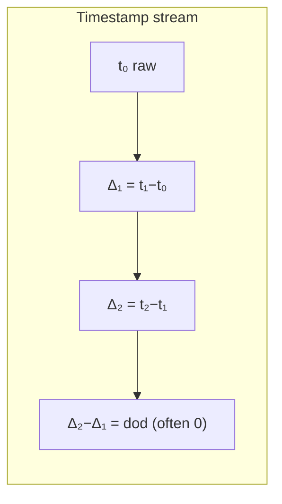
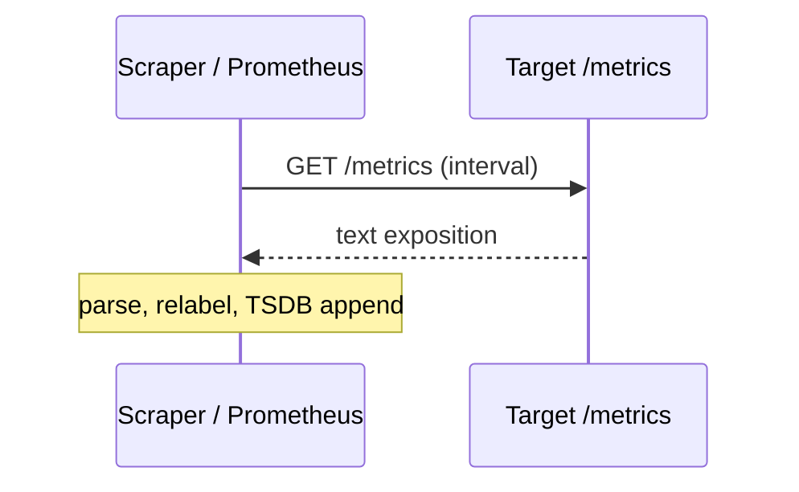
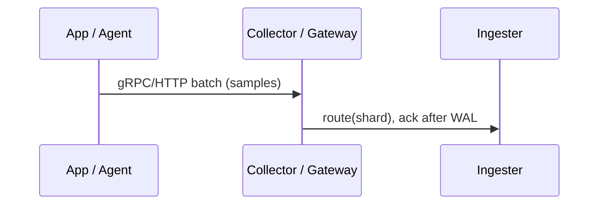
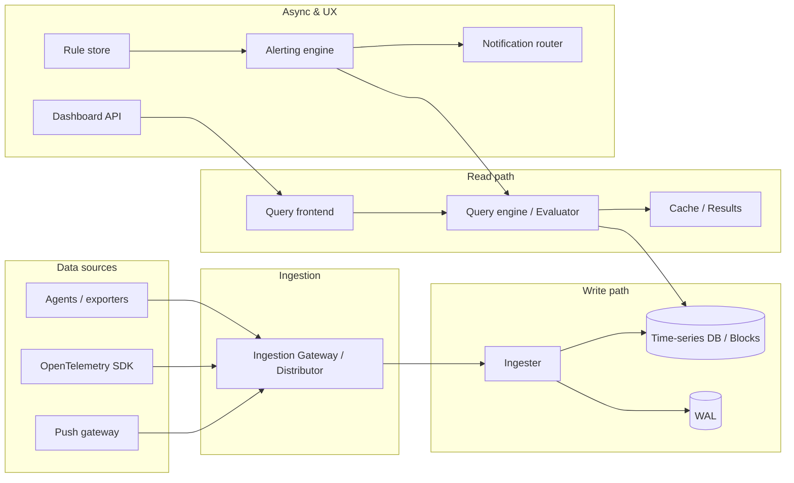
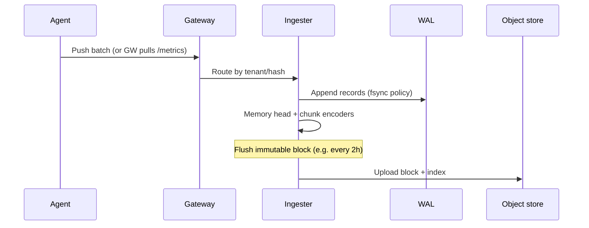
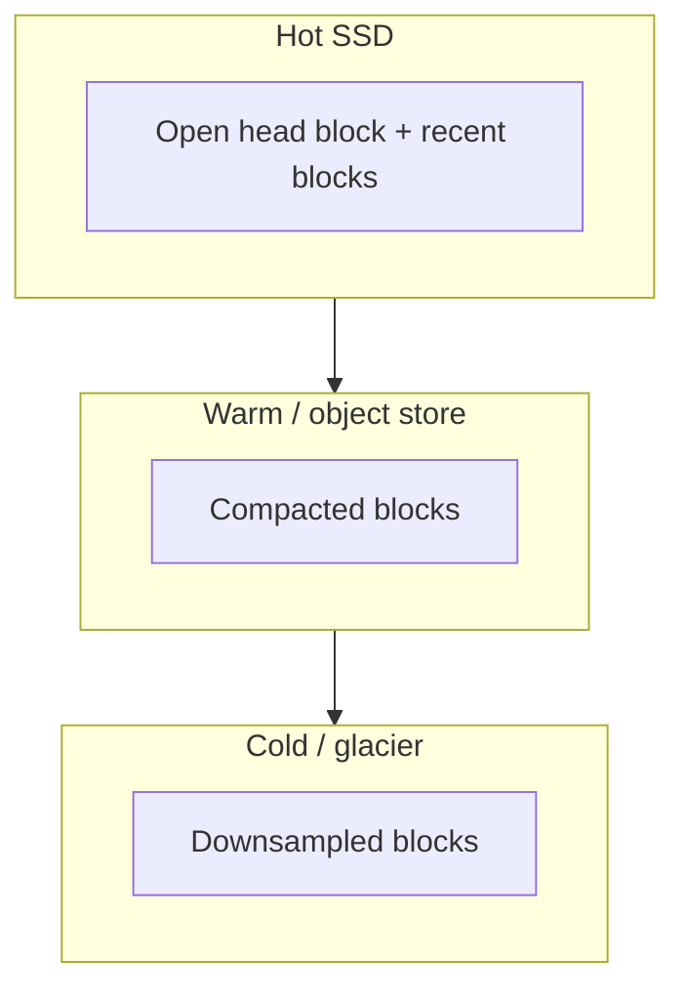
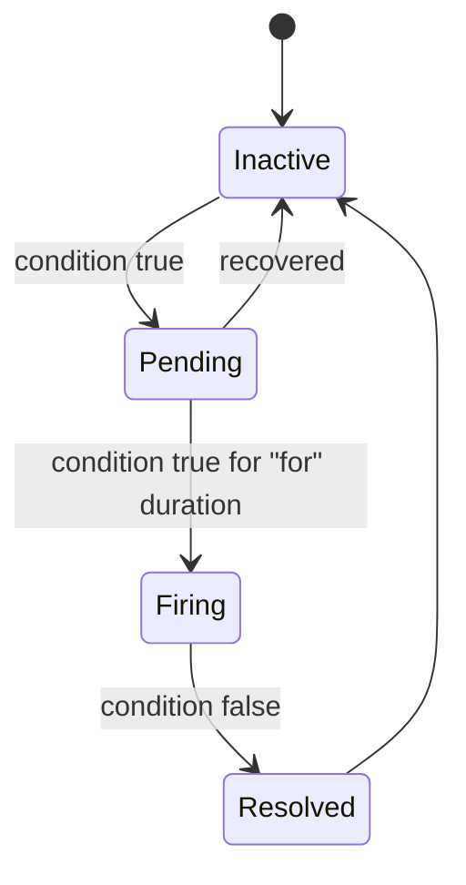
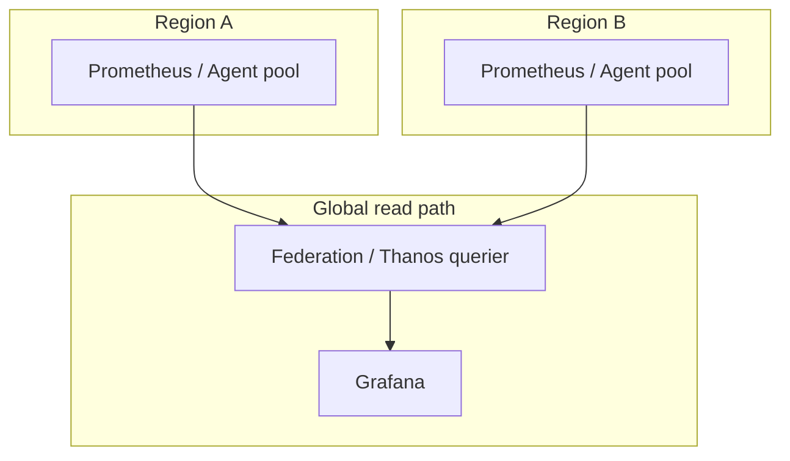
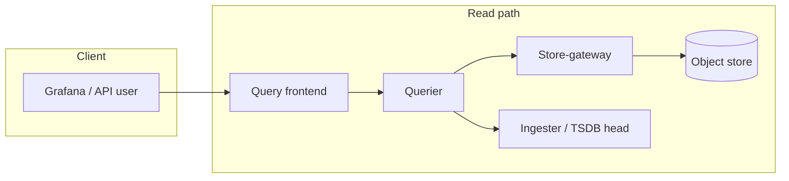

# Design a Metrics and Monitoring System (Datadog / Prometheus–style)
{: .no_toc }

<details open markdown="block">
  <summary>Table of contents</summary>
  {: .text-delta }
1. TOC
{:toc}
</details>

---

## What We're Building

We are designing a **metrics collection, storage, querying, and alerting** platform comparable in scope to **Datadog**, **Prometheus**, **Grafana Mimir**, **Thanos**, or **Google Monarch**: agents ship time-series samples, the backend stores them efficiently at scale, users query and visualize them, and **alert rules** fire when conditions breach SLOs.

| Capability | Why it matters |
|------------|----------------|
| **High-cardinality ingestion** | Modern microservices emit huge label combinations; the system must not collapse under cardinality explosions |
| **Durable, compressed storage** | Time-series data is append-heavy; compression (e.g., Gorilla-style) dominates cost |
| **Fast analytical queries** | Dashboards and incident response need sub-second queries over large windows |
| **Reliable alerting** | Missed pages cost revenue; false positives burn out on-call engineers |
| **Horizontal scale** | Ingestion and query load grow with services, regions, and tenants |

### Real-world scale (illustrative)

| System | Scale signal (public / typical talk) |
|--------|--------------------------------------|
| **Prometheus** | Single-server focus; federation and remote write for scale-out |
| **Datadog** | Trillions of points/day; multi-tenant SaaS |
| **Google Monarch** | Planet-scale; hierarchical aggregation |
| **Cortex / Mimir / Thanos** | Long-term Prometheus-compatible storage at cluster scale |

### Reference systems (interview vocabulary)

| System | Positioning | Typical talking point |
|--------|-------------|------------------------|
| **Prometheus** | Pull-first; local TSDB; single binary simplicity | Federation + remote write for scale; **TSDB block** format |
| **Datadog / Dynatrace / New Relic** | SaaS agents; unified APM + metrics | **Multi-tenant** isolation; **custom** billing per host or per span |
| **Google Monarch** | Global hierarchy; **Borg**-aware | **Aggregation tree**; **SLO** objects as first-class |
| **AWS CloudWatch** | Regional control plane; tight AWS integration | **Metric streams** to Kinesis; **cross-account** dashboards |
| **Grafana Mimir / Cortex** | Horizontally scaled **Prometheus-compatible** backend | **Shuffle sharding**, **limits**, object store backend |

### Why monitoring matters

- **SLOs and error budgets** tie product reliability to engineering velocity; metrics are the feedback loop.
- **Incident detection** depends on **latency histograms**, saturation (CPU, queue depth), and **golden signals** (latency, traffic, errors, saturation).
- **Capacity planning** uses historical trends; without retention and rollups, forecasting is guesswork.
- **Debugging** pairs metrics with traces and logs—but metrics are the cheapest signal at high volume.

{: .note }
> In interviews, **scope cardinality, retention, and multi-tenancy early**. Many designs fail on “we’ll just index everything” or “one global Prometheus.”

---

## Key Concepts Primer

This section grounds the later steps in **time-series semantics**, **compression intuition**, **observability methodologies**, and **cardinality economics**—the vocabulary senior interviewers expect when you say “Prometheus-style” or “Mimir-scale.”

### Time-series vs relational data

| Dimension | Relational (OLTP) | Time-series (metrics) |
|-----------|-------------------|------------------------|
| **Primary access pattern** | Point lookups, joins on keys | **Range scans** on `(series_id, time)` |
| **Mutability** | UPDATE/DELETE rows | **Append-mostly**; deletes are **retention** / block drops |
| **Schema** | Fixed columns + evolving migrations | **Sparse wide** model: metric + **dynamic labels** |
| **Ordering** | Application-defined | **Time is first-class**; many algorithms assume **per-series monotonic** `t` |
| **Consistency** | Transactions | **Eventually merged** replicas; **idempotent** samples |

{: .tip }
> In interviews, say: **“Each series is a narrow table of (t, v) ordered by t; the database problem is billions of these narrow tables, not one wide fact table.”**

### Gorilla compression — step-by-step (with bit-level intuition)

**Goal:** exploit **smoothness** in time and **similarity** in value for floating-point samples on a single series.

1. **First timestamp** (`t₀`): store **raw** (e.g., 64-bit UNIX ms).
2. **Next timestamps:** compute **first delta** `dᵢ = tᵢ − tᵢ₋₁`. For regular scrapes, `dᵢ` is almost constant (e.g., 15000 ms).
3. **Delta-of-delta:** `dodᵢ = dᵢ − dᵢ₋₁`. For perfectly regular intervals, **`dodᵢ = 0`** → encode with **few bits** (often a **control code** in 1–2 bits for “same as last interval”).
4. **First float value** (`v₀`): store raw IEEE-754 bits.
5. **Next values:** `xorᵢ = bits(vᵢ) XOR bits(vᵢ₋₁)`. Metrics often change **mantissa** slightly → **leading zero bytes** in the XOR dominate; Gorilla encodes **length of meaningful bits** + **payload**, not always full 64 bits.

**Bit-level toy example (values only):**

| Step | Meaning | Bits (conceptual) |
|------|---------|-------------------|
| `v₀ = 1.0` | baseline | full **64** |
| `v₁ = 1.01` | XOR shrinks if exponents align | **~12–20** meaningful bits typical in papers’ examples |
| `v₂ = 1.00` | XOR with `v₁` | again **short** payload |

Timestamps follow the same idea: **`dod = 0`** might cost **2 bits** total for that tick, vs **64 bits** raw.



### Pull vs push — models and diagrams

| Aspect | **Pull (scrape)** | **Push (remote write / OTLP)** |
|--------|-------------------|--------------------------------|
| **Who initiates** | Server **GET** `/metrics` | Client **POST** to collector |
| **Clock anchor** | Scraper’s clock defines sample time | Client must **stamp** or server **receives** time |
| **NAT / private IP** | Target must be reachable | Works **outbound-only** |
| **Cardinality on server** | Controlled by **targets discovered** | Easy to **accidentally flood** |

**Pull (scrape) — control plane drives collection:**



**Push — data plane drives delivery:**



{: .note }
> Production stacks often use **both**: OTel **push** into a collector that **also** scrapes legacy exporters.

### Golden signals (with concrete examples)

Google’s **four golden signals**—**latency**, **traffic**, **errors**, and **saturation**—map cleanly to **metric types**:

| Signal | What it answers | Example metrics |
|--------|-----------------|-----------------|
| **Latency** | How slow for users? | Histogram of `http_request_duration_seconds`, **p99** panel |
| **Traffic** | How much demand? | `rate(http_requests_total[5m])` by `route` |
| **Errors** | How many failures? | `5xx` ratio, `rate(errors_total[5m])` |
| **Saturation** | How full is the pipe? | CPU **%,** **queue depth**, **disk almost full**, **thread pool** exhausted |

### RED vs USE — when to reach for which

| Method | Stands for | Best for | Typical scope |
|--------|------------|----------|---------------|
| **RED** | **R**ate, **E**rrors, **D**uration | **Request-driven** services (microservices, HTTP/gRPC) | Per-service dashboards |
| **USE** | **U**tilization, **S**aturation, **E**rrors | **Resources**: CPU, disk, network, memory | Nodes, pools, queues |

**Concrete pairing:**

- **RED:** `rate(requests_total)`, `rate(errors_total)`, histogram **`duration_seconds`**.
- **USE:** CPU **utilization %**, **run queue** or **scheduler wait** (saturation), **disk I/O errors** (errors).

{: .tip }
> In interviews: **RED = service-centric**, **USE = resource-centric**; both complement **golden signals** (naming differs, intent overlaps).

### Cardinality — definition, failure mode, and concrete math

**Cardinality** = number of **distinct time series** matching your selectors—equivalently, distinct **label value combinations** you actually emit.

**Why it kills systems:**

- **Index RAM:** each new series adds **posting-list entries**, **symbol table** strings, and **head-block** structures.
- **Query fan-out:** `sum by (pod)(...)` across **50k pods** = merge **50k** streams.
- **Alert evaluation:** same explosion **every `eval_interval`**.

**Concrete math (illustrative):**

Suppose:

- **Base series** per metric: **1** (no labels).
- You add label **`pod`** with **5,000** values.
- You add label **`path`** with **200** tracked routes.

If **independent** (simplified upper bound): **1 × 5,000 × 200 = 1,000,000** series for **one** metric family—not counting other labels.

If you add **`trace_id`** (high cardinality) on a metric scraped every **15 s**:

- **New series per second** ≈ (cardinality growth rate)—indexes cannot keep up; **memory** and **compaction** lag.

| Knob | Effect |
|------|--------|
| **Drop / rewrite labels** at ingest | Caps worst-case series count |
| **Recording rules** | Pre-aggregate to **low-cardinality** metrics |
| **Hard limits** per tenant | **Reject** or **sample** excess labels |

---

## Step 1: Requirements Clarification

### Questions to ask the interviewer

| Question | Why it matters |
|----------|----------------|
| Push vs pull for ingestion? | Agent architecture, security, and scrape intervals |
| Single-tenant vs SaaS? | Isolation, noisy-neighbor controls, billing |
| Max **cardinality** per metric / globally? | Index and memory limits; label allowlists |
| Query language: **PromQL**, SQL, or custom? | Parser, planner, and compatibility with Grafana |
| **Long-term retention** vs **raw resolution**? | Downsampling, object storage tiering |
| **Multi-region** active-active or primary + DR? | Replication, clock skew, query consistency |
| Compliance (encryption at rest, audit)? | KMS, per-tenant keys, log redaction |
| Integration with **PagerDuty**, Slack, email? | Notification routing and escalation |

### Functional requirements

| Area | Requirements |
|------|----------------|
| **Metric ingestion** | Accept samples: metric name, labels (dimensions), timestamp, numeric value; support counters, gauges, histograms/summaries |
| **Time-series storage** | Persist ordered (timestamp, value) pairs per series; efficient compression and retention policies |
| **Querying / aggregation** | Range queries, instant queries, `sum by`, `rate`, histogram quantiles, top-k |
| **Dashboards** | Pre-aggregated panels; variable refresh; templated labels |
| **Alerting** | Rule definitions, evaluation window, **for** duration, recovery detection |
| **Anomaly detection (optional)** | Baseline vs threshold; seasonality—often **later phase** or delegated to ML service |

### Non-functional requirements (targets for this walkthrough)

| NFR | Target | Rationale |
|-----|--------|-----------|
| **Ingestion throughput** | **100K+ samples/sec** per shard (cluster scales horizontally) | Large microservice estates |
| **Query latency** | **p99 &lt; 1 s** for dashboard-sized queries | Human-in-the-loop; tighter for critical APIs if needed |
| **Retention** | **1 year** raw or rolled-up; older data at coarser resolution | Cost vs precision |
| **Availability** | **99.99%** for ingestion + query API (excluding client misconfig) | SLO-driven; meta-monitoring separate |
| **Durability** | No silent data loss; WAL + replication | Trust in alerts and capacity graphs |

{: .warning }
> **99.99% for the entire stack** including third-party notification delivery is unrealistic—split SLAs: ingestion, query, **notification delivery** (best-effort with retries).

### Whiteboard checklist (expand each if asked)

| Bucket | Detail |
|--------|--------|
| **Ingestion** | Parse **text (Prometheus exposition)** or **OTLP**; validate label names; reject invalid timestamps |
| **Storage** | **Immutable** blocks after close; **compaction** rewrites for space; **delete** = retention policy (not random row delete) |
| **Query** | **Instant** + **range** API; **subqueries**; optional **SQL** façade for BI |
| **Dashboards** | **Recording rules** precompute expensive expressions; **cache** panel results |
| **Alerting** | **Silences**, **inhibition** (warning suppresses if critical fires), **routes** |
| **Anomaly** | Often **phase 2**: seasonal baselines need **long windows** and **clean** data |

---

## Step 2: Estimation

### Assumptions (adjust in the interview)

```
- 100,000 samples/sec ingested (cluster aggregate)
- Average series: 20 labels × ~24 B each + metric name ~40 B → ~520 B metadata (order of magnitude)
- 8 bytes timestamp + 8 bytes float per sample (before compression)
- Compression ratio ~10× on disk (Gorilla-style; workload-dependent)
- Replication factor 3 for durability
```

### Metrics volume

| Quantity | Calculation | Result |
|----------|----------------|--------|
| Samples per day | `100e3 × 86400` | **8.64×10⁹** samples/day |
| Uncompressed sample payload | 16 B (ts + value) | — |
| Logical sample bytes/day | `8.64e9 × 16` | **~138 GB/day** (values only) |
| With metadata churn (indexes) | +50–200% | Depends on cardinality churn |

### Network and fan-out (order of magnitude)

| Path | Rough math | Comment |
|------|----------------|--------|
| Ingest to gateway | `100K × ~100 B/sample` ≈ **10 MB/s** | Payload + framing; **gRPC** keeps overhead low |
| Replication | × replication factor inside cluster | **Erasure coding** optional for cold tiers |
| Query responses | Highly variable | **JSON** for ad-hoc; **Arrow** / protobuf for bulk |

### Yearly storage envelope (illustrative)

Using **~14 GB/day** logical compressed values (from above) × **365** ≈ **5.1 TB/year** per replica group before index overhead. Real clusters add **posting lists**, **symbol tables**, and **compaction** temporary space—**plan 2×** for operations headroom in interviews.

### Storage (time-series compression)

Compression in production often combines:

- **Delta-of-delta** timestamps (consecutive points ~regular intervals → tiny integers).
- **XOR / leading-zero** encoding for floats (Gorilla paper).
- **Block-level** packing + general-purpose **ZSTD** on cold blocks.

Rough **on-disk** after 10× compression on values: **~14 GB/day** per logical copy before replication. With **3× replication**: **~42 GB/day** physical (ignoring compaction overhead).

### Query patterns

| Pattern | Cost driver |
|---------|-------------|
| **Instant query** | Single evaluation at `t`; may scan recent blocks |
| **Range query** | `start…end` with step; fan-out to many series |
| **Aggregations** | `sum by (service)` shuffles series by label hash |
| **Cardinality queries** | `count by (pod)`—dangerous if `pod` explodes |

{: .tip }
> State clearly: **hot data in SSD**, **cold in object storage** (S3/GCS) with **downsampled** blocks for cheap long-range scans.

### Query load assumptions (for read-path sizing)

| Assumption | Example | Notes |
|------------|---------|--------|
| Concurrent dashboard users | 50–200 | Each panel = 1–5 queries |
| Refresh interval | 30 s | **Caches** dedupe identical queries |
| Expensive queries | `topk`, high-cardinality `count` | **Rate-limit** per tenant |

If **500 QPS** query mix with **50 ms** mean server work, you need enough **querier** replicas and **queue** depth—interviews often ask **only** ingestion math; offering **query** sizing shows maturity.

---

## Step 3: High-Level Design



**Flow:**

1. **Agents** scrape or receive application metrics; they **batch** and send to **Ingestion Gateway** (auth, rate limits, routing).
2. **Ingester** appends to **WAL**, buffers in memory, **flushes** immutable blocks to the **time-series store** (columnar / LSM-like).
3. **Query frontend** parses **PromQL**-style queries, **plans** execution (pushdown aggregations, prune shards), merges results.
4. **Alerting engine** periodically evaluates rules (often same query engine), drives **state machine**, sends to **PagerDuty/Slack** via **notification router** (dedupe, silences).
5. **Dashboard** UI calls the query API (often **Grafana** in front).

{: .note }
> **Read path** and **write path** are often **separated** (different services) so spikes in queries do not starve ingestion.

### Sequence: scrape / push → durable block



### Component responsibilities (talk track)

| Component | Responsibility |
|-----------|------------------|
| **Gateway** | AuthN/Z, **rate limits**, **admission control**, routing key |
| **Ingester** | WAL, **replication**, **cut** blocks, **ship** to storage |
| **Compactor** | Merge small blocks; **downsample**; **retention** deletes |
| **Store gateway** | Serve queries from **object storage** + cache |
| **Querier** | **Parse** PromQL, **fan-out**, **merge**, **dedupe** |
| **Ruler / Alertmanager** | **Rule eval**, **routing**, **silences** |

---

## Step 4: Deep Dive

### 4.1 Time-series data model and compression

**Series identity:** `(metric_name, sorted label map)` → unique **series ID** (internal uint64). Each series is an ordered sequence of `(timestamp_ms, float64)` (or int for counters).

| Concept | Description |
|---------|-------------|
| **Metric name** | e.g., `http_request_duration_seconds` |
| **Labels** | Dimensions: `method`, `path`, `pod`, `region` |
| **Samples** | `(t, v)` pairs; monotonic counters need `rate()` in queries |
| **Histogram** | Multiple series suffixes `_bucket`, `_sum`, `_count` or native histogram type |

**Delta-of-delta timestamps** (Gorilla-style intuition): if deltas between timestamps are near-constant, second-order delta encodes to **few bits**.

**XOR float compression:** store first value raw; for next, XOR with previous; leading zeros often dominate → encode run of zeros compactly.

```python
from __future__ import annotations
from dataclasses import dataclass
from typing import List, Tuple


@dataclass
class GorillaStyleEncoder:
    """Illustrative tick encoder: delta-of-delta timestamps + XOR floats."""

    timestamps_ms: List[int]
    values: List[float]

    def encode_timestamp_deltas(self) -> List[int]:
        if not self.timestamps_ms:
            return []
        deltas: List[int] = []
        prev_ts = self.timestamps_ms[0]
        prev_delta = 0
        for ts in self.timestamps_ms[1:]:
            delta = ts - prev_ts
            dod = delta - prev_delta  # delta-of-delta
            deltas.append(dod)
            prev_ts, prev_delta = ts, delta
        return deltas

    @staticmethod
    def xor_float_bits(a: float, b: float) -> int:
        import struct

        ab = struct.pack(">d", a)
        bb = struct.pack(">d", b)
        ai = int.from_bytes(ab, "big")
        bi = int.from_bytes(bb, "big")
        return ai ^ bi


# Example: near-regular 15s scrape → small delta-of-delta
enc = GorillaStyleEncoder(
    timestamps_ms=[1_000_000 + i * 15_000 for i in range(5)],
    values=[0.12, 0.13, 0.11, 0.10, 0.09],
)
print(enc.encode_timestamp_deltas())  # mostly zeros after first tick
print(bin(GorillaStyleEncoder.xor_float_bits(enc.values[0], enc.values[1])))
```

**Label hashing → series ID:** production systems **intern** label strings in a **symbol table** and store **sorted** label pairs so `(job="a", env="b")` equals `(env="b", job="a")`.

```python
def canonical_series_key(metric: str, labels: dict[str, str]) -> str:
    """Human-readable key; production would hash to uint64."""
    parts = [metric] + [f'{k}="{labels[k]}"' for k in sorted(labels)]
    return "{" + ",".join(parts) + "}"


print(canonical_series_key("up", {"job": "api", "instance": "10.0.0.1:9100"}))
```

**Delta-of-delta intuition (bits):** if scrape interval is **exactly** 15 s, first-order delta is **15000 ms** every time; second-order delta is **0**. Encoders emit a **short control code** for “same as last interval” vs “patch.”

```python
def leading_zero_bytes(x: int) -> int:
    """How many leading zero bytes in 64-bit XOR (illustrative metric)."""
    if x == 0:
        return 8
    b = x.bit_length()
    return max(0, 8 - (b + 7) // 8)
```

{: .tip }
> Mention the **Gorilla** (Facebook) paper explicitly—it is interview currency. Note **ZSTD** on **frozen blocks** for cold tiers.

---

### 4.2 Write path and ingestion

**Push vs pull:**

| Mode | Pros | Cons |
|------|------|------|
| **Pull (scrape)** | Simple mental model; targets expose `/metrics`; Prometheus-native | Requires reachable endpoints; NAT/firewall pain |
| **Push** | Works behind NAT; batching to gateway | Need dedupe, back-pressure, auth |

Production systems often support **both**: OTel **push** to collector → same pipeline as scrape.

**Batching:** agents buffer **N** samples or **T** ms, **snappy-compress** payloads, use **HTTP/2** or gRPC.

**WAL + memory:** ingester writes **append-only WAL** before acknowledging; on crash, replay WAL. Memory holds **active head block**; when full or time window closes, **flush** immutable block.

**LSM-tree analogy:** recent writes go to **memtable**; flush produces **SSTable-like** files; **compaction** merges overlapping windows and drops expired data per retention.

```python
import json
from collections import defaultdict
from pathlib import Path
from typing import DefaultDict, Dict, List


class IngesterBuffer:
    """Simplified in-memory shard buffer → flush to JSONL 'blocks' (illustrative)."""

    def __init__(self, wal_path: Path, block_dir: Path) -> None:
        self.wal_path = wal_path
        self.block_dir = block_dir
        self.buf: DefaultDict[str, List[Dict]] = defaultdict(list)

    def append_wal(self, record: Dict) -> None:
        with self.wal_path.open("a", encoding="utf-8") as f:
            f.write(json.dumps(record) + "\n")

    def ingest(self, series_key: str, ts: int, value: float) -> None:
        rec = {"series": series_key, "ts": ts, "v": value}
        self.append_wal(rec)
        self.buf[series_key].append(rec)

    def flush_block(self, block_id: str) -> None:
        self.block_dir.mkdir(parents=True, exist_ok=True)
        out = self.block_dir / f"block-{block_id}.jsonl"
        with out.open("w", encoding="utf-8") as f:
            for series, rows in self.buf.items():
                for r in sorted(rows, key=lambda x: x["ts"]):
                    f.write(json.dumps(r) + "\n")
        self.buf.clear()
```

**Back-pressure:** gateway returns **429** or **drops** lowest-priority tenants when **ingestion lag** &gt; SLO; **adaptive** batching reduces scrape frequency for **noisy** jobs.

```python
from dataclasses import dataclass
from typing import List


@dataclass
class Batcher:
    max_points: int
    max_wait_ms: int
    buf: List[dict]

    def should_flush(self, elapsed_ms: int) -> bool:
        return len(self.buf) >= self.max_points or elapsed_ms >= self.max_wait_ms
```

{: .warning }
> **High-cardinality** labels (e.g., `user_id`) will **OOM** the ingester and index—enforce **limits**, **drop rules**, or **aggregations** at the edge.

---

### 4.3 Storage engine

**Columnar / time-oriented layout:** store **columns** (timestamps, values) per series or per **block** of time; good for **scanning one metric across many series** (aggregation).

**Block-based:** immutable **2-hour** (example) blocks with **index** (label → posting lists) + **chunks** for values.

**Retention:** drop blocks older than policy; **object storage** for archive.

**Downsampling / rollups:** for data older than **30 days**, keep **5-minute** aggregates; older → **1-hour**—trades precision for cost.

| Tier | Age | Resolution | Use case |
|------|-----|------------|----------|
| **Hot** | 0–7 d | Native scrape (e.g. 15 s) | Incident drill-down |
| **Warm** | 7–90 d | 1 min (recording rules) | Weekly trends |
| **Cold** | 90 d–1 y | 5–60 min | Capacity, finance |
| **Archive** | &gt; 1 y | Daily / weekly | Compliance (optional) |



```python
from dataclasses import dataclass
from typing import List


@dataclass
class Rollup:
    window_sec: int

    def downsample(
        self, timestamps: List[int], values: List[float]
    ) -> tuple[List[int], List[float]]:
        bucket: dict[int, List[float]] = {}
        w_ms = self.window_sec * 1000
        for ts, v in zip(timestamps, values):
            b = (ts // w_ms) * w_ms
            bucket.setdefault(b, []).append(v)
        out_ts = sorted(bucket)
        out_v = [sum(bucket[t]) / len(bucket[t]) for t in out_ts]
        return out_ts, out_v
```

**Posting lists:** inverted index from **label=value** → list of **series IDs** containing it. Query `job="api"` **AND** `region="us"` = **intersect** posting lists (skip if one side is tiny).

---

### 4.4 Query engine

**PromQL-style** (conceptual): selectors `metric{label="v"}`, **range vectors** `rate(http_requests_total[5m])`, aggregations `sum by (job) (...)`.

**Aggregation operators:** vector matching **one-to-one**, **many-to-one** with `group_left`.

**Fan-out:** **querier** asks **all ingesters / store-gateways** holding data for time range; **merge** deduplicated samples (replication-aware).

#### PromQL-style planning: AST and decomposition

Real engines **parse** the expression into an **AST**, then build a **logical plan** (selectors, functions, aggregations) and a **physical plan** (shard lists, index scans, pushdown). Below is a **minimal** illustrative pipeline: **tokenize → AST → extract selectors → per-shard subplans**.

```python
from __future__ import annotations

from dataclasses import dataclass, field
from typing import Dict, List, Tuple, Union


@dataclass
class VectorSelector:
    """e.g. http_requests_total{job=\"api\"}"""

    metric: str
    matchers: Dict[str, str]


@dataclass
class Call:
    """Function call: rate(arg, window)"""

    name: str
    args: List[Union["Call", VectorSelector, str]]


@dataclass
class Aggregate:
    """sum by (job) (inner)"""

    op: str
    by_labels: Tuple[str, ...]
    inner: Union[Call, VectorSelector]


@dataclass
class QueryPlan:
    """Logical plan root."""

    root: Union[Aggregate, Call, VectorSelector]
    selectors: List[VectorSelector] = field(default_factory=list)

    def collect_selectors(self, node: object) -> None:
        if isinstance(node, VectorSelector):
            self.selectors.append(node)
        elif isinstance(node, Call):
            for a in node.args:
                self.collect_selectors(a)
        elif isinstance(node, Aggregate):
            self.collect_selectors(node.inner)


def parse_promql_style(expr: str) -> QueryPlan:
    """Tiny stand-in for a real parser — extend with a proper grammar."""
    # Illustrative: only recognizes one pattern for demo.
    if "sum by" in expr:
        inner = Call(
            "rate",
            [
                VectorSelector("http_requests_total", {"job": "api"}),
                "5m",
            ],
        )
        root = Aggregate("sum", ("job",), inner)
    else:
        root = VectorSelector("up", {})
    plan = QueryPlan(root=root)
    plan.collect_selectors(root)
    return plan


def decompose_to_shards(
    plan: QueryPlan, num_shards: int
) -> List[Dict[str, object]]:
    """Emit one executable subplan per shard (same matchers; shard prunes series)."""
    subplans: List[Dict[str, object]] = []
    for s in range(num_shards):
        subplans.append(
            {
                "shard_id": s,
                "matchers": [sel.matchers for sel in plan.selectors],
                "pushdown": ["sum"] if isinstance(plan.root, Aggregate) else [],
            }
        )
    return subplans
```

**Planner responsibilities** (talk track): **predicate pushdown** (apply `job="api"` before materializing series), **hash aggregation** (`sum by`), **parallel scans** per ingester, then **merge** with **dedupe** if replication overlaps.

#### Posting list intersection (sorted merge + early exit)

Inverted index maps `(label, value) → sorted series IDs`. **AND** queries intersect lists **smallest-first** to shrink work; iterators **merge** like merge-sort with **early termination** when one list ends.

```python
from typing import List


def intersect_sorted(a: List[int], b: List[int]) -> List[int]:
    """Two-pointer merge; lists must be sorted ascending."""
    i, j = 0, 0
    out: List[int] = []
    while i < len(a) and j < len(b):
        if a[i] == b[j]:
            out.append(a[i])
            i += 1
            j += 1
        elif a[i] < b[j]:
            i += 1
        else:
            j += 1
    return out


def intersect_many(lists: List[List[int]]) -> List[int]:
    """Chain intersection; sort lists by length ascending first."""
    if not lists:
        return []
    ordered = sorted(lists, key=len)
    acc = ordered[0]
    for nxt in ordered[1:]:
        acc = intersect_sorted(acc, nxt)
        if not acc:
            break
    return acc
```

#### `rate()` and `increase()` with counter reset detection

Counters are **monotonic** until process restart (reset). **Prometheus-style** `rate` uses **all samples in range**, detects **resets** when `v[k] < v[k-1]`, and **skips** the downward jump as a discontinuity.

```python
from typing import List, Tuple


def increase_range(
    timestamps: List[float], values: List[float]
) -> float:
    """Total increase over [t0, tn] with counter resets (no extrapolation)."""
    if len(values) < 2:
        return 0.0
    total = 0.0
    for k in range(1, len(values)):
        dv = values[k] - values[k - 1]
        if dv < 0:
            # reset: treat previous high-water mark as segment end
            total += values[k]
        else:
            total += dv
    return total


def rate_per_second(
    timestamps: List[float], values: List[float]
) -> float:
    """Average rate across window from increase / duration."""
    if len(timestamps) < 2:
        return 0.0
    dt = timestamps[-1] - timestamps[0]
    if dt <= 0:
        return 0.0
    return increase_range(timestamps, values) / dt
```

{: .note }
> Production `rate()` also handles **stale markers**, **extrapolation** at window edges, and alignment to **evaluation steps**—the sketch above shows **reset accounting** only.

#### `histogram_quantile()` — linear interpolation across buckets

Classic Prometheus histograms expose **`le` buckets**. Given cumulative counts per bucket at time *t*, pick **brackets** around target quantile φ·**total count** and **linearly interpolate** inside that bucket (assuming uniform mass between `le` boundaries).

```python
from typing import List, Tuple


def histogram_quantile(phi: float, buckets: List[Tuple[float, float]]) -> float:
    """
    buckets: sorted (le_upper_bound, cumulative_count).
    Returns estimated quantile in native units (e.g. seconds).
    """
    if not buckets or not (0.0 <= phi <= 1.0):
        return float("nan")
    total = buckets[-1][1]
    if total <= 0:
        return float("nan")
    target = phi * total
    prev_le, prev_c = buckets[0]
    if target <= prev_c:
        return prev_le
    for i in range(1, len(buckets)):
        le, c = buckets[i]
        if c >= target:
            # Linear interpolate within [prev_le, le]
            rank_in_bucket = target - prev_c
            bucket_width = max(le - prev_le, 1e-12)
            count_in_bucket = max(c - prev_c, 1e-12)
            frac = rank_in_bucket / count_in_bucket
            return prev_le + frac * bucket_width
        prev_le, prev_c = le, c
    return buckets[-1][0]
```

#### Query pushdown optimization

| Pushdown | What moves toward storage | Why it wins |
|----------|---------------------------|-------------|
| **Label predicates** | `job="api"` before decoding chunks | Shrinks posting lists |
| **Aggregations** | `sum by (region)` in compactor / store | Less data over network |
| **Time slicing** | Chunk files wholly outside `[start,end]` skipped | **I/O** bound |

**Shard pruning:** if matchers include `region="us-east"`, only **touch** ingesters owning that **tenant/region** slice—critical for latency.

{: .note }
> **Parallelism** is keyed by **time range** and **shard**; protect with **query concurrency** limits per tenant.

---

### 4.5 Alerting pipeline

**Alert rule:** `expr` + **`for`** duration + labels + **annotations**.

**Evaluation:** scheduler runs **every `eval_interval`**; executes query; compares to threshold.

**State machine:**



**Notification routing:** route by **severity**, **team** label, **on-call** schedule (PagerDuty **service** / **escalation policy**).

**Deduplication:** same alert key `(rule, labels)` within **group_wait** → one notification; **group_interval** for updates.

```python
from enum import Enum, auto
from typing import Dict, Optional


class AlertState(Enum):
    INACTIVE = auto()
    PENDING = auto()
    FIRING = auto()


class Alert:
    def __init__(self, name: str, labels: Dict[str, str], for_sec: int) -> None:
        self.name = name
        self.labels = labels
        self.for_sec = for_sec
        self.state = AlertState.INACTIVE
        self.true_since: Optional[float] = None

    def tick(self, now: float, condition_met: bool) -> None:
        if not condition_met:
            self.state = AlertState.INACTIVE
            self.true_since = None
            return
        if self.state == AlertState.INACTIVE:
            self.state = AlertState.PENDING
            self.true_since = now
            return
        if self.state == AlertState.PENDING and self.true_since is not None:
            if now - self.true_since >= self.for_sec:
                self.state = AlertState.FIRING
```

**Notification deduplication (sketch):**

```python
from time import time
from typing import Dict, Tuple

AlertKey = Tuple[str, Tuple[Tuple[str, str], ...]]


class NotificationDeduper:
    """Drop duplicate notifications for the same alert key within window_sec."""

    def __init__(self, window_sec: int) -> None:
        self.window_sec = window_sec
        self.seen: Dict[AlertKey, float] = {}

    def should_send(self, key: AlertKey) -> bool:
        now = time()
        last = self.seen.get(key)
        if last is not None and now - last < self.window_sec:
            return False
        self.seen[key] = now
        return True
```

**On-call integration:** **Alertmanager** sends JSON webhook to **PagerDuty** Events API v2; include **runbook** URL and **dashboard** deep link in **annotations**.

---

### 4.6 Scalability — sharding and federation

**Metric-based sharding:** **hash(series_id) → shard** or **range** on `tenant_id` + metric prefix. Avoid hotspots by **shuffle sharding** tenants across nodes.

**Hierarchical federation:** **regional** Prometheus **federates** up to **global** read-only queries for **SLI dashboards**; avoids shipping all raw data globally.

**Cross-datacenter:** **dual write** or **async replication** with **eventual consistency**; queries may use **local** DC for freshness or **global** view with **staleness** bounds.


```python
def shard_for_series(series_id: int, num_shards: int) -> int:
    return series_id % num_shards


def federate_selectors(global_query: str) -> list[str]:
    """Illustrative: split one global metric into per-region selectors."""
    regions = ["us-east", "eu-west", "ap-south"]
    return [f'{global_query}{{region="{r}"}}' for r in regions]
```




**Cross-datacenter aggregation:** **write locally**, **query globally** with **staleness** annotations; avoid **synchronous** cross-region writes on the hot path.

| Pattern | When to use |
|---------|-------------|
| **Dedicated global metrics** | SLIs that must be **comparable** across regions |
| **Region-local dashboards** | **Latency** inside one DC—global merge is misleading |
| **Replication** | **DR** and **query availability**—not a substitute for **correct** aggregation semantics |

#### Shuffle sharding (code sketch)

Instead of placing **tenant T** on **one** shard (blast radius = full shard), assign **K random shards** from **N** total; **replicate** work across those K so **correlated failure** needs **multiple** bad nodes to affect the tenant.

```python
import hashlib
from typing import List, Set


def shard_subset(
    tenant_id: str, n_shards: int, k: int, seed: str = "monitoring"
) -> List[int]:
    """Deterministic shuffle-shard pick: k distinct shards in [0, n_shards)."""
    if k > n_shards:
        raise ValueError("k cannot exceed n_shards")
    h = hashlib.blake2b(f"{seed}:{tenant_id}".encode(), digest_size=16).digest()
    # Expand hash space by rehashing with counter until we have k picks.
    picks: Set[int] = set()
    ctr = 0
    while len(picks) < k:
        block = hashlib.blake2b(h + ctr.to_bytes(4, "big"), digest_size=8).digest()
        picks.add(int.from_bytes(block, "big") % n_shards)
        ctr += 1
    return sorted(picks)
```

**Interview line:** blast radius scales roughly as **~(K/N)²** for independent failures when **two** replicas must agree—orders-of-magnitude smaller than **single-shard** placement.

#### Consistent hashing for ingester ring membership

**Ring:** hash **ingester ID** onto **0–2⁶³⁻¹**; each **tenant** or **series** maps to **clockwise** first **alive** owner. **Add/remove** node moves only **neighboring** key ranges—unlike `mod N` which reshuffles **everything**.

```python
from bisect import bisect_right
from typing import Dict, List, Tuple


class HashRing:
    """Minimal ring: sorted tokens -> ingester; virtual nodes omitted for brevity."""

    def __init__(self, nodes: List[Tuple[str, int]]) -> None:
        # nodes: (name, token)
        self.ring = sorted(nodes, key=lambda x: x[1])

    def owner(self, key_hash: int) -> str:
        tokens = [t for _, t in self.ring]
        idx = bisect_right(tokens, key_hash) % len(self.ring)
        return self.ring[idx][0]
```

**Virtual nodes** (not shown): each physical ingester claims **many** tokens on the ring to reduce **variance** in load.

#### Thanos / Mimir — store-gateway role

In **long-term** Prometheus-compatible stacks, **blocks** live in **object storage** (S3/GCS). **Store-gateway** components:

- **Discover** block **meta.json** objects (often via **bucket index**).
- **Cache** block metadata and **downloaded** chunks in local SSD.
- **Serve** **StoreAPI** reads to **queriers** for historical time ranges.
- Participate in **query planning** to **prune** blocks by **labels** and **time**.

**Thanos** vs **Mimir** naming differs slightly, but the pattern is the same: **querier** fans out to **ingesters** (hot) + **store-gateways** (cold), then **merges** and **dedupes**.

#### Distributed read path (full diagram)



**Narrative:** **query frontend** may **split** range queries and **cache**; **querier** executes PromQL, **pushes down** matchers, contacts **ingesters** for recent samples and **store-gateways** for historical blocks; **gateways** fetch **chunk** data from **object storage** with aggressive caching.

{: .tip }
> Name-check **Thanos / Cortex / Mimir** for **long-term Prometheus**; **Monarch** for **hierarchical global** monitoring at Google scale.

---

### 4.7 Histogram and quantile computation

#### Why quantiles are hard in distributed systems

A **global p99 latency** across all pods requires **order statistics** over **all** request durations. Shipping **raw samples** is **bandwidth-heavy**; shipping **only per-pod p99** loses **mixing**—the **p99 of p99s** is **not** global p99 when **traffic** differs across pods. You need either **mergeable summaries** or **centralized** evaluation with enough data.

#### t-digest — intuition and minimal Python sketch

**t-digest** clusters samples near **centroids** with **adaptive** bin sizes: dense regions get **more** clusters; tails get **fewer** but **large** bins. Merging **digests** is **approximate** but **bounded** error for quantiles.

```python
from dataclasses import dataclass, field
from typing import List, Tuple


@dataclass
class TDigestCentroid:
    mean: float
    weight: float


@dataclass
class TDigestLite:
    """Highly simplified t-digest (educational; not production-accurate)."""

    centroids: List[TDigestCentroid] = field(default_factory=list)
    compression: float = 100.0

    def update(self, x: float, w: float = 1.0) -> None:
        self.centroids.append(TDigestCentroid(mean=x, weight=w))
        self.centroids.sort(key=lambda c: c.mean)
        self._compress()

    def _compress(self) -> None:
        """Merge neighbors if cluster size small enough — real t-digest uses size limits."""
        if len(self.centroids) < 2:
            return
        merged: List[TDigestCentroid] = []
        acc = self.centroids[0]
        for c in self.centroids[1:]:
            if abs(c.mean - acc.mean) < (acc.weight + c.weight) / self.compression:
                tw = acc.weight + c.weight
                acc = TDigestCentroid(
                    mean=(acc.mean * acc.weight + c.mean * c.weight) / tw, weight=tw
                )
            else:
                merged.append(acc)
                acc = c
        merged.append(acc)
        self.centroids = merged

    def quantile(self, q: float) -> float:
        """Weighted order-statistic walk over centroids."""
        total = sum(c.weight for c in self.centroids)
        target = q * total
        cum = 0.0
        for c in self.centroids:
            if cum + c.weight >= target:
                return c.mean
            cum += c.weight
        return self.centroids[-1].mean
```

{: .warning }
> Real **t-digest** uses **strict** scaling functions and **merge** rules—use a **battle-tested** library in production.

#### Native histograms vs classic histograms

| Aspect | **Classic** (`_bucket` with `le`) | **Native** (Prometheus native histogram) |
|--------|-----------------------------------|-------------------------------------------|
| **Layout** | Many **counter** series per bucket | **Structured** histogram type + sparse buckets |
| **Cardinality** | **High** (one series per bucket × labels) | **Lower** for sparse buckets |
| **Scrape** | Text lines per bucket | **Binary / structured** exposition |
| **Quantile** | `histogram_quantile` on cumulative counts | Engine may use **better** internal representation |

#### Mergeable sketches for global percentiles

| Sketch | Merges across nodes? | Typical use |
|--------|----------------------|-------------|
| **t-digest** | Yes (approximate) | **Latency** percentiles |
| **HLL** | Yes (approximate) | **Cardinality** estimates |
| **GK / KLL** | Yes (with care) | Alternative quantile tracks |

**Pattern:** each **ingester** builds a **digest** for its traffic; **querier** **merges** digests for **tenant-wide** φ-quantile with **error bounds** proportional to **compression** parameter.

#### Error bounds and accuracy guarantees

- **Histogram buckets:** error depends on **bucket widths**; linear interpolation assumes **uniform** mass within a bucket—**bad** if bucket spans **multi-modal** latency.
- **t-digest:** error ε typically **~1/compression** relative to **CDF**—tunable vs **memory**.
- **Distributed merge:** merging **approximate** structures **accumulates** error—document **SLO** on **query accuracy** separately from **ingestion** SLO.

{: .note }
> For interviews, tie this back to **SLO dashboards**: **global** p99 is a **product** question, not just a **math** question—**traffic-weighted** merging matters.

---

## Step 5: Scaling & Production

### Failure handling

| Failure | Mitigation |
|---------|------------|
| **Ingester crash** | WAL replay; another replica serves **duplicate** data until compacted |
| **Zone outage** | Replicate shards across AZs; **read** from healthy replicas |
| **Query OOM** | **Limits** on max series, max range, max points; **query queue** with timeout |
| **Notification provider down** | Retry with backoff; **dead-letter** queue; multi-channel fallback |

### Meta-monitoring

Monitor the monitors: **ingestion lag**, **WAL age**, **compaction backlog**, **query latency**, **alert evaluation lag**, **notification success rate**. Use **separate** infrastructure or **vendor** for **paging the paging system**.

| Signal | What breaks if it degrades |
|--------|----------------------------|
| **Ingestion lag** | Dashboards look “fine” while reality is on fire |
| **Compaction backlog** | Disk fills; queries slow; **read amplification** spikes |
| **Rule eval lag** | **Late** alerts; **thundering herd** after catch-up |
| **Memberlist / ring health** | **Wrong** shard routing → **partial** data loss visibility |

### Runbooks and human factors

- **SLO-based alerts** beat static thresholds; pair metrics with **error budgets**.
- **Cascading failures:** protect the **control plane** with **bulkheads** (separate etcd/consul for monitoring).
- **Game days** for “metrics backend down”—operators should know **fallback** (synthetic checks only, etc.).

### Trade-offs

| Choice | Upside | Downside |
|--------|--------|----------|
| **Strong vs eventual** replication | Linearizable reads | Latency + coordination cost |
| **Long raw retention** | Fine-grained forensics | Storage cost |
| **High cardinality** | Powerful drill-down | Memory and index explosion |
| **Pull-only** | Idempotent scrape | Operational complexity in k8s |

{: .warning }
> **Cardinality** and **query cost** are the #1 production failure modes—interviewers reward **guardrails** (limits, recording rules, aggressive downsampling).

---

## Interview Tips — Google follow-up questions

| Topic | What they probe |
|-------|-----------------|
| **Cardinality explosion** | How do you cap labels? **Recording rules**? **Adaptive sampling**? |
| **Exactly-once ingestion** | At-least-once typical; **idempotent** keys for push; **dedupe** windows |
| **Clock skew** | **NTP**; reject too-future timestamps; **out-of-order** handling in TSDB |
| **Histogram quantiles** | **t-digest**, **HLL** vs exact; error bounds |
| **Multi-tenancy fairness** | **Quotas**, **shuffle sharding**, **noisy neighbor** isolation |
| **Cost** | Cold storage, **query pushdown**, **aggregations at write** (recording rules) |
| **vs Logs/traces** | Metrics for **aggregates**; **Exemplars** link to traces |

### Follow-up drill (short answers)

| Question | Strong answer shape |
|----------|---------------------|
| “How is this different from **InfluxDB**?” | **Column/time** layout vs **full** database features; **PromQL** ecosystem vs **InfluxQL** |
| “**Global** percentiles?” | **Mergeable** sketches (t-digest) per shard + **merge**; exact global p99 needs **heavy** data movement |
| “**Billing** in SaaS?” | **Ingested samples**, **query cost units**, **cardinality** peaks—meter at **gateway** |
| “**ML anomaly**?” | **Offline** train on rollups; **online** scorer on **stream**—keep **separate** from **hot path** |

{: .note }
> Close with **what you’d build first**: ingestion + **WAL** + **query on recent blocks**, then **long-term store**, then **alerting**—mirrors **MVP → scale** path.

### MVP vs scale (explicit)

| Phase | Build | Defer |
|-------|-------|-------|
| **MVP** | Scrape/push → **WAL** → **query** last 14 d | Multi-year archive |
| **Scale** | **Horizontal** ingesters, **object store** blocks | Fancy ML |
| **Mature** | **Global** federation, **tiered** storage | — |

---

## Summary

| Layer | Core idea |
|-------|-----------|
| **Model** | Metric + labels = series; compress **time** and **value** streams |
| **Write** | WAL, batched flush, **block** files, retention + **rollups** |
| **Read** | Label index → posting lists; **fan-out** + merge; **PromQL** planning |
| **Alerts** | **Pending → firing** with **`for`**; dedupe + routes |
| **Scale** | **Shard** by series/tenant; **federation** for hierarchy |

This walkthrough is a **structured narrative** for system design interviews—not a production architecture for any one product. Adapt numbers, **SLAs**, and **compliance** to the prompt and your experience.
