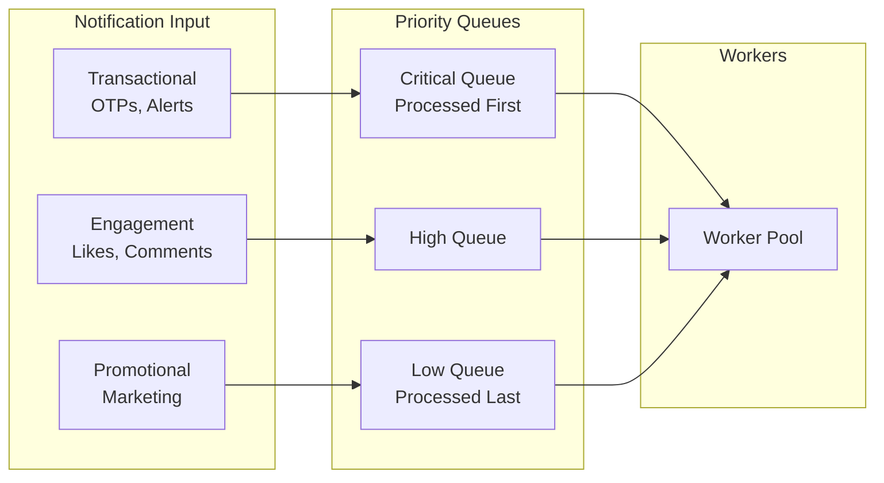
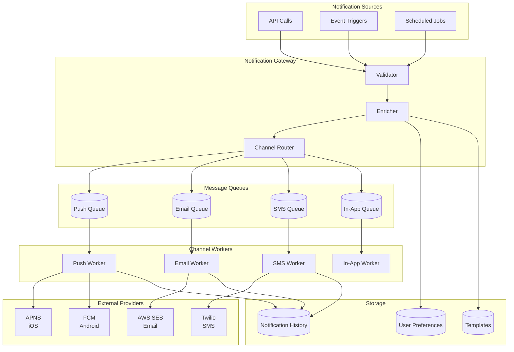
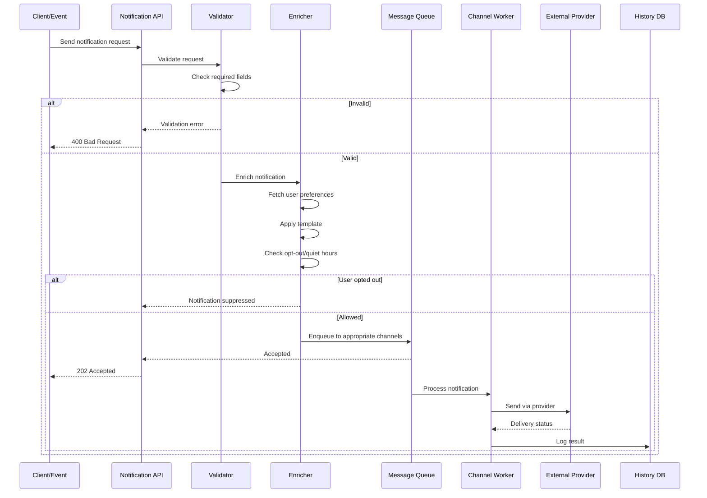
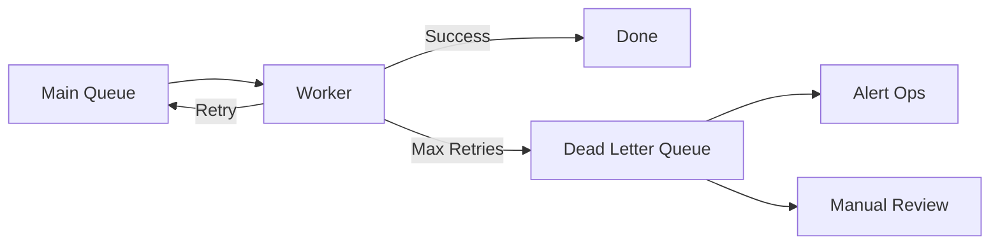
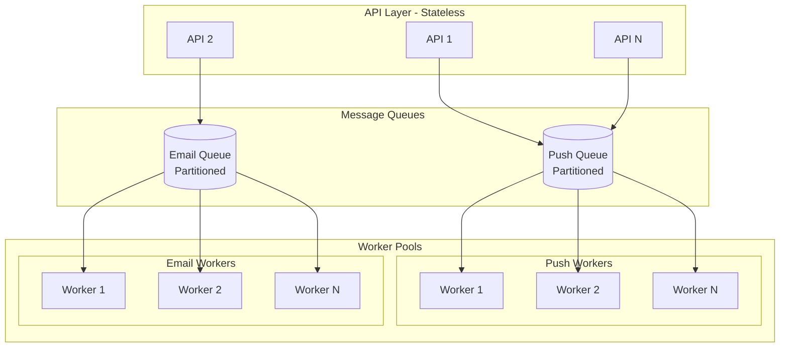

# Design a Notification System
{: .no_toc }

<details open markdown="block">
  <summary>Table of Contents</summary>
  {: .text-delta }
1. TOC
{:toc}
</details>

---

## What We're Building

A notification system delivers messages to users across multiple channels: push notifications, SMS, email, and in-app messages. Think of the notifications you receive from apps like Facebook, Uber, or Amazon—that's what we're designing.

**Example notifications:**
- "John liked your photo" (push notification)
- "Your order has shipped" (email + SMS)
- "You have 3 new messages" (in-app badge)
- "Flash sale ends in 2 hours!" (marketing push)

### Why Notification Systems Are Complex

| Challenge | Description |
|-----------|-------------|
| **Multiple channels** | Push, SMS, email, in-app—each with different APIs |
| **User preferences** | Users want control: mute certain types, choose channels |
| **Deliverability** | Push tokens expire, emails bounce, phones change |
| **Timeliness** | Some notifications are urgent, others can wait |
| **Scale** | Millions of notifications per second during events |
| **Reliability** | Critical notifications (OTPs, alerts) must arrive |

### Real-World Scale

| Company | Notifications/Day | Channels |
|---------|-------------------|----------|
| **Facebook** | Billions | Push, email, SMS, in-app |
| **Uber** | Hundreds of millions | Push, SMS |
| **Amazon** | Billions | Email, push, SMS |
| **Slack** | Hundreds of millions | Push, email, in-app |

---

## Step 1: Requirements Clarification

### Questions to Ask

| Question | Why It Matters |
|----------|----------------|
| Which channels? | Different integrations needed |
| Real-time or batched? | Architecture implications |
| What triggers notifications? | Event-driven vs scheduled |
| User preferences? | Preference storage and enforcement |
| Rate limiting needed? | Prevent notification fatigue |
| Analytics required? | Tracking delivery, opens, clicks |

### Functional Requirements

| Requirement | Priority | Description |
|-------------|----------|-------------|
| Send push notifications (iOS/Android) | Must have | Mobile app notifications |
| Send emails | Must have | Transactional and marketing |
| Send SMS | Must have | OTPs, critical alerts |
| In-app notifications | Must have | Real-time in-app messages |
| User preferences | Must have | Channel opt-in/out, quiet hours |
| Templates | Must have | Reusable notification templates |
| Scheduling | Nice to have | Send at specific time |
| Rate limiting | Nice to have | Prevent spam |
| Analytics | Nice to have | Delivery, open, click tracking |

### Non-Functional Requirements

| Requirement | Target | Rationale |
|-------------|--------|-----------|
| **Latency** | < 1 second for urgent | OTPs must arrive quickly |
| **Throughput** | 1M+ notifications/minute | Handle peak events |
| **Reliability** | 99.9% delivery for critical | OTPs, security alerts |
| **Scalability** | Horizontal | Handle traffic spikes |
| **Deduplication** | No duplicates | Annoying to users |

---

## Step 2: Notification Types and Priorities

### Notification Categories

| Type | Examples | Priority | Channels |
|------|----------|----------|----------|
| **Transactional** | OTP, password reset, order confirmation | Critical | SMS, email, push |
| **Engagement** | Likes, comments, mentions | High | Push, in-app |
| **Promotional** | Sales, offers, recommendations | Low | Email, push |
| **System** | Maintenance, security alerts | Critical | All |

### Priority Queues



---

## Step 3: High-Level Architecture

### System Overview



### Request Flow



---

## Step 4: Component Deep Dive

### 4.1 Notification API

```python
from fastapi import FastAPI, HTTPException, BackgroundTasks
from pydantic import BaseModel, EmailStr
from typing import List, Optional, Dict
from enum import Enum

class Channel(str, Enum):
    PUSH = "push"
    EMAIL = "email"
    SMS = "sms"
    IN_APP = "in_app"

class Priority(str, Enum):
    CRITICAL = "critical"
    HIGH = "high"
    NORMAL = "normal"
    LOW = "low"

class NotificationRequest(BaseModel):
    user_ids: List[str]
    template_id: str
    channels: Optional[List[Channel]] = None  # None = use user preferences
    priority: Priority = Priority.NORMAL
    data: Dict = {}  # Template variables
    scheduled_at: Optional[datetime] = None
    idempotency_key: Optional[str] = None

class NotificationResponse(BaseModel):
    notification_id: str
    status: str
    recipients: int

app = FastAPI()

@app.post("/v1/notifications", response_model=NotificationResponse)
async def send_notification(
    request: NotificationRequest,
    background_tasks: BackgroundTasks
):
    # Idempotency check
    if request.idempotency_key:
        existing = await check_idempotency(request.idempotency_key)
        if existing:
            return existing
    
    # Generate notification ID
    notification_id = generate_notification_id()
    
    # Validate template exists
    template = await template_store.get(request.template_id)
    if not template:
        raise HTTPException(400, "Template not found")
    
    # Validate users exist
    valid_users = await validate_users(request.user_ids)
    if not valid_users:
        raise HTTPException(400, "No valid users")
    
    # Enqueue for async processing
    await notification_queue.enqueue({
        "notification_id": notification_id,
        "user_ids": valid_users,
        "template_id": request.template_id,
        "channels": request.channels,
        "priority": request.priority,
        "data": request.data,
        "scheduled_at": request.scheduled_at
    })
    
    return NotificationResponse(
        notification_id=notification_id,
        status="accepted",
        recipients=len(valid_users)
    )
```

### 4.2 User Preferences

Store and enforce user notification preferences:

```python
from dataclasses import dataclass
from typing import Set, Optional
from datetime import time

@dataclass
class QuietHours:
    start: time
    end: time
    timezone: str

@dataclass
class UserPreferences:
    user_id: str
    enabled_channels: Set[Channel]
    muted_categories: Set[str]
    quiet_hours: Optional[QuietHours]
    frequency_cap: int  # Max notifications per hour
    language: str

class PreferencesStore:
    def __init__(self, redis_client, db):
        self.redis = redis_client
        self.db = db
    
    async def get(self, user_id: str) -> UserPreferences:
        """Get user preferences with caching."""
        # Check cache
        cached = await self.redis.get(f"prefs:{user_id}")
        if cached:
            return UserPreferences(**json.loads(cached))
        
        # Fetch from DB
        row = await self.db.fetchone(
            "SELECT * FROM user_preferences WHERE user_id = $1",
            user_id
        )
        
        if not row:
            # Return defaults
            prefs = UserPreferences(
                user_id=user_id,
                enabled_channels={Channel.PUSH, Channel.EMAIL, Channel.IN_APP},
                muted_categories=set(),
                quiet_hours=None,
                frequency_cap=100,
                language="en"
            )
        else:
            prefs = UserPreferences(**row)
        
        # Cache for 5 minutes
        await self.redis.setex(
            f"prefs:{user_id}",
            300,
            json.dumps(prefs.__dict__)
        )
        
        return prefs
    
    async def should_send(self, user_id: str, channel: Channel, 
                          category: str) -> tuple[bool, str]:
        """Check if notification should be sent."""
        prefs = await self.get(user_id)
        
        # Check channel enabled
        if channel not in prefs.enabled_channels:
            return False, "channel_disabled"
        
        # Check category muted
        if category in prefs.muted_categories:
            return False, "category_muted"
        
        # Check quiet hours
        if prefs.quiet_hours and self._is_quiet_hours(prefs.quiet_hours):
            return False, "quiet_hours"
        
        # Check frequency cap
        count = await self.get_notification_count(user_id)
        if count >= prefs.frequency_cap:
            return False, "frequency_cap"
        
        return True, "allowed"
```

### 4.3 Template System

Templates separate content from delivery logic:

```python
from jinja2 import Template
from typing import Dict

class NotificationTemplate:
    def __init__(self, template_id: str, data: dict):
        self.template_id = template_id
        self.name = data["name"]
        self.category = data["category"]
        
        # Channel-specific templates
        self.push_title = data.get("push_title")
        self.push_body = data.get("push_body")
        self.email_subject = data.get("email_subject")
        self.email_body = data.get("email_body")
        self.sms_body = data.get("sms_body")
        
        # Default fallback
        self.default_title = data.get("default_title", "")
        self.default_body = data.get("default_body", "")
    
    def render(self, channel: Channel, variables: Dict) -> Dict:
        """Render template for specific channel."""
        if channel == Channel.PUSH:
            return {
                "title": self._render(self.push_title or self.default_title, variables),
                "body": self._render(self.push_body or self.default_body, variables)
            }
        elif channel == Channel.EMAIL:
            return {
                "subject": self._render(self.email_subject or self.default_title, variables),
                "body": self._render(self.email_body or self.default_body, variables)
            }
        elif channel == Channel.SMS:
            return {
                "body": self._render(self.sms_body or self.default_body, variables)
            }
        elif channel == Channel.IN_APP:
            return {
                "title": self._render(self.default_title, variables),
                "body": self._render(self.default_body, variables)
            }
    
    def _render(self, template_str: str, variables: Dict) -> str:
        """Render Jinja2 template."""
        return Template(template_str).render(**variables)

# Example template
ORDER_SHIPPED_TEMPLATE = {
    "name": "order_shipped",
    "category": "transactional",
    "push_title": "Your order is on its way! 📦",
    "push_body": "Order #{{order_id}} has shipped. Track: {{tracking_url}}",
    "email_subject": "Your order has shipped",
    "email_body": """
        <h1>Great news, {{user_name}}!</h1>
        <p>Your order #{{order_id}} has shipped.</p>
        <p>Tracking number: {{tracking_number}}</p>
        <a href="{{tracking_url}}">Track your package</a>
    """,
    "sms_body": "Your order #{{order_id}} shipped! Track: {{tracking_url}}"
}
```

### 4.4 Channel Router

Route notifications to appropriate queues:

```python
class NotificationRouter:
    def __init__(self, queues: Dict[Channel, MessageQueue]):
        self.queues = queues
    
    async def route(self, notification: dict, user_id: str, 
                    channels: List[Channel] = None):
        """Route notification to appropriate channel queues."""
        
        # Get user preferences
        prefs = await preference_store.get(user_id)
        
        # Determine channels to use
        if channels:
            # Explicit channels requested
            target_channels = set(channels) & prefs.enabled_channels
        else:
            # Use user's enabled channels
            target_channels = prefs.enabled_channels
        
        # Get template
        template = await template_store.get(notification["template_id"])
        
        # Route to each channel
        for channel in target_channels:
            # Check if should send
            should_send, reason = await preference_store.should_send(
                user_id, channel, template.category
            )
            
            if not should_send:
                await log_suppressed(notification, user_id, channel, reason)
                continue
            
            # Render template for channel
            rendered = template.render(channel, notification["data"])
            
            # Create channel-specific message
            message = {
                "notification_id": notification["notification_id"],
                "user_id": user_id,
                "channel": channel,
                "content": rendered,
                "priority": notification["priority"],
                "metadata": notification.get("metadata", {})
            }
            
            # Enqueue to channel queue
            queue = self.queues[channel]
            await queue.enqueue(message, priority=notification["priority"])
```

---

## Step 5: Channel Implementations

### 5.1 Push Notifications (iOS/Android)

```python
import firebase_admin
from firebase_admin import messaging
import httpx

class PushNotificationWorker:
    def __init__(self):
        # Initialize Firebase for Android
        firebase_admin.initialize_app()
        
        # APNS configuration for iOS
        self.apns_endpoint = "https://api.push.apple.com/3/device/"
        self.apns_key = load_apns_key()
    
    async def process(self, message: dict):
        """Process push notification."""
        user_id = message["user_id"]
        content = message["content"]
        
        # Get user's device tokens
        devices = await device_store.get_devices(user_id)
        
        results = []
        for device in devices:
            if device.platform == "ios":
                result = await self._send_ios(device.token, content)
            elif device.platform == "android":
                result = await self._send_android(device.token, content)
            
            results.append(result)
            
            # Handle invalid tokens
            if result.get("error") == "invalid_token":
                await device_store.remove_token(device.token)
        
        return results
    
    async def _send_android(self, token: str, content: dict) -> dict:
        """Send via Firebase Cloud Messaging."""
        message = messaging.Message(
            notification=messaging.Notification(
                title=content["title"],
                body=content["body"]
            ),
            token=token,
            android=messaging.AndroidConfig(
                priority="high",
                notification=messaging.AndroidNotification(
                    click_action="FLUTTER_NOTIFICATION_CLICK"
                )
            )
        )
        
        try:
            response = messaging.send(message)
            return {"success": True, "message_id": response}
        except messaging.UnregisteredError:
            return {"success": False, "error": "invalid_token"}
        except Exception as e:
            return {"success": False, "error": str(e)}
    
    async def _send_ios(self, token: str, content: dict) -> dict:
        """Send via Apple Push Notification Service."""
        payload = {
            "aps": {
                "alert": {
                    "title": content["title"],
                    "body": content["body"]
                },
                "sound": "default",
                "badge": 1
            }
        }
        
        headers = {
            "authorization": f"bearer {self._get_apns_token()}",
            "apns-topic": "com.yourapp.bundle",
            "apns-push-type": "alert"
        }
        
        async with httpx.AsyncClient(http2=True) as client:
            response = await client.post(
                f"{self.apns_endpoint}{token}",
                json=payload,
                headers=headers
            )
            
            if response.status_code == 200:
                return {"success": True}
            elif response.status_code == 410:
                return {"success": False, "error": "invalid_token"}
            else:
                return {"success": False, "error": response.text}
```

### 5.2 Email

```python
import boto3
from email.mime.multipart import MIMEMultipart
from email.mime.text import MIMEText

class EmailWorker:
    def __init__(self):
        self.ses = boto3.client('ses', region_name='us-east-1')
        self.from_address = "noreply@yourapp.com"
    
    async def process(self, message: dict):
        """Process email notification."""
        user_id = message["user_id"]
        content = message["content"]
        
        # Get user's email
        user = await user_store.get(user_id)
        
        # Build email
        msg = MIMEMultipart('alternative')
        msg['Subject'] = content["subject"]
        msg['From'] = self.from_address
        msg['To'] = user.email
        
        # Add plain text and HTML versions
        text_part = MIMEText(self._strip_html(content["body"]), 'plain')
        html_part = MIMEText(content["body"], 'html')
        
        msg.attach(text_part)
        msg.attach(html_part)
        
        # Send via SES
        try:
            response = self.ses.send_raw_email(
                Source=self.from_address,
                Destinations=[user.email],
                RawMessage={'Data': msg.as_string()},
                ConfigurationSetName='notification-tracking'  # For analytics
            )
            
            return {
                "success": True,
                "message_id": response["MessageId"]
            }
        except self.ses.exceptions.MessageRejected as e:
            return {"success": False, "error": "rejected", "details": str(e)}
        except Exception as e:
            return {"success": False, "error": str(e)}
    
    def _strip_html(self, html: str) -> str:
        """Convert HTML to plain text."""
        from bs4 import BeautifulSoup
        return BeautifulSoup(html, "html.parser").get_text()
```

### 5.3 SMS

```python
from twilio.rest import Client

class SMSWorker:
    def __init__(self):
        self.client = Client(
            os.environ["TWILIO_ACCOUNT_SID"],
            os.environ["TWILIO_AUTH_TOKEN"]
        )
        self.from_number = os.environ["TWILIO_PHONE_NUMBER"]
    
    async def process(self, message: dict):
        """Process SMS notification."""
        user_id = message["user_id"]
        content = message["content"]
        
        # Get user's phone number
        user = await user_store.get(user_id)
        
        if not user.phone_verified:
            return {"success": False, "error": "phone_not_verified"}
        
        # Ensure SMS doesn't exceed character limit
        body = content["body"][:160]
        
        try:
            sms = self.client.messages.create(
                body=body,
                from_=self.from_number,
                to=user.phone_number,
                status_callback=f"{WEBHOOK_URL}/sms/status"
            )
            
            return {
                "success": True,
                "message_sid": sms.sid
            }
        except Exception as e:
            return {"success": False, "error": str(e)}
```

### 5.4 In-App Notifications

For real-time in-app notifications, use WebSockets:

```python
from fastapi import WebSocket
import asyncio
import json

class InAppNotificationManager:
    def __init__(self):
        self.connections: Dict[str, WebSocket] = {}
        self.redis = redis.Redis()
    
    async def connect(self, user_id: str, websocket: WebSocket):
        """Handle new WebSocket connection."""
        await websocket.accept()
        self.connections[user_id] = websocket
        
        # Subscribe to Redis pub/sub for this user
        pubsub = self.redis.pubsub()
        await pubsub.subscribe(f"notifications:{user_id}")
        
        # Send any pending notifications
        pending = await self.get_pending(user_id)
        for notification in pending:
            await websocket.send_json(notification)
    
    async def send(self, user_id: str, notification: dict):
        """Send in-app notification to user."""
        # Store in database
        await self.store_notification(user_id, notification)
        
        # Try to send via WebSocket if connected
        if user_id in self.connections:
            try:
                await self.connections[user_id].send_json(notification)
                return {"success": True, "delivered": True}
            except:
                del self.connections[user_id]
        
        # Publish to Redis (for distributed setup)
        self.redis.publish(
            f"notifications:{user_id}",
            json.dumps(notification)
        )
        
        return {"success": True, "delivered": False}
    
    async def get_pending(self, user_id: str, limit: int = 50) -> List[dict]:
        """Get unread notifications for user."""
        return await self.db.fetch("""
            SELECT * FROM in_app_notifications
            WHERE user_id = $1 AND read_at IS NULL
            ORDER BY created_at DESC
            LIMIT $2
        """, user_id, limit)
```

---

## Step 6: Reliability and Delivery Guarantees

### Retry Strategies

```python
class RetryableWorker:
    def __init__(self, max_retries: int = 3):
        self.max_retries = max_retries
    
    async def process_with_retry(self, message: dict):
        """Process message with exponential backoff retry."""
        retry_count = message.get("retry_count", 0)
        
        try:
            result = await self.process(message)
            
            if result["success"]:
                await self.mark_delivered(message)
            else:
                if self._is_permanent_failure(result["error"]):
                    await self.mark_failed(message, result["error"])
                else:
                    await self.retry_later(message, retry_count)
        
        except Exception as e:
            if retry_count < self.max_retries:
                await self.retry_later(message, retry_count)
            else:
                await self.mark_failed(message, str(e))
    
    async def retry_later(self, message: dict, retry_count: int):
        """Schedule retry with exponential backoff."""
        delay = 2 ** retry_count  # 1, 2, 4, 8 seconds
        message["retry_count"] = retry_count + 1
        
        await self.queue.enqueue(
            message,
            delay_seconds=delay
        )
    
    def _is_permanent_failure(self, error: str) -> bool:
        """Check if error is permanent (no point retrying)."""
        permanent_errors = [
            "invalid_token",
            "user_not_found",
            "phone_not_verified",
            "email_bounced"
        ]
        return error in permanent_errors
```

### Idempotency

Ensure notifications aren't sent twice:

```python
class IdempotentNotificationSender:
    def __init__(self, redis_client):
        self.redis = redis_client
        self.ttl = 86400  # 24 hours
    
    async def send_if_not_sent(self, notification_id: str, 
                               user_id: str, channel: str,
                               send_func: callable) -> dict:
        """Send notification only if not already sent."""
        idempotency_key = f"sent:{notification_id}:{user_id}:{channel}"
        
        # Try to set the key (only succeeds if not exists)
        was_set = await self.redis.set(
            idempotency_key,
            "pending",
            nx=True,  # Only set if not exists
            ex=self.ttl
        )
        
        if not was_set:
            # Already sent or in progress
            return {"success": True, "duplicate": True}
        
        try:
            result = await send_func()
            
            # Update key with result
            await self.redis.set(
                idempotency_key,
                json.dumps(result),
                ex=self.ttl
            )
            
            return result
        except Exception as e:
            # Remove key on failure to allow retry
            await self.redis.delete(idempotency_key)
            raise
```

### Dead Letter Queue

Handle persistent failures:



---

## Step 7: Rate Limiting and Throttling

Prevent notification fatigue and respect provider limits.

### User-Level Rate Limiting

```python
class NotificationRateLimiter:
    def __init__(self, redis_client):
        self.redis = redis_client
        
        # Limits
        self.user_hourly_limit = 10
        self.user_daily_limit = 50
        self.category_limits = {
            "promotional": 3,  # 3 promotional per day
            "engagement": 20,  # 20 engagement per day
            "transactional": 100  # High limit for OTPs etc.
        }
    
    async def check_limit(self, user_id: str, category: str) -> tuple[bool, str]:
        """Check if notification is within limits."""
        now = datetime.now()
        
        # Check hourly limit
        hourly_key = f"limit:hour:{user_id}:{now.strftime('%Y%m%d%H')}"
        hourly_count = int(await self.redis.get(hourly_key) or 0)
        
        if hourly_count >= self.user_hourly_limit:
            return False, "hourly_limit_exceeded"
        
        # Check daily limit
        daily_key = f"limit:day:{user_id}:{now.strftime('%Y%m%d')}"
        daily_count = int(await self.redis.get(daily_key) or 0)
        
        if daily_count >= self.user_daily_limit:
            return False, "daily_limit_exceeded"
        
        # Check category limit
        category_key = f"limit:cat:{user_id}:{category}:{now.strftime('%Y%m%d')}"
        category_count = int(await self.redis.get(category_key) or 0)
        category_limit = self.category_limits.get(category, 50)
        
        if category_count >= category_limit:
            return False, "category_limit_exceeded"
        
        return True, "allowed"
    
    async def record_sent(self, user_id: str, category: str):
        """Record that a notification was sent."""
        now = datetime.now()
        
        pipe = self.redis.pipeline()
        
        # Increment counters
        hourly_key = f"limit:hour:{user_id}:{now.strftime('%Y%m%d%H')}"
        pipe.incr(hourly_key)
        pipe.expire(hourly_key, 3600)
        
        daily_key = f"limit:day:{user_id}:{now.strftime('%Y%m%d')}"
        pipe.incr(daily_key)
        pipe.expire(daily_key, 86400)
        
        category_key = f"limit:cat:{user_id}:{category}:{now.strftime('%Y%m%d')}"
        pipe.incr(category_key)
        pipe.expire(category_key, 86400)
        
        await pipe.execute()
```

### Provider Rate Limiting

Respect external provider limits:

```python
class ProviderRateLimiter:
    """Rate limiter for external notification providers."""
    
    PROVIDER_LIMITS = {
        "fcm": 1000,  # 1000 requests per second
        "apns": 1000,
        "twilio": 100,  # SMS per second
        "ses": 50  # Emails per second
    }
    
    def __init__(self, redis_client):
        self.redis = redis_client
    
    async def acquire(self, provider: str) -> bool:
        """Try to acquire a rate limit slot."""
        limit = self.PROVIDER_LIMITS.get(provider, 100)
        key = f"provider:rate:{provider}"
        
        # Sliding window counter
        now = time.time()
        window_start = now - 1  # 1 second window
        
        pipe = self.redis.pipeline()
        pipe.zremrangebyscore(key, 0, window_start)
        pipe.zadd(key, {str(now): now})
        pipe.zcard(key)
        pipe.expire(key, 2)
        results = await pipe.execute()
        
        count = results[2]
        
        if count > limit:
            # Remove our addition
            await self.redis.zrem(key, str(now))
            return False
        
        return True
    
    async def wait_for_slot(self, provider: str, timeout: float = 5.0):
        """Wait until a rate limit slot is available."""
        start = time.time()
        
        while time.time() - start < timeout:
            if await self.acquire(provider):
                return True
            await asyncio.sleep(0.01)  # 10ms
        
        return False
```

---

## Step 8: Analytics and Tracking

### Delivery Tracking

```python
class NotificationTracker:
    def __init__(self, db, analytics_client):
        self.db = db
        self.analytics = analytics_client
    
    async def log_event(self, notification_id: str, event: str, 
                        metadata: dict = None):
        """Log notification lifecycle event."""
        await self.db.execute("""
            INSERT INTO notification_events 
            (notification_id, event, metadata, timestamp)
            VALUES ($1, $2, $3, NOW())
        """, notification_id, event, json.dumps(metadata or {}))
        
        # Send to analytics pipeline
        await self.analytics.track({
            "event": f"notification.{event}",
            "notification_id": notification_id,
            "metadata": metadata,
            "timestamp": datetime.utcnow().isoformat()
        })
    
    async def track_sent(self, notification_id: str, channel: str, 
                         provider_id: str):
        await self.log_event(notification_id, "sent", {
            "channel": channel,
            "provider_message_id": provider_id
        })
    
    async def track_delivered(self, notification_id: str):
        await self.log_event(notification_id, "delivered")
    
    async def track_opened(self, notification_id: str):
        await self.log_event(notification_id, "opened")
    
    async def track_clicked(self, notification_id: str, link: str):
        await self.log_event(notification_id, "clicked", {"link": link})
    
    async def track_failed(self, notification_id: str, error: str):
        await self.log_event(notification_id, "failed", {"error": error})
```

### Email Open/Click Tracking

```python
class EmailTracker:
    def __init__(self, base_url: str):
        self.base_url = base_url
    
    def add_tracking(self, notification_id: str, html_content: str) -> str:
        """Add tracking pixel and link tracking to email."""
        from bs4 import BeautifulSoup
        
        soup = BeautifulSoup(html_content, 'html.parser')
        
        # Add tracking pixel for open tracking
        pixel_url = f"{self.base_url}/track/open/{notification_id}.gif"
        pixel = soup.new_tag("img", src=pixel_url, width="1", height="1")
        soup.body.append(pixel)
        
        # Wrap links for click tracking
        for a_tag in soup.find_all('a', href=True):
            original_url = a_tag['href']
            tracked_url = f"{self.base_url}/track/click/{notification_id}?url={quote(original_url)}"
            a_tag['href'] = tracked_url
        
        return str(soup)

# Tracking endpoints
@app.get("/track/open/{notification_id}.gif")
async def track_open(notification_id: str):
    await tracker.track_opened(notification_id)
    
    # Return 1x1 transparent GIF
    gif = base64.b64decode(
        "R0lGODlhAQABAIAAAAAAAP///yH5BAEAAAAALAAAAAABAAEAAAIBRAA7"
    )
    return Response(content=gif, media_type="image/gif")

@app.get("/track/click/{notification_id}")
async def track_click(notification_id: str, url: str):
    await tracker.track_clicked(notification_id, url)
    return RedirectResponse(url)
```

---

## Step 9: Scaling Strategies

### Horizontal Scaling



### Auto-Scaling

```yaml
# Kubernetes HPA for workers
apiVersion: autoscaling/v2
kind: HorizontalPodAutoscaler
metadata:
  name: push-worker-hpa
spec:
  scaleTargetRef:
    apiVersion: apps/v1
    kind: Deployment
    name: push-worker
  minReplicas: 3
  maxReplicas: 50
  metrics:
  - type: External
    external:
      metric:
        name: kafka_consumer_lag
      target:
        type: Value
        value: "10000"  # Scale up if lag > 10K messages
```

### Handling Spikes

For events like Black Friday sales:

```python
class BatchNotificationSender:
    """Send notifications in batches during high-volume events."""
    
    async def send_campaign(self, user_ids: List[str], 
                           template_id: str, data: dict,
                           batch_size: int = 1000,
                           delay_between_batches: float = 1.0):
        """Send campaign to millions of users in controlled batches."""
        total = len(user_ids)
        sent = 0
        
        for i in range(0, total, batch_size):
            batch = user_ids[i:i + batch_size]
            
            # Enqueue batch
            await self.enqueue_batch(batch, template_id, data)
            
            sent += len(batch)
            logger.info(f"Enqueued {sent}/{total} notifications")
            
            # Delay to prevent overwhelming the system
            await asyncio.sleep(delay_between_batches)
```

---

## Step 10: Monitoring

### Key Metrics

| Metric | Description | Alert Threshold |
|--------|-------------|-----------------|
| `notifications_sent_total` | Total notifications sent | - |
| `notifications_failed_total` | Failed notifications | > 1% of sent |
| `delivery_latency_seconds` | Time from request to delivery | P99 > 10s |
| `queue_depth` | Messages in queue | > 100K |
| `provider_errors` | Errors from FCM/APNS/etc. | > 5% |
| `rate_limit_rejections` | Notifications rejected by rate limit | - |

### Dashboard

```python
import prometheus_client as prom

# Metrics
notifications_counter = prom.Counter(
    'notifications_total',
    'Total notifications',
    ['channel', 'status', 'category']
)

delivery_latency = prom.Histogram(
    'notification_delivery_latency_seconds',
    'Time to deliver notification',
    ['channel'],
    buckets=[0.1, 0.5, 1, 2, 5, 10, 30]
)

queue_depth = prom.Gauge(
    'notification_queue_depth',
    'Messages in queue',
    ['channel']
)

# Usage
async def send_notification(channel, notification):
    start = time.time()
    result = await sender.send(notification)
    
    notifications_counter.labels(
        channel=channel,
        status='success' if result['success'] else 'failed',
        category=notification['category']
    ).inc()
    
    delivery_latency.labels(channel=channel).observe(time.time() - start)
```

---

## Interview Checklist

- [ ] **Clarified requirements** (channels, scale, priorities)
- [ ] **Explained architecture** (API, router, queues, workers)
- [ ] **Discussed all channels** (push, email, SMS, in-app)
- [ ] **Covered user preferences** (opt-out, quiet hours)
- [ ] **Addressed templates** (content management)
- [ ] **Explained reliability** (retries, idempotency, DLQ)
- [ ] **Discussed rate limiting** (user and provider)
- [ ] **Covered analytics** (open/click tracking)
- [ ] **Mentioned scaling** (horizontal, batching)
- [ ] **Addressed monitoring** (metrics, alerting)

---

## Sample Interview Dialogue

**Interviewer:** "Design a notification system."

**You:** "Interesting! Let me clarify the scope. Which channels are we supporting—push, email, SMS, all of them? And what's the expected scale?"

**Interviewer:** "All channels. Let's say millions of notifications per day, with spikes during marketing campaigns."

**You:** "Got it. So we need a multi-channel notification system that can handle bursty traffic.

The core architecture has three layers:
1. **API layer** that accepts notification requests
2. **Routing layer** that determines which channels based on user preferences
3. **Channel workers** that integrate with providers like FCM, APNS, Twilio, SES

I'd use separate message queues per channel—this allows independent scaling and prevents slow channels from blocking fast ones. Push notifications typically deliver in milliseconds, while emails might take seconds.

For reliability, we need:
- Retries with exponential backoff for transient failures
- Idempotency to prevent duplicate notifications
- Dead letter queues for persistent failures

User preferences are critical—we store opt-in/out per channel, quiet hours, and category mutes. Every notification checks preferences before sending.

Want me to dive into any specific component?"

---

## Summary

| Component | Technology | Rationale |
|-----------|------------|-----------|
| **API** | REST with async processing | Fast response, reliable delivery |
| **Queues** | Kafka per channel | Independent scaling, ordering |
| **Push** | FCM + APNS | Android + iOS coverage |
| **Email** | AWS SES | High deliverability, scalable |
| **SMS** | Twilio | Reliable, global coverage |
| **In-App** | WebSocket + Redis PubSub | Real-time delivery |
| **Storage** | PostgreSQL + Redis | Preferences, tracking, caching |

A notification system is a classic example of event-driven architecture. The key challenges are multi-channel delivery, user preference management, and reliable delivery at scale. Master these patterns, and you'll be well-equipped for similar distributed systems problems.

