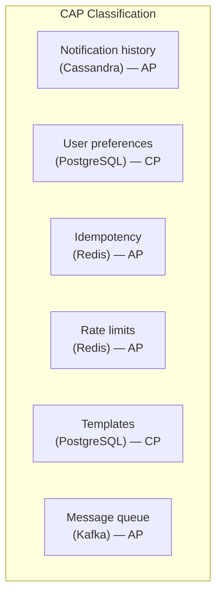
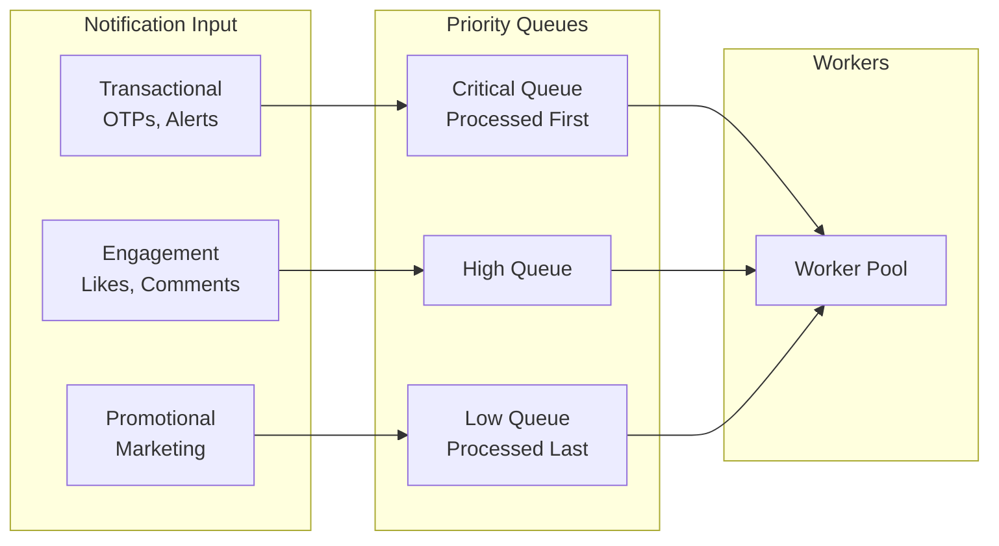
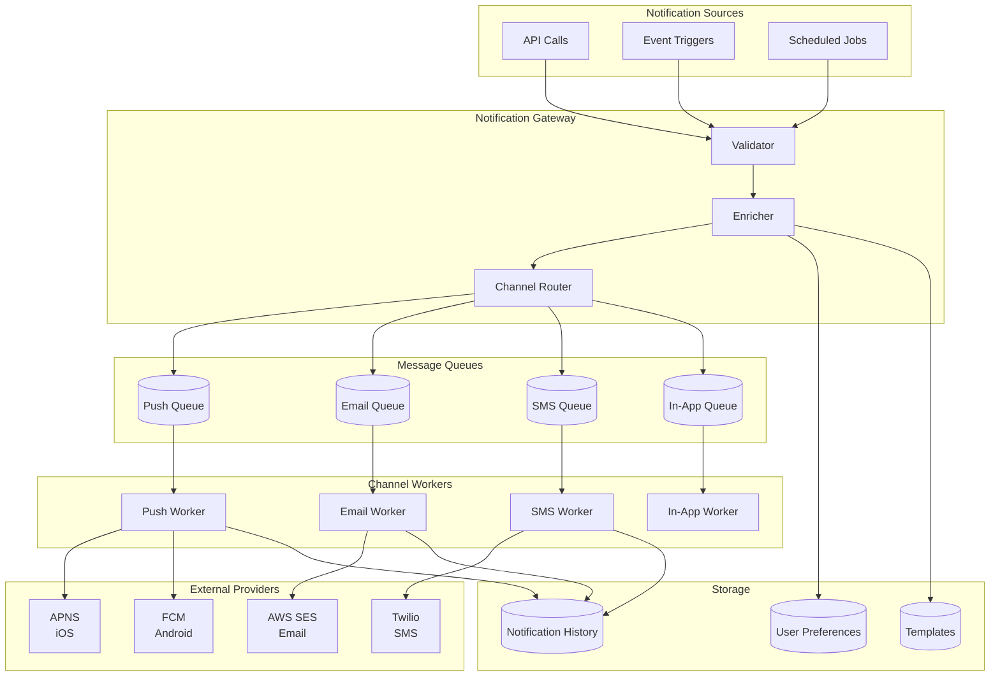
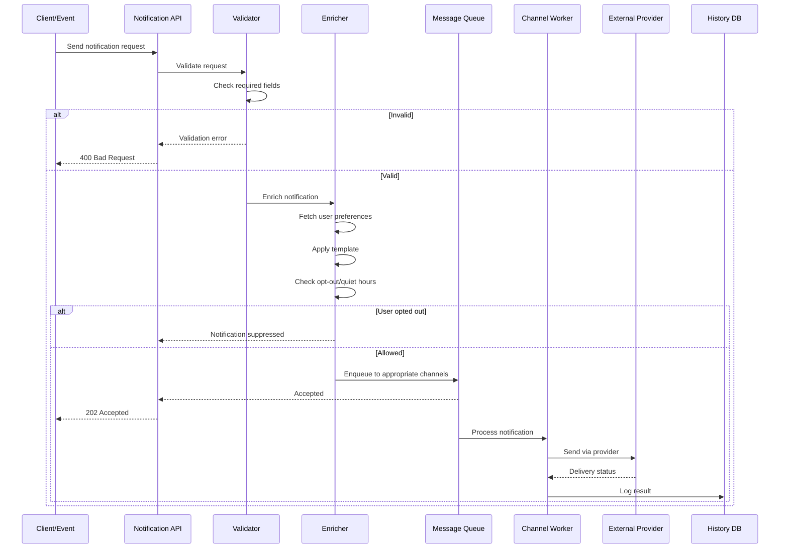
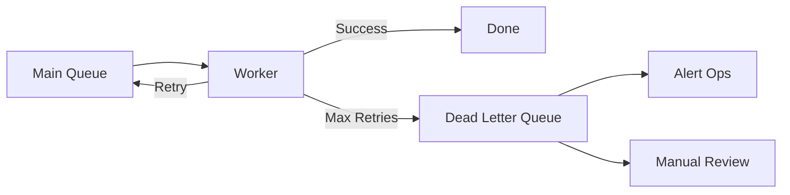
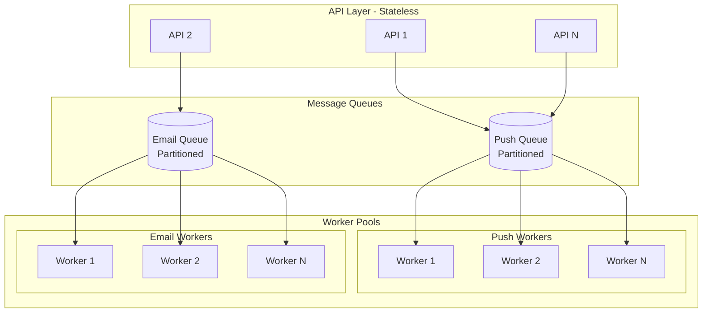
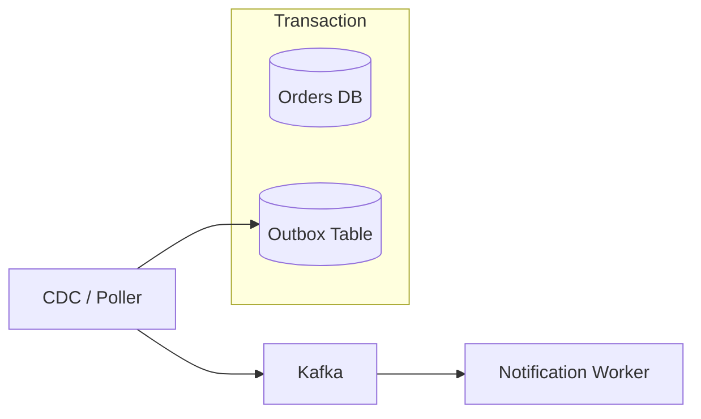
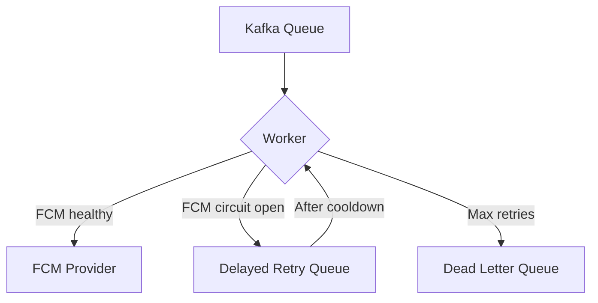

# Design a Notification System
{: .no_toc }

<details open markdown="block">
  <summary>Table of Contents</summary>
  {: .text-delta }
1. TOC
{:toc}
</details>

---

## What We're Building

A notification system delivers messages to users across multiple channels: push notifications, SMS, email, and in-app messages. Think of the notifications you receive from apps like Facebook, Uber, or Amazon—that's what we're designing.

**Example notifications:**
- "John liked your photo" (push notification)
- "Your order has shipped" (email + SMS)
- "You have 3 new messages" (in-app badge)
- "Flash sale ends in 2 hours!" (marketing push)

### Why Notification Systems Are Complex

| Challenge | Description |
|-----------|-------------|
| **Multiple channels** | Push, SMS, email, in-app—each with different APIs |
| **User preferences** | Users want control: mute certain types, choose channels |
| **Deliverability** | Push tokens expire, emails bounce, phones change |
| **Timeliness** | Some notifications are urgent, others can wait |
| **Scale** | Millions of notifications per second during events |
| **Reliability** | Critical notifications (OTPs, alerts) must arrive |

### Real-World Scale

| Company | Notifications/Day | Channels |
|---------|-------------------|----------|
| **Facebook** | Billions | Push, email, SMS, in-app |
| **Uber** | Hundreds of millions | Push, SMS |
| **Amazon** | Billions | Email, push, SMS |
| **Slack** | Hundreds of millions | Push, email, in-app |

---

## Step 1: Requirements Clarification

### Questions to Ask

| Question | Why It Matters |
|----------|----------------|
| Which channels? | Different integrations needed |
| Real-time or batched? | Architecture implications |
| What triggers notifications? | Event-driven vs scheduled |
| User preferences? | Preference storage and enforcement |
| Rate limiting needed? | Prevent notification fatigue |
| Analytics required? | Tracking delivery, opens, clicks |

### Functional Requirements

| Requirement | Priority | Description |
|-------------|----------|-------------|
| Send push notifications (iOS/Android) | Must have | Mobile app notifications |
| Send emails | Must have | Transactional and marketing |
| Send SMS | Must have | OTPs, critical alerts |
| In-app notifications | Must have | Real-time in-app messages |
| User preferences | Must have | Channel opt-in/out, quiet hours |
| Templates | Must have | Reusable notification templates |
| Scheduling | Nice to have | Send at specific time |
| Rate limiting | Nice to have | Prevent spam |
| Analytics | Nice to have | Delivery, open, click tracking |

### Non-Functional Requirements

| Requirement | Target | Rationale |
|-------------|--------|-----------|
| **Latency** | < 1 second for urgent | OTPs must arrive quickly |
| **Throughput** | 1M+ notifications/minute | Handle peak events |
| **Reliability** | 99.9% delivery for critical | OTPs, security alerts |
| **Scalability** | Horizontal | Handle traffic spikes |
| **Deduplication** | No duplicates | Annoying to users |

---

## Step 2: Back-of-Envelope Estimation

### Scale Assumptions

```
- 500 million registered users
- 100 million DAU
- Average user receives 5 notifications/day
- Notification types: push (60%), email (25%), SMS (10%), in-app (5%)
- Peak multiplier: 5x (flash sales, breaking news)
```

### Traffic Estimation

```
Daily notifications   = 100M × 5 = 500 million/day
Average throughput     = 500M / 86,400 ≈ 5,800 notifications/sec
Peak throughput        = 5,800 × 5 = 29,000 notifications/sec

By channel (avg):
  Push:    5,800 × 0.60 = 3,480/sec
  Email:   5,800 × 0.25 = 1,450/sec
  SMS:     5,800 × 0.10 = 580/sec
  In-app:  5,800 × 0.05 = 290/sec
```

### Storage Estimation

```
Per notification record: ~500 bytes (recipient, channel, content, status, timestamps)
Daily storage    = 500M × 500 bytes = 250 GB/day
Monthly storage  = 250 GB × 30 = 7.5 TB/month
Yearly (with 90-day retention) = 22.5 TB active

Template storage: ~10,000 templates × 5 KB = 50 MB (negligible)
User preferences: 500M users × 200 bytes = 100 GB
```

### Provider Rate Limits

| Provider | Rate Limit | Our Peak Demand | Instances Needed |
|----------|-----------|----------------|-----------------|
| FCM (Push) | 500 msg/sec per connection | 3,480/sec peak | 7 connections |
| APNS | 5,000 msg/sec per connection | ~1,740/sec peak | 1 connection |
| SES (Email) | 500 emails/sec (default) | 1,450/sec peak | 3 accounts or limit increase |
| Twilio (SMS) | 100 msg/sec | 580/sec peak | 6 accounts or upgrade |

{: .note }
> Provider rate limits often become the bottleneck, not your infrastructure. Size your connection pools and account partitions to handle peak load with headroom.

---

## Technology Selection & Tradeoffs

A notification system touches many infrastructure components. This section explains **why** each technology was chosen and what alternatives were considered.

### Message queue

| Option | Strengths | Weaknesses | When to choose |
|--------|-----------|------------|----------------|
| **Kafka** | High throughput; durable log; replay capability; partition-based parallelism; exactly-once semantics | Operational overhead (KRaft/ZooKeeper); higher latency than in-memory queues; overkill for low-volume channels | High-throughput channels (push, email); need replay for reprocessing failed batches; multiple consumer groups (delivery + analytics) |
| **SQS** | Managed; auto-scaling; built-in DLQ; no ops burden; FIFO queues for ordering | Limited throughput per FIFO queue (300 msg/s); standard queues have no ordering; vendor lock-in; no replay | AWS-native; moderate volume; team prefers managed services |
| **RabbitMQ** | Low latency; flexible routing (topic, fanout, headers); priority queues native; mature | Less throughput than Kafka; clustering is fragile; no built-in replay | Low-latency priority-based routing; complex routing topologies; moderate scale |
| **Redis Streams** | Sub-ms latency; consumer groups; acknowledgment; already in stack if using Redis | Memory-bound; less durable than Kafka; limited ecosystem for stream processing | Simple queuing needs; already running Redis; want to avoid adding another system |

**Our choice:** **Kafka** with one topic per channel (push, email, SMS, in-app), each with multiple partitions. Rationale:
- **Push and email** channels generate the highest volume (3,480/s and 1,450/s respectively) — Kafka handles this comfortably.
- **Replay** is critical: if a provider outage causes failures, we can reprocess the failed window without re-sending the API request.
- **Consumer groups** allow independent scaling of delivery workers per channel.
- **Priority** is handled by separate topics per priority level (critical, high, normal, low) rather than in-queue ordering.

### Notification storage (history + tracking)

| Option | Strengths | Weaknesses | When to choose |
|--------|-----------|------------|----------------|
| **PostgreSQL** | ACID; rich queries for analytics; familiar tooling; good for structured notification records | Vertical scaling limits; high write volume (500M/day) stresses single instance | Moderate scale; need complex queries (join with user data); structured analytics |
| **Cassandra / ScyllaDB** | Linear write scaling; excellent for append-heavy workloads; tunable TTL per row | No transactions; query patterns must be modeled upfront; denormalization required | High write volume (500M+ records/day); time-series-like access (recent notifications per user); auto-expiry via TTL |
| **DynamoDB** | Managed; single-digit ms latency; auto-scaling; TTL support | Cost at high throughput; 400 KB item limit; limited query flexibility | AWS-native; predictable access patterns; pay-per-request pricing model |
| **ClickHouse** | Columnar; excellent for analytical queries (delivery rates, open rates); high compression | Not designed for point lookups; batch-oriented ingestion | Analytics pipeline only; notification analytics dashboard; not for serving in-app notifications |

**Our choice:** **Cassandra** for notification history (write-optimized, TTL-based retention, partition by `user_id` for "my notifications" queries) + **ClickHouse** for analytics (delivery rates, open/click tracking, A/B test results). Rationale:
- 500M notifications/day × 90-day retention = 45B rows — too much for PostgreSQL; Cassandra handles this natively.
- In-app notifications need fast per-user lookups — Cassandra partition by `user_id` with clustering by `created_at DESC`.
- Analytics queries (e.g., "what was the delivery rate for campaign X?") are aggregation-heavy — ClickHouse excels here.

### User preferences and metadata

| Option | Strengths | Weaknesses | When to choose |
|--------|-----------|------------|----------------|
| **PostgreSQL** | ACID; rich queries; JOINs with user tables; schema enforcement | Must shard for 500M+ users; schema migrations at scale | Preferences, templates, routing rules — low-volume, high-consistency data |
| **Redis** | Sub-ms reads; perfect for hot cache of frequently-accessed preferences | Memory cost; not a durable primary store | Cache layer for preferences; rate limit counters; idempotency keys |

**Our choice:** **PostgreSQL** as source of truth for preferences, templates, and routing rules. **Redis** as a read-through cache (5-minute TTL) for preferences on the hot path.

### Push notification provider

| Option | Strengths | Weaknesses | When to choose |
|--------|-----------|------------|----------------|
| **FCM (Firebase Cloud Messaging)** | Free; Android coverage; web push support; topic messaging | Google dependency; rate limits; no guaranteed delivery SLA | Android and web push |
| **APNS (Apple Push Notification Service)** | Required for iOS; reliable; priority support | Apple ecosystem only; certificate management; HTTP/2 required | iOS push (mandatory) |
| **OneSignal / Airship** | Managed; cross-platform; analytics built-in; A/B testing | Cost at scale; another dependency; less control | Team without push expertise; rapid prototyping |

**Our choice:** Direct integration with **FCM + APNS** (no intermediary). At our scale, the per-message cost of third-party push platforms is significant, and direct integration gives us full control over retry logic and token management.

---

## CAP Theorem Analysis

| Data store | CAP choice | Rationale |
|------------|------------|-----------|
| **Notification history (Cassandra)** | **AP** — Availability over consistency | Missing a notification record in the history is tolerable (can be reconciled); an unavailable notification history breaks the in-app notification inbox |
| **User preferences (PostgreSQL)** | **CP** — Consistency over availability | Stale preferences could cause sending to a channel the user opted out of — a compliance violation (CAN-SPAM, GDPR). Brief unavailability of the preferences API is acceptable (queue messages until resolved) |
| **Idempotency store (Redis)** | **AP** — Availability over consistency | If Redis is briefly inconsistent, the worst case is a duplicate notification (which idempotent providers can handle). If Redis is unavailable, we cannot check dedup and risk duplicates — unacceptable for critical notifications |
| **Template store (PostgreSQL)** | **CP** — Consistency over availability | Templates change infrequently; stale templates could send wrong content. Cache with short TTL mitigates read latency |
| **Rate limit counters (Redis)** | **AP** — Best-effort consistency | Slightly inaccurate rate limit counts are acceptable; missing a rate limit check is better than blocking all notifications |
| **Kafka (message queue)** | **AP within partition** | Kafka prioritizes availability and partition tolerance; within a partition, ordering is guaranteed; across partitions, messages are independent |


```mermaid
flowchart TB
  subgraph cap["CAP Classification"]
    NH["Notification history<br/>(Cassandra) — AP"]
    UP["User preferences<br/>(PostgreSQL) — CP"]
    ID["Idempotency<br/>(Redis) — AP"]
    RL["Rate limits<br/>(Redis) — AP"]
    TM["Templates<br/>(PostgreSQL) — CP"]
    KF["Message queue<br/>(Kafka) — AP"]
  end
```

{: .warning }
> User preferences being **CP** is a deliberate choice with compliance implications. If you use an AP store for preferences and serve a stale "opted-in" state after a user opts out, you may violate **CAN-SPAM** or **GDPR**. In interviews, connecting CAP decisions to business/legal constraints is a strong signal.

---

## SLA and SLO Definitions

### Internal SLOs

| Capability | SLI | SLO | Error budget | Consequence of miss |
|------------|-----|-----|-------------|---------------------|
| **API availability** | % of `POST /notifications` returning non-5xx | 99.95% | 21.9 min/month | Callers must retry; events may be delayed |
| **Critical notification delivery** | % of critical notifications (OTP, security) delivered within 10s | 99.9% | 43.2 min/month | Users locked out; security events missed |
| **Non-critical delivery latency** | p99 time from API accept to provider hand-off | < 30 s | — | Engagement notifications delayed |
| **Deduplication accuracy** | % of notifications correctly deduplicated (no duplicates) | 99.99% | — | User annoyance; unsubscribes |
| **Preference enforcement** | % of notifications correctly filtered by user preferences | 100% (hard requirement) | 0 tolerance | Compliance violation (CAN-SPAM, GDPR) |
| **Provider delivery success** | % of messages accepted by FCM/APNS/SES/Twilio | 99.5% per provider | — | Invalid tokens, bounced emails (expected churn) |

### SLA tiers (by notification type)

| Type | Delivery SLA | Latency target | Channel priority |
|------|-------------|----------------|------------------|
| **Transactional (OTP, security)** | 99.9% | < 10 s | SMS → Push → Email |
| **Engagement (likes, comments)** | 99.0% | < 60 s | Push → In-app |
| **Promotional (campaigns)** | 95.0% | < 5 min (batched) | Email → Push |
| **System (maintenance)** | 99.5% | < 30 s | All channels |

### Error budget policy

| Budget state | Action |
|-------------|--------|
| **> 50% remaining** | Normal velocity; A/B test new notification formats |
| **25–50%** | Reduce blast radius; canary campaigns to 1% before full send |
| **< 25%** | Freeze promotional campaigns; focus on delivery reliability |
| **Exhausted** | Incident review; pause all non-transactional notifications |

{: .tip }
> In interviews, separate SLAs by **notification type**. Applying a single 99.9% SLA to promotional emails is wasteful; applying 95% to OTPs is dangerous. This nuance shows mature system thinking.

---

## Database Schema

### PostgreSQL (metadata — user preferences, templates, routing)

```sql
-- User notification preferences
CREATE TABLE user_preferences (
    user_id             UUID PRIMARY KEY,
    enabled_channels    TEXT[] NOT NULL DEFAULT '{push,email,in_app}',
    muted_categories    TEXT[] NOT NULL DEFAULT '{}',
    quiet_hours_start   TIME,               -- NULL = no quiet hours
    quiet_hours_end     TIME,
    quiet_hours_tz      TEXT DEFAULT 'UTC',
    frequency_cap       INT NOT NULL DEFAULT 100,   -- max per hour
    language            TEXT NOT NULL DEFAULT 'en',
    email               TEXT,
    phone               TEXT,
    phone_verified      BOOLEAN NOT NULL DEFAULT FALSE,
    created_at          TIMESTAMPTZ NOT NULL DEFAULT now(),
    updated_at          TIMESTAMPTZ NOT NULL DEFAULT now()
);

-- Device tokens for push notifications
CREATE TABLE device_tokens (
    id                  UUID PRIMARY KEY DEFAULT gen_random_uuid(),
    user_id             UUID NOT NULL,
    platform            TEXT NOT NULL,       -- ios | android | web
    token               TEXT NOT NULL UNIQUE,
    app_version         TEXT,
    last_active_at      TIMESTAMPTZ,
    created_at          TIMESTAMPTZ NOT NULL DEFAULT now()
);
CREATE INDEX idx_device_tokens_user ON device_tokens(user_id);

-- Notification templates
CREATE TABLE notification_templates (
    id                  UUID PRIMARY KEY DEFAULT gen_random_uuid(),
    name                TEXT NOT NULL UNIQUE,
    category            TEXT NOT NULL,       -- transactional | engagement | promotional | system
    push_title          TEXT,
    push_body           TEXT,
    email_subject       TEXT,
    email_body_html     TEXT,
    sms_body            TEXT,
    in_app_title        TEXT,
    in_app_body         TEXT,
    variables           TEXT[] NOT NULL DEFAULT '{}',  -- expected template variables
    created_at          TIMESTAMPTZ NOT NULL DEFAULT now(),
    updated_at          TIMESTAMPTZ NOT NULL DEFAULT now()
);

-- Notification routing rules
CREATE TABLE routing_rules (
    id                  UUID PRIMARY KEY DEFAULT gen_random_uuid(),
    category            TEXT NOT NULL,       -- matches template.category
    severity            TEXT NOT NULL DEFAULT 'normal',
    channels            TEXT[] NOT NULL,     -- ordered list of channels to try
    fallback_channels   TEXT[] NOT NULL DEFAULT '{}',
    created_at          TIMESTAMPTZ NOT NULL DEFAULT now()
);
```

### Cassandra (notification history — high-volume writes, per-user reads)

```sql
-- CQL schema
CREATE TABLE notification_history (
    user_id         UUID,
    created_at      TIMESTAMP,
    notification_id UUID,
    channel         TEXT,
    category        TEXT,
    title           TEXT,
    body            TEXT,
    status          TEXT,           -- sent | delivered | failed | opened | clicked
    provider_msg_id TEXT,
    PRIMARY KEY (user_id, created_at, notification_id)
) WITH CLUSTERING ORDER BY (created_at DESC)
  AND default_time_to_live = 7776000;  -- 90-day retention

-- For analytics: query by notification_id
CREATE TABLE notification_events (
    notification_id UUID,
    event_type      TEXT,          -- sent | delivered | opened | clicked | failed
    event_at        TIMESTAMP,
    metadata        TEXT,          -- JSON blob
    PRIMARY KEY (notification_id, event_at)
) WITH CLUSTERING ORDER BY (event_at ASC)
  AND default_time_to_live = 7776000;

-- In-app unread notifications (fast lookup)
CREATE TABLE in_app_notifications (
    user_id         UUID,
    created_at      TIMESTAMP,
    notification_id UUID,
    title           TEXT,
    body            TEXT,
    read_at         TIMESTAMP,
    action_url      TEXT,
    PRIMARY KEY (user_id, created_at)
) WITH CLUSTERING ORDER BY (created_at DESC)
  AND default_time_to_live = 2592000;  -- 30-day retention
```

### Storage sizing by table

| Store | Row size | Daily rows | 90-day size | Notes |
|-------|----------|-----------|-------------|-------|
| **user_preferences** (PG) | ~200 B | — (500M total) | ~100 GB | Rarely changes |
| **device_tokens** (PG) | ~150 B | — (avg 2 devices × 500M users) | ~150 GB | Churn from expired tokens |
| **notification_templates** (PG) | ~5 KB | — (~10K templates) | ~50 MB | Negligible |
| **notification_history** (C*) | ~500 B | 500M/day | ~22.5 TB | TTL auto-prunes; RF=3 → 67.5 TB |
| **notification_events** (C*) | ~200 B | 1.5B/day (avg 3 events/notification) | ~27 TB | RF=3 → 81 TB |
| **in_app_notifications** (C*) | ~300 B | 25M/day (5% of total) | ~675 GB | RF=3 → 2 TB |

{: .note }
> Cassandra storage dominates the system. Plan for **~150 TB total** across Cassandra with RF=3 and 90-day retention. Use **LeveledCompactionStrategy** for read-heavy tables (`in_app_notifications`) and **TimeWindowCompactionStrategy** for write-heavy tables (`notification_history`).

---

## API Design

### Notification API

| Method | Path | Purpose | Auth |
|--------|------|---------|------|
| `POST` | `/v1/notifications` | Send notification(s) to user(s) | API key (service-to-service) |
| `POST` | `/v1/notifications/batch` | Send campaign to many users | API key + campaign permissions |
| `GET` | `/v1/notifications/{id}` | Get notification status | API key |
| `GET` | `/v1/notifications/{id}/events` | Get delivery events timeline | API key |

### User preference API

| Method | Path | Purpose | Auth |
|--------|------|---------|------|
| `GET` | `/v1/users/{id}/preferences` | Get notification preferences | User JWT |
| `PUT` | `/v1/users/{id}/preferences` | Update preferences | User JWT |
| `POST` | `/v1/users/{id}/devices` | Register device token | User JWT |
| `DELETE` | `/v1/users/{id}/devices/{tokenId}` | Remove device token | User JWT |

### In-app notification API

| Method | Path | Purpose | Auth |
|--------|------|---------|------|
| `GET` | `/v1/users/{id}/inbox` | Get unread in-app notifications (paginated) | User JWT |
| `POST` | `/v1/users/{id}/inbox/{notifId}/read` | Mark notification as read | User JWT |
| `POST` | `/v1/users/{id}/inbox/read-all` | Mark all as read | User JWT |
| `GET` | `/v1/users/{id}/inbox/count` | Get unread count | User JWT |

### Template management API

| Method | Path | Purpose | Auth |
|--------|------|---------|------|
| `GET` | `/v1/templates` | List templates | Admin API key |
| `POST` | `/v1/templates` | Create template | Admin API key |
| `PUT` | `/v1/templates/{id}` | Update template | Admin API key |
| `DELETE` | `/v1/templates/{id}` | Delete template | Admin API key |
| `POST` | `/v1/templates/{id}/preview` | Preview rendered template with sample data | Admin API key |

### Webhook API (provider callbacks)

| Method | Path | Purpose | Auth |
|--------|------|---------|------|
| `POST` | `/v1/webhooks/ses` | SES delivery/bounce notifications | SES signature verification |
| `POST` | `/v1/webhooks/twilio` | Twilio SMS status callbacks | Twilio signature verification |
| `GET` | `/v1/track/open/{notifId}.gif` | Email open tracking pixel | None (tracking) |
| `GET` | `/v1/track/click/{notifId}` | Email click tracking redirect | None (tracking) |

### Example request/response

```json
// POST /v1/notifications
{
  "user_ids": ["u_abc123", "u_def456"],
  "template_id": "order_shipped",
  "channels": ["push", "email"],
  "priority": "high",
  "data": {
    "order_id": "ORD-789",
    "tracking_url": "https://track.example.com/ORD-789",
    "user_name": "Alice"
  },
  "idempotency_key": "ship-ORD-789-v1"
}

// Response: 202 Accepted
{
  "notification_id": "n_a1b2c3d4",
  "status": "accepted",
  "recipients": 2
}

// GET /v1/notifications/n_a1b2c3d4
{
  "notification_id": "n_a1b2c3d4",
  "status": "partially_delivered",
  "recipients": 2,
  "delivery": {
    "push": {"sent": 2, "delivered": 1, "failed": 0, "pending": 1},
    "email": {"sent": 2, "delivered": 2, "failed": 0, "pending": 0}
  }
}

// GET /v1/users/u_abc123/inbox?limit=20&cursor=eyJjIjoifQ
{
  "notifications": [
    {
      "id": "n_a1b2c3d4",
      "title": "Your order is on its way!",
      "body": "Order #ORD-789 has shipped.",
      "read": false,
      "action_url": "https://track.example.com/ORD-789",
      "created_at": "2026-04-05T10:00:00Z"
    }
  ],
  "unread_count": 3,
  "next_cursor": "eyJjIjoifQ"
}
```

{: .tip }
> In interviews, highlight the **`idempotency_key`** field in the API — it prevents duplicate notifications on client retries. Also note the **202 Accepted** response (async processing), not 200 OK (which would imply synchronous delivery).

---

## Step 3: High-Level Design

### 3.1 Notification Types and Priorities

### Notification Categories

| Type | Examples | Priority | Channels |
|------|----------|----------|----------|
| **Transactional** | OTP, password reset, order confirmation | Critical | SMS, email, push |
| **Engagement** | Likes, comments, mentions | High | Push, in-app |
| **Promotional** | Sales, offers, recommendations | Low | Email, push |
| **System** | Maintenance, security alerts | Critical | All |

### Priority Queues


```mermaid
flowchart LR
    subgraph Input [Notification Input]
        Trans[Transactional<br/>OTPs, Alerts]
        Engage[Engagement<br/>Likes, Comments]
        Promo[Promotional<br/>Marketing]
    end
    
    subgraph Queues [Priority Queues]
        Q1[Critical Queue<br/>Processed First]
        Q2[High Queue]
        Q3[Low Queue<br/>Processed Last]
    end
    
    subgraph Workers [Workers]
        W1[Worker Pool]
    end
    
    Trans --> Q1
    Engage --> Q2
    Promo --> Q3
    
    Q1 --> W1
    Q2 --> W1
    Q3 --> W1
```

---

### 3.2 Architecture Overview

### System Overview


```mermaid
flowchart TB
    subgraph Sources [Notification Sources]
        API[API Calls]
        Events[Event Triggers]
        Scheduled[Scheduled Jobs]
    end
    
    subgraph Gateway [Notification Gateway]
        Validator[Validator]
        Enricher[Enricher]
        Router[Channel Router]
    end
    
    subgraph Queues [Message Queues]
        PushQ[(Push Queue)]
        EmailQ[(Email Queue)]
        SMSQ[(SMS Queue)]
        InAppQ[(In-App Queue)]
    end
    
    subgraph Workers [Channel Workers]
        PushW[Push Worker]
        EmailW[Email Worker]
        SMSW[SMS Worker]
        InAppW[In-App Worker]
    end
    
    subgraph Providers [External Providers]
        APNS[APNS<br/>iOS]
        FCM[FCM<br/>Android]
        SES[AWS SES<br/>Email]
        Twilio[Twilio<br/>SMS]
    end
    
    subgraph Storage [Storage]
        UserDB[(User Preferences)]
        TemplateDB[(Templates)]
        HistoryDB[(Notification History)]
    end
    
    API --> Validator
    Events --> Validator
    Scheduled --> Validator
    
    Validator --> Enricher
    Enricher --> Router
    
    Router --> PushQ
    Router --> EmailQ
    Router --> SMSQ
    Router --> InAppQ
    
    PushQ --> PushW
    EmailQ --> EmailW
    SMSQ --> SMSW
    InAppQ --> InAppW
    
    PushW --> APNS
    PushW --> FCM
    EmailW --> SES
    SMSW --> Twilio
    
    Enricher --> UserDB
    Enricher --> TemplateDB
    PushW --> HistoryDB
    EmailW --> HistoryDB
    SMSW --> HistoryDB
```

### Request Flow


```mermaid
sequenceDiagram
    participant Client as Client/Event
    participant API as Notification API
    participant Validator
    participant Enricher
    participant Queue as Message Queue
    participant Worker as Channel Worker
    participant Provider as External Provider
    participant History as History DB
    
    Client->>API: Send notification request
    API->>Validator: Validate request
    Validator->>Validator: Check required fields
    
    alt Invalid
        Validator-->>API: Validation error
        API-->>Client: 400 Bad Request
    else Valid
        Validator->>Enricher: Enrich notification
        Enricher->>Enricher: Fetch user preferences
        Enricher->>Enricher: Apply template
        Enricher->>Enricher: Check opt-out/quiet hours
        
        alt User opted out
            Enricher-->>API: Notification suppressed
        else Allowed
            Enricher->>Queue: Enqueue to appropriate channels
            Queue-->>API: Accepted
            API-->>Client: 202 Accepted
            
            Queue->>Worker: Process notification
            Worker->>Provider: Send via provider
            Provider-->>Worker: Delivery status
            Worker->>History: Log result
        end
    end
```

---

## Step 4: Deep Dive

### 5.1 Notification API

```python
from fastapi import FastAPI, HTTPException, BackgroundTasks
from pydantic import BaseModel, EmailStr
from typing import List, Optional, Dict
from enum import Enum

class Channel(str, Enum):
    PUSH = "push"
    EMAIL = "email"
    SMS = "sms"
    IN_APP = "in_app"

class Priority(str, Enum):
    CRITICAL = "critical"
    HIGH = "high"
    NORMAL = "normal"
    LOW = "low"

class NotificationRequest(BaseModel):
    user_ids: List[str]
    template_id: str
    channels: Optional[List[Channel]] = None  # None = use user preferences
    priority: Priority = Priority.NORMAL
    data: Dict = {}  # Template variables
    scheduled_at: Optional[datetime] = None
    idempotency_key: Optional[str] = None

class NotificationResponse(BaseModel):
    notification_id: str
    status: str
    recipients: int

app = FastAPI()

@app.post("/v1/notifications", response_model=NotificationResponse)
async def send_notification(
    request: NotificationRequest,
    background_tasks: BackgroundTasks
):
    # Idempotency check
    if request.idempotency_key:
        existing = await check_idempotency(request.idempotency_key)
        if existing:
            return existing
    
    # Generate notification ID
    notification_id = generate_notification_id()
    
    # Validate template exists
    template = await template_store.get(request.template_id)
    if not template:
        raise HTTPException(400, "Template not found")
    
    # Validate users exist
    valid_users = await validate_users(request.user_ids)
    if not valid_users:
        raise HTTPException(400, "No valid users")
    
    # Enqueue for async processing
    await notification_queue.enqueue({
        "notification_id": notification_id,
        "user_ids": valid_users,
        "template_id": request.template_id,
        "channels": request.channels,
        "priority": request.priority,
        "data": request.data,
        "scheduled_at": request.scheduled_at
    })
    
    return NotificationResponse(
        notification_id=notification_id,
        status="accepted",
        recipients=len(valid_users)
    )
```

### 5.2 User Preferences

Store and enforce user notification preferences:

```python
from dataclasses import dataclass
from typing import Set, Optional
from datetime import time

@dataclass
class QuietHours:
    start: time
    end: time
    timezone: str

@dataclass
class UserPreferences:
    user_id: str
    enabled_channels: Set[Channel]
    muted_categories: Set[str]
    quiet_hours: Optional[QuietHours]
    frequency_cap: int  # Max notifications per hour
    language: str

class PreferencesStore:
    def __init__(self, redis_client, db):
        self.redis = redis_client
        self.db = db
    
    async def get(self, user_id: str) -> UserPreferences:
        """Get user preferences with caching."""
        # Check cache
        cached = await self.redis.get(f"prefs:{user_id}")
        if cached:
            return UserPreferences(**json.loads(cached))
        
        # Fetch from DB
        row = await self.db.fetchone(
            "SELECT * FROM user_preferences WHERE user_id = $1",
            user_id
        )
        
        if not row:
            # Return defaults
            prefs = UserPreferences(
                user_id=user_id,
                enabled_channels={Channel.PUSH, Channel.EMAIL, Channel.IN_APP},
                muted_categories=set(),
                quiet_hours=None,
                frequency_cap=100,
                language="en"
            )
        else:
            prefs = UserPreferences(**row)
        
        # Cache for 5 minutes
        await self.redis.setex(
            f"prefs:{user_id}",
            300,
            json.dumps(prefs.__dict__)
        )
        
        return prefs
    
    async def should_send(self, user_id: str, channel: Channel, 
                          category: str) -> tuple[bool, str]:
        """Check if notification should be sent."""
        prefs = await self.get(user_id)
        
        # Check channel enabled
        if channel not in prefs.enabled_channels:
            return False, "channel_disabled"
        
        # Check category muted
        if category in prefs.muted_categories:
            return False, "category_muted"
        
        # Check quiet hours
        if prefs.quiet_hours and self._is_quiet_hours(prefs.quiet_hours):
            return False, "quiet_hours"
        
        # Check frequency cap
        count = await self.get_notification_count(user_id)
        if count >= prefs.frequency_cap:
            return False, "frequency_cap"
        
        return True, "allowed"
```

### 5.3 Template System

Templates separate content from delivery logic:

```python
from jinja2 import Template
from typing import Dict

class NotificationTemplate:
    def __init__(self, template_id: str, data: dict):
        self.template_id = template_id
        self.name = data["name"]
        self.category = data["category"]
        
        # Channel-specific templates
        self.push_title = data.get("push_title")
        self.push_body = data.get("push_body")
        self.email_subject = data.get("email_subject")
        self.email_body = data.get("email_body")
        self.sms_body = data.get("sms_body")
        
        # Default fallback
        self.default_title = data.get("default_title", "")
        self.default_body = data.get("default_body", "")
    
    def render(self, channel: Channel, variables: Dict) -> Dict:
        """Render template for specific channel."""
        if channel == Channel.PUSH:
            return {
                "title": self._render(self.push_title or self.default_title, variables),
                "body": self._render(self.push_body or self.default_body, variables)
            }
        elif channel == Channel.EMAIL:
            return {
                "subject": self._render(self.email_subject or self.default_title, variables),
                "body": self._render(self.email_body or self.default_body, variables)
            }
        elif channel == Channel.SMS:
            return {
                "body": self._render(self.sms_body or self.default_body, variables)
            }
        elif channel == Channel.IN_APP:
            return {
                "title": self._render(self.default_title, variables),
                "body": self._render(self.default_body, variables)
            }
    
    def _render(self, template_str: str, variables: Dict) -> str:
        """Render Jinja2 template."""
        return Template(template_str).render(**variables)

# Example template
ORDER_SHIPPED_TEMPLATE = {
    "name": "order_shipped",
    "category": "transactional",
    "push_title": "Your order is on its way!",
    "push_body": "Order #{ order_id } has shipped. Track: { tracking_url }",
    "email_subject": "Your order has shipped",
    "email_body": """
        <h1>Great news, { user_name }!</h1>
        <p>Your order #{ order_id } has shipped.</p>
        <p>Tracking number: { tracking_number }</p>
        <a href="{ tracking_url }">Track your package</a>
    """,
    "sms_body": "Your order #{ order_id } shipped! Track: { tracking_url }"
}
```

### 5.4 Channel Router

Route notifications to appropriate queues:

```python
class NotificationRouter:
    def __init__(self, queues: Dict[Channel, MessageQueue]):
        self.queues = queues
    
    async def route(self, notification: dict, user_id: str, 
                    channels: List[Channel] = None):
        """Route notification to appropriate channel queues."""
        
        # Get user preferences
        prefs = await preference_store.get(user_id)
        
        # Determine channels to use
        if channels:
            # Explicit channels requested
            target_channels = set(channels) & prefs.enabled_channels
        else:
            # Use user's enabled channels
            target_channels = prefs.enabled_channels
        
        # Get template
        template = await template_store.get(notification["template_id"])
        
        # Route to each channel
        for channel in target_channels:
            # Check if should send
            should_send, reason = await preference_store.should_send(
                user_id, channel, template.category
            )
            
            if not should_send:
                await log_suppressed(notification, user_id, channel, reason)
                continue
            
            # Render template for channel
            rendered = template.render(channel, notification["data"])
            
            # Create channel-specific message
            message = {
                "notification_id": notification["notification_id"],
                "user_id": user_id,
                "channel": channel,
                "content": rendered,
                "priority": notification["priority"],
                "metadata": notification.get("metadata", {})
            }
            
            # Enqueue to channel queue
            queue = self.queues[channel]
            await queue.enqueue(message, priority=notification["priority"])
```

---

### 4.5 Channel Implementations

### 5.1 Push Notifications (iOS/Android)

```python
import firebase_admin
from firebase_admin import messaging
import httpx

class PushNotificationWorker:
    def __init__(self):
        # Initialize Firebase for Android
        firebase_admin.initialize_app()
        
        # APNS configuration for iOS
        self.apns_endpoint = "https://api.push.apple.com/3/device/"
        self.apns_key = load_apns_key()
    
    async def process(self, message: dict):
        """Process push notification."""
        user_id = message["user_id"]
        content = message["content"]
        
        # Get user's device tokens
        devices = await device_store.get_devices(user_id)
        
        results = []
        for device in devices:
            if device.platform == "ios":
                result = await self._send_ios(device.token, content)
            elif device.platform == "android":
                result = await self._send_android(device.token, content)
            
            results.append(result)
            
            # Handle invalid tokens
            if result.get("error") == "invalid_token":
                await device_store.remove_token(device.token)
        
        return results
    
    async def _send_android(self, token: str, content: dict) -> dict:
        """Send via Firebase Cloud Messaging."""
        message = messaging.Message(
            notification=messaging.Notification(
                title=content["title"],
                body=content["body"]
            ),
            token=token,
            android=messaging.AndroidConfig(
                priority="high",
                notification=messaging.AndroidNotification(
                    click_action="FLUTTER_NOTIFICATION_CLICK"
                )
            )
        )
        
        try:
            response = messaging.send(message)
            return {"success": True, "message_id": response}
        except messaging.UnregisteredError:
            return {"success": False, "error": "invalid_token"}
        except Exception as e:
            return {"success": False, "error": str(e)}
    
    async def _send_ios(self, token: str, content: dict) -> dict:
        """Send via Apple Push Notification Service."""
        payload = {
            "aps": {
                "alert": {
                    "title": content["title"],
                    "body": content["body"]
                },
                "sound": "default",
                "badge": 1
            }
        }
        
        headers = {
            "authorization": f"bearer {self._get_apns_token()}",
            "apns-topic": "com.yourapp.bundle",
            "apns-push-type": "alert"
        }
        
        async with httpx.AsyncClient(http2=True) as client:
            response = await client.post(
                f"{self.apns_endpoint}{token}",
                json=payload,
                headers=headers
            )
            
            if response.status_code == 200:
                return {"success": True}
            elif response.status_code == 410:
                return {"success": False, "error": "invalid_token"}
            else:
                return {"success": False, "error": response.text}
```

### 5.2 Email

```python
import boto3
from email.mime.multipart import MIMEMultipart
from email.mime.text import MIMEText

class EmailWorker:
    def __init__(self):
        self.ses = boto3.client('ses', region_name='us-east-1')
        self.from_address = "noreply@yourapp.com"
    
    async def process(self, message: dict):
        """Process email notification."""
        user_id = message["user_id"]
        content = message["content"]
        
        # Get user's email
        user = await user_store.get(user_id)
        
        # Build email
        msg = MIMEMultipart('alternative')
        msg['Subject'] = content["subject"]
        msg['From'] = self.from_address
        msg['To'] = user.email
        
        # Add plain text and HTML versions
        text_part = MIMEText(self._strip_html(content["body"]), 'plain')
        html_part = MIMEText(content["body"], 'html')
        
        msg.attach(text_part)
        msg.attach(html_part)
        
        # Send via SES
        try:
            response = self.ses.send_raw_email(
                Source=self.from_address,
                Destinations=[user.email],
                RawMessage={'Data': msg.as_string()},
                ConfigurationSetName='notification-tracking'  # For analytics
            )
            
            return {
                "success": True,
                "message_id": response["MessageId"]
            }
        except self.ses.exceptions.MessageRejected as e:
            return {"success": False, "error": "rejected", "details": str(e)}
        except Exception as e:
            return {"success": False, "error": str(e)}
    
    def _strip_html(self, html: str) -> str:
        """Convert HTML to plain text."""
        from bs4 import BeautifulSoup
        return BeautifulSoup(html, "html.parser").get_text()
```

### 5.3 SMS

```python
from twilio.rest import Client

class SMSWorker:
    def __init__(self):
        self.client = Client(
            os.environ["TWILIO_ACCOUNT_SID"],
            os.environ["TWILIO_AUTH_TOKEN"]
        )
        self.from_number = os.environ["TWILIO_PHONE_NUMBER"]
    
    async def process(self, message: dict):
        """Process SMS notification."""
        user_id = message["user_id"]
        content = message["content"]
        
        # Get user's phone number
        user = await user_store.get(user_id)
        
        if not user.phone_verified:
            return {"success": False, "error": "phone_not_verified"}
        
        # Ensure SMS doesn't exceed character limit
        body = content["body"][:160]
        
        try:
            sms = self.client.messages.create(
                body=body,
                from_=self.from_number,
                to=user.phone_number,
                status_callback=f"{WEBHOOK_URL}/sms/status"
            )
            
            return {
                "success": True,
                "message_sid": sms.sid
            }
        except Exception as e:
            return {"success": False, "error": str(e)}
```

### 5.4 In-App Notifications

For real-time in-app notifications, use WebSockets:

```python
from fastapi import WebSocket
import asyncio
import json

class InAppNotificationManager:
    def __init__(self):
        self.connections: Dict[str, WebSocket] = {}
        self.redis = redis.Redis()
    
    async def connect(self, user_id: str, websocket: WebSocket):
        """Handle new WebSocket connection."""
        await websocket.accept()
        self.connections[user_id] = websocket
        
        # Subscribe to Redis pub/sub for this user
        pubsub = self.redis.pubsub()
        await pubsub.subscribe(f"notifications:{user_id}")
        
        # Send any pending notifications
        pending = await self.get_pending(user_id)
        for notification in pending:
            await websocket.send_json(notification)
    
    async def send(self, user_id: str, notification: dict):
        """Send in-app notification to user."""
        # Store in database
        await self.store_notification(user_id, notification)
        
        # Try to send via WebSocket if connected
        if user_id in self.connections:
            try:
                await self.connections[user_id].send_json(notification)
                return {"success": True, "delivered": True}
            except:
                del self.connections[user_id]
        
        # Publish to Redis (for distributed setup)
        self.redis.publish(
            f"notifications:{user_id}",
            json.dumps(notification)
        )
        
        return {"success": True, "delivered": False}
    
    async def get_pending(self, user_id: str, limit: int = 50) -> List[dict]:
        """Get unread notifications for user."""
        return await self.db.fetch("""
            SELECT * FROM in_app_notifications
            WHERE user_id = $1 AND read_at IS NULL
            ORDER BY created_at DESC
            LIMIT $2
        """, user_id, limit)
```

---

### 4.6 Reliability and Delivery Guarantees

### Retry Strategies

```python
class RetryableWorker:
    def __init__(self, max_retries: int = 3):
        self.max_retries = max_retries
    
    async def process_with_retry(self, message: dict):
        """Process message with exponential backoff retry."""
        retry_count = message.get("retry_count", 0)
        
        try:
            result = await self.process(message)
            
            if result["success"]:
                await self.mark_delivered(message)
            else:
                if self._is_permanent_failure(result["error"]):
                    await self.mark_failed(message, result["error"])
                else:
                    await self.retry_later(message, retry_count)
        
        except Exception as e:
            if retry_count < self.max_retries:
                await self.retry_later(message, retry_count)
            else:
                await self.mark_failed(message, str(e))
    
    async def retry_later(self, message: dict, retry_count: int):
        """Schedule retry with exponential backoff."""
        delay = 2 ** retry_count  # 1, 2, 4, 8 seconds
        message["retry_count"] = retry_count + 1
        
        await self.queue.enqueue(
            message,
            delay_seconds=delay
        )
    
    def _is_permanent_failure(self, error: str) -> bool:
        """Check if error is permanent (no point retrying)."""
        permanent_errors = [
            "invalid_token",
            "user_not_found",
            "phone_not_verified",
            "email_bounced"
        ]
        return error in permanent_errors
```

### Idempotency

Ensure notifications aren't sent twice:

```python
class IdempotentNotificationSender:
    def __init__(self, redis_client):
        self.redis = redis_client
        self.ttl = 86400  # 24 hours
    
    async def send_if_not_sent(self, notification_id: str, 
                               user_id: str, channel: str,
                               send_func: callable) -> dict:
        """Send notification only if not already sent."""
        idempotency_key = f"sent:{notification_id}:{user_id}:{channel}"
        
        # Try to set the key (only succeeds if not exists)
        was_set = await self.redis.set(
            idempotency_key,
            "pending",
            nx=True,  # Only set if not exists
            ex=self.ttl
        )
        
        if not was_set:
            # Already sent or in progress
            return {"success": True, "duplicate": True}
        
        try:
            result = await send_func()
            
            # Update key with result
            await self.redis.set(
                idempotency_key,
                json.dumps(result),
                ex=self.ttl
            )
            
            return result
        except Exception as e:
            # Remove key on failure to allow retry
            await self.redis.delete(idempotency_key)
            raise
```

### Dead Letter Queue

Handle persistent failures:


```mermaid
flowchart LR
    Queue[Main Queue] --> Worker[Worker]
    Worker -->|Success| Done[Done]
    Worker -->|Retry| Queue
    Worker -->|Max Retries| DLQ[Dead Letter Queue]
    DLQ --> Alert[Alert Ops]
    DLQ --> Manual[Manual Review]
```

---

### 4.7 Rate Limiting and Throttling

Prevent notification fatigue and respect provider limits.

### User-Level Rate Limiting

```python
class NotificationRateLimiter:
    def __init__(self, redis_client):
        self.redis = redis_client
        
        # Limits
        self.user_hourly_limit = 10
        self.user_daily_limit = 50
        self.category_limits = {
            "promotional": 3,  # 3 promotional per day
            "engagement": 20,  # 20 engagement per day
            "transactional": 100  # High limit for OTPs etc.
        }
    
    async def check_limit(self, user_id: str, category: str) -> tuple[bool, str]:
        """Check if notification is within limits."""
        now = datetime.now()
        
        # Check hourly limit
        hourly_key = f"limit:hour:{user_id}:{now.strftime('%Y%m%d%H')}"
        hourly_count = int(await self.redis.get(hourly_key) or 0)
        
        if hourly_count >= self.user_hourly_limit:
            return False, "hourly_limit_exceeded"
        
        # Check daily limit
        daily_key = f"limit:day:{user_id}:{now.strftime('%Y%m%d')}"
        daily_count = int(await self.redis.get(daily_key) or 0)
        
        if daily_count >= self.user_daily_limit:
            return False, "daily_limit_exceeded"
        
        # Check category limit
        category_key = f"limit:cat:{user_id}:{category}:{now.strftime('%Y%m%d')}"
        category_count = int(await self.redis.get(category_key) or 0)
        category_limit = self.category_limits.get(category, 50)
        
        if category_count >= category_limit:
            return False, "category_limit_exceeded"
        
        return True, "allowed"
    
    async def record_sent(self, user_id: str, category: str):
        """Record that a notification was sent."""
        now = datetime.now()
        
        pipe = self.redis.pipeline()
        
        # Increment counters
        hourly_key = f"limit:hour:{user_id}:{now.strftime('%Y%m%d%H')}"
        pipe.incr(hourly_key)
        pipe.expire(hourly_key, 3600)
        
        daily_key = f"limit:day:{user_id}:{now.strftime('%Y%m%d')}"
        pipe.incr(daily_key)
        pipe.expire(daily_key, 86400)
        
        category_key = f"limit:cat:{user_id}:{category}:{now.strftime('%Y%m%d')}"
        pipe.incr(category_key)
        pipe.expire(category_key, 86400)
        
        await pipe.execute()
```

### Provider Rate Limiting

Respect external provider limits:

```python
class ProviderRateLimiter:
    """Rate limiter for external notification providers."""
    
    PROVIDER_LIMITS = {
        "fcm": 1000,  # 1000 requests per second
        "apns": 1000,
        "twilio": 100,  # SMS per second
        "ses": 50  # Emails per second
    }
    
    def __init__(self, redis_client):
        self.redis = redis_client
    
    async def acquire(self, provider: str) -> bool:
        """Try to acquire a rate limit slot."""
        limit = self.PROVIDER_LIMITS.get(provider, 100)
        key = f"provider:rate:{provider}"
        
        # Sliding window counter
        now = time.time()
        window_start = now - 1  # 1 second window
        
        pipe = self.redis.pipeline()
        pipe.zremrangebyscore(key, 0, window_start)
        pipe.zadd(key, {str(now): now})
        pipe.zcard(key)
        pipe.expire(key, 2)
        results = await pipe.execute()
        
        count = results[2]
        
        if count > limit:
            # Remove our addition
            await self.redis.zrem(key, str(now))
            return False
        
        return True
    
    async def wait_for_slot(self, provider: str, timeout: float = 5.0):
        """Wait until a rate limit slot is available."""
        start = time.time()
        
        while time.time() - start < timeout:
            if await self.acquire(provider):
                return True
            await asyncio.sleep(0.01)  # 10ms
        
        return False
```

---

### 4.8 Analytics and Tracking

### Delivery Tracking

```python
class NotificationTracker:
    def __init__(self, db, analytics_client):
        self.db = db
        self.analytics = analytics_client
    
    async def log_event(self, notification_id: str, event: str, 
                        metadata: dict = None):
        """Log notification lifecycle event."""
        await self.db.execute("""
            INSERT INTO notification_events 
            (notification_id, event, metadata, timestamp)
            VALUES ($1, $2, $3, NOW())
        """, notification_id, event, json.dumps(metadata or {}))
        
        # Send to analytics pipeline
        await self.analytics.track({
            "event": f"notification.{event}",
            "notification_id": notification_id,
            "metadata": metadata,
            "timestamp": datetime.utcnow().isoformat()
        })
    
    async def track_sent(self, notification_id: str, channel: str, 
                         provider_id: str):
        await self.log_event(notification_id, "sent", {
            "channel": channel,
            "provider_message_id": provider_id
        })
    
    async def track_delivered(self, notification_id: str):
        await self.log_event(notification_id, "delivered")
    
    async def track_opened(self, notification_id: str):
        await self.log_event(notification_id, "opened")
    
    async def track_clicked(self, notification_id: str, link: str):
        await self.log_event(notification_id, "clicked", {"link": link})
    
    async def track_failed(self, notification_id: str, error: str):
        await self.log_event(notification_id, "failed", {"error": error})
```

### Email Open/Click Tracking

```python
class EmailTracker:
    def __init__(self, base_url: str):
        self.base_url = base_url
    
    def add_tracking(self, notification_id: str, html_content: str) -> str:
        """Add tracking pixel and link tracking to email."""
        from bs4 import BeautifulSoup
        
        soup = BeautifulSoup(html_content, 'html.parser')
        
        # Add tracking pixel for open tracking
        pixel_url = f"{self.base_url}/track/open/{notification_id}.gif"
        pixel = soup.new_tag("img", src=pixel_url, width="1", height="1")
        soup.body.append(pixel)
        
        # Wrap links for click tracking
        for a_tag in soup.find_all('a', href=True):
            original_url = a_tag['href']
            tracked_url = f"{self.base_url}/track/click/{notification_id}?url={quote(original_url)}"
            a_tag['href'] = tracked_url
        
        return str(soup)

# Tracking endpoints
@app.get("/track/open/{notification_id}.gif")
async def track_open(notification_id: str):
    await tracker.track_opened(notification_id)
    
    # Return 1x1 transparent GIF
    gif = base64.b64decode(
        "R0lGODlhAQABAIAAAAAAAP///yH5BAEAAAAALAAAAAABAAEAAAIBRAA7"
    )
    return Response(content=gif, media_type="image/gif")

@app.get("/track/click/{notification_id}")
async def track_click(notification_id: str, url: str):
    await tracker.track_clicked(notification_id, url)
    return RedirectResponse(url)
```

---

## Step 5: Scaling & Production

### 5.1 Scaling Strategies

### Horizontal Scaling


```mermaid
flowchart TB
    subgraph API [API Layer - Stateless]
        API1[API 1]
        API2[API 2]
        API3[API N]
    end
    
    subgraph Queue [Message Queues]
        PushQ[(Push Queue<br/>Partitioned)]
        EmailQ[(Email Queue<br/>Partitioned)]
    end
    
    subgraph Workers [Worker Pools]
        subgraph PushPool [Push Workers]
            PW1[Worker 1]
            PW2[Worker 2]
            PWN[Worker N]
        end
        
        subgraph EmailPool [Email Workers]
            EW1[Worker 1]
            EW2[Worker 2]
            EWN[Worker N]
        end
    end
    
    API1 --> PushQ
    API2 --> EmailQ
    API3 --> PushQ
    
    PushQ --> PW1
    PushQ --> PW2
    PushQ --> PWN
    
    EmailQ --> EW1
    EmailQ --> EW2
    EmailQ --> EWN
```

### Auto-Scaling

```yaml
# Kubernetes HPA for workers
apiVersion: autoscaling/v2
kind: HorizontalPodAutoscaler
metadata:
  name: push-worker-hpa
spec:
  scaleTargetRef:
    apiVersion: apps/v1
    kind: Deployment
    name: push-worker
  minReplicas: 3
  maxReplicas: 50
  metrics:
  - type: External
    external:
      metric:
        name: kafka_consumer_lag
      target:
        type: Value
        value: "10000"  # Scale up if lag > 10K messages
```

### Handling Spikes

For events like Black Friday sales:

```python
class BatchNotificationSender:
    """Send notifications in batches during high-volume events."""
    
    async def send_campaign(self, user_ids: List[str], 
                           template_id: str, data: dict,
                           batch_size: int = 1000,
                           delay_between_batches: float = 1.0):
        """Send campaign to millions of users in controlled batches."""
        total = len(user_ids)
        sent = 0
        
        for i in range(0, total, batch_size):
            batch = user_ids[i:i + batch_size]
            
            # Enqueue batch
            await self.enqueue_batch(batch, template_id, data)
            
            sent += len(batch)
            logger.info(f"Enqueued {sent}/{total} notifications")
            
            # Delay to prevent overwhelming the system
            await asyncio.sleep(delay_between_batches)
```

---

### 5.2 Multi-Language Implementations

### Java: Notification Service Core

```java
import java.util.concurrent.*;

public class NotificationService {

    public enum Channel { PUSH, EMAIL, SMS, IN_APP }
    public enum Priority { CRITICAL, HIGH, NORMAL, LOW }

    public record NotificationRequest(
        String userId,
        String templateId,
        Map<String, String> params,
        Channel channel,
        Priority priority,
        String idempotencyKey
    ) {}

    public record NotificationResult(
        String notificationId,
        boolean accepted,
        String message
    ) {}

    private final Map<Channel, NotificationSender> senders;
    private final TemplateEngine templateEngine;
    private final UserPreferencesService preferences;
    private final IdempotencyStore idempotencyStore;
    private final Map<Priority, BlockingQueue<NotificationRequest>> priorityQueues;

    public NotificationService(Map<Channel, NotificationSender> senders,
                                TemplateEngine templateEngine,
                                UserPreferencesService preferences,
                                IdempotencyStore idempotencyStore) {
        this.senders = senders;
        this.templateEngine = templateEngine;
        this.preferences = preferences;
        this.idempotencyStore = idempotencyStore;

        this.priorityQueues = new ConcurrentHashMap<>();
        for (Priority p : Priority.values()) {
            priorityQueues.put(p, new LinkedBlockingQueue<>(10_000));
        }
    }

    public NotificationResult send(NotificationRequest request) {
        String notifId = generateId();

        // idempotency check
        if (idempotencyStore.exists(request.idempotencyKey())) {
            return new NotificationResult(notifId, false, "Duplicate request");
        }
        idempotencyStore.store(request.idempotencyKey(), notifId);

        // check user preferences
        if (!preferences.isChannelEnabled(request.userId(), request.channel())) {
            return new NotificationResult(notifId, false, "Channel disabled by user");
        }

        // enqueue by priority
        boolean enqueued = priorityQueues.get(request.priority()).offer(request);
        if (!enqueued) {
            return new NotificationResult(notifId, false, "Queue full, try again");
        }

        return new NotificationResult(notifId, true, "Queued for delivery");
    }

    public void startWorkers(int numWorkers) {
        ExecutorService executor = Executors.newFixedThreadPool(numWorkers);
        for (int i = 0; i < numWorkers; i++) {
            executor.submit(this::processLoop);
        }
    }

    private void processLoop() {
        while (!Thread.currentThread().isInterrupted()) {
            try {
                // drain CRITICAL first, then HIGH, NORMAL, LOW
                NotificationRequest req = null;
                for (Priority p : Priority.values()) {
                    req = priorityQueues.get(p).poll(50, TimeUnit.MILLISECONDS);
                    if (req != null) break;
                }
                if (req == null) continue;

                String content = templateEngine.render(req.templateId(), req.params());
                NotificationSender sender = senders.get(req.channel());
                sender.send(req.userId(), content);

            } catch (InterruptedException e) {
                Thread.currentThread().interrupt();
            } catch (Exception e) {
                // log error, send to DLQ for retry
            }
        }
    }

    private String generateId() {
        return java.util.UUID.randomUUID().toString();
    }
}

public interface NotificationSender {
    void send(String userId, String content) throws Exception;
}
```

### Go: Notification Dispatcher with Priority Channels

```go
package notification

import (
	"context"
	"fmt"
	"log"
	"sync"
	"time"

	"github.com/google/uuid"
)

type Channel string

const (
	ChannelPush  Channel = "push"
	ChannelEmail Channel = "email"
	ChannelSMS   Channel = "sms"
	ChannelInApp Channel = "in_app"
)

type Priority int

const (
	PriorityCritical Priority = iota
	PriorityHigh
	PriorityNormal
	PriorityLow
)

type Request struct {
	ID             string
	UserID         string
	TemplateID     string
	Params         map[string]string
	Channel        Channel
	Priority       Priority
	IdempotencyKey string
}

type Result struct {
	NotificationID string
	Accepted       bool
	Message        string
}

type Sender interface {
	Send(ctx context.Context, userID, content string) error
}

type Dispatcher struct {
	senders       map[Channel]Sender
	templates     TemplateEngine
	preferences   PreferencesService
	idempotency   IdempotencyStore
	queues        map[Priority]chan *Request
	workerCount   int
}

func NewDispatcher(senders map[Channel]Sender, templates TemplateEngine,
	prefs PreferencesService, idemp IdempotencyStore, workerCount int) *Dispatcher {
	d := &Dispatcher{
		senders:     senders,
		templates:   templates,
		preferences: prefs,
		idempotency: idemp,
		workerCount: workerCount,
		queues:      make(map[Priority]chan *Request),
	}
	for _, p := range []Priority{PriorityCritical, PriorityHigh, PriorityNormal, PriorityLow} {
		d.queues[p] = make(chan *Request, 10000)
	}
	return d
}

func (d *Dispatcher) Submit(req *Request) Result {
	req.ID = uuid.New().String()

	if d.idempotency.Exists(req.IdempotencyKey) {
		return Result{req.ID, false, "duplicate request"}
	}
	d.idempotency.Store(req.IdempotencyKey, req.ID)

	if !d.preferences.IsEnabled(req.UserID, req.Channel) {
		return Result{req.ID, false, "channel disabled by user"}
	}

	select {
	case d.queues[req.Priority] <- req:
		return Result{req.ID, true, "queued for delivery"}
	default:
		return Result{req.ID, false, "queue full"}
	}
}

func (d *Dispatcher) Start(ctx context.Context) {
	var wg sync.WaitGroup
	for i := 0; i < d.workerCount; i++ {
		wg.Add(1)
		go func() {
			defer wg.Done()
			d.worker(ctx)
		}()
	}
	wg.Wait()
}

func (d *Dispatcher) worker(ctx context.Context) {
	priorities := []Priority{PriorityCritical, PriorityHigh, PriorityNormal, PriorityLow}

	for {
		select {
		case <-ctx.Done():
			return
		default:
		}

		var req *Request
		for _, p := range priorities {
			select {
			case req = <-d.queues[p]:
			default:
				continue
			}
			break
		}

		if req == nil {
			time.Sleep(50 * time.Millisecond)
			continue
		}

		content, err := d.templates.Render(req.TemplateID, req.Params)
		if err != nil {
			log.Printf("Template render error for %s: %v", req.ID, err)
			continue
		}

		sender, ok := d.senders[req.Channel]
		if !ok {
			log.Printf("No sender for channel %s", req.Channel)
			continue
		}

		if err := sender.Send(ctx, req.UserID, content); err != nil {
			log.Printf("Send failed for %s via %s: %v", req.ID, req.Channel, err)
			// send to DLQ for retry
		}
	}
}
```

---

### 5.3 Monitoring

### Key Metrics

| Metric | Description | Alert Threshold |
|--------|-------------|-----------------|
| `notifications_sent_total` | Total notifications sent | - |
| `notifications_failed_total` | Failed notifications | > 1% of sent |
| `delivery_latency_seconds` | Time from request to delivery | P99 > 10s |
| `queue_depth` | Messages in queue | > 100K |
| `provider_errors` | Errors from FCM/APNS/etc. | > 5% |
| `rate_limit_rejections` | Notifications rejected by rate limit | - |

### Dashboard

```python
import prometheus_client as prom

# Metrics
notifications_counter = prom.Counter(
    'notifications_total',
    'Total notifications',
    ['channel', 'status', 'category']
)

delivery_latency = prom.Histogram(
    'notification_delivery_latency_seconds',
    'Time to deliver notification',
    ['channel'],
    buckets=[0.1, 0.5, 1, 2, 5, 10, 30]
)

queue_depth = prom.Gauge(
    'notification_queue_depth',
    'Messages in queue',
    ['channel']
)

# Usage
async def send_notification(channel, notification):
    start = time.time()
    result = await sender.send(notification)
    
    notifications_counter.labels(
        channel=channel,
        status='success' if result['success'] else 'failed',
        category=notification['category']
    ).inc()
    
    delivery_latency.labels(channel=channel).observe(time.time() - start)
```

---

### Security, Compliance, and Data Privacy

| Concern | Design decision | Implementation |
|---------|----------------|----------------|
| **CAN-SPAM compliance** | Every marketing email must include an unsubscribe link; honor opt-out within 10 business days | Template system auto-appends unsubscribe link; opt-out webhook triggers immediate preference update |
| **GDPR right to erasure** | Users can request deletion of all notification history | Async deletion job purges from Cassandra + ClickHouse; confirm deletion within 30 days |
| **SMS consent** | Only send SMS to users who explicitly opted in with verified phone | `phone_verified` flag in preferences; SMS worker checks before sending |
| **Push token rotation** | Handle token expiry and device changes | Remove invalid tokens on `410 Gone` (APNS) or `NotRegistered` (FCM); periodic token refresh job |
| **Secrets management** | Provider API keys, APNS certificates, signing keys | Vault/AWS Secrets Manager; rotate on schedule; never in code or config files |
| **Rate limiting** | Prevent abuse from internal callers and protect providers | Per-caller API rate limits (token bucket); per-provider connection pool limits |
| **Audit logging** | Track who sent what notification and when | Immutable audit log in append-only store; retained for compliance period |
| **Content sanitization** | Prevent XSS in email HTML and injection in SMS | Template engine escapes variables; CSP headers on tracking endpoints |

---

## Interview Checklist

- [ ] **Clarified requirements** (channels, scale, priorities)
- [ ] **Explained architecture** (API, router, queues, workers)
- [ ] **Discussed all channels** (push, email, SMS, in-app)
- [ ] **Covered user preferences** (opt-out, quiet hours)
- [ ] **Addressed templates** (content management)
- [ ] **Explained reliability** (retries, idempotency, DLQ)
- [ ] **Discussed rate limiting** (user and provider)
- [ ] **Covered analytics** (open/click tracking)
- [ ] **Mentioned scaling** (horizontal, batching)
- [ ] **Addressed monitoring** (metrics, alerting)
- [ ] **Explained technology choices** (why Kafka, why Cassandra, why PostgreSQL)
- [ ] **Discussed CAP tradeoffs** (per data store, not blanket)
- [ ] **Defined SLAs** (by notification type, not one-size-fits-all)
- [ ] **Presented database schema** (separate concerns: metadata vs history)
- [ ] **Covered compliance** (CAN-SPAM, GDPR, SMS consent)

---

## Sample Interview Dialogue

**Interviewer:** "Design a notification system."

**You:** "Interesting! Let me clarify the scope. Which channels are we supporting—push, email, SMS, all of them? And what's the expected scale?"

**Interviewer:** "All channels. Let's say millions of notifications per day, with spikes during marketing campaigns."

**You:** "Got it. So we need a multi-channel notification system that can handle bursty traffic.

The core architecture has three layers:
1. **API layer** that accepts notification requests
2. **Routing layer** that determines which channels based on user preferences
3. **Channel workers** that integrate with providers like FCM, APNS, Twilio, SES

I'd use separate message queues per channel—this allows independent scaling and prevents slow channels from blocking fast ones. Push notifications typically deliver in milliseconds, while emails might take seconds.

For reliability, we need:
- Retries with exponential backoff for transient failures
- Idempotency to prevent duplicate notifications
- Dead letter queues for persistent failures

User preferences are critical—we store opt-in/out per channel, quiet hours, and category mutes. Every notification checks preferences before sending.

Want me to dive into any specific component?"

---

## Summary

| Component | Technology | Why this choice | Alternative considered |
|-----------|-----------|-----------------|----------------------|
| **API** | REST with async processing (202 Accepted) | Decouple acceptance from delivery; callers don't wait | Synchronous delivery (blocks caller; poor latency at scale) |
| **Queues** | Kafka per channel + per priority | Independent scaling; replay on failure; partition-based parallelism | SQS (no replay), RabbitMQ (lower throughput) |
| **Push** | FCM + APNS (direct) | Full control over retry logic; no per-message cost from intermediary | OneSignal (managed but expensive at scale) |
| **Email** | AWS SES | High deliverability; scalable; built-in bounce handling | SendGrid (more features but higher cost) |
| **SMS** | Twilio | Reliable; global coverage; status callbacks | AWS SNS (limited international coverage) |
| **In-App** | WebSocket + Redis PubSub | Real-time delivery to connected clients; Redis fan-out | SSE (simpler but one-directional); polling (higher latency) |
| **Preferences** | PostgreSQL (CP) + Redis cache (AP) | Strong consistency for compliance; low-latency reads via cache | DynamoDB (vendor lock-in; eventual consistency risky for opt-out) |
| **History** | Cassandra (AP) | Write-optimized; TTL-based retention; partition by user_id | PostgreSQL (won't scale to 500M records/day) |
| **Analytics** | ClickHouse | Columnar; fast aggregations for delivery rate dashboards | PostgreSQL (too slow for analytical queries at scale) |
| **CAP** | Mixed: CP for preferences/templates; AP for history/cache | Compliance-driven: user opt-out must be immediately consistent | Single-mode AP (compliance risk) |
| **SLAs** | Tiered by notification type | OTPs need 99.9% / <10s; promotions need 95% / <5min | Single SLA (wastes resources or misses critical notifications) |

A notification system is a classic example of event-driven architecture. The key challenges are multi-channel delivery, user preference management, and reliable delivery at scale. Master these patterns, and you'll be well-equipped for similar distributed systems problems.

---

## Staff Engineer (L6) Deep Dive

The sections above cover the standard notification system design. The sections below cover **Staff-level depth** that separates an L6 answer. See the [Staff Engineer Interview Guide]({{ site.baseurl }}/software_system_design/staff_engineer_expectations) for the full L6 expectations framework.

### Exactly-Once Delivery Semantics

At L5, candidates say "use an idempotency key." At L6, articulate the full end-to-end chain:

| Layer | Deduplication Mechanism |
|-------|------------------------|
| **API ingestion** | Client-supplied idempotency key with Redis `SET NX` (TTL 24h); reject duplicate submissions |
| **Queue consumption** | Consumer tracks `(notification_id, channel)` in a dedup store; skip if already processed |
| **Provider delivery** | Most providers (FCM, APNS, SES) accept a client-provided message ID for dedup on their side |
| **Application effect** | For critical notifications (OTPs), the downstream service should verify the token was not already consumed |

{: .warning }
> **True exactly-once is impossible** across distributed systems without unbounded cost. The practical approach: at-least-once delivery with idempotent consumers at every layer. A Staff engineer states this explicitly and designs the dedup chain.

### Transactional Outbox Pattern

For notifications triggered by a database event (e.g., "order placed"), avoid the dual-write problem:


```mermaid
flowchart LR
  subgraph Transaction
    DB[(Orders DB)]
    OB[(Outbox Table)]
  end
  CDC[CDC / Poller] --> OB
  CDC --> K[Kafka]
  K --> NW[Notification Worker]
```

| Step | What Happens |
|------|-------------|
| 1. Business transaction | `INSERT INTO orders` and `INSERT INTO outbox` in **one DB transaction** |
| 2. CDC or poller | Reads new outbox rows; publishes to Kafka; marks row as published |
| 3. Notification worker | Consumes from Kafka; sends notification; commits consumer offset |

This guarantees that a notification is sent **if and only if** the business event was committed.

### Load Shedding During Traffic Spikes

| Scenario | Strategy |
|----------|----------|
| **Flash sale (predictable)** | Pre-warm worker pool; increase Kafka partitions; switch promotional notifications to batch mode |
| **Breaking news (unpredictable)** | Priority queues ensure transactional (OTPs) are unaffected; drop promotional notifications entirely |
| **Provider outage (e.g., FCM down)** | Circuit breaker on FCM sender; queue notifications for retry; alert ops; do not retry immediately (retry amplification) |
| **Queue backlog** | Autoscale workers on Kafka consumer lag; if lag exceeds 30-minute threshold, shed low-priority messages |


```mermaid
flowchart TD
  Q[Kafka Queue] --> W{Worker}
  W -->|FCM healthy| FCM[FCM Provider]
  W -->|FCM circuit open| DQ[Delayed Retry Queue]
  W -->|Max retries| DLQ[Dead Letter Queue]
  DQ -->|After cooldown| W
```

### Multi-Region Notification Delivery

| Strategy | Description | Trade-off |
|----------|-------------|-----------|
| **Regional queues + regional workers** | Each region processes notifications for local users; providers are called from the nearest region | Lowest latency; requires user-to-region mapping |
| **Global queue + regional workers** | Single Kafka cluster; workers in each region consume and deliver locally | Simpler queue management; cross-region consumer lag |
| **Follow-the-user** | Route notification to the region where the user's device is currently connected | Best for push and in-app; requires real-time presence tracking |

{: .tip }
> **Staff-level answer:** *"For SMS and email, I'd use regional queues because latency is not critical and it simplifies compliance (e.g., EU SMS must originate from EU Twilio numbers). For push notifications, I'd route to the region closest to the user's last known location to minimize FCM/APNS latency."*

### Notification Aggregation and Batching

Sending 50 individual "X liked your photo" notifications is a bad UX. At L6, discuss aggregation:

| Technique | Description |
|-----------|-------------|
| **Count-based batching** | After N events of the same type within a window, send one summary notification: "5 people liked your photo" |
| **Time-based batching** | Buffer engagement notifications for 5 minutes; merge into a single notification |
| **Digest mode** | User preference: receive a daily email digest instead of individual notifications |
| **Suppression** | If a user opens the app within the buffer window, suppress the push notification entirely |

### Operational Excellence

| SLI | Target | Alert |
|-----|--------|-------|
| Notification delivery latency (p99) | < 2s for transactional, < 30s for promotional | > 5s for transactional indicates queue backlog |
| Provider success rate | > 99.5% per provider | < 98% indicates provider issue or invalid token backlog |
| Duplicate delivery rate | < 0.01% | Any spike indicates dedup store failure |
| DLQ depth | < 1000 messages | Growing trend indicates systematic delivery failure |
| User opt-out rate after notification | < 2% per campaign | > 5% indicates notification fatigue or poor targeting |

### System Evolution

| Phase | Architecture | Key Change |
|-------|-------------|------------|
| **Year 0** | Single region; Kafka per channel; manual template management | Ship core channels; validate delivery |
| **Year 1** | Add analytics pipeline; self-service template UI; A/B testing for notification content | Measure open/click rates; optimize send times |
| **Year 2** | Multi-region with regional Kafka; transactional outbox for event-driven notifications | Add compliance controls (GDPR right-to-erasure for notification history) |
| **Year 3** | ML-driven send-time optimization; intelligent aggregation; per-user channel preference prediction | Reduce notification fatigue; increase engagement; cost optimization via channel selection |

