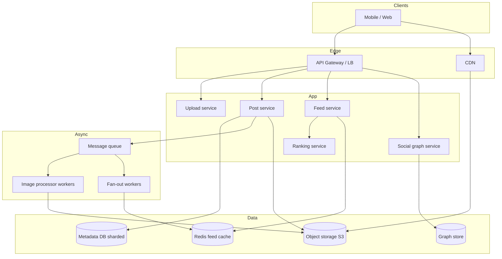
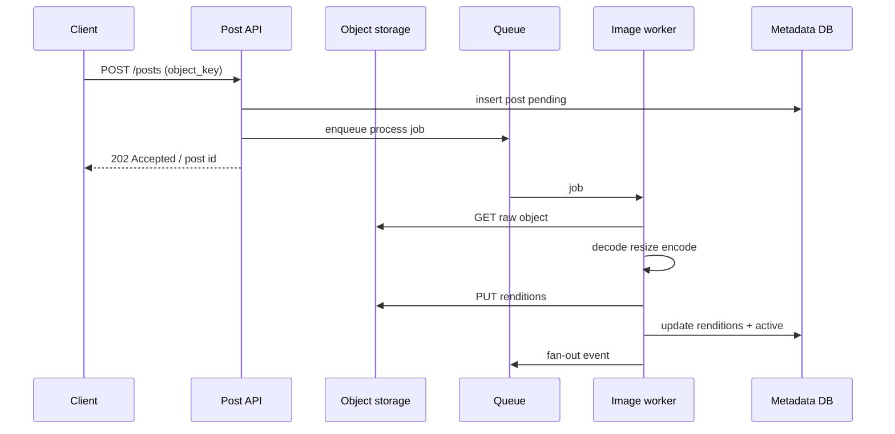
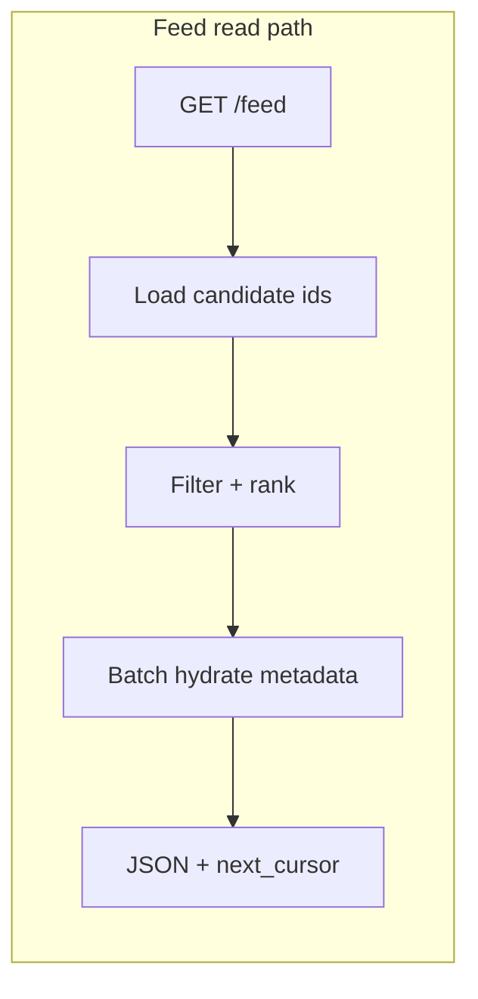

# Photo Sharing (Instagram)
{: .no_toc }

<details open markdown="block">
  <summary>Table of contents</summary>
  {: .text-delta }
1. TOC
{:toc}
</details>

---

## What We're Building

A **photo-sharing platform** lets users upload images (and often short video), follow other accounts, browse a personalized **home feed**, publish **ephemeral stories**, and discover content via **search** and **explore**. Interviewers use “Design Instagram” to test understanding of **object storage**, **CDNs**, **async media pipelines**, **social graphs**, **feed fan-out**, the **celebrity problem**, and **sharding** by `user_id`.

**Examples in the wild:** Instagram, Pinterest (image-centric discovery), Flickr (historical reference), and many vertical social apps that reuse the same building blocks.

### Problems This Design Must Solve

| Problem | Why it matters |
|---------|----------------|
| **Durable media at scale** | Billions of objects; block/object storage, not a single database |
| **Fast global delivery** | Images must load quickly; CDN caching and correct cache headers |
| **Many resolutions** | Thumbnails, feed sizes, full-screen; CPU-heavy transcoding off the hot path |
| **Feed under follow graph** | Each user follows hundreds; aggregate and rank efficiently |
| **Hot accounts** | Celebrities have millions of followers; naive fan-out explodes cost |
| **Consistent social graph** | Follow/unfollow must be correct; feeds can be eventually consistent |

{: .note }
> In interviews, **scope explicitly**: stories vs posts only, video depth, DMs, comments, ads, and moderation are often out of scope unless the interviewer asks.

---

## Step 1: Requirements

### Functional Requirements

| Requirement | Priority | Notes |
|-------------|----------|--------|
| User registration / auth | Must have | OAuth, session tokens; often delegated to identity service |
| Upload photos (single or carousel) | Must have | Client → object storage via pre-signed URL; server stores metadata |
| Image processing (resize, thumbnails) | Must have | Async workers; multiple renditions per upload |
| Follow / unfollow users | Must have | Directed graph: follower → followee |
| Home feed (posts from followed users) | Must have | Paginated, ranked or chronological |
| Stories (24h ephemeral) | Nice to have | Separate TTL storage and fan-out |
| Like, comment, view counts | Must have | Engagement signals; often separate counters |
| Profile grid (user’s posts) | Must have | Query by `author_user_id` |
| Search / Explore | Nice to have | Hashtags, user search, trending |
| Report / block | Nice to have | Safety and compliance |

### Non-Functional Requirements

| Requirement | Target | Rationale |
|-------------|--------|-----------|
| **Upload success** | Durable before “posted” | Acknowledge only after object exists and metadata committed |
| **Feed read latency (p99)** | &lt; 400–800 ms API | Mobile UX; heavy bytes come from CDN, not API |
| **Image time-to-visible** | Seconds to tens of seconds | Processing is async; UI shows “processing” if needed |
| **Availability** | 99.9%+ for reads | Degrade to cached feed if ranking lags |
| **Durability** | No silent media loss | Replicated object storage; checksums on upload |
| **Scale** | Horizontal | Shard metadata and feed caches by `user_id` |

### API Design

| Method | Path | Purpose |
|--------|------|---------|
| `POST` | `/v1/media/upload-url` | Return pre-signed URL + `object_key` for `PUT` to S3-compatible storage |
| `PUT` | *(client → object storage)* | Upload bytes directly; not application servers |
| `POST` | `/v1/posts` | Create post with `object_key`(s), caption, visibility |
| `GET` | `/v1/feed` | Home feed: `?limit=&cursor=` |
| `POST` | `/v1/follow` | Body: `{ "target_user_id": "..." }` |
| `DELETE` | `/v1/follow/{userId}` | Unfollow |
| `GET` | `/v1/users/{id}/posts` | Profile timeline |
| `POST` | `/v1/stories` | Publish story (media ref + expiry) |
| `GET` | `/v1/stories/feed` | Stories from followed users (often batched) |
| `GET` | `/v1/search/users?q=` | User search (prefix / index) |
| `GET` | `/v1/explore/tags/{tag}` | Hashtag feed (optional) |

**Example: pre-signed upload flow response**

```json
{
  "upload_url": "https://media.example.com/bucket/u/42/abc?X-Amz-Algorithm=...",
  "object_key": "u/42/raw/2026/04/03/abc.jpg",
  "headers": {
    "Content-Type": "image/jpeg"
  },
  "expires_at_ms": 1712160000000
}
```

**Example: create post after upload**

```json
{
  "caption": "Sunset",
  "media": [
    {
      "object_key": "u/42/raw/2026/04/03/abc.jpg",
      "type": "image/jpeg"
    }
  ]
}
```

{: .tip }
> Keep **API responses small**: return CDN URLs and dimensions, not image bytes. Use **cursor-based pagination** for feeds.

---

## Step 2: Back-of-the-Envelope Estimation

### Assumptions (tunable in interview)

```
DAU:           500 million
Avg follows:  200 per user (long tail; many users follow fewer)
Posts per DAU per day: 3
Avg photo size (compressed original): 2 MB
Processed renditions per photo: 5 (thumb, feed, full, etc.) — avg stored 1.5 MB extra per rendition set (illustrative)
Feed loads per DAU per day: 8
Posts per feed page: 20
```

### Write Path (posts + uploads)

```
Posts per day = 500M × 3 = 1.5B posts/day
Average post creation QPS = 1.5e9 / 86,400 ≈ 17,400/s
Peak (e.g., 3×) ≈ 52,000 posts/s

Each post may trigger: DB insert, fan-out jobs, search index updates.
```

### Read Path (feed)

```
Feed requests = 500M × 8 = 4B/day
Average feed QPS = 4e9 / 86,400 ≈ 46,300/s
Peak ≈ 140,000/s (rule of thumb 3×)
```

### Storage (metadata vs object)

```
Assume post row (ids, caption, keys, timestamps) ≈ 400 bytes
1.5B × 400 B ≈ 600 GB/day new metadata (before replication and indexes)

Object storage (dominant):
  1.5B photos/day × 2 MB ≈ 3 PB/day if every post is one 2 MB image — 
  in practice mix of smaller images and video; use fractions:
  If effective 800 KB average stored per post after compression: 1.5B × 800 KB ≈ 1.2 PB/day
```

### CDN egress (order of magnitude)

```
If each feed load fetches 20 images at ~150 KB average delivered (WebP, feed size):
  4B loads × 20 × 150 KB ≈ 12 EB-day product — divide by day: 
  4B × 20 × 150 KB / 86400 s ≈ 140 GB/s average from CDN (illustrative; highly sensitive to assumptions)

Narrow with: “We’d validate with CDN logs and image analytics.”
```

### Fan-Out Volume (why celebrities matter)

```
Average followers per poster (not per user): say 500 (skewed by influencers)
Fan-out writes per post = 1.5B posts × 500 = 750B fan-out deliveries/day (if push all to all inboxes)
  → ~8.7M/s average — infeasible at naive scale; motivates hybrid fan-out (see Deep Dive).
```

{: .warning }
> **Skew** dominates: one celebrity post must not perform O(followers) synchronous work. Call out **Pareto distribution** explicitly.

---

## Step 3: High-Level Design

At a high level: **clients** talk to **API gateways**; **stateless app services** handle auth, post creation, and feed reads; **object storage (e.g., S3)** holds blobs; **CDN** serves public URLs; **async workers** resize images and enqueue **fan-out** tasks; **caches / feed stores** materialize per-user feeds; **databases** shard by `user_id` for profiles and graph edges.



**Responsibility split**

| Component | Role |
|-----------|------|
| **Object storage** | Source of truth for bytes; versioning/lifecycle policies |
| **CDN** | Edge caching of immutable rendition URLs; signed URLs for private media if needed |
| **Post service** | Validates ownership of `object_key`, writes post row, enqueues processing |
| **Image processor** | Generates thumbnails, strips EXIF if required, writes new keys |
| **Fan-out workers** | For normal users: push post ids into followers’ feed lists; for celebs: skip or partial |
| **Feed service** | Merges stored feed + ranking; handles pagination cursors |
| **Graph store** | Follow edges; may be adjacency lists in DB or dedicated service |

---

## Step 4: Deep Dive

### 4.1 Photo Upload and Storage

**Direct-to-storage uploads** avoid streaming bytes through application servers.

1. Client requests `POST /v1/media/upload-url`.
2. Service checks quota, auth, content policy; returns **pre-signed URL** and `object_key` scoped to that user.
3. Client `PUT`s bytes to **S3** (or compatible).
4. Client calls `POST /v1/posts` with `object_key`; post service verifies the key prefix matches the user and records metadata.

| Concern | Approach |
|---------|----------|
| **Abuse / oversized files** | Max size in policy; scan magic bytes async; virus scan optional pipeline |
| **Duplicate uploads** | Content-hash dedup optional; same user may re-upload intentionally |
| **Privacy** | Private accounts: CDN with short-lived signed URLs or origin pull auth |

{: .note }
> Store **immutable** rendition URLs with versioned paths so CDN caching stays simple (`Cache-Control: max-age=31536000, immutable`).

### 4.2 Image Processing Pipeline

After post creation, enqueue a job: **raw object key**, **post id**, **owner id**. Workers:

1. Fetch from object storage (internal endpoint).
2. Produce renditions: e.g. 150px thumb, 640px feed, 1080px display, WebP/AVIF variants.
3. Write outputs to deterministic keys: `u/{id}/r/{post_id}/thumb.webp`.
4. Update post metadata row with `ready` status and rendition map.
5. Emit event for fan-out / notifications.

Failure handling: retry with backoff; dead-letter queue for poison blobs; post remains “processing” in UI.



### 4.3 News Feed Generation

**Feed item** is typically `{ post_id, author_id, created_at, score? }`. Reads:

1. Resolve viewer’s `user_id`.
2. Fetch candidate post ids from **materialized feed** (Redis, or wide-column store) **or** merge on read from recent posts of followees (hybrid).
3. Apply **filters** (blocked users, deleted posts).
4. **Rank** (chronological baseline or ML scoring).
5. Hydrate details (caption, CDN URLs, like counts) from DB/cache in batch.



### 4.4 Fan-out Strategy

Two classic strategies:

| Strategy | Write cost | Read cost | Best for |
|----------|------------|-----------|----------|
| **Fan-out on write (push)** | O(followers) per post | O(1) read | Users with modest follower counts |
| **Fan-out on read (pull)** | O(1) write | O(following) merge | Very high follower counts (celebrities) |
| **Hybrid** | Push for normal; pull/merge for celebs | Bounded | Production social networks |

**Hybrid approach (common):**

- If `follower_count &lt; threshold` (e.g., 10k): **push** post id into each follower’s feed shard (async queue).
- If **celebrity**: **do not** push to all inboxes; store post in celebrity’s **outbox** only; at read time, **merge** global hot posts with the user’s inbox.

**Celebrity problem (summary):** One post cannot synchronously insert into 50M inboxes. Mitigations: only push to “active” followers, cap push fan-out, or pull hot accounts.

### 4.5 Stories Feature

Stories differ from feed posts:

| Aspect | Posts | Stories |
|--------|-------|---------|
| **Lifetime** | Permanent until deleted | TTL (e.g., 24 hours) |
| **Storage** | Long-lived keys | Same object store; metadata TTL |
| **Fan-out** | Similar pipeline | Often precomputed ring per user for “close friends” |
| **Read path** | Home feed | Horizontal strip + full-screen viewer |

Implement with **expiry timestamps** in metadata and **background GC** jobs to delete objects after TTL. CDN caching TTL should align with story lifetime.

### 4.6 Follow/Unfollow and Social Graph

**Graph operations:**

- **Follow:** Insert edge `(follower_id, followee_id)` with timestamp; optionally enqueue backfill of recent posts into follower’s feed (product choice).
- **Unfollow:** Delete edge; remove followee’s recent post ids from follower’s materialized feed (async reconciliation) or leave stale until compaction.

**Storage patterns:**

| Pattern | Pros | Cons |
|---------|------|------|
| **Adjacency lists in SQL** | Simple; transactional | Hot shards for mega-celebrities |
| **Wide-column (Cassandra)** | Good for time-ordered lists | Operational complexity |
| **Graph DB** | Flexible queries | May be overkill for “who do I follow” |

For interview clarity: **shard by `user_id`** for user-centric tables (posts, preferences); **follow edges** often sharded by `follower_id` so “all people I follow” is single-shard.

### 4.7 Search and Explore

- **User search:** Prefix index (Trie) or Elasticsearch with `completion suggester`; sharded inverted index on usernames.
- **Hashtag explore:** Inverted index `tag → [post_ids]` with recency decay; separate from home feed.
- **Explore tab:** Often **ML-ranked** candidate pool; out of scope unless interviewer insists—mention **candidate generation + ranking** two-stage pattern.

---

## Step 5: Scaling & Production

### Sharding by `user_id`

| Data | Shard key | Notes |
|------|-----------|--------|
| User profile | `user_id` | Even distribution with random IDs |
| Posts by author | `author_user_id` | Profile timeline is single-shard |
| Feed inbox | `viewer_user_id` | Fan-out writes target follower shards |
| Likes | `post_id` or `user_id` | Hot posts may need separate caching |

**Cross-shard queries** (e.g., global search) go through search indices, not naive scatter-gather across all user DBs.

### Reliability

- **Idempotent** post creation and fan-out consumers (`post_id` dedup).
- **Queue partitioning** by `follower_id` hash for parallel fan-out workers.
- **Circuit breakers** on object storage and CDN origins.
- **Rate limits** per user and per IP on upload-url issuance.

### Observability

- Metrics: upload success rate, processing lag p95, fan-out backlog depth, CDN cache hit ratio, feed p99 latency.
- Tracing: trace id from API through queue to workers.

### Security & compliance

- Strip location EXIF by default for consumer apps.
- Content moderation: async classifiers, user reports, legal hold on object keys.

---

## Interview Tips

### Interview Checklist

- [ ] Clarify scope: video, DMs, ads, shopping, live.
- [ ] Separate **metadata path** vs **bytes path** (S3 + CDN).
- [ ] State **NFRs**: latency targets, durability, eventual consistency for feeds.
- [ ] Draw **upload**: pre-signed URL → async processing → fan-out event.
- [ ] Explain **hybrid fan-out** and **celebrity** mitigation.
- [ ] Mention **feed ranking** as a stage (even if not detailed).
- [ ] Discuss **sharding** by `user_id` and hot-spot mitigation.
- [ ] Cover **pagination** (cursors), **idempotency**, and **failure modes** (retry, DLQ).

### Sample Interview Dialogue

**Interviewer:** “Design Instagram.”

**Candidate:** “I’ll assume we’re focusing on photo posts, follow graph, home feed, and basic stories—no DMs or ads unless you want those. I’ll separate media storage from metadata.”

**Interviewer:** “Sounds good. How does upload work?”

**Candidate:** “Clients should upload directly to object storage using a pre-signed URL so our API servers aren’t in the data path. After the blob exists, the client creates a post referencing the object key. We process images asynchronously: thumbnails, multiple resolutions, then we fan out to followers’ feeds.”

**Interviewer:** “What about users with 50 million followers?”

**Candidate:** “We can’t push 50 million writes synchronously. I’d use a hybrid: push fan-out only up to a threshold, and for celebrities merge from their outbox at read time, or rely on pull-based merging for the hottest accounts. We might also cap how many inboxes we update per second and rely on eventual consistency.”

**Interviewer:** “How is the feed stored?”

**Candidate:** “Materialized per-user lists of post ids in Redis or a wide-column store for fast pagination, combined with ranking. Reads batch-hydrate metadata and use the CDN for image URLs. We shard by viewer user id to scale feed storage.”

---

## Summary

| Topic | Takeaway |
|-------|----------|
| **Object storage (S3)** | Pre-signed uploads; immutable rendition keys; lifecycle policies |
| **CDN** | Cache images at edge; small JSON from API; long cache for versioned URLs |
| **Thumbnails / processing** | Async workers; queue between upload and fan-out |
| **Fan-out** | Push for typical users; pull/merge or hybrid for celebrities |
| **Celebrity problem** | Bounded writes; outbox + read merge; thresholds |
| **Feed ranking** | Filter → rank → hydrate; ML optional second phase |
| **Sharding** | `user_id` for user-owned data; design for hot spots and cross-shard search via index |

{: .tip }
> End with **trade-offs**: consistency vs latency, storage cost vs compute, push vs pull fan-out—interviewers reward explicit tension, not a single “perfect” architecture.

---

### Appendix: Reference Code Snippets

#### Upload handler (Java, Spring-style)

```java
@PostMapping("/v1/media/upload-url")
public ResponseEntity<UploadUrlResponse> issueUploadUrl(
    @AuthenticationPrincipal UserPrincipal user,
    @Valid @RequestBody UploadUrlRequest req) {
  String objectKey = keyFactory.newObjectKey(user.getId(), req.getContentType());
  PresignedPutRequest put = s3Presigner.presignPut(
      PutObjectRequest.builder()
          .bucket(mediaBucket)
          .key(objectKey)
          .contentType(req.getContentType())
          .build(),
      Duration.ofMinutes(15));
  return ResponseEntity.ok(new UploadUrlResponse(
      put.url().toString(), objectKey, put.expiration().toEpochMilli()));
}
```

#### Feed service (Python, FastAPI sketch)

```python
@app.get("/v1/feed")
async def get_feed(
    user: User = Depends(get_current_user),
    limit: int = 20,
    cursor: str | None = None,
):
    raw = await feed_store.fetch_ids(user.id, limit + 1, cursor)
    items, next_cur = slice_page(raw, limit)
    posts = await post_repo.batch_get([i.post_id for i in items])
    ranked = ranker.score(items, viewer=user)
    return {"items": hydrate(ranked, posts), "next_cursor": next_cur}
```

#### Fan-out worker (Go)

```go
type FanoutJob struct {
	PostID       int64
	AuthorID     int64
	FollowerIDs  []int64 // batched chunk
}

func (w *Worker) Handle(ctx context.Context, job FanoutJob) error {
	meta, err := w.posts.Get(ctx, job.PostID)
	if err != nil {
		return err
	}
	if meta.FollowerCountAtPost > w.pushThreshold {
		return nil // celebrity: stored only in author outbox
	}
	for _, fid := range job.FollowerIDs {
		if err := w.feedCache.PrependPost(ctx, fid, job.PostID, meta.CreatedAt); err != nil {
			return err
		}
	}
	return nil
}
```

---

*Document version: structured for System Design Examples (Just the Docs). Tune all numbers to your interview scenario.*
