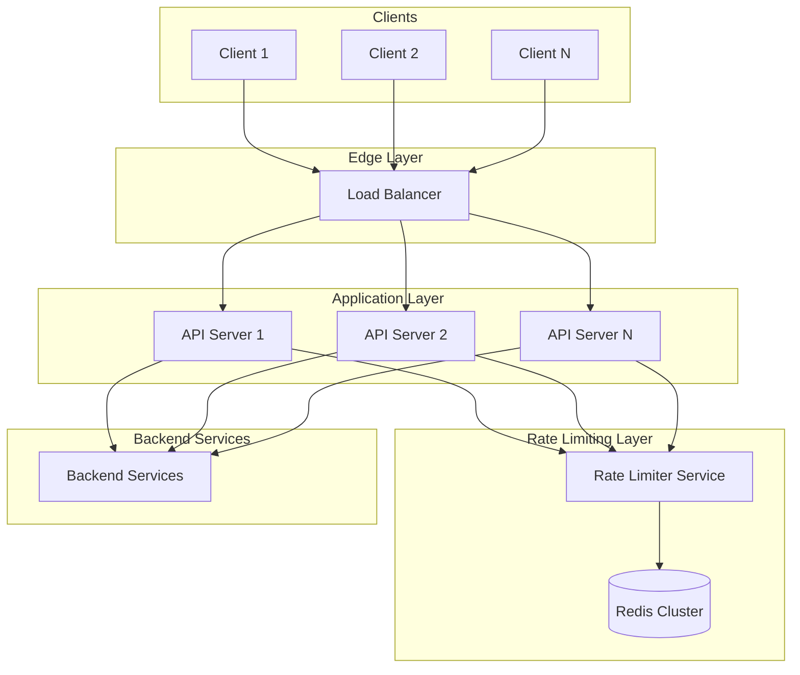
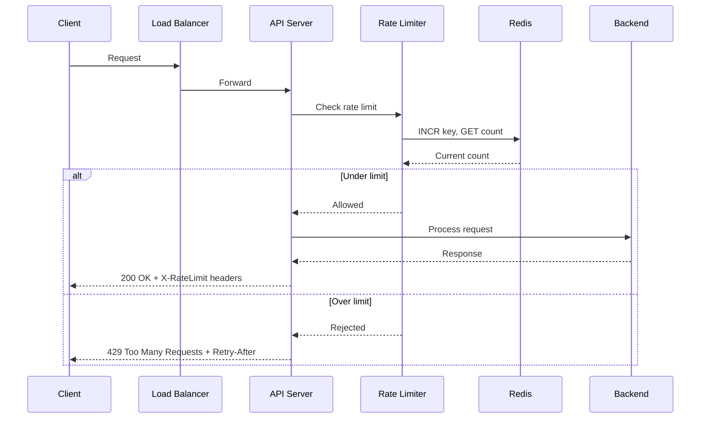
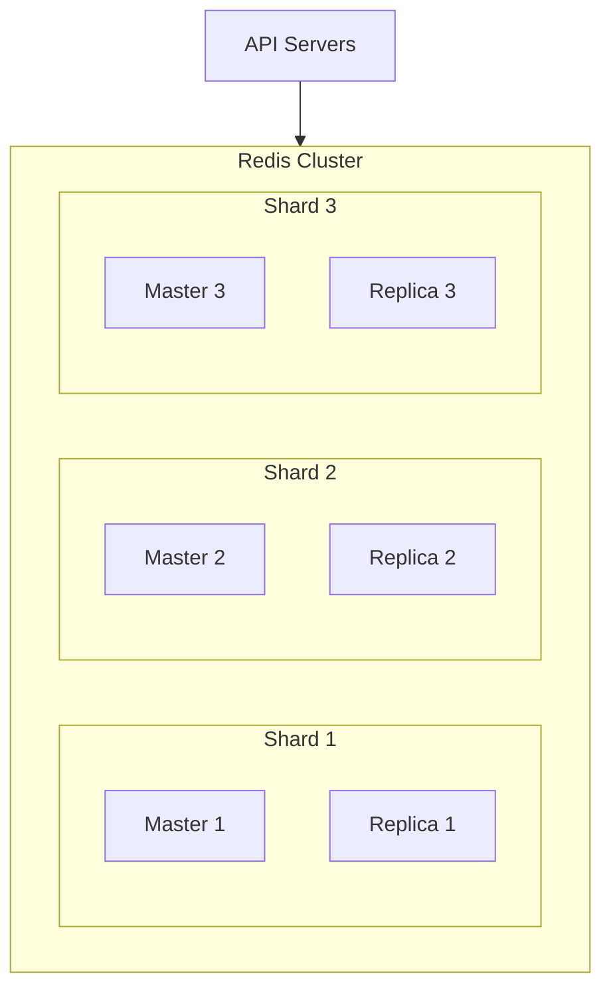

# Design a Rate Limiter
{: .no_toc }

<details open markdown="block">
  <summary>Table of Contents</summary>
  {: .text-delta }
1. TOC
{:toc}
</details>

---

## What We're Building

A rate limiter controls how many requests a client can make to an API within a given time window. When a client exceeds the limit, the rate limiter rejects additional requests—typically returning HTTP 429 (Too Many Requests).

**Example:** "Each user can make 100 API calls per minute. After 100 calls, further requests are rejected until the next minute."

### Why Rate Limiting Matters

| Problem | How Rate Limiting Helps |
|---------|------------------------|
| **DDoS attacks** | Prevents malicious actors from overwhelming your servers |
| **Runaway clients** | Stops buggy clients from accidentally hammering your API |
| **Resource fairness** | Ensures no single user hogs all capacity |
| **Cost control** | Prevents expensive operations from spiraling |
| **Service stability** | Protects downstream services from cascading failures |

### Real-World Examples

| Service | Rate Limit | Purpose |
|---------|------------|---------|
| **Twitter API** | 450 requests/15 min | Prevent abuse, protect infrastructure |
| **GitHub API** | 5,000 requests/hour (authenticated) | Fair usage across millions of developers |
| **Stripe API** | 100 requests/sec | Protect payment processing systems |
| **OpenAI API** | Tokens per minute (TPM) | Manage GPU capacity, billing |

### Types of Rate Limiting

| Type | Description | Example |
|------|-------------|---------|
| **User-based** | Limit per user/API key | 1000 requests/hour per user |
| **IP-based** | Limit per IP address | 100 requests/minute per IP |
| **Endpoint-based** | Different limits per endpoint | GET: 1000/min, POST: 100/min |
| **Global** | Total requests to the system | 1M requests/minute total |
| **Concurrent** | Active requests at once | Max 10 concurrent requests |

---

## Step 1: Requirements Clarification

### Questions to Ask

| Question | Why It Matters |
|----------|----------------|
| What are we limiting? | Users, IPs, API keys, endpoints? |
| What are the rate limits? | 100/min? 1000/hour? Multiple tiers? |
| Hard limit or soft limit? | Reject immediately vs. queue/throttle? |
| Distributed or single-server? | Major architectural difference |
| How do we identify clients? | API key, JWT, IP address? |
| What happens when rate limited? | 429 response? Retry-After header? |

### Functional Requirements

| Requirement | Priority | Description |
|-------------|----------|-------------|
| Accurately limit request rate | Must have | Core functionality |
| Low latency | Must have | < 1ms overhead |
| Distributed support | Must have | Work across multiple servers |
| Multiple rate limit rules | Nice to have | Different limits per endpoint/tier |
| Graceful handling | Nice to have | Retry-After headers, queuing |

### Non-Functional Requirements

| Requirement | Target | Rationale |
|-------------|--------|-----------|
| **Latency** | < 1ms | Rate limiting shouldn't slow down requests |
| **Accuracy** | Near-perfect | Small variance acceptable (1-2%) |
| **Availability** | 99.99% | Failing open is usually preferred |
| **Scalability** | Millions of users | Must handle high cardinality |

---

## Step 2: Rate Limiting Algorithms

There are several algorithms for rate limiting, each with different characteristics.

### Algorithm 1: Token Bucket

The most popular algorithm. Imagine a bucket that holds tokens:
- Tokens are added at a constant rate (e.g., 10 tokens/second)
- Each request consumes one token
- If the bucket is empty, the request is rejected
- Bucket has a maximum capacity (allows bursts)

```
┌─────────────────────────────┐
│         Token Bucket        │
│                             │
│  ┌─────┐                    │
│  │ + │ ← Tokens added at    │
│  └──┬──┘   constant rate    │
│     ▼                       │
│  ┌─────────────────────┐    │
│  │ 🪙 🪙 🪙 🪙 🪙       │    │  ← Bucket (max capacity)
│  └─────────────────────┘    │
│     │                       │
│     ▼                       │
│  Request takes 1 token      │
│                             │
└─────────────────────────────┘
```

**Implementation:**

```python
import time

class TokenBucket:
    def __init__(self, capacity: int, refill_rate: float):
        """
        Args:
            capacity: Maximum tokens the bucket can hold
            refill_rate: Tokens added per second
        """
        self.capacity = capacity
        self.refill_rate = refill_rate
        self.tokens = capacity
        self.last_refill = time.time()
    
    def _refill(self):
        """Add tokens based on time elapsed."""
        now = time.time()
        elapsed = now - self.last_refill
        tokens_to_add = elapsed * self.refill_rate
        
        self.tokens = min(self.capacity, self.tokens + tokens_to_add)
        self.last_refill = now
    
    def allow_request(self, tokens: int = 1) -> bool:
        """Check if request is allowed and consume tokens."""
        self._refill()
        
        if self.tokens >= tokens:
            self.tokens -= tokens
            return True
        return False
    
    def get_wait_time(self, tokens: int = 1) -> float:
        """How long to wait before tokens are available."""
        self._refill()
        
        if self.tokens >= tokens:
            return 0
        
        tokens_needed = tokens - self.tokens
        return tokens_needed / self.refill_rate
```

**Characteristics:**

| Aspect | Token Bucket |
|--------|-------------|
| **Burst handling** | ✅ Allows bursts up to bucket capacity |
| **Smooth rate** | ✅ Averages to refill rate over time |
| **Memory** | O(1) per client |
| **Complexity** | Simple |

**Use case:** When you want to allow bursts but limit average rate.

### Algorithm 2: Leaky Bucket

Requests enter a queue (bucket) and are processed at a constant rate. If the bucket is full, new requests are rejected.

```
┌─────────────────────────────┐
│         Leaky Bucket        │
│                             │
│  Requests → ┌─────────────┐ │
│             │ Queue       │ │  ← Bucket (limited size)
│             │ ░░░░░░░░░   │ │
│             └──────┬──────┘ │
│                    │        │
│                    ▼        │
│              ┌─────────┐    │
│              │ Process │ ← Fixed rate output
│              └─────────┘    │
└─────────────────────────────┘
```

**Implementation:**

```python
import time
from collections import deque
import threading

class LeakyBucket:
    def __init__(self, capacity: int, leak_rate: float):
        """
        Args:
            capacity: Maximum requests in queue
            leak_rate: Requests processed per second
        """
        self.capacity = capacity
        self.leak_rate = leak_rate
        self.queue = deque()
        self.last_leak = time.time()
        self.lock = threading.Lock()
    
    def _leak(self):
        """Process requests based on time elapsed."""
        now = time.time()
        elapsed = now - self.last_leak
        requests_to_leak = int(elapsed * self.leak_rate)
        
        for _ in range(min(requests_to_leak, len(self.queue))):
            self.queue.popleft()
        
        if requests_to_leak > 0:
            self.last_leak = now
    
    def allow_request(self) -> bool:
        """Add request to queue if there's space."""
        with self.lock:
            self._leak()
            
            if len(self.queue) < self.capacity:
                self.queue.append(time.time())
                return True
            return False
```

**Characteristics:**

| Aspect | Leaky Bucket |
|--------|-------------|
| **Burst handling** | ❌ No bursts—constant output rate |
| **Smooth rate** | ✅ Very smooth, predictable |
| **Memory** | O(n) where n = queue size |
| **Complexity** | Moderate |

**Use case:** When you need a perfectly smooth, constant rate (e.g., video streaming).

### Algorithm 3: Fixed Window Counter

Divide time into fixed windows (e.g., 1-minute intervals). Count requests in each window.

```
┌─────────────────────────────────────────────────────────────┐
│                    Fixed Window Counter                      │
│                                                              │
│  Window 1        Window 2        Window 3        Window 4   │
│  [00:00-01:00]   [01:00-02:00]   [02:00-03:00]  [03:00-04:00]│
│  ┌──────────┐    ┌──────────┐    ┌──────────┐   ┌──────────┐│
│  │ 95/100   │    │ 100/100  │    │ 45/100   │   │ 0/100    ││
│  │ ✓        │    │ FULL     │    │ ✓        │   │ ✓        ││
│  └──────────┘    └──────────┘    └──────────┘   └──────────┘│
│                                                              │
└─────────────────────────────────────────────────────────────┘
```

**Implementation:**

```python
import time

class FixedWindowCounter:
    def __init__(self, limit: int, window_size: int):
        """
        Args:
            limit: Max requests per window
            window_size: Window size in seconds
        """
        self.limit = limit
        self.window_size = window_size
        self.counts = {}  # window_key -> count
    
    def _get_window_key(self, timestamp: float) -> int:
        """Get the window this timestamp belongs to."""
        return int(timestamp // self.window_size)
    
    def allow_request(self, client_id: str) -> bool:
        """Check if request is allowed."""
        now = time.time()
        window_key = self._get_window_key(now)
        key = f"{client_id}:{window_key}"
        
        current_count = self.counts.get(key, 0)
        
        if current_count < self.limit:
            self.counts[key] = current_count + 1
            return True
        return False
    
    def cleanup_old_windows(self, client_id: str):
        """Remove old window data to prevent memory bloat."""
        now = time.time()
        current_window = self._get_window_key(now)
        
        keys_to_delete = [
            k for k in self.counts 
            if k.startswith(f"{client_id}:") and 
               int(k.split(":")[1]) < current_window - 1
        ]
        for k in keys_to_delete:
            del self.counts[k]
```

**Problem: Boundary Burst**

A client could make 100 requests at 00:59 and 100 more at 01:01—200 requests in 2 seconds!

```
Window 1 [00:00-01:00]    Window 2 [01:00-02:00]
         │ 100 requests    │ 100 requests
         ▼                 ▼
    ─────┼────────────────┼─────
      00:59            01:01
         └── 2 seconds ──┘
         └── 200 requests! ──┘
```

**Use case:** Simple scenarios where occasional bursts at boundaries are acceptable.

### Algorithm 4: Sliding Window Log

Track the timestamp of each request. Count requests within the sliding window.

**Implementation:**

```python
import time
from collections import deque
import threading

class SlidingWindowLog:
    def __init__(self, limit: int, window_size: int):
        """
        Args:
            limit: Max requests per window
            window_size: Window size in seconds
        """
        self.limit = limit
        self.window_size = window_size
        self.logs = {}  # client_id -> deque of timestamps
        self.lock = threading.Lock()
    
    def allow_request(self, client_id: str) -> bool:
        """Check if request is allowed."""
        now = time.time()
        window_start = now - self.window_size
        
        with self.lock:
            if client_id not in self.logs:
                self.logs[client_id] = deque()
            
            log = self.logs[client_id]
            
            # Remove timestamps outside the window
            while log and log[0] <= window_start:
                log.popleft()
            
            if len(log) < self.limit:
                log.append(now)
                return True
            return False
```

**Characteristics:**

| Aspect | Sliding Window Log |
|--------|-------------------|
| **Accuracy** | ✅ Perfect—no boundary issues |
| **Memory** | ❌ O(limit) per client—stores every timestamp |
| **Complexity** | Higher |

**Use case:** When you need perfect accuracy and can afford the memory.

### Algorithm 5: Sliding Window Counter (Recommended)

Hybrid of fixed window and sliding window. Uses weighted average of current and previous window.

```
┌─────────────────────────────────────────────────────────────┐
│                  Sliding Window Counter                      │
│                                                              │
│  Previous Window [00:00-01:00]   Current Window [01:00-02:00]│
│  ┌──────────────────────────┐    ┌──────────────────────────┐│
│  │         70 requests      │    │    30 requests          ││
│  └──────────────────────────┘    └──────────────────────────┘│
│                              │                               │
│                     Current time: 01:15                      │
│                              │                               │
│  Sliding window: 01:00-01:15 is 25% into current window     │
│                                                              │
│  Weight of previous: 75% (45 minutes overlap)               │
│  Weight of current: 100%                                     │
│                                                              │
│  Weighted count = 70 × 0.75 + 30 × 1.0 = 52.5 + 30 = 82.5   │
│                                                              │
└─────────────────────────────────────────────────────────────┘
```

**Implementation:**

```python
import time

class SlidingWindowCounter:
    def __init__(self, limit: int, window_size: int):
        """
        Args:
            limit: Max requests per window
            window_size: Window size in seconds
        """
        self.limit = limit
        self.window_size = window_size
        self.windows = {}  # client_id -> {window_key: count}
    
    def allow_request(self, client_id: str) -> bool:
        """Check if request is allowed using weighted average."""
        now = time.time()
        
        current_window = int(now // self.window_size)
        previous_window = current_window - 1
        
        # Position within current window (0.0 to 1.0)
        window_position = (now % self.window_size) / self.window_size
        
        if client_id not in self.windows:
            self.windows[client_id] = {}
        
        client_windows = self.windows[client_id]
        
        # Get counts for current and previous windows
        current_count = client_windows.get(current_window, 0)
        previous_count = client_windows.get(previous_window, 0)
        
        # Calculate weighted average
        # Previous window contributes (1 - window_position) weight
        # because that's how much of it overlaps with our sliding window
        weighted_count = (
            previous_count * (1 - window_position) + 
            current_count
        )
        
        if weighted_count < self.limit:
            client_windows[current_window] = current_count + 1
            # Cleanup old windows
            self._cleanup(client_id, current_window - 2)
            return True
        return False
    
    def _cleanup(self, client_id: str, before_window: int):
        """Remove windows older than needed."""
        if client_id in self.windows:
            keys_to_delete = [
                k for k in self.windows[client_id] 
                if k < before_window
            ]
            for k in keys_to_delete:
                del self.windows[client_id][k]
```

**Characteristics:**

| Aspect | Sliding Window Counter |
|--------|----------------------|
| **Accuracy** | ✅ Very good (slight approximation) |
| **Memory** | ✅ O(1) per client—just 2 counters |
| **Boundary handling** | ✅ Smooth, no burst at boundaries |
| **Complexity** | Simple |

**This is the recommended algorithm** for most use cases.

### Algorithm Comparison

| Algorithm | Memory | Accuracy | Burst Handling | Complexity |
|-----------|--------|----------|----------------|------------|
| Token Bucket | O(1) | Good | Allows controlled bursts | Simple |
| Leaky Bucket | O(n) | Perfect | No bursts | Moderate |
| Fixed Window | O(1) | Poor (boundaries) | Boundary issues | Simple |
| Sliding Log | O(n) | Perfect | Smooth | Higher |
| Sliding Window Counter | O(1) | Very Good | Smooth | Simple |

**Recommendations:**
- **Token Bucket:** When you want to allow bursts (API rate limiting)
- **Sliding Window Counter:** When you want smooth limiting (general purpose)
- **Leaky Bucket:** When you need constant output rate (streaming)

---

## Step 3: High-Level Architecture

For a distributed system, we need a centralized store for rate limit state.

### Architecture Overview



### Where to Place the Rate Limiter?

| Location | Pros | Cons |
|----------|------|------|
| **Client-side** | Reduces server load | Can be bypassed, unreliable |
| **Load balancer** | Centralized, early rejection | Limited customization |
| **API Gateway** | Flexible, centralized | Single point of failure |
| **Application code** | Full control, context-aware | Code duplication |
| **Dedicated service** | Clean separation | Additional latency |

**Recommendation:** API Gateway or dedicated middleware is usually best.

### Request Flow



---

## Step 4: Distributed Rate Limiting with Redis

For a distributed system, we need atomic operations. Redis provides these.

### Redis Implementation: Sliding Window Counter

```python
import redis
import time

class DistributedRateLimiter:
    def __init__(self, redis_client: redis.Redis, limit: int, window_size: int):
        """
        Args:
            redis_client: Redis connection
            limit: Max requests per window
            window_size: Window size in seconds
        """
        self.redis = redis_client
        self.limit = limit
        self.window_size = window_size
    
    def is_allowed(self, client_id: str) -> tuple[bool, dict]:
        """
        Check if request is allowed.
        Returns (is_allowed, rate_limit_info)
        """
        now = time.time()
        current_window = int(now // self.window_size)
        previous_window = current_window - 1
        window_position = (now % self.window_size) / self.window_size
        
        current_key = f"ratelimit:{client_id}:{current_window}"
        previous_key = f"ratelimit:{client_id}:{previous_window}"
        
        # Use pipeline for atomic operations
        pipe = self.redis.pipeline()
        pipe.get(previous_key)
        pipe.incr(current_key)
        pipe.expire(current_key, self.window_size * 2)
        results = pipe.execute()
        
        previous_count = int(results[0] or 0)
        current_count = int(results[1])
        
        # Calculate weighted count (excluding this request)
        weighted_count = (
            previous_count * (1 - window_position) + 
            (current_count - 1)  # Exclude current request
        )
        
        allowed = weighted_count < self.limit
        
        # If not allowed, decrement the counter we just incremented
        if not allowed:
            self.redis.decr(current_key)
            current_count -= 1
        
        remaining = max(0, self.limit - int(weighted_count) - 1)
        reset_time = (current_window + 1) * self.window_size
        
        rate_limit_info = {
            "limit": self.limit,
            "remaining": remaining,
            "reset": int(reset_time),
            "retry_after": None if allowed else int(reset_time - now)
        }
        
        return allowed, rate_limit_info
```

### Redis Implementation: Token Bucket with Lua Script

For perfect atomicity, use a Lua script:

```python
import redis
import time

TOKEN_BUCKET_SCRIPT = """
local key = KEYS[1]
local capacity = tonumber(ARGV[1])
local refill_rate = tonumber(ARGV[2])
local now = tonumber(ARGV[3])
local requested = tonumber(ARGV[4])

-- Get current bucket state
local bucket = redis.call('HMGET', key, 'tokens', 'last_refill')
local tokens = tonumber(bucket[1]) or capacity
local last_refill = tonumber(bucket[2]) or now

-- Calculate tokens to add based on time elapsed
local elapsed = now - last_refill
local tokens_to_add = elapsed * refill_rate
tokens = math.min(capacity, tokens + tokens_to_add)

-- Check if request can be allowed
local allowed = 0
if tokens >= requested then
    tokens = tokens - requested
    allowed = 1
end

-- Save state
redis.call('HMSET', key, 'tokens', tokens, 'last_refill', now)
redis.call('EXPIRE', key, math.ceil(capacity / refill_rate) * 2)

return {allowed, tokens}
"""

class TokenBucketLimiter:
    def __init__(self, redis_client: redis.Redis, capacity: int, refill_rate: float):
        self.redis = redis_client
        self.capacity = capacity
        self.refill_rate = refill_rate
        self.script = self.redis.register_script(TOKEN_BUCKET_SCRIPT)
    
    def is_allowed(self, client_id: str, tokens: int = 1) -> tuple[bool, float]:
        """Check if request is allowed."""
        key = f"tokenbucket:{client_id}"
        now = time.time()
        
        result = self.script(
            keys=[key],
            args=[self.capacity, self.refill_rate, now, tokens]
        )
        
        allowed = bool(result[0])
        remaining_tokens = float(result[1])
        
        return allowed, remaining_tokens
```

### Why Lua Scripts?

Redis Lua scripts are **atomic**—they execute without interruption. This prevents race conditions:

```
Without Lua (race condition possible):
Thread 1: GET count → 99
Thread 2: GET count → 99
Thread 1: SET count = 100
Thread 2: SET count = 100  ← Both think they got the 100th request

With Lua:
Thread 1: [GET and SET atomically] → 100
Thread 2: [GET and SET atomically] → 101, rejected
```

---

## Step 5: Handling Distributed Challenges

### Challenge 1: Race Conditions

**Problem:** Multiple API servers check rate limits simultaneously.

**Solution:** Use atomic Redis operations (INCR, Lua scripts).

```python
# Bad: Race condition
count = redis.get(key)  # Thread 1: 99, Thread 2: 99
if count < limit:
    redis.incr(key)      # Both increment: 100, 101
    return True          # Both return True!

# Good: Atomic
count = redis.incr(key)  # Atomic: returns 100, then 101
if count <= limit:
    return True
else:
    redis.decr(key)      # Rollback
    return False
```

### Challenge 2: Clock Synchronization

**Problem:** Different servers have different clocks, causing inconsistent window calculations.

**Solutions:**
1. **Use Redis time:** `redis.time()` returns server time
2. **NTP synchronization:** Keep all servers synced
3. **Use sliding window:** Less sensitive to exact timing

```python
def get_current_window(self) -> int:
    # Use Redis server time for consistency
    redis_time = self.redis.time()
    timestamp = redis_time[0] + redis_time[1] / 1_000_000
    return int(timestamp // self.window_size)
```

### Challenge 3: Redis Failures

**Problem:** What happens when Redis is down?

**Options:**

| Strategy | Behavior | Risk |
|----------|----------|------|
| **Fail open** | Allow all requests | System overload possible |
| **Fail closed** | Reject all requests | Service unavailable |
| **Local fallback** | Use in-memory limiter | Inconsistent limits |

**Recommendation:** Fail open with alerts. Rate limiting is protection, not core functionality.

```python
async def check_rate_limit(self, client_id: str) -> bool:
    try:
        allowed, info = self.limiter.is_allowed(client_id)
        return allowed
    except redis.RedisError as e:
        # Log and alert
        logger.error(f"Redis error in rate limiter: {e}")
        metrics.incr("rate_limiter.redis_failure")
        
        # Fail open—allow the request
        return True
```

### Challenge 4: Memory and Performance

**Problem:** Millions of clients = millions of Redis keys.

**Solutions:**

1. **Aggressive TTL:** Set short expiration on keys
```python
# Key expires after 2 windows
redis.expire(key, window_size * 2)
```

2. **Key compression:** Use shorter key names
```python
# Instead of: "ratelimit:user:12345:endpoint:/api/v1/users:window:1234567890"
# Use: "rl:12345:/api/v1/users:1234567890"
```

3. **Redis Cluster:** Shard across multiple Redis nodes

4. **Local caching:** Cache rate limit decisions briefly (risky)

---

## Step 6: HTTP Response Headers

Communicate rate limit status to clients via headers:

| Header | Description | Example |
|--------|-------------|---------|
| `X-RateLimit-Limit` | Max requests in window | `100` |
| `X-RateLimit-Remaining` | Requests left in window | `45` |
| `X-RateLimit-Reset` | Unix timestamp when limit resets | `1705320000` |
| `Retry-After` | Seconds to wait (on 429) | `30` |

**Implementation:**

```python
from fastapi import FastAPI, Request, HTTPException
from fastapi.responses import JSONResponse

app = FastAPI()

@app.middleware("http")
async def rate_limit_middleware(request: Request, call_next):
    client_id = get_client_id(request)  # API key, IP, etc.
    
    allowed, info = rate_limiter.is_allowed(client_id)
    
    if not allowed:
        return JSONResponse(
            status_code=429,
            content={"error": "Rate limit exceeded"},
            headers={
                "X-RateLimit-Limit": str(info["limit"]),
                "X-RateLimit-Remaining": "0",
                "X-RateLimit-Reset": str(info["reset"]),
                "Retry-After": str(info["retry_after"])
            }
        )
    
    response = await call_next(request)
    
    # Add rate limit headers to successful responses
    response.headers["X-RateLimit-Limit"] = str(info["limit"])
    response.headers["X-RateLimit-Remaining"] = str(info["remaining"])
    response.headers["X-RateLimit-Reset"] = str(info["reset"])
    
    return response

def get_client_id(request: Request) -> str:
    """Extract client identifier from request."""
    # Prefer API key
    api_key = request.headers.get("X-API-Key")
    if api_key:
        return f"api:{api_key}"
    
    # Fall back to IP
    return f"ip:{request.client.host}"
```

---

## Step 7: Advanced Features

### Multiple Rate Limit Rules

Apply different limits to different endpoints or user tiers:

```python
from dataclasses import dataclass
from typing import List

@dataclass
class RateLimitRule:
    name: str
    limit: int
    window_size: int  # seconds
    key_prefix: str

class MultiRuleRateLimiter:
    def __init__(self, redis_client: redis.Redis, rules: List[RateLimitRule]):
        self.redis = redis_client
        self.rules = rules
    
    def check_all_rules(self, client_id: str, endpoint: str) -> tuple[bool, dict]:
        """Check all applicable rules."""
        results = []
        
        for rule in self.get_applicable_rules(endpoint):
            allowed, info = self.check_rule(client_id, rule)
            results.append((rule, allowed, info))
            
            if not allowed:
                return False, info
        
        # All rules passed—return most restrictive remaining
        min_remaining = min(r[2]["remaining"] for r in results)
        return True, {"remaining": min_remaining}
    
    def get_applicable_rules(self, endpoint: str) -> List[RateLimitRule]:
        """Get rules that apply to this endpoint."""
        return [r for r in self.rules if self.rule_matches(r, endpoint)]

# Example configuration
rules = [
    RateLimitRule("global", limit=1000, window_size=60, key_prefix="global"),
    RateLimitRule("per_endpoint", limit=100, window_size=60, key_prefix="endpoint"),
    RateLimitRule("burst", limit=10, window_size=1, key_prefix="burst"),
]
```

### User Tiers

Different limits for different user types:

```python
TIER_LIMITS = {
    "free": {"limit": 100, "window": 3600},       # 100/hour
    "basic": {"limit": 1000, "window": 3600},     # 1000/hour
    "premium": {"limit": 10000, "window": 3600},  # 10000/hour
    "enterprise": {"limit": 100000, "window": 3600},
}

async def get_rate_limit_for_user(user: User) -> RateLimitConfig:
    tier = user.subscription_tier
    config = TIER_LIMITS.get(tier, TIER_LIMITS["free"])
    return RateLimitConfig(**config)
```

### Request Costing

Some requests cost more than others:

```python
ENDPOINT_COSTS = {
    "GET /users": 1,
    "POST /users": 5,
    "GET /reports/generate": 100,  # Expensive operation
    "POST /ai/generate": 50,       # GPU-intensive
}

def get_request_cost(method: str, path: str) -> int:
    key = f"{method} {path}"
    return ENDPOINT_COSTS.get(key, 1)

async def rate_limit_with_cost(request: Request):
    cost = get_request_cost(request.method, request.url.path)
    allowed, remaining = token_bucket.is_allowed(client_id, tokens=cost)
    return allowed
```

---

## Step 8: Scaling Considerations

### Redis Cluster for High Availability



**Configuration:**
- 3+ master nodes for fault tolerance
- Replica for each master
- Keys distributed across shards by hash

### Monitoring

Track these metrics:

| Metric | Description | Alert Threshold |
|--------|-------------|-----------------|
| `rate_limit.allowed` | Allowed requests | - |
| `rate_limit.rejected` | Rejected requests | Spike |
| `rate_limit.latency_ms` | Rate limit check latency | > 5ms |
| `rate_limit.redis_errors` | Redis failures | Any |
| `rate_limit.by_client` | Top rate-limited clients | - |

```python
import prometheus_client as prom

rate_limit_requests = prom.Counter(
    "rate_limit_requests_total",
    "Total rate limit checks",
    ["client_tier", "result"]  # result: allowed/rejected
)

rate_limit_latency = prom.Histogram(
    "rate_limit_latency_seconds",
    "Rate limit check latency"
)

@rate_limit_latency.time()
def check_rate_limit(client_id: str, tier: str) -> bool:
    allowed, info = limiter.is_allowed(client_id)
    rate_limit_requests.labels(tier=tier, result="allowed" if allowed else "rejected").inc()
    return allowed
```

---

## Interview Checklist

- [ ] **Clarified requirements** (what to limit, limits, behavior)
- [ ] **Explained algorithms** (token bucket vs sliding window)
- [ ] **Drew architecture** (where rate limiter sits)
- [ ] **Discussed Redis implementation** (atomic operations)
- [ ] **Handled distributed challenges** (race conditions, clock sync)
- [ ] **Covered failure modes** (Redis down → fail open/closed)
- [ ] **Mentioned HTTP headers** (429, Retry-After)
- [ ] **Discussed advanced features** (tiers, multiple rules)
- [ ] **Addressed monitoring** (metrics, alerting)

---

## Sample Interview Dialogue

**Interviewer:** "Design a rate limiter for an API."

**You:** "Great question! Let me clarify a few things. What are we limiting—per user, per IP, or both? And what's the scale—how many requests per second are we handling?"

**Interviewer:** "Per API key, and we're handling about 10,000 requests per second across all clients."

**You:** "Got it. For the algorithm, I'd recommend a sliding window counter. It's memory-efficient—just O(1) per client—and handles window boundaries smoothly, unlike fixed window counters that can allow bursts at boundaries.

For a distributed system with 10K requests/sec, we need a centralized store for rate limit state. I'd use Redis—it's fast, supports atomic operations, and can handle this throughput easily.

The key insight is using Redis INCR for atomicity. Each request increments a counter atomically, so even with concurrent requests from multiple API servers, we get accurate counts.

Let me draw the architecture..."

---

## Summary

| Component | Choice | Rationale |
|-----------|--------|-----------|
| **Algorithm** | Sliding Window Counter | Memory efficient, no boundary issues |
| **Storage** | Redis | Fast, atomic operations, distributed |
| **Atomicity** | Lua scripts or INCR | Prevent race conditions |
| **Failure mode** | Fail open | Rate limiting is protection, not core |
| **Headers** | X-RateLimit-* | Client visibility |

Rate limiting is deceptively simple in concept but requires careful handling of distributed systems challenges. The key is choosing the right algorithm for your use case and ensuring atomicity in a distributed environment.

