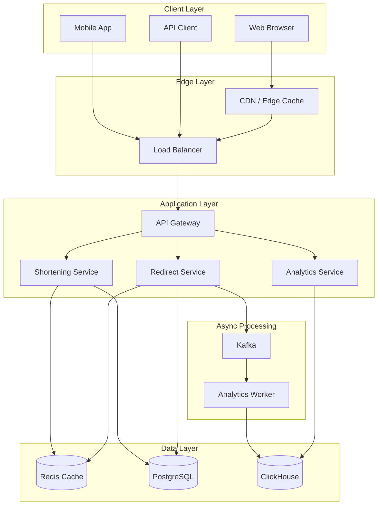
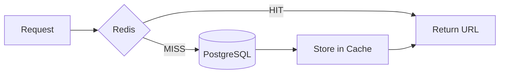
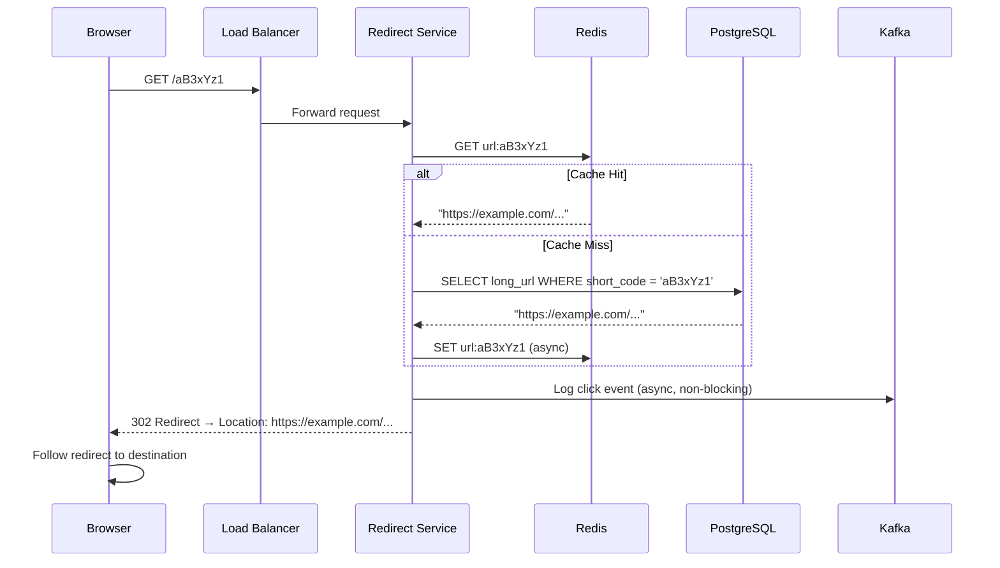
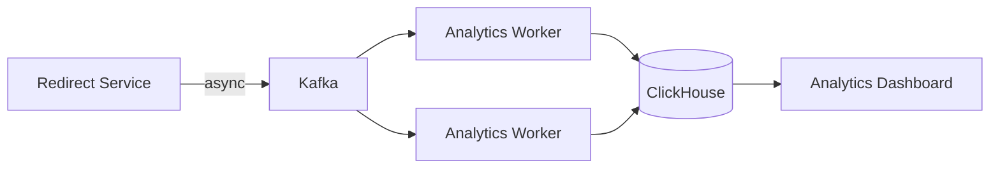
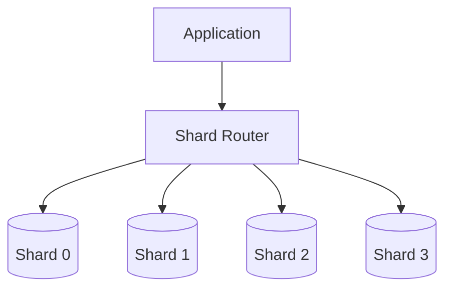
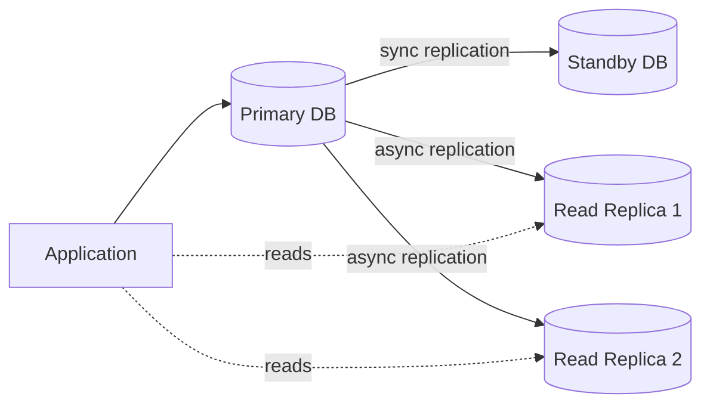

# Design a URL Shortener (TinyURL/Bitly)
{: .no_toc }

<details open markdown="block">
  <summary>Table of Contents</summary>
  {: .text-delta }
1. TOC
{:toc}
</details>

---

## What We're Building

A URL shortener takes a long, unwieldy URL like:

```
https://example.com/articles/2024/how-to-prepare-for-system-design-interviews?ref=social&utm_source=twitter&utm_medium=post&campaign_id=12345
```

And converts it to something short and shareable:

```
https://tiny.co/aB3xYz1
```

When someone clicks the short link, they get redirected to the original URL.

### Why URL Shorteners Exist

1. **Character limits:** Twitter (now X) famously had 140-character limits. Long URLs consumed precious space.
2. **Tracking:** Short URLs enable click analytics—who clicked, when, from where.
3. **Aesthetics:** `tiny.co/sale` looks better in marketing than a 200-character URL.
4. **Memorability:** Short, custom URLs (`bit.ly/my-resume`) are easier to remember and share verbally.

**Real-world examples:** TinyURL (2002), Bitly, t.co (Twitter), goo.gl (Google, discontinued), rb.gy

This is one of the most common system design interview questions because it covers core concepts: hashing, databases, caching, and scaling—while being simple enough to discuss in 45 minutes.

---

## Step 1: Requirements Clarification

Before designing anything, clarify what you're building. This demonstrates maturity and prevents wasted effort.

### Questions to Ask the Interviewer

| Question | Why It Matters | Typical Answer |
|----------|----------------|----------------|
| How many URLs shortened per day? | Determines database size, write throughput | 100M/day (Twitter-scale) to 1K/day (startup) |
| What's the read-to-write ratio? | Caching strategy, read replica needs | Usually 100:1 or higher (many more clicks than creates) |
| Should short URLs expire? | Storage growth, cleanup jobs | Sometimes. Enterprise: yes. Consumer: often no. |
| Do we need analytics? | Adds complexity, async processing | Usually yes (that's how Bitly makes money) |
| Can users create custom short URLs? | Collision handling, validation | Nice-to-have, but common |
| What's the maximum URL length? | Database schema, validation | Typically 2,048 characters (browser limit) |

### Functional Requirements

| Requirement | Priority | Notes |
|-------------|----------|-------|
| Shorten a long URL | Must have | Core feature |
| Redirect short URL to original | Must have | Core feature |
| Custom aliases (vanity URLs) | Nice to have | `tiny.co/my-resume` |
| Click analytics | Nice to have | Count, referrer, geography |
| URL expiration | Nice to have | Auto-delete after N days |
| API access | Nice to have | Programmatic creation |

### Non-Functional Requirements

| Requirement | Target | Rationale |
|-------------|--------|-----------|
| **Availability** | 99.99% for redirects | If redirects fail, all shared links break |
| **Redirect latency** | < 50ms | Users expect instant redirect |
| **Shortening latency** | < 200ms | Can be slightly slower than reads |
| **Durability** | Never lose a mapping | Losing URLs breaks all links |
| **Scalability** | Handle 100K+ redirects/sec | Popular links go viral |

### API Design

Let's define the core APIs:

**Create Short URL:**
```http
POST /api/v1/urls
Content-Type: application/json
Authorization: Bearer <token>

{
    "long_url": "https://example.com/very/long/path?with=params",
    "custom_alias": "my-link",     // Optional
    "expires_at": "2025-12-31"     // Optional
}
```

**Response:**
```json
{
    "short_url": "https://tiny.co/aB3xYz1",
    "long_url": "https://example.com/very/long/path?with=params",
    "short_code": "aB3xYz1",
    "created_at": "2024-01-15T10:00:00Z",
    "expires_at": "2025-12-31T00:00:00Z"
}
```

**Redirect (handled by browser):**
```http
GET /aB3xYz1
→ 302 Found
→ Location: https://example.com/very/long/path?with=params
```

**Get Analytics:**
```http
GET /api/v1/urls/aB3xYz1/stats
```

---

## Step 2: Back-of-Envelope Estimation

Capacity planning is crucial. Let's do the math for a Twitter-scale service.

### Traffic Estimation

```
Given:
- 100 million URLs shortened per month
- 100:1 read-to-write ratio (for every URL created, 100 clicks)

Writes:
- 100M / (30 days × 24 hours × 3600 seconds) = ~40 URLs/second
- Peak (5× average): 200 URLs/second

Reads:
- 40 × 100 = 4,000 redirects/second
- Peak: 20,000 redirects/second
```

### Storage Estimation

```
Per URL record:
- Short code: 7 bytes
- Long URL: ~500 bytes (average)
- Timestamps: 16 bytes
- User ID: 8 bytes
- Other metadata: ~50 bytes
- Total: ~600 bytes

5 years of data:
- 100M/month × 12 months × 5 years = 6 billion URLs
- 6B × 600 bytes = 3.6 TB

With indexes and overhead: ~10 TB
```

### Short Code Capacity

How many unique short codes can we generate?

```
Using Base62 (a-z, A-Z, 0-9):
- 6 characters: 62^6 = 56.8 billion combinations
- 7 characters: 62^7 = 3.5 trillion combinations

At 100M URLs/month:
- 6 chars last: 56.8B / (100M × 12) = ~47 years
- 7 chars last: Effectively unlimited

Decision: Use 7 characters for ample headroom
```

### Bandwidth Estimation

```
Reads:
- 4,000 requests/sec × (200 bytes request + 500 bytes response) = 2.8 MB/sec
- Peak: 14 MB/sec

This is easily handled by modern networks.
```

---

## Step 3: High-Level Architecture

Now let's design the system architecture.

### Core Components



### Two Core Flows

The system has two main operations:

**Write Flow (URL Shortening):**
1. Client sends long URL to API
2. Service generates unique short code
3. Mapping stored in database
4. Short URL returned to client

**Read Flow (Redirect):**
1. User clicks short URL
2. Service looks up mapping (cache first, then DB)
3. Returns HTTP redirect to original URL
4. Logs click event asynchronously

Let's dive deep into each component.

---

## Step 4: Short Code Generation

This is the heart of the system. How do we create unique, short, URL-safe codes?

### Approach 1: Hash the URL

The obvious approach—hash the long URL and take the first N characters.

```python
import hashlib
import base64

def hash_url(long_url: str) -> str:
    # MD5 hash (128 bits)
    hash_bytes = hashlib.md5(long_url.encode()).digest()
    # Base64 encode and take first 7 chars
    encoded = base64.urlsafe_b64encode(hash_bytes).decode()
    return encoded[:7].replace('-', 'a').replace('_', 'b')

# Example
hash_url("https://example.com/page")  # "rL0Y7vC"
```

**Problems with hashing:**

1. **Collisions:** Two different URLs might hash to the same 7 characters. MD5 is 128 bits, but we're only using 7 Base62 characters (~41 bits). Collisions are mathematically certain at scale.

2. **Collision resolution is complex:**
```python
def shorten_with_collision_handling(long_url: str) -> str:
    for attempt in range(10):
        # Add attempt number to create different hashes
        hash_input = long_url if attempt == 0 else f"{long_url}:{attempt}"
        short_code = hash_url(hash_input)
        
        if not database.exists(short_code):
            database.insert(short_code, long_url)
            return short_code
    
    raise Exception("Too many collisions")
```

3. **Same URL always gets same code:** This might be desirable (deduplication) or not (each user wants their own tracking link).

**Verdict:** Hashing works for small scale but becomes problematic at billions of URLs.

### Approach 2: Counter with Base62 Encoding (Recommended)

Use an auto-incrementing counter and convert to Base62.

```python
ALPHABET = "0123456789abcdefghijklmnopqrstuvwxyzABCDEFGHIJKLMNOPQRSTUVWXYZ"

def to_base62(num: int) -> str:
    """Convert a number to base62 string."""
    if num == 0:
        return ALPHABET[0]
    
    result = []
    while num > 0:
        result.append(ALPHABET[num % 62])
        num //= 62
    
    return ''.join(reversed(result))

def from_base62(s: str) -> int:
    """Convert base62 string back to number."""
    num = 0
    for char in s:
        num = num * 62 + ALPHABET.index(char)
    return num

# Examples
to_base62(1)           # "1"
to_base62(62)          # "10"
to_base62(1000000)     # "4c92"
to_base62(999999999)   # "15FTGf"
```

**Advantages:**
- **No collisions:** Every number maps to a unique string
- **Predictable length:** Easy to calculate when you'll need more characters
- **Simple implementation:** Just arithmetic

**Challenge:** Where does the counter come from in a distributed system?

### Distributed ID Generation

When you have multiple servers, they all need unique IDs without coordination delays.

**Option A: Database Auto-Increment**

```sql
CREATE TABLE urls (
    id BIGSERIAL PRIMARY KEY,
    short_code VARCHAR(10) UNIQUE,
    long_url TEXT NOT NULL
);

-- Insert returns the auto-generated ID
INSERT INTO urls (long_url) VALUES ('https://example.com') RETURNING id;
```

*Pros:* Simple, guaranteed unique
*Cons:* Database becomes bottleneck, single point of failure

**Option B: Range Allocation**

Each server pre-allocates a range of IDs:
- Server 1: IDs 1 - 1,000,000
- Server 2: IDs 1,000,001 - 2,000,000
- etc.

When a server exhausts its range, it requests a new one from a coordinator.

```python
class IDGenerator:
    def __init__(self, coordinator_url):
        self.coordinator = coordinator_url
        self.current_range = None
        self.current_id = 0
    
    def get_next_id(self):
        if self.current_range is None or self.current_id >= self.current_range['end']:
            self.current_range = self.request_new_range()
            self.current_id = self.current_range['start']
        
        id = self.current_id
        self.current_id += 1
        return id
    
    def request_new_range(self):
        # Atomically get next range from coordinator
        response = requests.post(f"{self.coordinator}/allocate-range")
        return response.json()  # {"start": 5000001, "end": 6000000}
```

*Pros:* Reduces coordination to rare events
*Cons:* Gaps in IDs if server crashes, need coordinator service

**Option C: Snowflake IDs (Twitter's Approach)**

Generate 64-bit IDs that embed timestamp, machine ID, and sequence number.

```
┌─────────────────────────────────────────────────────────────────┐
│                        64-bit Snowflake ID                      │
├────────┬───────────────────────┬──────────┬────────────────────┤
│ 1 bit  │      41 bits          │ 10 bits  │      12 bits       │
│ unused │     timestamp         │machine ID│      sequence      │
│        │  (milliseconds)       │          │   (per millisecond)│
└────────┴───────────────────────┴──────────┴────────────────────┘
```

**Breaking it down:**

- **41 bits for timestamp:** Milliseconds since custom epoch. Lasts 69 years.
- **10 bits for machine ID:** Supports 1,024 machines
- **12 bits for sequence:** 4,096 IDs per machine per millisecond

```python
import time

class SnowflakeGenerator:
    def __init__(self, machine_id: int):
        self.machine_id = machine_id
        self.sequence = 0
        self.last_timestamp = -1
        self.epoch = 1609459200000  # Custom epoch: 2021-01-01
    
    def generate(self) -> int:
        timestamp = int(time.time() * 1000) - self.epoch
        
        if timestamp == self.last_timestamp:
            self.sequence = (self.sequence + 1) & 0xFFF  # 12 bits
            if self.sequence == 0:
                # Wait for next millisecond
                while timestamp <= self.last_timestamp:
                    timestamp = int(time.time() * 1000) - self.epoch
        else:
            self.sequence = 0
        
        self.last_timestamp = timestamp
        
        # Construct 64-bit ID
        id = ((timestamp << 22) |
              (self.machine_id << 12) |
              self.sequence)
        
        return id

# Usage
generator = SnowflakeGenerator(machine_id=1)
id = generator.generate()  # e.g., 6904298052141748224
short_code = to_base62(id)  # e.g., "aBc123def"
```

*Pros:* 
- No coordination needed
- IDs are roughly time-sorted
- Each machine can generate 4M IDs/second

*Cons:*
- Requires careful clock synchronization
- Machine ID management needed

**Recommendation:** Use Snowflake for large-scale systems. Use database auto-increment for simpler deployments.

### Security: Predictable vs Random

Counter-based IDs are sequential. Someone could enumerate all short codes:
- `tiny.co/1`, `tiny.co/2`, `tiny.co/3`, ...

**If this is a concern:**

1. **Add randomness:** XOR the ID with a secret key or shuffle bits
2. **Use longer codes:** 7+ characters make enumeration impractical
3. **Rate limit:** Detect and block enumeration attempts

```python
SECRET = 0xDEADBEEF12345678

def obfuscate_id(id: int) -> int:
    """Make IDs non-sequential while remaining reversible."""
    return id ^ SECRET

def deobfuscate_id(obfuscated: int) -> int:
    return obfuscated ^ SECRET
```

---

## Step 5: Database Design

### Schema Design

```sql
-- Main URL mappings table
CREATE TABLE urls (
    id BIGINT PRIMARY KEY,                    -- Snowflake ID
    short_code VARCHAR(10) UNIQUE NOT NULL,   -- Base62 encoded
    long_url TEXT NOT NULL,                   -- Original URL
    long_url_hash VARCHAR(64),                -- For duplicate detection
    user_id UUID,                             -- NULL for anonymous
    created_at TIMESTAMP DEFAULT NOW(),
    expires_at TIMESTAMP,                     -- NULL = never expires
    is_active BOOLEAN DEFAULT TRUE,
    click_count BIGINT DEFAULT 0              -- Denormalized for quick access
);

-- Critical indexes
CREATE INDEX idx_short_code ON urls(short_code);
CREATE INDEX idx_long_url_hash ON urls(long_url_hash);
CREATE INDEX idx_user_urls ON urls(user_id, created_at DESC);
CREATE INDEX idx_expires ON urls(expires_at) WHERE expires_at IS NOT NULL;

-- Click events for analytics (consider separate database)
CREATE TABLE clicks (
    id BIGSERIAL PRIMARY KEY,
    short_code VARCHAR(10) NOT NULL,
    clicked_at TIMESTAMP DEFAULT NOW(),
    ip_address INET,
    user_agent TEXT,
    referrer TEXT,
    country_code VARCHAR(2)
);

CREATE INDEX idx_clicks_code_time ON clicks(short_code, clicked_at);
```

### SQL vs NoSQL Decision

| Factor | SQL (PostgreSQL) | NoSQL (DynamoDB/Cassandra) |
|--------|------------------|---------------------------|
| **Consistency** | Strong (ACID) | Eventual (tunable) |
| **Query flexibility** | Complex queries, JOINs | Limited (key-value) |
| **Scaling writes** | Harder (vertical first) | Easy (horizontal) |
| **Unique constraints** | Built-in | Application-enforced |
| **Operational complexity** | Lower (familiar) | Higher |

**Recommendation:** Start with PostgreSQL. It handles millions of URLs easily. Migrate to NoSQL only if you hit scaling limits (billions of URLs, 100K+ writes/sec).

### Handling Duplicate URLs

Should the same long URL always map to the same short code?

**Option 1: Allow duplicates (different short codes for same URL)**
- Each user can have their own tracking link
- Simpler implementation
- Uses more storage

**Option 2: Deduplicate (same short code for same URL)**
- Saves storage
- Requires hash lookup before insert
- Might not fit all use cases (users want individual analytics)

```python
def shorten_url(long_url: str, user_id: str, deduplicate: bool = True) -> str:
    url_hash = hashlib.sha256(long_url.encode()).hexdigest()
    
    if deduplicate:
        # Check if URL already exists
        existing = db.query(
            "SELECT short_code FROM urls WHERE long_url_hash = %s AND user_id = %s",
            (url_hash, user_id)
        )
        if existing:
            return existing.short_code
    
    # Generate new short code
    id = id_generator.generate()
    short_code = to_base62(id)
    
    db.execute(
        """INSERT INTO urls (id, short_code, long_url, long_url_hash, user_id)
           VALUES (%s, %s, %s, %s, %s)""",
        (id, short_code, long_url, url_hash, user_id)
    )
    
    return short_code
```

---

## Step 6: Caching Strategy

With a 100:1 read-to-write ratio, caching is essential. Most URLs follow the 80/20 rule: 20% of URLs get 80% of traffic.

### Cache Architecture



### Redis Data Model

```bash
# Store URL mappings
SET url:aB3xYz1 "https://example.com/long/url" EX 86400

# Hash for multiple fields
HSET url:aB3xYz1 long_url "https://example.com/..." expires_at "2025-12-31"
```

### Cache Implementation

```python
import redis
import json

class URLCache:
    def __init__(self, redis_client, ttl_seconds=86400):
        self.redis = redis_client
        self.ttl = ttl_seconds
    
    def get(self, short_code: str) -> str | None:
        """Get long URL from cache."""
        key = f"url:{short_code}"
        result = self.redis.get(key)
        return result.decode() if result else None
    
    def set(self, short_code: str, long_url: str, expires_at: int = None):
        """Cache URL mapping."""
        key = f"url:{short_code}"
        
        if expires_at:
            # Use URL's expiration as TTL
            ttl = max(expires_at - int(time.time()), 1)
        else:
            ttl = self.ttl
        
        self.redis.setex(key, ttl, long_url)
    
    def delete(self, short_code: str):
        """Remove from cache (on delete or update)."""
        self.redis.delete(f"url:{short_code}")

# In redirect service
def get_long_url(short_code: str) -> str:
    # Try cache first
    long_url = cache.get(short_code)
    
    if long_url:
        metrics.incr("cache.hit")
        return long_url
    
    # Cache miss - query database
    metrics.incr("cache.miss")
    result = db.query("SELECT long_url FROM urls WHERE short_code = %s", short_code)
    
    if not result:
        raise NotFoundError("Short URL not found")
    
    # Cache for next time
    cache.set(short_code, result.long_url)
    
    return result.long_url
```

### Cache Hit Ratio Target

Aim for **95%+ cache hit ratio**. With proper TTLs and sufficient memory:
- 95% of redirects served from cache (~1ms)
- 5% hit database (~10-50ms)
- Average latency: ~3ms

### Cache Sizing

```
Cache size = Active URLs × Average URL size

If 10 million URLs are "active" (clicked in last 24h):
10M × 600 bytes ≈ 6 GB

With Redis overhead: ~10-15 GB
```

This easily fits in a single Redis instance. For larger scale, use Redis Cluster.

---

## Step 7: Redirect Flow Deep Dive

The redirect is the most critical path. It must be fast and reliable.

### 301 vs 302 Redirects

| Status Code | Type | Browser Caches? | Analytics Impact |
|-------------|------|-----------------|------------------|
| **301** | Permanent | Yes (forever) | Loses repeat clicks |
| **302** | Temporary | Usually no | Captures all clicks |
| **307** | Temporary | No | Captures all clicks |

**Trade-off:**
- **301:** Better for SEO (passes link equity), but browsers cache it, so you lose analytics for repeat visits
- **302:** Every click hits your server, enabling accurate analytics

**Recommendation:** Use **302** for most use cases. Use **301** only if SEO is critical and analytics aren't.

### Complete Redirect Flow



### Implementation

```python
from fastapi import FastAPI, Response, HTTPException
from fastapi.responses import RedirectResponse
import asyncio

app = FastAPI()

@app.get("/{short_code}")
async def redirect(short_code: str, request: Request):
    # Validate short code format
    if not is_valid_short_code(short_code):
        raise HTTPException(status_code=400, detail="Invalid short code")
    
    # Get long URL
    try:
        long_url = await get_long_url(short_code)
    except NotFoundError:
        raise HTTPException(status_code=404, detail="URL not found")
    
    # Log click asynchronously (don't wait)
    asyncio.create_task(log_click(
        short_code=short_code,
        ip=request.client.host,
        user_agent=request.headers.get("user-agent"),
        referrer=request.headers.get("referer")
    ))
    
    # Return redirect
    return RedirectResponse(
        url=long_url,
        status_code=302
    )

async def log_click(short_code: str, ip: str, user_agent: str, referrer: str):
    """Send click event to Kafka for async processing."""
    event = {
        "short_code": short_code,
        "timestamp": datetime.utcnow().isoformat(),
        "ip": ip,
        "user_agent": user_agent,
        "referrer": referrer
    }
    await kafka_producer.send("click-events", value=event)
```

---

## Step 8: Analytics System

Analytics must not slow down redirects. Process them asynchronously.

### Architecture



### Click Event Schema

```json
{
    "short_code": "aB3xYz1",
    "timestamp": "2024-01-15T10:30:00Z",
    "ip": "203.0.113.50",
    "user_agent": "Mozilla/5.0 (iPhone; CPU iPhone OS 17_0...",
    "referrer": "https://twitter.com/user/status/123",
    "country": "US",
    "city": "San Francisco",
    "device_type": "mobile",
    "browser": "Safari",
    "os": "iOS"
}
```

### Analytics Worker

```python
from kafka import KafkaConsumer
import geoip2.database

class AnalyticsWorker:
    def __init__(self):
        self.consumer = KafkaConsumer(
            'click-events',
            group_id='analytics-workers',
            bootstrap_servers=['kafka:9092'],
            value_deserializer=lambda m: json.loads(m.decode())
        )
        self.geoip = geoip2.database.Reader('GeoLite2-City.mmdb')
        self.batch = []
        self.batch_size = 1000
    
    def run(self):
        for message in self.consumer:
            event = message.value
            
            # Enrich with geo data
            try:
                geo = self.geoip.city(event['ip'])
                event['country'] = geo.country.iso_code
                event['city'] = geo.city.name
            except:
                event['country'] = 'UNKNOWN'
            
            # Parse user agent
            ua = user_agents.parse(event['user_agent'])
            event['device_type'] = 'mobile' if ua.is_mobile else 'desktop'
            event['browser'] = ua.browser.family
            event['os'] = ua.os.family
            
            self.batch.append(event)
            
            if len(self.batch) >= self.batch_size:
                self.flush_batch()
    
    def flush_batch(self):
        # Batch insert to ClickHouse
        clickhouse.execute(
            "INSERT INTO clicks VALUES",
            self.batch
        )
        self.batch = []
```

### Why ClickHouse for Analytics?

ClickHouse is a column-oriented database optimized for analytical queries.

**Traditional DB (PostgreSQL):**
```sql
SELECT COUNT(*) FROM clicks WHERE short_code = 'aB3xYz1' AND clicked_at > '2024-01-01';
-- Scans all columns of matching rows
-- Slow for billions of rows
```

**ClickHouse:**
- Stores columns separately
- Compresses similar data efficiently
- Processes analytical queries 100-1000x faster

```sql
-- Fast aggregations
SELECT 
    toDate(clicked_at) as day,
    country,
    COUNT(*) as clicks
FROM clicks
WHERE short_code = 'aB3xYz1'
GROUP BY day, country
ORDER BY day;
```

---

## Step 9: Scaling Strategies

### Scaling the Read Path (Redirects)

Redirects are the hot path. Here's how to scale:

| Bottleneck | Solution |
|------------|----------|
| **Single server** | Add more app servers behind load balancer |
| **Database reads** | Add caching (95%+ hit rate) |
| **Cache size** | Use Redis Cluster (shard data) |
| **Single DB** | Add read replicas |
| **Geographic latency** | Deploy in multiple regions |

### Scaling the Write Path (Shortening)

| Bottleneck | Solution |
|------------|----------|
| **ID generation** | Distributed ID generator (Snowflake) |
| **Database writes** | Connection pooling, write batching |
| **Single DB** | Shard by short_code hash |

### Database Sharding

At extreme scale (billions of URLs), shard the database:

```python
def get_shard(short_code: str) -> int:
    """Determine which shard holds this short code."""
    hash_value = hash(short_code)
    return hash_value % NUM_SHARDS

# Example with 4 shards
# short_code "aB3xYz1" → Shard 2
# short_code "xY7zT9q" → Shard 0
```

**Sharding architecture:**



**Challenges:**
- Cross-shard queries are complex
- Rebalancing shards is painful
- Need a shard mapping service

**When to shard:** Only after you've exhausted vertical scaling, read replicas, and caching. Most URL shorteners never need sharding.

---

## Step 10: High Availability and Fault Tolerance

### Failure Scenarios

| Component | Failure Impact | Mitigation |
|-----------|---------------|------------|
| **App server** | Some requests fail | Load balancer health checks, multiple instances |
| **Load balancer** | Total outage | Redundant LBs, DNS failover |
| **Redis cache** | Slower redirects | Fall back to DB, cache warmup on recovery |
| **PostgreSQL** | Can't read/write | Multi-AZ deployment, automatic failover |
| **Kafka** | Analytics delayed | Multi-broker cluster, data replicated |

### Database High Availability



**PostgreSQL HA setup:**
- Primary handles writes
- Synchronous standby for failover (RPO = 0)
- Async replicas for read scaling
- Use PgBouncer for connection pooling

### Cache Thundering Herd

When a popular URL's cache expires, thousands of requests simultaneously hit the database.

**Solution 1: Distributed Locking**

```python
async def get_long_url_with_lock(short_code: str) -> str:
    # Try cache
    cached = cache.get(short_code)
    if cached:
        return cached
    
    lock_key = f"lock:{short_code}"
    
    # Try to acquire lock
    if redis.set(lock_key, "1", nx=True, ex=10):
        try:
            # We have the lock - fetch from DB
            url = db.query("SELECT long_url FROM urls WHERE short_code = %s", short_code)
            cache.set(short_code, url)
            return url
        finally:
            redis.delete(lock_key)
    else:
        # Someone else is fetching - wait and retry
        await asyncio.sleep(0.1)
        return await get_long_url_with_lock(short_code)
```

**Solution 2: Probabilistic Early Refresh**

Refresh cache *before* it expires, randomly:

```python
def get_with_early_refresh(short_code: str) -> str:
    cached, ttl = cache.get_with_ttl(short_code)
    
    if cached:
        # Probabilistically refresh if TTL is low
        if ttl < 300 and random.random() < 0.1:  # 10% chance
            asyncio.create_task(refresh_cache(short_code))
        return cached
    
    return fetch_and_cache(short_code)
```

---

## Step 11: Security Considerations

### URL Validation

Don't blindly redirect to any URL:

```python
from urllib.parse import urlparse
import requests

BLOCKED_SCHEMES = {'javascript', 'data', 'vbscript'}
BLOCKED_DOMAINS = {'malware.example.com', 'phishing.example.com'}

def validate_url(url: str) -> bool:
    """Validate URL is safe to redirect to."""
    try:
        parsed = urlparse(url)
        
        # Check scheme
        if parsed.scheme not in ('http', 'https'):
            return False
        
        if parsed.scheme in BLOCKED_SCHEMES:
            return False
        
        # Check against blocklist
        if parsed.netloc in BLOCKED_DOMAINS:
            return False
        
        # Check against Google Safe Browsing API (optional)
        if is_malicious(url):
            return False
        
        return True
    except:
        return False
```

### Rate Limiting

Prevent abuse:

```python
from redis import Redis
import time

class RateLimiter:
    def __init__(self, redis: Redis, max_requests: int, window_seconds: int):
        self.redis = redis
        self.max_requests = max_requests
        self.window = window_seconds
    
    def is_allowed(self, key: str) -> bool:
        """Token bucket rate limiting."""
        now = int(time.time())
        window_key = f"ratelimit:{key}:{now // self.window}"
        
        count = self.redis.incr(window_key)
        if count == 1:
            self.redis.expire(window_key, self.window)
        
        return count <= self.max_requests

# Usage
limiter = RateLimiter(redis, max_requests=100, window_seconds=3600)

@app.post("/api/v1/urls")
async def create_url(request: Request):
    user_id = get_user_id(request)
    
    if not limiter.is_allowed(f"create:{user_id}"):
        raise HTTPException(status_code=429, detail="Rate limit exceeded")
    
    # ... create URL
```

### Preventing Enumeration

If short codes are sequential (`1`, `2`, `3`...), attackers can enumerate all URLs.

**Mitigations:**
1. Use longer codes (7+ chars)
2. Obfuscate IDs (XOR with secret)
3. Monitor and block bulk access patterns
4. Add CAPTCHA for suspicious requests

---

## Step 12: Monitoring and Alerting

### Key Metrics

| Category | Metric | Alert Threshold |
|----------|--------|-----------------|
| **Latency** | P99 redirect time | > 100ms |
| **Availability** | Redirect success rate | < 99.9% |
| **Throughput** | Redirects per second | Depends on baseline |
| **Cache** | Hit ratio | < 90% |
| **Database** | Connection pool usage | > 80% |
| **Errors** | 5xx error rate | > 0.1% |

### Logging

```json
{
    "timestamp": "2024-01-15T10:30:00Z",
    "level": "INFO",
    "service": "redirect",
    "short_code": "aB3xYz1",
    "long_url": "https://example.com/...",
    "latency_ms": 3.5,
    "cache_hit": true,
    "user_agent": "...",
    "ip": "..."
}
```

---

## Interview Checklist

Use this to structure your answer:

- [ ] **Clarified requirements** (scale, features, read/write ratio)
- [ ] **Estimated capacity** (storage, bandwidth, QPS)
- [ ] **Drew high-level architecture** (clients, LB, app, cache, DB)
- [ ] **Explained short code generation** (Base62 + distributed IDs)
- [ ] **Designed database schema** (with appropriate indexes)
- [ ] **Added caching layer** (Redis, cache-aside pattern)
- [ ] **Discussed redirect status codes** (301 vs 302)
- [ ] **Explained analytics** (async via message queue)
- [ ] **Covered scaling strategies** (horizontal scaling, sharding)
- [ ] **Addressed failure handling** (HA, thundering herd)
- [ ] **Mentioned security** (validation, rate limiting)

---

## Sample Interview Dialogue

**Interviewer:** "Design a URL shortener like TinyURL."

**You:** "Great question! Before I dive in, let me ask a few questions to understand the scope.

First, what's the expected scale? Are we building for a startup with thousands of URLs or a Twitter-scale system with billions?

Second, what's the read-to-write ratio? I'd guess most URL shorteners see many more clicks than creates.

Third, do we need analytics—click counting, referrer tracking, that sort of thing?"

**Interviewer:** "Let's say 100 million URLs created per month, 100:1 read/write ratio, and yes, we want basic analytics."

**You:** "Got it. So we're looking at about 40 writes per second, 4,000 reads per second, and we need an analytics pipeline that doesn't slow down redirects.

Let me start with the high-level architecture. We have two main flows: shortening URLs and redirecting. For shortening, a request comes in, we generate a unique short code—I'll explain how in a moment—store the mapping in a database, and return the short URL.

For redirects, we want to be extremely fast. I'd put a Redis cache in front of the database. With a 100:1 read ratio and proper caching, we should achieve 95%+ cache hit rates, meaning most redirects complete in under 5 milliseconds.

For short code generation, the key challenge is generating unique IDs across multiple servers without coordination delays. I'd recommend a Snowflake-style ID generator..."

---

## Summary

| Component | Choice | Rationale |
|-----------|--------|-----------|
| **ID Generation** | Snowflake IDs | Distributed, no coordination, time-sorted |
| **Encoding** | Base62 (7 chars) | URL-safe, 3.5T combinations |
| **Database** | PostgreSQL | Strong consistency, familiar, scales well |
| **Cache** | Redis | Sub-millisecond lookups, simple KV model |
| **Analytics Queue** | Kafka | High throughput, durable, replayable |
| **Analytics DB** | ClickHouse | Optimized for aggregations |
| **Redirect Code** | 302 | Enables accurate analytics |

The URL shortener demonstrates core distributed systems concepts: unique ID generation, caching, database design, and async processing. Master this design, and you'll have a solid foundation for more complex systems.
