# Design a URL Shortener (TinyURL/Bitly)
{: .no_toc }

<details open markdown="block">
  <summary>Table of Contents</summary>
  {: .text-delta }
1. TOC
{:toc}
</details>

---

## 🎯 What We're Building

A URL shortener takes a long, unwieldy URL like:

```
https://example.com/articles/2024/how-to-prepare-for-system-design-interviews?ref=social&utm_source=twitter
```

And converts it to something short and shareable:

```
https://tiny.co/aB3xYz1
```

When someone clicks the short link, they get redirected to the original URL.

**Real-world examples:** TinyURL, Bitly, t.co (Twitter), goo.gl (discontinued)

---

## 📝 Step 1: Clarify Requirements

{: .tip }
> Always start by asking questions! Never assume requirements. This shows the interviewer you think before you code.

### Questions to Ask

| Question | Why It Matters |
|----------|----------------|
| How many URLs shortened per day? | Determines database and scaling needs |
| Read vs write ratio? | Influences caching strategy |
| Should short URLs expire? | Affects storage and cleanup |
| Do we need analytics? | Adds complexity to the system |
| Custom short URLs allowed? | Changes collision handling |

### Functional Requirements

| Requirement | Priority |
|-------------|----------|
| Shorten long URL → short URL | Must have |
| Redirect short URL → original URL | Must have |
| Custom short URLs (vanity URLs) | Nice to have |
| Click analytics | Nice to have |
| URL expiration | Nice to have |
| API access for third parties | Nice to have |

### Non-Functional Requirements

| Requirement | Target |
|-------------|--------|
| **Availability** | 99.99% (especially for redirects) |
| **Redirect latency** | < 50ms (excluding network) |
| **Shortening latency** | < 200ms |
| **Durability** | Never lose a URL mapping |

---

## 📊 Step 2: Back-of-Envelope Estimation

Let's size this system:

```
Assumptions:
- 100 new URLs shortened per second
- 10,000 redirects per second (100:1 read/write ratio)
- Average URL size: 500 bytes
- Short code length: 7 characters

Daily:
- Writes: 100 × 86,400 = 8.6 million URLs/day
- Reads: 10,000 × 86,400 = 864 million redirects/day

Storage (5 years):
- URLs: 8.6M × 365 × 5 = ~15.7 billion URLs
- Storage: 15.7B × 500B = ~7.85 TB

Short code capacity:
- 7 chars, base62 (a-z, A-Z, 0-9) = 62^7 = 3.5 trillion combinations
- More than enough for 15.7 billion URLs ✓
```

{: .note }
> Show this kind of estimation in your interview. It demonstrates you think about scale before designing.

---

## 🏗️ Step 3: High-Level Design

### Core Flows

The system has two main operations:

| Flow | Description |
|------|-------------|
| **Write** | User submits long URL → Generate short code → Store mapping → Return short URL |
| **Read** | User clicks short URL → Lookup mapping → HTTP redirect to long URL |

### Architecture Diagram

```mermaid
flowchart TB
    subgraph Clients [Clients]
        Web[🌐 Web App]
        Mobile[📱 Mobile]
        API[🔌 API Clients]
    end
    
    subgraph Gateway [API Layer]
        LB[Load Balancer]
        APIGw[API Gateway]
    end
    
    subgraph Services [Application Layer]
        Shorten[Shortening Service]
        Redirect[Redirect Service]
        IDGen[ID Generator]
    end
    
    subgraph DataLayer [Data Layer]
        Cache[(Redis Cache)]
        DB[(PostgreSQL)]
        Analytics[Analytics Queue]
    end
    
    Web --> LB
    Mobile --> LB
    API --> LB
    LB --> APIGw
    
    APIGw --> Shorten
    APIGw --> Redirect
    
    Shorten --> IDGen
    Shorten --> DB
    
    Redirect --> Cache
    Cache -.->|miss| DB
    Redirect --> Analytics
```



---

## 🔑 Step 4: Generating Short Codes

This is the heart of the system. How do we create unique, short codes?

### Option 1: Hash the URL (Not Recommended)

```python
MD5("https://example.com/long/url") → "d41d8cd98f00b204"
Take first 7 chars → "d41d8cd"
```

| Pros | Cons |
|------|------|
| Simple, deterministic | Collisions possible |
| Same URL → same code | Need collision handling |

**Problem:** What if two different URLs produce the same 7-character prefix? You need retry logic.

### Option 2: Counter + Base62 (Recommended) ⭐

```python
CHARS = "0123456789abcdefghijklmnopqrstuvwxyzABCDEFGHIJKLMNOPQRSTUVWXYZ"

def to_base62(num):
    """Convert a number to base62 string."""
    if num == 0:
        return CHARS[0]
    
    result = []
    while num > 0:
        result.append(CHARS[num % 62])
        num //= 62
    return ''.join(reversed(result))

# Examples:
# to_base62(1000000) → "4c92"
# to_base62(999999999) → "15FTGf"
```

| Pros | Cons |
|------|------|
| No collisions by design | Need distributed ID generator |
| Predictable length | IDs are somewhat sequential |

### Capacity Check

| Code Length | Combinations | Enough For |
|-------------|--------------|------------|
| 6 chars | 56.8 billion | 1,800 years @ 1000/sec |
| 7 chars | 3.5 trillion | Effectively unlimited |

**Decision:** Use 7 characters for ample capacity.

### Distributed ID Generation

The challenge: multiple servers need unique IDs without coordination delays.

**Solution: Snowflake-style IDs**

```
┌──────────────────────────────────────────────────────────────────┐
│  64-bit ID                                                       │
├──────────┬─────────────────────┬────────────┬───────────────────┤
│  1 bit   │     41 bits         │   10 bits  │     12 bits       │
│  unused  │     timestamp       │  machine ID│     sequence      │
└──────────┴─────────────────────┴────────────┴───────────────────┘
```

- **Timestamp:** Ensures IDs increase over time
- **Machine ID:** Prevents collisions between servers
- **Sequence:** Handles multiple IDs per millisecond

{: .tip }
> Mentioning Snowflake in your interview shows you understand distributed ID generation.

---

## 💾 Step 5: Database Design

### Schema

```sql
CREATE TABLE urls (
    id BIGINT PRIMARY KEY,           -- Snowflake ID
    short_code VARCHAR(10) UNIQUE NOT NULL,
    long_url TEXT NOT NULL,
    long_url_hash VARCHAR(64),       -- For duplicate detection
    user_id UUID,                    -- Optional: if users exist
    created_at TIMESTAMP DEFAULT NOW(),
    expires_at TIMESTAMP,
    click_count INT DEFAULT 0
);

-- Critical index for fast redirects
CREATE INDEX idx_short_code ON urls(short_code);

-- Index for finding existing URLs
CREATE INDEX idx_long_url_hash ON urls(long_url_hash);
```

### SQL vs NoSQL?

| Consideration | SQL (PostgreSQL) | NoSQL (DynamoDB) |
|---------------|------------------|------------------|
| **Consistency** | Strong ✓ | Eventual |
| **Unique constraints** | Built-in ✓ | Application-level |
| **Complex queries** | Yes ✓ | Limited |
| **Horizontal scaling** | Harder | Automatic ✓ |

**Recommendation:** Start with PostgreSQL. Migrate to NoSQL only if you hit scaling limits.

---

## ⚡ Step 6: Making It Fast with Caching

Most URLs follow the 80/20 rule: 20% of URLs get 80% of traffic.

### Cache Strategy: Cache-Aside


### Redis Commands

```bash
# Cache a URL mapping (24-hour expiry)
SET short:aB3xYz1 "https://example.com/original" EX 86400

# Retrieve
GET short:aB3xYz1
```

### Cache Hit Ratio Target

Aim for **95%+ cache hit ratio**. This means 95% of redirects never touch the database.

---

## 🔄 Step 7: Redirect Flow

### 301 vs 302 Redirects

| Status | Type | Browser Caches? | Analytics? |
|--------|------|-----------------|------------|
| **301** | Permanent | Yes | Misses repeat visits |
| **302** | Temporary | No | Captures all clicks |

**Recommendation:** Use **302** if you need accurate analytics. Use **301** for SEO.

### Complete Redirect Flow


---

## 📊 Step 8: Analytics (Optional)

Decouple analytics from the critical redirect path:


**Click Event:**
```json
{
    "short_code": "aB3xYz1",
    "timestamp": "2024-01-15T10:30:00Z",
    "ip": "192.168.1.1",
    "user_agent": "Chrome/120.0",
    "referrer": "https://twitter.com"
}
```

{: .note }
> Analytics are processed asynchronously so they don't slow down redirects.

---

## 📈 Step 9: Scaling Strategy

### Read Path (Redirects)

| Bottleneck | Solution |
|------------|----------|
| Database reads | Add Redis caching (95%+ hit rate) |
| Single DB | Add read replicas |
| Cache size | Use Redis Cluster |

### Write Path (Shortening)

| Bottleneck | Solution |
|------------|----------|
| ID generation | Distributed Snowflake IDs |
| Database writes | Connection pooling, batching |
| Extreme scale | Shard by short_code hash |

### Database Sharding (If Needed)

```
Shard Key: hash(short_code) % num_shards

┌─────────────────┬─────────────────┬─────────────────┐
│    Shard 0      │    Shard 1      │    Shard 2      │
│  (codes 0-N)    │  (codes N-2N)   │  (codes 2N-3N)  │
└─────────────────┴─────────────────┴─────────────────┘
```

---

## 🛡️ Step 10: Failure Handling

| Failure | Impact | Mitigation |
|---------|--------|------------|
| **Service crash** | Downtime | Load balancer + multiple instances |
| **Database down** | Can't shorten | Multi-AZ deployment, failover |
| **Cache down** | Slower redirects | Fall back to DB, warm up cache |
| **ID generator down** | Can't shorten | Highly available ID service |

### The Thundering Herd Problem

If a popular URL's cache expires, thousands of requests hit the database simultaneously.

**Solutions:**
1. **Lock while refreshing** - Only one request fetches from DB
2. **Probabilistic early refresh** - Refresh before expiry
3. **Stagger TTLs** - Add random jitter to cache expiry

---

## 🔐 Step 11: Security Considerations

| Concern | Solution |
|---------|----------|
| Malicious URLs | Integrate with Safe Browsing API |
| Abuse/spam | Rate limiting (100 URLs/hour per user) |
| Enumeration | Make short codes unpredictable |
| HTTPS | Enforce for all connections |

---

## 📋 Interview Checklist

Use this to structure your answer:

- [ ] Asked clarifying questions (scale, features)
- [ ] Estimated scale (QPS, storage)
- [ ] Drew high-level architecture
- [ ] Explained short code generation (Base62 + ID generator)
- [ ] Designed database schema
- [ ] Added caching layer (Redis)
- [ ] Chose redirect status code (301 vs 302)
- [ ] Discussed analytics (async via queue)
- [ ] Addressed scaling strategies
- [ ] Mentioned failure handling
- [ ] Considered security

---

## 🎤 Sample Interview Dialogue

> **Interviewer:** "Design a URL shortener like TinyURL."
>
> **You:** "Sure! Before I dive in, let me ask a few questions. What's the expected scale - how many URLs per day? Do we need analytics? Should URLs expire?"
>
> **Interviewer:** "Let's say 100 million users, basic analytics, and URLs that can optionally expire."
>
> **You:** "Great. So roughly 100 writes/sec and 10,000 reads/sec - very read-heavy. Let me start with the high-level architecture..."

---

## API Reference

### Shorten URL

```http
POST /api/v1/shorten
Content-Type: application/json
Authorization: Bearer <token>

{
    "long_url": "https://example.com/very/long/url",
    "custom_alias": "my-link",     // Optional
    "expires_in_days": 30          // Optional
}
```

**Response (201 Created):**
```json
{
    "short_url": "https://tiny.co/aB3xYz1",
    "long_url": "https://example.com/very/long/url",
    "expires_at": "2024-02-15T10:00:00Z"
}
```

### Redirect

```http
GET /{short_code}
```

**Response:** `302 Found` with `Location: {long_url}`

### Get Analytics

```http
GET /api/v1/stats/{short_code}
```

**Response (200 OK):**
```json
{
    "short_code": "aB3xYz1",
    "click_count": 1205,
    "created_at": "2024-01-15T10:00:00Z"
}
```

---

## Summary

| Component | Choice | Reasoning |
|-----------|--------|-----------|
| **ID Generation** | Snowflake | Distributed, no coordination |
| **Encoding** | Base62 | URL-safe, compact |
| **Database** | PostgreSQL | Strong consistency, ACID |
| **Cache** | Redis | Fast, simple key-value |
| **Analytics** | Kafka → Worker | Async, doesn't block redirects |

{: .tip }
> The URL shortener is one of the most common interview questions. Practice drawing this design until you can do it from memory!
