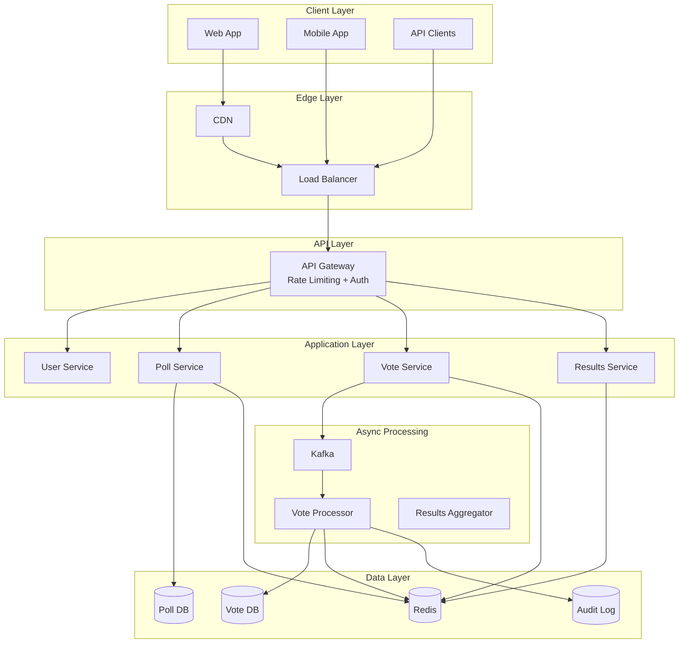
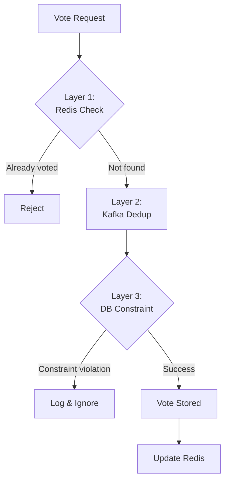
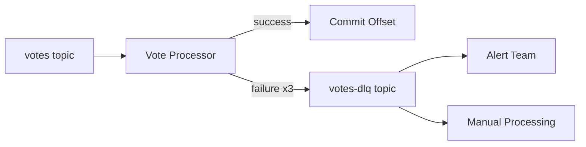
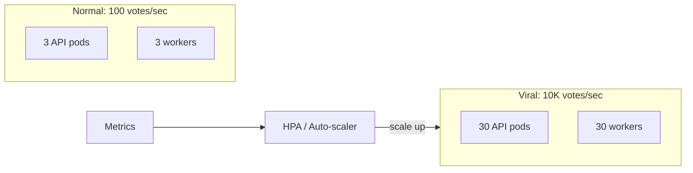

# Design a Voting/Polling System
{: .no_toc }

<details open markdown="block">
  <summary>Table of Contents</summary>
  {: .text-delta }
1. TOC
{:toc}
</details>

---

## What We're Building

A voting system lets users create polls and cast votes. While the concept is simple, building a reliable voting system at scale presents fascinating distributed systems challenges.

### Types of Voting Systems

| Type | Examples | Key Challenges |
|------|----------|----------------|
| **Casual polls** | Twitter polls, Strawpoll | High throughput, real-time results |
| **Content voting** | Reddit upvotes, Stack Overflow | Preventing gaming, vote velocity |
| **Corporate elections** | Board votes, shareholder meetings | Auditability, strict access control |
| **Government elections** | Presidential elections | Security, anonymity, auditing |

The technical requirements vary dramatically:
- A Twitter poll needs to handle millions of votes per second with real-time results
- A corporate election needs ironclad auditability with restricted access
- A government election needs cryptographic verification while preserving anonymity

### Core Challenge

The fundamental problem in voting systems is: **How do you ensure each person votes exactly once while handling massive concurrent traffic?**

This seems simple but becomes complex when:
- Thousands of people vote in the same second
- Network requests can be duplicated (retries, timeouts)
- Databases can have race conditions
- Malicious users try to vote multiple times

---

## Step 1: Requirements Clarification

### Questions to Ask

| Question | Impact on Design |
|----------|------------------|
| What type of voting? (polls, elections, upvotes) | Determines security and anonymity needs |
| Who can vote? (public, authenticated, specific groups) | Authentication complexity |
| How strict is "one vote per person"? | Duplicate prevention strategy |
| Real-time results or only after voting ends? | Caching and consistency approach |
| Can votes be changed after casting? | Complicates uniqueness guarantees |
| What's the expected scale? | Infrastructure sizing |

### Our Design: General-Purpose Polling Platform

Let's design a system similar to **Strawpoll** or **Twitter Polls**:

**Functional Requirements:**

| Feature | Priority | Description |
|---------|----------|-------------|
| User registration/login | Must have | Identify voters |
| Create polls | Must have | Title, options, duration |
| Cast one vote per poll | Must have | Core functionality |
| View results | Must have | After poll closes or real-time |
| Custom poll settings | Nice to have | Anonymous, allow result viewing |
| Poll expiration | Nice to have | Auto-close after deadline |

**Non-Functional Requirements:**

| Requirement | Target | Rationale |
|-------------|--------|-----------|
| **Availability** | 99.99% | People expect voting to work |
| **Latency** | < 500ms for voting | Responsive UX |
| **Accuracy** | Zero lost/duplicate votes | Data integrity |
| **Throughput** | 10,000+ votes/sec (peak) | Handle viral polls |
| **Consistency** | No duplicate votes ever | System correctness |

---

## Step 2: Back-of-Envelope Estimation

Let's size for a Twitter-scale polling system.

### Traffic Estimation

```
Assumptions:
- 10 million daily active users
- 1% create polls daily = 100,000 polls/day
- Average poll gets 100 votes = 10 million votes/day
- Viral poll gets 10 million votes

Average load:
- 10M votes / 86,400 seconds ≈ 115 votes/second

Peak load (viral poll):
- 10 million votes in 1 hour = 2,800 votes/second
- With burst: 10,000 votes/second
```

### Storage Estimation

```
Per vote:
- vote_id: 8 bytes
- poll_id: 8 bytes  
- user_id: 8 bytes
- option_id: 8 bytes
- timestamp: 8 bytes
- metadata: 20 bytes
Total: ~60 bytes

Daily: 10M votes × 60 bytes = 600 MB
Yearly: 220 GB
5 years: ~1 TB

Per poll:
- Metadata: ~500 bytes
- Options: 100 bytes × 5 = 500 bytes
Daily: 100K polls × 1KB = 100 MB
```

### Database Operations

```
Writes:
- Peak: 10,000 votes/sec (INSERT)
- Each vote requires unique constraint check

Reads:
- Poll viewing: 100x vote rate = 1 million reads/sec (cached)
- Results aggregation: Heavy queries, should be pre-computed
```

---

## Step 3: High-Level Architecture

### System Overview



### Why Async Vote Processing?

At 10,000 votes/second, synchronous database writes would overwhelm PostgreSQL.

**Synchronous approach (won't scale):**
```
User → API → Database → Response
       └── 10,000 writes/sec to one DB
```

**Asynchronous approach (scales):**
```
User → API → Message Queue → Response (202 Accepted)
             └── Workers → Database (batched, controlled)
```

Benefits:
- **Backpressure handling:** Queue buffers traffic spikes
- **Reliability:** Messages persist even if workers crash
- **Scalability:** Add more workers for more throughput
- **Latency:** User gets fast response, actual processing happens async

---

## Step 4: The Core Challenge - Preventing Duplicate Votes

This is the most critical part of the design. A user must never be able to vote twice on the same poll.

### Why It's Hard

Consider this scenario:
1. User clicks "Vote" button
2. Request times out (network issue)
3. Client retries
4. Original request eventually succeeds
5. Retry also succeeds
6. **User has voted twice!**

Or this race condition:
```
Thread 1: Check if user voted → No
Thread 2: Check if user voted → No
Thread 1: Insert vote → Success
Thread 2: Insert vote → Success (duplicate!)
```

### Defense in Depth Strategy

We use multiple layers of protection:



### Layer 1: Fast Redis Check (API Level)

Before accepting the vote, check if the user already voted:

```python
class VoteService:
    def __init__(self, redis_client, kafka_producer):
        self.redis = redis_client
        self.kafka = kafka_producer
    
    async def cast_vote(self, user_id: str, poll_id: str, option_id: str) -> dict:
        # Validate poll is active
        poll = await self.get_poll(poll_id)
        if not poll or poll.status != "active":
            raise PollNotActiveError()
        
        if not self.is_valid_option(poll, option_id):
            raise InvalidOptionError()
        
        # Layer 1: Fast duplicate check
        vote_key = f"voted:{poll_id}:{user_id}"
        if self.redis.exists(vote_key):
            raise AlreadyVotedError("You have already voted on this poll")
        
        # Optimistic: Set Redis flag immediately
        # This provides fast rejection for subsequent requests
        # TTL should be longer than poll duration
        self.redis.setex(vote_key, poll.ttl_seconds, "pending")
        
        # Enqueue for processing
        await self.kafka.send("votes", {
            "user_id": user_id,
            "poll_id": poll_id,
            "option_id": option_id,
            "timestamp": datetime.utcnow().isoformat(),
            "request_id": generate_request_id()  # For idempotency
        })
        
        return {"status": "accepted", "message": "Vote is being processed"}
```

**Why this isn't enough:**

- Redis SET + Kafka SEND isn't atomic
- If the server crashes between them, state is inconsistent
- Redis might not have the data (cache miss)

### Layer 2: Idempotent Message Processing

Each vote message has a unique `request_id`. The worker deduplicates:

```python
class VoteProcessor:
    def __init__(self):
        self.processed_requests = {}  # In-memory for hot path
    
    async def process_vote(self, message: dict):
        request_id = message["request_id"]
        user_id = message["user_id"]
        poll_id = message["poll_id"]
        option_id = message["option_id"]
        
        # Idempotency check (in-memory for speed)
        if request_id in self.processed_requests:
            log.info(f"Duplicate request {request_id}, skipping")
            return
        
        try:
            # Layer 3: Database insert with constraint
            await self.db.execute("""
                INSERT INTO votes (user_id, poll_id, option_id, voted_at)
                VALUES ($1, $2, $3, NOW())
            """, user_id, poll_id, option_id)
            
            # Mark as processed
            self.processed_requests[request_id] = True
            
            # Update Redis for fast future checks
            vote_key = f"voted:{poll_id}:{user_id}"
            self.redis.setex(vote_key, 86400 * 7, "confirmed")
            
            # Update vote count
            await self.increment_vote_count(poll_id, option_id)
            
        except UniqueViolationError:
            # Already voted - this is expected for retries
            log.info(f"User {user_id} already voted on poll {poll_id}")
            
        except Exception as e:
            # Unexpected error - let Kafka retry
            log.error(f"Failed to process vote: {e}")
            raise
```

### Layer 3: Database Unique Constraint (The Last Line of Defense)

The database constraint guarantees correctness even if all other layers fail:

```sql
CREATE TABLE votes (
    vote_id UUID PRIMARY KEY DEFAULT gen_random_uuid(),
    poll_id UUID NOT NULL REFERENCES polls(poll_id),
    user_id UUID NOT NULL REFERENCES users(user_id),
    option_id UUID NOT NULL REFERENCES poll_options(option_id),
    voted_at TIMESTAMP DEFAULT NOW(),
    
    -- THE CRITICAL CONSTRAINT
    CONSTRAINT uq_one_vote_per_user_per_poll UNIQUE (user_id, poll_id)
);

-- This index also speeds up "has user voted?" queries
CREATE INDEX idx_votes_user_poll ON votes(user_id, poll_id);
```

**Why database constraints are non-negotiable:**

1. **Atomicity:** The INSERT either fully succeeds or fully fails
2. **Durability:** Once committed, the vote is permanent
3. **Correctness:** Even with race conditions, only one row can exist

```python
# This is safe even with concurrent requests:
try:
    db.execute("INSERT INTO votes ...")
except UniqueViolationError:
    # Another thread/process already inserted - that's fine
    pass
```

---

## Step 5: Database Design

### Schema Design

```sql
-- Users table
CREATE TABLE users (
    user_id UUID PRIMARY KEY DEFAULT gen_random_uuid(),
    email VARCHAR(255) UNIQUE NOT NULL,
    username VARCHAR(100) UNIQUE NOT NULL,
    password_hash TEXT NOT NULL,
    created_at TIMESTAMP DEFAULT NOW(),
    is_verified BOOLEAN DEFAULT FALSE
);

-- Polls table
CREATE TABLE polls (
    poll_id UUID PRIMARY KEY DEFAULT gen_random_uuid(),
    creator_id UUID NOT NULL REFERENCES users(user_id),
    title VARCHAR(255) NOT NULL,
    description TEXT,
    start_time TIMESTAMP NOT NULL,
    end_time TIMESTAMP NOT NULL,
    status VARCHAR(20) DEFAULT 'draft', -- draft, active, closed
    
    -- Settings
    allow_anonymous BOOLEAN DEFAULT FALSE,
    show_results_during_voting BOOLEAN DEFAULT TRUE,
    allow_multiple_options BOOLEAN DEFAULT FALSE,
    max_votes_per_user INT DEFAULT 1,
    
    -- Denormalized for quick access
    total_votes INT DEFAULT 0,
    
    created_at TIMESTAMP DEFAULT NOW(),
    updated_at TIMESTAMP DEFAULT NOW()
);

CREATE INDEX idx_polls_status ON polls(status, end_time);
CREATE INDEX idx_polls_creator ON polls(creator_id);

-- Poll options
CREATE TABLE poll_options (
    option_id UUID PRIMARY KEY DEFAULT gen_random_uuid(),
    poll_id UUID NOT NULL REFERENCES polls(poll_id) ON DELETE CASCADE,
    option_text VARCHAR(500) NOT NULL,
    display_order INT NOT NULL,
    vote_count INT DEFAULT 0,  -- Denormalized for fast results
    
    UNIQUE (poll_id, display_order)
);

CREATE INDEX idx_options_poll ON poll_options(poll_id);

-- Votes table (critical for integrity)
CREATE TABLE votes (
    vote_id UUID PRIMARY KEY DEFAULT gen_random_uuid(),
    poll_id UUID NOT NULL,
    user_id UUID NOT NULL,
    option_id UUID NOT NULL,
    voted_at TIMESTAMP DEFAULT NOW(),
    ip_address INET,  -- For abuse detection
    user_agent TEXT,
    
    CONSTRAINT fk_poll FOREIGN KEY (poll_id) REFERENCES polls(poll_id),
    CONSTRAINT fk_user FOREIGN KEY (user_id) REFERENCES users(user_id),
    CONSTRAINT fk_option FOREIGN KEY (option_id) REFERENCES poll_options(option_id),
    
    -- One vote per user per poll
    CONSTRAINT uq_user_poll UNIQUE (user_id, poll_id)
);

CREATE INDEX idx_votes_poll_option ON votes(poll_id, option_id);
CREATE INDEX idx_votes_user ON votes(user_id);

-- Audit log for compliance
CREATE TABLE vote_audit_log (
    log_id BIGSERIAL PRIMARY KEY,
    vote_id UUID NOT NULL,
    poll_id UUID NOT NULL,
    user_id UUID NOT NULL,
    action VARCHAR(20) NOT NULL,  -- 'cast', 'changed', 'revoked'
    old_option_id UUID,
    new_option_id UUID,
    timestamp TIMESTAMP DEFAULT NOW(),
    ip_address INET,
    request_metadata JSONB
);

CREATE INDEX idx_audit_poll ON vote_audit_log(poll_id, timestamp);
```

### Denormalization for Performance

Instead of counting votes on every request:

```sql
-- Slow: COUNT on every read
SELECT option_id, COUNT(*) 
FROM votes 
WHERE poll_id = 'xxx' 
GROUP BY option_id;
```

We maintain counters:

```sql
-- Fast: Read denormalized count
SELECT option_id, option_text, vote_count 
FROM poll_options 
WHERE poll_id = 'xxx' 
ORDER BY display_order;
```

The vote processor updates counters atomically:

```python
async def increment_vote_count(poll_id: str, option_id: str):
    # Atomic increment
    await db.execute("""
        UPDATE poll_options 
        SET vote_count = vote_count + 1 
        WHERE option_id = $1
    """, option_id)
    
    await db.execute("""
        UPDATE polls 
        SET total_votes = total_votes + 1 
        WHERE poll_id = $1
    """, poll_id)
    
    # Invalidate cache
    await redis.delete(f"results:{poll_id}")
```

---

## Step 6: Real-Time Results with Redis

For polls that show live results, we need sub-second updates.

### Redis Data Model

```bash
# Vote counts per option (Hash)
HSET results:poll123 option_a 1542
HSET results:poll123 option_b 3201
HSET results:poll123 option_c 876

# Increment on vote
HINCRBY results:poll123 option_a 1

# Get all results
HGETALL results:poll123
# Returns: {"option_a": "1542", "option_b": "3201", "option_c": "876"}

# Track who voted (Set)
SADD voters:poll123 user_abc
SISMEMBER voters:poll123 user_abc  # Returns 1 (true)
```

### Results Service

```python
class ResultsService:
    def __init__(self, redis_client, db):
        self.redis = redis_client
        self.db = db
    
    async def get_results(self, poll_id: str, user_id: str = None) -> dict:
        poll = await self.get_poll(poll_id)
        
        # Check if results are visible
        if poll.status == "active" and not poll.show_results_during_voting:
            if user_id:
                has_voted = await self.has_user_voted(poll_id, user_id)
                if not has_voted:
                    raise ResultsNotAvailableError("Vote to see results")
        
        # Try Redis first
        results_key = f"results:{poll_id}"
        cached = self.redis.hgetall(results_key)
        
        if cached:
            return self.format_results(poll, cached)
        
        # Cache miss - compute from database
        results = await self.db.fetch("""
            SELECT option_id, vote_count
            FROM poll_options
            WHERE poll_id = $1
            ORDER BY display_order
        """, poll_id)
        
        # Cache for next time
        for row in results:
            self.redis.hset(results_key, str(row['option_id']), row['vote_count'])
        self.redis.expire(results_key, 3600)  # 1 hour TTL
        
        return self.format_results(poll, results)
    
    def format_results(self, poll, results) -> dict:
        total = sum(int(v) for v in results.values())
        
        return {
            "poll_id": poll.poll_id,
            "title": poll.title,
            "status": poll.status,
            "total_votes": total,
            "options": [
                {
                    "option_id": opt_id,
                    "votes": int(count),
                    "percentage": round(int(count) / total * 100, 1) if total > 0 else 0
                }
                for opt_id, count in results.items()
            ]
        }
```

### Real-Time Updates with WebSockets

For live-updating results:

```python
from fastapi import WebSocket
import asyncio

class ResultsWebSocket:
    def __init__(self):
        self.connections: dict[str, list[WebSocket]] = {}
    
    async def connect(self, poll_id: str, websocket: WebSocket):
        await websocket.accept()
        
        if poll_id not in self.connections:
            self.connections[poll_id] = []
        self.connections[poll_id].append(websocket)
        
        # Send current results immediately
        results = await results_service.get_results(poll_id)
        await websocket.send_json(results)
    
    async def broadcast_update(self, poll_id: str, results: dict):
        if poll_id not in self.connections:
            return
        
        for ws in self.connections[poll_id]:
            try:
                await ws.send_json(results)
            except:
                self.connections[poll_id].remove(ws)

# In vote processor, after updating counts:
async def on_vote_processed(poll_id: str, option_id: str):
    results = await results_service.get_results(poll_id)
    await ws_manager.broadcast_update(poll_id, results)
```

---

## Step 7: Message Queue Design with Kafka

### Why Kafka?

| Requirement | Kafka Feature |
|-------------|---------------|
| High throughput | Partitioned, batched writes |
| Durability | Replication, disk persistence |
| Ordering | Per-partition ordering |
| Replay | Consumer offsets, retention |
| Scalability | Add partitions, consumers |

### Topic Configuration

```yaml
topic: votes
partitions: 12  # Allows 12 parallel consumers
replication_factor: 3  # Survives 2 broker failures
retention.ms: 604800000  # 7 days for replay/audit
min.insync.replicas: 2  # Require 2 brokers to ack
```

### Partitioning Strategy

**Option 1: Partition by user_id**
```python
partition = hash(user_id) % num_partitions
```
- Same user's votes go to same partition
- Helps with per-user deduplication
- Good load distribution

**Option 2: Partition by poll_id**
```python
partition = hash(poll_id) % num_partitions
```
- All votes for a poll in one partition
- Easier to maintain poll-level ordering
- Risk: Hot polls overload one partition

**Recommendation:** Partition by `user_id` for better load distribution.

### Consumer Group

```python
from kafka import KafkaConsumer

consumer = KafkaConsumer(
    'votes',
    bootstrap_servers=['kafka1:9092', 'kafka2:9092', 'kafka3:9092'],
    group_id='vote-processors',
    auto_offset_reset='earliest',
    enable_auto_commit=False,  # Manual commit for reliability
    value_deserializer=lambda m: json.loads(m.decode())
)

for message in consumer:
    try:
        await process_vote(message.value)
        consumer.commit()  # Only commit after successful processing
    except Exception as e:
        log.error(f"Failed to process vote: {e}")
        # Don't commit - Kafka will redeliver
```

### Dead Letter Queue

Votes that fail repeatedly need investigation:



```python
MAX_RETRIES = 3

async def process_with_retry(message):
    retries = message.headers.get('x-retry-count', 0)
    
    try:
        await process_vote(message.value)
    except Exception as e:
        if retries >= MAX_RETRIES:
            # Send to dead letter queue
            await kafka.send('votes-dlq', 
                value=message.value,
                headers={'x-error': str(e), 'x-original-offset': message.offset}
            )
        else:
            # Re-enqueue with retry count
            await kafka.send('votes',
                value=message.value,
                headers={'x-retry-count': retries + 1}
            )
```

---

## Step 8: Scaling Strategies

### Scaling Components

| Component | Scaling Strategy | Trigger |
|-----------|------------------|---------|
| **API Gateway** | Horizontal (add instances) | CPU > 70%, latency > 200ms |
| **Vote Service** | Horizontal | Queue depth, latency |
| **Kafka** | Add partitions, brokers | Throughput limits |
| **Vote Processors** | Add consumers | Queue lag > 10,000 |
| **PostgreSQL** | Read replicas → Sharding | Query latency, connections |
| **Redis** | Cluster mode | Memory usage, ops/sec |

### Handling Viral Polls

When a celebrity creates a poll and 10 million people vote:



**Auto-scaling rules:**
```yaml
# Kubernetes HPA
apiVersion: autoscaling/v2
kind: HorizontalPodAutoscaler
spec:
  scaleTargetRef:
    kind: Deployment
    name: vote-service
  minReplicas: 3
  maxReplicas: 50
  metrics:
  - type: External
    external:
      metric:
        name: kafka_consumer_lag
      target:
        type: Value
        value: "5000"  # Scale up if lag exceeds 5K
```

### Database Scaling

**Stage 1: Read replicas**
```
Writes → Primary
Reads → Read Replicas (round-robin)
```

**Stage 2: Connection pooling (PgBouncer)**
```
App (1000 connections) → PgBouncer (100 connections) → PostgreSQL
```

**Stage 3: Sharding by poll_id**
```python
def get_shard(poll_id: str) -> str:
    shard_id = hash(poll_id) % NUM_SHARDS
    return f"shard_{shard_id}"

# Votes for poll ABC → shard_2
# Votes for poll XYZ → shard_0
```

---

## Step 9: Failure Handling

### Failure Modes and Recovery

| Failure | Impact | Detection | Recovery |
|---------|--------|-----------|----------|
| **API pod crash** | Some requests fail | Health check | LB routes to healthy pods |
| **Kafka broker down** | Reduced capacity | Broker health | Failover to replicas |
| **Vote processor crash** | Processing delays | Consumer lag | Kafka redelivers, other workers continue |
| **Primary DB down** | Writes fail | Connection errors | Promote replica |
| **Redis down** | Slower checks | Connection timeout | Fall back to DB |

### Graceful Degradation

When components fail, degrade gracefully instead of hard failing:

```python
async def cast_vote_with_fallback(user_id, poll_id, option_id):
    # Try Redis for duplicate check
    try:
        if await redis.exists(f"voted:{poll_id}:{user_id}"):
            raise AlreadyVotedError()
    except RedisConnectionError:
        # Redis down - skip fast check, rely on DB constraint
        log.warning("Redis unavailable, proceeding without cache check")
    
    # Try to enqueue vote
    try:
        await kafka.send("votes", {...})
        return {"status": "accepted"}
    except KafkaError:
        # Kafka down - try direct DB write (slower but works)
        log.warning("Kafka unavailable, writing directly to DB")
        try:
            await db.execute("INSERT INTO votes ...")
            return {"status": "confirmed"}
        except UniqueViolationError:
            raise AlreadyVotedError()
```

### Data Consistency Checks

Periodically verify Redis counts match database:

```python
async def reconcile_vote_counts():
    """Run hourly to catch any drift."""
    
    polls = await db.fetch("SELECT poll_id FROM polls WHERE status = 'active'")
    
    for poll in polls:
        poll_id = poll['poll_id']
        
        # Get DB truth
        db_counts = await db.fetch("""
            SELECT option_id, COUNT(*) as count
            FROM votes WHERE poll_id = $1
            GROUP BY option_id
        """, poll_id)
        
        # Get Redis counts
        redis_counts = redis.hgetall(f"results:{poll_id}")
        
        # Compare and fix
        for row in db_counts:
            option_id = str(row['option_id'])
            db_count = row['count']
            redis_count = int(redis_counts.get(option_id, 0))
            
            if db_count != redis_count:
                log.warning(f"Count mismatch for {poll_id}/{option_id}: "
                           f"DB={db_count}, Redis={redis_count}")
                # Fix Redis
                redis.hset(f"results:{poll_id}", option_id, db_count)
```

---

## Step 10: Security Considerations

### Authentication and Authorization

```python
from fastapi import Depends, HTTPException
from fastapi.security import HTTPBearer

security = HTTPBearer()

async def get_current_user(token: str = Depends(security)) -> User:
    try:
        payload = jwt.decode(token.credentials, SECRET_KEY, algorithms=["HS256"])
        user_id = payload.get("sub")
        return await user_service.get_user(user_id)
    except jwt.ExpiredSignatureError:
        raise HTTPException(401, "Token expired")
    except jwt.JWTError:
        raise HTTPException(401, "Invalid token")

@app.post("/polls/{poll_id}/vote")
async def vote(
    poll_id: str,
    option_id: str,
    user: User = Depends(get_current_user)
):
    # User is authenticated
    return await vote_service.cast_vote(user.user_id, poll_id, option_id)
```

### Rate Limiting

Prevent abuse:

```python
from slowapi import Limiter
from slowapi.util import get_remote_address

limiter = Limiter(key_func=get_remote_address)

@app.post("/polls/{poll_id}/vote")
@limiter.limit("10/minute")  # 10 votes per minute per IP
async def vote(poll_id: str, request: Request):
    ...

@app.post("/polls")
@limiter.limit("5/hour")  # 5 polls per hour per user
async def create_poll(poll: PollCreate, user: User = Depends(get_current_user)):
    ...
```

### Bot Prevention

| Technique | Implementation | Effectiveness |
|-----------|----------------|---------------|
| **CAPTCHA** | reCAPTCHA on vote | High, but friction |
| **Rate limiting** | Per IP, per user | Medium |
| **Device fingerprinting** | FingerprintJS | Medium-High |
| **Behavioral analysis** | ML on voting patterns | High |
| **Email verification** | Require verified email | High |

```python
async def validate_vote_request(request: Request, user: User):
    # Check for suspicious patterns
    recent_votes = await get_recent_votes(user.user_id, minutes=5)
    
    if len(recent_votes) > 20:
        raise SuspiciousActivityError("Too many votes in short time")
    
    # Check device fingerprint
    fingerprint = request.headers.get("X-Device-Fingerprint")
    if fingerprint:
        devices_for_user = await get_user_devices(user.user_id)
        if len(devices_for_user) > 5:
            raise SuspiciousActivityError("Too many devices")
```

### Anonymity vs Auditability Trade-off

**Challenge:** You want votes to be anonymous (no one knows how I voted), but you also need to verify one-vote-per-person.

**Our approach:**
- System knows *who* voted (required for duplicate prevention)
- System stores *what* they voted for (for results)
- Other users cannot see individual votes
- Admins can audit if legally required

**For truly anonymous voting (e.g., government elections):**
- Use cryptographic techniques (blind signatures, homomorphic encryption)
- Voter gets a receipt they can verify without revealing their vote
- This is complex and outside typical interview scope

---

## Step 11: Monitoring and Observability

### Key Metrics

| Category | Metric | Alert Threshold |
|----------|--------|-----------------|
| **Availability** | Vote success rate | < 99.9% |
| **Latency** | Vote API P99 | > 500ms |
| **Throughput** | Votes processed/sec | Trend down |
| **Queue** | Kafka consumer lag | > 10,000 |
| **Duplicates** | Duplicate vote attempts | Spike (> 10%) |
| **Errors** | 5xx error rate | > 0.1% |

### Logging

Structured logs for easy querying:

```json
{
    "timestamp": "2024-01-15T10:30:00Z",
    "level": "INFO",
    "service": "vote-processor",
    "event": "vote_processed",
    "poll_id": "uuid",
    "user_id": "uuid",
    "option_id": "uuid",
    "processing_time_ms": 15,
    "was_duplicate": false,
    "cache_hit": true
}
```

### Dashboard Panels

1. **Real-time metrics:**
   - Votes per second
   - Active polls count
   - Error rate

2. **Queue health:**
   - Consumer lag
   - Partition distribution
   - Processing latency

3. **Database health:**
   - Query latency
   - Connection pool usage
   - Replication lag

---

## Interview Checklist

- [ ] **Clarified requirements** (type of voting, scale, anonymity)
- [ ] **Estimated capacity** (votes/sec, storage)
- [ ] **Drew high-level architecture** (async processing)
- [ ] **Explained duplicate prevention** (Redis + DB constraint)
- [ ] **Designed database schema** (with unique constraint)
- [ ] **Covered real-time results** (Redis counters)
- [ ] **Discussed message queue design** (Kafka partitioning)
- [ ] **Addressed scaling strategies** (horizontal, sharding)
- [ ] **Covered failure handling** (graceful degradation)
- [ ] **Mentioned security** (auth, rate limiting, bots)

---

## Sample Interview Dialogue

**Interviewer:** "Design a voting system."

**You:** "Great! Let me clarify a few things first. What type of voting system? A casual polling app like Strawpoll, Reddit-style upvotes, or something more formal like corporate elections?"

**Interviewer:** "Let's go with a general polling platform. Users create polls, others vote."

**You:** "Got it. How strict is duplicate vote prevention, and what scale are we targeting?"

**Interviewer:** "Strict—exactly one vote per user per poll. And let's say it could go viral—maybe 10,000 votes per second peak."

**You:** "Perfect. So we need strong consistency for duplicate prevention and high throughput. The core challenge is ensuring exactly-once voting while handling massive concurrency.

I'd use a three-layer defense:
1. Fast Redis check to reject obvious duplicates
2. Idempotent message processing in Kafka
3. Database unique constraint as the final guarantee

For the architecture, I'd process votes asynchronously through Kafka to handle the 10K/sec throughput. The API accepts votes quickly, returns 202 Accepted, and workers process them in controlled batches to the database.

Let me draw the architecture..."

---

## Summary

| Challenge | Solution |
|-----------|----------|
| **Duplicate prevention** | Three layers: Redis check + Kafka dedup + DB constraint |
| **High throughput** | Async processing via Kafka, horizontal scaling |
| **Real-time results** | Redis counters, WebSocket updates |
| **Data accuracy** | Database unique constraint, periodic reconciliation |
| **Scalability** | Kafka partitioning, worker scaling, DB sharding |
| **Reliability** | Graceful degradation, dead letter queue, retry logic |
| **Security** | JWT auth, rate limiting, bot detection |

The voting system demonstrates critical distributed systems concepts: **consistency** (one vote per user), **idempotency** (safe retries), and **async processing** (handling bursts). Master this pattern, and you'll be equipped to design many similar systems.
