# Design a Voting/Polling System
{: .no_toc }

<details open markdown="block">
  <summary>Table of Contents</summary>
  {: .text-delta }
1. TOC
{:toc}
</details>

---

## 🎯 What We're Building

A voting system lets users create polls and vote on them. Think of platforms like:

- **Strawpoll** - Quick, anonymous polls
- **Twitter Polls** - Embedded in tweets
- **Reddit voting** - Upvotes/downvotes on posts
- **Corporate elections** - Shareholder voting

The key challenge? **Preventing duplicate votes while handling massive concurrent traffic.**

---

## 📝 Step 1: Clarify Requirements

{: .tip }
> Voting systems vary wildly based on context. An informal Twitter poll is very different from a government election!

### Questions to Ask

| Question | Impact on Design |
|----------|------------------|
| What type of voting? (polls, elections, upvotes) | Security and anonymity requirements |
| Who can vote? (public, authenticated users, specific groups) | Authentication complexity |
| How strict is "one vote per person"? | Duplicate prevention strategy |
| Real-time results or after voting ends? | Caching and update strategy |
| Expected scale? (votes per second) | Database and queue choices |

### Our Assumptions

We're designing a **general-purpose online polling platform** with:

**Functional Requirements:**

| Feature | Priority |
|---------|----------|
| User registration and authentication | Must have |
| Create polls with multiple options | Must have |
| Cast one vote per poll | Must have |
| View results (after poll closes) | Must have |
| Real-time results (configurable) | Nice to have |
| Poll expiration | Nice to have |

**Non-Functional Requirements:**

| Requirement | Target |
|-------------|--------|
| **Availability** | 99.99% during voting |
| **Vote latency** | < 500ms |
| **Accuracy** | Zero lost or duplicate votes |
| **Scale** | 1,000-10,000 votes/sec |

---

## 📊 Step 2: Back-of-Envelope Estimation

```
Assumptions:
- Peak: 10,000 votes per second (viral poll scenario)
- Average vote size: 100 bytes
- 1 million active polls
- 100 votes per poll average

Storage:
- 100 million total votes
- 100M × 100B = 10 GB for votes
- Plus user data, poll metadata, etc.

Database writes:
- 10,000 writes/sec is significant
- Need async processing + strong uniqueness guarantees
```

---

## 🏗️ Step 3: High-Level Design

### Architecture Overview

```mermaid
flowchart TB
    subgraph Clients [Clients]
        Web[🌐 Web App]
        Mobile[📱 Mobile App]
    end
    
    subgraph Gateway [API Layer]
        APIGw[API Gateway<br/>Auth + Rate Limiting]
    end
    
    subgraph Services [Core Services]
        UserSvc[User Service]
        PollSvc[Poll Service]
        VoteSvc[Voting Service]
        ResultSvc[Results Service]
    end
    
    subgraph Async [Async Processing]
        Queue[Kafka Queue]
        Worker[Vote Processor]
    end
    
    subgraph Data [Data Layer]
        UserDB[(User DB)]
        PollDB[(Poll DB)]
        VoteDB[(Vote DB)]
        Cache[(Redis Cache)]
        AuditLog[(Audit Log)]
    end
    
    Web --> APIGw
    Mobile --> APIGw
    
    APIGw --> UserSvc
    APIGw --> PollSvc
    APIGw --> VoteSvc
    APIGw --> ResultSvc
    
    UserSvc --> UserDB
    PollSvc --> PollDB
    PollSvc --> Cache
    
    VoteSvc --> Queue
    Queue --> Worker
    Worker --> VoteDB
    Worker --> Cache
    Worker --> AuditLog
    
    ResultSvc --> Cache
    ResultSvc --> VoteDB
```



### Why Async Vote Processing?

**Problem:** 10,000 votes/sec directly to database = overload

**Solution:** Accept votes into a queue, process asynchronously


{: .note }
> The user gets a fast response (202 Accepted). The actual database write happens asynchronously but reliably.

---

## 🔐 Step 4: Preventing Duplicate Votes

This is the most critical part of the system. A user must never be able to vote twice.

### Defense in Depth

| Layer | Method | Purpose |
|-------|--------|---------|
| **1. Fast Check** | Redis cache lookup | Quick rejection of obvious duplicates |
| **2. Database Constraint** | UNIQUE(user_id, poll_id) | Guaranteed prevention |
| **3. Idempotent Processing** | Check before insert | Handle message replays |

### Implementation

```python
# Layer 1: Fast cache check in Voting Service
def has_voted_fast_check(user_id, poll_id):
    cache_key = f"voted:{poll_id}:{user_id}"
    return redis.exists(cache_key)

# API endpoint
@app.post("/polls/{poll_id}/vote")
def cast_vote(poll_id, option_id, user_id):
    # Quick validations
    if not poll_is_active(poll_id):
        return {"error": "Poll not active"}, 400
    
    # Layer 1: Fast duplicate check
    if has_voted_fast_check(user_id, poll_id):
        return {"error": "Already voted"}, 403
    
    # Enqueue for processing
    kafka.send("votes_topic", {
        "user_id": user_id,
        "poll_id": poll_id,
        "option_id": option_id,
        "timestamp": now()
    })
    
    return {"message": "Vote accepted"}, 202
```

```python
# Layer 2 & 3: Vote Processor Worker
def process_vote(message):
    user_id = message["user_id"]
    poll_id = message["poll_id"]
    option_id = message["option_id"]
    
    try:
        # Layer 2: Database unique constraint catches duplicates
        db.execute("""
            INSERT INTO votes (user_id, poll_id, option_id, voted_at)
            VALUES (%s, %s, %s, NOW())
        """, (user_id, poll_id, option_id))
        
        # Success! Update cache for fast checks
        redis.set(f"voted:{poll_id}:{user_id}", "1", ex=POLL_DURATION)
        
        # Update vote counters
        redis.hincrby(f"results:{poll_id}", option_id, 1)
        
    except DuplicateKeyError:
        # Already voted - this is fine, not an error
        log.info(f"Duplicate vote attempt: {user_id} on {poll_id}")
```

---

## 💾 Step 5: Database Design

### Users Table

```sql
CREATE TABLE users (
    user_id UUID PRIMARY KEY DEFAULT gen_random_uuid(),
    email VARCHAR(255) UNIQUE NOT NULL,
    username VARCHAR(255) UNIQUE NOT NULL,
    password_hash TEXT NOT NULL,
    role VARCHAR(50) DEFAULT 'voter',  -- 'admin', 'creator', 'voter'
    created_at TIMESTAMP DEFAULT NOW()
);
```

### Polls Table

```sql
CREATE TABLE polls (
    poll_id UUID PRIMARY KEY DEFAULT gen_random_uuid(),
    title VARCHAR(255) NOT NULL,
    description TEXT,
    creator_id UUID REFERENCES users(user_id),
    start_time TIMESTAMP NOT NULL,
    end_time TIMESTAMP NOT NULL,
    status VARCHAR(50) DEFAULT 'pending',  -- pending, active, closed
    allow_realtime_results BOOLEAN DEFAULT FALSE,
    created_at TIMESTAMP DEFAULT NOW()
);

CREATE TABLE poll_options (
    option_id UUID PRIMARY KEY DEFAULT gen_random_uuid(),
    poll_id UUID REFERENCES polls(poll_id) ON DELETE CASCADE,
    option_text VARCHAR(255) NOT NULL,
    display_order INT
);

CREATE INDEX idx_polls_status ON polls(status, start_time, end_time);
```

### Votes Table (Critical!)

```sql
CREATE TABLE votes (
    vote_id UUID PRIMARY KEY DEFAULT gen_random_uuid(),
    poll_id UUID NOT NULL,
    option_id UUID NOT NULL,
    user_id UUID NOT NULL,
    voted_at TIMESTAMP DEFAULT NOW(),
    
    -- THE CRITICAL CONSTRAINT: One vote per user per poll
    CONSTRAINT uq_user_poll_vote UNIQUE (user_id, poll_id)
);

-- Index for fast lookups
CREATE INDEX idx_votes_poll_option ON votes(poll_id, option_id);
CREATE INDEX idx_votes_user_poll ON votes(user_id, poll_id);
```

{: .warning }
> The `UNIQUE (user_id, poll_id)` constraint is your last line of defense against duplicate votes. Never rely solely on application logic!

---

## ⚡ Step 6: Real-Time Results with Redis

### Data Structure

```bash
# Vote counts per option
HSET results:poll123 option_a 1542
HSET results:poll123 option_b 3201
HSET results:poll123 option_c 876

# Increment on new vote
HINCRBY results:poll123 option_a 1

# Get all results
HGETALL results:poll123
```

### Serving Results

```python
@app.get("/polls/{poll_id}/results")
def get_results(poll_id):
    poll = get_poll(poll_id)
    
    # Check if results are available
    if poll.status == "active" and not poll.allow_realtime_results:
        return {"error": "Results available after poll closes"}, 403
    
    # Get from Redis (fast)
    results = redis.hgetall(f"results:{poll_id}")
    
    # If cache miss, compute from database
    if not results:
        results = db.query("""
            SELECT option_id, COUNT(*) as count
            FROM votes WHERE poll_id = %s
            GROUP BY option_id
        """, poll_id)
        # Cache for next time
        for option_id, count in results:
            redis.hset(f"results:{poll_id}", option_id, count)
    
    return {"poll_id": poll_id, "results": results}
```

---

## 📨 Step 7: Message Queue Design

### Why Kafka?

| Feature | Benefit |
|---------|---------|
| High throughput | Handle 10,000+ votes/sec |
| Durability | Votes never lost |
| Replay | Reprocess if worker fails |
| Ordering | Process votes in order |

### Topic Configuration

```yaml
topic: votes_topic
partitions: 12  # Parallelism
replication_factor: 3  # Durability
retention: 7 days  # For replay/audit
```

### Partitioning Strategy

**Option 1:** Partition by `user_id`
- Same user's votes go to same partition
- Helps with duplicate detection

**Option 2:** Partition by `poll_id`
- All votes for a poll in one partition
- Good for poll-specific processing

**Recommendation:** Partition by `user_id` for better load distribution.

### Delivery Guarantees

| Guarantee | How We Achieve It |
|-----------|-------------------|
| At-least-once | Kafka consumer commits after processing |
| Idempotency | Database unique constraint |
| No duplicates | Constraint + cache check |

---

## 📈 Step 8: Scaling Strategy

### Scaling by Component

| Component | Strategy |
|-----------|----------|
| **API Services** | Horizontal scaling behind load balancer |
| **Vote Processors** | Add more consumers (Kafka rebalances) |
| **Kafka** | Add partitions, add brokers |
| **PostgreSQL** | Read replicas, then sharding if needed |
| **Redis** | Redis Cluster for sharding |

### Handling Viral Polls

When a celebrity posts a poll and it gets millions of votes:


**Auto-scaling triggers:**
- Queue depth > threshold
- API latency > 500ms
- CPU > 70%

---

## 🛡️ Step 9: Failure Handling

| Failure | Impact | Recovery |
|---------|--------|----------|
| **API Service crash** | Some requests fail | Load balancer routes to healthy instances |
| **Kafka down** | Can't accept votes | Multi-broker cluster, auto-failover |
| **Vote Processor crash** | Processing delays | Kafka redelivers, other workers pick up |
| **Database down** | Critical failure | Multi-AZ, automatic failover |
| **Redis down** | Slower duplicate checks, no real-time results | Fall back to DB, queue builds up |

### Dead Letter Queue

Votes that fail processing repeatedly go to a DLQ for investigation:


---

## 🔐 Step 10: Security Considerations

### Authentication & Authorization

| Layer | Protection |
|-------|------------|
| API Gateway | Rate limiting (100 votes/min/user) |
| JWT tokens | Verify user identity |
| RBAC | Only creators can edit polls |
| HTTPS | Encrypt all traffic |

### Vote Integrity

| Threat | Mitigation |
|--------|------------|
| Double voting | Database constraint + cache |
| Vote tampering | Audit log with timestamps |
| Bot attacks | CAPTCHA, rate limiting, device fingerprinting |
| SQL injection | Parameterized queries |

### Anonymity vs Auditability

**Trade-off:** You can't have both complete anonymity AND the ability to verify one-vote-per-person.

**Our approach:**
- System knows *that* a user voted (for duplicate prevention)
- System knows *what* they voted for (stored in DB)
- Other users can't see who voted for what
- Admins can audit if needed

{: .note }
> For truly anonymous voting (like government elections), you'd need cryptographic schemes like blind signatures. That's outside our scope.

---

## 📋 Interview Checklist

- [ ] Clarified voting type and scale
- [ ] Designed for duplicate prevention (multi-layer)
- [ ] Drew async architecture with message queue
- [ ] Explained database unique constraint
- [ ] Added caching for fast duplicate checks
- [ ] Discussed real-time results strategy
- [ ] Addressed security concerns
- [ ] Covered failure scenarios
- [ ] Mentioned scalability approach

---

## 🎤 Sample Interview Dialogue

> **Interviewer:** "Design a voting system."
>
> **You:** "What type of voting are we building? A casual polling app like Strawpoll, or something more formal like corporate board elections?"
>
> **Interviewer:** "Let's go with a general polling platform - users can create polls and others vote."
>
> **You:** "Got it. How strict is duplicate prevention? And what scale are we targeting?"
>
> **Interviewer:** "Strict - exactly one vote per user. And let's say it could go viral - maybe 10,000 votes per second."
>
> **You:** "Okay, so we need strong consistency for duplicate prevention and high throughput. Let me walk through my approach..."

---

## API Reference

### Create Poll

```http
POST /api/v1/polls
Authorization: Bearer <token>

{
    "title": "Best programming language?",
    "description": "Vote for your favorite!",
    "options": ["Python", "JavaScript", "Go", "Rust"],
    "start_time": "2024-01-15T10:00:00Z",
    "end_time": "2024-01-22T10:00:00Z",
    "allow_realtime_results": true
}
```

### Cast Vote

```http
POST /api/v1/polls/{poll_id}/vote
Authorization: Bearer <token>

{
    "option_id": "uuid-of-option"
}
```

**Response:** `202 Accepted`
```json
{
    "message": "Vote accepted"
}
```

### Get Results

```http
GET /api/v1/polls/{poll_id}/results
```

**Response:** `200 OK`
```json
{
    "poll_id": "uuid",
    "status": "closed",
    "results": {
        "option_1_id": 1542,
        "option_2_id": 3201,
        "option_3_id": 876
    },
    "total_votes": 5619
}
```

---

## Summary

| Challenge | Solution |
|-----------|----------|
| **Duplicate prevention** | Cache check + DB unique constraint |
| **High throughput** | Async processing via Kafka |
| **Real-time results** | Redis counters |
| **Accuracy** | Atomic DB operations |
| **Scale** | Horizontal scaling, auto-scaling |
| **Security** | JWT auth, rate limiting, audit logs |

{: .tip }
> The voting system demonstrates key distributed systems concepts: consistency, idempotency, and async processing. Practice explaining why each component is necessary!
