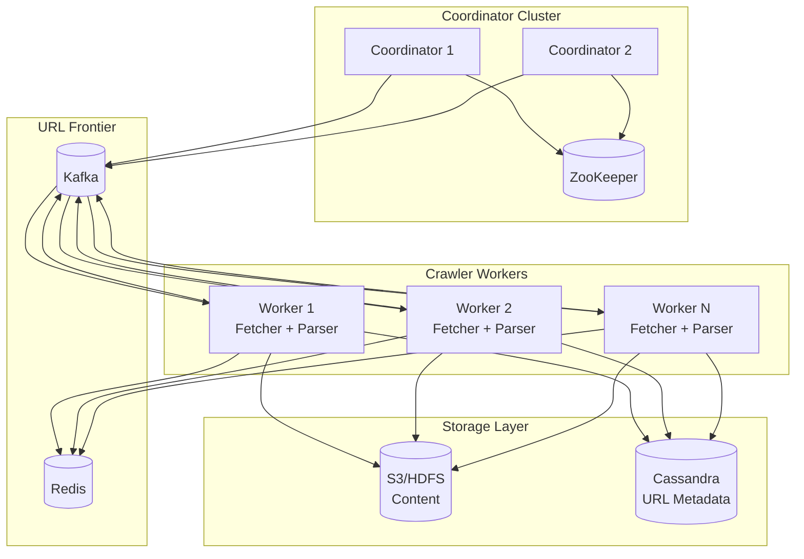

# Design a Web Crawler
{: .no_toc }

<details open markdown="block">
  <summary>Table of Contents</summary>
  {: .text-delta }
1. TOC
{:toc}
</details>

---

## What We're Building

A web crawler (also called a spider or bot) systematically browses the internet to discover and download web pages. It starts with a set of seed URLs, downloads their content, extracts new URLs from those pages, and continues recursively.

**Simple example:**
```
Start with: https://example.com
  → Download page
  → Extract links: /about, /products, /blog
  → Add to queue: example.com/about, example.com/products, example.com/blog
  → Download each, extract more links
  → Continue...
```

### Why Web Crawlers Matter

| Use Case | Description |
|----------|-------------|
| **Search engines** | Google, Bing crawl billions of pages to index |
| **SEO tools** | Ahrefs, Moz crawl to analyze backlinks |
| **Price monitoring** | Track competitor prices across e-commerce |
| **Content aggregation** | News aggregators collect articles |
| **Archiving** | Wayback Machine preserves the web |
| **Security scanning** | Find vulnerabilities across websites |
| **Research** | Collect datasets for ML, analytics |

### The Scale Challenge

| Crawler | Pages Crawled | Notes |
|---------|---------------|-------|
| **Googlebot** | Billions/day | Most comprehensive |
| **Bingbot** | Hundreds of millions/day | #2 search engine |
| **Common Crawl** | ~3 billion pages/month | Open dataset |

At this scale, a crawler must handle:
- **Billions of URLs** to track
- **Millions of concurrent connections**
- **Petabytes of storage**
- **Politeness** (don't overload servers)
- **Freshness** (re-crawl changed pages)
- **Deduplication** (same content, different URLs)

---

## Step 1: Requirements Clarification

### Questions to Ask

| Question | Why It Matters |
|----------|----------------|
| What's the purpose? | Search engine vs. monitoring vs. archiving |
| Scale? | 1000 pages vs. billions |
| Domains to crawl? | Single site vs. entire internet |
| Freshness requirements? | Real-time vs. weekly vs. never |
| Content types? | HTML only vs. PDFs, images, etc. |
| Politeness rules? | Respect robots.txt? Rate limits? |

### Functional Requirements

| Requirement | Priority | Description |
|-------------|----------|-------------|
| Crawl web pages from seed URLs | Must have | Core functionality |
| Extract and follow links | Must have | Discover new pages |
| Handle robots.txt | Must have | Respect site preferences |
| Store crawled content | Must have | For indexing/processing |
| Avoid duplicate crawling | Must have | Don't waste resources |
| Prioritize important pages | Nice to have | PageRank, freshness |
| Handle dynamic content (JS) | Nice to have | Single Page Apps |

### Non-Functional Requirements

| Requirement | Target | Rationale |
|-------------|--------|-----------|
| **Throughput** | 1,000+ pages/second | Crawl internet in reasonable time |
| **Scalability** | Horizontal | Add machines to crawl faster |
| **Politeness** | Respect robots.txt, rate limits | Don't get blocked, be ethical |
| **Robustness** | Handle failures gracefully | Web is messy |
| **Freshness** | Re-crawl based on change frequency | Keep index current |

### Scope for This Design

Let's design a **general-purpose web crawler** that can:
- Crawl the entire web (billions of pages)
- Process 1,000 pages/second
- Run continuously with periodic re-crawling
- Respect robots.txt and politeness

---

## Step 2: High-Level Architecture

### Core Components


### Crawl Workflow


---

## Step 3: Component Deep Dive

### 3.1 URL Frontier

The frontier manages the queue of URLs to crawl. It's not a simple FIFO queue—it must handle:
- **Prioritization:** Important pages first
- **Politeness:** Don't hammer same host
- **Freshness:** Re-crawl changed pages

**Architecture:**


**Implementation:**

```python
from dataclasses import dataclass
from typing import Dict, List, Optional
import heapq
import time
from urllib.parse import urlparse

@dataclass
class URLEntry:
    url: str
    priority: float
    depth: int
    discovered_at: float
    
    def __lt__(self, other):
        return self.priority > other.priority  # Higher priority first

class URLFrontier:
    def __init__(self, politeness_delay: float = 1.0):
        self.host_queues: Dict[str, List[URLEntry]] = {}
        self.host_last_access: Dict[str, float] = {}
        self.politeness_delay = politeness_delay
        self.hosts_ready: List[tuple] = []  # (next_access_time, host)
    
    def add_url(self, url: str, priority: float = 1.0, depth: int = 0):
        """Add URL to appropriate host queue."""
        host = urlparse(url).netloc
        
        if host not in self.host_queues:
            self.host_queues[host] = []
            # New host is immediately ready
            heapq.heappush(self.hosts_ready, (0, host))
        
        entry = URLEntry(
            url=url,
            priority=priority,
            depth=depth,
            discovered_at=time.time()
        )
        heapq.heappush(self.host_queues[host], entry)
    
    def get_next_url(self) -> Optional[str]:
        """Get next URL respecting politeness."""
        now = time.time()
        
        while self.hosts_ready:
            next_time, host = heapq.heappop(self.hosts_ready)
            
            if next_time > now:
                # No host is ready yet
                heapq.heappush(self.hosts_ready, (next_time, host))
                return None
            
            if host in self.host_queues and self.host_queues[host]:
                entry = heapq.heappop(self.host_queues[host])
                
                # Schedule next access for this host
                next_access = now + self.politeness_delay
                heapq.heappush(self.hosts_ready, (next_access, host))
                
                self.host_last_access[host] = now
                return entry.url
        
        return None
```

### 3.2 Politeness and robots.txt

**robots.txt** tells crawlers what they can/can't access:

```
# Example robots.txt
User-agent: *
Disallow: /private/
Disallow: /admin/
Crawl-delay: 10

User-agent: Googlebot
Allow: /
Crawl-delay: 1
```

**Implementation:**

```python
import urllib.robotparser
from functools import lru_cache
import asyncio
import aiohttp

class RobotsCache:
    def __init__(self, user_agent: str = "MyCrawler/1.0"):
        self.user_agent = user_agent
        self.cache: Dict[str, urllib.robotparser.RobotFileParser] = {}
        self.cache_ttl: Dict[str, float] = {}
        self.ttl = 3600  # Cache robots.txt for 1 hour
    
    async def fetch_robots(self, host: str) -> urllib.robotparser.RobotFileParser:
        """Fetch and parse robots.txt for a host."""
        robots_url = f"https://{host}/robots.txt"
        
        rp = urllib.robotparser.RobotFileParser()
        rp.set_url(robots_url)
        
        try:
            async with aiohttp.ClientSession() as session:
                async with session.get(robots_url, timeout=10) as response:
                    if response.status == 200:
                        content = await response.text()
                        rp.parse(content.splitlines())
                    else:
                        # No robots.txt = allow all
                        rp.parse([])
        except Exception:
            # Error fetching = allow all (fail open)
            rp.parse([])
        
        return rp
    
    async def can_fetch(self, url: str) -> bool:
        """Check if we're allowed to fetch this URL."""
        host = urlparse(url).netloc
        
        # Check cache
        now = time.time()
        if host in self.cache and self.cache_ttl.get(host, 0) > now:
            rp = self.cache[host]
        else:
            rp = await self.fetch_robots(host)
            self.cache[host] = rp
            self.cache_ttl[host] = now + self.ttl
        
        return rp.can_fetch(self.user_agent, url)
    
    def get_crawl_delay(self, host: str) -> float:
        """Get crawl delay for host."""
        if host in self.cache:
            delay = self.cache[host].crawl_delay(self.user_agent)
            return delay if delay else 1.0
        return 1.0  # Default 1 second
```

### 3.3 Fetcher

The fetcher downloads web pages. It must handle:
- **Concurrent connections:** Maximize throughput
- **Timeouts:** Don't wait forever
- **Retries:** Handle transient failures
- **HTTP headers:** Set User-Agent, handle redirects

**Implementation:**

```python
import aiohttp
import asyncio
from dataclasses import dataclass
from typing import Optional
import hashlib

@dataclass
class FetchResult:
    url: str
    final_url: str  # After redirects
    status_code: int
    content_type: str
    content: bytes
    content_hash: str
    headers: dict
    fetch_time: float

class AsyncFetcher:
    def __init__(self, 
                 user_agent: str = "MyCrawler/1.0",
                 timeout: int = 30,
                 max_size: int = 10 * 1024 * 1024):  # 10MB
        self.user_agent = user_agent
        self.timeout = aiohttp.ClientTimeout(total=timeout)
        self.max_size = max_size
        
        self.headers = {
            "User-Agent": user_agent,
            "Accept": "text/html,application/xhtml+xml",
            "Accept-Language": "en-US,en;q=0.9",
            "Accept-Encoding": "gzip, deflate",
        }
    
    async def fetch(self, url: str) -> Optional[FetchResult]:
        """Fetch a URL and return content."""
        start_time = time.time()
        
        try:
            async with aiohttp.ClientSession(
                timeout=self.timeout,
                headers=self.headers
            ) as session:
                async with session.get(
                    url, 
                    allow_redirects=True,
                    max_redirects=5
                ) as response:
                    # Check content type
                    content_type = response.headers.get("Content-Type", "")
                    if not self._should_process(content_type):
                        return None
                    
                    # Check content length
                    content_length = response.headers.get("Content-Length")
                    if content_length and int(content_length) > self.max_size:
                        return None
                    
                    # Read content with size limit
                    content = await response.content.read(self.max_size)
                    
                    return FetchResult(
                        url=url,
                        final_url=str(response.url),
                        status_code=response.status,
                        content_type=content_type,
                        content=content,
                        content_hash=hashlib.sha256(content).hexdigest(),
                        headers=dict(response.headers),
                        fetch_time=time.time() - start_time
                    )
        
        except asyncio.TimeoutError:
            logger.warning(f"Timeout fetching {url}")
            return None
        except aiohttp.ClientError as e:
            logger.warning(f"Error fetching {url}: {e}")
            return None
    
    def _should_process(self, content_type: str) -> bool:
        """Check if we should process this content type."""
        allowed = ["text/html", "application/xhtml+xml"]
        return any(ct in content_type for ct in allowed)
```

### 3.4 Parser

The parser extracts information from HTML:
- **Links:** For further crawling
- **Text content:** For indexing
- **Metadata:** Title, description, etc.

**Implementation:**

```python
from bs4 import BeautifulSoup
from urllib.parse import urljoin, urlparse
from dataclasses import dataclass
from typing import List, Set

@dataclass
class ParseResult:
    url: str
    title: str
    text: str
    links: List[str]
    metadata: dict

class HTMLParser:
    def __init__(self, allowed_domains: Set[str] = None):
        self.allowed_domains = allowed_domains
    
    def parse(self, url: str, html_content: bytes) -> ParseResult:
        """Parse HTML and extract content and links."""
        try:
            soup = BeautifulSoup(html_content, 'lxml')
        except Exception:
            soup = BeautifulSoup(html_content, 'html.parser')
        
        # Remove script and style elements
        for element in soup(['script', 'style', 'nav', 'footer', 'header']):
            element.decompose()
        
        # Extract title
        title = ""
        if soup.title:
            title = soup.title.string or ""
        
        # Extract text
        text = soup.get_text(separator=' ', strip=True)
        
        # Extract links
        links = self._extract_links(url, soup)
        
        # Extract metadata
        metadata = self._extract_metadata(soup)
        
        return ParseResult(
            url=url,
            title=title.strip(),
            text=text,
            links=links,
            metadata=metadata
        )
    
    def _extract_links(self, base_url: str, soup: BeautifulSoup) -> List[str]:
        """Extract and normalize links."""
        links = []
        
        for a_tag in soup.find_all('a', href=True):
            href = a_tag['href']
            
            # Skip certain links
            if href.startswith(('#', 'javascript:', 'mailto:', 'tel:')):
                continue
            
            # Convert to absolute URL
            absolute_url = urljoin(base_url, href)
            
            # Normalize
            normalized = self._normalize_url(absolute_url)
            if normalized:
                links.append(normalized)
        
        return list(set(links))  # Deduplicate
    
    def _normalize_url(self, url: str) -> Optional[str]:
        """Normalize URL for consistency."""
        try:
            parsed = urlparse(url)
            
            # Only HTTP(S)
            if parsed.scheme not in ('http', 'https'):
                return None
            
            # Check domain filter
            if self.allowed_domains:
                if parsed.netloc not in self.allowed_domains:
                    return None
            
            # Remove fragment
            normalized = f"{parsed.scheme}://{parsed.netloc}{parsed.path}"
            
            # Add query if present
            if parsed.query:
                normalized += f"?{parsed.query}"
            
            # Remove trailing slash for consistency
            normalized = normalized.rstrip('/')
            
            return normalized
        except Exception:
            return None
    
    def _extract_metadata(self, soup: BeautifulSoup) -> dict:
        """Extract meta tags."""
        metadata = {}
        
        for meta in soup.find_all('meta'):
            name = meta.get('name', meta.get('property', ''))
            content = meta.get('content', '')
            
            if name and content:
                metadata[name] = content
        
        return metadata
```

### 3.5 Deduplication

Avoid crawling the same content twice:
- **URL deduplication:** Same URL seen before
- **Content deduplication:** Same content, different URL

**URL Bloom Filter:**

```python
from bitarray import bitarray
import mmh3

class BloomFilter:
    """Memory-efficient probabilistic set membership."""
    
    def __init__(self, expected_items: int, false_positive_rate: float = 0.01):
        # Calculate optimal size and hash count
        self.size = self._optimal_size(expected_items, false_positive_rate)
        self.hash_count = self._optimal_hash_count(self.size, expected_items)
        self.bit_array = bitarray(self.size)
        self.bit_array.setall(0)
    
    def _optimal_size(self, n: int, p: float) -> int:
        """Calculate optimal bit array size."""
        import math
        return int(-n * math.log(p) / (math.log(2) ** 2))
    
    def _optimal_hash_count(self, m: int, n: int) -> int:
        """Calculate optimal number of hash functions."""
        import math
        return max(1, int(m / n * math.log(2)))
    
    def _get_hash_values(self, item: str) -> List[int]:
        """Generate hash values for item."""
        hashes = []
        for i in range(self.hash_count):
            hash_val = mmh3.hash(item, i) % self.size
            hashes.append(hash_val)
        return hashes
    
    def add(self, item: str):
        """Add item to bloom filter."""
        for hash_val in self._get_hash_values(item):
            self.bit_array[hash_val] = 1
    
    def might_contain(self, item: str) -> bool:
        """Check if item might be in set (can have false positives)."""
        return all(
            self.bit_array[hash_val] 
            for hash_val in self._get_hash_values(item)
        )

class URLDeduplicator:
    def __init__(self, expected_urls: int = 1_000_000_000):
        # For 1 billion URLs with 1% FP rate = ~1.2GB memory
        self.bloom = BloomFilter(expected_urls, 0.01)
        self.seen_count = 0
    
    def is_new(self, url: str) -> bool:
        """Check if URL is new (not seen before)."""
        normalized = self._normalize(url)
        
        if self.bloom.might_contain(normalized):
            return False
        
        self.bloom.add(normalized)
        self.seen_count += 1
        return True
    
    def _normalize(self, url: str) -> str:
        """Normalize URL for deduplication."""
        # Remove common tracking parameters
        parsed = urlparse(url)
        # ... normalization logic
        return url.lower()
```

**Content Fingerprinting (SimHash):**

For detecting near-duplicate content:

```python
import simhash

class ContentDeduplicator:
    def __init__(self, threshold: int = 3):
        self.threshold = threshold
        self.fingerprints: Dict[int, str] = {}
    
    def get_fingerprint(self, text: str) -> int:
        """Generate simhash fingerprint for text."""
        return simhash.Simhash(text).value
    
    def is_duplicate(self, text: str) -> Optional[str]:
        """Check if content is duplicate of existing page."""
        fp = self.get_fingerprint(text)
        
        for existing_fp, url in self.fingerprints.items():
            distance = self._hamming_distance(fp, existing_fp)
            if distance <= self.threshold:
                return url  # Return URL of duplicate
        
        return None
    
    def add(self, text: str, url: str):
        """Add content fingerprint."""
        fp = self.get_fingerprint(text)
        self.fingerprints[fp] = url
    
    def _hamming_distance(self, a: int, b: int) -> int:
        """Count differing bits between two integers."""
        return bin(a ^ b).count('1')
```

### 3.6 DNS Resolution

DNS resolution can be a bottleneck. Cache results:

```python
import socket
import time
from typing import Dict, Tuple
import asyncio

class DNSCache:
    def __init__(self, ttl: int = 3600):
        self.cache: Dict[str, Tuple[str, float]] = {}
        self.ttl = ttl
    
    async def resolve(self, hostname: str) -> Optional[str]:
        """Resolve hostname to IP, with caching."""
        now = time.time()
        
        # Check cache
        if hostname in self.cache:
            ip, expiry = self.cache[hostname]
            if expiry > now:
                return ip
        
        # Resolve
        try:
            loop = asyncio.get_event_loop()
            result = await loop.getaddrinfo(
                hostname, None, 
                family=socket.AF_INET,
                type=socket.SOCK_STREAM
            )
            ip = result[0][4][0]
            
            # Cache
            self.cache[hostname] = (ip, now + self.ttl)
            return ip
        except socket.gaierror:
            return None
```

---

## Step 4: Distributed Architecture

For crawling billions of pages, we need a distributed system.

### Architecture



### URL Distribution Strategy

Use consistent hashing to assign URLs to workers:

```python
import hashlib

class URLDistributor:
    def __init__(self, num_workers: int):
        self.num_workers = num_workers
    
    def get_worker(self, url: str) -> int:
        """Determine which worker should handle this URL."""
        # Hash by domain for politeness locality
        domain = urlparse(url).netloc
        hash_val = int(hashlib.md5(domain.encode()).hexdigest(), 16)
        return hash_val % self.num_workers
```

**Why hash by domain?**
- Same domain → same worker
- Easier to enforce politeness (one worker per domain)
- Better connection reuse

### Kafka for URL Queue

```python
from kafka import KafkaProducer, KafkaConsumer

class DistributedFrontier:
    def __init__(self, num_partitions: int):
        self.producer = KafkaProducer(
            bootstrap_servers=['kafka:9092'],
            value_serializer=lambda v: json.dumps(v).encode()
        )
        
        self.consumer = KafkaConsumer(
            'url-frontier',
            group_id='crawlers',
            bootstrap_servers=['kafka:9092'],
            value_deserializer=lambda m: json.loads(m.decode())
        )
        
        self.num_partitions = num_partitions
    
    def add_url(self, url: str, priority: float):
        """Add URL to frontier."""
        domain = urlparse(url).netloc
        partition = self._get_partition(domain)
        
        self.producer.send(
            'url-frontier',
            key=domain.encode(),
            value={'url': url, 'priority': priority},
            partition=partition
        )
    
    def _get_partition(self, domain: str) -> int:
        """Assign domain to partition."""
        return hash(domain) % self.num_partitions
```

### Handling Failures

```python
class CrawlWorker:
    def __init__(self):
        self.fetcher = AsyncFetcher()
        self.parser = HTMLParser()
        self.retry_queue = []
        self.max_retries = 3
    
    async def process_url(self, url: str, retry_count: int = 0):
        """Process URL with retry logic."""
        try:
            result = await self.fetcher.fetch(url)
            
            if result is None:
                return
            
            if result.status_code == 200:
                await self.handle_success(url, result)
            elif result.status_code in (301, 302):
                await self.handle_redirect(url, result)
            elif result.status_code == 429:
                await self.handle_rate_limit(url)
            elif result.status_code >= 500:
                await self.handle_server_error(url, retry_count)
        
        except Exception as e:
            logger.error(f"Error processing {url}: {e}")
            if retry_count < self.max_retries:
                await self.schedule_retry(url, retry_count + 1)
    
    async def handle_server_error(self, url: str, retry_count: int):
        """Retry with exponential backoff."""
        if retry_count < self.max_retries:
            delay = 2 ** retry_count  # 1, 2, 4 seconds
            await asyncio.sleep(delay)
            await self.schedule_retry(url, retry_count + 1)
```

---

## Step 5: Freshness and Re-crawling

Not all pages change at the same rate. Prioritize re-crawling accordingly.

### Change Detection

```python
from datetime import datetime, timedelta

class FreshnessManager:
    def __init__(self):
        self.change_history: Dict[str, List[datetime]] = {}
    
    def record_change(self, url: str, changed: bool):
        """Record whether page changed since last crawl."""
        if url not in self.change_history:
            self.change_history[url] = []
        
        if changed:
            self.change_history[url].append(datetime.now())
    
    def estimate_change_frequency(self, url: str) -> timedelta:
        """Estimate how often this page changes."""
        history = self.change_history.get(url, [])
        
        if len(history) < 2:
            return timedelta(days=7)  # Default: weekly
        
        # Calculate average time between changes
        intervals = [
            history[i] - history[i-1] 
            for i in range(1, len(history))
        ]
        avg_interval = sum(intervals, timedelta()) / len(intervals)
        
        return avg_interval
    
    def calculate_recrawl_priority(self, url: str, last_crawl: datetime) -> float:
        """Calculate priority for re-crawling."""
        expected_change = self.estimate_change_frequency(url)
        time_since_crawl = datetime.now() - last_crawl
        
        # Higher priority if we're overdue for a crawl
        return time_since_crawl / expected_change
```

### ETags and Conditional Requests

Use HTTP headers to detect changes without downloading:

```python
async def fetch_if_modified(self, url: str, etag: str = None, 
                            last_modified: str = None) -> Optional[FetchResult]:
    """Fetch only if content changed."""
    headers = dict(self.headers)
    
    if etag:
        headers["If-None-Match"] = etag
    if last_modified:
        headers["If-Modified-Since"] = last_modified
    
    async with aiohttp.ClientSession() as session:
        async with session.get(url, headers=headers) as response:
            if response.status == 304:
                # Not modified
                return None
            
            # Content changed, process as usual
            return await self._process_response(url, response)
```

---

## Step 6: Handling JavaScript-Rendered Content

Modern sites use JavaScript to render content. Options:

### Option 1: Headless Browser

```python
from playwright.async_api import async_playwright

class JavaScriptRenderer:
    def __init__(self):
        self.playwright = None
        self.browser = None
    
    async def start(self):
        """Initialize headless browser."""
        self.playwright = await async_playwright().start()
        self.browser = await self.playwright.chromium.launch(
            headless=True,
            args=['--no-sandbox', '--disable-dev-shm-usage']
        )
    
    async def render(self, url: str, wait_time: int = 5) -> str:
        """Render page with JavaScript."""
        page = await self.browser.new_page()
        
        try:
            await page.goto(url, wait_until='networkidle')
            await page.wait_for_timeout(wait_time * 1000)
            
            content = await page.content()
            return content
        finally:
            await page.close()
    
    async def stop(self):
        """Cleanup."""
        if self.browser:
            await self.browser.close()
        if self.playwright:
            await self.playwright.stop()
```

**Trade-offs:**

| Approach | Speed | Resource Usage | Coverage |
|----------|-------|----------------|----------|
| HTTP fetch | Fast | Low | Static content only |
| Headless browser | Slow (5-10s) | High | Full JS rendering |

**Recommendation:** Use HTTP fetch by default, headless browser for known JS-heavy sites.

### Option 2: Prerendering Services

- Use services like Prerender.io or Rendertron
- They cache rendered pages
- Reduces load on your infrastructure

---

## Step 7: Storage Design

### Content Storage

Store raw HTML in object storage:

```python
import boto3
import gzip

class ContentStore:
    def __init__(self, bucket: str):
        self.s3 = boto3.client('s3')
        self.bucket = bucket
    
    def store(self, url: str, content: bytes, metadata: dict) -> str:
        """Store crawled content."""
        # Generate key from URL hash
        url_hash = hashlib.sha256(url.encode()).hexdigest()
        key = f"crawl/{url_hash[:2]}/{url_hash[2:4]}/{url_hash}"
        
        # Compress content
        compressed = gzip.compress(content)
        
        self.s3.put_object(
            Bucket=self.bucket,
            Key=key,
            Body=compressed,
            Metadata={
                'url': url,
                'content-encoding': 'gzip',
                **metadata
            }
        )
        
        return key
    
    def retrieve(self, key: str) -> bytes:
        """Retrieve stored content."""
        response = self.s3.get_object(Bucket=self.bucket, Key=key)
        compressed = response['Body'].read()
        return gzip.decompress(compressed)
```

### URL Metadata Storage

Use Cassandra for URL metadata (billions of rows):

```python
from cassandra.cluster import Cluster

class URLMetadataStore:
    def __init__(self, keyspace: str):
        self.cluster = Cluster(['cassandra1', 'cassandra2', 'cassandra3'])
        self.session = self.cluster.connect(keyspace)
        
        # Prepared statements
        self.insert_stmt = self.session.prepare("""
            INSERT INTO urls (url_hash, url, last_crawl, content_hash, 
                              etag, status_code, crawl_count)
            VALUES (?, ?, ?, ?, ?, ?, ?)
        """)
        
        self.get_stmt = self.session.prepare("""
            SELECT * FROM urls WHERE url_hash = ?
        """)
    
    def save(self, url: str, crawl_result: dict):
        """Save URL metadata."""
        url_hash = hashlib.sha256(url.encode()).hexdigest()
        
        self.session.execute(self.insert_stmt, (
            url_hash,
            url,
            datetime.now(),
            crawl_result.get('content_hash'),
            crawl_result.get('etag'),
            crawl_result.get('status_code'),
            crawl_result.get('crawl_count', 1)
        ))
    
    def get(self, url: str) -> Optional[dict]:
        """Get URL metadata."""
        url_hash = hashlib.sha256(url.encode()).hexdigest()
        row = self.session.execute(self.get_stmt, (url_hash,)).one()
        return dict(row._asdict()) if row else None
```

---

## Step 8: Monitoring and Metrics

### Key Metrics

| Metric | Description | Alert Threshold |
|--------|-------------|-----------------|
| `pages_crawled_per_second` | Throughput | Drop > 20% |
| `crawl_error_rate` | Failed fetches | > 5% |
| `queue_depth` | URLs waiting | Growing consistently |
| `avg_fetch_latency` | Time to download | > 5s |
| `robots_blocked_rate` | Blocked by robots.txt | - |
| `duplicate_rate` | Already-seen URLs | - |

### Implementation

```python
import prometheus_client as prom

# Metrics
pages_crawled = prom.Counter(
    'crawler_pages_total',
    'Total pages crawled',
    ['status']
)

fetch_latency = prom.Histogram(
    'crawler_fetch_latency_seconds',
    'Time to fetch pages',
    buckets=[0.1, 0.5, 1, 2, 5, 10, 30]
)

queue_depth = prom.Gauge(
    'crawler_queue_depth',
    'URLs in queue'
)

# Usage
@fetch_latency.time()
async def fetch_page(url: str):
    result = await fetcher.fetch(url)
    pages_crawled.labels(status=result.status_code).inc()
    return result
```

---

## Interview Checklist

- [ ] **Clarified requirements** (purpose, scale, scope)
- [ ] **Explained components** (frontier, fetcher, parser, dedup)
- [ ] **Discussed politeness** (robots.txt, rate limiting)
- [ ] **Covered deduplication** (URL bloom filter, content fingerprinting)
- [ ] **Addressed distribution** (partitioning, worker assignment)
- [ ] **Mentioned freshness** (re-crawling strategy)
- [ ] **Discussed storage** (content store, URL metadata)
- [ ] **Covered failure handling** (retries, timeouts)
- [ ] **Mentioned monitoring** (throughput, errors)

---

## Sample Interview Dialogue

**Interviewer:** "Design a web crawler."

**You:** "Interesting! Let me clarify a few things. What's the purpose—are we building a search engine crawler or something more focused? And what's the scale—thousands of pages or billions?"

**Interviewer:** "Let's say we're building a general web crawler for a search engine, targeting billions of pages."

**You:** "Got it. At that scale, we need a distributed system. Let me walk through the main components.

The core is the URL Frontier—it's not just a queue but a prioritized, politeness-aware system. We need to ensure we don't overwhelm any single website while maximizing overall throughput.

For politeness, we respect robots.txt and maintain per-host rate limits. I'd organize the frontier as per-host queues with a round-robin selector, so we spread requests across many hosts.

For scale, we'd partition the work by domain—hash each domain to a worker. This keeps politeness enforcement local to each worker and enables connection reuse.

Deduplication is critical at this scale. I'd use a Bloom filter for URL deduplication—for a billion URLs with 1% false positive rate, that's about 1.2GB of memory. For content deduplication, we'd use SimHash to detect near-duplicates.

Want me to dive deeper into any component?"

---

## Summary

| Component | Technology | Rationale |
|-----------|------------|-----------|
| **URL Frontier** | Kafka + Redis | Distributed queue with prioritization |
| **Politeness** | Per-host queues | Respect rate limits |
| **Fetching** | aiohttp | Async, high concurrency |
| **Deduplication** | Bloom filter + SimHash | Memory-efficient |
| **Content Storage** | S3/HDFS | Scalable object storage |
| **Metadata** | Cassandra | Billions of rows, fast writes |
| **Coordination** | ZooKeeper | Leader election, config |

A web crawler at scale is a fascinating distributed systems problem. The key challenges are politeness, deduplication, and freshness—and each requires careful design to handle billions of pages efficiently.

